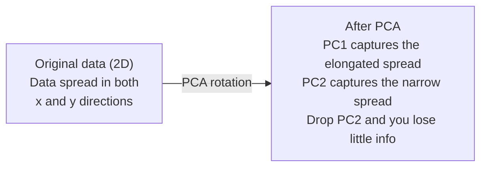

# Reducción de dimensiones 降维

> Los datos de alta dimensión tienen estructura. Se encuentran mirando desde el ángulo correcto.
> Alta dimensión de datos tiene estructura.

**Type:** Build | **类型:** 动手
**Language:**¿ Qué pasa ?**语言:**Python
**Prerequisites:** Phase 1, Lessons 01 (Linear Algebra Intuition), 02 (Vectors, Matrices & Operations), 03 (Eigenvalues & Eigenvectors), 06 (Probability & Distributions) | **前置知识:** Phase 1, Lessons 01-03, 06
**Time:** ~90 minutes | **时间:** ~90 分钟

## Objetivos de aprendizaje

- Implementar PCA desde cero: datos centrales, calcular la matriz de covarianza, componer el propio y el proyecto
  Desde la implementación de PCA: centralización de datos, cálculo de la cuadrícula de diferencia, desglose de características, proyección
- Utilice el ratio de varianza explicado y el método del codo para elegir el número de componentes principales
  Uso de la explicación de la diferencia y el código de la elección de la cantidad de componentes principales
- Comparar PCA, t-SNE y UMAP para visualizar los dígitos MNIST en 2D y explicar sus compensaciones
  Comparar PCA ̊t-SNE y UMAP en MNIST Manual Digital 2D
- Aplicar el PCA del núcleo con un núcleo RBF para separar estructuras de datos no lineales que el PCA estándar no puede manejar
   aplicación con RBF  núcleo de PCA nuclear  separación de PCA estándar  estructura de datos no lineal que no puede procesarse

> **【中文解读】**
> 784 维的手写数字数据无法可视化――降维就是找到"最佳角度"投影数据, con la menor dimensión posible de conservar la mayor cantidad posible de información――PCA es el método de降维最经典, t-SNE和 UMAP 适合非线性数据的可视化――

> **【拓展：降维在 AI 中的位置】**
> - **PCA**: sklearn de `PCA`, los pasos estándar de procesamiento de datos, también es la mejor práctica de entender la descomposición de características de valor.
> - **t-SNE/UMAP**El estudio de la tecnología de la información de la información de la información de la información de la información de la información de la información de la información de la información de la información de la información de la información de la información de la información de la información de la información de la información de la información de la información de la información de la información de la información de la información de la información de la información de la información de la información de la información de la información de la información de la información de la información de la información de la información de la información de la información de la información de la información de la información de la información de la información de la información de la información de la información de la información de la información de la información de la información de la información de la información de la información de la información de la información de la información de la información de la información de la información de la información de la información de la información de la información de la información de la información de la información de la información de la información de la información de la información de la información de la información de la información de la información de la información de la información de la información de la información de la información de la información de la información de la información de la información de la información de la información de la información de la información de la información de la información de la información de la información de la información de la información de la información de la información de la información de la información de la información de la información de la información de la información de la información de la información de la información de la información de la información de la información de la información de la información de la información de la información de la información de la información de la información de la información de la información de la información de la información de la información de la información de la información de la información de la que se trata sobre.
> - **推荐系统**La base de la información es la información que se ofrece a los usuarios.

## El problema es la introducción del problema

> **【中文解读】**784 dimensiones de escritura digital datos ((28×28 像素) no se pueden visualizar, ni entender de forma directa. Pero la mayor parte de ellos son redundantes.

Tal vez son valores de píxeles de dígitos escritos a mano. Tal vez son niveles de expresión génica. Tal vez son señales de comportamiento del usuario. No se pueden visualizar 784 dimensiones. No se pueden trazar. Ni siquiera se puede pensar en ellos.
> Tal vez sea el valor de la imagen de un número escrito a mano, tal vez sea el nivel de expresión genética, tal vez sea el comportamiento del usuario.

Pero la mayoría de esas características del 784 son redundantes. La información real vive en una superficie mucho más pequeña. Una "7" escrita a mano no necesita 784 números independientes para describirla. Necesita algunos: el ángulo del golpe, la longitud de la barra cruzada, cuánto se inclina. El resto es ruido.
> Pero la mayor parte de estas 784 características son redundantes. La información realmente útil existe en una superficie más pequeña. Un "7" escrito a mano no necesita 784 números independientes para describirlo, solo necesita varios: ángulo de pintura, longitud y inclinación de la línea.

La reducción de dimensiones encuentra esa superficie más pequeña toma sus datos 784 dimensiones y los comprime a 2, 10 o 50 dimensiones manteniendo la estructura que importa.
> 降维找到那个更小的面──它将784 维数据压缩到2、10或50 维, al tiempo que mantiene una estructura significativa──

## El concepto central.

> **【拓展：PCA 与 LoRA 的数学联系】**PCA encuentra la mayor dirección de diferencia entre los datos en la estructura principal), que es la misma que LoRA 微调的核心思想:权重更新 ΔW的有效信息集中在少数几个方向上.

### La maldición de la dimensionalidad.

Los espacios de alta dimensión no son intuitivos. Tres cosas se rompen a medida que las dimensiones crecen.
> El espacio de alta dimensión se viola a la instinción.

**Distance becomes meaningless.**En dimensiones altas, la distancia entre cualquier dos puntos aleatorios converge al mismo valor. Si cada punto es aproximadamente la misma distancia de cada otro punto, la búsqueda del vecino más cercano deja de funcionar.
> **距离变得无意义。**En el alto, la distancia entre cualquier dos puntos aleatorios se acerca al mismo valor. Si cada punto a todos los demás puntos se encuentra a la misma distancia, la búsqueda de vecino cercano se pierde.

```
Dimension    Avg distance ratio (max/min between random points)
2            ~5.0
10           ~1.8
100          ~1.2
1000         ~1.02
```

**Volume concentrates in corners.**En 100 dimensiones, casi todo el volumen está en las esquinas, lejos del centro.
> **体积集中在角落。**En 100 dimensiones, casi todo el volumen está en un rincón, lejos del centro.

**You need exponentially more data.**Para mantener la misma densidad de muestras en un espacio, pasar de 2D a 20D significa que necesitas 10 veces 18 veces más datos. Nunca tienes suficiente. Reducir las dimensiones trae la densidad de datos de vuelta a algo viable.
> **需要指数级更多的数据。**De 2D a 20D, para mantener la misma densidad de muestras, se requiere 10^18 veces más de datos.

### PCA: encontrar las direcciones que importan

El análisis de componentes principales (PCA) encuentra los ejes a lo largo de los cuales sus datos varían más.
> El análisis de componentes principales (PCA) encuentra el eje máximo de variación de datos.

El algoritmo:
  算法步骤:

```
1. Center the data        (subtract the mean from each feature) / 数据中心化
2. Compute covariance     (how features move together) / 计算协方差
3. Eigendecomposition     (find the principal directions) / 特征值分解
4. Sort by eigenvalue     (biggest variance first) / 按特征值排序
5. Project               (keep top k eigenvectors, drop the rest) / 投影
```

La matriz de covarianza es simétrica y semi-definida positiva. Sus propios vectores son direcciones ortogonales en el espacio de características. Los valores propios le dicen cuánto variación capta cada dirección. El propio vector con los puntos de valor propio más grandes a lo largo de la dirección de la variación máxima.
> ¿Por qué se descompone el valor de las características? La matriz de diferencia de las características es la de la posición media definida. Su potencia de las características es la de la posición de la posición en el espacio de las características. El valor de las características le dice en cada dirección cuánta diferencia de las características se capta. El valor de la característica más grande de la relación se dirige a la dirección de la diferencia de las características más grande.



- **Before PCA:**Nube de datos se distribuye diagonalmente a través de los ejes x y y
  **PCA 前：**Datos de la nube en la dirección de la esquina transversal x y y 轴
- **After PCA:**El sistema de coordenadas se rota para que el PC1 se alinee con la dirección de la varianza máxima (esparcimiento prolongado) y el PC2 con la dirección de la varianza mínima (esparcimiento estrecho).
  **PCA 后：**坐标系旋转,PC1 a la mayor dirección de la cuadrícula,PC2 a la menor dirección de la cuadrícula
- **Dimensionality reduction:**Al dejar caer PC2 proyecta los datos en PC1, perdiendo muy poca información
  **降维：** Perder PC2 proyectar datos a PC1 en la parte superior, pérdida de poca información

### La proporción de variación explicada es diferente.

Cada componente principal capta una fracción de la varianza total.
> Cada componente principal es parte de la diferencia de captura.

```
Component    Eigenvalue    Explained ratio    Cumulative
PC1          4.73          0.473              0.473
PC2          2.51          0.251              0.724
PC3          1.12          0.112              0.836
PC4          0.89          0.089              0.925
...
```

Cuando la varianza explicada acumulativa alcanza 0,95, se sabe que muchos componentes capturan el 95% de la información.
> Cuando el diferencial de explicación acumulado alcanza 0,95, estos componentes capturan el 95% de la información.

### Elegir el número de componentes  选择成分数

Tres estrategias:
  Tres estrategias:

1. **Threshold.**Mantenga suficientes componentes para explicar el 90-95% de la variación.
   **阈值法。**Mantener suficiente ingrediente para explicar el 90-95% de la diferencia.
2. **Elbow method.**La trama explicó la variación por componente.
   **肘部法则。** dibujar cada componente de la explicación, buscar puntos de precipitación.
3. **Downstream performance.**Utilice PCA como preprocesamiento.
   **下游性能。**Capacitar el PCA como preprocesamiento.

### Conservar los barrios.

t-Distributed Stochastic Neighbor Embedding (t-SNE) está diseñado para la visualización. Mapea datos de alta dimensión en 2D (o 3D) mientras conserva qué puntos están cerca uno del otro.
> t-SNE 专为可视化设计──将高维数据映射到2D((或3D), mientras que conserva los puntos cercanos entre sí──

La intuición: en el espacio original, calcular una distribución de probabilidad sobre pares de puntos basados en sus distancias. Los puntos cercanos obtienen una probabilidad alta. Los puntos lejanos obtienen una probabilidad baja. Luego encontrar un arreglo 2D donde la misma distribución de probabilidad se mantiene. Los puntos que eran vecinos en 784 dimensiones permanecen vecinos en 2D.
> 直觉: en el espacio primitivo, la distribución de probabilidad entre puntos calculados en base a la distancia. La probabilidad de puntos cercanos es alta, la probabilidad de puntos lejanos baja. Luego se encuentra una distribución de probabilidad en 2D que hace que el vecino en 784 dimensiones sea vecino en 2D.

Propiedades clave de t-SNE:
  Características clave de t-SNE:

- No lineal, puede desarrollar variedades complejas que PCA no puede.
  Inlinear. Puede desarrollar PCA.
- Las diferentes carreras producen diferentes diseños.
  随机性── diferentes operaciones producen diferentes estructuras──
- El parámetro de perplejidad controla cuántos vecinos debe considerar (rango típico: 5-50).
  Perplejidad 参数控制考虑多少邻居 (títpico rango: 5-50)
- Las distancias entre los grupos en la salida no son significativas.
   La distancia entre los grupos de producción no tiene sentido sólo los grupos en sí mismos tienen sentido
- Lento en conjuntos de datos grandes.
  El gran grupo de datos se encuentra en el centro de la ciudad.

### Una mejor estructura global y más rápida.

La aproximación y proyección de manifiesto uniforme (UMAP) funciona de manera similar a t-SNE pero con dos ventajas:
> La UMAP es similar a la T-SNE, pero tiene dos ventajas:

- Utiliza gráficos aproximados de vecino más cercano en lugar de calcular todas las distancias en pares.
  Más rápido: utilizar el cuadro de proximidad más que el cuadro de distancia.
- Mejor estructura global: las posiciones relativas de los grupos en la producción tienden a ser más significativas que en el T-SNE.
  Mejor estructura general. Más significativos que t-SNE.

UMAP construye un gráfico ponderado en el espacio de alta dimensión (la "representación topológica confusa") y luego encuentra un diseño de baja dimensión que preserva este gráfico lo mejor posible.
> UMAP en el espacio alto construye más gráficos, y luego encuentra lo posible para conservar el gráfico bajo.

Parámetros clave:
  关键参数:

- `n_neighbors`En el caso de los países vecinos, la mayor parte de los países vecinos tienen una estructura global más elevada.
  `n_neighbors`:Cuánto vecindario define la estructura local(similar a la perplejidad)。
- `min_dist`Los valores más bajos crean grupos más densos.
  `min_dist`: la densidad de los puntos de salida de la central.

### ¿Cuándo usar qué? ¿Cuál método usar?

| Method / 方法 | Use case / 使用场景 | Preserves / 保留 | Speed / 速度 |
|--------|----------|-----------|-------|
| PCA | Preprocessing before training / 训练前预处理 | Global variance / 全局方差 | Fast (exact), works on millions of samples / 快速（精确），支持百万级样本 |
| PCA | Quick exploratory visualization / 快速探索性可视化 | Linear structure / 线性结构 | Fast / 快 |
| t-SNE | Publication-quality 2D plots / 发表级 2D 图 | Local neighborhoods / 局部邻域 | Slow (< 10k samples ideal) / 慢（<1万样本最佳） |
| UMAP | 2D visualization at scale / 大规模 2D 可视化 | Local + some global structure / 局部+部分全局结构 | Medium (handles millions) / 中等（支持百万级） |
| PCA | Feature reduction for models / 模型特征降维 | Variance-ranked features / 方差排序特征 | Fast / 快 |
| t-SNE / UMAP | Understanding cluster structure / 理解聚类结构 | Cluster separation / 聚类分离 | Medium to slow / 中等到慢 |

Regla de oro: utilizar PCA para el preprocesamiento y compresión de datos. utilizar t-SNE o UMAP cuando se necesita visualizar la estructura en 2D.
> 經驗法则:PCA se utiliza para el preprocesamiento y compresión de datos.

### El núcleo PCA .

El PCA estándar encuentra subespacios lineales. Rota su sistema de coordenadas y deja caer los ejes. Pero ¿qué pasa si los datos se encuentran en un colector no lineal? Un círculo en 2D no puede ser separado por ninguna línea.
> 标准PCA 找线性子空间―― pero si los datos se encuentran en forma de flujo no lineal, ¿el círculo en la 2D no puede ser separado de ninguna línea directa―标准PCA 无能为力―

El núcleo PCA aplica PCA en un espacio de características de alta dimensión inducido por una función del núcleo, sin calcular explícitamente las coordenadas en ese espacio. Este es el truco del núcleo - la misma idea detrás de SVMs.
>  PCA nuclear se aplica en el espacio de altas características inducidas por la función nuclear, sin calcular claramente los estándares en ese espacio.

El algoritmo:
  算法步骤:

1. Computa la matriz del núcleo K donde K_ij = k(x_i, x_j)
   计算核矩阵 K, de los cuales K_ij = k(x_i, x_j)
2. Centrar la matriz del núcleo en el espacio de características
   En el espacio característico
3. Eigendecompose la matriz del núcleo centrado
   Descomposición de valores de la matriz central
4. Los vectores propios superiores (escalados por 1/sqrt(valor propio)) son las proyecciones
   顶部特征向量 (en), es decir, para proyectar

Funciones comunes del núcleo:
  常见核函数:

| Kernel / 核函数 | Formula / 公式 | Good for / 适用于 |
|--------|---------|----------|
| RBF (Gaussian) | exp(-gamma * \|\|x - y\|\|^2) | Most nonlinear data, smooth manifolds / 大多数非线性数据，光滑流形 |
| Polynomial / 多项式 | (x . y + c)^d | Polynomial relationships / 多项式关系 |
| Sigmoid | tanh(alpha * x . y + c) | Neural network-like mappings / 类神经网络映射 |

Cuando utilizar el PCA del núcleo frente al PCA estándar:
  核 PCA vs 标准 PCA 的使用场景:

| Criterion / 标准 | Standard PCA / 标准 PCA | Kernel PCA / 核 PCA |
|-----------|-------------|------------|
| Data structure / 数据结构 | Linear subspace / 线性子空间 | Nonlinear manifold / 非线性流形 |
| Speed / 速度 | O(min(n^2 d, d^2 n)) | O(n^2 d + n^3) |
| Interpretability / 可解释性 | Components are linear combinations of features / 成分是特征的线性组合 | Components lack direct feature interpretation / 成分缺乏直接特征解释 |
| Scalability / 可扩展性 | Works on millions of samples / 支持百万级样本 | Kernel matrix is n x n, memory-limited / 核矩阵为 n x n，受内存限制 |
| Reconstruction / 重建 | Direct inverse transform / 直接逆变换 | Requires pre-image approximation / 需要预图像近似 |

El ejemplo clásico: círculos concéntricos en 2D. Dos anillos de puntos, uno dentro del otro. PCA estándar proyecta ambos en la misma línea - inútil para la clasificación. PCA del núcleo con un núcleo RBF mapea el círculo interno y el círculo externo a diferentes regiones, haciéndolos linealmente separables.
> 经典例:2D 同心圆──两圈点,一圈在另一圈内──标准PCA将两者投影到同一线上对分类无用──带RBF 核PCA将内圈和外圈映射到不同区域,使其线性可分──

### Erro de reconstrucción.

¿Qué tan buena es tu reducción de dimensiones?
> ¿Cómo se reduce el efecto? ¿Cumplirás 784 dimensiones a 50 dimensiones? ¿Qué has perdido?

Mide el error de reconstrucción:
  测量重建误差:

1. Datos del proyecto a dimensiones k: X_reducido = X @ W_k
   La proyección de datos a k  维
2. Reconstruir: X_hat = X_reducido @ W_k^T
   Cuenta con
3. MSE de cálculo: media (X - X_hat) ^2)
   计算 MSE

Para PCA, el error de reconstrucción tiene una relación clara con la variación explicada:
> Para PCA, la reconversión de errores y la explicación de diferencias tienen una relación simple:

```
Reconstruction error = sum of eigenvalues NOT included
Total variance = sum of ALL eigenvalues
Fraction lost = (sum of dropped eigenvalues) / (sum of all eigenvalues)
```

La relación de variación explicada para cada componente es:
> Cada componente de la explicación es diferente a:

```
explained_ratio_k = eigenvalue_k / sum(all eigenvalues)
```

El trazado de la varianza acumulada explicada contra el número de componentes le da la curva "codo".
> 图形累积解释方差与成分数的关系得到"肘部"曲线──正确的成分数在以下位置:

- La curva se aplanará (reducción de rendimientos) / 曲线变平(收益递减)
- La varianza acumulada cruza su umbral (generalmente 0,90 o 0,95) / 累积方差超值
- Platea de rendimiento de tareas en aguas subyacentes / 下游任务性能达到平台期

El error de reconstrucción es útil más allá de la elección de k. Se puede utilizar para la detección de anomalías: las muestras con alto error de reconstrucción son excepcionales que no encajan en el subspacio aprendido. Esta es la base de la detección de anomalías basada en PCA en los sistemas de producción.
> El modelo de error de construcción no se utiliza sólo para seleccionar k. También se puede utilizar para la prueba de anomalías: el modelo de error de construcción no se ajusta a la norma del espacio de aprendizaje.

## Construye y realiza.
```figure
pca-axes
```

## Construye el mismo

> **【中文解读】**A continuación se muestra el proceso completo de la implementación de PCA desde cero: datacentrización → 协方差矩阵 → características valor desglosadas → proyección.

### Paso 1: PCA desde cero.

```python
import numpy as np

class PCA:
    def __init__(self, n_components):
        self.n_components = n_components
        self.components = None
        self.mean = None
        self.eigenvalues = None
        self.explained_variance_ratio_ = None

    def fit(self, X):
        self.mean = np.mean(X, axis=0)
        X_centered = X - self.mean

        cov_matrix = np.cov(X_centered, rowvar=False)

        eigenvalues, eigenvectors = np.linalg.eigh(cov_matrix)

        sorted_idx = np.argsort(eigenvalues)[::-1]
        eigenvalues = eigenvalues[sorted_idx]
        eigenvectors = eigenvectors[:, sorted_idx]

        self.components = eigenvectors[:, :self.n_components].T
        self.eigenvalues = eigenvalues[:self.n_components]
        total_var = np.sum(eigenvalues)
        self.explained_variance_ratio_ = self.eigenvalues / total_var

        return self

    def transform(self, X):
        X_centered = X - self.mean
        return X_centered @ self.components.T

    def fit_transform(self, X):
        self.fit(X)
        return self.transform(X)
```

### Paso 2: Prueba en datos sintéticos.

```python
np.random.seed(42)
n_samples = 500

t = np.random.uniform(0, 2 * np.pi, n_samples)
x1 = 3 * np.cos(t) + np.random.normal(0, 0.2, n_samples)
x2 = 3 * np.sin(t) + np.random.normal(0, 0.2, n_samples)
x3 = 0.5 * x1 + 0.3 * x2 + np.random.normal(0, 0.1, n_samples)

X_synthetic = np.column_stack([x1, x2, x3])

pca = PCA(n_components=2)
X_reduced = pca.fit_transform(X_synthetic)

print(f"Original shape: {X_synthetic.shape}")
print(f"Reduced shape:  {X_reduced.shape}")
print(f"Explained variance ratios: {pca.explained_variance_ratio_}")
print(f"Total variance captured: {sum(pca.explained_variance_ratio_):.4f}")
```

### Paso 3: Números de MNIST en 2D.

```python
from sklearn.datasets import fetch_openml

mnist = fetch_openml("mnist_784", version=1, as_frame=False, parser="auto")
X_mnist = mnist.data[:5000].astype(float)
y_mnist = mnist.target[:5000].astype(int)

pca_mnist = PCA(n_components=50)
X_pca50 = pca_mnist.fit_transform(X_mnist)
print(f"50 components capture {sum(pca_mnist.explained_variance_ratio_):.2%} of variance")

pca_2d = PCA(n_components=2)
X_pca2d = pca_2d.fit_transform(X_mnist)
print(f"2 components capture {sum(pca_2d.explained_variance_ratio_):.2%} of variance")
```

### Paso 4: Compare con el sklearn.

```python
from sklearn.decomposition import PCA as SklearnPCA
from sklearn.manifold import TSNE

sklearn_pca = SklearnPCA(n_components=2)
X_sklearn_pca = sklearn_pca.fit_transform(X_mnist)

print(f"\nOur PCA explained variance:     {pca_2d.explained_variance_ratio_}")
print(f"Sklearn PCA explained variance: {sklearn_pca.explained_variance_ratio_}")

diff = np.abs(np.abs(X_pca2d) - np.abs(X_sklearn_pca))
print(f"Max absolute difference: {diff.max():.10f}")

tsne = TSNE(n_components=2, perplexity=30, random_state=42)
X_tsne = tsne.fit_transform(X_mnist)
print(f"\nt-SNE output shape: {X_tsne.shape}")
```

### Paso 5: Comparación de UMAP.

```python
try:
    from umap import UMAP

    reducer = UMAP(n_components=2, n_neighbors=15, min_dist=0.1, random_state=42)
    X_umap = reducer.fit_transform(X_mnist)
    print(f"UMAP output shape: {X_umap.shape}")
except ImportError:
    print("Install umap-learn: pip install umap-learn")
```

## Usalo con el marco de ejecución

> **【拓展：t-SNE vs UMAP 选哪个？】**t-SNE: método clásico, mantener relaciones vecinas locales, adaptarse a la estructura de los datos de los datos.

PCA como preprocesamiento antes de un clasificador:
> El PCA se utiliza como el procesamiento previo de las categorías:

```python
from sklearn.decomposition import PCA as SklearnPCA
from sklearn.linear_model import LogisticRegression
from sklearn.model_selection import train_test_split
from sklearn.metrics import accuracy_score

X_train, X_test, y_train, y_test = train_test_split(
    X_mnist, y_mnist, test_size=0.2, random_state=42
)

results = {}
for k in [10, 30, 50, 100, 200]:
    pca_k = SklearnPCA(n_components=k)
    X_tr = pca_k.fit_transform(X_train)
    X_te = pca_k.transform(X_test)

    clf = LogisticRegression(max_iter=1000, random_state=42)
    clf.fit(X_tr, y_train)
    acc = accuracy_score(y_test, clf.predict(X_te))
    var_captured = sum(pca_k.explained_variance_ratio_)
    results[k] = (acc, var_captured)
    print(f"k={k:>3d}  accuracy={acc:.4f}  variance={var_captured:.4f}")
```

El nivel de rendimiento antes de las 784 dimensiones.
> El rendimiento es muy bajo que el 784 en el tiempo que alcanza el período de la plataforma.

## Envíe el producto .

Esta lección produce:
> En el curso de la educación

- `outputs/skill-dimensionality-reduction.md`- la habilidad para elegir la técnica adecuada de reducción de dimensiones para una tarea determinada
  Un documento de habilidades para una tarea determinada seleccionar adecuado para la reducción de la tecnología

## Los ejercicios.

1. Modificar la clase de PCA para soportar `inverse_transform`. Reconstruir los dígitos MNIST de 10, 50 y 200 componentes. Imprimir el error de reconstrucción (diferencia media al cuadrado del original) para cada uno.
   修改 PCA 类以支持 `inverse_transform`△ Usar 10、50 和 200 个成分重建MNIST 数字──印印每一个重建错误──

2. Exercir t-SNE en el mismo subconjunto MNIST con valores de perplejidad de 5, 30 y 100. Describir cómo cambia la salida. ¿Por qué la perplejidad afecta la tensión del grupo?
   Utiliza la perplejidad valor 5、30 和 100 en el mismo MNIST 子集上运行 t-SNE。 describir la variación de salida。 ¿Por qué la perplejidad  afecta la densidad de la concentración?

3. Tome un conjunto de datos con 50 características donde sólo 5 son informativas (generar uno con `sklearn.datasets.make_classification`Se aplicará el PCA y se comprobará si la curva de variación explicada identifica correctamente que los datos son efectivamente 5 dimensiones.
   Tome un conjunto de datos que tiene 50 características pero sólo 5 útiles. Aplique PCA, compruebe si la curva de la diferencia de diferencia es correcta.

## Términos clave .

| Term / 术语 | What people say | What it actually means / 实际含义 |
|------|----------------|----------------------|
| Curse of dimensionality / 维度灾难 | "Too many features" | Distances, volumes, and data density all behave counterintuitively as dimensions grow. Models need exponentially more data to compensate. / 随维度增长，距离、体积和数据密度都反直觉。模型需要指数级更多数据来补偿。 |
| PCA / 主成分分析 | "Reduce dimensions" | Rotate your coordinate system so the axes align with the directions of maximum variance, then drop the low-variance axes. / 旋转坐标系使轴对齐最大方差方向，然后丢弃低方差轴。 |
| Principal component / 主成分 | "An important direction" | An eigenvector of the covariance matrix. The direction in feature space along which the data varies most. / 协方差矩阵的特征向量。特征空间中数据变化最大的方向。 |
| Explained variance ratio / 解释方差比 | "How much info this component has" | The fraction of total variance captured by one principal component. Sum the top k ratios to see how much k components preserve. / 一个主成分捕获的总方差比例。累加前 k 个比率看 k 个成分保留了多少。 |
| Covariance matrix / 协方差矩阵 | "How features correlate" | A symmetric matrix where entry (i,j) measures how feature i and feature j move together. Diagonal entries are individual variances. / 对称矩阵，第 (i,j) 项衡量特征 i 和 j 如何共同变化。对角项是各自方差。 |
| t-SNE | "That cluster plot" | A nonlinear method that maps high-dimensional data to 2D by preserving pairwise neighborhood probabilities. Good for visualization, not for preprocessing. / 非线性方法，通过保留成对邻域概率将高维数据映射到 2D。适合可视化，不适合预处理。 |
| UMAP | "Faster t-SNE" | A nonlinear method based on topological data analysis. Preserves both local and some global structure. Scales better than t-SNE. / 基于拓扑数据分析的非线性方法。保留局部和部分全局结构。扩展性优于 t-SNE。 |
| Perplexity / 困惑度 | "A t-SNE knob" | Controls the effective number of neighbors each point considers. Low perplexity focuses on very local structure. High perplexity captures broader patterns. / 控制每个点考虑的有效邻居数。低困惑度关注局部结构，高困惑度捕获更广模式。 |
| Manifold / 流形 | "The surface the data lives on" | A lower-dimensional surface embedded in a higher-dimensional space. A sheet of paper crumpled in 3D is a 2D manifold. / 嵌入高维空间的低维曲面。揉成团的纸是 2D 流形。 |

## Más Leer más Leer más

- [A Tutorial on Principal Component Analysis](https://arxiv.org/abs/1404.1100)(Shlens) - derivación clara de la PCA desde cero
  PCA 清晰推导
- [How to Use t-SNE Effectively](https://distill.pub/2016/misread-tsne/)(Wattenberg et al.) - Guía interactiva de los problemas y opciones de parámetros de las ENT
  t-SNE 使用指南,交互式展示参数选择和陷
- [UMAP documentation](https://umap-learn.readthedocs.io/)- la teoría y la orientación práctica de los autores de UMAP
  UMAP  teoría y práctica
