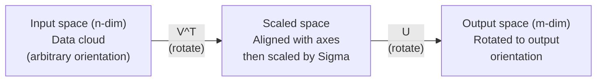
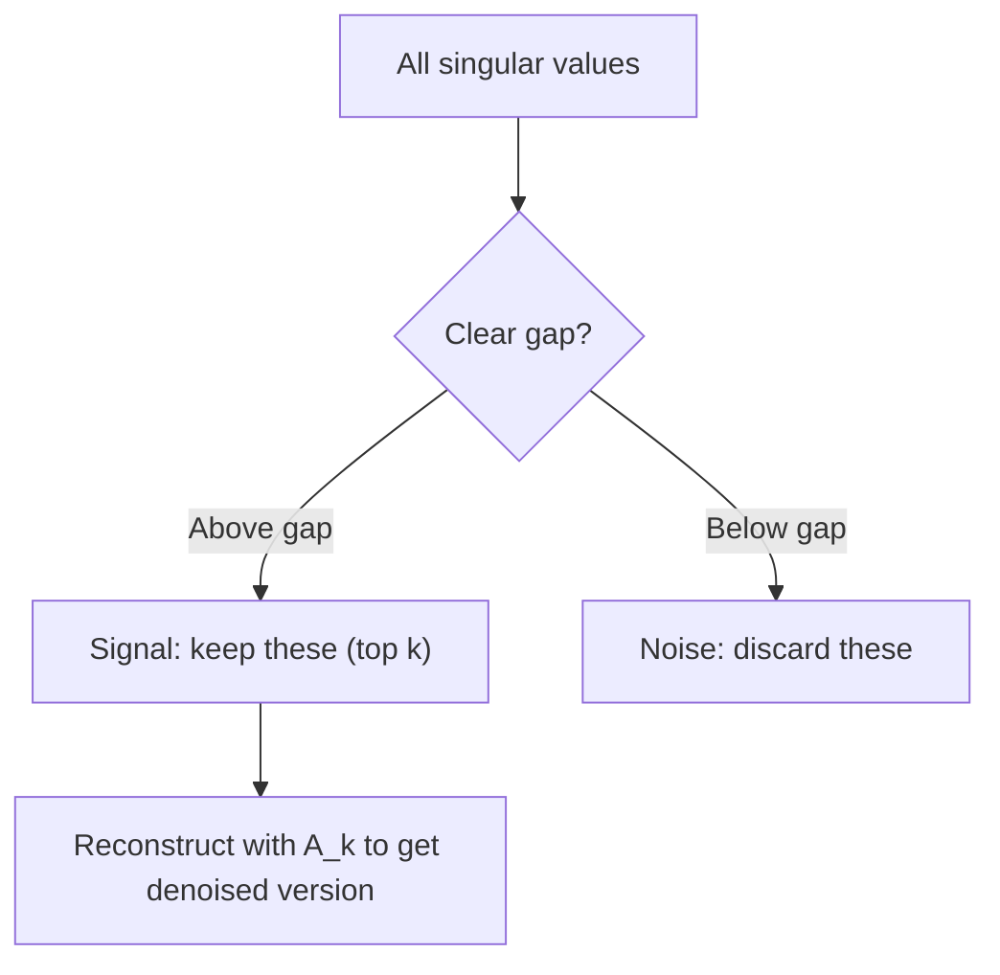

# Descomposición de valores singulares.

> El SVD es el cuchillo del ejército suizo de álgebra lineal.
> SVD es el "sólo de la guerra" del número de líneas. Cada rectángulo tiene uno.

**Type:** Build | **类型:** 动手
**Languages:** Python, Julia | **语言:** Python, Julia
**Prerequisites:** Phase 1, Lessons 01 (Linear Algebra Intuition), 02 (Vectors & Matrices Operations), 03 (Matrix Transformations) | **前置知识:** Phase 1, Lessons 01-03
**Time:** ~120 minutes | **时间:** ~120 分钟

## Objetivos de aprendizaje

- Implemente SVD a través de la iteración de potencia y explique el significado geométrico de U, Sigma y V^T
  代实现 SVD, explicar U、Sigma 和 V^T de la geometría significado
- Aplicar SVD truncado para comprimir la imagen y medir la relación de compresión vs error de reconstrucción
   aplicación de recorte SVD  realizar compresión de imágenes, compresión de medida en comparación con error de reconstrucción
- Computa el pseudoinverso Moore-Penrose a través de SVD para resolver sistemas de cuadrados mínimos sobredeterminados
                                                                                                                                                                                                                                                                                                                                                                                                                                                                                                                               
- Conectar SVD a PCA, sistemas de recomendación (factores latente) y análisis semántico latente en PNL
  En el caso de los sistemas de análisis de la lengua, el análisis de la lengua puede ser un análisis de la lengua.

> **【中文解读】**
> SVD es el "Russian Army Knife" de la línea de números. Cualquier matriz se puede desglosar en U * Sigma * V^T.

> **【拓展：SVD 在 AI 中的位置】**
> - **推荐系统**El resultado de la competencia de Netflix es la clasificación de los usuarios de los productos.
> - **图像压缩**截断 SVD sólo conserva el máximo de unos pocos valores extraños, es posible utilizar muy pocos datos de imágenes cercanas a las imágenes anteriores.
> - **LSA (潜在语义分析)**El primer método de modelo de temas en la PNL, se basa en la investigación de la PNL.

## El problema es la introducción del problema

> **【中文解读】**Usted tiene una matriz de 1000×2000 (en inglés) (en inglés) (en inglés) (en inglés) (en inglés) (en inglés) (en inglés) (en inglés) (en inglés) (en inglés) (en inglés) (en inglés) (en inglés) (en inglés) (en inglés) (en inglés) (en inglés) (en inglés) (en inglés) (en inglés) (en inglés) (en inglés) (en inglés) (en inglés) (en inglés) (en inglés) (en inglés) (en inglés) (en inglés) (en inglés) (en inglés) (en inglés) (en inglés) (en inglés) (en inglés) (en inglés) (en inglés) (en inglés) (en inglés) (en inglés) (en inglés) (en inglés) (en inglés) (en inglés) (en inglés) (en inglés) (en inglés) (en inglés) (en inglés) (en inglés) (en inglés) (en inglés) (en inglés) (en inglés) (en inglés) (en inglés) (en inglés) (en inglés) (en inglés) (en inglés) (en inglés) (en inglés) (en inglés) (en inglés) (en inglés) (en inglés) (en inglés) (en inglés) (en inglés) (en inglés) (en inglés) (en inglés) (en inglés) (en inglés) (en inglés) (en inglés) (en inglés) (en inglés) (en inglés) (en inglés) (en inglés) (en inglés) (en inglés) (en inglés) (en inglés) (en inglés (en hebracial) (en hebracial) (en hebracialised) (en) (en) (en hebracisementled (en anglais) (en anglais) (en anglais) (en anglais) (en anglais) (en anglais) (en anglaislaislaislaislaislaislaislaislais (en anglaislaislaislais (en anglaislaislaislaislaislaislaislaislaislais) (en allem allem allem allemand) (en allem allem allemand) (en allem allemand) (en) (en allemand) (en allem allem allem allem allem allem allem allem allemand (en) (en allem allem allem allem allem allem allem allem allem allem allem allem aussi (en) (

Tal vez es una clasificación de películas de usuario. Tal vez es una tabla de frecuencia a término de documento. Tal vez son los valores de píxeles de una imagen. Necesitas comprimirla, denogarla, encontrar una estructura oculta en ella, o resolver un sistema de mínimos cuadrados con ella. La composición de propiedad solo funciona en matrices cuadradas. Incluso entonces, requiere que la matriz tenga un conjunto completo de propios vectores independientes linealmente.
> Tal vez sea el usuario-filme, tal vez sea el archivo-pacho frecuente, tal vez sea la imagen. Necesitas comprimirla, deshacerte del ruido, encontrar la estructura oculta, o utilizarla para resolver el mínimo de dos veces.

El SVD funciona en cualquier matriz, cualquier forma, cualquier rango, sin condiciones, descompone la matriz en tres factores que revelan la geometría de lo que la matriz hace al espacio. Es la factorization más general y más útil en todo el álgebra lineal.
> SVD  se aplica a cualquier matriz  cualquier forma  cualquier orden  incondicional  se dividirá la matriz en tres factores, revelando lo que la matriz ha hecho en el espacio  es la más general  de los elementos lineales  la más útil 

## El concepto central.

> **【拓展：SVD 是 LoRA 的数学根基】**LoRA 微调的核心假设:权重更新矩阵 ΔW 是低排的──SVD 告诉我们, cualquier矩阵 puede ser dividido en U·Σ·V^T, de los cuales Σ 中的奇异值按大小排列──LoRA sólo conserva el máximo k 个奇异值对应的分量 (((即级-k近似), los parámetros de mn 减少到 k  m + n) ─这是SVD de la teoría a la aplicación de la transformación directa──

### Lo que SVD hace geométricamente

Cada matriz, independientemente de su forma, realiza tres operaciones en secuencia: girar, escalar, girar.
> Cada rectangular, sin importar su forma, realiza tres operaciones en orden: rotación, aceleración, rotación.

```
A = U * Sigma * V^T

      m x n     m x m    m x n    n x n
     (any)    (rotate)  (scale)  (rotate)
```

Dado cualquier matriz A, el SVD la calcula en:
> 给定任意矩阵 A,SVD se desglosará en:

- V^T gira vectores en el espacio de entrada (n-dimensional)
  V^T 在输入空间(n 维) 中旋转向量
- Escales sigma a lo largo de cada eje (estiramientos o compresiones)
  Sigma 沿每个轴缩放 (laztar o comprimir)
- U gira el resultado en el espacio de salida (m-dimensional)
  El resultado se convertirá en espacio de salida



Piensa en esto de esta manera. Le das a SVD una matriz. Te dice: "Esta matriz toma una esfera de entradas, primero la gira por V^T, luego la estira en un elipsoide por Sigma, luego gira el elipsoide por U". Los valores singulares son las longitudes de los ejes del elipsoide.
> Imagínese: usted entrega la matriz a la SVD, le dice:" Esta matriz recibe un conjunto de entradas de la superficie de la bola, primero con V^T  rotar, volver a usar Sigma 拉伸成球, volver a usar U 旋球──"El valor extraño es la longitud de cada eje de la bola──"

### La descomposición completa.

Para una matriz A de forma m x n:

```
A = U * Sigma * V^T

where:
  U     is m x m, orthogonal (U^T U = I)
  Sigma is m x n, diagonal (singular values on the diagonal)
  V     is n x n, orthogonal (V^T V = I)

The singular values sigma_1 >= sigma_2 >= ... >= sigma_r > 0
where r = rank(A)
```

Las columnas de U se llaman vectores singulares izquierdas. Las columnas de V se llaman vectores singulares rectos. Las entradas diagonales de Sigma se llaman valores singulares. Siempre son no negativos y se ordenan convencionalmente en orden decreciente.
> U de la línea se llama la línea de la línea de la línea de la línea de la línea de la línea de la línea de la línea de la línea de la línea de la línea de la línea de la línea de la línea de la línea de la línea de la línea de la línea de la línea de la línea de la línea de la línea de la línea de la línea de la línea de la línea de la línea de la línea de la línea de la línea de la línea de la línea de la línea de la línea de la línea de la línea de la línea de la línea de la línea de la línea de la línea de la línea de la línea de la línea de la línea de la línea de la línea de la línea de la línea de la línea de la línea de la línea de la línea de la línea de la línea de la línea de la línea de la línea de la línea de la línea de la línea de la línea de la línea de la línea de la línea de la línea de la línea de la línea de la línea de la línea de la línea de la línea de la línea de la línea de la línea de la línea de la línea de la línea de la línea de la línea de la línea de la línea de la línea de la línea de la línea de la línea de la línea de la línea de la línea de la línea de la línea de la línea de la línea de la línea de la línea de la línea de la línea de la línea de la línea de la línea de la línea de la línea de la línea de la línea de la línea de la línea de la línea de la línea de la línea de la línea de la línea de la línea de la línea de la línea de la línea de la línea de la línea de la línea de la línea de la línea de la línea de la línea de la línea de la línea de la línea de la línea de la línea de la línea de la línea de la línea de la línea de la línea de la línea de la línea de la línea de la línea de la línea de la línea de la línea de la línea de la línea de la línea de la línea de la línea de la línea de la línea de la línea de la línea de la línea de la línea de la línea de la línea de la línea de la línea de la línea de la línea de la línea de la línea de la línea de la línea de la línea de la línea de la línea de la línea de la línea de la línea de la línea de la línea de

### Véctores singulares izquierdo, valores singulares, vectores singulares derecho.

Cada componente del SVD tiene un significado geométrico distinto.
> Cada fracción de SVD tiene un significado geográfico único.

**Right singular vectors (columns of V):**Estas forman una base ortónormal para el espacio de entrada (R^n). Son las direcciones en el espacio de entrada que la matriz mapea a direcciones ortogonales en el espacio de salida.
> **右奇异向量（V 的列）：**构成输入空间 (R^n) 的正交基──它们是输入空间中的矩阵映射到输出空间正交方向的方向──

**Singular values (diagonal of Sigma):**Estos son los factores de escala. el i-o valor singular le dice cuánto la matriz se extiende a lo largo del i-o derecho vector singular. un valor singular de cero significa que la matriz aplasta esa dirección por completo.
> **奇异值（Sigma 的对角线）：**缩放因子──第1 个奇异值告诉你矩阵沿第1 个右奇异向量方向拉伸多少──奇异值为零 significa que la矩阵 está completamente presionada en esa dirección──

**Left singular vectors (columns of U):**Estos forman una base ortónormal para el espacio de salida (R^m). El i-o vector singular izquierdo es la dirección en el espacio de salida donde el i-o vector singular derecho aterriza (después de escalar).
> **左奇异向量（U 的列）：**构成输出空间 (R^m) 的正交基──第 i 个左奇异向量是第 i个右奇异向量(缩放后) 落在输出空间中的方向──

La relación entre ellos:
>  Relaciones entre ellas:

```
A * v_i = sigma_i * u_i

The matrix A takes the i-th right singular vector v_i,
scales it by sigma_i, and maps it to the i-th left singular vector u_i.
```

Esto le da una imagen de coordenadas por coordenadas de lo que cualquier matriz hace.
> Esto te proporciona una imagen de cada rectángulo de operación.

### Forma de producto exterior

El SVD se puede escribir como una suma de matrices de rango 1:
> SVD puede escribirse en orden-1 矩阵之和:

```
A = sigma_1 * u_1 * v_1^T + sigma_2 * u_2 * v_2^T + ... + sigma_r * u_r * v_r^T

Each term sigma_i * u_i * v_i^T is a rank-1 matrix (an outer product).
The full matrix is the sum of r such matrices, where r is the rank.
```

Esta forma es la base de la aproximación de rango bajo. Cada término añade una capa de estructura. El primer término capta el patrón más importante. El segundo capta el siguiente más importante. Y así sucesivamente. Truncando esta suma le da la mejor aproximación posible en cualquier rango dado.
> Esta forma es la base de la aproximación de nivel bajo. Cada uno añade una estructura de nivel. La primera captura el modelo más importante, la segunda captura el segundo importante, según este tipo de sugerencias.

```
Rank-1 approx:    A_1 = sigma_1 * u_1 * v_1^T
                  (captures the dominant pattern)

Rank-2 approx:    A_2 = sigma_1 * u_1 * v_1^T + sigma_2 * u_2 * v_2^T
                  (captures the two most important patterns)

Rank-k approx:    A_k = sum of top k terms
                  (optimal by the Eckart-Young theorem)
```

### Relación con la propia composición y la relación de los rasgos de valor descompuesto

Los valores singulares y los vectores de A provienen directamente de los valores propios y los vectores propios de A^T A y A^T.
> SVD y características de valor se desgloban profundamente relacionados.

```
A^T A = V * Sigma^T * U^T * U * Sigma * V^T
      = V * Sigma^T * Sigma * V^T
      = V * D * V^T

where D = Sigma^T * Sigma is a diagonal matrix with sigma_i^2 on the diagonal.

So:
- The right singular vectors (V) are eigenvectors of A^T A
- The singular values squared (sigma_i^2) are eigenvalues of A^T A

Similarly:
A A^T = U * Sigma * V^T * V * Sigma^T * U^T
      = U * Sigma * Sigma^T * U^T

So:
- The left singular vectors (U) are eigenvectors of A A^T
- The eigenvalues of A A^T are also sigma_i^2
```

Esta conexión le dice tres cosas:
> Este contacto te dice tres cosas:

1. Los valores singulares son siempre reales y no negativos (son raíces cuadradas de valores propios de una matriz semidefinida positiva).
   奇异值始终为实数且非负──
2. Se puede calcular SVD a través de la propia composición de A^T A, pero esto cuadra el número de condición y pierde la precisión numérica.
   Se puede calcular el valor de la característica A^T A a partir de la SVD, pero esto significa que el número de condiciones cuadradas, la pérdida de valor de la precisión, es el valor de la SVD.
3. Cuando A es cuadrado y semi-definido positivo simétrico, SVD y la composición propia son lo mismo.
   Cuando A es la forma y se compara a la media determinada, SVD y el valor de la característica se desglosa en un mismo caso.

### SVD truncado: aproximación de bajo rango.

El teorema de Eckart-Young-Mirsky establece que la mejor aproximación de rango k a A (tanto en la norma de Frobenius como en la espectral) se obtiene manteniendo solo los valores singulares superiores k y sus vectores correspondientes:
> Eckart-Young-Mirsky 定理指出,A de mejores rankings近似(在 Frobenius 和谱范数下) mediante sólo conservar la anterior k 个奇异值 y su obtener la correspondiente tendencia:

```
A_k = U_k * Sigma_k * V_k^T

where:
  U_k     is m x k  (first k columns of U)
  Sigma_k is k x k  (top-left k x k block of Sigma)
  V_k     is n x k  (first k columns of V)

Approximation error = sigma_{k+1}  (in spectral norm)
                    = sqrt(sigma_{k+1}^2 + ... + sigma_r^2)  (in Frobenius norm)
```

Esta no es sólo una aproximación "buena". Es probadamente la mejor aproximación posible de rango k. Ninguna otra matriz de rango k está más cerca de A.
> Esto no es sólo una "buena" aproximación. Es la mejor aproximación. No hay otra posición más cercana a A.

| Component | Relative magnitude | Kept in rank-3 approx? / 保留在秩-3 近似中？ |
|-----------|-------------------|------------------------|
| sigma_1 | Largest / 最大 | Yes / 是 |
| sigma_2 | Large / 大 | Yes / 是 |
| sigma_3 | Medium-large / 中大 | Yes / 是 |
| sigma_4 | Medium / 中 | No (error) / 否（误差） |
| sigma_5 | Medium-small / 中小 | No (error) / 否（误差） |
| sigma_6 | Small / 小 | No (error) / 否（误差） |
| sigma_7 | Very small / 很小 | No (error) / 否（误差） |
| sigma_8 | Tiny / 极小 | No (error) / 否（误差） |

Mantenga arriba 3: A_3 captura los tres valores singulares más grandes. Error = valores restantes (sigma_4 a sigma_8).

Si los valores singulares se descomponen rápidamente, una pequeña k captura la mayor parte de la matriz.
> Si el valor de la anomalía se desacelera rápidamente, el k del pequeño puede capturar la mayor parte de la matriz. Si la desaceleración es lenta, la matriz no tiene una estructura baja.

### Compresión de imagen con SVD

Una imagen a escala de gris es una matriz de intensidades de píxeles. Una imagen de 800x600 tiene 480.000 valores.
> La imagen de gris es una matriz de intensidad de imagen. Las imágenes de 800x600 tienen un valor de 480.000.

```
Original image: 800 x 600 = 480,000 values

SVD with rank k:
  U_k:      800 x k values
  Sigma_k:  k values
  V_k:      600 x k values
  Total:    k * (800 + 600 + 1) = k * 1401 values

  k=10:   14,010 values   (2.9% of original)
  k=50:   70,050 values  (14.6% of original)
  k=100: 140,100 values  (29.2% of original)

  The compression ratio improves as k gets smaller,
  but visual quality degrades.
```

La clave: las imágenes naturales tienen valores singulares que se descompone rápidamente. Los primeros valores singulares capturan la estructura amplia (formas, gradientes). Los últimos capturan detalles finos y ruido.
> 关键洞见: los extraños de las imágenes naturales se desvanecen rápidamente. Los primeros extraños capturan estructuras macroestructuras, formas y progresos, los últimos detalle y ruido.

### SVD para sistemas de recomendación.

El Premio Netflix hizo esto famoso. Tienes una matriz de calificaciones de películas de usuarios donde la mayoría de las entradas faltan.
> Netflix 竞赛使之出名──你有一个大部分条目缺失的用户电影评分矩阵──

```
             Movie1  Movie2  Movie3  Movie4  Movie5
  User1      [  5      ?       3       ?       1  ]
  User2      [  ?      4       ?       2       ?  ]
  User3      [  3      ?       5       ?       ?  ]
  User4      [  ?      ?       ?       4       3  ]

  ? = unknown rating
```

La idea: esta matriz de calificaciones tiene un bajo rango. Los usuarios no tienen gustos completamente independientes. Hay un puñado de factores latentes (acción vs drama, viejo vs nuevo, cerebral vs visceral) que explican la mayoría de las preferencias.
> 核心思想:评分矩阵是低排的──用户的品味并非完全独立──存在少数隐因子──动作 vs 文艺、老片 vs 新片) (existen pocos factores ocultos que pueden explicar la mayor parte de las preferencias──)

El SVD de la matriz de calificaciones (completa) la descomponen en:
> Para la evaluación de la matriz de SVD

- U: perfiles de usuarios en el espacio de factores latentes / 隐因子空间中的用户画像
- Sigma: importancia de cada factor latente / importancia de cada factor
- V^T: perfiles de películas en el espacio de factores latentes / 隐因子空间中的电影画像

La calificación prevista de un usuario para una película es el producto de puntos de su perfil de usuario con el perfil de la película (pondurado por valores singulares).
> El usuario prevé que el film se encuentre en el punto de la página de usuario.

### SVD en PNL: análisis semántico latente.

El análisis semántico latente (LSA), también llamado indexación semántica latente (LSI), aplica SVD a una matriz de documento término.
> 潜在语义分析 (LSA) se utilizará en SVD 应用于词文档矩阵。

```
             Doc1   Doc2   Doc3   Doc4
  "cat"      [  3      0      1      0  ]
  "dog"      [  2      0      0      1  ]
  "fish"     [  0      4      1      0  ]
  "pet"      [  1      1      1      1  ]
  "ocean"    [  0      3      0      0  ]

After SVD with rank k=2:

  Each document becomes a point in 2D "concept space."
  Each term becomes a point in the same 2D space.
  Documents about similar topics cluster together.
  Terms with similar meanings cluster together.
```

El LSA fue uno de los primeros métodos exitosos para capturar la similitud semántica de texto crudo. Funciona porque los términos sinónimos tienden a aparecer en documentos similares, por lo que SVD los agrupa en las mismas dimensiones latentes.
> La LSA es uno de los primeros métodos de éxito para capturar la similitud de idiomas en el texto original. Es eficaz porque los idiomas suelen aparecer en documentos similares, y los SVD los clasificarán en la misma dimensión.

### SVD para reducir el ruido.

Los datos ruidosos tienen la señal concentrada en los valores singulares superiores y el ruido distribuido a través de todos los valores singulares.
> El ruido en el sistema de datos de señales se concentra en la parte superior de los valores de ruido, el ruido se dispersa en todos los valores de ruido.



Esta técnica se utiliza en el procesamiento de señales, medición científica y limpieza de datos.
> Se utiliza para el procesamiento de señales, medición científica y limpieza de datos. Si usted tiene una matriz de contaminación por ruido adicional, la interrupción de SVD es un método de separación de señales y ruido de principio.

### Pseudoinverso a través de SVD                                                                                                                                                                                                                                                                                                                                                                                                                                                                                                                     

El pseudoinverso de Moore-Penrose A+ generaliza la inversión de matrices a matrices no cuadradas y singulares.
> Moore-Penrose 伪逆 A+ 将矩阵求逆推广到非方阵和奇异矩阵──SVD 使计算变得简单──

```
If A = U * Sigma * V^T, then:

A+ = V * Sigma+ * U^T

where Sigma+ is formed by:
  1. Transpose Sigma (swap rows and columns)
  2. Replace each non-zero diagonal entry sigma_i with 1/sigma_i
  3. Leave zeros as zeros
```

Si Ax = b no tiene solución exacta (sistema sobredeterminado), entonces x = A + b es la solución de menor cuadrados (minimiza la AX - b).
> 伪逆求解最小二乘解问题──如果 Ax = b 没有精确解(超定系统),则 x = A+ b 是最小二乘解──

### Ventajas de estabilidad numérica Ventajas de estabilidad numérica

Computación de la propia composición de A^T A cuadrados de los valores singulares (valores propios de A^T A son sigma_i^2). Esto cuadrados del número de condición, amplificando errores numéricos.
> 计算 A^T A 的特征值分解会平方奇异值,平方条件数,放大数值差──

Los algoritmos modernos de SVD (biodiagnonalización Golub-Kahan) trabajan directamente en A, nunca formando A^T A. Por eso siempre debe preferirse `np.linalg.svd(A)`- ¿ Qué ?`np.linalg.eig(A.T @ A)`¿ Qué ?
> 现代 SVD 算法 directamente a A 操作, no forma A^T A.`np.linalg.svd(A)`Y no`np.linalg.eig(A.T @ A)`¿Qué es eso?

### Conexión con PCA                                                                                                                                                                                                                                                                                                                                                                                                                                                                                                                         

PCA es SVD en datos centrados. Esto no es una analogía. Es literalmente el mismo cálculo.
> PCA es para hacer SVD a datos centralizados. Esto no es una comparación, es el mismo cálculo.

```
Given data matrix X (n_samples x n_features), centered (mean subtracted):

Covariance matrix: C = (1/(n-1)) * X^T X

PCA finds eigenvectors of C. But:

  X = U * Sigma * V^T    (SVD of X)

  X^T X = V * Sigma^2 * V^T

  C = (1/(n-1)) * V * Sigma^2 * V^T

So the principal components are exactly the right singular vectors V.
The explained variance for each component is sigma_i^2 / (n-1).

In sklearn, PCA is implemented using SVD, not eigendecomposition.
It is faster and more numerically stable.
```

Esto significa que todo lo que aprendiste sobre la reducción de dimensiones en la Lección 10 es SVD bajo el capó.
> Esto significa que en la Lección 10 aprendiste que la base de la reducción de contenido es SVD.

## Construye y realiza.
```figure
svd-rank-reconstruction
```

## Construye el mismo

### Paso 1: SVD desde cero usando la iteración de energía.

La idea: para encontrar el mayor valor singular y sus vectores, utilizar la iteración de potencia en A^T A (o A A^T). Luego desinflar la matriz y repetir para el siguiente valor singular.
> Pensamiento: Usando 代在 A^T A 上找最大奇异值及其向量, luego contraer la matriz, volver a encontrar el siguiente奇异值──

```python
import numpy as np

def power_iteration(M, num_iters=100):
    n = M.shape[1]
    v = np.random.randn(n)
    v = v / np.linalg.norm(v)

    for _ in range(num_iters):
        Mv = M @ v
        v = Mv / np.linalg.norm(Mv)

    eigenvalue = v @ M @ v
    return eigenvalue, v

def svd_from_scratch(A, k=None):
    m, n = A.shape
    if k is None:
        k = min(m, n)

    sigmas = []
    us = []
    vs = []

    A_residual = A.copy().astype(float)

    for _ in range(k):
        AtA = A_residual.T @ A_residual
        eigenvalue, v = power_iteration(AtA, num_iters=200)

        if eigenvalue < 1e-10:
            break

        sigma = np.sqrt(eigenvalue)
        u = A_residual @ v / sigma

        sigmas.append(sigma)
        us.append(u)
        vs.append(v)

        A_residual = A_residual - sigma * np.outer(u, v)

    U = np.column_stack(us) if us else np.empty((m, 0))
    S = np.array(sigmas)
    V = np.column_stack(vs) if vs else np.empty((n, 0))

    return U, S, V
```

### Paso 2: Prueba y compara con NumPy.

```python
np.random.seed(42)
A = np.random.randn(5, 4)

U_ours, S_ours, V_ours = svd_from_scratch(A)
U_np, S_np, Vt_np = np.linalg.svd(A, full_matrices=False)

print("Our singular values:", np.round(S_ours, 4))
print("NumPy singular values:", np.round(S_np, 4))

A_reconstructed = U_ours @ np.diag(S_ours) @ V_ours.T
print(f"Reconstruction error: {np.linalg.norm(A - A_reconstructed):.8f}")
```

### Paso 3: Demo de compresión de imagen.

```python
def compress_image_svd(image_matrix, k):
    U, S, Vt = np.linalg.svd(image_matrix, full_matrices=False)
    compressed = U[:, :k] @ np.diag(S[:k]) @ Vt[:k, :]
    return compressed

image = np.random.seed(42)
rows, cols = 200, 300
image = np.random.randn(rows, cols)

for k in [1, 5, 10, 20, 50]:
    compressed = compress_image_svd(image, k)
    error = np.linalg.norm(image - compressed) / np.linalg.norm(image)
    original_size = rows * cols
    compressed_size = k * (rows + cols + 1)
    ratio = compressed_size / original_size
    print(f"k={k:>3d}  error={error:.4f}  storage={ratio:.1%}")
```

### Paso 4: Reducción del ruido.

```python
np.random.seed(42)
clean = np.outer(np.sin(np.linspace(0, 4*np.pi, 100)),
                 np.cos(np.linspace(0, 2*np.pi, 80)))
noise = 0.3 * np.random.randn(100, 80)
noisy = clean + noise

U, S, Vt = np.linalg.svd(noisy, full_matrices=False)
denoised = U[:, :5] @ np.diag(S[:5]) @ Vt[:5, :]

print(f"Noisy error:    {np.linalg.norm(noisy - clean):.4f}")
print(f"Denoised error: {np.linalg.norm(denoised - clean):.4f}")
print(f"Improvement:    {(1 - np.linalg.norm(denoised - clean) / np.linalg.norm(noisy - clean)):.1%}")
```

### Paso 5: Pseudoinverso.

```python
A = np.array([[1, 1], [2, 1], [3, 1]], dtype=float)
b = np.array([3, 5, 6], dtype=float)

U, S, Vt = np.linalg.svd(A, full_matrices=False)
S_inv = np.diag(1.0 / S)
A_pinv = Vt.T @ S_inv @ U.T

x_svd = A_pinv @ b
x_lstsq = np.linalg.lstsq(A, b, rcond=None)[0]
x_pinv = np.linalg.pinv(A) @ b

print(f"SVD pseudoinverse solution:  {x_svd}")
print(f"np.linalg.lstsq solution:   {x_lstsq}")
print(f"np.linalg.pinv solution:    {x_pinv}")
```

## Usalo con el marco de ejecución

Las demostraciones de trabajo completas están en `code/svd.py`. Ejecutarlo para ver SVD aplicado a la compresión de imágenes, sistemas de recomendación, análisis semántico latente y reducción del ruido.
> 完整可运行的演示在 `code/svd.py`En el sistema de análisis de imágenes, el SVD se utiliza para comprimir imágenes, el sistema de análisis y el análisis de ruido.

```bash
python svd.py
```

La versión de Julia en `code/svd.jl`demuestra los mismos conceptos usando la lengua nativa de Julia `svd()`función y `LinearAlgebra`el paquete.
> `code/svd.jl`中的 Julia 版本使用 Julia 原生 `svd()`函数和 `LinearAlgebra`包演示相同概念──

```bash
julia svd.jl
```

## Envíe el producto .

Esta lección produce:
> En el curso de la educación

- `outputs/skill-svd.md`- una habilidad para saber cuándo y cómo aplicar la SVD en proyectos reales
  Un documento sobre cómo y cuándo aplicar la SVD en proyectos reales

## Los ejercicios.

1. Implemente el SVD completo desde cero sin usar la iteración de potencia. En su lugar, computa la propia composición de A^T A para obtener V y los valores singulares, luego computa U = A V Sigma^{-1}. Compara la precisión numérica con tu versión de iteración de potencia y con NumPy.
   No se utiliza para implementar el SVD completo desde cero. Se cambia para calcular la descomposición de la característica A^T A para obtener V y un valor extraño, y luego se calcula U = A V Sigma^{-1}──

2. Cargue una imagen real en escala gris (o convierta en escala gris). Comprimela en las filas 1, 5, 10, 25, 50, 100. Para cada fila, calcula la relación de compresión y el error relativo. Encuentra la fila en la que la imagen se vuelve visualmente aceptable.
   Cargar una imagen de gris verdadero. Usando la imagen de 1、5、10、25、50、100 compresión.

3. Construir un pequeño sistema de recomendaciones. Crear una matriz de calificaciones de películas de usuarios 10x8 con algunas entradas conocidas. Rellenar entradas faltantes con medios de fila. calcular SVD y reconstruir una aproximación de rango-3.
   构建一个小型推系统――创建 10x8 用户-电影评分矩阵――使用行平均值填充缺失条目――计算 SVD 并重建排-3 近似――使用重建矩阵预测缺失评分――

4. Crea una matriz de 100x50 documentos con 3 temas sintéticos. Cada tema tiene 5 términos asociados. Agregue ruido. Aplique SVD y verifique que los tres valores singulares superiores son mucho más grandes que los demás. Proyecte documentos en el espacio latente 3D y compruebe que los documentos del mismo grupo de temas juntos.
   Crear una matriz de tres temas de composición de 100x50 文档-词矩阵── cada tema tiene cinco palabras relacionadas──加噪──应用 SVD 验证前3 奇异值远大于其余──

5. Generar una matriz de bajo rango limpia (rango 3, tamaño 50x40) y agregar el ruido gaussiano en diferentes niveles (sigma = 0.1, 0.5, 1.0, 2.0). Para cada nivel de ruido, encontrar el rango de truncamiento óptimo barriendo k de 1 a 40 y midiendo el error de reconstrucción contra la matriz limpia.
   Produce un nivel de ruido alto y alto en cada nivel de ruido, y puede ser mejor clasificado en cada nivel.

## Términos clave .

| Term / 术语 | What people say | What it actually means / 实际含义 |
|------|----------------|----------------------|
| SVD / 奇异值分解 | "Factor any matrix" | Decompose A into U Sigma V^T where U and V are orthogonal and Sigma is diagonal with non-negative entries. Works for any matrix of any shape. / 将 A 分解为 U Sigma V^T，U 和 V 正交，Sigma 对角非负。适用于任何形状的矩阵。 |
| Singular value / 奇异值 | "How important this component is" | The i-th diagonal entry of Sigma. Measures how much the matrix stretches along the i-th principal direction. / Sigma 的第 i 个对角线元素。衡量矩阵沿第 i 主方向的拉伸程度。 |
| Left singular vector / 左奇异向量 | "Output direction" | A column of U. The direction in output space that the i-th right singular vector maps to. / U 的列。第 i 个右奇异向量映射到的输出空间方向。 |
| Right singular vector / 右奇异向量 | "Input direction" | A column of V. The direction in input space that the matrix maps to the i-th left singular vector. / V 的列。矩阵映射到第 i 个左奇异向量的输入空间方向。 |
| Truncated SVD / 截断 SVD | "Low-rank approximation" | Keep only the top k singular values and their vectors. Produces the provably best rank-k approximation (Eckart-Young theorem). / 只保留前 k 个奇异值及其向量。产生可证明的最佳秩-k 近似。 |
| Rank / 秩 | "True dimensionality" | The number of non-zero singular values. Tells you how many independent directions the matrix actually uses. / 非零奇异值的数量。告诉你矩阵实际使用多少独立方向。 |
| Pseudoinverse / 伪逆 | "Generalized inverse" | V Sigma+ U^T. Inverts non-zero singular values, leaves zeros as zeros. Solves least-squares for non-square or singular matrices. / V Sigma+ U^T。反转非零奇异值，零保持不变。 |
| Condition number / 条件数 | "How sensitive to errors" | sigma_max / sigma_min. A large condition number means small input changes cause large output changes. / sigma_max / sigma_min。条件数大意味着小的输入变化引起大的输出变化。 |
| Latent factor / 隐因子 | "Hidden variable" | A dimension in the low-rank space discovered by SVD. In recommendations, a genre preference. In NLP, a topic. / SVD 发现的低秩空间中的维度。推荐中是类型偏好，NLP 中是主题。 |
| Frobenius norm / Frobenius 范数 | "Total matrix size" | Square root of the sum of squared entries. Equals sqrt of sum of squared singular values. / 所有元素平方和的平方根。等于奇异值平方和的平方根。 |
| Eckart-Young theorem / Eckart-Young 定理 | "SVD gives the best compression" | For any target rank k, the truncated SVD minimizes the approximation error over all possible rank-k matrices. / 对任意目标秩 k，截断 SVD 在所有可能的秩-k 矩阵中最小化近似误差。 |
| Power iteration / 幂迭代 | "Find the biggest eigenvector" | Repeatedly multiply a random vector by the matrix and normalize. Converges to the largest eigenvector. / 反复将随机向量乘以矩阵并归一化。收敛到最大特征向量。 |

## Más Leer más Leer más

- [Gilbert Strang: Linear Algebra and Its Applications, Chapter 7](https://math.mit.edu/~gs/linearalgebra/)- tratamiento exhaustivo de la VVD con aplicaciones
  El tratamiento y la aplicación completos de la SVD
- [3Blue1Brown: But what is the SVD?](https://www.youtube.com/watch?v=vSczTbgc8Rc)- Intuición geométrica para el SVD
  La situación de la SVD
- [We Recommend a Singular Value Decomposition](https://www.ams.org/publicoutreach/feature-column/fcarc-svd)- una visión general accesible de la Sociedad Americana de Matemáticas
  Desde la SVD de AMS
- [Netflix Prize and Matrix Factorization](https://sifter.org/~simon/journal/20061211.html)- La publicación original de Simon Funk en el blog de SVD para recomendaciones
  Simon Funk  Sobre el SVD 推的原始博客
- [Latent Semantic Analysis](https://en.wikipedia.org/wiki/Latent_semantic_analysis)- la aplicación original de la PNL de la SVD
  Aplicación original de la SVD en la PNL
- [Numerical Linear Algebra by Trefethen and Bau](https://people.maths.ox.ac.uk/trefethen/text.html)- el estándar de oro para la comprensión de los algoritmos de SVD
  Comprender el SVD 算法的黄金标准
