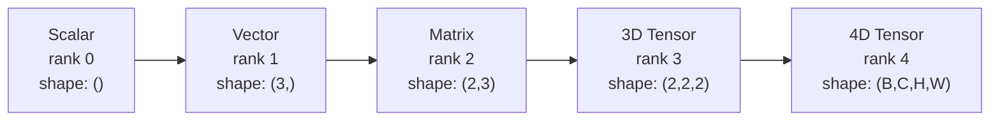
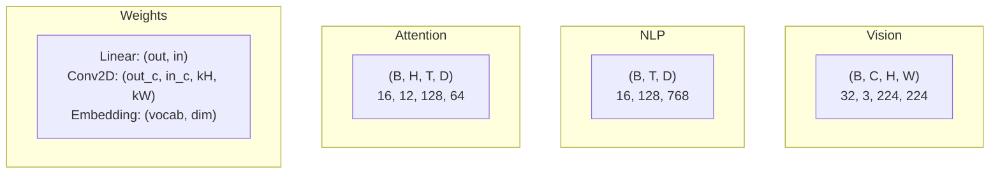
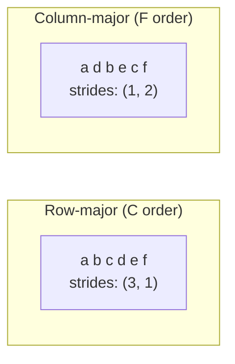
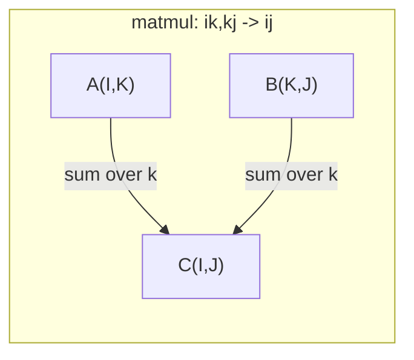

# Las operaciones tensoras .

> Los tensores son el lenguaje común entre los datos y el aprendizaje profundo. Cada imagen, cada frase, cada gradiente fluye a través de ellos.
> 张量是数据和深度学习的通用语言―― cada imagen, cada frase, cada escala se mueve a través de la张量――

**Type:** Build | **类型:** 动手
**Language:**¿ Qué pasa ?**语言:**Python
**Prerequisites:** Phase 1, Lessons 01 (Linear Algebra Intuition), 02 (Vectors, Matrices & Operations) | **前置知识:** Phase 1, Lessons 01-02
**Time:** ~90 minutes | **时间:** ~90 分钟

## Objetivos de aprendizaje

- Implementar una clase de tensores con operaciones de forma, pasos, remodelación, transposición y elementos desde cero
  Desde la realización de la forma, la longitud, la reposición, la transformación y la operación de cada elemento de la clase de la cantidad de la forma
- Aplicar las reglas de radiodifusión para operar en tensores de diferentes formas sin copiar datos
   aplicación de la normativa de la aplicación de la aplicación de la aplicación de la aplicación de la aplicación de la aplicación de la aplicación de la aplicación de la aplicación de la aplicación de la aplicación de la aplicación de la aplicación de la aplicación de la aplicación de la aplicación de la aplicación de la aplicación de la aplicación de la aplicación de la aplicación de la aplicación de la aplicación de la aplicación de la aplicación de la aplicación de la aplicación de la aplicación de la aplicación de la aplicación de la aplicación de la aplicación de la aplicación de la aplicación de la aplicación de la aplicación de la aplicación de la aplicación de la aplicación de la aplicación de la aplicación de la aplicación de la aplicación de la aplicación de la información de la información de diferentes formas
- Escriba expresiones de unenum para productos de puntos, multiplicidades de matriz, productos externos y operaciones en lote
   redactar un sumo Expreso de la realización de puntos √√√√√√√√√√√√√√√√√√√√√√√√√√√√√√√√√√√√√√√√√√√√√√√√√√√√√√√√√√√√√√√√√√√√√√√√√√√√√√√√√√√√√√√√√√√√√√√√√√√√√√√√√√√√√√√√√√√√√√√√√√√√√√√√√√√√√√√√√√√√√√√√√√√√√√√√√√√√√√√√√√√√√√√√√√√√√√√√√√√√√√√√√√√√√√√√√√√√√√√√√√√√√√√√√√√√√√√√√√√√√√√√√√√√√√√√√√√√√√√√√√√√√√√√√√√√√√√√√√√√√√√√√√√√√√√√√√√√√√√√√√√√√√√√√√√√√√√√√√√√√√√√√√√√√√√√√√√√√√√√√√√√√√√√√√√√√√√√√√√√√√√√√√√√√√√√√√√√√√√√√√√√√√√√√√√√√√√√√√√√√√√√√√√√√√√√√√√√√√√√√√√√√√√√√√√√√√√√√√√√√√√√√√√√√√√√√√√√√√√√√√√√√√√√√√√√√√√√√√√√√√√√√√√√√√√√√√√√√√√√√√√√√√√√√√√√√√√
- Trazar las formas exactas del tensor a través de cada paso de la atención multi-cabeza
  Seguir la forma exacta de cada paso en la atención de múltiples

> **【中文解读】**
> 张量是数据和深度学习的通用语言──向量是张量,矩阵是二维张量,RGB 图像是三维张量──本章从零实现张量类,理解形状、步长、广播和 einsum──Transformer 多头注意力中 Q/K/V 都是四维张量,理解张量形状是调试的关键──

## El problema es la introducción del problema

> **【中文解读】**Construiste un transformador, funcionó después de la operación.`RuntimeError: shapes cannot be multiplied (32x768 and 512x768)` Forma  error es el error más común en el aprendizaje profundo.  Transformer tiene varias decenas de transformaciones/transpuestas/transmisiones  operaciones enlazadas, un error de ejecución en el nivel de la red.                                                                                                                                                                                                                                        

## El concepto central.

> **【拓展：张量 shape 是 AI 工程师的日常】**调试神经网络 90% del tiempo en el tratamiento de forma 问题──关键工具:`print(tensor.shape)`¿Qué es eso?`.reshape()`El peso`.transpose()`转置,`.unsqueeze()`增加维度──PyTorch's einsum `torch.einsum('bhd,bhd->bh', q, k)`) con Einstein 求和约定一行搞定复杂张量运算, es el transformador 实现的利器──

### ¿Qué es un tensor?

Un tensor es una matriz multidimensional de números con un tipo de datos uniforme.**rank**(o **order**Cada dimensión es una**axis**- El .**shape**es un tuple que enumera el tamaño a lo largo de cada eje.
> 张量是具有统一数据类型的多维数组──维数是**秩**(o**阶**), cada dimensión es una**轴**¿ Qué ?**形状**Es una lista de los grupos de diferentes grupos.



El total de elementos = producto de todos los tamaños.`(2, 3, 4)`Tiene`2 * 3 * 4 = 24`elementos.
> 总元素数 = 所有维度大小的乘积──forma `(2, 3, 4)`包含 `2 * 3 * 4 = 24`个元素── es el mismo.

### Las formas tensoras en el aprendizaje profundo

Diferentes tipos de datos se mapean a formas tensoras específicas por convención.
> Diferentes tipos de datos se mapean de acuerdo con las costumbres a una forma de volumen específica.



PyTorch utiliza NCHW (canal-first). TensorFlow se configura por defecto en NHWC (canal-last).
> PyTorch utiliza NCHW (NCHW) (NCHW) (NCHW) (NCHW) (NCHW) (NCHW) (NCHW) (NCHW) (NCHW) (NCHW) (NCHW) (NCHW) (NCHW) (NCHW) (NCHW) (NCHW) (NCHW) (NCHW) (NCHW) (NCHW) (NCHW) (NCHW) (NCHW) (NCHW) (NCHW) (NCHW) (NCHW) (NCHW) (NCHW) (NCHW) (NCHW) (NCHW) (NCHW) (NCHW) (NCHW) (NCHW) (NCHW) (NCHW) (NCHW) (NCHW) (NCHW) (NCHW) (NCHW) (NCHW) (NCHW) (NCHW) (NCHW) (NCHW) (NCHW) (NCHW) (NCHW) (NCHW) (NCHW) (NCHW) (N) (N) (N) (N) (N) (N) (N) (N) (N) (N) (N) (N) (N) (N) (N) (N) (en) (en) (en) (en) (en) (en) (en) (en) (en) (en) (en) (en) (en) (en) (en) (en) (en) (en) (en) (en) (en) (en) (en) (en) (en) (en) (en) (en) (en) (en) (en) (en) (en) (en) (en) (en) (en) (en) (en) (en) (en) (en) (en) (en) (en) (en) (en) (en) (en) (en) (en) (en) (en) (en) (en) (en) (en) (en) (en) (en) (en) (

### Cómo funciona el diseño de memoria

Una matriz 2D en la memoria es una secuencia 1D de bytes. **Strides**te dicen cuántos elementos saltar para mover un paso a lo largo de cada eje.
> El número 2D en la memoria es un número de secuencias de caracteres 1D.**步长**Te diré cuántos elementos se deben saltar a lo largo de cada paso que se mueve.



Transpose no mueve datos. Es intercambiar los pasos, haciendo el tensor **non-contiguous**-- los elementos de una fila ya no son adyacentes en la memoria.
> 转置不移动数据──它交换步长,使张量**不连续** El elemento de una línea ya no está en la memoria.

### Reglas de transmisión.

La transmisión permite operar en tensores de diferentes formas sin copiar datos. Alinear formas desde la derecha. Dos dimensiones son compatibles cuando son iguales o una es 1.
> 广播让你对形的不同张量操作而无需复制数据―― de derecha a derecha对齐形―― dos dimensiones相等或 una de ellas para 1 时兼容―― menor dimensiones en el lado izquierdo llenar 1――

```
Tensor A:     (8, 1, 6, 1)
Tensor B:        (7, 1, 5)
Padded B:     (1, 7, 1, 5)
Result:       (8, 7, 6, 5)
```

### Einsum: la operación universal del tensor.

La suma de Einstein etiqueta cada eje con una letra. Los ejes en la entrada pero no la salida se suman. Los ejes en ambos se mantienen.
> Einstein 求和字母标记每个轴──在输入中但不在输出中轴被求和──两者都有轴保留──



Modelos clave: `i,i->`(producto punto / 点积), `i,j->ij`(producto externo / 外积), `ii->`(traza / 迹), `ij->ji`(transponer / 转置), `bij,bjk->bik`(partido matmul / 批量矩阵乘法), `bhtd,bhsd->bhts`(puntuaciones de atención / atención).

## Construye y realiza.
```figure
tensor-broadcast
```

## Construye el mismo

El código vive en`code/tensors.py`Cada paso hace referencia a la aplicación de la misma.
> ¿ Qué pasa ?`code/tensors.py`En cada paso se cita la realización de la misma.

### Paso 1: almacenamiento de tensión y pasos.

Un tensor almacena una lista plana de números más metadatos de forma.
> 张量存储一个平的数字列表加上形状元数据──步长告诉索引逻辑如何将多维索引映射到平位置──

```python
class Tensor:
    def __init__(self, data, shape=None):
        if isinstance(data, (list, tuple)):
            self._data, self._shape = self._flatten_nested(data)
        elif isinstance(data, np.ndarray):
            self._data = data.flatten().tolist()
            self._shape = tuple(data.shape)
        else:
            self._data = [data]
            self._shape = ()

        if shape is not None:
            total = reduce(lambda a, b: a * b, shape, 1)
            if total != len(self._data):
                raise ValueError(
                    f"Cannot reshape {len(self._data)} elements into shape {shape}"
                )
            self._shape = tuple(shape)

        self._strides = self._compute_strides(self._shape)

    @staticmethod
    def _compute_strides(shape):
        if len(shape) == 0:
            return ()
        strides = [1] * len(shape)
        for i in range(len(shape) - 2, -1, -1):
            strides[i] = strides[i + 1] * shape[i + 1]
        return tuple(strides)
```

Para la forma`(3, 4)`, los pasos son`(4, 1)`-- saltar 4 elementos para avanzar una fila, saltar 1 elemento para avanzar una columna.
> 对于形状  por el que se trata de la forma`(3, 4)`,步长为 `(4, 1)` Prevención de una línea saltó 4 elementos, prevención de una línea saltó 1 elemento.

### Paso 2: Reformar, apretar, desprender. Paso 2: Reformar, comprimir, ampliar dimensiones.

Reshape cambia la forma sin cambiar el orden de los elementos. El número total de elementos debe permanecer igual.`-1`para una dimensión para inferir su tamaño.
> Redesfiguración  modificar la forma sin cambiar el orden de los elementos ∼ ∼ ∼ ∼ ∼ ∼ ∼ ∼ ∼ ∼ ∼ ∼ ∼ ∼ ∼ ∼ ∼ ∼ ∼ ∼ ∼ ∼ ∼ ∼ ∼ ∼ ∼ ∼ ∼ ∼ ∼ ∼ ∼ ∼ ∼ ∼ ∼ ∼ ∼ ∼ ∼ ∼ ∼ ∼ ∼ ∼ ∼ ∼ ∼ ∼ ∼ ∼ ∼ ∼ ∼ ∼ ∼ ∼ ∼ ∼ ∼ ∼ ∼ ∼ ∼ ∼ ∼ ∼ ∼ ∼ ∼ ∼ ∼ ∼ ∼ ∼ ∼ ∼ ∼ ∼ ∼ ∼ ∼ ∼ ∼ ∼ ∼ ∼ ∼ ∼ ∼ ∼ ∼ ∼ ∼ ∼ ∼ ∼ ∼ ∼ ∼ ∼ ∼ ∼ ∼ ∼ ∼ ∼ ∼ ∼ ∼ ∼ ∼ ∼ ∼ ∼ ∼ ∼ ∼ ∼ ∼ ∼ ∼ ∼ ∼ ∼ ∼ ∼ ∼ ∼ ∼ ∼ ∼ ∼ ∼ ∼ ∼ ∼ ∼ ∼ ∼ ∼ ∼ ∼ ∼ ∼ ∼ ∼ ∼ ∼ ∼ ∼ ∼ ∼ ∼ ∼ ∼ ∼ ∼    ∼ ∼                                                                                                                                                                         `-1`Autómicamente deducir algún tamaño grande.

```python
t = Tensor(list(range(12)), shape=(2, 6))
r = t.reshape((3, 4))
r = t.reshape((-1, 3))
```

El compresión elimina ejes de tamaño 1. el despresión inserta uno. el despresión es fundamental para la transmisión - un vector de sesgo`(D,)`añadido a un lote `(B, T, D)`Necesitas de no apretar a `(1, 1, D)`¿ Qué ?
> Squeeze 移除大小为 1 的轴,Squeeze 插入一个──Squeeze 插入一个──Squeeze 插入一个──Squeeze 插入一个──Squeeze 插入一个──Squeeze 插入一个──Squeeze 插入一个──Squeeze 插入一个──Squeeze 插入一个──Squeeze 插入一个──Squeeze 插入一个──Squeeze 插入一个──Squeeze 插入一个──Squeeze 插入一个──Squeeze 插入一个──Squeeze 插入一个──Squeeze 插入一个──Squeeze 插入一个──Squeeze 插入一个──Squeeze 插入一个──Squeeze 插入一个──Squeeze 插入一个──Squeeze 插入一个──Squeeze 插入一个──Squeeze 插入一个──Squeeze 插入一个──Squeeze 插入一个------------------------------------------------------------------------------------------------------------------------------------------------------------------------------------------------------------------------------------------------------------------------------------------------------------------------------------------------------------------------------------------------------------------------------------------------------------------------------------------------------------------------------------------------------------------------------------`(D,)`Adición a la cantidad`(B, T, D)`Lo que hace falta es desprimir hasta`(1, 1, D)`¿Qué es eso?

```python
t = Tensor(list(range(6)), shape=(1, 3, 1, 2))
s = t.squeeze()
v = Tensor([1, 2, 3])
u = v.unsqueeze(0)
```

### Paso 3: Transponer y permutar.

Transponer swaps dos ejes. Permute reordena todos los ejes. Así es como se convierte entre NCHW y NHWC.
> Transponer 交换两个轴──Permute 重排所有轴── esto es la forma de transferir entre NCHW y NHWC ──

```python
mat = Tensor(list(range(6)), shape=(2, 3))
tr = mat.transpose(0, 1)

t4d = Tensor(list(range(24)), shape=(1, 2, 3, 4))
perm = t4d.permute((0, 2, 3, 1))
```

Después de transponer o permutear, el tensor no es contiguo en la memoria.`view`fallas en los tensores no contiguos -- uso `reshape`o llamar`.contiguous()`- ¿Qué?
> 转置或排列后,张量在内存中不连续──PyTorch 中 `view`En inconstant 张量上会失败使用 `reshape`O primero se utiliza`.contiguous()`¿Qué es eso?

### Paso 4: Operaciones y reducciones por elementos.

Las operaciones de elemento-sabio (agrega, multiplica, restar) se aplican de forma independiente a cada elemento y conservan la forma.
> 逐元素操作 (加、乘、减) independiente se aplica a cada elemento y mantiene forma.

```python
a = Tensor([[1, 2], [3, 4]])
b = Tensor([[10, 20], [30, 40]])
c = a + b
d = a * 2
s = a.sum(axis=0)
```

El promedio mundial de la agrupación en una CNN: `(B, C, H, W).mean(axis=[2, 3])`produce `(B, C)`. Secuencia media de la agrupación en PNL: `(B, T, D).mean(axis=1)`produce `(B, D)`¿ Qué ?
> CNN en medio de la media de la cadena:`(B, C, H, W).mean(axis=[2, 3])` producirse `(B, C)` Posibilidad de la media de valor de los procesos en el NLP:`(B, T, D).mean(axis=1)` producirse `(B, D)`¿Qué es eso?

### Paso 5: Transmisiones con NumPy.

El `demo_broadcasting_numpy()`función en `tensors.py`muestra los patrones del núcleo.
> `tensors.py`En el centro`demo_broadcasting_numpy()`La función muestra el modelo central.

```python
activations = np.random.randn(4, 3)
bias = np.array([0.1, 0.2, 0.3])
result = activations + bias

images = np.random.randn(2, 3, 4, 4)
scale = np.array([0.5, 1.0, 1.5]).reshape(1, 3, 1, 1)
result = images * scale

a = np.array([1, 2, 3]).reshape(-1, 1)
b = np.array([10, 20, 30, 40]).reshape(1, -1)
outer = a * b
```

Distancia en pareja a través de la radiodifusión: remodelación `(M, 2)`¿ Qué ?`(M, 1, 2)`y `(N, 2)`¿ Qué ?`(1, N, 2)`, restar, cuadrado, sumar a lo largo del último eje, tomar raíz cuadrada. Resultado: `(M, N)`¿ Qué ?
> 通过广播计算成对距离:将 `(M, 2)`La carga de la carga`(M, 1, 2)`¿ Qué ?`(N, 2)`La carga de la carga`(1, N, 2)`,相减、平方、沿最后轴求和、取平方根── resultados:`(M, N)`¿Qué es eso?

### Paso 6: Operaciones de Einsum.

El `demo_einsum()`y `demo_einsum_gallery()`Las funciones pasan por todos los patrones comunes.
> `demo_einsum()`Y `demo_einsum_gallery()`La función muestra cada uno de los modos habituales.

```python
a = np.array([1.0, 2.0, 3.0])
b = np.array([4.0, 5.0, 6.0])
dot = np.einsum("i,i->", a, b)

A = np.array([[1, 2], [3, 4], [5, 6]], dtype=float)
B = np.array([[7, 8, 9], [10, 11, 12]], dtype=float)
matmul = np.einsum("ik,kj->ij", A, B)

batch_A = np.random.randn(4, 3, 5)
batch_B = np.random.randn(4, 5, 2)
batch_mm = np.einsum("bij,bjk->bik", batch_A, batch_B)
```

El coste computacional de una contracción es el producto de todos los tamaños de índices (contidos y sumados).`bij,bjk->bik`con B=32, I=128, J=64, K=128: `32 * 128 * 64 * 128 = 33,554,432`el número de veces adicionales.
> El costo de cálculo de la contracción es el multiplicado de todas las índices de retención y demanda.

### Paso 7: Mecanismo de atención a través de un sumo.

El `demo_attention_einsum()`La función implementa atención de múltiples cabezas de extremo a extremo.
> `demo_attention_einsum()`函数端到端实现多头注意力──

```python
B, H, T, D = 2, 4, 8, 16
E = H * D

X = np.random.randn(B, T, E)
W_q = np.random.randn(E, E) * 0.02

Q = np.einsum("bte,ek->btk", X, W_q)
Q = Q.reshape(B, T, H, D).transpose(0, 2, 1, 3)

scores = np.einsum("bhtd,bhsd->bhts", Q, K) / np.sqrt(D)
weights = softmax(scores, axis=-1)
attn_output = np.einsum("bhts,bhsd->bhtd", weights, V)

concat = attn_output.transpose(0, 2, 1, 3).reshape(B, T, E)
output = np.einsum("bte,ek->btk", concat, W_o)
```

Cada paso es una operación tensora: proyección (matmul a través de einsum), división de cabeza (reforma + transposición), puntajes de atención (batch matmul a través de einsum), suma ponderada (batch matmul a través de einsum), fusión de cabeza (transposición + reforma), proyección de salida (matmul a través de einsum).
> Cada paso es un proceso de la cantidad de operaciones: proyección, suma de la cantidad de cuadradas, división, transformación, transformación, transformación, transformación, transformación, transformación, transformación, transformación, transformación, transformación, transformación, transformación, transformación, transformación, transformación, transformación, transformación, transformación, transformación, transformación, transformación, transformación, transformación, transformación, transformación, transformación, transformación, transformación, transformación, transformación, transformación, transformación, transformación, transformación, transformación, transformación, transformación, transformación, transformación, transformación, transformación, transformación, transformación, transformación, transformación, transformación, transformación, transformación, transformación, transformación, transformación, transformación, transformación, transformación, transformación, transformación, transformación, transformación, transformación, transformación, transformación, transformación, transformación, transformación, transformación, transformación, transformación, transformación, transformación, transformación, transformación, transformación, transformación, transformación, transformación, transformación, transformación, transformación, transformación, transformación, transformación, transformación, transformación, transformación, transformación, transformación, transformación, transformación, transformación, transformación, transformación, transformación, transformación, transformación, transformación, transformación, transformación, transformación, transformación, transformación, transformación, transformación, transformación, transformación, transformación, transformación, y transformación, transformación, y transformación, y transformación, y transformación, y transformación, y transformación de la transformación.

## Usalo con el marco de ejecución

### Scratch vs NumPy, Manuscripción vs NumPy

| Operation / 操作 | Scratch (Tensor class) | NumPy |
|---|---|---|
| Create / 创建 | `Tensor([[1,2],[3,4]])` | `np.array([[1,2],[3,4]])` |
| Reshape / 重塑 | `t.reshape((3,4))` | `a.reshape(3,4)` |
| Transpose / 转置 | `t.transpose(0,1)` | `a.T` or `a.transpose(0,1)` |
| Squeeze / 压缩 | `t.squeeze(0)` | `np.squeeze(a, 0)` |
| Sum / 求和 | `t.sum(axis=0)` | `a.sum(axis=0)` |
| Einsum | N/A | `np.einsum("ij,jk->ik", a, b)` |

### Scratch vs PyTorch .

```python
import torch

t = torch.tensor([[1, 2, 3], [4, 5, 6]], dtype=torch.float32)
t.shape
t.stride()
t.is_contiguous()

t.reshape(3, 2)
t.unsqueeze(0)
t.transpose(0, 1)
t.transpose(0, 1).contiguous()

torch.einsum("ik,kj->ij", A, B)
```

PyTorch añade autograd, soporte de GPU y kernels BLAS optimizados. La semántica de forma es idéntica. Si entiendes la versión de rasguño, los errores de forma PyTorch se vuelven legibles.
> PyTorch  aumentó la micro-partición automática GPU  apoyo y optimización BLAS 内核──形状语义完全相同──理解手写版本后,PyTorch 形状错误变得可读──

### Cada capa de red neuronal como una operación tensora. Cada capa de red neuronal es una operación de tamaño.

| Operation / 操作 | Tensor Form / 张量形式 | Einsum |
|---|---|---|
| Linear layer / 线性层 | `Y = X @ W.T + b` | `"bd,od->bo"` + bias |
| Attention QKV | `Q = X @ W_q` | `"btd,dh->bth"` |
| Attention scores / 注意力分数 | `Q @ K.T / sqrt(d)` | `"bhtd,bhsd->bhts"` |
| Attention output / 注意力输出 | `softmax(scores) @ V` | `"bhts,bhsd->bhtd"` |
| Batch norm / 批归一化 | `(X - mu) / sigma * gamma` | element-wise + broadcast |
| Softmax | `exp(x) / sum(exp(x))` | element-wise + reduction |

## Envíe el producto .

Esta lección produce dos instrucciones reutilizables:
> Este curso se produce en dos palabras de recomendación:

1. **`outputs/prompt-tensor-shapes.md`**- Una solicitud sistemática para desactivar las incompatibilidades de forma del tensor.
   Unidad de la forma de la cantidad de unidad de la forma de unidad de la forma de unidad de la forma de unidad de unidad de la forma de unidad de unidad de la forma de unidad de unidad de unidad de la forma de unidad de unidad de unidad de unidad de unidad de unidad de unidad de unidad de unidad de unidad de unidad de unidad de unidad de unidad de unidad de unidad de unidad de unidad de unidad de unidad de unidad de unidad de unidad de unidad de unidad de unidad de unidad de unidad de unidad de unidad de unidad de unidad de unidad de unidad de unidad de unidad de unidad de unidad de unidad de unidad de unidad de unidad de unidad de unidad de unidad de unidad de unidad de unidad de unidad de unidad de unidad de unidad de unidad de unidad de unidad de unidad de unidad de unidad de unidad de unidad de unidad de unidad de unidad de unidad de unidad de unidad de unidad de unidad de unidad de unidad de unidad de unidad de unidad de unidad de unidad de unidad de unidad de unidad de unidad de unidad de unidad de unidad de unidad de unidad de unidad de unidad de unidad de unidad de unidad de unidad de unidad de unidad de unidad de unidad de unidad de unidad de unidad de unidad de unidad de unidad de unidad de unidad de unidad de unidad de unidad de unidad de unidad de unidad de unidad de unidad de unidad de unidad de unidad de unidad de unidad de unidad de unidad de unidad de unidad de unidad de unidad de unidad de unidad de unidad de unidad de unidad de unidad de unidad de unidad de unidad de unidad de unidad de unidad de unidad de unidad de unidad de unidad de unidad de unidad de unidad de unidad de unidad de unidad de unidad de unidad de unidad de unidad de unidad de unidad de unidad de unidad de

2. **`outputs/prompt-tensor-debugger.md`**-- Un paso a paso de debugging de la solicitud que pegar en cualquier asistente de IA cuando un error de forma está bloqueando.
   Un paso a paso de la prueba de la información, se pega en cualquier ayuda de IA en forma de error de bloqueo.

## Los ejercicios.

1. **Easy -- Reshape round-trip.**Tome un tensor de forma`(2, 3, 4)`- Reconfigúralo para que sea ...`(6, 4)`, luego a`(24,)`, luego regreso a `(2, 3, 4)`. El orden de los elementos de verificación se conserva en cada paso mediante la impresión de los datos planos.
   **简单 -- 重塑往返。**取形形                                                                                                                                                                                                                                                                                                                                                                                                                                                                                                                          `(2, 3, 4)`Y es que el tiempo es el tiempo.`(6, 4)`, vuelvo a hacer`(24,)`, volver a volver`(2, 3, 4)`❖ El orden de los elementos de prueba se mantiene en constante estado.

2. **Medium -- Implement broadcasting.**Extender el `Tensor`clase con un `broadcast_to(shape)`método que expande las dimensiones de tamaño 1 para que coincidan con una forma objetivo.`_elementwise_op`para transmitir automáticamente antes de operar.`(3, 1)`y `(1, 4)`producido `(3, 4)`¿ Qué ?
   **中等 -- 实现广播。**En el`Tensor`类中添加                                                                                                                                                                                                                                                                                                                                                                                                                                                                                                                         `broadcast_to(shape)`方法──修改   Cómo se hace esto?`_elementwise_op`Autopsia de la ciudad de Nueva York`(3, 1)`Y `(1, 4)` producirse `(3, 4)`¿Qué es eso?

3. **Hard -- Build einsum from scratch.**Implementar una base `einsum(subscripts, *tensors)`Función que maneje al menos: producto punto (`i,i->`), multiplicar la matriz (`ij,jk->ik`), producto exterior (`i,j->ij`), y trasponer (`ij->ji`Repasar la cadena de subcritos, identificar índices contratados y recorrer todas las combinaciones de índices.`np.einsum`¿ Qué ?
   **困难 -- 从零构建 einsum。**实现 los fundamentos `einsum`函数处理点积、矩阵乘法、外积和转置──解析下标字符串,识别缩索引,遍历所有索引组合──

4. **Hard -- Attention shape tracker.**Escriba una función que toma `batch_size`¿ Qué ?`seq_len`¿ Qué ?`embed_dim`, y `num_heads`como entradas e imprime la forma exacta en cada paso de la atención multi-cabeza.
   **困难 -- 注意力形状追踪器。**编写函数,输入 `batch_size`¿Qué es esto?`seq_len`¿Qué es esto?`embed_dim`Y `num_heads`, imprimir varias notas de cada paso de forma precisa.

## Términos clave .

| Term / 术语 | What people say | What it actually means / 实际含义 |
|---|---|---|
| Tensor / 张量 | "A matrix but more dimensions" | A multi-dimensional array with uniform type and defined shape, strides, and operations / 具有统一类型和定义的形状、步长、操作的多维数组 |
| Rank / 秩 | "The number of dimensions" | The number of axes. A matrix has rank 2, not rank equal to its matrix rank / 轴的数量。矩阵的秩为 2 |
| Shape / 形状 | "The size of the tensor" | A tuple listing the size along each axis. `(2, 3)` means 2 rows, 3 columns / 列出各轴大小的元组 |
| Stride / 步长 | "How memory is laid out" | The number of elements to skip to advance one position along each axis / 沿每个轴前进一个位置要跳过的元素数 |
| Broadcasting / 广播 | "It just works when shapes differ" | A strict set of rules: align from right, dimensions must be equal or one must be 1 / 严格规则：从右对齐，维度必须相等或一个为 1 |
| Contiguous / 连续 | "The tensor is normal" | Elements stored sequentially in memory with no gaps / 元素在内存中顺序存储无间隙 |
| Einsum | "A fancy way to write matmul" | A general notation that expresses any tensor contraction, outer product, trace, or transpose in one line / 通用表示法，一行表达任何张量收缩、外积、迹或转置 |
| View / 视图 | "Same as reshape" | A tensor sharing the same memory buffer but with different shape/stride metadata. Fails on non-contiguous data / 共享内存缓冲区但形状/步长元数据不同的张量 |
| Contraction / 收缩 | "Summing over an index" | The general operation where a shared index between tensors is multiplied and summed / 共享索引被乘和求和的通用操作 |
| NCHW / NHWC | "PyTorch vs TensorFlow format" | Memory layout conventions for image tensors / 图像张量的内存布局约定 |

## Más Leer más Leer más

- [NumPy Broadcasting](https://numpy.org/doc/stable/user/basics.broadcasting.html)-- Las reglas canónicas con ejemplos visuales
  NumPy 广播规则与可视化示例
- [PyTorch Tensor Views](https://pytorch.org/docs/stable/tensor_view.html)-- Cuando las vistas funcionan y cuando copian
  PyTorch 视图何时工作何时复制
- [einops](https://github.com/arogozhnikov/einops)-- Una biblioteca que hace que el remodelado del tensor sea legible y seguro
  让张量重塑可读且安全的库
- [The Illustrated Transformer](https://jalammar.github.io/illustrated-transformer/)-- Visualiza las formas de tensor fluyendo a través de la atención
  Forma de la cantidad de volumen que se mueve en la atención visual
- [Einstein Summation in NumPy](https://numpy.org/doc/stable/reference/generated/numpy.einsum.html)-- Documentación completa de un sumo con ejemplos
  Número de números  completo archivos y ejemplos
