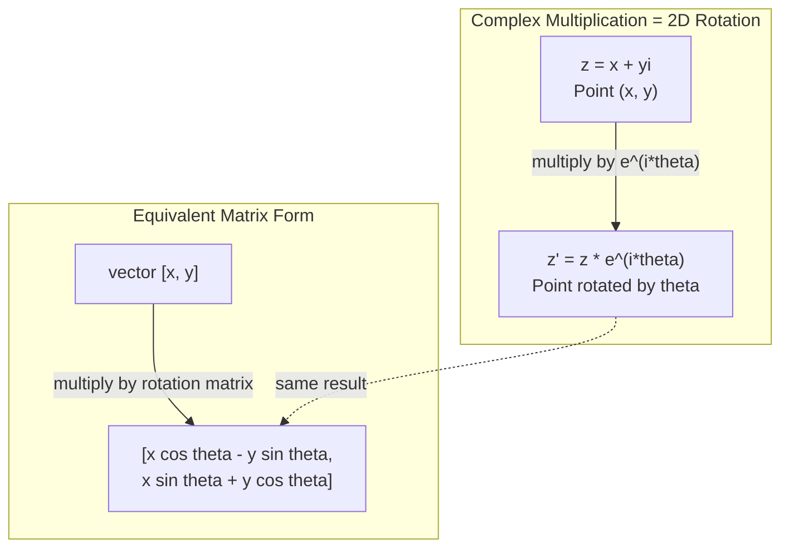
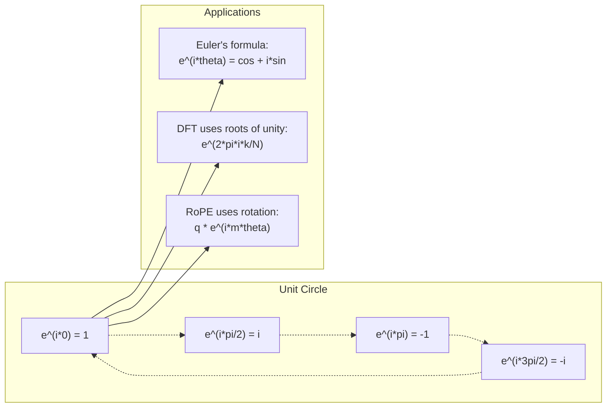

# Números complejos para IA.

> La raíz cuadrada de -1 no es imaginaria, es la clave de las rotaciones, las frecuencias y la mitad del procesamiento de señales.
> La raíz cuadrada de -1 no es "fallado" en sí misma. Es la clave del campo de la rotación, la frecuencia y la mitad del procesamiento de señales.

**Type:** Learn | **类型:** 学习
**Language:**¿ Qué pasa ?**语言:**Python
**Prerequisites:** Phase 1, Lessons 01-04 (linear algebra, calculus) | **前置知识:** Phase 1, 第 01-04 课（线性代数、微积分）
**Time:** ~60 minutes | **时间:** ~60 分钟

## Objetivos de aprendizaje

- Realizar aritmética compleja (agrega, multiplica, divide, conjugue) en forma rectangular y polar
  执行复数运算(加、乘、除、共), incluidos los números de la forma de la posición vertical y la posición vertical
- Aplicar la fórmula de Euler para convertir entre exponenciales complejos y funciones trigonómétricas
  应用 欧拉公式在复指数和三角函数之间转换
- Implemente la Transforma de Fourier discreta utilizando raíces complejas de unidad
  Utilizaciones de la base para lograr la dispersión
- Explicar cómo se basan las rotaciones complejas en las codificaciones de posición de RoPE y sinusoidal en transformadores
   Explicar la cantidad de rotación cómo se construye RoPE y Transformer 正弦位置编码的基础


> **【中文解读】**
> 虚数 i es la clave de la rotación y la frecuencia. La rotación y la frecuencia de los cambios de posición en el transformador (ROPE) es la clave de la rotación y la frecuencia.

## El problema es la introducción del problema

Abres un artículo sobre las transformaciones de Fourier y hay`i`Mira los codificadores de posición del transformador y ves`sin`y `cos`En diferentes frecuencias, las partes reales e imaginarias de exponenciales complejos.

> ¿Has abierto un artículo sobre el cambio de la vida?`i`△ Usted ve Transformer  ubicación  codificación, ver diferentes frecuencias `sin`Y `cos` Son la parte real y la parte real de los índices de repetición.

Los números complejos parecen abstractos. Un sistema de números construido en la raíz cuadrada de -1 se siente como un truco matemático. Pero no es un truco. Es el lenguaje natural de las rotaciones y oscilaciones. Cada vez que algo gira, vibra o oscila, los números complejos son la herramienta correcta.

> El número de números parece muy abstracto. Se basa en la raíz cuadrada de -1 y se siente como un juego matemático. Pero no es un juego. Es el lenguaje natural de la rotación y la oscilación. Cada vez que algo gira, oscila o oscila, el número de números es un instrumento correcto.

Sin entender los números complejos, no puede entender la Transforma de Fourier Discreta. No puede entender FFT. No puede entender cómo funciona RoPE (Rotary Position Embedding) en modelos de lenguaje modernos. No puede entender por qué los codificadores posicionales sinusoidales en el papel original del Transformer usan las frecuencias que hacen.

> No entiendo el número de veces, no entiendo el número de veces. No entiendo el número de veces. No entiendo el número de veces.

Esta lección construye la aritmética compleja desde cero, la conecta con la geometría y te muestra exactamente dónde aparecen los números complejos en el aprendizaje automático.

> Esta clase se desarrolla desde el núcleo de la construcción de números de cálculo, se relaciona con la geometría, y muestra con precisión la posición de los números de cálculo que surgen en el aprendizaje automático.

## El concepto central.

> **【中文解读】**
> 复数的核心洞察:i 不是"虚"的, es una operación de rotación de 90 grados.

> **【拓展：复数在 AI 中的实际应用规模】**
> La serie de LLaMA de OpenAI utiliza RoPE (Rotary Position Embedding), en esencia es una serie de rotativas. Cada uno de los pasos se realiza en un grupo de rotativas.

### ¿Qué es un número complejo?

Un número complejo tiene dos partes: una parte real y una parte imaginaria.

> 复数有两部分:实部 (Real Part) y虚部 (Imaginary Part)

```
z = a + bi

where:
  a is the real part
  b is the imaginary part
  i is the imaginary unit, defined by i^2 = -1
```

Así es. se extiende la línea numérica en un plano. los números reales se sientan en un eje. los números imaginarios se sientan en el otro. cada número complejo es un punto en este plano.

> Así es. Tú has hecho que el eje de números se expanda a una plana. El número real está en un eje. El número virtual está en otro eje. Cada número de números es un punto de esta plana.

### Aritmética compleja

**Addition.**Añade las partes reales, añade las partes imaginarias.

> **加法。**¿Qué es eso?

```
(a + bi) + (c + di) = (a + c) + (b + d)i

Example: (3 + 2i) + (1 + 4i) = 4 + 6i
```

**Multiplication.**Utilice la ley distributiva y recuerde que i^2 = -1.

> **乘法。**Utiliza la ley de distribución, recuerda que i^2 = -1──

```
(a + bi)(c + di) = ac + adi + bci + bdi^2
                 = ac + adi + bci - bd
                 = (ac - bd) + (ad + bc)i

Example: (3 + 2i)(1 + 4i) = 3 + 12i + 2i + 8i^2
                            = 3 + 14i - 8
                            = -5 + 14i
```

**Conjugate.**Vuelve la señal de la parte imaginaria.

> **共轭（Conjugate）。**翻转虚部的符号──

```
conjugate of (a + bi) = a - bi
```

El producto de un número complejo y su conjugado es siempre real:

> El número multiplicado y el número multiplicado son números reales:

```
(a + bi)(a - bi) = a^2 + b^2
```

**Division.**Multiplicar el numerador y el denominador por el conjugado del denominador.

> **除法。**分子 y分母 simultáneamente multiplicadas por la共──

```
(a + bi) / (c + di) = (a + bi)(c - di) / (c^2 + d^2)
```

Esto elimina la parte imaginaria del denominador, dándole un número complejo limpio.

> Esto elimina la parte nula de la matriz, obteniendo un número de veces limpio.

### El plano complejo

El plano complejo mapea cada número complejo a un punto 2D. El eje horizontal es el eje real, el eje vertical es el eje imaginario.

> 复平面将每复数映射为2D点──水平轴是实轴,垂直轴是虚轴──

```
z = 3 + 2i  corresponds to the point (3, 2)
z = -1 + 0i corresponds to the point (-1, 0) on the real axis
z = 0 + 4i  corresponds to the point (0, 4) on the imaginary axis
```

Un número complejo es simultáneamente un punto y un vector desde el origen. Esta interpretación dual es lo que hace que los números complejos sean útiles para la geometría.

> 复数同时是一个点和从原点发发的向量―― esta doble interpretación hace que el número complejo sea muy útil en la geometría―.

### Forma polar

Cualquier punto del plano puede describirse por su distancia del origen y su ángulo del eje real positivo.

> Cualquier punto en la superficie puede describirse con la distancia del punto original y el ángulo del eje real.

```
z = r * (cos(theta) + i*sin(theta))

where:
  r = |z| = sqrt(a^2 + b^2)     (magnitude, or modulus)
  theta = atan2(b, a)             (phase, or argument)
```

La forma rectangular (a + bi) es buena para la adición.

> 直角坐标形式 (a + bi) 适合加法。极坐标形式 (r, theta) 适合乘法。

**Multiplication in polar form.**Multiplica las magnitudes, añade los ángulos.

> **极坐标形式的乘法。**模相乘,角相加──

```
z1 = r1 * e^(i*theta1)
z2 = r2 * e^(i*theta2)

z1 * z2 = (r1 * r2) * e^(i*(theta1 + theta2))
```

Por eso los números complejos son perfectos para las rotaciones. Multiplicar por un número complejo con magnitud 1 es una rotación pura.

> Es por eso que el número de veces es perfecto para la rotación.

### La fórmula de Euler

El puente entre exponenciales complejos y trigonometría:

> Puente entre la función de la base y la de la base:

```
e^(i*theta) = cos(theta) + i*sin(theta)
```

Esta es la fórmula más importante en esta lección.

> Esta es la fórmula más importante de la clase.

```
e^(i*pi) = cos(pi) + i*sin(pi) = -1 + 0i = -1

Therefore: e^(i*pi) + 1 = 0
```

Cinco constantes fundamentales (e, i, pi, 1, 0) unidas en una ecuación.

> 五个基本常数 ((e、i、pi、1、0) 统一在一个方程中。

### Por qué la fórmula de Euler es importante para ML

La fórmula de Euler dice que`e^(i*theta)`En theta = 0, se encuentra en (1, 0). En theta = pi/2, se encuentra en (0, 1). En theta = pi, se encuentra en (-1, 0). En theta = 3*pi/2, se encuentra en (0, -1).

> 欧拉公式说 `e^(i*theta)`随着 theta 变化描绘单位圆――theta = 0 时在 (1, 0)──theta = pi/2 时在 (0, 1)──theta = pi 时在 (-1, 0)──theta = 3*pi/2 时在 (0, -1)──完整旋转是 theta = 2*pi。

Esto significa que los exponenciales complejos son rotaciones. Y las rotaciones están en todas partes en procesamiento de señales y ML.

> Esto significa que el índice de repetición es la rotación. La rotación no está presente en el procesamiento de señales y en el ML.

> **【中文解读】**
> 欧拉公式 e^(i*theta) = cos(theta) + i*sin(theta) es la fórmula más importante de este curso.

### Conexión a las rotaciones 2D

Multiplicando el número complejo (x + yi) por e^(i*theta) gira el punto (x, y) por ángulo theta alrededor del origen.

> 将复数 (x + yi) 乘以 e^(i*theta) 将点 (x, y) 绕原点旋转角 theta。

```
Rotation via complex multiplication:
  (x + yi) * (cos(theta) + i*sin(theta))
  = (x*cos(theta) - y*sin(theta)) + (x*sin(theta) + y*cos(theta))i

Rotation via matrix multiplication:
  [cos(theta)  -sin(theta)] [x]   [x*cos(theta) - y*sin(theta)]
  [sin(theta)   cos(theta)] [y] = [x*sin(theta) + y*cos(theta)]
```

La matriz de rotación es simplemente una multiplicación compleja escrita en notación de matriz.

> 它们 producen el mismo resultado. 复数乘法就是 2D 旋转. 旋矩阵只是使用矩阵符号写出的复数乘法.



### Fámeros y señales giratorias

Un complejo exponencial e^(i*omega*t) es un punto que gira alrededor del círculo unitario a frecuencia angular omega.

> 复指数 e^(i*omega*t) es un punto de giro en torno a una unidad de la frecuencia de la onda de la onda de la onda de la onda de la onda de la onda de la onda de la onda de la onda de la onda de la onda de la onda de la onda de la onda de la onda de la onda de la onda de la onda de la onda de la onda de la onda de la onda de la onda de la onda de la onda de la onda de la onda de la onda de la onda de la onda de la onda de la onda de la onda de la onda de la onda de la onda de la onda de la onda de la onda de la onda de la onda de la onda de la onda de la onda de la onda de la onda de la onda de la onda de la onda de la onda de la onda de la onda de la onda de la onda de la onda de la onda de la onda de la onda de la onda de la onda de la onda de la onda de la onda de la onda de la onda de la onda.

La parte real de este punto de rotación es cosmoso (o) y la parte imaginaria es sin (o) y una señal sinusoidal es la sombra de un número complejo rotativo.

> Este es el punto de rotación de la señal de la señal de la señal de rotación.

```
e^(i*omega*t) = cos(omega*t) + i*sin(omega*t)

Real part:      cos(omega*t)    -- a cosine wave
Imaginary part: sin(omega*t)    -- a sine wave
```

Esta es la representación de las fases. En lugar de rastrear una onda sinusal moviéndose, rastreas una flecha que gira suavemente. Los cambios de fase se convierten en compensaciones de ángulo. Los cambios de amplitud se convierten en cambios de magnitud. La adición de señales se convierten en adición vectorial.

> Éste es el phasor. El phasor no tiene que seguir las ondas de la línea de un movimiento, sino que debe seguir las arcos de la rotación plana. El desplazamiento de un punto de vuelo se transforma en un ángulo de desplazamiento.

### Raíces de la unidad

Las raíces N-th de la unidad son N puntos equitativamente espaciados en el círculo unitario:

> N 次单位根(Redes de Unidad) es un unidad de círculo y de distancia distribuida N 个点:

```
w_k = e^(2*pi*i*k/N)    for k = 0, 1, 2, ..., N-1
```

Para N = 4, las raíces son: 1, i, -1, -i (los cuatro puntos de la brújula).
Para N = 8, obtienes los cuatro puntos de la brújula más las cuatro diagonales.

Las raíces de la unidad son la base de la Transforma de Fourier Discreta.

> La unidad de raíz es la base de la diferenciación de la frecuencia.

> **【中文解读】**
> 单位根是N 个等间距分布在单位圆上的点点――它们的两个奇特性: 1) Cada modelo tiene su propio 1; 2) Todo se suma con su propio 0.

### Conexión a la DFT

La Transforma de Fourier discreta de una señal x[0], x[1], ..., x[N-1] es:

> 信号 x[0], x[1], ..., x[N-1] 的离散里叶变换为:

```
X[k] = sum_{n=0}^{N-1} x[n] * e^(-2*pi*i*k*n/N)
```

Cada X[k] mide cuánto correlaciona la señal con la raíz k-th de la unidad - un sinusoide complejo a frecuencia k. El DFT rompe una señal en N fases giratorias y le dice la amplitud y fase de cada uno.

> Cada X[k] mide la conexión de los signos con la raíz de la k 个单位频率为 k 的复正弦波──DFT se dividirá en N 个旋转相量, que le dice la amplitud y la posición de cada uno.

### ¿Por qué no soy imaginario?

La palabra "imaginario" es un accidente histórico. Descartes lo usó de manera despreciable. Pero i no es más imaginario que los números negativos cuando la gente los rechazó por primera vez. Los números negativos responden "¿qué se resta 5 de 3 para obtener?"

> Esta frase "虚" es una casualidad histórica. Descartes la usó para hacerla más baja. Pero no me comparó con el número negativo inicialmente rechazado por la gente.

Más útil: i es un operador de rotación de 90 grados. Multiplicar un número real por i una vez, giras 90 grados al eje imaginario. Multiplicar por i de nuevo (i^2), giras otros 90 grados - ahora estás apuntando en la dirección real negativa. Es por eso que i^2 = -1. No es misterioso. Es una mitad de giro construida a partir de dos cuartos de giro.

> Más útil entender: i es un cálculo de rotación de 90 grados. El número real se multiplica una vez, tú roteas 90 grados hasta el eje falso. Replique i(i^2), vuelve a rotear 90 grados ahora en dirección negativa.

Por eso los números complejos están en todas partes en la ingeniería. Cualquier cosa que gira - ondas electromagnéticas, estados cuánticos, oscilaciones de señal, codificación posicional - se describe naturalmente por números complejos.

> Por eso el número de veces no está en el diseño. Todo lo que gira es una onda electromagnética, un estado cuántico, un movimiento de señal, un código de posición.

### Las funciones de exponenciales complejas frente a las trigonométricas

Antes de la fórmula de Euler, los ingenieros escribieron señales como A*cos(omega*t + phi) --amplitud A, frecuencia omega, fase phi. Esto funciona pero hace que la aritmética sea dolorosa. Agregar dos cosinos con fases diferentes requiere identidades trigonómétricas.

> Antes de la fórmula, el ingeniero escribirá la señal en A*cos(omega*t + phi) 幅度 A、频率 omega、相位 phi―. Esto es posible pero hacer que el cálculo sea doloroso―.

Con exponenciales complejos, la misma señal es A*e^(i*(omega*t + phi)). Agregar dos señales es simplemente agregar dos números complejos. Multiplicar (modular) es simplemente multiplicar magnitudes y agregar ángulos.

> Uso de la misma señal es A*e^(i*(omega*t + phi))。 dos señales de paso es dos de paso de paso de paso.

El campo entero de procesamiento de señales cambió a la notación exponencial compleja porque la matemática es más limpia. La "señal real" es siempre solo la parte real de la representación compleja. La parte imaginaria se lleva junto como contabilidad, haciendo que todo el álgebra funcione de manera natural.

> Todo el campo del procesamiento de señales se transfiere hacia el índice de números, ya que la matemática es más simple.

> **【拓展：复数在量子计算中的角色】**
> La base de la matemática cuántica es el estado de un quintobit en el cual el número de bits es alfa ≠ 0> + beta ≠ 1, en el cual el número de bits es alfa ≠ 2 + ≠ beta ≠ 2 = 1, alfa y beta ≠ 2 ≠ 2 ≠ 2 ≠ 1 ≠ 2 ≠ 1 ≠ 1 ≠ 1 ≠ 1 ≠ 1 ≠ 2 ≠ 1 ≠ 1 ≠ 1 ≠ 1 ≠ 1 ≠ 1 ≠ 1 ≠ 1 ≠ 1 ≠ 1 ≠ 1 ≠ 1 ≠ 1 ≠ 1 ≠ 1 ≠ 1 ≠ 1 ≠ 1 ≠ 1 ≠ 1 ≠ 1 ≠ 1 ≠ 1 ≠ 1 ≠ 1 ≠ 1 ≠ 1 ≠ 1 ≠ 1 ≠ 1 ≠ 1 ≠ 1 ≠ 1 ≠ 1 ≠ 1 ≠ 1 ≠ 1 ≠ 1 ≠ 1 ≠ 1 ≠ 1 ≠ 1 ≠ 1 ≠ 1 ≠ 1 ≠ 1 ≠ 1 ≠ 1 ≠ 1 ≠ 1 ≠ 1 ≠ 1 ≠ 1 ≠ 1 ≠ 1 ≠ 1 ≠ 1 ≠ 1 ≠ 1 ≠ 1 ≠ 1 ≠ 1 ≠ 1 ≠ 1 ≠ 1 ≠ 1 ≠ 1 ≠ 1 ≠ 1 ≠ 1 ≠ 1 ≠ 1 ≠ 1 ≠ 1 ≠ 1   ≠ 1    ≠ 1                                                                                                                                                                                       

### Conexión a transformadores

**Sinusoidal positional encodings**(papel original de transformador):

```
PE(pos, 2i) = sin(pos / 10000^(2i/d))
PE(pos, 2i+1) = cos(pos / 10000^(2i/d))
```

Los pares de pecado y cos son las partes reales e imaginarias de exponenciales complejos a diferentes frecuencias. Cada frecuencia proporciona una "resolución" diferente para la posición de codificación. Las frecuencias bajas cambian lentamente (posición gruesa). Las frecuencias altas cambian rápidamente (posición fina). Juntas dan a cada posición una huella digital de frecuencia única.

> Sin y cos a la vez es un índice de frecuencia diferente. Cada frecuencia para la codificación de la posición proporciona una "resolución" diferente.

**RoPE (Rotary Position Embedding)**El modelo de la información se calcula utilizando estos vectores rotados, haciendo que el modelo sea sensible a la posición relativa a través de la multiplicación compleja.

> **RoPE（旋转位置编码）**Más adelante, la clave se traduce en la búsqueda y la clave, y la posición relativa entre dos tokens se convierte en un ángulo de rotación.

> **【拓展：RoPE 在 LLaMA 和 GPT-NeoX 中的实现】**
> RoPE hará una consulta y una clave orientada a la dimensión a la dimensión de la posición, y luego multiplicará el factor de rotación que cambia de ángulo a la posición. Para el modelo de la dimensión d = 4096 ∞, la longitud de la secuencia L = 4096 ∞, RoPE ejecuta L^2/2 veces la multiplicidad de cada par (q, k) ∞, en comparación con el código de posición absoluta, la ventaja de RoPE es que la posición de la posición en la posición relativa de la corteza de rotación depende sólo de la diferencia de posición, lo que naturalmente apoya el "extraordinamiento" ∞ cuando se ve la longitud de 2048 ∞, la racionalización puede extenderse a una secuencia más larga.

| Operation | Algebraic Form | Geometric Meaning |
|-----------|---------------|-------------------|
| Addition | (a+c) + (b+d)i | Vector addition in the plane |
| Multiplication | (ac-bd) + (ad+bc)i | Rotate and scale |
| Conjugate | a - bi | Reflect over real axis |
| Magnitude | sqrt(a^2 + b^2) | Distance from origin |
| Phase | atan2(b, a) | Angle from positive real axis |
| Division | multiply by conjugate | Reverse rotation and rescale |
| Power | r^n * e^(i*n*theta) | Rotate n times, scale by r^n |



## Construye y realiza.
```figure
roots-of-unity
```

## Construye el mismo

### Paso 1: clase compleja

Construye una clase de números complejos que admita la aritmética, la magnitud, la fase y la conversión entre formas rectangulares y polares.

> Construir un grupo de números, apoyar el cálculo de operaciones 模、相位, así como la transformación entre el eje eje eje y el eje eje eje.

```python
import math

class Complex:
    def __init__(self, real, imag=0.0):
        self.real = real
        self.imag = imag

    def __add__(self, other):
        return Complex(self.real + other.real, self.imag + other.imag)

    def __mul__(self, other):
        r = self.real * other.real - self.imag * other.imag  # 实部：(ac - bd)
        i = self.real * other.imag + self.imag * other.real  # 虚部：(ad + bc)
        return Complex(r, i)

    def __truediv__(self, other):
        denom = other.real ** 2 + other.imag ** 2            # 分母：c^2 + d^2
        r = (self.real * other.real + self.imag * other.imag) / denom  # 乘以共轭后的实部
        i = (self.imag * other.real - self.real * other.imag) / denom  # 乘以共轭后的虚部
        return Complex(r, i)

    def magnitude(self):
        return math.sqrt(self.real ** 2 + self.imag ** 2)

    def phase(self):
        return math.atan2(self.imag, self.real)

    def conjugate(self):
        return Complex(self.real, -self.imag)
```

### Paso 2: Conversión polar y fórmula de Euler

```python
def to_polar(z):
    return z.magnitude(), z.phase()

def from_polar(r, theta):
    return Complex(r * math.cos(theta), r * math.sin(theta))

def euler(theta):
    return Complex(math.cos(theta), math.sin(theta))
```

Verifique:`euler(theta).magnitude()`siempre debe ser 1.0. `euler(0)`debe dar (1, 0). `euler(pi)`debe dar (-1, 0).

> 验证:`euler(theta).magnitude()`应始终为 1.0。`euler(0)`应给出 (1, 0)`euler(pi)`应给出 (-1, 0)

### Paso 3: Rotación

Rotar un punto (x, y) por ángulo theta es una multiplicación compleja:

> 将点 (x, y) 旋转角度 theta 只有需要一次复数乘法:

```python
point = Complex(3, 4)
rotated = point * euler(math.pi / 4)
```

La magnitud se mantiene igual, sólo cambia el ángulo.

> 模保持不变──只有角度改变──

### Paso 4: DFT de la aritmética compleja

```python
def dft(signal):
    N = len(signal)                               # 信号长度
    result = []
    for k in range(N):
        total = Complex(0, 0)
        for n in range(N):
            angle = -2 * math.pi * k * n / N      # 第 k 个单位根的角度
            total = total + Complex(signal[n], 0) * euler(angle)  # 累加：信号与旋转相量的相关
        result.append(total)
    return result
```

Esta es la O(N^2) DFT. Cada salida X[k] es la suma de las muestras de señal multiplicadas por raíces de unidad.

> Es la DFT de O(N^2) ⋅ cada salida X[k] ⋅ es el señal muestra multiplicada por la unidad de raíz y ⋅

### Paso 5: DFT inverso

El DFT inverso reconstruye la señal original de su espectro. Los únicos cambios del DFT hacia adelante: voltear la señal en el exponente y dividir por N.

> 逆 DFT 从频谱重建原始信号──与正向 DFT的唯一区别:翻转指数符号并除以 N──

```python
def idft(spectrum):
    N = len(spectrum)
    result = []
    for n in range(N):
        total = Complex(0, 0)
        for k in range(N):
            angle = 2 * math.pi * k * n / N
            total = total + spectrum[k] * euler(angle)
        result.append(Complex(total.real / N, total.imag / N))
    return result
```

Esto le da una reconstrucción perfecta. Aplique DFT, luego IDFT, y usted vuelve la señal original a la precisión de la máquina. No se pierde información.

> Esto te da una reconstrucción perfecta. Aplica DFT, reaplica IDFT, recupera la señal original con precisión de máquina.

### Paso 6: Raíces de la unidad

```python
def roots_of_unity(N):
    return [euler(2 * math.pi * k / N) for k in range(N)]
```

Verifique dos propiedades:
- Cada raíz tiene magnitud exactamente 1.
  Cada raíz tiene un modo de hacer.
- La suma de todas las raíces N es cero (anulan por simetría).
  Los resultados de la investigación de la investigación de la investigación de la investigación de la investigación de la investigación de la investigación de la investigación de la investigación de la investigación de la investigación de la investigación de la investigación de la investigación de la investigación de la investigación de la investigación de la investigación de la investigación de la investigación de la investigación de la investigación de la investigación de la investigación de la investigación de la investigación de la investigación de la investigación de la investigación de la investigación de la investigación de la investigación de la investigación de la investigación de la investigación de la investigación de la investigación de la investigación de la investigación de la investigación de la investigación de la investigación de la investigación de la investigación de la investigación de la investigación de la investigación de la investigación de la investigación de la investigación de la investigación de la investigación de la investigación de la investigación de la investigación de la investigación de la investigación de la investigación de la investigación de la investigación de la investigación de la investigación de la investigación de la investigación de la investigación de la investigación de la investigación de la investigación de la investigación de la investigación de la investigación de la investigación de la investigación de la investigación de la investigación de la investigación de la investigación de la investigación de la investigación de la investigación de la investigación de la investigación de la investigación de la investigación de la investigación de la investigación de la investigación de la investigación de la investigación de la investigación de la ciencia de la ciencia de la ciencia de la ciencia de la ciencia de la ciencia de la ciencia de la ciencia de la ciencia de la ciencia de la ciencia de la ciencia de la ciencia de la ciencia de la ciencia de la ciencia de la ciencia de la ciencia de la ciencia de la ciencia de la ciencia de la ciencia de la ciencia de la ciencia de la ciencia de la ciencia de la ciencia de la ciencia de la ciencia de la ciencia de la ciencia de la ciencia de la ciencia de la ciencia de la ciencia de la ciencia de la ciencia de la ciencia de la ciencia de la ciencia de la ciencia de la ciencia de la ciencia de la ciencia de la ciencia de la ciencia de la ciencia de la ciencia de la ciencia de la ciencia de la ciencia de la ciencia de la ciencia de la ciencia de la ciencia de la ciencia de la ciencia de la ciencia de la ciencia de la ciencia de la ciencia de la ciencia de la ciencia de la ciencia de la ciencia de la ciencia de la ciencia de la ciencia de la ciencia de la ciencia de la ciencia de la ciencia de la ciencia de la ciencia de la ciencia de la ciencia de la ciencia de la ciencia de la ciencia de

Estas propiedades son lo que hace invertible el DFT. Las raíces de la unidad forman una base ortogonal para el dominio de frecuencia.

> Estas características hacen que la DFT sea opuesta.

## Usalo con el marco de ejecución

Python tiene soporte integrado de números complejos.`j`representa la unidad imaginaria.

> Python 内置复数支持──字面量 `j`Muestra la cantidad de unidades.

```python
z = 3 + 2j
w = 1 + 4j

print(z + w)
print(z * w)
print(abs(z))

import cmath
print(cmath.phase(z))
print(cmath.exp(1j * cmath.pi))
```

Para matrices, numpy maneja números complejos de forma nativa:

> 对于数组,numpy 原生处理复数:

```python
import numpy as np

z = np.array([1+2j, 3+4j, 5+6j])
print(np.abs(z))
print(np.angle(z))
print(np.conj(z))
print(np.real(z))
print(np.imag(z))

signal = np.sin(2 * np.pi * 5 * np.linspace(0, 1, 128))
spectrum = np.fft.fft(signal)
freqs = np.fft.fftfreq(128, d=1/128)
```

## Envíe el producto .

- ¿ Qué ?`code/complex_numbers.py`para generar `outputs/skill-complex-arithmetic.md`¿ Qué ?

> 运行                                                                                                                                                                                                                                                                                                                                                                                                                                                                                                                           `code/complex_numbers.py`¿Qué es esto ?`outputs/skill-complex-arithmetic.md`(复数运算技能文档)

## Los ejercicios.

1. **Complex arithmetic by hand.**Compute (2 + 3i) * (4 - i) y verifique con el código. Luego compute (5 + 2i) / (1 - 3i). Dibuja ambos resultados en el plano complejo y compruebe que la multiplicación giró y escalaron el primer número.

2. **Rotation sequence.**Comience con el punto (1, 0). Multiplica por e^(i*pi/6) doce veces. Verifique si regresa a (1, 0) después de 12 multiplicaciones. Imprime las coordenadas en cada paso y confirme que rastrean un 12-gon regular.

3. **DFT of a known signal.**Crear una señal que es la suma de sin ((2 * pi * 3 * t) y 0.5 * sin ((2 * pi * 7 * t) muestrada en 32 puntos. ejecutar su DFT. Verifique si el espectro de magnitud tiene picos en las frecuencias 3 y 7, con el pico en 7 es la mitad de la altura del pico en 3.

4. **Roots of unity visualization.**Compute las 8a raíces de la unidad. Verifique si suman a cero. Verifique si multiplicando cualquier raíces por la raíces primitiva e^(2*pi*i/8) da la siguiente raíces.

5. **Rotation matrix equivalence.**Para 10 ángulos aleatorios y 10 puntos aleatorios, verifique que la multiplicación compleja da el mismo resultado que la multiplicación de matrices-vectores con la matriz de rotación 2x2. Imprima la diferencia numérica máxima.

## Términos clave .

| Term | What it means |
|------|---------------|
| Complex number | A number a + bi where a is the real part, b is the imaginary part, and i^2 = -1 |
| Imaginary unit | The number i, defined by i^2 = -1. Not imaginary in the philosophical sense -- it is a rotation operator |
| Complex plane | The 2D plane where the x-axis is real and the y-axis is imaginary. Also called the Argand plane |
| Magnitude (modulus) | The distance from the origin: sqrt(a^2 + b^2). Written as \|z\| |
| Phase (argument) | The angle from the positive real axis: atan2(b, a). Written as arg(z) |
| Conjugate | The mirror image across the real axis: conjugate of a + bi is a - bi |
| Polar form | Expressing z as r * e^(i*theta) instead of a + bi. Makes multiplication easy |
| Euler's formula | e^(i*theta) = cos(theta) + i*sin(theta). Connects exponentials to trigonometry |
| Phasor | A rotating complex number e^(i*omega*t) representing a sinusoidal signal |
| Roots of unity | The N complex numbers e^(2*pi*i*k/N) for k = 0 to N-1. N equally spaced points on the unit circle |
| DFT | Discrete Fourier Transform. Decomposes a signal into complex sinusoidal components using roots of unity |
| RoPE | Rotary Position Embedding. Uses complex multiplication to encode relative position in transformer attention |

> 术语速查:número complejo(复数 a+bi)、Unidad imaginaria(虚数单位 i,旋转算子)、Plan complejo(复平面)、Magnitud/módulo(模 √(a2+b2))、Fase/argumento(相位 atan2(b,a))、Conjugate(共 a-bi)、Polar forma(极坐标 r·e^(iθ、)) 欧拉公式 e^(iθ)=θ+i·sinθ)、Phasor(旋转相量)、Redes de la unidad 单位 N 个均分单位圆的点)、DFT散离里叶变换)、Rocos 转位置编码,L(La 模型使用等).

## Más Leer más Leer más

- [Visual Introduction to Euler's Formula](https://betterexplained.com/articles/intuitive-understanding-of-eulers-formula/)- construye intuición geométrica sin notación pesada
- [Su et al.: RoFormer (2021)](https://arxiv.org/abs/2104.09864)- el documento que introduce el emplazamiento rotativo de posición mediante rotación compleja
- [Vaswani et al.: Attention Is All You Need (2017)](https://arxiv.org/abs/1706.03762)- el papel original de transformador con codificación posicional sinusoidal
- [3Blue1Brown: Euler's formula with introductory group theory](https://www.youtube.com/watch?v=mvmuCPvRoWQ)- explicación visual de por qué e^(i*pi) = -1
- [Needham: Visual Complex Analysis](https://global.oup.com/academic/product/visual-complex-analysis-9780198534464)- el mejor tratamiento visual de números complejos, lleno de conocimientos geométricos
- [Strang: Introduction to Linear Algebra, Ch. 10](https://math.mit.edu/~gs/linearalgebra/)- números complejos en el contexto del álgebra lineal y los valores propios
