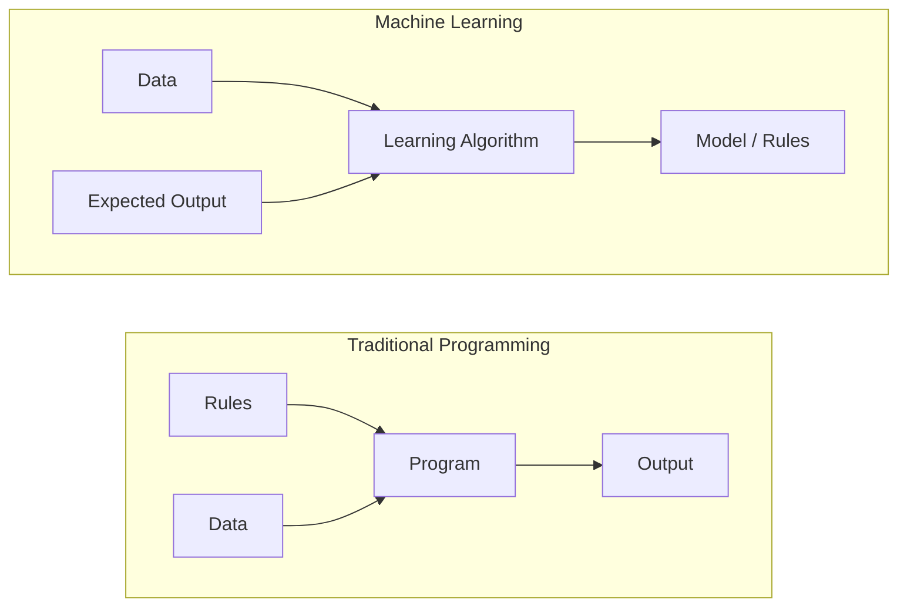
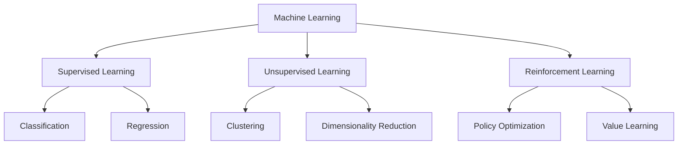
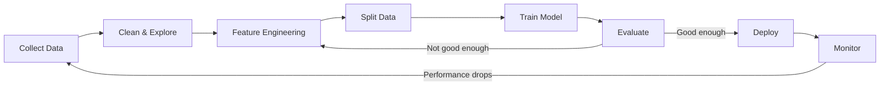
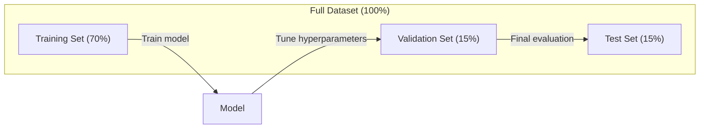
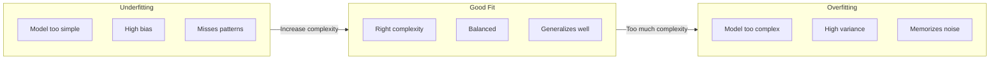
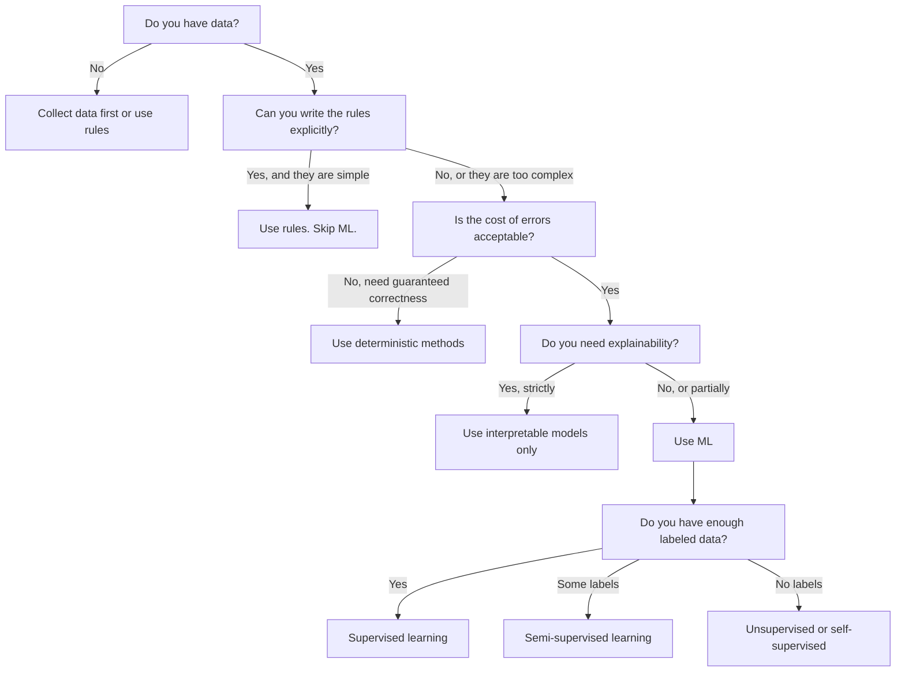

# ¿Qué es el aprendizaje automático?
# ¿Qué es el aprendizaje de máquina?


> El aprendizaje automático enseña a las computadoras a encontrar patrones en los datos en lugar de escribir reglas a mano.

> El aprendizaje automático es el aprendizaje de las reglas de la información de la computadora, no de las reglas de redacción artificial.

**Type:** Learn | **类型：** 学习
**Languages:** Python
**Prerequisites:** Phase 1 (Math Foundations) | **前置知识：** Phase 1（数学基础）
**Time:** ~45 minutes | **时间：** 约 45 分钟

## Objetivos de aprendizaje

- Explica la diferencia entre el aprendizaje supervisado, no supervisado y el refuerzo y identifique qué tipo se aplica a un problema dado
  解释监督学习、无监督学习和强化学习之间的 diferencia, y juzgar qué tipo de problemas se aplican
- Implementar un clasificador de centróides más cercano desde cero y evaluarlo en comparación con una línea de base aleatoria
  Desde el principio de la realización de la clasificación de la calidad más reciente, y con la base de la evolución de la evaluación comparativa
- Distinguir entre las tareas de clasificación y regresión y seleccionar la función de pérdida apropiada para cada una
  区分分类和归归任务, para cada tarea seleccionar la función de pérdida adecuada
- Evaluar si un problema empresarial dado es adecuado para ML o mejor resuelto con reglas deterministas
   evaluar si un problema de negocio es adecuado para la solución de la ML, o mejor con reglas de determinación


> **【中文解读】**
> El aprendizaje automático es hacer que el ordenador aprenda automáticamente de los datos, en lugar de por regla de redacción artificial.

> **【拓展：机器学习范式的产业应用】**
> GPT-4 utiliza autocontrol aprendizaje(pre测下一个代币) en alrededor de 13 millones de token 上训练;BERT utiliza掩码语言建模在 Wikipedia + BookCorpus 上预训练;AlphaGo utiliza强化学习通过自我对对超越人类围棋冠军。

## El problema es la introducción del problema

Si quieres construir un filtro de spam. El enfoque tradicional: sentarte y escribir cientos de reglas. "Si el correo electrónico contiene 'dinero GRATUITO', marca spam. Si tiene más de 3 marcas de exclamación, marca spam". Pasas semanas escribiendo reglas. Luego los spammers cambian su redacción. Tus reglas rompen. Escribas más reglas. El ciclo nunca termina.

> Tu quieres construir un filtro de correo basura. El método tradicional es sentarte y escribir cientos de reglas. "Si el correo contiene 'dinero gratis', etiquete como correo basura. Si más de tres signos, etiquete como correo basura". Tu gastaste varias semanas escribiendo reglas.

El aprendizaje automático cambia esto. En lugar de escribir reglas, le das a la computadora miles de correos electrónicos etiquetados ("spam" o "no spam") y le dejas que descubra las reglas por sí mismo. La computadora encuentra patrones que nunca habrías pensado. Cuando los spammers cambian de táctica, se retrain en nuevos datos en lugar de reescribir código.

> El aprendizaje automático ha alterado esta forma de escribir. No se trata de escribir reglas, sino de enviar a un ordenador miles de mensajes de correo bien etiquetados. Deja que el ordenador descubra reglas. El ordenador puede descubrir un modelo que nunca imaginaste. Cuando el emisor de correo basura cambia su estrategia, sólo necesitas reentrenarse en nuevos datos, no volver a escribir el código.

Este cambio de "reglas de programación" a "aprendizaje a partir de datos" es el núcleo del aprendizaje automático.

> La transformación de las reglas de programación a las de aprendizaje en datos es el núcleo del aprendizaje automático.

> **【中文解读】**
> El programación tradicional es "personal writing rules, machine execution"; machine learning es "personal giving data, machine finding rules" (personal giving data, machine finding rules) ∙ Por ejemplo, el método tradicional requiere mantener manualmente y mantener cientos de reglas, mientras que el método ML solo necesita proporcionar una gran cantidad de marcas, el modelo se aprende automáticamente para determinar el modo de usar. Cuando la estrategia de correo basura cambia, se necesita reentrenar y no reescribir el código―.

> **【拓展：垃圾邮件过滤的演进】**
> El filtro de correo basura de Gmail procesa alrededor de 3 mil millones de mensajes diarios, con una tasa de precisión superior al 99,9%.

## El concepto central.

### Aprender de los datos, no de las reglas

La programación tradicional y el aprendizaje automático resuelven problemas en direcciones opuestas.

> La programación tradicional y el aprendizaje de máquinas en dirección opuesta a la solución de problemas.



Programación tradicional: usted escribe las reglas. El programa las aplica a los datos para producir salida.

> 傳統編程:你编寫規則──程序將規則應用于数据以生成输出──

Aprendizaje automático: usted proporciona datos y resultados esperados. El algoritmo descubre las reglas.

> 机器学习:你提供数据和期望输出―― algoritmo automático de descubrimiento de reglas―

El "modelo" que se obtiene de la formación es las reglas, codificadas como números (pesos, parámetros).

> El "modelo" que se produce es la regla en sí misma, codificada en forma de números, y puede generalizarse a partir de muestras ya vistas, haciendo predicciones sobre nuevos datos nunca vistos.

> **【中文解读】**
> 传统编程与机器学习的本质区别:传统编程输入"规则+数据"得到"输出";机器学习输入"数据+期望输出"得到"模型 (规则) ⋅模型本质上就是使用数字编码的规则 (权重和参数),它能对从未见过的新数据做预测――这是"泛化"AI 系统的核心能力――

### Los tres tipos de aprendizaje automático



**Supervised Learning**El modelo aprende a mapear las entradas a las salidas.
- "Aquí hay 10.000 fotos etiquetadas como gato o perro. Aprende a distinguirlas".
- "Aquí están las características y precios de la casa. Aprende a predecir el precio".

> **监督学习**Tu tienes entrada-salida para... el modelo de aprendizaje será la entrada-mareación hasta la salida...
> - "Aquí hay 10.000 张 etiquetados con fotos de gatos o perros.
> - "Here are housing features and price. Precio de la vivienda en el centro de la ciudad".

**Unsupervised Learning**El modelo encuentra estructura por sí mismo.
- "Aquí hay 10.000 historias de compras de clientes.
- "Aquí hay 1.000 puntos de datos dimensionados. Reducir a 2 dimensiones mientras mantiene la estructura".

> **无监督学习**Sólo tienes entrada, no tienes etiqueta.
> - "Hasta aquí hay 10.000 clientes que compran logros.
> - "Aquí hay 1.000 puntos de datos de dimensiones. En la estructura de conservación se reduce a 2 dimensiones".

**Reinforcement Learning**Un agente toma medidas en un entorno y recibe recompensas o sanciones. Aprende una estrategia (política) para maximizar la recompensa total.
- "Juega este juego. +1 para ganar, -1 para perder.
- "Controlo este brazo robótico. +1 para recoger el objeto, -0.01 por cada segundo desperdiciado".

> **强化学习**El sistema inteligente se basa en la acción en el entorno y obtiene recompensas o castigo.
> - "Juega este juego, gana +1, pierde -1... y descubre tu propia estrategia"".
> - "controlar este brazo mecánico... " ...se logró capturar objetos +1, por desperdicio de un segundo -0.01"".

La mayoría de lo que construirás en la práctica utiliza aprendizaje supervisado. El aprendizaje no supervisado es común para el preprocesamiento y la exploración. El aprendizaje de refuerzo potencia la IA del juego, la robótica y RLHF para modelos de lenguaje.

> En la práctica la mayor parte de los sistemas que construye utiliza el control de aprendizaje.

> **【拓展：三种范式在真实系统中的分工】**
> Netflix 推系统同时使用三种范式:协同过(无监督聚类用户群) 监督学习(预测用户对电影的评分 1-5 星) 强化学习(A/B 测试选择最优推策略) ;;Tesla Autopilot 使用监督学习(目标检测) + 强化学习(路径规划) ;; 稳定传播的训练涉及自监督(图像文本对学习 CLIP) + 监督微调;;

### Más allá de los Tres Grandes

Las tres categorías anteriores son limpias, pero el ML del mundo real a menudo borra las líneas.

> Las tres categorías anteriores son muy claras, pero el ML del mundo real suele confundir estas fronteras.

**Semi-supervised learning**El método de diagnóstico de la enfermedad de la piel es el de la piel, el de la piel, el de la piel, el de la piel, el de la piel, el de la piel, el de la piel, el de la piel, el de la piel, el de la piel, el de la piel, el de la piel, el de la piel, el de la piel, el de la piel, el de la piel, el de la piel, el de la piel, el de la piel, el de la piel, el de la piel, el de la piel, el de la piel, el de la piel, el de la piel, el de la piel, el de la piel, el de la piel, el de la piel, el de la piel, el de la piel, el de la piel, el de la piel, el de la piel, el de la piel, el de la piel, el de la piel, el de la piel, y el de la piel, el de la piel, de la piel, y el de la piel, de la piel, de la piel, de la piel, de la piel, y el de la piel, de la piel, de la piel, de la piel, de la piel, de la piel, de la piel, y el de la piel, de la piel, de la piel, de la piel, de la piel, y el de la piel, de la piel, de la piel, de la piel, de la piel, de la piel, y de la piel, de la piel, de la piel, de la piel, y de la piel, de la piel, de la piel, y de la piel, de la piel, de la piel, de la piel, de la piel, de la piel, y de la piel, de la piel, de la piel, de la piel, y de la piel, de la piel, de la piel, y de la piel, de la piel, de la piel, y de la piel, y de la piel, de la piel, y de la piel, de la piel, de la piel, de la piel, de la piel, y de la piel, de la piel, de la piel, por el cual se abrasi, por el cual es.

> **半监督学习**Utiliza una pequeña cantidad de datos de etiquetas y una gran cantidad de datos no etiquetados. Puede tener 100 imágenes médicas etiquetadas y 100.000 imágenes no etiquetadas.

- **Label propagation:**Construir un gráfico que conecte puntos de datos similares. Las etiquetas se extienden de nodos etiquetados a vecinos sin etiquetado a través del gráfico.
  **标签传播：**Construir una conexión similar a los puntos de datos.
- **Pseudo-labeling:**Entrenando un modelo en los datos etiquetados, usándolo para predecir las etiquetas de los datos sin etiquetar, luego retrenando en todo. El modelo inicia su propio conjunto de entrenamiento.
  **伪标签：**En el modelo de entrenamiento en datos de marcado, con el que se predice la etiqueta de datos no marcados, luego se vuelve a entrenar en todos los datos.
- **Consistency regularization:**El modelo debe dar la misma predicción para una entrada y una versión ligeramente perturbada de esa entrada.
  **一致性正则化：**El modelo debe dar la misma predicción a las entradas y sus versiones de menor perturbación.

**Self-supervised learning**El modelo crea su propia tarea de predicción a partir de la estructura de los datos.

> **自监督学习**Desde el dato mismo crear control de señales. Absolutamente no necesita etiquetado artificial.

- **Masked language modeling (BERT):**Escondir el 15% de las palabras en una oración, entrenar al modelo para predecir las palabras que faltan.
  **掩码语言建模（BERT）：**遮盖句中 15% 的词,训练模型预测被遮盖的词──"标签" proviene del texto original──
- **Contrastive learning (SimCLR):**Toma una imagen, crea dos versiones aumentadas. Entrena al modelo para reconocer que provienen de la misma imagen mientras las distingue de las versiones aumentadas de otras imágenes.
  **对比学习（SimCLR）：**取一张图像, create two enhanced versions──训练模型识别它们来自同一张图像,同时与其他图像的增强版本分开──
- **Next-token prediction (GPT):**Prevé la siguiente palabra dada toda la palabra anterior. Cada documento de texto se convierte en un ejemplo de entrenamiento.
  **下一 token 预测（GPT）：**给定前面所有词,预测下一个词―― cada texto en el archivo se ha convertido en un ejemplo de entrenamiento――

> **【拓展：自监督学习如何驱动大模型革命】**
> Los datos de entrenamiento de GPT-4 son de unos 13.000 millones de tokens, si se trata de una marca artificial, es imposible.

Estas no son categorías separadas de las tres grandes. Son estrategias que combinan ideas supervisadas y no supervisadas. El aprendizaje auto supervisado es técnicamente supervisado (el modelo predice algo), pero las etiquetas se generan automáticamente, no por humanos.

> No son nuevas categorías separadas de las tres grandes categorías. Son estrategias de la combinación de supervisión y no supervisión.

### Clasificación frente a regresión

Estas son las dos principales tareas de aprendizaje supervisado.

> Es una de las dos principales tareas de supervisión.

| Aspect | Classification | Regression |
|--------|---------------|------------|
| Output | Discrete categories | Continuous numbers |
| Example | "Is this email spam?" | "What will the house price be?" |
| Output space | {cat, dog, bird} | Any real number |
| Loss function | Cross-entropy, accuracy | Mean squared error, MAE |
| Decision | Boundaries between classes | A curve that fits the data |

| 方面 | 分类 | 回归 |
|------|------|------|
| 输出 | 离散类别 | 连续数值 |
| 示例 | "这封邮件是垃圾邮件吗？" | "房价会是多少？" |
| 输出空间 | {猫, 狗, 鸟} | 任意实数 |
| 损失函数 | 交叉熵、准确率 | 均方误差、MAE |
| 决策方式 | 类别之间的边界 | 拟合数据的曲线 |

La clasificación responde a "¿qué categoría?" la regresión responde a "¿cuánto?"

> ¿Qué clase de respuesta? ¿Cuánto?

Algunos problemas pueden ser enmarcados de cualquier manera. Predicir si una acción sube o baja es clasificación. Predicir el precio exacto es regresión.

> Algunos problemas pueden ser construidos de dos maneras.

> **【中文解读】**
> La diferencia clave es que la salida de la clase es un conjunto de clases limitado, la salida de la clase de regreso es un número real arbitrario. La elección de cualquiera depende de las necesidades de la empresa.

### El flujo de trabajo de ML

Cada proyecto de aprendizaje automático sigue la misma línea de conducta, independientemente del algoritmo.

> Cada proyecto de aprendizaje automático sigue el mismo proceso, sin importar el algoritmo que se utilice.



**Collect Data**La información de base es más importante que la cantidad.

> **收集数据**Obtener datos originales. Más datos son casi siempre mejores, pero la calidad es más importante que la cantidad.

**Clean & Explore**: Manejar los valores faltantes, eliminar los duplicados, visualizar las distribuciones, detectar anomalías.

> **清洗与探索**El proceso de resolución de la falta de valor, la eliminación de los proyectos de repetición, la visibilización de la distribución, la detección de anomalías, suele ocupar entre el 60% y el 80% del tiempo total del proyecto.

**Feature Engineering**Conversión de datos en función de los datos en función de los datos en función de los datos en el modelo.

> **特征工程**Los datos originales se convertirán en características de uso del modelo. Los datos originales se convertirán en características de uso del modelo.

**Split Data**El modelo se forma en datos de formación, se ajustan los hiperparámetros a los datos de validación y se informa del rendimiento final en los datos de prueba.

> **划分数据**Se dividen en grupos de entrenamiento, grupos de pruebas y grupos de pruebas. El modelo se aprende en datos de entrenamiento, se ajusta a los superparámetros en datos de prueba, se informa en datos de prueba de rendimiento final.

**Train Model**El algoritmo ajusta los parámetros internos para minimizar una función de pérdida.

> **训练模型**:将训练数据输入算法──算法调整内部参数以最小化损失函数──

**Evaluate**Si el rendimiento no es aceptable, vuelva a probar diferentes características, algoritmos o hiperparámetros.

> **评估**Si el rendimiento es inaceptable, vuelva a intentar diferentes características, algoritmos o superparámetros.

**Deploy**: Poner el modelo en producción donde haga predicciones sobre nuevos datos.

> **部署**El modelo será introducido en el entorno de producción, se realizará la predicción de nuevos datos.

**Monitor**El sistema de datos de la empresa de gestión de datos (SMS) se ha convertido en un sistema de gestión de datos de datos de datos de datos de datos de datos de datos de datos de datos de datos de datos de datos de datos de datos de datos de datos de datos de datos de datos de datos de datos de datos de datos de datos de datos de datos de datos de datos de datos de datos de datos de datos de datos de datos de datos de datos de datos de datos de datos de datos de datos de datos de datos de datos de datos de datos de datos de datos de datos de datos de datos de datos de datos de datos de datos de datos de datos de datos de datos de datos de datos de datos de datos de datos de datos de datos de datos de datos de datos de datos de datos de datos de datos de datos de datos de datos de datos de datos de datos de datos de datos de datos de datos de datos de datos de datos de datos de datos de datos de datos de datos de datos de datos de datos de datos de datos de datos de datos de datos de datos de datos de datos de datos de datos de datos de datos de datos de datos de datos de datos de datos de datos de datos de datos de datos de datos de datos de datos de datos de datos de datos de datos de datos de datos de datos de datos de datos de datos de datos de datos de datos de datos de datos de datos de datos de datos de datos de datos de datos de datos de datos de datos de datos de datos de datos de datos de datos de datos de datos de datos de datos de datos de datos de datos de datos de datos de datos de datos de datos de datos de datos de datos de datos de datos de datos de datos de datos de datos de datos de datos de datos de datos de datos de datos de datos de datos de datos de datos de datos de datos de datos de datos de datos de datos de datos de datos de datos de datos de datos de datos de datos de datos de datos de datos de datos de datos de datos de datos de datos de datos de datos de datos de datos de datos de datos de datos de datos de datos de datos de datos de datos de datos de datos de datos de datos de datos de datos de datos de datos de datos de datos de datos de datos de datos de datos de datos de datos de datos de datos de datos de datos de datos de datos de datos de datos de datos de datos de datos de datos de datos de datos de datos de datos

> **监控**: con el tiempo de seguimiento de la performance.

### Entrenamiento, validación y pruebas

Este es el concepto más importante que los principiantes se equivocan. Debes evaluar tu modelo en datos que nunca ha visto durante el entrenamiento. De lo contrario estás midiendo la memorización, no el aprendizaje.

> Es el concepto más importante de que los principiantes cometen errores. Hay que evaluar el modelo en datos que nunca se han visto durante el entrenamiento.



| Split | Purpose | When used | Typical size |
|-------|---------|-----------|-------------|
| Training | Model learns from this data | During training | 60-80% |
| Validation | Tune hyperparameters, compare models | After each training run | 10-20% |
| Test | Final unbiased performance estimate | Once, at the very end | 10-20% |

| 划分 | 用途 | 使用时机 | 典型比例 |
|------|------|---------|---------|
| 训练集 | 模型从中学习 | 训练期间 | 60-80% |
| 验证集 | 调节超参数，比较模型 | 每次训练后 | 10-20% |
| 测试集 | 最终无偏性能估计 | 最后仅使用一次 | 10-20% |

El conjunto de pruebas es sagrado. Lo miras exactamente una vez. Si sigues ajustando tu modelo basado en el rendimiento de la prueba, estás entrenando efectivamente en el conjunto de pruebas y tus números reportados no tienen sentido.

> 测试集是神圣的──你只能看一次── Si sigues entrenando en el conjunto de pruebas, si sigues ajustando las prestaciones de los mismos, tus números no significan nada.

> **【中文解读】**
> El segmento de datos es uno de los errores más fáciles de cometer en el ML. El entrenamiento se utiliza para el aprendizaje de parámetros, el test de prueba se utiliza para regular los superparámetros y los modelos de selección, el test de prueba se utiliza solo para la evaluación final. Si se repite en el test de prueba, se compara con el "spierna respuesta", la evaluación del rendimiento del modelo es completamente inadecuada.

Para conjuntos de datos pequeños, utilice la validación cruzada k-fold: dividir los datos en k partes, entrenar en k-1 partes, validar en la parte restante, girar y resultados promedio.

> 对于小数据集,使用k 折交叉验证:将数据分成k 份,在k-1 份训练,在剩余上验证,轮换并取平均――

### El exceso de ajuste vs el exceso de ajuste



**Underfitting**El modelo es demasiado simple para capturar los patrones en los datos. Una línea recta tratando de encajar en una relación curva. El error de entrenamiento es alto. El error de prueba es alto.

> **欠拟合**El modelo es muy simple, no se puede captar en el modelo de datos.

**Overfitting**El modelo es demasiado complejo y memoriza los datos de entrenamiento, incluido su ruido. Una curva de movimiento que pasa a través de cada punto de entrenamiento pero falla en nuevos datos. El error de entrenamiento es bajo. El error de prueba es alto.

> **过拟合**El modelo es demasiado complejo, recuerda el ruido en los datos de entrenamiento. Una línea de movimiento a través de cada punto de entrenamiento, pero en los nuevos datos se ha desempeñado muy mal.

**Good fit**El modelo capta patrones reales sin memorizar ruido.

> **良好拟合**El modelo captura el modelo real sin recordar el ruido.

> **【中文解读】**
> 欠拟合 = 模型太简单,连训练数据中的规律都没有学到;过拟合 = 模型太复杂,把训练数据中的噪音都记得,遇到新数据就就"露"―― un buen modelo se desempeña bien en los ensayos de entrenamiento y ensayos de ensayos―.

Signos de sobreajuste:
- La precisión de la formación es mucho mayor que la de la validación
                                                                                                                                                                                                                                                                                                                                                                                                                                                                                                                               
- El modelo se desempeña bien en los datos de formación pero mal en los nuevos datos
   El modelo se desempeñó bien en los datos de entrenamiento pero no en los nuevos datos
- La adición de más datos de formación mejora el rendimiento (el modelo era memorizar, no aprender)
  增加训练数据能提升性能 (en lugar de aprender)

> 过拟合的迹象:

Las fijas para sobreequipamiento:
- Obtenga más datos de entrenamiento
   obtener más datos de entrenamiento
- Reducir la complejidad del modelo (menos parámetros, arquitectura más simple)
  降低模型复杂度 (más bajo en los niveles de complejidad de los modelos)
- Regularización (agrega una penalización para pesos grandes)
  ¡Por qué no se le ha hecho un error!
- Descanso (descanso aleatorio de neuronas durante el entrenamiento)
  Dejar de entrenar (dejar de entrenar)
- Detenerse temprano (detener la formación cuando el error de validación comienza a aumentar)
  ¡Ahora detenerse! (Cuando el error de prueba comienza a subir)

> 过拟合的修复方法:

Los equipos de montaje:
- Utilice un modelo más complejo
  Uso de modelos más complejos
- Añadir más características
  添加更多 características
- Reducir la regularización
   Reducir la normalización
- El tren más largo
  训练更长时间 El tiempo es más largo

> 欠拟合的修复方法:

### El desafío de las variaciones

Este es el marco matemático detrás de la sobremesa y la falta de ajuste.

> Es el marco matemático detrás de la adaptación y la falta de adaptación.

**Bias**Un modelo lineal tiene un alto sesgo cuando la relación verdadera no es lineal.

> **偏差**Cuando las relaciones reales son no lineales, los modelos lineales tienen un alto prejuicio.

**Variance**El modelo de formación con alta variación proporciona predicciones muy diferentes cuando se entrenan en diferentes subconjuntos de datos.

> **方差**Los modelos de alto índice de diferencia en los diferentes conjuntos de datos proporcionan predicciones muy diferentes en el entrenamiento.

| Model complexity | Bias | Variance | Result |
|-----------------|------|----------|--------|
| Too low (linear model for curved data) | High | Low | Underfitting |
| Just right | Medium | Medium | Good generalization |
| Too high (degree-20 polynomial for 10 points) | Low | High | Overfitting |

| 模型复杂度 | 偏差 | 方差 | 结果 |
|-----------|------|------|------|
| 太低（用线性模型拟合弯曲数据） | 高 | 低 | 欠拟合 |
| 恰好 | 中 | 中 | 良好泛化 |
| 太高（10 个点用 20 次多项式） | 低 | 高 | 过拟合 |

Erro total = Bias^2 + Varianza + ruido irreducible

> 总误差 = 偏差^2 + 方差 + inconveniente ruido

No se puede reducir el ruido irreducible (es aleatoriedad en los datos mismos).

> Usted no puede reducir el ruido incontrolable (es una naturaleza de datos en sí misma)

### No hay teorema del almuerzo gratis

No hay un solo algoritmo que funcione mejor para cada problema. Un algoritmo que funciona bien en una clase de problemas funcionará mal en otra. Esta es la razón por la cual los científicos de datos prueban múltiples algoritmos y comparan resultados.

>  No hay un solo algoritmo que pueda funcionar mejor en todos los problemas  En una clase de problemas, los algoritmos que funcionan bien en otra clase de problemas funcionan muy mal  Esta es la razón por la cual los científicos de datos intentan diferentes algoritmos y comparan resultados

> **【拓展：没有免费午餐定理的实践意义】**
> Esta teoría nos dice: Kaggle  Competition Champion casi nunca utiliza un algoritmo, sino un método integrado (XGBoost + LightGBM + 神经网络) que fusiona varios modelos. En proyectos reales, normalmente se utiliza primero varios algoritmos para hacer una base de datos en comparación con los algoritmos lógicos, los bosques y las plantas, y la selección de los mejores instrumentos de autoML (como Google Vertex AI H2O.ai) es el proceso de automatización de este "trial multi-algorithm".

En la práctica, la elección depende de:
- ¿Cuántos datos tienes?
  ¿Tienes muchos datos?
- ¿Cuántas características hay?
  Hay muchos rasgos
- Si la relación es lineal o no lineal
  La relación es línea o no línea
- Si necesita interpretación
  ¿Necesita explicación?
- ¿Cuánto computación puedes permitirte?
  ¿Puedes soportar cuánto costo de cálculo

> En la práctica, la elección depende de:

### Cuando NO utilizar el aprendizaje automático

El ML es poderoso pero no siempre es la herramienta adecuada.

> ML es muy fuerte, pero no siempre es un instrumento correcto. Antes de usar el modelo, primero pregúntate si realmente lo necesitas.

**Do not use ML when:**

> **以下情况不要使用 ML：**

- **Rules are simple and well-defined.**Calculo fiscal, algoritmos de clasificación, conversiones de unidades. Si puedes escribir la lógica en unos cuantos si-declaraciones, un modelo añade complejidad sin ningún beneficio.
  **规则简单且明确。**税费计算、排序算法、单位转换―― si puedes usar varios si 语句写完逻辑, el modelo sólo aumentará la complejidad sin ningún beneficio―
- **You have no data or very little data.**El ML necesita ejemplos para aprender. Con 10 puntos de datos, no puedes entrenar nada significativo.
  **没有数据或数据极少。**ML necesita aprender de la muestra. Sólo hay 10 puntos de datos, no puedes entrenar nada significativo.
- **The cost of being wrong is catastrophic and you need guaranteed correctness.**El cálculo de la dosis médica, el control del reactor nuclear, la verificación criptográfica. Los modelos ML son probabilísticos. A veces estarán equivocados. Si "a veces equivocado" es inaceptable, utilice métodos deterministas.
  **错误的代价是灾难性的且需要保证正确性。**                                                                                                                                                                                                                                                              
- **A lookup table or heuristic solves the problem.**Si un umbral o una tabla simple cubren el 99% de los casos, agregar ML aumenta el coste de mantenimiento sin mejoras significativas.
  **查找表或启发式规则就能解决问题。**Si el valor o la calidad simple puede cubrir el 99% de las situaciones, la ML adicional sólo aumentará el coste de mantenimiento sin mejoras sustanciales.
- **You cannot explain the decision and explainability is required.**Las industrias reguladas (préstamos, seguros, justicia penal) a veces requieren que cada decisión sea completamente explicable.
  **无法解释决策但需要可解释性。**Algunos modelos de gestión de la información pueden ser explicados en el marco de la gestión de la información y de la información.
- **The problem changes faster than you can retrain.**Si las reglas cambian diariamente y la reentrenamiento dura una semana, el modelo siempre está obsoleto.
  **问题变化的速度快于重训练速度。**Si las reglas cambian cada día y el entrenamiento requiere una semana, el modelo siempre es obsoleto.

Utilice este diagrama de flujo de decisiones:

> Utiliza los siguientes procesos de decisión:



## Construye y realiza.
```figure
f3-learning-boundary
```

## Construye el mismo

El código en `code/ml_intro.py`Implementa un clasificador de centroides más cercano desde cero, el algoritmo de ML más simple posible.

> `code/ml_intro.py`El código medio desde cero ha realizado el más reciente algoritmo de clasificación de calidad, es el más simple de los algoritmos de ML.

> **【中文解读】**
> Actualmente, el sistema de clasificación es el algoritmo de ML más simple: entrenamiento en el cálculo de puntos centrales de cada clase, el valor medio, el pronóstico en el que se distribuirá un nuevo muestreo al centro más próximo. Aunque es simple, pero muestra completamente el proceso central de ML: adaptarse a los datos de aprendizaje.

### Paso 1: Clasificador de centróides más cercano desde cero

El clasificador de centroides más cercano calcula el centro (medio) de cada clase en los datos de entrenamiento. Para predecir, asigna cada nuevo punto a la clase cuyo centro está más cerca.

> Recent Quality Sector Computing Training Data de cada clase de datos en el centro de datos (en inglés)  (en inglés)  (en inglés)  (en inglés)  (en inglés)  (en inglés)  (en inglés)  (en inglés)  (en inglés)  (en inglés)  (en inglés)  (en inglés)  (en inglés)  (en inglés)  (en inglés)  (en inglés)  (en inglés)  (en inglés)  (en inglés)  (en inglés)  (en inglés)  (en inglés)  (en inglés)

```python
class NearestCentroid:
    def fit(self, X, y):
        self.classes = np.unique(y)  # 获取所有唯一类别标签
        self.centroids = np.array([
            X[y == c].mean(axis=0) for c in self.classes  # 计算每个类别的质心（均值向量）
        ])

    def predict(self, X):
        distances = np.array([
            np.sqrt(((X - c) ** 2).sum(axis=1))  # 计算每个样本到各质心的欧氏距离
            for c in self.centroids
        ])
        return self.classes[distances.argmin(axis=0)]  # 返回距离最近的质心对应的类别
```

Eso es todo el algoritmo. Fit calcula dos medios. Predict calcula distancias. No hay descenso de gradiente, no hay iteración, no hay hiperparámetros.

> Éste es todo el algoritmo. Fita  calcular dos valores medios. Prevé  calcular distancia.

### Paso 2: Entrenamiento en datos sintéticos

Generamos un conjunto de datos de clasificación 2D con dos clases que se superponen ligeramente. El clasificador de centroides traza un límite de decisión lineal entre los centros de clase.

> Hemos generado un conjunto de datos de dos clases de 2D sobrepostos.

```python
rng = np.random.RandomState(42)  # 设置随机种子以保证可复现
X_class0 = rng.randn(100, 2) + np.array([1.0, 1.0])  # 类别 0 的数据：中心在 (1,1) 附近
X_class1 = rng.randn(100, 2) + np.array([-1.0, -1.0])  # 类别 1 的数据：中心在 (-1,-1) 附近
X = np.vstack([X_class0, X_class1])  # 合并所有特征数据
y = np.array([0] * 100 + [1] * 100)  # 创建对应的标签数组
```

### Paso 3: Compare con el punto de partida

Cada modelo de ML debe compararse con un baseline trivial. Aquí, el baseline predice una clase aleatoria. Si su modelo de ML no supera la adivinación aleatoria, algo está mal.

> Cada modelo de ML debe ser comparado con una línea de base simple. Si su modelo de ML está conectado con una línea de base, puede haber problemas.

```python
baseline_preds = rng.choice([0, 1], size=len(y_test))  # 随机猜测作为基线
baseline_acc = np.mean(baseline_preds == y_test)  # 计算基线准确率
```

El clasificador de centróides debe tener una precisión de más del 90% en este conjunto de datos limpio.

> El sistema de clasificación de calidad en este conjunto de datos debe alcanzar un porcentaje de precisión de más del 90% en este conjunto de datos.

### Por qué esto es importante

El clasificador de centróides más cercano es trivialmente simple. No tiene hiperparámetros, no tiene iteración, no tiene descendencia de gradiente.

> Actualmente no tiene superparámetros, no tiene 代, no tiene gradiente descendente, pero capta el patrón básico de ML:

1. **Learn**una representación de los datos de formación (los centros)
   **学习**訓練数据的表示(质心)
2. **Predict**sobre nuevos datos utilizando esa representación (distancia más cercana)
   Usar para indicar nuevos datos**预测**(A distancia)
3. **Evaluate**con respecto a un punto de partida (adivinación aleatoria)
   Las pruebas de la prueba de la prueba de la prueba de la prueba de la prueba de la prueba de la prueba de la prueba de la prueba de la prueba de la prueba de la prueba de la prueba de la prueba de prueba de la prueba de la prueba de prueba de la prueba de prueba de la prueba de prueba de la prueba de prueba de la prueba de prueba de la prueba de prueba de prueba de la prueba de prueba de la prueba de prueba de prueba de la prueba de prueba de prueba de la prueba de prueba de prueba de prueba de prueba de prueba de prueba de prueba de prueba de prueba de prueba de prueba de prueba de prueba de prueba de prueba de prueba de prueba de prueba de prueba de prueba de prueba de prueba de prueba de prueba de prueba de prueba de prueba de prueba de prueba de prueba de prueba de prueba de prueba de prueba de prueba de prueba de prueba de prueba de prueba de prueba de prueba de prueba de prueba de prueba de prueba de prueba de prueba de prueba de prueba de prueba de prueba de prueba de prueba de prueba de prueba de prueba de prueba de prueba de prueba de prueba de prueba de prueba de prueba de prueba de prueba de prueba de prueba de prueba de prueba de prueba de prueba de prueba de prueba de prueba de prueba de prueba de prueba de prueba de prueba de prueba de prueba de prueba de prueba de prueba de prueba de prueba de prueba de prueba de prueba de prueba de prueba de prueba de prueba de prueba de prueba de prueba de prueba de prueba de prueba de prueba de prueba de prueba de prueba de prueba de prueba de prueba de prueba de prueba de prueba de prueba de prueba de prueba de prueba de prueba de prueba de prueba de prueba de prueba de prueba de prueba de prueba de prueba de prueba de prueba de prueba de prueba de prueba de prueba de prueba de prueba de prueba de prueba de prueba de prueba de prueba de prueba de prueba de prueba de prueba de prueba de prueba de prueba de prueba de prueba de prueba de prueba de prueba de prueba de prueba de prueba de prueba de prueba de prueba de prueba de prueba de prueba de prueba de prueba de prueba de prueba de prueba de prueba de prueba de prueba de prueba de prueba de prueba de prueba de prueba de prueba de prueba de prueba de prueba de prueba de prueba de prueba de prueba de prueba de prueba de prueba de prueba de prueba de prueba de prueba de prueba de prueba de prueba de prueba de prueba de prueba de prueba de prueba de prueba de prueba de prueba de prueba de prueba de prueba de prueba de prueba de prueba de prueba de prueba de**评估**

Cada algoritmo de ML, desde la regresión logística hasta los transformadores, sigue este mismo patrón de tres pasos. La representación se vuelve más compleja, pero el flujo de trabajo sigue siendo el mismo.

> Desde el regreso lógico hasta el Transformer, cada algoritmo de ML sigue el mismo patrón de tres pasos.

### Paso 4: Lo que el clasificador de centróides no puede hacer

El clasificador centróide más cercano asume que cada clase forma una sola mancha.

> Se supone que cada clase forma un único grupo de bloques.

- Las clases tienen múltiples grupos (por ejemplo, el dígito "1" se puede escribir de varias maneras diferentes)
  类别有多个 (por ejemplo, el número "1" puede tener varias formas de escribir)
- El límite de decisión no es lineal (por ejemplo, una clase se envuelve alrededor de otra)
  decisión límite no lineal (por ejemplo, una categoría alrededor de otra categoría)
- Las características tienen escalas muy diferentes (la distancia está dominada por la característica de mayor escala)
  Diferencias de las características de la escala son grandes (de acuerdo con la distancia entre las características de la escala máxima)

Estas limitaciones motivan todos los otros algoritmos que aprenderás. Los vecinos más cercanos a K manejan múltiples grupos. Los árboles de decisión manejan límites no lineales. La escala de características corrige el problema de escala. Cada lección se basa en las limitaciones de la anterior.

> Estas limitaciones impulsan cada uno de los otros algoritmos que aprenderás.

## Usalo con el marco de ejecución

sklearn proporciona `NearestCentroid`y generadores de datos sintéticos:

> ¿ Qué es lo que se hace ?`NearestCentroid`Y generador de datos sintéticos:

```python
from sklearn.neighbors import NearestCentroid
from sklearn.datasets import make_classification
from sklearn.model_selection import train_test_split

# 生成 500 个样本、2 个特征的合成分类数据集
X, y = make_classification(
    n_samples=500, n_features=2, n_redundant=0,
    n_clusters_per_class=1, random_state=42
)
# 按 70/30 比例划分训练集和测试集
X_train, X_test, y_train, y_test = train_test_split(X, y, test_size=0.3)

# 创建最近质心分类器并训练
clf = NearestCentroid()
clf.fit(X_train, y_train)
# 在测试集上评估准确率
print(f"Accuracy: {clf.score(X_test, y_test):.3f}")
```

## Envíe el producto .

Esta lección produce`outputs/prompt-ml-problem-framer.md`-- un mensaje que convierte los problemas comerciales vagos en tareas de ML concretas. Dale una descripción del problema ("queremos reducir el cambio" o "prevé la demanda para el próximo trimestre") y identifica el tipo de aprendizaje, define el objetivo de predicción, enumera las características de los candidatos, elige una métrica de éxito, establece una línea de base y señala trampas como fugas de datos o desequilibrio de clases. Usalo al comienzo de cualquier proyecto de ML para evitar construir lo equivocado.

> 本课产 出  `outputs/prompt-ml-problem-framer.md` Un problema de negocio que se va a confusar se convierte en un consejo de tarea de ML específica. Darle una descripción de problema.  "Queremos reducir la pérdida de clientes" o "prever la próxima demanda de trimestre"), que identifica el tipo de aprendizaje, define los objetivos de pronóstico, lista las características de candidato, selecciona los indicadores de éxito, establece la base, y marca las fugas de datos o las categorías de desequilibrio, etc. En cualquier proyecto de ML, cuando se comienza a usarlo, evita construir cosas erróneas.

## Términos clave .

| Term | What people say | What it actually means |
|------|----------------|----------------------|
| Model | "The AI" | A mathematical function with learnable parameters that maps inputs to outputs |
| Training | "Teaching the AI" | Running an optimization algorithm to adjust model parameters so predictions match known outputs |
| Feature | "An input column" | A measurable property of the data that the model uses to make predictions |
| Label | "The answer" | The known output for a training example, used to compute the error signal |
| Hyperparameter | "A setting you tweak" | A parameter set before training that controls the learning process (learning rate, number of layers) |
| Loss function | "How wrong the model is" | A function that measures the gap between predicted and actual outputs, which training tries to minimize |
| Overfitting | "It memorized the test" | The model learned training-specific noise instead of general patterns, so it fails on new data |
| Underfitting | "It didn't learn anything" | The model is too simple to capture the real patterns in the data |
| Generalization | "It works on new data" | The model's ability to make accurate predictions on data it was not trained on |
| Cross-validation | "Testing on different chunks" | Repeatedly splitting data into train/test folds and averaging results, giving a more robust performance estimate |
| Regularization | "Keeping weights small" | Adding a penalty term to the loss function that discourages overly complex models |
| Data drift | "The world changed" | The statistical distribution of incoming data shifts over time, debegrading model performance |

| 术语 | 俗称 | 实际含义 |
|------|------|---------|
| Model / 模型 | "AI" | 一个具有可学习参数的数学函数，将输入映射到输出 |
| Training / 训练 | "教 AI" | 运行优化算法调整模型参数，使预测匹配已知输出 |
| Feature / 特征 | "输入列" | 数据中模型用于做预测的可测量属性 |
| Label / 标签 | "答案" | 训练样本的已知输出，用于计算误差信号 |
| Hyperparameter / 超参数 | "你调的设置" | 训练前设置的参数，控制学习过程（学习率、层数） |
| Loss function / 损失函数 | "模型有多错" | 衡量预测与实际输出差距的函数，训练试图最小化它 |
| Overfitting / 过拟合 | "它记住了测试集" | 模型学习了训练数据的噪声而非通用模式，在新数据上失效 |
| Underfitting / 欠拟合 | "它什么都没学到" | 模型太简单，无法捕捉数据中的真实模式 |
| Generalization / 泛化 | "在新数据上有效" | 模型对未训练数据做出准确预测的能力 |
| Cross-validation / 交叉验证 | "在不同块上测试" | 反复将数据划分为训练/测试折并平均结果，给出更稳健的性能估计 |
| Regularization / 正则化 | "保持权重小" | 在损失函数中添加惩罚项，阻止过于复杂的模型 |
| Data drift / 数据漂移 | "世界变了" | 输入数据的统计分布随时间变化，导致模型性能下降 |

## Los ejercicios.

1. Tomar cualquier conjunto de datos (por ejemplo, Iris, Titanic) y dividirlo 70/15/15 en tren/validación/testa. Explique por qué no debe ajustar los hiperparámetros en el conjunto de pruebas.
   1. 取任意数据集(如Iris、Titanic) 』按 70/15/15 划分为训练/验证/测试集──解释为什么不应在测试集上调节超参数──
2. En el caso de cada uno de ellos, identifique si se trata de una clasificación, regresión o agrupación, y si se supervisa o no.
   2. 列出三个现实世界问题──对每一个问题,判断它是分类、归归还是聚类,以及是监督学习还是无监督学习──
3. Un modelo obtiene un 99% de precisión en los datos de entrenamiento pero un 60% en los datos de prueba.
   3. Un modelo obtiene un 99% de precisión en los datos de entrenamiento, pero en los datos de prueba solo un 60%.

## Más Leer más Leer más

- [An Introduction to Statistical Learning](https://www.statlearning.com/)- libro de texto gratuito que cubra todos los métodos clásicos de ML con ejemplos prácticos
  [An Introduction to Statistical Learning](https://www.statlearning.com/)- 免费教材, con ejemplos prácticos que abarcan todos los métodos clásicos de aprendizaje
- [Google's Machine Learning Crash Course](https://developers.google.com/machine-learning/crash-course)- introducción visual concisa de los conceptos de ML
  [Google's Machine Learning Crash Course](https://developers.google.com/machine-learning/crash-course)- 简明的 ML 概念可视化介绍
- [Scikit-learn User Guide](https://scikit-learn.org/stable/user_guide.html)- la referencia práctica para la implementación de ML en Python
  [Scikit-learn User Guide](https://scikit-learn.org/stable/user_guide.html)- Python  implementar ML de referencia práctica
