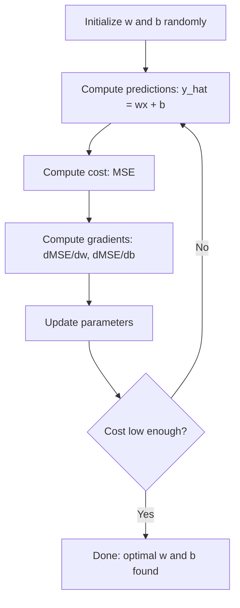

# Regresión lineal
# 线性回归 线性回归 线性回归


> La regresión lineal traza la mejor línea recta a través de sus datos. Es el "hola mundo" del aprendizaje automático.

> 线性回归穿越你的数据画出最佳直线──它是机器学习的"Hello World"──

**Type:** Build | **类型：** 构建
**Languages:** Python
**Prerequisites:** Phase 1 (Linear Algebra, Calculus, Optimization), Phase 2 Lesson 1 | **前置知识：** Phase 1（线性代数、微积分、优化），Phase 2 第 1 课
**Time:** ~90 minutes | **时间：** 约 90 分钟

## Objetivos de aprendizaje

- Derivar las reglas de actualización de la descenso de gradiente para el error medio cuadrado e implementar regresión lineal desde cero
  推导平均方差的梯度下降更新规则并从零实现线性回归 推导平均方差的梯度下降更新规则并从零实现线性回归
- Comparar la descendencia de gradientes y la ecuación normal en términos de complejidad computacional y cuándo utilizar cada uno
  Comparar la complejidad de cálculo de la escala baja y la de la fórmula regular, para determinar cuándo utilizar cada uno de ellos
- Construir un modelo de regresión lineal múltiple con estandarización de características e interpretar los pesos aprendidos
  构建带特征标准化多线性归归模型并解释学习到的权重
- Explica cómo la regresión de Ridge (regularización L2) evita el sobreajuste mediante la penalización de pesos grandes
  解释 Ridge regreso  L2 正则化) ¿Cómo pasar por el castigo de la gran autoridad para evitar el exceso de adaptación


> **【中文解读】**
> 线性归归是最简单的预测模型使用一条直线(或超平面) 拟合数据──它也是最简单的神经网络:一个没有隐藏层、没有激活函数的网络──sklearn 中的线性归归是金融中的因子模型──

> **【拓展：线性回归在真实 AI 系统中的角色】**
> Aunque el "aprendizaje profundo" es más conocido, el regreso de líneas sigue siendo uno de los modelos más comunes de la industria. Google utiliza en gran medida el regreso de líneas en análisis de A/B para estimar los efectos de la regeneración; Uber utiliza el regreso de líneas para hacer la predicción de la demanda; Fama-French en el ámbito financiero el modelo de tres factores es el regreso de líneas múltiples. En el concurso de Kaggle, el regreso de líneas es el resultado de la base de la investigación.

## El problema es la introducción del problema

Tienes datos: tamaño de la casa y sus precios de venta. Quieres predecir el precio de una casa nueva dada su tamaño. Puedes mirar en un gráfico de dispersión, pero necesitas una fórmula. Necesitas una línea que mejor se adapte a los datos para poder conectar cualquier tamaño y obtener una predicción de precio.

> Usted tiene datos: superficie de la casa y precio de venta de la casa. Usted piensa en función del precio de la superficie de la casa nueva. Usted puede evaluar en el gráfico de puntos de distribución, pero usted necesita una fórmula. Usted necesita una línea de mejor ajuste, para que cualquier área pueda obtener un precio de pronóstico.

La regresión lineal te da esa línea. Lo más importante, introduce todo el ciclo de entrenamiento de ML: definir un modelo, definir una función de costo, optimizar los parámetros. Cada algoritmo de ML sigue este mismo patrón. Dominarlo aquí con el caso más simple, y lo reconocerás en todas partes.

> 线性归归为为你提供了那条线――更重要的是, introdujo todo el ciclo de entrenamiento de ML: definir modelos"", definir funciones de precio"",optimizar los parámetros― cada algoritmo de ML sigue el mismo modelo―en este caso más simple, puedes reconocerlo en cualquier lugar―

Esto no es sólo para problemas simples. La regresión lineal se utiliza en los sistemas de producción para la predicción de la demanda, análisis de pruebas A/B, modelado financiero y como base para cada tarea de regresión.

> Esto no es sólo para la simple cuestión. La regeneración lineal se utiliza en el sistema de producción para la predicción de la demanda, análisis de A/B, análisis de pruebas, construcción financiera, así como como como la base de cada tarea de regeneración.

> **【中文解读】**
> El regreso lineal no es sólo un conocimiento de entrada, sino también un resumen de todo el ciclo de entrenamiento de aprendizaje de máquinas: define el modelo → define la función de pérdida → optimiza los parámetros. En el caso más simple, puedes entender desde el regreso lógico hasta todos los algoritmos de la red neuronal.

## El concepto central.

### El modelo

La regresión lineal asume una relación lineal entre la entrada (x) y la salida (y):

> 线性归归假设 entre la entrada (x) y la salida (y) existe una relación 线性:

```
y = wx + b
```

- `w`(peso/inclinación): cuánto cambia y cuando x aumenta en 1
  `w`(权重/斜率):x 增加 1 时 y 变化多少
- `b`(bias/intercepción): el valor de y cuando x = 0
  `b`(偏置/截距): Cuando x = 0 时 y 的值

Para múltiples entradas (cargas), esto se extiende a:

> 对于多个输入(特征), ampliar para:

```
y = w1*x1 + w2*x2 + ... + wn*xn + b
```

O en forma vectorial: `y = w^T * x + b`

> O con el formulario de la forma de:`y = w^T * x + b`

El objetivo: encontrar los valores de w y b que hagan que el predicto y sea lo más cercano posible al real y en todos los ejemplos de entrenamiento.

> 目标: encontrar el valor de w 和 b, hacer que todos los ejemplos de entrenamiento en el pronóstico de y 尽可能接近实际的 y。

> **【中文解读】**
> El modelo de regreso es muy directo:`y = wx + b`,w es la inclinada, b es la inclinada, b es la inclinada, b es la inclinada, b es la inclinada, b es la inclinada, b es la inclinada, b es la inclinada, b es la inclinada, b es la inclinada, b es la inclinada, b es la inclinada, b es la inclinada, b es la inclinada, b es la inclinada, b es la inclinada, b es la inclinada, b es la inclinada, b es la inclinada, b es la inclinada, b es la inclinada, b es la inclinada, b es la inclinada, b es la inclinada, b es la inclinada, b es la inclinada,`y = w1*x1 + w2*x2 + ... + wn*xn + b`, es decir, con datos de superplano adecuado. El objetivo del entrenamiento es encontrar el mejor w y b, para minimizar la diferencia entre el valor de pronóstico y el valor real.

### La función de costo (error medio cuadrado)

¿Cómo medir "lo más cerca posible"? Necesitas un solo número que capture lo equivocado que son tus predicciones. La opción más común es el error medio cuadrado (MSE):

> ¿Cómo mide el "maximum possible approximation"? Necesitas un método que pueda detectar el grado de error de predicción de un solo valor numérico.

```
MSE = (1/n) * sum((y_predicted - y_actual)^2)
```

¿Por qué cuadrado? Dos razones. Primero, penaliza errores grandes más que errores pequeños (un error de 10 es 100 veces peor que un error de 1, no 10x). Segundo, la función cuadrada es suave y diferenciable en todas partes, lo que hace que la optimización sea sencilla.

> Por qué usar el cuadrado? dos razones. Primero, el castigo de grandes errores es más pesado que el de pequeños errores.

La función de costo crea una superficie. Para un solo peso w y un sesgo b, la superficie de MSE se parece a un recipiente (una paraboloide convexa).

> 代价函数 Crear una curva. Para un solo peso y una posición b, el MSE 曲面 se parece a un tazón.

### Descenso gradual

La descenso gradual encuentra la parte inferior del tazón haciendo pasos hacia abajo.

> La escalera baja a través de un paso hacia abajo para encontrar la parte inferior de la taza.



Los gradientes te dicen dos cosas: en qué dirección mover cada parámetro, y cuánto mover.

> La gradiencia te dice dos cosas: cada parámetro debe moverse en qué dirección, y cuántos se mueven.

Para el MSE con y_hat = wx + b:

> 对于MSE 且 y_hat = wx + b:

```
dMSE/dw = (2/n) * sum((y_hat - y) * x)
dMSE/db = (2/n) * sum(y_hat - y)
```

La regla de actualización:

> 更新规则:

```
w = w - learning_rate * dMSE/dw
b = b - learning_rate * dMSE/db
```

El ritmo de aprendizaje controla el tamaño del paso. Demasiado grande: se supera el mínimo y se diverge. Demasiado pequeño: el entrenamiento dura para siempre. Valores iniciales típicos: 0.01, 0.001, o 0.0001.

> El nivel de aprendizaje es muy alto: se puede saltar más allá del valor mínimo y se puede dispersar.

> **【中文解读】**
> 梯度下降 es el algoritmo de optimización más central del aprendizaje automático. Su intuito es muy simple: estar en la ladera, hacia el más bajo de la ladera, hacia un paso atrás, repetir hasta llegar al fondo del valle. 梯度(导数) le dice la dirección y el grado, el ritmo de aprendizaje controló el paso de la ladera.

> **【拓展：梯度下降在现代 AI 中的演进】**
> El entrenamiento de GPT-4 utiliza el AdamW  optimizador(Adam + 权重衰减), es un alto variante de gradiente descendente. La tasa de aprendizaje es de 0 开始预热到峰值,然后余弦退火下降.

### La ecuación normal (solución en forma cerrada)

Para la regresión lineal específicamente, hay una fórmula directa que da los pesos óptimos sin ninguna iteración:

> ), una fórmula directa que no necesita generar el peso máximo:

```
w = (X^T * X)^(-1) * X^T * y
```

Esto invierte una matriz para resolver para w en un solo paso. Funciona perfectamente para pequeños conjuntos de datos. Para grandes conjuntos de datos (millones de filas o miles de características), se prefiere el descenso de gradiente porque la inversión de la matriz es O(n^3) en el número de características.

> Esto es muy eficaz para los pequeños conjuntos de datos. Para los grandes conjuntos de datos, el gradiente de baja es mejor, ya que la matriz de baja es O (n^3) en el número de características.

> **【拓展：正规方程 vs 梯度下降的选择】**
> La complejidad del tiempo de un cuadrado regular es O (n^3) (n) (n) (n) (n) (n) (n) (n) (n) (n) (n) (n) (n) (n) (n) (n) (n) (n) (n) (n) (n) (n) (n) (n) (n) (n) (n) (n) (n) (n) (n) (n) (n) (n) (n) (n) (n) (n) (n) (n) (n) (n) (n) (n) (n) (n) (n) (n) (n) (n) (n) (n) (n) (n) (n) (n) (n) (n) (n) (n) (n) (n) (n) (n) (n) (n) (n) (n) (n) (n) (n) (n) (n) (n) (n) (n) (n) (n) (n) (n) (n) (n) (n) (n) (n) (n) (n) (n) (n) (n) (n) (n) (n) (n) (n) (n) (n) (n) (n) (n) (n) (n) (n) (n) (n) (n) (n) (n) (n) (n) (n) (n) (n) (n) (n) (n) (n) (n) (n) (n) (n) (n) (n) (n) (n) (n) (n) (n) (n) (n) (n) (n) (n) (n) (n) (n) (n) (n) (n) (n) (n) (n) (n) (n) (n) (n) (n) (n) (n) (n) (n) (n) (n) (n) (n) (n) (n) (n) (n) (n) (n) (n) (n) (n) (n) (

### Regresión lineal múltiple

Con múltiples características, el modelo se convierte en:

> Hay varios rasgos, el modelo cambia:

```
y = w1*x1 + w2*x2 + ... + wn*xn + b
```

Todo funciona de la misma manera: MSE es la función de costo, la descenda de gradiente actualiza todos los pesos simultáneamente.

> Todo principio es el mismo: el MSE es una función de precio, la gradiencia baja al mismo tiempo que actualiza el peso. La única diferencia es que estás en una superplano y no en una línea recta.

Si una característica oscila entre 0 y 1 y otra oscila entre 0 y 1,000,000, el descenso de gradiente tendrá dificultades porque la superficie de costo se alarga.

> Si una característica es de 0 a 1, la otra es de 0 a 1,000,000, la disminución del nivel se hace difícil, ya que el precio se alarga.

> **【中文解读】**
> En el regreso lineal de múltiples caracteres, la reducción de características es importante. Si la diferencia de calificación de las características es grande, como la superficie 500-3000 vs. número de habitaciones 1-5), la función de pérdida de la reducción de gradiente se expande gravemente, lo que provoca una recepción lenta o incluso imposible de recibir.

### Regresión polinómica

¿Qué pasa si la relación no es lineal?

> Si la relación no es lineal, ¿qué ocurre? Puedes continuar usando la línea de regreso mediante la creación de varios rasgos:

```
y = w1*x + w2*x^2 + w3*x^3 + b
```

Esto sigue siendo una regresión "lineal" porque el modelo es lineal en los pesos (w1, w2, w3).

> Esto sigue siendo "lineal" regreso, porque el modelo está en peso (w1, w2, w3) arriba es lineal.

Los polinomios de grado superior pueden ajustarse a curvas más complejas pero corren el riesgo de sobreajuste. Un polinomio de grado 10 pasará a través de todos los puntos de un conjunto de datos de 10 puntos pero predice mal sobre los nuevos datos.

> Un multi-modulo de 10 veces puede adaptarse a curvas más complejas pero tiene riesgos de adaptarse. Un multi-modulo de 10 veces puede atravesar cada punto de un conjunto de datos, pero la predicción en los nuevos datos es muy pobre.

### Punto de la cuadrada

MSE le dice lo equivocado que está, pero el número depende de la escala de y. R-cuadrado (R^2) da una medida independiente de la escala:

> MSE  te dice cuánto se equivocó, pero este número depende de la calificación de y. R-cuadrado (R^2)  da una medida que no tiene relación con la calificación:

```
R^2 = 1 - (sum of squared residuals) / (sum of squared deviations from mean)
    = 1 - SS_res / SS_tot
```

- R^2 = 1,0: predicciones perfectas
  R^2 = 1,0:完美预测
- R^2 = 0.0: el modelo no es mejor que predecir la media cada vez
  R^2 = 0.0: modelo no comparable a la media de pronóstico
- R^2 < 0.0: el modelo es peor que predecir la media
  R^2 < 0.0: modelo比预测均值还差

### Previsión de regularización (regreso de la cuenca)

Cuando tienes muchas características, el modelo puede sobresalir asignando grandes pesos.

> Cuando tienes muchas características, el modelo puede darte un gran peso para que puedas adaptarte.

```
Cost = MSE + lambda * sum(w_i^2)
```

El término penalidad desalienta los pesos grandes. El hiperparámetro lambda controla la compensación: lambda más alto significa pesos más pequeños y más regularización. Esto se cubre en profundidad en una lección posterior. Por ahora, sepa que existe y por qué ayuda.

> 惩罚项阻止权重过大──超参数 lambda 控制权衡:lambda 越大意味着权重越小、正则化越强── esto será ampliamente debatido en el curso siguiente── ahora sólo hay que entender su existencia y efecto──

> **【中文解读】**
> Ridge regreso (Ridge regreso) L2 regularidad) mediante la adición de peso cuadrado y de castigo en la función de pérdida para prevenir el exceso de peso.

## Construye y realiza.
```figure
linear-regression-fit
```

## Construye el mismo

### Paso 1: Generar datos de muestras

```python
import random
import math

random.seed(42)  # 设置随机种子以确保结果可复现

TRUE_W = 3.0  # 真实斜率（权重）
TRUE_B = 7.0  # 真实截距（偏置）
N_SAMPLES = 100  # 样本数量

X = [random.uniform(0, 10) for _ in range(N_SAMPLES)]  # 生成 0-10 之间的随机特征值
y = [TRUE_W * x + TRUE_B + random.gauss(0, 2.0) for x in X]  # 真实关系 + 高斯噪声

print(f"Generated {N_SAMPLES} samples")
print(f"True relationship: y = {TRUE_W}x + {TRUE_B} (+ noise)")
print(f"First 5 points: {[(round(X[i], 2), round(y[i], 2)) for i in range(5)]}")
```

### Paso 2: Regresión lineal desde cero con descenso de gradiente

```python
class LinearRegression:
    def __init__(self, learning_rate=0.01):
        self.w = 0.0  # 权重初始化为 0
        self.b = 0.0  # 偏置初始化为 0
        self.lr = learning_rate  # 学习率控制梯度下降步长
        self.cost_history = []  # 记录每轮的损失值

    def predict(self, X):
        return [self.w * x + self.b for x in X]  # y_hat = wx + b

    def compute_cost(self, X, y):
        predictions = self.predict(X)
        n = len(y)
        # 计算 MSE：均方误差
        cost = sum((pred - actual) ** 2 for pred, actual in zip(predictions, y)) / n
        return cost

    def compute_gradients(self, X, y):
        predictions = self.predict(X)
        n = len(y)
        # 对 w 的偏导数
        dw = (2 / n) * sum((pred - actual) * x for pred, actual, x in zip(predictions, y, X))
        # 对 b 的偏导数
        db = (2 / n) * sum(pred - actual for pred, actual in zip(predictions, y))
        return dw, db

    def fit(self, X, y, epochs=1000, print_every=200):
        for epoch in range(epochs):
            dw, db = self.compute_gradients(X, y)  # 计算梯度
            self.w -= self.lr * dw  # 沿梯度反方向更新权重
            self.b -= self.lr * db  # 沿梯度反方向更新偏置
            cost = self.compute_cost(X, y)
            self.cost_history.append(cost)
            if epoch % print_every == 0:
                print(f"  Epoch {epoch:4d} | Cost: {cost:.4f} | w: {self.w:.4f} | b: {self.b:.4f}")
        return self

    def r_squared(self, X, y):
        predictions = self.predict(X)
        y_mean = sum(y) / len(y)
        ss_res = sum((actual - pred) ** 2 for actual, pred in zip(y, predictions))  # 残差平方和
        ss_tot = sum((actual - y_mean) ** 2 for actual in y)  # 总变差
        return 1 - (ss_res / ss_tot)  # R² = 1 - SS_res/SS_tot


print("=== Training Linear Regression (Gradient Descent) ===")
model = LinearRegression(learning_rate=0.005)
model.fit(X, y, epochs=1000, print_every=200)
print(f"\nLearned: y = {model.w:.4f}x + {model.b:.4f}")
print(f"True:    y = {TRUE_W}x + {TRUE_B}")
print(f"R-squared: {model.r_squared(X, y):.4f}")
```

### Paso 3: Equación normal (solución de forma cerrada)

```python
class LinearRegressionNormal:
    def __init__(self):
        self.w = 0.0  # 斜率
        self.b = 0.0  # 截距

    def fit(self, X, y):
        n = len(X)
        x_mean = sum(X) / n  # 计算 x 的均值
        y_mean = sum(y) / n  # 计算 y 的均值
        # 协方差 / 方差 = 最优斜率
        numerator = sum((X[i] - x_mean) * (y[i] - y_mean) for i in range(n))
        denominator = sum((X[i] - x_mean) ** 2 for i in range(n))
        self.w = numerator / denominator
        # 截距 = y 均值 - 斜率 * x 均值
        self.b = y_mean - self.w * x_mean
        return self

    def predict(self, X):
        return [self.w * x + self.b for x in X]

    def r_squared(self, X, y):
        predictions = self.predict(X)
        y_mean = sum(y) / len(y)
        ss_res = sum((actual - pred) ** 2 for actual, pred in zip(y, predictions))
        ss_tot = sum((actual - y_mean) ** 2 for actual in y)
        return 1 - (ss_res / ss_tot)


print("\n=== Normal Equation (Closed-Form) ===")
model_normal = LinearRegressionNormal()
model_normal.fit(X, y)
print(f"Learned: y = {model_normal.w:.4f}x + {model_normal.b:.4f}")
print(f"R-squared: {model_normal.r_squared(X, y):.4f}")
```

### Paso 4: Regresión lineal múltiple

```python
class MultipleLinearRegression:
    def __init__(self, n_features, learning_rate=0.01):
        self.weights = [0.0] * n_features
        self.bias = 0.0
        self.lr = learning_rate
        self.cost_history = []

    def predict_single(self, x):
        return sum(w * xi for w, xi in zip(self.weights, x)) + self.bias

    def predict(self, X):
        return [self.predict_single(x) for x in X]

    def compute_cost(self, X, y):
        predictions = self.predict(X)
        n = len(y)
        return sum((pred - actual) ** 2 for pred, actual in zip(predictions, y)) / n

    def fit(self, X, y, epochs=1000, print_every=200):
        n = len(y)
        n_features = len(X[0])
        for epoch in range(epochs):
            predictions = self.predict(X)
            errors = [pred - actual for pred, actual in zip(predictions, y)]
            for j in range(n_features):
                grad = (2 / n) * sum(errors[i] * X[i][j] for i in range(n))
                self.weights[j] -= self.lr * grad
            grad_b = (2 / n) * sum(errors)
            self.bias -= self.lr * grad_b
            cost = self.compute_cost(X, y)
            self.cost_history.append(cost)
            if epoch % print_every == 0:
                print(f"  Epoch {epoch:4d} | Cost: {cost:.4f}")
        return self

    def r_squared(self, X, y):
        predictions = self.predict(X)
        y_mean = sum(y) / len(y)
        ss_res = sum((actual - pred) ** 2 for actual, pred in zip(y, predictions))
        ss_tot = sum((actual - y_mean) ** 2 for actual in y)
        return 1 - (ss_res / ss_tot)


random.seed(42)
N = 100
X_multi = []
y_multi = []
for _ in range(N):
    size = random.uniform(500, 3000)
    bedrooms = random.randint(1, 5)
    age = random.uniform(0, 50)
    price = 50 * size + 10000 * bedrooms - 1000 * age + 50000 + random.gauss(0, 20000)
    X_multi.append([size, bedrooms, age])
    y_multi.append(price)


def standardize(X):
    n_features = len(X[0])
    means = [sum(X[i][j] for i in range(len(X))) / len(X) for j in range(n_features)]
    stds = []
    for j in range(n_features):
        variance = sum((X[i][j] - means[j]) ** 2 for i in range(len(X))) / len(X)
        stds.append(variance ** 0.5)
    X_scaled = []
    for i in range(len(X)):
        row = [(X[i][j] - means[j]) / stds[j] if stds[j] > 0 else 0 for j in range(n_features)]
        X_scaled.append(row)
    return X_scaled, means, stds


y_mean_val = sum(y_multi) / len(y_multi)
y_std_val = (sum((yi - y_mean_val) ** 2 for yi in y_multi) / len(y_multi)) ** 0.5
y_scaled = [(yi - y_mean_val) / y_std_val for yi in y_multi]

X_scaled, x_means, x_stds = standardize(X_multi)

print("\n=== Multiple Linear Regression (3 features) ===")
print("Features: house size, bedrooms, age")
multi_model = MultipleLinearRegression(n_features=3, learning_rate=0.01)
multi_model.fit(X_scaled, y_scaled, epochs=1000, print_every=200)

print(f"\nWeights (standardized): {[round(w, 4) for w in multi_model.weights]}")
print(f"Bias (standardized): {multi_model.bias:.4f}")
print(f"R-squared: {multi_model.r_squared(X_scaled, y_scaled):.4f}")
```

### Paso 5: Regresión polinómica

```python
class PolynomialRegression:
    def __init__(self, degree, learning_rate=0.01):
        self.degree = degree
        self.weights = [0.0] * degree
        self.bias = 0.0
        self.lr = learning_rate

    def make_features(self, X):
        return [[x ** (d + 1) for d in range(self.degree)] for x in X]

    def predict(self, X):
        features = self.make_features(X)
        return [sum(w * f for w, f in zip(self.weights, row)) + self.bias for row in features]

    def fit(self, X, y, epochs=1000, print_every=200):
        features = self.make_features(X)
        n = len(y)
        for epoch in range(epochs):
            predictions = [sum(w * f for w, f in zip(self.weights, row)) + self.bias for row in features]
            errors = [pred - actual for pred, actual in zip(predictions, y)]
            for j in range(self.degree):
                grad = (2 / n) * sum(errors[i] * features[i][j] for i in range(n))
                self.weights[j] -= self.lr * grad
            grad_b = (2 / n) * sum(errors)
            self.bias -= self.lr * grad_b
            if epoch % print_every == 0:
                cost = sum(e ** 2 for e in errors) / n
                print(f"  Epoch {epoch:4d} | Cost: {cost:.6f}")
        return self

    def r_squared(self, X, y):
        predictions = self.predict(X)
        y_mean = sum(y) / len(y)
        ss_res = sum((actual - pred) ** 2 for actual, pred in zip(y, predictions))
        ss_tot = sum((actual - y_mean) ** 2 for actual in y)
        return 1 - (ss_res / ss_tot)


random.seed(42)
X_poly = [x / 10.0 for x in range(0, 50)]
y_poly = [0.5 * x ** 2 - 2 * x + 3 + random.gauss(0, 1.0) for x in X_poly]

x_max = max(abs(x) for x in X_poly)
X_poly_norm = [x / x_max for x in X_poly]
y_poly_mean = sum(y_poly) / len(y_poly)
y_poly_std = (sum((yi - y_poly_mean) ** 2 for yi in y_poly) / len(y_poly)) ** 0.5
y_poly_norm = [(yi - y_poly_mean) / y_poly_std for yi in y_poly]

print("\n=== Polynomial Regression (degree 2 vs degree 5) ===")
print("True relationship: y = 0.5x^2 - 2x + 3")

print("\nDegree 2:")
poly2 = PolynomialRegression(degree=2, learning_rate=0.1)
poly2.fit(X_poly_norm, y_poly_norm, epochs=2000, print_every=500)
print(f"  R-squared: {poly2.r_squared(X_poly_norm, y_poly_norm):.4f}")

print("\nDegree 5:")
poly5 = PolynomialRegression(degree=5, learning_rate=0.1)
poly5.fit(X_poly_norm, y_poly_norm, epochs=2000, print_every=500)
print(f"  R-squared: {poly5.r_squared(X_poly_norm, y_poly_norm):.4f}")

print("\nDegree 2 fits the true curve well. Degree 5 fits training data slightly better")
print("but risks overfitting on new data.")
```

### Paso 6: Regresión de la escala (regularización de L2)

```python
class RidgeRegression:
    def __init__(self, n_features, learning_rate=0.01, alpha=1.0):
        self.weights = [0.0] * n_features
        self.bias = 0.0
        self.lr = learning_rate
        self.alpha = alpha

    def predict_single(self, x):
        return sum(w * xi for w, xi in zip(self.weights, x)) + self.bias

    def predict(self, X):
        return [self.predict_single(x) for x in X]

    def fit(self, X, y, epochs=1000, print_every=200):
        n = len(y)
        n_features = len(X[0])
        for epoch in range(epochs):
            predictions = self.predict(X)
            errors = [pred - actual for pred, actual in zip(predictions, y)]
            mse = sum(e ** 2 for e in errors) / n
            reg_term = self.alpha * sum(w ** 2 for w in self.weights)
            cost = mse + reg_term
            for j in range(n_features):
                grad = (2 / n) * sum(errors[i] * X[i][j] for i in range(n))
                grad += 2 * self.alpha * self.weights[j]
                self.weights[j] -= self.lr * grad
            grad_b = (2 / n) * sum(errors)
            self.bias -= self.lr * grad_b
            if epoch % print_every == 0:
                print(f"  Epoch {epoch:4d} | Cost: {cost:.4f} | L2 penalty: {reg_term:.4f}")
        return self


print("\n=== Ridge Regression (L2 Regularization) ===")
print("Same data as multiple regression, with alpha=0.1")
ridge = RidgeRegression(n_features=3, learning_rate=0.01, alpha=0.1)
ridge.fit(X_scaled, y_scaled, epochs=1000, print_every=200)
print(f"\nRidge weights: {[round(w, 4) for w in ridge.weights]}")
print(f"Plain weights: {[round(w, 4) for w in multi_model.weights]}")
print("Ridge weights are smaller (shrunk toward zero) due to the L2 penalty.")
```

## Usalo con el marco de ejecución

Ahora lo mismo con el aprendizaje de la escikit, que es lo que realmente utilizará en la producción.

> Ahora, con el uso de un poco de aprendizaje, se puede lograr la misma función, es la herramienta que se utiliza en la producción real.

```python
from sklearn.linear_model import LinearRegression as SklearnLR
from sklearn.linear_model import Ridge
from sklearn.preprocessing import PolynomialFeatures, StandardScaler
from sklearn.model_selection import train_test_split
from sklearn.metrics import mean_squared_error, r2_score
import numpy as np

# 生成与从零实现相同的数据
np.random.seed(42)
X_sk = np.random.uniform(0, 10, (100, 1))
y_sk = 3.0 * X_sk.squeeze() + 7.0 + np.random.normal(0, 2.0, 100)

# 划分训练集和测试集（80/20）
X_train, X_test, y_train, y_test = train_test_split(X_sk, y_sk, test_size=0.2, random_state=42)

# 线性回归
lr = SklearnLR()
lr.fit(X_train, y_train)
y_pred = lr.predict(X_test)

print("=== Scikit-learn Linear Regression ===")
print(f"Coefficient (w): {lr.coef_[0]:.4f}")
print(f"Intercept (b): {lr.intercept_:.4f}")
print(f"R-squared (test): {r2_score(y_test, y_pred):.4f}")
print(f"MSE (test): {mean_squared_error(y_test, y_pred):.4f}")

# 多项式回归（degree=2）
poly = PolynomialFeatures(degree=2, include_bias=False)
X_poly_sk = poly.fit_transform(X_train)  # 生成 x, x² 特征
X_poly_test = poly.transform(X_test)

lr_poly = SklearnLR()
lr_poly.fit(X_poly_sk, y_train)
print(f"\nPolynomial degree 2 R-squared: {r2_score(y_test, lr_poly.predict(X_poly_test)):.4f}")

# 标准化后使用 Ridge 回归
scaler = StandardScaler()
X_train_scaled = scaler.fit_transform(X_train)  # 在训练集上拟合并转换
X_test_scaled = scaler.transform(X_test)  # 在测试集上只转换

ridge = Ridge(alpha=1.0)  # alpha 即正则化强度 lambda
ridge.fit(X_train_scaled, y_train)
print(f"Ridge R-squared: {r2_score(y_test, ridge.predict(X_test_scaled)):.4f}")
print(f"Ridge coefficient: {ridge.coef_[0]:.4f}")
```

La aplicación desde cero y la aplicación de scikit-learn producen los mismos resultados. La diferencia: scikit-learn maneja casos de borde, estabilidad numérica y optimizaciones de rendimiento. Utilice la biblioteca para la producción. Utilice la versión desde cero para entender lo que está sucediendo.

> Su realización desde cero y el aprendizaje desde cero producen los mismos resultados. La diferencia se encuentra en: aprendizaje desde cero: se trata de la situación de los límites, la estabilidad numérica y la optimización de los rendimientos.

## Envíe el producto .

Esta lección produce:
- `outputs/skill-regression.md`- la habilidad para elegir el enfoque de regresión adecuado en función del problema

> 本课产 出:
> - `outputs/skill-regression.md`- Una habilidad para elegir el método de regreso correcto

## Los ejercicios.

1. Implemente el descenso de gradiente de lote, el descenso de gradiente estocástico (SGD) y el descenso de gradiente de mini lote. Comparar la velocidad de convergencia en el mismo conjunto de datos. ¿Cuál converge más rápido? ¿Cuál tiene la curva de costos más suave?
   1. 实现批量梯度下降,随机梯度下降 (SGD) 和小批量梯度下降.                                                                                                                                                                                                                                                 
2. Generar datos de una función cúbica (y = ax^3 + bx^2 + cx + d + ruido).
   2. Desde tres funciones (y = ax^3 + bx^2 + cx + d + ruido) 生成数据──拟合 1、3 和 10 次多项式──比较训练 R^2 和测试 R^2──几次多项式时过拟合变得明显吗?
3. Implementar la regresión de Lasso (regularización L1: penalidad alfa *(suma en direccion = i i i i i i)). Entrenar los datos de vivienda de múltiples características. Comparar qué pesos van a cero vs Ridge. ¿Por qué L1 produce soluciones escasas mientras que L2 no?
   3. 实现 Lasso 回归(L1 正则化:penalty * alpha sum *(((((((((((((((((((((((((((((((((((((((((((((((((((((((((((((((((((((((((((((((((((((((((((((((((((((((((((((((((((((((((((((((((((((((((((((((((((((((((((((((((((((((((((((((((((((((((((((((((((((((((((((((((((((((((((((((((((((((((((((((((((((((((((((((((((((((((((((((((((((((((((((((((((((((((((((((((((((((((((((((((((((((((((((((((((((((((((((((((((((((((((((((((((((((((((((((((((((((((((((((((((((((((((((((((((((((((((((((((((((((((((((((((((((((((((((((((((((((((((((((((((((((((((

## Términos clave .

| Term | What people say | What it actually means |
|------|----------------|----------------------|
| Linear regression | "Draw a line through data" | Find weight w and bias b that minimize the sum of squared differences between wx+b and actual y values |
| Cost function | "How bad the model is" | A function that maps model parameters to a single number measuring prediction error, which optimization minimizes |
| Mean squared error | "Average of squared errors" | (1/n) * sum of (predicted - actual)^2, penalizing large errors disproportionately |
| Gradient descent | "Walk downhill" | Iteratively adjust parameters in the direction that reduces the cost function, using partial derivatives |
| Learning rate | "Step size" | A scalar that controls how much parameters change per gradient descent step |
| Normal equation | "Solve it directly" | The closed-form solution w = (X^T X)^-1 X^T y that gives optimal weights without iteration |
| R-squared | "How good the fit is" | The fraction of variance in y explained by the model, ranging from negative infinity to 1.0 |
| Feature scaling | "Make features comparable" | Transforming features to similar ranges (e.g., zero mean, unit variance) so gradient descent converges faster |
| Regularization | "Penalize complexity" | Adding a term to the cost function that shrinks weights, preventing overfitting |
| Ridge regression | "L2 regularization" | Linear regression with a penalty of lambda * sum(w_i^2) added to MSE |
| Polynomial regression | "Fitting curves with linear math" | Linear regression on polynomial features (x, x^2, x^3, ...), still linear in the weights |
| Overfitting | "Memorizing training data" | Using a model so complex that it fits noise in training data and fails on new data |

## Más Leer más Leer más

- [An Introduction to Statistical Learning (ISLR)](https://www.statlearning.com/)-- PDF gratuito, los capítulos 3 y 6 cubren la regresión lineal y la regularización con ejemplos prácticos de R
  [An Introduction to Statistical Learning (ISLR)](https://www.statlearning.com/)-- 免费教材, capítulos 3 y 6 con ejemplos reales de R que abarcan la regeneración y la normalización
- [The Elements of Statistical Learning (ESL)](https://hastie.su.domains/ElemStatLearn/)-- PDF gratuito, el compañero más matemático de la ISLR con un tratamiento más profundo de la cresta y lasso
  [The Elements of Statistical Learning (ESL)](https://hastie.su.domains/ElemStatLearn/)-- 免费教材,ISLR's Mathematics Edition, sobre la cresta y lasso tiene un tratamiento más profundo
- [Stanford CS229 Lecture Notes on Linear Regression](https://cs229.stanford.edu/main_notes.pdf)-- Las notas de Andrew Ng derivando la ecuación normal y la descesión de gradiente de los primeros principios
  [Stanford CS229 Lecture Notes on Linear Regression](https://cs229.stanford.edu/main_notes.pdf)-- Andrew Ng's Notas de la primera naturaleza de la teoría de la normalidad y la escala baja
- [scikit-learn LinearRegression documentation](https://scikit-learn.org/stable/modules/linear_model.html)-- referencia práctica para LinearRegression, Ridge, Lasso y ElasticNet con ejemplos de código
  [scikit-learn LinearRegression documentation](https://scikit-learn.org/stable/modules/linear_model.html)-- LinearRegression、Ridge、Lasso 和 ElasticNet de referencia y código de ejemplo
