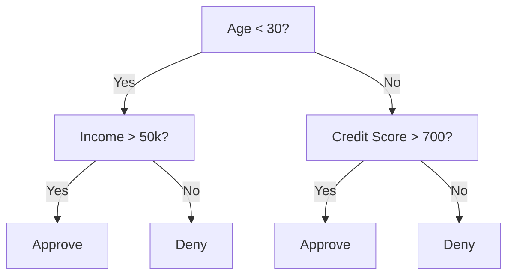
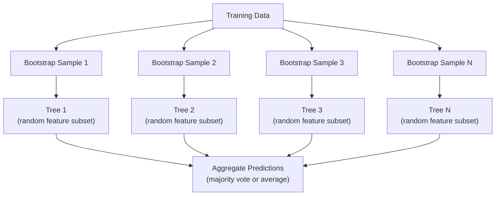

# Árboles de decisión y bosques aleatorios
#  decision tree y el bosque


> Un árbol de decisión es sólo un diagrama de flujo, pero un bosque de ellos es una de las herramientas más poderosas en ML.

> Un árbol de decisión es un dibujo de los procesos, pero un bosque formado por ellos, es uno de los instrumentos más poderosos del aprendizaje automático.

**Type:** Build | **类型：** 构建
**Language:**¿ Qué pasa ?**语言：**Python
**Prerequisites:** Phase 1 (Lessons 09 Information Theory, 06 Probability) | **前置知识：** Phase 1（第 9 课信息论、第 6 课概率论）
**Time:** ~90 minutes | **时间：** 约 90 分钟

## Objetivos de aprendizaje

- Implementar cálculos de impureza, entropía y ganancia de información de Gini para encontrar las divisiones óptimas del árbol de decisión
  ¢¿¿¿¿¿¿¿¿¿¿¿¿¿¿¿¿¿¿¿¿¿¿¿¿¿¿¿¿¿¿¿¿¿¿¿¿¿¿¿¿¿¿¿¿¿¿¿¿¿¿¿¿¿¿¿¿¿¿¿¿¿¿¿¿¿¿¿¿¿¿¿¿¿¿¿¿¿¿¿¿¿¿¿¿¿¿¿¿¿¿¿¿¿¿¿¿¿¿¿¿¿¿¿¿¿¿¿¿¿¿¿¿¿¿¿¿¿¿¿¿¿¿¿¿¿¿¿¿¿¿¿¿¿¿¿¿¿¿¿¿¿¿¿¿¿¿¿¿¿¿¿¿¿¿¿¿¿¿¿¿¿¿¿¿¿¿¿¿¿¿¿¿¿¿¿¿¿¿¿¿¿¿¿¿¿¿¿¿¿¿¿¿¿¿¿¿¿¿¿¿¿¿¿¿¿¿¿¿¿¿¿¿¿¿¿¿¿¿¿¿¿¿¿¿¿¿¿¿¿¿¿¿¿¿¿¿¿¿¿¿¿¿¿¿¿¿¿¿¿¿¿¿¿¿¿¿¿¿¿¿¿¿¿¿¿¿¿¿¿¿¿¿¿¿¿¿¿¿¿¿¿¿¿¿¿¿¿¿¿¿¿¿¿¿¿¿¿¿¿¿¿¿¿¿¿¿¿¿¿¿¿¿¿¿¿¿¿¿¿¿¿¿¿¿¿¿¿¿¿¿¿¿¿¿¿¿¿¿¿¿¿¿¿¿¿¿¿¿¿¿¿¿¿¿¿¿¿¿¿¿¿¿¿¿¿¿¿¿¿¿¿¿¿¿¿¿¿¿¿¿¿¿¿¿¿¿¿¿¿¿¿¿¿¿¿¿¿¿¿¿¿¿¿¿¿¿¿¿¿¿¿¿¿¿¿¿¿¿¿¿¿¿¿¿¿¿¿¿¿¿¿¿¿¿¿¿¿¿¿¿¿¿¿¿¿¿¿¿¿¿¿¿¿¿¿¿¿¿¿¿¿¿¿¿¿¿¿¿¿¿¿¿¿¿¿¿¿¿¿¿¿¿¿¿¿¿¿¿¿¿¿¿¿¿¿¿¿¿¿¿¿¿¿¿¿¿¿¿
- Construir desde cero un clasificador de árbol de decisión con controles pre-tono (profundidad máxima, muestras mínimas)
  Desde la construcción de z z con control de la sección previa de la sección de la sección de la sección de la sección de la sección de la sección de la sección de la sección de la sección de la sección de la sección de la sección de la sección de la sección de la sección de la sección de la sección de la sección de la sección de la sección de la sección de la sección de la sección de la sección de la sección de la sección de la sección de la sección de la sección de la sección de la sección de la sección de la sección de la sección de la sección de la sección de la sección de la sección de la sección de la sección de la sección de la sección de la sección de la sección de la sección de la sección de la sección de la sección de la sección de la sección de la sección de la sección de la sección de la sección de la sección de la sección de la sección de la sección de la sección de la sección de la sección de la sección de la sección de la sección de la sección de la sección de la sección de la sección de la sección de la sección de la sección de la sección de la sección de la sección de la sección de la sección de la sección de la sección de la sección de la sección de la sección de la sección de la sección de la sección de la sección de la sección de la sección de la sección de la sección de la sección de la sección de la sección de la sección de la sección de la sección de la sección de la sección de la sección de la sección de la sección de la sección de la sección de la sección de la sección de la sección de la sección de la sección de la sección de la sección de la sección de la sección de la sección de la sección de la sección de la sección de la sección de la sección de la sección de la sección de la sección de la sección de la sección de la sección de la sección de la sección de la sección de la sección de la sección de la sección de la sección de la sección de la sección de la sección de la sección de la sección de la sección de la sección de la sección de la sección de la sección de la sección de la sección de la sección de la sección de la sección de la sección de la sección de la sección de la sección de la sección de la sección de la sección de la sección de la sección de la sección de la sección de la sección de la sección de la sección de la sección de la sección de la sección de la sección de la sección de la sección de la sección
- Construir un bosque aleatorio utilizando muestreo de arranque y la aleatorización de características, y explicar por qué reduce la varianza
  Utiliza Bootstrap 采样和特征随机化构建随机森林,并解释为什么它能降低方差
- Comparar la importancia de las características de MDI con la importancia de la permutación e identificar cuándo la MDI es sesgada
  Comparado con la importancia de las características de la IDM y la importancia de la sustitución, el problema de la diferenciación de la IDM


> **【中文解读】**
> 决策树通过 if-else 规则分数据,随机森林是多个决策树的投票组合――sklearn es uno de los modelos más comunes de la investigación.

> **【拓展：树模型在 Kaggle 和工业界的主导地位】**
> En el concurso de datos estructurados en Kaggle, aproximadamente el 70% de los programas ganadores utilizan el gradiente de aumento de árboles (XGBoost/LightGBM/CatBoost) ⋅ En el ámbito financiero, la evaluación de crédito ⋅ FICO 分数) el uso amplio de los cambios de árboles de decisión; los bancos antisocialistas utilizan habitualmente el bosque como base; en el diagnóstico médico, el bosque se utiliza para la predicción de riesgos de reingreso.

## El problema es la introducción del problema

Hay datos tablales. Las filas son muestras, las columnas son características, y hay una columna objetivo que quieres predecir. Puedes lanzar una red neuronal a ella. Pero para los datos tablales, los modelos basados en árboles (árboles de decisión, bosques aleatorios, árboles aumentados en gradiente) superan consistentemente el aprendizaje profundo. Las competiciones de Kaggle en datos estructurados son dominadas por XGBoost y LightGBM, no por transformadores.

> Usted tiene un modelo de datos, una línea es un modelo, una línea es una característica, también hay una línea de objetivos que usted quiere predecir. Usted puede procesar con la red neuronal. Pero para el modelo de datos, el árbol de decisión, el árbol de aumento de la escala, siempre es mejor que el aprendizaje profundo.

Los árboles manejan tipos de características mixtas (númricas y categoricas) sin procesamiento previo. Manejan relaciones no lineales sin ingeniería de características. Son interpretables: se puede mirar al árbol y ver exactamente por qué se hizo una predicción.

> Por qué? Los modelos de árboles no necesitan tratamiento previo en cuanto a la capacidad de procesar características mixtas de tipo, valores y clases. Los modelos de árboles no necesitan tratamiento de características mixtas en cuanto a relaciones no lineales.

Esta lección construye árboles de decisión desde cero utilizando la división recursiva, luego construye un bosque aleatorio en la parte superior. Implementará las matemáticas detrás de los criterios de división (impureza de Gini, entropía, ganancia de información) y entenderá por qué un conjunto de estudiantes débiles se convierte en uno fuerte.

> Este curso se inicia en la creación de un árbol de decisión, y luego se construye en él como bosque.

> **【中文解读】**
> 对于表格型数据 (行是样本,列是特征), el modelo de árbol suele ser superior al aprendizaje profundo.

## El concepto central.

### Lo que hace un árbol de decisión

Un árbol de decisión divide el espacio de características en regiones rectangulares haciendo una secuencia de preguntas de sí/no.

> 决策树通过一系列非问题将特征空间分为矩形区域――



Cada nodo interno prueba una característica contra un umbral. Cada nodo de hoja hace una predicción. Para clasificar un nuevo punto de datos, comienza en la raíz y sigue las ramas hasta llegar a una hoja.

> Cada nodo interno comparará una característica con el valor. Cada nodo de hoja hará una predicción.

El árbol se construye de arriba hacia abajo eligiendo, en cada nodo, la característica y el umbral que mejor separan los datos.

> 树自顶向下构建,在每个节点选择最能分离数据的特征和值――"最佳" fue definido por el estándar de división―

### Criterios de división: medición de la impureza

En cada nodo, tenemos un conjunto de muestras. Queremos dividirlos para que los nodos infantiles resultantes sean lo más "puro" posible, lo que significa que cada niño contiene principalmente una clase.

> En cada nodo, tenemos un grupo de ejemplos. Queremos dividirlos para que los nodos sean lo más "puros" posibles.

**Gini impurity**mide la probabilidad de que una muestra seleccionada al azar se clasifique erróneamente si se etiquetara de acuerdo con la distribución de clases en ese nodo.

> **Gini 不纯度**Mejar una muestra de selección al azar Si se marca la distribución de categorías de ese punto, se erróneamente clasifica la probabilidad de que se produzca un error 

```
Gini(S) = 1 - sum(p_k^2)

where p_k is the proportion of class k in set S.
```

Para un nodo puro (todos una clase), Gini = 0. Para una división binaria con clases 50/50, Gini = 0.5.

> Para la división de 50/50 de la división de 50/50 de la división de la división de 50/50 de la división de la división de la división de la división de la división de la división de la división de la división de la división de la división de la división de la división de la división de la división de la división de la división de la división de la división de la división de la división de la división de la división de la división de la división de la división de la división de la división de la división de la división de la división de la división de la división de la división de la división de la división de la división de la división de la división de la división de la división de la división de la división de la división de la división de la división de la división de la división de la división de la división de la división de la división de la división de la división de la división de la división de la división de la división de la división de la división de la división de la división de la división de la división de la división de la división de la división de la división de la división de la división de la división de la división de la división de la división de la división de la división de la división de la división de la división de la división de la división de la división de la división de la división de la división de la división de la división de la división de la división de la división de la división de la división de la división de la división de la división de la división de la división de la división de la división de la división de la división de la división de la división de la división de la división de la división de la división de la división de la división de la división de la división de la división de la división de la división de la división de la división de la división de la división de la división de la división de la división de la división de la división de los domini de los dominios.

```
Example: 6 cats, 4 dogs

Gini = 1 - (0.6^2 + 0.4^2) = 1 - (0.36 + 0.16) = 0.48
```

**Entropy**mide el contenido de información (desorden) en un nodo.

> **熵**衡量节点中的信息内容 (confusión) ⋅已讨论在第一阶段 第9课中──

```
Entropy(S) = -sum(p_k * log2(p_k))
```

Para un nodo puro, entropía = 0. Para una división binaria 50/50, entropía = 1.0.

> 对于纯节点, = 0──对于 50/50 的二元分离, = 1.0──越低越好──

```
Example: 6 cats, 4 dogs

Entropy = -(0.6 * log2(0.6) + 0.4 * log2(0.4))
        = -(0.6 * -0.737 + 0.4 * -1.322)
        = 0.442 + 0.529
        = 0.971 bits
```

**Information gain**es la reducción de la impureza (entropía o Gini) después de una división.

> **信息增益**Es la reducción de la división posterior a la impureza.

```
IG(S, feature, threshold) = Impurity(S) - weighted_avg(Impurity(S_left), Impurity(S_right))

where the weights are the proportions of samples in each child.
```

El codicioso algoritmo en cada nodo: prueba todas las características y todos los umbrales posibles. Elige el par (función, umbra) que maximiza la ganancia de información.

> Algorithm de cada nodo: intentar cada característica y cada posible valor.

> **【中文解读】**
> Se divide en un punto de la base de datos de la base de datos de datos de la base de datos de datos de datos de datos de datos de datos de datos de datos de datos de datos de datos de datos de datos de datos de datos de datos de datos de datos de datos de datos de datos de datos de datos de datos de datos de datos de datos de datos de datos de datos de datos de datos de datos de datos de datos de datos de datos de datos de datos de datos de datos de datos de datos de datos de datos de datos de datos de datos de datos de datos de datos de datos de datos de datos de datos de datos de datos de datos de datos de datos de datos de datos de datos de datos de datos de datos de datos de datos de datos de datos de datos de datos de datos de datos de datos de datos de datos de datos de datos de datos de datos de datos de datos de datos de datos de datos de datos de datos de datos de datos de datos de datos de datos de datos de datos de datos de datos de datos de datos de datos de datos de datos de datos de datos de datos de datos de datos de datos de datos de datos de datos de datos de datos de datos de datos de datos de datos de datos de datos de datos de datos de datos de datos de datos de datos de datos de datos de datos de datos de datos de datos de datos de datos de datos de datos de datos de datos de datos de datos de datos de datos de datos de datos de datos de datos de datos de datos de datos de datos de datos de datos de datos de datos de datos de datos de datos de datos de datos de datos de datos de datos de datos de datos de datos de datos de datos de datos de datos de datos de datos de datos de datos de datos de datos de datos de datos de datos de datos de datos de datos de datos de datos de datos de datos de datos de datos de datos de datos de datos de datos de datos de datos de datos de datos de datos de datos de datos de datos de datos de datos de datos de datos de datos de datos de datos de datos de datos de datos de datos de datos de datos de datos de datos de datos de datos de datos de datos de datos de datos de datos de datos de datos de datos de datos de datos de datos de datos de datos de datos de datos de datos de datos de datos de datos de datos de datos de datos de datos de datos de datos de datos de datos de datos de datos de datos

### Cómo funciona la división

Para un conjunto de datos con n características y m muestras en el nodo actual:

> 对于有n 个特征和m 个样本的当前节点:

1. Para cada característica j (j = 1 a n):
   Para cada característica j(j = 1 hasta n):
   - Se clasifican las muestras por función j
     按特征 j对样本排序
   - Prueba cada punto medio entre valores distintos consecutivos como umbral
     尝试 per对相邻不同值的中点作为值
   - Calcule la ganancia de información para cada umbral
     计算每值的信息增益
2. Seleccione la característica y el umbral con el mayor aumento de información
   选择信息增益 增益 增益 增益 增益 增益 增益 增益 增益 增益 增益 增益 增益 增益 增益 增益 增益 增益 增益 增益 增益 增益 增长 增长 增长 增长 增长 增长 增长 增长 增长 增长 增长 增长 增长 增长 增长 增长 增长 增长 增长 增长 增长 增长 增长 增长 增长 增长 增长 增长 增长 增长 增长 增长 增长 增长 增长 增长 增长 增长 增长 增长 增长 增长 增长 增长 增长 增长 增长 增长 增长 增长 增长 增长 增长 增长 增长 增长 增长 增长 增长 增长 增长 增长 增长 增长 增长 增长 增长 增长 增长 增长 增长 增长 增长 增长 增长 增长 增长 增长 增长 增长 增长 增长 增长 增长 增长 增长 增长 增长 增长 增长 增长 增长 增长 增长 增长 增长 增长 增长 增长 增长 增长 增长 增长 增长 增 增 增 增 增 增 增 增 增 增 增 增 增 增 增 增 增 增 增 增 增 增 增 增 增 增 增 增 增 增 增 增 增 增 增 增 增 增 增 增 增 增 增 增 增 增 增 增 增 增 增 增 增 增 增 增 增 增 增 增 增 增 增 增 增
3. Dividir los datos en izquierda (función <= umbral) y derecha (función > umbral)
   Se dividen los datos en izquierda y derecha
4. Recurso en cada niño
   Para cada uno de los puntos de entrega

Este enfoque codicioso no garantiza el árbol óptimo a nivel mundial. Encontrar el árbol óptimo es NP-difícil. Pero la división codiciosa funciona bien en la práctica.

> Este método de la avaricia no garantiza la mejor árbol de la región. Encontrar el mejor árbol es NP-difícil.

### Condiciones de detención

Sin condiciones de detención, el árbol crece hasta que cada hoja es pura (una muestra por hoja).

>  sin condiciones de parada, el árbol se ha mantenido creciendo hasta que cada uno de los puntos de la hoja es puro  Cada uno de los puntos de la hoja es un ejemplo .

**Pre-pruning**detiene el árbol antes de que crezca completamente:
- Profundidad máxima: dejar de dividirse cuando el árbol alcance una profundidad fija
  La profundidad máxima: Cuando el árbol alcanza la profundidad fijada, se detiene la división.
- Muestras mínimas por hoja: detenerse si un nodo tiene menos de k muestras
  Número mínimo de muestras: Si el punto es menor que k 个 muestras, se detiene
- Obtención mínima de información: detenerse si la mejor división mejora la impureza en menos de un umbral
  Último incremento de información: si la mejor división mejora no la pureza inferior al valor, entonces se detiene
- Núdulos de hojas máximos: limite el número total de hojas
  Número máximo de puntos: número total de puntos limitados

**Post-pruning**crece el árbol completo, luego lo recorta:
- La poda de costos y complejidad (utilizada por el método de aprendizaje de la hoja): se añade una penalidad proporcional al número de hojas.
  代价复杂度剪枝(scikit-learn 使用): añadir con la hoja de la línea de la hoja en el número de correctos en comparación de la pena;; aumentar la pena get más pequeño árbol
- Reducción de la poda de errores: eliminar un subárbol si el error de validación no aumenta
  减差剪枝: si el error de verificación no aumenta, entonces se elimina el árbol

La precisión es más sencilla y rápida, y la precisión a partir de la misma, a menudo produce mejores árboles porque no detiene prematuramente las divisiones que podrían conducir a otras divisiones útiles.

> 预剪枝更简单更快――后剪枝通常产生更好的树,因为它不会过早停止可能带来有用后分节的节点――

### Árboles de decisión para regresión

Para la regresión, la predicción de hoja es la media de los valores objetivo en esa hoja.

>  Para el regreso, la predicción de los puntos de partida es el valor medio del valor objetivo de la partida.

**Variance reduction**sustituye la información obtenida:

> **方差减少**替代了信息增益:

```
VR(S, feature, threshold) = Var(S) - weighted_avg(Var(S_left), Var(S_right))
```

Seleccione la división que reduce más la varianza. El árbol particiona el espacio de entrada en regiones y predice una constante (la media) en cada región.

> 选择方差减少最多的分离──树将输入空间分为区域,在每个区域预测一个常数 (平均值) ⋅

### Bosques aleatorios: el poder de los conjuntos

Un árbol de decisión es de gran varianza. Los pequeños cambios en los datos pueden producir árboles completamente diferentes.

> Los árboles de decisión tienen una gran diferencia. Los pequeños cambios en los datos producen árboles completamente diferentes.



Dos fuentes de aleatoriedad hacen que los árboles sean diversos:

> Dos tipos de origen aleatorio hacen que los árboles sean más diversos:

**Bagging (bootstrap aggregating):**Cada árbol se entrena en una muestra de arranque, una muestra aleatoria con reemplazo de los datos de entrenamiento. Aproximadamente el 63% de las muestras originales aparecen en cada arranque (el resto son muestras fuera de bolsa que se pueden usar para la validación).

> **Bagging（Bootstrap 聚合）**Cada árbol se encuentra en un bootstrap, es decir, en los datos de entrenamiento se extrae un ejemplar de forma aleatoria. El 63% de los ejemplares originales se encuentran en cada bootstrap. El resto son ejemplares extra en bolsa, disponibles para la verificación.

**Feature randomization:**En cada división, solo se considera un subconjunto aleatorio de características. Para la clasificación, el predeterminado es sqrt(n_features). Para la regresión, n_features/3. Esto evita que todos los árboles se dividan en la misma característica dominante.

> **特征随机化**En cada división, sólo se consideran las características de cada conjunto.

La clave: el promedio de muchos árboles descorrelados reduce la varianza sin aumentar el sesgo.

> 核心洞察: la media de muchos árboles relacionados puede reducir la diferencia de parámetro sin aumentar la diferencia.

> **【中文解读】**
> 随机森林的两个核心随机化机制: 1) Saco de árboles con extracciones de árboles (~63% de la muestra original) entrenamiento; 2) rasgos de la随机化 cada división sólo tiene en cuenta las características de los conjuntos de árboles (~3 √n 个).

> **【拓展：随机森林 vs 梯度提升树】**
> 随机森林是并行训练 (随机森林是并行训练) 随机森林是并行训练 (随机森林是并行训练) 随机森林是并行训练 (随机森林是并行训练) 随机树原型开发,几乎不需要调调调. 梯度升升树 (随机森林升级) 随机森林改进 (随机森林升级) 随机森林改进 (随机森林升级) 随机森林改进 (随机森林升级) 随机森林改进 (随机森林升级) 随机森林改进 (随机森林升级) 随机森林改进 (随机森林改进) 随机森林改进 (随机森林改进) 随机森林改进 (随机森林改进) 随机森林改进 (随机森林改进) 随机森林改进 (随机森林改进) 随机森林改进 (随机森林改进) 随机森林改进 (随机森林改进) 随机森林改进 (随机森林改进) 随机树改进) 随机改进 (随机改进) 随机改进) 随机机改进 (随机组) 随机机机机机机机机组的改进 (随机组) 随机组的规划 (共产) 随机组的规划 (共产) 实现的目标

### Importancia de las características

Los bosques aleatorios proporcionan naturalmente puntuaciones de importancia de las características.

> 随机森林天然提供特征重要性分数── los métodos más comunes:

**Mean Decrease in Impurity (MDI):**Para cada característica, suma la reducción total de impurezas en todos los árboles y todos los nodos donde se utiliza esa característica.

> **平均不纯度减少（MDI）**Para cada característica, es más importante que en todas las secciones y puntos de la misma se produzca una reducción total de la falta de pureza.

```
importance(feature_j) = sum over all nodes where feature_j is used:
    (n_samples_at_node / n_total_samples) * impurity_decrease
```

Esto es rápido (computado durante el entrenamiento) pero sesgado hacia características de alta cardinalidad y características con muchos puntos de división posibles.

> Esto es muy rápido (trenando en el cálculo) pero la inclinación hacia el alto número de puntos de referencia y muchas características de puntos de división posibles.

**Permutation importance**La alternativa es mezclar los valores de una característica y medir cuánto disminuye la precisión del modelo.

> **置换重要性**Es un método alternativo: romper el valor de un rasgo, disminuir el índice de precisión del modelo de medición.

> **【拓展：特征重要性的陷阱】**
> La importancia de las características MDI tiene dos diferencias conocidas: 1) Las características de alto nivel (como el ID del usuario) serán de gran importancia, ya que hay más puntos de división disponibles; 2) La importancia de la distribución entre las características relacionadas, hace que cada uno se vea menos importante.

### Cuando los árboles golpean las redes neuronales

Los árboles y los bosques dominan las redes neuronales en los datos tablales.

> 树和森林在表格数据上优于神经网络── las razones son las siguientes:

| Factor | Trees | Neural networks |
|--------|-------|----------------|
| Mixed types (numeric + categorical) | Native support | Need encoding |
| Small datasets (< 10k rows) | Work well | Overfit |
| Feature interactions | Found by splitting | Need architecture design |
| Interpretability | Full transparency | Black box |
| Training time | Minutes | Hours |
| Hyperparameter sensitivity | Low | High |

| 因素 | 树模型 | 神经网络 |
|------|-------|---------|
| 混合类型（数值 + 类别） | 原生支持 | 需要编码 |
| 小数据集（< 1 万行） | 表现良好 | 容易过拟合 |
| 特征交互 | 通过分裂自动发现 | 需要架构设计 |
| 可解释性 | 完全透明 | 黑盒 |
| 训练时间 | 分钟级 | 小时级 |
| 超参数敏感度 | 低 | 高 |

Las redes neuronales ganan cuando los datos tienen estructura espacial o secuencial (imágenes, texto, audio).

> Cuando el dato tiene una estructura espacial o de secuencias (imagen, texto, audio) la red neuronal es más capaz de elegir.

## Construye y realiza.
```figure
decision-tree-depth
```

## Construye el mismo

### Paso 1: Inpuridad y entropía de Gini

Construye ambos criterios de división desde cero y verifique que coinciden en cuáles divisiones son buenas.

> Desde la construcción de dos criterios de división, verificamos que coinciden en qué punto de división es bueno.

```python
import math

def gini_impurity(labels):
    n = len(labels)
    if n == 0:
        return 0.0
    counts = {}
    for label in labels:
        counts[label] = counts.get(label, 0) + 1  # 统计每个类别的出现次数
    # Gini = 1 - sum(p_k^2)，衡量节点的不纯度
    return 1.0 - sum((c / n) ** 2 for c in counts.values())

def entropy(labels):
    n = len(labels)
    if n == 0:
        return 0.0
    counts = {}
    for label in labels:
        counts[label] = counts.get(label, 0) + 1
    # Entropy = -sum(p_k * log2(p_k))，信息论中的不确定性度量
    return -sum(
        (c / n) * math.log2(c / n) for c in counts.values() if c > 0
    )
```

### Paso 2: Encuentra la mejor división

Prueba todas las características y todos los umbrales.

> 尝试每特征和每值──回报信息增益最高的──

```python
def information_gain(parent_labels, left_labels, right_labels, criterion="gini"):
    measure = gini_impurity if criterion == "gini" else entropy  # 选择不纯度度量
    n = len(parent_labels)
    n_left = len(left_labels)
    n_right = len(right_labels)
    if n_left == 0 or n_right == 0:
        return 0.0  # 空节点无法产生信息增益
    parent_impurity = measure(parent_labels)  # 父节点不纯度
    # 子节点加权不纯度
    child_impurity = (
        (n_left / n) * measure(left_labels) +
        (n_right / n) * measure(right_labels)
    )
    # 信息增益 = 父节点不纯度 - 子节点加权不纯度
    return parent_impurity - child_impurity
```

### Paso 3: Construye la clase DecisionTree

División recurrente, predicción y seguimiento de la importancia de las características. `_build`es el corazón del árbol: se detiene cuando un nodo es puro o alcanza un límite pre-tono, de lo contrario toma la mejor división y recurre en ambos niños.

> 递归分分,预测和特征重要性追踪──

```python
import random

class DecisionTree:
    def __init__(self, max_depth=None, min_samples_split=2,
                 min_samples_leaf=1, criterion="gini",
                 max_features=None):
        self.max_depth = max_depth
        self.min_samples_split = min_samples_split
        self.min_samples_leaf = min_samples_leaf
        self.criterion = criterion
        self.max_features = max_features
        self.tree = None
        self.feature_importances_ = None

    def fit(self, X, y):
        self.n_features = len(X[0])
        self.feature_importances_ = [0.0] * self.n_features
        self.n_samples = len(X)
        self.tree = self._build(X, y, depth=0)
        total = sum(self.feature_importances_)
        if total > 0:
            self.feature_importances_ = [
                fi / total for fi in self.feature_importances_
            ]

    def predict(self, X):
        return [self._predict_one(x, self.tree) for x in X]

    def _build(self, X, y, depth):
        if len(set(y)) == 1:
            return {"leaf": True, "value": y[0]}

        if self.max_depth is not None and depth >= self.max_depth:
            return self._make_leaf(y)

        if len(y) < self.min_samples_split:
            return self._make_leaf(y)

        best_feature, best_threshold, best_gain = self._best_split(X, y)

        if best_feature is None or best_gain <= 0:
            return self._make_leaf(y)

        left_X, left_y, right_X, right_y = self._split_data(
            X, y, best_feature, best_threshold
        )

        if len(left_y) < self.min_samples_leaf or len(right_y) < self.min_samples_leaf:
            return self._make_leaf(y)

        weight = len(y) / self.n_samples
        self.feature_importances_[best_feature] += weight * best_gain

        return {
            "leaf": False,
            "feature": best_feature,
            "threshold": best_threshold,
            "left": self._build(left_X, left_y, depth + 1),
            "right": self._build(right_X, right_y, depth + 1),
        }

    def _make_leaf(self, y):
        counts = {}
        for label in y:
            counts[label] = counts.get(label, 0) + 1
        return {"leaf": True, "value": max(counts, key=counts.get)}

    def _best_split(self, X, y):
        best_feature = None
        best_threshold = None
        best_gain = -1.0

        if self.max_features == "sqrt":
            k = max(1, int(math.sqrt(self.n_features)))
            feature_indices = random.sample(range(self.n_features), k)
        elif isinstance(self.max_features, int):
            if self.max_features < 1:
                raise ValueError("max_features must be at least 1 when given as an integer")
            k = min(self.max_features, self.n_features)
            feature_indices = random.sample(range(self.n_features), k)
        else:
            feature_indices = list(range(self.n_features))

        for feature_idx in feature_indices:
            values = sorted(set(X[i][feature_idx] for i in range(len(X))))
            if len(values) <= 1:
                continue

            for i in range(len(values) - 1):
                threshold = (values[i] + values[i + 1]) / 2.0
                left_y = [y[j] for j in range(len(X)) if X[j][feature_idx] <= threshold]
                right_y = [y[j] for j in range(len(X)) if X[j][feature_idx] > threshold]

                if len(left_y) < self.min_samples_leaf or len(right_y) < self.min_samples_leaf:
                    continue

                gain = information_gain(y, left_y, right_y, self.criterion)
                if gain > best_gain:
                    best_gain = gain
                    best_feature = feature_idx
                    best_threshold = threshold

        return best_feature, best_threshold, best_gain

    def _split_data(self, X, y, feature, threshold):
        left_X, left_y, right_X, right_y = [], [], [], []
        for i in range(len(X)):
            if X[i][feature] <= threshold:
                left_X.append(X[i])
                left_y.append(y[i])
            else:
                right_X.append(X[i])
                right_y.append(y[i])
        return left_X, left_y, right_X, right_y

    def _predict_one(self, x, node):
        if node["leaf"]:
            return node["value"]
        if x[node["feature"]] <= node["threshold"]:
            return self._predict_one(x, node["left"])
        return self._predict_one(x, node["right"])
```

### Paso 4: Construye la clase RandomForest

Muestreo de bootstrap, aleatorización de características y votación por mayoría.

> El proceso de creación de un sistema de votación de la mayoría de los votos.

```python
class RandomForest:
    def __init__(self, n_trees=100, max_depth=None,
                 min_samples_split=2, max_features="sqrt",
                 criterion="gini"):
        self.n_trees = n_trees
        self.max_depth = max_depth
        self.min_samples_split = min_samples_split
        self.max_features = max_features
        self.criterion = criterion
        self.trees = []

    def fit(self, X, y):
        n = len(X)
        for _ in range(self.n_trees):
            indices = [random.randint(0, n - 1) for _ in range(n)]
            X_boot = [X[i] for i in indices]
            y_boot = [y[i] for i in indices]
            tree = DecisionTree(
                max_depth=self.max_depth,
                min_samples_split=self.min_samples_split,
                max_features=self.max_features,
                criterion=self.criterion,
            )
            tree.fit(X_boot, y_boot)
            self.trees.append(tree)

    def predict(self, X):
        all_preds = [tree.predict(X) for tree in self.trees]
        predictions = []
        for i in range(len(X)):
            votes = {}
            for preds in all_preds:
                v = preds[i]
                votes[v] = votes.get(v, 0) + 1
            predictions.append(max(votes, key=votes.get))
        return predictions
```

¿ Qué ?`code/trees.py`para la implementación completa con todos los métodos auxiliares.

> 完整实现(含所有辅助方法) See `code/trees.py`¿Qué es eso?

## Usalo con el marco de ejecución

> **【中文解读】**
> Los árboles de los árboles de los árboles de los árboles de los árboles de los árboles de los árboles de los árboles de los árboles de los árboles de los árboles de los árboles de los árboles de los árboles de los árboles de los árboles de los árboles de los árboles de los árboles de los árboles de los árboles de los árboles de los árboles de los árboles de los árboles de los árboles de los árboles de los árboles de los árboles de los árboles de los árboles de los árboles de los árboles de los árboles de los árboles de los árboles de los árboles de los árboles de los árboles de los árboles de los árboles de los árboles de los árboles de los árboles de los árboles de los árboles de los árboles de los árboles de los árboles de los árboles de los árboles de los árboles de los árboles de los árboles de los árboles de los árboles de los árboles de los árboles de los árboles de los árboles de los árboles de los árboles de los árboles de los árboles de los árboles de los árboles de los árboles de los árboles de los árboles de los árboles de los árboles de los árboles de los árboles de los árboles de los árboles de los árboles de los árboles de los árboles de los árboles de los árboles de los árboles de los árboles de los árboles de los árboles de los árboles de los árboles de los árboles de los árboles de los árboles de los árboles de los árboles de los árboles de los árboles de los árboles de los árboles de los árboles de los árboles de los árboles de los árboles de los árboles de los árboles de los árboles de los árboles de árboles de árboles de árboles de árboles de árboles de árboles de árboles de árboles de árboles de árboles de árboles de árboles de árboles de árboles de árboles de árboles de árboles de árboles de árboles de árboles de árboles de árboles de árboles de árboles de árboles de árboles de árboles de árboles de árboles de árboles de árboles de árboles de árboles

Con el aprendizaje de la escikit, entrenar un bosque aleatorio es tres líneas:

> Usando el lenguaje de aprendizaje, entrenamiento como bosque sólo necesita tres código:

```python
from sklearn.ensemble import RandomForestClassifier
from sklearn.datasets import load_iris
from sklearn.model_selection import train_test_split

X, y = load_iris(return_X_y=True)  # 加载鸢尾花数据集
X_train, X_test, y_train, y_test = train_test_split(X, y, random_state=42)  # 划分训练/测试集

rf = RandomForestClassifier(n_estimators=100, random_state=42)  # 100 棵树的随机森林
rf.fit(X_train, y_train)  # 训练
print(f"Accuracy: {rf.score(X_test, y_test):.4f}")  # 评估准确率
print(f"Feature importances: {rf.feature_importances_}")
```

En la práctica, los árboles aumentados en gradiente (XGBoost, LightGBM, CatBoost) a menudo son más fuertes que los bosques aleatorios porque construyen árboles secuencialmente, con cada árbol corrigiendo los errores de los anteriores.

> En la práctica, la escala de aumento de árboles (XGBoost, LightGBM, CatBoost) es más fuerte que el bosque, ya que cada árbol se correcta con el mismo error.

## Envíe el producto .

Esta lección produce`outputs/prompt-tree-interpreter.md`-- un prompt que interpreta las divisiones de árboles de decisión para las partes interesadas de la empresa. le da la estructura de un árbol entrenado (profundidad, características, umbrales de división, precisión) y traduce el modelo en reglas de lenguaje simple, clasifica la importancia de las características, sobrepone las banderas o filtración, y recomienda los próximos pasos.

> 本课产 出  `outputs/prompt-tree-interpreter.md` Una persona relacionada con el negocio explica la estructura de árbol de la división de la decisión  Introducir una buena estructura de árbol entrenada  Depidez  Características  Valor  Precisión  Precisión  Rate), que traducirá el modelo en normas de lenguaje natural  Importancia de las características de la clasificación  Marca  Preparación  Recomendación  Siguiente paso  Cuando necesite un modelo de árbol de la interpretación de los que no ven los códigos, utilice el mismo 

> **【中文解读】**
> 树模型最大优势之一是可解释性可以清楚地看到每个决策路径. Este producto es un modelo rápido, que se traducirá en una estructura de árbol de decisiones bien entrenada en un lenguaje natural que el personal de negocios pueda entender.

## Los ejercicios.

1. Traen un árbol de decisión en un conjunto de datos 2D con 3 clases. Trace manualmente las divisiones y dibuja los límites de decisión rectangulares. Compara los límites en max_depth=2 vs max_depth=10.
   1. En 3 clases 2D datos en conjunto entrenamiento en un árbol de decisión.

2. Implemente la división de reducción de varianza para árboles de regresión. Generar y = sin(x) + ruido para 200 puntos y ajustar su árbol de regresión. Trazar las predicciones de la árbol pieza-constante contra la curva verdadera.
   2. 实现归归树的方差减少分裂──为200个点生成 y = sin(x) + ruido,拟合归归树──绘制树的分段常数预测与真实曲线──

3. Construir un bosque aleatorio con 1, 5, 10, 50 y 200 árboles. Plantear la precisión de entrenamiento y probar la precisión frente al número de árboles. Observe que la precisión de prueba es meseta pero no disminuye (los bosques resisten a la sobreposición).
   3. Se dividen entre 1、5、10、50 y 200 árboles para construir como bosque.

4. Compare la impureza de Gini con la entropía como criterios divididos en 5 conjuntos de datos diferentes. Medir la precisión y la profundidad del árbol. En la mayoría de los casos, producen resultados casi idénticos. Explique por qué.
   4. En 5 conjuntos de datos diferentes, se compara la Gini impureza y la  como criterios de división.

5. Implemente la importancia de la permutación. Compararla con la importancia de MDI en un conjunto de datos donde una característica es ruido aleatorio pero tiene alta cardinalidad.
   5.  Realizar la importancia de la sustitución. En un conjunto de datos que contiene ruidos al azar pero con características de alto número de bases, comparar con la importancia de la MDI.

## Términos clave .

| Term | What people say | What it actually means |
|------|----------------|----------------------|
| Decision tree | "A flowchart for predictions" | A model that partitions feature space into rectangular regions by learning a sequence of if/else splits |
| Gini impurity | "How mixed the node is" | Probability of misclassifying a random sample at a node. 0 = pure, 0.5 = maximum impurity for binary |
| Entropy | "The disorder in a node" | Information content at a node. 0 = pure, 1.0 = maximum uncertainty for binary. From information theory |
| Information gain | "How good a split is" | Reduction in impurity after a split. The greedy criterion for choosing splits |
| Pre-pruning | "Stop the tree early" | Stopping tree growth early by setting max depth, min samples, or min gain thresholds |
| Post-pruning | "Trim the tree after" | Growing the full tree, then removing subtrees that do not improve validation performance |
| Bagging | "Train on random subsets" | Bootstrap aggregating. Train each model on a different random sample with replacement |
| Random forest | "A bunch of trees" | Ensemble of decision trees, each trained on a bootstrap sample with random feature subsets at each split |
| Feature importance (MDI) | "Which features matter" | Total impurity decrease contributed by each feature, summed across all trees and nodes |
| Permutation importance | "Shuffle and check" | Accuracy drop when a feature's values are randomly shuffled. More reliable than MDI for noisy features |
| Variance reduction | "The regression version of info gain" | The regression tree analogue of information gain. Picks the split that reduces target variance the most |
| Bootstrap sample | "Random sample with repeats" | A random sample drawn with replacement from the original dataset. Same size, but with duplicates |

## Más Leer más Leer más

- [Breiman: Random Forests (2001)](https://link.springer.com/article/10.1023/A:1010933404324)- el papel forestal original al azar
  [Breiman: Random Forests (2001)](https://link.springer.com/article/10.1023/A:1010933404324)- 随机森林原始论文
- [Grinsztajn et al.: Why do tree-based models still outperform deep learning on tabular data? (2022)](https://arxiv.org/abs/2207.08815)- una comparación rigurosa entre árboles y redes neuronales en tareas tablales
  [Grinsztajn et al.: Why do tree-based models still outperform deep learning on tabular data? (2022)](https://arxiv.org/abs/2207.08815)- comparación estricta de los modelos de árboles con la red neuronal en los datos de la tabla
- [scikit-learn Decision Trees documentation](https://scikit-learn.org/stable/modules/tree.html)- Guía práctica con herramientas de visualización
  [scikit-learn 决策树文档](https://scikit-learn.org/stable/modules/tree.html)-                                                                                                                                                                                                                                                                                                                                                                                                                                                                                                                             
- [XGBoost: A Scalable Tree Boosting System (Chen & Guestrin, 2016)](https://arxiv.org/abs/1603.02754)- el papel de aumento de gradiente que domina Kaggle
  [XGBoost: A Scalable Tree Boosting System (Chen & Guestrin, 2016)](https://arxiv.org/abs/1603.02754)- 统治 Kaggle 的梯度提升论文
