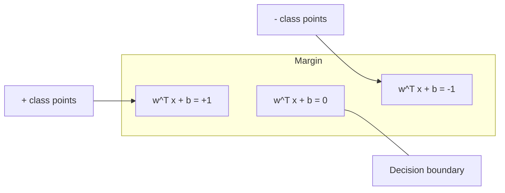
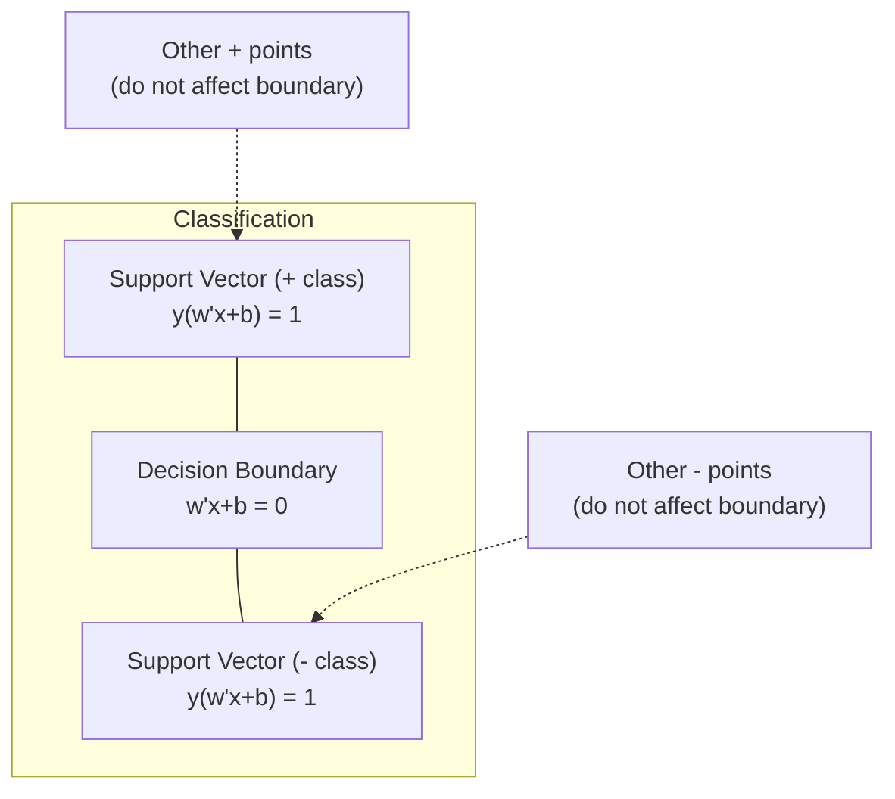
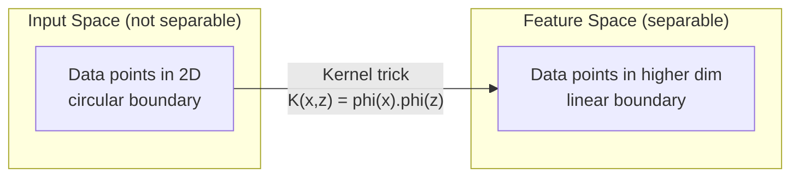

# Máquinas de apoyo de vectores
# 支持向量机 (SVM)  apoyo a la movilidad de las personas


> Encuentra la calle más ancha entre dos clases.

> Encontrar la calle más ancha entre dos clases.

**Type:** Build | **类型：** 构建
**Language:**¿ Qué pasa ?**语言：**Python
**Prerequisites:** Phase 1 (Lessons 08 Optimization, 14 Norms and Distances, 18 Convex Optimization) | **前置知识：** Phase 1（第 8 课优化、第 14 课范数与距离、第 18 课凸优化）
**Time:** ~90 minutes | **时间：** 约 90 分钟

## Objetivos de aprendizaje

- Implementar un SVM lineal desde cero utilizando pérdida de bisagra y descenso de gradiente en la formulación primaria
  En forma original, el uso de la combinación de pérdida y gradiente disminuye desde cero a la realización de SVM lineal
- Explicar el principio de margen máximo e identificar vectores de apoyo de un modelo entrenado
  解释最大间隔原理,并从训练好的模型中识别支持向量
- Comparar los núcleos lineal, polinómico y RBF y explicar cómo el truco del núcleo evita el mapeo explícito de alta dimensión
  Comparar nucleo lineal, multi-atomico y nucleo RBF, explicar cómo evitar la alta dimensión de la imagen
- Evaluar la compensación controlada por el parámetro C entre el ancho del margen y los errores de clasificación
  evaluación de la ponderación entre la amplitud de la separación y la clasificación de errores del control de los C 


> **【中文解读】**
> SVM 找到最大间隔的分类边界――核技巧让 SVM 在高维空间处理非线性问题直观理解就是升维后再切分――sklearn 中的 SVC/SVR──文本分类、图像识别中曾广泛使用──

> **【拓展：SVM 在深度学习时代仍然重要的场景】**
> En el primer tiempo, la tecnología de gestión de residuos de basura (SVM) sigue siendo un método de aprendizaje más avanzado que el de la investigación de datos.

## El problema es la introducción del problema

Hay dos clases de puntos de datos y hay que dibujar una línea (o hiperplano) que los separe.

> ¿Tienes dos tipos de puntos de datos, necesitas dibujar una línea (o superplano) para separarlos?

El margen es la distancia entre el límite de decisión y los puntos de datos más cercanos en cada lado.

> El mayor de los intervalos es el límite de la decisión a la distancia de los puntos de datos más cercanos de cada lado.

Esta intuición conduce a las Máquinas de Vector de Apoyo, uno de los algoritmos matemáticamente más elegantes en ML. Los SVM fueron el método de clasificación dominante antes del aprendizaje profundo y siguen siendo la mejor opción para pequeños conjuntos de datos, datos de alta dimensión y problemas donde se necesita un modelo de principios, bien entendido con garantías teóricas.

> Esta intuición ha dado lugar a uno de los algoritmos más elegantes de la matemática media.

Los SVM se conectan directamente a la Fase 1: la optimización es convexa (lección 18), el margen se mide con normas (lección 14), y el truco del núcleo explota productos de puntos para manejar límites no lineales sin tener que computación en el espacio de alta dimensión.

> SVM y la Fase 1  directamente relacionados: optimización es de la conformación (§ 18 课), espacios de la cantidad de dimensiones (§ 14 课), técnicas nucleares utilizando puntos de acumulación de procesamiento de fronteras no lineales y no necesario en el alto espacio de cálculo.

> **【中文解读】**
> El principio de la separación de datos es el principio de la separación de datos más grande, de la generalización de la capacidad de generalización, de la capacidad de generalización, de la capacidad de generalización. Sólo un pequeño número de puntos en la separación determina el límite de la toma de decisiones, y otros puntos no afectan a los resultados.

## El concepto central.

### El clasificador de margen máximo

Dados datos linealmente separables con etiquetas y_i en {-1, +1} y vectores de características x_i, queremos un hiperplano w^T x + b = 0 que separe las clases.

> 给定标签 y_i 为 {-1, +1} 线性可分数据和特征向量 x_i, necesitamos una superplano w^T x + b = 0 para separar las clases。

La distancia de un punto x_i al hiperplano es:

> Punto x_i hasta la distancia de superplano es:

```
distance = |w^T x_i + b| / ||w||
```

Para un punto correctamente clasificado: y_i * (w^T x_i + b) > 0. El margen es el doble de la distancia del hiperplano al punto más cercano en ambos lados.

> 对于正确分类的点:y_i * (w^T x_i + b) > 0──间隔是超平面到两侧近点距离的两倍──



El problema de optimización:

> 优化问题:

```
maximize    2 / ||w||     (the margin width)
subject to  y_i * (w^T x_i + b) >= 1  for all i
```

Igualmente (minimizar las condiciones de la producción es más fácil de optimizar):

> Las condiciones de la producción de productos agrícolas son más adecuadas para el desarrollo de la producción de productos agrícolas.

```
minimize    (1/2) ||w||^2
subject to  y_i * (w^T x_i + b) >= 1  for all i
```

Este es un programa cuadrático convexo. Tiene una solución global única. Los puntos de datos que se encuentran exactamente en los límites del margen (donde y_i * (w^T x_i + b) = 1) son los vectores de soporte. Son los únicos puntos que determinan el límite de decisión. Mueve o elimine cualquier punto de vector no de soporte, y el límite no cambia.

> Este es un problema de planificación de la segunda ronda. Tiene una solución única a la situación general. Por cierto, se encuentra en el punto de datos de la frontera de separación.

### Vectores de apoyo: los pocos críticos



La mayoría de los puntos de entrenamiento son irrelevantes. Sólo importan los vectores de apoyo. Es por eso que los SVM son eficientes en la memoria en el tiempo de predicción: solo se necesitan almacenar los vectores de apoyo, no todo el conjunto de entrenamiento.

> La mayoría de los puntos de entrenamiento son inadecuados. Sólo el apoyo de los vectores funciona.

El número de vectores de soporte también da un límite en el error de generalización.

> La cantidad de volúmenes de apoyo también da la mayor diferencia de generalización. En comparación con el tamaño del conjunto de datos, el volúmenes de apoyo más pequeños significan una generalización más buena.

### Margen suave: ruido de manejo con el parámetro C

Los datos reales rara vez son perfectamente separables. Algunos puntos pueden estar en el lado equivocado del límite, o dentro del margen.

> Los datos reales son muy pocos y pueden ser completamente obtenidos. Algunos puntos pueden estar en el lado de los errores de la frontera, o en el intervalo.

```
minimize    (1/2) ||w||^2 + C * sum(xi_i)
subject to  y_i * (w^T x_i + b) >= 1 - xi_i
            xi_i >= 0  for all i
```

La variable de flexibilidad xi_i mide la cantidad de puntos i que violan el margen.

> 松变量 xi_i 衡点 i 违反间隔的程度──C 控制权衡:

| C value | Behavior |
|---------|----------|
| Large C | Penalizes violations heavily. Narrow margin, fewer misclassifications. Overfits |
| Small C | Allows more violations. Wide margin, more misclassifications. Underfits |

| C 值 | 行为 |
|------|------|
| 大 C | 严重惩罚违规。窄间隔，较少误分类。易过拟合 |
| 小 C | 允许更多违规。宽间隔，较多误分类。易欠拟合 |

C es la fuerza de regularización, invertida. C mayor = menos regularización. C menor = más regularización.

> C es la fuerza de la rebelión de la fuerza de la fuerza de la fuerza de la fuerza de la fuerza de la fuerza de la fuerza de la fuerza de la fuerza de la fuerza de la fuerza de la fuerza de la fuerza de la fuerza de la fuerza de la fuerza de la fuerza de la fuerza de la fuerza de la fuerza de la fuerza de la fuerza de la fuerza de la fuerza de la fuerza de la fuerza de la fuerza de la fuerza de la fuerza de la fuerza de la fuerza de la fuerza de la fuerza de la fuerza de la fuerza de la fuerza de la fuerza de la fuerza de la fuerza de la fuerza de la fuerza de la fuerza de la fuerza de la fuerza de la fuerza de la fuerza de la fuerza de la fuerza de la fuerza de la fuerza de la fuerza de la fuerza de la fuerza de la fuerza de la fuerza de la fuerza de la fuerza de la fuerza de la fuerza de la fuerza de la fuerza de la fuerza de la fuerza de la fuerza de la fuerza de la fuerza de la fuerza de la fuerza de la fuerza de la fuerza de la fuerza de la fuerza de la fuerza de la fuerza de la fuerza de la fuerza de la fuerza de la fuerza de la fuerza de la fuerza de la fuerza de la fuerza de la fuerza de la fuerza de la fuerza de la fuerza de la fuerza de la fuerza de la fuerza de la fuerza de la fuerza de la fuerza de la fuerza de la fuerza de la fuerza de la fuerza de la fuerza de la fuerza de la fuerza de la fuerza de la fuerza de la fuerza de la fuerza de la fuerza de la fuerza de la fuerza de la fuerza de la fuerza de la fuerza de la fuerza de la fuerza de la fuerza de la fuerza de la fuerza de la fuerza de la fuerza de la fuerza de la fuerza de la fuerza de la fuerza de la fuerza de la fuerza de la fuerza de la fuerza de la fuerza de la fuerza de la fuerza de la fuerza de la fuerza de la fuerza de la fuerza de la fuerza de la fuerza de la fuerza de la fuerza de la fuerza de la fuerza de la fuerza de la fuerza de la fuerza de la fuerza de la fuerza de la fuerza de la fuerza de la fuerza de la fuerza de la fuerza de la fuerza de la fuerza de la fuerza de la fuerza de la fuerza de la fuerza de la fuerza de la fuerza de la fuerza de la fuerza de la fuerza de la fuerza de la fuerza de la fuerza de la fuerza de la fuerza de la fuerza de la fuerza de la fuerza de la fuerza

### Perdida de colmillos: función de pérdida de SVM

El SVM de margen blando se puede reescribir como una optimización sin restricciones:

> 软间隔 SVM puede ser reescrito para optimizar sin restricciones:

```
minimize    (1/2) ||w||^2 + C * sum(max(0, 1 - y_i * (w^T x_i + b)))
```

El término max(0, 1 - y_i * f(x_i)) es la pérdida de bisagra. Es cero cuando el punto está clasificado correctamente y más allá del margen. Es lineal cuando el punto está dentro del margen o está mal clasificado.

> 项 max(0, 1 - y_i * f(x_i)) es la combinación de páginas de pérdida.

```
Hinge loss for a single point:

loss
  |
  | \
  |  \
  |   \
  |    \
  |     \_______________
  |
  +-----|-----|-------->  y * f(x)
       0     1

Zero loss when y*f(x) >= 1 (correctly classified, outside margin).
Linear penalty when y*f(x) < 1.
```

Comparar con pérdida logística (regresón logística):

> Comparado con la pérdida lógica de regreso:

```
Hinge:     max(0, 1 - y*f(x))          Hard cutoff at margin
Logistic:  log(1 + exp(-y*f(x)))        Smooth, never exactly zero
```

La pérdida de colchones produce soluciones escasas (solo los vectores de soporte tienen una contribución no cero). La pérdida logística utiliza todos los puntos de datos. Esto hace que los SVM sean más eficientes en la memoria en el tiempo de predicción.

> 合页损失产生稀疏解(sólo el apoyo de la potencia tiene una contribución de poco) ――Lógico pérdida utiliza todos los puntos de datos―, lo que permite que SVM en el tiempo de pronóstico más ahorrar memoria―.

### Entrenamiento de un SVM lineal con descenso de gradiente

Puede entrenar un SVM lineal utilizando la descenda de gradiente en la pérdida de bisagra más la regularización L2, sin resolver el QP restringido:

> Puede utilizar la formación de la línea SVM en la forma normal de L2 en la forma normal de la formación de la línea SVM, sin necesidad de resolver la situación.

```
L(w, b) = (lambda/2) * ||w||^2 + (1/n) * sum(max(0, 1 - y_i * (w^T x_i + b)))

Gradient with respect to w:
  If y_i * (w^T x_i + b) >= 1:  dL/dw = lambda * w
  If y_i * (w^T x_i + b) < 1:   dL/dw = lambda * w - y_i * x_i

Gradient with respect to b:
  If y_i * (w^T x_i + b) >= 1:  dL/db = 0
  If y_i * (w^T x_i + b) < 1:   dL/db = -y_i
```

Esto se llama la formulación primaria. Se ejecuta en O(n * d) por época, donde n es el número de muestras y d es el número de características. Para datos grandes, escasos y de alta dimensión (clasificación de texto), esto es rápido.

> Esto se llama forma original. El tiempo de cada ciclo de operación es O (n * d), de los cuales n es el número de muestras, d es el número de características.

> **【中文解读】**
> 合页损失 (Hinge Loss) es la función de pérdida central de SVM: cuando el muestreo es clasificado correctamente y se pierde en el espacio de tiempo, se pierde en 0, si no se pierde en el tiempo de tiempo.

### La doble formulación y el truco del núcleo

El dual Lagrangiano del problema de SVM (de la lección de la fase 1, condiciones de KKT) es:

> La situación en el sector de la educación superior es muy difícil.

```
maximize    sum(alpha_i) - (1/2) * sum_ij(alpha_i * alpha_j * y_i * y_j * (x_i . x_j))
subject to  0 <= alpha_i <= C
            sum(alpha_i * y_i) = 0
```

El dual solo implica productos de puntos x_i. x_j entre los puntos de datos. Esta es la clave. reemplaza cada producto de puntos con una función del núcleo K(x_i, x_j) y el SVM puede aprender límites no lineales sin calcular nunca la transformación explícitamente.

> En forma ocasional, sólo se trata de puntos de datos entre puntos x_i. x_j. Esto es un conocimiento clave. Cada punto de datos se sustituye por la función nuclear K(x_i, x_j), SVM se puede aprender a los límites no lineales sin necesidad de cambios de cálculo.

```
Linear kernel:      K(x, z) = x . z
Polynomial kernel:  K(x, z) = (x . z + c)^d
RBF (Gaussian):     K(x, z) = exp(-gamma * ||x - z||^2)
```

El núcleo RBF mapea los datos en un espacio de dimensiones infinitas. Los puntos que están cerca en el espacio de entrada tienen un valor del núcleo cerca de 1.

> RBF núcleo se proyecta a un espacio infinito. En el espacio de entrada, el punto más cercano al núcleo se acerca a 1 y el punto más alejado del núcleo se acerca a 0.



El truco del núcleo calcula el producto de puntos en el espacio de alta dimensión sin llegar allí. Para el núcleo polinómico de grado d en dimensiones D, el espacio de características explícito tiene dimensiones O(D^d). Pero K(x, z) se calcula en tiempo O(D).

> 核技巧在高维空间中计算点积而无需实际到达那里──对于 D 维中的 d 次多项式核,显式特征空间有 O  D 维──但 K  X, z) 只有需要 O  D 时间计算──

> **【中文解读】**
> 核技巧是SVM 最优雅的数学贡献――对偶形式只涉及数据点之间的点积 x_i · x_j,将其替换为核函数 K(x_i, x_j) 即可在高维(甚至无限维) espacio学习非线性边界,而无需显式计算高维映射──RBF 核将数据映射到无限维空间,能学习任意光滑的决策边缘──计算开销:多项式核的式特征空间有多维 (多维) 维,但核函数只需要多维 (多维) 时间──

> **【拓展：核技巧的思想在现代 AI 中的延续】**
> 核技巧的核心思想" calcular similitud en el alto维空间而不显式映射" en el mecanismo de atención de Transformer tiene un cuerpo similar.

### MPS para regresión (MPS)

El vector de apoyo regresión se ajusta a un tubo de ancho epsilon alrededor de los datos. los puntos dentro del tubo tienen pérdida cero. los puntos fuera del tubo se penalizan linealmente.

> 支持向量回归在数据周围拟合一个宽度为一的管道──管道内的点损失为零──管道外的点被线性惩罚──

```
minimize    (1/2) ||w||^2 + C * sum(xi_i + xi_i*)
subject to  y_i - (w^T x_i + b) <= epsilon + xi_i
            (w^T x_i + b) - y_i <= epsilon + xi_i*
            xi_i, xi_i* >= 0
```

El parámetro epsilon controla el ancho del tubo. tubo más ancho = menos vectores de soporte = ajuste más suave. tubo más estrecho = más vectores de soporte = ajuste más estrecho.

> Epsilon parámetro de control de la amplitud del tubo. Tubo más amplio = menor volumen de apoyo = más plano de adaptación. Tubo más estrecho = más volumen de apoyo = más estrecho de adaptación.

### Por qué los SVM perdieron al aprendizaje profundo (y cuando todavía ganan)

Los SVM dominaron el aprendizaje de aprendizaje desde finales de la década de 1990 hasta principios de la década de 2010.

> SVM en la década de 1990 hasta principios de 2010 dominó el aprendizaje a fondo.

| Factor | SVMs | Deep learning |
|--------|------|---------------|
| Feature engineering | Requires it | Learns features |
| Scalability | O(n^2) to O(n^3) for kernel | O(n) per epoch with SGD |
| Image/text/audio | Needs handcrafted features | Learns from raw data |
| Large datasets (>100k) | Slow | Scales well |
| GPU acceleration | Limited benefit | Massive speedup |

| 因素 | SVM | 深度学习 |
|------|-----|---------|
| 特征工程 | 需要手动 | 自动学习 |
| 可扩展性 | 核方法 O(n^2) 到 O(n^3) | SGD 每轮 O(n) |
| 图像/文本/音频 | 需要手工特征 | 从原始数据学习 |
| 大数据集（>10 万） | 较慢 | 扩展性好 |
| GPU 加速 | 有限收益 | 大幅提速 |

Los SVM siguen ganando en estas situaciones:
- Los conjuntos de datos pequeños (de cientos a miles de muestras)
  小数据集 ((cientos a miles de muestras)
- Datos escasos de alta dimensión (texto con características TF-IDF)
  高维稀疏数据 (en inglés)
- Cuando se necesiten garantías matemáticas (límites de margen)
  需要数学保证时(间隔边界)
- Cuando el tiempo de entrenamiento debe ser mínimo (la SVM lineal es muy rápida)
   entrenamiento tiempo debe ser el más corto                                                                                                                                                                                                                                                          
- Clasificación binaria con estructura de margen clara
  具有清晰间隔结构的二分类
- Detección de anomalías (MV de una clase)
  异常检测(单类 SVM)

> SVM en las siguientes situaciones sigue ganando:

## Construye y realiza.
```figure
svm-margin
```

## Construye el mismo

### Paso 1: pérdida de la barandilla y la gradiente

Calcula la pérdida de bisagra de un lote y su gradiente.

> 基础―― calcular la pérdida de la página de un conjunto de datos y su escala­didad―

```python
def hinge_loss(X, y, w, b):
    n = len(X)
    total_loss = 0.0
    for i in range(n):
        margin = y[i] * (dot(w, X[i]) + b)  # 计算样本到决策边界的函数间隔
        total_loss += max(0.0, 1.0 - margin)  # 合页损失：间隔 < 1 时才有惩罚
    return total_loss / n  # 返回平均损失
```

### Paso 2: SVM lineal a través de la descenso de gradiente

Entrenamiento minimizando la pérdida de bisagra regularizada.

> 通过最小化正则化合物损失训练──无需 QP 求解器──

```python
class LinearSVM:
    def __init__(self, lr=0.001, lambda_param=0.01, n_epochs=1000):
        self.lr = lr  # 学习率
        self.lambda_param = lambda_param  # 正则化参数（对应 1/C）
        self.n_epochs = n_epochs
        self.w = None  # 权重向量
        self.b = 0.0  # 偏置

    def fit(self, X, y):
        n_features = len(X[0])
        self.w = [0.0] * n_features
        self.b = 0.0

        for epoch in range(self.n_epochs):
            for i in range(len(X)):
                margin = y[i] * (dot(self.w, X[i]) + self.b)  # 函数间隔
                if margin >= 1:
                    # 样本在间隔之外，只需正则化梯度
                    self.w = [wj - self.lr * self.lambda_param * wj
                              for wj in self.w]
                else:
                    # 样本在间隔内或被误分类，需要额外的损失梯度
                    self.w = [wj - self.lr * (self.lambda_param * wj - y[i] * X[i][j])
                              for j, wj in enumerate(self.w)]
                    self.b -= self.lr * (-y[i])

    def predict(self, X):
        return [1 if dot(self.w, x) + self.b >= 0 else -1 for x in X]  # 根据符号预测类别
```

### Paso 3: Funciones del núcleo

Implemente núcleos lineales, polinómicos y RBF.

> 实现线性核、多项式核和 RBF 核──

```python
def linear_kernel(x, z):
    return dot(x, z)  # 线性核：直接点积

def polynomial_kernel(x, z, degree=3, c=1.0):
    return (dot(x, z) + c) ** degree  # 多项式核：(x·z + c)^d

def rbf_kernel(x, z, gamma=0.5):
    diff = [xi - zi for xi, zi in zip(x, z)]  # 计算差向量
    return math.exp(-gamma * dot(diff, diff))  # RBF 核：exp(-γ||x-z||²)
```

### Paso 4: Identificación de márgenes y vectores de soporte

Después del entrenamiento, identifique qué puntos son vectores de apoyo y compute el ancho del margen.

>  Después del entrenamiento, identifique qué puntos son el apoyo a la velocidad y calcular el intervalo de ancho.

```python
def find_support_vectors(X, y, w, b, tol=1e-3):
    support_vectors = []
    for i in range(len(X)):
        margin = y[i] * (dot(w, X[i]) + b)
        if abs(margin - 1.0) < tol:
            support_vectors.append(i)
    return support_vectors
```

¿ Qué ?`code/svm.py`para la implementación completa con todas las demostraciones.

> 完整实现(含所有演示) See `code/svm.py`¿Qué es eso?

## Usalo con el marco de ejecución

> **【中文解读】**
> El uso de SVM en el sistema de cálculo es fundamental para la evaluación de la calidad de los datos de la base de datos. El uso de SVM en el sistema de cálculo es fundamental para la evaluación de la calidad de los datos de la base de datos.

Con el aprendizaje de la escikit:

> Utiliza el método de aprendizaje:

```python
from sklearn.svm import SVC, LinearSVC, SVR
from sklearn.preprocessing import StandardScaler
from sklearn.pipeline import Pipeline

# 标准化 + SVM 的标准管线
clf = Pipeline([
    ("scaler", StandardScaler()),  # 标准化是 SVM 的必选项
    ("svm", SVC(kernel="rbf", C=1.0, gamma="scale")),  # RBF 核 SVM
])
clf.fit(X_train, y_train)
print(f"Accuracy: {clf.score(X_test, y_test):.4f}")
print(f"Support vectors: {clf['svm'].n_support_}")
```

Importante: siempre escalar sus características antes de entrenar a un SVM. Los SVM son sensibles a las magnitudes de las características porque el margen depende de las características no escaladas, y distorsionan la geometría.

> importante: entrenar SVM                                                                                                                                                                                                                                                           

Para conjuntos de datos grandes, utilice `LinearSVC`(formulación primaria, O(n) por época) en lugar de `SVC`(formación doble, O(n^2) a O ((n^3)):

> 对于大数据集,使用 `LinearSVC`(原始形式,每轮 O(n)) en lugar de `SVC`(en forma ocasional, O(n^2) hasta O(n^3)):

```python
from sklearn.svm import LinearSVC

clf = Pipeline([
    ("scaler", StandardScaler()),
    ("svm", LinearSVC(C=1.0, max_iter=10000)),
])
```

## Los ejercicios.

1. Generar un conjunto de datos linealmente separable en 2D. Entrenar su LinearSVM e identificar los vectores de soporte. Verificar que los vectores de soporte son los puntos más cercanos al límite de decisión.
   1. Crear un conjunto de datos 2D 线性可分.

2. Varia C de 0,001 a 1000 en un conjunto de datos ruidosos. Trazar el límite de decisión para cada valor C. Observe la transición de margen amplio (incorrección) a margen estrecho (overfitting).
   2. En el conjunto de datos de ruido, se verá el C de 0.001  cambios a 1000― para cada C  valor de dibujo de la decisión de límite― observar el cambio de largo intervalo                                                                                                                                                                                                                                          

3. Crear un conjunto de datos donde los límites de las clases son circulares (no lineales). Mostrar que un SVM lineal falla. Compute la matriz del núcleo RBF y mostrar que las clases se vuelven separables en el espacio de características inducido por el núcleo.
   3. Crear un conjunto de datos de un tipo de frontera en forma de círculo ∞ ∞ ∞ ∞ ∞ ∞ ∞ ∞ ∞ ∞ ∞ ∞ ∞ ∞ ∞ ∞ ∞ ∞ ∞ ∞ ∞ ∞ ∞ ∞ ∞ ∞ ∞ ∞ ∞ ∞ ∞ ∞ ∞ ∞ ∞ ∞ ∞ ∞ ∞ ∞ ∞ ∞ ∞ ∞ ∞ ∞ ∞ ∞ ∞ ∞ ∞ ∞ ∞ ∞ ∞ ∞ ∞ ∞ ∞ ∞ ∞ ∞ ∞ ∞ ∞ ∞ ∞ ∞ ∞ ∞ ∞ ∞ ∞ ∞ ∞ ∞ ∞ ∞ ∞ ∞ ∞ ∞ ∞ ∞ ∞ ∞ ∞ ∞ ∞ ∞ ∞ ∞ ∞ ∞ ∞ ∞ ∞ ∞ ∞ ∞ ∞ ∞ ∞ ∞ ∞ ∞ ∞ ∞ ∞ ∞ ∞ ∞ ∞ ∞ ∞ ∞ ∞ ∞ ∞ ∞ ∞ ∞ ∞ ∞ ∞ ∞ ∞ ∞ ∞ ∞ ∞ ∞ ∞ ∞ ∞ ∞ ∞ ∞ ∞ ∞ ∞ ∞ ∞ ∞ ∞ ∞ ∞ ∞ ∞ ∞ ∞ ∞ ∞ ∞ ∞ ∞ ∞ ∞ ∞ ∞ ∞ ∞ ∞ ∞ ∞ ∞ ∞ ∞ ∞ ∞ ∞ ∞ ∞ ∞ ∞ ∞ ∞ ∞ ∞ ∞ ∞ ∞ ∞ ∞ ∞ ∞ ∞ ∞ ∞ ∞ ∞ ∞ ∞ ∞ ∞ ∞ ∞ ∞ ∞ ∞ ∞ ∞ ∞ ∞ ∞ ∞ ∞ ∞ ∞ ∞ ∞ ∞ ∞ ∞ ∞ ∞ ∞ ∞ ∞ ∞ ∞ ∞ ∞ ∞ ∞ ∞ ∞ ∞ ∞ ∞ ∞ ∞ ∞ ∞ ∞ ∞ ∞ ∞ ∞ ∞ ∞ ∞ ∞ ∞ ∞ ∞ 

4. Compare pérdida de bisagra con pérdida logística en el mismo conjunto de datos. Entrenar un SVM lineal y regresión logística. Cuente cuántos puntos de entrenamiento contribuyen al límite de decisión de cada modelo (vectores de apoyo con todos los puntos).
   4. En el mismo conjunto de datos, comparamos los puntos de entrenamiento de los modelos de datos de los modelos de datos de los modelos de datos de los modelos de datos de los modelos de datos de los modelos de datos de los modelos de datos de los modelos de datos de los modelos de datos de los modelos de los modelos de datos de los modelos de datos de los modelos de datos de los modelos de datos de los modelos de datos de los modelos de datos de los modelos de datos de los modelos de datos de los modelos de datos de los modelos de datos de los modelos de datos de los modelos de datos de los modelos de datos de los modelos de datos de los modelos de datos de los modelos de datos de los modelos de datos de los modelos de datos de los modelos de datos de los modelos de datos de los modelos de datos de los modelos de datos de los modelos de datos de los modelos de datos de los modelos de datos de los modelos de datos de los modelos de datos de los modelos de datos de los modelos de datos de los modelos de datos de los modelos de datos de los modelos de datos de los modelos de los modelos de datos de los modelos de los modelos de los modelos de los modelos de los modelos de los modelos de los modelos de los modelos de los modelos de los modelos de la serie de los modelos de los modelos de los modelos de los modelos de los modelos de los modelos de los modelos de los modelos de la serie.

5. Implemente SVR (pérdida insensitiva a la epsilon). Ajuste a y = sin(x) + ruido. Traza el tubo de epsilon alrededor de las predicciones y resalte los vectores de soporte (puntos fuera del tubo).
   5. 实现 SVR(epsilon 不敏感损失) ――拟合 y = sin(x) + ruido──绘制预测周围的epsilon 管道并标记支持向量(管道外的点)。

## Términos clave .

| Term | What it actually means |
|------|----------------------|
| Support vectors | The training points closest to the decision boundary. The only points that determine the hyperplane |
| Margin | The distance between the decision boundary and the nearest support vectors. SVMs maximize this |
| Hinge loss | max(0, 1 - y*f(x)). Zero when correctly classified and outside the margin. Linear penalty otherwise |
| C parameter | Trade-off between margin width and classification errors. Large C = narrow margin, small C = wide margin |
| Soft margin | SVM formulation that allows margin violations via slack variables. Handles non-separable data |
| Kernel trick | Computing dot products in a high-dimensional feature space without explicitly mapping to that space |
| Linear kernel | K(x, z) = x . z. Equivalent to standard dot product. For linearly separable data |
| RBF kernel | K(x, z) = exp(-gamma * \|\|x-z\|\|^2). Maps to infinite dimensions. Learns any smooth boundary |
| Polynomial kernel | K(x, z) = (x . z + c)^d. Maps to a feature space of polynomial combinations |
| Dual formulation | Reformulation of the SVM problem that depends only on dot products between data points. Enables kernels |
| SVR | Support Vector Regression. Fits an epsilon-tube around the data. Points inside the tube have zero loss |
| Slack variables | xi_i: measures how much a point violates the margin. Zero for correctly classified points outside margin |
| Maximum margin | The principle of choosing the hyperplane that maximizes the distance to the nearest points of each class |

## Más Leer más Leer más

- [Vapnik: The Nature of Statistical Learning Theory (1995)](https://link.springer.com/book/10.1007/978-1-4757-3264-1)- el texto fundamental sobre los MSS y el aprendizaje estadístico
  [Vapnik: The Nature of Statistical Learning Theory (1995)](https://link.springer.com/book/10.1007/978-1-4757-3264-1)- SVM y los libros de base de la teoría de la estadística
- [Cortes & Vapnik: Support-vector networks (1995)](https://link.springer.com/article/10.1007/BF00994018)- el papel original de SVM
  [Cortes & Vapnik: Support-vector networks (1995)](https://link.springer.com/article/10.1007/BF00994018)- SVM 原始论文
- [Platt: Sequential Minimal Optimization (1998)](https://www.microsoft.com/en-us/research/publication/sequential-minimal-optimization-a-fast-algorithm-for-training-support-vector-machines/)- el algoritmo de gestión de la gestión de la actividad que hizo práctica la formación de la gestión de la actividad de la empresa
  [Platt: Sequential Minimal Optimization (1998)](https://www.microsoft.com/en-us/research/publication/sequential-minimal-optimization-a-fast-algorithm-for-training-support-vector-machines/)- Para que el entrenamiento de SVM se convierta en un algoritmo de SMO práctico
- [scikit-learn SVM documentation](https://scikit-learn.org/stable/modules/svm.html)- Guía práctica con detalles de aplicación
  [scikit-learn SVM 文档](https://scikit-learn.org/stable/modules/svm.html)- 实用指南及实现细节
- [LIBSVM: A Library for Support Vector Machines](https://www.csie.ntu.edu.tw/~cjlin/libsvm/)- la biblioteca C++ detrás de la mayoría de las implementaciones de SVM
  [LIBSVM](https://www.csie.ntu.edu.tw/~cjlin/libsvm/)- La mayoría de SVM  implementar detrás de C ++ 库
