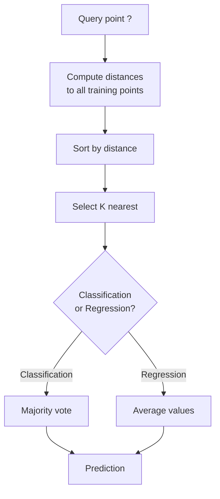
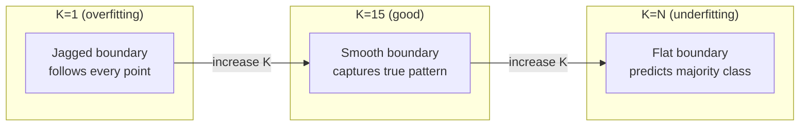
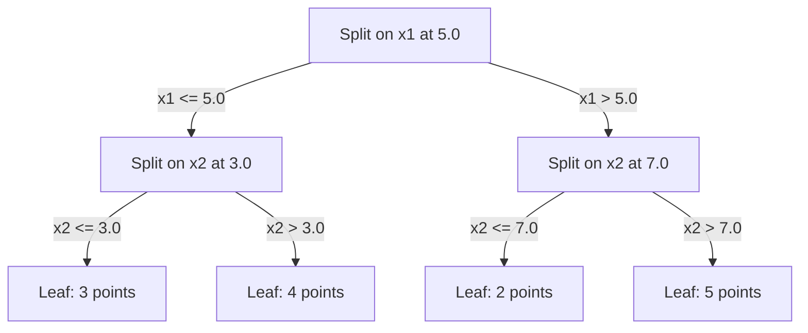

# K- Vecinos y distancias más cercanos
# C. C. C. C. C. C. C. C. C. C. C. C. C. C. C. C. C. C. C. C. C. C. C. C. C. C. C. C. C. C. C. C. C. C. C. C. C. C. C. C. C. C. C. C. C. C. C. C. C. C. C. C. C. C. C. C. C. C. C. C. C. C. C. C. C. C. C. C. C. C. C. C. C. C. C. C. C. C. C. C. C. C. C. C. C. C. C. C. C. C. C. C. C. C. C. C. C. C. C. C. C. C. C. C. C. C. C. C. C. C. C. C. C. C. C. C. C. C. C. C. C. C. C. C. C. C. C. C. C. C. C. C. C. C. C. C. C. C. C. C. C. C. C. C. C. C. C. C. C. C. C. C. C. C. C. C. C. C. C. C. C. C. C. C. C. C. C. C. C. C. C. C. C. C. C. C. C. C. C. C. C. C. C. C. C. C. C. C. C. C. C. C. C. C. C. C. C. C. C. C. C. C. C. C. C. C. C. C. C. C. C. C. C. C. C. C. C. C. C. C. C. C. C. C. C. C. C. C. C. C. C. C. C. C. C. C. C. C. C. C. C. C. C. C. C. C. C. C. C. C. C. C. C. C. C.


> Almacenar todo, predecir mirando a sus vecinos, el algoritmo más simple que realmente funciona.

> 储存一切――预测时看邻居―― el algoritmo más simple pero realmente eficaz――

**Type:** Build | **类型：** 构建
**Language:**¿ Qué pasa ?**语言：**Python
**Prerequisites:** Phase 1 (Lesson 14 Norms and Distances) | **前置知识：** Phase 1（第 14 课范数与距离）
**Time:** ~90 minutes | **时间：** 约 90 分钟

## Objetivos de aprendizaje

- Implementar la clasificación KNN y la regresión desde cero con K configurable y votación ponderada por distancia
  Desde cero realizable configuración K valor y distancia de la votación de la aprobación de la KNN
- Comparar las métricas de distancia L1, L2, cosino y Minkowski y seleccionar la adecuada para un tipo de datos dado
  Comparar la medida de distancia L1、L2、Y y可夫基, para seleccionar la medida adecuada para un determinado tipo de datos
- Explicar la maldición de la dimensionalidad y demostrar por qué KNN se degrada en espacios de alta dimensión
  Explicar la magnitud del desastre, demostración por qué KNN en alto nivel de espacio disminuye en rendimiento
- Construir un árbol KD para buscar eficiente vecino más cercano y analizar cuando superen la fuerza bruta
  Construir KD  árbol realizar alta eficiencia búsqueda de vecindario, análisis ¿Cuándo es mejor que búsqueda violenta


> **【中文解读】**
> El pensamiento central de KNN es que el usuario similar en el sistema de recomendaciones es el usuario similar en el pensamiento de KNN.

> **【拓展：KNN 思想在现代 AI 中的广泛应用】**
> RAG(检索增强生成) 本质就是 KNN:将用户问题编码为向量,在向量数据库 (Pinecone、Milvus、FAISS) busque K 个最相似的文档片段,再将它们提供给 LLM 生成答──Spotify 音乐推使用近近邻的近邻的近邻的近邻的近邻的近邻的近邻的近邻的近邻的近邻的近邻的近邻的近邻的近邻的近邻的近邻的近邻的近邻的近邻的近邻的近邻的近邻的近邻的近邻的近邻的近邻的近邻的近邻的近邻的近邻的近邻的近邻的近邻的近邻的近邻的近邻的近邻的近邻的近邻的近邻的近邻的近邻的近邻的近邻的近邻的近邻的近邻的近邻的近邻的近邻近的近邻的近邻的近邻近的近邻近的近邻近的近邻近的近的近邻近的近的近邻近的近的近邻近的近的近邻近的近的近邻近的近的近邻近的近的近的近邻近的近的近的近邻近的近的近.

## El problema es la introducción del problema

Hay un conjunto de datos. Un nuevo punto de datos llega. Necesitas clasificarlo o predecir su valor. En lugar de aprender parámetros de los datos (como regresión lineal o SVM), simplemente encuentra los puntos de entrenamiento K más cercanos al nuevo punto y deja que voten.

> Tienes un conjunto de datos. Un nuevo punto de datos ha llegado. Necesitas clasificarlo o predecir su valor. No necesitas aprender los parámetros de los datos, como la regeneración de datos o SVM, sino encontrar los puntos de entrenamiento K más cercanos al nuevo punto, y dejarlos votar.

Esto es K-vicinos más cercanos. No hay fase de entrenamiento. No hay parámetros para aprender. No hay función de pérdida para minimizar. Almacenas todo el conjunto de entrenamiento y calcular distancias en el tiempo de predicción.

> Éste es el K. No hay ninguna etapa de entrenamiento. No hay necesidad de parámetros de aprendizaje. No hay necesidad de minimizar la función de pérdida.

Parece demasiado simple para trabajar. Pero KNN es sorprendentemente competitivo para muchos problemas, especialmente con conjuntos de datos pequeños y medianos, y comprenderlo revela profundamente conceptos fundamentales: la elección de la métrica de distancia (conectándose a la lección 14 de la fase 1), la maldición de la dimensionalidad y la diferencia entre el aprendizaje perezoso y ansioso.

>  Parece muy simple, pero KNN es sorprendentemente competitivo en muchos problemas, especialmente en el pequeño conjunto de datos.  Profundiza en su comprensión y revela el concepto básico: la elección de la distancia en la cantidad de datos.

KNN también aparece en todas partes en la IA moderna, bajo diferentes nombres. Las bases de datos vectoriales buscan KNN sobre los embebidos. La generación aumentada de recuperación (RAG) encuentra los trozos de documento K más cercanos. Los sistemas de recomendación encuentran usuarios o elementos similares. El algoritmo es el mismo. La escala y las estructuras de datos son diferentes.

> KNN en la IA moderna no está en todas partes, sólo el nombre es diferente.

> **【中文解读】**
> KNN es un proceso de aprendizaje inerte, no tiene un proceso de entrenamiento, no tiene un proceso de cálculo de distancia.

## El concepto central.

### Cómo funciona KNN

Dado un conjunto de datos de puntos etiquetados y un nuevo punto de consulta:

> Deber un conjunto de datos con etiquetas y un nuevo punto de consulta:

1. Calcule la distancia de la consulta a cada punto del conjunto de datos
    calcular la distancia de cada punto de consulta a cada centro de datos
2. Sortado por distancia
   按距离排序
3. Tome los puntos más cercanos a K
   取 K 个最近的点
4. Para la clasificación: voto mayoritario entre los vecinos K
   Categoría de tareas: K 个邻居中多数投票
5. Para la regresión: promedio (o promedio ponderado) de los valores de los vecinos K
   Regreso a la tarea: K 个邻居值的平均(或加权平均)



No hay ajuste, no hay descenso de gradiente, no hay épocas.

> Esto es todo el algoritmo. No hay forma. No hay escala baja.

### Elegir K

K es el único hiperparámetro.

> K es el único superparámetro.

| K | Behavior |
|---|----------|
| K = 1 | Decision boundary follows every point. Zero training error. High variance. Overfits |
| Small K (3-5) | Sensitive to local structure. Can capture complex boundaries |
| Large K | Smoother boundaries. More robust to noise. May underfit |
| K = N | Predicts the majority class for every point. Maximum bias |

| K | 行为 |
|---|------|
| K = 1 | 决策边界跟随每个点。训练误差为零。高方差。过拟合 |
| 小 K (3-5) | 对局部结构敏感。能捕捉复杂边界 |
| 大 K | 更平滑的边界。对噪声更鲁棒。可能欠拟合 |
| K = N | 每个点都预测多数类。最大偏差 |

Un punto de partida común es K = sqrt(N) para un conjunto de datos de N puntos.

> 常用初始值是 K = sqrt(N)(N 为数据集大小)。二分类使用奇数 K 以避免平票。



### Metricas de distancia

La función de distancia define lo que significa "cerca". Diferentes métricas producen vecinos diferentes, predicciones diferentes.

> La función de distancia define el significado de "cerca". Diferentes dimensiones producen diferentes vecinos, diferentes predicciones.

**L2 (Euclidean)**es el estándar.

> **L2（欧氏距离）**Es un error.

```
d(a, b) = sqrt(sum((a_i - b_i)^2))
```

Sensitivo a la escala de características. Siempre estandarice las características antes de usar L2 con KNN.

> La normalización de los rasgos de la L2 se debe utilizar en el KNN.

**L1 (Manhattan)**La diferencia de la diferencia de la diferencia de la diferencia de la diferencia de la diferencia de la diferencia de la diferencia de la diferencia de la diferencia de la diferencia de la diferencia de la diferencia de la diferencia de la diferencia de la diferencia de la diferencia de la diferencia de la diferencia de la diferencia de la diferencia de la diferencia de la diferencia de la diferencia de la diferencia de la diferencia de la diferencia de la diferencia de la diferencia de la diferencia de la diferencia de la diferencia de la diferencia de la diferencia de la diferencia de la diferencia de la diferencia de la diferencia de la diferencia de la diferencia de la diferencia de la diferencia de la diferencia de la diferencia de la diferencia de la diferencia de la diferencia de la diferencia de la diferencia de la diferencia de la diferencia de la diferencia de la diferencia de la diferencia de la diferencia de la diferencia de la diferencia de la diferencia de la diferencia de la diferencia de la diferencia de la diferencia de la diferencia de la diferencia de la diferencia de la diferencia de la diferencia de la diferencia de la diferencia de la diferencia de la diferencia de la diferencia de la diferencia de la diferencia de la diferencia de la diferencia de la diferencia de la diferencia de la diferencia de la diferencia de la diferencia de la diferencia de la diferencia de la diferencia de la diferencia de la diferencia de la diferencia de la diferencia de la diferencia de la diferencia de la diferencia de la diferencia de la diferencia de la diferencia de la diferencia de la diferencia de la diferencia de la diferencia de la diferencia de la diferencia de la diferencia de la diferencia de la diferencia de la diferencia de la diferencia de la diferencia de la diferencia de la diferencia de la diferencia de la diferencia de la diferencia de la diferencia de la diferencia de la diferencia de la diferencia de la diferencia de la diferencia de la diferencia de la diferencia de la diferencia de la diferencia de la diferencia de la diferencia de la diferencia de la diferencia de la diferencia de la diferencia de la diferencia de la diferencia de la diferencia de la diferencia de la diferencia de la diferencia de la diferencia de la diferencia de la diferencia de la diferencia de la diferencia de la diferencia de la diferencia de la diferencia de la diferencia de la diferencia de la diferencia de la diferencia de la diferencia de la diferencia de la diferencia de la diferencia de la diferencia de la diferencia de la diferencia de la diferencia de la diferencia de la diferencia de la diferencia de la diferencia de la diferencia de la diferencia de la diferencia de la diferencia de la diferencia de la diferencia de la diferencia de la diferencia de la diferencia de la diferencia de la diferencia de la diferencia de la diferencia de

> **L1（曼哈顿距离）**Para el valor de diferencia absoluta, se necesita un valor de diferencia en el L2, porque no es un valor de diferencia cuadrado.

```
d(a, b) = sum(|a_i - b_i|)
```

**Cosine distance**El tamaño de la imagen es esencial para el texto y la incorporación de datos.

> **余弦距离**∆ medir el ángulo entre los volúmenes, ∆ ignorar la magnitud ∆ es esencial para el texto y los datos de inserción ∆

```
d(a, b) = 1 - (a . b) / (||a|| * ||b||)
```

**Minkowski**generaliza L1 y L2 con el parámetro p.

> **闵可夫斯基距离**Usando los parámetros p                                                                                                                                                                                                                                                                                                                                                                                                                                                                                                                      

```
d(a, b) = (sum(|a_i - b_i|^p))^(1/p)

p=1: Manhattan
p=2: Euclidean
p->inf: Chebyshev (max absolute difference)
```

La métrica que se utilice depende de los datos:

> 选择哪种度量 depende de los datos:

| Data type | Best metric | Why |
|-----------|------------|-----|
| Numeric features, similar scale | L2 (Euclidean) | Default, works for spatial data |
| Numeric features, outliers | L1 (Manhattan) | Robust, does not amplify large differences |
| Text embeddings | Cosine | Magnitude is noise, direction is meaning |
| High-dimensional sparse | Cosine or L1 | L2 suffers from curse of dimensionality |
| Mixed types | Custom distance | Combine metrics per feature type |

| 数据类型 | 最佳度量 | 原因 |
|---------|--------|------|
| 数值特征，量级相近 | L2（欧氏） | 默认选择，适合空间数据 |
| 数值特征，有异常值 | L1（曼哈顿） | 鲁棒，不放大大的差异 |
| 文本嵌入 | 余弦 | 大小是噪声，方向是含义 |
| 高维稀疏 | 余弦或 L1 | L2 受维度灾难影响 |
| 混合类型 | 自定义距离 | 按特征类型组合度量 |

### KNN ponderada

El KNN estándar da el mismo peso a todos los vecinos de K. Pero un vecino a distancia 0.1 debería importar más que uno a distancia 5.0.

> El estándar KNN otorga el mismo peso a todos los vecinos K, pero la distancia de 0.1 de los vecinos debe ser más importante que la distancia de 5.0.

**Distance-weighted KNN**Pese a cada vecino inversamente por distancia:

> **距离加权 KNN**按距离的倒数加权每邻居:

```
weight_i = 1 / (distance_i + epsilon)

For classification: weighted vote
For regression:     weighted average = sum(w_i * y_i) / sum(w_i)
```

El epsilon evita la división por cero cuando un punto de consulta coincide exactamente con un punto de entrenamiento.

> Epsilon  Prevenir que los puntos de consulta sean perfectamente iguales

El KNN ponderado es menos sensible a la elección de K porque los vecinos distantes contribuyen muy poco independientemente.

> El KN no es muy sensible a la elección de K, ya que los vecinos de distancia, independientemente de cómo K contribuya, son muy pequeños.

### La maldición de la dimensionalidad

El rendimiento del KNN se degrada en grandes dimensiones.

> El rendimiento de KNN en alta densidad se descompone. Esto no es una preocupación, sino un hecho matemático.

**Problem 1: distances converge.**A medida que aumenta la dimensionalidad, la relación entre la distancia máxima y la distancia mínima se acerca a 1. Todos los puntos se vuelven igualmente "lejos" de la consulta.

> **问题 1：距离趋同。** Con el aumento de la dimensión, la distancia máxima y la distancia mínima se acercan a 1.

```
In d dimensions, for random uniform points:

d=2:    max_dist / min_dist = varies widely
d=100:  max_dist / min_dist ~ 1.01
d=1000: max_dist / min_dist ~ 1.001

When all distances are nearly equal, "nearest" is meaningless.
```

**Problem 2: volume explodes.**Para capturar los vecinos K dentro de una fracción fija de los datos, es necesario ampliar el radio de búsqueda para cubrir una fracción mucho mayor del espacio de características.

> **问题 2：体积爆炸。**Para capturar K 个邻居, en una proporción fija de datos, se necesita ampliar el medio de búsqueda hasta una mayor proporción de espacio de características de cobertura.

**Problem 3: corners dominate.**En un unidad de hipercubo en dimensiones d, la mayor parte del volumen se concentra cerca de las esquinas, no en el centro.

> **问题 3：角落主导。**En un cuadro de un cuadro, la mayor parte del volumen se concentra cerca de un rincón, y no en el centro.

Consecuencia práctica: KNN funciona bien hasta unas 20 a 50 características. Más allá de eso, necesita reducción de dimensionalidad (PCA, UMAP, t-SNE) antes de aplicar KNN, o necesita utilizar estructuras de búsqueda basadas en árboles que exploten la dimensionalidad inferior intrínseca de los datos.

> 实际后果:KNN 在约 20-50 个特征下面效果好――超过这个范围,需要在应用KNN 前进行降维(PCA、UMAP、t-SNE),或使用数据内在低维度树搜索结构──

### Árboles KD: búsqueda rápida del vecino más cercano

La fuerza bruta KNN calcula la distancia de la consulta a cada punto de entrenamiento.

> 暴力 KNN 计算查询点到每训练点的距离――每次查询 O(n * d)―― para el gran conjunto de datos es demasiado lento――

Un árbol KD particiona recursivamente el espacio a lo largo de los ejes de características.

> KD 树沿特征轴递归划分空间―― cada uno de los niveles a lo largo de una dimensión en el valor medio se divide――



Para encontrar al vecino más cercano, cruza el árbol hasta la hoja que contiene la consulta, luego retrocede y compruebe las particiones vecinas sólo si pueden contener puntos más cercanos.

> Para encontrar el vecino más cercano, recorrer el árbol hasta el punto de la página que contiene el punto de consulta, y luego volver a la página que contiene sólo el punto más cercano en el área de consulta.

Tiempo medio de consulta: O(log n) para dimensiones bajas. Pero los árboles KD se degradan a O(n) en dimensiones altas (d > 20) porque el retroceso elimina cada vez menos ramas.

> 低维平均查询时间:O(log n) ・・・ pero KD 树在高维(d > 20) 时退化为O(n),因为回溯消除的分支越来越少──

### Árboles de bolas: mejor para dimensiones moderadas

Los árboles de bolas dividen los datos en hipersferas anidadas en lugar de cajas alineadas con el eje. Cada nodo define una bola (centro + radio) que contiene todos los puntos en ese subárbol.

> El árbol de la bola se dividirá los datos en superesferas de un conjunto de esferas y no en cajas de eje. Cada nodo define una esfera que contiene el centro de la árbol.

Ventajas sobre los árboles KD:
- Trabajar mejor en dimensiones moderadas (hasta ~50)
  En el medio de la dimensión (más de 50) el efecto es mejor
- Manos de estructura no alineada con el eje
  能处理 no eje a la estructura
- Los volúmenes más estrechos de los límites significan que se podan más ramas durante la búsqueda
  Más cercano significa que la búsqueda se hace más rápido.

Los árboles KD y los árboles de bolas son algoritmos exactos. Para la búsqueda a gran escala (millones de puntos, cientos de dimensiones), se utilizan métodos aproximados de vecino más cercanos (HNSW, IVF, cuantización de productos).

> KD 树和球树都是精确算法──对于真正大规模搜索的 () 百万点、数百维),使用近似近邻方法 () HNSW、IVF、乘积量化 () .

### Aprendizaje perezoso vs aprendizaje ansioso

KNN es un aprendiz perezoso: no funciona en el tiempo de entrenamiento y todo funciona en el tiempo de predicción. La mayoría de los otros algoritmos (regressión lineal, SVM, redes neuronales) son aprendices ansiosos: hacen grandes cálculos en el tiempo de entrenamiento para construir un modelo compacto, luego las predicciones son rápidas.

> KNN es un aprendizaje inerte: cuando se entrena no se hace ningún trabajo, todo se realiza en el tiempo de previsión. La mayoría de los otros algoritmos (la mayoría de los cuales se usan en el tiempo de formación, la mayoría de los cuales se realizan en el tiempo de previsión).

| Aspect | Lazy (KNN) | Eager (SVM, neural net) |
|--------|------------|------------------------|
| Training time | O(1) just store data | O(n * epochs) |
| Prediction time | O(n * d) per query | O(d) or O(parameters) |
| Memory at prediction | Store entire training set | Store model parameters only |
| Adapts to new data | Add points instantly | Retrain the model |
| Decision boundary | Implicit, computed on the fly | Explicit, fixed after training |

| 方面 | 懒惰学习 (KNN) | 积极学习 (SVM, 神经网络) |
|------|---------------|------------------------|
| 训练时间 | O(1) 仅存储数据 | O(n * epochs) |
| 预测时间 | 每次查询 O(n * d) | O(d) 或 O(参数) |
| 预测时内存 | 存储整个训练集 | 仅存储模型参数 |
| 适应新数据 | 即时添加点 | 重新训练模型 |
| 决策边界 | 隐式，即时计算 | 显式，训练后固定 |

El aprendizaje perezoso es ideal cuando:
- El conjunto de datos cambia con frecuencia (agrega/retira puntos sin reentrenamiento)
  Número de datos (incluido el número de datos)
- Necesitas predicciones para muy pocas consultas
  Sólo se necesita hacer una previsión con muy poca consulta
- Quieres cero tiempo de entrenamiento
  需要零训练时间 需要零训练时间 需要零训练时间
- El conjunto de datos es lo suficientemente pequeño como para que la búsqueda de fuerza bruta sea rápida
  Número de datos suficiente pequeño, violencia búsqueda muy rápido

> 惰学习 en las siguientes situaciones es el ideal:

### KNN para regresión

En lugar de votar por mayoría, KNN para la regresión promedia los valores objetivo de los vecinos K.

> KNN regreso no utiliza la mayoría de los votos, sino que obtiene el valor de meta de K 个邻居的平均.

```
prediction = (1/K) * sum(y_i for i in K nearest neighbors)

Or with distance weighting:
prediction = sum(w_i * y_i) / sum(w_i)
where w_i = 1 / distance_i
```

La regresión KNN produce predicciones de pieza constante (o pieza suave con ponderación). No puede extrapolar más allá del rango de los datos de entrenamiento.

> El KNN regreso produce un número de segmentos constantes (o aumentos de tiempo de segmentos de flujo) de pronóstico.

> **【中文解读】**
> KNN regreso utiliza K 个近邻的目标值取平均(或距离加权平均) como un valor de pronóstico.

> **【拓展：大规模最近邻搜索——从 KNN 到 FAISS】**
> Cuando la escala de datos creció de miles a miles de millones de veces, el método de búsqueda de datos de la FAISS se utilizó en mil segundos en un volumen de 10 mil millones de veces.

## Construye y realiza.
```figure
knn-smoothness
```

## Construye el mismo

### Paso 1: Funciones de distancia

Implemente las distancias L1, L2, cosino y Minkowski.

> 实现 L1、L2、余弦和可夫斯基距离── estos están directamente conectados a la Fase 1 课堂

```python
import math

def l2_distance(a, b):
    return math.sqrt(sum((ai - bi) ** 2 for ai, bi in zip(a, b)))  # 欧氏距离（L2 范数）

def l1_distance(a, b):
    return sum(abs(ai - bi) for ai, bi in zip(a, b))  # 曼哈顿距离（L1 范数）

def cosine_distance(a, b):
    dot_val = sum(ai * bi for ai, bi in zip(a, b))  # 点积
    norm_a = math.sqrt(sum(ai ** 2 for ai in a))  # 向量 a 的模
    norm_b = math.sqrt(sum(bi ** 2 for bi in b))  # 向量 b 的模
    if norm_a == 0 or norm_b == 0:
        return 1.0
    return 1.0 - dot_val / (norm_a * norm_b)  # 余弦距离 = 1 - 余弦相似度

def minkowski_distance(a, b, p=2):
    if p == float('inf'):
        return max(abs(ai - bi) for ai, bi in zip(a, b))  # p=∞ 时为切比雪夫距离
    return sum(abs(ai - bi) ** p for ai, bi in zip(a, b)) ** (1 / p)  # 闵可夫斯基距离
```

### Paso 2: clasificador KNN y regresivo

Construye el KNN completo con K configurable, métrica de distancia y ponderación opcional de distancia.

> Construir KNN completo, soporteable para la configuración K ̊ distancia de medida y de distancia de elección ̊

```python
class KNN:
    def __init__(self, k=5, distance_fn=l2_distance, weighted=False,
                 task="classification"):
        self.k = k
        self.distance_fn = distance_fn
        self.weighted = weighted
        self.task = task
        self.X_train = None
        self.y_train = None

    def fit(self, X, y):
        self.X_train = X
        self.y_train = y

    def predict(self, X):
        return [self._predict_one(x) for x in X]
```

### Paso 3: árbol KD para una búsqueda eficiente

Construye un árbol KD desde cero que se divide recursivamente en la mediana de cada dimensión.

> Desde la construcción de KD 树, el valor medio de cada dimensión se divide en redundante.

```python
class KDTree:
    def __init__(self, X, indices=None, depth=0):
        # Recursively partition the data
        self.axis = depth % len(X[0])
        # Split on median of the current axis
        ...

    def query(self, point, k=1):
        # Traverse to leaf, then backtrack
        ...
```

¿ Qué ?`code/knn.py`para la implementación completa con todos los métodos auxiliares y demos.

> 完整实现 (incluyendo todos los métodos y demostraciones de ayuda) 见`code/knn.py`¿Qué es eso?

### Paso 4: Escalado de características

KNN requiere escala de características porque las distancias son sensibles a las magnitudes de las características.

> La KNN necesita un acrecentamiento de las características, ya que la distancia a las características es sensible a la escala de las características.

```python
def standardize(X):
    n = len(X)
    d = len(X[0])
    means = [sum(X[i][j] for i in range(n)) / n for j in range(d)]
    stds = [
        max(1e-10, (sum((X[i][j] - means[j]) ** 2 for i in range(n)) / n) ** 0.5)
        for j in range(d)
    ]
    return [[((X[i][j] - means[j]) / stds[j]) for j in range(d)] for i in range(n)], means, stds
```

## Usalo con el marco de ejecución

Con el aprendizaje de la escikit:

> Utiliza el método de aprendizaje:

```python
from sklearn.neighbors import KNeighborsClassifier
from sklearn.preprocessing import StandardScaler
from sklearn.pipeline import Pipeline

clf = Pipeline([
    ("scaler", StandardScaler()),
    ("knn", KNeighborsClassifier(n_neighbors=5, metric="euclidean")),
])
clf.fit(X_train, y_train)
print(f"Accuracy: {clf.score(X_test, y_test):.4f}")
```

Scikit-learn utiliza automáticamente árboles KD o árboles de bolas cuando el conjunto de datos es lo suficientemente grande y la dimensionalidad es lo suficientemente baja.`algorithm`Parámetro.

> Aprende poco en un conjunto de datos suficientemente grande y suficientemente bajo en tamaño cuando se utiliza automáticamente KD 树或球树. Para el alto tamaño de datos, se volverá a buscar violentamente.`algorithm`参数控制── y el número de personas que están en el control.

Para la búsqueda de vecino más cercano a gran escala (millones de vectores), utilice FAISS, Annoy o una base de datos de vectores:

> 对于大规模近邻搜索 ((百万向量), utilizar FAISS、Annoy o la base de datos de la velocidad:

```python
import faiss

index = faiss.IndexFlatL2(dimension)
index.add(embeddings)
distances, indices = index.search(query_vectors, k=5)
```

> **【拓展：从 KNN 到向量数据库——AI 基础设施的演进】**
> El pensamiento de KNN es el núcleo de la infraestructura moderna de IA. RAC (en inglés: RAG) se espera que KNN busque en la base de datos de velocidad documentos relacionados; el sistema de recomendación de proximidad de vecinos cerca de la misma en cientos de millones de velocidades; la búsqueda de imágenes con CLIP + FAISS para implementar un proceso de búsqueda de datos de velocidad. Se espera que el mercado de datos de velocidad de velocidad de velocidad de velocidad de velocidad de velocidad de velocidad de velocidad de velocidad de velocidad de velocidad de velocidad de velocidad de velocidad de velocidad de velocidad de velocidad de velocidad de velocidad de velocidad de velocidad de velocidad de velocidad de velocidad de velocidad de velocidad de velocidad de velocidad de velocidad de velocidad de velocidad de velocidad de velocidad de velocidad de velocidad de velocidad de velocidad de velocidad de velocidad de velocidad de velocidad de velocidad de velocidad de velocidad de velocidad de velocidad de velocidad de velocidad de velocidad de velocidad de velocidad de velocidad de velocidad de velocidad de velocidad de velocidad de velocidad de velocidad de velocidad de velocidad de velocidad de velocidad de velocidad de velocidad de velocidad de velocidad de velocidad de velocidad de velocidad de velocidad de velocidad de velocidad de velocidad de velocidad de velocidad de velocidad de velocidad de velocidad de velocidad de velocidad de velocidad de velocidad de velocidad de velocidad de velocidad de velocidad de velocidad de velocidad de velocidad de velocidad de velocidad de velocidad de velocidad de velocidad de velocidad de velocidad de velocidad de velocidad de velocidad de velocidad de velocidad de velocidad de velocidad de velocidad de velocidad de velocidad de velocidad de velocidad de velocidad de velocidad de velocidad de velocidad de velocidad de velocidad de velocidad de velocidad de velocidad de velocidad de velocidad de velocidad de velocidad de velocidad de velocidad de velocidad de velocidad de velocidad de velocidad de velocidad de velocidad de velocidad de velocidad de velocidad de velocidad de velocidad de velocidad

## Los ejercicios.

1. Implemente la clasificación KNN en un conjunto de datos 2D con 3 clases. Traza el límite de decisión para K=1, K=5, K=15, y K=N. Observe la transición de sobreajuste a insuficiencia.
   1. En 3 clases 2D datos ensamblados se realiza KNN 分类── dibujar K=1、K=5、K=15 和 K=N de la frontera de decisión── observar de la transformación de sobre-ajustado a desajustado──

2. Generar 1000 puntos aleatorios en 2, 5, 10, 50, 100, y 500 dimensiones. Para cada dimensión, calcular la relación de la distancia paritaria máxima a la distancia paritaria mínima.
   2. En 2、5、10、50、100 y 500 dimensiones se generan 1000 puntos al azar. Para cada dimensión, se calcula el máximo de la distancia y el mínimo de la distancia.

3. Comparar L1, L2 y distancia cosino para KNN en un problema de clasificación de texto (utilizar vectores TF-IDF). ¿Cuál métrica da la mejor precisión? ¿Por qué el cosino tiende a ganar para el texto?
   3. En el texto, ¿cuál es la mayor precisión de la medida? ¿Por qué es mejor el balance en el texto?

4. Implemente un árbol KD y mide el tiempo de consulta frente a la fuerza bruta para conjuntos de datos de 1k, 10k y 100k puntos en 2D, 10D y 50D. ¿En qué dimensión el árbol KD deja de ser más rápido que la fuerza bruta?
   4.  Realizar KD 树, medida 1k、10k 和 100k puntos en 2D、10D 和 50D entre el tiempo de consulta y la búsqueda violenta.

5. Construir un regresor KNN ponderado para y = sin(x) + ruido. Compararlo con KNN sin peso para K=3, 10, 30. Muestre que la ponderación produce predicciones más suaves, especialmente para grandes K.
   5. Por lo tanto, el aumento de la velocidad de la velocidad de la velocidad de la velocidad de la velocidad de la velocidad de la velocidad de la velocidad de la velocidad de la velocidad de la velocidad de la velocidad de la velocidad de la velocidad de la velocidad de la velocidad de la velocidad de la velocidad de la velocidad de la velocidad de la velocidad de la velocidad de la velocidad de la velocidad de la velocidad de la velocidad de la velocidad de la velocidad de la velocidad de la velocidad de la velocidad de la velocidad de la velocidad de la velocidad de la velocidad de la velocidad de la velocidad de la velocidad de la velocidad de la velocidad de la velocidad de la velocidad de la velocidad de la velocidad de la velocidad de la velocidad de la velocidad de la velocidad de la velocidad de la velocidad de la velocidad de la velocidad de la velocidad de la velocidad de la velocidad de la velocidad de la velocidad de la velocidad de la velocidad de la velocidad de la velocidad de la velocidad de la velocidad de la velocidad de la velocidad de la velocidad de la velocidad de la velocidad de la velocidad de la velocidad de la velocidad de la velocidad de la velocidad de la velocidad de la velocidad de la velocidad de la velocidad de la velocidad de la velocidad de la velocidad de la velocidad de la velocidad de la velocidad de la velocidad de la velocidad de la velocidad de la velocidad de la velocidad de la velocidad de la velocidad de la velocidad de la velocidad de la velocidad de la velocidad de la velocidad de la velocidad de la velocidad de la velocidad de la velocidad de la velocidad de la velocidad de la velocidad de la velocidad de la velocidad de la velocidad de la velocidad de la velocidad de la velocidad de la velocidad de la velocidad de la velocidad de la velocidad de la velocidad de la velocidad de la velocidad de la velocidad de la velocidad de la velocidad de la velocidad de la velocidad de la velocidad de la velocidad de la velocidad de la velocidad de la velocidad de la velocidad

## Términos clave .

| Term | What it actually means |
|------|----------------------|
| K-nearest neighbors | Non-parametric algorithm that predicts by finding the K closest training points to a query |
| Lazy learning | No computation at training time. All work happens at prediction time. KNN is the canonical example |
| Eager learning | Heavy computation at training time to build a compact model. Most ML algorithms are eager |
| Curse of dimensionality | In high dimensions, distances converge and neighborhoods expand to cover most of the space, making KNN ineffective |
| KD-tree | Binary tree that recursively partitions space along feature axes. O(log n) queries in low dimensions |
| Ball tree | Tree of nested hyperspheres. Works better than KD-trees in moderate dimensions (up to ~50) |
| Weighted KNN | Neighbors weighted inversely by distance. Closer neighbors have more influence on the prediction |
| Feature scaling | Normalizing features to comparable ranges. Required for distance-based methods like KNN |
| Majority vote | Classification by counting which class is most common among K neighbors |
| Brute force search | Computing distance to every training point. O(n*d) per query. Exact but slow for large n |
| Approximate nearest neighbor | Algorithms (HNSW, LSH, IVF) that find approximately nearest points much faster than exact search |
| Voronoi diagram | The partition of space where each region contains all points closer to one training point than any other. K=1 KNN produces Voronoi boundaries |

## Más Leer más Leer más

- [Cover & Hart: Nearest Neighbor Pattern Classification (1967)](https://ieeexplore.ieee.org/document/1053964)- el documento KNN de base que demuestre que tiene una tasa de error no superior al doble de la óptima de Bayes
  [Cover & Hart: Nearest Neighbor Pattern Classification (1967)](https://ieeexplore.ieee.org/document/1053964)-                                                                                                                                                                                                                                                                                                                                                                                                                                                                                                                             
- [Friedman, Bentley, Finkel: An Algorithm for Finding Best Matches in Logarithmic Expected Time (1977)](https://dl.acm.org/doi/10.1145/355744.355745)- el papel original de KD-tree
  [Friedman, Bentley, Finkel: An Algorithm for Finding Best Matches in Logarithmic Expected Time (1977)](https://dl.acm.org/doi/10.1145/355744.355745)- KD 树原始论文
- [Beyer et al.: When Is "Nearest Neighbor" Meaningful? (1999)](https://link.springer.com/chapter/10.1007/3-540-49257-7_15)- análisis formal de la maldición de la dimensionalidad para el vecino más cercano
  [Beyer et al.: When Is "Nearest Neighbor" Meaningful? (1999)](https://link.springer.com/chapter/10.1007/3-540-49257-7_15)- Análisis oficial de la reciente situación de la catástrofe
- [scikit-learn Nearest Neighbors documentation](https://scikit-learn.org/stable/modules/neighbors.html)- Guía práctica con selección de algoritmos
  [scikit-learn 最近邻文档](https://scikit-learn.org/stable/modules/neighbors.html)- 实用指南及算法选择 (en inglés)
- [FAISS: A Library for Efficient Similarity Search](https://github.com/facebookresearch/faiss)- La biblioteca de Meta para la búsqueda aproximada de vecino más cercano a escala de mil millones
  [FAISS](https://github.com/facebookresearch/faiss)- Meta de la categoría de miles de millones de cerca de la búsqueda más reciente
