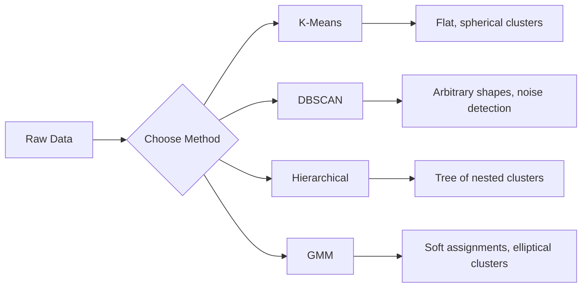

# Aprendizaje sin supervisión
# 无监督学习


> No hay etiquetas, ni profesor, el algoritmo encuentra estructura por sí mismo.

> 没有标签,没有老师──算法自己发现结构──

**Type:** Build | **类型：** 构建
**Languages:** Python
**Prerequisites:** Phase 1 (Norms & Distances, Probability & Distributions), Phase 2 Lessons 1-6 | **前置知识：** Phase 1（范数与距离、概率与分布），Phase 2 第 1-6 课
**Time:** ~90 minutes | **时间：** 约 90 分钟

## Objetivos de aprendizaje

- Implemente los modelos de mezcla K-Means, DBSCAN y Gaussian desde cero y compare su comportamiento de agrupación
  Desde la realización de K-Means、DBSCAN 和高斯混合模型 (GMM), comparar el comportamiento de agrupamiento de estos modelos.
- Evaluar la calidad del grupo utilizando el puntaje de silueta y el método de codo para seleccionar la K óptima
  Usando el número de rotas y el método de la cuclilladura para evaluar la calidad de la colección, seleccionar el mejor K
- Explicar cuándo DBSCAN supera a K-Means e identificar qué algoritmo maneja grupos y valores no esféricos
   Explicar DBSCAN 何時優越 K-Mens, identificar qué tipos de algoritmos pueden tratar no-esfera y valores anormales
- Construir una tubería de detección de anomalías utilizando métodos de agrupamiento para señalar puntos que se desvíen de los patrones normales
  Utiliza métodos de aglutinamiento para construir tuberías de detección anormales, marcando puntos de desviación del modo normal


> **【中文解读】**
> 无监督学习没有标签, objetivo es encontrar la estructura de datos. K-Means es el algoritmo de clasificación más clásico.

> **【拓展：无监督学习在真实 AI 系统中的价值】**
> Google Photos utiliza un algoritmo de clasificación de fotos similar a la de los usuarios de Facebook; en el caso de las fotos de Google, el método de clasificación de datos de Google Photos utiliza un algoritmo de clasificación de datos de datos de Google Photos; en el caso de las fotos de Google Photos, el método de clasificación de datos de datos de Google Photos se utiliza como un algoritmo de clasificación de datos de datos de Google Photos.

## El problema es la introducción del problema

Hasta ahora, cada lección de ML ha asumido datos etiquetados: "aquí está la entrada, aquí está la salida correcta". En el mundo real, las etiquetas son caras. Un hospital tiene millones de registros de pacientes pero nadie ha etiquetado manualmente cada uno con una categoría de enfermedad. Un sitio de comercio electrónico tiene millones de sesiones de usuarios pero nadie tiene segmentos de clientes etiquetados a mano. Un equipo de seguridad tiene registros de red pero nadie ha marcado todas las anomalías.

>  Cada clase anterior se supone que tiene datos de marcado: "Esto es entrada, esto es salida correcta"."" En el mundo real, la marcación es costosa"."" En un hospital hay millones de registros de pacientes, pero nadie ha marcado manualmente cada una de las categorías de marcado de enfermedades"."" En un sitio de comercio electrónico hay millones de sesiones de usuarios, pero nadie ha marcado manualmente a los clientes de los grupos de clientes"."" En un equipo de seguridad hay un diario de red, pero nadie marcó cada una de las anomalías".""

El aprendizaje no supervisado encuentra patrones sin que se le diga qué buscar. Agrupa puntos de datos similares, descubre estructuras ocultas y superviene anomalías. Si el aprendizaje supervisado está aprendiendo de un libro de texto con una clave de respuesta, el aprendizaje no supervisado está mirando los datos crudos hasta que los patrones se revelan.

>  El aprendizaje sin supervisión se encuentra en un contexto de no averiguado. Se comparará con los datos de los puntos de distribución, se encuentra oculta estructura, revela las anomalías.

La clave: sin etiquetas, no se puede medir directamente "correcto" o "erróneo". Se necesitan diferentes herramientas para evaluar si la estructura que encuentra su algoritmo es significativa.

> 关键问题: no hay etiqueta, no puedes medir directamente "por" o "error"― necesitas diferentes herramientas para evaluar si la estructura del algoritmo es significativa―.

> **【中文解读】**
> 无监督学习的核心挑战是评估:没有标签就无法直接衡量"对错"――需要使用轮系数、肘部法则等标标间接评估聚类质量――K-Means 假设是球形的且大小相近,对异常值敏感;DBSCAN 能发现任意形的并自动识别噪点,但需要设置密度参数――

## El concepto central.

### Agrupación: Agrupación de cosas similares

El agrupamiento asigna cada punto de datos a un grupo (agrupamiento) de modo que los puntos dentro del mismo grupo son más similares entre sí que a los puntos de otros grupos.

> 聚类将每数据点分分为一组), haciendo que los puntos dentro del mismo grupo sean más similares que los puntos de otros grupos.



### K-Means: El caballo de trabajo

K-Means particiona los datos en grupos K exactamente. Cada grupo tiene un centroide (su centro de masa), y cada punto pertenece al centroide más cercano.

> K-Means 将数据精确划分为 K 个──每个有一个质心,每个点属于最近的质心──

El algoritmo de Lloyd:

> Lloyd 算法:

1. Seleccione puntos aleatorios K como centroides iniciales
   随机选择 K 个点作为初始质心
2. Asigna cada punto de datos al centroide más cercano
   Distribuir cada punto de datos a la calidad más reciente
3. Recompita cada centroide como la media de sus puntos asignados
   重新计算每质心为其分配点的平均值
4. Repita los pasos 2-3 hasta que las tareas dejan de cambiar
   重复步骤 2-3 hasta que la distribución deje de cambiar

La función objetiva (inercia) mide la distancia total al cuadrado de cada punto a su centroide asignado. K-Means minimiza esto, pero solo encuentra un mínimo local.

> 目標函数 (慣性) mide cada punto hasta su distribución de la distancia total cuadrada de su calidad. K-Medios lo minimizan, pero sólo encuentran el valor mínimo local.

### Elegir K

Dos métodos estándar:

> 两种标准方法:

**Elbow method:**Ejecutar K-Medios para K = 1, 2, 3, ..., n. Inercia de trama vs K. Busque el "codo" donde agregar más racimos deja de reducir la inercia significativamente.

> **肘部法则：**Para K = 1, 2, 3, ..., n 运行 K-Means──绘制惯性 vs K 的图── buscar "cotovelos" aumentar más dejar de reducir significativamente la posición habitual

**Silhouette score:**Para cada punto, mide cuánto es similar a su propio cúmulo (a) frente al más cercano otro cúmulo (b). El coeficiente de silueta es (b - a) / max(a, b), que va desde -1 (cluster equivocado) hasta +1 (bien agrupado).

> **轮廓系数：**Para cada punto, mide su similitud con el propio (a) en comparación con otras similitudes recientes (b) ⋅ rutas de la serie de números son (b - a) / max (a, b), que van desde -1 ⋅ error ⋅ ⋅ ⋅ ⋅ ⋅ ⋅ ⋅ ⋅ ⋅ ⋅ ⋅ ⋅ ⋅ ⋅ ⋅ ⋅ ⋅ ⋅ ⋅ ⋅ ⋅ ⋅ ⋅ ⋅ ⋅ ⋅ ⋅ ⋅ ⋅ ⋅ ⋅ ⋅ ⋅ ⋅ ⋅ ⋅ ⋅ ⋅ ⋅ ⋅ ⋅ ⋅ ⋅ ⋅ ⋅ ⋅ ⋅ ⋅ ⋅ ⋅ ⋅ ⋅ ⋅ ⋅ ⋅ ⋅ ⋅ ⋅ ⋅ ⋅ ⋅ ⋅ ⋅ ⋅ ⋅ ⋅ ⋅ ⋅ ⋅ ⋅ ⋅ ⋅ ⋅ ⋅ ⋅ ⋅ ⋅ ⋅ ⋅ ⋅ ⋅ ⋅ ⋅ ⋅ ⋅ ⋅ ⋅ ⋅ ⋅ ⋅ ⋅ ⋅ ⋅ ⋅ ⋅ ⋅ ⋅ ⋅ ⋅ ⋅ ⋅ ⋅ ⋅ ⋅ ⋅ ⋅ ⋅ ⋅ ⋅ ⋅ ⋅ ⋅ ⋅ ⋅ ⋅ ⋅ ⋅                                                                                                                                                                                                                             

### DBSCAN: Clustering basado en la densidad

K-Means asume que los cúmulos son esféricos y requiere que elijas K de antemano. DBSCAN no hace ninguna suposición. encuentra los cúmulos como regiones densas separadas por regiones escasas.

> K-Means 假设是球形的且需要预选 K;;DBSCAN 不做这些假设──它将被发现为被稀疏区域分隔的密集区域──

Dos parámetros:
- **eps**: el radio de un barrio
  **eps**: la mitad del área
- **min_samples**: el número mínimo de puntos necesarios para formar una región densa
  **min_samples**: el número mínimo de puntos necesarios para formar zonas densas

Tres tipos de puntos:
- **Core point**: tiene al menos min_samples puntos dentro de eps distancia
  **核心点**En el caso de las empresas de la Unión Europea, el número de empresas de la Unión Europea es de aproximadamente un millón de millones de euros.
- **Border point**: dentro de los puntos de un punto central pero no en sí mismo un punto central
  **边界点**En el ámbito de los puntos centrales, pero en sí mismo no es el punto central.
- **Noise point**No hay un núcleo ni un límite.
  **噪声点**Estos son valores anormales.

DBSCAN conecta puntos centrales que están dentro de los puntos de eps entre sí en el mismo grupo.

> DBSCAN se conectará entre sí en el mismo punto central dentro del ámbito de la eps.

Fuerzas: encuentra grupos de cualquier forma, determina automáticamente el número de grupos, identifica valores anormales. Debilidad: lucha con grupos de densidades variables.

> 优势:发现任意形状的,自动确定数量,识别异常值.

### Clustering jerárquico

Construye un árbol (dendrograma) de racimos anidados.

> 构建嵌套的树树状图)

Aglomerativo (de abajo hacia arriba):

> 聚合式 ((自底上):

1. Comience con cada punto como su propio grupo
   Comienza cada uno su propio
2. Fusión de los dos cúmulos más cercanos
   合并两个最近的
3. Repita hasta que solo quede un grupo
   重复 Hasta que sólo queda uno
4. Cortar el dendrograma en el nivel deseado para obtener los racimos K
   En la necesidad de nivel de corte de la forma de árbol se obtiene K 个

La "cercanía" entre los racimos se puede medir como:
- **Single linkage**: distancia mínima entre cualquier dos puntos de los dos racimos
  **单链接**: La distancia mínima entre dos puntos arbitrarios
- **Complete linkage**: distancia máxima entre cualquier dos puntos
  **全链接**: la distancia máxima entre cualquier dos puntos
- **Average linkage**: distancia media entre todos los pares
  **平均链接**: la distancia media de todos los puntos
- **Ward's method**: la fusión que causa el menor aumento en la variación total dentro del grupo
  **Ward 方法**: Causa un aumento del mínimo de la combinación

### Modelos de mezcla gaussiana (GMM)

K-Means da asignaciones difíciles: cada punto pertenece a exactamente un grupo. GMM da asignaciones blandas: cada punto tiene una probabilidad de pertenecer a cada grupo.

> K-Medios                                                                                                                                                                                                                                                                                                                                                                                                                                                                                                                         

GMM asume que los datos se generan a partir de una mezcla de distribuciones de K Gaussian, cada una con su propia media y covarianza.

> GMM 假设数据由K 个高斯分布的混合生成, cada uno tiene su propio promedio y la diferencia de la cuota.

- **E-step**: calcular la probabilidad de que cada punto pertenece a cada Gaussian
  **E 步**: calcular la probabilidad de cada punto pertenece a cada alta distribución
- **M-step**: actualizar la media, covarianza y peso mezclado de cada gaussian para maximizar la probabilidad de los datos
  **M 步**Actualizar el valor medio, la diferencia de cuadro y el peso mixto de cada distribución de cuentas para maximizar la similitud de datos

GMM puede modelar cúmulos elípticos (no sólo esféricos como K-Means) y maneja naturalmente cúmulos superpuestos.

> GMM 能建模圆(不只是 K-Means 的球形), naturalmente se trata de la sobreposición──

### Cuándo usar cuál

| Method | Best for | Avoid when |
|--------|----------|------------|
| K-Means | Large datasets, spherical clusters, known K | Irregular shapes, outliers present |
| DBSCAN | Unknown K, arbitrary shapes, outlier detection | Varying densities, very high dimensions |
| Hierarchical | Small datasets, need dendrogram, unknown K | Large datasets (O(n^2) memory) |
| GMM | Overlapping clusters, soft assignments needed | Very large datasets, too many dimensions |

| 方法 | 最适合 | 避免使用 |
|------|--------|---------|
| K-Means | 大数据集，球形簇，已知 K | 不规则形状，有异常值 |
| DBSCAN | 未知 K，任意形状，异常检测 | 密度不均匀，极高维度 |
| 层次聚类 | 小数据集，需要树状图，未知 K | 大数据集（O(n^2) 内存） |
| GMM | 重叠簇，需要软分配 | 非常大的数据集，维度太高 |

### Detección de anomalías mediante agrupación

El agrupamiento apoya naturalmente la detección de anomalías:
- **K-Means**Los puntos lejanos de cualquier centroide son anomalías
  **K-Means**Es un punto muy lejos de cualquier calidad.
- **DBSCAN**: los puntos de ruido son anomalías por definición
  **DBSCAN**El ruido es un valor extraordinario.
- **GMM**Los puntos con baja probabilidad en todos los Gaussianos son anomalías .
  **GMM**En todas las altas distribuciones, la probabilidad es muy baja.

> 聚类天然支持异常检测:

## Construye y realiza.

> **【中文解读】**
> Desde la implementación de cero K-Means、DBSCAN 和高斯混合模型──K-Means 的三步代:随机初始化中心 → 分配每点到最近中心 → 重新计算中心──重复直到收──DBSCAN desde la región de alta densidad comienza a expandirse, automáticamente procesando el ruido punto──
```figure
kmeans-step
```

## Construye el mismo

### Paso 1: K-Medios desde cero

```python
import math
import random


def euclidean_distance(a, b):
    return math.sqrt(sum((ai - bi) ** 2 for ai, bi in zip(a, b)))


def kmeans(data, k, max_iterations=100, seed=42):
    random.seed(seed)
    n_features = len(data[0])

    centroids = random.sample(data, k)

    for iteration in range(max_iterations):
        clusters = [[] for _ in range(k)]
        assignments = []

        for point in data:
            distances = [euclidean_distance(point, c) for c in centroids]
            nearest = distances.index(min(distances))
            clusters[nearest].append(point)
            assignments.append(nearest)

        new_centroids = []
        for cluster in clusters:
            if len(cluster) == 0:
                new_centroids.append(random.choice(data))
                continue
            centroid = [
                sum(point[j] for point in cluster) / len(cluster)
                for j in range(n_features)
            ]
            new_centroids.append(centroid)

        if all(
            euclidean_distance(old, new) < 1e-6
            for old, new in zip(centroids, new_centroids)
        ):
            print(f"  Converged at iteration {iteration + 1}")
            break

        centroids = new_centroids

    return assignments, centroids
```

### Paso 2: Método del codo y puntaje de silueta

```python
def compute_inertia(data, assignments, centroids):
    total = 0.0
    for point, cluster_id in zip(data, assignments):
        total += euclidean_distance(point, centroids[cluster_id]) ** 2
    return total


def silhouette_score(data, assignments):
    n = len(data)
    if n < 2:
        return 0.0

    clusters = {}
    for i, c in enumerate(assignments):
        clusters.setdefault(c, []).append(i)

    if len(clusters) < 2:
        return 0.0

    scores = []
    for i in range(n):
        own_cluster = assignments[i]
        own_members = [j for j in clusters[own_cluster] if j != i]

        if len(own_members) == 0:
            scores.append(0.0)
            continue

        a = sum(euclidean_distance(data[i], data[j]) for j in own_members) / len(own_members)

        b = float("inf")
        for cluster_id, members in clusters.items():
            if cluster_id == own_cluster:
                continue
            avg_dist = sum(euclidean_distance(data[i], data[j]) for j in members) / len(members)
            b = min(b, avg_dist)

        if max(a, b) == 0:
            scores.append(0.0)
        else:
            scores.append((b - a) / max(a, b))

    return sum(scores) / len(scores)


def find_best_k(data, max_k=10):
    print("Elbow method:")
    inertias = []
    for k in range(1, max_k + 1):
        assignments, centroids = kmeans(data, k)
        inertia = compute_inertia(data, assignments, centroids)
        inertias.append(inertia)
        print(f"  K={k}: inertia={inertia:.2f}")

    print("\nSilhouette scores:")
    for k in range(2, max_k + 1):
        assignments, centroids = kmeans(data, k)
        score = silhouette_score(data, assignments)
        print(f"  K={k}: silhouette={score:.4f}")

    return inertias
```

### Paso 3: DBSCAN desde cero

```python
def dbscan(data, eps, min_samples):
    n = len(data)
    labels = [-1] * n
    cluster_id = 0

    def region_query(point_idx):
        neighbors = []
        for i in range(n):
            if euclidean_distance(data[point_idx], data[i]) <= eps:
                neighbors.append(i)
        return neighbors

    visited = [False] * n

    for i in range(n):
        if visited[i]:
            continue
        visited[i] = True

        neighbors = region_query(i)

        if len(neighbors) < min_samples:
            labels[i] = -1
            continue

        labels[i] = cluster_id
        seed_set = list(neighbors)
        seed_set.remove(i)

        j = 0
        while j < len(seed_set):
            q = seed_set[j]

            if not visited[q]:
                visited[q] = True
                q_neighbors = region_query(q)
                if len(q_neighbors) >= min_samples:
                    for nb in q_neighbors:
                        if nb not in seed_set:
                            seed_set.append(nb)

            if labels[q] == -1:
                labels[q] = cluster_id

            j += 1

        cluster_id += 1

    return labels
```

### Paso 4: Modelo de mezcla gaussiana (algoritmo EM)

```python
def gmm(data, k, max_iterations=100, seed=42):
    random.seed(seed)
    n = len(data)
    d = len(data[0])

    indices = random.sample(range(n), k)
    means = [list(data[i]) for i in indices]
    variances = [1.0] * k
    weights = [1.0 / k] * k

    def gaussian_pdf(x, mean, variance):
        d = len(x)
        coeff = 1.0 / ((2 * math.pi * variance) ** (d / 2))
        exponent = -sum((xi - mi) ** 2 for xi, mi in zip(x, mean)) / (2 * variance)
        return coeff * math.exp(max(exponent, -500))

    for iteration in range(max_iterations):
        responsibilities = []
        for i in range(n):
            probs = []
            for j in range(k):
                probs.append(weights[j] * gaussian_pdf(data[i], means[j], variances[j]))
            total = sum(probs)
            if total == 0:
                total = 1e-300
            responsibilities.append([p / total for p in probs])

        old_means = [list(m) for m in means]

        for j in range(k):
            r_sum = sum(responsibilities[i][j] for i in range(n))
            if r_sum < 1e-10:
                continue

            weights[j] = r_sum / n

            for dim in range(d):
                means[j][dim] = sum(
                    responsibilities[i][j] * data[i][dim] for i in range(n)
                ) / r_sum

            variances[j] = sum(
                responsibilities[i][j]
                * sum((data[i][dim] - means[j][dim]) ** 2 for dim in range(d))
                for i in range(n)
            ) / (r_sum * d)
            variances[j] = max(variances[j], 1e-6)

        shift = sum(
            euclidean_distance(old_means[j], means[j]) for j in range(k)
        )
        if shift < 1e-6:
            print(f"  GMM converged at iteration {iteration + 1}")
            break

    assignments = []
    for i in range(n):
        assignments.append(responsibilities[i].index(max(responsibilities[i])))

    return assignments, means, weights, responsibilities
```

### Paso 5: Generar datos de prueba y ejecutar todo

```python
def make_blobs(centers, n_per_cluster=50, spread=0.5, seed=42):
    random.seed(seed)
    data = []
    true_labels = []
    for label, (cx, cy) in enumerate(centers):
        for _ in range(n_per_cluster):
            x = cx + random.gauss(0, spread)
            y = cy + random.gauss(0, spread)
            data.append([x, y])
            true_labels.append(label)
    return data, true_labels


def make_moons(n_samples=200, noise=0.1, seed=42):
    random.seed(seed)
    data = []
    labels = []
    n_half = n_samples // 2
    for i in range(n_half):
        angle = math.pi * i / n_half
        x = math.cos(angle) + random.gauss(0, noise)
        y = math.sin(angle) + random.gauss(0, noise)
        data.append([x, y])
        labels.append(0)
    for i in range(n_half):
        angle = math.pi * i / n_half
        x = 1 - math.cos(angle) + random.gauss(0, noise)
        y = 1 - math.sin(angle) - 0.5 + random.gauss(0, noise)
        data.append([x, y])
        labels.append(1)
    return data, labels


if __name__ == "__main__":
    centers = [[2, 2], [8, 3], [5, 8]]
    data, true_labels = make_blobs(centers, n_per_cluster=50, spread=0.8)

    print("=== K-Means on 3 blobs ===")
    assignments, centroids = kmeans(data, k=3)
    print(f"  Centroids: {[[round(c, 2) for c in cent] for cent in centroids]}")
    sil = silhouette_score(data, assignments)
    print(f"  Silhouette score: {sil:.4f}")

    print("\n=== Elbow Method ===")
    find_best_k(data, max_k=6)

    print("\n=== DBSCAN on 3 blobs ===")
    db_labels = dbscan(data, eps=1.5, min_samples=5)
    n_clusters = len(set(db_labels) - {-1})
    n_noise = db_labels.count(-1)
    print(f"  Found {n_clusters} clusters, {n_noise} noise points")

    print("\n=== GMM on 3 blobs ===")
    gmm_assignments, gmm_means, gmm_weights, _ = gmm(data, k=3)
    print(f"  Means: {[[round(m, 2) for m in mean] for mean in gmm_means]}")
    print(f"  Weights: {[round(w, 3) for w in gmm_weights]}")
    gmm_sil = silhouette_score(data, gmm_assignments)
    print(f"  Silhouette score: {gmm_sil:.4f}")

    print("\n=== DBSCAN on moons (non-spherical clusters) ===")
    moon_data, moon_labels = make_moons(n_samples=200, noise=0.1)
    moon_db = dbscan(moon_data, eps=0.3, min_samples=5)
    n_moon_clusters = len(set(moon_db) - {-1})
    n_moon_noise = moon_db.count(-1)
    print(f"  Found {n_moon_clusters} clusters, {n_moon_noise} noise points")

    print("\n=== K-Means on moons (will fail to separate) ===")
    moon_km, moon_centroids = kmeans(moon_data, k=2)
    moon_sil = silhouette_score(moon_data, moon_km)
    print(f"  Silhouette score: {moon_sil:.4f}")
    print("  K-Means splits moons poorly because they are not spherical")

    print("\n=== Anomaly detection with DBSCAN ===")
    anomaly_data = list(data)
    anomaly_data.append([20.0, 20.0])
    anomaly_data.append([-5.0, -5.0])
    anomaly_data.append([15.0, 0.0])
    anomaly_labels = dbscan(anomaly_data, eps=1.5, min_samples=5)
    anomalies = [
        anomaly_data[i]
        for i in range(len(anomaly_labels))
        if anomaly_labels[i] == -1
    ]
    print(f"  Detected {len(anomalies)} anomalies")
    for a in anomalies[-3:]:
        print(f"    Point {[round(v, 2) for v in a]}")
```

## Usalo con el marco de ejecución

Con el aprendizaje de scikit, los mismos algoritmos son de una línea:

> Usando el código de aprendizaje, el mismo algoritmo sólo necesita una línea de código:

```python
from sklearn.cluster import KMeans, DBSCAN, AgglomerativeClustering
from sklearn.mixture import GaussianMixture
from sklearn.metrics import silhouette_score as sklearn_silhouette

km = KMeans(n_clusters=3, random_state=42).fit(data)  # K-Means 聚类（默认 K-Means++ 初始化）
db = DBSCAN(eps=1.5, min_samples=5).fit(data)  # DBSCAN 密度聚类（eps 为邻域半径）
agg = AgglomerativeClustering(n_clusters=3).fit(data)  # 层次聚类
gmm_model = GaussianMixture(n_components=3, random_state=42).fit(data)  # 高斯混合模型（EM 算法）
```

Las versiones desde cero te muestran exactamente lo que estas bibliotecas computaban. K-Means itera entre asignar y recomputar. DBSCAN crece grupos a partir de semillas densas. GMM alterna entre la expectativa y la maximización. Las versiones de la biblioteca añaden estabilidad numérica, inicialización más inteligente (K-Means ++), y aceleración de la GPU, pero la lógica central es la misma.

> Desde la versión zero a ti te mostramos lo que estas librerías han calculado hasta el final. K-Medios entre la distribución y la carga de cálculo.

## Envíe el producto .

Esta lección produce implementaciones de trabajo de K-Means, DBSCAN y GMM desde cero.

> Este curso se ha desarrollado desde la implementación de K-Means、DBSCAN y GMM── los codes de la colección pueden ser utilizados como base de métodos más avanzados sin supervisión──

> **【拓展：聚类在用户分群和推荐系统中的应用】**
> Spotify clasifica a los usuarios en grupos de gustos para recomendar música. Los usuarios de cada grupo tienen costumbres de escuchar música similares. Airbnb utiliza los grupos de gustos para optimizar la clasificación de búsqueda. Amazon utiliza los grupos de gustos para recomendar productos. En el mercadotecnia, RFM (Recencia, Frecuencia, Dinero) + K-Means clasifica a los clientes en grupos de alto precio, potencial, pérdida de valor, etc., para orientar estrategias de marketing diferenciadas.

> **【中文解读】**
> 无监督学习的评估比监督学习更困难──轮系数衡量内密度对间分离度,范围 [-1, 1],越高越好──肘部法则寻找 WCSS(内平方和) con K 增加的"拐点"──GMM 使用 EM 算法(期望最大化)交换更新分配和参数,比 K-Means 更灵活(圆而非球形) 但更慢──

## Los ejercicios.

1. Implemente la inicialización K-Means++: en lugar de seleccionar centrosidios aleatorios, elija el primero aleatoriamente y cada centroide subsecuente con probabilidad proporcional a su distancia cuadrada del centroide existente más cercano. Compara la velocidad de convergencia con la inicialización aleatoria.
   1. 实现 K-Means++ inicialización: no es una elección arbitraria, sino una elección arbitraria de la primera, luego cada siguiente forma de la elección de probabilidad de la distancia cuadrada de la persona que ya ha sido recientemente positiva.
2. Añadir un agrupamiento jerárquico aglomerativo al código. Implementar el enlace de Ward y producir un dendrograma (como una lista anida de fusiones). Cortarlo en diferentes niveles y comparar con los resultados de K-Means.
   2. Para el código se añade la combinación de niveles de la combinación de los tipos de datos.
3. Construir una simple línea de detección de anomalías: ejecutar DBSCAN y GMM en los mismos datos, puntos de referencia que ambos métodos coinciden son excepcionales (ruido en DBSCAN, baja probabilidad en GMM).
   3. Construir una simple línea de detección de anomalías: en el mismo dato DBSCAN y GMM, el marcador de dos métodos se considera como un punto de anomalía 

## Términos clave .

| Term | What people say | What it actually means |
|------|----------------|----------------------|
| Clustering | "Grouping similar things" | Partitioning data into subsets where within-group similarity exceeds between-group similarity, measured by a specific distance metric |
| Centroid | "The center of a cluster" | The mean of all points assigned to a cluster; used by K-Means as the cluster representative |
| Inertia | "How tight the clusters are" | Sum of squared distances from each point to its assigned centroid; lower is tighter |
| Silhouette score | "How well-separated clusters are" | For each point, (b - a) / max(a, b) where a is mean intra-cluster distance and b is mean nearest-cluster distance |
| Core point | "A point in a dense region" | A point with at least min_samples neighbors within eps distance, in DBSCAN |
| EM algorithm | "Soft K-Means" | Expectation-Maximization: iteratively compute membership probabilities (E-step) and update distribution parameters (M-step) |
| Dendrogram | "A tree of clusters" | A tree diagram showing the order and distance at which clusters were merged in hierarchical clustering |
| Anomaly | "An outlier" | A data point that does not conform to the expected pattern, identified as noise by DBSCAN or low-probability by GMM |

## Más Leer más Leer más

- [Stanford CS229 - Unsupervised Learning](https://cs229.stanford.edu/notes2022fall/main_notes.pdf)- Notas de la conferencia de Andrew Ng sobre el clustering y EM
  [Stanford CS229 - 无监督学习](https://cs229.stanford.edu/notes2022fall/main_notes.pdf)- Andrew Ng's聚类和EM 讲义
- [scikit-learn Clustering Guide](https://scikit-learn.org/stable/modules/clustering.html)- comparación práctica de todos los algoritmos de agrupación con ejemplos visuales
  [scikit-learn 聚类指南](https://scikit-learn.org/stable/modules/clustering.html)- Comparación práctica y ejemplos visibles de todos los algoritmos de agregación
- [DBSCAN original paper (Ester et al., 1996)](https://www.aaai.org/Papers/KDD/1996/KDD96-037.pdf)- el papel que introdujo el agrupamiento basado en la densidad
  [DBSCAN 原始论文 (Ester et al., 1996)](https://www.aaai.org/Papers/KDD/1996/KDD96-037.pdf)- Introducción de artículos basados en la densidad
