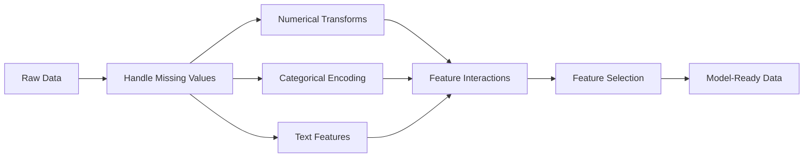

# Ingeniería y selección
# Características de la construcción y la selección


> Una buena característica vale mil puntos de datos.

> Una buena característica de los 1000 puntos de datos.

**Type:** Build | **类型：** 构建
**Languages:** Python
**Prerequisites:** Phase 1 (Statistics for ML, Linear Algebra), Phase 2 Lessons 1-7 | **前置知识：** Phase 1（统计学、线性代数），Phase 2 第 1-7 课
**Time:** ~90 minutes | **时间：** 约 90 分钟

## Objetivos de aprendizaje

- Implementar transformaciones numéricas (estandarización, escalación mínima máxima, transformación de registro, enlaces) y explicar cuándo cada una es apropiada
  实现 valores de cambio (standardisation, Min-Max, enriquecimiento, cambio en números, cuadro) y explicar sus respectivos escenarios de aplicación
- Construir una codificación de un solo punto, etiqueta y objetivo para características categoricas e identificar el riesgo de fuga de datos en la codificación de destino
  Construcción de código único ✓ Codificación de etiquetas y código objetivo, Identificación de código objetivo ✓ Riesgo de fuga de datos
- Construir un vectorizador TF-IDF desde cero y explicar por qué supera el conteo de palabras en bruto para la clasificación de texto
  Desde la construcción de TF-IDF hacia el cuantificador, explica por qué es mejor que el cuantificación de frecuencia original
- Aplicar la selección de características basada en filtros (umbral de variación, correlación, información mutua) para reducir la dimensionalidad
   aplicación basada en la selección de características                                                                                                                                                                                                                                                           


> **【中文解读】**
> El diseño de características es la transformación de datos originales en características que pueden ser comprendidas por un modelo. Es el paso más lento de ML. La estandarización, codificación, intercambio de características, múltiples características son técnicas habituales.

> **【拓展：特征工程 vs 深度学习的自动特征学习】**
> La ventaja central del aprendizaje profundo es la característica de aprendizaje automático, pero el proceso de elaboración de datos de usuario sigue siendo fundamental. Los ganadores de la competencia pasan el 80% del tiempo en la elaboración de datos. El programa ganador del Premio Netflix contiene cientos de características de diseño manual.

## El problema es la introducción del problema

Tienes un conjunto de datos, eliges un algoritmo, lo entrenas, los resultados son mediocres, intentas un algoritmo más sofisticado, todavía mediocre, pasas una semana sintonizando los hiperparámetros, mejora marginal.

> Tienes un conjunto de datos. Has elegido un algoritmo. Lo has entrenado. Resultados son simples. Has intentado un algoritmo más sofisticado.

Entonces alguien transforma los datos en bruto en mejores características y una simple regresión logística supera tu conjunto ajustado con gradiente aumentado.

> Luego alguien transformó los datos originales en mejores características, una simple lógica regresa derrotó el nivel de tu regulación de la integración.

Esto sucede constantemente. En el ML clásico, la representación de los datos importa más que la elección del algoritmo. Un modelo de precio de la casa con "escena cuadrada" y "número de habitaciones" vencerá a un modelo con "dirección como una cadena cruda" sin importar cuán sofisticado sea el aprendiz. El algoritmo solo puede funcionar con lo que le das.

> Esta situación ocurre con frecuencia. En el ML clásico, la representación de datos es más importante que la elección de algoritmos. Un modelo de precios con " superficie " y " número de habitaciones " va a perder con el modelo de " dirección de los caracteres originales ", independientemente de la complejidad del aparato de aprendizaje.

La ingeniería de características es el proceso de transformar datos en bruto en representaciones que hacen que los patrones sean más fáciles de encontrar para los modelos. La selección de características es el proceso de tirar las características que añaden ruido sin agregar señal. Juntos, son la actividad de mayor apalancamiento en el ML clásico.

> El diseño de rasgos es el proceso de transformar los datos originales en modelos más fáciles de descubrir. La selección de rasgos es el proceso de desechar las características de aumentar el ruido y no aumentar la señal.

> **【中文解读】**
> "Los datos y las características determinan el límite superior de ML, el modelo y el algoritmo se acercan a este límite superior. "Las características buenas pueden hacer que un modelo simple venzca un modelo complejo.

## El concepto central.

### El gasoducto de características



### Características numéricas

Los números en bruto rara vez están listos para el modelo.

> Los números primitivos muy pocos pueden ser utilizados directamente en el modelo.

**Scaling:**Colocar características en el mismo rango para que los algoritmos basados en la distancia (K-Means, KNN, SVM) traten todas las características de manera igual. mapas de escalación min-max a [0, 1]. mapas de estandarización (z-score) a media=0, std=1.

> **缩放：**Se puede aplicar a los datos de la base de datos de datos de datos de datos de datos de datos de datos de datos de datos de datos de datos de datos de datos de datos de datos de datos de datos de datos de datos de datos de datos de datos de datos de datos de datos de datos de datos de datos de datos de datos de datos de datos de datos de datos de datos de datos de datos de datos de datos de datos de datos de datos de datos de datos de datos de datos de datos de datos de datos de datos de datos de datos de datos de datos de datos de datos de datos de datos de datos de datos de datos de datos de datos de datos de datos de datos de datos de datos de datos de datos de datos de datos de datos de datos de datos de datos de datos de datos de datos de datos de datos de datos de datos de datos de datos de datos de datos de datos de datos de datos de datos de datos de datos de datos de datos de datos de datos de datos de datos de datos de datos de datos de datos de datos de datos de datos de datos de datos de datos de datos de datos de datos de datos de datos de datos de datos de datos de datos de datos de datos de datos de datos de datos de datos de datos de datos de datos de datos de datos de datos de datos de datos de datos de datos de datos de datos de datos de datos de datos de datos de datos de datos de datos de datos de datos de datos de datos de datos de datos de datos de datos de datos de datos de datos de datos de datos de datos de datos de datos de datos de datos de datos de datos de datos de datos de datos de datos de datos de datos de datos de datos de datos de datos de datos de datos de datos de datos de datos de datos de datos de datos de datos de datos de datos de datos de datos de datos de datos de datos de datos de datos de datos de datos de datos de datos de datos de datos de datos de datos de datos de datos de datos de datos de datos de datos de datos de datos de datos de datos de datos de datos de datos de datos de datos de datos de datos de datos de datos de datos de datos de datos de datos de datos de datos de datos de datos de datos de datos de datos de datos de datos de datos de datos de datos de datos de datos de datos de datos de datos de datos de datos de datos de datos de datos de datos de datos de datos de datos de datos de datos de

**Log transform:**Comprime las distribuciones a la derecha (ingresos, población, recuento de palabras).

> **对数变换：**压缩右偏分布(收入、人口、词频) 』将乘法关系变为加法关系──

**Binning:**Conversión de valores continuos en categorías. Útil cuando la relación entre característica y objetivo no es lineal, pero es gradual (por ejemplo, grupos de edad).

> **分箱：**Se puede utilizar en el caso de la relación entre la característica y el objetivo, pero es útil en el caso de la escalación.

**Polynomial features:**Crea términos x^2, x^3, x1*x2. permite que los modelos lineales capturen relaciones no lineales a costa de más características.

> **多项式特征：**Crear x^2、x^3、x1*x2 项──让线性模型以更多特征为价格捕捉非线性关系──

### Características de la categoría

Los modelos necesitan números, las categorías necesitan codificación.

> 模型需要数字──类别需要编码──

**One-hot encoding:**Crea una columna binaria para cada categoría. "color = red/blue/green" se convierte en tres columnas: is_red, is_blue, is_green. Funciona bien para características de baja cardinalidad pero explota con muchas categorías.

> **独热编码：**Para cada clase crea una segunda línea de colores: "color = rojo/azul/verde" se convierte en tres: es rojo, es azul, es verde, tiene un efecto positivo, pero la clase más frecuente es explosiva.

**Label encoding:**Mapea cada categoría a un número entero: rojo=0, azul=1, verde=2. Introduce un ordenamiento falso (el modelo podría pensar verde > azul > rojo). Sólo apropiado para modelos basados en árboles que se dividen en valores individuales.

> **标签编码：**将每个类别映射到整数:red=0、blue=1、green=2── introdujo una falsa clasificación(模型可能认为绿 >蓝 >红) ⋅ sólo se adapta según un modelo de árbol dividido en valores únicos。

**Target encoding:**Reemplaza cada categoría por la media de la variable objetivo para esa categoría. Poderosa pero peligrosa: alto riesgo de fuga de datos. Debe calcularse únicamente sobre datos de formación y aplicarse a los datos de ensayo.

> **目标编码：**Reemplazar cada categoría por el valor promedio de las variables objetivo de la categoría. Fuerte pero peligrosa: riesgo de fuga de datos.

### Características del texto

**Count vectorizer:**Cuenta cuántas veces aparece cada palabra en un documento. "el gato se sentó en la alfombra" se convierte en {el: 2, el gato: 1, sat: 1, en: 1, la alfombra: 1}.

> **词频向量化：**計算每个词在文档中出现的次数──"el gato se sentó en el tapicero" 变成 {el: 2, el gato: 1, se sentó: 1, en: 1, el tapicero: 1}──

**TF-IDF:**El término frecuencia inversa frecuencia de documento. Pese las palabras por lo únicas que son en los documentos. palabras comunes como "el" tienen un peso bajo.

> **TF-IDF：**词频-逆文档频率──按词在文档中的唯一性加权──常见词如"the"获得低权重──稀有、有区分度的词获得高权重──

```
TF(word, doc) = count(word in doc) / total words in doc
IDF(word) = log(total docs / docs containing word)
TF-IDF = TF * IDF
```

### Los valores que faltan

Los datos reales tienen agujeros.

> Los datos reales tienen huecos.

- **Drop rows:**Sólo cuando los datos faltantes son raros y aleatorios
  **删除行：** Sólo cuando falta datos es raro y con frecuencia
- **Mean/median imputation:**Simple, conserva la forma de distribución (mediana es más robusta a los valores extremos)
  **均值/中位数填充：**简单, mantener la forma de distribución
- **Mode imputation:**Para características categoricas
  **众数填充：**Para el tipo de características
- **Indicator column:**Añadir una columna binaria "era_este_falta" antes de imputar. El hecho de que los datos faltan puede ser informativo
  **指示列：**填充前添加二进制列"era_este_falto"── Datos faltantes en sí mismos puede ser informativo
- **Forward/backward fill:**Para datos de series temporales
  **前向/后向填充：**Utilizando datos de la secuencia de tiempo

### Interacción de las características

A veces la relación está en la combinación. "Alteza" y "peso" por sí solos son menos predictivos que "BMI = peso / altura^2". Las interacciones de características multiplican el espacio de características, por lo que utilice el conocimiento del dominio para elegir los adecuados.

> Hay relaciones en el conjunto. "Alto" y "peso" solo no como "BMI = peso / alto" tiene un poder de pronóstico.

### Selección de características

Las características irrelevantes aumentan el ruido, aumentan el tiempo de entrenamiento y pueden causar sobreadaptación.

> 更多特征不一定更好──无关特征增加噪音、增加训练时间并可能导致过适应──

**Filter methods (pre-model):**
- Correlación: elimina las características altamente correlacionadas entre sí (redundante)
  相关性:移除高度相关的特征(冗余)
- Información mutua: mide en qué medida conocer una característica reduce la incertidumbre sobre el objetivo
  互信息: medir saber un rasgo puede reducir el objetivo cuánto incertidumbre
- Umbral de variación: eliminar características que apenas varían
  方差值: Se desplazan casi invariables características

**Wrapper methods (model-based):**
- Regularización L1 (Lasso): conduce los pesos de las características irrelevantes a cero exactamente
  L1 正则化(Lasso): será in关特征权重驱动到恰好为零
- Eliminación de las características recurrentes: tren, eliminación de las características menos importantes, repetición
  递归特征消除: entrenamiento, eliminación de las características más insignificantes, repetido

**Why selection matters:**Un modelo con 10 buenas características generalmente superará a un modelo con 10 buenas características y 90 ruidosos.

> **为什么选择很重要：**Un modelo con 10 buenas características generalmente gana con 10 buenas características más 90 características de ruido.

## Construye y realiza.

> **【中文解读】**
> Desde el 0 realizando la característica habitual de cambio: estandarización (en la medida en que se puede calcular el valor de la unidad de diferencia) ∞-Max ∞ ∞ ∞ ∞ ∞ ∞ ∞ ∞ ∞ ∞ ∞ ∞ ∞ ∞ ∞ ∞ ∞ ∞ ∞ ∞ ∞ ∞ ∞ ∞ ∞ ∞ ∞ ∞ ∞ ∞ ∞ ∞ ∞ ∞ ∞ ∞ ∞ ∞ ∞ ∞ ∞ ∞ ∞ ∞ ∞ ∞ ∞ ∞ ∞ ∞ ∞ ∞ ∞ ∞ ∞ ∞ ∞ ∞ ∞ ∞ ∞ ∞ ∞ ∞ ∞ ∞ ∞ ∞ ∞ ∞ ∞ ∞ ∞ ∞ ∞ ∞ ∞ ∞ ∞ ∞ ∞ ∞ ∞ ∞ ∞ ∞ ∞ ∞ ∞ ∞ ∞ ∞ ∞ ∞ ∞ ∞ ∞ ∞ ∞ ∞ ∞ ∞ ∞ ∞ ∞ ∞ ∞ ∞ ∞ ∞ ∞ ∞ ∞ ∞ ∞ ∞ ∞ ∞ ∞ ∞ ∞ ∞ ∞ ∞ ∞ ∞ ∞ ∞ ∞ ∞ ∞ ∞ ∞ ∞ ∞ ∞ ∞ ∞ ∞ ∞ ∞ ∞ ∞ ∞ ∞ ∞ ∞ ∞ ∞ ∞ ∞ ∞ ∞ ∞ ∞ ∞ ∞ ∞ ∞ ∞ ∞ ∞ ∞ ∞ ∞ ∞ ∞ ∞ ∞ ∞ ∞ ∞ ∞ ∞ ∞ ∞ ∞ ∞ ∞ ∞ ∞ ∞ ∞ ∞ ∞ ∞ ∞ ∞ ∞ ∞ ∞ ∞ ∞ ∞ ∞ ∞ ∞ ∞ ∞ ∞ ∞ ∞ ∞ ∞ ∞ ∞ ∞ ∞ ∞ ∞ ∞ ∞ ∞ ∞ ∞ ∞ ∞ ∞ ∞ ∞ ∞ ∞ ∞ ∞ ∞ ∞ ∞ ∞ ∞ ∞ ∞ ∞ ∞ ∞ ∞ ∞ 
```figure
feature-scaling
```

## Construye el mismo

### Paso 1: Transformaciones numéricas desde cero

```python
import math


def min_max_scale(values):
    min_val = min(values)
    max_val = max(values)
    if max_val == min_val:
        return [0.0] * len(values)
    return [(v - min_val) / (max_val - min_val) for v in values]


def standardize(values):
    n = len(values)
    mean = sum(values) / n
    variance = sum((v - mean) ** 2 for v in values) / n
    std = math.sqrt(variance) if variance > 0 else 1.0
    return [(v - mean) / std for v in values]


def log_transform(values):
    return [math.log(v + 1) for v in values]


def bin_values(values, n_bins=5):
    min_val = min(values)
    max_val = max(values)
    bin_width = (max_val - min_val) / n_bins
    if bin_width == 0:
        return [0] * len(values)
    result = []
    for v in values:
        bin_idx = int((v - min_val) / bin_width)
        bin_idx = min(bin_idx, n_bins - 1)
        result.append(bin_idx)
    return result


def polynomial_features(row, degree=2):
    n = len(row)
    result = list(row)
    if degree >= 2:
        for i in range(n):
            result.append(row[i] ** 2)
        for i in range(n):
            for j in range(i + 1, n):
                result.append(row[i] * row[j])
    return result
```

### Paso 2: codificación categórica desde cero

```python
def one_hot_encode(values):
    categories = sorted(set(values))
    cat_to_idx = {cat: i for i, cat in enumerate(categories)}
    n_cats = len(categories)

    encoded = []
    for v in values:
        row = [0] * n_cats
        row[cat_to_idx[v]] = 1
        encoded.append(row)

    return encoded, categories


def label_encode(values):
    categories = sorted(set(values))
    cat_to_int = {cat: i for i, cat in enumerate(categories)}
    return [cat_to_int[v] for v in values], cat_to_int


def target_encode(feature_values, target_values, smoothing=10):
    global_mean = sum(target_values) / len(target_values)

    category_stats = {}
    for feat, target in zip(feature_values, target_values):
        if feat not in category_stats:
            category_stats[feat] = {"sum": 0.0, "count": 0}
        category_stats[feat]["sum"] += target
        category_stats[feat]["count"] += 1

    encoding = {}
    for cat, stats in category_stats.items():
        cat_mean = stats["sum"] / stats["count"]
        weight = stats["count"] / (stats["count"] + smoothing)
        encoding[cat] = weight * cat_mean + (1 - weight) * global_mean

    return [encoding[v] for v in feature_values], encoding
```

### Paso 3: Características del texto desde cero

> Tres pasos: la frecuencia de cada palabra en el archivo, la frecuencia de cada palabra en el archivo, la frecuencia de cada palabra en el archivo, la frecuencia de cada palabra en el archivo, la frecuencia de cada palabra en el archivo, la frecuencia de cada palabra en el archivo, la frecuencia de cada palabra en el archivo, la frecuencia de cada palabra en el archivo, la frecuencia de cada palabra en el archivo, la frecuencia de cada palabra en el archivo, la frecuencia de cada palabra en el archivo, la frecuencia de cada palabra en el archivo, la frecuencia de cada palabra en el archivo, la frecuencia de cada palabra en el archivo, la frecuencia de cada palabra en el archivo, la frecuencia de cada palabra en el archivo, la frecuencia de cada palabra en el archivo, la frecuencia de cada palabra en el archivo, la frecuencia de cada palabra en el archivo, la frecuencia de cada palabra en el archivo, la frecuencia de cada palabra en el archivo, la frecuencia de la frecuencia de la frecuencia de la frecuencia de la frecuencia de la frecuencia de la frecuencia de la frecuencia de la frecuencia de la frecuencia, la frecuencia de la frecuencia de la frecuencia de la frecuencia de la frecuencia de la frecuencia de la frecuencia, la frecuencia de la frecuencia de la frecuencia de la frecuencia de la frecuencia de la frecuencia, la frecuencia de la frecuencia de la frecuencia de la frecuencia de la frecuencia, la frecuencia de la frecuencia de la frecuencia de la frecuencia de la frecuencia, la frecuencia de la cual se incrementa, la frecuencia de la frecuencia de la frecuencia de la frecuencia de la frecuencia de la frecuencia de la cual se incrementa, la frecuencia de la frecuencia de la cual se incrementa.`TfidfVectorizer`Es la versión de producción de este proyecto.

```python
def count_vectorize(documents):
    vocab = {}
    idx = 0
    for doc in documents:
        for word in doc.lower().split():
            if word not in vocab:
                vocab[word] = idx
                idx += 1

    vectors = []
    for doc in documents:
        vec = [0] * len(vocab)
        for word in doc.lower().split():
            vec[vocab[word]] += 1
        vectors.append(vec)

    return vectors, vocab


def tfidf(documents):
    n_docs = len(documents)

    vocab = {}
    idx = 0
    for doc in documents:
        for word in doc.lower().split():
            if word not in vocab:
                vocab[word] = idx
                idx += 1

    doc_freq = {}
    for doc in documents:
        seen = set()
        for word in doc.lower().split():
            if word not in seen:
                doc_freq[word] = doc_freq.get(word, 0) + 1
                seen.add(word)

    vectors = []
    for doc in documents:
        words = doc.lower().split()
        word_count = len(words)
        tf_map = {}
        for word in words:
            tf_map[word] = tf_map.get(word, 0) + 1

        vec = [0.0] * len(vocab)
        for word, count in tf_map.items():
            tf = count / word_count
            idf = math.log(n_docs / doc_freq[word])
            vec[vocab[word]] = tf * idf
        vectors.append(vec)

    return vectors, vocab
```

### Paso 4: Imputación de valor ausente desde cero

> Cuarto paso: falta de valor de relleno. El valor medio de relleno es adecuado para el estado de distribución de datos, el número medio es adecuado para el estado de distribución de datos.

```python
def impute_mean(values):
    present = [v for v in values if v is not None]
    if not present:
        return [0.0] * len(values), 0.0
    mean = sum(present) / len(present)
    return [v if v is not None else mean for v in values], mean


def impute_median(values):
    present = sorted(v for v in values if v is not None)
    if not present:
        return [0.0] * len(values), 0.0
    n = len(present)
    if n % 2 == 0:
        median = (present[n // 2 - 1] + present[n // 2]) / 2
    else:
        median = present[n // 2]
    return [v if v is not None else median for v in values], median


def impute_mode(values):
    present = [v for v in values if v is not None]
    if not present:
        return values, None
    counts = {}
    for v in present:
        counts[v] = counts.get(v, 0) + 1
    mode = max(counts, key=counts.get)
    return [v if v is not None else mode for v in values], mode


def add_missing_indicator(values):
    return [0 if v is not None else 1 for v in values]
```

### Paso 5: Selección de características desde cero

> Sección 5: Selección de rasgos. Sección de rasgos. Sección de rasgos. Sección de rasgos.`SelectKBest`¿Qué es esto?`VarianceThreshold`Es el método de producción de la caja.

```python
def correlation(x, y):
    n = len(x)
    mean_x = sum(x) / n
    mean_y = sum(y) / n
    cov = sum((xi - mean_x) * (yi - mean_y) for xi, yi in zip(x, y)) / n
    std_x = math.sqrt(sum((xi - mean_x) ** 2 for xi in x) / n)
    std_y = math.sqrt(sum((yi - mean_y) ** 2 for yi in y) / n)
    if std_x == 0 or std_y == 0:
        return 0.0
    return cov / (std_x * std_y)


def mutual_information(feature, target, n_bins=10):
    feat_min = min(feature)
    feat_max = max(feature)
    bin_width = (feat_max - feat_min) / n_bins if feat_max != feat_min else 1.0
    feat_binned = [
        min(int((f - feat_min) / bin_width), n_bins - 1) for f in feature
    ]

    n = len(feature)
    target_classes = sorted(set(target))

    feat_bins = sorted(set(feat_binned))
    p_feat = {}
    for b in feat_bins:
        p_feat[b] = feat_binned.count(b) / n

    p_target = {}
    for t in target_classes:
        p_target[t] = target.count(t) / n

    mi = 0.0
    for b in feat_bins:
        for t in target_classes:
            joint_count = sum(
                1 for fb, tv in zip(feat_binned, target) if fb == b and tv == t
            )
            p_joint = joint_count / n
            if p_joint > 0:
                mi += p_joint * math.log(p_joint / (p_feat[b] * p_target[t]))

    return mi


def variance_threshold(features, threshold=0.01):
    n_features = len(features[0])
    n_samples = len(features)
    selected = []

    for j in range(n_features):
        col = [features[i][j] for i in range(n_samples)]
        mean = sum(col) / n_samples
        var = sum((v - mean) ** 2 for v in col) / n_samples
        if var >= threshold:
            selected.append(j)

    return selected


def remove_correlated(features, threshold=0.9):
    n_features = len(features[0])
    n_samples = len(features)

    to_remove = set()
    for i in range(n_features):
        if i in to_remove:
            continue
        col_i = [features[r][i] for r in range(n_samples)]
        for j in range(i + 1, n_features):
            if j in to_remove:
                continue
            col_j = [features[r][j] for r in range(n_samples)]
            corr = abs(correlation(col_i, col_j))
            if corr >= threshold:
                to_remove.add(j)

    return [i for i in range(n_features) if i not in to_remove]
```

### Paso 6: Líneas completas y demostración

```python
import random


def make_housing_data(n=200, seed=42):
    random.seed(seed)
    data = []
    for _ in range(n):
        sqft = random.uniform(500, 5000)
        bedrooms = random.choice([1, 2, 3, 4, 5])
        age = random.uniform(0, 50)
        neighborhood = random.choice(["downtown", "suburbs", "rural"])
        has_pool = random.choice([True, False])

        sqft_with_missing = sqft if random.random() > 0.05 else None
        age_with_missing = age if random.random() > 0.08 else None

        price = (
            50 * sqft
            + 20000 * bedrooms
            - 1000 * age
            + (50000 if neighborhood == "downtown" else 10000 if neighborhood == "suburbs" else 0)
            + (15000 if has_pool else 0)
            + random.gauss(0, 20000)
        )

        data.append({
            "sqft": sqft_with_missing,
            "bedrooms": bedrooms,
            "age": age_with_missing,
            "neighborhood": neighborhood,
            "has_pool": has_pool,
            "price": price,
        })
    return data


if __name__ == "__main__":
    data = make_housing_data(200)

    print("=== Raw Data Sample ===")
    for row in data[:3]:
        print(f"  {row}")

    sqft_raw = [d["sqft"] for d in data]
    age_raw = [d["age"] for d in data]
    prices = [d["price"] for d in data]

    print("\n=== Missing Value Handling ===")
    sqft_missing = sum(1 for v in sqft_raw if v is None)
    age_missing = sum(1 for v in age_raw if v is None)
    print(f"  sqft missing: {sqft_missing}/{len(sqft_raw)}")
    print(f"  age missing: {age_missing}/{len(age_raw)}")

    sqft_indicator = add_missing_indicator(sqft_raw)
    age_indicator = add_missing_indicator(age_raw)
    sqft_imputed, sqft_fill = impute_median(sqft_raw)
    age_imputed, age_fill = impute_mean(age_raw)
    print(f"  sqft filled with median: {sqft_fill:.0f}")
    print(f"  age filled with mean: {age_fill:.1f}")

    print("\n=== Numerical Transforms ===")
    sqft_scaled = standardize(sqft_imputed)
    age_scaled = min_max_scale(age_imputed)
    sqft_log = log_transform(sqft_imputed)
    age_binned = bin_values(age_imputed, n_bins=5)
    print(f"  sqft standardized: mean={sum(sqft_scaled)/len(sqft_scaled):.4f}, std={math.sqrt(sum(v**2 for v in sqft_scaled)/len(sqft_scaled)):.4f}")
    print(f"  age min-max: [{min(age_scaled):.2f}, {max(age_scaled):.2f}]")
    print(f"  age bins: {sorted(set(age_binned))}")

    print("\n=== Categorical Encoding ===")
    neighborhoods = [d["neighborhood"] for d in data]

    ohe, ohe_cats = one_hot_encode(neighborhoods)
    print(f"  One-hot categories: {ohe_cats}")
    print(f"  Sample encoding: {neighborhoods[0]} -> {ohe[0]}")

    le, le_map = label_encode(neighborhoods)
    print(f"  Label encoding map: {le_map}")

    te, te_map = target_encode(neighborhoods, prices, smoothing=10)
    print(f"  Target encoding: {({k: round(v) for k, v in te_map.items()})}")

    print("\n=== Text Features ===")
    descriptions = [
        "large modern house with pool",
        "small cozy cottage near downtown",
        "spacious family home with large yard",
        "modern apartment downtown with view",
        "rustic cabin in rural area",
    ]
    cv, cv_vocab = count_vectorize(descriptions)
    print(f"  Vocabulary size: {len(cv_vocab)}")
    print(f"  Doc 0 non-zero features: {sum(1 for v in cv[0] if v > 0)}")

    tf, tf_vocab = tfidf(descriptions)
    print(f"  TF-IDF vocabulary size: {len(tf_vocab)}")
    top_words = sorted(tf_vocab.keys(), key=lambda w: tf[0][tf_vocab[w]], reverse=True)[:3]
    print(f"  Doc 0 top TF-IDF words: {top_words}")

    print("\n=== Polynomial Features ===")
    sample_row = [sqft_scaled[0], age_scaled[0]]
    poly = polynomial_features(sample_row, degree=2)
    print(f"  Input: {[round(v, 4) for v in sample_row]}")
    print(f"  Polynomial: {[round(v, 4) for v in poly]}")
    print(f"  Features: [x1, x2, x1^2, x2^2, x1*x2]")

    print("\n=== Feature Selection ===")
    feature_matrix = [
        [sqft_scaled[i], age_scaled[i], float(sqft_indicator[i]), float(age_indicator[i])]
        + ohe[i]
        for i in range(len(data))
    ]

    print(f"  Total features: {len(feature_matrix[0])}")

    surviving_var = variance_threshold(feature_matrix, threshold=0.01)
    print(f"  After variance threshold (0.01): {len(surviving_var)} features kept")

    surviving_corr = remove_correlated(feature_matrix, threshold=0.9)
    print(f"  After correlation filter (0.9): {len(surviving_corr)} features kept")

    binary_prices = [1 if p > sum(prices) / len(prices) else 0 for p in prices]
    print("\n  Mutual information with target:")
    feature_names = ["sqft", "age", "sqft_missing", "age_missing"] + [f"neigh_{c}" for c in ohe_cats]
    for j in range(len(feature_matrix[0])):
        col = [feature_matrix[i][j] for i in range(len(feature_matrix))]
        mi = mutual_information(col, binary_prices, n_bins=10)
        print(f"    {feature_names[j]}: MI={mi:.4f}")

    print("\n  Correlation with price:")
    for j in range(len(feature_matrix[0])):
        col = [feature_matrix[i][j] for i in range(len(feature_matrix))]
        corr = correlation(col, prices)
        print(f"    {feature_names[j]}: r={corr:.4f}")
```

## Usalo con el marco de ejecución

> **【拓展：sklearn Pipeline 的工业级实践】**
> El ColumnTransformer + Pipeline de sklearn es la mejor práctica del diseño de características: procesar los rasgos numéricos y los rasgos de clase por separado, formar una línea de flujo de extremo a extremo. Esto garantiza que los conjuntos de entrenamiento y ensayos utilicen cambios completamente idénticos, evitando la fuga de datos. En los proyectos de Kaggle, Pipeline es una práctica estándar que permite que el código pueda ser reproducido, desplegado y mantenido.

Con scikit-learn, estas transformaciones son tuberías composibles:

> Usando el método de aprendizaje, estos cambios se pueden combinar en tubos:

```python
from sklearn.preprocessing import StandardScaler, OneHotEncoder, PolynomialFeatures  # 预处理变换器
from sklearn.impute import SimpleImputer  # 缺失值填充
from sklearn.feature_extraction.text import TfidfVectorizer  # 文本 TF-IDF 向量化
from sklearn.feature_selection import mutual_info_classif, VarianceThreshold  # 特征选择
from sklearn.compose import ColumnTransformer  # 按列分组处理
from sklearn.pipeline import Pipeline  # 构建端到端流水线

numeric_pipe = Pipeline([
    ("imputer", SimpleImputer(strategy="median")),
    ("scaler", StandardScaler()),
])

categorical_pipe = Pipeline([
    ("encoder", OneHotEncoder(sparse_output=False)),
])

preprocessor = ColumnTransformer([
    ("num", numeric_pipe, ["sqft", "age"]),
    ("cat", categorical_pipe, ["neighborhood"]),
])
```

Las versiones de la biblioteca añaden manejo de borde, apoyo de matriz escasa y composición de tubería, pero las matemáticas son las mismas.

> Desde la versión zero se muestra con precisión lo que ocurre dentro de cada cambio. La versión de la biblioteca añade el procesamiento de situaciones de frontera, el apoyo de la matriz y el conjunto de tubos, pero el principio matemático es el mismo.

## Envíe el producto .

Esta lección produce:
- `outputs/prompt-feature-engineer.md`- una solicitud para la ingeniería sistemática de características a partir de datos en bruto

> 本课产 出:
> - `outputs/prompt-feature-engineer.md`- Un consejo de las características de la ingeniería de sistemas de datos originales

> **【拓展：自动化特征工程——Featuretools 和 AutoML】**
> Las herramientas de características son una base abierta de ingeniería de características de automatización, que puede generar automáticamente miles de características de datos de tipo relacionado. La síntesis de características profundas de las herramientas de características puede recurrir a cambios en la base de la combinación para generar características de nivel profundo. Aunque el aprendizaje profundo reduce la demanda de la ingeniería de características manuales, en los datos de la presentación, la ingeniería de características automáticas + el modelo de árbol sigue siendo una de las combinaciones más fuertes. En la competencia de aglutinamiento, la competencia de las herramientas de AutoML (como AutoGluon) proviene en gran medida de la ingeniería de características de automatización.

> **【中文解读】**
> TF-IDF (en inglés: TF-IDF) es un método clásico de la ingeniería de caracteres de texto: TF 衡量词在文档中的频率, IDF 衡量词在所有文档中的稀少程度, IDF 衡量词在所有文档中的稀少程度, IDF 低,特征词, IDF 低,特征词,如"量子",区块链") IDF 高──TF-IDF 虽然简单,但在文本分类中至今仍然有效的基线特征.

## Los ejercicios.

1. Añadir una escala robusta (utilizando el rango mediano e intercuartilar en lugar de la media y la desviación estándar) a las transformaciones numéricas.
   1. En el cambio de valores, se añade un reducción de la cantidad de datos en el extremo de los valores de los grupos de datos en comparación con el reducción de la cantidad de datos en el extremo de los valores de los valores de los grupos de datos.
2. Implementar una codificación de objetivo exclusivo: para cada fila, calcular el promedio de objetivo excluyendo el valor de objetivo de esa fila. Muestre cómo esto reduce el sobreajuste en comparación con la codificación de objetivos ingenuos.
   2. 实现留一法目标编码: para cada línea, calcular excluir el valor medio de la meta de la misma línea ∞ mostrar cómo esto reduce el exceso de adaptación, en comparación con la simple meta编码──
3. Construir una línea de selección de características automática que combine el umbral de variación, el filtro de correlación y el ranking de información mutua. Aplicarlo al conjunto de datos de la vivienda y comparar el rendimiento del modelo (utilice una regresión lineal simple) con todas las características frente a las características seleccionadas.
   3. Construir características automatizadas de la selección de tubos, combinar diferencias de valor ≠ correlaciones  y ordenamiento de información entre sí                                                                                                                                                                                                                                              

## Términos clave .

| Term | What people say | What it actually means |
|------|----------------|----------------------|
| Feature engineering | "Making new columns" | Transforming raw data into representations that expose patterns to the model |
| Standardization | "Making it normal" | Subtracting the mean and dividing by standard deviation so the feature has mean=0 and std=1 |
| One-hot encoding | "Making dummy variables" | Creating one binary column per category, where exactly one column is 1 for each row |
| Target encoding | "Using the answer to encode" | Replacing each category with the average target value for that category, with smoothing to prevent overfitting |
| TF-IDF | "Fancy word counts" | Term Frequency times Inverse Document Frequency: words weighted by how distinctive they are across the corpus |
| Imputation | "Filling in blanks" | Replacing missing values with estimated values (mean, median, mode, or model-predicted) |
| Feature selection | "Throwing out bad columns" | Removing features that add noise or redundancy, keeping only those with signal about the target |
| Mutual information | "How much one thing tells you about another" | A measure of the reduction in uncertainty about variable Y gained by observing variable X |
| Data leakage | "Accidentally cheating" | Using information during training that would not be available at prediction time, giving falsely optimistic results |

## Más Leer más Leer más

- [Feature Engineering and Selection (Max Kuhn & Kjell Johnson)](http://www.feat.engineering/)- libro en línea gratuito que cubre todo el panorama de la ingeniería de características
  [Feature Engineering and Selection (Max Kuhn & Kjell Johnson)](http://www.feat.engineering/)- 涵盖特征工程全景的免费在线书籍  涵盖特征工程全景的免费在线书籍 涵盖工程全景的特征工程全景的免费在线书籍 涵盖工程全景的特征工程全景的免费在线书籍
- [scikit-learn Preprocessing Guide](https://scikit-learn.org/stable/modules/preprocessing.html)- referencia práctica para todas las transformaciones estándar
  [scikit-learn 预处理指南](https://scikit-learn.org/stable/modules/preprocessing.html)- Todas las normas de cambio
- [Target Encoding Done Right (Micci-Barreca, 2001)](https://dl.acm.org/doi/10.1145/507533.507538)- el documento original sobre codificación de objetivos con suavizamiento
  [Target Encoding Done Right (Micci-Barreca, 2001)](https://dl.acm.org/doi/10.1145/507533.507538)- 带平滑的目标编码原始论文
