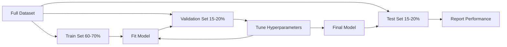

# Evaluación de modelo
# 模型评估 (evaluación de las pruebas)


> Un modelo es tan bueno como la forma en que lo midas.

> El buen y el mal del modelo depende de cómo lo mida.

**Type:** Build | **类型：** 构建
**Languages:** Python
**Prerequisites:** Phase 1 (Probability & Distributions, Statistics for ML), Phase 2 Lessons 1-8 | **前置知识：** Phase 1（概率与分布、统计学），Phase 2 第 1-8 课
**Time:** ~90 minutes | **时间：** 约 90 分钟

## Objetivos de aprendizaje

- Implementar desde cero la validación cruzada de K-fold y la de K-fold estratificada y explicar por qué la estratificación es importante para los datos desequilibrados
  Desde la realización de K 折和分层 K 折交叉验证, explicar por qué las divisiones de datos son importantes para el desequilibrio
- Computación de precisión, recuerdo, F1, AUC-ROC y métricas de regresión (MSE, RMSE, MAE, R-cuadrados) desde cero
  Desde el cálculo de la tasa de precisión, la tasa de recuperación, F1 AUC-ROC y el índice de regreso (MSE, RMSE, MAE, R-squared)
- Interpreta las curvas de aprendizaje para diagnosticar si un modelo sufre de alto sesgo o alta variación
   Explicar la curva de aprendizaje para diagnosticar si el modelo existe una diferencia de alto o de alto
- Identificar errores comunes de evaluación, incluida la fuga de datos, la selección de métricas incorrecta y la contaminación del conjunto de ensayos
  Identificación de errores de evaluación de los datos, incluidas las fugas de datos, la selección de indicadores y la contaminación de los ensayos


> **【中文解读】**
> 模型评估回答模型到底好不好──准确率、精确率、召回率、F1、AUC-ROC es la clasificación de los indicadores; MSE、MAE、R^2 es la clasificación de los indicadores.

> **【拓展：模型评估失误导致的生产事故】**
> Amazon reclutamiento de IA  herramientas por la evaluación insuficiente (en la evaluación de datos de entrenamiento y no en ensayos independientes) que conducen a la discriminación sistémica contra las mujeres candidatas, finalmente se ven obligadas a bajar.

## El problema es la introducción del problema

Entrenaste a un modelo, tiene una precisión del 95% en tus datos. ¿Es bueno?

> Usted entrenó un modelo. Obtiene un 95% de precisión en sus datos. ¿Eso es bueno?

- ¿Qué? - No, no puedo. Si el 95% de sus datos pertenecen a una clase, un modelo que siempre predice que la clase obtiene una precisión del 95% mientras que es completamente inútil. Si evaluas con los mismos datos en los que te entrenaste, el número del 95% no tiene sentido porque el modelo sólo memorizó las respuestas. Si su conjunto de datos tiene un componente de tiempo y se mezcla al azar antes de dividir, su modelo podría estar utilizando datos futuros para predecir el pasado.

> Tal vez bien, tal vez mal. Si el 95% de los datos pertenecen a una categoría, siempre predice que el modelo de esa categoría obtiene un 95% de precisión pero es totalmente inútil. Si evalúa el 95% en datos entrenados, este número no tiene sentido, porque el modelo simplemente recuerda la respuesta. Si tu conjunto de datos tiene un componente temporal y estás en la división precoz, tu modelo puede usar el futuro para predecir el pasado.

La evaluación de modelos es donde la mayoría de los proyectos de ML se equivocan. La métrica equivocada hace que un modelo malo parezca bueno. La división equivocada permite que un modelo engañe. La comparación equivocada hace que elijas el modelo peor. Obtener la evaluación correcta no es opcional. Es la diferencia entre un modelo que funciona en producción y uno que falla en el momento en que ve datos reales.

>  Evaluación de modelos es donde la mayoría de los proyectos de ML salen mal  Evaluación de errores hace que un modelo se vea bien  Evaluación de errores hace que el modelo se engañe  Comparación de errores hace que elijas un modelo peor  Evaluación correcta no es una opción  Es la diferencia entre un modelo que funciona en la producción y un modelo que se encuentra con datos reales y que falla 

> **【中文解读】**
> 模型评估最容易犯三错误: 1) evaluar en datos de entrenamiento 模型只是记住答案; 2) utilizar índices erróneos 像不平衡数据准确率; 3) datos que se filtran 测试集信息泄露到训练过程)  Una evaluación correcta requiere una división independiente de datos  ajustar los objetivos de la empresa  verificar el intercambio para obtener una estimación confiable.

## El concepto central.

### El tren, la validación, la prueba



Tres divisiones, tres propósitos:

> Tres tipos de uso:

- **Training set**El modelo aprende de estos datos y ve estos ejemplos durante la formación.
  **训练集**Modelo de aprendizaje en el entrenamiento:
- **Validation set**El modelo nunca se basa en estos datos, pero sus decisiones son influenciadas por ellos.
  **验证集**Para regular los superparámetros y la selección entre modelos, los modelos no se entrenan en estos datos, pero sus decisiones se ven afectadas.
- **Test set**Si se mira el rendimiento de la prueba y luego se vuelve a cambiar su modelo, ya no es un conjunto de prueba.
  **测试集**En el último contacto sólo una vez, informe el rendimiento final. Si ves el rendimiento del test y luego revisas el modelo, ya no es un conjunto de pruebas.

El conjunto de pruebas es su garantía de que el rendimiento reportado refleja cómo se comportará el modelo en datos verdaderamente invisibles.

> 测试集是你的保留保证, asegurar que el rendimiento del informe refleje el rendimiento del modelo en los datos realmente no vistos.

### Validación cruzada de K-doble

Con pequeños conjuntos de datos, un solo tren/validación dividido elimina los datos y proporciona estimaciones ruidosas.

>  Para los pequeños conjuntos de datos, el ensayo único/verificación divide el gasto de datos y da una estimación de ruido.

```mermaid
flowchart TB
    subgraph Fold1["Fold 1"]
        direction LR
        V1["Val"] --- T1a["Train"] --- T1b["Train"] --- T1c["Train"] --- T1d["Train"]
    end
    subgraph Fold2["Fold 2"]
        direction LR
        T2a["Train"] --- V2["Val"] --- T2b["Train"] --- T2c["Train"] --- T2d["Train"]
    end
    subgraph Fold3["Fold 3"]
        direction LR
        T3a["Train"] --- T3b["Train"] --- V3["Val"] --- T3c["Train"] --- T3d["Train"]
    end
    subgraph Fold4["Fold 4"]
        direction LR
        T4a["Train"] --- T4b["Train"] --- T4c["Train"] --- V4["Val"] --- T4d["Train"]
    end
    subgraph Fold5["Fold 5"]
        direction LR
        T5a["Train"] --- T5b["Train"] --- T5c["Train"] --- T5d["Train"] --- V5["Val"]
    end
    Fold1 --> R["Average scores"]
    Fold2 --> R
    Fold3 --> R
    Fold4 --> R
    Fold5 --> R
```



1. Dividir los datos en pliegues de K de tamaño igual
   Dividir los datos en K 个大相等折
2. Para cada pliegue, entren en los pliegues K-1 y validen en el resto de pliegues
   Para cada giro, en K-1 折上训练, en el resto de 折上验证
3. Promedio de los puntajes de validación K
   Para el K 个验证分数取平均

K=5 o K=10 son opciones estándar. Cada punto de datos se utiliza para la validación exactamente una vez. La puntuación promedio es una estimación más estable que cualquier división única.

> K=5 o K=10 es la selección estándar. Cada punto de datos se usa para verificarlo una vez.

> K=5 o K=10 es la selección estándar. Cada punto de datos se usa para verificarlo una vez.

**Stratified K-fold**Si el conjunto de datos es 70% clase A y 30% clase B, cada doble tendrá aproximadamente la misma proporción. Esto es importante para conjuntos de datos desequilibrados donde una división aleatoria podría poner todas las muestras minoritarias en un solo doble.

> **分层 K 折**Si tu conjunto de datos es de 70% de clase A y 30% de clase B, cada turno tendrá aproximadamente la misma proporción. Esto es importante para el conjunto de datos desequilibrado.

> **分层 K 折**Si el conjunto de datos es del 70% de la categoría A y del 30% de la categoría B, cada turno tendrá aproximadamente la misma proporción, esto es importante para el conjunto de datos desequilibrado, ya que, a su vez, la división puede incluir todas las pocas muestras en el mismo turno.

### Metricas de clasificación

**Confusion matrix**Para la clasificación binaria:

> **混淆矩阵**Para las clases de segunda clase:

> **混淆矩阵**Para las clases de segunda clase:

|  | Predicted Positive | Predicted Negative |
|--|---|---|
| Actually Positive | True Positive (TP) | False Negative (FN) |
| Actually Negative | False Positive (FP) | True Negative (TN) |

A partir de esta matriz, todas las otras métricas siguen:

> Desde esta matriz se extraen todos los demás indicadores:

> Desde esta matriz, todos los demás indicadores se derivan de:

- **Accuracy**= (TP + TN) / (TP + TN + FP + FN). Fracción de predicciones correctas.
  **准确率**= (TP + TN) / (TP + TN + FP + FN)。
- **Precision**= TP / (TP + FP). De todas las cosas predicidas positivas, ¿cuántas en realidad eran?
  **精确率**= TP / (TP + FP) ―― entre todos los ejemplos de pronóstico, ¿cuánto hay realmente en realidad?
- **Recall**(sensibilidad) = TP / (TP + FN). De todos los positivos reales, ¿cuántos hemos capturado?
  **召回率**(sensibilidad) = TP / (TP + FN) ⋅ de todos los ejemplos reales, ¿cuánto hemos capturado?
- **F1 score**= 2 * precisión * recall / (precisión + recall).
  **F1 分数**= 2 * 精确率 * 召回率 / (精确率 + 召回率) ⋅ 精确率和召回率调和平均── 在两者中都不明显占优时平衡在两者中──
- **AUC-ROC**Área bajo la curva de características operativas del receptor. muestra la tasa positiva verdadera vs tasa positiva falsa en varios umbrales de clasificación. AUC = 0.5 significa adivinar al azar, AUC = 1.0 significa separación perfecta.
  **AUC-ROC**:ROC 曲线下面积──在不同分类值下绘制真实率和假正率──AUC = 0.5 表示随机猜测,AUC = 1.0 表示完美区分──与值无关:它衡量模型将正样本排在负样本前面的能力,无论你选择什么截止值──

### Metricas de regresión

- **MSE**(Erro cuadrado medio) = medio((y_true - y_pred) ^ 2). Penaliza errores grandes cuadráticamente.
  **均方误差 (MSE)**= medio(((y_true - y_pred) ^2)。
- **RMSE**(Erro medio cuadrado de raíz) = sqrt(MSE). Las mismas unidades que la variable objetivo.
  **均方根误差 (RMSE)**= cuadrados (MSE) ∼ con la misma unidad de cambios objetivo ∼ Con MSE 更易解释──
- **MAE**(Medio de error absoluto) = medio de error (y_true - y_pred = error). Trata todos los errores linealmente.
  **平均绝对误差 (MAE)**= medio de la información - y_previous) ‧ lineal de tratamiento de todos los errores―比 MSE 更鲁棒于异常值―
- **R-squared**= 1 - SS_res / SS_tot, donde SS_res = suma((y_true - y_pred) ^2) y SS_tot = suma(((y_true - y_mean) ^2). Fracción de variación explicada por el modelo. R^2 = 1,0 es perfecto. R^2 = 0.0 significa que el modelo no es mejor que siempre predecir la media. R^2 puede ser negativo si el modelo es peor que la media.
  **决定系数 (R-squared)**= 1 - SS_res / SS_tot, en el cual SS_res = suma(((y_true - y_pred) ^2), SS_tot = suma((((y_true - y_mean) ^2)。 modelo explicación de la proporción de diferencia。R^2 = 1.0 完美。R^2 = 0.0 表示模型不比始终预测均值好── R^2 可以为负,如果模型比预测均值还差──

### Curvas de aprendizaje

Los resultados de formación y validación de las parámetros en función del tamaño del conjunto de formación:

> Describir la curva de las variaciones de la formación y la prueba de la formación:

> Describir las funciones de los grupos de entrenamiento de tamaño:

- **High bias (underfitting)**La convergencia de las dos curvas a un puntaje bajo. Añadir más datos no ayudará. Necesitas un modelo más complejo.
  **高偏差（欠拟合）**Dos curvas reciben a baja porción.
- **High variance (overfitting)**El resultado de la formación es alto pero el resultado de la validación es mucho menor.
  **高方差（过拟合）**El número de entrenamientos es alto, pero el número de pruebas es mucho menor.

### Curvas de validación

Las puntuaciones de formación y validación de las gráficas en función de un hiperparámetro:

> Mejorar la curva de las variaciones de los entrenamientos y las pruebas de los resultados:

> Describir las funciones de los superparámetros como el número de entrenamiento y el número de pruebas:

- En baja complejidad: ambas puntuaciones son bajas (no adecuadas)
  复杂度低时: dos分数都低(de acuerdo)
- En la complejidad correcta: ambas puntuaciones son altas y cercanas
  复杂度合适时: dos por ciento son altos y cerca
- En situaciones de alta complejidad: el puntaje de formación se mantiene alto pero el puntaje de validación disminuye (overfitting)
  复杂度高时: entrenamiento porcentaje mantener alto pero el número de pruebas porcentaje baja

El valor óptimo del hiperparámetro es donde el puntaje de validación alcanza su punto máximo.

> El máximo superparámetro es la posición en la que el número de pruebas alcanza el máximo valor.

> El máximo superparámetro es la posición en la que el número de pruebas alcanza el máximo valor.

### Errores comunes en la evaluación

**Data leakage**Exemplos: instalar un escalador en el conjunto completo de datos antes de dividir, incluyendo datos futuros en la predicción de series temporales, utilizando una característica que se deriva del objetivo.

> **数据泄漏**Ejemplo: en el tiempo de la secuencia de tiempo, el tiempo de la secuencia de tiempo contiene datos futuros, el uso de características de la meta.

**Class imbalance**El 99% de las transacciones son legítimas, el 1% son fraudulentas. Un modelo que siempre predice "legítimo" obtiene una precisión del 99%.

> **类别不平衡**El 99% de las transacciones son legales, el 1% son engañosas.

**Wrong metric**: optimizar la precisión cuando se debe optimizar el retiro (diagnóstico médico), o optimizar el RMSE cuando los datos tienen valores extremos (utilice MAE en su lugar).

> **错误指标**La información sobre el tratamiento de la enfermedad se puede obtener de la información de la persona que se encuentra en el hospital.

**Not using stratified splits**En el caso de los datos desequilibrados, una división aleatoria podría incluir muy pocas muestras minoritarias en el pliegue de validación, lo que daría estimaciones inestables.

> **不使用分层划分**En el caso de los datos desequilibrados, se puede clasificar una minoría de muestras en el cálculo de la tasa de pérdida de datos.

**Testing too often**Cada vez que se observa el rendimiento de la prueba y se ajusta, se encaja demasiado en el conjunto de prueba.

> **测试过于频繁**Cada vez que revisas el rendimiento del test se ajusta, estás preparando un ensayo de prueba.

## Construye y realiza.

> **【中文解读】**
> Desde la realización de la prueba de cesiones (K-fold 和分层 K-fold) 分类指标 (精确率、召回率、F1、AUC-ROC) y regreso (回归指标)  MSE、RMSE、MAE、R2) 交叉验证 es un método estándar para evaluar la naturaleza del modelo, la prueba de cesiones (K-fold) 确保 que cada una de las rotas tenga una proporción de clases coherente, es fundamental para los datos desequilibrados.

> **【拓展：学习曲线——诊断模型问题的利器】**
> Curva de aprendizaje) es un instrumento intuitivo para diagnosticar los problemas de alto prejuicio/alto prejuicio. La función de aprendizaje de curva puede generar automáticamente estas curvas.
```figure
precision-recall-threshold
```

## Construye el mismo

### Paso 1: Trenes/validación/probos divididos

```python
import random
import math


def train_val_test_split(X, y, train_ratio=0.6, val_ratio=0.2, seed=42):
    random.seed(seed)
    n = len(X)
    indices = list(range(n))
    random.shuffle(indices)

    train_end = int(n * train_ratio)
    val_end = int(n * (train_ratio + val_ratio))

    train_idx = indices[:train_end]
    val_idx = indices[train_end:val_end]
    test_idx = indices[val_end:]

    X_train = [X[i] for i in train_idx]
    y_train = [y[i] for i in train_idx]
    X_val = [X[i] for i in val_idx]
    y_val = [y[i] for i in val_idx]
    X_test = [X[i] for i in test_idx]
    y_test = [y[i] for i in test_idx]

    return X_train, y_train, X_val, y_val, X_test, y_test
```

### Paso 2: Validación cruzada de K-doble y de K-doble estratificado

```python
def kfold_split(n, k=5, seed=42):
    random.seed(seed)
    indices = list(range(n))
    random.shuffle(indices)

    fold_size = n // k
    folds = []

    for i in range(k):
        start = i * fold_size
        end = start + fold_size if i < k - 1 else n
        val_idx = indices[start:end]
        train_idx = indices[:start] + indices[end:]
        folds.append((train_idx, val_idx))

    return folds


def stratified_kfold_split(y, k=5, seed=42):
    random.seed(seed)

    class_indices = {}
    for i, label in enumerate(y):
        class_indices.setdefault(label, []).append(i)

    for label in class_indices:
        random.shuffle(class_indices[label])

    folds = [{"train": [], "val": []} for _ in range(k)]

    for label, indices in class_indices.items():
        fold_size = len(indices) // k
        for i in range(k):
            start = i * fold_size
            end = start + fold_size if i < k - 1 else len(indices)
            val_part = indices[start:end]
            train_part = indices[:start] + indices[end:]
            folds[i]["val"].extend(val_part)
            folds[i]["train"].extend(train_part)

    return [(f["train"], f["val"]) for f in folds]


def cross_validate(X, y, model_fn, k=5, metric_fn=None, stratified=False):
    n = len(X)

    if stratified:
        folds = stratified_kfold_split(y, k)
    else:
        folds = kfold_split(n, k)

    scores = []
    for train_idx, val_idx in folds:
        X_train = [X[i] for i in train_idx]
        y_train = [y[i] for i in train_idx]
        X_val = [X[i] for i in val_idx]
        y_val = [y[i] for i in val_idx]

        model = model_fn()
        model.fit(X_train, y_train)
        predictions = [model.predict(x) for x in X_val]

        if metric_fn:
            score = metric_fn(y_val, predictions)
        else:
            score = sum(1 for yt, yp in zip(y_val, predictions) if yt == yp) / len(y_val)
        scores.append(score)

    return scores
```

### Paso 3: Matriz de confusión y métricas de clasificación

> El tercer paso:混矩阵和分类指标── desde la zero realización de TP/TN/FP/FN 计数, re-推导出准确率、精确率、召回率、F1──ROC 曲线扫描所有可能值,记录每点的 (FPR, TPR),AUC es la curva下面积((Use梯形法计算)

```python
def confusion_matrix(y_true, y_pred):
    tp = sum(1 for yt, yp in zip(y_true, y_pred) if yt == 1 and yp == 1)
    tn = sum(1 for yt, yp in zip(y_true, y_pred) if yt == 0 and yp == 0)
    fp = sum(1 for yt, yp in zip(y_true, y_pred) if yt == 0 and yp == 1)
    fn = sum(1 for yt, yp in zip(y_true, y_pred) if yt == 1 and yp == 0)
    return tp, tn, fp, fn


def accuracy(y_true, y_pred):
    tp, tn, fp, fn = confusion_matrix(y_true, y_pred)
    total = tp + tn + fp + fn
    return (tp + tn) / total if total > 0 else 0.0


def precision(y_true, y_pred):
    tp, tn, fp, fn = confusion_matrix(y_true, y_pred)
    return tp / (tp + fp) if (tp + fp) > 0 else 0.0


def recall(y_true, y_pred):
    tp, tn, fp, fn = confusion_matrix(y_true, y_pred)
    return tp / (tp + fn) if (tp + fn) > 0 else 0.0


def f1_score(y_true, y_pred):
    p = precision(y_true, y_pred)
    r = recall(y_true, y_pred)
    return 2 * p * r / (p + r) if (p + r) > 0 else 0.0


def roc_curve(y_true, y_scores):
    thresholds = sorted(set(y_scores), reverse=True)
    tpr_list = []
    fpr_list = []

    total_positives = sum(y_true)
    total_negatives = len(y_true) - total_positives

    for threshold in thresholds:
        y_pred = [1 if s >= threshold else 0 for s in y_scores]
        tp = sum(1 for yt, yp in zip(y_true, y_pred) if yt == 1 and yp == 1)
        fp = sum(1 for yt, yp in zip(y_true, y_pred) if yt == 0 and yp == 1)

        tpr = tp / total_positives if total_positives > 0 else 0.0
        fpr = fp / total_negatives if total_negatives > 0 else 0.0

        tpr_list.append(tpr)
        fpr_list.append(fpr)

    return fpr_list, tpr_list, thresholds


def auc_roc(y_true, y_scores):
    fpr_list, tpr_list, _ = roc_curve(y_true, y_scores)

    pairs = sorted(zip(fpr_list, tpr_list))
    fpr_sorted = [p[0] for p in pairs]
    tpr_sorted = [p[1] for p in pairs]

    area = 0.0
    for i in range(1, len(fpr_sorted)):
        width = fpr_sorted[i] - fpr_sorted[i - 1]
        height = (tpr_sorted[i] + tpr_sorted[i - 1]) / 2
        area += width * height

    return area
```

### Paso 4: Metricas de regresión

> En el segundo paso, el modelo de análisis de la base de datos de la base de datos de la base de datos de la base de datos de la base de datos de la base de datos de la base de datos de la base de datos de la base de datos de la base de datos de la base de datos de la base de datos de la base de datos de la base de datos de la base de datos de la base de datos de la base de datos de la base de datos de la base de datos de la base de datos de la base de datos de la base de datos de la base de datos de la base de datos de datos de la base de datos de datos de la base de datos de la base de datos de datos de la base de datos de la base de datos de datos de la base de datos de datos de la base de datos de datos de la base de datos de datos de la base de datos de datos de datos de la base de datos de datos de datos de la base de datos de datos de datos de la base de datos de datos de datos de datos de datos de la base de datos de datos de datos de datos de datos de datos de datos de datos de datos de datos de datos de datos de datos de datos de datos de datos de datos de datos de datos de datos de datos de datos de datos de datos de datos de datos de datos de datos de datos de datos de datos de datos de datos de datos de datos de datos de datos de datos de datos de datos de datos de datos de datos de datos de datos de datos de datos de datos de datos de datos de datos de datos de datos de datos de datos de datos de datos de datos de datos de datos de datos de datos de datos de datos de datos de datos de datos de datos de datos de datos de datos de datos de datos de datos de datos de datos de datos de datos de datos de datos de datos de datos de datos de datos de datos de datos de datos de datos de datos de datos de datos de datos de datos de datos de datos de datos de datos de datos de datos de datos de datos de datos de datos de datos de datos de datos de datos de datos de datos de datos de datos de datos de datos de datos de datos de datos de datos de datos de datos de datos de datos de datos de datos de datos de datos de datos de datos de datos de datos de datos de datos de datos de datos de datos de datos de datos de datos de datos de datos de datos de datos de datos

```python
def mse(y_true, y_pred):
    n = len(y_true)
    return sum((yt - yp) ** 2 for yt, yp in zip(y_true, y_pred)) / n


def rmse(y_true, y_pred):
    return math.sqrt(mse(y_true, y_pred))


def mae(y_true, y_pred):
    n = len(y_true)
    return sum(abs(yt - yp) for yt, yp in zip(y_true, y_pred)) / n


def r_squared(y_true, y_pred):
    mean_y = sum(y_true) / len(y_true)
    ss_res = sum((yt - yp) ** 2 for yt, yp in zip(y_true, y_pred))
    ss_tot = sum((yt - mean_y) ** 2 for yt in y_true)
    if ss_tot == 0:
        return 0.0
    return 1.0 - ss_res / ss_tot
```

### Paso 5: Curvas de aprendizaje

> Segundo paso: Curva de aprendizaje. Aumentar gradualmente la cantidad de datos de entrenamiento, el número de registros de entrenamiento y la cantidad de pruebas. Dos curvas son bajas.

```python
def learning_curve(X, y, model_fn, metric_fn, train_sizes=None, val_ratio=0.2, seed=42):
    random.seed(seed)
    n = len(X)
    indices = list(range(n))
    random.shuffle(indices)

    val_size = int(n * val_ratio)
    val_idx = indices[:val_size]
    pool_idx = indices[val_size:]

    X_val = [X[i] for i in val_idx]
    y_val = [y[i] for i in val_idx]

    if train_sizes is None:
        train_sizes = [int(len(pool_idx) * r) for r in [0.1, 0.2, 0.4, 0.6, 0.8, 1.0]]

    train_scores = []
    val_scores = []

    for size in train_sizes:
        subset = pool_idx[:size]
        X_train = [X[i] for i in subset]
        y_train = [y[i] for i in subset]

        model = model_fn()
        model.fit(X_train, y_train)

        train_pred = [model.predict(x) for x in X_train]
        val_pred = [model.predict(x) for x in X_val]

        train_scores.append(metric_fn(y_train, train_pred))
        val_scores.append(metric_fn(y_val, val_pred))

    return train_sizes, train_scores, val_scores
```

### Paso 6: Un clasificador simple para las pruebas, más la demostración completa

> Sexta paso: un simple logístico regreso a la clasificación, utilizado para evaluar el código de prueba.

```python
class SimpleLogistic:
    def __init__(self, lr=0.1, epochs=100):
        self.lr = lr
        self.epochs = epochs
        self.weights = None
        self.bias = 0.0

    def sigmoid(self, z):
        z = max(-500, min(500, z))
        return 1.0 / (1.0 + math.exp(-z))

    def fit(self, X, y):
        n_features = len(X[0])
        self.weights = [0.0] * n_features
        self.bias = 0.0

        for _ in range(self.epochs):
            for xi, yi in zip(X, y):
                z = sum(w * x for w, x in zip(self.weights, xi)) + self.bias
                pred = self.sigmoid(z)
                error = yi - pred
                for j in range(n_features):
                    self.weights[j] += self.lr * error * xi[j]
                self.bias += self.lr * error

    def predict_proba(self, x):
        z = sum(w * xi for w, xi in zip(self.weights, x)) + self.bias
        return self.sigmoid(z)

    def predict(self, x):
        return 1 if self.predict_proba(x) >= 0.5 else 0


class SimpleLinearRegression:
    def __init__(self, lr=0.001, epochs=200):
        self.lr = lr
        self.epochs = epochs
        self.weights = None
        self.bias = 0.0

    def fit(self, X, y):
        n_features = len(X[0])
        self.weights = [0.0] * n_features
        self.bias = 0.0
        n = len(X)

        for _ in range(self.epochs):
            for xi, yi in zip(X, y):
                pred = sum(w * x for w, x in zip(self.weights, xi)) + self.bias
                error = yi - pred
                for j in range(n_features):
                    self.weights[j] += self.lr * error * xi[j] / n
                self.bias += self.lr * error / n

    def predict(self, x):
        return sum(w * xi for w, xi in zip(self.weights, x)) + self.bias


def standardize(values):
    n = len(values)
    mean = sum(values) / n
    var = sum((v - mean) ** 2 for v in values) / n
    std = math.sqrt(var) if var > 0 else 1.0
    return [(v - mean) / std for v in values], mean, std


def make_classification_data(n=300, seed=42):
    random.seed(seed)
    X = []
    y = []
    for _ in range(n):
        x1 = random.gauss(0, 1)
        x2 = random.gauss(0, 1)
        label = 1 if (x1 + x2 + random.gauss(0, 0.5)) > 0 else 0
        X.append([x1, x2])
        y.append(label)
    return X, y


def make_regression_data(n=200, seed=42):
    random.seed(seed)
    X = []
    y = []
    for _ in range(n):
        x1 = random.uniform(0, 10)
        x2 = random.uniform(0, 5)
        target = 3 * x1 + 2 * x2 + random.gauss(0, 2)
        X.append([x1, x2])
        y.append(target)
    return X, y


def make_imbalanced_data(n=300, minority_ratio=0.05, seed=42):
    random.seed(seed)
    X = []
    y = []
    for _ in range(n):
        if random.random() < minority_ratio:
            x1 = random.gauss(3, 0.5)
            x2 = random.gauss(3, 0.5)
            label = 1
        else:
            x1 = random.gauss(0, 1)
            x2 = random.gauss(0, 1)
            label = 0
        X.append([x1, x2])
        y.append(label)
    return X, y


if __name__ == "__main__":
    X_clf, y_clf = make_classification_data(300)

    print("=== Train/Validation/Test Split ===")
    X_train, y_train, X_val, y_val, X_test, y_test = train_val_test_split(X_clf, y_clf)
    print(f"  Train: {len(X_train)}, Val: {len(X_val)}, Test: {len(X_test)}")
    print(f"  Train class distribution: {sum(y_train)}/{len(y_train)} positive")
    print(f"  Val class distribution: {sum(y_val)}/{len(y_val)} positive")

    # 主程序：完整演示训练/验证/测试划分、分类指标（含混淆矩阵、F1、AUC-ROC）、K 折交叉验证、回归指标（MSE/RMSE/MAE/R²）、学习曲线、不平衡数据评估。每个环节都展示具体数值，让评估方法变得具体。

    model = SimpleLogistic(lr=0.1, epochs=200)
    model.fit(X_train, y_train)

    print("\n=== Classification Metrics ===")
    y_pred = [model.predict(x) for x in X_test]
    tp, tn, fp, fn = confusion_matrix(y_test, y_pred)
    print(f"  Confusion matrix: TP={tp}, TN={tn}, FP={fp}, FN={fn}")
    print(f"  Accuracy:  {accuracy(y_test, y_pred):.4f}")
    print(f"  Precision: {precision(y_test, y_pred):.4f}")
    print(f"  Recall:    {recall(y_test, y_pred):.4f}")
    print(f"  F1 Score:  {f1_score(y_test, y_pred):.4f}")

    y_scores = [model.predict_proba(x) for x in X_test]
    auc = auc_roc(y_test, y_scores)
    print(f"  AUC-ROC:   {auc:.4f}")

    print("\n=== K-Fold Cross-Validation (K=5) ===")
    cv_scores = cross_validate(
        X_clf, y_clf,
        model_fn=lambda: SimpleLogistic(lr=0.1, epochs=200),
        k=5,
        metric_fn=accuracy,
    )
    mean_cv = sum(cv_scores) / len(cv_scores)
    std_cv = math.sqrt(sum((s - mean_cv) ** 2 for s in cv_scores) / len(cv_scores))
    print(f"  Fold scores: {[round(s, 4) for s in cv_scores]}")
    print(f"  Mean: {mean_cv:.4f} (+/- {std_cv:.4f})")

    print("\n=== Stratified K-Fold Cross-Validation (K=5) ===")
    strat_scores = cross_validate(
        X_clf, y_clf,
        model_fn=lambda: SimpleLogistic(lr=0.1, epochs=200),
        k=5,
        metric_fn=accuracy,
        stratified=True,
    )
    strat_mean = sum(strat_scores) / len(strat_scores)
    strat_std = math.sqrt(sum((s - strat_mean) ** 2 for s in strat_scores) / len(strat_scores))
    print(f"  Fold scores: {[round(s, 4) for s in strat_scores]}")
    print(f"  Mean: {strat_mean:.4f} (+/- {strat_std:.4f})")

    print("\n=== Imbalanced Data: Why Accuracy Lies ===")
    X_imb, y_imb = make_imbalanced_data(300, minority_ratio=0.05)
    positives = sum(y_imb)
    print(f"  Class distribution: {positives} positive, {len(y_imb) - positives} negative ({positives/len(y_imb)*100:.1f}% positive)")

    always_negative = [0] * len(y_imb)
    print(f"  Always-negative baseline:")
    print(f"    Accuracy:  {accuracy(y_imb, always_negative):.4f}")
    print(f"    Precision: {precision(y_imb, always_negative):.4f}")
    print(f"    Recall:    {recall(y_imb, always_negative):.4f}")
    print(f"    F1 Score:  {f1_score(y_imb, always_negative):.4f}")

    X_tr_i, y_tr_i, X_v_i, y_v_i, X_te_i, y_te_i = train_val_test_split(X_imb, y_imb)
    model_imb = SimpleLogistic(lr=0.5, epochs=500)
    model_imb.fit(X_tr_i, y_tr_i)
    y_pred_imb = [model_imb.predict(x) for x in X_te_i]
    print(f"\n  Trained model on imbalanced data:")
    print(f"    Accuracy:  {accuracy(y_te_i, y_pred_imb):.4f}")
    print(f"    Precision: {precision(y_te_i, y_pred_imb):.4f}")
    print(f"    Recall:    {recall(y_te_i, y_pred_imb):.4f}")
    print(f"    F1 Score:  {f1_score(y_te_i, y_pred_imb):.4f}")

    print("\n=== Regression Metrics ===")
    X_reg, y_reg = make_regression_data(200)

    col0 = [x[0] for x in X_reg]
    col1 = [x[1] for x in X_reg]
    col0_s, m0, s0 = standardize(col0)
    col1_s, m1, s1 = standardize(col1)
    X_reg_scaled = [[col0_s[i], col1_s[i]] for i in range(len(X_reg))]

    X_tr_r, y_tr_r, X_v_r, y_v_r, X_te_r, y_te_r = train_val_test_split(X_reg_scaled, y_reg)
    reg_model = SimpleLinearRegression(lr=0.01, epochs=500)
    reg_model.fit(X_tr_r, y_tr_r)
    y_pred_r = [reg_model.predict(x) for x in X_te_r]

    print(f"  MSE:       {mse(y_te_r, y_pred_r):.4f}")
    print(f"  RMSE:      {rmse(y_te_r, y_pred_r):.4f}")
    print(f"  MAE:       {mae(y_te_r, y_pred_r):.4f}")
    print(f"  R-squared: {r_squared(y_te_r, y_pred_r):.4f}")

    mean_baseline = [sum(y_tr_r) / len(y_tr_r)] * len(y_te_r)
    print(f"\n  Mean baseline:")
    print(f"    MSE:       {mse(y_te_r, mean_baseline):.4f}")
    print(f"    R-squared: {r_squared(y_te_r, mean_baseline):.4f}")

    print("\n=== Learning Curve ===")
    sizes, train_sc, val_sc = learning_curve(
        X_clf, y_clf,
        model_fn=lambda: SimpleLogistic(lr=0.1, epochs=200),
        metric_fn=accuracy,
    )
    print(f"  {'Size':>6} {'Train':>8} {'Val':>8}")
    for s, tr, va in zip(sizes, train_sc, val_sc):
        print(f"  {s:>6} {tr:>8.4f} {va:>8.4f}")

    print("\n=== Statistical Model Comparison ===")
    model_a_scores = cross_validate(
        X_clf, y_clf,
        model_fn=lambda: SimpleLogistic(lr=0.1, epochs=100),
        k=5, metric_fn=accuracy,
    )
    model_b_scores = cross_validate(
        X_clf, y_clf,
        model_fn=lambda: SimpleLogistic(lr=0.1, epochs=500),
        k=5, metric_fn=accuracy,
    )
    diffs = [a - b for a, b in zip(model_a_scores, model_b_scores)]
    mean_diff = sum(diffs) / len(diffs)
    std_diff = math.sqrt(sum((d - mean_diff) ** 2 for d in diffs) / len(diffs))
    t_stat = mean_diff / (std_diff / math.sqrt(len(diffs))) if std_diff > 0 else 0.0
    print(f"  Model A (100 epochs) mean: {sum(model_a_scores)/len(model_a_scores):.4f}")
    print(f"  Model B (500 epochs) mean: {sum(model_b_scores)/len(model_b_scores):.4f}")
    print(f"  Mean difference: {mean_diff:.4f}")
    print(f"  Paired t-statistic: {t_stat:.4f}")
    print(f"  (|t| > 2.78 for significance at p<0.05 with df=4)")
```

## Usalo con el marco de ejecución

Con scikit-learn, la evaluación se integra en el flujo de trabajo:

> Utilizando el método de aprendizaje, evalúa en su trabajo:

```python
from sklearn.model_selection import cross_val_score, StratifiedKFold, learning_curve
from sklearn.metrics import (
    accuracy_score, precision_score, recall_score, f1_score,
    roc_auc_score, confusion_matrix, mean_squared_error, r2_score,
)
from sklearn.linear_model import LogisticRegression

model = LogisticRegression()
scores = cross_val_score(model, X, y, cv=StratifiedKFold(5), scoring="f1")
```

Las versiones desde cero muestran exactamente lo que hace la validación cruzada (sin magia, solo para-bucles y seguimiento de índices), cómo se calcula cada métrica (solo contando TP /FP /TN / FN), y por qué la estratificación importa (preservar las relaciones de clase en cada pliegue).

> Desde la versión zero se muestra exactamente lo que ha hecho el crossover verification (no hay magia, sólo un ciclo y un seguimiento de índices)  cómo calcula cada indicador (sólo cuentan TP/FP/TN/FN)  y por qué es importante la división de niveles  mantener la proporción de categorías en cada turno  La versión de la biblioteca aumentó la paralelidad  Más opciones de evaluación y tubos de integración 

## Envíe el producto .

Esta lección produce:
- `outputs/skill-evaluation.md`- una habilidad que cubra la estrategia de evaluación de los modelos de clasificación y regresión

> 本课产 出:
> - `outputs/skill-evaluation.md`- Capacidades de evaluación de estrategias de modelos de clasificación y regreso

> **【拓展：A/B 测试——模型评估的终极标准】**
> En la industria, los índices de evaluación de desconexión (precisión, AUC, etc.) son sólo una referencia, la verdadera evaluación es en línea A/B 测试. Google realiza más de 10.000 pruebas A/B al año para evaluar la mejora del algoritmo de búsqueda.

> **【中文解读】**
> ROC 曲线绘制不同值下 TPR(真率) vs FPR(假正率),AUC es la curva下面积(0.5=随机,1.0=完美)。AUPRC(精确率-召回率曲线下面积) en datos desequilibrados en comparación con AUC-ROC (más información sobre la cantidad de datos desequilibrados).

## Los ejercicios.

1. Implemente curvas de reclamo de precisión: precisión de gráfico vs reclamo en diferentes umbrales. Calcule la precisión media (área bajo la curva de PR). Compara la curva de PR con la curva de ROC en un conjunto de datos desequilibrado y explique cuándo cada una es más informativa.
   1. 实现精确率-召回率曲线: calcular la tasa de precisión en diferentes valores en comparación con la curva de ROC en un conjunto de datos desequilibrados, explicar cuándo cada uno tiene más información.
2. Construir un bucle de validación cruzada en un nido: el bucle externo evalúa el rendimiento del modelo, el bucle interno sintoniza los hiperparámetros.
   2. 构建嵌套交叉验证循环: externa循环评估模型性能,内循环调优超参数―― con ello comparar equitativamente dos modelos, no va a verificar la fuga de datos hasta la evaluación―
3. Implemente una prueba de permutación para la comparación del modelo: mezcla las etiquetas, retrain y mide el rendimiento. Repita 100 veces para construir una distribución nula. Computa el valor p del rendimiento del modelo observado contra esta distribución.
   3. 实现模型比较的置换检查:打乱标签,重新训练,测量性能──重复 100 times建立零分布──计算观测模型性能对这个分布的p 值──

## Términos clave .

| Term | What people say | What it actually means |
|------|----------------|----------------------|
| Overfitting | "Memorizing the training data" | The model captures noise in the training data, performing well on training but poorly on unseen data |
| Cross-validation | "Testing on different subsets" | Systematically rotating which portion of data is used for validation, averaging results across all rotations |
| Precision | "How many predicted positives are correct" | TP / (TP + FP): the fraction of positive predictions that are actually positive |
| Recall | "How many actual positives we found" | TP / (TP + FN): the fraction of actual positives that were correctly identified |
| AUC-ROC | "How well the model separates classes" | The area under the curve of true positive rate vs false positive rate across all thresholds, from 0.5 (random) to 1.0 (perfect) |
| R-squared | "How much variance is explained" | 1 - (sum of squared residuals / total sum of squares): the fraction of target variance captured by the model |
| Data leakage | "The model cheated" | Using information during training that would not be available at prediction time, leading to optimistic evaluation |
| Learning curve | "How performance changes with more data" | A plot of training and validation scores vs training set size, revealing underfitting or overfitting |
| Stratified split | "Keeping class ratios balanced" | Splitting data so each subset has the same proportion of each class as the full dataset |

## Más Leer más Leer más

- [scikit-learn Model Selection Guide](https://scikit-learn.org/stable/model_selection.html)- una referencia exhaustiva sobre la validación cruzada, las métricas y la regulación de los hiperparámetros
  [scikit-learn 模型选择指南](https://scikit-learn.org/stable/model_selection.html)- 交叉验证、指标和超参数调优的全面参考
- [Beyond Accuracy: Precision and Recall (Google ML Crash Course)](https://developers.google.com/machine-learning/crash-course/classification/precision-and-recall)- explicación clara con ejemplos interactivos
  [Beyond Accuracy: Precision and Recall (Google ML Crash Course)](https://developers.google.com/machine-learning/crash-course/classification/precision-and-recall)- 带交互示例的清晰解释
- [A Survey of Cross-Validation Procedures (Arlot & Celisse, 2010)](https://projecteuclid.org/journals/statistics-surveys/volume-4/issue-none/A-survey-of-cross-validation-procedures-for-model-selection/10.1214/09-SS054.full)- un tratamiento riguroso de cuándo y por qué funcionan las diferentes estrategias de CV
  [A Survey of Cross-Validation Procedures (Arlot & Celisse, 2010)](https://projecteuclid.org/journals/statistics-surveys/volume-4/issue-none/A-survey-of-cross-validation-procedures-for-model-selection/10.1214/09-SS054.full)- Estrategia de verificación de la diferencia ¿Cuándo es eficaz el análisis riguroso
