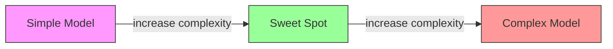
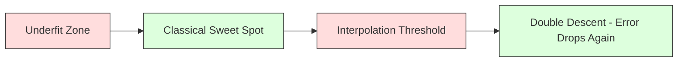
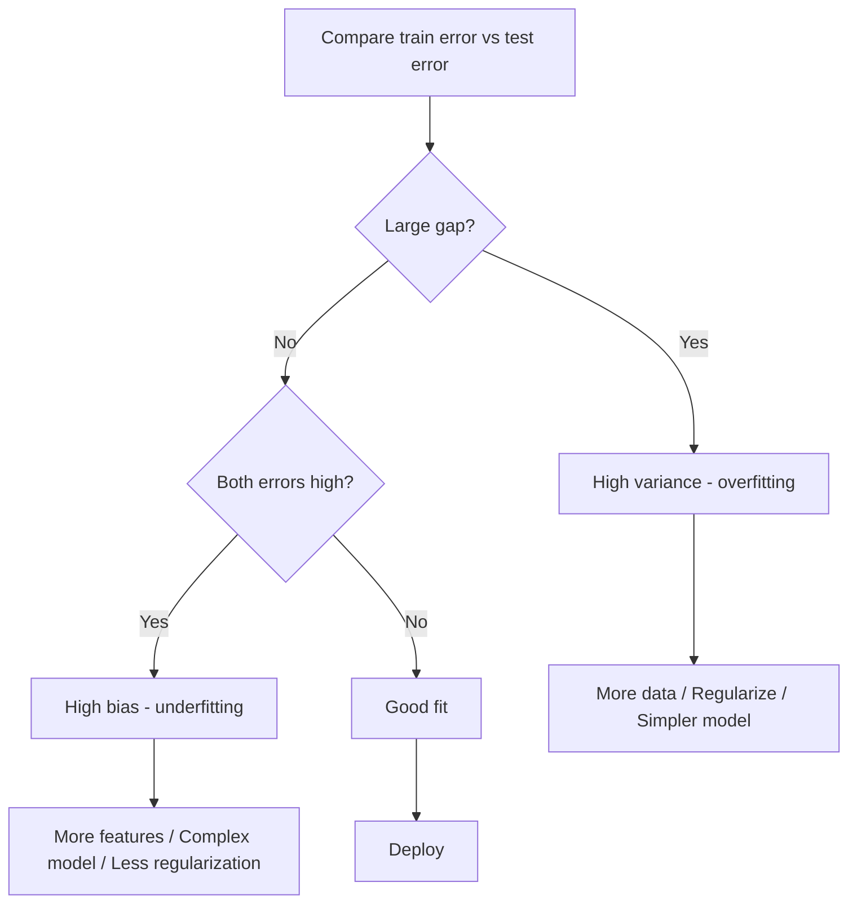
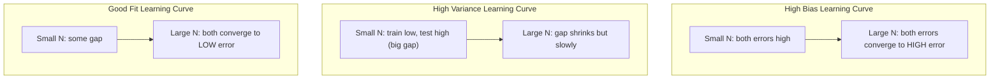
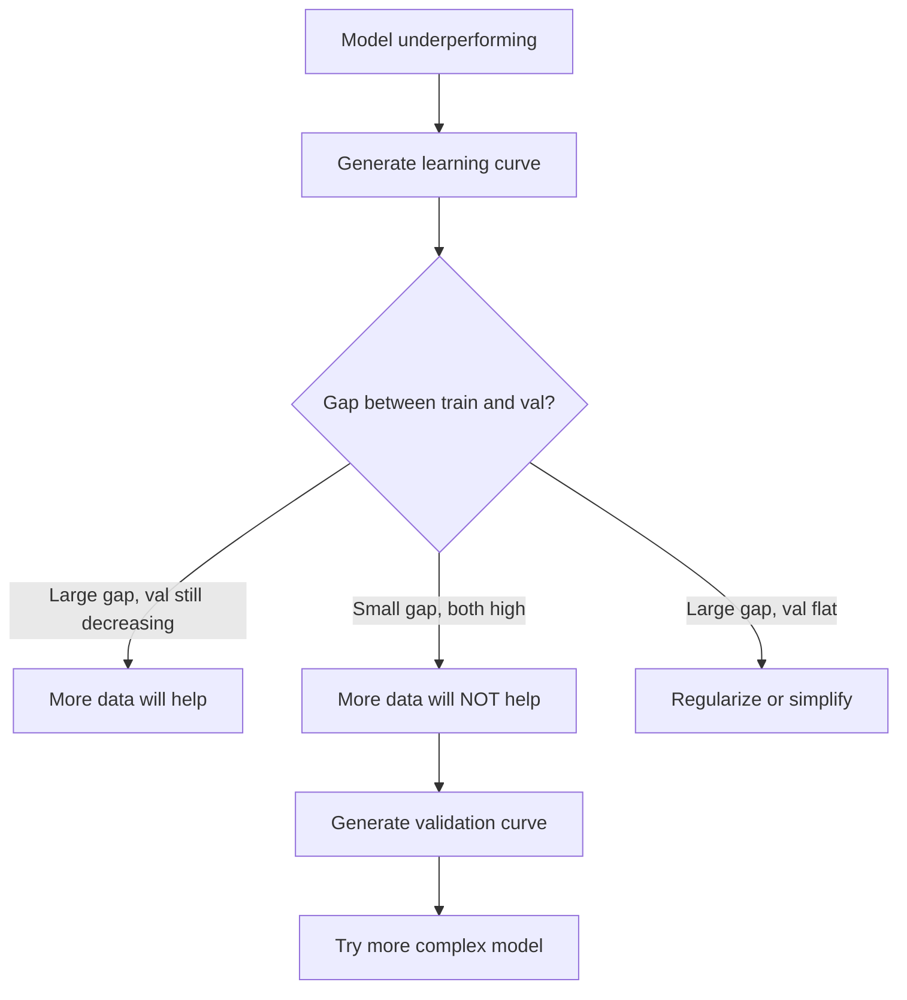

# Compartición de variaciones
# 偏差-方差权衡


> Cada error del modelo proviene de una de tres fuentes: sesgo, variación o ruido. Solo se pueden controlar las dos primeras.

> Cada error de modelo proviene de una de las tres fuentes: parámetro, parámetro o ruido.

**Type:** Learn | **类型：** 学习
**Language:**¿ Qué pasa ?**语言：**Python
**Prerequisites:** Phase 2, Lessons 01-09 (ML basics, regression, classification, evaluation) | **前置知识：** Phase 2 第 1-9 课（ML 基础、回归、分类、评估）
**Time:** ~75 minutes | **时间：** 约 75 分钟

## Objetivos de aprendizaje

- Derivar la descomposición de variación de sesgo del error de predicción esperado y explicar el papel del ruido irreducible
  推导期望预测 errores de desvio de los cambios, explicación de los cambios en el ruido
- Diagnosticar si un modelo sufre de alto sesgo o alta variación utilizando patrones de error de entrenamiento y prueba
  Uso de error de entrenamiento y error de prueba Modelo de diagnóstico de si existe un alto prejuicio o un alto diferencial
- Explicar cómo las técnicas de regularización (L1, L2, abandono, parada temprana) negocian sesgo para la variación
  解释正则化技术(L1、L2、Dropout、早停) ¿Cómo se balancea entre el diferencial y el diferencial
- Implementar experimentos que visualicen el compromiso de variaciones de sesgo en modelos de creciente complejidad
  realizar la experimentación de la complejidad de los modelos visibles en aumento de la diferencia-diferencia de peso


> **【中文解读】**
> 偏差(模型太简单欠拟合) vs 方差(模型太复杂过拟合) de equilibrio. 正则化.  L1/L2) 增加数据. 降低模型复杂度是常用手段. 了解偏差-方差权衡是调调的理论基础.

> **【拓展：偏差-方差在深度学习中的新理解】**
> 经典理论认为增大模型会增加高方差,但深度学习存在"双重下降" (doble descenso) fenómeno:模型超过"插值值" (en inglés) 后,测试误差反反反反下降 (en inglés) GPT-3 (en inglés) 1750 亿参数) 远超超训练 (en inglés) es necesario, pero la generalización de los resultados es mejor (en inglés) . Esto significa que en el aprendizaje profundo, "más grande= mejor" se establece en determinadas condiciones, rompiendo la comprensión tradicional de la evaluación de los diferenciales de parámetros.

## El problema es la introducción del problema

Entrenó a un modelo, tiene algún error en los datos de prueba. ¿De dónde viene ese error?

> Usted entrenó un modelo. Tiene algunos errores en los datos de prueba. ¿De dónde vienen estos errores?

Si su modelo es demasiado simple (regressión lineal en un conjunto de datos curvo), se perderá consistentemente el patrón verdadero. Eso es sesgo. Si su modelo es demasiado complejo (polinomio de 20 grados en 15 puntos de datos), encajará perfectamente en los datos de entrenamiento, pero dará predicciones muy diferentes sobre los nuevos datos. Eso es la varianza.

> Si tu modelo es demasiado simple (con regeneración lineal en el conjunto de datos de curvas), continuará desviado del modelo real. Esto es el desvío. Si tu modelo es demasiado complejo (con 20 múltiples conjuntos en 15 puntos de datos), se adaptará perfectamente a los datos de entrenamiento, pero en los nuevos datos da una predicción muy diferente.

No se puede minimizar ambos al mismo tiempo para una capacidad de modelo fija. Empujar el sesgo hacia abajo y la varianza aumenta. Empujar la varianza hacia abajo y el sesgo aumenta. Comprender este compromiso es la habilidad de diagnóstico más útil en el aprendizaje automático. Te dice si hacer tu modelo más complejo o menos complejo, si obtener más datos o ingeniería de mejores características, si regular más o menos.

>  Para la capacidad de un modelo fijo, no puedes minimizar ambos simultáneamente  presión baja, diferencia baja, aumento  presión baja, diferencia baja, aumento  comprensión de este peso es la habilidad de diagnóstico más útil en el aprendizaje automático  Te dice si se debe hacer un modelo más complejo o más simple, si se deben obtener más datos o mejores características de ingeniería, si se deben normalizar más o menos 

> **【中文解读】**
> 误差 = 偏差2 + 方差 + 不可约噪声──偏差来自模型的错误假设(如用直线拟合曲线), 偏差来自对训练数据波动的过度敏感──诊断方法:训练误差高+测试误差高→高偏差(不适合);训练误差低+测试误差高→高方差(过适合)──对应的解决方案完全不同──

## El concepto central.

### Prejuicios: error sistemático

Si entrenaste el mismo modelo en muchos conjuntos de entrenamiento diferentes extraídos de la misma distribución y promediaste las predicciones, el sesgo es la brecha entre ese promedio y la verdad.

> Periodismo mide la diferencia entre el promedio de tu modelo y el valor real ⋅ Si entrenas en el mismo modelo y el resultado de la misma predicción en muchos diferentes conjuntos de entrenamiento extraídos de la misma distribución, el parálisis es la diferencia entre el valor medio y el valor real ⋅

El sesgo alto significa que el modelo es demasiado rígido para capturar el patrón real. Una línea recta que encaja en una parábola siempre perderá la curva, sin importar cuántos datos le proporciones. Esto es insuficiente.

> El alto desvio significa que el modelo es demasiado complejo, no puede captar el modelo real.

```
High bias (underfitting):
  Model always predicts roughly the same wrong thing.
  Training error: HIGH
  Test error: HIGH
  Gap between them: SMALL
```

### Variante: sensibilidad a los datos de formación

La variación mide cuánto cambian sus predicciones cuando se entrenan en diferentes subconjuntos de datos.

> 方差 mide el grado de variación de los resultados de la predicción cuando se entrena en diferentes conjuntos de datos.

Una varianza alta significa que el modelo encaja el ruido en los datos de entrenamiento, no la señal subyacente. Un polinomio de grado-20 se filtra a través de cada punto de entrenamiento pero oscila salvajemente entre ellos. Esto es sobreajustado.

> El alto diferencial significa que el modelo se encuentra en el ruido de los datos de entrenamiento adecuados, y no en el potencial de señales. Un 20 veces más de los elementos se desplazan a través de cada punto de entrenamiento, pero entre ellos se produce una tremenda conmoción.

```
High variance (overfitting):
  Model fits training data perfectly but fails on new data.
  Training error: LOW
  Test error: HIGH
  Gap between them: LARGE
```

### La descomposición

Para cualquier punto x, el error de predicción esperado bajo pérdida cuadrada se descompone exactamente:

> 对于任意点 x,在平方损失下,期望预测误差精确分解为:

```
Expected Error = Bias^2 + Variance + Irreducible Noise

where:
  Bias^2   = (E[f_hat(x)] - f(x))^2
  Variance = E[(f_hat(x) - E[f_hat(x)])^2]
  Noise    = E[(y - f(x))^2]             (sigma^2)
```

- `f(x)`es la función verdadera
  `f(x)`Es una función real
- `f_hat(x)`es la predicción de su modelo
  `f_hat(x)`Es el modelo de la predicción
- `E[...]`es la expectativa sobre diferentes conjuntos de formación
  `E[...]`Es la expectativa de diferentes grupos de entrenamiento
- `y`es la etiqueta observada (función real más ruido)
  `y`Sí, estoy en el centro de la ciudad.

El término ruido es irreducible. Ningún modelo puede hacer mejor que sigma^2 en datos ruidosos. Su trabajo es encontrar el equilibrio correcto entre el sesgo^2 y la varianza.

> El ruido es inconveniente. No hay ningún modelo que pueda hacer mejor que sigma en los datos de ruido. Tu tarea es encontrar el equilibrio correcto entre la diferencia de parámetro y la diferencia de parámetro.

### Complejidad del modelo frente a error



La clásica curva en forma de U:

> 经典的 U 形曲线:

| Complexity | Bias | Variance | Total Error |
|-----------|------|----------|-------------|
| Too low | HIGH | LOW | HIGH (underfitting) |
| Just right | MODERATE | MODERATE | LOWEST |
| Too high | LOW | HIGH | HIGH (overfitting) |

| 复杂度 | 偏差 | 方差 | 总误差 |
|--------|------|------|--------|
| 太低 | 高 | 低 | 高（欠拟合） |
| 刚好 | 中等 | 中等 | 最低 |
| 太高 | 低 | 高 | 高（过拟合） |

### La regularización como control de variaciones prejuiciosas

La regularización aumenta deliberadamente el sesgo para reducir la varianza.

> La normalización intencionalmente aumenta la diferencia para reducir la diferencia.

- **L2 (Ridge):**Reducir todos los pesos hacia cero, mantener todas las características pero reducir su influencia.
  **L2 (Ridge)**El derecho de propiedad se vuelve a reducir a cero.
- **L1 (Lasso):**Empuja algunos pesos exactamente a cero.
  **L1 (Lasso)**El resultado de la evaluación de la evaluación de los resultados de la investigación se puede ver en el siguiente punto:
- **Dropout:**Desactiva las neuronas al azar durante el entrenamiento.
  **Dropout**El tiempo de entrenamiento es el tiempo de la formación.
- **Early stopping:**Se detiene el entrenamiento antes de que el modelo se adapte plenamente a los datos de entrenamiento.
  **早停**En el modelo totalmente adaptado entrenamiento datos antes de detener el entrenamiento.

La fuerza de regularización (lambda, tasa de abandono, número de épocas) controla directamente dónde se sienta en la curva de variación de sesgo.

> La normalización de la intensidad (lambda, drop-out rate, epoch number) controla directamente tu posición en la curva de diferencia-diferencia.

### Descenso doble: la perspectiva moderna

La teoría clásica dice: después del punto dulce, más complejidad siempre duele. Pero la investigación desde 2019 ha demostrado algo inesperado. Si sigues aumentando la capacidad del modelo mucho más allá del umbral de interpolación (donde el modelo tiene parámetros suficientes para encajar perfectamente los datos de entrenamiento), el error de prueba puede disminuir nuevamente.

> 经典理论认为: después de los mejores puntos, más complejidad siempre es perjudicial. Pero los estudios realizados desde 2019 han demostrado algunos fenómenos inesperados. Si continuas aumentando la capacidad del modelo, el modelo tiene suficiente parámetros para entrenar perfectamente, los errores de prueba pueden disminuir nuevamente.



Este fenómeno de "doble descenso" explica por qué las redes neuronales masivamente sobreparametrizadas (con mucho más parámetros que los ejemplos de entrenamiento) todavía se generalizan bien.

> Este fenómeno de "doble peso descendente" explica por qué la red neuronal de gran escala se ha convertido en un parámetro (los parámetros son mucho más que un ejemplo de entrenamiento) y todavía se puede generalizar muy bien.

Observaciones clave sobre el doble descenso:

>  Sobre la baja de peso en dos partes:

- Sucede en modelos lineales, árboles de decisión y redes neuronales
  Se produce en el modelo en línea, en el árbol de decisión y en la red neuronal.
- Más datos pueden realmente perjudicar en la región de interpolación (descenso doble por muestreo)
  En la región de inserción más datos en realidad puede ser perjudicial
- También puede ser causada por más épocas de entrenamiento (descenso doble en sentido de época)
  更多 entrenamiento época También podría llevar a ella  双重下降)
- La regularización suaviza el pico pero no lo elimina
  La normalización se ha aplanado el máximo pero no puede eliminarlo

¿Por qué sucede esto? En el umbral de interpolación, el modelo tiene la capacidad suficiente para adaptarse a todos los puntos de entrenamiento. Se forza a una solución muy específica que se extiende a través de cada punto, y pequeñas perturbaciones en los datos causan grandes cambios en el ajuste. Aquí es donde la varianza alcanza su punto máximo. Más allá del umbral, el modelo tiene muchas soluciones posibles que se ajustan perfectamente a los datos. El algoritmo de aprendizaje (por ejemplo, la descendencia de gradientes con regularización implícita) tiende a elegir el más simple entre ellos. Este sesgo implícito hacia soluciones simples es por qué los modelos sobreparametrizados se generalizan.

> ¿Por qué se hace esto? En el punto de inserción, el modelo acaba de tener suficiente capacidad para adaptarse a todos los puntos de entrenamiento. Se ve obligado a encontrar una solución específica a través de cada punto, y las pequeñas perturbaciones de los datos pueden provocar grandes cambios en el tamaño de la adaptación.

| Regime | Parameters vs Samples | Behavior |
|--------|----------------------|----------|
| Underparameterized | p << n | Classical tradeoff applies |
| Interpolation threshold | p ~ n | Variance peaks, test error spikes |
| Overparameterized | p >> n | Implicit regularization kicks in, test error drops |

| 状态 | 参数 vs 样本 | 行为 |
|------|-------------|------|
| 欠参数化 | p << n | 经典权衡适用 |
| 插值阈值 | p ~ n | 方差峰值，测试误差飙升 |
| 过参数化 | p >> n | 隐式正则化起效，测试误差下降 |

Para fines prácticos: si está utilizando redes neuronales o grandes conjuntos de árboles, no se detenga en el umbral de interpolación. O permanezca muy por debajo de él (con regularización explícita) o pase mucho más allá de él.

>  En la práctica operación: si utilizas redes neuronales o grandes árboles, no te detengas en el punto de inserción valor.                                                                                                                                                                                                                                              

### Diagnosticando su modelo



| Symptom | Diagnosis | Fix |
|---------|-----------|-----|
| High train error, high test error | Bias | More features, complex model, less regularization |
| Low train error, high test error | Variance | More data, regularization, simpler model, dropout |
| Low train error, low test error | Good fit | Ship it |
| Train error decreasing, test error increasing | Overfitting in progress | Early stopping |

| 症状 | 诊断 | 修复 |
|------|------|------|
| 训练误差高，测试误差高 | 偏差 | 更多特征、更复杂的模型、更少的正则化 |
| 训练误差低，测试误差高 | 方差 | 更多数据、正则化、更简单的模型、dropout |
| 训练误差低，测试误差低 | 好的拟合 | 发布它 |
| 训练误差下降，测试误差上升 | 正在过拟合 | 早停 |

### Estrategias prácticas

**When bias is the problem:**
- Añadir características de polinomio o interacción
  添多项式或交互特征 添多项式或交互特征 添多项式或交互特征
- Utilice un modelo más flexible (ensemble de árboles en lugar de lineal)
  Utiliza más flexible modelo (árboles se juntan en lugar de modelos lineales)
- Reducir la fuerza de regularización
  减小正则化强度 减小正则化强度 减小正则化强度
- Trenes más largos (si no se han convergido)
  训练更长时间 (si aún no se ha recibido)

**When variance is the problem:**

> **当方差是问题时：**
- Obtenga más datos de entrenamiento
   obtener más datos de entrenamiento
- Utilice el embalaje (bosques aleatorios)
  Uso de bolsas (随机森林)
- Aumento de la regularización (más alto lambda, más abandono)
  增加正则化(更高的 lambda、更多 abandono)
- Selección de características (eliminar las características ruidosas)
  特征选择(移除噪声特征)
- Utilice la validación cruzada para detectarlo temprano
  Uso de la prueba de encuentro y la prueba de encuentro

### Métodos conjuntos y reducción de las variaciones

Los métodos conjuntos son la herramienta más práctica para combatir la varianza.

> El método de integración es el instrumento más práctico para combatir la diferencia.

**Bagging (Bootstrap Aggregating)**El modelo de formación de la formación de los equipos de entrenamiento de la formación de los equipos de entrenamiento de la formación de los equipos de entrenamiento de los equipos de entrenamiento de los equipos de entrenamiento de los equipos de entrenamiento de los equipos de entrenamiento de los equipos de entrenamiento de los equipos de entrenamiento de los equipos de entrenamiento de los equipos de entrenamiento de los equipos de entrenamiento de los equipos de entrenamiento de los equipos de entrenamiento de los equipos de entrenamiento de entrenamiento de los equipos de entrenamiento de entrenamiento de los equipos de entrenamiento de entrenamiento de los equipos de entrenamiento de entrenamiento de los equipos de entrenamiento de entrenamiento de los equipos de entrenamiento de entrenamiento de los equipos de entrenamiento de entrenamiento de los equipos de entrenamiento de entrenamiento de los equipos de entrenamiento de entrenamiento de los equipos de entrenamiento de entrenamiento de los equipos de entrenamiento de entrenamiento de los equipos de entrenamiento de entrenamiento de los equipos de entrenamiento de entrenamiento de los equipos de entrenamiento de entrenamiento de entrenamiento de los equipos de entrenamiento de entrenamiento de entrenamiento de entrenamiento de entrenamiento de entrenamiento de entrenamiento de entrenamiento de entrenamiento de entrenamiento de entrenamiento de entrenamiento de entrenamiento de entrenamiento de entrenamiento de entrenamiento de entrenamiento de entrenamiento de entrenamiento de entrenamiento de entrenamiento de entrenamiento de entrenamiento de entrenamiento de entrenamiento de entrenamiento de entrenamiento de entrenamiento de entrenamiento de entrenamiento de entrenamiento de entrenamiento de entrenamiento de entrenamiento de entrenamiento de entrenamiento de entrenamiento de entrenamiento de entrenamiento de entrenamiento de entrenamiento de entrenamiento de entrenamiento de entrenamiento de entrenamiento de entrenamiento de entrenamiento de entrenamiento de entrenamiento de entrenamiento de entrenamiento de entrenamiento de entrenamiento de entrenamiento de entrenamiento de entren en entrenamiento de entrenamiento de entrenamiento de entrenamiento de entren en entrenamiento de entrenamiento de entrenamiento de entren en entren en entrenamiento de entren en entrenamiento de entrenamiento de entren en entrenamiento de entren en entren en entrenamiento de entren en entren en entren en entren en entren en entrenamiento de entren en entren en entren en entren en entren en entren en entren en entren en entren en entren en entren en entren en entren en entren en entren en entren en entren en entren en entren en entren en entren en entren en entren en entren en entren en

> **Bagging（Bootstrap 聚合）**En diferentes muestras de bootstrap de entrenamiento, entrenar varios modelos, luego promediar su predicción. Cada modelo individual tiene una diferencia de alto, pero el valor promedio tiene una diferencia de mucho menor.

Por qué funciona matemáticamente: si promedias N predicciones independientes, cada una con varianza sigma^2, la varianza de la media es sigma^2 / N. Los modelos no son verdaderamente independientes (todos ven datos similares), por lo que la reducción es menor que 1/N, pero sigue siendo sustancial.

> Principio matemático: si promedio N 个独立预测, cada cuadrícula es sigma^2, el valor medio de la cuadrícula es sigma^2 / N。 el modelo no es realmente independiente, pues se ve un dato similar, por lo que la reducción es menor que 1/N, pero sigue siendo muy observable―

**Boosting**El sistema de impulso de los modelos se centra en los errores del conjunto hasta el momento. El impulso de los gradientes y AdaBoost son los principales ejemplos.

> **Boosting**通过顺序构建模型以减少偏差, cada nuevo modelo se centró hasta la fecha en errores de integración.                                                                                                                                                                                                                                                 

| Method | Primary Effect | Bias Change | Variance Change |
|--------|---------------|-------------|-----------------|
| Bagging | Reduces variance | No change | Decreases |
| Boosting | Reduces bias | Decreases | Can increase |
| Stacking | Reduces both | Depends on meta-learner | Depends on base models |
| Dropout | Implicit bagging | Slight increase | Decreases |

| 方法 | 主要效果 | 偏差变化 | 方差变化 |
|------|---------|---------|---------|
| Bagging | 减少方差 | 不变 | 下降 |
| Boosting | 减少偏差 | 下降 | 可能增加 |
| Stacking | 减少两者 | 取决于元学习器 | 取决于基模型 |
| Dropout | 隐式 Bagging | 略微增加 | 下降 |

**Practical rule:**Si el modelo base tiene una alta varianza (árboles profundos, polinomios de alto grado), use embalaje.

> **实践规则：**Si tu modelo base tiene un alto parámetro, usa el Bagging. Si tu modelo base tiene un alto parámetro, usa el Boosting.

### Curvas de aprendizaje

Las curvas de aprendizaje trazan el entrenamiento y el error de validación en función del tamaño del conjunto de entrenamiento. Son la herramienta de diagnóstico más práctica que usted tiene. A diferencia de una comparación de tren/teste, las curvas de aprendizaje le muestran la trayectoria de su modelo y le dicen si más datos le ayudarán.

> Las curvas de aprendizaje describirán los errores de entrenamiento y los errores de verificación como la traza de funciones de un conjunto de entrenamientos. Son las herramientas de diagnóstico más prácticas.



Cómo leerlas:

> ¿Cómo se puede leer?

| Scenario | Training Error | Validation Error | Gap | What It Means | What to Do |
|----------|---------------|-----------------|-----|---------------|------------|
| High bias | High | High | Small | Model cannot capture the pattern | More features, complex model, less regularization |
| High variance | Low | High | Large | Model memorizes training data | More data, regularization, simpler model |
| Good fit | Moderate | Moderate | Small | Model generalizes well | Ship it |
| High variance, improving | Low | Decreasing with more data | Shrinking | Variance problem that data can fix | Collect more data |
| High bias, flat | High | High and flat | Small and flat | More data will NOT help | Change model architecture |

| 场景 | 训练误差 | 验证误差 | 间隙 | 含义 | 应对 |
|------|---------|---------|------|------|------|
| 高偏差 | 高 | 高 | 小 | 模型无法捕捉模式 | 更多特征、更复杂模型、减少正则化 |
| 高方差 | 低 | 高 | 大 | 模型记住训练数据 | 更多数据、正则化、更简单模型 |
| 好的拟合 | 中等 | 中等 | 小 | 模型泛化良好 | 发布它 |
| 高方差，正在改善 | 低 | 随数据增加而下降 | 缩小 | 数据可以解决的方差问题 | 收集更多数据 |
| 高偏差，平坦 | 高 | 高且平坦 | 小且平坦 | 更多数据不会有帮助 | 更改模型架构 |

La idea crítica: si ambas curvas se han aplastado y la brecha es pequeña pero ambos errores son altos, más datos son inútiles. Necesitas un modelo mejor. Si la brecha es grande y todavía se reduce, más datos ayudarán.

> 关键洞察: Si las dos curvas se han vuelto planas y espacios pequeños pero los dos errores son altos, más datos no son necesarios. Necesitas un mejor modelo.

### Cómo generar curvas de aprendizaje

Hay dos enfoques:

> Hay dos métodos:

**Approach 1: Vary training set size, fixed model.**Mantenga el modelo y los hiperparámetros constantes. Entrenad en subconjuntos cada vez más grandes de los datos de entrenamiento. Mide el error de entrenamiento y el error de validación en cada tamaño. Esta es la curva de aprendizaje estándar.

> **方法 1：变化训练集大小，固定模型。**保持模型和超参数不变──在越来越大的训练数据集上训练──在每个小小小下测量训练误差和验证误差──这是标准的学习曲线──

**Approach 2: Vary model complexity, fixed data.**Mantenga la constante de datos. Busque un parámetro de complejidad (grado polinómico, profundidad del árbol, número de capas). Mide el error de entrenamiento y el error de validación en cada complejidad. Esta es una curva de validación y muestra directamente el tradeoff de variación de sesgo.

> **方法 2：变化模型复杂度，固定数据。**保持数据不变──扫描复杂度参数(多项式次数、树深度、层数)──在每个复杂度下测量训练误差和验证误差──这是验证曲线, directamente muestra el peso del parámetro-parámetro de diferencia──

Los dos enfoques se complementan entre sí. El primero le dice si más datos ayudarán. El segundo le dice si un modelo diferente ayudará.

>  dos métodos complementarios. La primera te dice si más datos te ayudan. La segunda te dice si diferentes modelos te ayudan. Antes de decidir el siguiente paso, ambos deben funcionar.



## Construye y realiza.

> **【中文解读】**
> 通过实验可视化偏差-方差权衡: con múltiples tipos de regreso de diferentes complejidades (grado 1→20) se adapta al mismo conjunto de datos, observación de errores de entrenamiento y errores de prueba con cambios de complejidad.
```figure
bias-variance
```

## Construye el mismo

El código en `code/bias_variance.py`Esto es el enfoque, paso a paso.

> `code/bias_variance.py`El código medio se ejecuta en el experimento completo de descomposición de diferencias.

### Paso 1: Generar datos sintéticos a partir de una función conocida

Usamos`f(x) = sin(1.5x) + 0.5x`Conocer la función verdadera nos permite calcular el sesgo exacto y la variación.

> Nosotros usamos`f(x) = sin(1.5x) + 0.5x`Casi todo el ruido. Conocer la función real nos permite calcular con precisión la diferencia y la diferencia.

```python
def true_function(x):
    return np.sin(1.5 * x) + 0.5 * x

def generate_data(n_samples=30, noise_std=0.5, x_range=(-3, 3), seed=None):
    rng = np.random.RandomState(seed)
    x = rng.uniform(x_range[0], x_range[1], n_samples)
    y = true_function(x) + rng.normal(0, noise_std, n_samples)
    return x, y
```

### Paso 2: Muestreo de bootstrap y ajuste polinómico

Para cada grado polinómico, dibujamos muchos conjuntos de entrenamiento de arranque, encajamos en el polinomio y registramos predicciones en una cuadrícula de prueba fija. Esto nos da una distribución de predicciones en cada punto de prueba.

> Para cada número de pruebas, extraemos muchos grupos de entrenamiento de arranque, adaptamos a múltiples pruebas y grabamos las predicciones en la red de pruebas fija. Esto nos da una distribución de las predicciones en cada punto de prueba.

```python
def fit_polynomial(x_train, y_train, degree, lam=0.0):
    X = np.column_stack([x_train ** d for d in range(degree + 1)])
    if lam > 0:
        penalty = lam * np.eye(X.shape[1])
        penalty[0, 0] = 0
        w = np.linalg.solve(X.T @ X + penalty, X.T @ y_train)
    else:
        w = np.linalg.lstsq(X, y_train, rcond=None)[0]
    return w
```

Cada muestra de arranque se extrae de la misma distribución subyacente pero contiene puntos diferentes.

> Estamos en 200 diferentes muestras de arranque. Cada uno de ellos se extrae de la misma distribución de la base, pero contiene diferentes puntos.

### Paso 3: Computación de la descomposición de las variaciones

Con 200 conjuntos de predicciones en cada punto de prueba, podemos calcular la descomposición directamente a partir de la definición:

> Con cada prueba de 200 grupos de predicción, podemos calcular directamente desde la definición de desglosar:

```python
mean_pred = predictions.mean(axis=0)
bias_sq = np.mean((mean_pred - y_true) ** 2)
variance = np.mean(predictions.var(axis=0))
total_error = np.mean(np.mean((predictions - y_true) ** 2, axis=1))
```

- `mean_pred`es E[f_hat(x)] estimado a partir de muestras de arranque
  `mean_pred`Es decir, el precio de la compra de la empresa es de la misma manera que el precio de la compra de la empresa.
- `bias_sq`es la diferencia cuadrada entre la predicción promedio y la verdad
  `bias_sq`Es la diferencia cuadrada entre el valor promedio y el valor real
- `variance`es la propagación promedio de las predicciones en las muestras de arranque
  `variance`Es un ejemplo de la diferencia entre los tipos de trabajo y los tipos de trabajo.
- `total_error`debe ser aproximadamente igual a la variación^2 + variación + ruido
  `total_error`应约等于bias^2 + varianza + ruido

### Paso 4: Curvas de aprendizaje

Las curvas de aprendizaje varían el tamaño del conjunto de entrenamiento manteniendo fija la complejidad del modelo.

> Las curvas de aprendizaje se centran en la complejidad del modelo fijo, al mismo tiempo que el análisis de la complejidad.

```python
def demo_learning_curves():
    sizes = [10, 15, 20, 30, 50, 75, 100, 150, 200, 300]
    degree = 5

    for n in sizes:
        train_errors = []
        test_errors = []
        for seed in range(50):
            x_train, y_train = generate_data(n_samples=n, seed=seed * 100)
            w = fit_polynomial(x_train, y_train, degree)
            train_pred = predict_polynomial(x_train, w)
            train_mse = np.mean((train_pred - y_train) ** 2)
            test_pred = predict_polynomial(x_test, w)
            test_mse = np.mean((test_pred - y_test) ** 2)
            train_errors.append(train_mse)
            test_errors.append(test_mse)
        # Average over runs gives the learning curve point
```

Para un modelo de alta variación (grado 5 con pequeños datos), se ve:

> 对于高方差模型 (小数据上的 5 次多项式), verás:
- El error de entrenamiento comienza bajo y aumenta a medida que más datos hacen que la memorización sea más difícil
   Error de entrenamiento desde el principio, con más datos hace que la memoria sea difícil de aumentar
- El error de prueba comienza alto y disminuye a medida que el modelo recibe más señal
  测试差从高开始, con el modelo obtener más señales y bajar
- La brecha se reduce con más datos
  间隙 con más datos y reducirse

Para un modelo de alto sesgo (grado 1), ambos errores convergen rápidamente al mismo valor alto y más datos no ayudan.

> 对于高偏差模型 (), dos errores rápidamente reciben el mismo valor alto, más datos no ayudan.

### Paso 5: Control de regularización

El código también incluye `demo_regularization_sweep()`, que fija un polinomio de alto grado (grado 15) y varía la fuerza de regularización de Ridge de 0.001 a 100. Esto muestra el tradeoff de variación de sesgo desde un ángulo diferente: en lugar de variar la complejidad del modelo, variamos la fuerza de restricción.

> 代码 también incluido `demo_regularization_sweep()`, fijo alta de varias veces ([[15 veces) 并从0.001到100 扫描 Ridge 正则化强度── esto muestra desde diferentes ángulos el peso de la diferencia-diferencia: no cambia la complejidad del modelo, sino que cambia la fuerza del grupo──

```python
def demo_regularization_sweep():
    alphas = [0.001, 0.005, 0.01, 0.05, 0.1, 0.5, 1.0, 5.0, 10.0, 50.0, 100.0]
    for alpha in alphas:
        results = bias_variance_decomposition([15], lam=alpha)
        r = results[15]
        print(f"alpha={alpha:.3f}  bias={r['bias_sq']:.4f}  var={r['variance']:.4f}")
```

En el nivel bajo de alfa, el polinomio de grado 15 es casi sin restricciones. La variación domina porque el modelo persigue el ruido en cada muestra de arranque. En el nivel alto de alfa, la penalidad es tan fuerte que el modelo se convierte efectivamente en una función casi constante.

> En el tiempo bajo alfa, el 15 veces múltiple de los números casi no está limitado. El modelo de cada bootstrap domina el ruido. En el tiempo alto alfa, el modelo se convierte en una función de frecuencias aproximadas.

Esta es la misma curva U de diferentes grados polinómicos, pero controlada por un botón continuo en lugar de uno discreto.

> Esta es la misma curva de U de un número de veces de variación, pero es controlada por la rotación continua y no por la rotación dispersada. En la práctica, la regularización es el método preferido para medir el control de peso, ya que permite realizar un control preciso sin cambios en el conjunto de características.

## Usalo con el marco de ejecución

sklearn proporciona `learning_curve`y `validation_curve`para automatizar estos diagnósticos sin escribir bucles de arranque.

> sklearn  proporcionar `learning_curve`Y `validation_curve`Para automatizar estos diagnósticos, no hay necesidad de escribir un ciclo de arranque.

### Curva de validación: complejidad del modelo de barrido

```python
from sklearn.model_selection import validation_curve
from sklearn.pipeline import make_pipeline
from sklearn.preprocessing import PolynomialFeatures
from sklearn.linear_model import Ridge

degrees = list(range(1, 16))
train_scores_all = []
val_scores_all = []

for d in degrees:
    pipe = make_pipeline(PolynomialFeatures(d), Ridge(alpha=0.01))
    train_scores, val_scores = validation_curve(
        pipe, X, y, param_name="polynomialfeatures__degree",
        param_range=[d], cv=5, scoring="neg_mean_squared_error"
    )
    train_scores_all.append(-train_scores.mean())
    val_scores_all.append(-val_scores.mean())
```

Esto le da la curva de compensación de variación-prejuicio directamente. donde el puntaje de validación es peor en relación con el puntaje del entrenamiento, la variación domina. donde ambos son malos, el prejuicio domina.

> Esto da directamente la curva de parámetro de diferencia-parámetro de peso.

### Curva de aprendizaje: tamaño del conjunto de entrenamiento de barrido

```python
from sklearn.model_selection import learning_curve

pipe = make_pipeline(PolynomialFeatures(5), Ridge(alpha=0.01))
train_sizes, train_scores, val_scores = learning_curve(
    pipe, X, y, train_sizes=np.linspace(0.1, 1.0, 10),
    cv=5, scoring="neg_mean_squared_error"
)
train_mse = -train_scores.mean(axis=1)
val_mse = -val_scores.mean(axis=1)
```

El argumento`train_mse`y `val_mse`contra`train_sizes`La forma te dice todo sobre tu modelo.

> ¿ Qué ?`train_mse`Y `val_mse`¿ Qué ?`train_sizes`La forma te dice todo sobre el modelo.

### Validación cruzada con barrido de regularización

```python
from sklearn.model_selection import cross_val_score

alphas = [0.001, 0.01, 0.1, 1.0, 10.0, 100.0]
for alpha in alphas:
    pipe = make_pipeline(PolynomialFeatures(10), Ridge(alpha=alpha))
    scores = cross_val_score(pipe, X, y, cv=5, scoring="neg_mean_squared_error")
    print(f"alpha={alpha:>7.3f}  MSE={-scores.mean():.4f} +/- {scores.std():.4f}")
```

Esto varía la fuerza de regularización para una complejidad de modelo fija. Verá el mismo tradeoff de variación de sesgo: baja alfa significa alta variación, alta alfa significa alto sesgo.

> Esto se hace en la complejidad del modelo fijo, en la exploración de la intensidad de la normalización.

### La combinación de todo: un flujo de trabajo completo para el diagnóstico

En la práctica, se ejecutan estos diagnósticos en secuencia:

> En la práctica, usted según el orden de las operaciones de estos diagnósticos:

1. Entrenad a su modelo, compute el tren y prueba el error.
   训练你的模型──计算训练和测试误差──
2. Si ambos son altos, tienes un problema de sesgo.
   Si ambos están altos: tienes problemas de parcialidad.
3. Si el tren es bajo pero la prueba es alta: tienes un problema de variación.
   Si el entrenamiento es bajo pero el examen es alto: tienes problemas de diferencia.
4. Generar una curva de validación que varíe su parámetro de complejidad principal.
   Los resultados de la evaluación de la complejidad de la información se pueden ver en el siguiente artículo.
5. En el punto ideal, genera una curva de aprendizaje. Si la brecha es todavía grande, necesitas más datos o regularización.
   En el mejor de los puntos de generación de curvas de aprendizaje. Si el espacio sigue siendo grande, necesitarás más datos o regulación.
6. Prueba Ridge/Lasso con diferentes valores alfa usando `cross_val_score`Seleccione el alfa donde el error de validación cruzada sea menor.
   ¿ Qué ?`cross_val_score`尝试不同 alpha 值的 Ridge/Lasso──选择交叉验证误差最低的 alpha──

Esto toma 10-15 minutos de cálculo para la mayoría de los conjuntos de datos tablales y ahorra horas de adivinación.

> Para la mayoría de los conjuntos de datos de la tabla, esto requiere 10-15 minutos de cálculo, pero ahorra un número de horas de conjetura.

## Envíe el producto .

Esta lección produce: `outputs/prompt-model-diagnostics.md`

> 本课产 出:`outputs/prompt-model-diagnostics.md`

## Los ejercicios.

1. ejecuta la descomposición con `noise_std=0`¿Qué pasa con el término de error irreducible? ¿Cambia la complejidad óptima?
   1. ¿ Qué ?`noise_std=0`¿Qué ocurrió? ¿La complejidad mejor cambió?

2. ¿Aumentar el tamaño del conjunto de entrenamiento de 30 a 300? ¿Cómo afecta esto al componente de varianza? ¿El grado polinómico óptimo cambia?
   2. ¿Cómo afecta esto a la diferenciación? ¿Se ha movido el número de veces?

3. Añadir regularización L2 (regresión de Ridge) al experimento. Para un polinomio de alto grado fijo (grado 15), barrida lambda de 0 a 100.
   3. En el experimento se añade L2 (Ridge regreso) (→ 15 grados) a la función de lambda (→ 0 a 100).

4. Modificar la función verdadera de un polinomio a `sin(x)`¿Cómo cambia la descomposición de la variación de sesgo? ¿Existe todavía un grado óptimo claro?
   4. Cambiar la función real de varios elementos a `sin(x)`¿Cómo se puede cambiar el número de veces que hay mejor?

5. Implementar un simple envase de agregación de bootstrap (bagging): entrenar 10 modelos en muestras de bootstrap y predicciones promedio. Muestre que esto reduce la varianza sin aumentar mucho el sesgo.
   5. 实现简单的Bootstrap 聚聚包装器: en Bootstrap 样本上训练10个模型并平均预测;; demostró que esto redujo la diferencia de la superficie y no aumentó significativamente la diferencia de la superficie;;

> **【中文解读】**
> 偏差-方差分解的数学表达:E[((y - f_hat) ^2] = Bias^2 + Varianza + sigma^2──其中 Bias^2 es el cuadrado de los modelos de errores sistémicos, Varianza es el modelo de sensibilidad a la formación de los datos, sigma^2 es el ruido incontrolable de los datos en sí mismos── Reducción de la偏差: método de modelos más complejos、 mejores características── Reducción de las diferencias: método de reajuste de datos、 método de integración (Bagging)──

> **【拓展：正则化如何在偏差和方差之间取得平衡】**
> L2 La regularización (Ridge) mediante el castigo de la gran carga para reducir la complejidad del modelo, es en esencia introducir deliberadamente algunos parámetros para reducir significativamente la diferencia de cuadros. La deportación (Dropout) es también una forma de regularización (Ridge) que obliga a la red a no depender de ningún neurón. En el entrenamiento de GPT-4, se utilizó la reducción de peso (Department) y la desagregación para controlar la diferencia, asegurando que el modelo pueda seguir generando nuevas entradas después de la formación de los millones de tokens de la regularización.

## Términos clave .

| Term | What people say | What it actually means |
|------|----------------|----------------------|
| Bias | "The model is too simple" | Systematic error from wrong assumptions. The gap between the average model prediction and truth. |
| Variance | "The model is overfitting" | Error from sensitivity to training data. How much predictions change across different training sets. |
| Irreducible error | "Noise in the data" | Error from randomness in the true data-generating process. No model can eliminate it. |
| Underfitting | "Not learning enough" | Model has high bias. It misses the real pattern even on training data. |
| Overfitting | "Memorizing the data" | Model has high variance. It fits noise in training data that does not generalize. |
| Regularization | "Constraining the model" | Adding a penalty to reduce model complexity, trading bias for lower variance. |
| Double descent | "More parameters can help" | Test error decreases again when model capacity far exceeds the interpolation threshold. |
| Model complexity | "How flexible the model is" | The capacity of a model to fit arbitrary patterns. Controlled by architecture, features, or regularization. |

## Más Leer más Leer más

- [Hastie, Tibshirani, Friedman: Elements of Statistical Learning, Ch. 7](https://hastie.su.domains/ElemStatLearn/)-- el tratamiento definitivo de la descomposición de variaciones de sesgo
  [Hastie, Tibshirani, Friedman: Elements of Statistical Learning, Ch. 7](https://hastie.su.domains/ElemStatLearn/)- 偏差-方差分解的权威论述
- [Belkin et al., Reconciling modern machine learning practice and the bias-variance trade-off (2019)](https://arxiv.org/abs/1812.11118)-- el papel de doble descenso
  [Belkin et al., Reconciling modern machine learning practice and the bias-variance trade-off (2019)](https://arxiv.org/abs/1812.11118)- 双重下降论文 - ¿Qué es el problema ?
- [Nakkiran et al., Deep Double Descent (2019)](https://arxiv.org/abs/1912.02292)-- Descenso doble según la época y la muestra
  [Nakkiran et al., Deep Double Descent (2019)](https://arxiv.org/abs/1912.02292)- de la época y de la muestra
- [Scott Fortmann-Roe: Understanding the Bias-Variance Tradeoff](http://scott.fortmann-roe.com/docs/BiasVariance.html)-- explicación visual clara
  [Scott Fortmann-Roe: Understanding the Bias-Variance Tradeoff](http://scott.fortmann-roe.com/docs/BiasVariance.html)- 清晰的可视化解释 (explicación de la visión de la luz)
