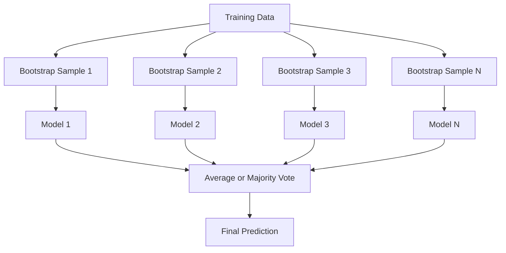
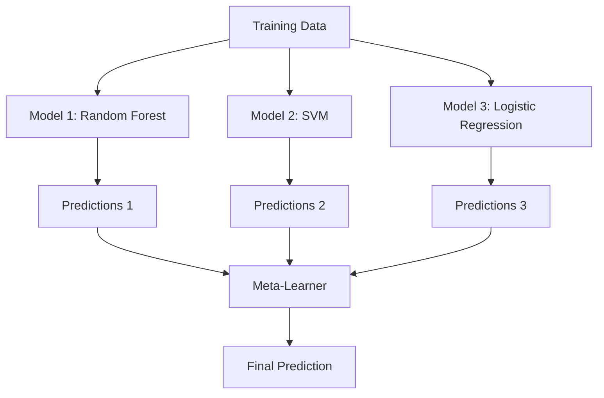

# Métodos de ensamblaje
# 集成方法 集成方法 集成方法 集成方法


> Un grupo de estudiantes débiles, combinados correctamente, se convierten en un aprendiz fuerte.

> Una serie de aprendices débiles, después de una serie de aprendices, se vuelven un equipo de aprendices fuertes.

**Type:** Build | **类型：** 构建
**Language:**¿ Qué pasa ?**语言：**Python
**Prerequisites:** Phase 2, Lesson 10 (Bias-Variance Tradeoff) | **前置知识：** Phase 2 第 10 课（偏差-方差权衡）
**Time:** ~120 minutes | **时间：** 约 120 分钟

## Objetivos de aprendizaje

- Implemente AdaBoost y gradiente de impulso desde cero y explique cómo el impulso secuencialmente reduce el sesgo
  Desde la implementación de AdaBoost y gradiente de aumento, explicar cómo aumentar                                                                                                                                                                                                                                                                                                                                                                                                                                                                                                             
- Construir un conjunto de embalaje y demostrar cómo la media de modelos descorrelados reduce la varianza sin aumentar el sesgo
  Construcción Bagging Integración, muestra cómo reducir la diferencia en caso de no aumentar la diferencia
- Comparar el embalaje, el refuerzo y la embalaje en términos de qué componente de error se destina cada método
  Comparar el embalaje, el refuerzo y el embalaje
- Evaluar la diversidad del conjunto y explicar por qué la precisión de la votación en la mayoría mejora con estudiantes débiles más independientes
  evaluación de la diversidad integrada, explica por qué la mayoría de los votos mejoran la precisión de los votos con más aprendizajes independientes


> **【中文解读】**
> 集成方法组合多个弱模型成一个强模型――Bagging(随机森林) Reducción de la diferencia, Boosting(XGBoost) Reducción de la diferencia――XGBoost/LightGBM en Kaggle 比赛中占据统治地位――金融风控、推系统广泛使用――

> **【拓展：集成方法在 Kaggle 和工业界的主导地位】**
> En el concurso de datos estructurados, el esquema de la lista de los 10 primeros es casi el 100% de uso de métodos de integración. El esquema ganador del Premio Netflix es la integración de 107 modelos. En la industria, el sistema de control de viento de pagos utiliza XGBoost + LightGBM para la integración. Amazon recomienda el uso de múltiples modelos.

## El problema es la introducción del problema

Un árbol de decisión es rápido de entrenar y fácil de interpretar, pero se sobrepasa. Un modelo lineal único se adapta a límites complejos. Podrías pasar días diseñando la arquitectura de modelo perfecta. O podrías combinar un montón de modelos imperfectos y obtener algo mejor que cualquiera de ellos individualmente.

> 单棵决策树训练快、易解释,但会过拟合――单个线性模型在复杂边界上不适应―― puedes pasar unos días diseñando una arquitectura de modelo perfecta, o juntar una pila de modelos imperfectos, obteniendo mejores resultados que cualquier otro―

Los métodos de ensamblaje hacen exactamente esto. Son la técnica más confiable para ganar competencias Kaggle en datos tablales, impulsan la mayoría de los sistemas de producción ML, e ilustran el compromiso de variación de sesgo en acción.

> El método de integración es exactamente lo que hace esto. Ellos ganan la competencia de datos de forma más fiable, impulsan la mayoría de los sistemas de producción de datos de máquina, y mostraron directamente el funcionamiento real de la medición de diferencia de diferencia.

> **【中文解读】**
> Principio central del método de integración: si varios modelos imperfectos cometen errores diferentes, su predicción media será más precisa. Bagging (como el bosque de paso) mediante el entrenamiento de modelos independientes para tomar medias para reducir la diferencia; Boosting (como AdaBoost, GBDT) mediante la formación en fila para que cada nuevo modelo corrija el error anterior para reducir la diferencia;

## El concepto central.

### Por qué trabajan los grupos

Supongamos que usted tiene N clasificadores independientes, cada uno con precisión p > 0.5.

> 假设你有N 个独立分类器, cada porcentaje de precisión es p > 0.5──la mayoría de los votos es:

```
P(majority correct) = sum over k > N/2 of C(N,k) * p^k * (1-p)^(N-k)
```

Para 21 clasificadores, cada uno con una precisión del 60%, la precisión de la mayoría de votos es de aproximadamente 74%. Con 101 clasificadores, aumenta a 84%.

> La tasa de precisión de 21 categorías es del 60%, la mayoría de los votantes tiene una tasa de precisión de 74% o más.

El requisito clave es **diversity**Si todos los modelos cometen los mismos errores, la combinación de ellos no ayuda nada.

> 关键要求是:**多样性**Si todos los modelos cometen los mismos errores, la combinación de ellos no ayuda.

- Diferentes subconjuntos de formación (de retardo)
  Diferente entrenamiento (en inglés)
- Subconjuntos de características diferentes (bosques aleatorios)
  Diferente de los rasgos y rasgos
- Corrección de errores secuenciales (impulso)
  顺序错误纠正(Boosting)
- Familias de modelos diferentes (estaclamiento)
  Diferente de modelos (en inglés)

### El producto se utiliza para la fabricación de productos de la industria de la industria de la industria de la industria de la industria de la industria de la industria de la industria de la industria de la industria de la industria de la industria de la industria de la industria de la industria de la industria de la industria de la industria de la industria de la industria de la industria de la industria de la industria de la industria de la industria de la industria de la industria de la industria de la industria de la industria de la industria de la industria de la industria de la industria de la industria de la industria de la industria de la industria de la industria de la industria de la industria de la industria de la industria de la industria de la industria de la industria de la industria de la industria de la industria de la Unión.

La embalaje crea diversidad mediante la formación de cada modelo en una muestra diferente de los datos de formación.

> Saqueando en cada uno de los diferentes modelos de entrenamiento para crear diversidad.



Se extrae una muestra de arranque con reemplazo de los datos originales, del mismo tamaño que el original. Aproximadamente el 63.2% de las muestras únicas aparecen en cada arranque. El 36.8% restante (muestras fuera de bolsa) proporcionan un conjunto de validación gratuito.

> El tamaño de la muestra de bootstrap se extrae de los datos originales, el mismo que el original. El 63,2% de las muestras de bootstrap se encuentran en cada bootstrap. El 36,8% restante de la muestra de bootstrap se encuentra en el archivo de datos.

El embalaje reduce la varianza sin aumentar mucho el sesgo. Cada árbol individual se sobrepone a su muestra de banda de arranque, pero el sobrepone es diferente para cada árbol, por lo que la media anula el ruido.

> El saqueo en el caso de no aumentar demasiado el parámetro reduce el parámetro. Cada árbol individual se adapta a su muestra de arranque, pero el parámetro de cada árbol es diferente, por lo que el promedio se va a borrar el ruido.

**Random Forests**Los árboles que se encuentran en el área de la planta de árboles se encuentran en el área de la planta de árboles que se encuentran en el área de árboles que se encuentran en el área de árboles.`sqrt(n_features)`para la clasificación y `n_features / 3`para la regresión.

> **随机森林**Es la composición de bolsas y una técnica extra: en cada división, sólo se considera un conjunto de características al azar. Esto obliga a la mayor diversidad entre los árboles.`sqrt(n_features)`, regreso a`n_features / 3`¿Qué es eso?

### El aumento de la capacidad de corrección de errores secuenciales

Cada nuevo modelo se centra en los ejemplos que los modelos anteriores se equivocaron.

> Mejorar el modelo de entrenamiento de la secuencia. Cada nuevo modelo se concentra en el modelo anterior.


El aumento reduce el sesgo. Cada nuevo modelo corrige los errores sistemáticos del conjunto hasta ahora. La predicción final es una suma ponderada de todos los modelos, donde los modelos mejores obtienen mayores pesos.

> El aumento reducir los prejuicios  Cada nuevo modelo corrige hasta ahora los errores sistémicos integrados  El pronóstico final es el aumento de peso de todos los modelos y, un modelo mejor obtiene un peso más alto 

La compensación: el impulso puede sobresalir si ejecutas demasiadas rondas, porque sigue ajustando ejemplos más duros, algunos de los cuales pueden ser ruidosos.

> 权衡: Si se ejecuta demasiado ruedas, el impulso puede ser demasiado adecuado, ya que continúa adaptándose a más ejemplos difíciles, algunos de ellos pueden ser ruidos.

### AdaBoost

AdaBoost (Aducción Adaptativa) fue el primer algoritmo de impulso práctico. Trabaja con cualquier estudiante base, típicamente los troncos de decisión (árboles de profundidad-1).

> AdaBoost (自适应提升) es el primer algoritmo de elevación práctico. Se aplica a cualquier base de aprendizaje, usualmente utiliza un árbol de decisión.

El algoritmo:

> 算法流程:

```
1. Initialize sample weights: w_i = 1/N for all i

2. For t = 1 to T:
   a. Train weak learner h_t on weighted data
   b. Compute weighted error:
      err_t = sum(w_i * I(h_t(x_i) != y_i)) / sum(w_i)
   c. Compute model weight:
      alpha_t = 0.5 * ln((1 - err_t) / err_t)
   d. Update sample weights:
      w_i = w_i * exp(-alpha_t * y_i * h_t(x_i))
   e. Normalize weights to sum to 1

3. Final prediction: H(x) = sign(sum(alpha_t * h_t(x)))
```

Los modelos con menos errores obtienen más alto alfa. las muestras mal clasificadas obtienen mayores pesos para que el siguiente modelo se concentre en ellos.

>  Los modelos con menor tasa de error obtienen un alfa más alto                                                                                                                                                                                                                                                      

### Un aumento gradual

El aumento de gradiente generaliza el aumento a funciones de pérdida arbitrarias. En lugar de volver a ponderar las muestras, se ajusta cada nuevo modelo a los residuos (gradiente negativo de la pérdida) del conjunto actual.

> 梯度提升将升升推广到任意损失函数──与重加权样本不同, se adaptará a cada nuevo modelo a la diferencia existente de la acumulación de los residuos ((la negatividad de la pérdida)──

```
1. Initialize: F_0(x) = argmin_c sum(L(y_i, c))

2. For t = 1 to T:
   a. Compute pseudo-residuals:
      r_i = -dL(y_i, F_{t-1}(x_i)) / dF_{t-1}(x_i)
   b. Fit a tree h_t to the residuals r_i
   c. Find optimal step size:
      gamma_t = argmin_gamma sum(L(y_i, F_{t-1}(x_i) + gamma * h_t(x_i)))
   d. Update:
      F_t(x) = F_{t-1}(x) + learning_rate * gamma_t * h_t(x)

3. Final prediction: F_T(x)
```

Para la pérdida cuadrada de error, los pseudo-residuos son sólo los residuos reales: `r_i = y_i - F_{t-1}(x_i)`Cada árbol se ajusta a los errores del conjunto anterior.

> 对于平方误差损失,伪残差就是实际残差:`r_i = y_i - F_{t-1}(x_i)` Cada árbol en realidad se integra antes de su adaptación 

La tasa de aprendizaje (crescimiento) controla cuánto contribuye cada árbol.

> La tasa de aprendizaje (en inglés) se reduce a control de la cantidad de contribuciones de cada árbol.

### XGBoost: Por qué domina los datos tabulares

XGBoost (eXtreme Gradient Boosting) es un aumento de gradiente con optimizaciones de ingeniería que lo hacen rápido, preciso y resistente a la sobremesa:

> XGBoost (极端梯度提升) es un aumento de la escala de optimización de un proyecto, que permite que sea rápido, preciso y resistente a la exceso de adaptación:

- **Regularized objective:**Las sanciones L1 y L2 sobre los pesos de las hojas impiden que los árboles individuales se sientan demasiado seguros
  **正则化目标**El peso de un árbol es demasiado alto .
- **Second-order approximation:**Utiliza tanto la primera como la segunda derivada de la pérdida, dando mejores decisiones divididas
  **二阶近似**: al mismo tiempo utilizando los números de pérdida de una y segunda etapa, dar una mejor decisión de división
- **Sparsity-aware splits:**Maneja valores faltantes de forma nativa aprendiendo la mejor dirección para los datos faltantes en cada división
  **稀疏感知分裂**: el tratamiento de la falta de valor, en cada punto de división de aprendizaje de la falta de datos de la mejor dirección
- **Column subsampling:**Como los bosques aleatorios, las muestras se caracterizan en cada división para la diversidad
  **列子采样**Como el bosque natural, cada división se hace con características para aumentar la diversidad.
- **Weighted quantile sketch:**Encuentra de manera eficiente puntos de división para características continuas en datos distribuidos
  **加权分位数草图**: Alto eficiencia en la búsqueda de puntos de división de características continuas en datos distribuidos
- **Cache-aware block structure:**Disposiciones de memoria optimizadas para líneas de caché de CPU
  **缓存感知块结构**: la estructura de memoria de la CPU 缓存行优化

Para los datos tablales, XGBoost (y su sucesor LightGBM) superan consistentemente a las redes neuronales. Esto no cambiará en ningún momento pronto. Si sus datos se ajustan a una tabla con filas y columnas, comience con el aumento de gradiente.

> Para el sistema de datos, XGBoost y su sucesor LightGBM) siempre mejorado que la red neuronal. En el corto plazo esto no cambiará.

### La acumulación (Meta-Learning)

La acumulación utiliza las predicciones de múltiples modelos base como características para un metaaprendizaje.

> La acumulación de modelos de predicción de múltiples bases será una característica de los módulos de aprendizaje.



El metaaprendizaje aprende qué modelo base confiar para qué entradas. Si el bosque aleatorio es mejor en ciertas regiones y el SVM en otras, el metaaprendizaje aprenderá a recorrer en consecuencia.

> Si el bosque en ciertas regiones es mejor, la SVM en otras regiones es mejor, el aprendizaje en el mundo se adaptará a la situación de los estudiantes.

Para evitar la fuga de datos, las predicciones del modelo base deben generarse a través de la validación cruzada en el conjunto de entrenamiento.

> Para evitar la fuga de datos, la predicción del modelo base debe pasar por la generación de pruebas de intercambio en el conjunto de entrenamiento. Nunca se debe entrenar el modelo base y generar características en el mismo dato.

### Votación

El conjunto más simple. Combina las predicciones directamente.

> Última edición de la edición de la edición de la edición de la edición de la edición de la edición de la edición de la edición de la edición de la edición de la edición de la edición de la edición de la edición de la edición de la edición de la edición de la edición de la edición de la edición de la edición de la edición de la edición de la edición de la edición de la edición de la edición de la edición de la edición de la edición de la edición de la edición de la edición de la edición de la edición de la edición de la edición de la edición de la edición de la edición de la edición de la edición de la edición de la edición de la edición de la edición de la edición de la edición de la edición de la edición de la edición de la edición de la edición de la edición de la edición de la edición de la edición de la edición de la edición de la edición de la edición de la edición de la edición de la edición de la edición de la edición de la edición de la edición de la edición de la edición de la edición de la edición de la edición de la edición de la edición de la edición de la edición de la edición de la edición de la edición de la edición de la edición de la edición de la edición de la edición de la edición de la edición de la edición de la edición de la edición de la edición de la edición de la edición de la edición de la edición de la edición de la edición de la edición de la edición de la edición de la edición de la edición de la edición de la edición de la edición de la edición de la edición de la edición de la edición de la edición de la edición de la edición de la edición de la edición de la edición de la edición de la edición de la edición de la edición de la edición de la edición de la edición de la edición de la edición de la edición de la edición de la edición de la edición de la edición de la edición de la edición de la edición de la edición de la edición de la edición de la edición de la edición de la edición de la edición de la edición de la edición de la edición de la edición de la edición de la edición de la edición de la edición de la edición de la edición de la edición de la edición de la edición de la edición de la edición de la edición de la edición de la edición de la edición de la edición de la edición de la edición de la edición de la edición de la edición de la edición de la edición de la edición de la edición de la

- **Hard voting:**La mayoría vota en las etiquetas de clase.
  **硬投票**: para los grupos de interés se realiza la mayoría de votos.
- **Soft voting:**Las probabilidades promedio previstas, elige la clase con la probabilidad promedio más alta.
  **软投票**Por lo general, es mejor porque utiliza información de confianza.

## Construye y realiza.

> **【中文解读】**
> Desde la realización de零三种集成方法:Bagging(并行训练独立模型取平均)、AdaBoost(串行训练加权投票)、Gradient Boosting(串行训练纠正残差)。El núcleo de AdaBoost es el aumento de peso de un modelo de la clase de errores de la muestra, Gradient Boosting Cada nuevo árbol se adapta a un árbol de la primera de los árboles de la diferencia。
```figure
f3-ensemble-average
```

## Construye el mismo

### Paso 1: Tómpulo de decisión (aprendizaje básico)

El código en `code/ensembles.py`Comenzamos con un tronco de decisión: un árbol con una sola división.

> `code/ensembles.py`El código medio comienza desde el principio de todo.

```python
class DecisionStump:
    def __init__(self):
        self.feature_idx = None
        self.threshold = None
        self.polarity = 1
        self.alpha = None

    def fit(self, X, y, weights):
        n_samples, n_features = X.shape
        best_error = float("inf")

        for f in range(n_features):
            thresholds = np.unique(X[:, f])
            for thresh in thresholds:
                for polarity in [1, -1]:
                    pred = np.ones(n_samples)
                    pred[polarity * X[:, f] < polarity * thresh] = -1
                    error = np.sum(weights[pred != y])
                    if error < best_error:
                        best_error = error
                        self.feature_idx = f
                        self.threshold = thresh
                        self.polarity = polarity

    def predict(self, X):
        n = X.shape[0]
        pred = np.ones(n)
        idx = self.polarity * X[:, self.feature_idx] < self.polarity * self.threshold
        pred[idx] = -1
        return pred
```

### Paso 2: AdaBoost desde cero

```python
class AdaBoostScratch:
    def __init__(self, n_estimators=50):
        self.n_estimators = n_estimators
        self.stumps = []
        self.alphas = []

    def fit(self, X, y):
        n = X.shape[0]
        weights = np.full(n, 1 / n)

        for _ in range(self.n_estimators):
            stump = DecisionStump()
            stump.fit(X, y, weights)
            pred = stump.predict(X)

            err = np.sum(weights[pred != y])
            err = np.clip(err, 1e-10, 1 - 1e-10)

            alpha = 0.5 * np.log((1 - err) / err)
            weights *= np.exp(-alpha * y * pred)
            weights /= weights.sum()

            stump.alpha = alpha
            self.stumps.append(stump)
            self.alphas.append(alpha)

    def predict(self, X):
        total = sum(a * s.predict(X) for a, s in zip(self.alphas, self.stumps))
        return np.sign(total)
```

### Paso 3: Aumentar gradualmente desde cero

```python
class GradientBoostingScratch:
    def __init__(self, n_estimators=100, learning_rate=0.1, max_depth=3):
        self.n_estimators = n_estimators
        self.lr = learning_rate
        self.max_depth = max_depth
        self.trees = []
        self.initial_pred = None

    def fit(self, X, y):
        self.initial_pred = np.mean(y)
        current_pred = np.full(len(y), self.initial_pred)

        for _ in range(self.n_estimators):
            residuals = y - current_pred
            tree = SimpleRegressionTree(max_depth=self.max_depth)
            tree.fit(X, residuals)
            update = tree.predict(X)
            current_pred += self.lr * update
            self.trees.append(tree)

    def predict(self, X):
        pred = np.full(X.shape[0], self.initial_pred)
        for tree in self.trees:
            pred += self.lr * tree.predict(X)
        return pred
```

### Paso 4: Compare con sklearn

El código verifica que nuestras implementaciones desde cero producen una precisión similar a la de sklearn `AdaBoostClassifier`y `GradientBoostingClassifier`, y compara todos los métodos uno al lado del otro.

> Codificación de la realidad de la realidad de la realidad de la realidad de la realidad de la realidad de la realidad de la realidad de la realidad de la realidad de la realidad de la realidad de la realidad de la realidad de la realidad de la realidad de la realidad de la realidad de la realidad de la realidad de la realidad de la realidad de la realidad de la realidad de la realidad de la realidad de la realidad de la realidad de la realidad de la realidad de la realidad de la realidad de la realidad de la realidad de la realidad de la realidad de la realidad de la realidad de la realidad de la realidad de la realidad de la realidad de la realidad de la realidad de la realidad de la realidad de la realidad de la realidad de la realidad de la realidad de la realidad de la realidad de la realidad de la realidad de la realidad de la realidad de la realidad de la realidad de la realidad de la realidad de la realidad de la realidad de la realidad de la realidad de la realidad de la realidad de la realidad de la realidad de la realidad de la realidad de la realidad de la realidad de la realidad de la realidad de la realidad de la realidad de la realidad de la realidad.`AdaBoostClassifier`Y `GradientBoostingClassifier`Paralelamente, el índice de precisión de la información se compara con el de la información.

## Usalo con el marco de ejecución

### Cuándo usar cada método

> ¿Cuándo usar cada método

| Method | Reduces | Best for | Watch out for |
|--------|---------|----------|---------------|
| Bagging / Random Forest | Variance | Noisy data, many features | Does not help with bias |
| AdaBoost | Bias | Clean data, simple base learners | Sensitive to outliers and noise |
| Gradient Boosting | Bias | Tabular data, competitions | Slow to train, easy to overfit without tuning |
| XGBoost / LightGBM | Both | Production tabular ML | Many hyperparameters |
| Stacking | Both | Getting last 1-2% accuracy | Complex, risk of overfitting meta-learner |
| Voting | Variance | Quick combination of diverse models | Only helps if models are diverse |

| 方法 | 减少 | 最适合 | 注意事项 |
|------|------|--------|---------|
| Bagging / 随机森林 | 方差 | 噪声数据、多特征 | 不能帮助偏差 |
| AdaBoost | 偏差 | 干净数据、简单基学习器 | 对异常值和噪声敏感 |
| 梯度提升 | 偏差 | 表格数据、竞赛 | 训练慢、不调参容易过拟合 |
| XGBoost / LightGBM | 两者 | 生产表格 ML | 超参数多 |
| Stacking | 两者 | 获取最后 1-2% 准确率 | 复杂、元学习器有过拟合风险 |
| Voting | 方差 | 快速组合多样模型 | 模型不多样时无帮助 |

### La pila de producción de datos tablales

Para la mayoría de los problemas de predicción tabular, este es el orden para intentar:

> Para la mayoría de los problemas de pronóstico, este es el orden de los intentos:

1. **LightGBM or XGBoost**con parámetros predeterminados
   **LightGBM 或 XGBoost**Usar el código de usuario
2. Tune n_estimatores, tasa de aprendizaje, profundidad máxima, peso min_child_
   调优 n_estimators、learning_rate、max_depth、min_child_weight
3. Si necesitas el último 0,5%, construye un conjunto de apilamiento con 3-5 modelos diversos
   Si se necesita el último 0,5%, construir 3-5 modelos de diferentes modelos de acumulación 集成
4. Utilice la validación cruzada en todo el proceso
   Todo el tiempo

Las redes neuronales en datos tablales son casi siempre peores que el aumento de gradientes, a pesar de los intentos continuos de investigación. TabNet, NODE y arquitecturas similares coinciden ocasionalmente, pero rara vez superan un XGBoost bien sintonizado.

> A pesar de los intentos de investigación, las redes neuronales en los datos de la estructura casi siempre no son tan elevadas. TabNet, NODE y estructuras similares pueden ser de forma ocasional, pero muy pocos pueden superar los XGBoost.

## Envíe el producto .

Esta lección produce`outputs/prompt-ensemble-selector.md`- una solicitud que le ayuda a elegir el método conjunto adecuado para un conjunto de datos dado. Describa sus datos (tamaño, tipos de características, nivel de ruido, equilibrio de clases) y el problema que está resolviendo. La solicitud recorre una lista de verificación de decisiones, recomienda un método, sugiere iniciar hiperparámetros y advierte de errores comunes para ese método. También produce `outputs/skill-ensemble-builder.md`con la guía completa de selección.

> 本课产 出  `outputs/prompt-ensemble-selector.md` Un consejo para ayudarle a elegir el método de integración correcto para un conjunto de datos determinado.  Describir su dato (la dimensión, el tipo de características, el nivel de ruido, el equilibrio de clases) y el problema que está resolviendo.  Este consejo le guiará a tomar una lista de decisiones, recomendar un método, sugerir que inicie un superparámetro, y advertir de errores comunes del método.`outputs/skill-ensemble-builder.md`,incluye la dirección de selección completa.

## Los ejercicios.

1. Modificar la implementación de AdaBoost para rastrear la precisión del entrenamiento después de cada ronda.
   1. Modificar AdaBoost  lograr la tasa de precisión de la formación de seguimiento por ronda posterior  dibujar la tasa de precisión frente al número de calculadores  ¿Cuándo se recibe?

2. Implemente un bosque aleatorio desde cero agregando una característica de submuestreo aleatorio al árbol de regresión.`max_features=sqrt(n_features)`Comparar la reducción de variación con un solo árbol.
   2. Desde el 0o de la realización de los bosques de la naturaleza: en el regreso de los árboles, se añade a los mismos los rasgos de la naturaleza.`max_features=sqrt(n_features)`, promedio de previsión, en comparación con un árbol,

3. En la implementación de incrementos de gradiente, añadir parada temprana: rastrear la pérdida de validación después de cada ronda y detenerse cuando no ha mejorado durante 10 rondas consecutivas. ¿Cuántos árboles necesita realmente?
   3. En la actualidad, el aumento de la tasa de crecimiento de los árboles en la región de la región de la región de la región de la región de la región de la región de la región de la región de la región de la región de la región de la región de la región de la región de la región de la región de la región de la región de la región de la región de la región de la región de la región de la región de la región de la región de la región de la región de la región de la región de la región de la región de la región de la región de la región de la región de la región de la región de la región de la región de la región de la región de la región de la región de la región de la región de la región de la región de la región de la región de la región de la región de la región de la región de la región de la región de la región de la región de la región de la región de la región de la región de la región de la región de la región de la región de la región de la región de la región de la región de la región de la región de la región de la región de la región de la región de la región de la región de la región de la región de la región de la región de la región de la región de la región de la región de la región de la región de la región de la región de la región de la región de la región de la región de la región de la región de la región de la región de la región de la región de la región de la región de la región de la región de la región de la región de la región de la región de la región de la región de Sudán.

4. Construir un conjunto de apilamiento con tres modelos básicos (regresión logística, árbol de decisión, k-vizinos más cercanos) y un meta-aprendizaje de regresión logística. Utilice la validación cruzada de 5 veces para generar meta-funciones. Comparar con cada modelo base solo.
   4. Construir tres modelos básicos ([[Logic regreso]], [[Decision tree]], KNN) y un modelo lógico regreso de un aprendizaje 集成──con 5 折交叉验证生成元特征──与每个基础模型单独比较──

5. ejecuta XGBoost en el mismo conjunto de datos con parámetros predeterminados. compara su precisión con tu aumento de gradiente desde cero. tiempo ambos. ¿Cuán grande es la diferencia de velocidad?
   5. En el mismo conjunto de datos, se ejecuta con parámetros predeterminados XGBoost. ¿Cuál es la diferencia de velocidad entre los dos?

> **【中文解读】**
> AdaBoost(autoadaptación) proceso central: entrenar un fraco分类器→ calcular errores tasa→ aumentar el peso de la muestra de la clase errónea→ entrenar un fraco分类器下下──. El pronóstico final es el aumento del voto, el peso y el porcentaje de errores de todos los fracos分类器 en contrapartidos.

> **【拓展：XGBoost、LightGBM、CatBoost——梯度提升树三巨头】**
> XGBoost(eXtreme Gradient Boosting) fue desarrollado en 2014 por Chen天奇, introdujo la normalización、 rara疏数据处理和并行计算, convirtiéndose en un instrumento de clasificación de la competencia Kaggle 竞赛的标配工具──LightGBM(Microsoft,2017) utilizando estrategias de división y crecimiento de hojas basadas en cuadros rectos(hojeo-wise), velocidad de entrenamiento superior a XGBoost 快 5-10 倍──CatBoost(Yandex,2018) características de clase de procesamiento automático, sin necesidad de código manual──Tres personas en diferentes escenarios tienen ventajas: pequeños datos XGBoost, grandes datos LightGBM, clases de características con múltiples características CatBoost──

## Términos clave .

| Term | What people say | What it actually means |
|------|----------------|----------------------|
| Bagging | "Train on random subsets" | Bootstrap aggregating: train models on bootstrap samples, average predictions to reduce variance |
| Boosting | "Focus on hard examples" | Train models sequentially, each correcting errors of the ensemble so far, to reduce bias |
| AdaBoost | "Reweight the data" | Boosting via sample weight updates; misclassified points get higher weight for the next learner |
| Gradient boosting | "Fit the residuals" | Boosting via fitting each new model to the negative gradient of the loss function |
| XGBoost | "The Kaggle weapon" | Gradient boosting with regularization, second-order optimization, and systems-level speed tricks |
| Stacking | "Models on top of models" | Use predictions of base models as input features for a meta-learner |
| Random forest | "Many randomized trees" | Bagging with decision trees, adding random feature subsampling at each split for diversity |
| Ensemble diversity | "Make different mistakes" | Models must be uncorrelated in their errors for the ensemble to improve over individuals |
| Out-of-bag error | "Free validation" | Samples not in a bootstrap draw (~36.8%) serve as a validation set without needing a holdout |

## Más Leer más Leer más

- [Schapire & Freund: Boosting: Foundations and Algorithms](https://mitpress.mit.edu/9780262526036/)-- el libro de los creadores de AdaBoost
  [Schapire & Freund: Boosting: Foundations and Algorithms](https://mitpress.mit.edu/9780262526036/)- AdaBoost 创始人的著作
- [Friedman: Greedy Function Approximation: A Gradient Boosting Machine (2001)](https://statweb.stanford.edu/~jhf/ftp/trebst.pdf)-- el papel de aumento de gradiente original
  [Friedman: Greedy Function Approximation: A Gradient Boosting Machine (2001)](https://statweb.stanford.edu/~jhf/ftp/trebst.pdf)- 梯度提升 original artículo
- [Chen & Guestrin: XGBoost (2016)](https://arxiv.org/abs/1603.02754)-- el papel XGBoost
  [Chen & Guestrin: XGBoost (2016)](https://arxiv.org/abs/1603.02754)- XGBoost 论文
- [Wolpert: Stacked Generalization (1992)](https://www.sciencedirect.com/science/article/abs/pii/S0893608005800231)-- el papel de empilación original
  [Wolpert: Stacked Generalization (1992)](https://www.sciencedirect.com/science/article/abs/pii/S0893608005800231)- Aplicación de los primeros
- [scikit-learn Ensemble Methods](https://scikit-learn.org/stable/modules/ensemble.html)-- referencia práctica
  [scikit-learn 集成方法](https://scikit-learn.org/stable/modules/ensemble.html)-                                                                                                                                                                                                                                                                                                                                                                                                                                                                                                                             
