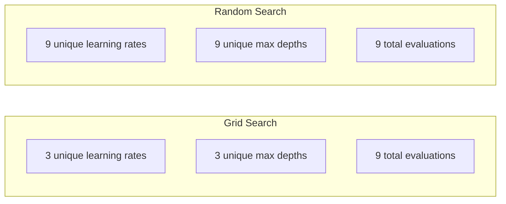
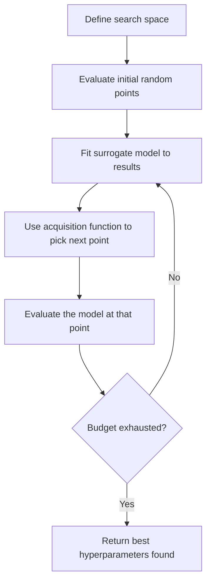
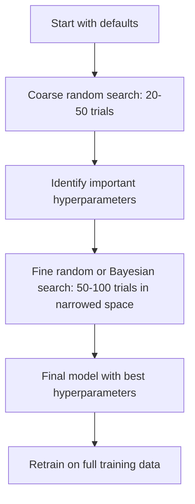
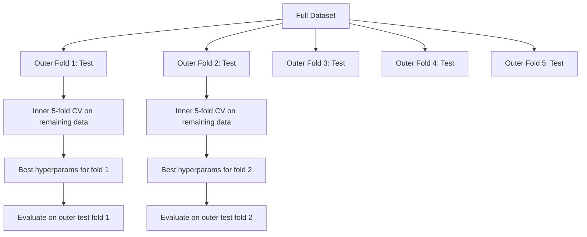

# El ajuste de los hiperparámetros
# 超参数调优


> Los hiperparámetros son los botones que se giran antes de comenzar el entrenamiento.

> Los superparámetros son los primeros en entrenar.

**Type:** Build | **类型：** 构建
**Language:**¿ Qué pasa ?**语言：**Python
**Prerequisites:** Phase 2, Lesson 11 (Ensemble Methods) | **前置知识：** Phase 2 第 11 课（集成方法）
**Time:** ~90 minutes | **时间：** 约 90 分钟

## Objetivos de aprendizaje

- Implemente la búsqueda en cuadrícula, la búsqueda aleatoria y la optimización bayesiana desde cero y compare su eficiencia de muestra
  Desde la búsqueda de red de implementación cero, búsqueda automática y optimización de la base, comparar la eficiencia de la muestra de ellos
- Explica por qué la búsqueda aleatoria supera la búsqueda en cuadrícula cuando la mayoría de los hiperparámetros tienen una dimensionalidad efectiva baja
   Explicar por qué la búsqueda de azar en la mayoría de los superparámetros válidos dimensión baja cuando es mejor que la búsqueda de red
- Construir un bucle de optimización bayesiana utilizando un modelo sustituto y la función de adquisición para guiar la búsqueda
  Utiliza modelos de agencia y funciones de captación para construir un ciclo de optimización de base para guiar la búsqueda
- Diseñar una estrategia de ajuste de hiperparámetros que evite el sobreajuste del conjunto de validación mediante una validación cruzada adecuada
   diseño a través de un conveniente intercambio de verificación para evitar que los grupos de verificación sean demasiado adecuados


> **【中文解读】**
> 超参数 es un parámetro establecido en el entrenamiento del modelo (por ejemplo, el índice de aprendizaje, la profundidad del árbol), no puede ser obtenido de datos.

> **【拓展：超参数调优在大模型训练中的重要性】**
> El entrenamiento de GPT-4 involucra docenas de superparámetros (la regulación de la tasa de aprendizaje, el tamaño del lote, la disminución del peso, la tasa de abandono, etc.), el costo de cada entrenamiento completo es de aproximadamente 1 mil millones de dólares, imposible de usar en la búsqueda en la red.

## El problema es la introducción del problema

El modelo de aumento de gradiente tiene una tasa de aprendizaje, número de árboles, profundidad máxima, muestras min por hoja, ratio de submuestras y proporción de muestras de columnas. Eso es seis hiperparámetros. Si cada uno tiene 5 valores razonables, la cuadrícula tiene 5^6 = 15.625 combinaciones.

> Su modelo de escalada tiene un índice de aprendizaje, el número de árboles, la mayor profundidad, el número de muestras mínimas de los nodos, la tasa de sub-muestreo y la tasa de recolección de la fila. Hay seis superparámetros. Si cada uno tiene 5 valores razonables, la red tiene 5^6 = 15.625 conjuntos.

La búsqueda de red es el enfoque obvio y el peor a escala. La búsqueda aleatoria funciona mejor con menos computación. La optimización bayesiana funciona aún mejor aprendiendo de evaluaciones pasadas. Saber qué estrategia usar y qué hiperparámetros realmente importan, ahorra días de tiempo de GPU desperdiciado.

> 网格搜索 (en inglés: 网格搜索) es el método más evidente, también el peor de las grandes dimensiones.

> **【中文解读】**
> 超参数调优的核心矛盾:搜索空间大但每次评估成本高――网格搜索穷举所有组合,成本指数增长;随机搜索随机采样,在同样的预算下探索更多区域;贝叶斯优化概率模型(高斯过程) 预测哪些区域可能更好,智能地选择下一个评估点―― en la práctica, primero, con búsqueda随机缩小范围,再使用贝叶斯优化精细搜――

## El concepto central.

### Parámetros frente a hiperparámetros

Los parámetros se aprenden durante el entrenamiento (pesos, sesgos, umbrales divididos).

> 参数在训练中学习(权重、偏置、分离值) ――超参数在训练开始前设定,控制学习如何发生──

| Hyperparameter | What it controls | Typical range |
|---------------|-----------------|---------------|
| Learning rate | Step size per update | 0.001 to 1.0 |
| Number of trees/epochs | How long to train | 10 to 10,000 |
| Max depth | Model complexity | 1 to 30 |
| Regularization (lambda) | Overfitting prevention | 0.0001 to 100 |
| Batch size | Gradient estimation noise | 16 to 512 |
| Dropout rate | Fraction of neurons dropped | 0.0 to 0.5 |

| 超参数 | 控制什么 | 典型范围 |
|--------|---------|---------|
| 学习率 | 每次更新的步长 | 0.001 到 1.0 |
| 树的数量/epoch 数 | 训练多久 | 10 到 10,000 |
| 最大深度 | 模型复杂度 | 1 到 30 |
| 正则化 (lambda) | 防止过拟合 | 0.0001 到 100 |
| 批量大小 | 梯度估计噪声 | 16 到 512 |
| Dropout 率 | 丢弃的神经元比例 | 0.0 到 0.5 |

### Buscar en la red

La búsqueda de red evalúa cada combinación de valores especificados. Es exhaustivo y fácil de entender, pero se escala exponencialmente con el número de hiperparámetros.

> 网格搜索评估指定值的每个组合──它尽尽尽且易懂,但随着超参数数指数的数级增长──

```
Grid for 2 hyperparameters:

  learning_rate: [0.01, 0.1, 1.0]
  max_depth:     [3, 5, 7]

  Evaluations: 3 x 3 = 9 combinations

  (0.01, 3)  (0.01, 5)  (0.01, 7)
  (0.1,  3)  (0.1,  5)  (0.1,  7)
  (1.0,  3)  (1.0,  5)  (1.0,  7)
```

La búsqueda de red tiene un defecto fundamental: si un hiperparámetro importa y el otro no, la mayoría de las evaluaciones se desperdician. Obtienes solo 3 valores únicos del parámetro importante de 9 evaluaciones.

> 网格搜索 tiene una deficiencia fundamental: si un parámetro es importante y otro no, la mayoría de las evaluaciones se pierden.

### Buscar al azar

En la búsqueda aleatoria de muestras de hiperparámetros de distribuciones en lugar de una cuadrícula. con el mismo presupuesto de 9 evaluaciones, obtienes 9 valores únicos de cada hiperparámetro.

> Cuando buscas de la distribución, tomas superparámetros en lugar de usar la red. En el mismo presupuesto de 9 evaluaciones, obtienes 9 valores únicos de cada superparámetros.



Por qué la red de la ventaja aleatoria (Bergstra & Bengio, 2012):

> ¿Por qué siempre? (Bergstra & Bengio, 2012):

- La mayoría de los hiperparámetros tienen una dimensionalidad efectiva baja. Solo 1-2 de los 6 hiperparámetros suelen importar para un problema dado.
  La mayoría de los superparámetros tienen una dimensión efectiva baja. De los 6 superparámetros, solo 1-2 son importantes para un determinado problema.
- Evaluación de residuos de búsqueda en red en dimensiones no importantes.
  网格搜索在不重要维度上浪费评估──
- La búsqueda aleatoria cubre las dimensiones importantes más densamente para el mismo presupuesto.
  随机搜索在同样的预算下更密集地覆盖重要维度──
- En 60 ensayos aleatorios, tienes un 95% de posibilidades de encontrar un punto dentro del 5% del óptimo (si existe uno en el espacio de búsqueda).
  En 60 veces de ensayo al azar, tienes un 95% de probabilidades de encontrar el valor de entre el 5% y el 5% si hay el mejor punto en el espacio de búsqueda)

### Optimización bayesiana

La búsqueda aleatoria ignora los resultados. No aprende que las altas tasas de aprendizaje causan divergencia o que la profundidad 3 supera consistentemente la profundidad 10. La optimización bayesiana utiliza evaluaciones pasadas para decidir dónde buscar a continuación.

> 随机搜索忽略结果──它不会学到高学习率导致发散或深度 3 总是优于深度 10──贝叶斯优化利用过去的评估来决定下一步搜索哪里──



Los dos componentes clave:

**Surrogate model:**Un modelo barato para evaluar (generalmente un proceso gaussiano) que se aproxima a la función objetiva costosa. Da tanto una predicción como una estimación de incertidumbre en cualquier punto del espacio de búsqueda.

> **代理模型：**Un modelo de evaluación barata (normalmente proceso de alta calidad), es una función de objetivo de precio cercano.

**Acquisition function:**Decide dónde evaluar a continuación, equilibrando la explotación (buscar cerca de los puntos buenos conocidos) y la exploración (buscar donde la incertidumbre es alta).

> **采集函数：**通过平衡开发 (Balancing) 搜索已知好点附近) y explorar (Balancing) 搜索不确定性高的区域) 来决定下一步评估哪里──常见选择:

- **Expected Improvement (EI):**¿Cuánta mejora en comparación con la mejor actual esperamos en este punto?
  **期望改进 (EI)：**¿Cuántos resultados mejoramos en este punto que esperamos?
- **Upper Confidence Bound (UCB):**Una predicción más un múltiplo de incertidumbre.
  **上置信界 (UCB)：**预测加上不确定性的倍数──更高的 UCB significa tener un futuro o no explorado──
- **Probability of Improvement (PI):**¿Cuál es la probabilidad de que este punto sea mejor que el actual?
  **改进概率 (PI)：**¿Cuál es la probabilidad de que esto sea superior al mejor resultado actual?

La optimización bayesiana suele encontrar mejores hiperparámetros que la búsqueda aleatoria con 2-5 veces menos evaluaciones.

> La optimización de Bayes suele utilizar 2-5 veces menos de las veces de evaluación para encontrar mejores superparámetros que la búsqueda de forma casual.

> **【中文解读】**
> 贝叶斯优化是最智能调整方法――核心组件:代理模型(usually with高斯过程拟合目标函数) y采集函数(equilibrio" explorar región desconocida" y "utilizar la región buena conocida")―― cada evaluación después actualizar el modelo de agente, la función de采集决定下一个评估点―― en comparación con la búsqueda casual,贝叶斯 optimiza con 2-5 veces menos de evaluaciones en el número de veces que se puede encontrar un mejor supervalor, para el modelo de alto costo de entrenamiento tiene un precio especial―

> **【拓展：Optuna——自动化超参数调优的工业标准】**
> Optuna es un marco de optimización de superparámetros de redes preferidas de Japón desarrollado, ampliamente utilizado en Kaggle 竞赛和工业项目──它支持贝叶斯优化(TPE 采样器) 剪枝(自动停止不承诺的试验) 分布式搜索──DeepMind's AlphaGo 和 Google's Vizier también utiliza técnicas similares de optimización de贝叶斯 para mejorar los superparámetros de su propio sistema──En LLM 微调中, Optuna se utiliza a menudo para buscar la tasa de aprendizaje, el tamaño del lote, el rango de LoRA, etc.

### Pararse temprano

No todas las carreras de entrenamiento necesitan terminar. Si una configuración es claramente mala después de 10 épocas, detenerlo y seguir adelante. Esto es detenerse temprano en el contexto de la búsqueda de hiperparámetros.

> No es que cada entrenamiento necesite ser completado. Si una configuración es obviamente mala después de 10 épocas, deja de hacerlo.

Estrategias:
- **Patience-based:**Detenerse si la pérdida de validación no ha mejorado durante N épocas consecutivas
  **基于耐心：**Si la pérdida de pruebas continuó en la era de la no mejora se detuvo
- **Median pruning:**Detenerse si el resultado intermedio del ensayo es peor que la media de los ensayos completados en el mismo paso
  **中位数剪枝：**Si el resultado medio del experimento se detiene en comparación con el paso que se ha completado el experimento
- **Hyperband:**Asignar pequeños presupuestos a muchas configuraciones, luego aumentar progresivamente el presupuesto para los mejores
  **Hyperband：**Debería asignarse un pequeño presupuesto a muchas asignaciones y luego incrementar gradualmente el presupuesto de la mejor asignación

La hipervínculo es particularmente eficaz. Inicia 81 configuraciones con 1 época cada una, mantiene el tercio superior, les da 3 épocas, mantiene el tercio superior, etc. Esto encuentra buenas configuraciones 10-50 veces más rápido que evaluar todas las configuraciones para el presupuesto completo.

> La hipervínculo 特别有效── es de 81 configuraciones de cada una de las épocas 开始,保留前三分之一,给它们 3 时代,再保留前三分之一,以此类推── esto comparó con la evaluación del presupuesto completo de todas las configuraciones 快 10-50 veces encontrar una buena configuración──

### Programadores de tasas de aprendizaje

La velocidad de aprendizaje es casi siempre el hiperparámetro más importante.

> El índice de aprendizaje es casi siempre el superparámetro más importante.

| Scheduler | Formula | When to use |
|-----------|---------|-------------|
| Step decay | Multiply by 0.1 every N epochs | Classic CNN training |
| Cosine annealing | lr * 0.5 * (1 + cos(pi * t / T)) | Modern default |
| Warmup + decay | Linear increase then cosine decay | Transformers |
| One-cycle | Increase then decrease over one cycle | Fast convergence |
| Reduce on plateau | Reduce by factor when metric stalls | Safe default |

| 调度器 | 公式 | 何时使用 |
|--------|------|---------|
| 阶梯衰减 | 每 N 个 epoch 乘以 0.1 | 经典 CNN 训练 |
| 余弦退火 | lr * 0.5 * (1 + cos(pi * t / T)) | 现代默认 |
| 预热+衰减 | 线性增加后余弦衰减 | Transformer |
| 单周期 | 一个周期内先增后减 | 快速收敛 |
| 平台期衰减 | 指标停滞时按因子减小 | 安全默认 |

### Importancia de los hiperparámetros

La investigación sobre bosques aleatorios (Probst et al., 2019) y el aumento de gradientes muestra patrones consistentes:

> No todos los superparámetros son iguales. En cuanto a los bosques de probabilidad, etc., 2019, y el estudio de la escalada de elevación, se muestra un modelo consistente:

**High importance:**
- Rate de aprendizaje (siempre sintonizar primero)
  El precio de aprendizaje es de 1.
- Número de estimadores/epopenas (utilice el detener temprano en lugar de ajustar)
  估计器数量 / epoch 数(用早停代替调优)
- Fuerza de regularización
  La fuerza de la normalización

**Medium importance:**
- Profundidad máxima / número de capas
  Número máximo de profundidad / nivel
- Minimas muestras por hoja / desintegración de peso
  叶节点最小样本数 / 权重衰减
- Proporción de submuestras
  Porcentaje de

**Low importance:**
- Max características (para bosques aleatorios)
  El mayor número de caracteres (随机森林)
- Selección de la función de activación específica
  具体激活函数选择
- Tamaño del lote (dentro de un rango razonable)
  批量大小(在合理范围内)

Primero sintonice las importantes, deja el resto por defecto.

> Primero, lo importante, lo demás, mantenerse en la memoria.

### Estrategia práctica



El flujo de trabajo concreto:

> 具体工作流:

1. **Start with library defaults.**Son elegidos por profesionales experimentados y a menudo son el 80% del camino.
   **从库默认值开始。**Se han seleccionado por profesionales experimentados, y suelen alcanzar el 80% de los resultados.
2. **Coarse random search.**Largos rangos, pruebas de 20 a 50 minutos, para matar a los malos, es rápido.
   **粗粒度随机搜索。**宽范围,20-50 次试验──用早停快速终止差的运行──
3. **Analyze results.**¿Qué hiperparámetros se correlacionan con el rendimiento?
   **分析结果。**¿Qué superparámetros están relacionados con el rendimiento?
4. **Fine search.**Optimización bayesiana o búsqueda aleatoria enfocada en el espacio estrecho. 50-100 ensayos.
   **精细搜索。**En el espacio reducido en el que se utiliza la optimización de la base o el enfoque de búsqueda.
5. **Retrain on all training data**con los mejores hiperparámetros encontrados.
   Usando los mejores superparámetros en**所有训练数据上重新训练**¿Qué es eso?

### Integrar la validación cruzada

El ajuste de los hiperparámetros en una sola división de validación es arriesgado. Los mejores hiperparámetros pueden encajar en el pliegue de validación específico. La validación cruzada en cuclillas resuelve esto mediante el uso de dos bucles:

> En un solo test se puede clasificar el mejor superparámetro en un determinado test.

- **Outer loop**(evaluación): divide los datos en tren+val y prueba.
  **外循环**(evaluación): los datos se dividen en entrenamiento+verificación y prueba.
- **Inner loop**(ajuste): divide tren+val en tren y val. Encuentra los mejores hiperparámetros.
  **内循环**(调优):将训练+验证分为训练和验证―― encontrar el mejor super参数――



Cada pliegue exterior encuentra sus propios mejores hiperparámetros de forma independiente.

> Cada extradofiguración independiente encuentra su propio mejor superparámetro.

Con sklearn:

```python
from sklearn.model_selection import cross_val_score, GridSearchCV
from sklearn.ensemble import GradientBoostingRegressor

inner_cv = GridSearchCV(
    GradientBoostingRegressor(),
    param_grid={
        "learning_rate": [0.01, 0.05, 0.1],
        "max_depth": [2, 3, 5],
        "n_estimators": [50, 100, 200],
    },
    cv=5,
    scoring="neg_mean_squared_error",
)

outer_scores = cross_val_score(
    inner_cv, X, y, cv=5, scoring="neg_mean_squared_error"
)

print(f"Nested CV MSE: {-outer_scores.mean():.4f} +/- {outer_scores.std():.4f}")
```

Esto es caro (5 plegas exteriores x 5 plegas internas x 27 puntos de cuadrícula = 675 puntos de cuadrícula se ajusta al modelo), pero le da una estimación de rendimiento confiable.

> Esto es muy caro ((5 extrafotos x 5 interiorfotos x 27 网格点 = 675 veces modelo adaptado), pero te da una estimación de rendimiento confiable.

### Consejos prácticos

**Start with the learning rate.**Es siempre el hiperparámetro más importante para los métodos basados en gradientes. Una mala tasa de aprendizaje hace que todo lo demás sea irrelevante.

> **从学习率开始。**Para el método basado en la escala, siempre es el superparámetro más importante. La mala tasa de aprendizaje hace que todo lo demás sea irrelevante.

**Use log-uniform distributions for learning rate and regularization.**La diferencia entre 0.001 y 0.01 es tan importante como la diferencia entre 0.1 y 1.0.

> **对学习率和正则化使用对数均匀分布。**La diferencia entre 0.001 y 0.01 y la diferencia entre 0.1 y 1.0 es igualmente importante.

**Use early stopping instead of tuning n_estimators.**Para impulsar y redes neuronales, fije n_estimatores o épocas en alto y deje que la parada temprana decida cuándo parar.

> **用早停代替调优 n_estimators。**对于提升和神经网络,将 n_estimators或 epoch 数设高,让早停决定何时停止── esto elimina de la búsqueda un superparámetro──

**Budget allocation.**Gasta el 60% de tu presupuesto de sintonización en los dos hiperparámetros más importantes. Gasta el 40% restante en todo lo demás. Los dos primeros representan la mayor parte de la variación de rendimiento.

> **预算分配。**El 60% del presupuesto se destina a los dos principales superparámetros anteriores. El 40% restante se destina a todos los demás parámetros.

**Scale matters.**Nunca busque el tamaño del lote en una escala de registro (16, 32, 64 son buenas).

> **尺度很重要。**永遠不要在數量尺度上搜索批量大小 ((16、32、64 就行) ∼ Siempre en數量尺度搜索学习率── siempre en數量尺度搜索学习率── siempre en la búsqueda de la distribución y el modo en que la búsqueda se ajusta al modelo de impacto de los superparámetros──

| Model Type | Top Hyperparameters | Recommended Search | Budget |
|-----------|--------------------|--------------------|--------|
| Random Forest | n_estimators, max_depth, min_samples_leaf | Random search, 50 trials | Low (fast training) |
| Gradient Boosting | learning_rate, n_estimators, max_depth | Bayesian, 100 trials + early stopping | Medium |
| Neural Network | learning_rate, weight_decay, batch_size | Bayesian or random, 100+ trials | High (slow training) |
| SVM | C, gamma (RBF kernel) | Grid on log scale, 25-50 trials | Low (2 params) |
| Lasso/Ridge | alpha | 1D search on log scale, 20 trials | Very low |
| XGBoost | learning_rate, max_depth, subsample, colsample | Bayesian, 100-200 trials + early stopping | Medium |

**When in doubt:**Buscar al azar con 2 veces el número de hiperparámetros como ensayos (por ejemplo, 6 hiperparámetros = 12 ensayos más mínimo).

> **拿不准时：**随机搜索, el número de pruebas es 2 veces mayor que el número de superparámetros (como 6 超参数 = al menos 12 veces) ⋅ Usted se sorprenderá de 50 veces de los ensayos de las búsquedas de azar más frecuentemente vencer精心设计的网格搜索──

## Construye y realiza.

> **【中文解读】**
> Desde la realización de la búsqueda en la red cero, la búsqueda en la red y la optimización de Bayes, y con el mismo conjunto de datos en comparación con los resultados de los tres.

> **【拓展：Hyperband 和 ASHA——大规模超参数搜索的加速器】**
> El concepto central de los algoritmos de hipervínculo es: primero se asignan cantidades de recursos (como una época), luego se elimina el rendimiento de los resultados, luego se obtienen más recursos.
```figure
k-fold-cv
```

## Construye el mismo

### Paso 1: Buscar desde cero

El código en `code/tuning.py`Implementa búsqueda en cuadrícula, búsqueda aleatoria y un simple optimizador bayesiano desde cero.

> `code/tuning.py`El código medio ha logrado desde cero la búsqueda de red, la búsqueda automática y el simple optimizador de Bayes.

```python
def grid_search(model_fn, param_grid, X_train, y_train, X_val, y_val):
    keys = list(param_grid.keys())
    values = list(param_grid.values())
    best_score = -float("inf")
    best_params = None
    n_evals = 0

    for combo in itertools.product(*values):
        params = dict(zip(keys, combo))
        model = model_fn(**params)
        model.fit(X_train, y_train)
        score = evaluate(model, X_val, y_val)
        n_evals += 1

        if score > best_score:
            best_score = score
            best_params = params

    return best_params, best_score, n_evals
```

### Paso 2: Buscar al azar desde cero

```python
def random_search(model_fn, param_distributions, X_train, y_train,
                  X_val, y_val, n_iter=50, seed=42):
    rng = np.random.RandomState(seed)
    best_score = -float("inf")
    best_params = None

    for _ in range(n_iter):
        params = {k: sample(v, rng) for k, v in param_distributions.items()}
        model = model_fn(**params)
        model.fit(X_train, y_train)
        score = evaluate(model, X_val, y_val)

        if score > best_score:
            best_score = score
            best_params = params

    return best_params, best_score, n_iter
```

### Paso 3: Optimización bayesiana (simplificada)

La idea principal: ajustar un proceso gaussiano a pares observados (hiperparámetro, puntaje), luego usar una función de adquisición para decidir dónde buscar a continuación.

> 核心思想:将高斯过程拟合到观察到的(超参数,分数)对, luego con la función de captación decide el siguiente paso mirar dónde──

```python
class SimpleBayesianOptimizer:
    def __init__(self, search_space, n_initial=5):
        self.search_space = search_space
        self.n_initial = n_initial
        self.X_observed = []
        self.y_observed = []

    def _kernel(self, x1, x2, length_scale=1.0):
        dists = np.sum((x1[:, None, :] - x2[None, :, :]) ** 2, axis=2)
        return np.exp(-0.5 * dists / length_scale ** 2)

    def _fit_gp(self, X_new):
        X_obs = np.array(self.X_observed)
        y_obs = np.array(self.y_observed)
        y_mean = y_obs.mean()
        y_centered = y_obs - y_mean

        K = self._kernel(X_obs, X_obs) + 1e-4 * np.eye(len(X_obs))
        K_star = self._kernel(X_new, X_obs)

        L = np.linalg.cholesky(K)
        alpha = np.linalg.solve(L.T, np.linalg.solve(L, y_centered))
        mu = K_star @ alpha + y_mean

        v = np.linalg.solve(L, K_star.T)
        var = 1.0 - np.sum(v ** 2, axis=0)
        var = np.maximum(var, 1e-6)

        return mu, var

    def _expected_improvement(self, mu, var, best_y):
        sigma = np.sqrt(var)
        z = (mu - best_y) / (sigma + 1e-10)
        ei = sigma * (z * norm_cdf(z) + norm_pdf(z))
        return ei

    def suggest(self):
        if len(self.X_observed) < self.n_initial:
            return sample_random(self.search_space)

        candidates = [sample_random(self.search_space) for _ in range(500)]
        X_cand = np.array([to_vector(c) for c in candidates])
        mu, var = self._fit_gp(X_cand)
        ei = self._expected_improvement(mu, var, max(self.y_observed))
        return candidates[np.argmax(ei)]

    def observe(self, params, score):
        self.X_observed.append(to_vector(params))
        self.y_observed.append(score)
```

El GP sustitutivo da dos cosas en cada punto candidato: una puntuación prevista (mu) y una incertidumbre (var).

> El agente GP en cada punto de candidato da dos cosas: predicción de la cantidad de puntos de probabilidad y la incertidumbre de probabilidad de probabilidad de probabilidad de probabilidad de probabilidad de probabilidad de probabilidad de probabilidad de probabilidad de probabilidad de probabilidad de probabilidad de probabilidad de probabilidad de probabilidad de probabilidad de probabilidad de probabilidad de probabilidad de probabilidad de probabilidad de probabilidad de probabilidad de probabilidad de probabilidad de probabilidad de probabilidad de probabilidad de probabilidad de probabilidad de probabilidad de probabilidad de probabilidad de probabilidad de probabilidad de probabilidad de probabilidad de probabilidad de probabilidad de probabilidad de probabilidad de probabilidad de probabilidad de probabilidad de probabilidad de probabilidad de probabilidad de probabilidad de probabilidad de probabilidad de probabilidad de probabilidad de probabilidad de probabilidad de probabilidad de probabilidad de probabilidad de probabilidad de probabilidad de probabilidad de probabilidad de probabilidad de probabilidad de probabilidad de probabilidad de probabilidad de probabilidad de probabilidad de probabilidad de probabilidad de probabilidad de probabilidad de probabilidad de probabilidad de probabilidad de probabilidad de probabilidad de probabilidad de probabilidad de probabilidad de probabilidad de probabilidad de probabilidad de probabilidad de probabilidad de probabilidad de probabilidad de probabilidad de probabilidad de probabilidad de probabilidad de probabilidad de probabilidad de probabilidad de probabilidad de probabilidad de probabilidad de probabilidad de probabilidad de probabilidad de probabilidad de probabilidad de probabilidad de probabilidad de probabilidad de probabilidad de probabilidad de probabilidad de probabilidad de probabilidad de probabilidad de probabilidad de probabilidad de probabilidad de probabilidad de probabilidad de probabilidad de probabilidad de probabilidad de probabilidad de probabilidad de probabilidad de probabilidad de probabilidad de probabilidad de probabilidad de probabilidad de probabilidad de probabilidad de probabilidad de probabilidad de probabilidad de probabilidad de probabilidad de probabilidad de probabilidad de probabilidad de probabilidad de probabilidad de probabilidad de probabilidad de probabilidad de probabilidad de probabilidad de probabilidad de probabilidad de probabilidad de probabilidad de probabilidad de probabilidad de probabilidad de probabilidad de probabilidad de probabilidad de probabilidad de probabilidad de probabilidad de probabilidad de probabilidad de probabilidad de proba

### Paso 4: Compara todos los métodos

Ejecutar los tres métodos en el mismo objetivo sintético y comparar. Esta comparación utiliza un envoltorio simplificado que llama a cada optimizador con una función objetivo directa (sin entrenamiento de modelo), por lo que la API difiere de las implementaciones basadas en modelos anteriores:

> En el mismo objetivo de composición se ejecutan todos los tres métodos y se comparan. Esta comparación se realiza utilizando un empaquetador simplificado, con la función objetivo de la función de composición de cada optimizador, por lo que la API es diferente de la implementación basada en el modelo anterior:

```python
def synthetic_objective(params):
    lr = params["learning_rate"]
    depth = params["max_depth"]
    return -(np.log10(lr) + 2) ** 2 - (depth - 4) ** 2 + 10

param_grid = {
    "learning_rate": [0.001, 0.01, 0.1, 1.0],
    "max_depth": [2, 3, 4, 5, 6, 7, 8],
}

grid_best = None
grid_score = -float("inf")
grid_history = []
for combo in itertools.product(*param_grid.values()):
    params = dict(zip(param_grid.keys(), combo))
    score = synthetic_objective(params)
    grid_history.append((params, score))
    if score > grid_score:
        grid_score = score
        grid_best = params

param_dist = {
    "learning_rate": ("log_float", 0.001, 1.0),
    "max_depth": ("int", 2, 8),
}

rand_best = None
rand_score = -float("inf")
rand_history = []
rng = np.random.RandomState(42)
for _ in range(28):
    params = {k: sample(v, rng) for k, v in param_dist.items()}
    score = synthetic_objective(params)
    rand_history.append((params, score))
    if score > rand_score:
        rand_score = score
        rand_best = params

optimizer = SimpleBayesianOptimizer(param_dist, n_initial=5)
bayes_history = []
for _ in range(28):
    params = optimizer.suggest()
    score = synthetic_objective(params)
    optimizer.observe(params, score)
    bayes_history.append((params, score))
bayes_score = max(s for _, s in bayes_history)

print(f"{'Method':<20} {'Best Score':>12} {'Evaluations':>12}")
print("-" * 50)
print(f"{'Grid Search':<20} {grid_score:>12.4f} {len(grid_history):>12}")
print(f"{'Random Search':<20} {rand_score:>12.4f} {len(rand_history):>12}")
print(f"{'Bayesian Opt':<20} {bayes_score:>12.4f} {len(bayes_history):>12}")
```

Con el mismo presupuesto, la optimización bayesiana suele encontrar la mejor puntuación más rápido porque no desperdicia evaluaciones en regiones claramente malas. La búsqueda aleatoria cubre más terreno que la búsqueda en la cuadrícula. La búsqueda en la cuadrícula solo gana cuando tienes muy pocos hiperparámetros y puedes permitirte ser exhaustivo.

> En el mismo presupuesto, la optimización de Bayes suele encontrar el mejor puntaje más rápido, ya que no evalúa los desperdicios regionales de manera evidente.

## Usalo con el marco de ejecución

### Optuna en práctica

Optuna es la biblioteca recomendada para el ajuste serio de hiperparámetros.

> Optuna es una serie de recomendaciones de alta calidad.

```python
import optuna

def objective(trial):
    lr = trial.suggest_float("learning_rate", 1e-4, 1e-1, log=True)
    n_est = trial.suggest_int("n_estimators", 50, 500)
    max_depth = trial.suggest_int("max_depth", 2, 10)

    model = GradientBoostingRegressor(
        learning_rate=lr,
        n_estimators=n_est,
        max_depth=max_depth,
    )
    model.fit(X_train, y_train)
    return mean_squared_error(y_val, model.predict(X_val))

study = optuna.create_study(direction="minimize")
study.optimize(objective, n_trials=100)

print(f"Best params: {study.best_params}")
print(f"Best MSE: {study.best_value:.4f}")
```

Las características clave de Optuna:
- `suggest_float(..., log=True)`para los parámetros mejor buscados en la escala de registro (tiempo de aprendizaje, regularización)
- `suggest_int`para parámetros de números enteros
- `suggest_categorical`para opciones discretas
- MedianPruner incorporado para detener temprano los malos ensayos
- `study.trials_dataframe()`para análisis

### Optuna con poda

La poda detiene los ensayos poco prometedores temprano, ahorrando un cálculo masivo.

> 剪枝及早停止无前景的试验,节省大量计算──以下是模式:

```python
import optuna
from sklearn.model_selection import cross_val_score

def objective(trial):
    params = {
        "learning_rate": trial.suggest_float("lr", 1e-4, 0.5, log=True),
        "max_depth": trial.suggest_int("max_depth", 2, 10),
        "n_estimators": trial.suggest_int("n_estimators", 50, 500),
        "subsample": trial.suggest_float("subsample", 0.5, 1.0),
    }

    model = GradientBoostingRegressor(**params)
    scores = cross_val_score(model, X_train, y_train, cv=3,
                             scoring="neg_mean_squared_error")
    mean_score = -scores.mean()

    trial.report(mean_score, step=0)
    if trial.should_prune():
        raise optuna.TrialPruned()

    return mean_score

pruner = optuna.pruners.MedianPruner(n_startup_trials=10, n_warmup_steps=5)
study = optuna.create_study(direction="minimize", pruner=pruner)
study.optimize(objective, n_trials=200)
```

El `MedianPruner`El método de corte de la prueba de corte de la prueba de corte de corte de corte de corte de corte de corte de corte de corte de corte de corte de corte de corte de corte de corte de corte de corte de corte de corte de corte de corte de corte de corte de corte de corte de corte de corte de corte de corte de corte de corte de corte de corte de corte de corte de corte de corte de corte de corte de corte de corte de corte de corte de corte de corte de corte de corte de corte de corte de corte de corte de corte de corte de corte de corte de corte de corte de corte de corte de corte de corte de corte de corte de corte de corte de corte de corte de corte de corte de corte de corte de corte de corte de corte de corte de corte de corte de corte de corte de corte de corte de corte de corte de corte de corte de corte de corte de corte de corte de corte de corte de corte de corte de corte de corte de corte de corte de corte de corte de corte de corte de corte de corte de corte de corte de corte de corte de corte de corte de corte de corte de corte de corte de corte de corte de corte de corte de corte de corte de corte de corte de corte de corte de corte de corte de corte de corte de corte de corte de corte de corte de corte de corte de corte de corte de corte de corte de corte de corte de corte de corte de corte de corte de corte de corte de corte de corte de corte de corte de corte de corte de corte de corte de corte de corte de corte de corte de corte de corte de corte de corte de corte de corte de corte de corte de corte de corte de corte de corte de corte de corte de corte de corte de corte de corte de corte de corte de corte de corte de corte de corte de corte de corte de corte de corte de corte de corte de corte de corte de corte de corte de corte de corte de corte de corte de corte de corte de corte de corte de corte de corte de corte de corte de corte de corte de corte de corte de corte de corte de corte de corte de corte de corte de corte de corte de corte de corte de corte de corte de corte de corte de corte de corte de corte de corte de corte de corte de corte de corte de corte de corte de corte de corte de corte de corte de corte de corte de corte de corte de corte de corte de corte de corte de corte de corte de corte de corte de corte de corte de corte`trial.report()`para informar de las métricas intermedias y `trial.should_prune()`El Consejo de Ministros de la Unión Europea ha aprobado la resolución de la Comisión de`n_startup_trials=10`El sistema de recarga de la carga de la máquina de recarga de la máquina de recarga de la máquina de recarga de la máquina de recarga de la máquina de recarga de la máquina de recarga de la máquina de recarga de la máquina de recarga de la máquina de recarga de la máquina de recarga de la máquina de recarga de la máquina de recarga de la máquina de recarga de la máquina de recarga de la máquina de recarga de la máquina de recarga de la máquina de recarga de la máquina de recarga de la máquina de recarga de la máquina de recarga de la máquina de recarga de la máquina de recarga de la máquina de recarga de recarga de la máquina de recarga de recarga de la máquina de recarga de recarga de la máquina de recarga de recarga de la máquina de recarga de recarga de la máquina de recarga de recarga de la máquina de recarga de recarga de recarga de la máquina de recarga de recarga de recarga de la máquina de recarga de recarga de recarga de recarga de la máquina de recarga de recarga de recarga de recarga de la máquina de recarga de recarga de recarga de recarga de recarga de la máquina de recarga de recarga de recarga de recarga de recarga de recarga de la máquina de recarga de recarga de recarga de recarga de recarga de recarga de la máquina de recarga de recarga de recarga de correación de correación de correación de correación de correación de correación de correación de 40 a correación de 40 a 40 a 40 por cuento de 40 por un mínimo de 40 por un mínimo de 40 por un tiempo.

> `MedianPruner`En el experimento, el valor medio del experimento se compara con el mismo paso que se ha completado el experimento.`trial.report()`报告中间指标,`trial.should_prune()`检查是否应停止──`n_startup_trials=10` asegurarse de que al menos 10 experimentos se completen completamente antes de que se produzcan                                                                                                                                                                                                                                                     

### Los Tuners incorporados de sklearn

Para experimentos rápidos, sklearn proporciona `GridSearchCV`¿ Qué ?`RandomizedSearchCV`, y `HalvingRandomSearchCV`¿Qué es esto ?

> 对于快速实验,sklearn 提供 `GridSearchCV`¿Qué es esto?`RandomizedSearchCV`Y `HalvingRandomSearchCV`¿Qué es esto ?

```python
from sklearn.model_selection import RandomizedSearchCV
from scipy.stats import loguniform, randint

param_dist = {
    "learning_rate": loguniform(1e-4, 0.5),
    "max_depth": randint(2, 10),
    "n_estimators": randint(50, 500),
}

search = RandomizedSearchCV(
    GradientBoostingRegressor(),
    param_dist,
    n_iter=100,
    cv=5,
    scoring="neg_mean_squared_error",
    random_state=42,
    n_jobs=-1,
)
search.fit(X_train, y_train)
print(f"Best params: {search.best_params_}")
print(f"Best CV MSE: {-search.best_score_:.4f}")
```

Usar`loguniform`La formación de los estudiantes en el aprendizaje y la regularización.`randint`para los hiperparámetros de números enteros.`n_jobs=-1`bandera se paralela a través de todos los núcleos de CPU.

> A la tasa de aprendizaje y la normalización del uso de la enseñanza`loguniform`◊ para el número total `randint`¿Qué es eso?`n_jobs=-1`标志跨所有CPU 核心并行──

### Errores comunes en el ajuste de hiperparámetros

**Data leakage through preprocessing.**Si se instala un escalador en el conjunto completo de datos antes de la validación cruzada, la información del pliegue de validación se filtra en el entrenamiento.`Pipeline`Así que sólo se adapta al pliegue de entrenamiento.

> **通过预处理的数据泄漏。**Si usted está en el proceso de verificación de la información de la verificación de la información de la verificación de la información de la verificación de la cantidad total de datos en el compressor, siempre se colocará el procesamiento previo en el entrenamiento.`Pipeline`En el interior, sólo se adapta a la formación.

**Overfitting to the validation set.**El ejecutar miles de pruebas se entrena efectivamente en el conjunto de validación.

> **对验证集过拟合。**运行数千次试验实际上是在验证集上训练――使用嵌套交叉验证进行最终性能估计,或保留一个调优时永远不碰的独立试验集――

**Searching too narrow a range.**Si su mejor valor está en el límite de su espacio de búsqueda, no ha buscado lo suficiente. El valor óptimo puede estar fuera de su rango.

> **搜索范围太窄。**Si el mejor valor está en la frontera del espacio de búsqueda, usted busca no lo suficiente. El mejor valor puede estar fuera del alcance. Siempre comprueba si el mejor parámetro está en la frontera.

**Ignoring interaction effects.**La tasa de aprendizaje y el número de estimadores interactúan fuertemente en el impulso.

> **忽略交互效应。**La tasa de aprendizaje y el número de estimadores se interrelacionan intensamente en el aumento. La tasa de aprendizaje baja requiere más estimadores.

**Not using early stopping for iterative models.**Para aumentar el gradiente y las redes neuronales, ajuste n_estimatores o épocas a un valor alto y use detener temprano. Esto es estrictamente mejor que sintonizar el número de iteraciones como un hiperparámetro.

> **不对迭代模型使用早停。**Para el aumento de la escala y la red neuronal, los n_estimatores o la época números设高并用早停── esto es estrictamente superior al número de generaciones como superparámetros de regulación──

## Los ejercicios.

1. Realice búsqueda en cuadrícula y búsqueda aleatoria con el mismo presupuesto total (por ejemplo, 50 evaluaciones). Compara las mejores puntuaciones encontradas. Realice el experimento 10 veces con diferentes semillas. ¿Con qué frecuencia gana la búsqueda aleatoria?
   1. En el mismo presupuesto total (como 50 veces evaluado) ¿Cuántas veces gana la búsqueda en línea y la búsqueda en línea?

2. Implemente Hyperband desde cero. Comience con 81 configuraciones, cada una entrenada durante 1 época. Mantenga el 1/3 superior en cada ronda y triplica su presupuesto. Compara la computación total (suma de todas las épocas en todas las configuraciones) con la ejecución de 81 configuraciones para el presupuesto completo.
   2. Desde el zero para lograr la hipervíntase, se inicia 81 configuraciones, cada entrenamiento 1 época.

3. Añadir un cronómetro de la tasa de aprendizaje (anulación de cosinas) a la aplicación de los gradientes de la Lección 11. ¿Es útil en comparación con una tasa de aprendizaje fija?
   3. ¿Ha sido útil comparar el nivel de aprendizaje fijo con el nivel de aprendizaje en el curso 11?

4. Utilice Optuna para sintonizar un clasificador RandomForest en un conjunto de datos real (por ejemplo, el conjunto de datos sobre cáncer de mama de sklearn).`optuna.visualization.plot_param_importances(study)`¿Es igual al ranking de importancia de esta lección?
   4. Usado en el sitio web de la web de la web de la web de la web de la web de la web de la web de la web de la web de la web de la web de la web de la web de la web de la web de la web de la web de la web de la web de la web de la web de la web de la web de la web de la web de la web de la web de la web de la web de la web de la web de la web de la web de la web de la web de la web de la web de la web de la web de la web de la web de la web de la web de la web de la web de la web de la web de la web de la web de la web de la web de la web de la web de la web de la web de la web de la web de la web de la web de`optuna.visualization.plot_param_importances(study)`Mira cuáles son las superparámetros más importantes.

5. Implementar una función de adquisición simple (Mejora esperada) y demostrar exploración frente a explotación. Trazar la media e incertidumbre del modelo sustituto, y mostrar dónde EI elige evaluar a continuación.
   5.  realizar una función de captación simple, exhibir mejoras, mostrar exploración frente a desarrollo, dibujar el valor medio e incertidumbre del modelo de agente, mostrar EI 选择在哪里评估,

> **【中文解读】**
> El ritmo de aprendizaje es casi siempre el superparámetro más importante. La estrategia de regulación es más efectiva que el ritmo de aprendizaje fijo: Warmup (de 0 线性增加到目标值) + Cosine Decay (Cosine Decay) es el estándar de configuración de los transformadores.

## Términos clave .

| Term | What people say | What it actually means |
|------|----------------|----------------------|
| Hyperparameter | "A setting you choose" | A value set before training that controls the learning process, not learned from data |
| Grid search | "Try every combination" | Exhaustive search over a specified parameter grid. Exponential cost. |
| Random search | "Just sample randomly" | Sample hyperparameters from distributions. Covers important dimensions better than grid search. |
| Bayesian optimization | "Smart search" | Uses a surrogate model of the objective to decide where to evaluate next, balancing exploration and exploitation |
| Surrogate model | "A cheap approximation" | A model (usually Gaussian process) that approximates the expensive objective function from observed evaluations |
| Acquisition function | "Where to look next" | Scores candidate points by balancing expected improvement with uncertainty. EI and UCB are common choices. |
| Early stopping | "Stop wasting time" | Terminate training early when validation performance stops improving |
| Hyperband | "Tournament bracket for configs" | Adaptive resource allocation: start many configs with small budgets, keep the best and increase their budgets |
| Learning rate scheduler | "Change lr during training" | A function that adjusts the learning rate over the course of training for better convergence |

## Más Leer más Leer más

- [Bergstra & Bengio: Random Search for Hyper-Parameter Optimization (2012)](https://jmlr.org/papers/v13/bergstra12a.html)-- el periódico que mostró la cuadrícula de latidos aleatorios
  [Bergstra & Bengio: Random Search for Hyper-Parameter Optimization (2012)](https://jmlr.org/papers/v13/bergstra12a.html)- prueba de que el trabajo es superior a la red
- [Snoek et al., Practical Bayesian Optimization of Machine Learning Algorithms (2012)](https://arxiv.org/abs/1206.2944)-- Optimización bayesiana para ML
  [Snoek et al., Practical Bayesian Optimization of Machine Learning Algorithms (2012)](https://arxiv.org/abs/1206.2944)- La mejora de la calidad de la ML
- [Li et al., Hyperband: A Novel Bandit-Based Approach (2018)](https://jmlr.org/papers/v18/16-558.html)-- el papel de banda hiper
  [Li et al., Hyperband (2018)](https://jmlr.org/papers/v18/16-558.html)- Hiperbanda 论文
- [Optuna: A Next-generation Hyperparameter Optimization Framework](https://arxiv.org/abs/1907.10902)- el periódico Optuna
  [Optuna](https://arxiv.org/abs/1907.10902)- Optuna 论文
- [Probst et al., Tunability: Importance of Hyperparameters (2019)](https://jmlr.org/papers/v20/18-444.html)-- cuáles son los hiperparámetros que importan
  [Probst et al., Tunability (2019)](https://jmlr.org/papers/v20/18-444.html)- ¿Qué superparámetros son importantes?
