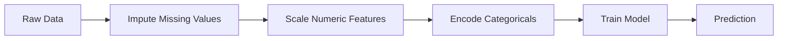
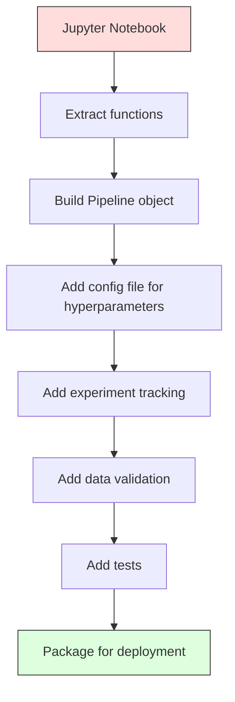

# Líneas de tuberías ML
# ML 管线


> Un modelo no es un producto, un pipeline es. El pipeline es todo, desde datos en bruto hasta predicción desplegada, y cada paso debe ser reproducible.

> El modelo no es producto, la línea de tubos es todo, desde los datos originales hasta las predicciones de implementación, cada paso debe ser replicado.

**Type:** Build | **类型：** 构建
**Language:**¿ Qué pasa ?**语言：**Python
**Prerequisites:** Phase 2, Lesson 12 (Hyperparameter Tuning) | **前置知识：** Phase 2 第 12 课（超参数调优）
**Time:** ~120 minutes | **时间：** 约 120 分钟

## Objetivos de aprendizaje

- Construir una tubería de ML desde cero que enlace la imputación, la escala, la codificación y el entrenamiento de modelos en un solo objeto reproducible
  Desde la construcción de la línea de ML, se llenará, se acumulará, codificará y entrenará el modelo en un único objeto replicable
- Identificar escenarios de fuga de datos y explicar cómo las tuberías los evitan mediante la instalación de transformadores únicamente en datos de formación
  Identificar las situaciones de fuga de datos, explicar cómo la tubería pasa sólo en los datos de entrenamiento adaptados a los transformadores para prevenir la fuga
- Construir un ColumnTransformer que aplique diferentes preprocesamiento a las características numéricas y categoricas
  Construir ColumnaTransformer, aplicaciones de diferentes características de los valores numéricos y de las clases
- Implementar la serialización de la tubería y demostrar que la misma tubería instalada produce resultados idénticos en formación y producción
   lograr la secuenciación de las tuberías, mostrando el mismo conjunto de tuberías en el entrenamiento y la producción para producir los mismos resultados


> **【中文解读】**
> ML 管线把数据预处理、特征工程、模型训练串串成一条流水线──sklearn pipeline 确保 el entrenamiento y la consonancia del procesamiento de datos de la hipótesis──生产环境中管线化是模型部署的基础──

> **【拓展：从 sklearn Pipeline 到 MLOps 工业级管线】**
> Los proyectos de desarrollo de la tecnología de la información (ML) se han desarrollado en el sector de la información y la información, pero en la industria, la tecnología de la información (ML) se ha desarrollado en el sector de la información y la información (ML) en el sector de la información y la información (ML) en el sector de la información y la información (ML) en el sector de la información (ML) en el sector de la información y la información (ML) en el sector de la información (ML) en el sector de la información (ML) en el sector de la información (ML) en el sector de la información (ML) en el sector de la información (ML) en el sector de la información (ML) en el sector de la información (ML) en el sector de la información (ML) en el sector de la información (ML) en el sector de la información (ML) en el sector de la información (ML) en el sector de la información (ML) en el sector de la información (ML) en el sector de la información (ML) en el sector de la información (ML) en el sector de la información (ML) en el sector de la información (ML) en el sector de la información (ML) en el sector de la información (ML) en el sector de la información (ML) en el sector de la información (ML) en el sector de la información (ML) en el sector de la (en) en el sector de la (en) y en el que se refiere a (en) en el sector de la (en) en el que se refiere a (en) en el sector de la (en) y en el que se refiere a (en) en el (en) en el que se refiere a (en) en el que se refiere a (en) en el cuadro de la (en) en inglés).

## El problema es la introducción del problema

Tienes un cuaderno que carga datos, llena los valores faltantes con la media, escasa las características, prepara un modelo y imprime la precisión. Funciona. Lo envías.

> Tienes un cuaderno, cargas datos, envía datos, envía datos, recoge datos, recoge datos, recoge datos, recoge datos, recoge datos, recoge datos, recoge datos, recoge datos, recoge datos, recoge datos, recoge datos, recoge datos, recoge datos, recoge datos, recoge datos, recoge datos, recoge datos, recoge datos, recoge datos, recoge datos, recoge datos, recoge datos, recoge datos, recoge datos, recoge datos, recoge datos, recoge datos, recoge datos, recoge datos, recoge datos, recoge datos, recoge datos, recoge datos, recoge datos, recoge datos, recoge datos, recoge datos, recoge datos, recoge datos, recoge datos, recoge datos, recoge datos, recoge datos, recoge datos, recoge datos, recoge datos, recoge datos, recoge datos, recoge datos, recoge datos, recoge datos, recoge datos, recoge datos, recoge datos, recoge datos, recoge datos, recoge datos, recoge datos, recoge datos, recoge datos, recoge datos, recoge datos, recoge, recoge datos, recoge, recoge datos, recoge, recoge, recoge, recoge, recoge y recoge, recoge, recoge, recoge, recoge, recoge, recoge, recoge, recoge, recoge, recoge, recoge, recoge, recoge, recoge, recoge, recoge, recoge, recoge, recoge, recoge, recoge, recoge, recoge, recoge, recoge, recoge, recoge, recoge, recoge, recoge, recoge, recoge, recoge, recoge, recoge, recoge, recoge, recoge, recoge, recoge, recoge, recoge, recoge, recoge, recoge, recoge, y recoge, y recoge, y recoge.

Un mes después, alguien reentrenó el modelo y obtuvo resultados diferentes. La mediana se calculó en el conjunto completo de datos, incluidos los datos de ensayo (fuente de datos). Los parámetros de escala no se guardaron, por lo que la inferencia utiliza estadísticas diferentes. El código de ingeniería de características fue copiado y pegado entre la formación y el servicio, y las copias divergieron. Una columna categórica ganó un nuevo valor en producción que el codificador nunca ha visto.

> Un mes después, alguien volvió a entrenar el modelo y obtuvo resultados diferentes. El promedio de datos se calcula en el conjunto de datos de los datos de los ensayos.

Las tuberías las resuelven envasando cada paso de transformación en un único objeto ordenado y reproducible.

> Estos no son hipótesis. Son las causas más comunes de que los sistemas de ML no logren producirse.

> **【中文解读】**
> El problema central de ML 管线解决: entrenamiento y el procesamiento de datos de la hipótesis deben estar completamente en armonía. El modelo más común de fracaso es la estandarización de la media de cálculo de datos en el entrenamiento con la media de la cantidad total de datos en el que se realiza el cálculo de los ensayos.

## El concepto central.

### Qué es un oleoducto

Una tubería es una secuencia ordenada de transformaciones de datos seguidas de un modelo. Cada paso toma la salida de la etapa anterior como entrada. Toda la tubería se instala una vez en los datos de entrenamiento. En el momento de la inferencia, la misma tubería equipada transforma nuevos datos y produce predicciones.

> La tubería es una secuencia de cambios de datos ordenados, que se ejecuta en un modelo. Cada paso de la siguiente salida se ejecuta como entrada. La tubería entera se adapta a la información de entrenamiento una vez.



El gasoducto garantiza:
- Las transformaciones se instalarán únicamente sobre datos de formación (sin fugas)
  变换 sólo en el entrenamiento datos se adapte                                                                                                                                                                                                                                                         
- Las mismas transformaciones se aplican en el momento de la inferencia
  推理时应用相同变更 推理时应用相同变更 推理时应用相同变更
- Todo el objeto puede ser serializado y desplegado como un artefacto
  Todo el objeto puede ser ordenado y desplegado como un componente
- La validación cruzada aplica el oleoducto por pliegue, evitando fugas sutiles
  交叉验证 en cada giro de la aplicación de la línea, evitar pequeñas fugas

### Fugas de datos: El asesino silencioso

Las filtraciones de datos ocurren cuando la información del conjunto de pruebas o los datos futuros contaminan el entrenamiento.

> Las fugas de datos ocurren durante el entrenamiento de contaminación de información de los ensayos de pruebas o futuros datos.

**Leaky (wrong):**
```python
X = df.drop("target", axis=1)
y = df["target"]

scaler = StandardScaler()
X_scaled = scaler.fit_transform(X)

X_train, X_test = X_scaled[:800], X_scaled[800:]
y_train, y_test = y[:800], y[800:]
```

El escalador vio los datos de prueba. La media y la desviación estándar incluyen muestras de prueba. Esto infla las estimaciones de precisión.

> 缩放器看到了测试数据──平均值和标准差包含测试样本── Esto exagerará la estimación de la tasa de precisión──

**Correct:**
```python
X_train, X_test = X[:800], X[800:]

scaler = StandardScaler()
X_train_scaled = scaler.fit_transform(X_train)
X_test_scaled = scaler.transform(X_test)
```

Con un oleoducto, no hay que pensar en esto.

> Usar tu tubo, no necesitas pensar en esto.

### Especialización de la producción de gas

El de sklearn `Pipeline`La tecnología de la cadena de transformación y un estimador.`.fit()`¿ Qué ?`.predict()`, y `.score()`que aplican todos los pasos en orden.

> de sklearn `Pipeline`Se conectan los cambios y los cálculos.`.fit()`¿Qué es esto?`.predict()`Y `.score()`, según el orden de aplicación de todos los pasos:.

```python
from sklearn.pipeline import Pipeline
from sklearn.preprocessing import StandardScaler
from sklearn.linear_model import LogisticRegression

pipe = Pipeline([
    ("scaler", StandardScaler()),
    ("model", LogisticRegression()),
])

pipe.fit(X_train, y_train)
predictions = pipe.predict(X_test)
```

Cuando llames .`pipe.fit(X_train, y_train)`¿Qué es esto ?
1. Las llamadas de escalado .`fit_transform`En el tren X
2. Modelo de llamadas `fit`en el tren X_escalado

Cuando llames .`pipe.predict(X_test)`¿Qué es esto ?
1. Las llamadas de escalado .`transform`(no se adapta_transform) en X_test
2. Modelo de llamadas `predict`en el test X_test a escala

El escalador nunca ve los datos de prueba durante el montaje.

> Cuando tú调用 `pipe.fit(X_train, y_train)`¿Qué es esto ?
> 1. 缩放器对 X_train 调用 `fit_transform`
> 2. 模型对缩放后的 X_train 调用 `fit`
>
> Cuando tú调用 `pipe.predict(X_test)`¿Qué es esto ?
> 1. 缩放器对 X_test 调用 `transform`(no es que se transforme)
> 2. 模型对缩放后的 X_test 调用 `predict`
>
> 缩放器在拟合期间永远看不到测试数据―― ése es todo el significado――

### ColumnaTransformer: diferentes tuberías para diferentes columnas

Los conjuntos de datos reales tienen columnas numéricas y categoricas que requieren un procesamiento previo diferente. `ColumnTransformer`maneja esto.

> Los datos reales tienen una serie de valores y una clase de datos, que requieren un tratamiento previo diferente.`ColumnTransformer`Tratar esto.

```python
from sklearn.compose import ColumnTransformer
from sklearn.preprocessing import StandardScaler, OneHotEncoder
from sklearn.impute import SimpleImputer

numeric_pipe = Pipeline([
    ("impute", SimpleImputer(strategy="median")),
    ("scale", StandardScaler()),
])

categorical_pipe = Pipeline([
    ("impute", SimpleImputer(strategy="most_frequent")),
    ("encode", OneHotEncoder(handle_unknown="ignore")),
])

preprocessor = ColumnTransformer([
    ("num", numeric_pipe, ["age", "income", "score"]),
    ("cat", categorical_pipe, ["city", "gender", "plan"]),
])

full_pipeline = Pipeline([
    ("preprocess", preprocessor),
    ("model", GradientBoostingClassifier()),
])
```

El `handle_unknown="ignore"`En OneHotEncoder es crítico para la producción. Cuando aparece una nueva categoría (una ciudad que el modelo nunca ha visto), produce un vector cero en lugar de estrellarse.

> OneHotEncoder 中的 `handle_unknown="ignore"`Para la producción es esencial. Cuando surgen nuevas categorías de ciudades que nunca se han visto, se produce un impulso de cero y no un desplome.

### El seguimiento de los experimentos

Una línea de tuberías hace que el entrenamiento sea reproducible, pero también necesitas rastrear lo que sucedió en los experimentos: qué hiperparámetros se utilizaron, qué versión del conjunto de datos, cuáles fueron las métricas, qué código se ejecutaba.

> 管线让训练可复现, pero también necesitas rastrear lo que pasó entre los experimentos: ¿con qué superparámetros?, qué versión del conjunto de datos?, qué indicador es?, qué código se ejecuta?.

**MLflow**es la solución de código abierto más común:

> **MLflow**Es el esquema de código abierto más común:

```python
import mlflow

with mlflow.start_run():
    mlflow.log_param("max_depth", 5)
    mlflow.log_param("n_estimators", 100)
    mlflow.log_param("learning_rate", 0.1)

    pipe.fit(X_train, y_train)
    accuracy = pipe.score(X_test, y_test)

    mlflow.log_metric("accuracy", accuracy)
    mlflow.sklearn.log_model(pipe, "model")
```

Cada ejecución se registra con parámetros, métricas, artefactos y el modelo completo.

> Cada operación registra los parámetros, indicadores, componentes y modelos completos. Puedes comparar la ejecución, realizar cualquier experimento, implementar cualquier versión del modelo.

**Weights & Biases (wandb)**proporciona la misma funcionalidad con un panel de control alojado:

> **Weights & Biases (wandb)**提供相同功能,带托管仪表盘:

```python
import wandb

wandb.init(project="my-pipeline")
wandb.config.update({"max_depth": 5, "n_estimators": 100})

pipe.fit(X_train, y_train)
accuracy = pipe.score(X_test, y_test)

wandb.log({"accuracy": accuracy})
```

### Modelo de versión

Después de realizar el seguimiento de los experimentos, se necesita gestionar las versiones del modelo. ¿Qué modelo está en producción? ¿Cuál está en escena? ¿Cuál fue la semana pasada?

> Después de la experiencia de seguimiento, necesitas administrar la versión del modelo. ¿Cuál modelo está en producción? ¿Cuál está en escena? ¿Cuál es la semana pasada?

El Registro Modelo de MLflow proporciona:
- **Version tracking:**Cada modelo guardado obtiene un número de versión
  **版本追踪：**Cada modelo de conservación obtenido versión número
- **Stage transitions:**"Enscenamiento", "Produción", "Archivo"
  **阶段转换：**"Enscenamiento""",Producción""",Archivo"
- **Approval workflow:**Los modelos deben ser explícitamente promovidos a la producción
  **审批工作流：**模型 debe ser claramente mejorado a la producción
- **Rollback:**Vuelve a una versión anterior al instante
  **回滚：**立即切回之前的版本

### Versión de datos con DVC

El código se versionó con git. Los datos también deben ser versionados, pero git no puede manejar archivos grandes.

> 代码使用 git 版本化──数据也应该版本化,但 git 不能处理大文件──DVC(Data Version Control) resolver este problema──

```
dvc init
dvc add data/training.csv
git add data/training.csv.dvc data/.gitignore
git commit -m "Track training data"
dvc push
```

DVC almacena los datos reales en almacenamiento remoto (S3, GCS, Azure) y mantiene un pequeño `.dvc`Cuando comprobas un comit de git,`dvc checkout`restaura los datos exactos que se usaron.

> DVC poner el almacenamiento de datos real en el extremo lejano ((S3、GCS、Azure), en git mantener un pequeño `.dvc`Cuando usted deja un registro de un documento,`dvc checkout`Recuperación de datos precisos utilizados en ese momento.

Esto significa que cada git comite pines tanto el código como los datos.

> Esto significa que cada git comprometido fija al mismo tiempo el código y los datos .

### Experimentos reproducibles

Un experimento reproducible requiere cuatro cosas:

> Una experiencia replicable requiere cuatro cosas:

1. **Fixed random seeds:**Se establece semillas para la numpy, aleatoria y el marco (torcha, sklearn)
   **固定随机种子：**Para el numpy、random 和 framework(torch、sklearn)
2. **Pinned dependencies:**requisites.txt o poetry.lock con versiones exactas
   **固定依赖：**requisitos.txt o poetry.lock 锁定精确版本
3. **Versioned data:**DVC o similares
   **版本化数据：**DVC o herramientas similares
4. **Config files:**Todos los hiperparámetros en una configuración, no codificados en formato duro
   **配置文件：**Todos los superparámetros en la configuración, no codificar duro

```python
import numpy as np
import random

def set_seed(seed=42):
    random.seed(seed)
    np.random.seed(seed)
    try:
        import torch
        torch.manual_seed(seed)
        torch.cuda.manual_seed_all(seed)
        torch.backends.cudnn.deterministic = True
    except ImportError:
        pass
```

### De la libreta a la producción



La progresión típica:

> 典型演进:

1. **Notebook exploration:**Experimentos rápidos, visualizaciones, ideas de características
   **notebook 探索：**快速实验、可视化、特征思想
2. **Extract functions:**Mover el preprocesamiento, la ingeniería de características, la evaluación en módulos
   **抽取函数：**Preprocesar, hacer, evaluar, transferir a los módulos
3. **Build Pipeline:**Transformaciones de la cadena en una clase de tuberías de sklearn o de tipo personalizado
   **构建 Pipeline：**Cambiar la cadena a la línea de conducto de la tienda o auto-definir
4. **Config management:**Mover todos los hiperparámetros en una configuración YAML/JSON
   **配置管理：**Mover todos los superparámetros a configuración YAML/JSON
5. **Experiment tracking:**Añadir el registro de MLflow o de la vara
   **实验追踪：**添加 MLflow o la varilla 日志
6. **Data validation:**Compruebe esquemas, distribuciones y patrones de valores faltantes antes de entrenar
   **数据验证：**訓練前检查 schema、 distribución、 falta de modelo
7. **Tests:**Pruebas de unidad para transformadores, pruebas de integración para toda la tubería
   **测试：**变换器的单元测试、完整管线的集成测试
8. **Deployment:**Serializa la tubería, envuelve en una API (FastAPI, Flask), conteneriza
   **部署：**序列化管线、包成 API(FastAPI、Flask)、容器化

### Errores comunes en el oleoducto

| Mistake | Why it is bad | Fix |
|---------|-------------|-----|
| Fitting on full data before splitting | Data leakage | Use Pipeline with cross_val_score |
| Feature engineering outside pipeline | Different transforms at train vs serve | Put all transforms in the Pipeline |
| Not handling unknown categories | Production crash on new values | OneHotEncoder(handle_unknown="ignore") |
| Hardcoded column names | Breaks when schema changes | Use column name lists from config |
| No data validation | Silently wrong predictions on bad data | Add schema checks before prediction |
| Training/serving skew | Model sees different features in prod | One Pipeline object for both |

| 错误 | 为什么坏 | 修复 |
|------|---------|------|
| 划分前在全量数据上 fit | 数据泄漏 | 用 Pipeline 配合 cross_val_score |
| 管线外做特征工程 | 训练和服务变换不同 | 把所有变换放进 Pipeline |
| 不处理未知类别 | 生产中新值导致崩溃 | OneHotEncoder(handle_unknown="ignore") |
| 硬编码列名 | schema 改变时失效 | 用配置中的列名列表 |
| 没有数据验证 | 坏数据上预测错误无提示 | 预测前加 schema 检查 |
| 训练/服务偏差 | 生产中模型看到不同特征 | 训练和服务用同一个 Pipeline 对象 |

## Construye y realiza.

> **【中文解读】**
> Desde zero implementar ML 管线:自定义 Transformer(实现 fit/transform 接口)、Pipeline 类(链式调用多变换器)、ColumnTransformer(按列分组处理不同类型特征)。

> **【拓展：sklearn Pipeline 在 Kaggle 和工业界的标准模式】**
> El modelo de código estándar de Kaggle Grandmaster casi siempre contiene una línea de datos: características de valor con SimpleImputer + StandardScaler, características de categoría con SimpleImputer + OneHotEncoder, a través de ColumnTransformer 组合后输入模型── esto garantiza: el proceso de verificación de la información cada vez más independiente, el nuevo análisis de datos cambia de acuerdo, el código se puede mantener en forma rápida.
```figure
f3-pipeline-flow
```

## Construye el mismo

El código en `code/pipeline.py`construye una tubería ML completa desde cero:

### Paso 1: Transformador personalizado

```python
class CustomTransformer:
    def __init__(self):
        self.means = None
        self.stds = None

    def fit(self, X):
        self.means = np.mean(X, axis=0)
        self.stds = np.std(X, axis=0)
        self.stds[self.stds == 0] = 1.0
        return self

    def transform(self, X):
        return (X - self.means) / self.stds

    def fit_transform(self, X):
        return self.fit(X).transform(X)
```

### Paso 2: Pipeline desde cero

```python
class PipelineFromScratch:
    def __init__(self, steps):
        self.steps = steps

    def fit(self, X, y=None):
        X_current = X.copy()
        for name, step in self.steps[:-1]:
            X_current = step.fit_transform(X_current)
        name, model = self.steps[-1]
        model.fit(X_current, y)
        return self

    def predict(self, X):
        X_current = X.copy()
        for name, step in self.steps[:-1]:
            X_current = step.transform(X_current)
        name, model = self.steps[-1]
        return model.predict(X_current)
```

### Paso 3: Validación cruzada con tubería

El código demuestra cómo la validación cruzada con una tubería evita la fuga de datos: el escalador se instala por separado en los datos de entrenamiento de cada pliegue.

### Paso 4: Pipeline de producción completa con sklearn

Un gasoducto completo con `ColumnTransformer`, múltiples caminos de preprocesamiento, y un modelo, entrenado con la validación cruzada adecuada y la registro de experimentos.

## Envíe el producto .

Esta lección produce:
- `outputs/prompt-ml-pipeline.md`-- habilidad para construir y deshacer las tuberías de ML
- `code/pipeline.py`-- un oleoducto completo desde cero a través de sklearn

## Los ejercicios.

1. Construir una línea de tubería que maneje un conjunto de datos con 3 columnas numéricas y 2 columnas categoricas.`ColumnTransformer`Para aplicar la imputación mediana + escalación a las numéricas y la imputación más frecuente + codificación de un solo calor a las categorías.
   1. Construir y procesar tres columnas de valores numéricos y dos categorías de columnas de datos.`ColumnTransformer`Para la aplicación de la serie de valores en el intervalo de relleno + reducción, para la aplicación de la serie de clases de relleno + codificación única.

2. Introducir deliberadamente una fuga de datos: ajustar el escalador en el conjunto completo de datos antes de dividir. Comparar el puntaje de validación cruzada (que se filtró) con el puntaje de validación cruzada de la tubería (limpio). ¿Cuál es la diferencia?
   2. Por lo tanto, la introducción de datos de fuga: ¿Cuál es la diferencia entre la cantidad de datos de fuga y la cantidad de datos de fuga?

3. Serializa tu oleoducto con `joblib.dump`Lo cargue en un guión separado y ejecute predicciones.
   3. ¿ Qué ?`joblib.dump`序列化你的管线──在另一个脚本中加载并运行预测──验证预测完全相同──

4. Añadir un transformador personalizado a la tubería que crea características polinómicas (grado 2) para las dos columnas numéricas más importantes. ¿Dónde debe ir en la tubería?
   4. En la línea de tubos añadir un cambio de definición automático, para crear características de varios elementos para las dos líneas de valores más importantes. ¿Qué posición debería colocarse en la línea de tubos?

5. Configurar el seguimiento de flujo de ML para la tubería. ejecutar 5 experimentos con diferentes hiperparámetros.`mlflow ui`) para comparar las carreras y elegir el mejor modelo.
   5. Por ejemplo, el sistema de control de los flujos de datos de la máquina de control de datos de la máquina de control de datos de la máquina de control de datos de la máquina de control de datos de la máquina de control de datos de la máquina de control de datos de la máquina de control de datos de la máquina de control de datos de la máquina de control de datos de la máquina de control de datos de la máquina de control de datos de datos de la máquina de control de datos de datos de la máquina de control de datos de datos de la máquina de control de datos de datos de la máquina de control de datos de datos de la máquina de control de datos de datos de datos de la máquina de control de datos de datos de datos de datos de la máquina de control de datos de datos de datos de datos de datos de datos de datos de datos de datos de datos de datos de datos de datos de la máquina de control de datos de datos de datos de datos de datos de datos de datos de datos de datos de datos de datos de datos de datos de datos de datos de datos de datos de datos de datos de datos de datos de datos de datos de datos de datos de datos de datos de datos de datos de datos de datos de datos de datos de datos de datos de datos de datos de datos de datos de datos de datos de datos de datos de datos de datos de datos de datos de datos de datos de datos de datos de datos de datos de datos de datos de datos de datos de datos de datos de datos de datos de datos de datos de datos de datos de datos de datos de datos de datos de datos de datos de datos de datos de datos de datos de datos de datos de datos de datos de datos de datos de datos de datos de datos de datos de datos de datos de datos de datos de datos de datos de datos de datos de datos de datos de datos de datos de datos de datos de datos de datos de datos de datos de datos de datos de datos de datos de datos de datos de datos de datos de datos de datos de datos de datos de datos de datos de datos de datos de datos de datos de datos de datos de datos de datos de datos de datos de datos de datos de datos de datos de datos de datos de datos de datos de datos de datos de datos de datos de datos de datos de datos de datos de datos de datos de datos de datos de datos de datos de datos de datos de datos de datos de datos de datos de datos de datos de datos de datos de datos de datos`mlflow ui`) comparar el funcionamiento y seleccionar el mejor modelo.

> **【中文解读】**
> Principios clave del diseño de las líneas de tuberías: 1) Todas las modificaciones deben ser procesadas con un libro de trabajo / picilla  conservar la tubería instalada completa, la implementación y carga directa; 2) ColumnaTransformer  procesar tipos mixtos  características numéricas y características de las categorías  cambios y combinaciones; 3) La tubería no puede tener ningún estado global  cada transformador  sólo depende de la información de entrenamiento de la transmisión  Estos principios garantizan la coherencia de la formación-razón 

> **【拓展：数据泄漏的六种常见形式】**
> (1) Escalado en la totalidad de datos re-dividir;(2) 目标编码使用全量数据计算平均值;(3) 时间序列随机划分;(4) 特征选择在全量数据上做;(5) 交叉验证中重复样本出现多折;(6) 预测时使用未来才能获取的特征――管道 通过严格的适应/转变 分离防止前四种泄漏――对于时间序列和重复样本,需要特殊的交叉验证策略――

## Términos clave .

| Term | What people say | What it actually means |
|------|----------------|----------------------|
| Pipeline | "Chain of transforms + model" | An ordered sequence of fitted transformers and a model, applied as one unit to prevent leakage |
| Data leakage | "Test info leaked into training" | Using information from outside the training set to build the model, inflating performance estimates |
| ColumnTransformer | "Different preprocessing per column" | Applies different pipelines to different subsets of columns, combining results |
| Experiment tracking | "Logging your runs" | Recording parameters, metrics, artifacts, and code versions for every training run |
| MLflow | "Track and deploy models" | Open-source platform for experiment tracking, model registry, and deployment |
| DVC | "Git for data" | Version control system for large data files, storing hashes in git and data in remote storage |
| Model registry | "Model version catalog" | A system that tracks model versions with stage labels (staging, production, archived) |
| Training/serving skew | "It worked in the notebook" | Differences between how data is processed during training versus inference, causing silent errors |
| Reproducibility | "Same code, same result" | The ability to get identical results from the same code, data, and configuration |

## Más Leer más Leer más

- [scikit-learn Pipeline docs](https://scikit-learn.org/stable/modules/compose.html)-- la referencia oficial de la tubería
  [scikit-learn Pipeline 文档](https://scikit-learn.org/stable/modules/compose.html)- 官方管线参考
- [MLflow documentation](https://mlflow.org/docs/latest/index.html)-- seguimiento de experimentos y registro de modelos
  [MLflow 文档](https://mlflow.org/docs/latest/index.html)- 实验追踪和模型注册 (en inglés)
- [DVC documentation](https://dvc.org/doc)-- versión de datos
  [DVC 文档](https://dvc.org/doc)- Datos de la versión de gestión
- [Sculley et al., Hidden Technical Debt in Machine Learning Systems (2015)](https://papers.nips.cc/paper/2015/hash/86df7dcfd896fcaf2674f757a2463eba-Abstract.html)-- el documento de referencia sobre la complejidad de los sistemas ML
  [Sculley et al., Hidden Technical Debt in ML Systems (2015)](https://papers.nips.cc/paper/2015/hash/86df7dcfd896fcaf2674f757a2463eba-Abstract.html)- ML 系统复杂性的
- [Google ML Best Practices: Rules of ML](https://developers.google.com/machine-learning/guides/rules-of-ml)-- asesoramiento práctico en materia de producción de ML
  [Google ML Best Practices](https://developers.google.com/machine-learning/guides/rules-of-ml)- 实用生产 ML 建议
