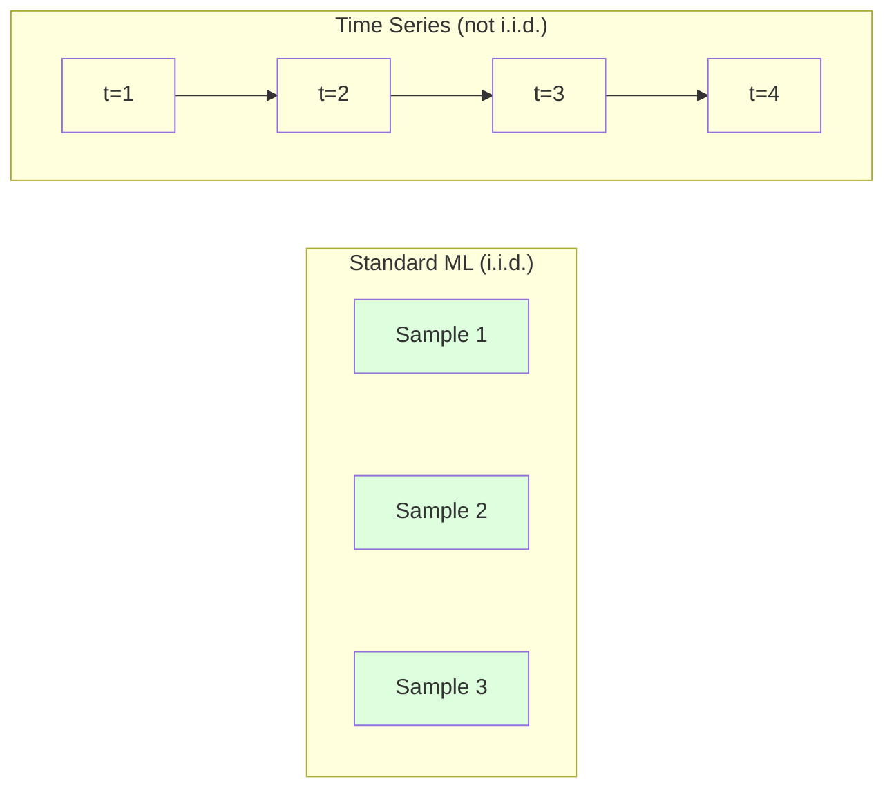
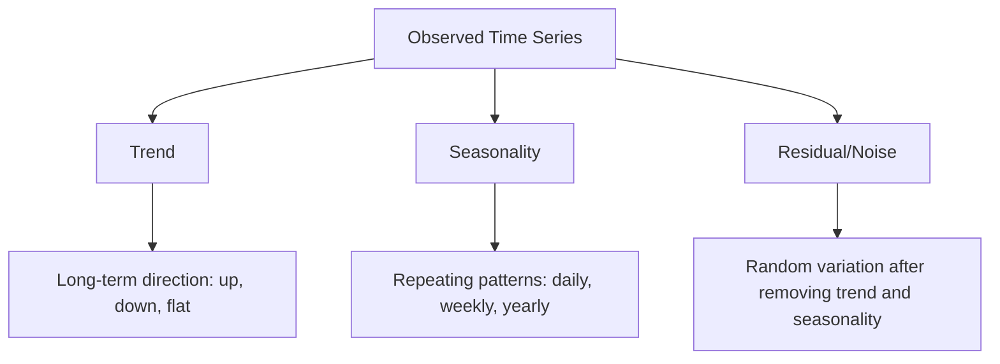
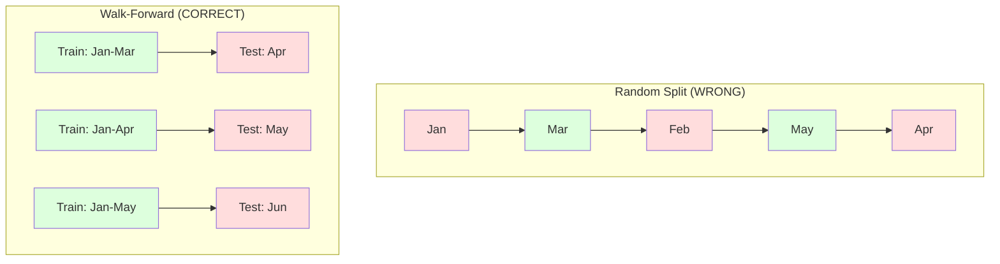

# Fundamentos de la serie temporal
# 时间序列基础  tiempo y tiempo


> El rendimiento pasado predice resultados futuros si primero comprueba la estacionalidad.

> El pasado puede predecir el futuro, si primero comprueba la estabilidad.

**Type:** Build | **类型：** 构建
**Language:**¿ Qué pasa ?**语言：**Python
**Prerequisites:** Phase 2, Lessons 01-09 | **前置知识：** Phase 2 第 1-9 课
**Time:** ~90 minutes | **时间：** 约 90 分钟

## Objetivos de aprendizaje

- Descompone una serie de tiempos en componentes de tendencia, estacionalidad y residuos y prueba de estacionalidad
  Desglosar la secuencia de tiempo en tendencias, estaciones y diferencias, y comprobar la estabilidad.
- Implementar características de retraso y estadísticas de rodaje para convertir una serie temporal en un problema de aprendizaje supervisado
  realizar las características de atraso y la estadística de rotación se transformará en la secuencia de tiempo de la supervisión de los problemas de aprendizaje
- Construir un marco de validación avanzada que impida que los datos futuros se filtren en la formación
  Construir un marco de verificación de datos en el futuro, para evitar que las filtraciones de datos se produzcan en el entrenamiento
- Explicar por qué las divisiones aleatorias de tren/prueba son inválidas para las series temporales y demostrar la brecha de rendimiento frente a las divisiones temporales adecuadas
  Explicar por qué la división de tiempo en la secuencia de tiempo no funciona, y no se utiliza la división de tiempo correcta para mostrar la diferencia de rendimiento


> **【中文解读】**
> 时间序列是按时间序排列的数据──ARIMA、指数平滑是经典方法,LSTM/Transformer是深度学习方法──股票预测、销量预测、天气预报是典型应用──

> **【拓展：时间序列预测在金融和供应链中的关键角色】**
> Amazon utiliza el tiempo de secuencia de pronóstico para gestionar el inventario de cientos de millones de SKU en todo el mundo, con un pronóstico diario de más de 400 millones de veces; Uber utiliza el tiempo de secuencia de pronóstico de necesidades para la movilidad de precios; las instituciones financieras utilizan ARIMA/GARCH  modelo de pronóstico de la volatilidad para gestionar el riesgo.

## El problema es la introducción del problema

Tienes datos ordenados por tiempo, ventas diarias, temperatura por hora, uso de CPU por minuto, precios semanales de las acciones.

> Tienes datos de tiempo en orden. Tiempo en orden. Tiempo en orden. Tiempo en orden. Tiempo en orden. Tiempo en orden. Tiempo en orden. Tiempo en orden. Tiempo en orden. Tiempo en orden. Tiempo en orden. Tiempo en orden. Tiempo en orden. Tiempo en orden. Tiempo en orden. Tiempo en orden. Tiempo en orden. Tiempo en orden. Tiempo en orden. Tiempo en orden. Tiempo en orden. Tiempo en orden. Tiempo en orden. Tiempo en orden. Tiempo en orden. Tiempo en orden. Tiempo en orden. Tiempo en orden. Tiempo en orden. Tiempo en orden. Tiempo en orden. Tiempo en orden. Tiempo en orden. Tiempo en orden. Tiempo en orden. Tiempo en orden. Tiempo.

Busca tu conjunto de herramientas estándar de ML: tren aleatorio/dividir la prueba, validación cruzada, matriz de características, predicción. Cada paso es incorrecto.

> Usted utiliza el estándar ML 工具:随机训练/测试划分、交叉验证、特征矩阵输入、预测输出── cada paso es erróneo──

La serie temporal rompe las suposiciones de que se basa el ML estándar. Las muestras no son independientes - la temperatura de hoy depende de la de ayer. Las particiones aleatorias filtran información futura al pasado. Las características que se ven bien en las pruebas posteriores fallan en la producción porque dependen de patrones que cambian con el tiempo.

>  La secuencia de tiempo rompe la hipótesis de que la norma ML depende.  El modelo no es independiente El temperatura de hoy depende de la de ayer  La distribución de información futura se filtrará al pasado  En la evaluación, parece que las características son muy buenas en la producción, ya que dependen de los cambios de tiempo

Un modelo que obtiene una precisión del 95% con validación cruzada aleatoria puede obtener un 55% con una evaluación adecuada basada en el tiempo. La diferencia no es una tecnicismo. Es la diferencia entre un modelo que funciona en papel y uno que funciona en producción.

> Un modelo que obtiene un 95% de precisión en la verificación de cruce al azar solo puede obtener un 55% en el tiempo correcto bajo la evaluación. Esto no es un detalle técnico. Esta es la diferencia entre un modelo que es efectivo en papel y un modelo que es efectivo en producción.

Esta lección cubre los fundamentos: lo que hace que los datos de tiempo sean diferentes, cómo evaluar los modelos honestamente y cómo convertir una serie de tiempos en características que los modelos estándar de ML pueden consumir.

> Este curso abarca conocimientos básicos: qué hace que los datos del tiempo sean diferentes, cómo evaluar honestamente el modelo, y cómo convertir la secuencia de tiempo en características estándar del modelo ML que se pueden utilizar.

> **【中文解读】**
> La distinción del análisis de secuencias de tiempo es que entre los puntos de datos hay dependencia temporal El valor de hoy depende del valor de ayer Esto rompe la hipótesis de independencia y distribución estándar de ML El concepto central: estabilidad (estacionalidad) Las características estadísticas no cambian con el tiempo; tendencias+ estaciones+ descomposición de residuos; características de retraso y estadísticas de rodaje se convertirán en problemas de aprendizaje supervisado El método de evaluación correcto es la validación avanzada, no la verificación de transición al azar.

## El concepto central.

### ¿Qué hace que la serie de tiempo sea diferente?

El ML estándar asume i.i.d. - independiente e idénticamente distribuido. Cada muestra se extrae de la misma distribución, independientemente de otras muestras.

> 标准 ML 假设 i.i.d.独立同分布── cada muestra extraída de la misma distribución, sin relación con otras muestras── el tiempo en secuencia infringe estas dos hipótesis:

- **Not independent.**El precio de las acciones de hoy depende de los de ayer. Las ventas de esta semana se correlacionan con las de la semana pasada.
  No independientes. Hoy los precios de las acciones dependen de ayer.
- **Not identically distributed.**Las ventas en diciembre se ven diferentes de las ventas en marzo.
  Distribución no igual. Distribución variable con el tiempo. Ventas de diciembre en comparación con las de 3 meses.

Estas violaciones no son menores, cambian la forma en que se construyen las características, cómo se evalúan los modelos y qué algoritmos funcionan.

> Estas violaciones no son pequeñas cuestiones. Cambiaron cómo construyes características, cómo evalúas modelos y qué algoritmos son efectivos.



En el ML estándar, las muestras son intercambiables. Mezclarlas no cambia nada. En la serie temporal, el orden es todo.

> En el estándar ML, el modelo es intercambiable. En la secuencia de tiempo, el orden es todo.

### Componentes de una serie temporal

Cada serie de tiempos es una combinación de:

> Cada secuencia de tiempo es un conjunto de componentes:



- **Trend**La dirección a largo plazo: ingresos crecientes del 10% al año, temperatura global en aumento.
  趋势:长期方向― ingresos crecen 10% anual― temperatura mundial aumenta―
- **Seasonality**El consumo de aire acondicionado alcanza su punto máximo en julio.
  季节性:固定间隔的重复模式── ventas minoristas aumentaron en 12 meses── el uso de aire en 7 meses alcanzó su máximo―
- **Residual**Si el residuo parece ruido blanco, la descomposición captura la señal.
  Restos: eliminación de la tendencia y el resto posterior de la temporada. Si el residuo parece ruido blanco, la descripción de la descomposición ha capturado la señal.

### Estacionariedad

Una serie temporal es estacionaria si sus propiedades estadísticas (mediana, varianza, autocorrelación) no cambian con el tiempo.

> Si las características estadísticas de una secuencia de tiempo (por ejemplo, la media, la diferencia, la relación entre sí) no cambian con el tiempo, entonces es plana. La mayoría de los métodos de predicción suponen estabilidad.

**Why it matters:**Una serie no estacionaria tiene un medio que deriva. Un modelo entrenado en datos de enero ha aprendido un medio diferente a lo que mostrará febrero.

> **为什么重要：**El promedio de la secuencia no estable se desplaza. Se utiliza un modelo de entrenamiento de datos de 1 mes para aprender el promedio de los resultados de los resultados de los resultados de los resultados de los resultados de los resultados de los resultados de los resultados de los resultados de los resultados de los resultados de los resultados de los resultados de los resultados de los resultados de los resultados de los resultados de los resultados de los resultados de los resultados de los resultados de los resultados de los resultados de los resultados de los resultados de los resultados de los resultados de los resultados de los resultados de los resultados de los resultados de los resultados de los resultados de los resultados de los resultados de los resultados de los resultados de los resultados de los resultados de los resultados de los resultados de los resultados de los resultados de los resultados de los resultados de los resultados de los resultados de los resultados de los resultados de los resultados de los resultados de los resultados de los resultados de los resultados de los resultados de los resultados de los resultados de los resultados de los resultados de los resultados de los resultados de los resultados de los resultados de los resultados de los resultados de los resultados de los resultados de los resultados de los resultados de los resultados de los resultados de los resultados de los resultados de los resultados de los resultados de los resultados de los resultados de los resultados de los resultados de los resultados de los resultados de los resultados de los resultados de los resultados de los resultados de los resultados de los resultados de los resultados de los resultados de los resultados de los resultados de los resultados de los resultados de los resultados de los resultados de los resultados de los resultados de los resultados de los resultados de los resultados de los resultados de los resultados de los resultados de los resultados de los resultados de los resultados de los resultados de los resultados de los resultados de los resultados de los resultados de los resultados de los resultados de los resultados de los resultados de los resultados de los resultados de los resultados de los resultados de los resultados de los cuento.

**How to check:**Calcule la media de rodamiento y la desviación estándar de rodamiento sobre las ventanas.

> **如何检查：**計算窗口內滚动平均值和滚动标准差──如果它们漂移,序列就是不平稳的──

**How to fix:**Diferenciar. En lugar de modelar los valores en bruto, modelar el cambio entre los valores consecutivos:

> **如何修复：**差分── no se construye contra el valor original, sino contra la variación entre los valores continuos:

```
diff[t] = value[t] - value[t-1]
```

Si una ronda de diferenciación no hace que la serie se quede estacionaria, aplicarla de nuevo (diferenciación de segundo orden).

> Si una ronda de diferencias no puede hacer que la secuencia se aplique, se vuelve a aplicar una vez más. La mayoría de las secuencias del mundo real necesitan dos rounds.

**Example:**

> **示例：**

Serie original: [100, 102, 106, 112, 120]
Primera diferencia: [2, 4, 6, 8] (todavía tendencia hacia arriba)
Segunda diferencia: [2, 2, 2] (constante -- estacionario)

La serie original tenía una tendencia cuadrática. la primera diferenciación la convirtió en una tendencia lineal. la segunda diferenciación la hizo plana. en la práctica, rara vez se necesitan más de dos rondas.

> El primer orden tiene dos tendencias. La primera se transforma en tendencias lineales. En la práctica, muy pocas veces se necesitan más de dos ramas.

**Formal test:**El test de Dickey-Fuller (ADF) aumentado es la prueba estadística estándar para la estacionalidad. La hipótesis nula es "la serie no es estacionaria". Un valor p por debajo de 0.05 significa que se puede rechazar la nula y concluir la estacionalidad. No implementamos ADF desde cero (requiere tablas de distribución asimptoticas), pero el enfoque de estadística de rodadura en nuestro código da una verificación visual práctica.

> **正式检验：**El examen de Dickey-Fuller aumentado (ADF) es un examen estadístico estándar de estabilidad plana. La hipótesis de zero es "sección no estabilidad" (sección no estabilidad). El valor de p es inferior a 0.05 y significa que se puede rechazar la hipótesis de zero y obtener una conclusión estabilidad.

### Autocorrelación

La autocorrelación mide cuánto un valor en el tiempo t se correlaciona con el valor en el tiempo t-k (pasos k en el pasado).

> Relación entre el valor de tiempo t y el valor del tiempo t-k(pasados k 步)

**ACF tells you:**
- Si el ACF cae a cero después del lag 5, los valores de hace más de 5 pasos son irrelevantes.
  La memoria de la secuencia es larga. Si el ACF se retrasa 5 ̊ después de descender a cero, excede 5 ̊ antes de que el valor se desvanezca.
- Si el ACF aumenta en un atraso de 12 (datos mensuales), hay una estacionalidad anual.
  Si el ACF se encuentra en la última 12 horas (en la actualidad, el nivel de la actividad anual es de 12 meses), entonces existe una temporada anual.
- Cuántas características de retraso crear.
   Creación                                                                                                                                                                                                                                                             

**PACF (Partial Autocorrelation Function)**Si hoy correlaciona con 3 días atrás sólo porque ambos correlacionan con ayer, el PACF en el lag 3 será cero mientras que el ACF en el lag 3 no lo será.

> **PACF（偏自相关函数）**Se trata de un proceso de desarrollo de la economía de la región, que se desarrolla en el contexto de la economía de la región.

### Las características de Lag: convertir la serie de tiempo en aprendizaje supervisado

Los modelos estándar de ML necesitan una matriz de características X y una matriz de objetivo y. La serie temporal le da una sola columna de valores.

> 标准 ML 模型需要特征矩阵 X 和目标 y. 时间序列给你一列值.

Tomar la serie [10, 12, 14, 13, 15] y crear las características lag-1 y lag-2:

> 取序列 [10, 12, 14, 13, 15] 并创建滞后 1 和滞后 2 características:

| lag_2 | lag_1 | target |
|-------|-------|--------|
| 10    | 12    | 14     |
| 12    | 14    | 13     |
| 14    | 13    | 15     |

Ahora tienes un problema de regresión estándar. Cualquier modelo de ML (regresión lineal, bosque aleatorio, aumento de gradiente) puede predecir el objetivo a partir de los retrasos.

> Ahora tienes un problema de regreso estándar. Cualquier modelo de ML puede ser de un objetivo de predicción de características atrasadas.

Las características adicionales que puede diseñar:
- **Rolling statistics:**media, std, min, max sobre los últimos valores k
  滚动统计: pasado k 个值的平均值,标准差,最小值,最大值
- **Calendar features:**día de la semana, mes, es_feria, es_fin de semana
  ¿Es el día de la fiesta? ¿Es el día de la fiesta?
- **Differenced values:**cambio respecto a la etapa anterior
  差分值: con el cambio del paso anterior
- **Expanding statistics:**media acumulada, suma acumulada
  扩展统计: acumulación media 累积和
- **Ratio features:**valor actual / media de movimiento (que distancia del promedio reciente)
  Características de la tasa: actual valor / 滚动平均值 (también denominado en la categoría de valores de referencia)
- **Interaction features:**1 * día de la semana (efectos de los días de la semana en el impulso)
  交互特征:lag_1 * día_de_semana(工作日对动量的影响)

**How many lags?**Utilice la función de autocorrelación. Si el ACF es significativo hasta 10 lag, use al menos 10 lags. Si hay estacionalidad semanal, incluya 7 lags (y posiblemente 14).

> **用多少个滞后？**Utilice funciones auto-relacionadas. Si ACF está atrasado 10 años y es notable, utilice al menos 10 años de atraso. Si hay una temporada de tiempo, incluido el atraso 7 años, puede haber 14 años.

**The target alignment trap.**Cuando se crean características de lag, el objetivo debe ser el valor en el tiempo t, y todas las características deben usar valores en el tiempo t-1 o antes. Si accidentalmente incluye el valor en el tiempo t como una característica, tiene un predictor perfecto y un modelo completamente inútil. Este es el error más común en la ingeniería de características de la serie temporal.

> **目标对齐陷阱。**Cuando se crea un rasgo atrasado, el objetivo debe ser el valor de tiempo t, todas las características deben usar el valor de tiempo t-1 o más temprano. Si no tienes intención de usar el valor del tiempo t como rasgo, tienes un predictor perfecto, pero también un modelo completamente inútil. Este es el error más común en el diseño de rasgos de secuencias de tiempo.

### Validación de la marcha hacia adelante

Esta es la idea más importante de esta lección. La validación cruzada estándar de k-fold asigna muestras al azar para entrenar y probar.

> Este es el concepto más importante de la clase. El estándar de la prueba de forma automática se distribuye entre los ejemplos de entrenamiento y los ensayos de prueba.



Validación previa:
1. Entraen en datos hasta el tiempo t
   Entrenamiento en datos de tiempo t  previo
2. Prever en el tiempo t+1 (o t+1 a t+k para múltiples pasos)
   En el tiempo t+1 预测(或多步预测 t+1 hasta t+k)
3. Desliza la ventana hacia adelante
   hacia la ventana de desplazamiento
4. Repite
   ¿Qué es esto ?

Cada pieza de prueba contiene sólo datos que vienen después de todos los datos de entrenamiento. No hay fugas futuras. Esto le da una estimación honesta de cómo funcionará el modelo cuando se despliegue.

> Cada prueba de desfase sólo contiene los datos posteriores a la formación. No hay fugas futuras. Esto le proporciona una estimación honesta de la capacidad del modelo en el momento de su implementación.

**Expanding window**utiliza todos los datos históricos para la formación (crece la ventana). **Sliding window**Utiliza el deslizamiento cuando cree que los datos más antiguos siguen siendo relevantes. Utiliza el deslizamiento cuando el mundo cambia y los datos viejos hacen daño.

> **扩展窗口**Utiliza todos los datos históricos para entrenar (en inglés).**滑动窗口**Usar ventanas de entrenamiento fijas de gran tamaño ([[ventanas de rodaje]]) ◊ Usar ventanas de expansión cuando crees que los datos antiguos siguen siendo relevantes ◊ Usar ventanas de rodaje cuando el mundo cambia y los datos antiguos son perjudiciales ◊ Usar ventanas de rodaje cuando los datos antiguos cambian ◊ Usar ventanas de rodaje cuando los datos antiguos siguen siendo relevantes ◊ Usar ventanas de expansión cuando los datos antiguos cambian y los datos antiguos son perjudiciales ◊ Usar ventanas de rodaje cuando los datos antiguos cambian ◊ Usar ventanas de rodaje cuando los datos antiguos cambian ◊ Usar ventanas de rodaje cuando los datos antiguos cambian ◊ Usar ventanas de rodaje cuando los datos antiguos cambian ◊ Usar los datos antiguos cambian ◊ Usar los datos más rápidos ◊ Usar ventanas de rodaje cuando los datos se mueven ◊ Usar

### Intuición de ARIMA

ARIMA es el modelo clásico de la serie de tiempo.

> ARIMA es el modelo clásico de la secuencia de tiempo. Tiene tres componentes:

- **AR (Autoregressive):**Prevé a partir de valores anteriores. AR(p) utiliza los últimos valores p.
  AR(auto-regreso): de pasado 预测──AR(p) Uso reciente 个值──
- **I (Integrated):**Diferenciación para lograr estacionalidad.
  I  积分: a través de la diferencia para lograr la estabilidad.
- **MA (Moving Average):**Previsión a partir de errores previos anteriores.
  MA(移动平均): de los últimos errores de pronóstico.

ARIMA ((p, d, q) combina las tres. Elige p, d, q basándose en el análisis ACF/PACF o en la búsqueda automática (ARIMA automática).

> ARIMA(p, d, q) 组合了所有三个成分──你基于ACF/PACF 分析或自动搜索(auto-ARIMA)选择 p、d、q──

No vamos a implementar ARIMA desde cero, requiere optimización numérica que está más allá del alcance de esta lección. La clave es entender lo que hace cada componente para que pueda interpretar los resultados de ARIMA y saber cuándo usarlo.

> No vamos a realizar ARIMA desde cero, pero necesita una optimización numérica más allá de la gama de este curso. La clave es entender el papel de cada componente, para que puedas entender el resultado de ARIMA y saber cuándo usarlo.

### Cuándo usar qué

| Approach | Best For | Handles Seasonality | Handles External Features |
|----------|---------|-------------------|------------------------|
| Lag features + ML | Tabular with many external features | With calendar features | Yes |
| ARIMA | Single univariate series, short-term | SARIMA variant | No (ARIMAX for limited) |
| Exponential smoothing | Simple trend + seasonality | Yes (Holt-Winters) | No |
| Prophet | Business forecasting, holidays | Yes (Fourier terms) | Limited |
| Neural networks (LSTM, Transformer) | Long sequences, many series | Learned | Yes |

Para la mayoría de los problemas prácticos, las características de retraso + aumento de gradiente es el punto de partida más fuerte.

> Para la mayoría de los problemas reales, el atraso + el aumento de la escala es el punto de partida más fuerte.

### Previsión de horizontes y estrategias

La predicción de un solo paso predice un paso adelante. La predicción de múltiples pasos predice múltiples pasos. Hay tres estrategias:

> 单步预测预测 下一个时间步多步预测预测多个时间步 Hay tres estrategias:

**Recursive (iterated):**Predicir un paso adelante, usar la predicción como entrada para el siguiente paso. Simple pero los errores se acumulan - cada predicción utiliza la predicción anterior, así que los errores compostos.

> **递归（迭代）：**预测一步,将预测结果作为下一步的输入──简单但错误会积累每预测使用前一个预测,因此错误会叠加──

**Direct:**Entrenar un modelo separado para cada horizonte. El modelo 1 predice t+1, el modelo 5 predice t+5. No hay acumulación de errores, pero cada modelo tiene menos muestras de entrenamiento y no comparten información.

> **直接：**Para cada modelo, el rango de entrenamiento es individual. Modelo 1  predicción t+1, Modelo 5  predicción t+5── no hay ningún error acumulado, pero cada modelo tiene un modelo de entrenamiento menor y no comparte información―.

**Multi-output:**Entrenar un modelo que emita todos los horizontes simultáneamente. Comparte información a través de horizontes pero requiere un modelo que admita múltiples salidas (o una función de pérdida personalizada).

> **多输出：**训练一个模型同时输出所有预测范围――跨范围共享信息, pero necesita apoyar más modelos de salida (或自定义损失函数) ―

Para la mayoría de los problemas prácticos, comience con recursiva para horizontes cortos (1-5 pasos) y directo para horizontes más largos.

> 对于大多数实际问题,短范围(1-5 步) con递归,长范围用直接方法──

### Errores comunes en la serie de tiempos

| Mistake | Why it happens | How to fix |
|---------|---------------|-----------|
| Random train/test split | Habit from standard ML | Use walk-forward or temporal split |
| Using future features | Feature at time t included by mistake | Audit every feature for temporal alignment |
| Overfitting to seasonality | Model memorizes calendar patterns | Hold out a full seasonal cycle in the test set |
| Ignoring scale changes | Revenue doubles but patterns stay | Model percentage change instead of absolute |
| Too many lag features | "More history is better" | Use ACF to determine relevant lags |
| Not differencing | "The model will figure it out" | Tree models handle trends; linear models need stationarity |

## Construye y realiza.

> **【中文解读】**
> Desde el núcleo de la secuencia de tiempo de implementación de la realidad de la realidad de la realidad de la realidad de la realidad de la realidad de la realidad de la realidad de la realidad de la realidad de la realidad de la realidad de la realidad de la realidad de la realidad de la realidad de la realidad de la realidad de la realidad de la realidad de la realidad de la realidad de la realidad de la realidad de la realidad de la realidad de la realidad de la realidad de la realidad de la realidad de la realidad de la realidad de la realidad de la realidad de la realidad de la realidad de la realidad de la realidad de la realidad de la realidad de la realidad de la realidad de la realidad de la realidad de la realidad de la realidad de la realidad de la realidad de la realidad de la realidad de la realidad de la realidad de la realidad de la realidad de la realidad de la realidad de la realidad de la realidad de la realidad de la realidad de la realidad de la realidad de la realidad de la realidad de la realidad de la realidad de la realidad de la realidad de la realidad de la realidad de la realidad de la realidad de la realidad de la realidad de la realidad de la realidad de la realidad de la realidad de la realidad de la realidad de la realidad de la realidad de la realidad de la realidad de la realidad de la realidad de la realidad de la realidad de la realidad de la realidad de la realidad de la realidad de la realidad de la realidad de la realidad de la realidad de la realidad de la realidad de la realidad de la realidad de la realidad de la realidad de la realidad de la realidad de la realidad de la realidad de la realidad de la realidad de la realidad de la realidad de la realidad de la realidad de la realidad de la realidad de la realidad de la realidad de la realidad de la realidad de la realidad de la realidad de la realidad de la realidad de la realidad de la realidad de la realidad de la realidad de la realidad de la realidad de la realidad de la realidad de la realidad de la realidad de la realidad de la realidad de la realidad de la realidad de la realidad de la realidad de la realidad de la realidad de la realidad de la realidad de la realidad de la realidad de la realidad de la realidad de la realidad de la realidad de la realidad de la realidad de la realidad de la realidad de la realidad de la realidad de la realidad de la realidad de la realidad de la realidad de la realidad de la realidad de la realidad de la realidad de la realidad de la realidad de la realidad de

> **【拓展：从 ARIMA 到 Transformer——时间序列预测的进化】**
> 经典时间序列方法 (ARIMA、Holt-Winters) sigue siendo válido en un solo variable、短序列. Pero el método moderno ha superado considerablemente: Facebook's Prophet Automatic Processing节假日和季节性; Amazon's DeepAR utiliza RNN automático para hacer pronóstico de probabilidad; Google's TimesFM y Amazon's Chronos utiliza Transformer 架构, logró avances en la predicción de secuencias de tiempo en zERO sample ([[Zero-shot]]s. Estos modelos pueden procesar miles de predicciones conjuntas de secuencias de tiempo relacionadas.
```figure
f3-series-decompose
```

## Construye el mismo

El código en `code/time_series.py`Implementa los bloques de construcción del núcleo desde cero.

> `code/time_series.py`El código central ha logrado el núcleo de la construcción de módulos desde cero.

### Creador de características de Lag

```python
def make_lag_features(series, n_lags):
    n = len(series)
    X = np.full((n, n_lags), np.nan)
    for lag in range(1, n_lags + 1):
        X[lag:, lag - 1] = series[:-lag]
    valid = ~np.isnan(X).any(axis=1)
    return X[valid], series[valid]
```

Esto convierte una serie 1D en una matriz de características donde cada fila tiene la última `n_lags`los valores como características y el valor actual como objetivo.

> Esto se transformará en una secuencia de caracteres, cada línea será más reciente.`n_lags`个值作为特征,当前值作为目标──

### Validación cruzada de la marcha hacia adelante

```python
def walk_forward_split(n_samples, n_splits=5, min_train=50):
    assert min_train < n_samples, "min_train must be less than n_samples"
    step = max(1, (n_samples - min_train) // n_splits)
    for i in range(n_splits):
        train_end = min_train + i * step
        test_end = min(train_end + step, n_samples)
        if train_end >= n_samples:
            break
        yield slice(0, train_end), slice(train_end, test_end)
```

Cada división asegura que los datos de entrenamiento lleguen estrictamente antes de los datos de prueba.

> Cada vez se aseguran datos de entrenamiento estrictamente en los datos de prueba antes.

### Modelo autoregresor simple

Un modelo de AR puro es sólo regresión lineal en las características de retraso:

> El modelo de pura AR es el regreso lineal de las características atrasadas:

```python
class SimpleAR:
    def __init__(self, n_lags=5):
        self.n_lags = n_lags
        self.weights = None
        self.bias = None

    def fit(self, series):
        X, y = make_lag_features(series, self.n_lags)
        # Solve via normal equations
        X_b = np.column_stack([np.ones(len(X)), X])
        theta = np.linalg.lstsq(X_b, y, rcond=None)[0]
        self.bias = theta[0]
        self.weights = theta[1:]
        return self
```

Esto es conceptualmente idéntico a la regresión lineal de la Lección 02, pero se aplica a versiones atrasadas en el tiempo de la misma variable.

> Esto es lo mismo en concepto que el regreso lineal de la segunda clase, pero se aplica a la misma variación de tiempo atrasada.

### Verificación de estacionalidad

El código calcula las estadísticas de rodamiento para evaluar visualmente y numéricamente la estacionalidad:

> 代码计算滚动统计量, evaluando la estabilidad de la forma de visualización y valor numérico:

```python
def check_stationarity(series, window=50):
    rolling_mean = np.array([
        series[max(0, i - window):i].mean()
        for i in range(1, len(series) + 1)
    ])
    rolling_std = np.array([
        series[max(0, i - window):i].std()
        for i in range(1, len(series) + 1)
    ])
    return rolling_mean, rolling_std
```

Si la media de rodaje se altera o el std de rodaje cambia, la serie no es estacionaria.

> Si el promedio de rotación se desplaza o el estándar de rotación cambia, el orden es desnivelado.

El código también verifica la estacionalidad comparando la primera mitad y la segunda mitad de la serie.Si los medios difieren en más de la mitad de una desviación estándar o la relación de variación excede 2x, la serie se marca como no estacionaria.

> El código también pasa por la primera mitad y la segunda mitad de la secuencia de comparación para comprobar la estabilidad. Si la diferencia media de valor supera la mitad de la diferencia estándar, o la diferencia de la cuadrícula supera el 2 veces, la secuencia se marca como no estable.

### Autocorrelación

```python
def autocorrelation(series, max_lag=20):
    n = len(series)
    mean = series.mean()
    var = series.var()
    acf = np.zeros(max_lag + 1)
    for k in range(max_lag + 1):
        cov = np.mean((series[:n-k] - mean) * (series[k:] - mean))
        acf[k] = cov / var if var > 0 else 0
    return acf
```

## Usalo con el marco de ejecución

Con sklearn, se utilizan las características de lag directamente con cualquier regresor:

> Usando el sklearn, puedes usar el retroceso en cualquier dispositivo:

```python
from sklearn.linear_model import Ridge
from sklearn.ensemble import GradientBoostingRegressor

X, y = make_lag_features(series, n_lags=10)

for train_idx, test_idx in walk_forward_split(len(X)):
    model = Ridge(alpha=1.0)
    model.fit(X[train_idx], y[train_idx])
    predictions = model.predict(X[test_idx])
```

Para ARIMA, utilice modelos de estadísticas:

> 对于ARIMA, utilizar modelos de estadísticas:

```python
from statsmodels.tsa.arima.model import ARIMA

model = ARIMA(train_series, order=(5, 1, 2))
fitted = model.fit()
forecast = fitted.forecast(steps=30)
```

El código en `time_series.py`demuestra ambos enfoques y los compara utilizando la validación avanzada.

> `time_series.py`El código medio muestra dos métodos, y utiliza la prueba de rotación frontal para hacer comparaciones.

### sklearn TimeSeriesSplit

sklearn proporciona `TimeSeriesSplit`que implemente la validación de marcha hacia adelante:

> ¿ Qué es lo que se hace ?`TimeSeriesSplit`, ha logrado la verificación de rotulación previa:

```python
from sklearn.model_selection import TimeSeriesSplit

tscv = TimeSeriesSplit(n_splits=5)
for train_index, test_index in tscv.split(X):
    X_train, X_test = X[train_index], X[test_index]
    y_train, y_test = y[train_index], y[test_index]
    model.fit(X_train, y_train)
    score = model.score(X_test, y_test)
```

Esto es equivalente a nuestro de cero .`walk_forward_split`El sistema de validación cruzada de sklearn se puede utilizar con`cross_val_score`¿Qué es esto ?

> Esto es lo mismo que lo que hemos logrado desde cero.`walk_forward_split`, pero integrado en el marco de verificación de intercambio de sklearn.`cross_val_score`Una utilización:

```python
from sklearn.model_selection import cross_val_score

scores = cross_val_score(model, X, y, cv=TimeSeriesSplit(n_splits=5))
print(f"Mean score: {scores.mean():.4f} +/- {scores.std():.4f}")
```

### Metricas de evaluación

La predicción de series temporales utiliza métricas de regresión, pero con contexto consciente del tiempo:

> 时间序列预测 utiliza el indicador de regreso, pero tiene tiempo perceptivo en la siguiente:

- **MAE (Mean Absolute Error):**"En promedio, las predicciones están fuera de 3,2 grados".
  MAE(平均绝对差 - ), es el valor medio de la predicción y la predicción.
- **RMSE (Root Mean Squared Error):**La raíz cuadrada del error cuadrado medio. Penaliza errores grandes más que MAE. Utiliza cuando los errores grandes son peores que muchos errores pequeños.
  RMSE (RMSE) (RMSE) (RMSE) (RMSE) (RMSE) (RMSE) (RMSE) (RMSE) (RMSE) (RMSE) (RMSE) (RMSE) (RMSE) (RMSE) (RMSE) (RMSE) (RMSE) (RMSE) (RMSE) (RMSE) (RMSE) (RMSE) (RMSE) (RMSE) (RMSE) (RMSE) (RMSE) (RMSE) (RMSE) (RMSE) (RMSE) (RMSE) (RMSE) (RMSE) (RMSE) (RMSE) (RMSE) (RMSE) (RMSE) (RMSE) (RMSE) (RMSE) (RMSE) (RMSE) (RMSE) (RMSE) (RMSE) (RMSE) (RMSE) (RMSE) (RMSE) (RMSE) (RMSE) (R) (R) (R) (R) (R) (R) (R) (R) (R) (R) (R) (R) (R) (R) (R) (R) (R) (R) (R) (R) (R) (R) (R) (R) (R) (R) (R) (R) (R) (R) (R) (R) (R) (R) (R) (R) (R) (R) (R) (R) (R) (R) (R) (R) (R) (R) (R) (R) (R) (R) (R) (R) (R) (R) (R) (R) (R) (R) (R) (R) (R) (R) (R) (R) (R) (R) (R) (R) (R) (R) (R) (R) (R) (R) (R) (R) (R) (R) (R) (R) (R
- **MAPE (Mean Absolute Percentage Error):**promedio de errores / verdadero_valor = 100. Escala independiente, útil para comparar entre diferentes series. Pero no definido cuando los valores verdaderos son cero.
  MAPE (MAPE) (en inglés: average absolute percentage error): el error de error / verdadero valor de 100 * no tiene relación con la medida, pero el valor real es de 0 tiempo sin definir.
- **Naive baseline comparison:**Siempre compara con líneas de base simples. La línea de base de la temporada ingenuo predice el valor de un período anterior (ayer, la semana pasada). Si su modelo no puede vencer a la ingenuidad, algo está mal.
  朴素基线比较:始终与简单基线比较──季节性朴素基线预测一个周期前的价值(昨天、上周)── Si tu modelo no puede superar la línea de base, explica el problema──

### Características de rodamiento

El código demuestra la adición de estadísticas de desplazamiento (mediano, std, min, max en ventanas de 7 y 14 días) para las características de retraso.

> El código muestra la estadística de rotativas generales de las ventanas 7 天 y 14 天 (medio valor, estándar, diferencia, mínimo valor, máximo valor) añadido a las características de atraso. Estos modelos proporcionan información de tendencias y volatilidad recientes que las características de atraso no pueden capturar.

Por ejemplo, si la media de rodamiento está aumentando, sugiere una tendencia ascendente. Si la std de rodamiento está aumentando, sugiere una creciente volatilidad. Estos son los tipos de patrones de los que los modelos basados en árboles pueden aprender pero los modelos lineales no pueden.

> Por ejemplo, si el promedio de rotación aumenta, indica una tendencia a la subida. Si el estándar de rotación aumenta, indica que la volatilidad aumenta. Estos son modelos de árbol que se pueden aprender, pero los modelos lineales no pueden aprender.

## Envíe el producto .

Esta lección produce:
- `outputs/prompt-time-series-advisor.md`-- una instrucción para enmarcar los problemas de las series temporales
  `outputs/prompt-time-series-advisor.md` 构建时间序列问题的提示词
- `code/time_series.py`-- características de retraso, validación avanzada, modelo de AR, controles de estacionalidad
  `code/time_series.py` 滞后特征、前向滚动验证、AR 模型、平稳性检查

### Líneas básicas que debe superar

Antes de construir cualquier modelo, establezca líneas de base:

> Antes de construir cualquier modelo, establecer bases:

1. **Last value (persistence).**Prevé que mañana será lo mismo que hoy. para muchas series, esto es sorprendentemente difícil de vencer.
   Por lo tanto, el tiempo es muy difícil de superar.
2. **Seasonal naive.**Prevé que hoy será el mismo día que la semana pasada (o el año pasado).
   季节性朴素──预测 Hoy es el mismo día que la semana pasada. Si tu modelo no puede superar esta línea de base, no ha aprendido a ningún modelo útil de sobre-temporada.
3. **Moving average.**Prevé el promedio de los últimos valores k.
   移动平均──预测近期 k 个值的平均值──平滑噪音但无法捕捉突变──

Si su modelo de ML se pierde a la línea de base de la temporada ingenua, usted tiene un error.

> Si un modelo de ML diseñado con precisión le da una línea de base simple, tiene un error. Lo más común es: fugas futuras en los rasgos, métodos de evaluación erróneos, o que la secuencia es realmente casualidad e impredecible.

### Consejos prácticos

1. **Start with plotting.**Antes de cualquier modelado, trace la serie en bruto. Busque tendencias, estacionalidad, valores fuera de serie, interrupciones estructurales (cambios repentinos en el comportamiento). Una inspección visual de 30 segundos a menudo le dice más de una hora de análisis automatizado.
   Antes de cualquier construcción, traza la secuencia original. Busca tendencias, estaciones, valores anormales, cambios estructurales, cambios repentinos en el comportamiento.

2. **Difference first, model second.**Si la serie tiene una tendencia clara, diferéntala antes de crear características de retraso. Los modelos basados en árboles pueden manejar las tendencias, pero los modelos lineales no pueden, y diferenciar nunca hace daño.
   Si la secuencia tiene una tendencia evidente, antes de la creación de un rasgo de atraso, el modelo de árbol puede tratar la tendencia, pero el modelo lineal no puede, y el diferencial no tendrá un impacto negativo.

3. **Hold out at least one full seasonal cycle.**Si tiene una estacionalidad semanal, su conjunto de pruebas necesita al menos una semana completa. Si es mensual, al menos un mes completo. De lo contrario no puede evaluar si el modelo capturó el patrón estacional.
   Si tienes una semana de temporada, el ensayo requiere al menos una semana de duración. Si es de duración mensual, al menos un mes.

4. **Monitor in production.**Los modelos de serie temporal se degradan con el tiempo a medida que el mundo cambia.
   En producción se observa. El modelo de secuencias de tiempo se desvanece con el cambio mundial.

5. **Beware of regime changes.**Un modelo entrenado en datos pre-pandémicos no predice el comportamiento post-pandémico. Incluye indicadores de cambios de régimen conocidos como características, o use una ventana corredera que olvide los datos antiguos.
   Cambios de estado de ánimo. Los modelos de entrenamiento de datos previos a la epidemia no pueden predecir el comportamiento posterior a la epidemia.

6. **Log-transform skewed series.**Los ingresos, precios y recuentos a menudo se desvian a la derecha. Tomar el registro estabiliza la varianza y hace que los patrones multiplicativos sean adictivos, que los modelos lineales pueden manejar.
   Para el número de cambios en la secuencia de inclinas. Ingresos, precios y cuentas suelen ser de derecha.

## Los ejercicios.

1. **Stationarity experiment.**Generar una serie con una tendencia lineal. Compruebe la estacionalidad con estadísticas de rodamiento. Aplique la primera diferenciación. Compruebe otra vez. ¿Cuántas rondas de diferenciación se necesitan para una tendencia cuadrática?
   1. Se crea una secuencia de tiempo de composición con tendencias y estaciones.

2. **Lag selection.**Computa ACF en una serie estacional (periodo = 7). ¿Qué retrasos tienen la mayor autocorrelación? Crear características de retraso utilizando solo esos retrasos (no retrasos consecutivos). ¿La precisión mejora en comparación con el uso de retrasos 1 a 7?
   2. 构建滞后特征(lag 1-7) y滚动统计(window 3、7、14)。Used梯度提升树预测──比较不同特征组合的准确率──

3. **Walk-forward vs random split.**Entrenar una regresión de Ridge en las características de retraso. Evalúa con división aleatoria 80/20 y con validación avanzada. ¿Cuánto sobreestima el rendimiento la división aleatoria?
   3. En el mismo conjunto de datos, comparar las pruebas de transición y las pruebas de rotación hacia adelante.

4. **Feature engineering.**Añadir media de rodamiento (ventana =7), rodamiento std (ventana = 7) y características del día de la semana a las características de lag. Comparar la precisión con y sin estos extras utilizando validación avanzada.
   4. 实现 ARIMA(p, d, q) Desde零。网格搜索最优参数, con AIC 选择最佳模型──

5. **Multi-step forecasting.**Modifique el modelo AR para predecir 5 pasos en lugar de 1. Comparar dos estrategias: (a) predecir un paso, usar la predicción como entrada para el siguiente paso (recursivo) y (b) entrenar modelos separados para cada horizonte (directo). ¿Cuál es más preciso?

> **【中文解读】**
> Time sequence's core toolbox:ADF  inspection judge flatness(p-value < 0.05  reject non-flat assumption);差分 elimination trend(一阶差分 = hoy - ayer);滞后特征将序列转转为监督学习格式(使用t-1, t-2,... 的值预测 t);滚动统计捕获局部趋势(7 天移动平均) ――Walk-forward 验证是唯一正确的评估方法:每次使用过去的数据预测未来,然后滑窗──

## Términos clave .

| Term | What people say | What it actually means |
|------|----------------|----------------------|
| Stationarity | "The stats don't change over time" | A series whose mean, variance, and autocorrelation structure are constant over time |
| Differencing | "Subtract consecutive values" | Computing y[t] - y[t-1] to remove trends and achieve stationarity |
| Autocorrelation (ACF) | "How a series correlates with itself" | The correlation between a time series and a lagged copy of itself, as a function of the lag |
| Partial autocorrelation (PACF) | "Direct correlation only" | Autocorrelation at lag k after removing the effect of all shorter lags |
| Lag features | "Past values as inputs" | Using y[t-1], y[t-2], ..., y[t-k] as features to predict y[t] |
| Walk-forward validation | "Time-respecting cross-validation" | Evaluation where training data always precedes test data chronologically |
| ARIMA | "The classic time series model" | AutoRegressive Integrated Moving Average: combines past values (AR), differencing (I), and past errors (MA) |
| Seasonality | "Repeating calendar patterns" | Regular, predictable cycles in a time series tied to calendar periods (daily, weekly, yearly) |
| Trend | "The long-term direction" | A persistent increase or decrease in the series level over time |
| Expanding window | "Use all history" | Walk-forward validation where the training set grows with each fold |
| Sliding window | "Fixed-size history" | Walk-forward validation where the training set is a fixed-length window that slides forward |

## Más Leer más Leer más

- [Hyndman and Athanasopoulos, Forecasting: Principles and Practice (3rd ed.)](https://otexts.com/fpp3/)-- el mejor libro de texto gratuito sobre la predicción de series temporales
  [Hyndman & Athanasopoulos: Forecasting: Principles and Practice](https://otexts.com/fpp3/)- 免费在线教材
- [scikit-learn Time Series Split](https://scikit-learn.org/stable/modules/generated/sklearn.model_selection.TimeSeriesSplit.html)-- el separador de sklearn para avanzar
  [statsmodels 时间序列文档](https://www.statsmodels.org/stable/tsa.html)- Python  tiempos de la serie de análisis
- [statsmodels ARIMA docs](https://www.statsmodels.org/stable/generated/statsmodels.tsa.arima.model.ARIMA.html)-- Implementación de ARIMA con diagnóstico
  [sklearn TimeSeriesSplit](https://scikit-learn.org/stable/modules/cross_validation.html#time-series-cross-validation)
- [Makridakis et al., The M5 Competition (2022)](https://www.sciencedirect.com/science/article/pii/S0169207021001874)-- competencia de pronóstico a gran escala que muestra métodos de ML frente a métodos estadísticos
