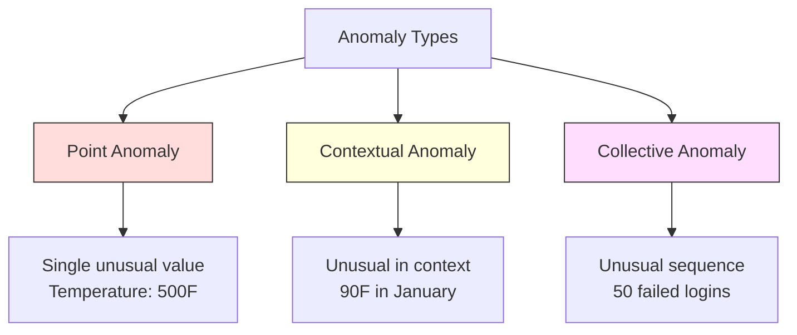
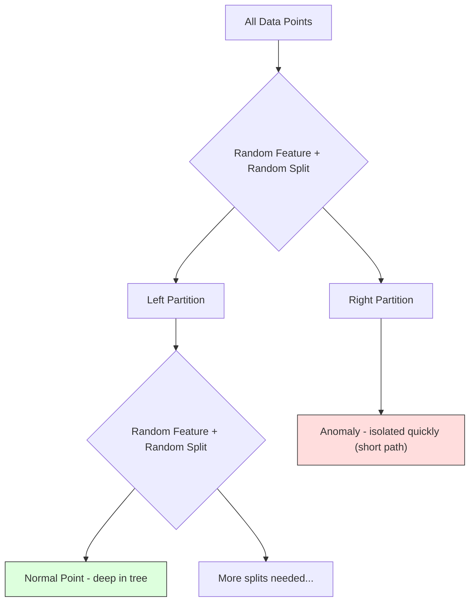
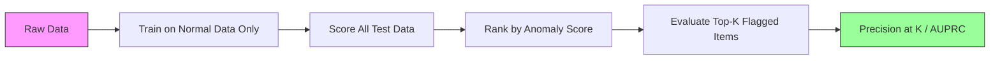

# Detección de anomalías
# 异常检测


> Normal es fácil de definir, anormal es lo que no encaja.

> Normal es fácil de definir.

**Type:** Build | **类型：** 构建
**Language:**¿ Qué pasa ?**语言：**Python
**Prerequisites:** Phase 2, Lessons 01-09 | **前置知识：** Phase 2 第 1-9 课
**Time:** ~75 minutes | **时间：** 约 75 分钟

## Objetivos de aprendizaje

- Implementar desde cero los métodos de detección de anomalías forestales de Z-score, IQR y aislamiento
  Desde el 0 de la realización de Z-score, IQR y aislamiento bosque  métodos de inspección anormal
- Distinguir entre anomalías puntuales, contextuales y colectivas y seleccionar el método de detección adecuado para cada una de ellas
  区分点异常、上下文异常和集合异常, para cada selección de métodos de análisis adecuados
- Explicar por qué la detección de anomalías se enmarca como un modelo de datos normales en lugar de clasificar anomalías
  Explicar por qué la investigación anormal se ha establecido para construir datos normales y no para clasificar las anomalías
- Comparar la detección de anomalías no supervisadas con la clasificación supervisada y evaluar la compensación entre la cobertura de anomalías nuevas y la precisión
  Comparar entre la inspección de anomalías sin supervisión y la clasificación de supervisión, evaluar la tasa de cobertura y precisión de las nuevas anomalías


> **【中文解读】**
> 异常检测找出不同数据点──信用卡欺诈检测、设备故障预警、网络入侵检测都依赖于──隔离森林 和 一级SVM es el método habitual──sklearn 中的隔离森林──

> **【拓展：异常检测在金融和网络安全中的核心应用】**
> El sistema de detección de fraude en tiempo real de Visa procesa aproximadamente 76,000 transacciones por segundo, utilizando métodos mixtos de detección de anomalías + control de aprendizaje, en aproximadamente 150 milisegundos para juzgar si es fraude. El sistema de seguridad en red de Google utiliza detección de anomalías para detectar ataques de DDoS y comportamiento de registro anormal. El sistema de gestión de baterías de Tesla utiliza detección de anomalías para detectar fallas de baterías. El reto central de los controles de anomalías es el desequilibrio extremo. La tasa de fraude suele ser inferior al 0,1%, lo que dificulta el uso directo del aprendizaje de control.

## El problema es la introducción del problema

Una tarjeta de crédito se utiliza en Nueva York a las 2 pm, luego en Tokio a las 2:05 pm. Un sensor de fábrica lee 150 grados cuando el rango normal es 80-120. Un servidor envía 50.000 solicitudes por segundo cuando el promedio diario es 200.

> Una tarjeta de crédito a las 2 de la tarde en Nueva York, luego a las 2:05 en Tokio. La lectura de los sensores de fábrica es de 150 grados, y el rango normal es de 80 a 120 grados.

Estas son anomalías, encontrarlas importa, el fraude cuesta miles de millones, las fallas de equipos cuestan tiempo de inactividad, las intrusiones de la red cuestan datos.

> Estos son los fenómenos inusuales. Se trata de una cuestión de importancia. La fraude ha causado miles de millones de pérdidas.

El reto: rara vez han etiquetado ejemplos de anomalías. El fraude representa el 0,1% de las transacciones. Las fallas de equipos ocurren unas cuantas veces al año. No se puede entrenar un clasificador estándar porque no hay casi nada en la clase de "anomalías" para aprender. Incluso si tienes algunas etiquetas, las anomalías que has visto no son los únicos tipos que encontrarás. El esquema de fraude de mañana se ve diferente del de hoy.

> El reto es que: tienes muy pocos ejemplos de etiquetas anormales. La estafa sólo ocupa el 0,1% de las transacciones. Los fallos de los equipos solo ocurren varias veces al año. No puedes entrenar los clasificadores estándar, porque en la categoría "extraordinarios" casi no hay nada que aprender. Incluso con algunos etiquetas, las anomalías que has visto no son el único tipo que te encontrarás.

La detección de anomalías cambia el problema. En lugar de aprender lo que es anormal, aprenda lo que es normal. Cualquier cosa que se desvía de lo normal es sospechosa. Esto funciona sin etiquetas, se adapta a nuevos tipos de anomalías y se escala a conjuntos masivos de datos.

> 异常检测翻转了问题──不学"qué es anormal",而是学"qué es normal"── cualquier desviación de lo normal es cuestionable── esto no necesita etiquetarse, adaptarse a nuevos tipos de anormalidades, y extenderse a un conjunto de datos masivo──

> **【中文解读】**
> 异常检测的关键思路反转:不学"什么是异常",而是学"什么是正常",偏离正常的就是可疑的.

## El concepto central.

### Tipos de anomalías

No todas las anomalías son iguales:

> No todas las cosas son iguales:

- **Point anomalies.**Un único punto de datos que es inusual independientemente del contexto.$50,000 from an account that normally spends $- ¿Qué?
  Por lo general, el costo de un cuento de 50 dólares es de 50 mil dólares, y de repente se realiza un negocio de 50 mil dólares.
- **Contextual anomalies.**Un punto de datos que es inusual dado su contexto. Una temperatura de 90 grados es normal en verano, anormal en invierno.
  Nota de datos de los datos de los datos de los datos de los datos de los datos de los datos de los datos de los datos de los datos de los datos de los datos de los datos de los datos de los datos de los datos de los datos de los datos de los datos de los datos de los datos de los datos de los datos de los datos de los datos de los datos de los datos de los datos de los datos de los datos de los datos de los datos de los datos de los datos de los datos de los datos de los datos de los datos de los datos de los datos de los datos de los datos de los datos de los datos de los datos de los datos de los datos de los datos de los datos de los datos de los datos de los datos de los datos de los datos de los datos de los datos de los datos de los datos de los datos de los datos de los datos de los datos de los datos de los datos de los datos de los datos de los datos de los datos de los datos de los datos de los datos de los datos de los datos de los datos de los datos de los datos de los datos de los datos de los datos de los datos de los datos de los datos de los datos de los datos de los datos de los datos de los datos de los datos de los datos de los datos de los datos de los datos de los datos de los datos de los datos de los datos de los datos de los datos de los datos de los datos de los datos de los datos de los datos de los datos de los datos de los datos de los datos de los datos de los datos de los datos de los datos de los datos de los datos de los datos de los datos de los datos de los datos de los datos de los datos de los datos de los datos de los datos de los datos de los datos de los datos de los datos de los datos de los datos de los datos de los datos de los datos de los datos de los datos de los datos de los datos de los datos de los datos de los datos de los datos de los datos de los datos de los datos de los datos de los datos de los datos de los datos de los datos de los datos de los datos de los datos de los datos de los datos de los datos de los datos de los datos de los datos de los datos de los datos de los datos de los datos de los datos de los datos de los datos de los datos de los datos de los datos de los datos de los datos de los datos de los datos
- **Collective anomalies.**Una secuencia de puntos de datos que es inusual como grupo, aunque cada punto individual puede ser normal. Cinco fallas de inicio de sesión es normal. Cincuenta consecutivas es un ataque de fuerza bruta.
  集合异常──一组数据点作为整体不正常, incluso cada punto individual puede ser normal──五次登录失败正常──连续五十次就是暴力破解攻击──

La mayoría de los métodos detectan anomalías de puntos. Las anomalías contextuales necesitan características de tiempo o ubicación.

> La mayoría de los métodos de detección de puntos de anomalía.



### El enmarcado sin supervisión

En la clasificación estándar, tienes etiquetas para ambas clases.

> En la clasificación estándar, tienes dos categorías de etiquetas. En la evaluación anormal, normalmente te encuentras con una de las tres situaciones siguientes:

1. **Fully unsupervised.**No hay etiquetas en absoluto. se encaja el detector en todos los datos y esperamos que las anomalías sean lo suficientemente raras como para no corromper el modelo "normal".
   完全无监督──完全没有标签── Usted está en todos los datos de un examinador, espera que las anomalías sean lo suficientemente pequeñas como para no destruir el modelo "normal"──
2. **Semi-supervised.**Tienes un conjunto de datos limpio de datos normales, encajas en este conjunto limpio y calificas todo lo demás. Esta es la configuración más fuerte cuando sea posible.
   半监督──你只有一个干净的正常数据集──你在这个干净集合上适应,然后对所有其他数据打分──这是可能时最强的设置──
3. **Weakly supervised.**Tienes algunas anomalías etiquetadas. Usalas para la evaluación, no para el entrenamiento. Entrenamiento sin supervisión, luego mide la precisión/recall en el subconjunto etiquetado.
   弱监督──you have some markings of anomalies──will use them for evaluation rather than training──无监督训练, then measure precision rate/callback rate on the markings collection──

La clave: la detección de anomalías es fundamentalmente diferente de la clasificación.

> 关键洞察: la investigación anormal es radicalmente diferente a las clases.

### Supervisados vs. No Supervisados: el cambio

Si usted ha etiquetado anomalías, ¿debe utilizarlas para la formación (clasificación supervisada) o solo para la evaluación (detección sin supervisión)?

> Si realmente hay anomalías marcadas, ¿deberían usarse para entrenar o solo para evaluar?

**Supervised (treat as classification):**
- Captura los tipos exactos de anomalías que has visto antes
  Captura el tipo de anomalías que has visto antes
- Precisión superior en tipos de anomalías conocidos
  Precisión superior a los tipos de anomalías conocidos
- Se pierden los tipos de anomalías novedosos por completo
  Completamente err errada por nuevos tipos de anomalías
- Requiere una nueva capacitación cuando surgen nuevos tipos de anomalías
  Cuando surgen nuevos tipos anormales, se necesita reentrenamiento.
- Necesita suficientes ejemplos de anomalías (a menudo muy pocos)
   necesita suficiente muestreo raro (normalmente demasiado poco)

**Unsupervised (model normal, flag deviations):**
- Captura cualquier desviación de la normalidad, incluidos los tipos nuevos
   Captura de cualquier situación que se aleje de la normalidad, incluido el nuevo tipo
- No requiere anomalías etiquetadas
  No necesita señalar las anomalías
- Alza de la tasa de falsos positivos (no todo lo inusual es malo)
  Más alta tasa de falsedad (no todo lo inusual es malo)
- Más robusta para el cambio de distribución
  Para la distribución de los movimientos

En la práctica, los mejores sistemas combinan ambos: detección no supervisada para una amplia cobertura, modelos supervisados para tipos de anomalías conocidos de alta prioridad y revisión humana para casos ambigus.

> En la práctica, el mejor sistema combina dos: la inspección sin supervisión para una amplia cobertura, el modelo de supervisión para el tipo de anomalías de alta prioridad conocidas, la revisión artificial para las situaciones de modalidad.

### Método de puntuación Z

El enfoque más simple: calcular la media y la desviación estándar de cada característica. Marcar cualquier punto más de k desviaciones estándar de la media.

> El método más simple es calcular el valor medio y el diferencial estándar de cada característica.

```text
z_score = (x - mean) / std
anomaly if |z_score| > threshold
```

El umbral predeterminado es de 3,0 (99,7% de los datos normales se encuentran dentro de 3 desviaciones estándar para una distribución gaussiana).

> El valor de la distribución de datos normales del 99,7% de la alta es de 3,0 (en 3 criterios de diferencia)

**Strengths:**Simple. Rápido. Interpretable ("este valor es 4,5 desviaciones estándar de lo normal").

> **优势：**简单――快速――可解释("Este valor está muy lejos de lo normal 4.5 个标准差")

**Weaknesses:**Supone que los datos se distribuyen normalmente. Sensibles a los valores de los datos de formación (los valores de los valores de los valores de los valores de los valores de los valores de los valores de los valores de los valores de los valores de los valores de los valores de los valores de los valores de los valores de los valores de los valores de los valores de los valores de los valores de los valores de los valores de los valores de los valores de los valores de los valores de los valores de los valores de los valores de los valores de los valores de los valores de los valores de los valores de los valores de los valores de los valores de los valores de los valores de los valores de los valores de los valores de los valores de los valores de los valores de los valores de los valores de los valores de los valores de los valores de los valores de los valores de los valores de los valores de los valores de los valores de los valores de los valores de los valores de los valores de los valores de los valores de los valores de los valores de los valores de los valores de los valores de los valores de los valores de los valores de los valores de los valores de los valores de los valores de los valores de los valores de los valores de los valores de los valores de los valores de los valores de los valores de los valores de los valores de los valores de los valores de los valores de los valores de los valores de los valores de los valores de los valores de los valores de los valores de los valores de los valores de los valores de los valores de los valores de los valores de los valores de los valores de los valores de los valores de los valores de los valores de los valores de los valores de los valores de los valores de los valores de los valores de los valores de los valores de los valores de los valores de los valores de los valores de los valores de los valores de los valores de los valores de los valores de los valores de los valores de los cuyo de los cuyo de los cuyo de los cuyo de los cuyo de los cuyo de los cuyo de los cuyo de los cuyo de la cuyo de la cuyo de la cuyo de la cuyo de la cuyo de la cuyo de la cuyo de la cuyo de la cuyo de la de la de la de la de la de la de la de la de la de la de la de la de la de la de la de la de la de la de la de la de la

> **劣势：**假设数据服从正态分布――对训练数据中的异常值敏感异常值会偏移平均值并膨胀标准差,使它们更加难以检测) 在多峰分布上失败

**When it works well:**Monitoreo de una sola característica donde los datos son aproximadamente en forma de campana. Tiempos de respuesta del servidor, tolerancias de fabricación, lecturas de sensores con líneas de base estables.

> **适用场景：**Datos de gran tamaño de la presentación de la hora de forma de monitoreo de las características únicas.

**When it fails:**Datos de múltiples grupos (dos oficinas con diferentes temperaturas de referencia), datos sesgados (importos de transacciones en los que los 1000$ son raros pero no anómalos), datos con valores excepcionales en el conjunto de capacitación.

> **失效场景：**Muchos datos de la clase de trabajo (dos oficinas tienen diferentes temperaturas de base)  datos inclinados (un volumen de transacciones de 1000 dólares es raro pero no es raro)  datos de formación con valores extraordinarios.

### Método de la RIC

Más robusto que la puntuación Z. Utiliza el rango intercuartilar en lugar de la media y la desviación estándar.

> Más que un Z-score, más que un RB.

```
Q1 = 25th percentile
Q3 = 75th percentile
IQR = Q3 - Q1
lower_bound = Q1 - factor * IQR
upper_bound = Q3 + factor * IQR
anomaly if x < lower_bound or x > upper_bound
```

El factor predeterminado es 1.5.

> 默认因子为 1.5──

**Strengths:**Robusto hasta extremo (los porcentajes no se ven afectados por valores extremos). Trabaja en distribuciones sesgadas.

> **优势：**Para los valores de la distribución de los valores de la distribución de los valores de la distribución de los valores de la distribución de los valores de la distribución de los valores de la distribución de los valores de la distribución de los valores de la distribución de los valores de la distribución de los valores de la distribución de los valores de la distribución de los valores de la distribución de los valores de la distribución de los valores de la distribución de los valores de la distribución de la distribución de los valores de la distribución de la distribución de los valores de la distribución de la distribución de los valores de la distribución de la distribución de los valores de la distribución de la distribución de la distribución de los valores de la distribución de la distribución de la distribución de los valores de la distribución de la distribución de la distribución de los valores de la distribución de la distribución de la distribución de la distribución de la distribución de los valores de la distribución de la distribución de la distribución de la distribución de la distribución de la distribución de la distribución de la distribución de la distribución de la distribución de la distribución de la distribución de la distribución de la distribución de la distribución de la distribución de la distribución de la distribución de la distribución de la distribución de la distribución de la distribución de la distribución de la distribución de la distribución de la distribución de la distribución de la distribución de la distribución de la distribución de la distribución de la distribución de la distribución de la distribución de la distribución de la distribución de la distribución de la distribución de la distribución de la distribución de la distribución de la distribución de la distribución de la distribución de la distribución de la distribución de la distribución de la distribución de la distribución de la distribución de la distribución de la distribución de la distribución de la distribución de la distribución de la distribución de la distribución de la distribución de la distribución de la distribución de la distribución de la distribución de la de la de la de la de la distribución de la de la de la distribución de la de la de la de la de la de la de la de la de la de la de la de la de la de la de la de la de la de la de la de la de la de la de la de la de la de la de la de la de la de la de la de la de la de la de la de la de la de la de la de la de la de la de la de la de la de la de la de la de la de la de la de la de la de la de la de la de la de la de la de la de la de la de la de la de

**Weaknesses:**Solo Univariado (aplica por característica de forma independiente). No puede detectar anomalías que son inusuales sólo cuando se consideran las características juntas (un punto puede ser normal en cada característica individualmente pero anómalo en el espacio conjunto).

> **劣势：**仅限单变量 (独立应用于每个特征) ⋅无法检测仅在特征联合考虑时才异常的点 (仅限单变量) ⋅ un punto en cada característica puede ser normal, pero en un espacio联合中异常) ⋅

**Practical note:**El factor 1,5 en IQR corresponde a los bigotes en una gráfica de caja. Los puntos fuera de los bigotes son potenciales valores fuera de lo común. Usando 3.0 en lugar de 1.5 hace que el detector sea más conservador (menos banderas, menos falsos positivos). El factor correcto depende de su tolerancia a las falsas alarmas.

> **实践提示：**El factor 1.5 en el IQR es el factor de respuesta a la cartografía de la caja. El factor externo es el potencial de anomalía. Utiliza el 3.0 en lugar del 1.5 para que el examinador sea más conservador.

### Bosque aislado

La clave: las anomalías son pocas y diferentes. En una partición aleatoria de los datos, las anomalías son más fáciles de aislar, necesitan menos divisiones aleatorias para separarse del resto.

> 关键洞察: las anomalías son muy pocas y diferentes. En la división de datos, las anomalías son más fáciles de separar.



**How it works:**
1. Construir muchos árboles aleatorios (un bosque aislado)
   构建许多随机树 (construir muchos árboles separados)
2. En cada nodo, elija una característica aleatoria y un valor de división aleatoria entre min y max de la característica
   En cada nodo, elegir un rasgo y rasgo de divisor entre el valor mínimo y el valor máximo
3. Continúe dividiendo hasta que cada punto esté aislado (en su propia hoja)
   continuos divisiones hasta que cada punto está separado  en su propio punto de la hoja)
4. Las anomalías tienen una longitud media más corta de trayectoria en todos los árboles
   异常在所有树中平均路径长度更短

**Why it works:**Los puntos normales viven en regiones densas. Se necesitan muchas divisiones aleatorias para aislar uno de sus vecinos. Las anomalías viven en regiones escasas. Una o dos divisiones aleatorias son suficientes para aislarlos.

> **为什么有效：**Normalmente, el punto se encuentra en una zona densa. Se requiere de muchas divisiones de manera aleatoria para aislar un punto de sus vecinos.

La puntuación de anomalía se basa en la longitud promedio de la ruta en todos los árboles, normalizada por la longitud esperada de la ruta de un árbol de búsqueda binaria aleatoria:

>  Diferentes números basados en la longitud media del camino entre todos los árboles, se clasifican por el árbol de búsqueda binaria:

```
score(x) = 2^(-average_path_length(x) / c(n))
```

¿ Dónde ?`c(n)`Es la longitud de trayectoria esperada para n muestras. La puntuación cerca de 1 significa anomalía. La puntuación cerca de 0.5 significa normal. La puntuación cerca de 0 significa muy normal (en grupos densos).

> Entre ellos `c(n)`Es decir, la cantidad de puntos que se encuentran en el grupo de los grupos de datos de la serie de datos de la serie de datos de la serie de datos de la serie de datos de la serie de datos de la serie de datos de la serie de datos de la serie de datos de la serie de datos de la serie de datos de la serie de datos de la serie de datos de la serie de datos de la serie de datos de la serie de datos de datos de la serie de datos de datos de la serie de datos de datos de la serie de datos de datos de la serie de datos de datos de la serie de datos de datos de la serie de datos de datos de datos de la serie de datos de datos de la serie de datos de datos de datos de la serie de datos de datos de datos de la serie de datos de datos de datos de la serie de datos de datos de datos de datos de la serie de datos de datos de datos de datos de datos de datos de la serie de datos de datos de datos de datos de datos de datos de datos de la serie de datos de datos de datos de datos de datos de datos de datos de datos de datos de datos de datos de datos de la serie de datos de datos de datos de datos de datos de datos de datos de datos de datos de datos de datos de datos de datos de la serie de datos de datos de datos de datos de datos de datos de datos de datos de datos de datos de datos de la serie de datos de datos de datos de datos de datos de datos de datos de datos de datos de datos de datos de datos de la red de datos de datos de datos de datos de datos de datos de datos de datos de datos de datos de datos de datos de datos de datos de datos de datos de datos de la UE.

**Strengths:**No hay hipótesis de distribución. Funciona en grandes dimensiones. Escales bien (sublinear en tamaño de muestra porque cada árbol utiliza una submuestra). Maneja tipos de características mixtas.

> **优势：**无分布假设. 适用于高维度. 扩展性好. 样本量亚线性,因为每棵树使用子采样.

**Weaknesses:**Lucha contra las anomalías en regiones densas (efecto de enmascaramiento).

> **劣势：**难以处理密集区域中的异常 ()                                                                                                                                                                                                                                                         

**Key hyperparameters:**
- `n_estimators`El número de árboles. 100 es generalmente suficiente. Más árboles dan puntuaciones más estables pero el cálculo más lento.
  `n_estimators`: Número de árboles ∼100 normalmente suficiente ∼ Más árboles dan una proporción más estable pero el cálculo es más lento ∼
- `max_samples`El número de muestras por árbol. 256 es el valor predeterminado en el papel original. Los valores más pequeños hacen que los árboles individuales sean menos precisos pero aumentan la diversidad. La submuestreo es lo que hace que el bosque de aislamiento sea rápido - cada árbol ve una pequeña fracción de los datos.
  `max_samples`El número de muestras de cada árbol. El artículo original afirma que 256. El valor menor hace que el árbol no sea lo suficientemente preciso, pero aumenta la diversidad.
- `contamination`: Fracción esperada de anomalías. Solo se utiliza para establecer el umbral. No afecta a las puntuaciones en sí.
  `contamination`El número de variables de la probabilidad de variación de la probabilidad de variación de la probabilidad de variación de la probabilidad de variación de la probabilidad de variación de la probabilidad de variación de la probabilidad de variación de la probabilidad de variación de la probabilidad de variación de la probabilidad de variación de la probabilidad de variación de la probabilidad de variación de la probabilidad de variación de la probabilidad de variación de variación de la probabilidad de variación de la probabilidad de variación de variación de la probabilidad de variación de variación de la probabilidad de variación de variación de la probabilidad de variación de variación de la probabilidad de variación de variación de variación de la probabilidad de variación de variación de variación de variación de la probabilidad de variación de variación de variación de variación de variación de variación de variación de variación de variación de variación de variación de variación de variación de variación de variación de variación de variación de variación de variación de variación de variación de variación de variación de variación de variación de variación de variación de variación de variación de variación de variación de variación de variación de variación de variación de variación de variación de variación de variación de variación de variación de variación de variación de variación de variación de variación de variación de variación de variación de variación de variación de variación de variación de variación de variación de variación de variación de variación de variación de variación de variación de variación de variación de variación de variación de variación de variación de variación de variación de variación de variación de variación de variación de variación de variación de variación de variación de variación de variación de variación de variación de variación de variación de variación de variación de variación de variación de variación de variación de variación de variación de variación de variación de variación de variación de variación de variación de variación de variación de variación de la variación de la variación de la variación de la variación de la variación de la variación de

### Factor local de extranjero (LOF)

LOF compara la densidad local alrededor de un punto con la densidad alrededor de sus vecinos.

> LOF comparará la densidad local alrededor de un punto con la densidad de su vecino.

**How it works:**
1. Para cada punto, encontrar su k vecinos más cercanos
   对于每点,找到其 k 个近邻
2. Calcule la densidad de accesibilidad local (cuán densa es la vecindad)
   计算局部可达密度 (cualquier área de cuentas es muy densa)
3. Comparar la densidad de cada punto con la densidad de sus vecinos
   Comparar la densidad de cada punto con la densidad de sus vecinos
4. Si un punto tiene una densidad mucho menor que sus vecinos, es un punto fuera de lugar
   Si la densidad de un punto es mucho menor que la de su vecino, es un punto anormal.

**LOF score:**
- LOF cerca de 1,0 significa densidad similar a la de los vecinos (normal)
  LOF  cerca de 1.0 significa similar a la densidad del vecino
- LOF mayor a 1,0 significa densidad menor que las de los vecinos (potencialmente anómalas)
  LOF mayor a 1.0 significa densidad inferior a la vecindad (maybe raro)
- LOF mucho mayor que 1,0 (por ejemplo, 2,0+) significa una densidad significativamente menor (anomalía probable)
  LOF 远大于1.0 (como 2.0+) significa densidad significativamente menor (muy posible que sea anormal)

La parte "local" es crítica. Considere un conjunto de datos con dos cúmulos: un cúmulo denso de 1000 puntos y un cúmulo escaso de 50 puntos. Un punto en el borde del cúmulo escaso no es inusual globalmente - tiene 50 vecinos. Pero es inusual localmente si sus vecinos inmediatos son más densos de lo que es. LOF captura este matiz que los métodos globales pierden.

> "Local" es clave. Considerar un conjunto de datos que tiene dos grupos de datos: un grupo de 1000 puntos de concentración y un grupo de 50 puntos de rarefacción.

**Strengths:**Detecta anomalías locales (puntos que son inusuales en su vecindario, aunque no sean inusuales a nivel mundial).

> **优势：**检测局部异常 (en inglés: inspection local anomalies) 检测 local anomalies (en inglés: inspection local anomalies) 检测 local anomalies (en inglés: inspection local anomalies) 检测 local anomalies (en inglés: inspection local anomalies) 检测 local anomalies (en inglés: inspection local anomalies) 检测 local anomalies (en inglés: inspection local anomalies) 检测 local anomalies (en inglés: inspection local anomalies) 检测 local anomalies (en inglés: inspection local anomalies) 检测 local anomalies (en inglés: inspection local anomalies) 检测 local anomalies (en inglés: inspection) 检测 local anomalies (en inglés: inspection) 检测 local anomalies (en inglés: inspection) 检测 local anomalies) 检测 local anomalies (en inglés: inspection) 检测 local anomalies) 检测 local anomalies (en el caso de diferentes densidades) 

**Weaknesses:**Lento en grandes conjuntos de datos (O(n^2) para implementación ingenua). Sensible a la elección de k. No funciona bien en dimensiones muy altas (la maldición de dimensionalidad afecta los cálculos de distancia).

> **劣势：**En el gran conjunto de datos, la velocidad es lenta (n^2)).

### Comparación

| Method | Assumptions | Speed | Handles High Dims | Detects Local Anomalies |
|--------|------------|-------|-------------------|------------------------|
| Z-score | Normal distribution | Very fast | Yes (per feature) | No |
| IQR | None (per feature) | Very fast | Yes (per feature) | No |
| Isolation Forest | None | Fast | Yes | Partially |
| LOF | Distance is meaningful | Slow | Poorly | Yes |

### Desafíos en la evaluación

La evaluación de detectores de anomalías es más difícil que la evaluación de clasificadores:

> evaluación de los exámenes de anomalías más difícil que la evaluación de los grupos de ensayos:

- **Extreme class imbalance.**Con anomalías del 0,1%, predecir "normal" para todo da una precisión del 99,9%.
  En el extremo de la categoría no se equilibra: 0.1% de las anomalías, todas las previsiones son "normales" y pueden alcanzar el 99.9% de la precisión:
- **AUROC is misleading.**Con un fuerte desequilibrio, AUROC puede verse bien incluso cuando el modelo no tiene la mayoría de anomalías en los umbrales prácticos.
  AUROC 具有误导性──在严重不平衡时, incluso si el modelo en valor práctico ha fallado la mayor parte de las anomalías, AUROC parece seguir siendo incorrecto──
- **Better metrics:**Precision@k (de los elementos marcados en la parte superior de k, cuántas son anomalías reales), AUPRC (área bajo curva de recalco de precisión) y recalco a una tasa de falso positivo fija.
  Mejor indicador:Precisión@k(排名前 k 个标记项中有多少是真正异常) 、AUPRC(精确率-召回率曲线下面积) y 假阳性率下召回率──



### El gasoducto de detección de anomalías

En la práctica, la detección de anomalías sigue este flujo de trabajo:

> En la práctica, la investigación de anomalías sigue los siguientes procesos de trabajo:

1. **Collect baseline data.**Lo ideal es un período en el que se sabe que no hay (o muy pocas) anomalías.
   收集基线数据── en el caso ideal, es un período de tiempo que usted sabe que no hay 
2. **Feature engineering.**Características primas más características derivadas (estadísticas de rodamiento, características temporales, relaciones).
   Características de la construcción. Características originales, además de características derivadas.
3. **Train the detector.**El modelo aprende cómo es "normal".
   訓練检测器──在基线数据上拟合──模型学习"正常"的样式──
4. **Score new data.**Cada nueva observación obtiene una puntuación de anomalía.
   Para cada nueva observación se obtiene un número de datos extraordinarios.
5. **Threshold selection.**Es una decisión de negocios: un umbral más alto significa menos falsas alarmas pero más anomalías perdidas.
   选择值――选择分数截断值―― es una decisión de negocio: un valor más alto significa menos errores, pero más errores.
6. **Alert and investigate.**Los puntos señalados se remiten a la revisión humana o a la respuesta automática.
   告警和调查──marcación de puntos de entrada en la revisión artificial o la respuesta automática──
7. **Feedback collection.**Registra si los elementos señalados fueron anomalías o falsas alarmas.
   收集反──记录标记项是真的异常还是错报──使用这些数据评估检测器并随时间调优值──

La tubería nunca está "hecha". Las distribuciones de datos cambian, surgen nuevos tipos de anomalías y los umbrales necesitan ajuste. Trata la detección de anomalías como un sistema vivo, no un modelo único.

> 管线永远不会"完成"―― datos se desplazan, aparecen nuevos tipos de anomalías, value need adjust――将异常检测视为一个活系统,而不是一次模型――

## Construye y realiza.

> **【中文解读】**
> Desde la implementación de tres métodos de detección de anomalías: Z-score, basado en el valor medio y en la diferencia estándar, adaptado a datos de distribución de estado normal aproximado)  IQR, basado en la distancia de cuatro puntos, en el valor de anomalías (ru棒)  Bosque de aislamiento  Asimismo, las características de selección y los puntos de separación de datos, los puntos de aislamiento necesitan un número de veces de separación más pequeño en promedio)  El bosque de aislamiento es el método de detección de anomalías de supervisión más común en la industria.

> **【拓展：异常检测在 AIOps 和制造业中的应用】**
> Microsoft Azure Monitor utiliza la detección de anomalías automática para detectar anomalías de rendimiento de los servicios en la nube; Netflix utiliza la detección de anomalías para controlar los diferentes indicadores de los servicios de streaming (la retraso y la tasa de error), detecta miles de millones de puntos de datos diarios; Fujicom utiliza la detección de anomalías en la línea de producción para detectar fallas de dispositivos, lo que reducirá el tiempo de parada en un 30%. El reto clave de la detección de anomalías es controlar la tasa de error de información.
```figure
f3-anomaly-fence
```

## Construye el mismo

El código en `code/anomaly_detection.py`Implementa la puntuación Z, el IQR y el bosque de aislamiento desde cero.

> `code/anomaly_detection.py`El código medio desde cero ha logrado el Z-score, el IQR y el Bosque de aislamiento.

### Detector de puntaje Z

```python
def zscore_detect(X, threshold=3.0):
    mean = X.mean(axis=0)
    std = X.std(axis=0)
    std[std == 0] = 1.0
    z = np.abs((X - mean) / std)
    return z.max(axis=1) > threshold
```

Simple y vectorial. Envase un punto si alguna característica excede el umbral.

> 简单且向量化──如果任何特征超过值则标记该点──

### Detector de RIC

```python
def iqr_detect(X, factor=1.5):
    q1 = np.percentile(X, 25, axis=0)
    q3 = np.percentile(X, 75, axis=0)
    iqr = q3 - q1
    iqr[iqr == 0] = 1.0
    lower = q1 - factor * iqr
    upper = q3 + factor * iqr
    outside = (X < lower) | (X > upper)
    return outside.any(axis=1)
```

### El bosque de aislamiento desde cero

La implementación desde cero construye árboles de aislamiento que particionan al azar el espacio de características:

> Desde el punto de vista de la construcción, el espacio se separa de los árboles:

```python
class IsolationTree:
    def __init__(self, max_depth):
        self.max_depth = max_depth

    def fit(self, X, depth=0):
        n, p = X.shape
        if depth >= self.max_depth or n <= 1:
            self.is_leaf = True
            self.size = n
            return self
        self.is_leaf = False
        self.feature = np.random.randint(p)
        x_min = X[:, self.feature].min()
        x_max = X[:, self.feature].max()
        if x_min == x_max:
            self.is_leaf = True
            self.size = n
            return self
        self.threshold = np.random.uniform(x_min, x_max)
        left_mask = X[:, self.feature] < self.threshold
        self.left = IsolationTree(self.max_depth).fit(X[left_mask], depth + 1)
        self.right = IsolationTree(self.max_depth).fit(X[~left_mask], depth + 1)
        return self
```

La longitud del camino para aislar un punto determina su puntaje de anomalía.

> La longitud del camino separado de un punto determina su número de partes anormales.

El `IsolationForest`clase envuelve varios árboles:

> `IsolationForest`类包装了多棵树:

```python
class IsolationForest:
    def __init__(self, n_estimators=100, max_samples=256, seed=42):
        self.n_estimators = n_estimators
        self.max_samples = max_samples

    def fit(self, X):
        sample_size = min(self.max_samples, X.shape[0])
        max_depth = int(np.ceil(np.log2(sample_size)))
        for _ in range(self.n_estimators):
            idx = rng.choice(X.shape[0], size=sample_size, replace=False)
            tree = IsolationTree(max_depth=max_depth)
            tree.fit(X[idx])
            self.trees.append(tree)

    def anomaly_score(self, X):
        avg_path = average path length across all trees
        scores = 2.0 ** (-avg_path / c(max_samples))
        return scores
```

El factor de normalización `c(n)`es la longitud esperada de la trayectoria de una búsqueda fallida en un árbol de búsqueda binaria con n elementos.`2 * H(n-1) - 2*(n-1)/n`donde`H`Esta normalización garantiza que las puntuaciones sean comparables en conjuntos de datos de diferentes tamaños.

> 归一化因子                                                                                                                                                                                                                                                                                                                                                                                                                                                                                                                        `c(n)`Es la longitud del camino de la búsqueda esperada en el árbol de búsqueda de n 个元素.`2 * H(n-1) - 2*(n-1)/n`, entre ellos `H`Es la regulación y la cantidad. Esta regeneración asegura que el porcentaje entre diferentes conjuntos de datos de tamaño comparable.

### Escenarios de demostración

El código genera múltiples escenarios de prueba:

> 代码生成多个测试场景:

1. **Single cluster with outliers.**Un cúmulo Gaussiano 2D con anomalías inyectadas lejos del centro.
   Un grupo de 2D, en el centro de distancia, se infunde en las anomalías. Todos los métodos en este escenario deberían funcionar.
2. **Multimodal data.**Tres grupos de diferentes tamaños y densidades. Los puntos entre grupos son anómalas.
   Los puntos entre tres grupos de diferentes dimensiones y densidades de concentración son inusuales.
3. **High-dimensional data.**50 características, pero las anomalías difieren en sólo 5 de ellas.
   Alta altura de datos: 50 características, pero las anomalías sólo difieren en 5 características:

Cada demo compara todos los métodos utilizando precisión, recall, F1, y Precision@k.

> Cada demostración utiliza la tasa de precisión, la tasa de retorno, F1 y Precision@k

## Usalo con el marco de ejecución

Con sklearn (utilizando implementaciones de bibliotecas, no desde cero):

> Utilizaciones de la página web:

```python
from sklearn.ensemble import IsolationForest
from sklearn.neighbors import LocalOutlierFactor

iso = IsolationForest(n_estimators=100, contamination=0.05, random_state=42)
iso.fit(X_train)
predictions = iso.predict(X_test)

lof = LocalOutlierFactor(n_neighbors=20, contamination=0.05, novelty=True)
lof.fit(X_train)
predictions = lof.predict(X_test)
```

Nota `contamination`La configuración correcta importa, demasiado bajo pierde anomalías, demasiado alto crea falsas alarmas.

> Atención .`contamination` establecer la proporción de anomalías esperadas  establecer correctamente es importante demasiado bajo para detectar anomalías, demasiado alto para producir errores

El código en `anomaly_detection.py`comparar las implementaciones desde cero con las de sklearn en los mismos datos.

> `anomaly_detection.py`El código medio se compara con el de cero realizado en los mismos datos.

### Parámetro de contaminación de sklearn

El `contamination`El parámetro en sklearn determina el umbral para convertir las puntuaciones de anomalía continua en predicciones binarias.

> sklearn 中的 `contamination`参数决定将连续异常分数转换为二值预测的值──它不改变底层分数──

```python
iso_5 = IsolationForest(contamination=0.05)
iso_10 = IsolationForest(contamination=0.10)
```

Ambos producen los mismos resultados de anomalías.`iso_5`señala el 5% superior mientras que `iso_10`Si no conoce la verdadera tasa de anomalías (por lo general no lo hace), establece la contaminación en "automático" y trabaje directamente con los puntajes en bruto.

>  ambos producen el mismo número de diferencias  pero `iso_5`标记前 5%, y `iso_10`标记前 10%── Si no sabes la verdadera tasa de anomalías ((normalmente no sabes), la contaminación se establecerá como "auto" y se utilizará directamente con el porcentaje inicial── basándose en el peso de costos entre falsos positivos y falsos negativos, establecer su propio valor──

### M.S.V. de una clase

Otro detector de anomalías no supervisado que vale la pena conocer. Un SVM de una clase se ajusta a un límite alrededor de los datos normales en un espacio de características de alta dimensión (utilizando el truco del núcleo).

> Otro de los inspectores de anomalías no supervisados que vale la pena conocer.

```python
from sklearn.svm import OneClassSVM

oc_svm = OneClassSVM(kernel="rbf", gamma="auto", nu=0.05)
oc_svm.fit(X_train)
predictions = oc_svm.predict(X_test)
```

El `nu`El sistema de SVM de una clase funciona bien en conjuntos de datos pequeños y medianos, pero no se escala a datos muy grandes (la matriz del núcleo crece cuadráticamente).

> `nu`参数近似异常比例――One-Class SVM es muy eficaz en los pequeños conjuntos de datos, pero no puede extenderse a datos muy grandes (núcleo de la matriz presenta un segundo crecimiento)―

### Autoencoder enfoque (previsión)

Los autoencodadores son redes neuronales que aprenden a comprimir y reconstruir datos. Entrenamiento en datos normales. En el momento de la prueba, las anomalías tienen alto error de reconstrucción porque la red aprendió a reconstruir patrones normales sólo.

> El autocodificador es una red neuronal que aprende a comprimir y reconstruir datos. En los ensayos de datos normales, las anomalías tienen un alto peso en la estructura, ya que las redes sólo aprenden a reconstruir el modo normal.

Esto se cubre en la Fase 3 (Aprendizaje Profundo), pero el principio es el mismo: modelo lo que es normal, marca lo que se desvía.

> Esto se discute en la Fase 3 (de profundidad de aprendizaje), pero el principio es el mismo: construir lo que es normal, marcado por la desviación.

### Ensemble Detección de Anomalias

Así como los métodos de conjunto mejoran la clasificación (lección 11), combinar múltiples detectores de anomalías mejora la detección.

> Como el método de integración para mejorar la clasificación (§§11), la combinación de varios exámenes de anomalías puede mejorar la detección.

1. Ejecutar detectores múltiples (punto Z, IQR, bosque de aislamiento, LOF)
   运行多个检测器(Z-score、IQR、isolación Bosque、LOF)
2. Normaliza las puntuaciones de cada detector a [0, 1]
   Para que el número de cada detector se vuelva a [0, 1]
3. Promedio de las puntuaciones normalizadas
   平均归归归归归归归归归归归归归归归归归归归归归归归归归归归归归归归归归归归归归归归归归归归归归归归归归归归归归归归归归归归归归归归归归归归归归归归归归归归归归归归归归归归归归归归归归归归归归归归归归归归归归归归归归归归归归归归归归归归归归归归归归归归归归归归归归归归归归归归归归归归归归归归归归归归归归归归归归归归归归归归归归归归归归归归归归归归归归归归归归归归归归归归归归归归归归归归归归归归归归归归归归归归归归归归归归归归归归归归归归归归归归归归归归归归归归归归归归归归归归归归归归归归归归归归归归归归归归归归归归归归归归归归归归归归归归归归归归归归归归归归归归归归归归归归归归归归归归归归归归归归归归归归归归归归归归归归归归归归归归归归归归归归归归归归归归归归归归归归归归归归归归归归归归归归归归归归归归归归归归归归归归归归归归归归归归归归归归归归归归归归归归归归归归归归归归归归归归归归归归归归归归归归归归归归归归归归归归归归归归归归归归归归归归归归归归归归归归归归归归归归归归归归归归归归归归归归归归归归归归归归归归归归归归归归归归归归归归归归归归归归归归归归归归归归归归归归归归归归归归归归归归归归归归归归归
4. Puntos de bandera por encima del umbral de la puntuación media
   标记平均分数超过值的点

Esto reduce los falsos positivos porque diferentes métodos tienen diferentes modos de falla. Un punto marcado por los cuatro métodos es casi ciertamente anómalo. Un punto marcado por sólo uno podría ser una peculiaridad de ese método.

> Esto reduce el falso positivo, ya que los diferentes métodos tienen diferentes modelos de fracaso.

Los ensambles más sofisticados ponderan cada detector por su fiabilidad estimada (medida en un conjunto de validación con anomalías conocidas, si está disponible).

> Más compleja integración de la estimación de la fiabilidad de cada inspector (si es posible, en el conjunto de pruebas de anomalías conocidas)

### Considerancias de producción

1. **Threshold drift.**A medida que la distribución de datos cambia, un umbral fijo se vuelve anticuado.
   Valor漂移── Con la distribución de datos, el valor fijo se vuelve obsoleto──monitoreo de la distribución y regular ajuste de las cantidades de partículas anormales──
2. **Alert fatigue.**Las alarmas falsas y los operadores de Internet dejan de prestar atención a las alarmas falsas, comienzan con un umbral más alto (menos alertas confiables) y bajenlo a medida que crece la confianza.
   告警疲劳──太多误报会让操作员不再关注──从高值开始(更少、更可靠的告警), con el crecimiento de la confianza, la re-reducción──
3. **Ensemble approach.**En la producción, combine múltiples detectores. Marque un punto sólo si varios métodos coinciden en que es anómalo. Esto reduce significativamente los falsos positivos.
   集成方法──在生产中,组合多检测器──只有当多种方法一致一致认为异常时才标记──这显著减少假阳性──
4. **Feature engineering.**Las características primas son raramente suficientes. Añadir estadísticas de rodamiento, proporciones, tiempo desde el último evento y características específicas de dominio. Una buena característica define más que la elección del detector.
   Características de la ingeniería. Las características originales son muy pocas.
5. **Feedback loop.**Cuando los operadores investiguen los elementos señalados y los confirman o descartan, los devuelven al sistema.
   Cuando el operador confirma o elimina los datos de la encuesta, se pondrá en marcha un sistema de entrada de datos para evaluar y mejorar los controles.

## Envíe el producto .

Esta lección produce:
- `outputs/skill-anomaly-detector.md`-- una habilidad de decisión para elegir el detector adecuado
  `outputs/skill-anomaly-detector.md` 选择合适检测器's habilidades de decisión
- `code/anomaly_detection.py`-- Z-score, IQR, y el bosque de aislamiento desde cero, con comparación sklearn
  `code/anomaly_detection.py` Desde la realización de la puntuación Z, IQR y Selva de aislamiento, con comparación de

### Elegir un umbral

La puntuación de anomalías es continua, necesitas un umbral para tomar decisiones binarias, es una decisión de negocios, no técnica.

> 

Considere dos escenarios:
- **Fraud detection.**El fraude que falta es caro (reembolsos, confianza del cliente). Los falsos alarmas cuestan a un analista humano 5 minutos para investigar.
  欺诈检测――漏检欺诈代价高昂(退款、客户信任) ―― Error reporting needs analyst 5 分钟调查―― Set low值 to catch more fraud, accept more error report──
- **Equipment maintenance.**Una falsa alarma significa un cierre innecesario que cuesta mucho .$50,000. A missed failure means a $Establezca el umbral para equilibrar estos costos.
  设备维护――误报 significa incesante parada, costo 50.000 美元――漏检故障 significa 500.000 美元 de reparación―― configuración值以平衡这些成本――

En ambos casos, el umbral óptimo depende de la relación de costes entre falsos positivos y falsos negativos.

> En ambos casos, el valor óptimo depende de la relación de costos entre falso positivo y falso negativo. En diferentes valores, se trazan la tasa de precisión y la tasa de recuperación, la función de costos superpuestos, y se selecciona el punto de costo mínimo.

### Escalación a la producción

Para la detección de anomalías en tiempo real en la producción:

> 对于生产中的实时异常检测:

1. **Batch training, online scoring.**Entrenar el modelo periódicamente (diariamente, semanalmente) con datos normales recientes.
   批量训练,在线打分──定期(每天、每周) en el modelo de entrenamiento en datos normales a corto plazo── cada nuevo observación llega a tiempo de打分──
2. **Feature computation must match.**Si se ha entrenado con estadísticas de rodaje durante 30 días, se necesita 30 días de historia para calcular características para una nueva observación.
   Si se utiliza un entrenamiento de estadística de 30 días, se necesita 30 días de historia para obtener nuevas características de cálculo de observación.
3. **Score distribution monitoring.**Si la media se desplaza hacia arriba, los datos están cambiando o el modelo está obsoleto.
   Se puede observar la distribución de los datos, o el modelo ya está obsoleto.
4. **Explainability.**Cuando señala una anomalía, diga por qué. Z-score: "La característica X es 4.2 desviaciones estándar por encima de lo normal".
   Cuando se marca una situación de desorden, se explica la razón.

## Los ejercicios.

1. **Threshold tuning.**ejecuta el detector de puntaje Z con umbrales de 1.0 a 5.0 en pasos de 0.5.
   1. En los datos de estado normal, se insertan diferentes proporciones de anomalías (1% ∼5% ∼10%) ∼ comparación entre Z-score ∼IQR y el índice de precisión y de recarga de la selva de aislamiento ∼

2. **Multivariate anomalies.**Crear datos 2D donde cada característica individual se ve normal, pero la combinación es anómala (por ejemplo, puntos lejos de la diagonal principal del grupo). Muestre que la puntuación Z por característica se pierde, pero el bosque de aislamiento las captura.
   2. Se ha creado un conjunto de datos de valores normales en invierno y verano diferentes.

3. **LOF from scratch.**Implemente el Factor Local Outlier utilizando k-vizinos más cercanos. Comparar con el LocalOutlierFactor de sklearn en los mismos datos. Utilice k=10 y k=50 - ¿cómo afecta la elección de k a los resultados?
   3. Construir un bosque aislado 集成: entrenar 10 árboles aislados, tomar una longitud media de camino  Comparar un árbol con la estabilidad de la integración

4. **Streaming anomaly detection.**Modificar el detector de Z-score para que funcione en un entorno de transmisión: actualizar el promedio y la varianza en ejecución a medida que llegan nuevos puntos (algorithmo en línea de Welford).
   4. Usar autoencoder, pensar en realizar la prueba de anomalías: entrenar un modelo de reconstrucción simple, marcando los puntos de error de la reconstrucción para que sean extraordinarios.

5. **Real-world evaluation.**Tomemos un conjunto de datos con anomalías conocidas (fraude de tarjetas de crédito de Kaggle, por ejemplo). Evaluar los cuatro métodos utilizando precision@100, precision@500 y AUPRC. ¿Cuál método funciona mejor? ¿Por qué?

> **【中文解读】**
> Evaluación de los análisis de anomalías con Precision@K(排名 K 个可疑案例中有多少是真正的异常) y AUPRC(精确率-召回率曲线下面积) es más significativa que la precisión rate。Isolation Forest's core insight:

## Términos clave .

| Term | What people say | What it actually means |
|------|----------------|----------------------|
| Anomaly | "Outlier, unusual point" | A data point that deviates significantly from the expected pattern of normal data |
| Point anomaly | "A single weird value" | An individual observation that is unusual regardless of context |
| Contextual anomaly | "Normal value, wrong context" | An observation that is unusual given its context (time, location, etc.) but might be normal in another context |
| Isolation Forest | "Random splits to find outliers" | An ensemble of random trees that isolates anomalies with fewer splits than normal points |
| Local Outlier Factor | "Compare density to neighbors" | A method that flags points whose local density is much lower than their neighbors' density |
| Z-score | "Standard deviations from mean" | (x - mean) / std, measuring how far a point is from the center in units of standard deviation |
| IQR | "Interquartile range" | Q3 - Q1, measuring the spread of the middle 50% of data, used for robust outlier detection |
| Contamination | "Expected fraction of anomalies" | A hyperparameter telling the detector what proportion of the data it should flag as anomalous |
| Precision@k | "Of the top k flags, how many are real" | Precision computed on only the k most suspicious points, useful for imbalanced anomaly detection |
| AUPRC | "Area under precision-recall curve" | A metric that summarizes precision-recall performance across all thresholds, better than AUROC for imbalanced data |

## Más Leer más Leer más

- [Liu et al., Isolation Forest (2008)](https://cs.nju.edu.cn/zhouzh/zhouzh.files/publication/icdm08b.pdf)-- el papel original de la Selva de aislamiento
  [Liu et al.: Isolation Forest (2008)](https://ieeexplore.ieee.org/document/4781136)- El bosque de aislamiento
- [Breunig et al., LOF: Identifying Density-Based Local Outliers (2000)](https://dl.acm.org/doi/10.1145/342009.335388)-- el papel original de LOF
  [Chandola et al.: Anomaly Detection: A Survey (2009)](https://dl.acm.org/doi/10.1145/1541880.1541882)- 异常检测综述
- [scikit-learn Outlier Detection docs](https://scikit-learn.org/stable/modules/outlier_detection.html)-- visión general de todos los detectores de anomalías de sklearn
  [scikit-learn 异常检测](https://scikit-learn.org/stable/modules/outlier_detection.html)
- [Chandola et al., Anomaly Detection: A Survey (2009)](https://dl.acm.org/doi/10.1145/1541880.1541882)-- un estudio exhaustivo de los métodos de detección de anomalías
- [Goldstein and Uchida, A Comparative Evaluation of Unsupervised Anomaly Detection Algorithms (2016)](https://journals.plos.org/plosone/article?id=10.1371/journal.pone.0152173)-- comparación empírica de 10 métodos en conjuntos de datos reales
