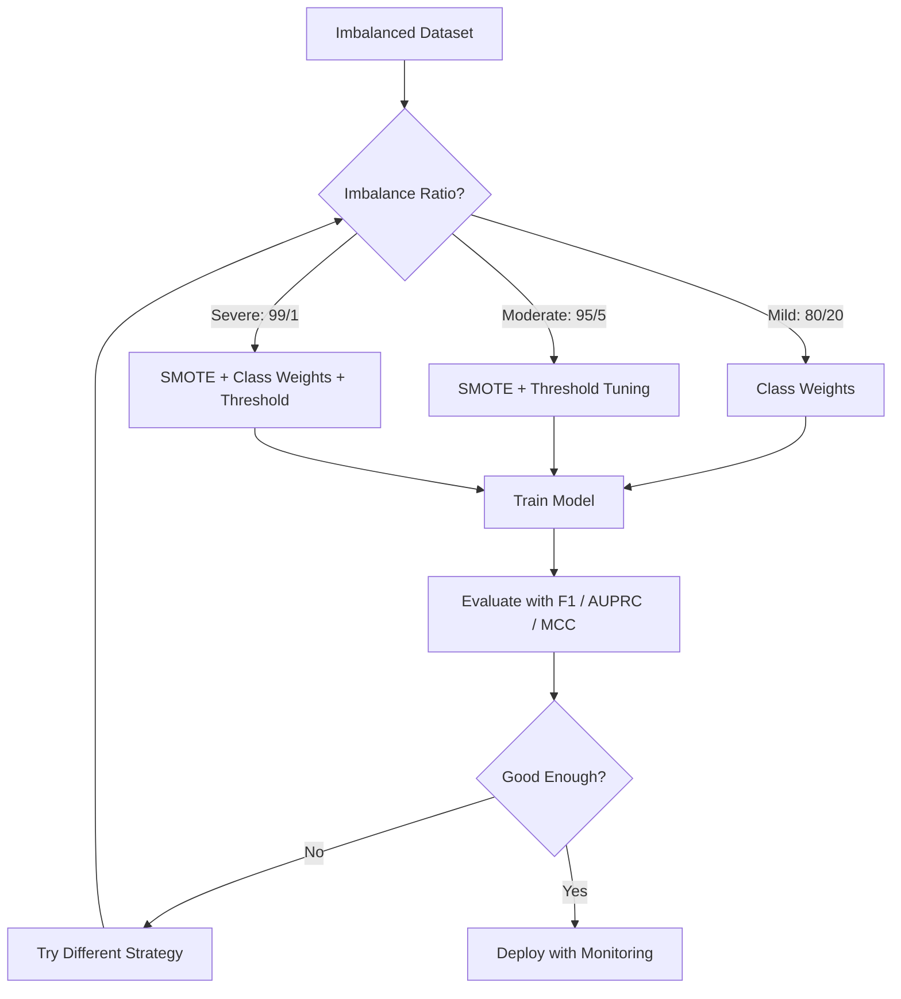
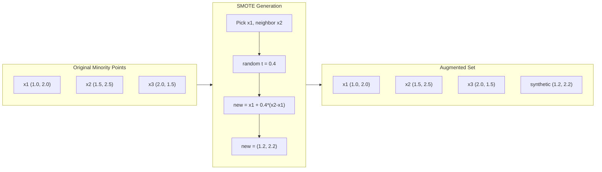
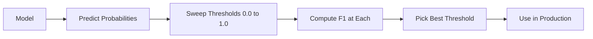
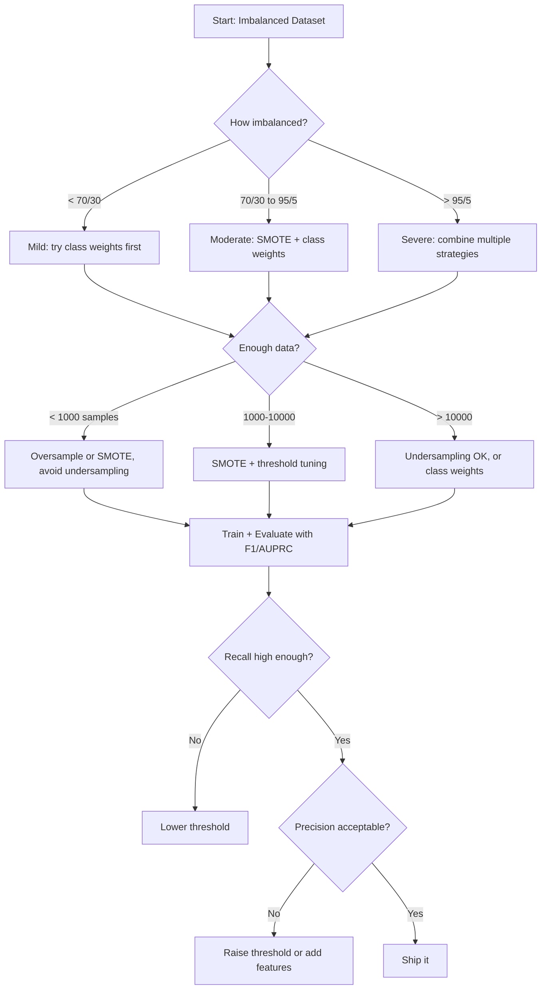

# Tratar datos desequilibrados
# 处理不平衡数据


> Cuando el 99% de sus datos son "normales", la precisión es una mentira.

> Cuando el 99% de los datos son "normales", la precisión es una mentira.

**Type:** Build | **类型：** 构建
**Language:**¿ Qué pasa ?**语言：**Python
**Prerequisites:** Phase 2, Lessons 01-09 (especially evaluation metrics) | **前置知识：** Phase 2 第 1-9 课（尤其是评估指标）
**Time:** ~90 minutes | **时间：** 约 90 分钟

## Objetivos de aprendizaje

- Implemente SMOTE desde cero y explique cómo la sobresampulación sintética difiere de la duplicación aleatoria
  Desde la realización de la SMOTE, explica la diferencia entre la composición de muestras y la copia de las muestras
- Evaluar clasificadores desequilibrados utilizando el coeficiente de correlación de F1, AUPRC y Matthews en lugar de precisión
  Utiliza F1 、AUPRC 和马修斯相关系系数 (MCC)  evaluación de la tasa de desequilibrio de las categorías, y no de precisión
- Comparar las estrategias de ponderación de clases, ajuste de umbral y repetición de muestras y seleccionar el enfoque adecuado para una relación de desequilibrio dada
  Comparar las clases de peso, valor y estrategia de recogeo, para determinar la proporción desequilibrada seleccionar el método correcto
- Construir una línea de datos desequilibrada completa que combine SMOTE, pesos de clase y optimización de umbral
  Construir un conjunto de SMOTE  Clasificación de peso y valor optimizado 


> **【中文解读】**
> La falta de balance de datos entre los datos es una estrategia habitual. En el análisis de fraude financiero y en el diagnóstico médico, los datos desequilibrados son una tendencia habitual.

> **【拓展：不平衡数据在真实系统中的挑战】**
> PayPal procesa alrededor de 400 millones de transacciones diarias, la tasa de fraude es de sólo 0.3%, pero cada día sigue significando alrededor de 120 millones de transacciones de fraude. La tasa de precisión para evaluar no tiene sentido.

## El problema es la introducción del problema

Construye un modelo de detección de fraude, tiene una precisión del 99,9%, celebra y se da cuenta de que predice "no fraude" para cada transacción.

> Usted construyó un modelo de análisis de fraude. Obtuvo una tasa de precisión del 99,9%. Luego se dio cuenta de que predice "no fraude" a cada transacción.

Esto no es un error. Es lo racional que se debe hacer cuando solo el 0,1% de las transacciones son fraudulentas. El modelo aprende que siempre adivinar a la clase mayoritaria minimiza el error general. Es técnicamente correcto y completamente inútil.

> Esto no es un error. Cuando solo el 0,1% de las transacciones son engañosas, es un comportamiento razonable.

Esto sucede en todas partes en materia de clasificación real. Diagnóstico de enfermedad: 1% tasa positiva. Intrusión de red: 0.01% ataques. Defectos de fabricación: 0.5% defectuosos. Filtración de spam: 20% spam. Previsión de churn: 5% churners. Cuanto más consecuente sea la clase minoritaria, más rara tiende a ser.

> Esto ocurre en lugares donde realmente se necesita una clase de personas. El diagnóstico de enfermedades: 1% 阳性率: 0.01% 网络入侵: 0.01% 攻击: 0.5% 制造缺陷: 0.5% 缺陷: 垃圾邮件过: 20% 垃圾邮件: 客户流失预测: 5% 流失者: 流失者: 少数类越重要,越稀有:

La precisión falla porque trata todas las predicciones correctas de manera igual. Etiquetar correctamente una transacción legítima y detectar el fraude correctamente son ambos puntos de precisión. Pero detectar el fraude es la razón por la que existe el modelo. Necesitamos métricas, técnicas y estrategias de entrenamiento que obliguen al modelo a prestar atención a la clase rara pero importante.

> 准确率失败因为它同等对待所有正确预测──正确标记合法交易和正确捕获欺诈都算准准确率的一分之一──但捕获欺诈是模型存在的全部原因──我们需要迫使模型关注稀有的但重要类别的标志,技术和训练策略──

> **【中文解读】**
> El problema central de los datos no equilibrados es que la tasa de precisión es "mensaje"―99.9% 准确率可能只是全猜多数类──correcto práctica:(1) Cambiar de índice con F1、AUPRC、MCC 替代准确率;(2) 重采采采SMOTE 过采样少数类或缺采样多数类;(3) 代价敏感学习给少数类更大的损失权重;(4) 调整值降低分类通常提高召回率──组合使用多种策略效果最好──

## El concepto central.

### Por qué no es exacto

Considere un conjunto de datos con 1000 muestras: 990 negativas, 10 positivas. Un modelo que siempre predice negativo:

> 考虑一个1000个样本的数据集:990个负样本,10个正样本──一个始终预测负类型的模型:

|  | Predicted Positive | Predicted Negative |
|--|---|---|
| Actually Positive | 0 (TP) | 10 (FN) |
| Actually Negative | 0 (FP) | 990 (TN) |

Precisión = (0 + 990) / 1000 = 99,0%

El modelo detecta cero fraude, cero enfermedad, cero defectos, pero la precisión dice 99%.

> El modelo ha capturado 0 fraudes, 0 enfermedades, 0 deficiencias, pero la precisión muestra un 99% y es por eso que la precisión en problemas de desequilibrio es peligrosa.

### Mejores métricas

**Precision**¿Cuántos son realmente de todo lo que se marca como positivo?

> **精确率**= TP / (TP + FP) ⋅ En todos los ejemplos marcados como positivos, ¿cuánto es realmente positivo?

**Recall**¿Cuántos de todos los positivos que hemos capturado?

> **召回率**= TP / (TP + FN) ⋅ En todos los ejemplos reales, ¿cuánto hemos capturado?

**F1 Score**= 2 * precisión * recall / (precisión + recall). La media armónica. Penaliza el desequilibrio extremo entre precisión y recall más que lo haría la media aritmética.

> **F1 分数**= 2 * 精确率 * 召回率 / (精确率 + 召回率) 调和平均值──比算术平均值更严厉地惩罚精确率和召回率之间的极端不平衡──

**F-beta Score**= (1 + beta^2) * precisión * recall / (beta^2 * precisión + recall). Cuando beta > 1, el recall es más importante. Cuando beta < 1, la precisión es más importante. F2 es común en la detección de fraude (falto fraude es peor que una falsa alarma).

> **F-beta 分数**= (1 + beta^2) * 精确率 * 召回率 / (beta^2 * 精确率 + 召回率) ・・・ Cuando beta > 1 时,召回率 es más importante。 Cuando beta < 1 时,精确率 es más importante。 F2 在欺诈检测中常用(漏检查欺诈比误报更糟)。

**AUPRC**(Area bajo curva de recuerdo de precisión). Como AUC-ROC pero más informativo para los datos desequilibrados. Un clasificador aleatorio tiene AUPRC igual a la tasa de clase positiva (no 0.5 como ROC). Esto hace que las mejoras sean más fáciles de ver.

> **AUPRC**(precisión de la tasa de recuperación) ⋅ similar a AUC-ROC, pero con mayor cantidad de información en relación con los datos desequilibrados ⋅ AUPRC de los ordenadores de clasificación es similar a la proporción de tipo correcto ⋅ no como ROC de 0.5) ⋅ esto hace que las mejoras sean más fáciles de ver ⋅

**Matthews Correlation Coefficient**= (TP * TN - FP * FN) / sqrt((TP+FP)(TP+FN)(TN+FP)(TN+FN)). Va desde -1 hasta +1. Sólo da una puntuación alta cuando el modelo lo hace bien en ambas clases. Equilibrado incluso cuando las clases son de tamaños muy diferentes.

> **马修斯相关系数 (MCC)**= (TP * TN - FP * FN) / sqrt((TP+FP)(TP+FN)(TN+FP)(TN+FN))。 Rango de -1 a +1── sólo en dos categorías se ha mostrado bien cuando se han dado altas notas── incluso en las categorías grandes diferencias también se mantiene el equilibrio──

Para el modelo "prevé siempre negativo" anterior: precisión = 0/0 (indefinido, a menudo fijado en 0), recuerdo = 0/10 = 0, F1 = 0, MCC = 0. Estas métricas identifican correctamente el modelo como sin valor.

> 对于上述"始终预测负类"模型:精确率 = 0/0(未定义,通常设为0),召回率 = 0/10 = 0,F1 = 0,MCC = 0──

### El flujo de datos desequilibrado



### SMOTE: Técnica de sobresamplificación de la minoría sintética

La extracción aleatoria duplica las muestras de minorías existentes, pero corre el riesgo de sobreajustarlas porque el modelo ve puntos idénticos repetidamente.

> 随机过采样复制现有少数类型样本―― esto es válido pero tiene un riesgo de adaptación, ya que el modelo volverá a ver los mismos puntos―

SMOTE crea nuevas muestras de minorías sintéticas que son plausibles pero no copias.

> SMOTE crear nuevos prototipos de sintetizado minoría, que son razonables pero no secundarios.

1. Para cada muestra minoritaria x, encuentre sus vecinos más cercanos k entre otras muestras minorarias
    Para cada minoría de muestras x, entre otras minorías de muestras se encuentran sus k                                                                                                                                                                                                                                                                                                                                                                                                                                                                                                       
2. Escoge un vecino al azar
   随机选择一个邻居
3. Crear una nueva muestra en el segmento de línea entre x y ese vecino
   En la línea entre x y el vecino crear un nuevo modelo

La fórmula: `new_sample = x + random(0, 1) * (neighbor - x)`

> 公式:`new_sample = x + random(0, 1) * (neighbor - x)`

Esto interpola entre puntos de minoría reales, creando muestras en la misma región del espacio de características sin simplemente copiar los datos existentes.

> Esto se coloca entre un verdadero número de puntos de clase, creando muestras en la misma región del espacio de características, no sólo copiando los datos existentes.



### Estrategias de muestreo comparadas

**Random Oversampling**: duplicar las muestras de minorías para coincidir con el recuento de mayoría.
- Pros: sencillo, sin pérdida de información
  优点:简单, sin pérdida de información
- Los inconvenientes: duplicados exactos causan sobreajuste, aumenta el tiempo de entrenamiento
  缺点: la misma copia de texto que el anterior, aumenta el tiempo de entrenamiento

**Random Undersampling**: eliminar las muestras de mayoría para que coincidan con el número de minorías.
- Ventajas: entrenamiento rápido, sencillo
  优点: entrenamiento rápido,简单
- Los inconvenientes: elimina los datos de mayoría potencialmente útiles, mayor variación
  缺点: Perder la mayoría de los tipos de datos útiles, cuyo tamaño es superior

**SMOTE**: crear muestras de minorías sintéticas mediante interpolación.
- Pros: genera nuevos puntos de datos, reduce el sobreajuste en comparación con el sobreampliado aleatorio
  优点: generar nuevos datos puntos, comparado con la extracción de datos reducido
- Los inconvenientes: pueden crear muestras ruidosas cerca del límite de decisión, no tiene en cuenta la distribución de clases mayoritarias
  缺点: posible crear ruido cerca de la frontera de la decisión, no tiene en cuenta la mayoría de las clases de distribución

| Strategy | Data Changed | Risk | When to Use |
|----------|-------------|------|-------------|
| Oversample | Minority duplicated | Overfitting | Small datasets, moderate imbalance |
| Undersample | Majority removed | Information loss | Large datasets, want fast training |
| SMOTE | Synthetic minority added | Boundary noise | Moderate imbalance, enough minority samples for k-NN |

### Peso de clase

En lugar de cambiar los datos, cambie la forma en que el modelo trata los errores.

> No cambia los datos, sino que cambia la forma en que el modelo trata los errores.

Para un problema binario con 950 muestras negativas y 50 positivas:
- Peso para clase negativa = n_muestras / (2 * n_negativo) = 1000 / (2 * 950) = 0.526
  负类权重 = n_samples / (2 * n_negativo) = 1000 / (2 * 950) = 0.526
- Peso para la clase positiva = n_muestras / (2 * n_positivo) = 1000 / (2 * 50) = 10,0
  正类权重 = n_samples / (2 * n_positive) = 1000 / (2 * 50) = 10.0

La clase positiva obtiene 19 veces el peso. clasificar mal una muestra positiva cuesta tanto como clasificar mal 19 muestras negativas. El modelo se ve obligado a prestar atención a la clase minoritaria.

> La clase obtuvo 19 veces el peso de una clase correcta. La clase correcta obtuvo 19 veces el peso de una clase correcta.

En la regresión logística, esto modifica la función de pérdida:

```
weighted_loss = -sum(w_i * [y_i * log(p_i) + (1-y_i) * log(1-p_i)])
```

donde w_i depende de la clase de muestra i.

Los pesos de clase son matemáticamente equivalentes a la sobresampulación en la expectativa, pero sin crear nuevos puntos de datos. Esto los hace más rápidos y evita el riesgo de sobresampulación de muestras duplicadas.

> El peso de la clase es esperado con el precio matemático de la muestra, pero no crea nuevos puntos de datos. Esto los hace más rápidos y evita el riesgo de duplicar la muestra.

### La regulación del umbral

La mayoría de los clasificadores producen una probabilidad. El umbral predeterminado es 0.5: si P(positivo) >= 0.5, predice positivo. Pero 0.5 es arbitrario. Cuando las clases están desequilibradas, el umbral óptimo suele ser mucho menor.

> La mayoría de los grupos de probabilidad de salida. Si P (p) = 0.5, el pronóstico es correcto. Pero 0.5 es arbitrario.

El proceso:
1. Entrenamiento de un modelo
   训练一个模型
2. Obtenga probabilidades previstas en el conjunto de validación
   En el ensayo de pruebas obtención de probabilidad de pronóstico
3. Los límites de barrido de 0,0 a 1,0
   De 0.0 a 1.0  Valor de la exploración
4. Calcule F1 (o la métrica elegida) en cada umbral
   En cada valor calculado bajo F1 ((o indicador de tu elección)
5. Elige el umbral que maximiza tu métrica
   选择最大化你的指标的值 选择最大化你的指标的值



Un modelo puede emitir P ((fraude) = 0.15 para una transacción fraudulenta. En el umbral 0.5, esto se clasifica como no fraude. En el umbral 0.10, se capta correctamente. La calibración de probabilidad importa menos que la clasificación - siempre y cuando el fraude obtenga probabilidades más altas que el no fraude, existe un umbral que los separa.

> 模型可能对一笔欺诈交易输出 P(fraud) = 0.15──在值 0.5 下, esto se clasifica como no-fraud──在值 0.10 下, se captura correctamente──概率校准不如排名重要只要欺诈获得比非欺诈更高的概率,就存在一个能分离它们的值──

### Aprendizaje económico

Generalización de los pesos de las clases: en lugar de costos uniformes, asignen costos de clasificación errónea específicos:

> 类权重的推广── no utiliza la unidad de precios, sino que distribuye los tipos de precios de la clase:

| | Predict Positive | Predict Negative |
|--|---|---|
| Actually Positive | 0 (correct) | C_FN = 100 |
| Actually Negative | C_FP = 1 | 0 (correct) |

El error de falta de una transacción fraudulenta (FN) cuesta 100 veces más que una falsa alarma (FP).

> 漏检一笔欺诈交易 (FN) 费用是错报 (FP) 的100倍――模型优化总代价,而不是总错误数――

Este es el enfoque más de principio cuando se pueden estimar los costos del mundo real. Un diagnóstico de cáncer omitido tiene un costo muy diferente a una falsa alarma que conduce a una biopsia adicional.

> Este es el método más básicamente eficaz para estimar el costo del mundo real. El costo de la detección de cáncer es muy diferente al de la información errónea que conduce a la extra-vida.

### Diagrama de flujo de decisiones



## Construye y realiza.

> **【中文解读】**
> Desde el zero realizar SMOTE: para cada pequeño grupo de muestras, encontrar su vecino más cercano, en línea de manera aleatoria introducir un nuevo conjunto de muestras. En comparación con la simple copia de un pequeño grupo de muestras, SMOTE generar muestras más diversificadas, no fácilmente adaptadas.

> **【拓展：工业级不平衡数据处理的高级技术】**
> En el control financiero real, la estrategia de procesamiento de datos desequilibrados es más compleja que la de SMOTE: utilizar la pérdida focal, hacer que el modelo se concentre más en la dificultad de la muestra)  entrenamiento en dos fases  entrenamiento inicial, reutilización de datos originales  aprendizaje sensible a los precios  procesamiento de fraudes  procesamiento de fraudes  procesamiento de fraudes  procesamiento de fraudes  procesamiento de los casos de fraudes  procesamiento de los casos de fraudes  procesamiento de los casos de fraudes  procesamiento de los casos de fraudes  procesamiento de los casos de fraudes  procesamiento de los casos de fraudes  procesamiento de los casos de fraudes  procesamiento de los casos de fraudes  procesamiento de los casos de fraudes  procesamiento de los casos de fraudes  procesamiento de los casos de fraudes  procesamiento de los casos de fraudes  procesamiento de los casos de fraudes  procesamiento de los datos  procesamiento de los datos  procesamiento  procesamiento  procesamiento  procesamiento  procesamiento  procesamiento  procesamiento  procesamiento  procesamiento  procesamiento  procesamiento  procesamiento  procesamiento  procesamiento  procesamiento  procesamiento  procesamiento  procesamiento  procesamiento  procesamiento  procesamiento   procesamiento    procesamiento                                                                                 
```figure
class-imbalance
```

## Construye el mismo

### Paso 1: Generar un conjunto de datos desequilibrado

```python
import numpy as np


def make_imbalanced_data(n_majority=950, n_minority=50, seed=42):
    rng = np.random.RandomState(seed)

    X_maj = rng.randn(n_majority, 2) * 1.0 + np.array([0.0, 0.0])
    X_min = rng.randn(n_minority, 2) * 0.8 + np.array([2.5, 2.5])

    X = np.vstack([X_maj, X_min])
    y = np.concatenate([np.zeros(n_majority), np.ones(n_minority)])

    shuffle_idx = rng.permutation(len(y))
    return X[shuffle_idx], y[shuffle_idx]
```

### Paso 2: SMOTE desde cero

```python
def euclidean_distance(a, b):
    return np.sqrt(np.sum((a - b) ** 2))


def find_k_neighbors(X, idx, k):
    distances = []
    for i in range(len(X)):
        if i == idx:
            continue
        d = euclidean_distance(X[idx], X[i])
        distances.append((i, d))
    distances.sort(key=lambda x: x[1])
    return [d[0] for d in distances[:k]]


def smote(X_minority, k=5, n_synthetic=100, seed=42):
    rng = np.random.RandomState(seed)
    n_samples = len(X_minority)
    k = min(k, n_samples - 1)
    synthetic = []

    for _ in range(n_synthetic):
        idx = rng.randint(0, n_samples)
        neighbors = find_k_neighbors(X_minority, idx, k)
        neighbor_idx = neighbors[rng.randint(0, len(neighbors))]
        t = rng.random()
        new_point = X_minority[idx] + t * (X_minority[neighbor_idx] - X_minority[idx])
        synthetic.append(new_point)

    return np.array(synthetic)
```

### Paso 3: Muestreo aleatorio y muestreo aleatorio

```python
def random_oversample(X, y, seed=42):
    rng = np.random.RandomState(seed)
    classes, counts = np.unique(y, return_counts=True)
    max_count = counts.max()

    X_resampled = list(X)
    y_resampled = list(y)

    for cls, count in zip(classes, counts):
        if count < max_count:
            cls_indices = np.where(y == cls)[0]
            n_needed = max_count - count
            chosen = rng.choice(cls_indices, size=n_needed, replace=True)
            X_resampled.extend(X[chosen])
            y_resampled.extend(y[chosen])

    X_out = np.array(X_resampled)
    y_out = np.array(y_resampled)
    shuffle = rng.permutation(len(y_out))
    return X_out[shuffle], y_out[shuffle]


def random_undersample(X, y, seed=42):
    rng = np.random.RandomState(seed)
    classes, counts = np.unique(y, return_counts=True)
    min_count = counts.min()

    X_resampled = []
    y_resampled = []

    for cls in classes:
        cls_indices = np.where(y == cls)[0]
        chosen = rng.choice(cls_indices, size=min_count, replace=False)
        X_resampled.extend(X[chosen])
        y_resampled.extend(y[chosen])

    X_out = np.array(X_resampled)
    y_out = np.array(y_resampled)
    shuffle = rng.permutation(len(y_out))
    return X_out[shuffle], y_out[shuffle]
```

### Paso 4: Regresión logística con pesos de clase

```python
def sigmoid(z):
    return 1.0 / (1.0 + np.exp(-np.clip(z, -500, 500)))


def logistic_regression_weighted(X, y, weights, lr=0.01, epochs=200):
    n_samples, n_features = X.shape
    w = np.zeros(n_features)
    b = 0.0

    for _ in range(epochs):
        z = X @ w + b
        pred = sigmoid(z)
        error = pred - y
        weighted_error = error * weights

        gradient_w = (X.T @ weighted_error) / n_samples
        gradient_b = np.mean(weighted_error)

        w -= lr * gradient_w
        b -= lr * gradient_b

    return w, b


def compute_class_weights(y):
    classes, counts = np.unique(y, return_counts=True)
    n_samples = len(y)
    n_classes = len(classes)
    weight_map = {}
    for cls, count in zip(classes, counts):
        weight_map[cls] = n_samples / (n_classes * count)
    return np.array([weight_map[yi] for yi in y])
```

### Paso 5: Ajuste de umbral

```python
def find_optimal_threshold(y_true, y_probs, metric="f1"):
    best_threshold = 0.5
    best_score = -1.0

    for threshold in np.arange(0.05, 0.96, 0.01):
        y_pred = (y_probs >= threshold).astype(int)
        tp = np.sum((y_pred == 1) & (y_true == 1))
        fp = np.sum((y_pred == 1) & (y_true == 0))
        fn = np.sum((y_pred == 0) & (y_true == 1))

        if metric == "f1":
            precision = tp / (tp + fp) if (tp + fp) > 0 else 0.0
            recall = tp / (tp + fn) if (tp + fn) > 0 else 0.0
            score = 2 * precision * recall / (precision + recall) if (precision + recall) > 0 else 0.0
        elif metric == "recall":
            score = tp / (tp + fn) if (tp + fn) > 0 else 0.0
        elif metric == "precision":
            score = tp / (tp + fp) if (tp + fp) > 0 else 0.0

        if score > best_score:
            best_score = score
            best_threshold = threshold

    return best_threshold, best_score
```

### Paso 6: Funciones de evaluación

```python
def confusion_matrix_values(y_true, y_pred):
    tp = np.sum((y_pred == 1) & (y_true == 1))
    tn = np.sum((y_pred == 0) & (y_true == 0))
    fp = np.sum((y_pred == 1) & (y_true == 0))
    fn = np.sum((y_pred == 0) & (y_true == 1))
    return tp, tn, fp, fn


def compute_metrics(y_true, y_pred):
    tp, tn, fp, fn = confusion_matrix_values(y_true, y_pred)
    accuracy = (tp + tn) / (tp + tn + fp + fn)
    precision = tp / (tp + fp) if (tp + fp) > 0 else 0.0
    recall = tp / (tp + fn) if (tp + fn) > 0 else 0.0
    f1 = 2 * precision * recall / (precision + recall) if (precision + recall) > 0 else 0.0

    denom = np.sqrt(float((tp + fp) * (tp + fn) * (tn + fp) * (tn + fn)))
    mcc = (tp * tn - fp * fn) / denom if denom > 0 else 0.0

    return {
        "accuracy": accuracy,
        "precision": precision,
        "recall": recall,
        "f1": f1,
        "mcc": mcc,
    }
```

### Paso 7: Comparar todos los enfoques

```python
X, y = make_imbalanced_data(950, 50, seed=42)
split = int(0.8 * len(y))
X_train, X_test = X[:split], X[split:]
y_train, y_test = y[:split], y[split:]

# Baseline: no treatment
w_base, b_base = logistic_regression_weighted(
    X_train, y_train, np.ones(len(y_train)), lr=0.1, epochs=300
)
probs_base = sigmoid(X_test @ w_base + b_base)
preds_base = (probs_base >= 0.5).astype(int)

# Oversampled
X_over, y_over = random_oversample(X_train, y_train)
w_over, b_over = logistic_regression_weighted(
    X_over, y_over, np.ones(len(y_over)), lr=0.1, epochs=300
)
preds_over = (sigmoid(X_test @ w_over + b_over) >= 0.5).astype(int)

# SMOTE
minority_mask = y_train == 1
X_minority = X_train[minority_mask]
synthetic = smote(X_minority, k=5, n_synthetic=len(y_train) - 2 * int(minority_mask.sum()))
X_smote = np.vstack([X_train, synthetic])
y_smote = np.concatenate([y_train, np.ones(len(synthetic))])
w_sm, b_sm = logistic_regression_weighted(
    X_smote, y_smote, np.ones(len(y_smote)), lr=0.1, epochs=300
)
preds_smote = (sigmoid(X_test @ w_sm + b_sm) >= 0.5).astype(int)

# Class weights
sample_weights = compute_class_weights(y_train)
w_cw, b_cw = logistic_regression_weighted(
    X_train, y_train, sample_weights, lr=0.1, epochs=300
)
probs_cw = sigmoid(X_test @ w_cw + b_cw)
preds_cw = (probs_cw >= 0.5).astype(int)

# Threshold tuning (tune on held-out validation set, not test set)
probs_val = sigmoid(X_val @ w_cw + b_cw)
best_thresh, best_f1 = find_optimal_threshold(y_val, probs_val, metric="f1")
preds_thresh = (probs_cw >= best_thresh).astype(int)
```

El archivo de código ejecuta todo esto en un solo guión e imprime los resultados.

> 代码文件在单一脚本中运行所有这些并印结果──

## Usalo con el marco de ejecución

Con el aprendizaje escit y el aprendizaje desequilibrado, estas técnicas son de una línea:

> Usando poco-aprendizaje y desequilibrio-aprendizaje, estas técnicas sólo necesitan una línea de código:

```python
from sklearn.linear_model import LogisticRegression
from sklearn.metrics import classification_report, f1_score
from sklearn.model_selection import train_test_split
from imblearn.over_sampling import SMOTE
from imblearn.under_sampling import RandomUnderSampler
from imblearn.pipeline import Pipeline

X_train, X_test, y_train, y_test = train_test_split(X, y, stratify=y)

model_weighted = LogisticRegression(class_weight="balanced")
model_weighted.fit(X_train, y_train)
print(classification_report(y_test, model_weighted.predict(X_test)))

smote = SMOTE(random_state=42)
X_resampled, y_resampled = smote.fit_resample(X_train, y_train)
model_smote = LogisticRegression()
model_smote.fit(X_resampled, y_resampled)
print(classification_report(y_test, model_smote.predict(X_test)))

pipeline = Pipeline([
    ("smote", SMOTE()),
    ("model", LogisticRegression(class_weight="balanced")),
])
pipeline.fit(X_train, y_train)
print(classification_report(y_test, pipeline.predict(X_test)))
```

Las implementaciones desde cero muestran exactamente lo que cada técnica hace. SMOTE es sólo una interpolación k-NN en la clase minoritaria. Los pesos de clase multiplican la pérdida.

> Desde el implementar de cero se ha demostrado el papel de cada tipo de tecnología.

## Envíe el producto .

Esta lección produce:
- `outputs/skill-imbalanced-data.md`-- una lista de control de decisiones para manejar problemas de clasificación desequilibrados

## Los ejercicios.

1. **Borderline-SMOTE**: modificar la implementación de SMOTE para generar muestras sintéticas solo para puntos minoritarios que se encuentran cerca del límite de decisión (aquellos cuyos vecinos k más cercanos incluyen muestras de clases mayoritarias).
   1. El grupo de datos de la industria de la industria de la industria de la energía (CME) se encuentra en el sector de la industria de la energía.

2. **Cost matrix optimization**• Implementar el aprendizaje sensible al costo donde la matriz de costos es un parámetro. Crea una función que tome una matriz de costos y devuelva predicciones óptimas que minimizan el costo esperado. Prueba con diferentes relaciones de costos (1:10, 1:100, 1:1000) y trace cómo cambia la compensación de recuperación de precisión.
   2. En el mismo conjunto de datos, comparar con la SMOTE y la SMOTE.

3. **Threshold calibration**• Implementar la escalación de Platt (ajustar una regresión logística en las salidas primas del modelo para producir probabilidades calibradas). Comparar la curva de recuperación de precisión antes y después de la calibración. Muestre que la calibración no cambia el ranking (AUC permanece igual) pero hace que las probabilidades sean más significativas.
   3. 实现值调优: probabilidad de salida de regreso lógico, barrido 0.01 a 0.99 值, encontrar F1 值最高―― mostrar que es de 0.5 值默认.

4. **Ensemble with balanced bagging**En el caso de los modelos de simulación de velocidad, el modelo de simulación de velocidad de simulación de velocidad de simulación de simulación de velocidad de simulación de simulación de velocidad de simulación de simulación de velocidad de simulación de simulación de velocidad de simulación de simulación de velocidad de simulación de simulación de velocidad de simulación de simulación de velocidad de simulación de simulación de velocidad de simulación de simulación de velocidad de simulación de simulación de velocidad de simulación de simulación de velocidad de simulación de simulación de velocidad de simulación de simulación de velocidad de simulación de simulación de velocidad de simulación de simulación de simulación de velocidad de simulación de simulación de simulación de simulación de velocidad de simulación de simulación de simulación de simulación de simulación de simulación de velocidad de simulación de simulación de simulación de simulación de simulación de velocidad de simulación de simulación de simulación de simulación de velocidad de simulación de simulación de velocidad de simulación de simulación de velocidad de simulación de velocidad de simulación de velocidad de simulación de simulación de velocidad de simulación de velocidad de simulación de velocidad de simulación de velocidad de simulación de velocidad de simulación de velocidad de simulación de velocidad de velocidad de velocidad de velocidad de simulación de velocidad de velocidad de velocidad de velocidad de velocidad de velocidad de velocidad de velocidad de velocidad de velocidad de velocidad de velocidad de velocidad de velocidad de velocidad de velocidad de velocidad de velocidad de velocidad de velocidad de velocidad de velocidad de velocidad de velocidad de velocidad de velocidad de velocidad de velocidad de velocidad de velocidad de velocidad de velocidad de velocidad de velocidad de velocidad de velocidad de velocidad de velocidad de velocidad de velocidad de velocidad de velocidad de velocidad de velocidad de velocidad de velocidad de velocidad de velocidad de velocidad de velocidad de velocidad de velocidad de velocidad de velocidad de velocidad de velocidad de velocidad de velocidad de velocidad de velocidad de velocidad de velocidad de velocidad
   4. 构建完整管线:SMOTE -> 标准化 -> 逻辑归归(class_weight='balanced')-> 值优化──比较管线中移除任一步的性能下降──

5. **Imbalance ratio experiment**En el caso de los sistemas de análisis de datos, el sistema de análisis de datos de la información de la información de la información de la información de la información de la información de la información de la información de la información de la información de la información de la información de la información de la información de la información de la información de la información de la información de la información de la información de la información de la información de la información de la información de la información de la información de la información de la información de la información de la información de la información de la información de la información de la información de la información de la información de la información de la información de la información de la información de la información de la información de la información de la información de la información de la información de la información de la información de la información de la información de la información de la información de la información de la información de la información de la información de la información de la información de la información de la información de la información de la información de la información de la información de la información de la información de la información de la información de la información de la información de la información de la información de la información de la información de la información de la información de la información de la información de la información de la información de la información de la información de la información de la información de la información de la información de la información de la información de la información de la información de la información de la información de la información de la información de la información de la información de la información de la información de la información de la información de la información de la información de la información de la información de la información de la información de la información de la información de la información de la información de la información de la información de la información de la información de la información de la información de la información de la información de la información de la información de la información de la información de la información de la información de la información de la información de la información de la información de la información de la información de la información de la información de la información de la información de la información de la información de la información de la información de la información de la información de la información de la información de la información de la información de la información de la información de la información de la información de la información de la información de la información de la información de la información de la información de la información de la información de la información de la información de la información de la información de la información de la información de la información de la información de

> **【中文解读】**
> Compuesto de estrategias completas de tratamiento de datos no equilibrados: 1) índice de evaluación  con F1/AUPRC/MCC 替代准确率; 2) peso SMOTE 过采样少数类或随机欠采样多数类; 3) 代价敏感 给少数类加权在损失函数中(sklearn 中级_weight='balanced'); 4) 值调整降低分类值提高召回率──关键洞察:没有万能方法,不同策略的组合通常效应最好──

> **【拓展：Focal Loss——深度学习中的不平衡数据解决方案】**
> Perdida focal(Lin et al., 2017) inicialmente se propuso para resolver el objetivo de la investigación en el campo de la normalización y el equilibrio.

## Términos clave .

| Term | What people say | What it actually means |
|------|----------------|----------------------|
| Class imbalance | "One class has way more samples" | The distribution of classes in the dataset is significantly skewed, causing models to favor the majority class |
| SMOTE | "Synthetic oversampling" | Creates new minority samples by interpolating between existing minority samples and their k-nearest minority neighbors |
| Class weights | "Making errors on rare classes more expensive" | Multiplying the loss function by class-specific weights so the model penalizes minority misclassification more heavily |
| Threshold tuning | "Moving the decision boundary" | Changing the probability cutoff for classification from the default 0.5 to a value that optimizes the desired metric |
| Precision-recall tradeoff | "You cannot have both" | Lowering the threshold catches more positives (higher recall) but also flags more false positives (lower precision), and vice versa |
| AUPRC | "Area under the PR curve" | Summarizes the precision-recall curve into a single number; more informative than AUC-ROC when classes are heavily imbalanced |
| Matthews Correlation Coefficient | "The balanced metric" | A correlation between predicted and actual labels that produces a high score only when the model performs well on both classes |
| Cost-sensitive learning | "Different mistakes cost different amounts" | Incorporating real-world misclassification costs into the training objective so the model optimizes for total cost, not error count |
| Random oversampling | "Duplicate the minority" | Repeating minority class samples to balance class counts; simple but risks overfitting to duplicated points |

## Más Leer más Leer más

- [SMOTE: Synthetic Minority Over-sampling Technique (Chawla et al., 2002)](https://arxiv.org/abs/1106.1813)-- el documento original de SMOTE, todavía el trabajo más citado sobre el aprendizaje desequilibrado
  [Chawla et al.: SMOTE (2002)](https://arxiv.org/abs/1106.1813)- SMOTE 原始论文
- [Learning from Imbalanced Data (He & Garcia, 2009)](https://ieeexplore.ieee.org/document/5128907)-- encuesta integral que cubra los enfoques de muestreo, de coste y de algoritmos
  [He & Garcia: Learning from Imbalanced Data (2009)](https://link.springer.com/article/10.1007/s10115-008-0164-4)- no equilibrado aprender
- [imbalanced-learn documentation](https://imbalanced-learn.org/stable/)-- Biblioteca de Python con variantes SMOTE, estrategias de submuestreo e integración de tuberías
  [imbalanced-learn 文档](https://imbalanced-learn.org/)- Python no tiene equilibrio
- [The Precision-Recall Plot Is More Informative than the ROC Plot (Saito & Rehmsmeier, 2015)](https://journals.plos.org/plosone/article?id=10.1371/journal.pone.0118432)-- cuándo y por qué preferir las curvas de relaciones públicas a las curvas de ROC para problemas desequilibrados
