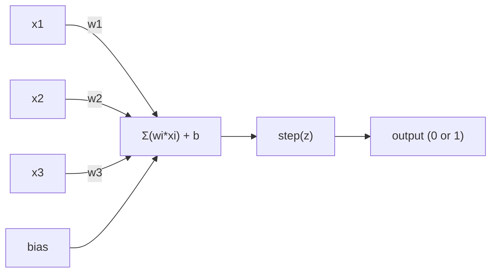
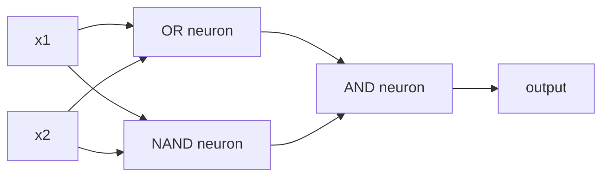

# El Perceptron.

> El perceptron es el átomo de las redes neuronales.

> La percepción es el " átomo " de la red neuronal, que se desintegra para ver, dentro de ella hay peso, orientación y una decisión.

> **【中文解读】**感知机是神经网络的"原子"最小的学习单元――lo que hace es muy simple: poner la entrada multiplicada por el peso, más la posición, y luego tomar una decisión de segunda opción―entender la感知机, es entender lo que significa "aprendizaje" en el código hasta el final: regular continuamente los números hasta que la salida y la realidad coincidan―.

**Type:** Build
**Languages:** Python
**Prerequisites:** Phase 1 (Linear Algebra Intuition)
**Time:** ~60 minutes

## Objetivos de aprendizaje

- Implementar un perceptron desde cero en Python, incluyendo la regla de actualización de peso y la función de activación de paso
  Desde cero en Python  implementar sensores, incluyendo la función de actualización de peso y la función de activación de la etapa
- Explica por qué un solo perceptron sólo puede resolver problemas linealmente separables y demuestra el caso de fallo XOR
  Explicar por qué una sola máquina sensorial sólo puede resolver problemas de conexión, y mostrar casos de XOR  fracaso
- Construir un perceptron de múltiples capas mediante la composición de puertas OR, NAND y AND para resolver XOR
                                                                                                                                                                                                                                                                
- Entrenar una red de dos capas con activación sigmoide y retropropagación para aprender XOR automáticamente
  Usar sigmoid  activa y contra-dirección de transmisión entrenamiento dos niveles de red de aprendizaje automático XOR

> **【中文解读】**El objetivo del capítulo es: desde cero lograr la percepción, entender por qué una sola percepción sólo puede resolver problemas de conexión (XOR es un contra-exemplo), y luego, mediante la combinación de varias percepciones para romper esta limitación, finalmente con el derecho de autoaprendizaje de transmisión inversa.

## El problema es la introducción del problema

Conoces vectores y productos de puntos. Sabes que una matriz transforma entradas en salidas. Pero ¿cómo una máquina *aprende* qué transformación usar?

> Ya sabes que el eje puede ser entrado, transformado y dado a luz. Pero ¿cómo se puede utilizar el mecanismo?

El perceptron responde a esto. Es la máquina de aprendizaje más simple posible: toma algunas entradas, multiplica por pesas, añada un sesgo y toma una decisión binaria. Luego ajusta. Eso es todo. Cada red neuronal construida es capas de esta idea apiladas juntas.

> La máquina de percepción responde a esta pregunta. Es la máquina de aprendizaje más simple: recibe la entrada, multiplica el peso, suma el peso, toma decisiones de segunda clase, y luego se ajusta.

Comprender el perceptron significa entender lo que "aprender" realmente significa en código: ajustar números hasta que la salida coincida con la realidad.

> Comprender el sentido de "aprender" en el código significa: regular los números hasta que el resultado coincida con la realidad.

> **【中文解读】**Ya sabes que la matriz puede transformar la entrada en la salida. Pero ¿cómo "aprender" la máquina con qué cambios? La máquina de percepción da la respuesta: ingresar multiplicando el peso, aumentando la prejuicio, tomando decisiones de tipo II, y luego ajustando los parámetros en función de errores.

## El concepto central.

### Una neurona, una decisión, un neurón, una decisión.

Un perceptron toma n entradas, multiplica cada una por un peso, las suma, agrega un sesgo y pasa el resultado a través de una función de activación.

> 感知机接收 n 个输入, va a cada entrada multiplicada por peso, demanda y, más de la posición, y luego a través de activación de la función de salida de resultados.



La función de paso es brutal: si la suma ponderada más el sesgo es >= 0, salida 1. De lo contrario, salida 0.

> 阶跃函数 es muy simple y grosso: si el aumento de potencia y el aumento de desviación es mayor que igual a 0, en el caso de que sea igual a 0, en el caso de que sea igual a 0, en el caso de que sea igual a 0, en el caso de que sea igual a 0, en el caso de que sea igual a 0, en el caso de que sea igual a 0, en el caso de que sea igual a 0, en el caso de que sea igual a 0, en el caso de que sea igual a 0, en el caso de que sea igual a 0, en el caso de que sea igual a 0, en el caso de que sea igual a 0, en el caso de que sea igual a 0, en el caso de que sea igual a 0, en el caso de que sea igual a 0, en el caso de que sea igual a 0, en el caso de que sea igual a 0, en el caso de que sea igual a 0, en el caso de que sea igual a 0, en el caso de que sea igual a 0, en el caso de que sea igual.

```
step(z) = 1  if z >= 0
           0  if z < 0
```

Este es un clasificador lineal. Los pesos y los sesgos definen una línea (o hiperplano en dimensiones más altas) que divide el espacio de entrada en dos regiones.

> Este es un tipo de línea. El peso y la posición definen una línea o superplano en el espacio de alto nivel, y se dividen en dos regiones.

> **【中文解读】**感知机的计算流程:输入 x 乘权重 w,求和后加偏置 b,最后通过阶跃函数输出 0 或 1──本质上就是一个线性分类器权重和偏置在空间中画一条线(或超平面),把输入空间分成两个区域──

### El límite de la decisión.

Para dos entradas, el perceptron traza una línea a través del espacio 2D:

> Para dos entradas, el sensor en el espacio de dos dimensiones dibuja una línea recta:

```
  x2
  ┤
  │  Class 1        /
  │    (0)          /
  │                /
  │               / w1·x1 + w2·x2 + b = 0
  │              /
  │             /     Class 2
  │            /        (1)
  ┼───────────/──────────── x1
```

Todo en un lado de la línea da 0 a las clases.

> Un lado de la línea todo sale 0, el otro lado todo sale 1. El proceso de entrenamiento es mover esta línea hasta que se abra correctamente diferentes categorías.

> **【中文解读】**El proceso de entrenamiento es el de movilizarse continuamente hasta que se abre correctamente los diferentes tipos de datos. En el aprendizaje profundo, cada capa está creando nuevos espacios de características y nuevos límites de decisión.

### Las reglas de aprendizaje.

La regla del aprendizaje perceptron es simple:

> Las reglas de aprendizaje de la máquina de percepción son muy simples:

```
For each training example (x, y_true):     # 对每个训练样本
    y_pred = predict(x)                    # 预测输出
    error = y_true - y_pred                # 计算误差

    For each weight:                       # 对每个权重
        w_i = w_i + learning_rate * error * x_i   # 更新权重
    bias = bias + learning_rate * error    # 更新偏置
```

Si la predicción es correcta, el error = 0, nada cambia. Si predice 0 pero debe ser 1, los pesos aumentan. Si predice 1 pero debe ser 0, los pesos disminuyen. La tasa de aprendizaje controla el tamaño de cada ajuste.

> Si la predicción es correcta, la diferencia es 0, no se hace ningún ajuste. Si la predicción es 0, pero debería ser 1, el peso aumenta. Si la predicción es 1, pero debería ser 0, el peso disminuye.

> **【中文解读】**感知机的学习规则非常直觉:预测对就不动,预测错了根据差方向调整权重.`optimizer.step()`Hacer cosas es lo mismo en esencia, sólo calcular más complejo.

> **【拓展：梯度下降的起源】**La diferencia entre el aprendizaje de la percepción de la máquina y el cálculo manual de la tasa de aprendizaje fija, mientras que el aprendizaje de la máquina se adapta a la tasa de aprendizaje ajustada.

### El problema de XOR  XOR  problema

Mira estas puertas lógicas:

> Aquí es donde la percepción falla.

```
AND gate:           OR gate:            XOR gate:
x1  x2  out         x1  x2  out         x1  x2  out
0   0   0           0   0   0           0   0   0
0   1   0           0   1   1           0   1   1
1   0   0           1   0   1           1   0   1
1   1   1           1   1   1           1   1   0
```

Y y OR son linealmente separables: se puede dibujar una sola línea para separar los 0s de los 1s. XOR no lo es. Ninguna sola línea puede separar [0,1] y [1,0] de [0,0] y [1,1].

> Y 和 OR es lineal: puedes dibujar una línea recta que será 0 和 1 分开。XOR 不是。

```
AND (separable):        XOR (not separable):

  x2                      x2
  1 ┤  0     1            1 ┤  1     0
    │     /                 │
  0 ┤  0 / 0              0 ┤  0     1
    ┼──/──────── x1         ┼──────────── x1
       line works!          no single line works!
```

Esto es un límite fundamental. Un perceptron único sólo puede resolver problemas linealmente separables. Minsky y Papert lo demostraron en 1969 y casi mató la investigación de redes neuronales durante una década.

> Esto es una limitación fundamental. Una sola máquina sensorial sólo puede resolver problemas de conexión. Minsky y Papert lo demostraron en 1969, lo que dejó casi una década de investigación de redes neuronales estancadas.

La solución: apilar los perceptrones en capas. Un perceptrón de varias capas puede resolver XOR combinando dos decisiones lineales en una no lineal.

>  solución: se puede construir una máquina sensorial de varias capas.

> **【中文解读】**XOR   problema es el "Akaks之" de la percepción de la máquina: independientemente de cómo dibujas en línea directa, no se puede separar los dos tipos de salida de XOR. Minsky y Papert demostraron esto en 1969, lo que llevó directamente a la "primera invierno" del estudio de la red neuronal. Pero la solución también es muy elegante: colocar múltiples máquinas de percepción en múltiples capas, con dos conjuntos de líneas directas para sacar límites de decisión no lineales.

> **【拓展：为什么深度学习需要"深"】**单层感知机只能画直线,两层只能画折线,三层只能画任意形状――层数越多,表达函数越复杂―― por eso GPT-4 tiene casi 100 niveles Transformer每多层,模型就能表达更复杂的模式―― desde la máquina de percepción hasta la GPT, el núcleo de la idea es un núcleo de la idea.

## Construye con movimiento.
```figure
perceptron-boundary
```

## Construye el mismo

### Paso 1: La clase de Perceptron

```python
class Perceptron:
    def __init__(self, n_inputs, learning_rate=0.1):
        self.weights = [0.0] * n_inputs   # 权重初始化为 0
        self.bias = 0.0                    # 偏置初始化为 0
        self.lr = learning_rate            # 学习率控制每次调整的幅度

    def predict(self, inputs):
        total = sum(w * x for w, x in zip(self.weights, inputs))  # 加权求和：w·x
        total += self.bias                                         # 加偏置：w·x + b
        return 1 if total >= 0 else 0       # 阶跃函数：>=0 输出 1，否则输出 0

    def train(self, training_data, epochs=100):
        for epoch in range(epochs):
            errors = 0
            for inputs, target in training_data:
                prediction = self.predict(inputs)   # 前向预测
                error = target - prediction          # 计算误差
                if error != 0:
                    errors += 1
                    for i in range(len(self.weights)):
                        self.weights[i] += self.lr * error * inputs[i]  # 权重更新
                    self.bias += self.lr * error      # 偏置更新
            if errors == 0:
                print(f"Converged at epoch {epoch + 1}")  # 全部正确，收敛
                return
        print(f"Did not converge after {epochs} epochs")
```

### Paso 2: Entrenamiento en puertas lógicas Entrenamiento en puertas lógicas

```python
and_data = [          # AND 逻辑门数据：两个输入都为 1 时输出 1
    ([0, 0], 0),
    ([0, 1], 0),
    ([1, 0], 0),
    ([1, 1], 1),
]

or_data = [           # OR 逻辑门数据：任一输入为 1 时输出 1
    ([0, 0], 0),
    ([0, 1], 1),
    ([1, 0], 1),
    ([1, 1], 1),
]

not_data = [          # NOT 逻辑门数据：取反
    ([0], 1),
    ([1], 0),
]

print("=== AND Gate ===")
p_and = Perceptron(2)
p_and.train(and_data)
for inputs, _ in and_data:
    print(f"  {inputs} -> {p_and.predict(inputs)}")

print("\n=== OR Gate ===")
p_or = Perceptron(2)
p_or.train(or_data)
for inputs, _ in or_data:
    print(f"  {inputs} -> {p_or.predict(inputs)}")

print("\n=== NOT Gate ===")
p_not = Perceptron(1)
p_not.train(not_data)
for inputs, _ in not_data:
    print(f"  {inputs} -> {p_not.predict(inputs)}")
```

### Paso 3: Observa el fracaso de XOR

```python
xor_data = [         # XOR 逻辑门数据：两个输入不同时输出 1
    ([0, 0], 0),
    ([0, 1], 1),
    ([1, 0], 1),
    ([1, 1], 0),
]

print("\n=== XOR Gate (single perceptron) ===")
p_xor = Perceptron(2)
p_xor.train(xor_data, epochs=1000)   # 即使训练 1000 轮也无法收敛
for inputs, expected in xor_data:
    result = p_xor.predict(inputs)
    status = "OK" if result == expected else "WRONG"
    print(f"  {inputs} -> {result} (expected {expected}) {status}")
```

Esto es la prueba de que un solo perceptrón no puede aprender XOR.

> Nunca recibirá. Es que la máquina sensorial no puede aprender el tren de XOR.

> **【中文解读】**单个感知机训练 XOR 永远不会收不管训练多少轮── es una dura limitación matemática: una línea recta no puede dividir correctamente los cuatro puntos de XOR en dos clases──

### Paso 4: Resolver XOR con dos capas.

El truco: XOR = (x1 O x2) Y NO (x1 Y x2). Combine tres perceptrones:

> 技巧:XOR = (x1 O x2) Y NO (x1 Y x2)



```python
def xor_network(x1, x2):
    or_neuron = Perceptron(2)
    or_neuron.weights = [1.0, 1.0]     # OR 门的权重
    or_neuron.bias = -0.5              # OR 门的偏置

    nand_neuron = Perceptron(2)
    nand_neuron.weights = [-1.0, -1.0]  # NAND 门（AND 的取反）的权重
    nand_neuron.bias = 1.5              # NAND 门的偏置

    and_neuron = Perceptron(2)
    and_neuron.weights = [1.0, 1.0]     # AND 门的权重
    and_neuron.bias = -1.5              # AND 门的偏置

    hidden1 = or_neuron.predict([x1, x2])    # 隐藏层第 1 个神经元：OR
    hidden2 = nand_neuron.predict([x1, x2])  # 隐藏层第 2 个神经元：NAND
    output = and_neuron.predict([hidden1, hidden2])  # 输出层：AND
    return output


print("\n=== XOR Gate (multi-layer network) ===")
for inputs, expected in xor_data:
    result = xor_network(inputs[0], inputs[1])
    print(f"  {inputs} -> {result} (expected {expected})")
```

La acumulación de perceptrones en capas crea límites de decisión que ningún perceptrón puede producir.

> Cuatro casos son todos correctos. La máquina sensorial puede crear una sola capa de máquina sensorial.

> **【中文解读】**关键洞察:XOR = (x1 OR x2) Y NO(x1 AND x2);; primer nivel con dos sensores separados hacer OR 和 NAND;; dos líneas directas), segundo nivel con Y poner los dos resultados en conjunto;. esto es sólo con dos líneas directas que se ha logrado un límite de decisión no lineal;.

### Paso 5: Entrenar una red de dos capas

Paso 4 cableado a mano los pesos. Eso funciona para XOR, pero no para problemas reales donde no se sabe los pesos correctos de antemano. La solución: reemplazar la función de paso con sigmoid y aprender los pesos automáticamente a través de la retropropagación.

> Paso 4 手动设置权重── esto es efectivo para XOR, pero no se puede utilizar para desconocer el problema real de peso real── solución: utilizar sigmoid 替换阶跃函数, mediante la transmisión inversa de autoaprendizaje de peso──

```python
class TwoLayerNetwork:
    def __init__(self, learning_rate=0.5):
        import random
        random.seed(0)
        self.w_hidden = [[random.uniform(-1, 1), random.uniform(-1, 1)] for _ in range(2)]  # 隐藏层权重（2个神经元，各2个输入）
        self.b_hidden = [random.uniform(-1, 1), random.uniform(-1, 1)]   # 隐藏层偏置
        self.w_output = [random.uniform(-1, 1), random.uniform(-1, 1)]   # 输出层权重
        self.b_output = random.uniform(-1, 1)   # 输出层偏置
        self.lr = learning_rate

    def sigmoid(self, x):
        import math
        x = max(-500, min(500, x))   # 裁剪防止溢出
        return 1.0 / (1.0 + math.exp(-x))  # sigmoid 函数：σ(x) = 1/(1+e^(-x))

    def forward(self, inputs):
        self.inputs = inputs
        self.hidden_outputs = []
        for i in range(2):
            z = sum(w * x for w, x in zip(self.w_hidden[i], inputs)) + self.b_hidden[i]  # 隐藏层线性变换
            self.hidden_outputs.append(self.sigmoid(z))  # 隐藏层激活
        z_out = sum(w * h for w, h in zip(self.w_output, self.hidden_outputs)) + self.b_output  # 输出层线性变换
        self.output = self.sigmoid(z_out)   # 输出层激活
        return self.output

    def train(self, training_data, epochs=10000):
        for epoch in range(epochs):
            total_error = 0
            for inputs, target in training_data:
                output = self.forward(inputs)       # 前向传播
                error = target - output              # 误差 = 目标 - 预测
                total_error += error ** 2            # 累计平方误差

                d_output = error * output * (1 - output)   # 输出层梯度（链式法则）

                saved_w_output = self.w_output[:]
                hidden_deltas = []
                for i in range(2):
                    h = self.hidden_outputs[i]
                    hd = d_output * saved_w_output[i] * h * (1 - h)  # 隐藏层梯度（反向传播）
                    hidden_deltas.append(hd)

                # 更新输出层权重
                for i in range(2):
                    self.w_output[i] += self.lr * d_output * self.hidden_outputs[i]
                self.b_output += self.lr * d_output

                # 更新隐藏层权重
                for i in range(2):
                    for j in range(len(inputs)):
                        self.w_hidden[i][j] += self.lr * hidden_deltas[i] * inputs[j]
                    self.b_hidden[i] += self.lr * hidden_deltas[i]
```

```python
net = TwoLayerNetwork(learning_rate=2.0)
net.train(xor_data, epochs=10000)
for inputs, expected in xor_data:
    result = net.forward(inputs)
    predicted = 1 if result >= 0.5 else 0   # 以 0.5 为阈值做二分类
    print(f"  {inputs} -> {result:.4f} (rounded: {predicted}, expected {expected})")
```

Dos diferencias clave del paso 4. Primero, sigmoide reemplaza la función de paso - es suave, por lo que los gradientes existen. segundo, el `train`El método propaga el error hacia atrás desde la salida a la capa oculta, ajustando cada peso en proporción a su contribución al error.

> Con el paso 4 hay dos diferencias clave. Primero, el sigmoide sustituye la función de la escala, es plana, por lo que hay una escala.`train`El método se ajustará el error de la salida a la transmisión en sentido contrario, según la proporción de contribución de cada peso al error.

Este es el puente a la lección 03.`d_output`y `hidden_deltas`Es la regla de cadena aplicada al gráfico de red.

> Éste es el puente que conduce a la clase 3.`d_output`Y `hidden_deltas`La matemática de atrás es la aplicación de la ley de cadenas en la gráfica de redes.

> **【中文解读】**El paso 4 es establecer el peso de forma manual, pero en el verdadero problema no sabemos el peso correcto. La ruptura es: usar la función de sigmoide 替阶跃函数 (pues se puede dirigir), luego usar la inversa propagation (repropagación) para aprender el peso automático.`d_output`Y `hidden_deltas`Es la aplicación de la ley de cadenas desde la salida de la capa hacia la vuelta de la cifra, a nivel de ajuste.`loss.backward()`En hacer cosas.

> **【拓展：PyTorch autograd 的原理】**El proceso de transmisión de PyTorch se ejecuta automáticamente.`backward()`时沿沿图反向传播梯度──手动写反向传播 (como aquí) es la mejor manera de entender el autogrado──

## Usalo en la práctica.

Todo lo que acabas de construir desde cero existe en una importación:

> Todas las funciones que se pueden implementar desde cero pueden realizarse a través de una entrada:

```python
from sklearn.linear_model import Perceptron as SkPerceptron   # sklearn 内置的感知机
import numpy as np

X = np.array([[0,0],[0,1],[1,0],[1,1]])  # 输入数据
y = np.array([0, 0, 0, 1])               # AND 门的标签

clf = SkPerceptron(max_iter=100, tol=1e-3)  # 最多迭代 100 次，容差 0.001
clf.fit(X, y)                                # 训练
print([clf.predict([x])[0] for x in X])     # 预测所有样本
```

Cinco líneas.`Perceptron`La versión sklearn añade controles de convergencia, funciones de pérdida múltiple y soporte de entrada escaso, pero el bucle central es idéntico: suma ponderada, función de paso, actualización de peso en error.

> ¿Qué pasa?`Perceptron`类做同事──sklearn 版本增加收检查、多种损失函数和稀疏输入支持但核心循环完全相同:加权和、阶跃函数、按差更新权重──

La brecha real se muestra a escala.

> La verdadera diferencia en la escala actual. La red en el entorno de producción tiene los siguientes cambios:

- La función de paso se convierte en sigmoide, ReLU, u otras activaciones suaves
  阶跃 función convertir sigmoid、ReLU o otras funciones activadas
- Los pesos se aprenden automáticamente mediante la propagación hacia atrás (lección 03)
  权重通过反向传播自动学习 (sección 3)
- Las capas se profundizan: 3, 10, 100+ capas
  La cantidad de niveles se vuelve más profunda: 3 niveles,10 niveles100+ niveles
- El mismo principio es válido: cada capa crea nuevas características de las salidas de la capa anterior
  基本原理不变: cada uno de los niveles de producción de la primera se crea una nueva característica

Un solo perceptrón sólo puede dibujar líneas rectas.

> Una sola máquina sensorial sólo puede dibujar en línea recta.

> **【中文解读】**El Perceptron 五行代码 de sklearn ya ha hecho lo que hacemos en 30 行. La lógica central es la misma:加权求和、阶跃函数、按差更新权重── la verdadera diferencia en la escala: redes modernas con funciones activadas de transmisión de datos, como ReLU,  con transmisión automática en sentido contrario, 有几十到上百层── pero el principio básico es siempre: crear nuevas características en cada uno de los niveles de salida de la capa superior.

## Envía el producto .

Esta lección produce:
- `outputs/skill-perceptron.md`- una habilidad que cubra cuando se necesitan arquitecturas de una sola capa frente a arquitecturas de varias capas

> 本课产 出:`outputs/skill-perceptron.md`- Un documento de habilidades sobre cuándo utilizar estructuras de una sola y una múltiple capa

## Los ejercicios.

1. Entrenar un perceptron en una puerta NAND (la puerta universal - cualquier circuito lógico se puede construir a partir de NAND).
   > **练习 1：**Usando el NAND 门                                                                                                                                                                                                                                                            

2. Modifique la clase Perceptron para rastrear el límite de decisión (w1\*x1 + w2\*x2 + b = 0) en cada época. Imprime cómo se desplaza la línea durante el entrenamiento en la puerta AND.
   > **练习 2：**修改 Perceptron 类, en cada época 记录决策边界 (w1\*x1 + w2\*x2 + b = 0) ――打印在训练 AND 门时这条线是如何移动的──

3. Construir un perceptron de 3 entradas que salga 1 sólo cuando al menos 2 de las 3 entradas son 1 (una función de voto mayoritario). ¿Es esto linealmente separable? ¿Por qué?
   > **练习 3：**Construir una 3 输入感知机, cuando al menos 2 输入为 1 时输出 1 多数投票函数) ⋅ ¿Esta función es lineal? ¿Por qué?

## Términos clave .

| Term | What people say | What it actually means |
|------|----------------|----------------------|
| Perceptron | "A fake neuron" | A linear classifier: dot product of inputs and weights, plus bias, through a step function |
| Weight | "How important an input is" | A multiplier that scales each input's contribution to the decision |
| Bias | "The threshold" | A constant that shifts the decision boundary, letting the perceptron fire even with zero inputs |
| Activation function | "The thing that squishes values" | A function applied after the weighted sum - step function for perceptrons, sigmoid/ReLU for modern networks |
| Linearly separable | "You can draw a line between them" | A dataset where a single hyperplane can perfectly separate the classes |
| XOR problem | "The thing perceptrons can't do" | Proof that single-layer networks cannot learn non-linearly-separable functions |
| Decision boundary | "Where the classifier switches" | The hyperplane w\*x + b = 0 that divides input space into two classes |
| Multi-layer perceptron | "A real neural network" | Perceptrons stacked in layers, where each layer's output feeds the next layer's input |

| 术语 | 通俗说法 | 实际含义 |
|------|---------|---------|
| 感知机 (Perceptron) | "假神经元" | 线性分类器：输入与权重的点积加偏置，过阶跃函数 |
| 权重 (Weight) | "输入的重要性" | 缩放每个输入对决策贡献的乘数 |
| 偏置 (Bias) | "阈值" | 偏移决策边界的常数，让感知机在全零输入时也能激活 |
| 激活函数 (Activation function) | "压扁数值的东西" | 加权求和后施加的函数——感知机用阶跃函数，现代网络用 sigmoid/ReLU |
| 线性可分 (Linearly separable) | "能画线分开" | 数据集可以用一个超平面完美分成两类 |
| XOR 问题 | "感知机做不到的事" | 证明单层网络无法学习非线性可分函数 |
| 决策边界 (Decision boundary) | "分类器切换的地方" | w\*x + b = 0 这个超平面，把输入空间分成两类区域 |
| 多层感知机 (MLP) | "真正的神经网络" | 感知机按层堆叠，每层的输出是下一层的输入 |

## Más Leer más Leer más

- Frank Rosenblatt, "El Perceptron: un modelo probabilístico para el almacenamiento y organización de la información en el cerebro" (1958) -- el artículo original que comenzó todo
  Frank Rosenblatt, 感知机: Brain Information Storage and Organization Probability Model
- Minsky & Papert, "Perceptrons" (1969) -- el libro que demostró que XOR era insoluble por redes de una sola capa y mató la investigación de perceptron durante una década
  Minsky 和 Papert,感知机(1969) prueba de que una sola red de capa no puede resolver XOR y no hace que el estudio de la percepción se detenga durante diez años
- Michael Nielsen, "Redes neuronales y aprendizaje profundo", Capítulo 1 (http://neuralnetworksanddeeplearning.com/) -- en línea gratuita, mejor explicación visual de cómo los perceptrones se componen en redes
  Michael Nielsen,  Neural Network and Deep Learning  1  Capítulo  Gratis en línea, sobre cómo se compone la máquina perceptiva de la mejor interpretación visualizada de la red
