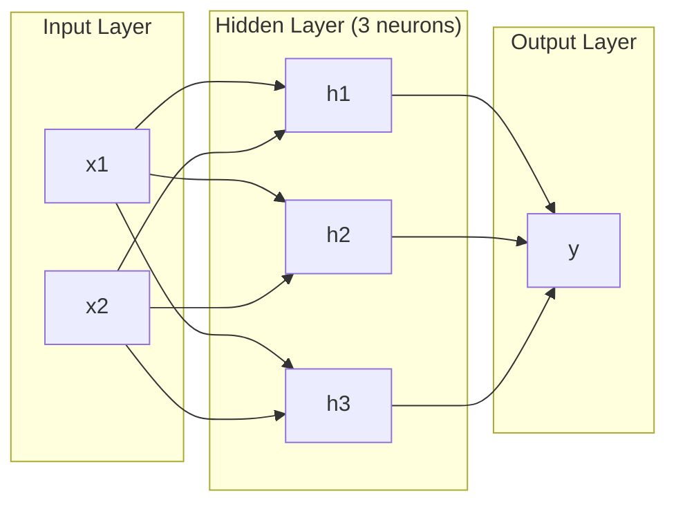
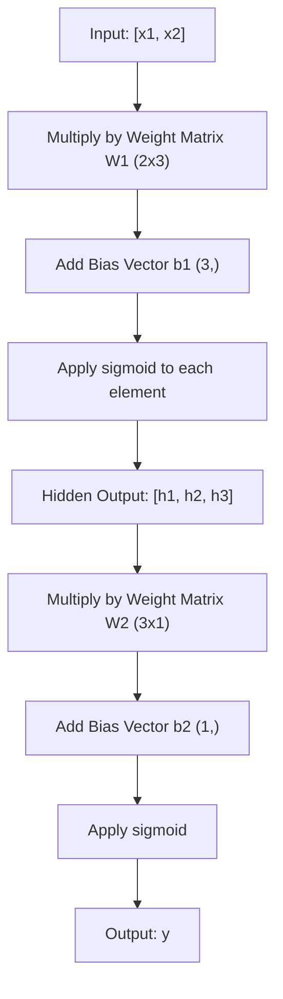
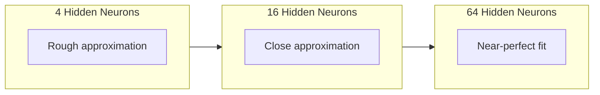

# Las redes de múltiples capas y el pase hacia adelante

> Una neurona traza una línea, apilalas y puedes trazar cualquier cosa.

> Un neurón pinta una línea recta. Si las colocas encima, puedes dibujar cualquier forma.

> **【中文解读】**Un neurón sólo puede dibujar una línea recta, pero si se superponen múltiples neurones en múltiples capas, se puede adaptar a cualquier curva de forma. Este es el valor central de la red de múltiples capas que utiliza la composición de capas y rupturas de una sola capa de la máquina sensorial.

**Type:** Build
**Languages:** Python
**Prerequisites:** Phase 01 (Math Foundations), Lesson 03.01 (The Perceptron)
**Time:** ~90 minutes

## Objetivos de aprendizaje

- Construir una red de múltiples capas desde cero con clases de capas y redes que realicen un pase hacia adelante completo
  Desde la construcción de cero con una red de varias capas de capa y red, ejecutar la transmisión completa
- Detectar las dimensiones de la matriz a través de cada capa de una red e identificar las desajustes de forma
   Redes de seguimiento de cada nivel de la matriz dimensiones, identificación de forma no coincide problema
- Explicar cómo apilar las activaciones no lineales permite a una red aprender los límites de decisión curvos
   Explicar la acumulación de activaciones no lineales cómo hacer que la red pueda aprender 曲的决策边界
- Resolver el problema XOR utilizando una arquitectura 2-2-1 con pesas sigmoides sintonizadas a mano
  Uso de la mano de ajuste de sigmoides 权重, usando 2-2-1 架构解决 XOR 问题

> **【中文解读】**Objetivo del capítulo: desde la creación de la capa y la red de clases, entender los cambios de la dimensión de la matriz en la transmisión, para entender por qué la función activa no lineal permite que la red pueda aprender a tomar decisiones.

## El problema es la introducción del problema

Una sola neurona es un cajón de líneas. Eso es todo. Una línea recta a través de los datos. Cada verdadero problema en IA -- reconocimiento de imágenes, comprensión del lenguaje, juego de Go -- requiere curvas.

> 单个神经元只是一个图线的工具――仅此而已――绘画一条直线在你的数据中――AI 图像识别,语言理解,下围棋 都需要曲线――将神经元堆叠成层就是获得曲线的方法――

En 1969, Minsky y Papert demostraron que esta limitación era fatal: una red de una sola capa no puede aprender XOR. No "luchas para aprender" - matemáticamente no puede. La tabla de verdad XOR coloca [0,1] y [1,0] en un lado, [0,0] y [1,1] en el otro. Ninguna sola línea las separa.

> En 1969, Minsky y Papert demostraron que esta limitación es mortal: una sola red de niveles no puede aprender XOR. No es "muy difícil de aprender" es matemáticamente imposible.

Esto eliminó el financiamiento de las redes neuronales durante más de una década. La solución era obvia en retrospectiva: dejar de usar una capa. apilar las neuronas en capas. Deja que la primera capa talle el espacio de entrada en nuevas características, y deja que la segunda capa combine esas características en decisiones que ninguna línea podría tomar.

> Esto ha interrumpido el financiamiento de la red neuronal durante más de diez años. En la actualidad, la solución es evidente: ya no se utiliza una sola capa.

Esa pila es la red de múltiples capas. Es la base de todos los modelos de aprendizaje profundo en producción hoy en día. El pase hacia adelante - los datos fluyen de entrada a salida a través de capas ocultas - es lo primero que necesitas construir antes de que cualquier otra cosa funcione.

> La acumulación es una red de múltiples niveles. Es la base de cada modelo de aprendizaje profundo en el entorno de producción actual.

> **【中文解读】** Un solo neurón sólo puede dibujar una línea recta, pero la identificación de imágenes, la comprensión de lenguaje, la comprensión de la realidad de la IA  estos trabajos requieren una curva

## El concepto central.

### Capas: entrada, oculta, salida. Capas: entrada, escondida, salida.

Una red de múltiples capas tiene tres tipos de capas:

> Las redes de múltiples niveles tienen tres tipos de niveles:

**Input layer**- no es realmente una capa. contiene sus datos brutos. Dos características significa dos nodos de entrada. No se hace ningún cálculo aquí.

> **输入层**其实不算真正层――它存储原始数据――两个特征意味着两个输入节点――这里没有任何计算――

**Hidden layers**Cada neurona toma cada salida de la capa anterior, aplica pesos y sesgos, y luego pasa el resultado a través de una función de activación. "Escondido" porque nunca se ven estos valores directamente en los datos de entrenamiento.

> **隐藏层** realmente干活的地方── cada uno de los neurones recibe la primera capa de todos los resultados, aplica el peso y la posición, y luego se producen a través de la función activa──"oculto" porque nunca se ven estos valores en los datos de entrenamiento──

**Output layer**Para la clasificación binaria, una neurona con sigmoide. para la clase múltiple, una neurona por clase.

> **输出层**                                                                                                                                                                                                                                                              



Esta es una red de 2-3-1. Dos entradas, tres neuronas ocultas, una salida. Cada conexión lleva un peso. Cada neurona (excepto la entrada) lleva un sesgo.

> Este es un 2-3-1 网络── dos entradas, tres neuronas ocultas, una salida── cada conexión tiene un peso── cada neurón (excepto la entrada de la capa) tiene un parámetro──

Cada capa produce un vector de números llamado estado oculto. Para el texto, los estados ocultos aumentan la dimensionalidad, codificando una palabra como 768 números para capturar un significado semántico. Para las imágenes, reducen la dimensionalidad, comprimiendo millones de píxeles en una representación manejable. El estado oculto es donde vive el aprendizaje.

> Cada capa produce un vector digital, llamado estado oculto. Para el texto, el estado oculto aumenta la dimensión. Para las imágenes, las dimensiones reducidas se reducen a millones de imágenes.

> **【中文解读】**Tres clases: entrada de datos (en inglés: input layer) ✓ ✓ ✓ ✓ ✓ ✓ ✓ ✓ ✓ ✓ ✓ ✓ ✓ ✓ ✓ ✓ ✓ ✓ ✓ ✓ ✓ ✓ ✓ ✓ ✓ ✓ ✓ ✓ ✓ ✓ ✓ ✓ ✓ ✓ ✓ ✓ ✓ ✓ ✓ ✓ ✓ ✓ ✓ ✓ ✓ ✓ ✓ ✓ ✓ ✓ ✓ ✓ ✓ ✓ ✓ ✓ ✓ ✓ ✓ ✓ ✓ ✓ ✓ ✓ ✓ ✓ ✓ ✓ ✓ ✓ ✓ ✓ ✓ ✓ ✓ ✓ ✓ ✓ ✓ ✓ ✓ ✓ ✓ ✓ ✓ ✓ ✓ ✓ ✓ ✓ ✓ ✓ ✓ ✓ ✓ ✓ ✓ ✓ ✓ ✓ ✓ ✓ ✓ ✓ ✓ ✓ ✓ ✓ ✓ ✓ ✓ ✓ ✓ ✓ ✓ ✓ ✓ ✓ ✓ ✓ ✓ ✓ ✓ ✓ ✓ ✓ ✓ ✓ ✓ ✓ ✓ ✓ ✓ ✓ ✓ ✓ ✓ ✓ ✓ ✓ ✓ ✓ ✓ ✓ ✓ ✓ ✓ ✓ ✓ ✓ ✓ ✓ ✓ ✓ ✓ ✓ ✓ ✓ ✓ ✓ ✓ ✓ ✓ ✓ ✓ ✓ ✓ ✓ ✓ ✓ ✓ ✓ ✓ ✓ ✓ ✓ ✓ ✓ ✓ ✓ ✓ ✓ ✓ ✓ ✓ ✓ ✓ ✓ ✓ ✓ ✓ ✓ ✓ ✓ ✓ ✓ ✓ ✓ ✓ ✓ ✓ ✓ ✓ ✓ ✓ ✓ ✓ ✓ ✓ ✓ ✓ ✓ ✓ ✓ ✓ ✓ ✓ ✓ ✓ ✓ ✓ ✓ ✓ ✓ ✓ ✓ ✓ ✓ ✓ ✓ ✓ ✓ ✓ ✓ ✓ ✓ ✓ ✓ ✓ ✓ ✓ ✓ ✓ ✓ ✓ ✓ ✓ ✓ 

> **【拓展：Transformer 中的隐藏状态】**En GPT/BERT, cada una de las fases de Transformer también tiene un estado oculto.`model(x).hidden_states[-1]`提取特征用于下游任务──

### Neuronas y activaciones.

Cada neurona hace tres cosas:

> Cada neural hace tres cosas:

1. Multiplicar cada entrada por su peso correspondiente
   Cada entrada se multiplicará por el peso de la correspondencia
2. Sumar todos los productos y agregar un sesgo
   Se puede ver el número de la posición de la posición.
3. Pasar la suma a través de una función de activación
   Se va a y a través de la función de activación

Por ahora, la activación es sigmoide:

> La función activada en uso es sigmoid:

```
sigmoid(z) = 1 / (1 + e^(-z))
```

Sigmoid aplasta cualquier número en el rango (0, 1). Las grandes entradas positivas empujan hacia 1. Las grandes entradas negativas empujan hacia 0.

> Sigmoid se comprime cualquier número en el rango (0, 1)  Grandes entradas positivas tendencias 1, grandes entradas negativas tendencias 0,0  Mapeado a 0,5  Esta curva plana hace posible el aprendizaje  Diferente de los pasos duros de la máquina de percepción, sigmoid  Disponibilidad tiene gradiente 

> **【中文解读】**Cada neurón hace tres cosas: Inpúrese y carga, búsqueda y adición de peso, función de activación. Sigmoide, coloca cualquier número comprimido a (0, 1) 区间.

### Pasado hacia adelante: Cómo fluyen los datos.

El pase hacia adelante empuja los datos de entrada a través de la red, capa por capa, hasta que alcanza la salida. No se produce aprendizaje durante el pase hacia adelante. Es un cálculo puro: multiplicar, agregar, activar, repetir.

> Antes de la difusión se introducirá datos de una manera a otra en la red hasta que se produzca la salida.



En cada capa, tres operaciones ocurren en secuencia:

> En cada uno de los niveles, en orden ejecutar tres operaciones:

```
z = W * input + b       (linear transformation)    # 线性变换
a = sigmoid(z)           (activation)                # 激活
```

La salida de una capa se convierte en la entrada de la siguiente.

> Una salida de nivel se convierte en una entrada de nivel inferior.

> **【中文解读】**Antes de la difusión es el proceso de datos desde la entrada hasta la salida sin ningún aprendizaje, pura cálculo. En cada capa se hacen dos cosas: lineal de cambio.`model(x)`En hacer cosas.

### Las dimensiones de la matriz.

Las dimensiones de seguimiento son la habilidad de depuración más importante en el aprendizaje profundo.

> 追踪维度 es la habilidad de entrenamiento más importante en el aprendizaje profundo.

| Step | Operation | Dimensions | Result Shape |
|------|-----------|------------|-------------|
| Input | x | -- | (2,) |
| Hidden linear | W1 * x + b1 | W1: (3, 2), b1: (3,) | (3,) |
| Hidden activation | sigmoid(z1) | -- | (3,) |
| Output linear | W2 * h + b2 | W2: (1, 3), b2: (1,) | (1,) |
| Output activation | sigmoid(z2) | -- | (1,) |

| 步骤 | 操作 | 维度 | 结果形状 |
|------|------|------|---------|
| 输入 | x | -- | (2,) |
| 隐藏层线性变换 | W1 * x + b1 | W1: (3, 2), b1: (3,) | (3,) |
| 隐藏层激活 | sigmoid(z1) | -- | (3,) |
| 输出层线性变换 | W2 * h + b2 | W2: (1, 3), b2: (1,) | (1,) |
| 输出层激活 | sigmoid(z2) | -- | (1,) |

La regla: la matriz de peso W en la capa k tiene forma (neuronas_en_layer_k, neuronas_en_layer_k_minus_1). Las filas coinciden con la capa actual. Las columnas coinciden con la capa anterior. Si las formas no se alinean, tienes un error.

> 规则: la forma de la matriz de peso de la segunda capa W (sección II, número de neurones de la primera capa)  行对应应应应应应应应应应应应应应应应应应应应应应应应应应应应应应应应应应应应应应应应应应应应应应应应应应应应应应应应应应应应应应应应应应应应应应应应应应应应应应应应应应应应应应应应应应应应应应应应应应应应应应应应应应应应应应应应应应应应应应应应应应应应应应应应应应应应应应应应应应应应应应应应应应应应应应应应应应应应应应应应应应应应应应应应应应应应应应应应应应应应应应应应应应应应应应应应应应应应应应应应应应应应应应应应应应应应应应应应应应应应应应应应应应应应应应应应应应应应应应应应应应应应应应应应应应应应应应应应应应应应应应应应应应应应应应应应应应应应应应应应应应应应应应应应应应应应应应应应应应应应应应应应应应应应应应应应应应应应应应应应应应应应应应应应应应应应应应应应应应应应应应应应应应应应应应应应应应应应应应应应应应应应应应应应应应应应应应应应应应应应应应应应应应应应应应应应应应应应应应应应应应应应应应应应应应应应应应应应应应应应应应应应应应应应应应应应应应应应应应应应应应应应应应应应应应应应应应应应应应应应应应应应应应应应应应应应应应应

> **【中文解读】**                                                                                                                                                                                                                                                                                                                                                                                                                                                                                                                             

> **【拓展：维度不匹配是深度学习最常见的 bug】**En PyTorch, tú ves a menudo `RuntimeError: mat1 and mat2 shapes cannot be multiplied` This is the dimension is not matched                                                                                                                                                                                                                                                          `torchsummary`O `torchinfo`Puedo ayudarle a hacer un autocontrol.

### Teorema de la aproximación universal Todo puede acercarse a la teoría

En 1989, George Cybenko demostró algo notable: una red neuronal con una sola capa oculta y suficientes neuronas puede aproximar cualquier función continua a cualquier precisión deseada.

> En 1989, George Cybenko demostró una cosa extraordinaria: una red neuronal con una sola capa oculta y suficientes neuronas puede acercarse con cualquier función continua con cualquier precisión.

Esto no significa que una capa oculta sea siempre mejor. Significa que la arquitectura es teóricamente capaz. En la práctica, las redes más profundas (más capas, menos neuronas por capa) aprenden las mismas funciones con mucho menos parámetros totales que las redes de ancho poco profundo. Es por eso que el aprendizaje profundo funciona.

> Esto no significa que una capa oculta sea siempre la mejor. Significa que la estructura es teóricamente viable. En la práctica, una red más profunda utiliza una función similar con un total de componentes de una red mucho menor que la ancha.

La intuición: cada neurona en la capa oculta aprende un "bump" o característica. suficientes golpes colocados en las ubicaciones correctas pueden aproximarse a cualquier curva lisa. Más neuronas, más golpes, mejor aproximación.

> 直觉: cada neurón oculto en la capa se aprende a tener una "cumbida" o un rasgo.



> **【中文解读】**Una capa oculta + neuronas suficientes para acercarse a cualquier función continua. Pero esto no significa que una capa suficiente en la práctica, una red "profunda y estrecha" es más alta que una de "escala y ancha".

> **【拓展：为什么"深"比"宽"好】** Teóricamente, una capa 2 n 个神经元等于 n 层 个神经元, pero la primera es de grado índice, la segunda es lineal.

### Composibilidad y composición.

Las redes neuronales son composibles. Se pueden apilar, encadenar y ejecutar en paralelo. Un modelo Whisper utiliza una red de codificador para procesar audio y una red de decodificador separada para generar texto. Los LLM modernos son solo decodificadores. BERT es solo codificador. T5 es codificador-decodificador. La elección de arquitectura define lo que el modelo puede hacer.

> Las redes neuronales son complicables. Puedes componerlas, enlazarlas, ejecutarlas. El modelo de susurros utiliza un codificador de red de procesamiento de sonido, utiliza una red de codificadores para generar textos. El moderno LLM es un codificador de pura composición.

> **【中文解读】**La red de nervos es composición: el susurro con un codificador procesando el audio + un decodificador generando texto; la GPT es un codificador puro; la BERT es un codificador puro; la T5 es un codificador-decodificador. La estructura de la selección determina la capacidad del modelo.

## Construye con movimiento.
```figure
mlp-forward
```

## Construye el mismo

Todo operativo de matriz escrito desde cero.

> 純 Python──不用 numpy──每矩阵运算从头写起──

### Paso 1: activación sigmóide

```python
import math

def sigmoid(x):
    x = max(-500.0, min(500.0, x))  # 裁剪到 [-500, 500] 防止指数溢出
    return 1.0 / (1.0 + math.exp(-x))  # σ(x) = 1/(1+e^(-x))
```

El sujetador a [500, 500] evita el desbordamiento. `math.exp(500)`es grande pero finito.`math.exp(1000)`es el infinito.

> 裁剪到 [-500, 500] 可防止溢出──`math.exp(500)`Mucho pero limitado `math.exp(1000)`Es un gran éxito.

### Paso 2: Clasificación de capas

La operación más importante en todo el aprendizaje profundo es la multiplicación de matrices. Cada capa, cada cabeza de atención, cada paso hacia adelante, son matrices hasta abajo. Una capa lineal toma un vector de entrada, lo multiplica por una matriz de peso y añade un vector de sesgo: y = Wx + b. Esa sola ecuación es el 90% del cálculo en una red neuronal.

> El cálculo más importante en el aprendizaje profundo es el cuadrado de la matriz. En cada uno de los niveles, cada uno de los niveles de atención, cada uno de los primeros pasos de transmisión, se recoge un cuadrado de la matriz.

Una capa contiene una matriz de peso y un vector de sesgo. Su método de avance toma un vector de entrada y devuelve la salida activada.

> Una capa contiene una matriz de peso y un vector de desviación. Su método de avanzada recibe un vector de entrada y regresa a la salida de activación.

```python
class Layer:
    def __init__(self, n_inputs, n_neurons, weights=None, biases=None):
        if weights is not None:
            self.weights = weights                       # 使用指定的权重（如手动设置 XOR 的权重）
        else:
            import random
            self.weights = [
                [random.uniform(-1, 1) for _ in range(n_inputs)]  # 随机初始化权重
                for _ in range(n_neurons)
            ]                                           # 形状：(n_neurons, n_inputs)
        if biases is not None:
            self.biases = biases                         # 使用指定的偏置
        else:
            self.biases = [0.0] * n_neurons              # 偏置初始化为 0

    def forward(self, inputs):
        self.last_input = inputs                         # 保存输入（反向传播时需要）
        self.last_output = []
        for neuron_idx in range(len(self.weights)):
            z = sum(
                w * x for w, x in zip(self.weights[neuron_idx], inputs)  # 加权求和
            )
            z += self.biases[neuron_idx]                 # 加偏置
            self.last_output.append(sigmoid(z))          # sigmoid 激活
        return self.last_output
```

La matriz de peso tiene forma (n_neurones, n_input). Cada fila es el peso de una neurona en todas las entradas. El método avanzado se hace a través de las neuronas, calcula la suma ponderada más el sesgo, aplica sigmoide y recoge los resultados.

> 权重矩阵的形状为 (n_neurones, n_inputs) ⋅ cada línea es un neural sobre todos los datos de entrada ⋅ hacia adelante 方法遍历神经元,计算加权和加偏置,应用 sigmoid,并收集结果──

> **【拓展：PyTorch 的 nn.Linear】**La capa de aquí es PyTorch .`nn.Linear`La versión simplificada.`nn.Linear(in_features, out_features)`内部也是维护一个 `(out_features, in_features)`de la cuota de peso y una `(out_features,)`Ya entiendo esto, ya entiendo el 90% de la matemática de la profundidad del aprendizaje.

### Paso 3: Clasificación de red

Una red es una lista de capas. El pase hacia adelante las encadenan: la salida de la capa k alimenta a la capa k + 1.

> 网络是一个层的列表――前向传播将它们串联: 第 k 层的输出作为第 k+1层的输入――

```python
class Network:
    def __init__(self, layers):
        self.layers = layers   # 按顺序存储所有层

    def forward(self, inputs):
        current = inputs               # 当前层的输入
        for layer in self.layers:
            current = layer.forward(current)  # 逐层前向传播
        return current
```

Es todo el paso hacia adelante. Cuatro líneas de lógica. Los datos entran, fluyen a través de cada capa, salen por el otro lado.

> Éste es todo el proceso de transmisión.

> **【中文解读】**Red 类就是 PyTorch `nn.Sequential`La información entra, fluye, sale, es la esencia de todo el modelo de aprendizaje profundo.

### Paso 4: XOR con pesos ajustados a mano con el peso de resolver XOR a mano

En la lección 01, resolvimos XOR combinando perceptrones OR, NAND y AND. Ahora hacemos lo mismo con nuestras clases de capa y red. La arquitectura 2-2-1: dos entradas, dos neuronas ocultas, una salida.

> En la clase 1, hemos resuelto el problema de XOR a través de la combinación de OR、NAND 和 AND 感知机. Ahora hacemos lo mismo con nuestra capa y red.

```python
hidden = Layer(
    n_inputs=2,
    n_neurons=2,
    weights=[[20.0, 20.0], [-20.0, -20.0]],  # 大权重让 sigmoid 接近阶跃函数
    biases=[-10.0, 30.0],                      # 第一个神经元 ≈ OR，第二个 ≈ NAND
)

output = Layer(
    n_inputs=2,
    n_neurons=1,
    weights=[[20.0, 20.0]],                    # 输出层 ≈ AND
    biases=[-30.0],
)

xor_net = Network([hidden, output])

xor_data = [
    ([0, 0], 0),
    ([0, 1], 1),
    ([1, 0], 1),
    ([1, 1], 0),
]

for inputs, expected in xor_data:
    result = xor_net.forward(inputs)
    predicted = 1 if result[0] >= 0.5 else 0
    print(f"  {inputs} -> {result[0]:.6f} (rounded: {predicted}, expected: {expected})")
```

Los grandes pesos (20, -20) hacen que la sigmoide actúe como una función de paso. La primera neurona oculta se aproxima a OR. La segunda se aproxima a NAND. La neurona de salida las combina en AND, que es XOR.

> La segunda es la de NAND, la segunda es la de NAND, la de salida de los nervios los compone y, es decir, XOR.

### Paso 5: Clasificación de círculos.

Un problema más difícil: clasificar los puntos 2D como dentro o fuera de un círculo de radio 0,5 centrado en el origen. Esto requiere un límite de decisión curvo - imposible para un solo perceptron.

> Un problema más difícil: clasificar los dos dimensiones de puntos en el centro del punto de partida, en el círculo interior o exterior de un diámetro de 0,5 círculos.

```python
import random
import math

random.seed(42)

data = []
for _ in range(200):
    x = random.uniform(-1, 1)
    y = random.uniform(-1, 1)
    label = 1 if (x * x + y * y) < 0.25 else 0   # 距原点距离 < 0.5 则为"内部"
    data.append(([x, y], label))

circle_net = Network([
    Layer(n_inputs=2, n_neurons=8),   # 隐藏层：8 个神经元
    Layer(n_inputs=8, n_neurons=1),   # 输出层：1 个神经元
])
```

Con pesos aleatorios, la red no clasificará bien. Pero el pase hacia adelante sigue funcionando. Este es el punto - el pase hacia adelante es sólo el cálculo. Aprender los pesos correctos es la retropropagación, que viene en la lección 03.

> Usando el peso a la vez, el efecto de la clasificación en la red es muy bajo. Pero la transmisión hacia adelante todavía puede funcionar.

```python
correct = 0
for inputs, expected in data:
    result = circle_net.forward(inputs)
    predicted = 1 if result[0] >= 0.5 else 0
    if predicted == expected:
        correct += 1

print(f"Accuracy with random weights: {correct}/{len(data)} ({100*correct/len(data):.1f}%)")
```

Los pesos aleatorios dan poca precisión, a menudo peor que adivinar la clase mayoritaria. Después del entrenamiento (lección 03), esta misma arquitectura con 8 neuronas ocultas trazará un límite curvo que separa el interior del exterior.

> 随机权重给出很差的准确率通常比猜测多数类还差──经过训练第3课) 后, también posee 8 estructuras ocultas de nervios que trazarán los límites de la curva, se dividirán dentro y fuera del círculo.

> **【中文解读】**随机权重的网络分类效果很差这是很正常的,因为还没有训练――前向传播只是计算,不涉及学习――训练(下一课的反向传播)才会调整权重――8 隐藏神经元足以绘制圆形的决策边界――

## Usalo en la práctica.

PyTorch hace todo lo anterior en cuatro líneas:

> PyTorch utiliza cuatro líneas de código para completar todas las funciones anteriores:

```python
import torch
import torch.nn as nn

model = nn.Sequential(       # 对应我们的 Network 类
    nn.Linear(2, 8),         # 对应 Layer(2, 8)：权重形状 (8, 2)
    nn.Sigmoid(),             # 对应 sigmoid 激活
    nn.Linear(8, 1),         # 对应 Layer(8, 1)：权重形状 (1, 8)
    nn.Sigmoid(),             # 输出层 sigmoid
)

x = torch.tensor([[0.0, 0.0], [0.0, 1.0], [1.0, 0.0], [1.0, 1.0]])  # XOR 输入
output = model(x)             # 前向传播
print(output)
```

`nn.Linear(2, 8)`es su clase de capa: matriz de peso de forma (8, 2), vector de sesgo de forma (8,). `nn.Sigmoid()`es su función sigmoide aplicada en el elemento. `nn.Sequential`es su clase de red: capas de cadena en orden.

> `nn.Linear(2, 8)`Es la posición de la estructura de la estructura de la estructura.`nn.Sigmoid()`Es tu sigmoide  función de cada elemento aplicación.`nn.Sequential`Es tu red.

La diferencia es la velocidad y la escala. PyTorch se ejecuta en GPUs, maneja lotes de millones de muestras, y calcula automáticamente los gradientes para la propagación hacia atrás. Pero la lógica de paso hacia adelante es idéntica a la que acabas de construir desde cero.

> La diferencia es en velocidad y tamaño. PyTorch se ejecuta en la GPU, procesa millones de muestras, y calcula automáticamente la tendencia de transmisión en sentido contrario. Pero la lógica de transmisión en sentido contrario es exactamente la misma que la que construye desde cero.

> **【中文解读】**PyTorch cuatro líneas de código ya ha realizado toda la lógica de nuestra construcción manual.`nn.Linear`= nuestra capa,`nn.Sequential`= Nuestra red,`nn.Sigmoid()`= Nuestro sigmoid. La diferencia es que PyTorch  soporta GPU aceleración √ procesamiento en masa y la búsqueda automática, pero la lógica central de la transmisión anterior es completamente la misma.

## Envía el producto .

Esta lección produce una solicitud reutilizable para diseñar arquitecturas de red:

> Este curso se ha desarrollado en una red de arquitectura de diseño de la red:

- `outputs/prompt-network-architect.md`

Utilice cuando necesite decidir cuántas capas, cuántas neuronas por capa y qué funciones de activación utilizar para un problema determinado.

> Cuando necesites decidir cuántos niveles de neuronas por nivel y qué funciones activadoras usar para un problema determinado, puedes usarlo.

## Los ejercicios.

1. Construye una red 2-4-2-1 (dos capas ocultas) y ejecute el pase hacia adelante en los datos XOR con pesos aleatorios. Imprime las salidas de la capa oculta intermedia para ver cómo se transforma la representación en cada capa.
   > **练习 1：**构建 2-4-2-1 网络(两个隐藏层), con el tiempo de correr de peso de XOR datos hacia adelante y hacia afuera.

2. Cambiar el tamaño de la capa oculta en el clasificador de círculo de 8 a 2, luego a 32. ejecuta el pase hacia adelante con pesos aleatorios cada vez. ¿El número de neuronas ocultas cambia el rango de salida o distribución? ¿Por qué?
   > **练习 2：**¿La cantidad de neuronas ocultas cambiará el rango de salida o distribución? ¿Por qué?

3. Implementar una `count_parameters`El método de red de la clase que devuelve el número total de pesos y sesgos entrenables.
   > **练习 3：**En la red 类中实现 `count_parameters`方法, return of all trainable weight and biased total numbers― Using 784-256-128-10 网络(clásico MNIST 架构) test, ¿cuántos parámetros tiene?

4. Construye un pase hacia adelante para una red 3-4-4-2. envía valores de color RGB (normalizado a 0-1) y observa las dos salidas. Esta es la arquitectura para un clasificador de colores simple con dos clases.
   > **练习 4：**Por ejemplo, el sistema de datos de la red de la red de datos de la red de datos de la red de datos de la red de datos de la red de datos de la red de datos de la red de datos de la red de datos de la red de datos de la red de datos de la red de datos de la red de datos de la red de datos de la red de datos de la red de datos de la red de datos de la red de datos de la red de datos de la red de datos de la red de datos de la red de datos de la red de datos de la red de datos de la red de datos de la red de datos de datos de la red de datos de datos de la red de datos de datos de la red de datos de datos de la red de datos de datos de la red de datos de datos de la red de datos de datos de datos de la red de datos de datos de datos de la red de datos de datos de datos de la red de datos de datos de datos de la red de datos de datos de datos de la red de datos de datos de datos de datos de la red de datos de datos de datos de datos de la red de datos de datos de datos de datos de datos de la red de datos de datos de datos de datos de datos de datos de la red de datos de datos de datos de datos de datos de datos de datos de la red de datos de datos de datos de datos de datos de datos de datos de la red de datos de datos de datos de datos de datos de datos de datos de datos de datos de datos de datos de datos de datos de la red de datos de datos de datos de datos de datos de datos de datos de datos de datos de datos de datos de datos de datos de datos de datos de datos de datos de datos de datos de datos de datos de datos de datos de datos de datos de datos de datos de datos de datos de datos de datos de datos de datos de datos de datos de datos de datos de datos de datos de datos de datos de datos de datos de datos de datos de datos de datos de datos de datos de datos de datos de datos de datos de datos de datos de datos de datos de datos de datos de datos de datos de datos de datos de datos de datos de datos de datos de datos de datos de datos de datos de datos de datos de datos de datos de cencias de datos de cencias de cencias de cencias de cencias de cencias de cencias de cencias de

5. Reemplazar el sigmoide con una función de "paso filtrado": devuelve 0,01 * z si z < 0, entonces 1.0. ejecuta el pase hacia adelante en XOR con los mismos pesos sintonizados a mano del paso 4. ¿Todavía funciona? ¿Por qué se prefiere el sigmoide liso sobre los cortes duros?
   > **练习 5：**Utilizando la función "漏斗阶跃" sustituir sigmoid:z < 0 时返回 0.01\*z,否则返回 1.0。 Utilizando el paso 4 de la mano de la carga de ejecución XOR。¿¿También puede funcionar normalmente? ¿Por qué un sigmoid liso es mejor que un corte duro?

## Términos clave .

| Term | What people say | What it actually means |
|------|----------------|----------------------|
| Forward pass | "Running the model" | Pushing input through every layer -- multiply by weights, add bias, activate -- to produce an output |
| Hidden layer | "The middle part" | Any layer between input and output whose values are not directly observed in the data |
| Multi-layer network | "A deep neural network" | Layers of neurons stacked sequentially, where each layer's output feeds the next layer's input |
| Activation function | "The nonlinearity" | A function applied after the linear transformation that introduces curves into the decision boundary |
| Sigmoid | "The S-curve" | sigma(z) = 1/(1+e^(-z)), squashes any real number to (0,1), smooth and differentiable everywhere |
| Weight matrix | "The parameters" | A matrix W of shape (current_layer_neurons, previous_layer_neurons) containing learnable connection strengths |
| Bias vector | "The offset" | A vector added after the matrix multiply that lets neurons activate even when all inputs are zero |
| Universal approximation | "Neural nets can learn anything" | A single hidden layer with enough neurons can approximate any continuous function -- but "enough" can mean billions |
| Linear transformation | "The matrix multiply step" | z = W * x + b, the computation before activation, which maps inputs to a new space |
| Decision boundary | "Where the classifier switches" | The surface in input space where the network output crosses the classification threshold |

| 术语 | 通俗说法 | 实际含义 |
|------|---------|---------|
| 前向传播 (Forward pass) | "跑模型" | 把输入推过每一层——乘权重、加偏置、激活——得到输出 |
| 隐藏层 (Hidden layer) | "中间那部分" | 输入层和输出层之间的层，其值在训练数据中不可直接观测 |
| 多层网络 (Multi-layer network) | "深度神经网络" | 神经元按层堆叠，每层的输出是下一层的输入 |
| 激活函数 (Activation function) | "非线性" | 线性变换后施加的函数，让决策边界变成曲线 |
| Sigmoid | "S 曲线" | σ(z) = 1/(1+e^(-z))，把任意实数压缩到 (0,1)，处处平滑可导 |
| 权重矩阵 (Weight matrix) | "参数" | 形状为 (当前层神经元, 上一层神经元) 的矩阵，包含可学习的连接强度 |
| 偏置向量 (Bias vector) | "偏移" | 矩阵乘法后加上的向量，让神经元在全零输入时也能激活 |
| 万能逼近 (Universal approximation) | "神经网络什么都能学" | 一个隐藏层 + 足够多神经元可逼近任何连续函数——但"足够"可能意味着数十亿 |
| 线性变换 (Linear transformation) | "矩阵乘法那步" | z = Wx + b，激活前的计算，把输入映射到新空间 |
| 决策边界 (Decision boundary) | "分类器切换的地方" | 输入空间中网络输出跨过分类阈值的曲面 |

## Más Leer más Leer más

- Michael Nielsen, "Redes neuronales y aprendizaje profundo", Capítulo 1-2 (http://neuralnetworksanddeeplearning.com/) -- la explicación más clara y libre de los pasos hacia adelante y la estructura de la red, con visualizaciones interactivas
  Michael Nielsen,  Neural Network and Deep Learning  Capítulo 1-2  Sobre la transmisión hacia adelante y la estructura de la red más clara explicación gratuita, con interacción visual
- Cybenko, "Aproximación por Superposiciones de una Función Sigmoidal" (1989) - el original documento de teorema de aproximación universal, sorprendentemente legible
  Cybenko, con Sigmoid 函数叠加逼近(1989) 原始的万能逼近定理论文,出人意料地易读
- 3Blue1Brown, "Pero ¿qué es una red neuronal?"https://www.youtube.com/watch?v=aircAruvnKk) -- 20 minutos de paseo visual a través de capas, pesos y pases hacia adelante que construye el modelo mental correcto
  3Blue1Brown, ¿qué es la red neuronal?
- Bienvenido, Bengio, Courville, "Aprendizaje profundo", capítulo 6 (https://www.deeplearningbook.org/) -- la referencia estándar para las redes de múltiples capas, gratuita en línea
  Bienvenido, Benguio, Courville,  profundidad de aprendizaje  6                                                                                                                                                                                                                                                    
