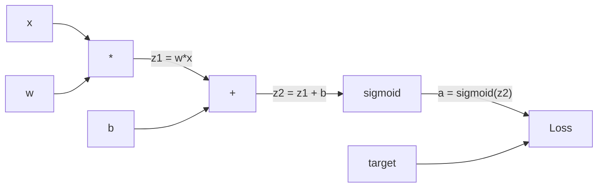
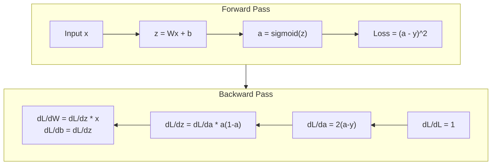
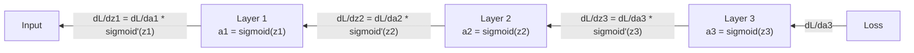

# La propagación hacia atrás desde cero desde la realización hacia la propagación

> La retropropagación es el algoritmo que hace posible el aprendizaje. Sin ella, las redes neuronales son sólo costosos generadores de números aleatorios.

> La transmisión inversa es hacer posible el aprendizaje.

> **【中文解读】**La transmisión negativa es el algoritmo central de hacer que la red neuronal pueda "aprender". Sin ella, la red neuronal es sólo una combinación de números aleatorios. Su esencia es calcular la escala de todos los parámetros de la ley de cadena de manera eficiente.

**Type:** Build
**Languages:** Python
**Prerequisites:** Lesson 03.02 (Multi-Layer Networks)
**Time:** ~120 minutes

## Objetivos de aprendizaje

- Implementar un motor de autogrado basado en valores que construye un gráfico computacional y computa gradientes a través de clasificación topológica
  实现 motor de cálculo automático basado en el valor, construir gráficos de cálculo y pasar por la escala de cálculo de orden
- Derivar el pase hacia atrás para la adición, multiplicación y sigmoide usando la regla de la cadena
  Usado la ley de la cadena de la transmisión de la transmisión de la transmisión de la transmisión de la transmisión de la transmisión de la transmisión de la transmisión de la transmisión de la transmisión de la transmisión de la transmisión de la transmisión de la transmisión de la transmisión de la transmisión de la transmisión de la transmisión de la transmisión de la transmisión de la transmisión de la transmisión de la transmisión de la transmisión de la transmisión de la transmisión de la transmisión de la transmisión de la transmisión de la transmisión de la transmisión de la transmisión de la transmisión de la transmisión de la transmisión de la transmisión de la transmisión de la transmisión de la transmisión de la transmisión de la transmisión de la transmisión de la transmisión de la transmisión de la transmisión de la transmisión de la transmisión de la transmisión de la transmisión de la transmisión de la transmisión de la transmisión de la transmisión de la transmisión de la transmisión de la transmisión de la transmisión de la transmisión de la transmisión de la transmisión de la transmisión de la transmisión de la transmisión de la transmisión de la transmisión de la transmisión de la transmisión de la transmisión de la transmisión de la transmisión de la transmisión de la transmisión de la transmisión de la transmisión de la transmisión de la transmisión de la transmisión
- Entrenar una red de múltiples capas en XOR y clasificación de círculos utilizando sólo su motor de retropropagación desde cero
  Solo con el que entrenar en XOR y red red de múltiples niveles de la construcción de motores de transmisión de contra-dirección desde cero
- Identificar el problema de los gradientes desaparecientes en redes sigmoides profundas y explicar por qué los gradientes se reducen exponencialmente
  识别深度 sigmoid 网络中的梯度消失问题,解释为什么梯度会指数级缩小

> **【中文解读】**Objetivo del capítulo: construir un motor de distribución automática similar a PyTorch autograd, con la ley de cadena de inducción de la transmisión de la transmisión de la transmisión de la transmisión de la transmisión de la transmisión de la transmisión de la transmisión, entrenar la transmisión de la transmisión de la transmisión de la transmisión de la transmisión de la transmisión de la transmisión de la transmisión de la transmisión de la transmisión de la transmisión de la transmisión de la transmisión de la transmisión de la transmisión de la transmisión de la transmisión de la transmisión de la transmisión de la transmisión de la transmisión de la transmisión de la transmisión de la transmisión de la transmisión de la transmisión de la transmisión de la transmisión de la transmisión de la transmisión de la transmisión de la transmisión de la transmisión de la transmisión de la transmisión de la transmisión de la transmisión de la transmisión de la transmisión de la transmisión de la transmisión de la transmisión de la transmisión de la transmisión de la transmisión de la transmisión de la transmisión de la transmisión de la transmisión de la transmisión de la transmisión de la transmisión de la transmisión de la transmisión de la transmisión de la transmisión.

## El problema es la introducción del problema

Su red tiene una sola capa oculta con 768 entradas y 3072 salidas. Eso es 2.359.296 pesos. hizo una predicción errónea. ¿Qué pesos causaron el error? probar cada peso individualmente significa 2.3 millones de pases hacia adelante.

> Tu red tiene 768 entradas  3072 salidas ocultas. Es 2,359,296 pesos. Hace predicciones erróneas. ¿Qué pesos han provocado errores? Cada peso significa 230 millones de veces hacia adelante y hacia afuera.

El enfoque ingenuo: tomar un peso, empujarlo por una pequeña cantidad, correr el pase hacia adelante de nuevo, medir si la pérdida fue hacia arriba o hacia abajo. Eso le da el gradiente para ese peso. Ahora hazlo para cada peso en la red. Multiplica por miles de pasos de entrenamiento y millones de puntos de datos. Necesitarías tiempo geológico para entrenar algo útil.

> Primero método: tomar un peso, modificarlo, volver a ejecutarlo, la pérdida de peso es subir o bajar. Así obtienes ese peso de peso. Ahora, cada peso de la red lo hace.

La propagación hacia atrás resuelve esto. Un paso hacia adelante, un paso hacia atrás, todos los gradientes calculados. El truco es la regla de cadena del cálculo, aplicada sistemáticamente a un gráfico computacional. Este es el algoritmo que hizo que el aprendizaje profundo sea práctico. Sin él, todavía estaríamos atascados en problemas de juguete.

> La transmisión negativa resolvió este problema. Una vez la transmisión negativa, una vez la transmisión negativa, todos los niveles se completan.

> **【中文解读】**Una red de 2.35 millones de pesos, si se intenta calcular la escala, necesita 2.35 millones de veces hacia adelante y hacia adelante propagarse. La transmisión de la inversa sólo necesita una vez hacia adelante + una vez hacia atrás para calcular todas las escalas. Esto no es optimización, sino la diferencia entre "imposible" y "entrenable". El principio central es la ley de la cadena de las cuentas de la molécula, aplicada sistemáticamente a la gráfica de cálculo.

## El concepto central.

### La regla de la cadena, aplicada a las redes.

Viste la regla de la cadena en la fase 01, lección 05. Resumen rápido: si y = f(g(x)), entonces dy/dx = f'(g(x)) * g'(x. Multiplicas derivadas a lo largo de la cadena.

> Usted en la primera fase 05 课见过链式法则──快速回顾: si y = f(g(x)),则 dy/dx = f'(g(x)) * g'(x)── Usted a lo largo de la cadena条将导数相乘──

En una red neuronal, la "cadena" es la secuencia de operaciones desde la entrada hasta la pérdida. Cada capa aplica pesos, agrega sesgos, pasa a través de una activación. La función de pérdida compara la salida final con el objetivo. La retropropagación rastrea esta cadena hacia atrás, calculando cómo cada operación contribuyó al error.

> En las redes neuronales, la "cadena" es la secuencia de operaciones desde la entrada hasta la pérdida. En cada una de las funciones de aplicación se comparan las funciones de pérdida y la salida final.

> **【中文解读】**链式法则: si y = f(g(x)),则 dy/dx = f'(g(x)) * g'(x) ・・・En la red neuronal, " cadena " es una serie de operaciones de entrada a pérdida。

> **【拓展：PyTorch autograd 的核心】**PyTorch de `loss.backward()`Es la ley de ejecución automática de la cadena. Se registra en el gráfico de cálculo de los valores de los cuales se producen las operaciones anteriores, y luego en el gráfico de la longitud de la transmisión posterior, se comprende la realización manual de esta clase, se comprende todo el principio de PyTorch autograd.

### Graficos computacionales

Cada paso hacia adelante construye un gráfico. Cada nodo es una operación (multiplicar, agregar, sigmoide). Cada borde lleva un valor hacia adelante y un gradiente hacia atrás.

> Cada vez que se transmite hacia adelante se construye un mapa. Cada nodo es una operación. Cada lado del lado del lado del lado del lado del lado del lado del lado del lado del lado del lado del lado del lado del lado del lado del lado del lado del lado del lado del lado del lado del lado del lado del lado del lado del lado del lado del lado del lado del lado del lado del lado del lado del lado del lado del lado del lado del lado del lado del lado del lado del lado del lado del lado del lado del lado del lado del lado del lado del lado del lado del lado del lado del lado del lado del lado del lado del lado del lado del lado del lado del lado del lado del lado del lado del lado del lado del lado del lado del lado del lado del lado del lado del lado del lado del lado del lado del lado del lado del lado del lado del lado del lado del lado del lado del lado del lado del lado del lado del lado del lado del lado del lado del lado del lado del lado del lado del lado del lado del lado del lado del lado del lado del lado del lado del lado del lado del lado del lado del lado del lado del lado del lado del lado del lado del lado del lado del lado del lado del lado del lado del lado del lado del lado del lado del lado del lado del lado del lado del lado del lado del lado del lado del lado del lado del lado del lado del lado del lado del lado del lado del lado del lado del lado del lado del lado del lado del lado del lado del lado del lado del lado del lado del lado del lado del lado del lado del lado del lado del lado del lado del lado del lado del lado del lado del lado del lado del lado del lado del lado del lado del del lado del del del lado del del del del del lado del del del lado del del del del del del lado del lado del del del del del del del del del del del del del del del del del del del del del del del del del del del del del del del del del del del del del del del del del del del del del del del del del del del del del del del del del del del del del del del del del del del del del del del del del del del del del del del del del del del del del del del del del del del del del del del del del del del del del del del del del del del del del del del del del del del del del del del del del del



Pasar hacia adelante: los valores fluyen de izquierda a derecha. x y w producen z1 = w*x. Agregar b para obtener z2. Sigmoid da activación a. Comparar a a a y usando la función de pérdida.

> Antes de la difusión: valor de la izquierda hacia la derecha de la circulación.x 和 w 产生 z1 = w*x。加 b 得到 z2。Sigmoid 给出激活 a。用损失函数将 a 与目标 y 进行比较。

Paso hacia atrás: los gradientes fluyen de derecha a izquierda. Comience con dL/da (cómo cambia la pérdida con la activación). Multiplicar por da/dz2 (derivada sigmoide). Eso da dL/dz2. Dividir en dL/dz2 (que es igual a dL/dz2, ya que z2 = z1 + b) y dL/dz1.

> Contraste de transmisión: gradiente de derecha a izquierda. De dL/da (la pérdida de la forma en que se activa la variación) comienza.

Cada nodo en el gráfico tiene una tarea durante el paso hacia atrás: tomar el gradiente que viene de arriba, multiplicar por su derivada local, y pasarlo hacia abajo.

> 图中每节点在反向传播中只有一个任务:接收上传的梯度,乘以自己的局部导数,传递下去──

> **【中文解读】**Cada nodo en el gráfico de cálculo ((乘法、加法、sigmoid) tiene que hacer una sola cosa: recibir la escala superior, multiplicarse por su propia dirección local, transmitir hacia abajo.

### En adelante contra atrás.



El pase hacia adelante almacena todos los valores intermedios: z, a, las entradas de cada capa. El pase hacia atrás necesita estos valores almacenados para calcular los gradientes. Este es el tradeoff de memoria-computación en el corazón del backprop.

> Este es el peso de cálculo de la memoria central de la transmisión. Usted utiliza la memoria (la memoria activa) para cambiar la velocidad (la velocidad) de una transmisión (la cantidad de veces) de una transmisión (la cantidad de veces).

> **【中文解读】**Este es el peso central de la transmisión: usar el almacenamiento en tiempo real (con un valor de transmisión) para cambiar la velocidad (una vez por millones de veces).

### Flujo gradual a través de una red.

Para una red de tres capas, cadenas de gradientes a través de cada capa:

> Para 3 niveles de red, gradiente a través de cada uno de los niveles de enlaces transmitidos:



En cada capa, el gradiente se multiplica por la derivada sigmoide. La derivada sigmoide es un * (1 - a), que se maximiza a 0.25 (cuando a = 0.5). Tres capas profundas, el gradiente se ha multiplicado por un máximo de 0.25^3 = 0.0156. Diez capas profundas: 0.25^10 = 0.000001.

> En cada uno de los niveles, los niveles se multiplican por la cantidad de sigmoides. Los niveles de sigmoides son a * (1 - a), el valor máximo es 0.25 (a = 0.5 时) ⋅ después de los tres niveles, los niveles más altos se multiplican por 0.25^3 = 0.0156⋅ después de los diez niveles: 0.25^10 = 0.000001⋅ después de los tres niveles.

### Los Gradientes desaparecen.

Este es el problema del gradiente desapareciente. Sigmoide aplasta su salida entre 0 y 1. Su derivado es siempre menor que 0.25.

> Éste es el problema de la desaparición de la escala. El sigmoide se comprimirá a 0 y entre 1 y 2.

```
sigmoid(z):     Output range [0, 1]              # 输出范围 [0, 1]
sigmoid'(z):    Max value 0.25 (at z = 0)        # 导数最大值 0.25（在 z = 0 时）

After 5 layers:   gradient * 0.25^5 = 0.001x original       # 5 层后梯度缩到 0.001 倍
After 10 layers:  gradient * 0.25^10 = 0.000001x original    # 10 层后梯度几乎为零
```

Por eso las redes sigmoides profundas son casi imposibles de entrenar. La solución - ReLU y sus variantes - es el tema de la lección 04. Por ahora, entienda que el backprop funciona perfectamente. El problema es lo que está trabajando.

> Es por eso que la profundidad sigmoide  red es casi imposible de entrenar. La solución  ReLU  y sus variaciones  es el tema de la cuarta clase. Ahora, sólo se necesita entender que la transmisión contraria funciona bien, el problema está en lo que pasa.

> **【中文解读】**梯度消失: el índice máximo de sigmoides es de 0.25, cada vez que pasa una capa de gradiente se multiplica por un máximo de 0.25──5 niveles, quedando sólo 0.001,10 niveles, quedando solo un millón de porciones.

> **【拓展：Transformer 中的梯度流】**Transformer Used残差连接(Restaur Connection) resolver el problema de la desaparición de la escala:`output = x + sublayer(x)` Esta escala puede saltar a través de la capa de transmisión directa, lo que permite que los 96 niveles de GPT-3 también puedan entrenar.

### Derivar Gradientes para una red de dos capas                                                                                                                                                                                                                                                                                                                                                                                                                                                                                                                  

Matemáticas concretas para una red con entrada x, capa oculta con sigmoid, capa de salida con sigmoid y pérdida de MSE.

> 具体推导一个具有输入 x、sigmoid 隐藏层、sigmoid 输出层和MSE 损失的网络──

Pases de entrada:
```
z1 = W1 * x + b1          # 隐藏层线性变换
a1 = sigmoid(z1)           # 隐藏层激活
z2 = W2 * a1 + b2          # 输出层线性变换
a2 = sigmoid(z2)           # 输出层激活
L = (a2 - y)^2             # MSE 损失
```

Pases hacia atrás (aplicación de la regla de la cadena paso a paso):
```
dL/da2 = 2(a2 - y)                              # 损失对输出的梯度
da2/dz2 = a2 * (1 - a2)                         # sigmoid 导数
dL/dz2 = dL/da2 * da2/dz2 = 2(a2 - y) * a2 * (1 - a2)  # 链式法则

dL/dW2 = dL/dz2 * a1                            # 输出层权重梯度
dL/db2 = dL/dz2                                  # 输出层偏置梯度

dL/da1 = dL/dz2 * W2                             # 梯度传播到隐藏层
da1/dz1 = a1 * (1 - a1)                          # sigmoid 导数
dL/dz1 = dL/da1 * da1/dz1                        # 链式法则

dL/dW1 = dL/dz1 * x                              # 隐藏层权重梯度
dL/db1 = dL/dz1                                   # 隐藏层偏置梯度
```

Cada gradiente es un producto de derivados locales rastreados desde la pérdida.

> Cada gradiente es la multiplicidad de la dirección local de la pérdida de retroceso.

> **【中文解读】**Traducción de la escala de la red de dos niveles: desde la función de pérdida, se utiliza la ley de cadena paso a paso hacia el cálculo.

## Construye con movimiento.
```figure
backprop-vanishing
```

## Construye el mismo

### Paso 1: El nodo de valor 节点 de valor

Cada número en nuestro cálculo se convierte en un valor. Almacena sus datos, su gradiente y cómo se creó (por lo que sabe cómo calcular los gradientes hacia atrás).

> Cada número de nuestro cálculo se convierte en un valor. Almacena datos, gradientes y cómo se crea. Así que sabe cómo invertir el gradiente de cálculo.

```python
class Value:
    def __init__(self, data, children=(), op=''):
        self.data = data                          # 这个节点的数值
        self.grad = 0.0                           # 损失对这个值的梯度（初始为 0）
        self._backward = lambda: None             # 反向传播函数（初始为空操作）
        self._children = set(children)            # 产生这个值的子节点（用于拓扑排序）
        self._op = op                             # 产生这个值的操作（用于调试可视化）
```

No hay ningún gradiente todavía (0.0).`_children`rastrear que los valores producido este, así que podemos ordenar topológicamente el gráfico más tarde.

> No hay ninguna escala (0.0)`_children`Con el siguiente valor se generó este valor, para que más tarde se desarrolle la orden.

### Paso 2: Operaciones con funciones retrocedientes

Cada operación crea un nuevo valor y define cómo fluyen los gradientes hacia atrás a través de él.

> Cada operación crea un nuevo valor y define la escala de cómo pasa a través de él en contrafusión.

```python
def __add__(self, other):
    other = other if isinstance(other, Value) else Value(other)
    out = Value(self.data + other.data, (self, other), '+')

    def _backward():
        self.grad += out.grad        # 加法的梯度：d(a+b)/da = 1，直接传递
        other.grad += out.grad       # d(a+b)/db = 1，直接传递

    out._backward = _backward
    return out

def __mul__(self, other):
    other = other if isinstance(other, Value) else Value(other)
    out = Value(self.data * other.data, (self, other), '*')

    def _backward():
        self.grad += other.data * out.grad   # 乘法的梯度：d(a*b)/da = b
        other.grad += self.data * out.grad   # d(a*b)/db = a

    out._backward = _backward
    return out
```

Para adición: d(a+b)/da = 1, d(a+b)/db = 1. Así que ambas entradas obtienen el gradiente de la salida directamente.

> 加法:d(a+b)/da = 1,d(a+b)/db = 1── por lo tanto, dos entradas y dos salidas se obtienen directamente.

Para la multiplicación: d(a*b)/da = b, d(a*b)/db = a. Cada entrada obtiene el valor del otro veces el gradiente de salida.

> 乘法:d(a*b)/da = b,d(a*b)/db = a。 cada entrada obtiene otro de valor乘以输出梯度。

El `+=`Un valor puede ser utilizado en múltiples operaciones. su gradiente es la suma de los gradientes de todos los caminos.

> `+=`Es un valor que puede ser utilizado en múltiples operaciones. Su gradiente es derivado de todos los caminos.

> **【中文解读】**La escala de la forma de la forma de la forma de la forma de la forma de la forma de la forma de la forma de la forma de la forma de la forma de la forma de la forma de la forma de la forma de la forma de la forma de la forma de la forma de la forma de la forma de la forma de la forma de la forma de la forma de la forma de la forma de la forma de la forma de la forma de la forma de la forma de la forma de la forma de la forma de la forma de la forma de la forma de la forma de la forma de la forma de la forma de la forma de la forma de la forma de la forma de la forma de la forma de la forma de la forma de la forma de la forma de la forma de la forma de la forma de la forma de la forma de la forma de la forma de la forma de la forma de la forma de la forma de la forma de la forma de la forma de la forma de la forma de la forma de la forma de la forma de la forma de la forma de la forma de la forma de la forma de la forma de la forma de la forma de la forma de la forma de la forma de la forma de la forma de la forma de la forma de la forma de la forma de la forma de la de la forma de la de la forma de la de la forma de la de la de la de la de la de la de la de la de la de la de la de la de la de la de la de la de la de la de la de la de la de la de la de la de la de la de la de la de la de la de la de la de la de la de la de la de la de la de la de la de la de la de la de la de la de la de la de la de la de la de la de la de la de la de la de la de la de la de la de la de la de la de la de la de la de la de la de la de la de la de la de la de la de la de la de la de la de la de la de la de la de la de la de la de la de la de la de la de la de la de la de la de la de la de la de la de la de la de la de la de la de la de la de la de la de la de la de la de la de la de la de la de la`+=`En vez de`=`, ya que un valor puede ser utilizado por varias operaciones, la escala debe agregarse de todos los caminos.

### Paso 3: Sigmoide y pérdida

```python
import math

def sigmoid(self):
    x = self.data
    x = max(-500, min(500, x))    # 裁剪防止溢出
    s = 1.0 / (1.0 + math.exp(-x))  # 前向：计算 sigmoid
    out = Value(s, (self,), 'sigmoid')

    def _backward():
        self.grad += (s * (1 - s)) * out.grad  # 反向：sigmoid 导数 = σ(x) * (1 - σ(x))

    out._backward = _backward
    return out
```

Sigmoid derivado: sigmoid(x) * (1 - sigmoid(x)). Hemos calculado sigmoid(x) = s durante el pase hacia adelante.

> Sigmoide 导数:sigmoide(x) * (1 - sigmoide(x))。 Nosotros en el anterior sentido de la difusión ya hemos calculado sigmoide(x) = s──replicarlo, no necesita extra trabajo──

```python
def mse_loss(predicted, target):
    diff = predicted + Value(-target)  # predicted - target
    return diff * diff                  # (predicted - target)^2
```

MSE para una salida única: (predecida - objetivo) ^ 2. Expresamos la restancia como suma con un valor negativo.

> 单输出 MSE:(previsto - objetivo) ^2。 我们将减法表示为加上取反的值──

### Paso 4: Pasado hacia atrás.

El orden topológico asegura que procesemos los nodos en el orden correcto - el gradiente de un nodo se acumula completamente antes de que nos propaguemos a través de él.

> 拓排序 拓排序 拓排序 拓排序 拓排序 拓排序 拓排序 拓排序 拓排序 拓排序 拓排序 拓排序 拓排序 拓排序 拓排序 拓排序 拓排序 拓排序 拓排序 拓排序 拓排序 拓排序 拓排序 拓排序 拓排序 拓排序 拓排序 拓排序 拓排序 拓排序 拓排序 拓排序 拓排序 拓排序 拓排序 拓排序 拓排序 排序 排序 排序 排序 排序 排序 排序 排序 排序 排序 排序 排序 排序 排序 排序 排序 排序 排序 排序 排序 排序 排序 排序 排序 排序 排序 排序 排序 排序 排序 排序 排序 排序 排序 排序 排序 排序 排序 排序 排序 排序 排序 排序 排序 排 排 排 排 排 排 排 排 排 排 排 排 排 排 排 排 排 排 排 排 排 排 排 排 排 排 排 排 排 排 排 排 排 排 排 排 排 排 排 排 排 排 排 排 排 排 排 排 排 排 排 排 排 排 排 排 排 排 排 排 排 排 排 排 排 排 排 排 排 排 排 排 排 排 排 排 排 排 排 排 排 排 排 排 排 排 排 排 排 排 排 排 排 排 排 排 

```python
def backward(self):
    topo = []                         # 拓扑排序结果
    visited = set()

    def build_topo(v):
        if v not in visited:
            visited.add(v)
            for child in v._children:    # 先访问所有子节点
                build_topo(child)
            topo.append(v)               # 子节点都访问完后，再把自己加入列表

    build_topo(self)
    self.grad = 1.0                     # 损失对自己的梯度 = 1（dL/dL = 1）
    for v in reversed(topo):            # 逆序遍历（从输出到输入）
        v._backward()                   # 每个节点执行自己的反向传播函数
```

Comience en la pérdida (gradiente = 1.0, ya que dL/dL = 1).`_backward`empuja los gradientes a sus hijos.

> Desde la pérdida comienza la gradación = 1.0, porque dL/dL = 1)──`_backward`Se le dará la escala a sus hijos.

> **【中文解读】**拓排序保证: después de que la escala de un nodo se agrega completamente, sólo se transmite su subnodo.`loss.backward()`La lógica central de la ley es que el hombre es un hombre.

### Paso 5: capa y red.

```python
import random

class Neuron:
    def __init__(self, n_inputs):
        scale = (2.0 / n_inputs) ** 0.5   # He 初始化缩放因子，防止 sigmoid 饱和
        self.weights = [Value(random.uniform(-scale, scale)) for _ in range(n_inputs)]
        self.bias = Value(0.0)

    def __call__(self, x):
        act = sum((wi * xi for wi, xi in zip(self.weights, x)), self.bias)  # 加权求和 + 偏置
        return act.sigmoid()  # sigmoid 激活

    def parameters(self):
        return self.weights + [self.bias]   # 返回所有可训练参数


class Layer:
    def __init__(self, n_inputs, n_outputs):
        self.neurons = [Neuron(n_inputs) for _ in range(n_outputs)]

    def __call__(self, x):
        out = [n(x) for n in self.neurons]
        return out[0] if len(out) == 1 else out  # 单神经元时直接返回值

    def parameters(self):
        params = []
        for n in self.neurons:
            params.extend(n.parameters())
        return params


class Network:
    def __init__(self, sizes):
        self.layers = []
        for i in range(len(sizes) - 1):
            self.layers.append(Layer(sizes[i], sizes[i + 1]))  # 按尺寸列表构建层

    def __call__(self, x):
        for layer in self.layers:
            x = layer(x)                    # 逐层前向传播
            if not isinstance(x, list):
                x = [x]
        return x[0] if len(x) == 1 else x

    def parameters(self):
        params = []
        for layer in self.layers:
            params.extend(layer.parameters())
        return params

    def zero_grad(self):
        for p in self.parameters():
            p.grad = 0.0    # 清零所有梯度（每次反向传播前必须调用）
```

Una Neurona toma entradas, calcula la suma ponderada + sesgo y aplica sigmoides. Escales de inicialización de peso por sqrt(2/n_inputs) para evitar la saturación sigmoide en redes más profundas. Una capa es una lista de neuronas. Una red es una lista de capas.`parameters()`El método recopila todos los valores que se pueden aprender para que podamos actualizarlos.

> Neurones  recepción de entrada, cálculo加权和加偏置, luego aplicar sigmoid──权重初始化按平方(2/n_inputs) 缩放以防止更深层网络中 sigmoid 和──层是 Neuron 的列表──网络是层 的列表──`parameters()`方法收集所有可学习的价值以便更新──

> **【中文解读】**Neurón = un grupo de neuronas, red = un grupo de niveles.`parameters()` reunir todos los elementos de entrenamiento,`zero_grad()`清零梯度(per ronda de entrenamiento antes debe ser ajustado)。 ése es PyTorch 中 `model.parameters()`Y `optimizer.zero_grad()`De tipo original.

### Paso 6: Entrenamiento en XOR Entrenamiento XOR

```python
random.seed(42)
net = Network([2, 4, 1])  # 2 输入 → 4 隐藏神经元 → 1 输出

xor_data = [
    ([0.0, 0.0], 0.0),
    ([0.0, 1.0], 1.0),
    ([1.0, 0.0], 1.0),
    ([1.0, 1.0], 0.0),
]

learning_rate = 1.0

for epoch in range(1000):
    total_loss = Value(0.0)
    for inputs, target in xor_data:
        x = [Value(i) for i in inputs]
        pred = net(x)                          # 前向传播
        loss = mse_loss(pred, target)          # 计算损失
        total_loss = total_loss + loss         # 累积损失

    net.zero_grad()           # 清零梯度
    total_loss.backward()     # 反向传播：计算所有参数的梯度

    for p in net.parameters():
        p.data -= learning_rate * p.grad      # 梯度下降更新权重

    if epoch % 100 == 0:
        print(f"Epoch {epoch:4d} | Loss: {total_loss.data:.6f}")

print("\nXOR Results:")
for inputs, target in xor_data:
    x = [Value(i) for i in inputs]
    pred = net(x)
    print(f"  {inputs} -> {pred.data:.4f} (expected {target})")
```

Observe la disminución de la pérdida. Desde predicciones aleatorias hasta correcciones de salidas XOR, impulsadas enteramente por gradientes de computación de retropropagación y empujando pesas en la dirección correcta.

>  observar pérdida baja― desde la predicción de la velocidad de la velocidad de la velocidad de la velocidad de la velocidad de la velocidad de la velocidad de la velocidad de la velocidad de la velocidad de la velocidad de la velocidad de la velocidad de la velocidad de la velocidad de la velocidad de la velocidad de la velocidad de la velocidad de la velocidad de la velocidad de la velocidad de la velocidad de la velocidad de la velocidad de la velocidad de la velocidad de la velocidad de la velocidad de la velocidad de la velocidad de la velocidad de la velocidad de la velocidad de la velocidad de la velocidad de la velocidad de la velocidad de la velocidad de la velocidad de la velocidad de la velocidad de la velocidad de la velocidad de la velocidad de la velocidad de la velocidad de la velocidad de la velocidad de la velocidad de la velocidad de la velocidad de la velocidad de la velocidad de la velocidad de la velocidad de la velocidad de la velocidad de la velocidad de la velocidad de la velocidad de la velocidad de la velocidad de la velocidad de la velocidad de la velocidad de la velocidad de la velocidad de la velocidad de la velocidad de la velocidad de la velocidad de la velocidad de la velocidad de la velocidad de la velocidad de la velocidad de la velocidad de la velocidad de la velocidad de la velocidad de la velocidad de la velocidad de la velocidad de la velocidad de la velocidad de la velocidad de la velocidad de la velocidad de la velocidad de la velocidad de la velocidad de la velocidad de la velocidad de la velocidad de la velocidad de la velocidad de la velocidad de la velocidad de la velocidad de la velocidad de la velocidad de la velocidad de la velocidad de la velocidad de la velocidad de la velocidad de la velocidad de la velocidad de la velocidad de la velocidad de la velocidad de la velocidad de la velocidad de la velocidad de la velocidad de la velocidad de la velocidad de la velocidad de la velocidad de la velocidad de la velocidad de la velocidad de la velocidad de la velocidad

> **【中文解读】**                                                                                                                                                                                                                                                              

### Paso 7: Clasificación de círculos.

En la Lección 02, sintoniza las pesas a mano para la clasificación de círculos.

> En la segunda clase, tu manual ha ajustado el peso de las clases redondas. Ahora deja que la red se las aprenda.

```python
random.seed(7)

def generate_circle_data(n=100):
    data = []
    for _ in range(n):
        x1 = random.uniform(-1.5, 1.5)
        x2 = random.uniform(-1.5, 1.5)
        label = 1.0 if x1 * x1 + x2 * x2 < 1.0 else 0.0   # 距原点 < 1 则为"内部"
        data.append(([x1, x2], label))
    return data

circle_data = generate_circle_data(80)

circle_net = Network([2, 8, 1])  # 2-8-1 网络
learning_rate = 0.5

for epoch in range(2000):
    random.shuffle(circle_data)       # 打乱数据顺序
    total_loss_val = 0.0
    for inputs, target in circle_data:
        x = [Value(i) for i in inputs]
        pred = circle_net(x)
        loss = mse_loss(pred, target)
        circle_net.zero_grad()         # 清零梯度
        loss.backward()                # 反向传播
        for p in circle_net.parameters():
            p.data -= learning_rate * p.grad  # 更新权重
        total_loss_val += loss.data

    if epoch % 200 == 0:
        correct = 0
        for inputs, target in circle_data:
            x = [Value(i) for i in inputs]
            pred = circle_net(x)
            predicted_class = 1.0 if pred.data > 0.5 else 0.0
            if predicted_class == target:
                correct += 1
        accuracy = correct / len(circle_data) * 100
        print(f"Epoch {epoch:4d} | Loss: {total_loss_val:.4f} | Accuracy: {accuracy:.1f}%")
```

Usamos SGD en línea aquí - actualizar pesos después de cada muestra en lugar de acumular el lote completo. Esto rompe la simetría más rápido y evita la saturación sigmoide en el panorama de pérdida completa. Mezclar los datos cada época evita que la red de memorizar el orden.

> Esto puede romper más rápidamente la comparabilidad y evitar la aparición de sigmoides en toda la curva de pérdida 和── en cada época 打乱数据可防止网络记住顺序──

No hay ajuste manual. La red descubre el límite circular de decisión por sí misma. Ese es el poder de la retropropagación: defines la arquitectura, la función de pérdida y los datos. El algoritmo calcula los pesos.

> 无需手动调权重――网络自学会绘图圆形决策边界――这是反向传播的力量:你定义架构、损失函数和数据,算法自己找出正确权重――

> **【中文解读】**Esto es lo que hace que la transmisión de datos sea más rápida y más rápida. Esto es lo que hace que la transmisión de datos sea más rápida y más rápida.

## Usalo en la práctica.

PyTorch hace todo lo anterior en unas pocas líneas. La idea central es idéntica: Autograd construye un gráfico computacional durante el pase hacia adelante y lo rastrea hacia atrás para calcular gradientes.

> PyTorch ha completado todas las funciones anteriores con varias líneas de código.

```python
import torch
import torch.nn as nn

model = nn.Sequential(
    nn.Linear(2, 4),       # 对应我们的 Layer(2, 4)
    nn.Sigmoid(),           # 对应 sigmoid 激活
    nn.Linear(4, 1),       # 对应我们的 Layer(4, 1)
    nn.Sigmoid(),
)
optimizer = torch.optim.SGD(model.parameters(), lr=1.0)  # 对应我们的手动梯度下降
criterion = nn.MSELoss()  # 对应我们的 mse_loss

X = torch.tensor([[0,0],[0,1],[1,0],[1,1]], dtype=torch.float32)
y = torch.tensor([[0],[1],[1],[0]], dtype=torch.float32)

for epoch in range(1000):
    pred = model(X)                  # 前向传播
    loss = criterion(pred, y)        # 计算损失
    optimizer.zero_grad()            # 清零梯度（对应 net.zero_grad()）
    loss.backward()                  # 反向传播（对应 total_loss.backward()）
    optimizer.step()                 # 更新权重（对应 p.data -= lr * p.grad）

print("PyTorch XOR Results:")
with torch.no_grad():                # 推理模式，不计算梯度
    for i in range(4):
        pred = model(X[i])
        print(f"  {X[i].tolist()} -> {pred.item():.4f} (expected {y[i].item()})")
```

`loss.backward()`¿ Es su ?`total_loss.backward()`- ¿ Qué ?`optimizer.step()`¿ Es tu manual ?`p.data -= lr * p.grad`- ¿ Qué ?`optimizer.zero_grad()`¿ Es su ?`net.zero_grad()`El algoritmo es el mismo, la aplicación de la fuerza industrial. PyTorch maneja la aceleración de la GPU, la precisión mixta, el control de gradientes y cientos de tipos de capas. Pero el paso hacia atrás es la misma regla de cadena aplicada al mismo gráfico computacional.

> `loss.backward()`Es tu .`total_loss.backward()`¿Qué es eso?`optimizer.step()`Es tu movimiento.`p.data -= lr * p.grad`¿Qué es eso?`optimizer.zero_grad()`Es tu .`net.zero_grad()` Igual algoritmo, implementación industrial  PyTorch  procesamiento de GPU aceleración  mezcla de precisión  punto de control de gradiente y cientos de tipos de niveles  Pero la transmisión inversa es que se aplicará el mismo método de cadena en el mismo cálculo 

El entrenamiento ejecuta el pase hacia adelante, luego el pase hacia atrás, luego actualiza los pesos. La inferencia sólo corre el pase hacia adelante. No hay gradientes, no hay actualizaciones. Esta distinción es importante porque la inferencia es lo que sucede en la producción. Cuando llamas a una API como Claude o GPT, estás haciendo inferencias -- tu mensaje fluye hacia adelante a través de la red, y los tokens salen por el otro extremo. No hay cambios de pesos. Comprender el backprop es importante porque formaba cada peso en esa red.

> 训运行前向传播,然后反向传播,然后更新权重――推理只运行前向传播――没有梯度,没有更新―― esta diferencia es importante, porque el teorema es algo que ocurre en el entorno de producción―― cuando se utiliza Claude o GPT etc API, se ejecuta el teorema 你的提示词前向流过网络,代币从另一端输出――权重不变―― comprender el contrario de la transmisión es importante, porque forma cada uno de los poderes en esa red―

> **【中文解读】**PyTorch de `loss.backward()`= Nos hemos escrito de la mano `backward()`¿ Qué ?`optimizer.step()`= Nos hemos escrito de la mano `p.data -= lr * p.grad` entrenamiento cuando hacer previo a + reverso a + actualización, previo a sólo hacer previo a¬¬¬¬¬¬¬¬¬¬¬¬¬¬¬¬¬¬¬¬¬¬¬¬¬¬¬¬¬¬¬¬¬¬¬¬¬¬¬¬¬¬¬¬¬¬¬¬¬¬¬¬¬¬¬¬¬¬¬¬¬¬¬¬¬¬¬¬¬¬¬¬¬¬¬¬¬¬¬¬¬¬¬¬¬¬¬¬¬¬¬¬¬¬¬¬¬¬¬¬¬¬¬¬¬¬¬¬¬¬¬¬¬¬¬¬¬¬¬¬¬¬¬¬¬¬¬¬¬¬¬¬¬¬¬¬¬¬¬¬¬¬¬¬¬¬¬¬¬¬¬¬¬¬¬¬¬¬¬¬¬¬¬¬¬¬¬¬¬¬¬¬¬¬¬¬¬¬¬¬¬¬¬¬¬¬¬¬¬¬¬¬¬¬¬¬¬¬¬¬¬¬¬¬¬¬¬¬¬¬¬¬¬¬¬¬¬¬¬¬¬¬¬¬¬¬¬¬¬¬¬¬¬¬¬¬¬¬¬¬¬¬¬¬¬¬¬¬¬¬¬¬¬¬¬¬¬¬¬¬¬¬¬¬¬¬¬¬¬¬¬¬¬¬¬¬¬¬¬¬¬¬¬¬¬¬¬¬¬¬¬¬¬¬¬¬¬¬¬¬¬¬¬¬¬¬¬¬¬¬¬¬¬¬¬¬¬¬¬¬¬¬¬¬¬¬¬¬¬¬¬¬¬¬¬¬¬¬¬¬¬¬¬¬¬¬¬¬¬¬¬¬¬¬¬¬¬¬¬¬¬¬¬¬¬¬¬¬¬¬¬¬¬¬¬¬¬¬¬¬¬¬¬¬¬¬¬¬¬¬¬¬¬¬¬¬¬¬¬¬¬¬¬¬¬¬¬¬¬¬¬¬¬¬¬¬¬¬¬¬¬¬¬¬¬¬¬¬¬¬¬¬¬¬¬¬¬¬¬¬¬¬¬¬¬¬¬¬¬¬¬¬¬¬¬¬¬¬¬¬¬¬¬¬¬¬¬¬¬¬¬¬¬¬¬¬¬¬¬¬¬¬¬¬¬

## Envía el producto .

Esta lección produce:
- `outputs/prompt-gradient-debugger.md`-- una señal reutilizable para diagnosticar problemas de gradiente (desaparición, explosión, NaN) en cualquier red neuronal

> 本课产 出:`outputs/prompt-gradient-debugger.md`- Un diagnóstico repitible de cualquier problema de la red neuronal en la escala central (extinguir, explotar, NaN)

## Los ejercicios.

1. Añadir un`__sub__`El método de la clase de valor (a - b = a + (-1 * b)).`__neg__`El método de cálculo de los gradientes es el método de cálculo de los gradientes.
   > **练习 1：**给 Value 类加减法和取负操作──用手动计算验证 (a - b) ^ 2 的梯度是否正确──

2. Añadir un`relu`El método de conversión de la señal de sigmoide a la señal de sigmoide a la señal de sigmoide a la señal de sigmoide a la señal de sigmoide a la señal de sigmoide a la señal de sigmoide a la señal de sigmoide a la señal de sigmoide a la señal de sigmoide a la señal de sigmoide a la señal de sigmoide a la señal de sigmoide a la señal de sigmoide a la señal de sigmoide a la señal de sigmoide a la señal de sigmoide a la señal de sigmoide a la señal de sigmoide a la señal de sigmoide a la señal de sigmoide a la señal de sigmoide a la señal de sigmoide a la señal de sigmoide a la señal de sigmoide a la señal de sigmoide a la señal de sigmoide a la señal de sigmoide a la señal de sigmoide a la señal de sigmoide a la señal de sigmoide a la señal de convergencia a la velocidad de convergencia.
   > **练习 2：**给 Value 添加 ReLU 方法──用 ReLU 替换隐藏层的sigmoid,训练 XOR 并对比收速度──ReLU 应该更快这是下一课的预览──

3. Implementar una `__pow__`método en Valor para potencias enteras.`mse_loss`con un adecuado `(predicted - target) ** 2`Expresión. Verifique que los gradientes coinciden con la implementación original.
   > **练习 3：**给 Value 添加运算方法, use it rewrite MSE 损失――验证梯度与原始实现一致――

4. Añadir recorte de gradiente al bucle de entrenamiento: después de llamar `backward()`Entrenar una red más profunda (4+ capas con sigmoide) y comparar curvas de pérdida con y sin recorte. Esta es su primera defensa contra la explosión de gradientes.
   > **练习 4：**En el ciclo de entrenamiento añade la gradiencia de corte de corte (-1, 1]) ⋅ entrenamiento de 4+ niveles de la red sigmoide, en comparación con la curva de pérdida de corte.

5. Construir una visualización: después de entrenar en XOR, imprimir el gradiente de cada parámetro en la red. Identificar qué capa tiene los gradientes más pequeños. Esto demuestra el problema de gradiente desapareciente que usted lee en la sección Concepto.
   > **练习 5：**                                                                                                                                                                                                                                                              

## Términos clave .

| Term | What people say | What it actually means |
|------|----------------|----------------------|
| Backpropagation | "The network learns" | An algorithm that computes dL/dw for every weight by applying the chain rule backward through the computational graph |
| Computational graph | "The network structure" | A directed acyclic graph where nodes are operations and edges carry values (forward) and gradients (backward) |
| Chain rule | "Multiply the derivatives" | If y = f(g(x)), then dy/dx = f'(g(x)) * g'(x) -- the mathematical foundation of backpropagation |
| Gradient | "The direction of steepest ascent" | The partial derivative of the loss with respect to a parameter -- tells you how to change that parameter to reduce the loss |
| Vanishing gradient | "Deep networks don't learn" | Gradients shrink exponentially as they propagate through layers with saturating activations like sigmoid |
| Forward pass | "Running the network" | Computing the output from inputs by sequentially applying each layer's operations and storing intermediate values |
| Backward pass | "Computing gradients" | Traversing the computational graph in reverse, accumulating gradients at each node using the chain rule |
| Learning rate | "How fast it learns" | A scalar that controls the step size when updating weights: w_new = w_old - lr * gradient |
| Topological sort | "The right order" | An ordering of graph nodes where each node appears after all nodes it depends on -- ensures gradients are fully accumulated before propagation |
| Autograd | "Automatic differentiation" | A system that builds computational graphs during forward computation and automatically computes gradients -- what PyTorch's engine does |

| 术语 | 通俗说法 | 实际含义 |
|------|---------|---------|
| 反向传播 (Backpropagation) | "网络在学习" | 用链式法则沿计算图反向计算每个权重的 dL/dw 的算法 |
| 计算图 (Computational graph) | "网络结构" | 有向无环图，节点是操作，边传递值（前向）和梯度（反向） |
| 链式法则 (Chain rule) | "把导数乘起来" | y = f(g(x)) → dy/dx = f'(g(x)) * g'(x)——反向传播的数学基础 |
| 梯度 (Gradient) | "最陡上升方向" | 损失对参数的偏导数——告诉你怎么改参数能降低损失 |
| 梯度消失 (Vanishing gradient) | "深层网络学不动" | 梯度经过饱和激活函数（如 sigmoid）逐层指数级缩小 |
| 前向传播 (Forward pass) | "跑网络" | 从输入逐层计算输出，存储中间值 |
| 反向传播过程 (Backward pass) | "算梯度" | 逆序遍历计算图，用链式法则逐节点累加梯度 |
| 学习率 (Learning rate) | "学多快" | 控制权重更新步长的标量：w_new = w_old - lr * gradient |
| 拓扑排序 (Topological sort) | "正确的顺序" | 保证每个节点的梯度完全累加后再往下传播的节点排列 |
| 自动微分 (Autograd) | "自动求导" | 前向时构建计算图，自动计算梯度的系统——PyTorch 引擎的核心 |

## Más Leer más Leer más

- Rumelhart, Hinton & Williams, "Aprender representaciones mediante errores de propagación posterior" (1986) - el documento que hizo que la repasación posterior fuera corriente principal y desbloqueara el entrenamiento de redes multicapa
  Rumelhart、Hinton 和 Williams, 通过反向传播误差学习表示(1986) 让反向传播成为主流并解锁多层网络训练的论文
- 3Blue1Brown, serie de "Redes Neurales" (https://www.youtube.com/playlist?list=PLZHQObOWTQDNU6R1_67000Dx_ZCJB-3pi) -- la mejor explicación visual de la retropropagación y el flujo de gradientes a través de las redes
  3Blue1Brown,  Neural Networks serie  sobre la mejor interpretación visiblemente de la transmisión y la evolución de la transmisión en la red
