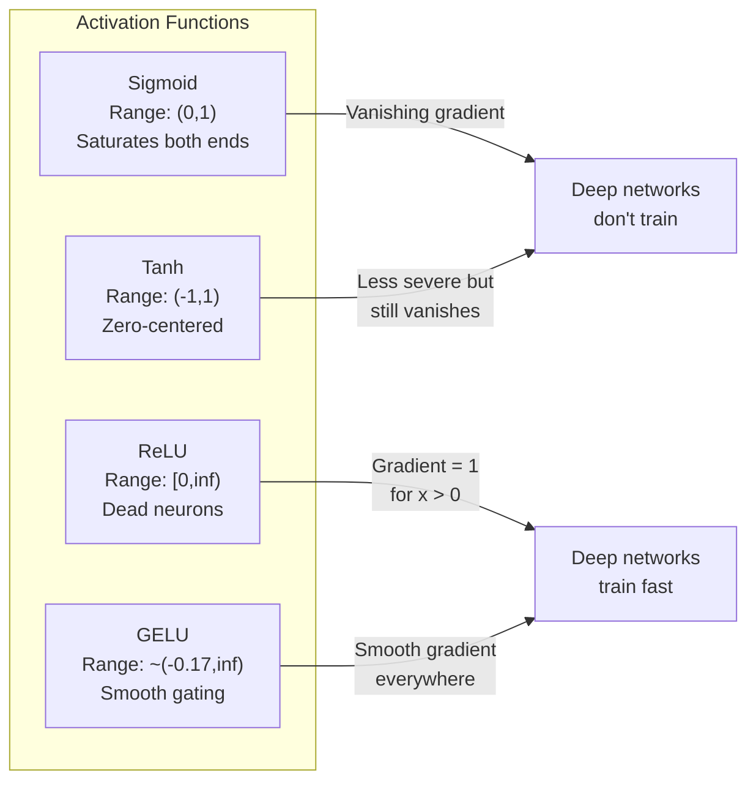
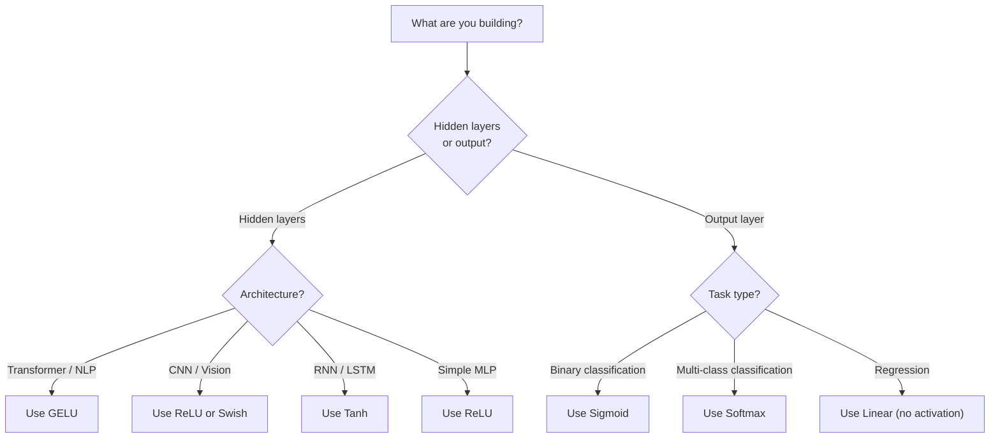

# Funciones de activación

> Sin la no linealidad, tu red de 100 capas es un multiplicador de matriz elegante.

> **【中文解读】**没有非线性激活函数,100 层网络等价于矩阵乘法──因为 dos 线性变换的复合还是线性:W2(W1x+b1) +b2 = (W2W1)x + (W2b1+b2)──激活函数打破这种线性叠加,让每层都能为网络增加真正表达能力──

**Type:** Build
**Languages:** Python
**Prerequisites:** Lesson 03.03 (Backpropagation)
**Time:** ~75 minutes

## Objetivos de aprendizaje

- Implementar sigmoide, tanh, ReLU, Leaky ReLU, GELU, Swish y softmax con sus derivados desde cero
- Diagnóstico del problema de gradiente desapareciente midiendo magnitudes de activación a través de 10+ capas con diferentes activaciones
- Detectar neuronas muertas en una red ReLU y explicar por qué GELU evita este modo de falla
- Seleccione la función de activación correcta para una arquitectura dada (transformador, CNN, RNN, capa de salida)

> **【中文解读】**Objetivo del capítulo: lograr 7 tipos de funciones activas y sus directivas, mediante el problema de desaparición de la graduación de diagnóstico experimental, la detección de los nervios de muerte en la ReLU, la selección de funciones activas adecuadas para diferentes estructuras.

## El problema es la introducción del problema

Estacle dos transformaciones lineales: y = W2 ((W1x + b1) + b2. Expanda: y = W2W1x + W2b1 + b2. Eso es sólo y = Ax + c - una sola transformación lineal. No importa cuántas capas lineales apiles, el resultado se derrumba a una matriz multiplicada. Su red de 100 capas tiene el mismo poder de representación que una sola capa.

> 堆叠两层线性变换:y = W2(W1x + b1) + b2。展开后:y = W2W1x + W2b1 + b2。 esto no es más que y = Ax + c un único cambio de línea.

Esto no es una curiosidad teórica. Significa que una red lineal profunda literalmente no puede aprender XOR, no puede clasificar un conjunto de datos en espiral, no puede reconocer una cara. Sin funciones de activación, la profundidad es una ilusión.

> Esto no es curiosidad teórica. Esto significa que la red de profundidad lineal en realidad no puede aprender XOR, no puede dividir los conjuntos de datos de la espiral, no puede reconocer la cara de la persona.

Las funciones de activación rompen la linealidad. Deforman la salida de cada capa a través de una función no lineal, dando a la red la capacidad de doblar los límites de decisión, aproximar funciones arbitrarias y realmente aprender. Pero escoge la activación equivocada y tus gradientes desaparecen a cero (sigmoides en redes profundas), explotan hasta el infinito (activaciones ilimitadas sin inicialización cuidadosa), o tus neuronas mueren permanentemente (ReLU con grandes sesgos negativos). La elección de la función de activación determina directamente si su red aprende en absoluto.

>  Función activación rompe la linearidad.

> **【中文解读】**堆叠两层线性变换 y = W2(W1x+b1) +b2 展开后就是一个线性变换 y = Ax+c。不管叠加多少层,结果都等价于一个矩阵乘法深度是假的。

## El concepto central.

### ¿Por qué es necesario la no linealidad?

La multiplicación de matrices es composible. Multiplicar un vector por la matriz A y luego la matriz B es idéntico a multiplicar por AB. Esto significa que apilar diez capas lineales es matemáticamente equivalente a una capa lineal con una matriz grande. Todos esos parámetros, toda esa profundidad - desperdiciado. Necesitas algo para romper la cadena. Eso es lo que hacen las funciones de activación.

> 矩阵乘法是组合的──先用矩阵A乘向量,再用矩阵B乘,等于使用AB乘──这意味着堆叠十线性层在数学上等于一个具有一个大矩阵的线性层──所有这些参数,所有那些深度都浪费了──你需要一些东西来打破这个链条──那就是激活函数的作用──

Aquí está la prueba. Una capa lineal calcula f ((x) = Wx + b.

```
Layer 1: h = W1 * x + b1         # 第一层线性变换
Layer 2: y = W2 * h + b2         # 第二层线性变换
```

Substitución:

```
y = W2 * (W1 * x + b1) + b2      # 代入 h
y = (W2 * W1) * x + (W2 * b1 + b2)  # 展开
y = A * x + c                     # 合并为单一矩阵——深度消失了！
```

Una capa. Insertar una activación no lineal g() entre las capas:

```
h = g(W1 * x + b1)               # 加入非线性激活
y = W2 * h + b2
```

Ahora la sustitución se rompe. W2 * g(W1 * x + b1) + b2 no se puede reducir a una sola transformación lineal. La red puede representar funciones no lineales. Cada capa adicional con una activación agrega capacidad de representación.

> Ahora se ha roto W2 * g(W1 * x + b1) + b2  no se puede simplificar a un solo linear cambio 网络可以表示非线性函数 ⋅ cada una de las funciones activadas de la capacitación adicional aumentó la capacidad de expresión ⋅

> **【中文解读】**Prueba matemática: la combinación de dos cambios de línea es o es lineal. Pero se inserta una activación no lineal.

### Sigmoides

La función de activación original de las redes neuronales.

> Función activa inicial de la red nerviosa.

```
sigmoid(x) = 1 / (1 + e^(-x))
```

Rango de salida: (0, 1). Listo, diferenciable, mapea cualquier número real a un valor similar a la probabilidad.

> 输出范围:(0, 1)──平滑、可微, será cualquier número real mapeado como un valor similar a la probabilidad──

El derivado:

> Su número de conductores:

```
sigmoid'(x) = sigmoid(x) * (1 - sigmoid(x))
```

El valor máximo de esta derivada es de 0.25, que ocurre en x = 0. En la propagación posterior, los gradientes se multiplican a través de capas. Diez capas de sigmoide significa que el gradiente se multiplica en un máximo de 0.25 diez veces:

> El valor máximo de este número es de 0.25, en el caso de x = 0 时. En la transmisión inversa, la gradiencia es de 10 niveles. Sigmoide significa que la gradiencia es de 0.25 十次:

```
0.25^10 = 0.000000953674     # 不到原始信号的百万分之一
```

Menos de una millonésima de la señal original. Este es el problema de la desvanecimiento de gradiente. Los gradientes en las primeras capas se vuelven tan pequeños que los pesos apenas se actualizan. La red parece aprender - la pérdida disminuye en las capas posteriores - pero las primeras capas están congeladas. Las redes sigmoides profundas simplemente no entrenan.

> No es hasta el millón de señales originales. Esto es el problema de la desaparición de la escala. La escala de la primera es tan pequeña que el peso casi no se actualiza. La red parece estar aprendiendo. La pérdida de la segunda es en declive.

Otro problema: las salidas sigmoides son siempre positivas (0 a 1), lo que significa que los gradientes en los pesos son siempre el mismo signo.

> 额外问题:sigmoid 输出总是正数(0到 1), lo que significa que la gradiencia del peso es siempre igual número.

> **【中文解读】**El número máximo de direcciones de Sigmoid es de 0.25,10 niveles y sólo queda un millón de porciones.

> **【拓展：Sigmoid 在现代 AI 中的位置】**Sigmoid 虽然不再用于隐藏层,但在二分类输出层仍然常用──Transformer 中的注意力分数也用软max(sigmoid的一般化)──理解sigmoid的局限性,是理解为什么RELU/GELU 让深度学习成为可能的关键──

### Tanh

La versión centrada de sigmoides.

> Edición de la versión de Sigmoid.

```
tanh(x) = (e^x - e^(-x)) / (e^x + e^(-x))
```

Rango de salida: (-1, 1). Centrado en cero, lo que elimina el problema del zigzag.

> 输出范围:(-1, 1)──零中心化, eliminó los problemas de forma

El derivado:

> Su número de conductores:

```
tanh'(x) = 1 - tanh(x)^2
```

La derivada máxima es de 1,0 en x = 0 - cuatro veces mejor que sigmoide. Pero el problema de gradiente desapareciente todavía existe. Para grandes entradas positivas o negativas, la derivada se acerca a cero. Diez capas todavía aplastan el gradiente, sólo menos agresivamente.

> El máximo de dirección es 1.0 ((en x = 0 时) 比sigmoid 好 4 倍──但梯度消失问题仍然存在──对于大正或负输入,导数趋近零──十层仍然会压梯度,只是没有那么严重──

> **【中文解读】**Tanh es la versión de zero centro de sigmoid, la gama de salida (-1, 1), el máximo de dirección de 1.0(en comparación con sigmoid buena 4 veces) ・・・ pero el tiempo de entrada de la dirección sigue acercándose a cero, el problema de la desaparición de la escala sigue existiendo, simplemente no es tan grave。

> **【拓展：LSTM 中的 Tanh】**El estado oculto y el estado de memoria de candidato de LSTM 网络用tanh(把值压缩到 -1到1) ⋅ Aunque el transformador 已经基本取代了LSTM, pero entender tanh para entender RNN 系列模型 es importante。

### ReLU: El avance.

Unidad Lineal rectificada. Popularizada para el aprendizaje profundo por Nair y Hinton en 2010 (la función misma data del trabajo de Fukushima de 1969), cambió todo.

> 修正线性单元──, publicado por Nair 和 Hinton en 2010 para su uso en el aprendizaje profundo.

```
relu(x) = max(0, x)
```

El rango de salida: [0, infinito). La derivada es trivialmente simple:

```
relu'(x) = 1  if x > 0
           0  if x <= 0
```

No hay gradiente de desaparición para entradas positivas. El gradiente es exactamente 1, pasado directamente. Es por eso que las redes profundas se hicieron viables - ReLU conserva la magnitud del gradiente a través de las capas.

> Está entrando sin la pérdida de gradiente. La gradiente es buena, transmite directamente.

Pero hay un modo de falla: el problema de la neurona muerta. Si la entrada ponderada de una neurona es siempre negativa (debido a un gran sesgo negativo o una desafortunada inicialización de peso), su salida es siempre cero, su gradiente es siempre cero y nunca se actualiza. Está permanentemente muerta. En la práctica, el 10-40% de las neuronas en una red ReLU pueden morir durante el entrenamiento.

> Pero existe un modelo fallido: el problema de los nervios de muerte. Si una entrada de carga de un neurón siempre es negativa (debido a un gran desvío negativo o a una iniciación de carga de un accidente), su salida siempre es cero, el grado siempre es cero, siempre no se actualiza.

> **【中文解读】**La REL a la entrada correcta es de 1, no disminuye por completo. Esta es la razón por la cual la red profunda se ha convertido en entrenable. Pero tiene un problema de "neurones muertes": si la entrada de carga de un neurón es siempre negativa, siempre sale a 0 ̊, nunca puede recuperarse. En la práctica, el 10-40% de los nervios REL pueden morir.

> **【拓展：ReLU 在 CNN 中的统治地位】**ResNet、VGG、EfficientNet etc. La estructura de CNN utiliza ReLU (o sus variantes) ⋅ La capa de volumen + ReLU en CNN es el conjunto estándar de características de la visión ⋅

### ReLU filtrado

La solución más simple para las neuronas muertas.

> 修复死亡神经元的最简单方法── es decir, el método más sencillo para recuperar el neural de la muerte.

```
leaky_relu(x) = x        if x > 0
                alpha * x if x <= 0
```

Donde el alfa es una constante pequeña, típicamente 0.01. El lado negativo tiene una pequeña pendiente en lugar de cero, por lo que las neuronas muertas todavía reciben una señal de gradiente y pueden recuperarse.

> Entre ellos, el alfa es un pequeño número constante, generalmente de 0.01── en el lado negativo hay una pequeña inclinación en lugar de cero, por lo que los nervios de la muerte todavía pueden obtener la gradiencia de la señal y pueden recuperarse──.

> **【中文解读】**La fuga de la ReLU en la zona negativa mantiene una pequeña inclinación de 0,01), deja que el neural de la muerte pueda recibir el señal de gradiente, posiblemente recuperarse.

### El modelo moderno es el default.

Unidad lineal de error gaussiano. Introducida por Hendrycks y Gimpel en 2016.

> 高斯差差线性单元── por Hendrycks 和 Gimpel 于 2016 年提出──BERT、GPT 和大多数现代 Transformer 的默认激活函数──

```
gelu(x) = x * Phi(x)
```

Cuando Phi ((x) es la función de distribución acumulada de la distribución normal estándar.

```
gelu(x) ~= 0.5 * x * (1 + tanh(sqrt(2/pi) * (x + 0.044715 * x^3)))
```

GELU es suave en todas partes, permite pequeños valores negativos (a diferencia de ReLU que se hace a cero), y tiene una interpretación probabilística: pesa cada entrada por la probabilidad de que sea positiva bajo una distribución gaussiana.

> GELU 处平滑,允许小的负值(不像 ReLU 硬截断为零), tiene una explicación de probabilidad: se basa en la entrada en la distribución en estado normal para una probabilidad correcta por cada entrada incrementada. Este control de la puerta de planeamiento es superior a ReLU en la estructura de Transformer, ya que ofrece una mejor gradiencia de flujo y evita completamente el problema de los nervios de muerte.

> **【中文解读】**GELU es la función de activación predeterminada de BERT、GPT 和 la mayoría de los Transformadores modernos. La función de activación predeterminada de GELU es GELU. La función de activación predeterminada de GELU es GELU. La función de activación predeterminada de GELU es GELU. La función de activación de GELU es GELU.

> **【拓展：GPT/BERT 中的 GELU】**En el FFN de Transformer, el estándar es`Linear → GELU → Linear`✿PyTorch de ✿`nn.GELU()`Y `F.gelu()`Es la función GPT-2/3/4 ЬBERT Ь ROBERTA Ь etc.

### El precio de la venta

La activación auto-garada descubierta por Ramachandran et al. en 2017 a través de búsqueda automatizada.

```
swish(x) = x * sigmoid(x)
```

Swish es formalmente x * sigmoid (x). Google lo descubrió a través de búsqueda automática en el espacio de funciones de activación -- una red neuronal que diseña partes de redes neuronales.

Como GELU, es suave, no monótono y permite pequeños valores negativos. La diferencia es sutil: Swish utiliza sigmoid para el gateing mientras que GELU utiliza el CDF gaussiano. En la práctica, el rendimiento es casi idéntico. Swish se utiliza en EfficientNet y algunos modelos de visión. GELU domina en los modelos de lenguaje.

> **【中文解读】**Swish = x * sigmoid(x), a través de búsqueda automática encontrando(Use neuro-networkdesign parte de neuro-network) ⋅ y GELU 性能几乎相同,细微区别是 Swish Use sigmoid 门控、GELU Use高斯 CDF 门控──Swish Use EfficientNet 等视觉模型,GELU 统治语言模型──

### Softmax: La activación de salida

No se utiliza en capas ocultas. Softmax convierte un vector de puntajes crudos (logits) en una distribución de probabilidades.

```
softmax(x_i) = e^(x_i) / sum(e^(x_j) for all j)
```

Cada salida es entre 0 y 1. Todas las salidas suman a 1. Esto la convierte en la activación final estándar para la clasificación de múltiples clases. La logit más grande obtiene la mayor probabilidad, pero a diferencia de argmax, softmax es diferenciable y conserva información sobre la confianza relativa.

> **【中文解读】**Softmax no se utiliza para la capa oculta, sino para la salida de la capa. La salida de la capa original se convierte en una distribución de probabilidad. Todas las salidas entre 0-1 y 1 y 1 se suman.

> **【拓展：Softmax 在 Transformer 中无处不在】**El mecanismo de autoatención del transformador con softmax  calcular el peso de la atención:`attention = softmax(Q·K^T / sqrt(d_k))` Cada uno de los niveles de atención se mantiene en su máxima tenue­za

### Comparación de formas en comparación con formas



### ¿Cuál activación cuándo cuándo cuándo usar qué función activación



> **【中文解读】**经验法则:Transformer/NLP Uses GELU,CNN/Visual Uses ReLU,RNN/LSTM Uses tanh──输出层:二分类 Uses sigmoid,maybe类 Uses softmax,归归不用激活──

## Construye con movimiento.
```figure
softmax-temperature
```

## Construye el mismo

### Paso 1: Implementar todas las funciones de activación con derivados

Cada función toma una sola float y devuelve una float.

```python
import math

def sigmoid(x):
    x = max(-500, min(500, x))  # 裁剪防止溢出
    return 1.0 / (1.0 + math.exp(-x))  # σ(x) = 1/(1+e^(-x))

def sigmoid_derivative(x):
    s = sigmoid(x)
    return s * (1 - s)  # sigmoid 导数 = σ(x)(1 - σ(x))，最大值 0.25

def tanh_act(x):
    return math.tanh(x)  # 双曲正切

def tanh_derivative(x):
    t = math.tanh(x)
    return 1 - t * t  # tanh 导数 = 1 - tanh²(x)，最大值 1.0

def relu(x):
    return max(0.0, x)  # 正区间透传，负区间归零

def relu_derivative(x):
    return 1.0 if x > 0 else 0.0  # 正区间梯度=1，负区间梯度=0

def leaky_relu(x, alpha=0.01):
    return x if x > 0 else alpha * x  # 负区间保留小斜率

def leaky_relu_derivative(x, alpha=0.01):
    return 1.0 if x > 0 else alpha  # 负区间梯度=alpha

def gelu(x):
    # GELU 近似公式，用于 GPT/BERT 等 Transformer
    return 0.5 * x * (1 + math.tanh(math.sqrt(2 / math.pi) * (x + 0.044715 * x ** 3)))

def gelu_derivative(x):
    phi = 0.5 * (1 + math.erf(x / math.sqrt(2)))  # 标准正态 CDF
    pdf = math.exp(-0.5 * x * x) / math.sqrt(2 * math.pi)  # 标准正态 PDF
    return phi + x * pdf

def swish(x):
    return x * sigmoid(x)  # Swish = x * σ(x)，用于 EfficientNet

def swish_derivative(x):
    s = sigmoid(x)
    return s + x * s * (1 - s)  # Swish 导数 = σ(x) + x·σ(x)(1-σ(x))

def softmax(xs):
    max_x = max(xs)  # 数值稳定性：减去最大值
    exps = [math.exp(x - max_x) for x in xs]
    total = sum(exps)
    return [e / total for e in exps]  # 所有输出和为 1
```

### Paso 2: Visualiza dónde mueren los gradientes

Calcule el gradiente en 100 puntos de espacio uniforme de -5 a 5. Imprime un histograma de texto que muestre donde el gradiente de cada activación es casi cero.

```python
def gradient_scan(name, derivative_fn, start=-5, end=5, n=100):
    step = (end - start) / n
    near_zero = 0
    healthy = 0
    for i in range(n):
        x = start + i * step
        g = derivative_fn(x)
        if abs(g) < 0.01:       # 梯度接近零的区域
            near_zero += 1
        else:
            healthy += 1
    pct_dead = near_zero / n * 100
    print(f"{name:15s}: {healthy:3d} healthy, {near_zero:3d} near-zero ({pct_dead:.0f}% dead zone)")

gradient_scan("Sigmoid", sigmoid_derivative)
gradient_scan("Tanh", tanh_derivative)
gradient_scan("ReLU", relu_derivative)
gradient_scan("Leaky ReLU", leaky_relu_derivative)
gradient_scan("GELU", gelu_derivative)
gradient_scan("Swish", swish_derivative)
```

### Paso 3: Experimento de desaparición gradual.

Pasar una señal hacia adelante a través de N capas usando sigmoide vs ReLU. Medir cómo cambia la magnitud de activación.

```python
import random

def vanishing_gradient_experiment(activation_fn, name, n_layers=10, n_inputs=5):
    random.seed(42)
    values = [random.gauss(0, 1) for _ in range(n_inputs)]

    print(f"\n{name} through {n_layers} layers:")
    for layer in range(n_layers):
        weights = [random.gauss(0, 1) for _ in range(n_inputs)]
        z = sum(w * v for w, v in zip(weights, values))  # 加权求和
        activated = activation_fn(z)  # 激活
        magnitude = abs(activated)
        bar = "#" * int(magnitude * 20)
        print(f"  Layer {layer+1:2d}: magnitude = {magnitude:.6f} {bar}")  # 观察 magnitude 是否逐层缩小
        values = [activated] * n_inputs

vanishing_gradient_experiment(sigmoid, "Sigmoid")  # sigmoid 的 magnitude 会快速缩小
vanishing_gradient_experiment(relu, "ReLU")        # ReLU 的 magnitude 不会缩小
vanishing_gradient_experiment(gelu, "GELU")        # GELU 介于两者之间
```

### Paso 4: Detector de neuronas muertas

Crear una red ReLU, pasar entradas aleatorias a través de ella, contar cuántas neuronas nunca se disparan.

```python
def dead_neuron_detector(n_inputs=5, hidden_size=20, n_samples=1000):
    random.seed(0)
    weights = [[random.gauss(0, 1) for _ in range(n_inputs)] for _ in range(hidden_size)]
    biases = [random.gauss(0, 1) for _ in range(hidden_size)]

    fire_counts = [0] * hidden_size  # 记录每个神经元的激活次数

    for _ in range(n_samples):
        inputs = [random.gauss(0, 1) for _ in range(n_inputs)]
        for neuron_idx in range(hidden_size):
            z = sum(w * x for w, x in zip(weights[neuron_idx], inputs)) + biases[neuron_idx]
            if relu(z) > 0:           # ReLU 激活 > 0 算"激活"
                fire_counts[neuron_idx] += 1

    dead = sum(1 for c in fire_counts if c == 0)          # 从未激活 = 死亡
    rarely_fire = sum(1 for c in fire_counts if 0 < c < n_samples * 0.05)  # 极少激活
    healthy = hidden_size - dead - rarely_fire

    print(f"\nDead Neuron Report ({hidden_size} neurons, {n_samples} samples):")
    print(f"  Dead (never fired):     {dead}")
    print(f"  Barely alive (<5%):     {rarely_fire}")
    print(f"  Healthy:                {healthy}")
    print(f"  Dead neuron rate:       {dead/hidden_size*100:.1f}%")

    for i, c in enumerate(fire_counts):
        status = "DEAD" if c == 0 else "WEAK" if c < n_samples * 0.05 else "OK"
        bar = "#" * (c * 40 // n_samples)
        print(f"  Neuron {i:2d}: {c:4d}/{n_samples} fires [{status:4s}] {bar}")

dead_neuron_detector()
```

### Paso 5: Comparación de entrenamiento - Sigmoid vs ReLU vs GELU  entrenamiento vs.

Entrenar la misma red de dos capas en el conjunto de datos del círculo (puntos dentro de un círculo = clase 1, fuera = clase 0) con tres activaciones diferentes.

```python
def make_circle_data(n=200, seed=42):
    random.seed(seed)
    data = []
    for _ in range(n):
        x = random.uniform(-2, 2)
        y = random.uniform(-2, 2)
        label = 1.0 if x * x + y * y < 1.5 else 0.0  # 距原点 < sqrt(1.5) 为"内部"
        data.append(([x, y], label))
    return data


class ActivationNetwork:
    """使用指定激活函数的两层网络，用于对比不同激活函数的训练效果"""
    def __init__(self, activation_fn, activation_deriv, hidden_size=8, lr=0.1):
        random.seed(0)
        self.act = activation_fn       # 激活函数
        self.act_d = activation_deriv  # 激活函数导数
        self.lr = lr
        self.hidden_size = hidden_size

        self.w1 = [[random.gauss(0, 0.5) for _ in range(2)] for _ in range(hidden_size)]  # 隐藏层权重
        self.b1 = [0.0] * hidden_size   # 隐藏层偏置
        self.w2 = [random.gauss(0, 0.5) for _ in range(hidden_size)]  # 输出层权重
        self.b2 = 0.0                    # 输出层偏置

    def forward(self, x):
        self.x = x
        self.z1 = []
        self.h = []
        for i in range(self.hidden_size):
            z = self.w1[i][0] * x[0] + self.w1[i][1] * x[1] + self.b1[i]  # 线性变换
            self.z1.append(z)
            self.h.append(self.act(z))  # 激活（这里对比不同激活函数的效果）

        self.z2 = sum(self.w2[i] * self.h[i] for i in range(self.hidden_size)) + self.b2
        self.out = sigmoid(self.z2)  # 输出层用 sigmoid（二分类标准）
        return self.out

    def backward(self, target):
        error = self.out - target
        d_out = error * self.out * (1 - self.out)  # 输出层梯度

        for i in range(self.hidden_size):
            d_h = d_out * self.w2[i] * self.act_d(self.z1[i])  # 隐藏层梯度
            self.w2[i] -= self.lr * d_out * self.h[i]           # 更新输出层权重
            for j in range(2):
                self.w1[i][j] -= self.lr * d_h * self.x[j]     # 更新隐藏层权重
            self.b1[i] -= self.lr * d_h                          # 更新隐藏层偏置
        self.b2 -= self.lr * d_out                               # 更新输出层偏置

    def train(self, data, epochs=200):
        losses = []
        for epoch in range(epochs):
            total_loss = 0
            correct = 0
            for x, y in data:
                pred = self.forward(x)
                self.backward(y)
                total_loss += (pred - y) ** 2
                if (pred >= 0.5) == (y >= 0.5):
                    correct += 1
            avg_loss = total_loss / len(data)
            accuracy = correct / len(data) * 100
            losses.append(avg_loss)
            if epoch % 50 == 0 or epoch == epochs - 1:
                print(f"    Epoch {epoch:3d}: loss={avg_loss:.4f}, accuracy={accuracy:.1f}%")
        return losses


data = make_circle_data()

configs = [
    ("Sigmoid", sigmoid, sigmoid_derivative),    # 预期：收敛慢，梯度消失
    ("ReLU", relu, relu_derivative),              # 预期：收敛快
    ("GELU", gelu, gelu_derivative),              # 预期：收敛快且平滑
]

results = {}
for name, act_fn, act_d_fn in configs:
    print(f"\n=== Training with {name} ===")
    net = ActivationNetwork(act_fn, act_d_fn, hidden_size=8, lr=0.1)
    losses = net.train(data, epochs=200)
    results[name] = losses

print("\n=== Final Loss Comparison ===")
for name, losses in results.items():
    print(f"  {name:10s}: start={losses[0]:.4f} -> end={losses[-1]:.4f} (improvement: {(1 - losses[-1]/losses[0])*100:.1f}%)")
```

## Usalo en la práctica.

PyTorch proporciona todas estas formas tanto funcionales como módulos:

```python
import torch
import torch.nn as nn
import torch.nn.functional as F

x = torch.randn(4, 10)  # 4 个样本，每个 10 维

relu_out = F.relu(x)           # ReLU：对应我们的 relu()
gelu_out = F.gelu(x)           # GELU：对应我们的 gelu()
sigmoid_out = torch.sigmoid(x)  # Sigmoid：对应我们的 sigmoid()
swish_out = F.silu(x)          # Swish/SiLU：对应我们的 swish()

logits = torch.randn(4, 5)     # 4 个样本，5 个类别
probs = F.softmax(logits, dim=1)  # Softmax：对应我们的 softmax()

model = nn.Sequential(
    nn.Linear(10, 64),
    nn.GELU(),          # Transformer 标配：GELU
    nn.Linear(64, 32),
    nn.GELU(),
    nn.Linear(32, 5),   # 输出层：不加激活（logits）
)
```

Capas ocultas en un transformador: GELU. Capas ocultas en una CNN: ReLU. Capas de salida para clasificación: softmax. Capas de salida para regresión: ninguno (lineal). Capas de salida para probabilidades: sigmoid. Eso es todo. Empieza con estos valores predeterminados. Cambiarlos sólo cuando tienes evidencia.

Los RNNs y LSTMs usan tanh para el estado oculto y sigmoide para las puertas, pero si estás construyendo desde cero hoy, probablemente no estás usando RNNs. Si las neuronas están muriendo en tu red ReLU, cambia a GELU. No busques ReLU filtrado a menos que tengas una razón específica - GELU resuelve el problema de las neuronas muertas y da un mejor flujo de gradiente.

> **【中文解读】**PyTorch  proporcionó todas las funciones activadas de la función de forma funcional y modular API.

## Envía el producto .

Esta lección produce:
- `outputs/prompt-activation-selector.md`-- una solicitud reutilizable que le ayuda a elegir la función de activación correcta para cualquier arquitectura

## Los ejercicios.

1. Implemente el Parametric ReLU (PReLU) donde la pendiente negativa alfa es un parámetro de aprendizaje.
   > **练习 1：**实现 PRELU(负斜率 alfa 可学习), en forma redonda en el que se entrena y se compara con Leaky ReLU

2. Realice el experimento de gradiente de desaparición con 50 capas en lugar de 10. Traza la magnitud en cada capa para sigmoide, tanh, ReLU y GELU. ¿En qué capa la señal de cada activación alcanza efectivamente cero?
   > **练习 2：**¿Cuál de las funciones de activación es la señal que más temprano regresa a cero?

3. Implemente la unidad lineal exponencial: elu(x) = x si x > 0, alfa * (e^x - 1) si x <= 0. Compara su tasa de neuronas muertas con la ReLU en la misma red.
   > **练习 3：**realizar ELU, en la misma red en comparación con el índice de neuronas mortales de ELU y RELU.

4. Construye un "monitoreo de salud gradiente" que se ejecute durante el entrenamiento: en cada época, calcula la magnitud promedio de gradiente en cada capa. Imprima una advertencia cuando el gradiente de cualquier capa cae por debajo de 0,001 o excede 100.
   > **练习 4：**Construir un "monitoreo de salud de gradiente"  por ciclo para calcular la media de gradiente de cada nivel, de tamaño inferior a 0,001 o superior a 100 时报警

5. Modificar la comparación de entrenamiento para utilizar el conjunto de datos XOR de la Lección 01 en lugar de círculos. ¿Cuál activación converge más rápido en XOR? ¿Por qué esto difiere de los resultados del círculo?
   > **练习 5：**¿Cuál es la función de activación más rápida de la que se obtiene? ¿Por qué es diferente al resultado de la redonda?

## Términos clave .

| Term | What people say | What it actually means |
|------|----------------|----------------------|
| Activation function | "The nonlinear part" | A function applied to each neuron's output that breaks linearity, enabling the network to learn nonlinear mappings |
| Vanishing gradient | "Gradients disappear in deep networks" | Gradients shrink exponentially through layers when the activation's derivative is less than 1, making early layers untrainable |
| Exploding gradient | "Gradients blow up" | Gradients grow exponentially through layers when the effective multiplier exceeds 1, causing unstable training |
| Dead neuron | "A neuron that stopped learning" | A ReLU neuron whose input is permanently negative, producing zero output and zero gradient |
| Sigmoid | "Squishes values to 0-1" | The logistic function 1/(1+e^-x), historically important but causes vanishing gradients in deep networks |
| ReLU | "Clips negatives to zero" | max(0, x) -- the activation that made deep learning practical by preserving gradient magnitude |
| GELU | "The transformer activation" | Gaussian Error Linear Unit, a smooth activation that weights inputs by their probability of being positive |
| Swish/SiLU | "Self-gated ReLU" | x * sigmoid(x), discovered through automated search, used in EfficientNet |
| Softmax | "Turns scores into probabilities" | Normalizes a vector of logits into a probability distribution where all values are in (0,1) and sum to 1 |
| Leaky ReLU | "ReLU that doesn't die" | max(alpha*x, x) where alpha is small (0.01), preventing dead neurons by allowing small negative gradients |
| Saturation | "The flat part of sigmoid" | Regions where an activation's derivative approaches zero, blocking gradient flow |
| Logit | "The raw score before softmax" | The unnormalized output of the final layer before applying softmax or sigmoid |

| 术语 | 通俗说法 | 实际含义 |
|------|---------|---------|
| 激活函数 (Activation function) | "非线性那部分" | 施加在每个神经元输出上的函数，打破线性，使网络能学习非线性映射 |
| 梯度消失 (Vanishing gradient) | "深层梯度消失" | 导数小于 1 的激活函数导致梯度逐层指数缩小，前面的层无法训练 |
| 梯度爆炸 (Exploding gradient) | "梯度爆炸" | 有效乘数超过 1 时梯度逐层指数增长，训练不稳定 |
| 死亡神经元 (Dead neuron) | "停止学习的神经元" | ReLU 神经元输入永远为负，输出和梯度永远为零 |
| Sigmoid | "压到 0-1" | 逻辑函数 1/(1+e^-x)，历史重要但深层网络中梯度消失 |
| ReLU | "负数变零" | max(0, x)——通过保持梯度幅度让深度学习变得可行的激活函数 |
| GELU | "Transformer 激活" | 高斯误差线性单元，按输入为正的概率加权的平滑激活 |
| Swish/SiLU | "自门控 ReLU" | x * sigmoid(x)，通过自动搜索发现，用于 EfficientNet |
| Softmax | "分数变概率" | 把 logits 归一化为概率分布，所有值在 (0,1) 且和为 1 |
| Leaky ReLU | "不会死的 ReLU" | max(alpha*x, x)，负区间保留小梯度防止神经元死亡 |
| 饱和 (Saturation) | "sigmoid 的平坦区" | 激活函数导数趋近于零的区域，阻断梯度流 |
| Logit | "softmax 前的原始分" | 最终层未归一化的输出 |

## Más Leer más Leer más

- Nair & Hinton, "Unidades Lineares Rectificadas Mejoran las Máquinas Restricidas de Boltzmann" (2010) -- el documento que introdujo la ReLU y permitió el entrenamiento de redes profundas
- Hendrycks & Gimpel, "Unidades Lineares de Erro Gaussian (GELUs) " (2016) -- introdujo la función de activación que se convirtió en el predeterminado para transformadores
- Ramachandran et al., "Buscar funciones de activación" (2017) -- usó búsqueda automatizada para descubrir Swish, mostrando que el diseño de activación puede ser automatizado
- Glorot & Bengio, "Comprender la dificultad de entrenar redes neuronales de entrada profunda" (2010) -- el documento que diagnosticó los gradientes desaparecientes/explosivos y propuso la inicialización de Xavier
- Bienvenido, Bengio, Courville, "Aprendizaje profundo" Capítulo 6.3 (https://www.deeplearningbook.org/) -- tratamiento riguroso de las unidades ocultas y las funciones de activación
