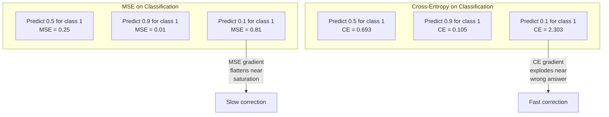
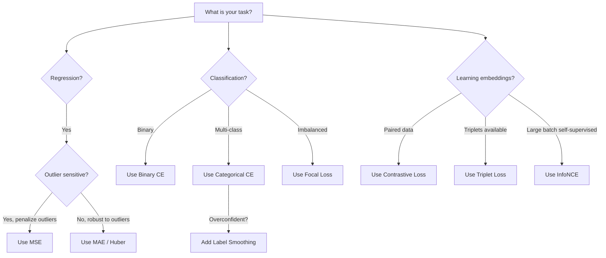

# Perdida de funciones.

> La red hace una predicción. La verdad de la base dice lo contrario. ¿Qué tan equivocado es? Ese número es la pérdida. Elige la función de pérdida equivocada y tu modelo optimiza por la cosa equivocada por completo.

> **【中文解读】**损失函数 es el único objetivo de optimización del modelo  no es la tasa de precisión  no F1 分数, es el valor de pérdida  Selección de la función de pérdida, el modelo encontrará la manera de "más providencial en matemáticas" para satisfacerlo, en lugar de los resultados que realmente desea  Por ejemplo, la clasificación de tareas con MSE, el modelo predice todas las muestras a 0.5 (mínimo pérdida pero sin uso) 

**Type:** Build
**Languages:** Python
**Prerequisites:** Lesson 03.04 (Activation Functions)
**Time:** ~75 minutes

## Objetivos de aprendizaje

- Implementar desde cero MSE, entropía cruzada binaria, entropía cruzada categórica y pérdida de contraste (InfoNCE) con sus gradientes
- Explicar por qué el MSE no puede clasificarse mediante la demostración del modo de falla "predección 0.5 para todo"
- Aplicar el suavización de etiqueta a la entropía cruzada y describir cómo evita predicciones demasiado seguras
- Elige la función de pérdida correcta para regresión, clasificación binaria, clasificación multi-clase y incrustación de tareas de aprendizaje

> **【中文解读】**Objetivo del capítulo: lograr 5 tipos de función y grado de pérdida, entender por qué las categorías de tareas no pueden utilizarse MSE, aprender etiquetas de compensación y comparación de pérdida, aprender a seleccionar correctamente la función de pérdida según las tareas.

## El problema es la introducción del problema

Un modelo que minimiza el MSE en un problema de clasificación predice con confianza 0.5 para todo.

> Un modelo de MSE minimizado en el problema de clasificación se sentirá confiado en todos los pronósticos de entrada 0.5 .

La función de pérdida es lo único que su modelo realmente optimiza. No es preciso. No el resultado de la F1. No sea cual sea la métrica que le reportes a tu gerente. El optimizador toma el gradiente de la función de pérdida y ajusta los pesos para hacer que ese número sea menor. Si la función de pérdida no captura lo que te importa, el modelo encontrará la forma matemáticamente más barata de satisfacerlo, y esa forma casi nunca es lo que querías.

> 损失函数 es el único objetivo de la optimización real de tu modelo. No es la precisión. No es F1 分数. No es ningún indicador que le digas al gerente. 优化器 obtiene la gradiencia de la función de pérdida y ajusta el peso para que el número sea más pequeño.

Aquí hay un ejemplo concreto. Tienes una tarea de clasificación binaria. Dos clases, dividido 50/50. Uses el MSE como pérdida. El modelo predice 0.5 por cada entrada. El MSE promedio es de 0.25, lo que es el mínimo posible sin aprender nada. El modelo tiene cero capacidad discriminatoria pero técnicamente ha minimizado su función de pérdida. Cambiar a entropía cruzada y el mismo modelo se ve obligado a empujar las predicciones hacia 0 o 1, porque -log(0.5) = 0.693 es una pérdida terrible, mientras que -log(0.99) = 0.01 recompensa con confianza las predicciones correctas. La elección de la función de pérdida es la diferencia entre un modelo que aprende y un modelo que juega la métrica.

> 具体例:二元分类任务,两类各占50%──你使用MSE 作为损失──模型对每输入都预测0.5──平均MSE为0.25,这是实际上没有学到任何东西的情况下可能的最小值──模型没有任何区分能力,但在技术上已经最小化了你的损失函数──换成交叉后, similar modelo se ve obligado a proponer la预测 hacia 0 o 1,因为 -log(0.5) = 0.693 es una pérdida muy mala, mientras que -log(0.99) = 0.01 会奖励自信的正确预测──损失函数的选择决定了模型学习还在钻系统的空子.

En el aprendizaje auto-supervisado, ni siquiera tienes etiquetas. La pérdida de contraste define la señal de aprendizaje por completo: lo que cuenta como similar, lo que cuenta como diferente, y lo duro que el modelo debe separarlos. Si la pérdida de contraste se equivoca y tus incorporaciones colapsan a un solo punto - cada entrada se dirige al mismo vector. Técnicamente pérdida cero. Completamente inútil.

>  La situación es peor, en el aprendizaje de autocontrol, ni siquiera tienes etiqueta en comparación con la pérdida ha definido completamente el aprendizaje: lo que se parece, lo que se diferencia, el modelo debe separarlos con mucha fuerza en comparación con la pérdida, tu inserción se reducirá a un punto en cada entrada se proyectará a la misma velocidad en la técnica, pero la pérdida es nula en absoluto.

> **【中文解读】**MSE hacer分类时, el modelo encuentra que el pronóstico 0.5 es la estrategia más segura 损失最小但没有区分能力──交叉则通过 -log (p) 惩罚不自信的预测:-log (0.5) = 0.693 (muy差)vs -log (0.99) = 0.01 (muy bien), obliga al modelo a hacer un juicio claro── en el aprendizaje de autocontrol, el parábola pérdida define todas las señales de aprendizaje (parábola) error que conducirá a todas las inserciones (enla forma de un error) se acurrecen al mismo punto──

## El concepto central.

### El error medio cuadrado (MSE)                                                                                                                                                                                                                                                                                                                                                                                                                                                                                                                     

El valor predeterminado para la regresión. Calcule la diferencia cuadrada entre predicción y objetivo, promedio sobre todas las muestras.

> Regreso a la tarea de la elección por defecto.

```
MSE = (1/n) * sum((y_pred - y_true)^2)
```

Por qué la cuadradosidad importa: penaliza los errores grandes cuadráticamente. Un error de 2 cuesta 4 veces más que un error de 1. Un error de 10 cuesta 100 veces. Esto hace que MSE sea sensible a los valores extremos - una sola predicción muy incorrecta domina la pérdida.

> Por qué el cuadrado es importante: se aplica a la segunda pena a los grandes errores. El costo de los errores de 2 es 4 veces el de 1 . El costo de los errores de 10 es 100 veces. Esto hace que el MSE sea sensible a los valores anormales.

Números reales: si su modelo predice los precios de la vivienda y está fuera de $10,000 on most houses but off by $200.000 en una mansión, MSE intentará arreglar agresivamente esa mansión, potencialmente perjudicando el rendimiento en las otras 99 casas.

> 具体数字: si tu modelo prevé la casa, la mayoría de las casas difieren $10,000，但一栋豪宅偏差 $200.000,MSE se activará en el intento de reparar esas casas, que podrían dañar el rendimiento de otras 99 casas.

El gradiente de MSE con respecto a una predicción es:

> MSE para la escala de la predicción:

```
dMSE/dy_pred = (2/n) * (y_pred - y_true)      # 梯度与误差成线性关系
```

Los errores más grandes obtienen mayores gradientes. Esta es una característica para la regresión (los errores grandes necesitan grandes correcciones) y un error para la clasificación (quieres penalizar las respuestas equivocadas con confianza de manera exponencial, no lineal).

> Con el error en la relación lineal. Más error obtiene mayor gradiente. Esto es un retoque en el error de la clase.

> **【中文解读】**MSE es la pérdida predeterminada de la tarea de regreso: el error es un promedio cuadrado. El error es un gran error que paga un precio más alto.

> **【拓展：MSE 在 AI 中的应用】**En el modelo de generación de imágenes (como la difusión estable), el MSE también se utiliza para medir la generación de imágenes y las diferencias de imágenes de las imágenes objetivo.`F.mse_loss(pred, target)`¿Qué es eso?

### Perdida de entropía cruzada 交叉损失

La función de pérdida para la clasificación. Enraizada en la teoría de la información, mide la divergencia entre la distribución de probabilidad predicha y la distribución verdadera.

> La función de pérdida de tareas de clasificación se basa en la teoría de la información, que mide la diferencia entre la distribución de probabilidad de predicción y la distribución real.

**Binary Cross-Entropy (BCE) | 二元交叉熵：**

```
BCE = -(y * log(p) + (1 - y) * log(1 - p))
```

Donde y es la etiqueta verdadera (0 o 1) y p es la probabilidad prevista.

> Entre ellos y es el verdadero indicador ((0 o 1),p es la probabilidad de pronóstico.

¿Por qué -log(p) funciona: cuando la etiqueta verdadera es 1 y usted predice p = 0.99, la pérdida es -log(0.99) = 0.01. Cuando usted predice p = 0.01, la pérdida es -log(0.01) = 4.6. Esa diferencia de 460x es por qué la entropía cruzada funciona.

> ¿Por qué -log(p) Eficaz: cuando el verdadero marcador es de 1 y tu pronóstico es de 0,99 时, el perdido es de -log(0,99) = 0,01── cuando tu pronóstico es de -log(0,01) = 4,6── ese 460 倍的差就是交叉有效的原因──它残酷地惩罚自信的错误预测,而对自信的正确预测几乎没有惩罚──

El gradiente cuenta la misma historia:

```
dBCE/dp = -(y/p) + (1-y)/(1-p)     # 梯度在预测错误时极大
```

Cuando y es igual a 1 y p está cerca de cero, el gradiente es -1/p que se acerca al infinito negativo. El modelo recibe una señal enorme para corregir su error. Cuando p está cerca de 1, el gradiente es pequeño. Ya es correcto, nada para corregir.

> **【中文解读】**交叉是分类任务的标配──核心是 -log(p):预测正确且自信(p=0.99) 时损失只有0.01,预测错误且自信(p=0.01) 时损失高达4.6460倍差距!梯度在预测错误时趋近无穷大,给模型强烈的修改信号──

> **【拓展：交叉熵在 Transformer 中】**GPT                                                                                                                                                                                                                                                              `F.cross_entropy(logits, labels)`¿Qué es eso?

**Categorical Cross-Entropy | 多类交叉熵：**

Para la clasificación de varias clases con objetivos codificados de un solo tipo.

```
CCE = -sum(y_i * log(p_i))          # 只有真实类别贡献损失
```

Sólo la clase verdadera contribuye a la pérdida (porque todas las demás y_i son cero). Si hay 10 clases y la clase correcta obtiene probabilidad 0.1 (adivinación aleatoria), la pérdida es -log(0.1) = 2.3.

### ¿Por qué MSE no encaja en la clasificación ?



Los gradientes de MSE se aplanan cuando las predicciones están cerca de 0 o 1 (debido a la saturación sigmoide). Los gradientes de entropía cruzada compensan esto - el -log anula las regiones planas del sigmoide, dando gradientes fuertes exactamente donde más se necesitan.

> **【中文解读】**El nivel de MSE en la predicción se acerca a 0 o 1 时变平 (porque el sigmoide 和), lo que provoca una corrección lenta.

### Etiqueta de Smoothing .

Las etiquetas estándar de un solo caliente dicen "esto es 100% clase 3 y 0% todo lo demás". Esa es una afirmación fuerte.

> 标准的 one-hot 标签说"这是100% 类别3,其他都是0%"......这是个强声明――标签平滑软化它:

```
smooth_label = (1 - alpha) * one_hot + alpha / num_classes
```

Con alfa = 0,1 y 10 clases: en lugar de [0, 0, 1, 0, ...], el objetivo se convierte en [0, 01, 0.01, 0.91, 0.01, ...]. El modelo se dirige a 0,91 en lugar de 1.0.

> alfa = 0.1、10 个类别时: objetivo desde [0, 0, 1, 0, ...] 变成 [0.01, 0.01, 0.91, 0.01, ...]。模型目标 desde 1.0 变成 0.91──

Por qué funciona esto: un modelo que intenta emitir exactamente 1.0 a través de una softmax necesita empujar logits hasta el infinito. Esto causa demasiada confianza, daña la generalización y hace que el modelo sea frágil para el cambio de distribución.

> Por qué es efectivo: para que softmax 输出恰好 1.0, se necesita llevar la lógica 推至无穷大―― esto conduce a la exceso de confianza, la pérdida generalización, el modelo de distribución y la vulnerabilidad.

> **【中文解读】**标签平滑把硬标签 [0, 0, 1, 0, ...] 变成软标签 [0.01, 0.01, 0.91, 0.01, ...]──因为要让软max 输出 1.0 需要logit 趋近无穷大,这会导致过拟合和过度自信──标签平滑把目标上限降至0.9,保持logit 在合理范围──GPT 和大多数现代模型都使用标签平滑──

### Perdida contrastable en comparación con pérdida.

No hay etiquetas, no hay clases, sólo pares de entradas y la pregunta: ¿son similares o diferentes?

> 没有标签. 没有类别. 只有输入对和这个问题: ¿Son similares o diferentes?

**SimCLR-style contrastive loss (NT-Xent / InfoNCE):**

Tomemos una imagen. Creamos dos vistas aumentadas de ella (corte, rotación, nerviosismo de color). Estas son las "paras positivas" - deberían tener embebidas similares. Cada otra imagen en el lote forma una "par negativa" - deberían tener diferentes embebidas.

> 取一张图像── crear dos imágenes de aumento (剪剪,旋转,色动) ── es "correcto" deben tener embezas similares── cada otra imagen en el lote se forma "negativo" deben tener diferentes embezas──

```
L = -log(exp(sim(z_i, z_j) / tau) / sum(exp(sim(z_i, z_k) / tau)))
```

Cuando sim() es la similitud cosínica, z_i y z_j son el par positivo, la suma es sobre todos los negativos, y tau (temperatura) controla la manera de la distribución.

> **【中文解读】**¡Tenga dos versiones de una imagen como "correcto" (debe ser similar), otras imágenes como "negativo" (debe ser diferente) ◊

> **【拓展：对比学习在 RAG 和嵌入模型中】**Los modelos de emplazamiento de texto de OpenAI se utilizan en comparación con los entrenamientos de aprendizaje. En RAG, el buen y el mal del buscador depende de la calidad de la emplazamiento, mientras que la calidad de la emplazamiento depende del diseño de la pérdida. SimCLR, CLIP, SimCSE son el modelo.

### Pérdida de foco.

Para conjuntos de datos desequilibrados. La entropía cruzada estándar trata todos los ejemplos clasificados correctamente de manera igual.

> Por diseño de datos desequilibrados. 标准交叉 igual trato a todos los tipos de muestras correctas.  फोकल लॉस  Reducir el peso de la simple muestras:

```
FL = -alpha * (1 - p_t)^gamma * log(p_t)
```

Cuando p_t es la probabilidad prevista de la clase verdadera y gamma controla el enfoque. con gamma = 0, esto es entropía cruzada estándar. con gamma = 2 (el predeterminado):

> Entre ellos p_t es verdadero tipo de probabilidad de pronóstico, gama  control聚焦程度──gamma = 0 时退化为标准交叉──gamma = 2 时(默认值):

- Ejemplo fácil (p_t = 0,9): peso = (0,1) ^2 = 0,01.
  简单样本(p_t = 0,9):权重 = (0.1) ^2 = 0,01──实际被忽略──
- Ejemplo duro (p_t = 0,1): peso = (0,9) ^ 2 = 0,81.
  困难样本(p_t = 0.1):权重 = (0.9) ^2 = 0.81──完整梯度信号──

> **【中文解读】**Perdida focal 为类别不平衡设计──简单样本(p_t=0.9) tiene un peso de sólo 0.01, casi se ignora; dificultad de muestras(p_t=0.1) tiene un peso de 0.81, obtención de una escala completa.

### El árbol de decisión de la pérdida de función



> **【中文解读】**选择经验: regreso con MSE/Huber,二分类 con BCE, quizás con CCE, desequilibrio con Loss Focal,学嵌入式对比损失──

## Construye con movimiento.
```figure
cross-entropy-loss
```

## Construye el mismo

### Paso 1: MSE y su gradiente . MSE y su gradiente .

```python
def mse(predictions, targets):
    n = len(predictions)
    total = 0.0
    for p, t in zip(predictions, targets):
        total += (p - t) ** 2            # 平方误差
    return total / n                      # 取平均

def mse_gradient(predictions, targets):
    n = len(predictions)
    grads = []
    for p, t in zip(predictions, targets):
        grads.append(2.0 * (p - t) / n)  # 梯度 = 2*(pred - true) / n
    return grads
```

### Paso 2: Entropia binaria de cruces.

El problema log(0) es real. Si el modelo predice exactamente 0 para un ejemplo positivo, log(0) = infinito negativo.

```python
import math

def binary_cross_entropy(predictions, targets, eps=1e-15):
    n = len(predictions)
    total = 0.0
    for p, t in zip(predictions, targets):
        p_clipped = max(eps, min(1 - eps, p))  # 裁剪防止 log(0)
        total += -(t * math.log(p_clipped) + (1 - t) * math.log(1 - p_clipped))  # -[y*log(p) + (1-y)*log(1-p)]
    return total / n

def bce_gradient(predictions, targets, eps=1e-15):
    grads = []
    for p, t in zip(predictions, targets):
        p_clipped = max(eps, min(1 - eps, p))
        grads.append(-(t / p_clipped) + (1 - t) / (1 - p_clipped))  # 梯度 = -y/p + (1-y)/(1-p)
    return grads
```

### Paso 3: Categorical Cross-Entropy con Softmax 带softmax de varios tipos de entrelaz

```python
def softmax(logits):
    max_val = max(logits)  # 数值稳定性
    exps = [math.exp(x - max_val) for x in logits]
    total = sum(exps)
    return [e / total for e in exps]

def categorical_cross_entropy(logits, target_index, eps=1e-15):
    probs = softmax(logits)
    p = max(eps, probs[target_index])
    return -math.log(p)  # -log(真实类别的概率)

def cce_gradient(logits, target_index):
    probs = softmax(logits)
    grads = list(probs)              # 复制 softmax 输出
    grads[target_index] -= 1.0      # 真实类别减 1：softmax 输出 - one-hot
    return grads
```

El gradiente de softmax + entropía cruzada se simplifica maravillosamente: es sólo (probabilidad prevista - 1) para la clase verdadera, y (probabilidad prevista) para todas las otras clases. Esta simplificación elegante no es una coincidencia - es por eso que softmax y entropía cruzada se emparejan.

> **【中文解读】**Softmax + 交叉的梯度简化为:预测概率减去一热目标──真实类别是p-1,其他类别是p──这个优雅的简化就是为什么 softmax 和交叉总是配对使用──

### Paso 4: Etiqueta de suavizamiento

```python
def label_smoothed_cce(logits, target_index, num_classes, alpha=0.1, eps=1e-15):
    probs = softmax(logits)
    loss = 0.0
    for i in range(num_classes):
        if i == target_index:
            smooth_target = 1.0 - alpha + alpha / num_classes  # 目标类别：0.9（alpha=0.1, 10 类）
        else:
            smooth_target = alpha / num_classes                 # 非目标类别：0.01
        p = max(eps, probs[i])
        loss += -smooth_target * math.log(p)
    return loss
```

### Paso 5: Pérdida contrastable (InfoNCE simplificado) en comparación con pérdida.

```python
def cosine_similarity(a, b):
    dot = sum(x * y for x, y in zip(a, b))        # 点积
    norm_a = math.sqrt(sum(x * x for x in a))      # 向量 a 的模
    norm_b = math.sqrt(sum(x * x for x in b))      # 向量 b 的模
    if norm_a < 1e-10 or norm_b < 1e-10:
        return 0.0
    return dot / (norm_a * norm_b)                  # 余弦相似度

def contrastive_loss(anchor, positive, negatives, temperature=0.07):
    sim_pos = cosine_similarity(anchor, positive) / temperature     # 正对相似度 / 温度
    sim_negs = [cosine_similarity(anchor, neg) / temperature for neg in negatives]  # 负对相似度

    max_sim = max(sim_pos, max(sim_negs)) if sim_negs else sim_pos  # 数值稳定性
    exp_pos = math.exp(sim_pos - max_sim)
    exp_negs = [math.exp(s - max_sim) for s in sim_negs]
    total_exp = exp_pos + sum(exp_negs)

    return -math.log(max(1e-15, exp_pos / total_exp))  # -log(正对概率)
```

### Paso 6: MSE vs. Cross-Entropy en Clasificación

Entrenar la misma red desde la lección 04 (conjunto de datos de círculo) con ambas funciones de pérdida.

```python
import random

def sigmoid(x):
    x = max(-500, min(500, x))
    return 1.0 / (1.0 + math.exp(-x))

def make_circle_data(n=200, seed=42):
    random.seed(seed)
    data = []
    for _ in range(n):
        x = random.uniform(-2, 2)
        y = random.uniform(-2, 2)
        label = 1.0 if x * x + y * y < 1.5 else 0.0
        data.append(([x, y], label))
    return data


class LossComparisonNetwork:
    """用不同损失函数训练的网络，对比 MSE 和 BCE 的收敛速度"""
    def __init__(self, loss_type="bce", hidden_size=8, lr=0.1):
        random.seed(0)
        self.loss_type = loss_type  # "mse" 或 "bce"
        self.lr = lr
        self.hidden_size = hidden_size

        self.w1 = [[random.gauss(0, 0.5) for _ in range(2)] for _ in range(hidden_size)]
        self.b1 = [0.0] * hidden_size
        self.w2 = [random.gauss(0, 0.5) for _ in range(hidden_size)]
        self.b2 = 0.0

    def forward(self, x):
        self.x = x
        self.z1 = []
        self.h = []
        for i in range(self.hidden_size):
            z = self.w1[i][0] * x[0] + self.w1[i][1] * x[1] + self.b1[i]
            self.z1.append(z)
            self.h.append(max(0.0, z))  # ReLU 激活

        self.z2 = sum(self.w2[i] * self.h[i] for i in range(self.hidden_size)) + self.b2
        self.out = sigmoid(self.z2)  # 输出层 sigmoid
        return self.out

    def backward(self, target):
        # 根据损失类型选择不同的梯度
        if self.loss_type == "mse":
            d_loss = 2.0 * (self.out - target)  # MSE 梯度：线性
        else:
            eps = 1e-15
            p = max(eps, min(1 - eps, self.out))
            d_loss = -(target / p) + (1 - target) / (1 - p)  # BCE 梯度：在错误预测时极大

        d_sigmoid = self.out * (1 - self.out)
        d_out = d_loss * d_sigmoid

        for i in range(self.hidden_size):
            d_relu = 1.0 if self.z1[i] > 0 else 0.0
            d_h = d_out * self.w2[i] * d_relu
            self.w2[i] -= self.lr * d_out * self.h[i]
            for j in range(2):
                self.w1[i][j] -= self.lr * d_h * self.x[j]
            self.b1[i] -= self.lr * d_h
        self.b2 -= self.lr * d_out

    def compute_loss(self, pred, target):
        if self.loss_type == "mse":
            return (pred - target) ** 2
        else:
            eps = 1e-15
            p = max(eps, min(1 - eps, pred))
            return -(target * math.log(p) + (1 - target) * math.log(1 - p))

    def train(self, data, epochs=200):
        losses = []
        for epoch in range(epochs):
            total_loss = 0.0
            correct = 0
            for x, y in data:
                pred = self.forward(x)
                self.backward(y)
                total_loss += self.compute_loss(pred, y)
                if (pred >= 0.5) == (y >= 0.5):
                    correct += 1
            avg_loss = total_loss / len(data)
            accuracy = correct / len(data) * 100
            losses.append((avg_loss, accuracy))
            if epoch % 50 == 0 or epoch == epochs - 1:
                print(f"    Epoch {epoch:3d}: loss={avg_loss:.4f}, accuracy={accuracy:.1f}%")
        return losses
```

## Usalo en la práctica.

PyTorch proporciona todas las funciones de pérdida estándar con estabilidad numérica integrada en:

```python
import torch
import torch.nn as nn
import torch.nn.functional as F

predictions = torch.tensor([0.9, 0.1, 0.7], requires_grad=True)
targets = torch.tensor([1.0, 0.0, 1.0])

mse_loss = F.mse_loss(predictions, targets)              # MSE：回归
bce_loss = F.binary_cross_entropy(predictions, targets)   # BCE：二分类

logits = torch.randn(4, 10)                              # 4 个样本，10 类
labels = torch.tensor([3, 7, 1, 9])
ce_loss = F.cross_entropy(logits, labels)                # CCE：多分类（推荐用法）
ce_smooth = F.cross_entropy(logits, labels, label_smoothing=0.1)  # 带标签平滑
```

Usar`F.cross_entropy`(no)`F.nll_loss`Además de la máxima de flexibilidad manual). Combina log-softmax y probabilidad de log negativa en una operación numéricamente estable. Aplicar softmax por separado y luego tomar el log es menos estable - se pierde la precisión en la subtracción de grandes exponenciales.

Para el aprendizaje contrastante, la mayoría de los equipos utilizan implementaciones personalizadas o bibliotecas como `lightly`o `pytorch-metric-learning`El bucle central es siempre el mismo: calcular parejas de similitudes, crear la máxima de soft sobre los positivos y negativos, retropropagarse.

> **【中文解读】**PyTorch 中直接用 `F.cross_entropy(logits, labels)`la combinación interna log-softmax y NLL, número de valores más estable.`lightly`O `pytorch-metric-learning`¿Qué es esto?

## Envía el producto .

Esta lección produce:
- `outputs/prompt-loss-function-selector.md`-- una llamada reutilizable para elegir la función de pérdida correcta
- `outputs/prompt-loss-debugger.md`-- una solicitud de diagnóstico para cuando su curva de pérdida se ve mal

## Los ejercicios.

1. Implemente pérdida de Huber (perdida L1 suave), que es MSE para errores pequeños y MAE para errores grandes. Entrenar una red de regresión prediciendo y = sin(x) con MSE vs Huber cuando el 5% de los objetivos de entrenamiento tienen ruido aleatorio añadido (outliers). Comparar el error final de la prueba.
   > **练习 1：**实现 Huber 损失(small error with MSE, big error with MAE) ⋅ en el 5%  de datos de valores anormales en comparación con MSE y Huber⋅

2. Añadir pérdida focal al ciclo de entrenamiento de clasificación binaria. Crear un conjunto de datos desequilibrado (90% clase 0, 10% clase 1). Comparar la pérdida focal estándar BCE vs. (gamma=2) en el recuerdo de las clases minorías después de 200 épocas.
   > **练习 2：**En el conjunto de datos de 90:10 de desequilibrio, la tasa de recaudación de la gama es menor en comparación con BCE y Pérdida focal (gamma=2).

3. Implemente pérdida de triplets con minería negativa semihard. Generar datos de incorporación 2D para 5 clases. Para cada ancla, encuentra el negativo más duro que aún está más lejos del positivo (semihard). Compara la convergencia con la selección aleatoria de triplets.
   > **练习 3：** la pérdida de los tres grupos de muestras extraídas con medio dificultad, en comparación con la velocidad de recepción de muestras negativas seleccionadas de forma arbitraria.

4. Realice la comparación MSE vs entropía cruzada, pero siga las magnitudes de gradiente en cada capa durante el entrenamiento. Trace la norma promedio de gradiente por época. Verifique que la entropía cruzada produce gradientes más grandes en épocas tempranas cuando el modelo es más incierto.
   > **练习 4：**追踪 MSE 和交叉培训中各层梯度大小,验证交叉在早期产生更大的梯度

5. Implemente la pérdida de divergencia KL y verifique que la minimización de la KL(true diseño predicho) da los mismos gradientes que la entropía cruzada cuando la distribución verdadera es un-hot.
   > **练习 5：**实现 KL 散度损失,验证在一个热的真实分布时与交叉梯度相同――然后尝试知识蒸中的软目标――

## Términos clave .

| Term | What people say | What it actually means |
|------|----------------|----------------------|
| Loss function | "How wrong the model is" | A differentiable function mapping predictions and targets to a scalar that the optimizer minimizes |
| MSE | "Average squared error" | Mean of squared differences between predictions and targets; penalizes large errors quadratically |
| Cross-entropy | "The classification loss" | Measures divergence between predicted probability distribution and true distribution using -log(p) |
| Binary cross-entropy | "BCE" | Cross-entropy for two classes: -(y*log(p) + (1-y)*log(1-p)) |
| Label smoothing | "Softening the targets" | Replacing hard 0/1 targets with soft values (e.g., 0.1/0.9) to prevent overconfidence and improve generalization |
| Contrastive loss | "Pull together, push apart" | A loss that learns representations by making similar pairs close and dissimilar pairs far in embedding space |
| InfoNCE | "The CLIP/SimCLR loss" | Normalized temperature-scaled cross-entropy over similarity scores; treats contrastive learning as classification |
| Focal loss | "The imbalanced data fix" | Cross-entropy weighted by (1-p_t)^gamma to down-weight easy examples and focus on hard ones |
| Triplet loss | "Anchor-positive-negative" | Pushes anchor closer to positive than negative by at least a margin in embedding space |
| Temperature | "Sharpness knob" | A scalar divisor on logits/similarities that controls how peaked the resulting distribution is; lower = sharper |

| 术语 | 通俗说法 | 实际含义 |
|------|---------|---------|
| 损失函数 (Loss function) | "模型错多少" | 把预测和目标映射为标量的可导函数，优化器最小化这个值 |
| MSE | "平方误差平均" | 预测与目标的平方差的均值；对大误差二次惩罚 |
| 交叉熵 (Cross-entropy) | "分类损失" | 用 -log(p) 衡量预测分布和真实分布的差异 |
| 二元交叉熵 (BCE) | "二分类损失" | 两类的交叉熵：-(y*log(p) + (1-y)*log(1-p)) |
| 标签平滑 (Label smoothing) | "软化目标" | 把硬标签 0/1 换成软值（如 0.1/0.9），防止过度自信 |
| 对比损失 (Contrastive loss) | "拉近推远" | 让相似样本嵌入接近、不同样本嵌入远离的损失 |
| InfoNCE | "CLIP/SimCLR 损失" | 温度缩放的相似度交叉熵；把对比学习变成分类问题 |
| Focal Loss | "不平衡数据修复" | 交叉熵乘以 (1-p_t)^gamma，降低简单样本权重，聚焦困难样本 |
| 三元组损失 (Triplet loss) | "锚-正-负" | 让锚点离正样本比离负样本近至少一个边距 |
| 温度 (Temperature) | "尖锐度旋钮" | logits/相似度的除数，控制分布尖锐程度；越低越尖锐 |

## Más Leer más Leer más

- Lin et al., "Pérdida focal para la detección de objetos densos" (2017) -- introdujo pérdida focal para el manejo de desequilibrio de clase extremo en la detección de objetos (RetinaNet)
- Chen et al., "Un Marco Simple para el Aprendizaje Contrastivo de Representaciones Visuales" (SimCLR, 2020) -- definió la moderna línea de aprendizaje contrastivo con pérdida de NT-Xent
- Szegedy et al., "Rethinking the Inception Architecture" (2016) -- introdujo el suavización de etiquetas como una técnica de regularización, ahora estándar en la mayoría de los modelos grandes
- Hinton et al., "Destillación del conocimiento en una red neuronal" (2015) -- destilación del conocimiento utilizando objetivos blandos y divergencia KL, fundamental para la compresión de modelos
