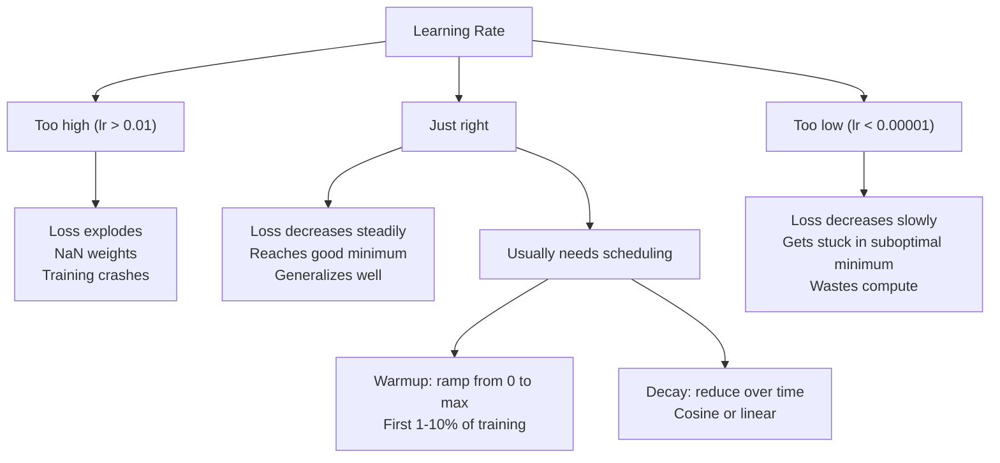
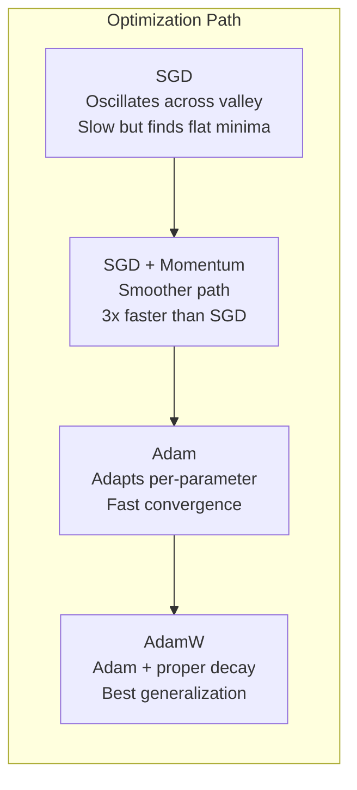
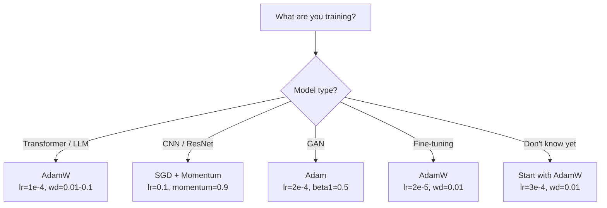

# Optimizadores  Optimizadores

> El descenso gradiente te dice en qué dirección moverte no dice nada sobre la distancia o la velocidad SGD es una brújula Adam es GPS con datos de tráfico

> **【中文解读】**梯度下降告诉你方向, pero no dice步幅和速度──SGD 像指南针只知道方向──Adam 像带实时路况的GPS根据历史信息调整策略──本章从零实现 SGD → Momentum → Adam → AdamW, comprender cada paso de la optimización de la intuencia──

**Type:** Build
**Languages:** Python
**Prerequisites:** Lesson 03.05 (Loss Functions)
**Time:** ~75 minutes

## Objetivos de aprendizaje

- Implementar SGD, SGD con impulso, Adam y AdamW optimizadores desde cero en Python
- Explica cómo la corrección de sesgo de Adam compensa las estimaciones de momento initializadas en cero en las primeras etapas de entrenamiento
- Demostrar por qué AdamW produce una mejor generalización que Adam con regularización L2 en la misma tarea
- Seleccione el optimizador y los hiperparámetros predeterminados apropiados para transformadores, CNNs, GANs y ajustes finos

## El problema es la introducción del problema

¿Sabes que el peso # 4,721 debe disminuir en 0,003 para reducir la pérdida? Pero 0.003 en qué unidades? ¿Escalado por qué? ¿Y deberías mover la misma cantidad en el paso 1 como en el paso 1,000?

> Usted calcula la escala. ¿Sabes que el peso #4,721  debería reducirse 0.003 para reducir la pérdida? Pero 0.003 ¿qué unidad? ¿En qué proporción se reduce? ¿En el paso 1 y el paso 1,000 arriba debe moverse la misma cantidad?

El descenso del gradiente de vainilla aplica la misma tasa de aprendizaje a cada parámetro en cada paso: w = w - lr * gradiente. Esto crea tres problemas que hacen que el entrenamiento de las redes neuronales sea doloroso en la práctica.

> El gradiente inicial disminuye en cada paso a cada parámetro aplicando la misma tasa de aprendizaje: w = w - lr * gradiente. Esto causa tres problemas muy dolorosos en la práctica.

Primero, la oscilación. El paisaje de pérdidas rara vez tiene la forma de un cuenco liso. Es más como un valle largo y estrecho. El gradiente apunta a través del valle (dirección empinada), no a lo largo de él (dirección poco profunda). El descenso gradual rebota hacia adelante y hacia atrás a través de la dimensión estrecha mientras hace pequeños progresos a lo largo de la útil. Ya han visto esto: la pérdida cae rápidamente después de las mesetas, no porque el modelo convergió sino porque está oscilando.

> En primer lugar, la oscilación. La pérdida de curvatura es muy pequeña, como un plato plano. Es más como un valle largo y estrecho. La gradiencia se dirige hacia la longitud y dirección del valle, en lugar de hacia la longitud y dirección baja. La gradiencia baja en la dimensión estrecha y salta, mientras que se progresa en la dirección útil.

En segundo lugar, una tasa de aprendizaje para todos los parámetros es incorrecta. Algunos pesos necesitan grandes actualizaciones (están en la etapa inicial, de falta de ajuste). otros necesitan pequeñas actualizaciones (están cerca de su valor óptimo). Una tasa de aprendizaje que funciona para los primeros destruye a los últimos, y viceversa.

> En segundo lugar, todos los elementos comparten una tasa de aprendizaje es errónea. Algunos tienen un gran peso y necesitan una gran actualización.

Tercero, puntos de silla. En dimensiones altas, el paisaje de pérdida tiene vastas regiones planas donde el gradiente es cerca de cero. SGD de vainilla se arrastra a través de estas a la velocidad del gradiente, que es efectivamente cero. El modelo parece atascado. No está atascado - está en una región plana con descenso útil en el otro lado. Pero SGD no tiene ningún mecanismo para empujar a través.

> En el alto nivel, la pérdida de curvatura tiene una gran parte de la región plana, la gradiencia se acerca a cero. La SGD original se arrastra a la velocidad de cero a través de estas regiones. El modelo parece estar atrapado.

Adam resuelve las tres. Mantene dos promedios corrientes por parámetro - el gradiente medio (momento, maneja la oscilación) y el gradiente medio cuadrado (taxa adaptativa, maneja diferentes escalas). Combinado con la corrección de sesgo para los primeros pasos, le da un solo optimizador que funciona en el 80% de los problemas con hiperparámetros predeterminados. Esta lección lo construye desde cero para que entiendas exactamente cuándo y por qué falla en el otro 20%.

> Adam  resolvió todos los tres problemas. Mantenía dos niveles de media de operación de cada parámetro. La velocidad de adaptación, la escala de tratamiento diferentes. Junto con los primeros pasos de la corrección de diferencias, ofrece un único optimizador, que se aplica al 80% de los problemas bajo los superparámetros por defecto.

> **【中文解读】**El SGD original tiene tres problemas: oscilación (a través de un valle estrecho) ̇ un solo ritmo de aprendizaje (no se adapta a todos los parámetros) ̇ no puede atravesar la región plana ̇ un nivel de movimiento (a través de un nivel de movimiento) ̇ Adam Simultaneamente resuelve estos tres problemas: movimiento de inhibición de oscilación ̇ un ritmo de aprendizaje de adaptación (a través de un ritmo de movimiento) ̇ un ritmo de aprendizaje (a través de un ritmo de movimiento) ̇ un ritmo de aprendizaje (a través de un ritmo de movimiento) ̇ un ritmo de aprendizaje (a través de un ritmo de movimiento) ̇ un ritmo de aprendizaje (a través de un ritmo de movimiento) ̇ un ritmo de aprendizaje (a través de un ritmo de movimiento) ̇ un ritmo de aprendizaje (a través de un ritmo de movimiento) ̇ un ritmo de aprendizaje (a través de un ritmo de movimiento) ̇ un ritmo de aprendizaje (a través de un ritmo de movimiento) ̇ un ritmo de aprendizaje ̇ un ritmo de aprendizaje ̇ un ritmo de aprendizaje ̇ un ritmo de aprendizaje ̇ un parámetro de cambios ̇ un parámetro de parámetros ̇ un parámetros ̇ un parámetros ̇ ̇ un parámetros ̇ ̇ ̇ ̇ ̇ ̇ ̇ ̇ ̇ ̇ ̇ ̇ ̇ ̇ ̇ ̇ ̇ ̇ ̇ ̇ ̇ ̇ ̇ ̇ ̇ ̇ ̇ ̇ ̇ ̇ ̇ ̇ ̇ ̇ ̇ ̇ ̇ ̇ ̇ ̇ ̇ ̇ ̇ ̇ ̇ ̇ ̇ ̇ ̇ ̇ ̇ ̇ ̇ ̇ ̇ ̇ ̇ ̇ ̇ ̇ ̇ ̇ ̇ ̇ ̇ ̇ ̇ ̇ ̇ ̇ ̇ ̇ ̇ ̇ ̇ ̇ ̇ ̇ ̇ ̇ ̇ ̇ ̇ ̇ ̇ ̇ ̇ ̇ ̇ ̇ ̇ ̇ ̇ ̇ ̇ ̇ ̇ 

## El concepto central.

### Descenso de gradiente estocástico (SGD) 随机梯度下降

El optimizador más simple: calcular el gradiente en un mini lote y dar un paso en la dirección opuesta.

> La mejor forma de calcular la escala en pequeñas cantidades, y luego en dirección opuesta.

```
w = w - lr * gradient    # 最简单的参数更新公式
```

El "estocástico" significa que se utiliza un subconjunto aleatorio (mini-batch) de datos para estimar el gradiente, en lugar del conjunto completo de datos. Este ruido es realmente útil - ayuda a escapar de mínimos locales agudos. Pero el ruido también causa oscilación.

> "Acuerdos" significa que se utiliza un conjunto de datos de forma arbitraria (en pequeñas cantidades) para estimar la gradiencia, no el conjunto de datos entero. Este ruido es realmente útil, lo que ayuda a escapar del mínimo local de la punta.

La tasa de aprendizaje es la única clave. Demasiado alto: la pérdida diverge. Demasiado bajo: el entrenamiento dura para siempre. El valor óptimo depende de la arquitectura, los datos, el tamaño del lote y la etapa actual del entrenamiento. Para SGD de vainilla en las redes modernas, los valores típicos oscilan entre 0,01 y 0,1.

> La tasa de aprendizaje es única. Muy alta: pérdida de distribución. Muy baja: el entrenamiento siempre es incompleto. El valor óptimo depende de la estructura, datos, volumen y la fase actual del entrenamiento. Para los SGD originales de la red moderna, el valor típico es de 0.01 a 0.1 .

### El impulso. El movimiento.

La analogía de rodar a la bola y bajar a la colina es demasiado utilizada pero precisa. En lugar de caminar solo por el gradiente, mantienes una velocidad que se acumula en los gradientes anteriores.

> La metáfora de la esfera es muy utilizada, pero es muy exacta.

```
m_t = beta * m_{t-1} + gradient    # 速度 = 衰减 × 历史速度 + 当前梯度
w = w - lr * m_t                    # 沿速度方向更新
```

Beta (normalmente 0.9) controla cuánto historial se debe guardar. con beta = 0.9, el impulso es aproximadamente el promedio de los últimos 10 gradientes (1 / (1 - 0.9) = 10.

> Beta (normalmente 0.9) control conservando mucho tiempo de historia. Cuando beta = 0.9 时,动量大约是最近10个梯度的平均值.

Por qué esto fija la oscilación: los gradientes que apuntan en la misma dirección se acumulan. Los gradientes que van en dirección inversa se cancelarán. En ese valle estrecho, el componente "cross" vuelve a marcar cada paso y se amortiguará. El componente "along" se mantiene constante y se amplifica. El resultado es una aceleración suave en la dirección útil.

> Por qué esto puede modificar la oscilación: la escala de la misma dirección se acumula. La escala de la misma dirección se opone entre sí. En ese estrecho valle, la cantidad de "jano-dirección" por paso se requiere y se requiere de una reducción.

Números reales: SGD solo en un panorama de pérdidas mal condicionado podría tomar 10.000 pasos. SGD con impulso (beta = 0,9) normalmente toma 3.000-5.000 pasos en el mismo problema.

> 具体数字: en el caso de los cambios de condiciones, un SGD individual puede requerir 10.000 pasos.

> **【拓展：SGD + Momentum 的 resurgence】**Aunque Adam es una opción de preferencia, pero el artículo de 2023 muestra que SGD+Momentum sigue teniendo ventajas en una tarea específica.

### RMSProp se propaga de manera muy rápida.

El primer método de tasa de aprendizaje adaptativo por parámetro que realmente funcionó. Propuso por Hinton en una conferencia de Coursera (nunca publicado formalmente).

> El primer método de aprendizaje de cada parámetro realmente efectivo.

```
s_t = beta * s_{t-1} + (1 - beta) * gradient^2
w = w - lr * gradient / (sqrt(s_t) + epsilon)
```

s_t realiza un seguimiento del promedio de funcionamiento de los gradientes cuadrados. Los parámetros con gradientes consistentemente grandes se dividen por un número grande (taxa de aprendizaje efectiva más pequeña).

>  tracking square gradient                                                                                                                                                                                                                                                                                                                                                                                                                                                                                                                        

Esto resuelve el problema de "una tasa de aprendizaje para todos los parámetros". Un peso que ya ha recibido grandes actualizaciones probablemente esté cerca de su objetivo - ralentiza. Un peso que ha recibido pequeñas actualizaciones podría estar poco entrenado - acelerarlo.

> Esto resuelve el problema de que "todos los parámetros comparten una tasa de aprendizaje" un peso que ya ha obtenido un gran cambio puede acercarse al objetivo.

Epsilon (típicamente 1e-8) evita la división por cero cuando un parámetro no ha sido actualizado.

> Epsilon (normalmente 1e-8) evita que los parámetros no se actualicen cuando se eliminan a cero.

### Adam: Momentum + RMSProp  Adam:动量 + autoadaptación de la tasa de aprendizaje

Adam combina ambas ideas. mantiene dos promedios móviles exponenciales por parámetro:

> Adam combinó dos tipos de ideas.

```
m_t = beta1 * m_{t-1} + (1 - beta1) * gradient        (first moment: mean)        # 一阶矩：梯度均值
v_t = beta2 * v_{t-1} + (1 - beta2) * gradient^2       (second moment: variance)   # 二阶矩：梯度方差
```

**Bias correction**En el paso 1, m_1 = (1 - beta1) * gradiente. con beta1 = 0.9, que es 0.1 * gradiente - diez veces demasiado pequeño. el promedio móvil no se ha calentado todavía.

> **偏差修正**Es la mayoría de las explicaciones sobre el salto de detalles clave.

```
m_hat = m_t / (1 - beta1^t)
v_hat = v_t / (1 - beta2^t)
```

En el paso 1 con beta1 = 0,9: m_hat = m_1 / (1 - 0,9) = m_1 / 0.1 = el gradiente real. En el paso 100: (1 - 0,9^100) es aproximadamente 1,0, por lo que la corrección desaparece. La corrección de sesgo importa para los primeros ~10 pasos y es irrelevante después de ~50.

> La primera etapa beta1 = 0,9 时:m_hat = m_1 / (1 - 0,9) = m_1 / 0.1 = 实际梯度──第100 步:(1 - 0.9^100) 大约等于 1.0,修正消失──偏差修正对前 ~10 步重要,~50 步后无关紧要──

La actualización:

> 更新公式:

```
w = w - lr * m_hat / (sqrt(v_hat) + epsilon)
```

Los valores predeterminados de Adam: lr = 0.001, beta1 = 0.9, beta2 = 0.999, epsilon = 1e-8. Estos valores predeterminados funcionan para el 80% de los problemas. Cuando no lo hacen, cambie primero lr. Luego beta2.

> Adam 默认值:lr = 0.001,beta1 = 0.9,beta2 = 0.999,epsilon = 1e-8。 Estos valores de seguridad se aplican al 80% de los problemas──不适用时,先调 lr,再调 beta2── casi nunca necesita cambiar beta1 o epsilon──

> **【拓展：Adam 的局限性】**Aunque Adam es el optimizador más comúnmente utilizado, no es perfecto: 1) en algunos problemas convexos 收不如 SGD; 2) la generalización de Adam tiene veces diferencia en SGD; 3) el costo de almacenamiento de Adam es 2-3 veces mayor que SGD; 3) la necesidad de almacenamiento m 和 v) ・ 2024 años de AdamW + ScheduleFree es una nueva dirección de mejora.

### La pérdida de peso se ha hecho bien.

La regularización de L2 añade lambda * w^2 a la pérdida. en SGD de vainilla, esto equivale a la desintegración del peso (sustracción de lambda * w del peso en cada paso). en Adam, esta equivalencia se rompe.

> En el SGD original, este equivalente a la disminución del peso de peso se rompe en el Adam.

La visión de Loshchilov & Hutter: cuando se añade L2 a la pérdida y luego Adam procesa el gradiente, la tasa de aprendizaje adaptativo escala el término de regularización también. Parámetros con gran variación de gradiente obtienen menos regularización. Parámetros con pequeña variación obtienen más. Esto no es lo que quieres - quieres regularización uniforme independientemente de las estadísticas de gradiente.

> Loshchilov y Hutter's insight: cuando se añade L2 a la pérdida y luego se trata de la gradiencia, la tasa de aprendizaje de adaptación también se reduce en la normalización. Los parámetros de la gradiencia de diferencia de la gradiencia obtienen menos normalización.

AdamW corrige esto aplicando la desintegración de peso directamente a los pesos, después de la actualización de Adam:

```
w = w - lr * m_hat / (sqrt(v_hat) + epsilon) - lr * lambda * w    # Adam 更新 + 解耦权重衰减
```

El término de desintegración del peso (lr * lambda * w) no se escala por el factor adaptativo de Adam.

Esto parece un detalle menor. No es. AdamW converge a mejores soluciones que la regularización de Adam + L2 en prácticamente todas las tareas. Es el optimizador predeterminado en PyTorch para entrenar transformadores, modelos de difusión y la mayoría de las arquitecturas modernas. BERT, GPT, LLaMA, Diffusión estable - todos entrenados con AdamW.

> **【中文解读】**La diferencia entre el peso y la densidad de los átomos de la Tierra y el peso de la Tierra es el mismo que el peso de la Tierra.

> **【拓展：LoRA 微调中的 AdamW】**Usando LoRA 微调 LLM 时, normalmente con AdamW(lr=2e-5~1e-4, peso_decay=0.01)。LoRA sólo entrenó en la matriz de descomposición A y B, la disminución de peso de AdamW ayuda a controlar la amplitud de estos nuevos elementos。

### Taxa de aprendizaje: el hiperparámetro más importante.



Si ajustes un hiperparámetro, ajusta la tasa de aprendizaje. Un cambio de 10 veces en la tasa de aprendizaje importa más que cualquier decisión arquitectónica que hagas.

> Si sólo se modifica un superparámetro, se modifica la tasa de aprendizaje. La tasa de aprendizaje cambia 10 veces más que cualquier decisión de estructura.

- SGD: lr = 0,01 a 0,1
  SGD:lr = 0,01 a 0,1
- Adam/AdamW: lr = 1e-4 a 3e-4
  Adam / AdamW:lr = 1e-4 hasta 3e-4
- Modelos pre-entrenados para ajuste fino: lr = 1e-5 a 5e-5
  微调预训练模型:lr = 1e-5 hasta 5e-5
- Calentamiento de la tasa de aprendizaje: rampa lineal durante el 1-10% de los primeros pasos
  Taxa de calentamiento del aprendizaje: entre el 1 y el 10% de aumento de la temperatura en el nivel de la formación

### Optimizador Comparación de optimizadores con



### Cuando cada optimizador gana



> **【拓展：深度学习中优化器的演进】**Desde 2012 SGD+Momentum de AlexNet, hasta 2014 Adam propuso, de nuevo hasta 2017 la nacimiento de AdamW  desarrollo de optimizadores que hacen entrenar de "necesidades de varias semanas de modificación" a "parámetro de configuración en marcha"。Llama 3 405B entrenó usando AdamW, con un máximo de lr=3e-4, en 16384 bloques H100 GPUs entrenó 30.8M GPUs 小时──

## Construye y realiza.

> **【中文解读】**A continuación desde zero realizamos cuatro tipos de optimización: SGD → SGD+Momentum → Adam → AdamW── cada uno está en la base de la anterior añadir un mecanismo clave── nota la corrección de la diferencia de AdamW y la resolución de la disminución del peso de AdamW es el punto de conocimiento de la entrevista con frecuencia──
```figure
optimizer-trajectory
```

## Construye el mismo

### Paso 1: SGD de vainilla.

> SGD: Parámetros directamente reducidos por la tasa de aprendizaje multiplicada por la escala.

```python
class SGD:
    def __init__(self, lr=0.01):
        self.lr = lr

    def step(self, params, grads):
        for i in range(len(params)):
            params[i] -= self.lr * grads[i]
```

### Paso 2: SGD con Momentum. Paso 2: SGD con movimiento.

> SGD+Momento: introducción de la velocidad de variación, acumulación de la longitud histórica.

```python
class SGDMomentum:
    def __init__(self, lr=0.01, beta=0.9):
        self.lr = lr
        self.beta = beta
        self.velocities = None

    def step(self, params, grads):
        if self.velocities is None:
            self.velocities = [0.0] * len(params)
        for i in range(len(params)):
            self.velocities[i] = self.beta * self.velocities[i] + grads[i]
            params[i] -= self.lr * self.velocities[i]
```

### Paso 3: Adam. El tercer paso: Adam.

> Adam:维护一阶矩 m(梯度平均值) y二阶矩 v(梯度方差),加上偏差修正──80% de los problemas con parámetros por defecto es capaz de correr──

```python
import math

class Adam:
    def __init__(self, lr=0.001, beta1=0.9, beta2=0.999, epsilon=1e-8):
        self.lr = lr
        self.beta1 = beta1
        self.beta2 = beta2
        self.epsilon = epsilon
        self.m = None
        self.v = None
        self.t = 0

    def step(self, params, grads):
        if self.m is None:
            self.m = [0.0] * len(params)
            self.v = [0.0] * len(params)

        self.t += 1

        for i in range(len(params)):
            self.m[i] = self.beta1 * self.m[i] + (1 - self.beta1) * grads[i]
            self.v[i] = self.beta2 * self.v[i] + (1 - self.beta2) * grads[i] ** 2

            m_hat = self.m[i] / (1 - self.beta1 ** self.t)
            v_hat = self.v[i] / (1 - self.beta2 ** self.t)

            params[i] -= self.lr * m_hat / (math.sqrt(v_hat) + self.epsilon)
```

### Paso 4: AdamW.

> AdamW: En la base de Adam, la reducción de peso se hace directamente a partir de la escala, sin pasar por la reducción de m y v.

```python
class AdamW:
    def __init__(self, lr=0.001, beta1=0.9, beta2=0.999, epsilon=1e-8, weight_decay=0.01):
        self.lr = lr
        self.beta1 = beta1
        self.beta2 = beta2
        self.epsilon = epsilon
        self.weight_decay = weight_decay
        self.m = None
        self.v = None
        self.t = 0

    def step(self, params, grads):
        if self.m is None:
            self.m = [0.0] * len(params)
            self.v = [0.0] * len(params)

        self.t += 1

        for i in range(len(params)):
            self.m[i] = self.beta1 * self.m[i] + (1 - self.beta1) * grads[i]
            self.v[i] = self.beta2 * self.v[i] + (1 - self.beta2) * grads[i] ** 2

            m_hat = self.m[i] / (1 - self.beta1 ** self.t)
            v_hat = self.v[i] / (1 - self.beta2 ** self.t)

            params[i] -= self.lr * m_hat / (math.sqrt(v_hat) + self.epsilon)
            params[i] -= self.lr * self.weight_decay * params[i]
```

### Paso 5: Comparación de entrenamiento. Paso 5: entrenamiento contra la comparación.

Entrenar la misma red de dos capas en el conjunto de datos del círculo de la lección 05 con los cuatro optimizadores.

> Usando el 5o curso de formación de datos de la misma red de dos niveles, en comparación con la velocidad de recepción de cuatro optimizadores.

```python
import random

def sigmoid(x):
    x = max(-500, min(500, x))
    return 1.0 / (1.0 + math.exp(-x))

def make_circle_data(n=200, seed=42):
    random.seed(seed)
    data = []
    for _ in range(n):
        x = random.uniform(-2, 2)
        y = random.uniform(-2, 2)
        label = 1.0 if x * x + y * y < 1.5 else 0.0
        data.append(([x, y], label))
    return data


class OptimizerTestNetwork:
    def __init__(self, optimizer, hidden_size=8):
        random.seed(0)
        self.hidden_size = hidden_size
        self.optimizer = optimizer

        self.w1 = [[random.gauss(0, 0.5) for _ in range(2)] for _ in range(hidden_size)]
        self.b1 = [0.0] * hidden_size
        self.w2 = [random.gauss(0, 0.5) for _ in range(hidden_size)]
        self.b2 = 0.0

    def get_params(self):
        params = []
        for row in self.w1:
            params.extend(row)
        params.extend(self.b1)
        params.extend(self.w2)
        params.append(self.b2)
        return params

    def set_params(self, params):
        idx = 0
        for i in range(self.hidden_size):
            for j in range(2):
                self.w1[i][j] = params[idx]
                idx += 1
        for i in range(self.hidden_size):
            self.b1[i] = params[idx]
            idx += 1
        for i in range(self.hidden_size):
            self.w2[i] = params[idx]
            idx += 1
        self.b2 = params[idx]

    def forward(self, x):
        self.x = x
        self.z1 = []
        self.h = []
        for i in range(self.hidden_size):
            z = self.w1[i][0] * x[0] + self.w1[i][1] * x[1] + self.b1[i]
            self.z1.append(z)
            self.h.append(max(0.0, z))

        self.z2 = sum(self.w2[i] * self.h[i] for i in range(self.hidden_size)) + self.b2
        self.out = sigmoid(self.z2)
        return self.out

    def compute_grads(self, target):
        eps = 1e-15
        p = max(eps, min(1 - eps, self.out))
        d_loss = -(target / p) + (1 - target) / (1 - p)
        d_sigmoid = self.out * (1 - self.out)
        d_out = d_loss * d_sigmoid

        grads = [0.0] * (self.hidden_size * 2 + self.hidden_size + self.hidden_size + 1)
        idx = 0
        for i in range(self.hidden_size):
            d_relu = 1.0 if self.z1[i] > 0 else 0.0
            d_h = d_out * self.w2[i] * d_relu
            grads[idx] = d_h * self.x[0]
            grads[idx + 1] = d_h * self.x[1]
            idx += 2

        for i in range(self.hidden_size):
            d_relu = 1.0 if self.z1[i] > 0 else 0.0
            grads[idx] = d_out * self.w2[i] * d_relu
            idx += 1

        for i in range(self.hidden_size):
            grads[idx] = d_out * self.h[i]
            idx += 1

        grads[idx] = d_out
        return grads

    def train(self, data, epochs=300):
        losses = []
        for epoch in range(epochs):
            total_loss = 0.0
            correct = 0
            for x, y in data:
                pred = self.forward(x)
                grads = self.compute_grads(y)
                params = self.get_params()
                self.optimizer.step(params, grads)
                self.set_params(params)

                eps = 1e-15
                p = max(eps, min(1 - eps, pred))
                total_loss += -(y * math.log(p) + (1 - y) * math.log(1 - p))
                if (pred >= 0.5) == (y >= 0.5):
                    correct += 1
            avg_loss = total_loss / len(data)
            accuracy = correct / len(data) * 100
            losses.append((avg_loss, accuracy))
            if epoch % 75 == 0 or epoch == epochs - 1:
                print(f"    Epoch {epoch:3d}: loss={avg_loss:.4f}, accuracy={accuracy:.1f}%")
        return losses
```

> **【拓展：GPT 训练中的优化器选择】**OpenAI GPT 系列全部使用 Adam 优化器(GPT-4 推测也使用 AdamW) 』训练时一个常见技巧:`optimizer = AdamW([{'params': base_params}, {'params': head_params, 'lr': lr*0.1}])`¿Qué es eso?

## Usalo con el marco de ejecución

> **【中文解读】**PyTorch 中的训练循环模式:zero_grad → forward → loss → backward → clip → step → schedule──这个顺序不能搞错──CNN 用 SGD+Momentum(lr=0.1),Transformer 用 AdamW(lr=1e-4)──

Los optimizadores PyTorch manejan grupos de parámetros, recortes de gradientes y programación de velocidad de aprendizaje:

```python
import torch
import torch.optim as optim

model = torch.nn.Sequential(
    torch.nn.Linear(784, 256),
    torch.nn.ReLU(),
    torch.nn.Linear(256, 10),
)

optimizer = optim.AdamW(model.parameters(), lr=3e-4, weight_decay=0.01)

scheduler = optim.lr_scheduler.CosineAnnealingLR(optimizer, T_max=100)

for epoch in range(100):
    optimizer.zero_grad()
    output = model(torch.randn(32, 784))
    loss = torch.nn.functional.cross_entropy(output, torch.randint(0, 10, (32,)))
    loss.backward()
    torch.nn.utils.clip_grad_norm_(model.parameters(), max_norm=1.0)
    optimizer.step()
    scheduler.step()
```

El patrón es siempre: zero_grad, forward, loss, backward, (clip), step, (schedule). Memoriza este orden.

Para los CNN, muchos profesionales todavía prefieren SGD + impulso (lr=0.1, impulso=0.9, peso_descaso=1e-4) con un cronograma de paso o cosino. SGD encuentra mínimos más planos, que a menudo se generalizan mejor. Para transformadores y LLM, AdamW con calentamiento + descaso cosino es el estándar universal. No luches contra el consenso sin una razón medida.

## Envíe el producto .

Esta lección produce:
- `outputs/prompt-optimizer-selector.md`-- una decisión rápida para elegir el optimizador adecuado y la tasa de aprendizaje para cualquier arquitectura

## Los ejercicios.

1. Implemente el impulso de Nesterov, donde se calcula el gradiente en la posición "lookahead" (w - lr * beta * v) en lugar de la posición actual.
   > **练习 1：**实现 Nesterov 动量 (en la "pre" posición de cálculo), en comparación con la velocidad de recepción de la movilidad estándar.

2. Implemente un horario de calentamiento de la tasa de aprendizaje: rampa lineal de 0 a max_lr durante el primer 10% de los pasos de entrenamiento, luego desintegración cosina a 0. Entrenamiento con Adam + calentamiento vs Adam sin calentamiento. Medir cuántas épocas se necesitan para alcanzar la precisión del 90% en el conjunto de datos del círculo.
   > **练习 2：**¢ lograr el calentamiento + desintegración cosina ¢¿¿¿¿¿¿¿¿¿¿¿¿¿¿¿¿¿¿¿¿¿¿¿¿¿¿¿¿¿¿¿¿¿¿¿¿¿¿¿¿¿¿¿¿¿¿¿¿¿¿¿¿¿¿¿¿¿¿¿¿¿¿¿¿¿¿¿¿¿¿¿¿¿¿¿¿¿¿¿¿¿¿¿¿¿¿¿¿¿¿¿¿¿¿¿¿¿¿¿¿¿¿¿¿¿¿¿¿¿¿¿¿¿¿¿¿¿¿¿¿¿¿¿¿¿¿¿¿¿¿¿¿¿¿¿¿¿¿¿¿¿¿¿¿¿¿¿¿¿¿¿¿¿¿¿¿¿¿¿¿¿¿¿¿¿¿¿¿¿¿¿¿¿¿¿¿¿¿¿¿¿¿¿¿¿¿¿¿¿¿¿¿¿¿¿¿¿¿¿¿¿¿¿¿¿¿¿¿¿¿¿¿¿¿¿¿¿¿¿¿¿¿¿¿¿¿¿¿¿¿¿¿¿¿¿¿¿¿¿¿¿¿¿¿¿¿¿¿¿¿¿¿¿¿¿¿¿¿¿¿¿¿¿¿¿¿¿¿¿¿¿¿¿¿¿¿¿¿¿¿¿¿¿¿¿¿¿¿¿¿¿¿¿¿¿¿¿¿¿¿¿¿¿¿¿¿¿¿¿¿¿¿¿¿¿¿¿¿¿¿¿¿¿¿¿¿¿¿¿¿¿¿¿¿¿¿¿¿¿¿¿¿¿¿¿¿¿¿¿¿¿¿¿¿¿¿¿¿¿¿¿¿¿¿¿¿¿¿¿¿¿¿¿¿¿¿¿¿¿¿¿¿¿¿¿¿¿¿¿¿¿¿¿¿¿¿¿¿¿¿¿¿¿¿¿¿¿¿¿¿¿¿¿¿¿¿¿¿¿¿¿¿¿¿¿¿¿¿¿¿¿¿¿¿¿¿¿¿¿¿¿¿¿¿¿¿¿¿¿¿¿¿¿¿¿¿¿¿¿¿¿¿¿¿¿¿¿¿¿¿¿¿¿¿¿¿¿¿¿¿¿¿¿¿¿¿¿¿¿¿¿¿¿¿¿

3. Seguir el ritmo de aprendizaje efectivo para cada parámetro durante el entrenamiento de Adam. La tasa efectiva es lr * m_hat / (sqrt(v_hat) + eps).
   > **练习 3：** Seguir el ritmo de aprendizaje efectivo de cada parámetro en el entrenamiento de Adam, observar las diferencias de velocidad de actualización de los diferentes parámetros.

4. Implemente el recorte de gradientes (clip por norma global). Establezca la norma de gradiente máximo a 1.0. Entrenar con y sin recorte utilizando una tasa de aprendizaje alta (lr=0.01 para Adam). Cuente cuántas carreras divergen (la pérdida va a NaN) con y sin recorte de más de 10 semillas aleatorias.
   > **练习 4：** lograr la tasa de reducción de la tasa de aprendizaje bajo la tasa de reducción de la tasa de reducción de la tasa de reducción de la tasa de reducción de la tasa de reducción de la tasa de reducción de la tasa de reducción de la tasa de reducción de la tasa de reducción de la tasa de reducción de la tasa de reducción de la tasa de reducción de la tasa de reducción de la tasa de reducción de la tasa de reducción de la tasa de reducción de la tasa de reducción de la tasa de reducción de la tasa de reducción de las reducción de la tasa de reducción de la tasa de reducción de la tasa de reducción de las reducción de la tasa de reducción de las reducción de la tasa de reducción de las reducción de la tasa de reducción de las reducción de la tasa de reducción de las reducción de las reducción de la tasa de las reducción de las reducción de la tasa de las reducción de las reducción de las reducciones de las reducciones de las reducciones de las reducciones de las reducciones de las reducciones de las reducciones de las reducciones de las reducciones de las reducciones de las reducciones de las reducciones de las reducciones de las reducciones de las reducciones de las reducciones de las reducciones de las reducciones de las reducciones de las reducciones de las reducciones de las reducciones de las reducciones de las reducciones de las reducciones de las reducciones de las reducciones de las reducciones de las reducciones de las reducciones de las reducciones de las reducciones de las reducciones de las reducciones de las reducciones de las reducciones de las reducciones de las reducciones de las reducciones de las reducciones de las reducciones de las reducciones de las reducciones de las reducciones de las reducciones de las reducciones de las reducciones de las reducciones de las reducciones de las reducciones de las reducciones de las reducciones de las reducciones de las reducciones de las reducciones de las reducciones de las reducciones de las reducciones de las reducciones de las reducciones de las reducciones de las reducciones de las reducciones de las reducciones de las reducciones de las reducciones de las reducciones de las reducciones de las reducciones de las reducciones de las reducciones de las reducciones de las

5. Comparar Adam vs. AdamW en una red con pesos grandes. Iniciar todos los pesos a valores aleatorios en [-5, 5] (mucho más grande que normal). Entrenar durante 200 épocas con peso_decay=0.1.
   > **练习 5：**En el peso inicial bajo el peso de la planta en comparación con Adam y AdamW, observar la diferencia de peso de la planta en el peso de la planta en comparación con el peso de la planta en comparación con el peso de la planta en comparación con el peso de la planta en comparación con el peso de la planta en comparación con el peso de la planta en comparación con el peso de la planta en comparación con el peso de la planta en comparación con el peso de la planta en comparación con el peso de la planta en comparación con el peso de la planta en comparación con el peso de la planta en comparación con el peso de la planta en comparación con el peso de la planta en comparación con el peso en comparación con el peso de la planta en comparación con el peso en comparación con el peso en comparación con el peso de la planta en comparación con el peso en comparación con el peso en comparación con el peso de la planta en comparación con el peso en comparación con el peso en comparación con el peso en comparación con el peso de la planta en comparación con el peso en comparación con el peso en comparación con el peso en comparación con el peso de la planta en comparación con el peso en comparación con el peso en comparación con el peso de la planta en comparación con el peso en comparación con el peso con el peso de la planta en comparación con el peso en comparación con el peso en comparación con el peso con el peso de la planta en comparación con el peso en comparación con el peso de la planta con el peso en comparación con el peso en comparación con el peso con el peso de la de la planta en comparación con el peso en comparación con el peso de la planta con el de la planta en el peso en el el el el el el el el el el el de la planta en el el el el el el el el el el de la planta en el el el el el el el el el de la planta en el que se observación.

## Términos clave .

| Term | What people say | What it actually means |
|------|----------------|----------------------|
| Learning rate | "Step size" | The scalar multiplier on the gradient update; the single most impactful hyperparameter in training |
| SGD | "Basic gradient descent" | Stochastic gradient descent: update weights by subtracting lr * gradient, computed on a mini-batch |
| Momentum | "Rolling ball analogy" | Exponential moving average of past gradients; dampens oscillation and accelerates consistent directions |
| RMSProp | "Adaptive learning rate" | Divides each parameter's gradient by the running RMS of its recent gradients; equalizes learning rates |
| Adam | "The default optimizer" | Combines momentum (first moment) and RMSProp (second moment) with bias correction for the initial steps |
| AdamW | "Adam done right" | Adam with decoupled weight decay; applies regularization directly to weights rather than through the gradient |
| Bias correction | "Warmup for running averages" | Dividing by (1 - beta^t) to compensate for the zero-initialization of Adam's moment estimates |
| Weight decay | "Shrink the weights" | Subtracting a fraction of the weight value at each step; a regularizer that penalizes large weights |
| Learning rate schedule | "Changing lr over time" | A function that adjusts the learning rate during training; warmup + cosine decay is the modern default |
| Gradient clipping | "Capping the gradient norm" | Scaling down the gradient vector when its norm exceeds a threshold; prevents exploding gradient updates |

| 术语 | 通俗说法 | 实际含义 |
|------|---------|---------|
| 学习率 (Learning rate) | "步长" | 梯度更新的标量乘数；训练中影响最大的超参数 |
| SGD | "基础梯度下降" | 随机梯度下降：用小批量梯度更新 w -= lr * grad |
| 动量 (Momentum) | "滚球的类比" | 历史梯度的指数移动平均；抑制振荡、加速一致方向 |
| RMSProp | "自适应学习率" | 除以梯度平方的移动平均根；均衡各参数学习速度 |
| Adam | "默认优化器" | 动量 + RMSProp + 偏差修正的统一优化器 |
| AdamW | "正确的 Adam" | Adam + 解耦权重衰减；直接对参数施加正则化 |
| 偏差修正 (Bias correction) | "运行平均的热身" | 除以 (1-beta^t) 补偿 Adam 矩估计的零初始化偏差 |
| 权重衰减 (Weight decay) | "缩小权重" | 每步减去权重的一小部分；惩罚大权重的正则化手段 |
| 学习率调度 (LR schedule) | "随时间改变 lr" | 训练中调整学习率的函数；warmup + cosine decay 是现代标配 |
| 梯度裁剪 (Gradient clipping) | "限制梯度范数" | 梯度范数超限时缩小梯度；防止梯度爆炸 |

## Más Leer más Leer más

- Kingma & Ba, "Adam: Un método para la optimización estocástica" (2014) -- el original artículo de Adam con análisis de convergencia y la derivación de corrección de sesgo
- Loshchilov & Hutter, "Regularización de la desintegración del peso descoplada" (2017) -- demostró que la regularización de L2 y la desintegración del peso no son equivalentes en Adam, y propuso AdamW
- Smith, "Tas de aprendizaje cíclico para redes neuronales de entrenamiento" (2017) -- introdujo la prueba de rango LR y los horarios cíclicos que eliminan la necesidad de ajustar una tasa de aprendizaje fija
- Ruder, "Una visión general de los algoritmos de optimización de descenso gradual" (2016) - la mejor encuesta única de todas las variantes de optimizador, con comparaciones e intuiciones claras
