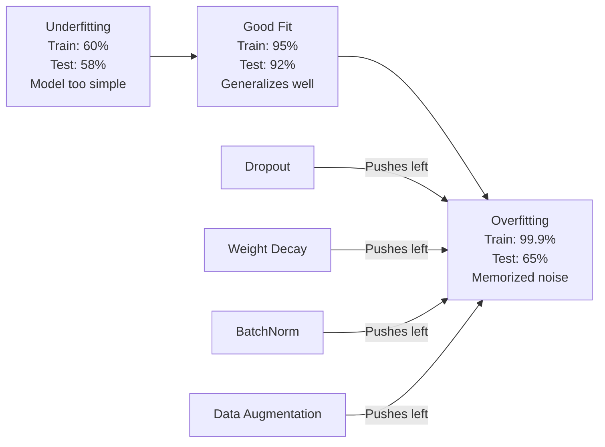
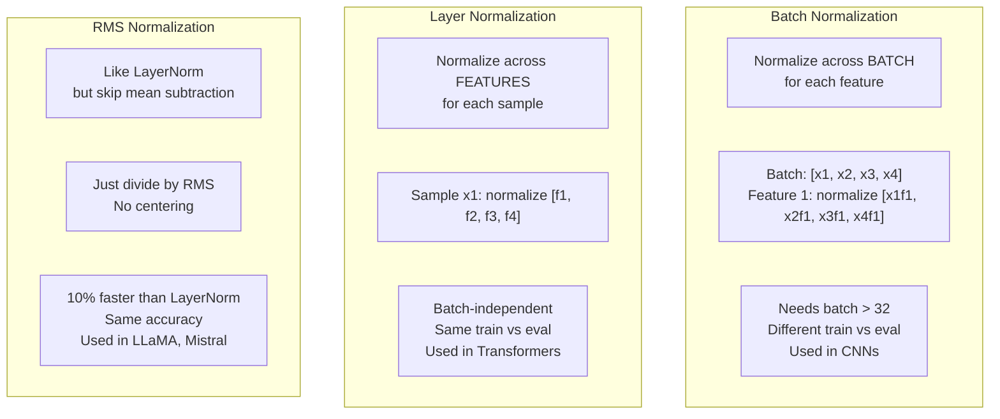
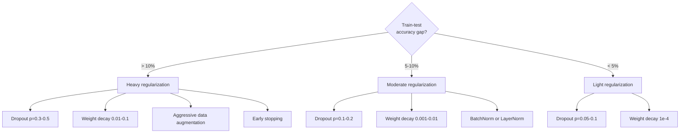

# Regularidad.

> Tu modelo obtiene el 99% de datos de entrenamiento y el 60% de datos de pruebas. Memorizó en lugar de aprender.

> **【中文解读】**模型训练集 99% Pero test集只有60%它是"背诵"而不是"学习"──正则化是对复杂性征收的税,强迫模型泛化──本章覆盖  Droput、L2 正则化、BatchNorm、LayerNorm、RMSNorm这些是变态和现代深度学习的标志──

**Type:** Build
**Languages:** Python
**Prerequisites:** Lesson 03.06 (Optimizers)
**Time:** ~75 minutes

## Objetivos de aprendizaje

- Implementar el abandono con escala invertida, desintegración del peso L2, normalización de lote, normalización de capa y RMSNorm desde cero
- Medir la brecha de precisión en los ensayos de tren y diagnosticar el sobreajuste mediante experimentos de regularización
- Explica por qué los transformadores utilizan LayerNorm en lugar de BatchNorm y por qué los LLM modernos prefieren RMSNorm
- Aplicar la combinación correcta de técnicas de regularización basadas en la gravedad del sobreajuste

> **【中文解读】**Este capítulo se centra en la comprensión de por qué el Transformer utiliza LayerNorm y no BatchNorm, así como por qué el Llama/Mistral utiliza RMSNorm。

## El problema es la introducción del problema

Una red neuronal con suficientes parámetros puede memorizar cualquier conjunto de datos. Esto no es hipotético - Zhang et al. (2017) lo demostró entrenando redes estándar en ImageNet con etiquetas aleatorias. Las redes alcanzaron una pérdida de entrenamiento cercana a cero en asignaciones de etiquetas completamente aleatorias. Memorizaron un millón de pares de entradas y salidas aleatorias sin patrón para aprender. La pérdida de entrenamiento era perfecta. La precisión de la prueba fue cero.

> Una red neuronal con suficientes parámetros puede recordar cualquier conjunto de datos. Esto no es una suposición. Zhang 等人 (2017) lo ha demostrado a través de la Red de Entrenamiento de Etiquetas Estándares de Uso de Arrasado en ImageNet. La red en la distribución de etiquetas completamente al azar alcanzó casi cero pérdidas de entrenamiento.

Este es el problema de sobreajuste, y empeora a medida que los modelos se hacen más grandes. GPT-3 tiene 175 mil millones de parámetros. El conjunto de entrenamiento tiene alrededor de 500 mil millones de tokens. Con tantos parámetros, el modelo tiene suficiente capacidad para memorizar significativos trozos de los datos de entrenamiento verbalmente. Sin regularización, simplemente regurgitaría ejemplos de entrenamiento en lugar de aprender patrones generalizables.

> Este es el problema de la adaptación, con el modelo que se vuelve más grande y peor. GPT-3 tiene 1750 mil millones de parámetros.

La brecha entre el rendimiento de la formación y el rendimiento de los ensayos es la brecha de sobreajuste. Cada técnica de esta lección ataca esa brecha desde un ángulo diferente. El abandono obliga a la red a no depender de ninguna neurona. La pérdida de peso evita que un solo peso crezca demasiado. La normalización de lote suaviza el panorama de pérdidas para que el optimizador encuentre mínimos más planos y generalizables. La normalización de capas hace lo mismo, pero funciona cuando la normalización de lotes falla (partidos pequeños, secuencias de longitud variable). RMSNorm lo hace un 10% más rápido al bajar el cálculo medio. Cada técnica es simple. Juntos, son la diferencia entre un modelo que memoriza y uno que generaliza.

> La diferencia entre el rendimiento de entrenamiento y el rendimiento de prueba es la diferencia de adaptación. Cada tipo de tecnología de esta clase ataca esta diferencia desde diferentes ángulos. La red de despido no depende de ningún neurón. La pérdida de peso impide que cualquier peso se incremente demasiado. La diferencia de carga se reduce a la tasa de pérdida de peso, lo que permite a los optimizadores encontrar un valor más plano y más generalizado. La diferencia de nivel es similar, pero es efectiva en los casos en que la clasificación de grupos no se produce. La norma RMS es de calcular rápido el 10% a través de la reducción de peso.

> **【中文解读】**Modelo de parámetros más, más fácil de adaptar. GPT-3 tiene 1750 mil millones de parámetros, 5.000 mil millones de tokens, no tiene regularización, sólo recitará los datos de entrenamiento.

> **【拓展：大模型的正则化策略】**La normalización de GPT-4 y Llama 3 es muy simple: AdamW 权重衰减 (wd=0.01) + Dropout (p=0.1) + RMSNorm。 no se utiliza técnicas de normalización complejas。 Key Insight: en el entrenamiento de datos de gran tamaño, los datos en sí mismos son los mejores normalizaciones。

## El concepto central.

### El espectro de sobresposición está en juego.

Cada modelo se encuentra en algún lugar de un espectro desde el subajuste (demasiado simple para capturar el patrón) hasta el sobreajuste (tan complejo que capta el ruido).

> Cada modelo está en algún lugar en la secuencia de los modelos de la falta de adaptación (mucho sencillo e imprecise) a la sobreadaptación (mucho compleja para captar ruido).



### Dejar de lado

La técnica de regularización más simple con la interpretación más elegante.

> La técnica de normalización más simple y más elegante se explica. Durante el entrenamiento, la probabilidad de que cada neurón salga a cero es de cero.

```
output = activation(z) * mask    where mask[i] ~ Bernoulli(1 - p)
```

Si p es 0,5, la mitad de las neuronas se centran en cada paso hacia adelante. La red debe aprender representaciones redundantes porque no puede predecir qué neuronas estarán disponibles. Esto evita la co-adaptación - neuronas aprendiendo a confiar en otras neuronas específicas que están presentes.

> Cuando p = 0,5 , cada vez que se propaga hacia adelante se coloca a cero la mitad de los nervios. La red debe aprender a expresar redundante, ya que no puede predecir qué nervios pueden utilizarse. Esto impide la co-adaptación de los nervios que dependen de la existencia de otros nervios específicos.

La interpretación del conjunto: una red con N neuronas y abandono crea 2^N posibles subredes (cada combinación de las cuales las neuronas están encendidas o apagadas). El entrenamiento con abandono aproximadamente trena simultáneamente todas las subredes 2^N, cada una en mini-partidos diferentes. En el momento de la prueba, utiliza todas las neuronas (sin abandono) y escala las salidas de 1 - p) para que coincidan con el valor esperado durante el entrenamiento. Esto es equivalente a la media de las predicciones de 2^N subredes -- un conjunto masivo de un solo modelo.

> 集成解释: una red de N 个神经元和中断的网络创建2^N 个可能的子网络(con cada compuesto de neurales abiertos o cerrados)  con dropout 训练大约同时训练所有2^N 个子网络, cada uno en diferentes mini-batches 上。 en el ensayo, usted utiliza todos los neurales  sin dropout) y se acumulará según (1 - p) la expectativa de salida y salida durante el entrenamiento de la correspondencia  Esto equivale a un precio de previsión de 2^N 个子网络 de la media  con un solo modelo para lograr una integración a gran escala。

En la práctica, la escalación se aplica durante el entrenamiento en lugar de las pruebas (abandonado invertido):

```
During training:  output = activation(z) * mask / (1 - p)
During testing:   output = activation(z)   (no change needed)
```

Esto es más limpio porque el código de prueba no necesita saber nada sobre el abandono.

> Así que es mejor, porque el código de prueba no necesita saber la existencia de abandono.

Taxas de defecto: p = 0,1 para transformadores, p = 0,5 para MLPs, p = 0,2 a 0,3 para CNNs.

> 默认比率:Transformer 用 p = 0.1,MLP 用 p = 0.5,CNN 用 p = 0.2-0.3──dropout 越高 = 正则化越强 = 欠拟合风险越大──

> **【拓展：Dropout 在 BERT 和 GPT 中的不同用法】**BERT utiliza Dropout p=0.1                                                                                                                                                                                                                                                                                                                                                                                                                                                                                                                    

### Descenso de peso (L2 regularización) 权重减减 (L2 正则化)

Añadir la magnitud cuadrada de todos los pesos a la pérdida:

> El peso cuadrado de la propiedad se incrementará en pérdida:

```
total_loss = task_loss + (lambda / 2) * sum(w_i^2)
```

El gradiente del término regularización es lambda * w. Esto significa que en cada paso, cada peso se reduce hacia cero por una fracción proporcional a su magnitud.

> El gradiente de la normalización es lambda * w. Esto significa que en cada paso, cada peso se reduce a cero en proporción a su amplitud en proporción a la normalización.

Por qué esto ayuda a la generalización: los modelos sobreajustados tienden a tener grandes pesos que amplifican el ruido en los datos de entrenamiento.

> Por qué esto ayuda a la generalización: los modelos sobreajustados suelen tener un gran peso, aumentan el ruido en los datos de entrenamiento. La disminución de peso mantiene el peso menor, limita la capacidad efectiva del modelo, lo obliga a depender de las características de la memoria y no de las características generalizadas.

El hiperparámetro lambda controla la resistencia.

> Lambda 超参数控制强度──valor típico:

- 0,01 para AdamW en transformadores
  Sinopsis: El hombre que se ha convertido en un hombre
- 1e-4 para SGD en las cadenas de televisión de CNN
  Traducción: 1e-4 Usado para CNN
- 0,1 para modelos muy adaptados
  0.1 Usó para modelos muy adaptados

Como se discutió en la lección 06: la pérdida de peso y la regularización de L2 son equivalentes en SGD pero no en Adam.

> Como se discute en la sección 6: Descenso de peso y L2 se normaliza en el precio de la SGD, pero no en el precio de Adán.

### Normalización de lote.

Normaliza la salida de cada capa a través del mini-batch antes de pasarla a la siguiente capa.

> En el transcurso de la producción de cada capa hasta la siguiente, se realizan los mini-batches.

Para un mini lote de activaciones en alguna capa:

>                                                                                                                                                                                                                                                                                                                                                                                                                                                                                                                              

```
mu = (1/B) * sum(x_i)           (batch mean)
sigma^2 = (1/B) * sum((x_i - mu)^2)   (batch variance)
x_hat = (x_i - mu) / sqrt(sigma^2 + eps)   (normalize)
y = gamma * x_hat + beta        (scale and shift)
```

Gamma y beta son parámetros que permiten que la red deshaga la normalización si es óptima. sin ellos, se obligaría a cada capa de salida a ser de un valor cero-medio de variación unitaria, que podría no ser lo que la red quiere.

> Gamma y beta son parámetros que se pueden aprender, si es que lo mejor es que se puede hacer que la red se anule a la integración. Sin ellos, se obligará a que cada nivel de salida sea de un valor medio y cuadrado de unidad de diferencia, esto no es lo que la red quiere.

**Training vs inference split:**Durante el entrenamiento, mu y sigma provienen del mini-batch actual. Durante la inferencia, se utilizan promedios de ejecución acumulados durante el entrenamiento (media móvil exponencial con impulso = 0,1, es decir, 90% viejo + 10% nuevo).

> **训练与推理的区别：**訓練時,mu 和 sigma 来自当前迷你批次──推理時,使用訓練期间累积的运行平均值(指数移动平均,动量 = 0.1,即90% 旧值 + 10% 新值)──

Por qué funciona BatchNorm todavía se debate. El documento original afirmó que reduce el "cambio de covariado interno" (la distribución de las entradas de capas cambiando a medida que las capas anteriores se actualizan). Santurkar y otros. (2018) mostró que esta explicación es incorrecta. La verdadera razón: BatchNorm hace que el panorama de pérdidas sea más suave. Los gradientes son más predictivos, las constantes de Lipschitz son más pequeñas, y el optimizador puede tomar pasos más grandes de forma segura. Por eso BatchNorm te permite utilizar tasas de aprendizaje más altas y converger más rápido.

> BatchNorm por qué es válido todavía hay controversia. El original artículo afirma que reduce la "disposición de variaciones internas" de las entradas de nivel con la actualización de la primera capa. Santurkar 等人 (2018)  provee que esta explicación es errónea. La verdadera razón: BatchNorm hace que la pérdida de la superficie sea más plana.

BatchNorm tiene una limitación fundamental: depende de las estadísticas de lote. Con el tamaño del lote 1, la media y la variación no tienen sentido. Con los lotes pequeños (< 32), las estadísticas son ruidosas y afectan el rendimiento. Esto importa para tareas como la detección de objetos (donde la memoria limita el tamaño del lote) y el modelado de lenguaje (donde varían las longitudes de secuencias).

> BatchNet tiene una limitación fundamental: depende de la estadística de lote. El tamaño del lote es de 1 时, el promedio y el diferencial de lote no tienen sentido.

> **【中文解读】**Las limitaciones fundamentales de BatchNorm: dependen de la cantidad de datos. Batch_size=1 时平均值差无意义; batch_size<32 时统计量噪声太大──这就是Transformer 用 LayerNorm的原因语言模型批小、序列长度不一──

### La normalización de las capas .

Normaliza las características en lugar de las partidas.

> 跨特征维度归化, y no跨批量── para un solo muestro:

```
mu = (1/D) * sum(x_j)           (feature mean)
sigma^2 = (1/D) * sum((x_j - mu)^2)   (feature variance)
x_hat = (x_j - mu) / sqrt(sigma^2 + eps)
y = gamma * x_hat + beta
```

D es la dimensión de las características. Cada muestra se normaliza de forma independiente - sin dependencia del tamaño del lote. Es por eso que los transformadores utilizan LayerNorm en lugar de BatchNorm. Las secuencias tienen longitudes variables, los tamaños del lote a menudo son pequeños (o 1 durante la generación), y el cálculo es idéntico entre el entrenamiento y la inferencia.

> D es la dimensión de la muestra. Cada muestra se clasifica independientemente. No depende del tamaño del lote. Es por eso que el transformador utiliza LayerNorm y no BatchNorm. La longitud del lote puede variar, el tamaño del lote es normalmente muy pequeño.

La capaNorm en transformadores se aplica después de cada bloque de autoatención y cada bloque de transmisión (Post-LN), o antes de ellos (Pre-LN, que es más estable para el entrenamiento).

> La capa central del transformador se aplica a cada bloque de atención y cada bloque anterior después de la LN, o antes de la LN, entrenamiento más estable)

### RMSNorm. La raíz de la normalidad.

LayerNorm sin la subtracción media. Propuso por Zhang & Sennrich (2019).

> LayerNorm 去掉均值减法── por Zhang & Sennrich (2019) 提出──

```
rms = sqrt((1/D) * sum(x_j^2))
y = gamma * x / rms
```

No hay cálculo medio, no hay parámetro beta. La observación: la recentricación (sustracción media) en LayerNorm contribuye muy poco al rendimiento del modelo, pero cuesta el cálculo.

> Así es. No hay un valor promedio calculado, no hay un parámetro beta. Observe: La reducción del valor promedio en la capa normal es muy pequeña, pero el consumo calculado puede ser reducido en un 10% de la cantidad de gastos y obtener la misma precisión.

Los LLM modernos usan RMSNorm en lugar de LayerNorm. A la escala de miles de millones de parámetros y billones de tokens, ese ahorro del 10% es significativo.

> LLaMA、LLaMA 2、LLaMA 3、Mistral 和 la mayoría de los LLM modernos utilizan RMSNorm en lugar de LayerNorm. En la escala de miles de millones de parámetros y miles de millones de tokens, el 10% de ahorro es notable.

> **【拓展：RMSNorm 为什么能省 10%】**LayerNorm  calcular el promedio y el diferencial de dos pasos, RMSNorm  saltar el promedio solo calcula RMS。 en Llama 3 405B(126 niveles) en el entrenamiento de cada paso, el entrenamiento de la Llama de la Llama de RMSNorm de 252 veces  Cada nivel de atención + FFN cada vez)  Provincia 10% significa para cada paso adelante  Ahorro de 25 veces  LayerNorm de promedio de cálculo En el entrenamiento de gran escala esto equivale a ahorro de cientos de GPU 小时──

### La normalización Comparación

### La normalización Comparación



### Aumento de datos como regularización .

No es una modificación de modelo sino una modificación de datos.

> No es un cambio de modelo, sino un cambio de datos.

- Imágenes: cosecha aleatoria, giro, rotación, nerviosismo de color, corte
  En español: "Trabajo" en español: "Trabajo" en español
- Texto: sustitución de sinónimos, traducción posterior, eliminación aleatoria
  En inglés, el nombre de la palabra "singular" se traduce en "singular" (singular).
- Audio: extensión de tiempo, cambio de tono, adición de ruido
  China: tiempo de rectitud, tiempo de rectitud, tiempo de rectitud, tiempo de rectitud, tiempo de rectitud, tiempo de rectitud, tiempo de rectitud, tiempo de rectitud, tiempo de rectitud, tiempo de rectitud, tiempo de rectitud, tiempo de rectitud, tiempo de rectitud, tiempo de rectitud, tiempo de rectitud, tiempo de rectitud, tiempo de rectitud, tiempo de rectitud, tiempo de rectitud, tiempo de rectitud, tiempo de rectitud, tiempo de rectitud, tiempo de rectitud.

El efecto es idéntico a la regularización: aumenta el tamaño efectivo del conjunto de entrenamiento, lo que dificulta que el modelo recuerde ejemplos específicos. Un modelo que sólo ve cada imagen una vez en su forma original puede memorizarla. Un modelo que ve 50 versiones aumentadas de cada imagen se ve obligado a aprender la estructura invariante.

> El efecto es el mismo que la normalización: aumenta el tamaño efectivo del conjunto de entrenamiento, haciendo que el modelo sea más difícil de recordar un modelo específico. Sólo ver cada imagen en forma original del modelo puede recordarlo.

### Parar temprano.

El regulador más simple: detener el entrenamiento cuando la pérdida de validación comienza a aumentar. El modelo aún no ha sobreajustado en ese punto. En la práctica, rastreas la pérdida de validación en cada época, guardas el mejor modelo y continúas entrenando para una ventana de "paciencia" (normalmente 5-20 épocas). Si la pérdida de validación no mejora dentro de la ventana de paciencia, te detienes y cargas el mejor modelo guardado.

> El método más simple de regularización: cuando la pérdida de prueba comienza a aumentar, deja de entrenar. En la práctica, cada época sigue la pérdida de prueba, conserva el mejor modelo, y continúa entrenando una ventana de "santidad" (normalmente 5-20 épocas). Si la pérdida de prueba no mejora en la ventana de prueba, deja de cargar el mejor modelo de conservación.

> **【拓展：Early Stopping 在大模型中的实践】**GPT 和 Llama 等大模型通常不使用早期停止训练在固定代币 数后结束──但在微调阶段 (如LoRA细调),早期停止非常重要,因为小数据集上很容易过拟合──HuggingFace 的教练默认使用早期停止(耐心=3),监控 eval_loss──

### Cuando aplicar qué.



## Construye y realiza.
```figure
l2-regularization
```

## Construye el mismo

> **【中文解读】**La siguiente es la siguiente: desde zero realizamos cinco tipos de regulación técnica.

### Paso 1: Descargar (Modo de trenes y Eval)

> Paso 1: Desarrollo 实现──关键是逆转 training时按概率 p 置零,剩余值除以 (1-p) 保持期望不变;推理时直接通过──这样推理代码不需要知道的存在──倒退也需要应用相同的面具(除以 (1-p))──

```python
import random
import math


class Dropout:
    def __init__(self, p=0.5):
        self.p = p
        self.training = True
        self.mask = None

    def forward(self, x):
        if not self.training:
            return list(x)
        self.mask = []
        output = []
        for val in x:
            if random.random() < self.p:
                self.mask.append(0)
                output.append(0.0)
            else:
                self.mask.append(1)
                output.append(val / (1 - self.p))
        return output

    def backward(self, grad_output):
        grads = []
        for g, m in zip(grad_output, self.mask):
            if m == 0:
                grads.append(0.0)
            else:
                grads.append(g / (1 - self.p))
        return grads
```

### Paso 2: L2 Descenso de peso.

> Segundo paso:L2 L2 L2 L2 L L L L L L L L L L L L L L L L L L L L L L L L L L L L L L L L L L L L L L L L L L L L L L L L L L L L L L L L L L L L L L L L L L L L L L L L L L L L L L L L L L L L L L L L L L L L L L L L L L L L L L L L L L L L L L L L L L L L L L L L L L L L L L L L L L L L L L L L L L L L L L L L L L L L L L L L L L L L L L L L L L L L L L L L L L L L L L L L L L L L L L L L L L L L L L L L L L L L L L L L L L L L L L L L L L L L L L L L L L L L L L L L L L L L L L L L L L L L L L L L L L L L L L L L L L L L L L L L L L L L L L L L L L L L L L L L L L L L L L L L L L L L L L L L L L L L L L L L L L L L L L L L L L L L L L L L L L L L L L L L L L L L L L L L L L L L L L L L L L L L L L L L L L L L L L L L L L L L L L L L L L L L L L L L L L L L L L L L L L L L L L L L L L L L L L L L L L L L L L L L L L L L L L L L L L L L L L L L L L L L L L L L L L L L L L L L L L L L L L L L L L L L L L L L L L L L L L L L L L L L L L L L L L L L L L L L L L L L L L L L L L L L L L L L L L L L L L L L L L L

```python
def l2_regularization(weights, lambda_reg):
    penalty = 0.0
    for w in weights:
        penalty += w * w
    return lambda_reg * 0.5 * penalty

def l2_gradient(weights, lambda_reg):
    return [lambda_reg * w for w in weights]
```

### Paso 3: Normalización de lote.

> Tres pasos: BatchNorm 实现── entrenamiento时: Usar el promedio de los resultados de los resultados de los resultados de los resultados de los resultados de los resultados de los resultados de los resultados de los resultados de los resultados de los resultados de los resultados de los resultados de los resultados de los resultados de los resultados de los resultados de los resultados de los resultados de los resultados de los resultados de los resultados de los resultados de los resultados de los resultados de los resultados de los resultados de los resultados de los resultados de los resultados de los resultados de los resultados de los resultados de los resultados de los resultados de los resultados de los resultados de los resultados de los resultados de los resultados de los resultados de los resultados de los resultados de los resultados de los resultados de los resultados de los resultados de los resultados de los resultados de los resultados de los resultados de los resultados de los resultados de los resultados de los resultados de los resultados de los resultados de los resultados de los resultados de los resultados de los resultados de los resultados de los resultados de los resultados de los resultados de los resultados de los resultados de los resultados de los resultados de los resultados de los resultados de los resultados de los resultados de los resultados de los resultados de los resultados de los resultados de los resultados de los resultados de los resultados de los resultados de los resultados de los resultados de los resultados de los resultados de los resultados de los resultados de los resultados de los resultados de los resultados de los resultados de los resultados de los resultados de los resultados de los resultados de los resultados de los resultados de los resultados de los resultados de los resultados de los resultados de los resultados de los resultados de los resultados de los resultados de los resultados de los resultados de los resultados de los resultados de los resultados de los resultados de los resultados de los resultados de los resultados de los resultados de los resultados de los resultados de los resultados de los resultados de los resultados de los resultados de los resultados de los resultados de los resultados de los resultados de los resultados de los resultados de los resultados de los resultados de los resultados de los resultados de los resultados de los resultados de los resultados de los resultados de los resultados de los resultados de los resultados de los resultados de los resultados de los resultados de los resultados de los resultados de los resultados de los resultados de los resultados de los resultados de los resultados de los resultados de los resultados de los resultados de los resultados de los resultados de los resultados de los resultados de los cuento de los cuento de los cuento de los cuento de los cuento de los cuento de los

```python
class BatchNorm:
    def __init__(self, num_features, momentum=0.1, eps=1e-5):
        self.gamma = [1.0] * num_features
        self.beta = [0.0] * num_features
        self.eps = eps
        self.momentum = momentum
        self.running_mean = [0.0] * num_features
        self.running_var = [1.0] * num_features
        self.training = True
        self.num_features = num_features

    def forward(self, batch):
        batch_size = len(batch)
        if self.training:
            mean = [0.0] * self.num_features
            for sample in batch:
                for j in range(self.num_features):
                    mean[j] += sample[j]
            mean = [m / batch_size for m in mean]

            var = [0.0] * self.num_features
            for sample in batch:
                for j in range(self.num_features):
                    var[j] += (sample[j] - mean[j]) ** 2
            var = [v / batch_size for v in var]

            for j in range(self.num_features):
                self.running_mean[j] = (1 - self.momentum) * self.running_mean[j] + self.momentum * mean[j]
                self.running_var[j] = (1 - self.momentum) * self.running_var[j] + self.momentum * var[j]
        else:
            mean = list(self.running_mean)
            var = list(self.running_var)

        self.x_hat = []
        output = []
        for sample in batch:
            normalized = []
            out_sample = []
            for j in range(self.num_features):
                x_h = (sample[j] - mean[j]) / math.sqrt(var[j] + self.eps)
                normalized.append(x_h)
                out_sample.append(self.gamma[j] * x_h + self.beta[j])
            self.x_hat.append(normalized)
            output.append(out_sample)
        return output
```

### Paso 4: Normalización de capas.

```python
class LayerNorm:
    def __init__(self, num_features, eps=1e-5):
        self.gamma = [1.0] * num_features
        self.beta = [0.0] * num_features
        self.eps = eps
        self.num_features = num_features

    def forward(self, x):
        mean = sum(x) / len(x)
        var = sum((xi - mean) ** 2 for xi in x) / len(x)

        self.x_hat = []
        output = []
        for j in range(self.num_features):
            x_h = (x[j] - mean) / math.sqrt(var + self.eps)
            self.x_hat.append(x_h)
            output.append(self.gamma[j] * x_h + self.beta[j])
        return output
```

### Paso 5: Norma RMS. Paso 5: Regeneración de la raíz.

> El RMSNorm es una versión simplificada de LayerNorm. Solo se calcula RMS (en la base de la base), no se reduce en la media, no hay beta (en la base de la base de datos).

```python
class RMSNorm:
    def __init__(self, num_features, eps=1e-6):
        self.gamma = [1.0] * num_features
        self.eps = eps
        self.num_features = num_features

    def forward(self, x):
        rms = math.sqrt(sum(xi * xi for xi in x) / len(x) + self.eps)
        output = []
        for j in range(self.num_features):
            output.append(self.gamma[j] * x[j] / rms)
        return output
```

### Paso 6: Entrenamiento con y sin regularización.

> Seis pasos: En el conjunto de datos de grupos de datos de forma redonda, la relación entre la precisión y la irregularidad se produce en el conjunto de ensayos. La precisión en la red de grupos de ensayos puede alcanzar el 100%, pero en el conjunto de ensayos sólo el 65%.

```python
def sigmoid(x):
    x = max(-500, min(500, x))
    return 1.0 / (1.0 + math.exp(-x))


def make_circle_data(n=200, seed=42):
    random.seed(seed)
    data = []
    for _ in range(n):
        x = random.uniform(-2, 2)
        y = random.uniform(-2, 2)
        label = 1.0 if x * x + y * y < 1.5 else 0.0
        data.append(([x, y], label))
    return data


class RegularizedNetwork:
    def __init__(self, hidden_size=16, lr=0.05, dropout_p=0.0, weight_decay=0.0):
        random.seed(0)
        self.hidden_size = hidden_size
        self.lr = lr
        self.dropout_p = dropout_p
        self.weight_decay = weight_decay
        self.dropout = Dropout(p=dropout_p) if dropout_p > 0 else None

        self.w1 = [[random.gauss(0, 0.5) for _ in range(2)] for _ in range(hidden_size)]
        self.b1 = [0.0] * hidden_size
        self.w2 = [random.gauss(0, 0.5) for _ in range(hidden_size)]
        self.b2 = 0.0

    def forward(self, x, training=True):
        self.x = x
        self.z1 = []
        self.h = []
        for i in range(self.hidden_size):
            z = self.w1[i][0] * x[0] + self.w1[i][1] * x[1] + self.b1[i]
            self.z1.append(z)
            self.h.append(max(0.0, z))

        if self.dropout and training:
            self.dropout.training = True
            self.h = self.dropout.forward(self.h)
        elif self.dropout:
            self.dropout.training = False
            self.h = self.dropout.forward(self.h)

        self.z2 = sum(self.w2[i] * self.h[i] for i in range(self.hidden_size)) + self.b2
        self.out = sigmoid(self.z2)
        return self.out

    def backward(self, target):
        eps = 1e-15
        p = max(eps, min(1 - eps, self.out))
        d_loss = -(target / p) + (1 - target) / (1 - p)
        d_sigmoid = self.out * (1 - self.out)
        d_out = d_loss * d_sigmoid

        for i in range(self.hidden_size):
            d_relu = 1.0 if self.z1[i] > 0 else 0.0
            d_h = d_out * self.w2[i] * d_relu
            self.w2[i] -= self.lr * (d_out * self.h[i] + self.weight_decay * self.w2[i])
            for j in range(2):
                self.w1[i][j] -= self.lr * (d_h * self.x[j] + self.weight_decay * self.w1[i][j])
            self.b1[i] -= self.lr * d_h
        self.b2 -= self.lr * d_out

    def evaluate(self, data):
        correct = 0
        total_loss = 0.0
        for x, y in data:
            pred = self.forward(x, training=False)
            eps = 1e-15
            p = max(eps, min(1 - eps, pred))
            total_loss += -(y * math.log(p) + (1 - y) * math.log(1 - p))
            if (pred >= 0.5) == (y >= 0.5):
                correct += 1
        return total_loss / len(data), correct / len(data) * 100

    def train_model(self, train_data, test_data, epochs=300):
        history = []
        for epoch in range(epochs):
            total_loss = 0.0
            correct = 0
            for x, y in train_data:
                pred = self.forward(x, training=True)
                self.backward(y)
                eps = 1e-15
                p = max(eps, min(1 - eps, pred))
                total_loss += -(y * math.log(p) + (1 - y) * math.log(1 - p))
                if (pred >= 0.5) == (y >= 0.5):
                    correct += 1
            train_loss = total_loss / len(train_data)
            train_acc = correct / len(train_data) * 100
            test_loss, test_acc = self.evaluate(test_data)
            history.append((train_loss, train_acc, test_loss, test_acc))
            if epoch % 75 == 0 or epoch == epochs - 1:
                gap = train_acc - test_acc
                print(f"    Epoch {epoch:3d}: train_acc={train_acc:.1f}%, test_acc={test_acc:.1f}%, gap={gap:.1f}%")
        return history
```

## Usalo con el marco de ejecución

> **【中文解读】**En PyTorch se utiliza el modelo.tren() /modelo.eval() 切换 Dropout 和 BatchNorm 的行为──在 Transformer 中,LayerNorm + Dropout p=0.1 是标配──忘记模型.eval() 是最常见的深度学习 bug 之一──

PyTorch proporciona toda la normalización y regularización como módulos:

> PyTorch ofrecerá funciones de integración y regularización como módulo:

```python
import torch
import torch.nn as nn

model = nn.Sequential(
    nn.Linear(784, 256),
    nn.BatchNorm1d(256),
    nn.ReLU(),
    nn.Dropout(0.3),
    nn.Linear(256, 128),
    nn.BatchNorm1d(128),
    nn.ReLU(),
    nn.Dropout(0.3),
    nn.Linear(128, 10),
)

model.train()
out_train = model(torch.randn(32, 784))

model.eval()
out_test = model(torch.randn(1, 784))
```

El `model.train()`- ¿ Qué ?`model.eval()`El interruptor de acceso es crítico.`model.eval()`La precisión de las pruebas fluctúa aleatoriamente porque el abandono sigue activo y BatchNorm está utilizando estadísticas mini-batch.

> `model.train()`- ¿ Qué ?`model.eval()`切换至关重要──它开关 dropout 并告诉BatchNorm  使用批量统计量还是运行统计量──推理前忘记 `model.eval()`Es uno de los errores más comunes en el aprendizaje profundo. Su tasa de precisión de pruebas va a cambiar a medida que el abandono sigue activo.

Para los transformadores, el patrón es diferente:

> 对于Transformer,模式不同:

```python
class TransformerBlock(nn.Module):
    def __init__(self, d_model=512, nhead=8, dropout=0.1):
        super().__init__()
        self.attention = nn.MultiheadAttention(d_model, nhead, dropout=dropout)
        self.norm1 = nn.LayerNorm(d_model)
        self.ff = nn.Sequential(
            nn.Linear(d_model, d_model * 4),
            nn.GELU(),
            nn.Linear(d_model * 4, d_model),
            nn.Dropout(dropout),
        )
        self.norm2 = nn.LayerNorm(d_model)
        self.dropout = nn.Dropout(dropout)

    def forward(self, x):
        attended, _ = self.attention(x, x, x)
        x = self.norm1(x + self.dropout(attended))
        x = self.norm2(x + self.ff(x))
        return x
```

LayerNorm, no BatchNorm. Descarga p=0.1, no p=0.5. Estos son los cambios de configuración.

> Us LayerNorm, no BatchNorm. Depuestos p=0.1, no p=0.5...

## Envíe el producto .

Esta lección produce:
- `outputs/prompt-regularization-advisor.md`-- un mensaje que diagnostica el exceso de ajuste y recomienda la estrategia correcta de regularización

> 本课产 出:`outputs/prompt-regularization-advisor.md`- Un diagnóstico ha sido preparado y ha sugerido un consejo de estrategia de corrección correcta

## Los ejercicios.

1. Implemente el abandono espacial para los datos 2D: en lugar de dejar caer neuronas individuales, deje caer canales de características enteros. Simula esto tratando grupos de características consecutivas como canales y dejando caer grupos enteros. Compara la brecha de prueba de tren con el abandono estándar en el conjunto de datos del círculo con hidden_size=32.

2. Implemente el suavización de etiquetas de la lección 05 combinado con el abandono de esta lección. Entrenar con cuatro configuraciones: ninguno, solo abandono, solo suavización de etiquetas, ambos. Medir la brecha de precisión final de la prueba de tren para cada uno. ¿Qué combinación da la brecha más pequeña?

3. Añadir una capa BatchNorm entre la capa oculta y la activación en la red de conjunto de datos de círculos. Entrenar con y sin BatchNorm a tasas de aprendizaje de 0,01, 0,05, y 0.1. BatchNorm debe permitir un entrenamiento estable a tasas de aprendizaje más altas donde la red de vainilla diverge.

4. Implemente la parada temprana: siga la pérdida de prueba en cada época, guarde los mejores pesos y detenga si la pérdida de prueba no ha mejorado durante 20 épocas. ejecuta la red regularizada durante 1000 épocas. Informar qué época tuvo la mejor precisión de prueba y cuántas épocas de cálculo ahorró.

5. Comparar LayerNorm vs RMSNorm en una red de 4 capas (no sólo 2). Iniciar ambos con el mismo peso. Entrenar durante 200 épocas y comparar la precisión final, la velocidad de entrenamiento (tiempo por época), y magnitudes de gradiente en la primera capa. Verificar que RMSNorm es más rápido con la misma precisión.

## Términos clave .

| Term | What people say | What it actually means |
|------|----------------|----------------------|
| Overfitting | "Model memorized the data" | When a model's training performance significantly exceeds its test performance, indicating it learned noise rather than signal |
| Regularization | "Preventing overfitting" | Any technique that constrains model complexity to improve generalization: dropout, weight decay, normalization, augmentation |
| Dropout | "Random neuron deletion" | Zeroing random neurons during training with probability p, forcing redundant representations; equivalent to training an ensemble |
| Weight decay | "L2 penalty" | Shrinking all weights toward zero by subtracting lambda * w at each step; penalizes complexity through weight magnitude |
| Batch normalization | "Normalize per batch" | Normalizing layer outputs across the batch dimension using batch statistics during training and running averages during inference |
| Layer normalization | "Normalize per sample" | Normalizing across features within each sample; batch-independent, used in transformers where batch size varies |
| RMSNorm | "LayerNorm without the mean" | Root mean square normalization; drops the mean subtraction from LayerNorm for 10% speedup with equal accuracy |
| Early stopping | "Stop before overfit" | Halting training when validation loss stops improving; the simplest regularizer, often used alongside others |
| Data augmentation | "More data from less" | Transforming training inputs (flip, crop, noise) to increase effective dataset size and force invariance learning |
| Generalization gap | "Train-test split" | The difference between training and test performance; regularization aims to minimize this gap |

## Más Leer más Leer más

- Srivastava et al., "Dropout: Una forma simple de prevenir que las redes neuronales se sobreajusten" (2014) -- el documento original de abandono con la interpretación del conjunto y los extensos experimentos
  Srivastava 等人,Dropout: un método simple para prevenir que las redes neuronales se adapten (2014)  original dropout 论文, contenida una explicación conjunta y una gran cantidad de experimentos
- Ioffe & Szegedy, "Batch Normalization: Accelerating Deep Network Training by Reducing Internal Covariate Shift" (2015) -- presentó BatchNorm y su procedimiento de capacitación, uno de los documentos de aprendizaje profundo más citados
  Ioffe & Szegedy, 批归归一化:通过减少内部协变量偏移加速深度网络训练(2015) 引入BatchNorm 及其训练过程,深度学习中被引用最多的论文之一
- Zhang & Sennrich, "Root Mean Square Layer Normalization" (2019) -- mostró que RMSNorm coincide con la precisión de LayerNorm con un cálculo reducido; adoptado por LLaMA y Mistral
  Zhang & Sennrich, 均方根层归归一化(2019)  prueba RMSNorm 以更少计算达到LayerNet 相同精度; fue adoptada por LLaMA 和 Mistral 
- Zhang et al., "Entender el aprendizaje profundo requiere repensar la generalización" (2017) -- el documento histórico que muestra que las redes neuronales pueden memorizar etiquetas aleatorias, desafiando las visiones tradicionales de la generalización
  Zhang 等人, comprensión de la profundidad del aprendizaje necesita repensar la generalización(2017) 里程碑论文,证明神经网络可以记忆随机标签,挑战传统泛化观点
