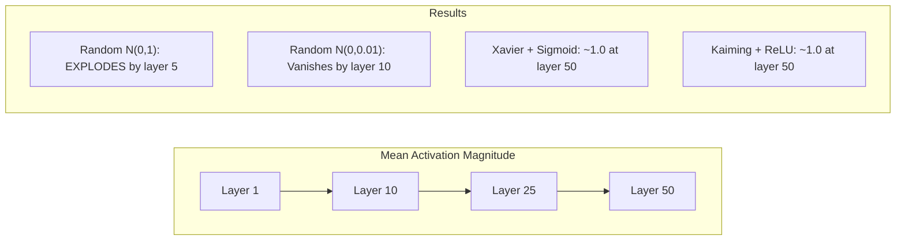
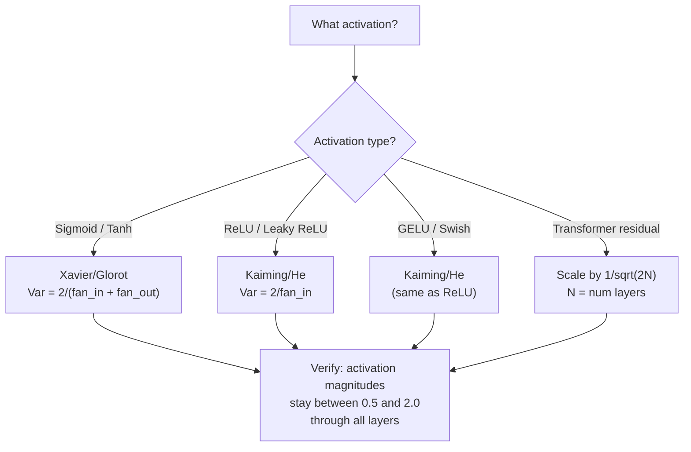

# Peso Iniciación y entrenamiento Estabilidad .

> Iniciar mal y el entrenamiento nunca comienza. Iniciar bien y 50 capas entrenan tan suavemente como 3.

> **【中文解读】**El entrenamiento inicial es un error, el entrenamiento nunca comenzará. El entrenamiento inicial es un error, el entrenamiento nunca comenzará.

**Type:** Build
**Languages:** Python
**Prerequisites:** Lesson 03.04 (Activation Functions), Lesson 03.07 (Regularization)
**Time:** ~90 minutes

## Objetivos de aprendizaje

- Implemente las estrategias de inicialización cero, aleatoria, Xavier/Glorot y Kaiming/He y mide su efecto en las magnitudes de activación a través de 50 capas
- Derivar por qué Xavier init utiliza Var(w) = 2/(fan_in + fan_out) y Kaiming utiliza Var(w) = 2/fan_in
- Demostrar el problema de simetría con inicialización cero y explicar por qué la escala aleatoria por sí sola es insuficiente
- Aparezca la estrategia de inicialización correcta con la función de activación: Xavier para sigmoid/tanh, Kaiming para ReLU/GELU

> **【中文解读】**El problema central del capítulo es: cómo seleccionar el peso inicial, hacer que la señal desaparezca o explode en la red de 50 niveles. La respuesta es Xavier iniciamiento (sigmoid/tanh 配套) y Kaiming iniciamiento (ReLU/GELU 配套) ⋅ La mayoría de las redes "abreca en la caja" es por eso.

## El problema es la introducción del problema

Inicializamos todos los pesos a cero. Nada aprende. Cada neurona calcula la misma función, recibe el mismo gradiente y actualiza de manera idéntica. Después de 10.000 épocas, tu capa oculta de 512 neuronas sigue siendo 512 copias de la misma neurona. Pagaste por 512 parámetros y obtuviste 1.

> Para empezar, cada neurón calcula la misma función, recibe la misma escala, y se actualiza de la misma manera. Después de 10.000 épocas, tu 512 neurón es todavía 512 copias ocultas del mismo neurón.

Inicializan demasiado grandes. Las activaciones explotan a través de la red. En la capa 10, los valores alcanzan 1e15.

> Iniciación de la red de la red de la red de la red de la red de la red de la red de la red de la red de la red de la red de la red de la red de la red de la red de la red de la red de la red de la red de la red de la red de la red de la red de la red de la red de la red de la red de la red de la red de la red de la red de la red de la red de la red de la red de la red de la red de la red de la red de la red de la red de la red de la red de la red de la red de la red de la red de la red de la red de la red de la red de la red de la red de la red de la red de la red de la red de la red de la red de la red de la red de la red de la red de la red de la red de la red de la red de la red de la red de la red de la red de la red de la red de la red de la red de la red de la red de la red de la red de la red de la red de la red de la red de la red de la red de la red de la red de la red de la red de la red de la red de la red de la red de la red de la red de la red de la red de la red de la red de la red de la red de la red de la red de la red de la red de la red de la red de la red de la red de la red de la red de la red de la red de la red de la red de la red de la red de la red de la red de la red de la red de la red de la red de la red de la red de la red de la red de la red de la red de la red de la red de la red de la red de la red de la red de la red de la red de la red de la red de la red de la red de la red de la red de la red de la red de la red de la red de la red de la red de la red de la red de la red de la red de la red de la red de la red de la red de la red de la red de la red de la red de la red de la red de la red de la red de la red de la red de la red de la red de

Inicialas aleatoriamente desde una distribución normal estándar. Funciona para 3 capas. A 50 capas, la señal se desploma a cero o detona hasta el infinito dependiendo de si la escala aleatoria era ligeramente demasiado pequeña o ligeramente demasiado grande. El límite entre "trabaja" y "rompió" es delgado como una navaja.

> Desde la distribución normal a la iniciación de las tres capas, se puede trabajar a las cincuenta, el signal se acumulará a cero o explotará a infinidad, dependiendo de si la medida de la medida es pequeña o pequeña. La frontera entre "valiente" y "destruido" será muy débil.

La inicialización de peso es la decisión más subestimada en el aprendizaje profundo. La arquitectura recibe documentos. Los optimizadores obtienen publicaciones en blogs. La inicialización obtiene una nota a pie de página. Pero si se equivocan y nada más importa, tu red está muerta antes de que comience el entrenamiento.

> 权重初始化 es la decisión más subestimada en el aprendizaje profundo. 架构能发文文――优化器能写博客――初始化只能得到一个脚注―― pero si se equivoca, todo lo demás no importa.

> **【中文解读】**La inicialización es la decisión más subestimada del aprendizaje profundo. La inicialización zero conduce a la comparación de todas las cosas del neurociencia, y la diferencia entre las formas de inicialización de manera acidental puede causar la desaparición o explosión de 50 niveles de señales de red. Xavier y Kaiming la inicialización matemática la ha resuelto.

> **【拓展：GPT-2 的残差缩放技巧】**GPT-2  introdujo 1/sqrt(2N) de residuos reducidos(N es la cantidad de niveles)。 cada residuo conectado x = x + subcampaón(x) ciudad aumentará el cuadro de diferencia,126 niveles de Llama 3 会让方差增长 126 倍── reducción de factores hacer que el cuadro de diferencia se mantenga estable── este arte es ahora poseído Transformer 采用──

## El concepto central.

### El problema de la simetría.

Cada neurona en una capa tiene la misma estructura: multiplica las entradas por pesos, agrega sesgo, aplica activación. Si todos los pesos comienzan en el mismo valor (cero es el caso extremo), cada neurona calcula la misma salida. Durante la retropropagación, cada neurona recibe el mismo gradiente. Durante el paso de actualización, cada neurona cambia por la misma cantidad.

> Cada neurón de una capa tiene la misma estructura: entrada multiplicada por peso, adición de parámetro, aplicación de la función activación. Si la propiedad de peso comienza desde el mismo valor, cada neurón calcula la misma salida. En la transmisión reversa, cada neurón recibe la misma escala. En el proceso de actualización, cada neurón cambia en la misma cantidad.

La red tiene cientos de parámetros, pero todos se mueven en un bloqueo. Esto se llama simetría, y la inicialización aleatoria es la forma de romperla. Cada neurona comienza en un punto diferente en el espacio de peso, así que cada uno aprende una característica diferente.

> Usted está atrapado. La red tiene cientos de parámetros, pero todos se mueven simultáneamente. Esto se llama relatividad, y la iniciación de la oportunidad es un modo violento de romperla. Cada neurón comienza desde un punto diferente en el espacio pesado, por lo que cada uno aprende diferentes características.

Pero "aleatoriedad" no es suficiente. La *escala* de la aleatoriedad determina si la red se pone en marcha.

> Pero "así" no es suficiente. La medida de la casualidad determina si la red puede entrenar.

### La propagación de la varianza a través de las capas se transmite de forma diferente.

Considere una sola capa con entradas fan_in:

> 考虑一个有风扇_in 个输入的单层:

```
z = w1*x1 + w2*x2 + ... + w_n*x_n
```

Si cada peso wi se extrae de una distribución con varianza Var(w) y cada entrada xi tiene varianza Var(x), la varianza de salida es:

> Si cada peso de la fuente de diferencia es de Var(w) de distribución, cada entrada xi de diferencia es de Var(x), la salida de diferencia es:

```
Var(z) = fan_in * Var(w) * Var(x)
```

Si Var(w) = 1 y fan_in = 512, la variación de salida es 512x la variación de entrada. Después de 10 capas: 512^10 = 1.2e27.

> Si Var(w) = 1 y fan_in = 512, el output y el output es 512 veces el input y el output es 512 veces el input y el output es 512 veces el input y el output es 512 veces el output y el output es 512 veces el output y el output es 512 veces el output y el output es 512 veces el output y el output es 512 veces el output y el output es 512 veces el output y el output es 512 veces el output y el output es 512 veces el output y el output es 512 veces el output y el output es 512 veces el output y el output es 512 veces el output y el output es 527 veces el output y el output es 512 veces el output y el output es 512 veces el output y el output es el output es el output.

Si Var ((w) = 0,001, la variación de salida se reduce en 0,001 * 512 = 0,512 por capa. Después de 10 capas: 0.512^10 = 0,00013. Su señal ha desaparecido.

> Si Var(w) = 0,001,输出方差每层缩小 0.001 * 512 = 0.512──10 层后:0.512^10 = 0.00013──tu señal ya ha desaparecido──

El objetivo: elegir Var(w) para que Var(z) = Var(x). La magnitud de la señal se mantiene constante a través de las capas.

> 目標:选择 Var(w) 使 Var(z) = Var(x)。 señal amplitud de cada nivel mantener恒定。

> **【中文解读】**方差传播的数学:Var(z) = fan_in * Var(w) * Var(x)。 Si fan_in=512 且 Var(w) = 1,输出方差是输入的 512 倍──10 层后:512^10 = 1.2e27,信号爆炸──Xavier 和 Kaiming 的目标都是让 Var(z) = Var(x),使信号幅度逐层保持恒定──

### Xavier/Glorot Iniciación

Glorot y Bengio (2010) derivaron la solución para las activaciones sigmoide y tanh.

> Glorot 和 Bengio (2010)                                                                                                                                                                                                                                                                                                                                                                                                                                                                                                                       

```
Var(w) = 2 / (fan_in + fan_out)
```

En la práctica, las pesas se extraen de:

> 实践中,权重从以下分布抽取:

```
w ~ Uniform(-limit, limit)  where limit = sqrt(6 / (fan_in + fan_out))
```

o bien:

```
w ~ Normal(0, sqrt(2 / (fan_in + fan_out)))
```

Esto funciona porque sigmoide y tanh son aproximadamente lineales cerca de cero, donde las activaciones inicializadas correctamente viven.

> Esto es eficaz porque el sigmoide y el tanh en el cercano a cero son casi lineales, mientras que el valor de activación de la iniciación correcta es que el tiempo de vida es cerca de cero.

### Kaiming / Él Inicialización / Kaiming / Él Iniciación

ReLU mata la mitad de las salidas (todo lo negativo se convierte en cero). El fan_in efectivo se reduce a la mitad porque en promedio la mitad de las entradas son cero. Xavier init no tiene en cuenta esto - subestima la varianza necesaria.

> ReLU reducirá la mitad de la salida de la entrada a cero, pues el principio de Xavier no tuvo en cuenta que el valor negativo de la entrada era inferior a la diferencia de cuadrados.

He et al. (2015) ajustó la fórmula:

> He 等人 (2015) 调整了公式:

```
Var(w) = 2 / fan_in
```

Los pesos se extraen de:

> 权重从以下分布抽取:

```
w ~ Normal(0, sqrt(2 / fan_in))
```

El factor de 2 compensa la reducción de la mitad de las activaciones de ReLU. Sin él, la señal se reduce en ~ 0,5x por capa.

> El factor 2  compensa ReLU va a poner la mitad de la activación en el valor de cero.

> **【拓展：PyTorch 的默认初始化】**PyTorch de nn.Linear 默认使用 Kaiming Uniform 初始化(`nn.init.kaiming_uniform_`,mode='fan_in'), junto con el negativo_slope=sqrt de LeakyReLU (squrt)`nn.Linear(784, 256)`时,PyTorch 已经帮助你选择好初始化――但自定义架构(Transformer、混合专家模型) necesita ajuste manual――

### Iniciación del transformador

GPT-2 introdujo un patrón diferente. Las conexiones residuales añaden la salida de cada sub- capa a su entrada:

> GPT-2 introdujo un modelo diferente. Las conexiones de residuos de cada subtierra se añadirán a su entrada:

```
x = x + sublayer(x)
```

Cada adición aumenta la varianza. Con N capas residuales, la varianza crece proporcionalmente a N. GPT-2 escala los pesos de las capas residuales por 1/sqrt(2N), donde N es el número de capas. Esto mantiene la magnitud de señal acumulada estable.

> Cada vez que se agrega, se incrementa la diferencia de cuadrados. Cuando hay N 个残差层, la diferencia de cuadrados se incrementa en proporción.

El Llama 3 (405B parámetros, 126 capas) utiliza un esquema similar.

> Llama 3 ((4050 亿参数,126 层) utiliza un esquema similar.

> **【拓展：混合专家模型（MoE）的初始化挑战】**Mixtral 8x7B y GPT-4 等 modelos utilizan la arquitectura MoE, cada token sólo activa parte de los especialistas. La inicialización necesita asegurar: el peso inicial del router no puede hacer que todos los tokens se elijan con un mismo especialista. La práctica común es usar pequeños disparidades iniciales + desplazamiento de ruido, asegurar que el inicio del router sea normal.

```mermaid
flowchart TD
    subgraph "Zero Init"
        Z1["Layer 1<br/>All weights = 0"] --> Z2["Layer 2<br/>All neurons identical"]
        Z2 --> Z3["Layer 3<br/>Still identical"]
        Z3 --> ZR["Result: 1 effective neuron<br/>regardless of width"]
    end

    subgraph "Xavier Init"
        X1["Layer 1<br/>Var = 2/(fan_in+fan_out)"] --> X2["Layer 2<br/>Signal stable"]
        X2 --> X3["Layer 50<br/>Signal stable"]
        X3 --> XR["Result: Trains with<br/>sigmoid/tanh"]
    end

    subgraph "Kaiming Init"
        K1["Layer 1<br/>Var = 2/fan_in"] --> K2["Layer 2<br/>Signal stable"]
        K2 --> K3["Layer 50<br/>Signal stable"]
        K3 --> KR["Result: Trains with<br/>ReLU/GELU"]
    end
```



### Magnitud de activación a través de 50 capas.



### Elegir el inicio correcto



## Construye y realiza.
```figure
weight-init-variance
```

## Construye el mismo

> **【中文解读】**实验设计:让信号通过50 层网络,测量每层的激活幅度──零初始化 → 所有神经元相同;随机 N(0,1) → 爆炸;随机 N(0,0.01) → 消失;Xavier+tanh / Kaiming+ReLU → 稳定──

### Paso 1: Estrategias de inicialización.

Cuatro formas de iniciar una matriz de peso. Cada una devuelve una lista de listas (una matriz 2D) con columnas fan_in y filas fan_out.

> Cada uno de ellos regresa a una lista de la lista de la lista de la lista de la lista de la lista de la lista de la lista de la lista de la lista de la lista de la lista de la lista de la lista de la lista de la lista de la lista de la lista de la lista de la lista de la lista de la lista de la lista de la lista de la lista de la lista de la lista de la lista de la lista de la lista de la lista de la lista de la lista de la lista de la lista de la lista de la lista de la lista de la lista de la lista de la lista de la lista de la lista de la lista de la lista de la lista de la lista de la lista de la lista de la lista de la lista de la lista de la lista de la lista de la lista de la lista de la lista de la lista de la lista de la lista de los fan.

```python
import math
import random


def zero_init(fan_in, fan_out):
    return [[0.0 for _ in range(fan_in)] for _ in range(fan_out)]


def random_init(fan_in, fan_out, scale=1.0):
    return [[random.gauss(0, scale) for _ in range(fan_in)] for _ in range(fan_out)]


def xavier_init(fan_in, fan_out):
    std = math.sqrt(2.0 / (fan_in + fan_out))
    return [[random.gauss(0, std) for _ in range(fan_in)] for _ in range(fan_out)]


def kaiming_init(fan_in, fan_out):
    std = math.sqrt(2.0 / fan_in)
    return [[random.gauss(0, std) for _ in range(fan_in)] for _ in range(fan_out)]
```

### Paso 2: Funciones de activación. Paso 2: Función de activación.

Necesitamos sigmoid, tanh y ReLU para probar cada estrategia init con su activación prevista.

> Necesitamos sigmoid, tanh y ReLU para probar cada estrategia de inicialización y la combinación de funciones de activación de la respuesta.

```python
def sigmoid(x):
    x = max(-500, min(500, x))
    return 1.0 / (1.0 + math.exp(-x))


def tanh_act(x):
    return math.tanh(x)


def relu(x):
    return max(0.0, x)
```

### Paso 3: Pasar hacia adelante a través de 50 capas.

Pasar datos aleatorios a través de una red profunda y medir la magnitud media de activación en cada capa.

> Se utilizará el tiempo necesario para medir la amplitud de activación media de cada nivel.

```python
def forward_deep(init_fn, activation_fn, n_layers=50, width=64, n_samples=100):
    random.seed(42)
    layer_magnitudes = []

    inputs = [[random.gauss(0, 1) for _ in range(width)] for _ in range(n_samples)]

    for layer_idx in range(n_layers):
        weights = init_fn(width, width)
        biases = [0.0] * width

        new_inputs = []
        for sample in inputs:
            output = []
            for neuron_idx in range(width):
                z = sum(weights[neuron_idx][j] * sample[j] for j in range(width)) + biases[neuron_idx]
                output.append(activation_fn(z))
            new_inputs.append(output)
        inputs = new_inputs

        magnitudes = []
        for sample in inputs:
            magnitudes.append(sum(abs(v) for v in sample) / width)
        mean_mag = sum(magnitudes) / len(magnitudes)
        layer_magnitudes.append(mean_mag)

    return layer_magnitudes
```

### Paso 4: El experimento.

Ejecutar todas las combinaciones: cero init, aleatorio N(0,1), aleatorio N(0,0.01), Xavier con sigmoide, Xavier con tanh, Kaiming con ReLU. Imprimir la magnitud en capas clave.

> 运行所有组合:零初始化、随机 N(0,1)、随机 N(0,0.01)、Xavier + sigmoid、Xavier + tanh、Kaiming + ReLU。打印关键层的幅度──

```python
def run_experiment():
    configs = [
        ("Zero init + Sigmoid", lambda fi, fo: zero_init(fi, fo), sigmoid),
        ("Random N(0,1) + ReLU", lambda fi, fo: random_init(fi, fo, 1.0), relu),
        ("Random N(0,0.01) + ReLU", lambda fi, fo: random_init(fi, fo, 0.01), relu),
        ("Xavier + Sigmoid", xavier_init, sigmoid),
        ("Xavier + Tanh", xavier_init, tanh_act),
        ("Kaiming + ReLU", kaiming_init, relu),
    ]

    print(f"{'Strategy':<30} {'L1':>10} {'L5':>10} {'L10':>10} {'L25':>10} {'L50':>10}")
    print("-" * 80)

    for name, init_fn, act_fn in configs:
        mags = forward_deep(init_fn, act_fn)
        row = f"{name:<30}"
        for idx in [0, 4, 9, 24, 49]:
            val = mags[idx]
            if val > 1e6:
                row += f" {'EXPLODED':>10}"
            elif val < 1e-6:
                row += f" {'VANISHED':>10}"
            else:
                row += f" {val:>10.4f}"
        print(row)
```

### Paso 5: demostración de simetría.

Muestre que el init cero produce neuronas idénticas.

> Muestran que la iniciación de la 0 se produce en la misma neurona.

```python
def symmetry_demo():
    random.seed(42)
    weights = zero_init(2, 4)
    biases = [0.0] * 4

    inputs = [0.5, -0.3]
    outputs = []
    for neuron_idx in range(4):
        z = sum(weights[neuron_idx][j] * inputs[j] for j in range(2)) + biases[neuron_idx]
        outputs.append(sigmoid(z))

    print("\nSymmetry Demo (4 neurons, zero init):")
    for i, out in enumerate(outputs):
        print(f"  Neuron {i}: output = {out:.6f}")
    all_same = all(abs(outputs[i] - outputs[0]) < 1e-10 for i in range(len(outputs)))
    print(f"  All identical: {all_same}")
    print(f"  Effective parameters: 1 (not {len(weights) * len(weights[0])})")
```

### Paso 6: Informe de magnitud capa por capa.

Imprima un gráfico de barras visuales de magnitudes de activación a través de 50 capas.

> Impresión de 50 capas de la imagen de la imagen de la imagen de la imagen de la imagen.

```python
def magnitude_report(name, magnitudes):
    print(f"\n{name}:")
    for i, mag in enumerate(magnitudes):
        if i % 5 == 0 or i == len(magnitudes) - 1:
            if mag > 1e6:
                bar = "X" * 50 + " EXPLODED"
            elif mag < 1e-6:
                bar = "." + " VANISHED"
            else:
                bar_len = min(50, max(1, int(mag * 10)))
                bar = "#" * bar_len
            print(f"  Layer {i+1:3d}: {bar} ({mag:.6f})")
```

## Usalo con el marco de ejecución

> **【中文解读】**PyTorch interno `nn.init.xavier_uniform_`¿Qué es esto?`nn.init.kaiming_normal_`Las funciones de la línea se usan por defecto en Kaiming Uniform, por lo que la red simple "abre en la caja" se utiliza.

PyTorch proporciona estas funciones incorporadas:

> PyTorch ofrecerá estas funciones como función de configuración:

```python
import torch
import torch.nn as nn

layer = nn.Linear(512, 256)

nn.init.xavier_uniform_(layer.weight)
nn.init.xavier_normal_(layer.weight)

nn.init.kaiming_uniform_(layer.weight, nonlinearity='relu')
nn.init.kaiming_normal_(layer.weight, nonlinearity='relu')

nn.init.zeros_(layer.bias)
```

Cuando llames .`nn.Linear(512, 256)`PyTorch es el sistema de inicialización de Kaiming por defecto. por eso la mayoría de las redes simples "solo funcionan" - PyTorch ya hizo la elección correcta. pero cuando construyes arquitecturas personalizadas o vas más profundo que 20 capas, necesitas entender lo que está sucediendo y potencialmente anula el defecto.

> Cuando tú调用 `nn.Linear(512, 256)`时,PyTorch 默认使用Kaiming 均初始化──这就是为什么大多数简单网络"开箱即用"PyTorch 已经帮助你做出正确选择──但是当你构建自定义架构或超过20层时,你需要理解正在发生什么并可能覆盖默认值──

Para transformadores, los modelos HuggingFace suelen manejar la inicialización en sus `_init_weights`La implementación de GPT-2 escala las proyecciones residuales por 1/sqrt ((N). Si estás construyendo un transformador desde cero, necesitas añadir esto tú mismo.

> 对于Transformer,HuggingFace 模型通常在 `_init_weights`方法中处理初始化── GPT-2 实现将残差投影缩缩缩为1/sqrt(N)── Si desde zero construir Transformer, usted necesita añadir este mismo──

## Envíe el producto .

Esta lección produce:
- `outputs/prompt-init-strategy.md`-- un mensaje que diagnostica los problemas de inicialización del peso y recomienda la estrategia correcta

> 本课产 出:`outputs/prompt-init-strategy.md`- un diagnóstico de la autoridad de iniciación problema y proponer la estrategia correcta

## Los ejercicios.

1. Añadir inicialización LeCun (Var = 1/fan_in, diseñado para la activación SELU). ejecutar el experimento de 50 capas con LeCun init + tanh y comparar con Xavier + tanh.

   1. 添加 LeCun 初始化(Var = 1/fan_in,为SELU 激活设计) ・・・Uz LeCun 初始化 + tanh 跑 50 层实验,和Xavier + tanh 对比──

2. Implemente la escalación residual GPT-2: multiplica la salida de cada capa por 1/sqrt(2*N) antes de agregar a la corriente residual. ejecuta 50 capas con y sin escalación, mide la rapidez con que crece la magnitud residual.

   2. 实现 GPT-2 residual reducción:把每层输出乘以1/sqrt(2*N) 再加到残差流──跑 50 层有缩放和无缩放,测量残差幅度增长速度──

3. Crear una función de "comprobar la salud init" que toma las dimensiones de capas de una red y el tipo de activación, luego recomienda la inicialización correcta y advierte si el init actual causará problemas.

   3. Crear la función "Initializar el control de salud": recepción de la red de dimensiones y tipo de activación, recomendar el inicio correcto, advertir si el inicio actual causará problemas.

4. ejecutar el experimento con fan_in = 16 vs fan_in = 1024. Xavier y Kaiming se adaptan a fan_in, pero al azar init no. Muestre cómo la brecha entre "trabaja" y "braks" se amplía con capas más grandes.

   4. Usar fan_in = 16 和 fan_in = 1024 跑实验──Xavier 和 Kaiming se adapta a fan_in, pero con el tiempo no se inicia── mostrar cómo la diferencia entre "能用" y "崩" se incrementa y se expande con el tiempo──

5. Implemente la inicialización ortogonal (generar una matriz aleatoria, calcular su SVD, usar la matriz ortogonal U). Comparar con Kaiming para redes ReLU en 50 capas.

   5. 实现正交初始化(生成随机矩阵,计算 SVD,用正交矩阵 U) ⋅在 50 层 ReLU 网络上和 Kaiming 对比──

## Términos clave .

| Term | What people say | What it actually means |
|------|----------------|----------------------|
| Weight initialization | "Set starting weights randomly" | The strategy for choosing initial weight values that determines whether a network can train at all |
| Symmetry breaking | "Make neurons different" | Using random initialization to ensure neurons learn distinct features instead of computing identical functions |
| Fan-in | "Number of inputs to a neuron" | The number of incoming connections, which determines how input variance accumulates in the weighted sum |
| Fan-out | "Number of outputs from a neuron" | The number of outgoing connections, relevant for maintaining gradient variance during backpropagation |
| Xavier/Glorot init | "The sigmoid initialization" | Var(w) = 2/(fan_in + fan_out), designed to preserve variance through sigmoid and tanh activations |
| Kaiming/He init | "The ReLU initialization" | Var(w) = 2/fan_in, accounts for ReLU zeroing half the activations |
| Variance propagation | "How signals grow or shrink through layers" | The mathematical analysis of how activation variance changes layer by layer based on weight scale |
| Residual scaling | "GPT-2's init trick" | Scaling residual connection weights by 1/sqrt(2N) to prevent variance growth through N transformer layers |
| Dead network | "Nothing trains" | A network where poor initialization causes all gradients to be zero or all activations to saturate |
| Exploding activations | "Values go to infinity" | When weight variance is too high, causing activation magnitudes to grow exponentially through layers |

| 术语 | 俗称 | 实际含义 |
|------|------|---------|
| Weight initialization / 权重初始化 | "随机设置初始权重" | 选择初始权重值的策略，决定网络能否训练 |
| Symmetry breaking / 对称性破除 | "让神经元不同" | 用随机初始化确保神经元学到不同特征，而不是计算相同函数 |
| Fan-in / 输入连接数 | "神经元的输入数" | 入连接数，决定加权和里输入方差如何累积 |
| Fan-out / 输出连接数 | "神经元的输出数" | 出连接数，与反向传播时保持梯度方差相关 |
| Xavier/Glorot init / Xavier 初始化 | "sigmoid 初始化" | Var(w) = 2/(fan_in + fan_out)，旨在通过 sigmoid/tanh 保持方差 |
| Kaiming/He init / Kaiming 初始化 | "ReLU 初始化" | Var(w) = 2/fan_in，补偿 ReLU 把一半激活置零 |
| Variance propagation / 方差传播 | "信号在层间如何放大或缩小" | 关于激活方差如何基于权重尺度逐层变化的数学分析 |
| Residual scaling / 残差缩放 | "GPT-2 的初始化技巧" | 把残差连接权重缩放 1/sqrt(2N)，防止 N 个 Transformer 层后方差增长 |
| Dead network / 死亡网络 | "什么都不训练" | 初始化不当导致所有梯度为零或所有激活饱和的网络 |
| Exploding activations / 激活爆炸 | "值到无穷" | 权重方差太高，激活幅度在层间指数增长 |

## Más Leer más Leer más

- Glorot & Bengio, "Entender la dificultad de entrenar redes neuronales de entrada profunda" (2010) -- el original documento de inicialización de Xavier con análisis de varianza
  Glorot & Bengio, comprensión entrenamiento profundidad anterior Neural network's困难(2010)原始 Xavier 初始化论文,包含方差分析
- He et al., "Delving Deep into Rectifiers" (2015) -- introdujo la inicialización de Kaiming para las redes ReLU
  He 等人,深入研究修正器(2015)为 ReLU 网络引入 Kaiming 初始化
- Radford et al., "Los modelos de lenguaje son aprendices multitarea no supervisados" (2019) -- documento GPT-2 con inicialización de escala residual
  Radford 等人,语言模型是无监督多任务学习器(2019) GPT-2 论文,包含残差缩放初始化
- Mishkin & Matas, "Todo lo que necesitas es un buen principio" (2016) -- inicialización de la unidad-varianza secuencial de capas, una alternativa empírica a las fórmulas analíticas
  Mishkin & Matas,You only need a good initiation(2016)层序单位差初始化,解析公式的经验替代方案
