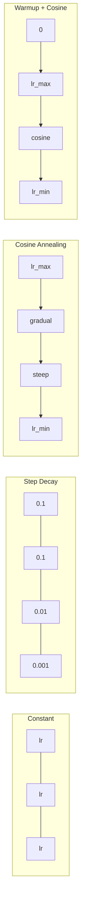
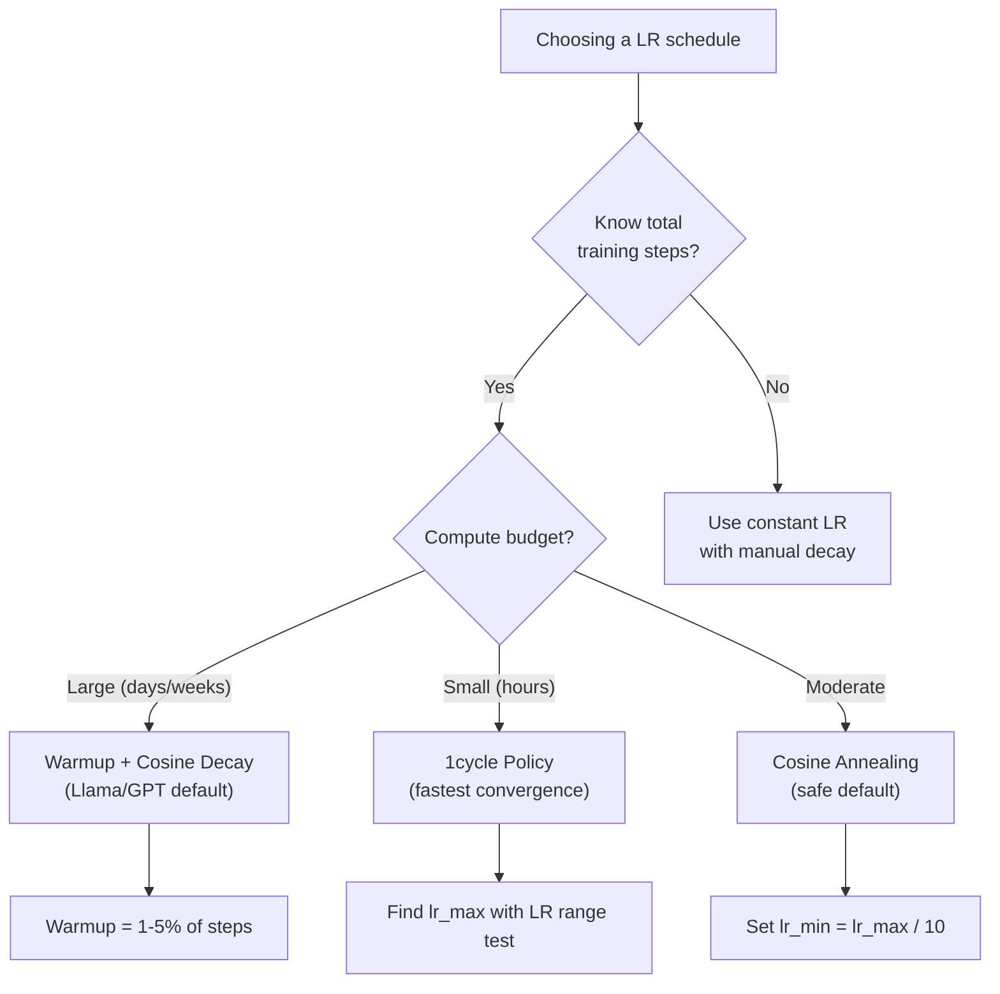
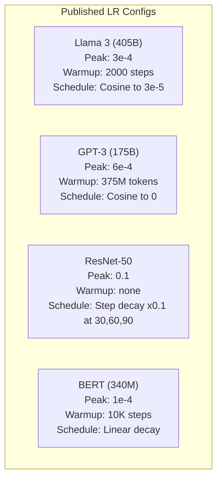

# Las tasas de aprendizaje y el calentamiento

> La velocidad de aprendizaje es el único hiperparámetro más importante. No la arquitectura, no el tamaño del conjunto de datos, no la función de activación, la velocidad de aprendizaje. Si no sintonizas nada más, sintoniza esto.

> **【中文解读】**El índice de aprendizaje es el superparámetro más importante no es la estructura, no la cantidad de datos, es el índice de aprendizaje―Llama 3 utiliza el valor máximo lr=3e-4 + 2000 步升温 + cosino decay──GPT-3 utiliza lr=6e-4 +升温──entender el índice de aprendizaje 调度 es el clave de cualquier modelo de entrenamiento―

**Type:** Build
**Languages:** Python
**Prerequisites:** Lesson 03.06 (Optimizers), Lesson 03.08 (Weight Initialization)
**Time:** ~90 minutes

## Objetivos de aprendizaje

- Implementar desde cero los horarios constantes, de degradación gradual, de anulación cosina, de calentamiento + cosina y de tasa de aprendizaje en un ciclo
- Demostrar los tres modos de fracaso de la selección de la tasa de aprendizaje: divergencia (demasiado alta), estancamiento (demasiado bajo) y oscilación (sin decadencia)
- Explica por qué es necesario que los optimistas basados en Adán se calienten y cómo estabiliza la formación temprana
- Comparar la velocidad de convergencia en los cinco horarios de la misma tarea y seleccionar el adecuado para un presupuesto de formación determinado

> **【中文解读】**Este capítulo realza cinco tipos de tasas de aprendizaje:恒定、阶梯衰减、余弦退火、warmup+余弦、1 cycle 策略。

## El problema es la introducción del problema

Establezca la tasa de aprendizaje en 0.1. El entrenamiento se desvía -- la pérdida salta a infinito en 3 pasos. Establezca a 0.0001. El entrenamiento se arrastra -- después de 100 épocas, el modelo apenas se ha movido de al azar. Establezca a 0.01. El entrenamiento funciona durante 50 épocas, entonces la pérdida oscila alrededor de un mínimo que nunca puede alcanzar porque los pasos son demasiado grandes.

> Se establece que la tasa de aprendizaje es de 0,1── entrenamiento se dispersa  pérdida en 3 pasos saltando a infinidad── entrenamiento se hace de 0.0001── entrenamiento lento y se arrastra  100  época  después, el modelo casi no se mueve de un estado al azar── entrenamiento se hace de 0.01── entrenamiento se hace de 50  época tiene efecto, luego se pierde en una oscilación cerca de un valor muy pequeño que nunca puede alcanzar, porque el paso es demasiado grande──

La tasa óptima de aprendizaje no es constante. cambia durante el entrenamiento. Al principio, se quiere grandes pasos para cubrir el terreno rápidamente. Al final del entrenamiento, se quiere pequeños pasos para establecerse en un mínimo nítido. La diferencia entre un modelo 90% preciso y un modelo 95% preciso es a menudo sólo el horario.

> La tasa de aprendizaje óptima no es una constante. Varia durante el proceso de entrenamiento. En la primera fase, quieres un gran paso y rápidamente cubres el espacio.

Cada modelo principal publicado en los últimos tres años utiliza un calendario de tasa de aprendizaje. Llama 3 utilizó el pico lr=3e-4 con 2000 pasos de calentamiento y desintegración cosina a 3e-5. GPT-3 utilizó lr=6e-4 con calentamiento de más de 375 millones de tokens. Estas no son opciones arbitrarias. Son el resultado de extensos barridos de hiperparámetros que cuestan millones de dólares.

> 过去三年发表的每个主要模型都使用学习率调度──Llama 3 使用峰值 lr=3e-4,2000 步升和余弦衰减到3e-5──GPT-3 使用 lr=6e-4,warmup 覆盖3.75亿代币──These no son opciones arbitrarias──éran el resultado de realizar una gran cantidad de búsquedas de superparámetros─

Cuando se ajusta un modelo pre-entrenado, el horario correcto es diferente al entrenamiento desde cero. Cuando se aumenta el tamaño del lote, el período de calentamiento debe cambiar. Cuando el entrenamiento se interrumpe en el paso 10.000, se necesita saber si es un problema de horario o algo más.

> Usted necesita entender el programa de ajuste, porque el valor predeterminado no se aplica a su problema. Cuando usted modifica el modelo de entrenamiento previo, la ajuste correcto es diferente a la de entrenamiento inicial. Cuando usted aumenta el volumen de la cantidad, el período de calentamiento necesita cambiar.

> **【中文解读】**El índice de aprendizaje es demasiado alto →  entrenamiento disperso(perdida hasta infinito); demasiado bajo →  entrenamiento muy lento; adaptado pero no disminuido → 振荡在最小值附近── cada modelo principal tiene un programa de ajuste de la tasa de aprendizaje, estos programas se encuentran a través de búsquedas de superparámetros de nivel de millones de dólares.

> **【拓展：大模型的学习率配置】**Llama 3 405B:pico lr=3e-4, calentamiento=2000 步, desintegración cosina hasta 3e-5, 训练 1.8T token。GPT-3 175B:pico lr=6e-4, calentamiento=375M token。BERT-base:pico lr=1e-4, calentamiento=10K 步, desintegración lineal。规律:模型越大,学习率通常越小;预训比微调的学习率高 10-100 倍。

## El concepto central.

### Taxa de aprendizaje constante

El método más simple es elegir un número, usarlo para cada paso.

> El método más simple es... escoger un número, usarlo cada paso.

```
lr(t) = lr_0
```

Es muy poco óptimo. Es demasiado alto para el final del entrenamiento (oscillación alrededor del mínimo) o demasiado bajo para el comienzo (computación desperdiciada en pequeños pasos). Funciona bien para modelos pequeños y depuración. Una opción terrible para cualquier cosa que entrenar durante más de una hora.

> 很少是最优的──要么对训练末期来说太高 ((在极小值附近振荡),要么对训练初步来说太低 ((微小步长浪费计算) ⋅适用于小模型和调试──对于训练超过一小时的任务来说是糟糕的选择──

### Paso decadente. Escalera decadente.

El enfoque de la vieja escuela de la era de ResNet: reducir la tasa de aprendizaje en un factor (generalmente 10 veces) en épocas fijas.

> ResNet 时代的老派方法── en una época determinada, la tasa de aprendizaje disminuirá un factor (normalmente es de 10 veces)──

```
lr(t) = lr_0 * gamma^(floor(epoch / step_size))
```

Donde gamma = 0,1 y step_size = 30 significa: lr cae 10 veces cada 30 épocas. ResNet-50 usó esto -- lr = 0,1, cae 10 veces en épocas 30, 60 y 90.

> gamma = 0,1 y step_size = 30 Significa: cada 30 个时代 学习率降低10倍──ResNet-50 utiliza esto lr=0.1, en la época 30、60和 90 cada vez más 10 veces──

El problema: los puntos de desintegración óptimos dependen del conjunto de datos y la arquitectura. Moverse a un problema diferente y usted necesita volver a ajustar cuando bajar. Las transiciones son abruptas - la pérdida puede aumentar cuando la tasa cambia repentinamente.

> 问题:最优衰减点取决于数据集和架构――换一个问题就需要重新调整何时降低――过渡是突然的学习率突然变化时损失可能升――

### Cosine Annealing está en el juego.

Desintegración suave desde la tasa máxima de aprendizaje hasta el mínimo, siguiendo una curva cosina:

> Desde la tasa de aprendizaje máxima a la tasa de aprendizaje mínima de la disminución del plano, siga la línea de los cuerpos:

```
lr(t) = lr_min + 0.5 * (lr_max - lr_min) * (1 + cos(pi * t / T))
```

Donde t es el paso actual y T es el número total de pasos.

> Entre ellos t es el número de pasos actuales, T es el número de pasos total.

En t=0, el término cosino es 1, por lo que lr = lr_max. En t=T, el término cosino es -1, por lo que lr = lr_min. La descomposición es suave al principio, se acelera en el medio, y vuelve suave cerca del final.

> t=0 时,余弦项为1,所以 lr = lr_max──t=T 时,余弦项为 -1,所以 lr = lr_min──衰减开始平缓,中间加速,末期又变平缓──

Esta es la opción predeterminada para la mayoría de las carreras de entrenamiento modernas. No hay hiperparámetros para sintonizar más allá de lr_max y lr_min. La forma cosina coincide con la observación empírica de que la mayoría del aprendizaje ocurre en medio del entrenamiento.

> Es la opción predeterminada de la mayoría de los entrenamientos modernos. Aparte de lr_max y lr_min, el estado de los cuerpos se ajusta a la experiencia observada.

### ¿Por qué empezar en pequeño? ¿Por qué empezar en pequeño?

Adam y otros optimizadores adaptativos mantienen estimaciones corrientes de la media y variación de gradientes. En el paso 0, estas estimaciones se inicializan a cero. Las primeras actualizaciones de gradientes se basan en estadísticas de basura. Si su tasa de aprendizaje es grande durante este período, el modelo toma pasos enormes y mal dirigidos.

> Adam y otros sistemas de optimización de autoadaptación. Estimativas de funcionamiento de medianos y diferenciales de escalado. En el paso 0, estas estimaciones se iniciaron en cero.

Warmup corrige esto. Comience con una pequeña tasa de aprendizaje (a menudo lr_max / warmup_steps o incluso cero) y linealmente aumenten a lr_max durante los primeros N pasos.

> El calentamiento ha solucionado este problema. Desde una muy pequeña tasa de aprendizaje comenzó, normalmente en lr_max / calentamiento_pasos incluso en zero, y luego en el primer N 步线性上升到 lr_max── cuando alcanzas el nivel de aprendizaje completo, la estadística de Adam se ha estabilizado.

```
lr(t) = lr_max * (t / warmup_steps)     for t < warmup_steps
```

El calentamiento típico: 1-5% del total de las etapas de entrenamiento. Llama 3 entrenó para ~ 1,8 billones de tokens y se calentó para 2000 etapas. GPT-3 calentó más de 375 millones de tokens.

> **【拓展：Warmup 的数学解释】**La diferencia de Adam (m_hat = m_t / (1-beta1^t)) en los primeros pasos se compensa con la insuficiencia. Por ejemplo, en el primer paso de m_1 = 0,1*gradiente, se obtiene una estimación de gradiente correcta. Pero en los primeros pasos, la diferencia de estimación de v_t fue más inestable.

### Calentamiento lineal + decadencia cosina .

El estándar moderno, se incrementa linealmente y luego se descompone con cosino.

```
if t < warmup_steps:
    lr(t) = lr_max * (t / warmup_steps)
else:
    progress = (t - warmup_steps) / (total_steps - warmup_steps)
    lr(t) = lr_min + 0.5 * (lr_max - lr_min) * (1 + cos(pi * progress))
```

Esto es lo que usan Llama, GPT, PaLM y la mayoría de los transformadores modernos. El calentamiento evita la inestabilidad temprana.

> Es el método utilizado por la mayoría de los transformadores modernos para evitar el desestabilización temprana.

### Política de un ciclo . Estrategia de un ciclo .

Descubrimiento de Leslie Smith (2018): aumentar la tasa de aprendizaje de un valor bajo a un valor alto en la primera mitad del entrenamiento, luego reducirla de nuevo en la segunda mitad. Contrario a la intuición - ¿por qué aumentar la tasa de aprendizaje a mitad de camino?

> Descubrimiento de Leslie Smith (2018): en la primera mitad del entrenamiento la tasa de aprendizaje aumentará de bajo a alto, en la segunda mitad volverá a bajar.

La teoría: una alta tasa de aprendizaje actúa como regularización agregando ruido a la trayectoria de optimización. El modelo explora más del paisaje de pérdida durante la fase de aumento, encontrando mejores cuencas. La fase de bajada luego se refina dentro de la mejor cuenca encontrada.

> 理论: High learning rate through giving optimization trajectories add noise rises to correct normalization effect── modelo en la fase de elevación explorar más pérdida de curvas, encontrar mejor pozos── baja estación y luego en la fase de encontrar el mejor pozos en el mejor ejercicio──

```
Phase 1 (0 to T/2):    lr ramps from lr_max/25 to lr_max
Phase 2 (T/2 to T):    lr ramps from lr_max to lr_max/10000
```

El 1cycle suele ser más rápido que el cosino para un presupuesto de cálculo fijo.

> 1 ciclo en un presupuesto de cálculo fijo es más rápido que el ejercicio de retorno de un cuadro.

> **【拓展：微调时的学习率策略】**微调预训练模型(如BERT、Llama) 当时,学习率通常比预训小 10-100 倍。LoRA 微调 Llama:lr=2e-5~1e-4,warmup=总步数的 3%,cosine decay。关键技巧:对不同层使用不同学习率底层(接近输入) 用更小的 lr(因为通用特征已经学好),顶层(接近输出) 用更大的 lr因为需要适应新任务)。PyTorch 通过参数组实现──

### Plan de formas 调度形状对比



### Diagrama de flujo de decisiones



### Números reales de modelos publicados  Parámetros reales de modelos publicados



## Construye y realiza.
```figure
lr-schedule
```

## Construye el mismo

> **【中文解读】**A continuación, desde el zero se implementan cinco estrategias de regulación, y luego se utiliza el mismo círculo de datos en la red de entrenamiento en comparación con los resultados.

### Paso 1: Programación de funciones. Paso 1: función de regulación.

Cada función toma el paso actual y devuelve la tasa de aprendizaje en ese paso.

> Cada función recibe el número de pasos anteriores, regresa a la tasa de aprendizaje de ese paso.

```python
import math


def constant_schedule(step, lr=0.01, **kwargs):
    return lr


def step_decay_schedule(step, lr=0.1, step_size=100, gamma=0.1, **kwargs):
    return lr * (gamma ** (step // step_size))


def cosine_schedule(step, lr=0.01, total_steps=1000, lr_min=1e-5, **kwargs):
    if step >= total_steps:
        return lr_min
    return lr_min + 0.5 * (lr - lr_min) * (1 + math.cos(math.pi * step / total_steps))


def warmup_cosine_schedule(step, lr=0.01, total_steps=1000, warmup_steps=100, lr_min=1e-5, **kwargs):
    if total_steps <= warmup_steps:
        return lr * (step / max(warmup_steps, 1))
    if step < warmup_steps:
        return lr * step / warmup_steps
    progress = (step - warmup_steps) / (total_steps - warmup_steps)
    return lr_min + 0.5 * (lr - lr_min) * (1 + math.cos(math.pi * progress))


def one_cycle_schedule(step, lr=0.01, total_steps=1000, **kwargs):
    mid = max(total_steps // 2, 1)
    if step < mid:
        return (lr / 25) + (lr - lr / 25) * step / mid
    else:
        progress = (step - mid) / max(total_steps - mid, 1)
        return lr * (1 - progress) + (lr / 10000) * progress
```

### Paso 2: Visualizar todos los horarios. Paso 2: Visualizar todas las modificaciones.

Imprima una gráfica basada en texto que muestre cómo evoluciona cada programa durante la formación.

> Imprimir gráficos de texto, mostrando cada tipo de regulación en el proceso de entrenamiento.

```python
def visualize_schedule(name, schedule_fn, total_steps=500, **kwargs):
    steps = list(range(0, total_steps, total_steps // 20))
    if total_steps - 1 not in steps:
        steps.append(total_steps - 1)

    lrs = [schedule_fn(s, total_steps=total_steps, **kwargs) for s in steps]
    max_lr = max(lrs) if max(lrs) > 0 else 1.0

    print(f"\n{name}:")
    for s, lr_val in zip(steps, lrs):
        bar_len = int(lr_val / max_lr * 40)
        bar = "#" * bar_len
        print(f"  Step {s:4d}: lr={lr_val:.6f} {bar}")
```

### Paso 3: Red de entrenamiento.

Una simple red de dos capas en el conjunto de datos del círculo, igual que las lecciones anteriores, pero ahora cambiamos el horario.

> En el conjunto de datos redonda de dos niveles simples, la misma que la clase anterior, pero ahora cambiamos el esquema de la redondación.

```python
import random


def sigmoid(x):
    x = max(-500, min(500, x))
    return 1.0 / (1.0 + math.exp(-x))


def relu(x):
    return max(0.0, x)


def relu_deriv(x):
    return 1.0 if x > 0 else 0.0


def make_circle_data(n=200, seed=42):
    random.seed(seed)
    data = []
    for _ in range(n):
        x = random.uniform(-2, 2)
        y = random.uniform(-2, 2)
        label = 1.0 if x * x + y * y < 1.5 else 0.0
        data.append(([x, y], label))
    return data


def train_with_schedule(schedule_fn, schedule_name, data, epochs=300, base_lr=0.05, **kwargs):
    random.seed(0)
    hidden_size = 8
    total_steps = epochs * len(data)

    std = math.sqrt(2.0 / 2)
    w1 = [[random.gauss(0, std) for _ in range(2)] for _ in range(hidden_size)]
    b1 = [0.0] * hidden_size
    w2 = [random.gauss(0, std) for _ in range(hidden_size)]
    b2 = 0.0

    step = 0
    epoch_losses = []

    for epoch in range(epochs):
        total_loss = 0
        correct = 0

        for x, target in data:
            lr = schedule_fn(step, lr=base_lr, total_steps=total_steps, **kwargs)

            z1 = []
            h = []
            for i in range(hidden_size):
                z = w1[i][0] * x[0] + w1[i][1] * x[1] + b1[i]
                z1.append(z)
                h.append(relu(z))

            z2 = sum(w2[i] * h[i] for i in range(hidden_size)) + b2
            out = sigmoid(z2)

            error = out - target
            d_out = error * out * (1 - out)

            for i in range(hidden_size):
                d_h = d_out * w2[i] * relu_deriv(z1[i])
                w2[i] -= lr * d_out * h[i]
                for j in range(2):
                    w1[i][j] -= lr * d_h * x[j]
                b1[i] -= lr * d_h
            b2 -= lr * d_out

            total_loss += (out - target) ** 2
            if (out >= 0.5) == (target >= 0.5):
                correct += 1
            step += 1

        avg_loss = total_loss / len(data)
        accuracy = correct / len(data) * 100
        epoch_losses.append(avg_loss)

    return epoch_losses
```

### Paso 4: Compare todos los horarios.

Entrenar la misma red con cada programa y comparar el comportamiento final de pérdida y convergencia.

> Utiliza cada tipo de entrenamiento de regulación con una red, compara los comportamientos de pérdida y de recepción.

```python
def compare_schedules(data):
    configs = [
        ("Constant", constant_schedule, {}),
        ("Step Decay", step_decay_schedule, {"step_size": 15000, "gamma": 0.1}),
        ("Cosine", cosine_schedule, {"lr_min": 1e-5}),
        ("Warmup+Cosine", warmup_cosine_schedule, {"warmup_steps": 3000, "lr_min": 1e-5}),
        ("1cycle", one_cycle_schedule, {}),
    ]

    print(f"\n{'Schedule':<20} {'Start Loss':>12} {'Mid Loss':>12} {'End Loss':>12} {'Best Loss':>12}")
    print("-" * 70)

    for name, schedule_fn, extra_kwargs in configs:
        losses = train_with_schedule(schedule_fn, name, data, epochs=300, base_lr=0.05, **extra_kwargs)
        mid_idx = len(losses) // 2
        best = min(losses)
        print(f"{name:<20} {losses[0]:>12.6f} {losses[mid_idx]:>12.6f} {losses[-1]:>12.6f} {best:>12.6f}")
```

### Paso 5: LR demasiado alto vs demasiado bajo.

Demostrar los tres modos de falla: demasiado alto (divergencia), demasiado bajo (deslizamiento) y justo derecho.

> 展示三种失败模式: demasiado alto (发散) 太低 (爬行) 刚好 (刚好) ▽▽▽)

```python
def lr_sensitivity(data):
    learning_rates = [1.0, 0.1, 0.01, 0.001, 0.0001]

    print("\nLR Sensitivity (constant schedule, 100 epochs):")
    print(f"  {'LR':>10} {'Start Loss':>12} {'End Loss':>12} {'Status':>15}")
    print("  " + "-" * 52)

    for lr in learning_rates:
        losses = train_with_schedule(constant_schedule, f"lr={lr}", data, epochs=100, base_lr=lr)
        start = losses[0]
        end = losses[-1]

        if end > start or math.isnan(end) or end > 1.0:
            status = "DIVERGED"
        elif end > start * 0.9:
            status = "BARELY MOVED"
        elif end < 0.15:
            status = "CONVERGED"
        else:
            status = "LEARNING"

        end_str = f"{end:.6f}" if not math.isnan(end) else "NaN"
        print(f"  {lr:>10.4f} {start:>12.6f} {end_str:>12} {status:>15}")
```

## Usalo con el marco de ejecución

> **【中文解读】**PyTorch  proporciona 15+ tipos de módulos. El más común es el uso de CosineAnnealingLR y HuggingFace para obtener_cosine_schedule_with_warmup.

PyTorch ofrece programadores en `torch.optim.lr_scheduler`¿Qué es esto ?

```python
import torch
import torch.optim as optim
from torch.optim.lr_scheduler import CosineAnnealingLR, OneCycleLR, StepLR

model = nn.Sequential(nn.Linear(10, 64), nn.ReLU(), nn.Linear(64, 1))
optimizer = optim.Adam(model.parameters(), lr=3e-4)

scheduler = CosineAnnealingLR(optimizer, T_max=1000, eta_min=1e-5)

for step in range(1000):
    loss = train_step(model, optimizer)
    scheduler.step()
```

Para calentar + cosin, utilice un calendario lambda o el `get_cosine_schedule_with_warmup`de HuggingFace:

> Para el calentamiento + 余弦, usar lambda 调度器 o HuggingFace `get_cosine_schedule_with_warmup`¿Qué es esto ?

```python
from transformers import get_cosine_schedule_with_warmup

scheduler = get_cosine_schedule_with_warmup(
    optimizer,
    num_warmup_steps=2000,
    num_training_steps=100000,
)
```

La función HuggingFace es la que la mayoría de los scripts de ajuste fino de Llama y GPT utilizan. Cuando tenga dudas, use calentamiento + cosino con calentamiento = 3-5% de los pasos totales. Funciona para casi todo.

> La función de HuggingFace es la mayoría de las Llama y GPT 微调脚本使用的──不确定时,使用暖化 +余弦,暖化为总步数的 3-5%──它几乎适用于所有场景──

## Envíe el producto .

Esta lección produce:
- `outputs/prompt-lr-schedule-advisor.md`-- una solicitud que recomienda el horario de tasa de aprendizaje adecuado y los hiperparámetros para su configuración de entrenamiento

> 本课产 出:`outputs/prompt-lr-schedule-advisor.md`- Una recomendación correcta de la tasa de aprendizaje de la regulación y las superparámetros de la sugerencia de palabras

## Los ejercicios.

1. Implementar la decadencia exponencial: lr(t) = lr_0 * gamma^t donde gamma = 0,999.

   1. 实现 índice de decadencia:lr(t) = lr_0 * gamma^t, gamma = 0,999──在圆形数据集上和余弦退火对比──

2. Implemente la prueba de rango de velocidad de aprendizaje (Leslie Smith): entrenar por unos cientos de pasos mientras aumenta exponencialmente el LR de 1e-7 a 1.

   2. 实现学习率范围测试(Leslie Smith): entrenar varios cientos de pasos, al mismo tiempo aumentar LR de 1e-7 índice a 1── dibujar pérdida vs LR 曲线──最优最大 LR 是损失 开始上升前的值──

3. Entrenamiento con calentamiento + cosino pero varía la duración del calentamiento: 0%, 1%, 5%, 10%, 20% de los pasos totales.

   3. Usando calentamiento + 余弦训练, pero cambios calentamiento 长度:总步数的0%、1%、5%、10%、20%── encontrar el mejor punto de entrenamiento más estable──

4. Implementar el anulación cosina con reinicio caliente (SGDR): restablecer la velocidad de aprendizaje a lr_max cada paso T y descompone de nuevo.

   4. 实现带热重启的余弦退火(SGDR): por cada paso se vuelve a poner el ritmo de aprendizaje en lr_max y se vuelve a disminuir.

5. Construir un "cirujano de horario" que monitoree la pérdida de entrenamiento y cambia automáticamente de calentamiento a cosino cuando la pérdida se estabiliza, y reduce la ir si la pérdida se eleva demasiado.

   5. 构建调度医生:监控训练损失,损失 稳定时自动从加热转到余弦,损失 停滞太久时降低 lr。

## Términos clave .

| Term | What people say | What it actually means |
|------|----------------|----------------------|
| Learning rate | "How fast the model learns" | The scalar that multiplies the gradient to determine the parameter update size |
| Schedule | "Change the LR over time" | A function that maps training step to learning rate, designed to optimize convergence |
| Warmup | "Start with a small LR" | Linearly ramping the LR from near-zero to the target value over the first N steps to stabilize optimizer statistics |
| Cosine annealing | "Smooth LR decay" | Decreasing the LR following a cosine curve from lr_max to lr_min over training |
| Step decay | "Drop LR at milestones" | Multiplying the LR by a factor (usually 0.1) at fixed epoch intervals |
| 1cycle policy | "Up then down" | Leslie Smith's method of ramping LR up then down in a single cycle for faster convergence |
| LR range test | "Find the best learning rate" | Training briefly while increasing LR to find the value where loss starts diverging |
| Cosine with warm restarts | "Reset and repeat" | Periodically resetting the LR to lr_max and decaying again (SGDR) |
| Eta min | "The floor for the LR" | The minimum learning rate that the schedule decays to |
| Peak learning rate | "The maximum LR" | The highest LR reached during training, typically after warmup |

| 术语 | 俗称 | 实际含义 |
|------|------|---------|
| Learning rate / 学习率 | "模型学得多快" | 乘以梯度决定参数更新大小的标量 |
| Schedule / 调度 | "随时间变 LR" | 把训练步数映射到学习率的函数，旨在优化收敛 |
| Warmup / 预热 | "从小 LR 开始" | 在前 N 步把 LR 从近零线性升到目标值，稳定优化器统计 |
| Cosine annealing / 余弦退火 | "平滑 LR 衰减" | 训练中按余弦曲线从 lr_max 降到 lr_min |
| Step decay / 阶梯衰减 | "里程碑式降 LR" | 在固定 epoch 间隔把 LR 乘以一个因子（通常 0.1） |
| 1cycle policy / 1cycle 策略 | "先升后降" | Leslie Smith 的方法：单周期内先升 LR 后降，加速收敛 |
| LR range test / LR 范围测试 | "找最佳学习率" | 短训练中增加 LR，找到 loss 开始发散的点 |
| Cosine with warm restarts / 带热重启的余弦 | "重置并重复" | 周期性把 LR 重置为 lr_max 再次衰减（SGDR） |
| Eta min / 最小学习率 | "LR 的下限" | 调度衰减到的最小学习率 |
| Peak learning rate / 峰值学习率 | "最大 LR" | 训练期间达到的最高 LR，通常在 warmup 之后 |

## Más Leer más Leer más

- Loshchilov & Hutter, "SGDR: Descenso de gradiente estocástico con reinicios cálidos" (2017) -- introdujo el anelamiento cosino y los reinicios cálidos
  Loshchilov & Hutter,SGDR:带热重启的随机梯度下降(2017)引入余弦退火和热重启
- Smith, "Super-Convergencia: Formación muy rápida de redes neuronales utilizando grandes tasas de aprendizaje" (2018) -- el documento de política de 1 ciclo
  Smith,超收: usar la tasa de aprendizaje universitario 快速训练神经网络(2018) 1 ciclo 策略论文
- Touvron et al., "Llama 2: Open Foundation and Fine-Tuned Chat Models" (2023) -- documenta el horario de calentamiento + cosino utilizado a escala
  Touvron  et al., Llama 2: Open Basis y Micro调聊天模型(2023)  registró el uso masivo de calentamiento + 余弦调度
- Goyal et al., "GD de miniparcelación precisa y grande: Entrenamiento ImageNet en 1 hora" (2017) -- regla de escalación lineal y calentamiento para el entrenamiento de grandes lotes
  Goyal 等人, 精确大批量 SGD:1 小时训练 ImageNet(2017) 线性缩放规则和大批量训练的热升
