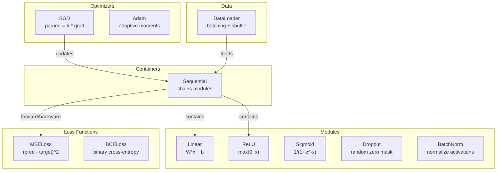
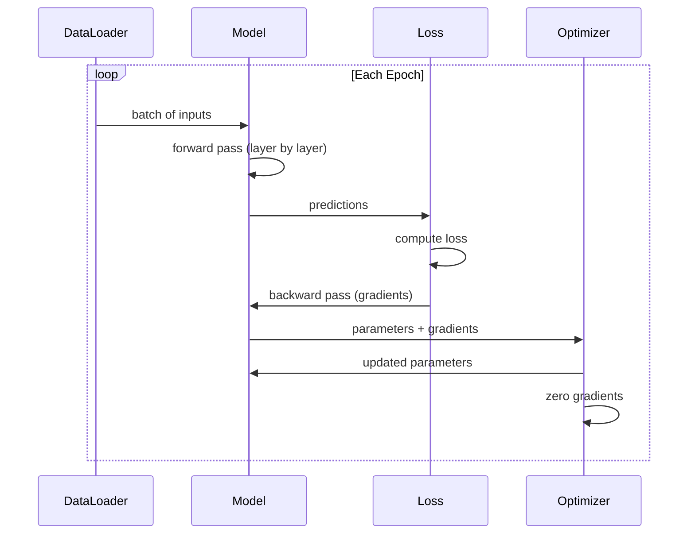
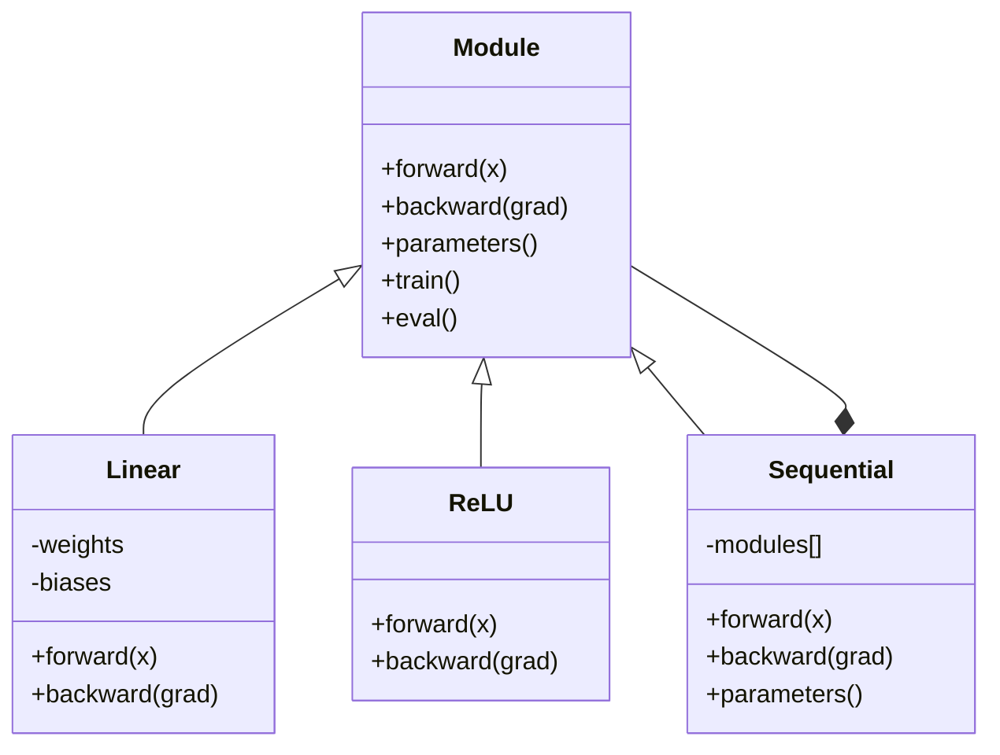

# Construye su propio mini marco.

> Has construido neuronas, capas, redes, retroactivación, activaciones, funciones de pérdida, optimizadores, regularización, inicialización y calendarios LR. Todo como piezas separadas. Ahora cableálas juntas en un marco. No PyTorch. No TensorFlow.

> **【中文解读】**En este contexto, el proyecto de PyTorch se centra en la concepción de todo el marco de trabajo de la plataforma.

**Type:** Build
**Languages:** Python
**Prerequisites:** All of Phase 03 (Lessons 01-09)
**Time:** ~120 minutes

## Objetivos de aprendizaje

- Construir un marco completo de aprendizaje profundo (~ 500 líneas) con módulo, lineal, ReLU, Sigmoid, Dropout, BatchNorm, Sequential, funciones de pérdida, optimizadores y DataLoader
- Explicar la abstracción del módulo (avance, retrocesión, parámetros) y por qué es necesario cambiar de modo tren/eval
- Enlazar todos los componentes en un bucle de entrenamiento de trabajo que entrenan una red de 4 capas en la clasificación de círculos
- Mapa de cada componente de su marco a su equivalente PyTorch (nn.Module, nn.Sequential, optim.Adam, DataLoader)

> **【中文解读】**Este capítulo es el capítulo 03 de la fase 03 de la fase 03 de la fase 03 de la fase 03 de la fase 03 de la fase 03 de la fase 03 de la fase 03 de la fase 03 de la fase 03 de la fase 03 de la fase 03 de la fase 03 de la fase 03 de la fase 03 de la fase 03 de la fase 03 de la fase 03 de la fase 03 de la fase 03 de la fase 03 de la fase 03 de la fase 03 de la fase 03 de la fase 03 de la fase 03 de la fase 03 de la fase 03 de la fase 03 de la fase 03 de la fase 03 de la fase 03 de la fase 03 de la fase 03 de la fase 03 de la fase 03 de la fase 03 de la fase 03 de la fase 5 de la fase 5 de la fase 5 de la fase 5 de la fase 5 de la fase 5 de la fase 5 de la fase 5 de la fase 5 de la fase 5 de la fase 5 de la fase 5 de la fase 5 de la fase 5 de la fase 5 de la fase 5 de la fase 5 de la fase 5 de la fase 5 de la fase 5 de la fase 5 de la fase 5 de la fase 5 de la fase 5 de la fase 5 de la fase 5 de la fase 5 de la fase 5 de la fase de la fase 5 de la fase 5 de la fase 5 de la fase de la fase 5 de la fase de la fase 5 de la fase de la fase de la fase 5 de la fase de la fase 5 de la fase de la fase de la fase de la fase de la fase de la fase de la fase de la fase de la fase de la fase de la fase de la fase de la fase de la fase de la fase de la fase de la fase de la fase de la fase de la fase de la fase de la fase de la fase de la fase de la fase de la fase de la fase de la fase de la fase de la fase de la fase de la fase de la fase de la fase de la fase de la fase de la fase de la fase de la fase de la fase de la fase de la fase de la fase de la fase de la fase de la fase de la fase de la fase de la fase de la fase de la fase de la fase de la fase de la fase de la fase de la fase de la fase de la fase de la fase de la fase de la fase de la fase de la fase de la fase de la

## El problema es la introducción del problema

Tienes diez lecciones de bloques de construcción repartidos en archivos separados.`Value`una clase aquí, un bucle de entrenamiento allí, inicialización de peso en otro archivo, horarios de tasa de aprendizaje en otro. para entrenar una red, copias y pegas de cinco lecciones diferentes y las conecta a mano.

> Tienes 10 clases de módulos de construcción que se dispersan en diferentes archivos.`Value`类, allí hay un ciclo de entrenamiento, otro de los documentos es el peso inicial, otro es la regulación de la tasa de aprendizaje.

Eso es lo que los frameworks resuelven. PyTorch te da`nn.Module`¿ Qué ?`nn.Sequential`¿ Qué ?`optim.Adam`¿ Qué ?`DataLoader`, y un patrón de bucle de entrenamiento que los une. TensorFlow te da`keras.Layer`¿ Qué ?`keras.Sequential`¿ Qué ?`keras.optimizers.Adam`No son magia, son patrones organizativos que permiten definir, entrenar y evaluar redes sin reinventar la tubería cada vez.

> Ese es el marco para resolver el problema.`nn.Module`¿Qué es esto?`nn.Sequential`¿Qué es esto?`optim.Adam`¿Qué es esto?`DataLoader`Y los pondrá en un ciclo de entrenamiento.`keras.Layer`¿Qué es esto?`keras.Sequential`¿Qué es esto?`keras.optimizers.Adam` Estas no son magia son modelos de organización, permiten definir entrenar y evaluar la red, sin tener que reinventar cada vez más las tuberías

Se va a construir lo mismo en ~500 líneas de Python. No numpy. No dependencias externas. Un marco que puede definir cualquier red de entrada, entrenarlo con SGD o Adam, lotar los datos, aplicar la normalización de abandono y lotes, utilizar cualquier activación, y programar la tasa de aprendizaje.

> Usted usará aproximadamente 500 行 Python para construir lo mismo. No se necesita numpy. No hay dependencias externas. Uno puede definir cualquier red anterior.

Cuando termine, entenderá exactamente lo que sucede cuando escribe.`model = nn.Sequential(...)`En PyTorch, usted entenderá por qué.`model.train()`y `model.eval()`¿Por qué no existe?`optimizer.zero_grad()`Usted entenderá todo, porque usted lo construyó todo.

> Después de terminar, entenderás completamente en PyTorch.`model = nn.Sequential(...)`Cuando haya pasado algo... entiendes por qué.`model.train()`Y `model.eval()`¿Por qué no?`optimizer.zero_grad()`Es un solo uso. Lo entenderás todo, porque tú mismo lo construiste.

> **【中文解读】**框架的核心价值:把散落的组件统一到一个接口下――Módulo es la base de todoLinear、ReLU、Dropout、BatchNorm 都是Modulo──Sequencial es el módulo de la combinación一堆Modulo 串起还是一个Modulo── esto es totalmente compatible con el diseño de PyTorch──

> **【拓展：PyTorch 框架的设计哲学】**El diseño central de PyTorch es sólo 5 conceptos: Tensor (DATA) ̊n.Module (Module) ̊ Autograd (Automatic) ̊Optimización (Optimización) ̊Optimización (Optimización) ̊Optimización (Optimización) ̊ DataLoader (DataLoader) ̊ Dataload) ̊n.

## El concepto central.

### El módulo de abstracción módulo                                                                                                                                                                                                                                                                                                                                                                                                                                                                                                                    

Cada capa en PyTorch hereda de `nn.Module`Un módulo tiene tres responsabilidades:

> PyTorch 中 每一层都继承自`nn.Module`◊ Un módulo tiene tres responsabilidades:

1. **forward()**-- calcular la salida de las entradas dadas
   **forward()**-- 给定输入计算输出
2. **parameters()**- devuelven todos los pesos entrenables
   **parameters()**--   regresar todo el entrenamiento
3. **backward()**-- gradientes de cálculo (se manejan por autograd en PyTorch, explícito en el nuestro)
   **backward()**-- 计算梯度(PyTorch 中由自动级 处理, nuestro marco en el que se necesita una implementación evidente)

Una capa lineal es un módulo. Una activación ReLU es un módulo. Una capa de abandono es un módulo. Una capa de normalización de lote es un módulo. Todos tienen la misma interfaz.

> La capa lineal es un módulo. ReLU 激活 es un módulo. La capa desplegable es un módulo. La capa batchNorm es un módulo.

### Contenedor secuencial Contenedor secuencial

`nn.Sequential`En el interior de la cadena, el módulo de entrada de datos se encuentra en el módulo 1, luego en el módulo 2, luego en el módulo 3.

> `nn.Sequential`将模块 串联起来──前向传播:数据流过模块 1、然后模块 2、然后模块 3──反向传播:反向遍历链──容器本身也是一个模块它有前 (),参数() 和后 (() ;;这是组合模式:模块序列本身也是一个模块──

> **【拓展：真实框架的额外功能】**Su pequeño marco cubre el concepto central de PyTorch, pero el verdadero marco también es: 1) autograd automático (auto-micro), 2) GPU 支持 (CUDA 内存管理和内存调度); 3) 分布式训练 (DDP, FSDP, DeepSpeed); 4) 混合精度训练 (AMP); 5) 模型序列化 (state_dict + save/load) ⋅ La base de códigos de PyTorch supera los 100 millones de líneas, pero el núcleo de abstracción es el que ha realizado estos 5 ⋅

### Entrenamiento vs. Modo de evaluación

La normalización de lote utiliza estadísticas de lote durante el entrenamiento pero promedios de ejecución durante la evaluación.`train()`y `eval()`Cada módulo tiene un módulo de control de la velocidad.`training`bandera.

> El abandono en el entrenamiento se pone a la vez en el núcleo, pero en la evaluación se pasa todo.`train()`Y `eval()`方法切换这个行为── cada módulo tiene una `training`标志──

### Optimizador   Optimizador

El optimizador actualiza los parámetros utilizando sus gradientes.`param -= lr * grad`Adam: mantiene estimaciones de impulso y variación, luego actualiza. El optimizador no sabe sobre la arquitectura de red, sólo ve una lista plana de parámetros y sus gradientes.

> 优化器用梯度更新参数──SGD:`param -= lr * grad`Adam:维护动量和方差估算后再更新──优化器不知道网络架构它只看到一个平面的参数列表和它们的梯度──

### DataLoader , cargador de datos

El batch es importante por dos razones: primero, no se puede colocar todo el conjunto de datos en la memoria para problemas grandes. segundo, el descenso de gradiente de minibatch proporciona ruido que ayuda a escapar de los mínimos locales.

> Por lo tanto, el volumen de los datos de los grandes grupos de datos no se deja registrar. El volumen de los mini-batches de los grupos de datos se reduce a un mínimo de valores.

> **【拓展：DataLoader 在大模型训练中的演进】**PyTorch's DataLoader es un único modelo. El equipo de datos de PyTorch necesita un equipo de datos distribuido.

### Arquitectura de marco



### El ciclo de entrenamiento.



### La jerarquía de módulos .



## Construye y realiza.

> **【中文解读】**Se trata de un sistema de datos que permite a los usuarios de PyTorch utilizar un sistema de datos de datos de forma que puedan obtener información sobre el sistema de datos de los usuarios de PyTorch.
```figure
gradient-clipping
```

## Construye el mismo

### Paso 1: Modulo de la clase base. Paso 1: Modulo de la clase base.

La interfaz abstracta que cada capa implementa.

> Cada uno de los niveles de realización de la interacción abstracta.

```python
class Module:
    def __init__(self):
        self.training = True

    def forward(self, x):
        raise NotImplementedError

    def backward(self, grad):
        raise NotImplementedError

    def parameters(self):
        return []

    def train(self):
        self.training = True

    def eval(self):
        self.training = False
```

### Paso 2: capa lineal. Paso 2: capa lineal.

El bloque de construcción fundamental. Almacena pesas y sesgos, calcula Wx + b hacia adelante y los gradientes de peso / entrada hacia atrás.

> 基本构建块──存储权重和偏置,前向计算 Wx + b,反向计算权重/输入梯度──

> Layer lineal es PyTorch`nn.Linear`La versión simplificada de la versión anterior:`sum(W[i][j] * x[j]) + b[i]`◊ Contrarrelación de la transmisión de la cadena de la ley:`grad[i] * input[j]`, el nivel de entrada es `grad[i] * W[i][j]`△ Nota fan_in 维度初始化用 Kaiming(`std = sqrt(2/fan_in)`), adaptado a la Ley de Derechos Humanos.

```python
import math
import random


class Linear(Module):
    def __init__(self, fan_in, fan_out):
        super().__init__()
        std = math.sqrt(2.0 / fan_in)
        self.weights = [[random.gauss(0, std) for _ in range(fan_in)] for _ in range(fan_out)]
        self.biases = [0.0] * fan_out
        self.weight_grads = [[0.0] * fan_in for _ in range(fan_out)]
        self.bias_grads = [0.0] * fan_out
        self.fan_in = fan_in
        self.fan_out = fan_out
        self.input = None

    def forward(self, x):
        self.input = x
        output = []
        for i in range(self.fan_out):
            val = self.biases[i]
            for j in range(self.fan_in):
                val += self.weights[i][j] * x[j]
            output.append(val)
        return output

    def backward(self, grad):
        input_grad = [0.0] * self.fan_in
        for i in range(self.fan_out):
            self.bias_grads[i] += grad[i]
            for j in range(self.fan_in):
                self.weight_grads[i][j] += grad[i] * self.input[j]
                input_grad[j] += grad[i] * self.weights[i][j]
        return input_grad

    def parameters(self):
        params = []
        for i in range(self.fan_out):
            for j in range(self.fan_in):
                params.append((self.weights, i, j, self.weight_grads))
            params.append((self.biases, i, None, self.bias_grads))
        return params
```

### Paso 3: módulos de activación.

ReLU, Sigmoid y Tanh como módulos, cada uno guarda lo que necesita para el pase hacia atrás.

> ReLU、Sigmoid 和 Tanh 作为模块──每个缓存反向传播所需的信息──

```python
class ReLU(Module):
    def __init__(self):
        super().__init__()
        self.mask = None

    def forward(self, x):
        self.mask = [1.0 if v > 0 else 0.0 for v in x]
        return [max(0.0, v) for v in x]

    def backward(self, grad):
        return [g * m for g, m in zip(grad, self.mask)]


class Sigmoid(Module):
    def __init__(self):
        super().__init__()
        self.output = None

    def forward(self, x):
        self.output = []
        for v in x:
            v = max(-500, min(500, v))
            self.output.append(1.0 / (1.0 + math.exp(-v)))
        return self.output

    def backward(self, grad):
        return [g * o * (1 - o) for g, o in zip(grad, self.output)]


class Tanh(Module):
    def __init__(self):
        super().__init__()
        self.output = None

    def forward(self, x):
        self.output = [math.tanh(v) for v in x]
        return self.output

    def backward(self, grad):
        return [g * (1 - o * o) for g, o in zip(grad, self.output)]
```

### Paso 4: Modulo de abandono.

Cero al azar elementos durante el entrenamiento. Escala los elementos restantes por 1/(1-p) así que los valores esperados permanecen iguales. No hace nada durante la evaluación.

> 訓練時随机将元素置零──按 1/(1-p) 缩放剩余元素,使期望值不变──评估时不做任何操作──

```python
class Dropout(Module):
    def __init__(self, p=0.5):
        super().__init__()
        self.p = p
        self.mask = None

    def forward(self, x):
        if not self.training:
            return x
        self.mask = [0.0 if random.random() < self.p else 1.0 / (1 - self.p) for _ in x]
        return [v * m for v, m in zip(x, self.mask)]

    def backward(self, grad):
        if self.mask is None:
            return grad
        return [g * m for g, m in zip(grad, self.mask)]
```

### Paso 5: Modulo BatchNorm.

Normaliza las activaciones a cero media y variación unitaria por característica en todo el lote.

> Se clasificará el valor de activación en valores de 0 y unidad de diferencia entre los lotes.

```python
class BatchNorm(Module):
    def __init__(self, size, momentum=0.1, eps=1e-5):
        super().__init__()
        self.size = size
        self.gamma = [1.0] * size
        self.beta = [0.0] * size
        self.gamma_grads = [0.0] * size
        self.beta_grads = [0.0] * size
        self.running_mean = [0.0] * size
        self.running_var = [1.0] * size
        self.momentum = momentum
        self.eps = eps
        self.x_norm = None
        self.std_inv = None
        self.batch_input = None

    def forward_batch(self, batch):
        batch_size = len(batch)
        output_batch = []

        if self.training:
            mean = [0.0] * self.size
            for sample in batch:
                for j in range(self.size):
                    mean[j] += sample[j]
            mean = [m / batch_size for m in mean]

            var = [0.0] * self.size
            for sample in batch:
                for j in range(self.size):
                    var[j] += (sample[j] - mean[j]) ** 2
            var = [v / batch_size for v in var]

            self.std_inv = [1.0 / math.sqrt(v + self.eps) for v in var]

            self.x_norm = []
            self.batch_input = batch
            for sample in batch:
                normed = [(sample[j] - mean[j]) * self.std_inv[j] for j in range(self.size)]
                self.x_norm.append(normed)
                output = [self.gamma[j] * normed[j] + self.beta[j] for j in range(self.size)]
                output_batch.append(output)

            for j in range(self.size):
                self.running_mean[j] = (1 - self.momentum) * self.running_mean[j] + self.momentum * mean[j]
                self.running_var[j] = (1 - self.momentum) * self.running_var[j] + self.momentum * var[j]
        else:
            std_inv = [1.0 / math.sqrt(v + self.eps) for v in self.running_var]
            for sample in batch:
                normed = [(sample[j] - self.running_mean[j]) * std_inv[j] for j in range(self.size)]
                output = [self.gamma[j] * normed[j] + self.beta[j] for j in range(self.size)]
                output_batch.append(output)

        return output_batch

    def forward(self, x):
        result = self.forward_batch([x])
        return result[0]

    def backward(self, grad):
        if self.x_norm is None:
            return grad
        for j in range(self.size):
            self.gamma_grads[j] += self.x_norm[0][j] * grad[j]
            self.beta_grads[j] += grad[j]
        return [grad[j] * self.gamma[j] * self.std_inv[j] for j in range(self.size)]

    def parameters(self):
        params = []
        for j in range(self.size):
            params.append((self.gamma, j, None, self.gamma_grads))
            params.append((self.beta, j, None, self.beta_grads))
        return params
```

### Paso 6: Contenedor secuencial.

Módulos de cadenas. adelante va de izquierda a derecha, hacia atrás va de derecha a izquierda.

> 串联模块──前向从左到右,反向从右到左──

> Secuencial 容器实现组合模式它本身是一个模块,但内部维护一个模块列表`train()`Y `eval()`递归调用每个子模块──`parameters()`聚合所有子模块的参数── esto es PyTorch `nn.Sequential`El objetivo principal de la investigación es lograr una mejor comprensión de la realidad.

```python
class Sequential(Module):
    def __init__(self, *modules):
        super().__init__()
        self.modules = list(modules)

    def forward(self, x):
        for module in self.modules:
            x = module.forward(x)
        return x

    def backward(self, grad):
        for module in reversed(self.modules):
            grad = module.backward(grad)
        return grad

    def parameters(self):
        params = []
        for module in self.modules:
            params.extend(module.parameters())
        return params

    def train(self):
        self.training = True
        for module in self.modules:
            module.train()

    def eval(self):
        self.training = False
        for module in self.modules:
            module.eval()
```

### Paso 7: Perdida de funciones. Paso 7: Perdida de funciones.

MSE y Binary Cross-Entropy. Cada uno devuelve el valor de pérdida y proporciona un retroceso que devuelve el gradiente.

> MSE 和二元交叉──每回损失值,并提供回归梯度的后退 () 方法──

> La función de pérdida es el punto de partida del ciclo de entrenamiento  contraversación de la difusión desde el nivel de la función de pérdida comienza.`2 * (pred - target) / n`,BCE de la escala es `(-target/p + (1-target)/(1-p)) / n`◊ nota BCE 中要使用eps 剪剪防止 log ((0) ⋅

```python
class MSELoss:
    def __call__(self, predicted, target):
        self.predicted = predicted
        self.target = target
        n = len(predicted)
        self.loss = sum((p - t) ** 2 for p, t in zip(predicted, target)) / n
        return self.loss

    def backward(self):
        n = len(self.predicted)
        return [2 * (p - t) / n for p, t in zip(self.predicted, self.target)]


class BCELoss:
    def __call__(self, predicted, target):
        self.predicted = predicted
        self.target = target
        eps = 1e-7
        n = len(predicted)
        self.loss = 0
        for p, t in zip(predicted, target):
            p = max(eps, min(1 - eps, p))
            self.loss += -(t * math.log(p) + (1 - t) * math.log(1 - p))
        self.loss /= n
        return self.loss

    def backward(self):
        eps = 1e-7
        n = len(self.predicted)
        grads = []
        for p, t in zip(self.predicted, self.target):
            p = max(eps, min(1 - eps, p))
            grads.append((-t / p + (1 - t) / (1 - p)) / n)
        return grads
```

### Paso 8: SGD y Adam Optimizers.

Ambos toman una lista de parámetros y actualizan los pesos utilizando gradientes.

> 两者都收录参数列表,使用梯度更新权重──

> SGD 简单:参数 -= 学习率 × 梯度。Adam 维护一阶矩 m 和二阶矩 v,加上偏差修正(前几步梯度估计有偏差), efecto en la mayoría de las tareas es superior a SGD。AdamW 在Adam 基础加解权重衰减──参数列表中的每个元素是 (容器, i, j, 梯度容器) 四组,j=None元表示偏置(一维)。

```python
class SGD:
    def __init__(self, parameters, lr=0.01):
        self.params = parameters
        self.lr = lr

    def step(self):
        for container, i, j, grad_container in self.params:
            if j is not None:
                container[i][j] -= self.lr * grad_container[i][j]
            else:
                container[i] -= self.lr * grad_container[i]

    def zero_grad(self):
        for container, i, j, grad_container in self.params:
            if j is not None:
                grad_container[i][j] = 0.0
            else:
                grad_container[i] = 0.0


class Adam:
    def __init__(self, parameters, lr=0.001, beta1=0.9, beta2=0.999, eps=1e-8):
        self.params = parameters
        self.lr = lr
        self.beta1 = beta1
        self.beta2 = beta2
        self.eps = eps
        self.t = 0
        self.m = [0.0] * len(parameters)
        self.v = [0.0] * len(parameters)

    def step(self):
        self.t += 1
        for idx, (container, i, j, grad_container) in enumerate(self.params):
            if j is not None:
                g = grad_container[i][j]
            else:
                g = grad_container[i]

            self.m[idx] = self.beta1 * self.m[idx] + (1 - self.beta1) * g
            self.v[idx] = self.beta2 * self.v[idx] + (1 - self.beta2) * g * g

            m_hat = self.m[idx] / (1 - self.beta1 ** self.t)
            v_hat = self.v[idx] / (1 - self.beta2 ** self.t)

            update = self.lr * m_hat / (math.sqrt(v_hat) + self.eps)

            if j is not None:
                container[i][j] -= update
            else:
                container[i] -= update

    def zero_grad(self):
        for container, i, j, grad_container in self.params:
            if j is not None:
                grad_container[i][j] = 0.0
            else:
                grad_container[i] = 0.0
```

### Paso 9: DataLoader.

Divide los datos en lotes, opcionalmente mezcla cada época.

> Los datos se dividen en grupos, elegibles para cada época.

```python
class DataLoader:
    def __init__(self, data, batch_size=32, shuffle=True):
        self.data = data
        self.batch_size = batch_size
        self.shuffle = shuffle

    def __iter__(self):
        indices = list(range(len(self.data)))
        if self.shuffle:
            random.shuffle(indices)
        for start in range(0, len(indices), self.batch_size):
            batch_indices = indices[start:start + self.batch_size]
            batch = [self.data[i] for i in batch_indices]
            inputs = [item[0] for item in batch]
            targets = [item[1] for item in batch]
            yield inputs, targets

    def __len__(self):
        return (len(self.data) + self.batch_size - 1) // self.batch_size
```

### Paso 10: Entrenamiento de una red de 4 capas en la clasificación de círculos.

Define un modelo, elige una pérdida, elige un optimizador, ejecuta el ciclo de entrenamiento.

> Para ello, el sistema de cálculo de la función de pérdida de datos debe ser el siguiente:

> 训练循环的标准模式: cada época 遍历所有批次中:(1) cero_grad 清零梯度;(2) adelante 前向计算预测;(3) 计算损失;(4) hacia atrás 反向传播梯度;(5) optimizer.step() 更新参数。圆形分类任务:点是 (x, y),标签是 x2+y2<1.5 → 1,否则 0。

```python
def make_circle_data(n=500, seed=42):
    random.seed(seed)
    data = []
    for _ in range(n):
        x = random.uniform(-2, 2)
        y = random.uniform(-2, 2)
        label = 1.0 if x * x + y * y < 1.5 else 0.0
        data.append(([x, y], [label]))
    return data


def train():
    random.seed(42)

    model = Sequential(
        Linear(2, 16),
        ReLU(),
        Linear(16, 16),
        ReLU(),
        Linear(16, 8),
        ReLU(),
        Linear(8, 1),
        Sigmoid(),
    )

    criterion = BCELoss()
    optimizer = Adam(model.parameters(), lr=0.01)

    data = make_circle_data(500)
    split = int(len(data) * 0.8)
    train_data = data[:split]
    test_data = data[split:]

    loader = DataLoader(train_data, batch_size=16, shuffle=True)

    model.train()

    for epoch in range(100):
        total_loss = 0
        total_correct = 0
        total_samples = 0

        for batch_inputs, batch_targets in loader:
            batch_loss = 0
            for x, t in zip(batch_inputs, batch_targets):
                pred = model.forward(x)
                loss = criterion(pred, t)
                batch_loss += loss

                optimizer.zero_grad()
                grad = criterion.backward()
                model.backward(grad)
                optimizer.step()

                predicted_class = 1.0 if pred[0] >= 0.5 else 0.0
                if predicted_class == t[0]:
                    total_correct += 1
                total_samples += 1

            total_loss += batch_loss

        avg_loss = total_loss / total_samples
        accuracy = total_correct / total_samples * 100

        if epoch % 10 == 0 or epoch == 99:
            print(f"Epoch {epoch:3d} | Loss: {avg_loss:.6f} | Train Accuracy: {accuracy:.1f}%")

    model.eval()
    correct = 0
    for x, t in test_data:
        pred = model.forward(x)
        predicted_class = 1.0 if pred[0] >= 0.5 else 0.0
        if predicted_class == t[0]:
            correct += 1
    test_accuracy = correct / len(test_data) * 100
    print(f"\nTest Accuracy: {test_accuracy:.1f}% ({correct}/{len(test_data)})")

    return model, test_accuracy
```

## Usalo con el marco de ejecución

> **【中文解读】**La siguiente estructura de PyTorch 代码和你的迷你框架结构完全一致:Sequencial、Linear、ReLU、Sigmoid、BCELoss、Adam、zero_grad、backward、step、train、eval──La única diferencia es que PyTorch utiliza autograd automático de cálculo gradiente, mientras que usted necesita escribir de la mano hacia atrás()。

Aquí está el equivalente PyTorch de lo que acabas de construir:

> A continuación se muestra la implementación de PyTorch en el marco que acaba de construir:

> PyTorch de `nn.Sequential`¿Qué es esto?`nn.Linear`¿Qué es esto?`nn.ReLU`¿Qué es esto?`nn.Sigmoid`¿Qué es esto?`nn.BCELoss`¿Qué es esto?`torch.optim.Adam`La diferencia más grande es que PyTorch utiliza autograd automático de cálculo de gradiente (no necesitas escribir de la mano hacia atrás), y soporta GPU y la precisión de la mezcla.

```python
import torch
import torch.nn as nn
from torch.utils.data import DataLoader, TensorDataset

model = nn.Sequential(
    nn.Linear(2, 16),
    nn.ReLU(),
    nn.Linear(16, 16),
    nn.ReLU(),
    nn.Linear(16, 8),
    nn.ReLU(),
    nn.Linear(8, 1),
    nn.Sigmoid(),
)

criterion = nn.BCELoss()
optimizer = torch.optim.Adam(model.parameters(), lr=0.01)

for epoch in range(100):
    model.train()
    for inputs, targets in dataloader:
        optimizer.zero_grad()
        predictions = model(inputs)
        loss = criterion(predictions, targets)
        loss.backward()
        optimizer.step()

    model.eval()
    with torch.no_grad():
        test_predictions = model(test_inputs)
```

La estructura es idéntica.`Sequential`¿ Qué ?`Linear`¿ Qué ?`ReLU`¿ Qué ?`Sigmoid`¿ Qué ?`BCELoss`¿ Qué ?`Adam`¿ Qué ?`zero_grad`¿ Qué ?`backward`¿ Qué ?`step`¿ Qué ?`train`¿ Qué ?`eval`Cada concepto se mapea uno a uno. La diferencia es que PyTorch maneja automáticamente el autogrado (no es necesario implementar hacia atrás) en cada módulo, se ejecuta en GPU, y ha sido optimizado durante años.

> La estructura es igual.`Sequential`¿Qué es esto?`Linear`¿Qué es esto?`ReLU`¿Qué es esto?`Sigmoid`¿Qué es esto?`BCELoss`¿Qué es esto?`Adam`¿Qué es esto?`zero_grad`¿Qué es esto?`backward`¿Qué es esto?`step`¿Qué es esto?`train`¿Qué es esto?`eval` Cada concepto se adapta a la misma configuración de la CPU.

Ahora, cuando ves el código PyTorch, sabes exactamente lo que está sucediendo en cada línea.

> Ahora cuando ves el código PyTorch, sabes con certeza lo que pasó en cada línea.

## Envíe el producto .

Esta lección produce:
- `outputs/prompt-framework-architect.md`-- un prompt para diseñar arquitecturas de redes neuronales utilizando abstracciones de marcos

> 本课产 出:`outputs/prompt-framework-architect.md`- un uso de marco de diseño abstracto de la estructura de la red neuronal

> Esta sugerencia se dirige a la LLM según las características de la tarea (enlace dimensiones, output types, data quantity) para que se pueda recomendar una estructura de red adecuada para cada nivel, con qué activar, con qué aumentar el Dropout/BatchNorm, con qué perder y optimizar.

## Los ejercicios.

1. Añadir un`SoftmaxCrossEntropyLoss`Softmax las predicciones, calcular la pérdida de entropía cruzada y manejar el pase hacia atrás combinado.

   1. 添加                                                                                                                                                                                                                                                                                                                                                                                                                                                                                                                           `SoftmaxCrossEntropyLoss`类用于多类──对预测做软max,计算交叉损失,处理组合反向传播──在 3 类螺旋数据集上测试──

2. Implementar la programación de la tasa de aprendizaje en el optimizador: añadir un `set_lr()`El método y el cable en el calendario cosino de la lección 09. Entrenar el clasificador de círculos con calentamiento + cosino y comparar con LR constante.

   2. En optimización de la tasa de aprendizaje de la aplicación: añadir `set_lr()`方法,接入第9 课的余弦调度──用热升+余弦训练圆形分类器,与恒定 LR对比──

3. Añadir un`save()`y `load()`Se puede verificar si un modelo cargado produce las mismas predicciones que el original.

   3. 给 secuenciales `save()`Y `load()`方法,把所有权重序列化到JSON文件并加载回来──验证加载的模型产生和原模型相同的预测──

4. Implemente la desintegración de peso (regularización L2) en el optimizador Adam.`weight_decay`Parámetro que reduce los pesos hacia cero cada paso.

   4. En el sistema de la humanidad, el peso de la humanidad se reduce.`weight_decay`参数, cada paso, el peso se reduce a cero.

5. Reemplazar el bucle de entrenamiento por muestra con una acumulación adecuada de gradientes mini-parcela: acumula los gradientes en todas las muestras de un lote, luego divida por tamaño del lote y haga un paso optimizador.

   5. Utilice el verdadero mini-batch 梯度累积替换每样本训练循环: en un lote acumula todos los niveles de muestras, luego se divide en lote de tamaño, hacer un paso de optimización en el proceso.

## Términos clave .

| Term | What people say | What it actually means |
|------|----------------|----------------------|
| Module | "A layer" | The base abstraction in a framework -- anything with forward(), backward(), and parameters() |
| Sequential | "Stack layers in order" | A container that chains modules, applying them in sequence for forward and reverse for backward |
| Forward pass | "Run the network" | Computing the output by passing input through each module in order |
| Backward pass | "Compute gradients" | Propagating the loss gradient through each module in reverse to compute parameter gradients |
| Parameters | "The trainable weights" | All values in the network that the optimizer can update -- weights and biases |
| Optimizer | "The thing that updates weights" | An algorithm that uses gradients to update parameters, implementing SGD, Adam, or other rules |
| DataLoader | "The thing that feeds data" | An iterator that splits a dataset into batches, optionally shuffling between epochs |
| Training mode | "model.train()" | A flag that enables stochastic behavior like dropout and batch normalization with batch stats |
| Evaluation mode | "model.eval()" | A flag that disables dropout and uses running statistics for batch normalization |
| Zero grad | "Clear the gradients" | Resetting all parameter gradients to zero before computing the next batch's gradients |

| 术语 | 俗称 | 实际含义 |
|------|------|---------|
| Module / 模块 | "一层" | 框架中的基础抽象——任何有 forward()、backward()、parameters() 的对象 |
| Sequential / 顺序容器 | "按顺序叠层" | 一个把模块串联起来的容器，前向按顺序、反向按逆序 |
| Forward pass / 前向传播 | "跑网络" | 把输入依次通过每个模块计算输出 |
| Backward pass / 反向传播 | "算梯度" | 把损失梯度反向通过每个模块计算参数梯度 |
| Parameters / 参数 | "可训练权重" | 网络中优化器能更新的所有值——权重和偏置 |
| Optimizer / 优化器 | "更新权重的东西" | 用梯度更新参数的算法，实现 SGD、Adam 或其他规则 |
| DataLoader / 数据加载器 | "喂数据的东西" | 把数据集切成批次的迭代器，可选地在 epoch 间打乱 |
| Training mode / 训练模式 | "model.train()" | 启用 Dropout、BN 用 batch 统计等随机行为的标志 |
| Evaluation mode / 评估模式 | "model.eval()" | 关闭 Dropout、BN 用运行统计量的标志 |
| Zero grad / 清零梯度 | "清掉梯度" | 在计算下一批梯度前把所有参数梯度重置为零 |

## Más Leer más Leer más

- Paszke et al., "PyTorch: Un estilo imperativo, de alto rendimiento de la biblioteca de aprendizaje profundo" (2019) -- el documento que describe las decisiones de diseño de PyTorch
  Paszke 等人,PyTorch: un estilo de orden de alto rendimiento profundidad de aprendizaje (2019) Describir PyTorch  diseño de decisiones
- Chollet, "Deep Learning with Python, Second Edition" (2021) -- Capítulo 3 abarca las partes internas de Keras con la misma abstracción de módulos/capas
  Chollet,Python profundidad de aprendizaje Segunda edición (2021) 3o capítuloUses the same模块/层抽象讲解 Keras 内部机制
- Johnson, "Tiny-DNN" (https://github.com/tiny-dnn/tiny-dnn) -- un marco de aprendizaje profundo de C++ con cabeceras solamente para comprender los elementos internos del marco
  Johnson,Tiny-DNN un documento puro C++ marco de aprendizaje profundo, para entender el mecanismo interno del marco
