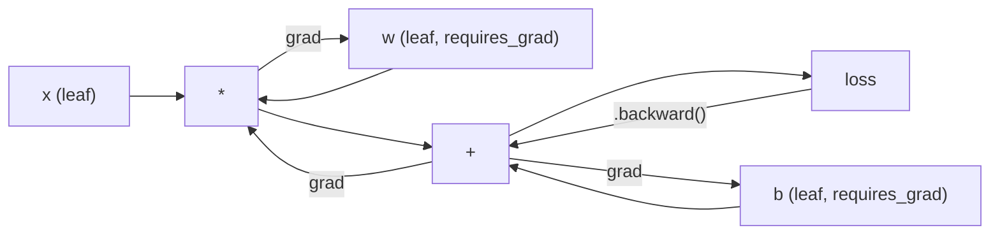
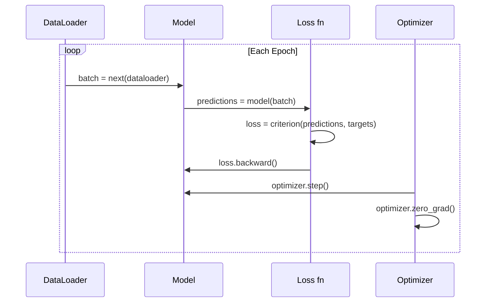

# Introducción a PyTorch PyTorch entrada

> Construiste el motor con pistones y eje de remolque.

> **【中文解读】**Usted desde zero construyó todos los componentes de la red nerviosa. Ahora se está utilizando el marco:PyTorch.

**Type:** Build
**Languages:** Python
**Prerequisites:** Lesson 03.10 (Build Your Own Mini Framework)
**Time:** ~75 minutes

## Objetivos de aprendizaje

- Construir y entrenar redes neuronales utilizando el nn.Module, nn.Sequencial y autograd de PyTorch
- Utilice los tensores PyTorch, la aceleración de la GPU y el bucle de entrenamiento estándar (zero_grad, hacia adelante, pérdida, retrocesión, paso)
- Convierta sus componentes de mini marco desde cero a sus equivalentes PyTorch
- Perfil y compara la velocidad de entrenamiento entre su marco de Python puro y PyTorch en la misma tarea

> **【中文解读】**本章 从迷你框架过渡到 PyTorch──核心对应关系:Module → nn.Module、手写倒退() → autograd、Python 循环 → GPU 并行──你已经在第10 课中理解底层原理,现在学习工业级实现──

## El problema es la introducción del problema

Tiene un mini marco de trabajo. capas lineales, ReLU, desfase, norma de lote, Adam, un DataLoader, un bucle de entrenamiento. Entrena una red de 4 capas en un problema de clasificación de círculos en Python puro.

> Tienes un marco de miniatura disponible. Layer Linear, ReLU, drop-out, batch integration, Adam, DataLoader, training cycle.

También es 500 veces más lento que PyTorch en el mismo problema.

> Pero es 500 veces más lento que PyTorch en el mismo problema.

Su mini marco procesa una muestra a la vez con bucles Python en un nido. PyTorch envía las mismas operaciones a kernels C++/CUDA optimizados que se ejecutan en GPU. En una sola NVIDIA A100, PyTorch entrena un ResNet-50 (25,6M parámetros) en ImageNet (1.28M imágenes) en aproximadamente 6 horas. Su marco tomaría aproximadamente 3.000 horas para la misma tarea - si no se agotara de memoria primero.

> Su mini framework utiliza un ciclo de procesamiento de Python de los emplazamientos. PyTorch distribuirá la misma operación a la GPU para optimizar su funcionamiento en C++/CUDA.

La velocidad no es la única brecha. Su marco no tiene soporte de GPU. No hay diferenciación automática - usted escribió a mano hacia atrás) para cada módulo. No serialización. No entrenamiento distribuido. No precisión mixta. No hay manera de deshacer el flujo de gradiente sin declaraciones de impresión.

> 速度不是唯一的差距――你的框架没有 GPU 支持――没有自动微分你为每块块手写回后的()――没有序列化――没有分布式训练――没有混合精度――没有不用打印语句就能调试梯度流的方法――

PyTorch llena cada uno de estos vacíos. Y lo hace manteniendo el mismo modelo mental que ya construyó: módulo, adelante(), parámetros(), hacia atrás(), optimizador. paso(). Los conceptos se transfieren uno a uno. La sintaxis es casi idéntica. La diferencia es que PyTorch envuelve una década de ingeniería de sistemas detrás de la misma interfaz que diseñó desde cero.

> PyTorch completó todas estas brechas. También mantiene el mismo modelo de mentalidad que usted ya ha construido: módulo, adelante, parámetros, retroceder, optimizar, paso, etc. La diferencia es que PyTorch está en el mismo interfaz que usted desde el diseño de zéro, en el que se envasó un sistema de diez años.

> **【中文解读】**Su miniatura de marco es 500 veces más lenta que PyTorch 慢 500 倍因为Python 循环个个处理样本,而 PyTorch utiliza C++/CUDA 内核并行处理。A100 上训练ResNet-50只需6小时,你的框架需要3000小时──但两者的心智模型完全一致:模块、前进、后退、优化器.步骤()──

> **【拓展：PyTorch 为什么赢了 TensorFlow】**En 2017, PyTorch  publicó, TensorFlow  ocupó el 80% de la cuota de mercado. Pero la ejecución de PyTorch pronto ejecutó) hacer que el desarrollo de la prueba y el prototipo fuera de TF 1.x 简单图.

## El concepto central.

## El concepto central.

### ¿Por qué PyTorch ganó PyTorch por qué ganó?

En 2015, TensorFlow requirió que definías un gráfico de computación estática antes de ejecutar cualquier cosa. Construiste el gráfico, lo compilaste, luego lo alimentaste con datos. Desarmar significaba mirar visualizaciones de gráficos. Cambiar la arquitectura significaba reconstruir el gráfico desde cero.

> En 2015, TensorFlow  requiere que definas un gráfico de cálculo en estado antes de ejecutar cualquier cosa.

PyTorch se lanzó en 2017 con una filosofía diferente: ejecución ansiosa. Escribir Python. Se ejecuta de inmediato. `y = model(x)`en realidad calcula y ahora, no "agrega un nodo a un gráfico que calculará y más tarde". Esto significaba que las herramientas de depuración estándar de Python funcionaron.

> PyTorch en 2017 lanzado, adoptó una filosofía diferente:`y = model(x)`Ahora está calculado y, en lugar de "añadir un poco más tarde calcular y de los puntos hasta la imagen"― esto significa estándar Python 调试工具可用──print() 可用──pdb可用──forward pass 中的 if/else可用──

Para 2020, el mercado había hablado. La participación de PyTorch en los artículos de investigación ML pasó del 7% (2017) a más del 75% (2022). Meta, Google DeepMind, OpenAI, Anthropic y Hugging Face todos usan PyTorch como su marco principal. TensorFlow 2.x adoptó una ejecución ansiosa en respuesta - admisión tácita de que el diseño de PyTorch era correcto.

> Para el año 2020, el mercado ha dado la respuesta. La participación de PyTorch en los trabajos de investigación en ML aumentó del 7% en 2017 a más del 75% en 2022.

La lección: los desarrolladores experimentan compuestos. Un marco que es 10% más lento pero 50% más rápido para deshacerse gana cada vez.

> El desarrollo de experiencias se acumula un poco más de un 10% pero el desarrollo de un poco más de un 50% de un marco de desarrollo ganará cada vez más.

### Tensores de presión

Un tensor es una matriz multidimensional con tres propiedades críticas: forma, dtype y dispositivo.

> 张量是具有三个关键属性多维数组:形状、数据类型和设备──

```python
import torch

x = torch.zeros(3, 4)           # shape: (3, 4), dtype: float32, device: cpu
x = torch.randn(2, 3, 224, 224) # batch of 2 RGB images, 224x224
x = torch.tensor([1, 2, 3])     # from a Python list
```

**Shape**Es la dimensionalidad. Un escalar es la forma (), un vector es (n), una matriz es (m, n), un lote de imágenes es (parce, canales, altura, ancho).

> **Shape**Es la forma de la dimensión de la información, la forma de la muestra es (), la forma de la muestra es (n), la matriz es (m, n), la cantidad de imágenes es (batch, canales, altura, ancho)

**Dtype**controla la precisión y la memoria.

> **Dtype**Control de la precisión y la memoria.

| dtype | Bits | Range | Use case |
|-------|------|-------|----------|
| float32 | 32 | ~7 decimal digits | Default training |
| float16 | 16 | ~3.3 decimal digits | Mixed precision |
| bfloat16 | 16 | Same range as float32, less precision | LLM training |
| int8 | 8 | -128 to 127 | Quantized inference |

**Device**determina dónde ocurre el cálculo.

> **Device**Decide cuál es el resultado.

```python
device = torch.device("cuda" if torch.cuda.is_available() else "cpu")
x = torch.randn(3, 4, device=device)
x = x.to("cuda")
x = x.cpu()
```

Cada operación requiere todos los tensores en el mismo dispositivo. Este es el error número 1 PyTorch principiantes golpear: `RuntimeError: Expected all tensors to be on the same device`Lo arreglaremos moviendo todo al mismo dispositivo antes de la computación.

> Cada operación requiere que todos los equipos estén en el mismo equipo. Este es el primer error de PyTorch que se encuentra con un principiante.`RuntimeError: Expected all tensors to be on the same device`En el cálculo anterior todo el contenido se trasladará al mismo dispositivo es reparable

**Reshaping**es tiempo constante, cambia los metadatos, no los datos.

> **重塑**Es un tiempo de operación habitual que cambia los datos, no cambia los datos.

```python
x = torch.randn(2, 3, 4)
x.view(2, 12)      # reshape to (2, 12) -- must be contiguous
x.reshape(6, 4)    # reshape to (6, 4) -- works always
x.permute(2, 0, 1) # reorder dimensions
x.unsqueeze(0)     # add dimension: (1, 2, 3, 4)
x.squeeze()        # remove size-1 dimensions
```

### Autogradado por su propia cuenta.

El mini marco requiere que se implemente hacia atrás para cada módulo. PyTorch no lo hace. Graba cada operación en tensores en un gráfico acíclico dirigido (el gráfico computacional) y luego atraviesa ese gráfico hacia atrás para calcular los gradientes automáticamente.

> Su miniatura de marco requiere que usted realice cada módulo hacia atrás.



La diferencia clave de su marco: PyTorch utiliza auto-difusión basada en cinta.`.backward()`repite la cinta al revés.

> La diferencia clave entre el PyTorch y el PyTorch es que durante la transmisión de la máquina, cada operación se añade a una "mágina" en la que se utiliza.`.backward()`En el sentido contrario de la carga magnética.

```python
x = torch.randn(3, requires_grad=True)
y = x ** 2 + 3 * x
z = y.sum()
z.backward()
print(x.grad)  # dz/dx = 2x + 3
```

Tres reglas de autograd:

> Autograd 的三条规则:

1. Sólo tensores de hoja con `requires_grad=True`gradientes acumulados
   Sólo se ha puesto en marcha.`requires_grad=True`La cantidad de la superficie de la tierra se acumula
2. Los gradientes se acumulan por defecto ... llamada `optimizer.zero_grad()`antes de cada paso hacia atrás
   La forma de la información que se puede obtener en el sitio web es la siguiente:`optimizer.zero_grad()`
3. `torch.no_grad()`desactivar el seguimiento de gradientes (uso durante la evaluación)
   En inglés:`torch.no_grad()`禁用梯度追踪 (también conocido como "también conocido como "también conocido como "también conocido como "también conocido como "también conocido como "también conocido como "también conocido como "también conocido como "también conocido como "también conocido como "también conocido como "también conocido como "también conocido como "también conocido como "también conocido como "también conocido como "también conocido como "también conocido "también conocido "también conocido como "también conocido "también conocido "también conocido "también conocido "también conocido "también conocido "también como "también conocido "también conocido "también conocido "también conocido "también como "también conocido "también conocido "también conocido "también conocido "también como "también conocido "también conocido "también conocido "también "también conocido "también conocido "también "también conocido "también "también conocido "también "también "también conocido "también "también conocido "también "también "también "

> **【拓展：混合精度训练如何加速】**La potencia de la flota A100/H10016 吞吐量是 float32 的 2-4 倍──PyTorch 的 `torch.amp.autocast`Automáticamente se ejecutará la matriz multiplicada y volúculada en float16, manteniendo al mismo tiempo la suavidad y pérdida en float32──combinante con GradScaler  Prevenir float16 梯度下溢──Llama 3                                                                                                                                                                                                                                                                                                                                                                                                                                                                

### No. Modulo                                                                                                                                                                                                                                                                                                                                                                                                                                                                                                                          

`nn.Module`La versión de PyTorch añade registro automático de parámetros, descubrimiento de módulos recursivos, gestión de dispositivos y serialización de dictado de estado.

> `nn.Module`Es la base de cada componente de red neuronal en PyTorch. Ya en la 10a clase se ha construido este abstracto. La versión de PyTorch ha aumentado el registro automático de parámetros, el descubrimiento de módulos de regreso, la gestión de dispositivos y la secuenciación de estados.

```python
import torch.nn as nn

class MLP(nn.Module):
    def __init__(self, input_dim, hidden_dim, output_dim):
        super().__init__()
        self.layer1 = nn.Linear(input_dim, hidden_dim)
        self.relu = nn.ReLU()
        self.layer2 = nn.Linear(hidden_dim, output_dim)

    def forward(self, x):
        x = self.layer1(x)
        x = self.relu(x)
        x = self.layer2(x)
        return x
```

Cuando usted asigna un`nn.Module`o `nn.Parameter`como un atributo en `__init__`PyTorch lo registra automáticamente.`model.parameters()`Esto es por lo que nunca tienes que recoger pesas manualmente como lo hiciste en el mini marco.

> Cuando estás en`__init__`El jefe`nn.Module`O `nn.Parameter`Cuando se le otorga el valor, PyTorch se registra automáticamente.`model.parameters()` Recupera los parámetros de cada registro.  Por eso nunca necesitarás el derecho de recopilación manual como en el marco de miniatura.

Los elementos clave de la construcción:

> 关键构建块:

| Module | What it does | Parameters |
|--------|-------------|------------|
| nn.Linear(in, out) | Wx + b | in*out + out |
| nn.Conv2d(in_ch, out_ch, k) | 2D convolution | in_ch*out_ch*k*k + out_ch |
| nn.BatchNorm1d(features) | Normalize activations | 2 * features |
| nn.Dropout(p) | Random zeroing | 0 |
| nn.ReLU() | max(0, x) | 0 |
| nn.GELU() | Gaussian error linear | 0 |
| nn.Embedding(vocab, dim) | Lookup table | vocab * dim |
| nn.LayerNorm(dim) | Per-sample normalization | 2 * dim |

### Funciones perdidas y optimizadores.

PyTorch envía versiones listas para producción de todo lo que construiste.

> PyTorch ofrece una versión productiva de todas las funciones que construye.

**Loss functions**(de `torch.nn`):

> **损失函数**(de la`torch.nn`):

| Loss | Task | Input |
|------|------|-------|
| nn.MSELoss() | Regression | Any shape |
| nn.CrossEntropyLoss() | Multi-class classification | Logits (not softmax) |
| nn.BCEWithLogitsLoss() | Binary classification | Logits (not sigmoid) |
| nn.L1Loss() | Regression (robust) | Any shape |
| nn.CTCLoss() | Sequence alignment | Log probabilities |

Nota: `CrossEntropyLoss`combinaciones `LogSoftmax`¿ Qué es eso ?`NLLLoss`En el caso de los datos de la base de datos, el resultado de la base de datos es el de la base de datos de la base de datos.

> Nota:`CrossEntropyLoss`内部组合了                                                                                                                                                                                                                                                                                                                                                                                                                                                                                                                         `LogSoftmax`¿ Qué es eso ?`NLLLoss` Introducir logits originales, no transmitir softmax 输出── es un error común, se producirá un error de gradiente─

**Optimizers**(de `torch.optim`):

> **优化器**(de la`torch.optim`):

| Optimizer | When to use | Typical LR |
|-----------|-------------|-----------|
| SGD(params, lr, momentum) | CNNs, well-tuned pipelines | 0.01--0.1 |
| Adam(params, lr) | Default starting point | 1e-3 |
| AdamW(params, lr, weight_decay) | Transformers, fine-tuning | 1e-4--1e-3 |
| LBFGS(params) | Small-scale, second-order | 1.0 |

### El ciclo de entrenamiento.

Cada ciclo de entrenamiento PyTorch sigue el mismo patrón de 5 pasos.

> Cada ciclo de entrenamiento de PyTorch sigue el mismo modelo de 5 pasos. Ya has aprendido en la 10a clase.



El patrón canónico:

> 标准模式:

```python
for epoch in range(num_epochs):
    model.train()
    for inputs, targets in train_loader:
        inputs, targets = inputs.to(device), targets.to(device)
        optimizer.zero_grad()
        outputs = model(inputs)
        loss = criterion(outputs, targets)
        loss.backward()
        optimizer.step()
```

Cinco líneas dentro del bucle de lote. Cinco líneas que entrenaron GPT-4, Difusión estable, y LLaMA. La arquitectura cambia. Los datos cambian. Estas cinco líneas no lo hacen.

> 批量循环内五行代码―― entrenó GPT-4、Stable Diffusion 和 LLaMA de cinco行代码── arquitectura cambiará──数据 cambiará── 这五行不变──

### Dataset y DataLoader

El de PyTorch.`Dataset`es una clase abstracta con dos métodos: `__len__`y `__getitem__`- ¿ Qué ?`DataLoader`lo envuelve con batching, mezclado y carga de datos de múltiples procesos.

> PyTorch de `Dataset`Es un tipo de abstracción, hay dos métodos:`__len__`Y `__getitem__`¿Qué es eso?`DataLoader`Con el procesamiento en serie, el desorden y los procesos de datos, el cargamento y el empaquetado.

```python
from torch.utils.data import Dataset, DataLoader

class MNISTDataset(Dataset):
    def __init__(self, images, labels):
        self.images = images
        self.labels = labels

    def __len__(self):
        return len(self.labels)

    def __getitem__(self, idx):
        return self.images[idx], self.labels[idx]

loader = DataLoader(dataset, batch_size=64, shuffle=True, num_workers=4)
```

`num_workers=4`La GPU se alimenta en el lote actual, lo que permite a los procesadores cargar datos en paralelo con 4 procesos.

> `num_workers=4` producir 4 procesos y cargar datos, mientras que la GPU en los lotes actuales de entrenamiento.

### Entrenamiento de GPU Entrenamiento de GPU

Mover un modelo a la GPU:

> Se moverá el modelo a la GPU:

```python
device = torch.device("cuda" if torch.cuda.is_available() else "cpu")
model = model.to(device)
```

Esto desplaza recursivamente cada parámetro y buffer a la GPU.

> El regreso se moverá cada parámetro y la zona de caufraje a la GPU. Luego durante el entrenamiento se moverá cada lote:

```python
inputs, targets = inputs.to(device), targets.to(device)
```

**Mixed precision**redujera a la mitad el uso de memoria y duplica el rendimiento en las GPU modernas (A100, H100, RTX 4090) corriendo hacia adelante/hacia atrás en float16 manteniendo los pesos principales en float32:

> **混合精度**通过在 float16 中运行前向/反向传播,同时保持主权重在 float32 中,在现代 GPU(A100、H100、RTX 4090) 上将内存使用减半,吞吐量翻倍:

```python
from torch.amp import autocast, GradScaler

scaler = GradScaler()
for inputs, targets in loader:
    with autocast(device_type="cuda"):
        outputs = model(inputs)
        loss = criterion(outputs, targets)
    scaler.scale(loss).backward()
    scaler.step(optimizer)
    scaler.update()
    optimizer.zero_grad()
```

### Comparación: Mini Framework vs PyTorch vs JAX

| Feature | Mini Framework (L10) | PyTorch | JAX |
|---------|---------------------|---------|-----|
| Autodiff | Manual backward() | Tape-based autograd | Functional transforms |
| Execution | Eager (Python loops) | Eager (C++ kernels) | Traced + JIT compiled |
| GPU support | No | Yes (CUDA, ROCm, MPS) | Yes (CUDA, TPU) |
| Speed (MNIST MLP) | ~300s/epoch | ~0.5s/epoch | ~0.3s/epoch |
| Module system | Custom Module class | nn.Module | Stateless functions (Flax/Equinox) |
| Debugging | print() | print(), pdb, breakpoint() | Harder (JIT tracing breaks print) |
| Ecosystem | None | Hugging Face, Lightning, timm | Flax, Optax, Orbax |
| Learning curve | You built it | Moderate | Steep (functional paradigm) |
| Production use | Toy problems | Meta, OpenAI, Anthropic, HF | Google DeepMind, Midjourney |

## Construye y realiza.

> **【中文解读】**Se trata de un proyecto de investigación que se desarrolla en el campo de la información y la información, que se desarrolla en el campo de la información y la información.
```figure
dropout-mask
```

## Construye el mismo

Una MLP de 3 capas entrenada en el MNIST usando sólo PyTorch primitivos.`torchvision.datasets`Descargamos y analizamos los datos sin procesar nosotros mismos.

> Utiliza pure PyTorch Original Language Training de 3 niveles MLP hacer MNIST 分类── no hay un alto contenido── no hay `torchvision.datasets`◊ Nosotros mismos descargar y analizar datos originales

### Paso 1: Cargar MNIST de archivos en bruto . Paso 1: Cargar MNIST desde el archivo original

MNIST se envía como 4 archivos gzip: imágenes de entrenamiento (60.000 x 28 x 28), etiquetas de entrenamiento, imágenes de prueba (10.000 x 28 x 28), etiquetas de prueba.

> MNIST 以 4 个 gzip 文件提供: entrenamiento图像(60,000 x 28 x 28) ✓ entrenamiento etiquetado、测试图像(10,000 x 28 x 28) ✓ pruebas etiquetado──我们下载它们并解析二进制格式──

```python
import torch
import torch.nn as nn
import struct
import gzip
import urllib.request
import os

def download_mnist(path="./mnist_data"):
    base_url = "https://storage.googleapis.com/cvdf-datasets/mnist/"
    files = [
        "train-images-idx3-ubyte.gz",
        "train-labels-idx1-ubyte.gz",
        "t10k-images-idx3-ubyte.gz",
        "t10k-labels-idx1-ubyte.gz",
    ]
    os.makedirs(path, exist_ok=True)
    for f in files:
        filepath = os.path.join(path, f)
        if not os.path.exists(filepath):
            urllib.request.urlretrieve(base_url + f, filepath)

def load_images(filepath):
    with gzip.open(filepath, "rb") as f:
        magic, num, rows, cols = struct.unpack(">IIII", f.read(16))
        data = f.read()
        images = torch.frombuffer(bytearray(data), dtype=torch.uint8)
        images = images.reshape(num, rows * cols).float() / 255.0
    return images

def load_labels(filepath):
    with gzip.open(filepath, "rb") as f:
        magic, num = struct.unpack(">II", f.read(8))
        data = f.read()
        labels = torch.frombuffer(bytearray(data), dtype=torch.uint8).long()
    return labels
```

### Paso 2: Definir el modelo. Paso 2: Definir el modelo.

Una MLP de 3 capas: 784 -> 256 -> 128 -> 10. Actividades de ReLU. Descanso para regularización. No hay norma de lote para mantenerlo simple.

> Una 3 Layer MLP:784 -> 256 -> 128 -> 10。ReLU 激活──Dropout 正则化──为简单起见不用BatchNorm──

```python
class MNISTModel(nn.Module):
    def __init__(self):
        super().__init__()
        self.net = nn.Sequential(
            nn.Linear(784, 256),
            nn.ReLU(),
            nn.Dropout(0.2),
            nn.Linear(256, 128),
            nn.ReLU(),
            nn.Dropout(0.2),
            nn.Linear(128, 10),
        )

    def forward(self, x):
        return self.net(x)
```

La capa de salida produce 10 logits crudos (uno por dígito).`CrossEntropyLoss`maneja eso internamente.

> 输出层产生 10 个原始logits(cada uno) ―― no necesita softmax`CrossEntropyLoss`内部处理──

El número de parámetros: 784*256 + 256 + 256*128 + 128 + 128*10 + 10 = 235.146.

> 参数:784*256 + 256 + 256*128 + 128 + 128*10 + 10 = 235.146。 según el estándar moderno muy pequeño。 GPT-2 pequeño tiene 124M。 éste en unos segundos se puede entrenar completo。

### Paso 3: Ciclo de entrenamiento.

El patrón canónico de pasos adelante-perdida-retrocés.

> 標準的前進-損失-後進步模式 ‧

```python
def train_one_epoch(model, loader, criterion, optimizer, device):
    model.train()
    total_loss = 0
    correct = 0
    total = 0
    for images, labels in loader:
        images, labels = images.to(device), labels.to(device)
        optimizer.zero_grad()
        outputs = model(images)
        loss = criterion(outputs, labels)
        loss.backward()
        optimizer.step()
        total_loss += loss.item() * images.size(0)
        _, predicted = outputs.max(1)
        correct += predicted.eq(labels).sum().item()
        total += labels.size(0)
    return total_loss / total, correct / total


def evaluate(model, loader, criterion, device):
    model.eval()
    total_loss = 0
    correct = 0
    total = 0
    with torch.no_grad():
        for images, labels in loader:
            images, labels = images.to(device), labels.to(device)
            outputs = model(images)
            loss = criterion(outputs, labels)
            total_loss += loss.item() * images.size(0)
            _, predicted = outputs.max(1)
            correct += predicted.eq(labels).sum().item()
            total += labels.size(0)
    return total_loss / total, correct / total
```

Nota `torch.no_grad()`Esto desactiva el autogrado, reduciendo el uso de memoria y acelerando la inferencia.

> Atención al tiempo de evaluación`torch.no_grad()`¡No tiene autograd, reduce el uso de memoria y acelera la idea!¡No tiene, PyTorch construirá un cuadro de cálculo que nunca usará!

### Paso 4: Conectar todo juntos.

```python
def main():
    device = torch.device("cuda" if torch.cuda.is_available() else "cpu")

    download_mnist()
    train_images = load_images("./mnist_data/train-images-idx3-ubyte.gz")
    train_labels = load_labels("./mnist_data/train-labels-idx1-ubyte.gz")
    test_images = load_images("./mnist_data/t10k-images-idx3-ubyte.gz")
    test_labels = load_labels("./mnist_data/t10k-labels-idx1-ubyte.gz")

    train_dataset = torch.utils.data.TensorDataset(train_images, train_labels)
    test_dataset = torch.utils.data.TensorDataset(test_images, test_labels)
    train_loader = torch.utils.data.DataLoader(
        train_dataset, batch_size=64, shuffle=True
    )
    test_loader = torch.utils.data.DataLoader(
        test_dataset, batch_size=256, shuffle=False
    )

    model = MNISTModel().to(device)
    criterion = nn.CrossEntropyLoss()
    optimizer = torch.optim.Adam(model.parameters(), lr=1e-3)

    num_params = sum(p.numel() for p in model.parameters())
    print(f"Device: {device}")
    print(f"Parameters: {num_params:,}")
    print(f"Train samples: {len(train_dataset):,}")
    print(f"Test samples: {len(test_dataset):,}")
    print()

    for epoch in range(10):
        train_loss, train_acc = train_one_epoch(
            model, train_loader, criterion, optimizer, device
        )
        test_loss, test_acc = evaluate(
            model, test_loader, criterion, device
        )
        print(
            f"Epoch {epoch+1:2d} | "
            f"Train Loss: {train_loss:.4f} | Train Acc: {train_acc:.4f} | "
            f"Test Loss: {test_loss:.4f} | Test Acc: {test_acc:.4f}"
        )

    torch.save(model.state_dict(), "mnist_mlp.pt")
    print(f"\nModel saved to mnist_mlp.pt")
    print(f"Final test accuracy: {test_acc:.4f}")
```

Producción esperada después de 10 épocas: ~ 97,8% de precisión de prueba. Tiempo de entrenamiento en CPU: ~ 30 segundos. En GPU: ~ 5 segundos. En su mini marco con la misma arquitectura: ~ 45 minutos.

> 10 个时代 后预期输出:~97.8% 测试准确率──CPU 训练时间:~30 秒──GPU:~5 秒──用迷你框架相同架构:~45 分钟──

> **【拓展：从 MNIST 到大模型】**MNIST MLP 只有235K 参数──现代模型的规模:GPT-2 pequeño 124M、BERT-base 110M、Llama 3 8B──参数增长 ~1000x,但训练循环的五步模式完全不变──区别在:数据并行(多 GPU)、模型并行(单 GPU 放不下)、梯度检查点(节省显存)、混合精度(加速计算)──这些都是 PyTorch 生态系统的一部分──

## Usalo con el marco de ejecución

> **【中文解读】**迷你框架和 PyTorch的接口几乎一致──关键区别:PyTorch utiliza autograd 自动微分(不需要手写倒后((、支持 GPU(model.to("cuda")) 、支持混合精度训练──保存模型用 state_dict() (可移植的参数字典),不要直接化模型对象──

### Comparación rápida: Mini Framework vs PyTorch 快速对比:迷你框架 vs PyTorch

| Mini Framework (Lesson 10) | PyTorch |
|---------------------------|---------|
| `model = Sequential(Linear(784, 256), ReLU(), ...)` | `model = nn.Sequential(nn.Linear(784, 256), nn.ReLU(), ...)` |
| `pred = model.forward(x)` | `pred = model(x)` |
| `optimizer.zero_grad()` | `optimizer.zero_grad()` |
| `grad = criterion.backward()` then `model.backward(grad)` | `loss.backward()` |
| `optimizer.step()` | `optimizer.step()` |
| No GPU | `model.to("cuda")` |
| Manual backward for every module | Autograd handles everything |

La interfaz es casi idéntica, la diferencia es que todo está bajo el capó.

> La diferencia está en todo lo de abajo.

### Salvando y cargando modelos  Salvando y cargando modelos

```python
torch.save(model.state_dict(), "model.pt")

model = MNISTModel()
model.load_state_dict(torch.load("model.pt", weights_only=True))
model.eval()
```

Siempre ahorrar .`state_dict()`El objeto modelo se salva con el pickle, que se rompe cuando se refacta el código.

> 始终保存   siempre en el tiempo`state_dict()`(参数字典), en lugar de modelos objetos.

### Aplicando el programa de tasas de aprendizaje

```python
scheduler = torch.optim.lr_scheduler.CosineAnnealingLR(
    optimizer, T_max=10
)
for epoch in range(10):
    train_one_epoch(model, train_loader, criterion, optimizer, device)
    scheduler.step()
```

PyTorch envía más de 15 programadores: StepLR, ExponentialLR, CosineAnnealingLR, OneCycleLR, ReduceLROnPlateau. Todos conectados a la misma interfaz de optimización.

> PyTorch  proporciona 15+ tipos de módulos:StepLR,ExponencialLR,CosineAnnealingLR,OneCycleLR,ReduceLROnPlateau, todos ellos están conectados a la misma plataforma de conexión.

## Envíe el producto .

Esta lección produce dos artefactos:

> Este curso se desarrolla en dos documentos:

- `outputs/prompt-pytorch-debugger.md`-- una instrucción para diagnosticar fallas comunes en el entrenamiento PyTorch
  En inglés:`outputs/prompt-pytorch-debugger.md`- 诊断常见 PyTorch 训练故障的提示词
- `outputs/skill-pytorch-patterns.md`-- una referencia de habilidades para los patrones de formación PyTorch
  En inglés:`outputs/skill-pytorch-patterns.md`- PyTorch  entrenamiento de modelos de habilidades referencia

## Los ejercicios.

1. **Add batch normalization.**Insertar `nn.BatchNorm1d`Después de cada capa lineal (antes de la activación). Comparar la precisión de prueba y la velocidad de entrenamiento con la versión de abandono.

2. **Implement a learning rate finder.**Entrenamiento durante una época con un aumento exponencial de la tasa de aprendizaje (de 1e-7 a 1.0). pérdida de tramo vs LR. La LR óptima es justo antes de que la pérdida comience a subir.

3. **Port to GPU with mixed precision.**Añadir`torch.amp.autocast`y `GradScaler`En un A100, espere un aumento de velocidad de ~2x.

4. **Build a custom Dataset.**Descargar Fashion-MNIST (el mismo formato que MNIST pero con artículos de ropa).`FashionMNISTDataset(Dataset)`clase con `__getitem__`y `__len__`Entrenemos la misma MLP y comparamos la precisión.

5. **Replace Adam with SGD + momentum.**Trene con `SGD(params, lr=0.01, momentum=0.9)`Comparar las curvas de convergencia. Luego añadir un`CosineAnnealingLR`programador y ver si SGD alcanza a Adam en la época 10.

## Términos clave .

| Term | What people say | What it actually means |
|------|----------------|----------------------|
| Tensor | "A multi-dimensional array" | A typed, device-aware array with automatic differentiation support baked into every operation |
| Autograd | "Automatic backprop" | A tape-based system that records operations during forward pass, then replays them in reverse to compute exact gradients |
| nn.Module | "A layer" | The base class for any differentiable computation block -- registers parameters, supports nesting, handles train/eval modes |
| state_dict | "The model weights" | An OrderedDict mapping parameter names to tensors -- the portable, serializable representation of a trained model |
| .backward() | "Compute gradients" | Traverse the computational graph in reverse, computing and accumulating gradients for every leaf tensor with requires_grad=True |
| .to(device) | "Move to GPU" | Recursively transfer all parameters and buffers to the specified device (CPU, CUDA, MPS) |
| DataLoader | "The data pipeline" | An iterator that batches, shuffles, and optionally parallelizes data loading from a Dataset |
| Mixed precision | "Use float16" | Train with float16 forward/backward for speed while keeping float32 master weights for numerical stability |
| Eager execution | "Run it now" | Operations execute immediately when called, not deferred to a later compilation step -- the core design choice that differentiates PyTorch from TF 1.x |
| zero_grad | "Reset gradients" | Set all parameter gradients to zero before the next backward pass, since PyTorch accumulates gradients by default |

## Más Leer más Leer más

- Paszke et al., "PyTorch: Un estilo imperativo, biblioteca de aprendizaje profundo de alto rendimiento" (2019) -- el artículo original que explica las compensaciones de diseño de PyTorch
  Paszke 等人,PyTorch: un estilo de orden de alto rendimiento profundidad de aprendizaje (2019) Explicar PyTorch  diseño de peso original论文
- Tutoriales PyTorch: "Aprender PyTorch con ejemplos" (https://pytorch.org/tutorials/beginner/pytorch_with_examples.html) -- el camino oficial desde los tensores hasta el módulo nn.
  PyTorch enseñanza: con ejemplos aprender PyTorch de张量 a nn.Module
- Guía de ajuste de rendimiento PyTorch (https://pytorch.org/tutorials/recipes/recipes/tuning_guide.html) -- precisión mixta, trabajadores de DataLoader, memoria fija y otras optimizaciones de producción
  PyTorch  rendimiento                                                                                                                                                                                                                                                                                                                                                                                                                                                                                                                       
- Horace He, "Hacer que el aprendizaje profundo se haga brrrr" (https://horace.io/brrr_intro.html) -- por qué el entrenamiento de GPU es rápido, con estrategias de optimización específicas de PyTorch
  Horace He, 让深度学习飞速运行为什么GPU 训练快, así como PyTorch 特定优化策略
