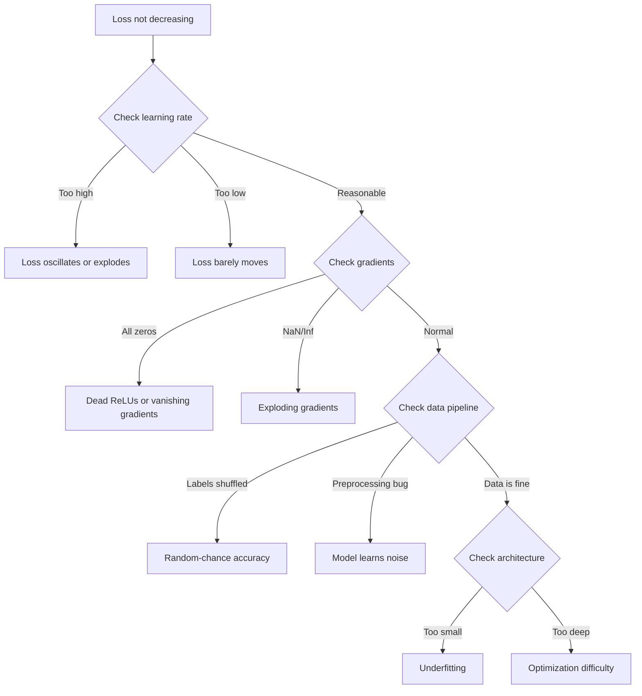
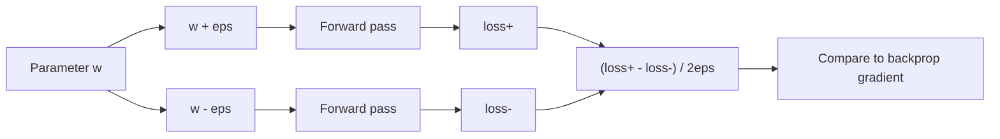
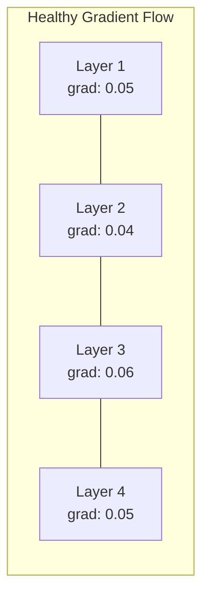
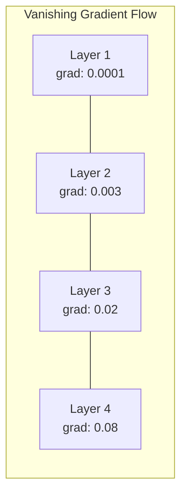
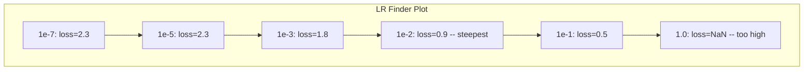

# Desarreglar las redes neuronales

> Tu red se compila. Se ejecutó. Produjo un número. El número es incorrecto y nada se estrelló. Bienvenido al tipo más difícil de depuración - el tipo donde no hay mensaje de error.

> **【中文解读】**网络编译了、运行了、输出了数字但数字是错误的,没有报错信息――这是最难调试:没有错信息――本章系统介绍深度学习的调试方法论:过拟合单批 → 检查梯度 → 追踪数值稳定性 → 诊断学习率问题――

**Type:** Practice
**Type:** Build
**Languages:** Python, PyTorch
**Prerequisites:** Phase 03 Lessons 01-10 (especially backpropagation, loss functions, optimizers)
**Time:** ~90 minutes

## Objetivos de aprendizaje

- Diagnóstico de fallas comunes de la red neuronal (pérdida de NaN, curva de pérdida plana, sobreajuste, oscilación) utilizando estrategias de depuración sistemática
- Aplique la técnica de "overfit one batch" para verificar que la arquitectura del modelo y el ciclo de entrenamiento son correctos
- Inspeccionar las magnitudes de los gradientes, las distribuciones de activación y las normas de peso para identificar los problemas de los gradientes que desaparecen/explotan
- Construir una lista de verificación de descomposición que cubra la tubería de datos, la arquitectura del modelo, la función de pérdida, el optimizador y los problemas de tasa de aprendizaje

> **【中文解读】**En el capítulo de investigación, el programa de investigación de la Universidad de California, San Diego, se desarrolló para el estudio de la investigación de la investigación de la investigación de la investigación de la investigación de la investigación de la investigación de la investigación de la investigación de la investigación de la investigación de la investigación de la investigación de la investigación de la investigación de la investigación de la investigación de la investigación de la investigación de la investigación de la investigación de la investigación de la investigación de la investigación de la investigación de la investigación de la investigación de la investigación de la investigación de la investigación de la investigación de la investigación de la investigación de la investigación de la investigación de la investigación de la investigación de la investigación de la investigación de la investigación de la investigación de la investigación de la investigación de la investigación de la investigación de la investigación de la investigación de la investigación de la investigación de la investigación de la investigación de la investigación de la investigación de la investigación de la investigación de la investigación de la investigación de la investigación de la investigación de la investigación de la investigación de la investigación de la investigación de la investigación de la investigación de la investigación de la investigación de la investigación de la investigación de la investigación de la investigación de la investigación de la investigación de la investigación de la investigación de la investigación de la investigación de la investigación de la investigación de la investigación de la investigación de la investigación de la investigación de la investigación de la investigación de la investigación de la investigación de la investigación de la investigación de la investigación de la investigación de la investigación de la investigación de la investigación de la investigación de la investigación de la investigación de la investigación de la investigación de la investigación de la investigación de la investigación de la investigación de la investigación de la investigación de la investigación de la investigación de la investigación de la investigación de la investigación de la investigación de la investigación de la investigación de los científicos de la investigación de los científicos de la Universidad de California, que se encuentra en el estudio de la investigación de la investigación de la investigación de la investigación de la investigación de la investigación de la investigación de la investigación de la investigación de la investigación de la investigación de la investigación de la investigación de la investigación de la investigación de la investigación de la investigación de la investigación de la investigación de la investigación de la investigación de la investigación sobre la investigación de la investigación sobre la investigación de la investigación sobre la investigación sobre la investigación de la investigación sobre la investigación sobre la investigación de la investigación sobre la investigación de la investigación sobre la ciencia sobre la ciencia sobre la ciencia sobre la ciencia sobre la ciencia sobre la ciencia sobre la ciencia sobre

## El problema es la introducción del problema

Un software tradicional se estrella cuando está roto. Un puntero nulo lanza una excepción. Una falta de coincidencia de tipo falla en el momento de compilar. Un error de uno por uno produce una salida claramente incorrecta.

> 传统软件在出问题时会崩──空指针抛出异常──类型不匹配在编译时失败──差一错产生的明显错误输出──

Las redes neuronales no te dan ese lujo.

> La red nerviosa no te dará este lujo.

Una red neuronal rota se ejecuta hasta la finalización, imprime un valor de pérdida y saca predicciones. La pérdida podría disminuir. Las predicciones podrían parecer plausibles. Pero el modelo está silenciosamente equivocado: aprender atajos, memorizar ruido o converger a un mínimo local inútil. Los investigadores de Google estiman que el 60-70% del tiempo de depuración de ML se gasta en errores "silenciosos" que no producen errores sino que degradan la calidad del modelo.

> Una red neuronal problemática puede funcionar hasta que se complete, imprima pérdida de valor, saca un pronóstico. La pérdida puede estar en baja baja. El pronóstico puede parecer razonable. Pero el modelo está en el error de aprendizaje de caminos, ruidos de memoria o recibe un valor mínimo local inútil. Los investigadores de Google estiman que el 60-70% del tiempo de prueba de ML se pasa en el error de "silencia".

La diferencia entre un modelo de trabajo y uno roto es a menudo una sola línea extraviada: una falta `zero_grad()`, una dimensión transpuesta, una tasa de aprendizaje de 10x. La canónica "Recepta para el entrenamiento de redes neuronales" (2019) se abre con esto: "Los errores de red neuronal más comunes son errores que no se estrellan".

> La diferencia entre modelos usables y modelos dañados suele ser sólo una línea de código de posición equivocada: falta.`zero_grad()`、维度转置错误、学习率差 10 倍──经典的"训练神经网络的方法"(2019) 开头写道:"Los errores de la red neuronal más comunes son errores que no se derrumban"".

Esta lección te enseña a encontrar esos insectos.

> Este curso te enseña cómo encontrar estos insectos.

> **【中文解读】**El software tradicional tiene un claro error de señal ()  ()  ()  ()  ()  ()  ()  ()  ()  ()  ()  ()  ()  ()  ()  ()  ()  ()  ()  ()  ()  ()  ()  ()  ()  ()  ()  ()  ()  ()  ()  ()  ()  ()  ()  ()  ()  ()  ()  ()  ()  ()  ()  ()  ()  ()  ()  ()  ()  ()  ()  ()  ()  ()  ( ()  ()  ()  ()  ()  ()  ()  ()  ()  ()  ()  ()  ()  ()  ()  ()  ()  ()  ()  ()  ()  ()  ()  ()  ()  ()  ()  ()  () )  ()  ()  ()  ()  ()  ()  ()  () )  ()  ( () )  ()  ()  ()  ()  ()

> **【拓展：大模型训练中的调试】** entrenar Llama 3 405B este tipo de modelo(16384 bloques H100,30.8M GPU 小时), una vez entrenar fracasó de costos de hasta varios millones de dólares.

## El concepto central.

### La mentalidad de desactivación.

Olvídate de la depuración de impresión y pray. La depuración de redes neuronales requiere un enfoque sistemático porque el bucle de retroalimentación es lento (de minutos a horas por carrera de entrenamiento) y los síntomas son ambigüos (la mala pérdida podría significar 20 cosas diferentes).

> 忘记打印和试调――Neural network调试需要系统化方法,因为反循环很慢, cada entrenamiento se lleva a cabo de unos minutos a unos horas, y los síntomas se amontonan, y la pérdida de diferencias puede significar 20 tipos diferentes de problemas.

La regla de oro:**start simple, add complexity one piece at a time, and verify each piece independently.**

> 黄金法则:**从简单开始，一次只加一个复杂度，独立验证每个组件。**

> **【中文解读】**调试神经网络的黄金法则: Comenzando con la situación más simple, cada vez sólo añade un componente, prueba independiente cada componente― no primero para correr el entrenamiento completo primero para asegurar que el modelo pueda adaptarse en un solo lote hasta la pérdida≈0, luego para expandirlo gradualmente―



### Síndrome 1: pérdida no disminuye Síndrome 1: pérdida no disminuye

La formación se ejecuta, las épocas pasan y la pérdida se mantiene plana o oscila salvajemente.

> Es el más común que se queja. El ciclo de entrenamiento se corre, una época pasa de una a otra, pero la pérdida se inmuta o se agita.

**Wrong learning rate.**Para Adam, comience en 1e-3. Para SGD, comience en 1e-1 o 1e-2. Siempre pruebe 3 tasas de aprendizaje que abarcan 10 veces cada una (por ejemplo, 1e-2, 1e-3, 1e-4) antes de concluir que algo más está mal.

> **学习率错误。**太高:loss 振荡或跳到NaN──太低:loss 下降得太慢,看起来像不动──Adam 从1e-3 开始──SGD 从1e-1 或1e-2 开始──在下结论说有其他问题之前,先尝试3个学习率(相差10倍,如1e-2、1e-3、1e-4)──

**Dead ReLUs.**Si una neurona ReLU recibe una entrada negativa grande, sale a 0 y su gradiente es 0. Nunca se activa de nuevo. Si mueren suficientes neuronas, la red no puede aprender.

> **死亡 ReLU。**Si el neurón ReLU recibe una entrada negativa grande, se produce 0, gradiente también 0, nunca volverá a activarse. Si el neurón muere es suficiente, la red comienza a aprender y no llega a nada.

**Vanishing gradients.**En redes profundas con activaciones sigmoides o tanh, los gradientes se reducen exponencialmente a medida que se propagan hacia atrás. Cuando alcanzan la primera capa, son ~0. Las primeras capas dejan de aprender.

> **梯度消失。**En la red de nivel profundo activada con sigmoides o tanh, el gradiente en contra de la transmisión se reduce en el índice de escala.

**Exploding gradients.**El problema opuesto - los gradientes crecen exponencialmente. común en RNNs y redes muy profundas. la pérdida salta a NaN.`torch.nn.utils.clip_grad_norm_`), disminuir la tasa de aprendizaje o agregar la normalización.

> **梯度爆炸。**Por el contrario, el problema es que el índice de gradiente aumenta.`torch.nn.utils.clip_grad_norm_`•• disminuir la tasa de aprendizaje o añadir a la formación en la formación.

### Síndrome 2: pérdida disminuye pero el modelo es malo.

La pérdida disminuye, la precisión del entrenamiento alcanza el 99%, pero la precisión de las pruebas es del 55% o el modelo produce resultados sin sentido en datos reales.

> Perdida en la baja. La tasa de precisión del entrenamiento alcanza el 99%. Pero la tasa de precisión del test es sólo el 55%. O el modelo en datos reales produce resultados sin sentido.

**Overfitting.**El modelo memoriza datos de entrenamiento en lugar de patrones de aprendizaje. La brecha entre el entrenamiento y la pérdida de validación crece con el tiempo.

> **过拟合。**模型在背诵训练数据而不是学习规律── training loss和验证 loss 之间的差距随着时间的增长──修复:更多数据、Dropout、权重减、早停、数据增强──

**Data leakage.**Los datos de prueba se filtraron en el entrenamiento. La precisión es sospechosamente alta. Causas comunes: mezcla antes de dividir, preprocesamiento con estadísticas del conjunto completo de datos, muestras duplicadas a través de divisiones.

> **数据泄漏。**测试数据混入了训练――准确率高可可疑――常见原因:划分前先打乱、 hacer preprocesamiento con la estadística de todo el conjunto de datos、跨划分的重复样本──修复:先划分再预处理、检查重复──

**Label errors.**El modelo aprende el ruido. Corrección: utiliza aprendizaje seguro para encontrar y corregir ejemplos mal etiquetados, o use truncation de pérdida para ignorar muestras de alta pérdida.

> **标签错误。**La mayoría de los datos reales se centran en el 5-10% de los datos de los usuarios.

### Sinfoma 3: pérdida de NaN o Inf en pérdida

El valor de pérdida se convierte en`nan`o `inf`El entrenamiento está muerto.

> La pérdida se transforma en valor`nan`O `inf`¿Qué es eso?

**Learning rate too high.**Las actualizaciones de gradiente se sobrepasan hasta el punto de que los pesos explotan.

> **学习率太高。**梯度更新过冲到权重爆炸──修复: disminuye 10 veces──

**log(0) or log(negative).**Computación de pérdidas de entropía cruzada `log(p)`Si su modelo sale exactamente 0 o una probabilidad negativa, el registro explotará.`[eps, 1-eps]`donde`eps=1e-7`¿ Qué ?

> **log(0) 或 log(负数)。**交叉损失计算                                                                                                                                                                                                                                                                                                                                                                                                                                                                                                                       `log(p)` Si el modelo de salida es de 0 o de probabilidad negativa, el log se explotará `[eps, 1-eps]`, entre ellos `eps=1e-7`¿Qué es eso?

**Division by zero.**La normalización de lote se divide por desviación estándar. Un lote con valores constantes tiene std=0.

> **除以零。**批归一化要除以标准差──一个常数值的批的 std=0──修复:分母加 epsilon(PyTorch 默认这样做,但自定义实现可能没有)──

**Numerical overflow.**Grandes activaciones alimentadas en `exp()`Se puede calcular el valor máximo de la suma de la suma de la suma de la suma de la suma de la suma de la suma de la suma de la suma de la suma de la suma de la suma de la suma de la suma de la suma de la suma de la suma de la suma de la suma de la suma de la suma de la suma de la suma de la suma de la suma de la suma de la suma de la suma de la suma de la suma de la suma de la suma de la suma de la suma de la suma de la suma de la suma de la suma de la suma de la suma de la suma de la suma de la suma de la suma de la suma de la suma de la suma de la suma de la suma de la suma de la suma de la suma de la suma de la suma de la suma de la suma de la suma de la suma de la suma de la suma de la suma de la suma de la suma de la suma de la suma de la suma de la suma de la suma de la suma de la suma de la suma de la suma de la suma de la suma de la suma de la suma de la suma de la suma de la suma de la suma de la suma de la suma de la suma de la suma de la suma de la suma de la suma de la suma de la suma de la suma de la suma de la suma de la suma de la suma de la suma de la suma de la suma de la suma de la suma de la suma de la suma de la suma de la suma de la suma de la suma de la suma de la suma de la suma de la suma de la suma de la suma de la suma de la suma de la suma de la suma de la suma de la suma de la suma de la suma de la suma de la suma de la suma de la suma de la suma de la suma de la suma de la suma de la suma de los dos.

> **数值溢出。**Importar el valor activado`exp()`Se puede obtener un valor de la cantidad de datos de la información de la información.

### Técnica 1: Control gradual. Técnica 1: Control de grado.

Comparar los gradientes analíticos (de backprop) con los gradientes numéricos (de diferencias finitas).

> Comparar tu gradiente de resolución (de la dirección contraria) y el gradiente de valores (de la dirección contraria) si las dos no coinciden, tu gradiente de dirección contraria tiene un error.

Gradiente numérico para el parámetro `w`¿Qué es esto ?

> 参数                      `w`de la escala de valores:

```
grad_numerical = (loss(w + eps) - loss(w - eps)) / (2 * eps)
```

Metrica de acuerdo (diferencia relativa):

> Un homogeneidad de la medida de la diferencia:

```
rel_diff = |grad_analytical - grad_numerical| / max(|grad_analytical|, |grad_numerical|, 1e-8)
```

Si ...`rel_diff < 1e-5`: correcto. si`rel_diff > 1e-3`Es casi seguro que es un insecto.

> Si es que`rel_diff < 1e-5`Si es cierto.`rel_diff > 1e-3`Hay un error.



### Técnica 2: Estadísticas de activación Técnica 2: activación de estadísticas

Monitorear la media y la desviación estándar de las activaciones después de cada capa durante el entrenamiento.

>                                                                                                                                                                                                                                                               

| Health indicator | Mean | Std | Diagnosis |
|-----------------|------|-----|-----------|
| Healthy | ~0 | ~1 | Network is learning normally |
| Saturated | >>0 or <<0 | ~0 | Activations stuck at extreme values |
| Dead | 0 | 0 | Neurons are dead (all zeros) |
| Exploding | >>10 | >>10 | Activations growing without bound |

| 健康指标 | 均值 | 标准差 | 诊断 |
|---------|------|--------|------|
| 健康 | ~0 | ~1 | 网络正常学习中 |
| 饱和 | >>0 或 <<0 | ~0 | 激活卡在极端值 |
| 死亡 | 0 | 0 | 神经元死了（全零） |
| 爆炸 | >>10 | >>10 | 激活无界增长 |

### Técnica 3: Visualización de flujo gradual.

En una red sana, las magnitudes de los gradientes deben ser aproximadamente similares en todas las capas. Si las primeras capas tienen gradientes 1000 veces más pequeños que las posteriores, tienes gradientes que desaparecen.

> Mágrase la longitud media de cada nivel  En una red sana, la longitud de cada nivel debe ser aproximadamente similar Si la longitud del nivel anterior es 1000 veces menor que la posterior, entonces el nivel desaparece





### Técnica 4: La prueba de Overfit-One-Batch.

La técnica de depuración más importante en el aprendizaje profundo.

> La técnica más importante en el aprendizaje profundo.

Tomar un pequeño lote (8-32 muestras). Entrenar en él para más de 100 iteraciones. La pérdida debe ir a casi cero y la precisión de entrenamiento debe alcanzar el 100%.

> 取一个小批量(8-32个样本) ――在上训练100+次代――损失应降到接近零,训练准确率应达到100%──如果不是, tu modelo o ciclo de entrenamiento tiene un error fundamental  别进入完整训练──

Este ensayo detecta:
- Funciones de pérdida rotas
- Pases hacia atrás rotos
- Arquitectura demasiado pequeña para representar los datos
- Optimizador no conectado a los parámetros del modelo
- Datos y etiquetas desalineados

> Este test puede capturar: función de pérdida de daño, función de transmisión de daño, estructura demasiado pequeña no puede mostrar datos, el optimizador no está conectado a los parámetros del modelo, los datos y las etiquetas no coinciden.

Esto toma 30 segundos para correr y ahorra horas de depuración de las carreras de entrenamiento completas.

> Esto sólo toma 30 segundos para funcionar, puede ahorrar horas de entrenamiento completo.

> **【拓展：Andrej Karpathy 的调试建议】**Karpathy en "Recepta para el entrenamiento de las redes neuronales" dio la recomendación: 1) no manejar el rendimiento, asegurar la pérdida 计算正确; 2) en un pequeño conjunto de datos fijo, 3) revisar la escala con un número de valores; 4) controlar el peso y la escala con un número de modelos; 5) utilizar un pequeño modelo de prueba, volver a ampliar.

### Técnica 5: Técnica 5: Rate Finder de aprendizaje

Leslie Smith (2017) propuso barriendo la tasa de aprendizaje de muy pequeña (1e-7) a muy grande (10) durante una época mientras se registra la pérdida.

> Leslie Smith(2017) propuso en una época内把学习率从极小(1e-7)扫到极大(10), simultáneamente registrar pérdida──绘画损失与学习率曲线──最佳学习率大约是损失──开始下降最快处的学习率的1/10──



El mejor LR en este ejemplo: ~1e-3 (un orden de magnitud antes del punto más empinado).

> En este caso, el mejor índice de aprendizaje es de ~1e-3(un grado de cantidad antes de la baja.

### Los insectos PyTorch comunes .

Estos son los insectos que pierden las horas más colectivas en la comunidad PyTorch:

> Estos son los errores más frecuentes de PyTorch:

> **【拓展：大模型训练中的 loss spike】**En el entrenamiento de modelos de gran escala, como GPT-4、Llama 3), se producen pérdidas repentinas de pico loss saltando de la normalidad a un alto reposo .

| Bug | Symptom | Fix |
|-----|---------|-----|
| Forgetting `optimizer.zero_grad()` | Gradients accumulate across batches, loss oscillates | Add `optimizer.zero_grad()` before `loss.backward()` |
| Forgetting `model.eval()` at test time | Dropout and batch norm behave differently, test accuracy varies between runs | Add `model.eval()` and `torch.no_grad()` |
| Wrong tensor shapes | Silent broadcasting produces wrong results, no error | Print shapes after every operation during debugging |
| CPU/GPU mismatch | `RuntimeError: expected CUDA tensor` | Use `.to(device)` on model AND data |
| Not detaching tensors | Computation graph grows forever, OOM | Use `.detach()` or `with torch.no_grad()` |
| In-place operations breaking autograd | `RuntimeError: modified by in-place operation` | Replace `x += 1` with `x = x + 1` |
| Data not normalized | Loss stuck at random-chance level | Normalize inputs to mean=0, std=1 |
| Labels as wrong dtype | Cross-entropy expects `Long`, got `Float` | Cast labels: `labels.long()` |

| Bug | 症状 | 修复 |
|-----|------|------|
| 忘记 `optimizer.zero_grad()` | 梯度跨 batch 累积，loss 振荡 | 在 `loss.backward()` 前加 `optimizer.zero_grad()` |
| 测试时忘记 `model.eval()` | Dropout 和 BN 行为不同，测试准确率波动 | 加 `model.eval()` 和 `torch.no_grad()` |
| 张量形状错误 | 静默广播产生错误结果，无报错 | 调试时每个操作后打印形状 |
| CPU/GPU 不匹配 | `RuntimeError: expected CUDA tensor` | 模型和数据都用 `.to(device)` |
| 没有分离张量 | 计算图永远增长，OOM | 用 `.detach()` 或 `with torch.no_grad()` |
| 原地操作破坏 autograd | `RuntimeError: modified by in-place operation` | 把 `x += 1` 改成 `x = x + 1` |
| 数据未归一化 | Loss 卡在随机猜测水平 | 把输入归一化到 mean=0, std=1 |
| 标签 dtype 错误 | 交叉熵要 `Long`，得到了 `Float` | 转换标签：`labels.long()` |

### La mesa de desarreglamiento de maestros

| Symptom | Likely cause | First thing to try |
|---------|-------------|-------------------|
| Loss stuck at -log(1/num_classes) | Model predicting uniform distribution | Check data pipeline, verify labels match inputs |
| Loss NaN after a few steps | Learning rate too high | Reduce LR by 10x |
| Loss NaN immediately | log(0) or division by zero | Add epsilon to log/division operations |
| Loss oscillating wildly | LR too high or batch size too small | Reduce LR, increase batch size |
| Loss decreasing then plateaus | LR too high for fine-tuning phase | Add LR schedule (cosine or step decay) |
| Training acc high, test acc low | Overfitting | Add dropout, weight decay, more data |
| Training acc = test acc = chance | Model not learning anything | Run overfit-one-batch test |
| Training acc = test acc but both low | Underfitting | Bigger model, more layers, more features |
| Gradients all zero | Dead ReLUs or detached computation graph | Switch to LeakyReLU, check `.requires_grad` |
| Out of memory during training | Batch too large or graph not freed | Reduce batch size, use `torch.no_grad()` for eval |

| 症状 | 可能原因 | 首选尝试 |
|------|---------|---------|
| Loss 卡在 -log(1/num_classes) | 模型预测均匀分布 | 检查数据管线，验证标签与输入匹配 |
| 几步后 Loss 变 NaN | 学习率太高 | 学习率降低 10 倍 |
| Loss 立即变 NaN | log(0) 或除以零 | 给 log/除法操作加 epsilon |
| Loss 剧烈振荡 | LR 太高或 batch 太小 | 降低 LR，增大 batch |
| Loss 下降后停滞 | 微调阶段 LR 太高 | 加 LR 调度（cosine 或阶梯衰减） |
| 训练 acc 高，测试 acc 低 | 过拟合 | 加 Dropout、权重衰减、更多数据 |
| 训练 acc = 测试 acc = 随机水平 | 模型没学到东西 | 跑过拟合单 batch 测试 |
| 训练 acc = 测试 acc 都低 | 欠拟合 | 更大模型、更多层、更多特征 |
| 梯度全零 | Dead ReLU 或计算图被 detach | 换 LeakyReLU，检查 `.requires_grad` |
| 训练时 OOM | Batch 太大或计算图未释放 | 减小 batch，eval 时用 `torch.no_grad()` |

## Construye y realiza.

> **【中文解读】**Construir una herramienta de diagnóstico de NetworkDebugger: utilizar el gancho delantero y el gancho delantero de PyTorch para registrar automáticamente cada nivel de estadísticas y gradientes.
```figure
learning-curves
```

## Construye el mismo

Un conjunto de herramientas de diagnóstico que monitorea las curvas de activación, gradientes y pérdidas.

> Un paquete de herramientas de diagnóstico de curvatura de control de valor activado, gradiente y pérdida.

### Paso 1: La clase de desarreglador de redes.

Se conecta a un modelo PyTorch para registrar estadísticas de activación y gradiente por capa.

> 给PyTorch 模型挂上子,记录每层的激活和梯度统计──

> RedDebugger utiliza el gancho del PyTorch hacia adelante y el gancho hacia atrás Automático control por nivel.`print_report()`输出综合诊断报告──

```python
import torch
import torch.nn as nn
import math


class NetworkDebugger:
    def __init__(self, model):
        self.model = model
        self.activation_stats = {}
        self.gradient_stats = {}
        self.loss_history = []
        self.lr_losses = []
        self.hooks = []
        self._register_hooks()

    def _register_hooks(self):
        for name, module in self.model.named_modules():
            if isinstance(module, (nn.Linear, nn.Conv2d, nn.ReLU, nn.LeakyReLU)):
                hook = module.register_forward_hook(self._make_activation_hook(name))
                self.hooks.append(hook)
                hook = module.register_full_backward_hook(self._make_gradient_hook(name))
                self.hooks.append(hook)

    def _make_activation_hook(self, name):
        def hook(module, input, output):
            with torch.no_grad():
                out = output.detach().float()
                self.activation_stats[name] = {
                    "mean": out.mean().item(),
                    "std": out.std().item(),
                    "fraction_zero": (out == 0).float().mean().item(),
                    "min": out.min().item(),
                    "max": out.max().item(),
                }
        return hook

    def _make_gradient_hook(self, name):
        def hook(module, grad_input, grad_output):
            if grad_output[0] is not None:
                with torch.no_grad():
                    grad = grad_output[0].detach().float()
                    self.gradient_stats[name] = {
                        "mean": grad.mean().item(),
                        "std": grad.std().item(),
                        "abs_mean": grad.abs().mean().item(),
                        "max": grad.abs().max().item(),
                    }
        return hook

    def record_loss(self, loss_value):
        self.loss_history.append(loss_value)

    def check_loss_health(self):
        if len(self.loss_history) < 2:
            return "NOT_ENOUGH_DATA"
        recent = self.loss_history[-10:]
        if any(math.isnan(v) or math.isinf(v) for v in recent):
            return "NAN_OR_INF"
        if len(self.loss_history) >= 20:
            first_half = sum(self.loss_history[:10]) / 10
            second_half = sum(self.loss_history[-10:]) / 10
            if second_half >= first_half * 0.99:
                return "NOT_DECREASING"
        if len(recent) >= 5:
            diffs = [recent[i+1] - recent[i] for i in range(len(recent)-1)]
            if max(diffs) - min(diffs) > 2 * abs(sum(diffs) / len(diffs)):
                return "OSCILLATING"
        return "HEALTHY"

    def check_activations(self):
        issues = []
        for name, stats in self.activation_stats.items():
            if stats["fraction_zero"] > 0.5:
                issues.append(f"DEAD_NEURONS: {name} has {stats['fraction_zero']:.0%} zero activations")
            if abs(stats["mean"]) > 10:
                issues.append(f"EXPLODING_ACTIVATIONS: {name} mean={stats['mean']:.2f}")
            if stats["std"] < 1e-6:
                issues.append(f"COLLAPSED_ACTIVATIONS: {name} std={stats['std']:.2e}")
        return issues if issues else ["HEALTHY"]

    def check_gradients(self):
        issues = []
        grad_magnitudes = []
        for name, stats in self.gradient_stats.items():
            grad_magnitudes.append((name, stats["abs_mean"]))
            if stats["abs_mean"] < 1e-7:
                issues.append(f"VANISHING_GRADIENT: {name} abs_mean={stats['abs_mean']:.2e}")
            if stats["abs_mean"] > 100:
                issues.append(f"EXPLODING_GRADIENT: {name} abs_mean={stats['abs_mean']:.2e}")
        if len(grad_magnitudes) >= 2:
            first_mag = grad_magnitudes[0][1]
            last_mag = grad_magnitudes[-1][1]
            if last_mag > 0 and first_mag / last_mag > 100:
                issues.append(f"GRADIENT_RATIO: first/last = {first_mag/last_mag:.0f}x (vanishing)")
        return issues if issues else ["HEALTHY"]

    def print_report(self):
        print("\n=== NETWORK DEBUGGER REPORT ===")
        print(f"\nLoss health: {self.check_loss_health()}")
        if self.loss_history:
            print(f"  Last 5 losses: {[f'{v:.4f}' for v in self.loss_history[-5:]]}")
        print("\nActivation diagnostics:")
        for item in self.check_activations():
            print(f"  {item}")
        print("\nGradient diagnostics:")
        for item in self.check_gradients():
            print(f"  {item}")
        print("\nPer-layer activation stats:")
        for name, stats in self.activation_stats.items():
            print(f"  {name}: mean={stats['mean']:.4f} std={stats['std']:.4f} zero={stats['fraction_zero']:.1%}")
        print("\nPer-layer gradient stats:")
        for name, stats in self.gradient_stats.items():
            print(f"  {name}: abs_mean={stats['abs_mean']:.2e} max={stats['max']:.2e}")

    def remove_hooks(self):
        for hook in self.hooks:
            hook.remove()
        self.hooks.clear()
```

### Paso 2: La prueba de Overfit One Batch.

> Esta función en un solo lote de 200 pasos, la pérdida de verificación puede disminuir a casi cero, la tasa de precisión puede alcanzar el 100%. Si no, el modelo o ciclo de entrenamiento tiene problemas fundamentales.

```python
def overfit_one_batch(model, x_batch, y_batch, criterion, lr=0.01, steps=200):
    optimizer = torch.optim.Adam(model.parameters(), lr=lr)
    model.train()
    print("\n=== OVERFIT ONE BATCH TEST ===")
    print(f"Batch size: {x_batch.shape[0]}, Steps: {steps}")

    for step in range(steps):
        optimizer.zero_grad()
        output = model(x_batch)
        loss = criterion(output, y_batch)
        loss.backward()
        optimizer.step()

        if step % 50 == 0 or step == steps - 1:
            with torch.no_grad():
                preds = (output > 0).float() if output.shape[-1] == 1 else output.argmax(dim=1)
                targets = y_batch if y_batch.dim() == 1 else y_batch.squeeze()
                acc = (preds.squeeze() == targets).float().mean().item()
            print(f"  Step {step:3d} | Loss: {loss.item():.6f} | Accuracy: {acc:.1%}")

    final_loss = loss.item()
    if final_loss > 0.1:
        print(f"\n  FAIL: Loss did not converge ({final_loss:.4f}). Model or training loop is broken.")
        return False
    print(f"\n  PASS: Loss converged to {final_loss:.6f}")
    return True
```

### Paso 3: Talla de aprendizaje.

> Esta función de la tasa de aprendizaje de la "极小学习率" (de 1e-7) índice de la "极小学习率" (de 1e-7) a la "极大学习率") (de 10), por paso de la pérdida de registro, finalmente se da la "perdida de la "下降最快点之前一个数级级" (un nivel de aprendizaje de la "cada vez más rápido que se baja") de la "cada vez más rápido que se baja la " (de la "cada vez más rápido que se baja la "), por lo que se puede decir que la "cada vez más rápido que se baja la " (de la "cada vez más rápido que se baja la "), se puede hacer una "cada vez más rápido que se desvanece la " (de la "cada vez más rápido que se desvanece la "), y se puede hacer una "cada vez más rápido que se desvanece la " (de la "cada vez más rápido que se desvanece").

```python
def find_learning_rate(model, x_data, y_data, criterion, start_lr=1e-7, end_lr=10, steps=100):
    import copy
    original_state = copy.deepcopy(model.state_dict())
    optimizer = torch.optim.SGD(model.parameters(), lr=start_lr)
    lr_mult = (end_lr / start_lr) ** (1 / steps)

    model.train()
    results = []
    best_loss = float("inf")
    current_lr = start_lr

    print("\n=== LEARNING RATE FINDER ===")

    for step in range(steps):
        optimizer.zero_grad()
        output = model(x_data)
        loss = criterion(output, y_data)

        if math.isnan(loss.item()) or loss.item() > best_loss * 10:
            break

        best_loss = min(best_loss, loss.item())
        results.append((current_lr, loss.item()))

        loss.backward()
        optimizer.step()

        current_lr *= lr_mult
        for param_group in optimizer.param_groups:
            param_group["lr"] = current_lr

    model.load_state_dict(original_state)

    if len(results) < 10:
        print("  Could not complete LR sweep -- loss diverged too quickly")
        return results

    min_loss_idx = min(range(len(results)), key=lambda i: results[i][1])
    suggested_lr = results[max(0, min_loss_idx - 10)][0]

    print(f"  Swept {len(results)} steps from {start_lr:.0e} to {results[-1][0]:.0e}")
    print(f"  Minimum loss {results[min_loss_idx][1]:.4f} at lr={results[min_loss_idx][0]:.2e}")
    print(f"  Suggested learning rate: {suggested_lr:.2e}")

    return results
```

### Paso 4: Checker de gradiente.

> Tensión de la escala: la escala de la escala de la resolución calculada para cada parámetro, comparado con la escala de la diferencia en sentido contrario a la distribución y la escala de la escala de los valores obtenidos por la diferencia limitada.`rel_diff < 1e-5`Muestra la verdad,`> 1e-3`几乎肯定有错误──注意需要双精度 (doble) 为了减小少数值差──

```python
def _flat_to_multi_index(flat_idx, shape):
    multi_idx = []
    remaining = flat_idx
    for dim in reversed(shape):
        multi_idx.insert(0, remaining % dim)
        remaining //= dim
    return tuple(multi_idx)


def gradient_check(model, x, y, criterion, eps=1e-4):
    model.train()
    x_double = x.double()
    y_double = y.double()
    model_double = model.double()

    print("\n=== GRADIENT CHECK ===")
    overall_max_diff = 0
    checked = 0

    for name, param in model_double.named_parameters():
        if not param.requires_grad:
            continue

        layer_max_diff = 0

        model_double.zero_grad()
        output = model_double(x_double)
        loss = criterion(output, y_double)
        loss.backward()
        analytical_grad = param.grad.clone()

        num_checks = min(5, param.numel())
        for i in range(num_checks):
            idx = _flat_to_multi_index(i, param.shape)
            original = param.data[idx].item()

            param.data[idx] = original + eps
            with torch.no_grad():
                loss_plus = criterion(model_double(x_double), y_double).item()

            param.data[idx] = original - eps
            with torch.no_grad():
                loss_minus = criterion(model_double(x_double), y_double).item()

            param.data[idx] = original

            numerical = (loss_plus - loss_minus) / (2 * eps)
            analytical = analytical_grad[idx].item()

            denom = max(abs(numerical), abs(analytical), 1e-8)
            rel_diff = abs(numerical - analytical) / denom

            layer_max_diff = max(layer_max_diff, rel_diff)
            checked += 1

        overall_max_diff = max(overall_max_diff, layer_max_diff)
        status = "OK" if layer_max_diff < 1e-5 else "MISMATCH"
        print(f"  {name}: max_rel_diff={layer_max_diff:.2e} [{status}]")

    model.float()

    print(f"\n  Checked {checked} parameters")
    if overall_max_diff < 1e-5:
        print("  PASS: Gradients match (rel_diff < 1e-5)")
    elif overall_max_diff < 1e-3:
        print("  WARN: Small differences (1e-5 < rel_diff < 1e-3)")
    else:
        print("  FAIL: Gradient mismatch detected (rel_diff > 1e-3)")
    return overall_max_diff
```

### Paso 5: Redes deliberadamente rotas.

Ahora aplica el kit de herramientas a las redes rotas y diagnostica cada una.

> Ahora se aplica el paquete de herramientas en redes de destrucción, diagnóstico por persona. Tres errores hechos intencionalmente: 1) la tasa de aprendizaje es demasiado alta (lr=10), observa la pérdida (s) de la información; 2) el error de iniciación (error) que causa la muerte (re) de la persona (re) en la red (re) en la red (re) en la red (re) en la red (re) en la red (re) en la red (re) en la red (re) en la red (re) en la red (re) en la red (re) en la red (re) en la red (re) en la red (re) en la red (re) en la red (re) en la red (re) en la red (re) en la red (re) en la red (re) en la red (re) en la red (re) en la red (re) en la red (re) en la red (re) en la red (re) en la red (re) en la red (re) en la red (re) en la red (re) en la red (re) en la red (re) en la red (re) en la red (re) en la red (re) en la red (re) en la red (re) en la red (re) en la red (re) en la red (re) en la red (re) en la red (re) en la red (re) en la red (re) en la red (re) en la red (re) en la red (re) en la red (re) en la red (re) en la red (re) en la red (re) en la red (re) en la red (re) en la red (re) en la red (re) en la red (re) en la red (re) en la red (re) en la red (re) en la red (re) en la red (re) en la red (re) en la red (re) en la red (re) en la red (re) en la red (re) en la red (en) en la red (en (re) en la red (en) en la red (re) en la red (en) en la red (en) en la red (

```python
def demo_broken_networks():
    torch.manual_seed(42)
    x = torch.randn(64, 10)
    y = (x[:, 0] > 0).long()

    print("\n" + "=" * 60)
    print("BUG 1: Learning rate too high (lr=10)")
    print("=" * 60)
    model1 = nn.Sequential(nn.Linear(10, 32), nn.ReLU(), nn.Linear(32, 2))
    debugger1 = NetworkDebugger(model1)
    optimizer1 = torch.optim.SGD(model1.parameters(), lr=10.0)
    criterion = nn.CrossEntropyLoss()
    for step in range(20):
        optimizer1.zero_grad()
        out = model1(x)
        loss = criterion(out, y)
        debugger1.record_loss(loss.item())
        loss.backward()
        optimizer1.step()
    debugger1.print_report()
    debugger1.remove_hooks()

    print("\n" + "=" * 60)
    print("BUG 2: Dead ReLUs from bad initialization")
    print("=" * 60)
    model2 = nn.Sequential(nn.Linear(10, 32), nn.ReLU(), nn.Linear(32, 32), nn.ReLU(), nn.Linear(32, 2))
    with torch.no_grad():
        for m in model2.modules():
            if isinstance(m, nn.Linear):
                m.weight.fill_(-1.0)
                m.bias.fill_(-5.0)
    debugger2 = NetworkDebugger(model2)
    optimizer2 = torch.optim.Adam(model2.parameters(), lr=1e-3)
    for step in range(50):
        optimizer2.zero_grad()
        out = model2(x)
        loss = criterion(out, y)
        debugger2.record_loss(loss.item())
        loss.backward()
        optimizer2.step()
    debugger2.print_report()
    debugger2.remove_hooks()

    print("\n" + "=" * 60)
    print("BUG 3: Missing zero_grad (gradients accumulate)")
    print("=" * 60)
    model3 = nn.Sequential(nn.Linear(10, 32), nn.ReLU(), nn.Linear(32, 2))
    debugger3 = NetworkDebugger(model3)
    optimizer3 = torch.optim.SGD(model3.parameters(), lr=0.01)
    for step in range(50):
        out = model3(x)
        loss = criterion(out, y)
        debugger3.record_loss(loss.item())
        loss.backward()
        optimizer3.step()
    debugger3.print_report()
    debugger3.remove_hooks()

    print("\n" + "=" * 60)
    print("HEALTHY NETWORK: Correct setup for comparison")
    print("=" * 60)
    model_good = nn.Sequential(nn.Linear(10, 32), nn.ReLU(), nn.Linear(32, 2))
    debugger_good = NetworkDebugger(model_good)
    optimizer_good = torch.optim.Adam(model_good.parameters(), lr=1e-3)
    for step in range(50):
        optimizer_good.zero_grad()
        out = model_good(x)
        loss = criterion(out, y)
        debugger_good.record_loss(loss.item())
        loss.backward()
        optimizer_good.step()
    debugger_good.print_report()
    debugger_good.remove_hooks()

    print("\n" + "=" * 60)
    print("OVERFIT-ONE-BATCH TEST (healthy model)")
    print("=" * 60)
    model_test = nn.Sequential(nn.Linear(10, 32), nn.ReLU(), nn.Linear(32, 2))
    overfit_one_batch(model_test, x[:8], y[:8], criterion)

    print("\n" + "=" * 60)
    print("LEARNING RATE FINDER")
    print("=" * 60)
    model_lr = nn.Sequential(nn.Linear(10, 32), nn.ReLU(), nn.Linear(32, 2))
    find_learning_rate(model_lr, x, y, criterion)

    print("\n" + "=" * 60)
    print("GRADIENT CHECK")
    print("=" * 60)
    model_grad = nn.Sequential(nn.Linear(10, 8), nn.ReLU(), nn.Linear(8, 2))
    gradient_check(model_grad, x[:4], y[:4], criterion)
```

## Usalo con el marco de ejecución

> **【中文解读】**PyTorch interno de la configuración de la prueba:`torch.autograd.detect_anomaly()`捕获 NaN/Inf`model.named_parameters()`遍历参数和梯度──生产环境用重量和偏差 (wandb) 或 TensorBoard 实时监控损失、梯度直方图、权重分布──关键是当问题发生时能快速定位是哪一层出问题──

### PyTorch herramientas incorporadas

> PyTorch interno herramienta:`detect_anomaly()`En la controvertitud de la difusión, el N/Inf no se imprime en la posición incorrecta.`named_parameters()`Pablo de producción con la tabla de tensión continuo control

```python
import torch
import torch.nn as nn

model = nn.Sequential(
    nn.Linear(768, 256),
    nn.ReLU(),
    nn.Linear(256, 10),
)

with torch.autograd.detect_anomaly():
    output = model(input_tensor)
    loss = criterion(output, target)
    loss.backward()

for name, param in model.named_parameters():
    if param.grad is not None:
        print(f"{name}: grad_mean={param.grad.abs().mean():.2e}")
```

### Peso y Prejuicios Integración Peso y Prejuicios 集集

> W&B 集成: cada época 记录损失、学习率、梯度范数,并为每参数记录梯度直方图──线上仪表盘实时显示训练曲线,能快速发现损失峰、梯度爆炸或参数和──

```python
import wandb

wandb.init(project="debug-training")

for epoch in range(100):
    loss = train_one_epoch()
    wandb.log({
        "loss": loss,
        "lr": optimizer.param_groups[0]["lr"],
        "grad_norm": torch.nn.utils.clip_grad_norm_(model.parameters(), float("inf")),
    })

    for name, param in model.named_parameters():
        if param.grad is not None:
            wandb.log({f"grad/{name}": wandb.Histogram(param.grad.cpu().numpy())})
```

### Tensión de la placa .

> Tensión de la placa de la pantalla`add_scalar`记录标量(perdida、acurate、aprendizaje),`add_histogram` registro de la distribución del peso y la escalado `tensorboard --logdir=runs/`Incaminar el equipo local, real time check training curve y variación de distribución de parámetros 

```python
from torch.utils.tensorboard import SummaryWriter

writer = SummaryWriter("runs/debug_experiment")

for epoch in range(100):
    loss = train_one_epoch()
    writer.add_scalar("Loss/train", loss, epoch)

    for name, param in model.named_parameters():
        writer.add_histogram(f"weights/{name}", param, epoch)
        if param.grad is not None:
            writer.add_histogram(f"gradients/{name}", param.grad, epoch)
```

### La lista de descomposición (antes de la capacitación completa)

1. Haga una prueba de un lote y si falla, deténgase.
2. Imprimir resumen del modelo - verificar el número de parámetros es razonable.
3. Ejecutar un solo pase hacia adelante con datos aleatorios - comprobar la forma de salida.
4. Entrenamiento durante 5 épocas - verificar disminuciones de pérdida.
5. Revisa las estadísticas de activación, no hay capas muertas, no hay explosiones.
6. Compruebe el flujo de gradiente, no desaparece, no explota.
7. Verifique la línea de datos, imprima 5 muestras aleatorias con etiquetas.

> 调试清单(完整训练前):
> 1. 跑过拟合单批 测试──失败就停止──
> 2. 打印模型摘要 验证参数数合理──
> 3. Usando los datos de la corriente una vez hacia adelante y hacia adelante,
> 4. Entrenamiento 5 个时代 验证损失 在下降──
> 5. No hay una explosión.
> 6. No desapareció, no explotó.
> 7. 验证数据管线 印 5 个标签随机样本的

## Envíe el producto .

Esta lección produce:
- `outputs/prompt-nn-debugger.md`-- una llamada para diagnosticar fallas en la formación de la red neuronal
- `outputs/skill-debug-checklist.md`-- una lista de control de árbol de decisión para problemas de formación de depuración

Modelos de implementación clave para el depuración:
- Añadir ganchos de monitoreo a los scripts de formación de producción
- Activar el registro y estadísticas de gradientes a W&B o TensorBoard cada N pasos
- Implementar alertas automáticas para pérdida de NaN, neuronas muertas (> 80% cero) o explosión de gradiente
- Siempre ejecute la prueba de overfit-one-batch cuando cambie arquitecturas o tuberías de datos

> 本课产 出:
> - `outputs/prompt-nn-debugger.md` diagnóstico de la formación de la red neuronal fracaso de la formación de la red neuronal
> - `outputs/skill-debug-checklist.md`调试训练 cuestiones de decisión tree清单
>
> 调试的关键部署模式:
> - 给生产训练脚本加监控子 给生产训练脚本加监控子
> - Cada paso se activa y se registra en W&B o TensorBoard
> - 实现自动告警:NaN pérdida 死亡神经元(>80% 零) 梯度爆炸
> - 改架构或数据管线时永远先跑过拟合单批 测试

## Los ejercicios.

1. **Add an exploding gradient detector.**Modificar el `NetworkDebugger`Para detectar cuando los gradientes superan un umbral y sugerir automáticamente un valor de recorte de gradientes.

   **添加梯度爆炸检测器。**修改                                                                                                                                                                                                                                                                                                                                                                                                                                                                                                                           `NetworkDebugger`, cuando la escala de prueba supera el valor, se recomienda automáticamente la escala de corte de valor.

2. **Build a dead neuron resurrector.**Escriba una función que identifique las neuronas ReLU muertas (siempre saliendo 0) y reinicializa sus pesos entrantes con la inicialización de Kaiming. Muestre que esto recupera una red donde >70% de las neuronas están muertas.

   **构建死亡神经元复活器。**写一个函数识别死亡 ReLU 神经元(始终输出 0), con Kaiming 初始化重新启动它们的输入权重――展示它能让一个 >70% 神经元死亡的网络恢复――

3. **Implement the learning rate finder with plotting.**Extenderse`find_learning_rate`para guardar los resultados como un CSV y escribir un guión separado que lea el CSV y muestra la curva LR vs pérdida utilizando matplotlib. Identifique el LR óptimo para ResNet-18 en CIFAR-10.

   **实现带绘图的学习率搜索器。**扩展 `find_learning_rate`, Save the results for CSV, write an independent script read CSV using matplotlib draw LR vs loss 曲线── en CIFAR-10 para encontrar el mejor LR en ResNet-18

4. **Create a data pipeline validator.**Escriba una función que compruebe: muestras duplicadas en las divisiones de tren/teste, desequilibrio de distribución de etiquetas (>10:1 ratio), normalización de entrada (media cerca de 0, std cerca de 1), y valores NaN/Inf en los datos.

   **创建数据管线验证器。**写一个函数检查:训练/测试划分间的重复样本、标签分布不平衡(>10:1 比例) 输入归结(均值接近0,std 接近1)、数据中的NaN/Inf 值──在故意损坏的数据集上运行──

5. **Debug a real failure.**Tomemos el mini-marco de la Lección 10, introducir un error sutil (por ejemplo, trasponer la matriz de peso hacia atrás), y usar la verificación de gradientes para localizar exactamente qué parámetro tiene gradientes incorrectos.

   **调试一个真实失败。**取第十 课的迷你框架, introducir un error oculto (como la reversión de la transmisión de la transmisión), con la prueba de la escala para determinar qué parámetros no están en la escala.

## Términos clave .

| Term | What people say | What it actually means |
|------|----------------|----------------------|
| Silent bug | "It runs but gives bad results" | A bug that produces no error but degrades model quality -- the dominant failure mode in ML |
| Dead ReLU | "The neurons died" | A ReLU neuron whose input is always negative, so it outputs 0 and receives 0 gradient permanently |
| Vanishing gradients | "Early layers stop learning" | Gradients shrink exponentially through layers, making weights in early layers effectively frozen |
| Exploding gradients | "Loss went to NaN" | Gradients grow exponentially through layers, causing weight updates so large they overflow |
| Gradient checking | "Verify backprop is correct" | Comparing analytical gradients from backprop to numerical gradients from finite differences |
| Overfit-one-batch | "The most important debug test" | Training on a single small batch to verify the model CAN learn -- if it cannot, something is fundamentally broken |
| LR finder | "Sweep to find the right learning rate" | Exponentially increasing the learning rate over one epoch and picking the rate just before loss diverges |
| Data leakage | "Test data leaked into training" | When information from the test set contaminates training, producing artificially high accuracy |
| Activation statistics | "Monitor layer health" | Tracking mean, std, and zero-fraction of each layer's output to detect dead, saturated, or exploding neurons |
| Gradient clipping | "Cap the gradient magnitude" | Scaling gradients down when their norm exceeds a threshold, preventing exploding gradient updates |

| 术语 | 俗称 | 实际含义 |
|------|------|---------|
| Silent bug / 静默 bug | "能跑但结果差" | 不产生错误但降低模型质量的 bug——ML 中主要的失败模式 |
| Dead ReLU / 死亡 ReLU | "神经元死了" | 输入始终为负的 ReLU 神经元，永远输出 0、梯度为 0 |
| Vanishing gradients / 梯度消失 | "前面层停止学习" | 梯度穿过层时指数缩小，使前面层的权重实际上被冻结 |
| Exploding gradients / 梯度爆炸 | "Loss 变 NaN" | 梯度穿过层时指数增长，权重更新过大而溢出 |
| Gradient checking / 梯度检查 | "验证反向传播正确" | 把反向传播的解析梯度和有限差分的数值梯度做比较 |
| Overfit-one-batch / 过拟合单 batch | "最重要的调试测试" | 在单个小 batch 上训练，验证模型能学习——如果不能，就是根本性错误 |
| LR finder / 学习率搜索器 | "扫一遍找合适学习率" | 一个 epoch 内指数级增加学习率，挑发散前一刻的学习率 |
| Data leakage / 数据泄漏 | "测试数据泄漏到训练" | 测试集信息污染了训练，产生虚假的高准确率 |
| Activation statistics / 激活统计 | "监控层健康" | 追踪每层输出的均值、标准差、零比例，检测死亡、饱和或爆炸神经元 |
| Gradient clipping / 梯度裁剪 | "限制梯度幅度" | 当梯度范数超过阈值时按比例缩小，防止梯度爆炸更新 |

## Más Leer más Leer más

- Smith, "Tas de aprendizaje cíclico para la formación de redes neuronales" (2017) -- el documento que introduce la prueba de rango de tasa de aprendizaje (LR finder)
- Northcutt et al., "Erros de etiqueta generalizados en los ensayos de prueba desestabilizan los puntos de referencia de aprendizaje automático" (2021) -- demuestra que el 3-6% de las etiquetas en ImageNet, CIFAR-10, y otros puntos de referencia importantes están equivocados
- Zhang et al., "Comprender el aprendizaje profundo requiere de una generalización de repensas" (2017) -- el documento que muestra que las redes neuronales pueden memorizar etiquetas aleatorias, por lo que la prueba de overfit-one-batch funciona
- Documentación de PyTorch sobre `torch.autograd.detect_anomaly`y `torch.autograd.set_detect_anomaly`para la detección de NaN/Inf incorporada

> 延伸阅读:
> - Smith,Tas tasas de aprendizaje cíclicas para el entrenamiento de las redes neuronales(2017) propone el índice de aprendizaje范围测试(LR finder)
> - Northcutt 等人,Erros de etiqueta generalizados en los ensayos de prueba desestabilizan los puntos de referencia de aprendizaje automático(2021) prueba de ImageNet、CIFAR-10等主要基准的标签 3-6% 是错的
> - Zhang 等人,Entender el aprendizaje profundo requiere repensar Generalización(2017) prueba que la red neuronal puede recordar con el tiempo, eso es la razón por la que el análisis de un solo lote es efectivo
> - PyTorch 文档关于 `torch.autograd.detect_anomaly`Y `torch.autograd.set_detect_anomaly`Usado en el interior NaN/Inf 检测
