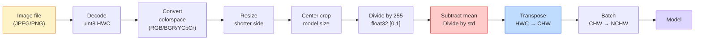
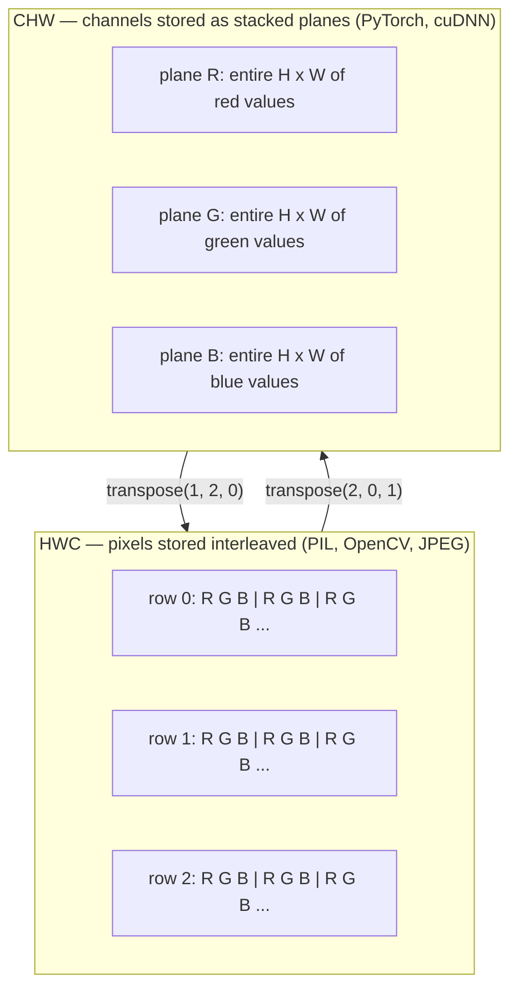

# Fundamentos de la imagen  Pixels, canales, espacios de color  Base de imagen  imagen, canal y espacio de color

> Una imagen es un tensor de muestras de luz. Cada modelo de visión que usará comienza con este hecho.

> **【中文解读】**La imagen es en esencia un conjunto de imágenes de tamaño de luz. Ya sea por medio de un dispositivo de fotografía o de un GPT-4V, todos los modelos de visión se basan en este hecho básico.

**Type:** Build | **类型:** 动手
**Languages:** Python | **语言:** Python
**Prerequisites:** Phase 1 Lesson 12 (Tensor Operations), Phase 3 Lesson 11 (Intro to PyTorch) | **前置知识:** Phase 1 Lesson 12（张量运算）、Phase 3 Lesson 11（PyTorch 入门）
**Time:** ~45 minutes | **时间:** ~45 分钟

## Objetivos de aprendizaje

- Explicar cómo una escena continua se discrete en píxeles y por qué las decisiones de muestreo/cuantización establecen el límite en cada modelo en aguas posteriores
  China Translation: explicar cómo los escenarios continuos se desprenden de los pictóbulos, y por qué la toma de decisiones determinó los límites máximos de todos los modelos de la serie.
- Leer, recortar e inspeccionar imágenes como matrices NumPy y cambiar fluidamente entre las configuraciones HWC y CHW
  En inglés, el número de números de imágenes se cambia automáticamente entre el HWC y el CHW.
- Convertir entre RGB, escala de gris, HSV y YCbCr y justificar por qué existe cada espacio de color
  Traducción: entre RGB、灰度、HSV y YCbCr, y explica las razones de la existencia de cada tipo de color espacio
- Aplicar el preprocesamiento a nivel de píxeles (normaliza, estandariza, redimensionar, canaliza primero) exactamente como lo esperan los modelos de visión PyTorch preentrenados
  China: 精确按照预训练 PyTorch 视觉模型的期望做像素级预处理(归一化、标准化、缩放、通道前置)

## El problema es la introducción del problema

Cada artículo que leerás, cada peso pre-entrenado que descargas, cada API de visión que llamas asume un codificación específica de la entrada.`uint8`imagen donde el modelo quiere `float32`y todavía se ejecutará  y producirá basura en silencio. Alimenta BGR a una red entrenada en RGB y la precisión colapsará en diez puntos. Entrega un modelo de canales-última entrada cuando espera canales-primero y la primera capa de conve trata la altura como un canal de características. Nada de esto arroja un error. Simplemente arruina tus métricas y pasas una semana buscando un error que vive en la forma en que cargaste el archivo.

> Cada artículo que leerás, cada prep prep prep prep prep prep prep prep prep prep prep prep prep prep prep prep prep prep prep prep prep prep prep prep prep prep prep prep prep prep prep prep prep prep prep prep prep prep prep prep prep prep prep prep prep prep prep prep prep prep prep prep prep prep prep prep prep prep prep prep prep prep prep prep prep prep prep prep prep prep prep prep prep prep prep prep prep prep prep prep prep prep prep prep prep prep prep prep prep prep prep prep prep prep prep prep prep prep prep prep prep prep prep prep prep prep prep prep prep prep prep prep prep prep prep prep prep prep prep prep prep prep prep prep prep prep prep prep prep prep prep prep prep prep prep prep prep prep prep prep prep prep prep prep prep prep prep prep prep prep prep prep prep prep prep prep prep prep prep prep prep prep prep prep prep prep prep prep prep prep prep prep prep prep prep prep prep prep prep prep prep prep prep prep prep prep prep prep prep prep prep prep prep prep prep prep prep prep prep prep prep prep prep prep prep prep prep prep prep prep prep prep prep prep prep prep prep prep prep prep prep prep prep prep prep prep prep prep prep prep prep prep prep prep prep prep prep prep prep prep prep prep prep prep prep prep prep prep prep prep prep prep prep prep prep prep prep prep prep prep prep prep prep prep prep prep prep prep prep prep prep prep prep prep prep prep prep prep prep prep prep prep prep prep prep prep prep prep prep prep prep prep prep prep prep prep prep prep prep prep prep prep prep prep prep prep prep prep prep prep prep prep prep prep prep prep prep prep prep prep prep prep prep prep prep prep prep prep prep prep prep prep prep prep prep prep prep prep prep prep prep prep prep prep prep prep prep prep prep prep prep prep prep prep prep prep prep prep prep prep prep prep prep prep prep prep prep prep prep prep prep prep prep prep prep prep prep prep prep prep prep prep prep prep prep prep prep prep prep prep prep prep prep prep prep prep prep prep prep prep prep prep prep prep prep prep prep prep prep prep prep prep prep prep prep prep prep prep prep prep prep prep prep prep prep prep prep prep prep prep prep prep prep prep prep prep prep prep prep prep prep prep prep prep prep prep prep prep prep prep prep prep prep prep prep prep prep prep prep prep prep prep prep prep prep prep prep prep prep prep prep prep prep prep prep prep prep prep prep prep prep prep prep prep prep prep prep prep prep prep prep prep prep prep prep prep prep prep prep prep prep prep prep`uint8` Imágenes transmitiendo a la necesidad `float32`El modelo sigue funcionando pero produce resultados de basura silenciosamente. Se le da BGR a la red entrenada en RGB, la tasa de precisión de desplome de diez puntos por ciento. Se transmite el canal a la entrada final.

> **【中文解读】**Este es el "bug de la ocultación" más común en el diseño de imágenes de computadoras. En el diseño de inteligencia artificial, este tipo de problemas pueden causar un error en el sistema de conducción automática.

Una convolución no es complicada una vez que se sabe lo que se desliza. La parte difícil es que "una imagen" significa cosas diferentes a una cámara, un decodificador JPEG, PIL, OpenCV, torchvision y un núcleo CUDA. Cada pila tiene su propio orden de eje, rango de byte y convención de canal.

> Una vez que sabes lo que está en el volúmenes, no es complicado. La parte difícil está en que las "imágenes" de las máquinas de cámara, JPEG, decodificador, PIL, OpenCV, torchvision y CUDA, en su esencia, significan cosas diferentes. Cada tecnología tiene su propio orden de eje, alcance de guiones y reglas.

Esta lección fija la base para que el resto de la fase pueda construir sobre ella. Al final sabrá qué es un píxel, por qué hay tres números por píxel en lugar de uno, lo que "normaliza con estadísticas de ImageNet" realmente hace, y cómo moverse entre los dos o tres diseños que cada otra lección en esta fase asumirá.

> Esta es la base real de esta clase, para que el resto del curso de esta etapa pueda construirse sobre ella. Después de la enseñanza, sabrás qué es la imagen, por qué cada imagen tiene tres números en lugar de uno, qué es lo que se ha hecho "con la integración estadística de ImageNet" y cómo cambiar entre las dos o tres estructuras que se suponen en el resto del curso.

> **【拓展：数据标注与质量】**视觉任务的效果高度依赖标签数据质量──标签工作室、CVAT es la principal herramienta de marcado──在工业场景中,主动学习(Active Learning) puede reducir el costo de marcado: modelo a un requerimiento de muestras indeterminadas, marcación automática de muestras de determinación──

## El concepto central.

### La línea de procesamiento previo completa en un vistazo.

Cada sistema de visión de producción es la misma secuencia de transformaciones revertibles. Si se equivoca un paso, el modelo ve una entrada diferente a la que fue entrenado.

> Cada sistema de producción de nivel de visión es el mismo proceso de cambio reversible.



Las dos cajas rojas y azules son donde vive el 80% de los fallos silenciosos: falta de estandarización y diseño incorrecto.

> El rojo y el azul son dos cuadros que representan el 80% del fracaso del silencio: la falta de estandarización y la falta de errores de diseño.

> **【中文解读】**El 80% de los errores de ocultamiento se concentra en dos ejes: 1) no se ha hecho estandarización, 2) la estructura de datos se ha equivocado, 2) la estructura de datos se ha equivocado, 2) la estructura de datos se ha equivocado, 2) la estructura de datos se ha equivocado, 3) la estructura de datos se ha reducido, y 3) la estructura de datos se ha reducido, y 3) la estructura de datos se ha reducido, y 3) la estructura de datos se ha reducido, y 3) la estructura de datos se ha reducido, y 3) la estructura de datos se ha reducido, y 3) la estructura de datos se ha reducido, y 3) la estructura de datos se ha reducido, y el sistema de datos se ha reducido, y el sistema de datos se ha reducido, y el sistema de datos se ha convertido en un sistema de datos de datos de datos de datos de datos de datos de datos de datos de datos de datos de datos de datos de datos de datos de datos de datos de datos de datos de datos de datos de datos de datos de datos de datos de datos de datos de datos de datos de datos de datos de datos de datos de datos de datos de datos de datos de datos de datos de datos de datos de datos de datos de datos de datos de datos de datos de datos de datos de datos de datos de datos de datos de datos de datos de datos de datos de datos de datos de datos de datos de datos de datos de datos de datos de datos de datos de datos de datos de datos de datos de datos de datos de datos de datos de datos de datos de datos de datos de datos de datos de datos de datos de datos de datos de datos de datos de datos de datos de datos de datos de datos de datos de datos de datos de datos de datos de datos de datos de datos de datos de datos de datos de datos de datos de datos de datos de datos de datos de datos de datos de datos de datos de datos de datos de datos de datos de datos de datos de datos de datos de datos de datos de datos de datos de datos de datos de datos de datos de datos de datos de datos de datos de datos de datos de datos de datos de datos de datos de datos de datos de datos de datos de datos de datos de datos de datos de datos de datos de datos de datos de datos de datos de datos de datos de datos de datos de datos de datos de datos de datos de datos de datos de

### Un píxel es una muestra, no un cuadrado.

Un sensor de cámara cuenta los fotones que aterrizan en una red de detectores diminutos. Cada detector integra la luz durante una fracción de segundo y emite un voltaje proporcional a la cantidad de fotones que lo golpean. El sensor luego discretizan ese voltaje en un número entero.

> Cada detector en un período de tiempo de tiempo de un solo tiempo acumula luz, y emite con el número de sus fotones que golpean a la proporción de la presión de la corriente.

```
Continuous scene                 Sensor grid                     Digital image
(infinite detail)                (H x W detectors)               (H x W integers)

    ~~~~~                        +--+--+--+--+--+                 210 198 180 155 120
   ♪ ♪ y luego de todo, me siento como si fuera un niño ♪
  - - - - - - - - - - - - - - - - - - - - - - - - - - - - - - - - - - - - - - - - - - - - - - - - - - - - - - - - - - - - - - - - - - - - - - - - - - - - - - - - - - - - - - - - - - - - - - - - - - - - - - - - - - - - - - - - - - - - - - - - - - - - - - - - - - - - - - - - - - - - - - - - - - - - - - - - - - - - - - - - - - - - - - - - - - - - - - - - - - - - - - - - - - - - - - - - - - - - - - - - - - - - - - - - - - - - - - - - - - - - - - - - - - - - - - - - - - - - - - - - - - - - - - - - - - - - - - - - - - - - - - - - - - - - - - - - - - - - - - - - - - - - - - - - - - - - - - - - - - - - - - - - - - - - - - - - - - - - - - - - - - - - - - - - - - - - - - - - - - - - - - - - - - - - - - - - - - - - - - - - - - - - - - - - - - - - - - - - - - - - - - - - - - - - - - - - - - - - - - - - - - - - - - - - - - - - - - - - - - - - - - - - - - - - - - - - - - - - - - - - - - - - - - - - - - - - - - - - - - - - - - - - - - - - - - - - - - - - - - - - - - - - - - - - - - - - - - - - - - - - - - - - - - - - - -
   ~~~~~                         |  |  |  |  |  |                 195 185 170 148 112
                                 +--+--+--+--+--+                 188 180 165 145 108
```

En este paso hay dos opciones y se fija el techo en todo lo que baja:

- **Spatial sampling**El número de detectores en cada grado de escena es muy pequeño y los bordes se ponen en punto.
  La cantidad de datos que se pueden obtener en el espacio es muy pequeña.
- **Intensity quantization**El sistema de detección de tensión de la imagen de la imagen de la imagen de la imagen de la imagen de la imagen de la imagen de la imagen de la imagen de la imagen de la imagen de la imagen de la imagen de la imagen de la imagen de la imagen de la imagen de la imagen de la imagen de la imagen de la imagen de la imagen de la imagen de la imagen de la imagen de la imagen de la imagen de la imagen de la imagen de la imagen de la imagen de la imagen de la imagen de la imagen de la imagen de la imagen de la imagen de la imagen de la imagen de la imagen de la imagen de la imagen de la imagen de la imagen de la imagen de la imagen de la imagen de la imagen de la imagen de la imagen de la imagen de la imagen de la imagen de la imagen de la imagen de la imagen de la imagen de la imagen de la imagen de la imagen de la imagen de la imagen de la imagen de la imagen de la imagen de la imagen de la imagen de la imagen de la imagen de la imagen de la imagen de la imagen de la imagen de la imagen de la imagen de la imagen de la imagen de la imagen de la imagen de la imagen de la imagen de la imagen de la imagen de la imagen de la imagen de la imagen de la imagen de la imagen de la imagen de la imagen de la imagen de la imagen de la imagen de la imagen de la imagen de la imagen de la imagen de la imagen de la imagen de la imagen de la imagen de la imagen de la imagen de la imagen de la imagen de la imagen de la imagen de la imagen de la imagen de la imagen.
  La intensidad de la determinación de la presión eléctrica se divide en más detalles. 8 bits dan 256 grados, es un estándar de muestra. 10、12、16 bits proporcionan una escala más suave, es importante para la imagen médica、HDR y el flujo de flujo de los sensores primitivos.

Un píxel no es un cuadrado de color con área. Es una sola medida. Cuando cambias de tamaño o giras, estás repetiendo esa cuadrícula de medición.

> La imagen no es un cuadrado de colores de superficie. Es una medida. Cuando se acumula o gira, se está recogiendo la red de medida.

> **【中文解读】**La imagen no es un pequeño cuadrado, sino un punto de muestra de un sensor en una posición espacial. Cuando se acumula o gira una imagen, en realidad se realiza una nueva muestra de la imagen. Este concepto es especialmente importante en imágenes médicas (como la IRM) y HDR.

### ¿Por qué tres canales? ¿Por qué tres canales?

Un detector cuenta fotones en todo el espectro visible  que es escala de gris. Para obtener color, el sensor cubre la cuadrícula con un mosaico de filtros rojos, verdes y azules. Después de demosaicing, cada ubicación espacial tiene tres enteros: la respuesta del detector filtrado en rojo, filtrado en verde y filtrado en azul cerca.

> Para obtener el color, los sensores utilizan los colores rojos, verdes, azules y azules para cubrir la red de las fotos. Después de un viaje, cada espacio tiene tres números integrales: el detector de luz roja, el detector de luz verde y el detector de luz azul.

```
One pixel in memory:

    (R, G, B) = (210, 140, 30)   <- reddish-orange

An H x W RGB image:

    shape (H, W, 3)     stored as   H rows of W pixels of 3 values
                                    each in [0, 255] for uint8
```

Las cámaras de profundidad añaden un canal Z. Los satélites añaden bandas infrarrojas y ultravioletas. Los escáneres médicos a menudo tienen un canal (rayos X, CT) o muchos (hiperspectral).

> La fotografía de profundidad aumenta Z 通道──卫星增加红外和紫外波段──医学扫描通常有一个通道(X光、CT) o muchos通道(高光谱)──通道数是最后一个轴;卷积层学习跨通道混合──

> **【拓展：多通道图像】**Las imágenes de satélite de distancia suelen tener un exceso de luz roja, ultravioleta, etc. La CT médica sólo tiene un único canal; las imágenes de profundidad (como Kinect, iPhone LiDAR) aumentan la profundidad del canal D. Estas imágenes de múltiples canales tienen una amplia aplicación en la vigilancia agrícola, el diagnóstico médico y la conducción automática.

### Dos convenciones de diseño: HWC y CHW.

El mismo tensor, dos ordenes.

> La misma cantidad, dos tipos de orden. Cada uno de ellos elige una.

```
HWC (height, width, channels)           CHW (channels, height, width)

   W ->                                    H ->
  +-----+-----+-----+                     +-----+-----+
H |R G B|R G B|R G B|                   C |R R R R R R|
| +-----+-----+-----+                   | +-----+-----+
v |R G B|R G B|R G B|                   v |G G G G G G|
  +-----+-----+-----+                     +-----+-----+
                                          |B B B B B B|
                                          +-----+-----+

   PIL, OpenCV, matplotlib,              PyTorch, most deep learning
   almost every image file on disk       frameworks, cuDNN kernels
```

CHW existe porque los núcleos de convolución se deslizan a través de H y W. Mantener el eje del canal primero significa que cada núcleo ve un plano 2D contiguo por canal, que vectoriza limpiamente.

> CHW 之所以存在,是因为卷积核在H 和 W 上滑动──保持通道轴在最前面意思是每个核看到的是每个通道的一个连续2D平面,可以干净地向量化──磁盘格式保持HWC是因为那匹配传感器扫描线的输出方式──

> **【中文解读】**HWC(高×宽×通道) es el formato predeterminado de PIL、OpenCV 等库, también es el formato de archivo de imágenes en disco. CW(通道×高×宽) es el formato utilizado por PyTorch 和 GPU 计算(cuDNN), ya que el volúmenes de núcleo se desplazan en H 和 W, por lo que cada núcleo puede ver una continua 2D de plano, la eficiencia de cálculo es más alta.

La conversión de una línea que escribirá mil veces:

> Usted va a hacer un mil veces de un solo transcurso:

```
img_chw = img_hwc.transpose(2, 0, 1)      # NumPy
img_chw = img_hwc.permute(2, 0, 1)        # PyTorch tensor
```

Diseño de memoria, visualizado:

> Inserción de la información:



### Rango de byte y tipo d.

En la actualidad, hay tres convenciones:

> Tres tipos de reglamentación:

| Convention | dtype | Range | Where you see it |
|------------|-------|-------|------------------|
| Raw | `uint8` | [0, 255] | Files on disk, PIL, OpenCV output |
| Normalized | `float32` | [0.0, 1.0] | After `img.astype('float32') / 255` |
| Standardized | `float32` | roughly [-2, +2] | After subtracting mean and dividing by std |

Las redes convolucionales fueron entrenadas en entradas estandarizadas.`mean=[0.485, 0.456, 0.406]`¿ Qué ?`std=[0.229, 0.224, 0.225]`son la media aritmética y la desviación estándar de los tres canales en el conjunto completo de capacitación de ImageNet, calculada en [0, 1] píxeles normalizados.`uint8`En un modelo que espera flotación estandarizada es el único fallo silencioso más común en la visión aplicada.

> 卷积网络 es una normalización de la entrada y la formación de la imagen.`mean=[0.485, 0.456, 0.406]`¿Qué es esto?`std=[0.229, 0.224, 0.225]`Es todo el entrenamiento de ImageNet en tres tramos de cálculo de la media y el estándar de diferencia, en [0, 1] 归结像素上计算──把原始 `uint8` El modelo de la normalización de los puntos de vuelo es el más común en la aplicación de la visión de la falla de silencio.

> **【中文解读】**Tres tipos de datos: 1) uint8 [0,255]  文件/PIL/OpenCV 原始输出; 2) float32 [0,1] 归化后; 3) float32 ≈[-2,+2]  ImageNet 标准化后──把 uint8 直接给期望标准化输入的模型,是最常见的"静默失败"──ImageNet 平均值和标准差是整个训练集预测出来的, casi todos los modelos de entrenamiento usan este grupo de números──

### Espacios de color y por qué existen

RGB es el formato de captura, pero no siempre es la representación más útil para un modelo.

> RGB es un formato de captura, pero no siempre es la expresión más útil para el modelo.

```
 RGB               HSV                       YCbCr / YUV

 R red             H hue (angle 0-360)       Y luminance (brightness)
 G green           S saturation (0-1)        Cb chroma blue-yellow
 B blue            V value/brightness (0-1)  Cr chroma red-green

 Linear to         Separates color from      Separates brightness from
 sensor output     brightness. Useful for    color. JPEG and most video
                   color thresholding, UI    codecs compress the chroma
                   sliders, simple filters   channels harder because the
                                             human eye is less sensitive
                                             to chroma detail than to Y.
```

Para la mayoría de las cadenas de televisión modernas se alimenta RGB.

> 对于大多数现代CNN,你输入RGB──你在以下场景会遇到其他色彩空间:

- **HSV** código de CV clásico, segmentación basada en el color, balanceo de blanco.
  En inglés, el CV clásico 代码、基于颜色的分分、白平衡──
- **YCbCr** lectura de los internos de JPEG, canalizaciones de vídeo, modelos de superresolución que operan solo en Y.
  Traducción:PDF de JPEG 内部结构、视频流水线、 sólo en el modelo de superresolución de operación en Y通道
- **Grayscale** OCR, modelos de documentos, cualquier caso en el que el color sea variable de molestia en lugar de señal.
  El color es cualquier escena que interfiera con la variación y no con la señal.

La escala de gris de RGB es una suma ponderada, no una media, porque el ojo humano es más sensible al verde que al rojo o al azul:

> Desde RGB 转灰度 es un valor de aumento, no un valor promedio, ya que el ojo humano es más sensible al verde que al rojo o al azul:

```
Y = 0.299 R + 0.587 G + 0.114 B       (ITU-R BT.601, the classic weights)
```

### Ratio de aspecto, redimensionamiento e interpolación 宽高比 缩放与插值

Cada modelo tiene un tamaño de entrada fijo (224x224 para la mayoría de los clasificadores de ImageNet, 384x384 o 512x512 para los detectores modernos).

> Cada modelo tiene un tamaño de entrada fijo. La mayoría de los equipos de clasificación de ImageNet son 224x224, los examinadores modernos son 384x384 o 512x512.

- **Resize shorter side, then center crop** la receta estándar de ImageNet. Preserva la relación de aspecto, elimina una tira de píxeles de borde.
  En español, el lenguaje de la imagen se traduce en inglés como "enlace" o "enlace" en inglés.
- **Resize and pad** conserva la relación de aspecto y cada píxel, añade barras negras.
  Traducción:Encuentra y rellena mantener el largo y el alto de cada imagen, añadir el lado negro, la prueba y la práctica estándar de OCR.
- **Resize directly to target**Es barato, distorsiona la geometría, es bueno para muchas tareas de clasificación.
  China: direct enlazada a la talla de la meta 拉伸图像──成本低,扭曲几何形形, pero para muchas clases de tareas es suficiente──

El método de interpolación decide cómo se calculan los píxeles intermedios cuando la nueva cuadrícula no se alinea con la antigua:

> 插值方法 decide cómo calcular la imagen media cuando la nueva red se desajusta con la antigua red:

```
Nearest neighbour     fastest, blocky, only choice for masks/labels
Bilinear              fast, smooth, default for most image resizing
Bicubic               slower, sharper on upscaling
Lanczos               slowest, best quality, used for final display
```

Regla de oro: bilinear para entrenamiento, bicubo o lanczos para activos que verá, más cercano para cualquier cosa que contenga ID de clase entera.

> 經驗法则: entrenamiento con doble línea, demostración con doble o tres veces, incluye un número completo de clases ID de uso cercano.

> **【中文解读】**缩放时的插值方法选择:近邻 (近邻) 速度最快但会产生, sólo para ocultar/标签图;双线性 (双线性) 又快又平滑,是训练时的默认选择;双三次 (双立方) 慢但放大时更清晰;Lanczos 最慢但质量最好──经验法则:训练用双线,展示用双立方/lanczos,标签用近距离──

> **【拓展：工业部署中的视觉系统】**En la implementación industrial real, los modelos de visión necesitan considerar la posibilidad de retraso, el tamaño del modelo, la adaptación de los dispositivos de borde, etc. TensorRT, ONNX Runtime, OpenVINO son herramientas de aceleración de la teoría de uso habitual.
```figure
conv-output-size
```

## Construye la práctica.

### Paso 1: Construir un tensor de imagen e inspeccionar su forma.

Comience con una imagen sintética determinista para que el primer laboratorio se ejecute fuera de línea con sólo NumPy. El decodificación de archivos es un límite separado: una vez que un decodificador JPEG o PNG devuelve bytes RGB, cada operación tensor a continuación es la misma.

> Desde una imagen de síntesis de determinación, permita que la primera experiencia sólo requiera NumPy para poder operar de línea.

```python
import numpy as np

def synthetic_rgb(h=128, w=192, seed=0):
    rng = np.random.default_rng(seed)
    yy, xx = np.meshgrid(np.linspace(0, 1, h), np.linspace(0, 1, w), indexing="ij")
    r = (np.sin(xx * 6) * 0.5 + 0.5) * 255
    g = yy * 255
    b = (1 - yy) * xx * 255
    rgb = np.stack([r, g, b], axis=-1) + rng.normal(0, 6, (h, w, 3))
    return np.clip(rgb, 0, 255).astype(np.uint8)

arr = synthetic_rgb()

print(f"type:   {type(arr).__name__}")
print(f"dtype:  {arr.dtype}")
print(f"shape:  {arr.shape}     # (H, W, C)")
print(f"min:    {arr.min()}")
print(f"max:    {arr.max()}")
print(f"pixel at (0, 0): {arr[0, 0]}")
```

Producción esperada: `shape: (H, W, 3)`¿ Qué ?`dtype: uint8`, rango `[0, 255]`Esa es la representación canónica decodificada si los bytes provenían de una cámara, un decodificador de imágenes o de este generador sintético.

> 预期输出:`shape: (H, W, 3)`¿Qué es esto?`dtype: uint8`、 alcance `[0, 255]` Éste es el código de código de código de código de código de código de código de código de código de código de código de código de código de código de código de código de código de código de código de código de código de código de código de código de código de código de código de código de código de código de código de código de código de código de código de código de código de código de código de código de código de código de código de código de código de código de código de código de código de código de código de código de código de código de código de código de código de código de código de código de código de código de código de código de código de código de código de código de código de código de código de código de código de código de código de código de código de código de código de código de código de código de código de código de código de código de código de código de código de código de código de código de código de código de código de código de código de código de código de código de código de código de código de código de código de código de código de código de código de código de código de código de código de código de código de código de código de código de código de código de código de código de código de código de código de código de código de código de código de código de código de código de código de código de código de código de código de código de código de código de código de código de código de código de código de código de código de código de código de código de código de código de código de código de código de código de código de código de código de código de código de código de código de código de código de código de código de código de código de código de código de código de código de código de código de código de código de código de código de código de código de código de código de código de código de código de código de código de código de código de código de código de código de código de código de código de código de código de código de código de código de código de código de código de código de código de código de código de código de código de código de código de código de código de código de código de código de código de código de código de código de código de código de código de código de código de código de código de código de código de código de código de código de código de código de código de código de código de código de código de código de código de código de código de código de código de código de código de código de código de código de código de

### Paso 2: Dividir los canales y reordenar el diseño.

Saque R, G, B por separado, y luego convierta de HWC a CHW para PyTorch.

> 分别提取 R、G、B, luego convertir HWC 转换为 CHW 以供 PyTorch使用──

```python
R = arr[:, :, 0]
G = arr[:, :, 1]
B = arr[:, :, 2]
print(f"R shape: {R.shape}, mean: {R.mean():.1f}")
print(f"G shape: {G.shape}, mean: {G.mean():.1f}")
print(f"B shape: {B.shape}, mean: {B.mean():.1f}")

arr_chw = arr.transpose(2, 0, 1)
print(f"\nHWC shape: {arr.shape}")
print(f"CHW shape: {arr_chw.shape}")
```

Tres planos a escala de gris, uno por canal. CHW simplemente reordena los ejes; no se requiere estrictamente copia de datos cuando el diseño de memoria lo permite.

> Tres planos de grado, por vía una. CHW es sólo reordenar el eje; cuando el diseño de archivos permite, no se requiere copiar datos.

### Paso 3: Conversiones de escala gris y HSV.

Escala de grises ponderada, luego una manual RGB-HSV.

> A continuación, se realiza el RGB 转 HSV.

```python
def rgb_to_grayscale(rgb):
    weights = np.array([0.299, 0.587, 0.114], dtype=np.float32)
    return (rgb.astype(np.float32) @ weights).astype(np.uint8)

def rgb_to_hsv(rgb):
    rgb_f = rgb.astype(np.float32) / 255.0
    r, g, b = rgb_f[..., 0], rgb_f[..., 1], rgb_f[..., 2]
    cmax = np.max(rgb_f, axis=-1)
    cmin = np.min(rgb_f, axis=-1)
    delta = cmax - cmin

    h = np.zeros_like(cmax)
    mask = delta > 0
    argmax = np.argmax(rgb_f, axis=-1)
    rmax = mask & (argmax == 0)
    gmax = mask & (argmax == 1)
    bmax = mask & (argmax == 2)
    h[rmax] = ((g[rmax] - b[rmax]) / delta[rmax]) % 6
    h[gmax] = ((b[gmax] - r[gmax]) / delta[gmax]) + 2
    h[bmax] = ((r[bmax] - g[bmax]) / delta[bmax]) + 4
    h = h * 60.0

    s = np.divide(delta, cmax, out=np.zeros_like(delta), where=cmax > 0)
    v = cmax
    return np.stack([h, s, v], axis=-1)

gray = rgb_to_grayscale(arr)
hsv = rgb_to_hsv(arr)
print(f"gray shape: {gray.shape}, range: [{gray.min()}, {gray.max()}]")
print(f"hsv   shape: {hsv.shape}")
print(f"hue range: [{hsv[..., 0].min():.1f}, {hsv[..., 0].max():.1f}] degrees")
print(f"sat range: [{hsv[..., 1].min():.2f}, {hsv[..., 1].max():.2f}]")
print(f"val range: [{hsv[..., 2].min():.2f}, {hsv[..., 2].max():.2f}]")
```

Hue aparece en grados, saturación y valor en [0, 1].`hsv_full`convención.

> Color en la cantidad de salida, 和度和明度在 [0, 1] 范围内── esto es similar a OpenCV `hsv_full`约定一致.

### Paso 4: Normaliza, estandariza y invierte. Paso 4: regeneración, estandarización y inversación.

Ir de bytes crudos al tensor exacto que un modelo de ImageNet preentrenado espera, y luego de vuelta.

> Desde el principio del tiempo hasta el entrenamiento previo, la cantidad exacta de imágenes que se espera de la imagen se vuelve a repetir.

```python
mean = np.array([0.485, 0.456, 0.406], dtype=np.float32)
std = np.array([0.229, 0.224, 0.225], dtype=np.float32)

def preprocess_imagenet(rgb_uint8):
    x = rgb_uint8.astype(np.float32) / 255.0
    x = (x - mean) / std
    x = x.transpose(2, 0, 1)
    return x

def deprocess_imagenet(chw_float32):
    x = chw_float32.transpose(1, 2, 0)
    x = x * std + mean
    x = np.clip(x * 255.0, 0, 255).astype(np.uint8)
    return x

x = preprocess_imagenet(arr)
print(f"preprocessed shape: {x.shape}     # (C, H, W)")
print(f"preprocessed dtype: {x.dtype}")
print(f"preprocessed mean per channel:  {x.mean(axis=(1, 2)).round(3)}")
print(f"preprocessed std  per channel:  {x.std(axis=(1, 2)).round(3)}")

roundtrip = deprocess_imagenet(x)
max_diff = np.abs(roundtrip.astype(int) - arr.astype(int)).max()
print(f"roundtrip max pixel diff: {max_diff}    # should be 0 or 1")
```

El par de preprocesamiento/desprocesamiento es exactamente lo que cada visión de antorcha `transforms.Normalize`La llamada está bajo el capó.

> El valor medio de cada paso debe ser cercano a cero, el estándar debe ser cercano a uno.`transforms.Normalize`调用在底层所做的事情──

### Paso 5: Redimensionar desde cero.

Las coordenadas de salida de las rodadas vecinas más cercanas a un píxel fuente. La interpolación bilinear encuentra los cuatro píxeles circundantes y los mezcla por distancia. Ambas implementaciones de abajo utilizan coordenadas alineadas con los puntos finales para que los primeros y últimos píxeles fuentes permanezcan fijos.

> Recientemente, cada eje de salida se encuentra en un mismo eje de imagen. En el siguiente, se utilizan dos eje de eje de imagen de la primera y última imagen de imagen de imagen.

```python
def resize_coordinates(source_length, target_length):
    if target_length == 1:
        return np.zeros(1, dtype=np.float32)
    return np.linspace(0, source_length - 1, target_length, dtype=np.float32)

def nearest_resize(image, target_height, target_width):
    y = np.rint(resize_coordinates(image.shape[0], target_height)).astype(int)
    x = np.rint(resize_coordinates(image.shape[1], target_width)).astype(int)
    return image[y[:, None], x[None, :]]

def bilinear_resize(image, target_height, target_width):
    y = resize_coordinates(image.shape[0], target_height)
    x = resize_coordinates(image.shape[1], target_width)
    y0 = np.floor(y).astype(int)
    x0 = np.floor(x).astype(int)
    y1 = np.minimum(y0 + 1, image.shape[0] - 1)
    x1 = np.minimum(x0 + 1, image.shape[1] - 1)
    wy = (y - y0)[:, None, None]
    wx = (x - x0)[None, :, None]

    source = image.astype(np.float32)
    top = source[y0[:, None], x0[None, :]] * (1 - wx)
    top += source[y0[:, None], x1[None, :]] * wx
    bottom = source[y1[:, None], x0[None, :]] * (1 - wx)
    bottom += source[y1[:, None], x1[None, :]] * wx
    result = top * (1 - wy) + bottom * wy
    return np.clip(np.rint(result), 0, 255).astype(image.dtype)

target_height = arr.shape[0] * 3
target_width = arr.shape[1] * 3
nearest = nearest_resize(arr, target_height, target_width)
bilinear = bilinear_resize(arr, target_height, target_width)

def local_roughness(x):
    gy = np.diff(x.astype(float), axis=0)
    gx = np.diff(x.astype(float), axis=1)
    return float(np.abs(gy).mean() + np.abs(gx).mean())

for name, out in [("nearest", nearest), ("bilinear", bilinear)]:
    print(f"{name:>8}  shape={out.shape}  roughness={local_roughness(out):6.2f}")
```

El más cercano obtiene más puntuaciones en rugosidad porque mantiene bordes duros. Bilinear es más suave porque cada nuevo píxel mezcla dos posiciones en cada eje. El compañero ejecutable extiende la misma idea separable a cuatro vecinos por eje con un núcleo cúbico Catmull-Rom, luego imprime los tres resultados sin una biblioteca de imágenes.

> El código de soporte operable se expande a los cuatro vecinos de cada eje (Catmull-Rom, 3 núcleos), y luego imprime todos los tres resultados sin tomar de la biblioteca de imágenes).

> **【中文解读】**Nueva edición 5 步从"调 PIL 的尺寸"改为"从零实现近邻与双线性"这是Build It 精神的回归:先用纯NumPy理解插值的坐标映射(`np.linspace`端点对齐 + 索引集集), vuelva a ver el envase de la biblioteca.`code/main.py`También se ha realizado Catmull-Rom 双三次核, con el mismo conjunto de poder de separación de peso de impresión más cercano/bilinear/bicubio 三种结果对比──

## Usalo en la práctica.

PyTorch realiza las mismas operaciones en tensores batchados y conscientes del dispositivo. El código de abajo redimensionará el lado más corto, tomará un recorte central, estandarizará cada canal y producirá el tensor NCHW que un modelo preentrenado espera.

> PyTorch realiza la misma operación en la cantidad de equipos de percepción en el volumen de la cantidad de equipos de percepción en el volumen de la cantidad de equipos de percepción en el volumen de la cantidad de equipos de percepción en el volumen de la cantidad de equipos de percepción en el volumen de la cantidad de equipos de percepción en el volumen de la cantidad de equipos de percepción en el volumen de la cantidad de equipos de percepción en el volumen de la cantidad de equipos de percepción en el volumen de la cantidad de equipos de percepción en el volumen de la cantidad de equipos de percepción en el volumen de la cantidad de los equipos de percepción en el volumen de la cantidad de los equipos de percepción en el volumen de la cantidad de los equipos de percepción en el volumen de la cantidad de los equipos de percepción en el tamaño de la cantidad de los equipos de percepción en el tamaño de la cantidad de los equipos de percepción en el tamaño de la cantidad de los equipos de percepción en el tamaño de la cantidad de los equipos de la cuadrícula en el cuadrícula en el cuadrícula en el cuadrícula en el cuadrícula en el cuadrícula en el cuadrícula en el cuadrícula en el cuadrícula en el cuadrícula en el cuadrícula en el cuadrícula en el cuadrícula en el cuadrícula en el cuadrícula en el cuadrícula en el cuadrícula en el cuadrícula en el cuadrícula en el cuadrícula en el cuadrícula en el cuadrícula en el cuadrícula en el cuadrícula en el cuadrícula en el cuadrícula en el cuadrícula en el cuadrícula en el cuadrícula en el cuadrícula en el cuadrícula en el cuadrícula en el cuadrícula en el cuadrícula en el cuadrícula en el cuadrícula en el cuadrícula en el cuadrícula en el cuadrícula.

```python
import torch
import torch.nn.functional as F

image_hwc = torch.from_numpy(synthetic_rgb(256, 320))
batch = image_hwc.permute(2, 0, 1).unsqueeze(0).float() / 255.0

height, width = batch.shape[-2:]
scale = 256 / min(height, width)
resized_height = round(height * scale)
resized_width = round(width * scale)
batch = F.interpolate(
    batch,
    size=(resized_height, resized_width),
    mode="bilinear",
    align_corners=False,
    antialias=True,
)

top = (resized_height - 224) // 2
left = (resized_width - 224) // 2
batch = batch[:, :, top:top + 224, left:left + 224]

mean = torch.tensor([0.485, 0.456, 0.406]).view(1, 3, 1, 1)
std = torch.tensor([0.229, 0.224, 0.225]).view(1, 3, 1, 1)
batch = (batch - mean) / std

print(f"tensor dtype: {batch.dtype}")
print(f"batched shape: {tuple(batch.shape)}")
print(f"per-channel mean: {batch.mean(dim=(0, 2, 3)).tolist()}")
print(f"per-channel std:  {batch.std(dim=(0, 2, 3)).tolist()}")
```

Cuatro pasos, en este orden exacto: convertir bytes a float y cambiar HWC a NCHW, cambiar el tamaño del lado más corto a 256, tomar un recorte central de 224x224, luego restar la media de ImageNet y dividir por su desviación estándar.

> Cuatro pasos, en este orden preciso: convertir el guión en un punto de flotación y cambiar el HWC a un NCHW, reducir el corto límite a 256, cortar el centro de 224x224, y luego reducir el valor medio de ImageNet y desglosar su valor estándar.

> **【中文解读】**Nueva edición "Uses Framework Implement" de la página`torchvision.transforms`Se convirtió en desnudo .`torch`¿ Qué es eso ?`torch.nn.functional`:permute→unsqueez 换布局、`F.interpolate`缩放短边(注意 `antialias=True`Con`align_corners=False`Estos dos niveles de producción (default value) 张量切片做中心剪剪,广播减平均值除标准差── esto te deja ver`transforms.Compose`                                                                                                                                                                                                                                                              

## Envío Lo . Entrega producto .

Esta lección produce:

> 本课产 出:

- `outputs/prompt-vision-preprocessing-audit.md` una solicitud que convierte cualquier tarjeta modelo o tarjeta de conjunto de datos en una lista de verificación de las invariantes de preprocesamiento exactas que un equipo debe cumplir.
  En inglés:`outputs/prompt-vision-preprocessing-audit.md` Una tarjeta de modelo o conjunto de datos que se convierta en un equipo debe cumplir con el preprocesamiento de la lista de sugerencias.
- `outputs/skill-image-tensor-inspector.md` una habilidad que, dada cualquier tensor o matriz en forma de imagen, informa sobre dtype, diseño, rango y si se ve crudo, normalizado o estandarizado.
  En inglés:`outputs/skill-image-tensor-inspector.md` Una habilidad: dar una cantidad o un número de formas de imagen, reportar su rango de tipo, diseño y valor, así como que parezca original, unificado o estandarizado.

## Los ejercicios.

> **【中文解读】**Practice los temas de fácil/medio/duro  3 difficulty to pass in  Recomenda al menos completar los temas de grado medio  Grado duro  para la preparación de la entrevista

1. **(Easy)**Crear un RGB 2x2 `uint8`Convierta HWC a CHW y hacia atrás, imprima ambas formas y prueba que el viaje de ida y vuelta conserva todos los valores.
   Crear una que contenga cuatro diferentes colores de 2x2 RGB `uint8`Número de números: entre HWC y CHW, se imprime dos formas, y se prueba que el cambio de forma y de forma mantiene cada valor.
2. **(Medium)**Escriba .`standardize(img, mean, std)`y su inverso que juntos pasan un `roundtrip_max_diff <= 1`Las funciones deben funcionar en una sola imagen en HWC y en un lote en NCHW con la misma llamada.
   Traducción:编写`standardize(img, mean, std)` y su función opuesta, exigen en cualquier uint8  imagen sobre el paso `roundtrip_max_diff <= 1`测试,且同调用既支持单张图(HWC) también支持批量(NCHW)。
3. **(Hard)**Tome un tensor estándar de 3 canales ImageNet y ejecutarlo a través de un conv 1x1 que aprende una mezcla ponderada de RGB en un solo canal a escala de gris. Inicializa los pesos a`[0.299, 0.587, 0.114]`, congelarlos, y verificar que la salida coincide con su manual `rgb_to_grayscale`¿Qué otras transformaciones clásicas del espacio color se pueden escribir como 1x1 convolsiones?
   China: 取一个三通道 ImageNet 标准化张量,送入一个把 RGB 加权混合成单通道灰度的 1x1卷积──把权重初始化为`[0.299, 0.587, 0.114]`Y结,验证输出与手动 `rgb_to_grayscale`La diferencia en los puntos de error en el interior. Pensar: ¿Qué otros cambios clásicos en el espacio de color se pueden escribir en 1x1 volúmenes?

## Términos clave .

| Term | What people say | What it actually means |
|------|----------------|----------------------|
| Pixel | "A coloured square" | One sample of light intensity at one grid location — three numbers for colour, one for grayscale |
| Channel | "The colour" | One of the parallel spatial grids stacked into an image tensor; last axis in HWC, first in CHW |
| HWC / CHW | "The shape" | Axis orderings for an image tensor; disk and PIL use HWC, PyTorch and cuDNN use CHW |
| Normalize | "Scale the image" | Divide by 255 so pixels live in [0, 1] — necessary but not sufficient |
| Standardize | "Zero-center" | Subtract mean and divide by std per channel so the input distribution matches what the model was trained on |
| Grayscale conversion | "Average the channels" | A weighted sum with coefficients 0.299/0.587/0.114 that matches human luminance perception |
| Interpolation | "How resize picks pixels" | The rule that decides output values when the new grid does not align with the old one — nearest for labels, bilinear for training, bicubic for display |
| Aspect ratio | "Width over height" | The ratio that distinguishes "resize and pad" from "resize and stretch" |

> 术语对照:Pixel=像素、Channel=通道、Normalize=归一化、Standardize=标准化、Grayscale conversion=灰度转换、Interpolación=插值、Aspect ratio=宽高比──完整中文释义见 zh.md 的术语表──

## Más Leer más Leer más

- [Charles Poynton — A Guided Tour of Color Space](https://poynton.ca/PDFs/Guided_tour.pdf) el tratamiento técnico más claro de por qué hay tantos espacios de color y cuándo cada uno importa
  Traducción:Charles Poynton 彩色空间导览 解释为什么有如此多的彩色空间、各自何时重要最清晰技术论述──
- [PyTorch Vision Transforms Docs](https://pytorch.org/vision/stable/transforms.html) la línea completa de transformaciones que realmente se compondrá en la producción
  Ciencia de la información sobre la producción de la tecnología de la información en el mundo de la información.
- [How JPEG Works (Colt McAnlis)](https://www.youtube.com/watch?v=F1kYBnY6mwg) una visión de la submuestreo de croma, DCT, y por qué JPEG codifica YCbCr en lugar de RGB
  En el contexto de la actualidad, el JPEG es un código de código de la RGB y no de la YCbCr.
- [ImageNet Preprocessing Conventions (torchvision models)](https://pytorch.org/vision/stable/models.html) la fuente de la verdad para `mean=[0.485, 0.456, 0.406]`Y por qué cada modelo en el zoológico lo espera
  En español traducción: torchvision 模型的 ImageNet 预处理约定`mean=[0.485, 0.456, 0.406]`La fuente de autoridad, y por qué todo el modelo lo usa.
