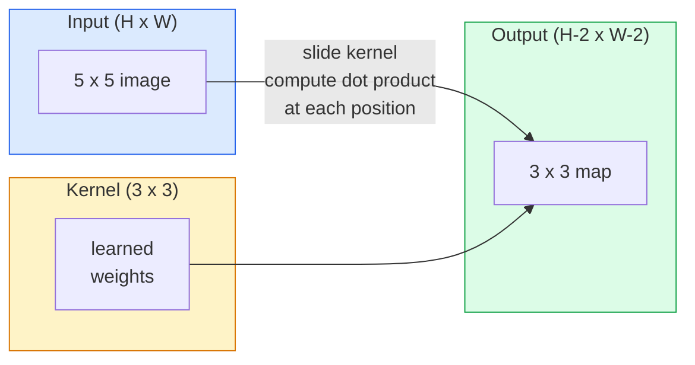
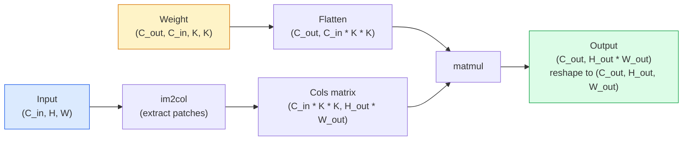

# Convolucciones desde cero desde cero

> Una convolución es una pequeña capa densa que deslizas a través de una imagen, compartiendo los mismos pesos en cada ubicación.

> **【中文解读】**El volumen es un "slip de pequeña totalidad de la conexión" con el mismo grupo de peso en cada posición de la imagen. Esto nos da dos características clave: plano de movimiento, salida y movimiento y parámetro compartido. El mismo detector de características se utiliza en toda la imagen.

**Type:** Build | **类型:** 动手
**Languages:** Python | **语言:** Python
**Prerequisites:** Phase 3 (Deep Learning Core), Phase 4 Lesson 01 (Image Fundamentals) | **前置知识:** Phase 3（深度学习核心），Phase 4 Lesson 01（图像基础）
**Time:** ~75 minutes | **时间:** ~75 分钟

## Objetivos de aprendizaje

- Implementar la convolución 2D desde cero utilizando sólo NumPy, incluyendo la versión en bucle anidado y una vectorizada `im2col`versión
   Sólo con NumPy desde la realización de 2D volúmenes, incluyendo la edición de ciclo de los emplazamientos y la versión de im2col volúmenes de dimensiones
- Computa el tamaño espacial de salida para cualquier combinación de tamaño de entrada, tamaño del núcleo, relleno y paso, y justifica el `(H - K + 2P) / S + 1`fórmula
   calcular cualquier entrada de tamaño 核大小 填充和步幅组合下输出尺寸, entender la fórmula `(H - K + 2P) / S + 1`
- Los núcleos de diseño manual (borda, borra, afilada, sobel) y explicar por qué cada uno produce el patrón de activaciones que hace
  Hand动设计核(边缘检测、模糊、化、Sobel), explicar por qué cada tipo de núcleo produce un modo de activación de la respuesta
- Las convulsiones de la pila en un extractor de características y conectar la profundidad de la pila al tamaño del campo receptivo
  Componer varios volúmenes de capas como extractor de características, entender la relación entre la profundidad de la captura y el tamaño del sentido

> **【中文解读】**El objetivo de aprendizaje enumera las capacidades centrales que debe dominarse después de completar la clase.


## El problema es la introducción del problema

Una capa completamente conectada en una imagen RGB 224x224 necesitaría 224 * 224 * 3 = 150.528 pesos de entrada por neurona. Una sola capa oculta con 1.000 unidades ya es de 150 millones de parámetros antes de que hayas aprendido algo útil. Peor aún, esa capa no tiene idea de que un perro en la parte superior izquierda y un perro en la parte inferior derecha son el mismo patrón. Trata cada posición de píxel como independiente, lo cual es exactamente incorrecto para las imágenes: traducir un gato por tres píxeles no debería obligar a la red a volver a aprender el concepto.

> En 224x224 RGB imagen, la totalidad de la conexión de cada nivel neuronal necesita 224 * 224 * 3 = 150,528 de peso de entrada. Una sola de las 1.000 unidades ocultas ya tiene 1.5 mil millones de parámetros antes de que aprendas algo útil. Lo peor es que esa capa no sabe que los perros en el rincón izquierdo y los perros en el rincón inferior derecho son el mismo modelo.

> **【中文解读】**El proceso de procesamiento de la imagen de la capa total tiene dos problemas mortales: 1) la explosión de los parámetros  224x224  cada uno de los nervios de la imagen necesita 150.000 pesos; 2) el cambio de la posición de los parámetros  en la esquina superior izquierda y la esquina inferior derecha  en la esquina inferior derecha  son considerados como modelos completamente diferentes  卷积通过参数共享                                                                                                                                                                                                          

Las dos propiedades que necesita un modelo de imagen son **translation equivariance**(la salida cambia cuando la entrada cambia) y **parameter sharing**Las capas densas no te dan ninguna.

> Las dos características que necesita un modelo de imagen son:**平移等变性**(entrada y salida) y**参数共享**(El mismo tipo de prueba funciona en todas las ubicaciones)

La conversión no fue inventada para el aprendizaje profundo. Es la misma operación que alimenta la compresión JPEG, la borrosidad gaussiana en Photoshop, la detección de borde en la visión industrial y todos los filtros de audio jamás enviados. La razón por la que las CNNs dominaron ImageNet de 2012 a 2020 es que la conversión es el precario correcto para los datos donde los valores cercanos están relacionados y el mismo patrón puede aparecer en cualquier lugar.

> El volúmenes no se desarrollaron para el aprendizaje profundo. Es un motor de compresión JPEG, Photoshop, High-Impability, Industrial Vision Edge Inspection y la misma operación de todos los aparatos de sonido. CNN, que gobernó ImageNet entre 2012 y 2020, fue la razón por la cual el volúmenes se relacionaron con valores cercanos y el mismo modelo puede aparecer en cualquier lugar de los datos.

> **【拓展：CNN 的工业应用】**卷积并非深度学习发明的──JPEG 压缩、Photoshop 模糊、工业视觉边缘检测、音频波器都使用卷积──En el campo de la IA, CNN impulsó el objetivo de la auto-conducción de la investigación de la tecnología y la tecnología de la imagen de los usuarios, análisis de imágenes médicos, reconocimiento de personas, redes sociales, etc.

## El concepto central.

### Un núcleo, deslizándose. Un núcleo, deslizando.

Una convolución 2D toma una pequeña matriz de peso llamada núcleo (o filtro), se desliza a través de la entrada, y en cada ubicación calcula la suma de productos con elementos.

> 2D 卷积取一个称为核或波器的小权重矩阵,在输入上滑动它,在每个位置计算每个元素乘积之和──这个和成为一个输出像素──



Un ejemplo concreto 3x3 en una entrada 5x5 (sin relleno, paso 1):

> En 5x5 输入上的具体 3x3示例(无填充,步幅 1):

```
Input X (5 x 5):                Kernel W (3 x 3):

  1  2  0  1  2                   1  0 -1
  0  1  3  1  0                   2  0 -2
  2  1  0  2  1                   1  0 -1
  1  0  2  1  3
  2  1  1  0  1

The kernel slides across every valid 3 x 3 window. Output Y is 3 x 3:

 Y[0,0] = sum( W * X[0:3, 0:3] )
 Y[0,1] = sum( W * X[0:3, 1:4] )
 Y[0,2] = sum( W * X[0:3, 2:5] )
 Y[1,0] = sum( W * X[1:4, 0:3] )
 ... and so on
```

Esa fórmula  **shared weights, locality, sliding window**Todo lo demás es contabilidad.

> Entonces, ¿qué es eso?**共享权重、局部性、滑动窗口**就是全部思想──其他都是簿记──

> **【中文解读】**Todo el pensamiento de la bobina se reduce a tres puntos: el derecho de compartir el peso del mismo grupo de elementos en todas las posiciones de la bobina de la bobina de la bobina de la bobina de la bobina de la bobina de la bobina de la bobina de la bobina de la bobina de la bobina de la bobina de la bobina de la bobina de la bobina de la bobina de la bobina de la bobina de la bobina de la bobina de la bobina de la bobina de la bobina de la bobina de la bobina de la bobina de la bobina de la bobina de la bobina de la bobina de la bobina de la bobina de la bobina de la bobina de la bobina de la bobina de la bobina de la bobina de la bobina de la bobina de la bobina de la bobina de la bobina de la bobina de la bobina de la bobina de la bobina de la bobina de la bobina de la bobina de la bobina de la bobina de la bobina de la bobina de la bobina de la bobina de la bobina de la bobina de la bobina de la bobina de la bobina de la bobina de la bobina de la bobina de la bobina de la bobina de la bobina de la bobina de la bobina de la bobina de la bobina de la bobina de la bobina de la bobina de la bobina de la bobina de la bobina de la bobina de la bobina de la bobina de la bobina de la bobina de la bobina de la bobina de la bobina de la bobina de bobina de bobina de bobina de bobina de bobina de bobina de bobina de bobina de bobina de bobina de bobina de bobina de bobina de bobina de bobina de bobina de bobina de bobina de bobina de bobina de bobina de bobina de bobina de bobina de bobina de bobina de bobina de bobina de bobina de bobina de bobina de bobina de bobina de bobina de bobina de bobina de bobina de bobina de bobina de bobina de bobina de bobina de bobina de bobina de bobina de

### Fórmula de tamaño de salida   Fórmula de tamaño de salida

Dado el tamaño espacial de entrada `H`, tamaño del núcleo `K`, relleno .`P`, paso .`S`¿Qué es esto ?

```
H_out = floor( (H - K + 2P) / S ) + 1
```

Recuerde esto, lo calculará docenas de veces por arquitectura.

> Remememorás esta fórmula.

> **【中文解读】**输出尺寸公式                                                                                                                                                                                                                                                                                                                                                                                                                                                                                                                        `H_out = floor((H - K + 2P) / S) + 1`Es el cálculo más habitual en cualquier diseño de la CNN. "El mismo relleno" indica que H_out = H(Cuando S=1 时), este tiempo P = (K-1) /2/.

| Scenario | H | K | P | S | H_out | 中文说明 |
|----------|---|---|---|---|-------|--------|
| Valid conv, no padding | 32 | 3 | 0 | 1 | 30 | 无填充，尺寸缩小 |
| Same conv (preserves size) | 32 | 3 | 1 | 1 | 32 | 同填充，保持尺寸 |
| Downsample by 2 | 32 | 3 | 1 | 2 | 16 | 步幅2，下采样 |
| Pool 2x2 | 32 | 2 | 0 | 2 | 16 | 池化层 |
| Large receptive field | 32 | 7 | 3 | 2 | 16 | 大感受野 |

"El mismo relleno" significa elegir P para que H_out == H cuando S == 1. Para K impar, es P = (K - 1) / 2.

### - ¿Qué haces ?

Sin relleno, cada convolución reduce el mapa de características. La pila 20 de ellos y su imagen 224x224 se convierte en 184x184, lo que desperdicia el cálculo en la frontera y complica las conexiones residuales que necesitan formas coincidentes.

>  sin llenar, cada volúmenes se reducen                                                                                                                                                                                                                                                         

```
Zero padding (P = 1) on a 5 x 5 input:

  0  0  0  0  0  0  0
  0  1  2  0  1  2  0
  0  0  1  3  1  0  0
  0  2  1  0  2  1  0       Now the kernel can centre on pixel
  0  1  0  2  1  3  0       (0, 0) and still have three rows and
  0  2  1  1  0  1  0       three columns of values to multiply.
  0  0  0  0  0  0  0
```

Modos que se encuentran en la práctica: `zero`(más común), `reflect`(espejo de la margen, evita fronteras duras en modelos generativos), `replicate`(copiar el borde), `circular`(envuelto alrededor, utilizado en problemas toroidales).

> 实践中遇到的模式:`zero`(más comúnmente)`reflect`(镜像边缘, evitar generar un límite duro en el modelo)`replicate`(Replicar el borde)`circular`(Environ, para el problema de la superficie)

### ¡Pase! ¡Pase!

El paso es el tamaño del paso del diapositivo. `stride=1`es el predeterminado. `stride=2`La red de datos de la red de televisión de la red de televisión de Estados Unidos (CNN) reduce a la mitad las dimensiones espaciales y es la forma clásica de tomar una muestra de la red de televisión de Estados Unidos sin una capa de agrupación separada.

> El paso es un paso que se mueve.`stride=1`Es un valor de seguridad.`stride=2`Para reducir la dimensión del espacio a la mitad, en CNN no se utiliza la capa de acumulación individual para realizar el método clásico de cada arquitectura moderna (ResNet,ConvNeXt,MobileNet) en algún lugar se utiliza el volumen de la escala en lugar de la acumulación máxima.

```
Stride 1 on a 5 x 5 input, 3 x 3 kernel:

  starts: (0,0) (0,1) (0,2)        -> output row 0
          (1,0) (1,1) (1,2)        -> output row 1
          (2,0) (2,1) (2,2)        -> output row 2

  Output: 3 x 3

Stride 2 on the same input:

  starts: (0,0) (0,2)              -> output row 0
          (2,0) (2,2)              -> output row 1

  Output: 2 x 2
```

### Múltiples canales de entrada.

Las imágenes reales tienen tres canales. Una convolución 3x3 en una entrada RGB es en realidad un volumen 3x3x3: una rodaje 3x3 por canal de entrada. En cada posición espacial, se multiplica y suma a través de las tres rodajes y se añade un sesgo.

> En realidad, cada entrada tiene tres tramos. En cada posición del espacio, se transfieren tres tramos y se procuran y se colocan.

```
Input:   (C_in,  H,  W)        3 x 5 x 5
Kernel:  (C_in,  K,  K)        3 x 3 x 3 (one kernel)
Output:  (1,     H', W')       2D map

For a layer that produces C_out output channels, you stack C_out kernels:

Weight:  (C_out, C_in, K, K)   e.g. 64 x 3 x 3 x 3
Output:  (C_out, H', W')       64 x 3 x 3

Parameter count: C_out * C_in * K * K + C_out   (the + C_out is biases)
```

Esta última línea es la que se calculará cuando se planea un modelo.`64 * 3 * 3 * 3 + 64 = 1,792`Parámetros.

> La última línea es la que debes calcular en el modelo de planificación.`64 * 3 * 3 * 3 + 64 = 1,792`个参数── es muy conveniente──

> **【中文解读】**En el caso de los componentes de un módulo de tres dimensiones, el módulo de tres dimensiones es el módulo de tres dimensiones.

### El truco de im2col                                                                                                                                                                                                                                                                                                                                                                                                                                                                                                                       

Los circuitos anidados son fáciles de leer pero lentos. Las GPUs quieren grandes multiplicadores de matriz. El truco: aplanar cada ventana de campo receptivo de la entrada en una columna de una matriz grande, aplanar el núcleo en una fila, y toda la convolución se convierte en una sola matmul.

> 嵌套循环易读但慢──GPU 需要大矩阵乘法──: se va a ingresar cada sensitivo de la ventana de campo en una fila de la gran矩阵, se va a ejecutar en una fila, todo el volumen se convertirá en una sola矩阵乘法──



Cada implementación de conjuntos de producción es una variante de este más trucos de caché-tiling (conv directo, Winograd, FFT con para núcleos grandes).

> Cada producción de la producción de volúmenes realiza son de este tipo de variaciones, además de la caché de bloques de técnicas de la producción de volúmenes de la producción de la producción de gran tamaño de la producción de gran tamaño de la producción de los volúmenes de la producción de gran tamaño de la producción de los volúmenes de la producción de gran tamaño de la producción de los volúmenes de la producción de gran tamaño de la producción de los volúmenes de la producción de gran tamaño de la producción de los volúmenes de la producción de gran tamaño de la producción de los volúmenes de la producción de gran tamaño de la producción de los volúmenes de la producción de gran tamaño de la producción de los volúmenes de la producción de los volúmenes de la producción de gran tamaño de la producción de los volúmenes de la producción de los volúmenes de la producción de los volúmenes de la producción de los volúmenes de la producción de los volúmenes de la producción de los volúmenes de la producción de los volúmenes de la producción de los volúmenes de la producción de los volúmenes de los volúmenes de la producción de los volúmenes de la producción de los volúmenes de los volúmenes de la producción de los volúmenes de los volúmenes de la producción de los volúmenes de los volúmenes de la producción de los volúmenes de los volúmenes de los volúmenes de los volúmenes de los volúmenes de los volúmenes de los volú de los volú de los volú de los volú de los volú de los volú de los volú de los volú de los volú de los volú de los volú de los volú de los volú de los volú de los volú de los volú de los volú de los volú de los volú de los volú de los volú de los volú de los volú de los volú de los volú de los volú de los volú de los volú de los volú de los volú de los volú de los volú de los volú de los volú de los volú de los volú de los volú de los volú de los volú de los volú de los volú de los volú de los volú de los volú de los volú de los de

> **【拓展：GPU 加速卷积】**Todos los componentes de la GPU (cuDNN) son variaciones de im2col, además de la optimización de los bloques de almacenamiento (cache de almacenamiento) de im2col.

### Campo de recepción.

Una sola conexión 3x3 tiene 9 píxeles de entrada. apilar dos conexiones 3x3 y una neurona en la segunda capa tiene 5x5 píxeles de entrada.

> 单个3x3卷积看 9 输入像素──堆叠两个3x3卷积,第二层神经元看 5x5 输入像素──三个3x3卷积给出7x7──一般而言:

```
RF after L stacked K x K convs (stride 1) = 1 + L * (K - 1)

With strides:   RF grows multiplicatively with stride along each layer.
```

La razón por la que "3x3 todo el camino hacia abajo" funciona (VGG, ResNet, ConvNeXt) es que dos convases 3x3 ven el mismo área de entrada que una conva 5x5 pero con menos parámetros y una no linealidad adicional entre ellos.

> "Todo con 3x3" (VGG、ResNet、ConvNeXt) se ha hecho todo por que dos 3x3 volúmenes de ver la misma zona de entrada con un 5x5 volúmenes, pero el parámetro es menor, en el medio hay una capa de no lineal".""

> **【中文解读】**堆叠 L 层 K×K 卷积(步幅为1) del campo de percepción = 1 + L × (K-1) ・・・ es la razón de que VGG、ResNet etc. red "totalmente de uso 3x3": dos 3x3 卷积 de campo de percepción es igual a un 5x5, pero los parámetros son menos, en el medio hay una capa de activación no lineal。
```figure
convolution-kernel
```

## Construye el mismo

## Construye la práctica.

### Paso 1: Ponga un matriz.

Comience con la más pequeña primitiva: una función que se empama con ceros alrededor de una matriz H x W.

> Desde el mínimo de la lengua original comienza: una función de 0 en H x W en el número de grupos alrededor de la cual se llena.

```python
import numpy as np

def pad2d(x, p):
    if p == 0:
        return x
    h, w = x.shape[-2:]
    out = np.zeros(x.shape[:-2] + (h + 2 * p, w + 2 * p), dtype=x.dtype)
    out[..., p:p + h, p:p + w] = x
    return out

x = np.arange(9).reshape(3, 3)
print(x)
print()
print(pad2d(x, 1))
```

El truco de los ejes de seguimiento .`x.shape[:-2]`significa que la misma función funciona en `(H, W)`¿ Qué ?`(C, H, W)`, o`(N, C, H, W)`sin modificaciones.

> 尾轴技巧                                                                                                                                                                                                                                                                                                                                                                                                                                                                                                                         `x.shape[:-2]`Significa que la misma función no necesita ser modificada.`(H, W)`¿Qué es esto?`(C, H, W)`O `(N, C, H, W)`¿Qué es eso?

### Paso 2: Convolución 2D con bucles anidados

La aplicación de referencia es lenta pero inequívoca.`torch.nn.functional.conv2d`En principio sí.

>                                                                                                                                                                                                                                                               `torch.nn.functional.conv2d`Lo que hay que hacer.

```python
def conv2d_naive(x, w, b=None, stride=1, padding=0):
    c_in, h, w_in = x.shape       # 输入：通道数、高、宽
    c_out, c_in_w, kh, kw = w.shape  # 权重：输出通道、输入通道、核高、核宽
    assert c_in == c_in_w          # 输入通道数必须匹配

    x_pad = pad2d(x, padding)     # 填充输入
    h_out = (h + 2 * padding - kh) // stride + 1  # 输出高度
    w_out = (w_in + 2 * padding - kw) // stride + 1  # 输出宽度

    out = np.zeros((c_out, h_out, w_out), dtype=np.float32)
    for oc in range(c_out):               # 遍历每个输出通道
        for i in range(h_out):            # 遍历输出高度
            for j in range(w_out):        # 遍历输出宽度
                hs = i * stride           # 输入中的起始行
                ws = j * stride           # 输入中的起始列
                patch = x_pad[:, hs:hs + kh, ws:ws + kw]  # 提取感受野窗口
                out[oc, i, j] = np.sum(patch * w[oc])      # 点积求和
        if b is not None:
            out[oc] += b[oc]              # 加偏置
    return out
```

Cuatro bucles anidados (canal de salida, fila, columna, más la suma implícita sobre C_in, kh, kw). Esta es la verdad de la tierra que comprobarás contra cada implementación más rápida.

> Cuatro niveles de ciclo de ensamblaje (en inglés: four-layer nested loop) (en inglés: output pathway, line, line, plus on C_in, kh, kw)

### Paso 3: Verifique con un núcleo diseñado a mano con un certificado nuclear diseñado a mano

Construye un núcleo vertical de Sobel, apliquela a una imagen de paso sintético y vea cómo se ilumina el borde vertical.

> Construir un núcleo sobel vertical, aplicarlo a imágenes de escaleras sintéticas, observar la longitud vertical.

```python
def synthetic_step_image():
    img = np.zeros((1, 16, 16), dtype=np.float32)
    img[:, :, 8:] = 1.0
    return img

sobel_x = np.array([
    [[-1, 0, 1],
     [-2, 0, 2],
     [-1, 0, 1]]
], dtype=np.float32)[None]

x = synthetic_step_image()
y = conv2d_naive(x, sobel_x, padding=1)
print(y[0].round(1))
```

Espere grandes valores positivos en la columna 7 (aumento de brillo de izquierda a derecha) y ceros en todas partes.

> 预期第7 列有大正值(从左到右亮度增加),其他地方为零──那一次打印就是数学是否正确的完整性检查──

### Paso 4: Im2col  Im2col  la matriz se desarrolla

Convertir cada ventana del tamaño del núcleo en la entrada en una columna de una matriz.`C_in=3, K=3`, cada columna es de 27 números.

> Se convertirá en una columna de la matriz de cada ventana de tamaño nuclear de la entrada.`C_in=3, K=3`, cada fila es de 27 números.

```python
def im2col(x, kh, kw, stride=1, padding=0):
    c_in, h, w = x.shape
    x_pad = pad2d(x, padding)
    h_out = (h + 2 * padding - kh) // stride + 1
    w_out = (w + 2 * padding - kw) // stride + 1

    cols = np.zeros((c_in * kh * kw, h_out * w_out), dtype=x.dtype)
    col = 0
    for i in range(h_out):
        for j in range(w_out):
            hs = i * stride
            ws = j * stride
            patch = x_pad[:, hs:hs + kh, ws:ws + kw]
            cols[:, col] = patch.reshape(-1)
            col += 1
    return cols, h_out, w_out
```

Todavía es un bucle Python, pero ahora el levantamiento pesado será un matmul vectorizado único.

> Todavía es un ciclo de Python, pero ahora el trabajo pesado será una cuadratura de matrices de dimensiones.

### Paso 5: Convocatorio rápido a través de im2col + matmul .

Reemplaza el bucle cuadruplo con una multiplicación de matriz.

> Usando una vez la matriz multiplicada para reemplazar los cuatro ciclos.

```python
def conv2d_im2col(x, w, b=None, stride=1, padding=0):
    c_out, c_in, kh, kw = w.shape
    cols, h_out, w_out = im2col(x, kh, kw, stride, padding)
    w_flat = w.reshape(c_out, -1)
    out = w_flat @ cols
    if b is not None:
        out += b[:, None]
    return out.reshape(c_out, h_out, w_out)
```

Verificación de exactitud: ejecutar ambas implementaciones y comparar.

> Verificación de exactitud: se realizan dos comparancias.

```python
rng = np.random.default_rng(0)
x = rng.normal(0, 1, (3, 16, 16)).astype(np.float32)
w = rng.normal(0, 1, (8, 3, 3, 3)).astype(np.float32)
b = rng.normal(0, 1, (8,)).astype(np.float32)

y_naive = conv2d_naive(x, w, b, padding=1)
y_im2col = conv2d_im2col(x, w, b, padding=1)

print(f"max abs diff: {np.max(np.abs(y_naive - y_im2col)):.2e}")
```

`max abs diff`Debería estar por aquí .`1e-5` la diferencia es el orden de acumulación de puntos flotantes, no un error.

> `max abs diff`¿ Qué es eso ?`1e-5`La diferencia es causada por el orden de los puntos, no por el error.

### Paso 6: Un banco de núcleos diseñados a mano

Cinco filtros que muestran lo que una sola capa de convección puede expresar antes de cualquier entrenamiento.

> Los cinco 波器 mostraron lo que un solo volúmenes de capacitación pueden hacer antes de cualquier entrenamiento.

```python
KERNELS = {
    "identity": np.array([[0, 0, 0], [0, 1, 0], [0, 0, 0]], dtype=np.float32),
    "blur_3x3": np.ones((3, 3), dtype=np.float32) / 9.0,
    "sharpen": np.array([[0, -1, 0], [-1, 5, -1], [0, -1, 0]], dtype=np.float32),
    "sobel_x": np.array([[-1, 0, 1], [-2, 0, 2], [-1, 0, 1]], dtype=np.float32),
    "sobel_y": np.array([[-1, -2, -1], [0, 0, 0], [1, 2, 1]], dtype=np.float32),
}

def apply_kernel(img2d, kernel):
    x = img2d[None].astype(np.float32)
    w = kernel[None, None]
    return conv2d_im2col(x, w, padding=1)[0]
```

Aplicado a cualquier imagen en escala de gris, se suaviza, se afila los bordes, Sobel-x ilumina los bordes verticales, Sobel-y ilumina los bordes horizontales. Estos son exactamente los patrones que la primera capa de convección entrenada en AlexNet y VGG terminó aprendiendo  porque un buen modelo de imagen necesita detectores de bordes y manchas sin importar qué tarea venga después.

>  Aplicable a cualquier imagen de gris,模糊柔化、化使边缘清晰、Sobel-x 点亮垂直边缘、Sobel-y 点亮水平边缘── estos son los modelos que finalmente se han aprendido en el primer ciclo de entrenamiento de AlexNet y VGG 

> **【拓展：经典卷积核与 CNN 学习】**Las características de la primera capa de la red de AlexNet, VGG, etc. son casi siempre similares a las de los detectores de bordes y de manchas de color.

## Usalo en la práctica.

El de PyTorch.`nn.Conv2d`En el caso de los sistemas de configuración de la configuración de la configuración, el sistema de configuración de la configuración de la configuración de la configuración de la configuración de la configuración de la configuración de la configuración de la configuración de la configuración de la configuración de la configuración de la configuración de la configuración de la configuración de la configuración de la configuración de la configuración de la configuración de la configuración de la configuración de la configuración de la configuración de la configuración de la configuración de la configuración de la configuración de la configuración de la configuración de la configuración de la configuración de la configuración de la configuración de la configuración de la configuración de la configuración de la configuración de la configuración de la configuración de la configuración de la configuración de la configuración de la configuración de la configuración de la configuración de la configuración de la configuración de la configuración de la configuración de la configuración de la configuración de la configuración de la configuración de la configuración de la configuración de la configuración de la configuración de la configuración de la configuración de la configuración de la configuración de la configuración de la configuración de la configuración de la configuración de la configuración de la configuración de la configuración de la configuración de la configuración de la configuración de la configuración de la configuración de la cuidad de la cuidad de la cuidad de la cuidad de la cuidad de la cuidad de la cuidad de cuidad de cuidad de cuidad de cuidad de cuidad de cuidad de cuidad de cuidad de cuidad de cuidad de cuidad de cuidad de cuidad de cuidad de cuidad de cuidad de cuidad de cuidad de cuidad de cuidad de cuidad de cuidad de cuidad de cuidad de cuidad de cuidad.

> PyTorch de `nn.Conv2d`Utilizando automáticamente micro分、CUDA 内核和 cuDNN 优化封装了相同操作──形形语义完全相同──

```python
import torch
import torch.nn as nn

conv = nn.Conv2d(in_channels=3, out_channels=64, kernel_size=3, stride=1, padding=1)
print(conv)
print(f"weight shape: {tuple(conv.weight.shape)}   # (C_out, C_in, K, K)")
print(f"bias shape:   {tuple(conv.bias.shape)}")
print(f"param count:  {sum(p.numel() for p in conv.parameters())}")

x = torch.randn(8, 3, 224, 224)
y = conv(x)
print(f"\ninput  shape: {tuple(x.shape)}")
print(f"output shape: {tuple(y.shape)}")
```

Cambiar`padding=1`por`padding=0`y la salida cae a 222x222. Swap `stride=1`por`stride=2`y cae a 112x112. la misma fórmula que memorizaste anteriormente.

> ¿ Qué ?`padding=1`换成   cambió`padding=0`, de salida baja a 222x222`stride=1`换成   cambió`stride=2`, se reduce a 112x112... y se recuerda la fórmula de arriba.


> **【拓展：工业部署中的视觉系统】**En la implementación industrial real, los modelos de visión necesitan considerar la posibilidad de retraso, el tamaño del modelo, la adaptación de los dispositivos de borde, etc. TensorRT, ONNX Runtime, OpenVINO son herramientas de aceleración de la teoría de uso habitual.

## Envío Lo . Entrega producto .

Esta lección produce:

> 本课产 出:

- `outputs/prompt-cnn-architect.md` un prompt que, dado el tamaño de la entrada, el presupuesto de parámetros y el campo receptor objetivo, diseña una pila de `Conv2d`capas con el K/S/P correcto en cada paso.
  Traducción:给定输入尺寸、参数预算和目标感受野,设计每步具有正确的 K/S/P `Conv2d`层堆的提示词──
- `outputs/skill-conv-shape-calculator.md` una habilidad que recorre una capa de especificación de red por capa y devuelve la forma de salida, el campo receptivo y el conteo de parámetros para cada bloque.
  China 翻译: capa de cada uno de los bloques de la red y de la forma de salida, de la sensación y de la cantidad de parámetros.

## Los ejercicios.

> **【中文解读】**Practice los temas de fácil/medio/duro  3 difficulty to pass in  Recomenda al menos completar los temas de grado medio  Grado duro  para la preparación de la entrevista


1. **(Easy | 简单)**Dado una entrada de escala de grises de 128x128 y una pila de `[Conv3x3(s=1,p=1), Conv3x3(s=2,p=1), Conv3x3(s=1,p=1), Conv3x3(s=2,p=1)]`, calcular el tamaño del espacio de salida y el campo receptivo en cada capa a mano.`nn.Sequential`de los vehículos de maniobra.
   Manual calculado de cuatro niveles de volumen de salida y de sentido, con PyTorch 验证──

2. **(Medium | 中等)**Extenderse`conv2d_naive`y `conv2d_im2col`para aceptar una`groups`Muéstrenlo.`groups=C_in=C_out`reproduce una convolución de profundidad y que su conteo de parámetros es `C * K * K`en lugar de`C * C * K * K`¿ Qué ?
   扩展卷积函数支持组 参数,验证 深度卷积的参数从C×C×K×K 降至C×K×K。

3. **(Hard | 困难)**Implementar el paso hacia atrás de `conv2d_im2col`con la mano: dada la gradiente de la salida, calcular la gradiente de `x`y `w`- Verifique contra`torch.autograd.grad`El truco: el gradiente de im2col es`col2im`, y tiene que acumularse ventanas superpuestas.
   Manual de realización de la inversión de la volúmenes de im2col volúmenes de transmisión, con torch.autograd.grad 验证──

## Términos clave .

| Term | What people say | What it actually means | 中文释义 |
|------|----------------|----------------------|---------|
| Convolution | "Sliding a filter" | A learnable dot product applied at every spatial location with shared weights; mathematically a cross-correlation, but everyone calls it convolution | 卷积：在所有空间位置用共享权重做可学习的点积 |
| Kernel / filter | "The feature detector" | A small weight tensor of shape (C_in, K, K) whose dot product with a window of input produces one output pixel | 核/滤波器：小型权重张量，与输入窗口做点积产生一个输出像素 |
| Stride | "How far you jump" | The step size between consecutive kernel placements; stride 2 halves each spatial dimension | 步幅：核每次滑动的步长，步幅2将空间维度减半 |
| Padding | "Zeros on the edges" | Extra values added around the input so the kernel can centre on border pixels; `same` padding keeps output size equal to input size | 填充：在输入边缘补零，使核能对齐边界像素 |
| Receptive field | "How much the neuron sees" | The patch of original input that a given output activation depends on, growing with depth and stride | 感受野：一个输出激活值所依赖的原始输入区域 |
| im2col | "The GEMM trick" | Rearranging every receptive window into columns so convolution becomes one big matrix multiply — the core of every fast conv kernel | im2col：将感受野窗口重排为列，使卷积变成矩阵乘法 |
| Depthwise conv | "One kernel per channel" | A conv with `groups == C_in`, computing each output channel from only its matching input channel; the backbone of MobileNet and ConvNeXt | 深度卷积：每通道独立卷积，MobileNet/ConvNeXt 的核心组件 |
| Translation equivariance | "Shift in, shift out" | Property that shifting the input by k pixels shifts the output by k pixels; comes for free with shared weights | 平移等变性：输入平移k像素，输出也平移k像素 |


> **【拓展：数据标注与质量】**视觉任务的效果高度依赖标签数据质量──标签工作室、CVAT es la principal herramienta de marcado──在工业场景中,主动学习(Active Learning) puede reducir el costo de marcado: modelo a un requerimiento de muestras indeterminadas, marcación automática de muestras de determinación──

## Más Leer más Leer más

> **【中文解读】**延伸阅读 proporciona un alto nivel de recursos para el aprendizaje profundo. Estos artículos y cursos son los referentes clásicos en el campo, adecuados para los lectores que necesitan una comprensión profunda.


- [A guide to convolution arithmetic for deep learning (Dumoulin & Visin, 2016)](https://arxiv.org/abs/1603.07285) los diagramas definitivos de relleno/capa/dilatación que cada curso copia silenciosamente
- [CS231n: Convolutional Neural Networks for Visual Recognition](https://cs231n.github.io/convolutional-networks/) las notas de la conferencia canónica, incluida la explicación original de im2col
- [The Annotated ConvNet (fast.ai)](https://nbviewer.org/github/fastai/fastbook/blob/master/13_convolutions.ipynb) un cuaderno que pasa de la convolución manual a un clasificador de dígitos entrenado
- [Receptive Field Arithmetic for CNNs (Dang Ha The Hien)](https://distill.pub/2019/computing-receptive-fields/) el explicador interactivo de calidad en papel de los cálculos de campos receptivos
