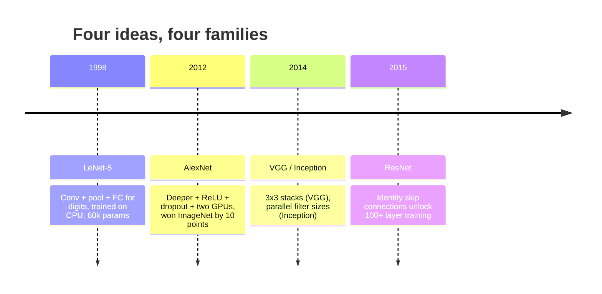
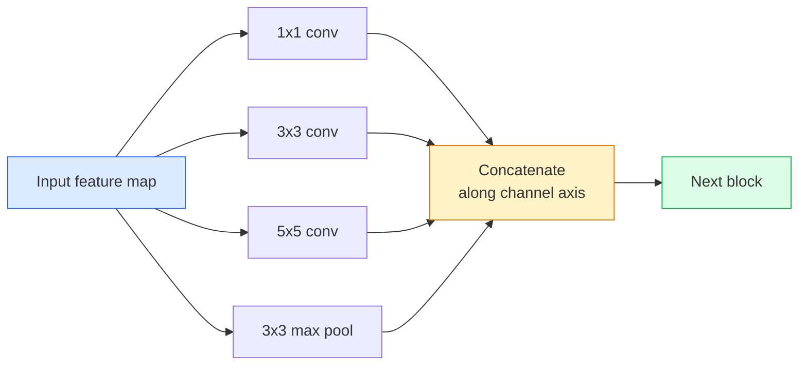
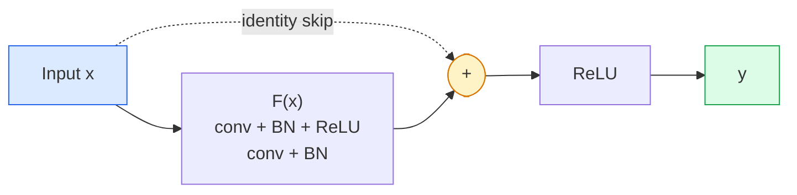

# CNNs  LeNet a ResNet  CNN arquitectura evolucionando  De LeNet a ResNet

> Cada gran CNN de los últimos treinta años es la misma receta de no linealidad con una nueva idea.

> **【中文解读】**过去三十年所有重要的CNN 都是同一个模板 (卷积-激活-下采样) 加上一个新想法.

**Type:** Learn + Build | **类型:** 学习 + 动手
**Languages:** Python | **语言:** Python
**Prerequisites:** Phase 3 Lesson 11 (PyTorch), Phase 4 Lesson 01 (Image Fundamentals), Phase 4 Lesson 02 (Convolutions from Scratch) | **前置知识:** Phase 3 Lesson 11（PyTorch），Phase 4 Lesson 01（图像基础），Phase 4 Lesson 02（从零实现卷积）
**Time:** ~75 minutes | **时间:** ~75 分钟

## Objetivos de aprendizaje

- Trazar el linaje arquitectónico LeNet-5 -> AlexNet -> VGG -> Inception -> ResNet y indicar la única nueva idea que cada familia contribuyó
- Implemente LeNet-5, un bloque de estilo VGG, y un ResNet BasicBlock en PyTorch, cada uno de menos de 40 líneas
- Explica por qué las conexiones residuales convierten una red de 1.000 capas de inentrainable en el estado de la técnica
- Lea una columna vertebral moderna (ResNet-18, ResNet-50) y predica su forma de salida, campo receptivo y número de parámetros antes de mirar la fuente

> **【中文解读】**El objetivo de aprendizaje enumera las capacidades centrales que debe dominarse después de completar la clase.


## El problema es la introducción del problema

En 2011, el mejor clasificador de ImageNet obtuvo una precisión del 74% en el top-5. En 2012 AlexNet obtuvo un 85%. En 2015, ResNet obtuvo un puntaje del 96%. No hay nuevos datos. No hay nueva generación de GPU. Las ganancias provinieron de las ideas de arquitectura. Un ingeniero de visión que trabaje tiene que saber de qué papel vino la idea porque cada espina dorsal de producción que envías en 2026 es una recombinación de esas mismas piezas y porque las ideas continúan transferidas: las conexiones agrupadas pasaron de CNN a transformadores, las conexiones residuales pasaron de ResNet a cada LLM existente, la normalización de lotes vive en modelos de difusión.

> En 2011, el mejor ImageNet top-5  precisión de la red de clasificación fue de aproximadamente 74%  En 2012, AlexNet alcanzó el 85%  En 2015 ResNet alcanzó el 96%  No hay nuevos datos  No hay nuevas GPU  Generaciones  Estos beneficios provienen de la idea de arquitectura  Un ingeniero de visión calificado debe saber qué idea proviene de qué artículo, porque en 2026 cada red de base de producción desplegada es de estos mismos segmentos de la red de red de red  y estas ideas también están en constante movimiento: el volumen de la red de red de red de CNN  se transfiere a Transformer, los residuos de conexión  ResNet  se expande a cada LLM existente, la reducción de volumen sobrevive en el modelo de distribución 

> **【中文解读】**Entre 2011-2015 años la tasa de exactidumbre de ImageNet se elevó del 74% al 96%, no se basa en nuevos datos o nuevas GPU, sino en la innovación arquitectónica. Estas innovaciones todavía se utilizan hasta el día de hoy: el grupo de componentes de la CNN se transfiere a Transformer, la conexión residual de ResNet se expande a todos los LLM, la cantidad se reúne para el modelo de difusión.

Estudiar estas redes para poder también te inmunizará contra un error común: buscar el modelo más grande disponible cuando una red del tamaño de LeNet resolvería el problema.

> 按顺序学习这些网络还能让你避免一个常见错误: Cuando LeNet tiene una red de tamaño grande que puede resolver un problema, utiliza el modelo más grande disponible. MNIST no necesita ResNet. Conocer la curva de reducción de cada familia puede decirle dónde debería sentarse.

## El concepto central.

### Las cuatro ideas que cambiaron la visión cambiaron las cuatro ideas de la visión de computadora



Nada más en la visión clásica importaba tanto como estos cuatro saltos.

> No hay nada más importante en el clásico.

### LeNet-5 (1998)

El reconocedor de dígitos de Yann LeCun. 60.000 parámetros. Dos bloques de conjuntos, dos capas completamente conectadas, activaciones tanh. Definía la plantilla que hereda cada CNN:

> El identificador digital de Yann LeCun  60.000 parámetros  dos volúmenes, dos niveles completos, tanh  activ define cada modelo de CNN:

```
input (1, 32, 32)
  conv 5x5 -> (6, 28, 28)
  avg pool 2x2 -> (6, 14, 14)
  conv 5x5 -> (16, 10, 10)
  avg pool 2x2 -> (16, 5, 5)
  flatten -> 400
  dense -> 120
  dense -> 84
  dense -> 10
```

Todo lo que el mundo moderno llama una CNN  convolucras alternadas y muestras de descenso alimentando una pequeña cabeza de clasificador  es LeNet con más capas, canales más grandes y mejores activaciones.

> El mundo moderno lo llama todo lo que se cambia en CNN en un pequeño segmento de la red de noticias que tiene más niveles, más canales y mejor activado.

> **【中文解读】**LeNet-5 definió todos los modelos básicos de CNN:卷积 → 池化 → 卷积 → 池化 → 全连接── sólo 60.000 parámetros, pero estableció la estructura básica del sistema de aprendizaje visual de profundidad──

### AlexNet (2012) es el punto de partida del aprendizaje profundo

Tres cambios que juntos rompieron ImageNet:

> Tres cambios han roto ImageNet:

1. **ReLU**Los gradientes dejan de desaparecer, el entrenamiento se acelera un factor de seis.
2. **Dropout**La regularización se convierte en una capa, no en un truco.
3. **Depth and width**Cinco capas de concha, tres capas densas, parámetros de 60M, entrenados en dos GPUs con el modelo dividido entre ellos.

La figura 2 del documento muestra todavía la división de la GPU como dos flujos paralelos. Ese paralelismo fue una solución de hardware, no una visión arquitectónica  pero las tres ideas anteriores todavía están en cada modelo que uses.

> El gráfico 2 del artículo muestra todavía que la GPU se divide en dos paralelos. La paralelidad es un factor de conveniencia de hardware, no de estructura, pero los tres puntos de vista anteriores siguen siendo de cada modelo que usted usa.

> **【拓展：AlexNet 的遗产】**AlexNet  Introducción de tres innovaciones hasta la actualidad no están presentes: 1) ReLU  Función activa resuelve el problema de la desaparición de la escala; 2) Desaparición y regulación para evitar la sobreadaptación; 3) profundidad + amplitud de la escalada de la idea.

### VGG (2014)  3x3 卷积的极致堆积

VGG preguntó: ¿qué pasa si sólo usas 3x3 convolsiones y vas a la profundidad?

> VGG 问道: Si sólo usas 3x3 卷积, ¿qué pasará?

```
stack:   conv 3x3 -> conv 3x3 -> pool 2x2
repeat:  16 or 19 conv layers
```

Dos convases 3x3 ven el mismo área de entrada 5x5 que una conva 5x5 pero con menos parámetros (2 * 9 * C^2 = 18C^2 vs 25 * C^2) y un ReLU adicional entre ambos. VGG convirtió esta observación en una arquitectura completa. La simplicidad  un tipo de bloque, repetido  lo convirtió en el punto de referencia para todo lo que vino después.

> 两个 3x3 卷积见的 5x5 输入区域与一个 5x5 卷积相同,但参数较少(2*9*C^2 = 18C^2 vs 25*C^2), en el medio hay una ReLU。VGG adicional que transformará esta observación en una estructura completa。简洁性一种块类型,重复使用使它成为后的参考点。

Costo: 138 millones de parámetros, lento en el entrenamiento, caro en la inferencia.

> 代价:1.38 亿参数, entrenamiento lento, recomendación costosa.

### La creación (2014, el mismo año)

La respuesta de Google a "¿qué tamaño de núcleo debería usar?" fue: todos ellos, en paralelo.

> La respuesta de Google a "¿qué debería usar el tamaño nuclear?" es:



Cada rama se especializa en  1x1 para mezclar canales, 3x3 para textura local, 5x5 para patrones más grandes, agrupando para características invariables de cambio  y el concat permite a la capa siguiente elegir cuál rama sea útil.

> Cada rama se especializa en diferentes aspectos1x1 utiliza para la mezcla de vías,3x3 utiliza para la estructura local,5x5 utiliza para un modelo más grande, piqueo para la distribución de características拼接让下层可以选择有用分支.

### El problema de degradación es más profundo y más malo.

En 2015, VGG-19 funcionó y VGG-32 no. La profundidad se suponía que ayudaría, pero después de ~20 capas tanto el entrenamiento como la pérdida de prueba empeoraron. Eso no es sobreajuste. Eso es el optimizador que no encuentra pesos útiles porque los gradientes se reducen multiplicativamente a través de cada capa.

> Para el 2015, el VGG-19 puede funcionar pero el VGG-32 no funciona. La profundidad debería haber sido útil, pero más de 20 niveles de entrenamiento y prueba posteriores se han vuelto más difíciles.

```
Plain deep network:
  y = f_L( f_{L-1}( ... f_1(x) ... ) )

Gradient wrt early layer:
  dL/dW_1 = dL/dy * df_L/df_{L-1} * ... * df_2/df_1 * df_1/dW_1

Each multiplicative term has magnitude roughly (weight magnitude) * (activation gain).
Stack 100 of them with gains < 1 and the gradient is effectively zero.
```

VGG trabajó en 19 capas porque la norma de lote (publicada simultáneamente) mantuvo las activaciones bien escaladas.

> VGG en 19 niveles en el tiempo de trabajo es debido a que la cantidad de regeneración (en la misma época) mantiene una buena reducción activa.

### ResNet (2015)  Restos de conexión  profundidad de aprendizaje

Él, Zhang, Ren, Sun propusieron un cambio que arregló todo:

> Él, Zhang, Ren, Sun propuso una modificación de todo:

```
standard block:   y = F(x)
residual block:   y = F(x) + x
```

El `+ x`significa que la capa siempre puede optar por no hacer nada conduciendo.`F(x)`Un ResNet de 1.000 capas es ahora tan malo como una red de 1 capa, porque cada bloque extra tiene una escotilla de escape trivial. Con esa garantía, el optimizador está dispuesto a hacer que cada bloque *ligeramente* útil  y ligeramente útil, apilado 100 veces, es de última generación.

> `+ x`Significa que esta capa siempre puede pasar.`F(x)`Tendencia a cero para elegir todo lo que no se hace. Un ResNet de 1000 niveles ahora es el más grande y el más diferente de una red de 1 nivel, porque cada bloque adicional tiene una simple vía de escape.



Dos variantes del bloque aparecen en todas partes:

> 两种块变体无处不在:

- **BasicBlock**Dos convoyes 3x3, saltar alrededor de ambos.
  La traducción de la lengua inglesa es:
- **Bottleneck**1x1 abajo, 3x3 medio, 1x1 arriba, saltar alrededor del trío.
  En el caso de los viajeros, el precio de la entrada es de un precio superior a la de los viajeros.

Cuando el salto tiene que cruzar una muestra descendente (pasada=2), el camino de identidad se sustituye por un 1x1 paso=2 conv para que coincida con las formas.

> Cuando el salto necesita atravesar la fase de la toma de pasos, el rango de los pasos es sustituido por un rango de pasos de 1x1 y 2 en forma de paso.

### ¿Por qué los residuos importan más allá de la visión?

La idea no era realmente la clasificación de imágenes. Se trataba de convertir las redes profundas de "cruzar los dedos y esperar que los gradientes sobrevivan" en una herramienta de ingeniería confiable y escalable.

> Esta idea no es realmente sobre la clasificación de imágenes. Se trata de transformar la red profunda de "la escala de oración puede sobrevivir" en un instrumento de ingeniería fiable y extensible.

> **【拓展：残差连接与 Transformer】**El residuo de conexión no sólo cambió la visión, sino que hizo que la red profunda de "preguntas de escalabilidad pueda sobrevivir" se convirtiera en un instrumento de ingeniería fiable.`y = F(x) + x`Se puede decir que es uno de los métodos más importantes de aprendizaje profundo.

> **【拓展：工业部署中的视觉系统】**En la implementación industrial real, los modelos de visión necesitan considerar la posibilidad de retraso, el tamaño del modelo, la adaptación de los dispositivos de borde, etc. TensorRT, ONNX Runtime, OpenVINO son herramientas de aceleración de la teoría de uso habitual.

```figure
pooling
```

## Construye el mismo

## Construye la práctica.

### Paso 1: LeNet-5 se ejecuta LeNet-5

Una LeNet mínima y fiel, activaciones tanh, agrupación media, la única concesión a la modernidad es que usemos`nn.CrossEntropyLoss`abajo en lugar de las conexiones gaussianas originales.

> Un LeNet minimizado, fiel, activo y medio.`nn.CrossEntropyLoss`En lugar de la conexión original.

```python
import torch
import torch.nn as nn
import torch.nn.functional as F

class LeNet5(nn.Module):
    def __init__(self, num_classes=10):
        super().__init__()
        self.conv1 = nn.Conv2d(1, 6, kernel_size=5)
        self.conv2 = nn.Conv2d(6, 16, kernel_size=5)
        self.pool = nn.AvgPool2d(2)
        self.fc1 = nn.Linear(16 * 5 * 5, 120)
        self.fc2 = nn.Linear(120, 84)
        self.fc3 = nn.Linear(84, num_classes)

    def forward(self, x):
        x = self.pool(torch.tanh(self.conv1(x)))
        x = self.pool(torch.tanh(self.conv2(x)))
        x = torch.flatten(x, 1)
        x = torch.tanh(self.fc1(x))
        x = torch.tanh(self.fc2(x))
        return self.fc3(x)

net = LeNet5()
x = torch.randn(1, 1, 32, 32)
print(f"output: {net(x).shape}")
print(f"params: {sum(p.numel() for p in net.parameters()):,}")
```

Producción esperada: `output: torch.Size([1, 10])`¿ Qué ?`params: 61,706`Es el clasificador de dígitos que comenzó la visión moderna.

> 预期输出:`output: torch.Size([1, 10])`¿Qué es esto?`params: 61,706` Éste es el inicio de la completa clasificación digital de la moderna visión

### Paso 2: Un bloque VGG para implementar el bloque VGG.

Un bloque reutilizable: dos convases 3x3, ReLU, norma de lote, máxima piscina.

> Un bloque replicable: dos 3x3 卷积、ReLU、批量归归化、最大池化──

```python
class VGGBlock(nn.Module):
    def __init__(self, in_c, out_c):
        super().__init__()
        self.conv1 = nn.Conv2d(in_c, out_c, kernel_size=3, padding=1)
        self.bn1 = nn.BatchNorm2d(out_c)
        self.conv2 = nn.Conv2d(out_c, out_c, kernel_size=3, padding=1)
        self.bn2 = nn.BatchNorm2d(out_c)
        self.pool = nn.MaxPool2d(2)

    def forward(self, x):
        x = F.relu(self.bn1(self.conv1(x)))
        x = F.relu(self.bn2(self.conv2(x)))
        return self.pool(x)

class MiniVGG(nn.Module):
    def __init__(self, num_classes=10):
        super().__init__()
        self.stack = nn.Sequential(
            VGGBlock(3, 32),
            VGGBlock(32, 64),
            VGGBlock(64, 128),
        )
        self.head = nn.Sequential(
            nn.AdaptiveAvgPool2d(1),
            nn.Flatten(),
            nn.Linear(128, num_classes),
        )

    def forward(self, x):
        return self.head(self.stack(x))

net = MiniVGG()
x = torch.randn(1, 3, 32, 32)
print(f"output: {net(x).shape}")
print(f"params: {sum(p.numel() for p in net.parameters()):,}")
```

Tres bloques VGG en una entrada de tamaño CIFAR, un grupo adaptativo, una capa lineal. ~290k parámetros.

> CIFAR 尺寸输入上的三个 VGG 块、自适应池化、一个线性层──约29万参数──对 CIFAR-10 有余──

### Paso 3: Un bloque básico de ResNet implementar el bloque básico de ResNet

El bloque de construcción central de ResNet-18 y ResNet-34.

> Los componentes centrales de ResNet-18 y ResNet-34 se han desarrollado en el mismo período.

```python
class BasicBlock(nn.Module):
    def __init__(self, in_c, out_c, stride=1):
        super().__init__()
        self.conv1 = nn.Conv2d(in_c, out_c, kernel_size=3, stride=stride, padding=1, bias=False)
        self.bn1 = nn.BatchNorm2d(out_c)
        self.conv2 = nn.Conv2d(out_c, out_c, kernel_size=3, stride=1, padding=1, bias=False)
        self.bn2 = nn.BatchNorm2d(out_c)
        if stride != 1 or in_c != out_c:
            self.shortcut = nn.Sequential(
                nn.Conv2d(in_c, out_c, kernel_size=1, stride=stride, bias=False),
                nn.BatchNorm2d(out_c),
            )
        else:
            self.shortcut = nn.Identity()

    def forward(self, x):
        out = F.relu(self.bn1(self.conv1(x)))
        out = self.bn2(self.conv2(out))
        out = out + self.shortcut(x)
        return F.relu(out)
```

`bias=False`En las capas de convección se encuentra una convención de norma de lote  El parámetro beta de BN ya maneja el sesgo, por lo que llevar un sesgo de convección también es un desperdicio.`shortcut`Sólo necesita un conv real cuando el número de pasos o canales cambia; de lo contrario es una identidad sin operación.

> 卷积层上                                                                                                                                                                                                                                                                                                                                                                                                                                                                                                                         `bias=False`El beta de la regeneración de la cantidad de BNB ya ha sido procesado, por lo que al mismo tiempo se conserva el volumen de regeneración como un desperdicio.`shortcut`Sólo se necesita un verdadero volumen cuando el paso o el número de pasos cambia; de lo contrario es inoperante.

### Paso 4: Construye una pequeña ResNet.

Coloque cuatro grupos de Bloques básicos para obtener una ResNet funcional para entradas del tamaño de CIFAR.

> 堆叠四组 BasicBlock 以获得适用于 CIFAR 尺寸输入工作ResNet。

```python
class TinyResNet(nn.Module):
    def __init__(self, num_classes=10):
        super().__init__()
        self.stem = nn.Sequential(
            nn.Conv2d(3, 32, kernel_size=3, stride=1, padding=1, bias=False),
            nn.BatchNorm2d(32),
            nn.ReLU(inplace=True),
        )
        self.layer1 = self._make_group(32, 32, num_blocks=2, stride=1)
        self.layer2 = self._make_group(32, 64, num_blocks=2, stride=2)
        self.layer3 = self._make_group(64, 128, num_blocks=2, stride=2)
        self.layer4 = self._make_group(128, 256, num_blocks=2, stride=2)
        self.head = nn.Sequential(
            nn.AdaptiveAvgPool2d(1),
            nn.Flatten(),
            nn.Linear(256, num_classes),
        )

    def _make_group(self, in_c, out_c, num_blocks, stride):
        blocks = [BasicBlock(in_c, out_c, stride=stride)]
        for _ in range(num_blocks - 1):
            blocks.append(BasicBlock(out_c, out_c, stride=1))
        return nn.Sequential(*blocks)

    def forward(self, x):
        x = self.stem(x)
        x = self.layer1(x)
        x = self.layer2(x)
        x = self.layer3(x)
        x = self.layer4(x)
        return self.head(x)

net = TinyResNet()
x = torch.randn(1, 3, 32, 32)
print(f"output: {net(x).shape}")
print(f"params: {sum(p.numel() for p in net.parameters()):,}")
```

Cuatro grupos de dos bloques cada uno. Paso 2 al comienzo de los grupos 2, 3, 4. El número de canales se duplica en cada muestra descendente. Parámetros de aproximadamente 2,8M. Esa es la receta estándar que escala limpio hasta ResNet-152.

> Cuatro grupos por grupo dos bloques. El segundo, tres, cuatro grupos comienzan a tener un ritmo de 2... por cada fase de la toma de datos.

### Paso 5: Comparar la eficiencia de parámetro a característica en comparación con la eficiencia de parámetro

Ejecutar la misma entrada a través de las tres redes y comparar los recuentos de parámetros.

> Se introducirá la misma entrada a través de las tres redes y se comparará el número de parámetros.

```python
def summary(name, net, x):
    y = net(x)
    params = sum(p.numel() for p in net.parameters())
    print(f"{name:12s}  input {tuple(x.shape)} -> output {tuple(y.shape)}  params {params:>10,}")

x = torch.randn(1, 3, 32, 32)
summary("LeNet5",     LeNet5(),       torch.randn(1, 1, 32, 32))
summary("MiniVGG",    MiniVGG(),      x)
summary("TinyResNet", TinyResNet(),   x)
```

Tres modelos, tres épocas, tres órdenes de magnitud en el conteo de parámetros. Para la precisión de CIFAR-10, necesitas aproximadamente: LeNet 60%, MiniVGG 89%, TinyResNet 93% después de unas pocas épocas de entrenamiento.

> Tres modelos, tres tiempos, tres niveles de parametros, tres niveles de parametros.


## Usalo en la práctica.

`torchvision.models`La firma de llamada es idéntica en todas las familias, que es exactamente el punto de la abstracción de la columna vertebral.

> `torchvision.models`给你上述所有模型的预训练版本――调用签名在各家族间完全相同,这是骨干网络抽象的意义所在――

```python
from torchvision.models import resnet18, ResNet18_Weights, vgg16, VGG16_Weights

r18 = resnet18(weights=ResNet18_Weights.IMAGENET1K_V1)
r18.eval()

print(f"ResNet-18 params: {sum(p.numel() for p in r18.parameters()):,}")
print(r18.layer1[0])
print()

v16 = vgg16(weights=VGG16_Weights.IMAGENET1K_V1)
v16.eval()
print(f"VGG-16   params: {sum(p.numel() for p in v16.parameters()):,}")
```

ResNet-18 tiene 11.7M parámetros. VGG-16 tiene 138M. Precisión similar a ImageNet top-1 (69.8% vs 71.6%). Las conexiones residuales te compran una victoria de eficiencia de parámetro de 12x. Es por eso que las variantes de ResNet dominaron desde 2016 hasta que ViT llegó en 2021  y todavía dominan las implementaciones del mundo real donde la computación es la restricción.

> **【中文解读】**ResNet-18(1170 millones de parámetros) vs VGG-16(1.38 mil millones de parámetros),ImageNet 准确率相近, pero la eficiencia de parámetros ha diferido 12 veces.

Para el aprendizaje de transferencia, la receta es siempre la misma: carga preentrenada, congelación de la columna vertebral, reemplazo de la cabeza del clasificador.

>  Para la migración de aprendizaje, el esquema es el mismo: carga de peso, 结骨干网络, sustitución de la clasificación de los equipos.

```python
for p in r18.parameters():
    p.requires_grad = False
r18.fc = nn.Linear(r18.fc.in_features, 10)
```

Ahora tienes un clasificador CIFAR de 10 clases que hereda las representaciones que ImageNet pagó.

> Tres líneas de código. Ahora tienes una clase 10 de CIFAR, que hereda la imagen de la red.


> **【拓展：数据标注与质量】**视觉任务的效果高度依赖标签数据质量──标签工作室、CVAT es la principal herramienta de marcado──在工业场景中,主动学习(Active Learning) puede reducir el costo de marcado: modelo a un requerimiento de muestras indeterminadas, marcación automática de muestras de determinación──

## Envío Lo . Entrega producto .

Esta lección produce:

> 本课产 出:

- `outputs/prompt-backbone-selector.md` una solicitud que seleccione la familia de CNN adecuada (LeNet/VGG/ResNet/MobileNet/ConvNeXt) para una tarea determinada, el tamaño del conjunto de datos y el presupuesto de cálculo.
  Traducción:给定任务、数据集大小和计算预算,选择正确 CNN
- `outputs/skill-residual-block-reviewer.md` una habilidad que lee un módulo PyTorch y señala los errores de omisión de conexión (falta de atajo en el cambio de paso, orden de activación de atajo, colocación BN en relación con la adición).
  En inglés, el lenguaje de la lengua china es "pyros" (pyros).

## Los ejercicios.

> **【中文解读】**Practice los temas de fácil/medio/duro  3 difficulty to pass in  Recomenda al menos completar los temas de grado medio  Grado duro  para la preparación de la entrevista


1. **(Easy | 简单)**Cuenta los parámetros a mano para `TinyResNet`capa por capa. Comparar con `sum(p.numel() for p in net.parameters())`¿Dónde se destina la mayor parte del presupuesto de parámetros  convs, BN o la cabeza de clasificación?
   Cálculo de los parámetros de TinyResNet por nivel, encontrar los parámetros principales en donde se encuentran 

2. **(Medium | 中等)**Implemente el bloque de cuello de botella (1x1 -> 3x3 -> 1x1 con saltar) y use para construir una red de estilo ResNet-50 para CIFAR.`TinyResNet`¿ Qué ?
   实现 Bloques de cuello de botella, construir ResNet-50 风格网络,对比参数量──

3. **(Hard | 困难)**Retira la conexión de salto de `BasicBlock`En el caso de las redes de formación de la red de "plain" de 34 bloques y de ResNet de 34 bloques en CIFAR-10 durante 10 épocas cada una.
   Se trata de un proyecto de investigación que se desarrolla en el ámbito de la salud y de la salud.

## Términos clave .

| Term | What people say | What it actually means | 中文释义 |
|------|----------------|----------------------|---------|
| Backbone | "The model" | The stack of convolutional blocks that produces the feature map fed to the task head | 骨干网络：产生特征图的卷积块堆叠 |
| Residual connection | "Skip connection" | `y = F(x) + x`; lets the optimiser learn identity by setting F to zero, which makes arbitrary depth trainable | 残差连接/跳跃连接：让任意深度可训练 |
| BasicBlock | "Two 3x3 convs with a skip" | The ResNet-18/34 building block: conv-BN-ReLU-conv-BN-add-ReLU | 基本块：ResNet-18/34 的构建单元 |
| Bottleneck | "1x1 down, 3x3, 1x1 up" | The ResNet-50/101/152 block; cheap at high channel counts because the 3x3 runs on a reduced width | 瓶颈块：1x1降维-3x3卷积-1x1升维 |
| Degradation problem | "Deeper is worse" | Past ~20 plain conv layers, both training and test error increase; solved by residual connections, not by more data | 退化问题：层数加深后训练和测试误差都增大 |
| Stem | "The first layer" | The initial conv that converts 3-channel input into the base feature width; usually 7x7 stride 2 for ImageNet, 3x3 stride 1 for CIFAR | 茎部：网络的初始卷积层 |
| Head | "The classifier" | The layers after the final backbone block: adaptive pool, flatten, linear(s) | 头部：骨干网络之后的分类器层 |
| Transfer learning | "Pretrained weights" | Loading a backbone trained on ImageNet and fine-tuning only the head on your task | 迁移学习：加载预训练权重，只微调头部 |

## Más Leer más Leer más

> **【中文解读】**延伸阅读 proporciona un alto nivel de recursos para el aprendizaje profundo. Estos artículos y cursos son los referentes clásicos en el campo, adecuados para los lectores que necesitan una comprensión profunda.


- [Deep Residual Learning for Image Recognition (He et al., 2015)](https://arxiv.org/abs/1512.03385) el documento ResNet; cada cifra vale la pena estudiar
- [Very Deep Convolutional Networks (Simonyan & Zisserman, 2014)](https://arxiv.org/abs/1409.1556) el documento VGG; sigue siendo la mejor referencia para "por qué 3x3"
- [ImageNet Classification with Deep CNNs (Krizhevsky et al., 2012)](https://papers.nips.cc/paper_files/paper/2012/hash/c399862d3b9d6b76c8436e924a68c45b-Abstract.html) AlexNet; el periódico que puso fin a la era de las características artesanales
- [Going Deeper with Convolutions (Szegedy et al., 2014)](https://arxiv.org/abs/1409.4842) La idea de filtro paralelo que todavía aparece en los transformadores de visión
