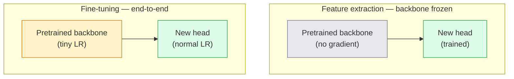

# Transferencia de aprendizaje y ajuste de la configuración  迁移学习与微调

> Alguien más pasó un millón de horas de GPU enseñando a una red cómo se ven los bordes, texturas y partes de objetos.

> **【中文解读】**别人花了百万GPU 小时教会网络识别边缘、纹理和物件部件──debes tomar estos rasgos primero antes de entrenar tu propio modelo──迁移学习 es la técnica más práctica en ingeniería artificial预训骨干 +自定义分类头 = 几行代码就能解决新任务──

> **【拓展：迁移学习在工业界的应用】**几乎所有生产级视觉系统都使用迁移学习:医疗影像(ImageNet 预训练 + 医学数据微调) 工业质检、自动驾驶――训练ResNet-50 需要 ~2000 GPU 小时,但微调只需几分钟――

**Type:** Build | **类型:** 动手
**Languages:** Python | **语言:** Python
**Prerequisites:** Phase 4 Lesson 03 (CNNs), Phase 4 Lesson 04 (Image Classification) | **前置知识:** Phase 4 Lesson 03（CNN），Phase 4 Lesson 04（图像分类）
**Time:** ~75 minutes | **时间:** ~75 分钟

## Objetivos de aprendizaje

- Distingue la extracción de características de la ajuste fino y elija la correcta en función del tamaño del conjunto de datos, la distancia del dominio y el presupuesto de cálculo
- Cargar una columna vertebral preentrenada, reemplazar su cabeza clasificadora y entrenar sólo la cabeza a una línea de base de trabajo en menos de 20 líneas
- Deshielo progresivo de capas con tasas de aprendizaje discriminatorias para que las características genéricas tempranas reciban actualizaciones más pequeñas que las tardías específicas de tareas
- Diagnóstico de los tres fallos comunes: la deriva de características de LR demasiado alto en bloques no congelados, BN estadísticas colapsar en pequeños conjuntos de datos, y el olvido catastrófico

> **【中文解读】**El objetivo de aprendizaje enumera las capacidades centrales que debe dominarse después de completar la clase.


## El problema es la introducción del problema

El entrenamiento de un ResNet-50 en ImageNet cuesta alrededor de 2.000 horas de GPU. Muy pocos equipos tienen ese presupuesto para cada tarea que envían. Lo que casi todos los equipos realmente envían es una columna vertebral preentrenada con una nueva cabeza entrenada en unos cientos o algunos miles de imágenes específicas de tareas.

> En la formación de la imagen de Red, ResNet-50 necesita aproximadamente 2000 GPUs. Pocos equipos tienen un presupuesto para cada entrega de tareas. En realidad, casi todos los equipos realizan una red de piezas de entrenamiento preliminares, además de un nuevo capítulo de entrenamiento en cientos o miles de tareas específicas de imagen.

> **【中文解读】**Desde el entrenamiento de cero ResNet-50  necesita ~2000 GPU 小时, pero el aprendizaje de migración solo requiere unos minutos.

Esto no es un atajo. El primer bloque de convección de cualquier CNN entrenado por ImageNet aprende bordes y filtros similares a Gabor. En los próximos bloques se aprenden texturas y motivos simples. Los bloques centrales aprenden partes de objetos. Los bloques finales aprenden combinaciones que comienzan a parecerse a las 1.000 categorías de ImageNet. El primer 90% de esa jerarquía se transfiere casi sin cambios a la imagen médica, la inspección industrial, los datos satelitales y todas las demás tareas de visión  porque la naturaleza tiene un vocabulario limitado de bordes y texturas. El último 10% es lo que realmente entrenas.

> Este no es un paso adelante. Cualquier otro de los primeros volúmenes de aprendizaje de la cadena de televisión CNN entrenado en ImageNet es un módulo de aprendizaje de bordes y clases Gabor 波器. Luego, algunos bloques de aprendizaje de bordes y modelos simples.

Para conseguir la transferencia correcta hay tres errores que te esperan: destruir características pre-entrenadas con una tasa de aprendizaje demasiado alta, dejar que el modelo de información se quede sin información congelada demasiado y dejar que las estadísticas de BatchNorm se deriven hacia un conjunto de datos diminuto del que el resto de la red nunca aprendió.

> Hay tres errores en tu espera: usar una tasa de aprendizaje demasiado alta para destruir las características del entrenamiento previo, y hacer que la estadística de funcionamiento de BatchNorm se desplace a una red en la que el resto de la red nunca ha aprendido.

> **【中文解读】**迁移学习最常见的三个坑: 1) el índice de aprendizaje demasiado alto destruyó las características del entrenamiento previo; 2) las múltiples capas de aprendizaje provocaron que el modelo no fuera adecuado; 3) las estadísticas de BatchNorm se desplazaron en un pequeño conjunto de datos.

## El concepto central.

> **【中文解读】**Este capítulo presenta los conceptos y teorías básicos. La comprensión de estos conceptos es el prerrequisito de la realización posterior de la actividad, y también el conocimiento de los puntos de alta frecuencia de la entrevista y la práctica de la ingeniería.


### Extracción de características frente a ajuste fino

Dos regímenes, elegidos por cuánto confías en las características preentrenadas y cuánto datos tienes.

>  Dos tipos de esquemas, dependen de cuánto confianza tienes en las características de entrenamiento previo y cuánto datos tienes



Reglas de los pulgares:

> 经验法则:

| Dataset size / 数据量 | Domain distance / 领域距离 | Recipe / 方案 |
|--------------|-----------------|--------|
| < 1k images | close to ImageNet / 接近 ImageNet | Freeze backbone, train head only / 冻结骨干，只训头部 |
| 1k-10k | close / 接近 | Freeze first 2-3 stages, fine-tune the rest / 冻结前2-3阶段，微调其余 |
| 10k-100k | any / 任意 | Fine-tune end-to-end with discriminative LR / 用判别性学习率端到端微调 |
| 100k+ | far / 远 | Fine-tune everything; consider training from scratch if domain is far enough / 全量微调；领域足够远则考虑从头训练 |

"Closes to ImageNet" significa aproximadamente fotos naturales RGB con contenido similar a objetos. Las tomografías CT médicas, las imágenes satelitales y la microscopía están lejos de ser posibles.

> "Cerca de la Red de Imágenes" significa "con contenido natural de objetos RGB" 照片──medicina CT 扫描、俯视卫星图像和显微镜图像是远领域特征仍然有助,但你需要让更多层适应──

> **【拓展：迁移学习策略选择】**En la práctica industrial, el tamaño y la distancia de los conjuntos de datos determinan la estrategia de migración: < 1k de la superficie y la proximidad con ImageNet; 10k + de la superficie de la superficie de la imagen; imágenes médicas, gráficos satelitales, etc.

### ¿Por qué el congelamiento funciona en absoluto?

La imagen de la red muestra que CNN aprende que no están especializados en las 1.000 categorías. Se especializan en las estadísticas de las imágenes naturales: bordes en orientaciones específicas, texturas, patrones de contraste, formas primitivas. Esas estadísticas son estables en casi todos los dominios visuales que un ser humano puede nombrar. Es por eso que un modelo entrenado en ImageNet y evaluado en CIFAR-10 con una nueva cabeza lineal (sin ajuste fino de la columna vertebral) alcanza una precisión de más del 80%. La cabeza está aprendiendo cuáles de las características ya aprendidas deben soportar para esta tarea.

> Las características de ImageNet aprendidas por CNN no se dedican a 1000 categorías. Se dedican a las características estadísticas de las imágenes naturales: bordes, texturas, modelos de comparación, formas y bases de imagen en una dirección específica. Estas características estadísticas son estables en casi todos los campos de visión humanos que pueden ser denominados. Por eso un modelo entrenado en ImageNet, solo con un nuevo modelo de cabeza de línea (la red de base no modificada) en CIFAR-10 puede alcanzar un 80% + de precisión en la evaluación de muestras.

### Taxas de aprendizaje discriminatorias

Cuando se descongela, las primeras capas deben entrenar más lentamente que las últimas capas. Las primeras capas codifican características genéricas que se quieren preservar; las últimas capas codifican la estructura específica de tareas que se necesita mover mucho.

> Cuando se resuelve, las primeras fases deben entrenar más lentamente que las últimas.

```
Typical recipe:

  stage 0 (stem + first group): lr = base_lr / 100    (mostly fixed)
  stage 1:                       lr = base_lr / 10
  stage 2:                       lr = base_lr / 3
  stage 3 (last backbone group): lr = base_lr
  head:                          lr = base_lr  (or slightly higher)
```

En PyTorch esto es sólo una lista de grupos de parámetros pasados al optimizador.

> En PyTorch, esto es simplemente transmitido a la lista de parámetros del optimizador. Un modelo, cinco tasas de aprendizaje, cero código adicional.

### El problema de la norma de batch

Las capas de BN se mantienen`running_mean`y `running_var`Buffers que se calcularon en ImageNet. Si su tarea tiene una distribución de píxeles diferente  diferentes iluminación, sensor, espacio de colores diferentes  esos buffers están equivocados. Tres opciones en orden de preferencias:

> BN 层持在ImageNet 上计算的 `running_mean`Y `running_var`缓冲区── Si tu tarea tiene diferentes imágenes distribuidas  diferentes luces  diferentes sensores  diferentes colores espacios  esos缓冲区 es erroso── en orden de prioridad hay tres opciones:

1. **Fine-tune with BN in train mode.**Permítan que BN actualice sus estadísticas de ejecución junto con todo lo demás.
2. **Freeze BN in eval mode.**Mantenga las estadísticas de ImageNet y entrenar sólo los pesos.
3. **Replace BN with GroupNorm.**Elimina el problema de la media móvil por completo. Se utiliza en la detección y segmentación de la columna vertebral donde el tamaño de lote por GPU es pequeño.

Si se equivocan, el silencio aumenta la precisión en 5-15%.

> 弄错这个会静默地降低 5-15% 的准确率──

### Diseño de la cabeza

La cabeza de clasificación es de 1-3 capas lineales más un abandono opcional.

> La cabeza de la máquina es 1-3 个线性层加一个可选的 dropout. Cada torchvision 骨干网络都附带一个你替换的默认头部:

```
backbone.fc = nn.Linear(backbone.fc.in_features, num_classes)          # ResNet
backbone.classifier[1] = nn.Linear(..., num_classes)                    # EfficientNet, MobileNet
backbone.heads.head = nn.Linear(..., num_classes)                       # torchvision ViT
```

Para los conjuntos de datos pequeños, una sola capa lineal suele ser suficiente. Agregar una capa oculta (Linear -> ReLU -> Dropout -> Linear) ayuda cuando la distribución de tareas está más lejos de la distribución de entrenamiento de la columna vertebral.

> 对于小数据集,单个线性层通常足够了. Cuando la distribución de tareas y la diferencia de distribución de entrenamiento de la red de los troncos es mayor, agregar la capa oculta Linear -> ReLU -> Dropout -> Linear) ayudará.

### Desintegración de las capas LR

Una versión más suave de LR discriminativo utilizado en el ajuste fino moderno (BEiT, DINOv2, ViT-B). En lugar de agrupar las capas en etapas, dar a cada capa una LR ligeramente menor que la que está encima de ella:

> 现代微调 (BeiT, DINOv2, ViT-B 微调) es una versión más simple de la tasa de aprendizaje de la diferenciación utilizada en la actualidad.

```
lr_layer_k = base_lr * decay^(L - k)
```

Con descomposición = 0,75 y L = 12 bloques de transformadores, los primeros bloques de trenes en `0.75^11 ≈ 0.04x`Es más importante para los transformeres de tono fino que para las CNN, donde los LR de grupo de escenario suelen ser suficientes.

> Cuando la descomposición = 0,75 y L = 12 bloques de transformador, el primer bloque tiene una tasa de aprendizaje de la cabeza.`0.75^11 ≈ 0.04x`                                                                                                                                                                                                                                                              

### Qué evaluar

Las carreras de transferencia de aprendizaje necesitan dos números que no rastrearías en una carrera de rasguño:

- **Pretrained-only accuracy**La exactitud de la cabeza con la columna vertebral congelada.
- **Fine-tuned accuracy** el mismo modelo después de un entrenamiento de extremo a extremo.

Si el ajuste fino es menor que el pre-entrenado, tienes un error de aprendizaje o BN.

> **【中文解读】**Este capítulo a través del código de la implementación de algoritmos centrales de cero. Este método "desde cero" puede ayudar a entender el principio detrás del marco, no se encuentra en la caja negra cuando se encuentran problemas.

> **【拓展：工业部署中的视觉系统】**En la implementación industrial real, los modelos de visión necesitan considerar la posibilidad de retraso, el tamaño del modelo, la adaptación de los dispositivos de borde, etc. TensorRT, ONNX Runtime, OpenVINO son herramientas de aceleración de la teoría de uso habitual.


## Construye y realiza.
```figure
transfer-learning
```

## Construye el mismo

### Paso 1: Cargue una columna vertebral preentrenada y inspeccione

```python
import torch
import torch.nn as nn
from torchvision.models import resnet18, ResNet18_Weights

backbone = resnet18(weights=ResNet18_Weights.IMAGENET1K_V1)
print(backbone)
print()
print("classifier head:", backbone.fc)
print("feature dim:", backbone.fc.in_features)
```

`ResNet18`Tiene cuatro etapas (`layer1..layer4`) más un tallo y un`fc`Cada columna vertebral de clasificación de torchvision tiene una estructura análoga.

### Paso 2: Extracción de características  congelar todo, reemplazar la cabeza

```python
def make_feature_extractor(num_classes=10):
    model = resnet18(weights=ResNet18_Weights.IMAGENET1K_V1)
    for p in model.parameters():
        p.requires_grad = False
    model.fc = nn.Linear(model.fc.in_features, num_classes)
    return model

model = make_feature_extractor(num_classes=10)
trainable = sum(p.numel() for p in model.parameters() if p.requires_grad)
frozen = sum(p.numel() for p in model.parameters() if not p.requires_grad)
print(f"trainable: {trainable:>10,}")
print(f"frozen:    {frozen:>10,}")
```

Sólo .`model.fc`La columna vertebral es un extractor de características congeladas.

### Paso 3: ajuste discriminatorio

Una utilidad que construye grupos de parámetros con tasas de aprendizaje específicas de etapa.

```python
def discriminative_param_groups(model, base_lr=1e-3, decay=0.3):
    stages = [
        ["conv1", "bn1"],
        ["layer1"],
        ["layer2"],
        ["layer3"],
        ["layer4"],
        ["fc"],
    ]
    groups = []
    for i, names in enumerate(stages):
        lr = base_lr * (decay ** (len(stages) - 1 - i))
        params = [p for n, p in model.named_parameters()
                  if any(n.startswith(k) for k in names)]
        if params:
            groups.append({"params": params, "lr": lr, "name": "_".join(names)})
    return groups

model = resnet18(weights=ResNet18_Weights.IMAGENET1K_V1)
model.fc = nn.Linear(model.fc.in_features, 10)
for p in model.parameters():
    p.requires_grad = True

groups = discriminative_param_groups(model)
for g in groups:
    print(f"{g['name']:>10s}  lr={g['lr']:.2e}  params={sum(p.numel() for p in g['params']):>8,}")
```

`decay=0.3`significa que cada etapa de trenes se realiza al 30% de la velocidad del siguiente. `fc`¿ Qué pasa ?`base_lr`¿ Qué ?`layer4`¿ Qué pasa ?`0.3 * base_lr`¿ Qué ?`conv1`¿ Qué pasa ?`0.3^5 * base_lr ≈ 0.00243 * base_lr`Sonido extremo, empíricamente funciona.

### Paso 4: Manejo de lotesNormal

Ayuda a congelar las estadísticas de BN sin congelar sus pesos.

```python
def freeze_bn_stats(model):
    for m in model.modules():
        if isinstance(m, (nn.BatchNorm1d, nn.BatchNorm2d, nn.BatchNorm3d)):
            m.eval()
            for p in m.parameters():
                p.requires_grad = False
    return model
```

Llámenlo después de que se pongan .`model.train()`al comienzo de cada época.`model.train()`El sistema de formación de las capas de formación de las capas de formación de las capas de formación de las capas de formación de las capas de formación de las capas de formación de las capas de formación de las capas de formación de las capas de formación de las capas de formación de las capas de formación de las capas de formación de las capas de formación de las capas de formación de las capas de formación de las capas de formación de las capas de formación de las capas de formación de las capas de formación de las capas de formación de las capas de formación de las capas de formación de las capas de formación de las capas de formación de las capas de formación de las capas de formación de las capas de formación de las capas de formación de las capas de las capas de formación de las capas de formación de las capas de las capas de formación de las capas de las capas de formación de las capas de las capas de formación de las capas de las capas de formación de las capas de las capas de formación de las capas de las capas de las capas de formación de las capas de las capas de las capas de formación de las capas de las capas de las capas de las capas de formación de las capas de las capas de las capas de las capas de formación de las capas de las capas de las capas de las capas de las capas de las capas de las capas de las capas de las capas de las capas de las capas de las capas de las capas de las capas de las capas de las capas de las capas de las capas de las capas de las capas de las capas de las capas de las capas de las capas de las capas de las capas de las capas de las capas de las capas de las capas de las capas de las capas de las capas de las capas de las capas de las capas de las capas de las capas de las capas de las capas de las capas de las capas de las capas de las capas de las capas de las capas de las capas de las capas de las capas de las capas de las capas de las capas

### Paso 5: Un ciclo mínimo de ajuste fino de extremo a extremo

```python
from torch.optim import SGD
from torch.utils.data import DataLoader
from torch.optim.lr_scheduler import CosineAnnealingLR
import torch.nn.functional as F

def fine_tune(model, train_loader, val_loader, device, epochs=5, base_lr=1e-3, freeze_bn=False):
    model = model.to(device)
    groups = discriminative_param_groups(model, base_lr=base_lr)
    optimizer = SGD(groups, momentum=0.9, weight_decay=1e-4, nesterov=True)
    scheduler = CosineAnnealingLR(optimizer, T_max=epochs)

    for epoch in range(epochs):
        model.train()
        if freeze_bn:
            freeze_bn_stats(model)
        tr_loss, tr_correct, tr_total = 0.0, 0, 0
        for x, y in train_loader:
            x, y = x.to(device), y.to(device)
            logits = model(x)
            loss = F.cross_entropy(logits, y, label_smoothing=0.1)
            optimizer.zero_grad()
            loss.backward()
            optimizer.step()
            tr_loss += loss.item() * x.size(0)
            tr_total += x.size(0)
            tr_correct += (logits.argmax(-1) == y).sum().item()
        scheduler.step()

        model.eval()
        va_total, va_correct = 0, 0
        with torch.no_grad():
            for x, y in val_loader:
                x, y = x.to(device), y.to(device)
                pred = model(x).argmax(-1)
                va_total += x.size(0)
                va_correct += (pred == y).sum().item()
        print(f"epoch {epoch}  train {tr_loss/tr_total:.3f}/{tr_correct/tr_total:.3f}  "
              f"val {va_correct/va_total:.3f}")
    return model
```

Se necesitan cinco épocas con la receta anterior de CIFAR-10 `ResNet18-IMAGENET1K_V1`La cabeza sola se situaría en un 86% sin tocar la columna vertebral.

### Paso 6: Descongelamiento progresivo

Un calendario que descongela una etapa por época desde el final hasta el principio.

```python
def progressive_unfreeze_schedule(model):
    stages = ["layer4", "layer3", "layer2", "layer1"]
    yielded = set()

    def start():
        for p in model.parameters():
            p.requires_grad = False
        for p in model.fc.parameters():
            p.requires_grad = True

    def unfreeze(epoch):
        if epoch < len(stages):
            name = stages[epoch]
            yielded.add(name)
            for n, p in model.named_parameters():
                if n.startswith(name):
                    p.requires_grad = True
            return name
        return None

    return start, unfreeze
```

Llamé`start()`Una vez antes de la primera época.`unfreeze(epoch)`Reconstruir el optimizador cada vez que el conjunto de parámetros entrenables cambia, de lo contrario los parámetros congelados todavía retienen momentos almacenados que lo confunden.


## Usalo con el marco de ejecución

> **【中文解读】**Este capítulo muestra cómo utilizar un marco maduro (como PyTorch、HuggingFace, etc.) para aplicar rápidamente esta tecnología. En los proyectos reales, se realiza con prioridad el uso de un marco experimentado, se pueden reducir errores y mejorar la eficiencia de desarrollo.


Para la mayoría de las tareas reales,`torchvision.models`La maquinaria más pesada sobre la cuestión cuando se encuentran en los problemas que los valores predeterminados de la biblioteca no pueden solucionar.

```python
from torchvision.models import resnet50, ResNet50_Weights

model = resnet50(weights=ResNet50_Weights.IMAGENET1K_V2)
model.fc = nn.Linear(model.fc.in_features, num_classes)
optimizer = torch.optim.AdamW(model.parameters(), lr=1e-4, weight_decay=1e-4)
```

Otras dos incumplimientos de nivel de producción:

- `timm`Naves ~ 800 espinas de visión preentrenadas con una API consistente (`timm.create_model("resnet50", pretrained=True, num_classes=10)`Para cualquier tono fino más allá del zoológico torchvision, es el estándar.
- Para transformadores, `transformers.AutoModelForImageClassification.from_pretrained(name, num_labels=N)`se le da ViT / BEiT / DeiT con la misma semántica de carga que los modelos de texto.

> **【中文解读】**Este capítulo se centra en cómo se puede implementar el modelo como producto disponible. Desde el modelo original hasta el sistema de producción, se deben considerar múltiples dimensiones de optimización de rendimiento, tratamiento de errores, control, etc.


> **【拓展：数据标注与质量】**视觉任务的效果高度依赖标签数据质量──标签工作室、CVAT es la principal herramienta de marcado──在工业场景中,主动学习(Active Learning) puede reducir el costo de marcado: modelo a un requerimiento de muestras indeterminadas, marcación automática de muestras de determinación──

## Envíe el producto .

Esta lección produce:

- `outputs/prompt-fine-tune-planner.md` un prompt que selecciona la extracción de características vs progresiva vs ajuste fino de extremo a extremo basado en el tamaño del conjunto de datos, la distancia del dominio y el presupuesto de cálculo.
- `outputs/skill-freeze-inspector.md` una habilidad que, dada un modelo PyTorch, informa qué parámetros son entrenables, qué capas de BatchNorm están en modo eval y si el optimizador está realmente alimentándose con los parámetros entrenables.

> **【中文解读】**Practice los temas de fácil/medio/duro  3 difficulty to pass in  Recomenda al menos completar los temas de grado medio  Grado duro  para la preparación de la entrevista


## Los ejercicios.

1. **(Easy | 简单)**Entrenamiento a `ResNet18`En el caso de las pruebas de detección de la velocidad de la sonda, el sistema de detección de la velocidad de la sonda puede ser utilizado como una sonda lineal (espina dorsal congelada) y como una sintética completa de la misma serie de datos CIFAR.
   Se trata de un método de análisis de la información y de la información que se utiliza para evaluar la información y la información.

2. **(Medium | 中等)**Introducir un error a propósito: set `base_lr = 1e-1`En el escenario de la columna vertebral en lugar de la cabeza.`discriminative_param_groups`Registra el LR en el que cada etapa comienza a divergir.
   Por lo tanto, el juego es un juego de cartas.`base_lr = 1e-1`Fabricando errores, observando la pérdida de entrenamiento explosion, luego recuperando la tasa de aprendizaje de forma determinada 👇

3. **(Hard | 困难)**Tomar un conjunto de datos de imágenes médicas (por ejemplo, CheXpert-small, PatchCamelyon o HAM10000) y comparar tres regímenes: (a) la columna vertebral congelada + cabeza lineal preentrenada por ImageNet; (b) la formación de tono fino de extremo a extremo reentrenada por ImageNet; (c) el entrenamiento de rascado.
   Utilize medical imag imagem data sets versus three schemes: a) 结骨干+线性头; b) 量微调; c) 零训练――报告准确率和计算成本,找出从零训练开始有竞争的最小数据集规模――

## Términos clave .

| Term | What people say | What it actually means | 中文释义 |
|------|----------------|----------------------|---------|
| Feature extraction | "Freeze and train head" | Backbone parameters frozen, only the new classifier head receives gradient | 特征提取：冻结骨干参数，只训练新的分类头 |
| Fine-tuning | "Retrain end-to-end" | All parameters trainable, usually with much smaller LR than scratch training | 微调：所有参数可训练，学习率远小于从零训练 |
| Discriminative LR | "Smaller LR for early layers" | Optimizer parameter groups where early-stage LR is a fraction of late-stage LR | 判别式学习率：早期层用更小的学习率 |
| Layer-wise LR decay | "Smooth LR gradient" | Per-layer LR multiplied by decay^(L - k); common in transformer fine-tunes | 逐层学习率衰减：每层 LR 乘以衰减系数 |
| Catastrophic forgetting | "The model lost ImageNet" | A too-high LR overwrites pretrained features before the new task signal is learnt | 灾难性遗忘：学习率过高导致预训练特征被覆盖 |
| BN statistics drift | "Running mean is wrong" | BatchNorm running_mean/var computed on a different distribution than the current task, silently hurting accuracy | BN 统计漂移：BatchNorm 的统计量与当前任务分布不匹配 |
| Linear probe | "Frozen backbone + linear head" | Evaluation of pretrained features — accuracy of the best linear classifier on top of the frozen representation | 线性探针：冻结骨干上训练线性分类器，评估预训练特征质量 |
| Catastrophic collapse | "Everything predicts one class" | Happens when fine-tuning with an LR high enough to destroy features before gradients from the head can stabilise | 灾难性崩塌：模型只预测一个类别 |

> **【中文解读】**延伸阅读 proporciona un alto nivel de recursos para el aprendizaje profundo. Estos artículos y cursos son los referentes clásicos en el campo, adecuados para los lectores que necesitan una comprensión profunda.


## Más Leer más Leer más

- [How transferable are features in deep neural networks? (Yosinski et al., 2014)](https://arxiv.org/abs/1411.1792) el papel que cuantifica la transferencia de características entre capas
- [Universal Language Model Fine-tuning (ULMFiT, Howard & Ruder, 2018)](https://arxiv.org/abs/1801.06146) la receta original de descongelación discriminativa LR / progresiva; las ideas se transfieren directamente a la visión
- [timm documentation](https://huggingface.co/docs/timm) la referencia para las espinas de visión modernas y los defectos precisos de ajuste fino con los que fueron entrenados
- [A Simple Framework for Linear-Probe Evaluation (Kornblith et al., 2019)](https://arxiv.org/abs/1805.08974) por qué importa la precisión de la sonda lineal y cómo reportarla correctamente
