# Detección de objetos  YOLO desde cero  目标检测  desde cero realizar YOLO

> La detección es la clasificación más regresión, ejecutada en cada posición en un mapa de características, luego limpiada con supresión no máxima.

> **【中文解读】**目标检测 = 分类 + 回归, ejecutarse en cada posición de la gráfica de características, luego con un inhibición de valor no extremo (NMS) para eliminar la revisión de la sección de análisis.

> **【拓展：YOLO 在自动驾驶中的应用】**YOLO es el algoritmo de detección de objetivos en tiempo real más común en la conducción automotriz, capaz de detectar a la vez a las personas, vehículos, señales de tráfico, etc. Desde YOLOv1 hasta YOLOv8, la velocidad y precisión mejoran continuamente, es uno de los marcos de detección más populares de la industria.

**Type:** Build | **类型:** 动手
**Languages:** Python | **语言:** Python
**Prerequisites:** Phase 4 Lesson 03 (CNNs), Phase 4 Lesson 04 (Image Classification), Phase 4 Lesson 05 (Transfer Learning) | **前置知识:** Phase 4 Lesson 03（CNN），Phase 4 Lesson 04（图像分类），Phase 4 Lesson 05（迁移学习）
**Time:** ~75 minutes | **时间:** ~75 分钟

## Objetivos de aprendizaje

- Explica el diseño de la cuadrícula y el anclaje que convierte la detección en un problema de predicción denso y especifique lo que significa cada número en el tensor de salida
- Computación de la intersección entre cajas y implementación de la supresión no máxima desde cero
- Construir una cabeza de estilo YOLO mínima en la parte superior de una columna vertebral preentrenada, incluyendo la clasificación, objetosidad y pérdidas de regresión de caja
- Lea una fila métrica de detección (precision@0.5, recall, mAP@0.5, mAP@0.5:0.95) y elija el botón que girar a continuación

> **【中文解读】**El objetivo de aprendizaje enumera las capacidades centrales que debe dominarse después de completar la clase.


## El problema es la introducción del problema

La clasificación dice "esta imagen es un perro". La detección dice "hay un perro en píxeles (112, 40, 280, 210), hay un gato en (400, 180, 560, 310), y nada más en el marco". Ese cambio estructural  que predice un número variable de cajas etiquetadas en lugar de una etiqueta por imagen  es de lo que depende todo sistema autónomo, todo producto de vigilancia, cada analizador de diseño de documentos y cada línea de visión de fábrica.

> Por ejemplo, el modelo de imagen de un modelo de imagen de un modelo de imagen de un modelo de imagen de un modelo de imagen de un modelo de imagen de un modelo de imagen de un modelo de imagen de un modelo de imagen de un modelo de imagen de un modelo de imagen de un modelo de imagen de un modelo de imagen de un modelo de imagen de un modelo de imagen de un modelo de imagen de un modelo de imagen de un modelo de imagen de un modelo de imagen de imagen de un modelo de imagen de imagen de un modelo de imagen de imagen de un modelo de imagen de imagen de un modelo de imagen de imagen de un modelo de imagen de imagen de un modelo de imagen de un modelo de imagen de un modelo de imagen de un modelo de imagen de un modelo de imagen de un modelo de imagen de un modelo de imagen de un modelo de imagen de un modelo de imagen de un modelo de imagen de una máquina de análisis de imagen de una máquina de imagen de una máquina de cada una máquina de la fábrica.

> **【中文解读】**Por ejemplo, el sistema de detección de los datos de los datos de los datos de los usuarios de los datos de los datos de los usuarios de los datos de los datos de los usuarios de los datos de los datos de los usuarios de los datos de los datos de los usuarios de los datos de los datos de los usuarios de los datos de los datos de los datos de los usuarios de los datos de los datos de los datos de los usuarios de los datos de los datos de los datos de los usuarios de los datos de los datos de los datos de los usuarios de los datos de los datos de los datos de los usuarios de los datos de los datos de los datos de los usuarios de los datos de los datos de los datos de los datos de los usuarios de los datos de los datos de los datos de los usuarios de los datos de los datos de los datos de los datos de los usuarios de los datos de los datos de los datos de los datos de los usuarios de los datos de los datos de los datos de los datos de los usuarios de los datos de los datos de los datos de los datos de los usuarios de los datos de los datos de los datos de los datos de los usuarios de los datos de los datos de los datos de los datos de los usuarios de los datos de los datos de los datos de los usuarios de los datos de los datos de los datos de los usuarios de los datos de los datos de los usuarios de los datos de los datos de los usuarios de los datos de los datos de los datos de los usuarios de los datos de los usuarios de los datos de los datos de los datos de los usuarios de los datos de los datos de los usuarios de los datos de los datos de Internet.

La detección es también donde cada cambio de ingeniería en la visión aparece de una vez. Se quieren cajas que son precisas (cabeza de regresión), se quiere la clase correcta para cada caja (cabeza de clasificación), se quiere que el modelo sabe cuando no hay nada para detectar (puntuación de objetividad), y se quiere exactamente una predicción por objeto real (suppresión no máxima). Si se pierde cualquiera de estos, la tubería o bien se pierde objetos, informa cajas alucinadas, o predice el mismo objeto quince veces en posiciones ligeramente diferentes.

> 检测也是视觉中所有的工程权衡同时出现的地方──你要框准确(回归头),你要每个框的类别正确(分类头),你要模型知道哪里没有什么要检测(目标性分数),你要每个真实物体恰好一个预测(非极大值抑制)──缺少任何一个,流水线要漏检测物体,要报告幻觉框,要把同一物体在略微不同的位置预测十五次──

YOLO (You Only Look Once, Redmon et al. 2016) fue el diseño que hizo todo esto en tiempo real haciéndolo con un solo paso hacia adelante de una red de conexión, y las mismas decisiones estructurales siguen siendo la columna vertebral de los detectores modernos (YOLOv8, YOLOv9, YOLO-NAS, RT-DETR).

> YOLO(You Only Look Once, Redmon etc 2016) es un diseño que, a través de un solo ciclo de volúmenes, se propaga para que todos estos procesos funcionen en el tiempo real, la misma estructura de decisión sigue siendo el modelo de los mismos componentes de los mismos.

> **【中文解读】**检测是视觉中所有工程权衡的交汇点:框要准确 (图片) 类别要正确 (图片) 类别要正确 (图片) 类头 (图片) 类别要正确 (图片) 类头 (图片) 类别要正确 (图片) 类别要正确 (图片) 类别要正确 (图片) 类别要正确 (图片) 类别要正确 (图片) 类别要正确 (图片) 类别要正确 (图片) 类别要正确 (图片) 类别要正确 (图片) 类别要正确 (图片) 类别要正确 (图片) 类别要正确 (图片) 类别要正确 (图片) 类别要正确 (图片) 类别要正确 (图片) 类别) 类别要知道哪里没有物体 (图片) 没有物体 (图片) 个体 (图片) 个体) 只有检测一次)                                                                                                                             

## El concepto central.

> **【中文解读】**Este capítulo presenta los conceptos y teorías básicos. La comprensión de estos conceptos es el prerrequisito de la realización posterior de la actividad, y también el conocimiento de los puntos de alta frecuencia de la entrevista y la práctica de la ingeniería.


### Detección como predicción densa

Un clasificador emite números C por imagen. Un detector de estilo YOLO emite.`(S x S x (5 + C))`números por imagen, donde S es el tamaño de la cuadrícula espacial.

> Por ejemplo, el sistema de análisis de imágenes de la imagen de la imagen de la imagen de la imagen de la imagen de la imagen de la imagen de la imagen de la imagen de la imagen de la imagen de la imagen de la imagen de la imagen de la imagen de la imagen de la imagen de la imagen de la imagen de la imagen de la imagen de la imagen de la imagen de la imagen de la imagen de la imagen de la imagen de la imagen de la imagen de la imagen de la imagen de la imagen de la imagen de la imagen de la imagen de la imagen de la imagen de la imagen de la imagen de la imagen de la imagen de la imagen de la imagen de la imagen de la imagen de la imagen de la imagen de la imagen de la imagen de la imagen de la imagen de la imagen de la imagen de la imagen de la imagen de la imagen de la imagen de la imagen de la imagen de la imagen de la imagen de la imagen de la imagen de la imagen de la imagen de la imagen de la imagen de la imagen de la imagen de la imagen de la imagen de la imagen de la imagen de la imagen de la imagen de la imagen de la imagen de la imagen de la imagen de la imagen de la imagen de la imagen de la imagen.`(S x S x (5 + C))`个数字, entre ellos S es la red espacial 格大小──

```mermaid
flowchart LR
    IMG["Input 416x416 RGB"] --> BB["Backbone<br/>(ResNet, DarkNet, ...)"]
    BB --> FM["Feature map<br/>(C_feat, 13, 13)"]
    FM --> HEAD["Detection head<br/>(1x1 convs)"]
    HEAD --> OUT["Output tensor<br/>(13, 13, B * (5 + C))"]
    OUT --> DEC["Decode<br/>(grid + sigmoid + exp)"]
    DEC --> NMS["Non-max suppression"]
    NMS --> RESULT["Final boxes"]

    style IMG fill:#dbeafe,stroke:#2563eb
    style HEAD fill:#fef3c7,stroke:#d97706
    style NMS fill:#fecaca,stroke:#dc2626
    style RESULT fill:#dcfce7,stroke:#16a34a
```



Cada uno de los `S * S`las células de la cuadrícula predicen `B`Cajas. Para cada caja:

> Cada uno .`S * S`网格单元预测                                                                                                                                                                                                                                                                                                                                                                                                                                                                                                                       `B`个框──对于每个框:

- 4 números describen la geometría: `tx, ty, tw, th`¿ Qué ?
  En el texto de la traducción de la lengua inglesa, el nombre de la palabra "casa" se indica en el texto de la traducción de la lengua inglesa.`tx, ty, tw, th`(centro de desplazamiento y largo de reducción)
- 1 es el puntaje de objetividad: "¿hay un objeto centrado en esta célula?"
  Traducción: 1 个数字是目标性分数:" ¿Tiene el centro de esta unidad algún objeto?"
- Los números C son probabilidades de clase.
  Cifras de C 个数字是类别概率.

Total por célula: `B * (5 + C)`. para VOC con `S=13, B=2, C=20`, eso es 50 números por célula.

> Cada unidad total:`B * (5 + C)` para los datos de VOC,`S=13, B=2, C=20`, es decir, cada unidad tiene 50 números.

### ¿Por qué las redes y los anclajes

La regresión simple predijo .`(x, y, w, h)`Para cada objeto como una coordenada absoluta. Eso es difícil para una red conve, porque traducir la imagen no debe traducir todas las predicciones por la misma cantidad  cada objeto está anclado espacialmente. La cuadrícula responde a esto asignando cada cuadro de verdad de base a la celda de la cuadrícula en la que cae su centro; sólo esa celda es responsable de ese objeto.

> Puramente volverá a tomar cada objeto `(x, y, w, h)`Como un sitón absoluto para predecir. Esto es difícil para la red de volúmenes, ya que la imagen plana no debe tener todas las predicciones de todas las dimensiones de desplazamiento plano. Cada objeto en el espacio es independiente.

Los anclajes abordan un segundo problema. Un conv 3x3 no puede regresar fácilmente una caja de 500 píxeles de ancho de una célula de campo receptivo de 16 píxeles.`B`El modelo aprende a elegir el anclaje correcto y empujarlo en lugar de regredir desde la nada.

> 框解决了第二个问题──3x3 卷积很难从16 像素感受野的特征单元回归到500 像素宽的框──因此我们为每单元预定义 `B`个先验框形状(框),并预测对每框的小偏移量──模型学习选择正确的框并微调,而不是从零回归──

```
Anchor box priors (example for 416x416 input):

  small:   (30,  60)
  medium:  (75,  170)
  large:   (200, 380)

At each grid cell, every anchor emits (tx, ty, tw, th, obj, c_1, ..., c_C).
```

Los detectores modernos a menudo usan FPN con diferentes conjuntos de anclajes por resolución  pequeños anclajes en mapas de alta resolución superficiales, grandes anclajes en mapas de baja resolución profunda.

> Los detectores modernos suelen usar FPN (FPN), en diferentes resoluciones, utilizando diferentes cuadros de alta resolución, cuadros de baja resolución, cuadros de baja resolución, cuadros de gran resolución, cuadros de baja resolución, cuadros de baja resolución, cuadros de baja resolución, cuadros de baja resolución, cuadros de baja resolución, cuadros de baja resolución, cuadros de baja resolución, cuadros de baja resolución, cuadros de baja resolución, cuadros de baja resolución, cuadros de baja resolución, cuadros de baja resolución, cuadros de baja resolución, cuadros de baja resolución, cuadros de baja resolución, cuadros de baja resolución, cuadros de baja resolución, cuadros de baja resolución, cuadros de baja resolución, cuadros de baja resolución, cuadros de baja resolución, cuadros de baja resolución, cuadros de baja resolución, cuadros de baja resolución, cuadros de baja resolución, cuadros de baja resolución, cuadros de baja resolución, cuadros de baja resolución, cuadros de baja resolución, cuadros de baja de baja de baja de baja de baja de baja de baja de baja de baja de baja de baja de baja de baja de baja de baja de baja de baja de baja de baja de baja de baja de baja de baja de baja de baja de baja de baja de baja de baja de baja de baja de baja de baja de baja de baja de baja de baja de baja de baja de baja de baja de baja de baja de baja de baja de baja de baja de baja de baja de baja de baja de baja de baja de baja de baja de baja de baja de baja de baja de baja de baja de baja de baja de baja de baja de baja de baja de baja de baja de baja de baja de baja de baja de baja de baja de baja de baja de baja de baja de baja de baja de baja de baja de baja de baja de baja de baja de baja de baja de baja de baja de baja de baja de baja de baja de baja de baja de baja de baja de baja de baja de baja de baja de baja de baja de baja de baja de baja de baja de baja de baja de baja de baja de baja de baja de baja de baja de baja de baja de baja de baja de baja de baja de baja de baja de baja de baja de baja de baja de baja de baja de baja de baja de baja de baja de baja de baja de baja de baja de baja de baja de baja de baja de baja de

### Las predicciones de decodificación

El crudo`tx, ty, tw, th`no son coordenadas de caja; son objetivos de regresión que deben transformarse antes de la traza:

> Originario `tx, ty, tw, th`No son cuadros; son los objetivos de regreso que necesitan ser transformados en el mapa:

```
centre x  = (sigmoid(tx) + cell_x) * stride
centre y  = (sigmoid(ty) + cell_y) * stride
width     = anchor_w * exp(tw)
height    = anchor_h * exp(th)
```

`sigmoid`mantiene los desplazamientos del centro dentro de la celda. `exp`permite la escala de ancho libremente desde el anclaje sin un giro de señal. `stride`Este paso de decodificación es el mismo en todas las versiones de YOLO desde v2.

> `sigmoid`Se limitará el movimiento del centro dentro de las unidades.`exp`让宽度可以从框自由缩放而不需要符号翻转.`stride`Se abreviará el código de la versión de YOLOv2 y se completará en todas las versiones de YOLO.

### El mismo

Metrica de similitud universal de detección entre dos cajas:

> 检测中两个 ramas entre la medida de similitud general:

```
IoU(A, B) = area(A intersect B) / area(A union B)
```

IoU = 1 significa idéntico; IoU = 0 significa que no hay superposición. IoU entre la predicción y la caja de verdad fundamental es lo que decide si una predicción cuenta como una verdadera positiva (típicamente IoU >= 0,5).

> IoU = 1 muestra completamente igual; IoU = 0 muestra completamente no superpuesta. IoU entre el cuadro de previsión y el cuadro de realidad decide si se calcula como caso real.

### Represión no máxima

Una red de conexión entrenada en anclas adyacentes a menudo predice cajas superpuestas para el mismo objeto. NMS mantiene la predicción de mayor confianza y elimina cualquier otra predicción con IoU por encima de un umbral.

> La red de volúmenes de entrenamiento en la estructura adyacente generalmente predice varios cuadros superpuestos del mismo objeto. NMS mantiene la predicción de la máxima confianza, y elimina con la predicción IoU                                                                                                                                                                                                                                       

```
NMS(boxes, scores, iou_threshold):
    sort boxes by score descending
    keep = []
    while boxes not empty:
        pick the top-scoring box, add to keep
        remove every box with IoU > iou_threshold to the picked box
    return keep
```

El límite típico: 0,45 para la detección de objetos.`soft-NMS`¿ Qué ?`DIoU-NMS`, o aprender la supresión directamente (RT-DETR) pero el propósito estructural es el mismo.

> 典型值:目标检测用 0.45──最近检测器用 `soft-NMS`¿Qué es esto?`DIoU-NMS`替代标准 NMS,或直接学习抑制策略 (RT-DETR), pero el objetivo estructural es el mismo.

### La pérdida

La pérdida de YOLO es tres pérdidas añadidas con pesas:

> YOLO 损失是三个损失函数加权求和:

```
L = lambda_coord * L_box(pred, target, where obj=1)
  + lambda_obj   * L_obj(pred, 1,     where obj=1)
  + lambda_noobj * L_obj(pred, 0,     where obj=0)
  + lambda_cls   * L_cls(pred, target, where obj=1)
```

Las células sin objetos contribuyen sólo a la pérdida de objetos (enseñar al modelo a permanecer en silencio). `lambda_noobj`Es generalmente pequeño (~0,5) porque la gran mayoría de las células están vacías y de otra manera dominarían la pérdida total.

>  sólo las unidades de objetos que contienen contribuyen a la regresión y la pérdida de categorías `lambda_noobj`Normalmente muy pequeño (aproximadamente 0,5), ya que la mayoría de las unidades están vacías, de lo contrario, se dominará la pérdida total.

Las variantes modernas intercambian la pérdida de caja MSE por CIoU / DIoU (que optimizan directamente la UIO), utilizan la pérdida focal para el desequilibrio de clase y equilibran la objetividad con la pérdida focal de calidad.

> 现代变体用 CIoU/DIoU(直接优化 IoU) sustitución MSE 框损失, con pérdida focal 处理类别不平衡, con pérdida focal de calidad平衡目标性──三组件结构不变──

### Metricas de detección

La precisión no se transfiere a la detección.

> 准确率 no es adecuado para la investigación.

- **Precision@IoU=0.5** de las predicciones contadas como positivas, cuántas son realmente correctas.
  En inglés:**Precision@IoU=0.5** En las predicciones de la realidad, hay muchas que son realmente correctas.
- **Recall@IoU=0.5**¿Cuántos de los objetos reales encontramos?
  En inglés:**Recall@IoU=0.5** En todos los objetos reales, hemos encontrado mucho.
- **AP@0.5** área de curva de recopilación de precisión en el umbral de UIO 0,5; un número por clase.
  En inglés:**AP@0.5** IoU valor 0.5 下的精确率-召回率曲线面积; cada clase es un número―
- **mAP@0.5:0.95** promedio de AP sobre los umbrales de UO 0,5, 0,55, ..., 0,95.
  En inglés:**mAP@0.5:0.95** AP en IoU valor 0.5、0.55、...、0.95  △ △ △ △ △ △ △ △ △ △ △ △ △ △ △ △ △ △ △ △ △ △ △ △ △ △ △ △ △ △ △ △ △ △ △ △ △ △ △ △ △ △ △ △ △ △ △ △ △ △ △ △ △ △ △ △ △ △ △ △ △ △ △ △ △ △ △ △ △ △ △ △ △ △ △ △ △ △ △ △ △ △ △ △ △ △ △ △ △ △ △ △ △ △ △ △ △ △ △ △ △ △ △ △ △ △ △ △ △ △ △ △ △ △ △ △ △ △ △ △ △ △ △ △ △ △ △ △ △ △ △ △ △ △ △ △ △ △ △ △ △ △ △ △ △ △ △ △ △ △ △ △ △ △ △ △ △ △ △ △ △ △ △ △ △ △ △ △ △ △ △ △ △ △ △ △ △ △ △ △ △ △ △ △ △ △ △ △ △ △ △ △ △ △ △ △ △ △ △ △ △ △ △ △ △ △ △ △ △ △                                                                     

Reporte los cuatro. Un detector que es fuerte en mAP@0.5 pero débil en mAP@0.5:0.95 está localizando aproximadamente pero no con fuerza; fija con una mejor pérdida de regresión de caja. Un detector con alta precisión y bajo recuerdo es demasiado conservador; baja el umbral de confianza o aumenta el peso de objetividad.

> 报告全部四个指标―― uno en mAP@0.5 上强但在 mAP@0.5:0.95 上弱的检测器定位粗略但不精确; con un mejor cuadro regresar a la pérdida para reparar―― un alto precisión bajo recall de los controles demasiado conservador; disminuir la confianza值或增加目标权重――

> **【拓展：工业部署中的视觉系统】**En la implementación industrial real, los modelos de visión necesitan considerar la posibilidad de retraso, el tamaño del modelo, la adaptación de los dispositivos de borde, etc. TensorRT, ONNX Runtime, OpenVINO son herramientas de aceleración de la teoría de uso habitual.

> **【拓展：数据标注与质量】**视觉任务的效果高度依赖标签数据质量──标签工作室、CVAT es la principal herramienta de marcado──在工业场景中,主动学习(Active Learning) puede reducir el costo de marcado: modelo a un requerimiento de muestras indeterminadas, marcación automática de muestras de determinación──


## Construye y realiza.

> **【中文解读】**Este capítulo a través del código de la implementación de algoritmos centrales de cero. Este método "desde cero" puede ayudar a entender el principio detrás del marco, no se encuentra en la caja negra cuando se encuentran problemas.

```figure
object-detection-nms
```

## Construye el mismo

### Paso 1: IU

El caballo de trabajo de toda la lección.`(x1, y1, x2, y2)`el formato.

> El tema principal de este curso es la elaboración de los dos grupos.`(x1, y1, x2, y2)`格式的框──

```python
import numpy as np

def box_iou(boxes_a, boxes_b):
    ax1, ay1, ax2, ay2 = boxes_a[:, 0], boxes_a[:, 1], boxes_a[:, 2], boxes_a[:, 3]
    bx1, by1, bx2, by2 = boxes_b[:, 0], boxes_b[:, 1], boxes_b[:, 2], boxes_b[:, 3]

    inter_x1 = np.maximum(ax1[:, None], bx1[None, :])
    inter_y1 = np.maximum(ay1[:, None], by1[None, :])
    inter_x2 = np.minimum(ax2[:, None], bx2[None, :])
    inter_y2 = np.minimum(ay2[:, None], by2[None, :])

    inter_w = np.clip(inter_x2 - inter_x1, 0, None)
    inter_h = np.clip(inter_y2 - inter_y1, 0, None)
    inter = inter_w * inter_h

    area_a = (ax2 - ax1) * (ay2 - ay1)
    area_b = (bx2 - bx1) * (by2 - by1)
    union = area_a[:, None] + area_b[None, :] - inter
    return inter / np.clip(union, 1e-8, None)
```

Retorna un `(N_a, N_b)`Matrix de IoU en par. Utilice contra una sola caja de verdad de base haciendo que una de las matrices forme`(1, 4)`¿ Qué ?

>  regresar `(N_a, N_b)`De hecho, uno de los números de la matriz se establece en la`(1, 4)`形形即可对单个真实框使用──

### Paso 2: Supresión no máxima

```python
def nms(boxes, scores, iou_threshold=0.45):
    order = np.argsort(-scores)
    keep = []
    while len(order) > 0:
        i = order[0]
        keep.append(i)
        if len(order) == 1:
            break
        rest = order[1:]
        ious = box_iou(boxes[[i]], boxes[rest])[0]
        order = rest[ious <= iou_threshold]
    return np.array(keep, dtype=np.int64)
```

Determinista,`O(N log N)`de la especie, y coincide con el comportamiento de `torchvision.ops.nms`en entradas idénticas.

> 确定性的,排序复杂度 `O(N log N)`, en la misma entrada con`torchvision.ops.nms`El comportamiento de la coincidencia.

### Paso 3: codificación y decodificación de cajas

Convertir entre las coordenadas de píxeles y el `(tx, ty, tw, th)`objetivos que la red realmente regresa.

```python
def encode(box_xyxy, cell_x, cell_y, stride, anchor_wh):
    x1, y1, x2, y2 = box_xyxy
    cx = 0.5 * (x1 + x2)
    cy = 0.5 * (y1 + y2)
    w = x2 - x1
    h = y2 - y1
    tx = cx / stride - cell_x
    ty = cy / stride - cell_y
    tw = np.log(w / anchor_wh[0] + 1e-8)
    th = np.log(h / anchor_wh[1] + 1e-8)
    return np.array([tx, ty, tw, th])


def decode(tx_ty_tw_th, cell_x, cell_y, stride, anchor_wh):
    tx, ty, tw, th = tx_ty_tw_th
    cx = (sigmoid(tx) + cell_x) * stride
    cy = (sigmoid(ty) + cell_y) * stride
    w = anchor_wh[0] * np.exp(tw)
    h = anchor_wh[1] * np.exp(th)
    return np.array([cx - w / 2, cy - h / 2, cx + w / 2, cy + h / 2])


def sigmoid(x):
    return 1.0 / (1.0 + np.exp(-x))
```

Prueba: codificar una caja y luego decodificar  debe volver a algo muy cerca del original (hasta que la sigmoide inversa no sea perfectamente invertible cuando `tx`no está en el rango possigmoide).

### Paso 4: Una cabeza de YOLO mínima

Una conformación 1x1 en un mapa de características, remodelación a `(B, S, S, num_anchors, 5 + C)`¿ Qué ?

```python
import torch
import torch.nn as nn

class YOLOHead(nn.Module):
    def __init__(self, in_c, num_anchors, num_classes):
        super().__init__()
        self.num_anchors = num_anchors
        self.num_classes = num_classes
        self.conv = nn.Conv2d(in_c, num_anchors * (5 + num_classes), kernel_size=1)

    def forward(self, x):
        n, _, h, w = x.shape
        y = self.conv(x)
        y = y.view(n, self.num_anchors, 5 + self.num_classes, h, w)
        y = y.permute(0, 3, 4, 1, 2).contiguous()
        return y
```

Forma de salida: `(N, H, W, num_anchors, 5 + C)`La última dimensión es válida .`[tx, ty, tw, th, obj, cls_0, ..., cls_{C-1}]`¿ Qué ?

### Paso 5: Asenamiento de la verdad fundamental

Para cada caja de verdad fundamental, decide cuál.`(cell, anchor)`es responsable.

```python
def assign_targets(boxes_xyxy, classes, anchors, stride, grid_size, num_classes):
    num_anchors = len(anchors)
    target = np.zeros((grid_size, grid_size, num_anchors, 5 + num_classes), dtype=np.float32)
    has_obj = np.zeros((grid_size, grid_size, num_anchors), dtype=bool)

    for box, cls in zip(boxes_xyxy, classes):
        x1, y1, x2, y2 = box
        cx, cy = 0.5 * (x1 + x2), 0.5 * (y1 + y2)
        gx, gy = int(cx / stride), int(cy / stride)
        bw, bh = x2 - x1, y2 - y1

        ious = np.array([
            (min(bw, aw) * min(bh, ah)) / (bw * bh + aw * ah - min(bw, aw) * min(bh, ah))
            for aw, ah in anchors
        ])
        best = int(np.argmax(ious))
        aw, ah = anchors[best]

        target[gy, gx, best, 0] = cx / stride - gx
        target[gy, gx, best, 1] = cy / stride - gy
        target[gy, gx, best, 2] = np.log(bw / aw + 1e-8)
        target[gy, gx, best, 3] = np.log(bh / ah + 1e-8)
        target[gy, gx, best, 4] = 1.0
        target[gy, gx, best, 5 + cls] = 1.0
        has_obj[gy, gx, best] = True
    return target, has_obj
```

La selección de anclaje es "mejor forma IoU con la verdad de la tierra"  un proxy barato que coincide con la asignación YOLOv2/v3. v5 y posteriores utilizan estrategias más sofisticadas (ajuste alineado con tareas, k dinámico) que refinan la misma idea.

### Paso 6: Las tres pérdidas

```python
def yolo_loss(pred, target, has_obj, lambda_coord=5.0, lambda_obj=1.0, lambda_noobj=0.5, lambda_cls=1.0):
    has_obj_t = torch.from_numpy(has_obj).bool()
    target_t = torch.from_numpy(target).float()

    # box-regression loss: only on cells with objects
    box_pred = pred[..., :4][has_obj_t]
    box_true = target_t[..., :4][has_obj_t]
    loss_box = torch.nn.functional.mse_loss(box_pred, box_true, reduction="sum")

    # objectness loss
    obj_pred = pred[..., 4]
    obj_true = target_t[..., 4]
    loss_obj_pos = torch.nn.functional.binary_cross_entropy_with_logits(
        obj_pred[has_obj_t], obj_true[has_obj_t], reduction="sum")
    loss_obj_neg = torch.nn.functional.binary_cross_entropy_with_logits(
        obj_pred[~has_obj_t], obj_true[~has_obj_t], reduction="sum")

    # classification loss on cells with objects
    cls_pred = pred[..., 5:][has_obj_t]
    cls_true = target_t[..., 5:][has_obj_t]
    loss_cls = torch.nn.functional.binary_cross_entropy_with_logits(
        cls_pred, cls_true, reduction="sum")

    total = (lambda_coord * loss_box
             + lambda_obj * loss_obj_pos
             + lambda_noobj * loss_obj_neg
             + lambda_cls * loss_cls)
    return total, {"box": loss_box.item(), "obj_pos": loss_obj_pos.item(),
                   "obj_neg": loss_obj_neg.item(), "cls": loss_cls.item()}
```

Cinco hiperparámetros que cada tutorial de YOLO codifica o borra.`lambda_coord=5, lambda_noobj=0.5`refleja el papel original YOLOv1 y sigue funcionando como un defecto razonable.

### Paso 7: Pipeline de interferencia

Decodificar la salida de cabeza en bruto, aplicar sigmoid/exp, umbral de objetividad y NMS.

```python
def postprocess(pred_tensor, anchors, stride, img_size, conf_threshold=0.25, iou_threshold=0.45):
    pred = pred_tensor.detach().cpu().numpy()
    grid_h, grid_w = pred.shape[1], pred.shape[2]
    num_anchors = len(anchors)

    boxes, scores, classes = [], [], []
    for gy in range(grid_h):
        for gx in range(grid_w):
            for a in range(num_anchors):
                tx, ty, tw, th, obj, *cls = pred[0, gy, gx, a]
                score = sigmoid(obj) * sigmoid(np.array(cls)).max()
                if score < conf_threshold:
                    continue
                cls_idx = int(np.argmax(cls))
                cx = (sigmoid(tx) + gx) * stride
                cy = (sigmoid(ty) + gy) * stride
                w = anchors[a][0] * np.exp(tw)
                h = anchors[a][1] * np.exp(th)
                boxes.append([cx - w / 2, cy - h / 2, cx + w / 2, cy + h / 2])
                scores.append(float(score))
                classes.append(cls_idx)

    if not boxes:
        return np.zeros((0, 4)), np.zeros((0,)), np.zeros((0,), dtype=int)
    boxes = np.array(boxes)
    scores = np.array(scores)
    classes = np.array(classes)
    keep = nms(boxes, scores, iou_threshold)
    return boxes[keep], scores[keep], classes[keep]
```

> **【中文解读】**Este capítulo muestra cómo utilizar un marco maduro (como PyTorch、HuggingFace, etc.) para aplicar rápidamente esta tecnología. En los proyectos reales, se realiza con prioridad el uso de un marco experimentado, se pueden reducir errores y mejorar la eficiencia de desarrollo.


Ese es el camino de evaluación completo: cabeza -> decodificación -> umbral -> NMS.


> **【拓展：视觉模型的持续学习】**En el entorno de producción, el modelo visual necesita adaptarse continuamente a nuevos datos. Esto es especialmente importante en la conducción automotriz y el control de calidad industrial.

## Usalo con el marco de ejecución

`torchvision.models.detection`El modelo de carga de un modelo pre-entrenado requiere tres líneas.

```python
import torch
from torchvision.models.detection import fasterrcnn_resnet50_fpn_v2

model = fasterrcnn_resnet50_fpn_v2(weights="DEFAULT")
model.eval()
with torch.no_grad():
    predictions = model([torch.randn(3, 400, 600)])
print(predictions[0].keys())
print(f"boxes:  {predictions[0]['boxes'].shape}")
print(f"scores: {predictions[0]['scores'].shape}")
print(f"labels: {predictions[0]['labels'].shape}")
```

Para las tuberías de inferencia en tiempo real,`ultralytics`(YOLOv8/v9) es la norma: `from ultralytics import YOLO; model = YOLO('yolov8n.pt'); model(img)`. El modelo maneja el decodificación y el NMS internamente y devuelve lo mismo `boxes / scores / labels`triple que construiste arriba.

> **【中文解读】**Este capítulo se centra en cómo se puede implementar el modelo como producto disponible. Desde el modelo original hasta el sistema de producción, se deben considerar múltiples dimensiones de optimización de rendimiento, tratamiento de errores, control, etc.


## Envíe el producto .

Esta lección produce:

- `outputs/prompt-detection-metric-reader.md` un aviso que gira un `precision, recall, AP, mAP@0.5:0.95`en un diagnóstico de una línea y el siguiente experimento más útil.
- `outputs/skill-anchor-designer.md` una habilidad que, dada una serie de datos de cajas de verdad fundamental, ejecuta k-medios en `(w, h)`y devuelve conjuntos de anclajes por nivel FPN más las estadísticas de cobertura que necesita para elegir el número correcto de anclajes.

> **【中文解读】**Practice los temas de fácil/medio/duro  3 difficulty to pass in  Recomenda al menos completar los temas de grado medio  Grado duro  para la preparación de la entrevista


## Los ejercicios.

1. **(Easy | 简单)**Implementación `box_iou`y correr contra .`torchvision.ops.box_iou`Verifique si la diferencia absoluta máxima es inferior.`1e-6`¿ Qué ?
                                                                                                                                                                                                                                                                                                                                                                                                                                                                                                                                `box_iou`Y con torchvision de la realización en 1000 en comparación con el marco de coincidencia, prueba el mayor error < 1e-6:.

2. **(Medium | 中等)**Puerto `yolo_loss`a una versión que utiliza `CIoU`En un conjunto de datos sintéticos de 100 imágenes, muestra que la CIoU converge a un mAP@0.5:0.95 final mejor que la MSE en el mismo número de épocas.
   ¿ Qué ?`yolo_loss`改为使用CIoU 框损失(替代MSE), en el conjunto de datos de prueba de CIoU 收到更高的mAP──

3. **(Hard | 困难)**Implemente inferencia a múltiples escalas: alimenta la misma imagen a tres resoluciones a través del modelo, une las predicciones de la caja y ejecuta un solo NMS al final. Mide la inferencia a escala única en un conjunto prolongado.
   实现 multi-dimensiones: utilizar tres resoluciones de análisis separados, juntar y predicir los cuadro después de hacer un NMS, medir la comparación de un mapa de una sola dimensión 提升──

## Términos clave .

| Term | What people say | What it actually means | 中文释义 |
|------|----------------|----------------------|---------|
| Anchor | "Box prior" | A pre-defined box shape at each grid cell from which the network predicts deltas instead of absolute coordinates | 锚框：预定义的框形状，网络只预测相对于锚框的偏移量 |
| IoU | "Overlap" | Intersection-over-union of two boxes; the universal similarity measure in detection | IoU：交并比，检测中通用的相似度度量 |
| NMS | "Deduplicate" | Greedy algorithm that keeps highest-score predictions and removes overlapping ones above a threshold | NMS：非极大值抑制，去除重复检测框 |
| Objectness | "Is there something here" | Per-anchor, per-cell scalar predicting whether an object is centred in that cell | 置信度/目标性：预测该位置是否有物体 |
| Grid stride | "Downsample factor" | Pixels per grid cell; a 416-px input with a 13-grid head has stride 32 | 网格步长：每个网格单元对应的像素数 |
| mAP | "Mean average precision" | Average of the area under the precision-recall curve, averaged over classes and (for COCO) IoU thresholds | mAP：平均精度均值，检测的核心评估指标 |
| AP@0.5 | "PASCAL VOC AP" | Average precision with IoU threshold 0.5; the lenient version of the metric | AP@0.5：IoU 阈值 0.5 的平均精度（宽松版） |
| mAP@0.5:0.95 | "COCO AP" | Average over IoU thresholds 0.5..0.95 step 0.05; the strict version and current community standard | mAP@0.5:0.95：多个 IoU 阈值的平均（严格版，COCO 标准） |

> **【中文解读】**延伸阅读 proporciona un alto nivel de recursos para el aprendizaje profundo. Estos artículos y cursos son los referentes clásicos en el campo, adecuados para los lectores que necesitan una comprensión profunda.


## Más Leer más Leer más

- [YOLOv1: You Only Look Once (Redmon et al., 2016)](https://arxiv.org/abs/1506.02640) el papel de fundación; cada YOLO desde entonces es un refinamiento de esta estructura
- [YOLOv3 (Redmon & Farhadi, 2018)](https://arxiv.org/abs/1804.02767) el papel que introdujo cabezas de estilo FPN a múltiples escalas; todavía el diagrama más claro
- [Ultralytics YOLOv8 docs](https://docs.ultralytics.com) la referencia de producción actual; cubre los formatos de los conjuntos de datos, los complementos, las recetas de formación
- [The Illustrated Guide to Object Detection (Jonathan Hui)](https://jonathan-hui.medium.com/object-detection-series-24d03a12f904) mejor recorrido en inglés simple por el zoológico de detectores completos; invaluable para entender cómo se relacionan DETR, RetinaNet, FCOS y YOLO
