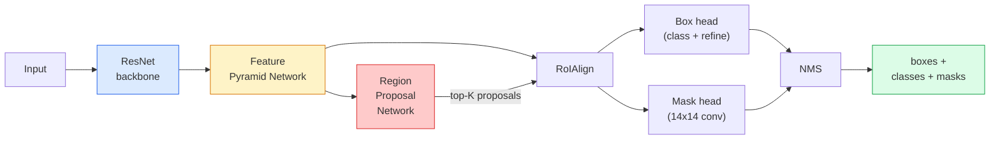

# Segmentación de instancia  Máscara R-CNN  实例分分  Máscara R-CNN

> Añadir una pequeña rama de máscara a un detector R-CNN más rápido y tienes segmentación de instancia. La parte difícil es RoIAlign, y es más difícil de lo que parece.

> **【中文解读】**En el detector R-CNN más rápido se añade una rama de encubierto para obtener la división de ejemplos. La dificultad consiste en que RoIAlign (RoIAlign) haga un mapa de características de diferentes tamaños de la zona candidata para que se ajuste a la dimensión fija, y mantenga la precisión espacial. La diferencia entre la división de ejemplos y la división de lenguaje es que la división de ejemplos puede distinguir a diferentes individuos de los mismos tipos (como cada uno en la imagen).

> **【拓展：实例分割的应用】**Máscara R-CNN  amplio utilizado en la conducción automática 区分不同车辆和行人) 机器人抓取 识别单个物体轮) 视频编辑 精确图)  RoIAlign 技术后来也被用于视觉变压器的适配器中──

**Type:** Build + Learn | **类型:** 动手 + 学习
**Languages:** Python | **语言:** Python
**Prerequisites:** Phase 4 Lesson 06 (YOLO), Phase 4 Lesson 07 (U-Net) | **前置知识:** Phase 4 Lesson 06（YOLO），Phase 4 Lesson 07（U-Net）
**Time:** ~75 minutes | **时间:** ~75 分钟

## Objetivos de aprendizaje

- Rastrear la arquitectura de la máscara R-CNN de extremo a extremo: columna vertebral, FPN, RPN, RoIAlign, cabeza de caja, cabeza de máscara
- Implementar RoIAlign desde cero y explicar por qué ya no se utiliza RoIPool
- Usa la visión de la antorcha `maskrcnn_resnet50_fpn_v2`modelo pre-entrenado para máscaras de instancia de calidad de producción y lectura correcta de su formato de salida
- La capa de máscara R-CNN de ajuste fino en un pequeño conjunto de datos personalizado mediante la sustitución de la caja y las cabezas de máscara y la congelación de la columna vertebral

> **【中文解读】**El objetivo de aprendizaje enumera las capacidades centrales que debe dominarse después de completar la clase.


## El problema es la introducción del problema

La segmentación semántica le da una máscara por clase. La segmentación de instancia le da una máscara por objeto, incluso cuando dos objetos comparten una clase. Contar individuos, rastrear los marcos y medir cosas (la caja de límite de cada ladrillo en una pared, cada célula en una imagen del microscopio) todo requiere segmentación de instancia.

> 语义分给你每类一个掩码――实例分给你每类一个掩码――实例分给你每类一个掩码――实例分给你每类一个掩码――实例分给你每类一个掩码――实例分给你每类一个掩码――实例分给你每类一个掩码――实例分给你每类一个掩码――实例分给你每类一个掩码――实例分给你每类一个掩码――实例分给你每种物体一个掩码――实例分分给你每种物体都属于同一类别――数个物、跨跟踪和测量东西――每块墙壁的边界框――显微镜图像中每细胞) 需要实例分分――

Mask R-CNN (He et al., 2017) resolvió esto reformando la segmentación de instancia como detección-más-una-máscara. El diseño fue tan limpio que durante los próximos cinco años casi todos los papeles de segmentación de instancia fueron una variante de Mask R-CNN, y la implementación de torchvision sigue siendo el estándar de producción para conjuntos de datos pequeños a medianos.

> Máscara R-CNN (en inglés) [1] [2] [2] [2] [2] [2] [3] [4] [4] [4] [4] [5] [5] [5] [5] [5] [5] [6] [7] [7] [7] [8] [8] [8] [8] [8] [8] [9] [9] [9] [9] [9] [9] [9] [9] [9] [9] [9] [9] [9] [9] [9] [9] [9] [9] [9] [9] [9] [9] [9] [9] [9] [9] [9] [9] [9] [9] [9] [9] [10] [10] [10] [10] [10] [10] [10] [10] [10] [10] [10] [10] [10] [10] [10] [10] [10] [10] [10] [10] [10] [10] [10] [10] [10] [10] [10] [10] [10] [10] [10] [10] [10] [10] [10] [10] [10] [10] [10] [10] [10] [10] [10] [10] [10] [10] [10] [10] [10] [10] [10] [10] [10] [10] [10] [10] [10] [10] [10] [10] [10] [10] [10] [10] [10] [10] [10] [10] [10] [10] [10] [10] [10] [10] [10] [10] [10] [10] [10] [10] [10] [10] [10] [10] [10] [10] [10] [10] [10] [10] [10] [10] [10] [10] [10] [10] [10] [10] [10] [10] [10] [10] [10] [10] [10] [10] [10] [10] [10] [10] [10] [10] [10] [10] [10] [10] [10] [10] [10] [10] [10] [10] [10] [10] [10] [10] [10] [10] [10] [10] [10] [10] [10] [10] [10] [10] [10] [10] [10] [10] [10] [10] [10] [10] [10] [10] [10] [10] [10] [10] [10] [10] [10] [10] [10] [10] [10] [10] [10] [10] [10] [10] [10] [10] [10] [10] [10] [10] [10] [10] [10] [10] [10] [10] [10] [10] [10] [10] [10] [10] [10] [10] [10] [10] [10] [10] [10] [10] [10] [10] [10] [10] [10] [10] [10] [10] [10] [10] [10] [10] [10] [10] [10] [10] [10] [10] [10] [10] [10] [10] [10] [10] [10] [10] [10] [10] [10] [10] [10] [10] [10] [10] [10] [10] [10] [10] [10] [10] [10] [10] [10] [10] [10] [10] [10] [10] [10] [10] [10] [10] [10] [10] [10] [10] [10] [10] [10] [10] [10] [10] [10] [10] [10] [10] [10] [10] [10] [10] [10] [10] [10] [10] [10] [10] [10] [10] [10] [10] [10] [10] [10] [10] [10] [10] [10] [10] [10] [10] [10] [10] [10] [10] [10] [10] [10] [10] [10] [10] [10] [10] [10] [10] [10] [10] [10] [10] [10] [10] [10] [10] [10] [10] [10] [10] [10] [10] [10] [10] [10] [10] [10] [10] [10] [10] [10] [10] [10] [10] [10] [10] [10] [10] [10] [10] [10] [10] [10] [10] [10] [10] [10] [10] [10] [10] [10] [10] [10] [10] [10] [10] [10] [10] [10] [10] [10] [10] [10] [10] [10] [10] [10] [10] [10] [10] [10] [10] [10] [10] [10] [10] [10] [10] [10] [10] [10] [10] [10] [10] [10] [10] [10] [10] [10] [10] [10] [10] [10] [10] [10] [10] [10] [10] [10] [10] [10] [10] [10] [10] [10] [10] [10] [10] [10] [10] [10] [10] [10] [10] [10] [10] [10] [10] [10] [10] [10] [10] [10] [10] [10] [10] [10] [10] [10] [10] [10] [10] [10] [10] [10] [10] [10] [10] [10] [10] [10] [10] [10] [10] [10] [10] [10] [10] [10] [10] [10] [10] [10] [10] [10] [10] [10]

El problema difícil de la ingeniería es la muestreo: ¿cómo extraer una región de características de tamaño fijo de una caja de propuestas cuyos rincones no se alinean con los límites de píxeles?

> 困难的工程问题是采样: ¿Cómo cortar un área de características fija de gran tamaño en el marco de la selección de puntos de angulares diferentes a los límites de los gráficos?

## El concepto central.

> **【中文解读】**Este capítulo presenta los conceptos y teorías básicos. La comprensión de estos conceptos es el prerrequisito de la realización posterior de la actividad, y también el conocimiento de los puntos de alta frecuencia de la entrevista y la práctica de la ingeniería.


### La arquitectura



Cinco piezas para entender:

1. **Backbone** ResNet-50 o ResNet-101 entrenado en ImageNet. Produce una jerarquía de mapas de características en los pasos 4, 8, 16, 32.
   En la imagen de la red, el nivel de formación de ResNet-50 o ResNet-101 fue de 4 ̊8 ̊16 ̊32 ̊.
2. **FPN (Feature Pyramid Network)** Conexiones laterales de arriba hacia abajo que dan a cada nivel C canales de características ricas en semántica.
   Traducción:Desde arriba y abajo, para cada nivel, provee a C 个通道的语义丰富特征──检测时查询与物体大小匹配的 FPN 层级──
3. **RPN (Region Proposal Network)** una pequeña cabeza de concha que, en cada posición de anclaje, predice "¿hay un objeto aquí?" y "cómo refinar la caja?". Produce ~ 1000 propuestas por imagen.
   Un pequeño volúmenes de imágenes en cada punto de la posición de la predicción "¿hay algún objeto aquí?" y "¿cómo modificar el marco de la frontera?"
4. **RoIAlign** muestra un parche de tamaño fijo (por ejemplo, 7x7) de cualquier caja en cualquier nivel de FPN.
   China: traducción: de cualquier FPN 级别的任意框中采样固定大小(如 7x7) de las características de los bloques.
5. **Heads** cabezal de caja de dos capas que refina la caja y elige una clase, más una pequeña cabeza de caja que saca una `28x28`mascarilla binaria para cada propuesta.
   Traducción: Dos capas de cuadro se utilizan para modificar el límite de cuadro y seleccionar clases, además de un pequeño capas de cuadro para cada área de salida de candidato `28x28`El segundo valor es el de la información.

### ¿Por qué RoIAlign y no RoIPool?

El R-CNN rápido original utilizó RoIPool, que divide una caja de propuestas en una cuadrícula, toma la característica máxima en cada célula y redondea todas las coordenadas a números enteros.

> El primer Fast R-CNN utiliza RoIPool, que divide el cuadro de candidato en red, toma el valor de las características más grandes de cada uno de ellos, y integra todos los cuadros en números enteros. Este cuadro de candidato tiene un impacto muy pequeño en las imágenes de 224x224, pero cuando el cuadro de caracteres de 32 es catastrófico.

```
RoIPool:
  box (34.7, 51.3, 98.2, 142.9)
  round -> (34, 51, 98, 142)
  split grid -> round each cell boundary
  misalignment accumulates at every step

RoIAlign:
  box (34.7, 51.3, 98.2, 142.9)
  sample at exact float coordinates using bilinear interpolation
  no rounding anywhere
```

RoIAlign aumenta la máscara AP en 3-4 puntos en COCO de forma gratuita.

> RoIAlign en COCO 上免费提升掩码 AP 3-4 个点──每关心定位精度的检测器现在都使用它YOLOv7 seg、RT-DETR、Mask2Former 无一例外──

### El RPN en un párrafo

En cada posición de un mapa de características, coloque cajas de anclaje K de diferentes tamaños y formas. Prevé un puntaje de objetividad para cada ancla y una compensación de regresión para convertir el anclaje en una caja más adecuada. Mantenga las cajas superiores por puntaje, aplique NMS en IoU 0.7, y entregue a los supervivientes a las cabezas. El RPN está entrenado con su propia mini-pérdida  la misma estructura que la pérdida de YOLO de la Lección 6, sólo con dos clases (objeto / ningún objeto).

> En cada posición del gráfico de características se colocan K 个 个 个 个 个 个 个 个 个 个 个 个 个 个 个 个 个 个 个 个 个 个 个 个 个 个 个 个 个 个 个 个 个 个 个 个 个 个 个 个 个 个 个 个 个 个 个 个 个 个 个 个 个 个 个 个 个 个 个 个 个 个 个 个 个 个 个 个 个 个 个 个 个 个 个 个 个 个 个 个 个 个 个 个 个 个 个 个 个 个 个 个 个 个 个 个 个 个 个 个 个 个 个 个 个 个 个 个 个 个 个 个 个 个 个 个 个 个 个 个 个 个 个 个 个 个 个 个 个 个 个 个 个 个 个 个 个 个 个 个 个 个 个 个 个 个 个 个 个 个 个 个 个 个 个 个 个 个 个 个 个 个 个 个 个 个 个 个 个 个 个 个 个 个 个 个 个 个 个 个 个 个 个 个 个 个 个 个 个 个 个 个 个 个 个 个 个 个 个 个 个 个 个 个 个 个 个 个 个 个 个 个 个 个 个 个 个 个 个 个 个 个 个 个 个 个 个 个 个 个 个 个 个 个 个 个 个 个 个 个 个 个 个 个 个 个 个 个 个

### La cabeza de la máscara

Para cada propuesta (después de RoIAlign) la cabeza de la máscara es una pequeña FCN: cuatro convases 3x3, una deconv 2x, una final 1x1 conv que produce `num_classes`canales de salida en `28x28`Resolución. Sólo se mantiene el canal correspondiente a la clase prevista; los demás se ignoran. Esto desacopla la predicción de la máscara de la clasificación.

> 对于每个候选区(RoIAlign 之后),掩码头是一个微小的FCN:四个3x3卷积、一个2x反卷积、一个最终的1x1卷积,在 `28x28`La resolución se genera`num_classes`个输出通道―― sólo se conserva la vía de los tipos de pronóstico a los que se corresponde; los demás son ignorados― esto oculta la vía de pronóstico y de las clases de solución──

Muestre la máscara de 28x28 al tamaño original de píxeles de la propuesta para producir la máscara binaria final.

> Se puede tomar un modelo de 28x28 en el buscador hasta el tamaño de la imagen original de la zona de candidato, generando el buscador de valor de dos de la última.

### Las pérdidas

Mask R-CNN tiene cuatro pérdidas sumadas:

> Máscara R-CNN tiene cuatro funciones de pérdida:

```
L = L_rpn_cls + L_rpn_box + L_box_cls + L_box_reg + L_mask
```

- `L_rpn_cls`¿ Qué ?`L_rpn_box` objetividad + recuento de regresión de las propuestas de RPN.
  RPN 候选区的目标性和边界框归归损失.
- `L_box_cls` entropía cruzada sobre las clases (C+1) (incluyendo el fondo) en el clasificador de la cabeza.
  En inglés, el primer capítulo de la serie de libros de ciencia ficción de la serie de televisión de la televisión de la televisión de la televisión de la televisión de la televisión de la televisión de la televisión de la televisión de la televisión de la televisión de la televisión de la televisión de la televisión de la televisión de la televisión de la televisión de la televisión de la televisión de la televisión de la televisión de la televisión de la televisión de la televisión de la televisión de la televisión de la televisión de la televisión de la televisión de la televisión de la televisión de la televisión de la televisión de la televisión de la televisión de la televisión de la televisión de la televisión de la televisión de la televisión de la televisión de la televisión de la televisión de la televisión de la televisión de la televisión de la televisión de la televisión de la televisión de la televisión de la televisión de la televisión de la televisión de la televisión de la televisión de la televisión de la televisión de la televisión de la televisión de la televisión de la televisión de la televisión de la televisión de la televisión de la televisión de la televisión de la televisión de la televisión de la televisión de la televisión de la televisión de la televisión de la televisión de la televisión de la televisión de la televisión de la televisión de la televisión de la televisión de la televisión de la televisión de la televisión de la televisión de la televisión de la televisión de la televisión de la televisión de la televisión de la televisión de la televisión de la televisión de la televisión de la televisión de la televisión de la televisión de la televisión de la televisión de la televisión de la televisión de la televisión de la televisión de la televisión de la televisión de la televisión de la televisión de la televisión de la televisión de la televisión de la televisión de la televisión de la televisión de la televisión de la televisión de la televisión de la televisión de la televisión de la televisión de la televisión de la televisión de la televisión de la televisión de la televisión de la televisión de la televisión de la televisión de la televisión de la televisión de la televisión de la televisión de la televisión de la televisión de la televisión de la televisión de la televisión de la televisión de la televisión de la televisión de la televisión de la China.
- `L_box_reg` L1 suave en el refinamiento de la caja de la cabeza.
  China: 失败, 失败, 失败, 失败, 失败, 失败, 失败, 失败, 失败, 失败, 失败, 失败, 失败, 失败, 失败, 失败, 失败, 失败, 失败, 失败, 失败, 失败
- `L_mask` Entropia binaria cruzada por píxel en la salida de máscara 28x28.
  En el caso de los productos de la industria de la industria, el precio de la producción de productos de la industria de la industria de la industria de la industria de la industria de la industria de la construcción, es el precio de la industria de la industria de la industria.

Cada pérdida tiene su propio peso predeterminado; la implementación de torchvision las expone como argumentos de constructor.

> Cada pérdida tiene su propio peso predeterminado; torchvision  realizará exponerlos a los parámetros de la función de construcción.

### Formatos de salida

`torchvision.models.detection.maskrcnn_resnet50_fpn_v2`devuelve una lista de dicts, uno por imagen:

```
{
    "boxes":  (N, 4) in (x1, y1, x2, y2) pixel coordinates,
    "labels": (N,) class IDs, 0 = background so indices are 1-based,
    "scores": (N,) confidence scores,
    "masks":  (N, 1, H, W) float masks in [0, 1] — threshold at 0.5 for binary,
}
```

> **【中文解读】**Este capítulo a través del código de la implementación de algoritmos centrales de cero. Este método "desde cero" puede ayudar a entender el principio detrás del marco, no se encuentra en la caja negra cuando se encuentran problemas.


La máscara ya tiene resolución completa de imagen.

> **【拓展：工业部署中的视觉系统】**En la implementación industrial real, los modelos de visión necesitan considerar la posibilidad de retraso, el tamaño del modelo, la adaptación de los dispositivos de borde, etc. TensorRT, ONNX Runtime, OpenVINO son herramientas de aceleración de la teoría de uso habitual.

> **【拓展：数据标注与质量】**视觉任务的效果高度依赖标签数据质量──标签工作室、CVAT es la principal herramienta de marcado──在工业场景中,主动学习(Active Learning) puede reducir el costo de marcado: modelo a un requerimiento de muestras indeterminadas, marcación automática de muestras de determinación──


## Construye y realiza.
```figure
cv3-roialign-sampling
```

## Construye el mismo

### Paso 1: Alineación de la roya desde cero

Este es el componente de Mask R-CNN que es más fácil de entender como código que como prosa.

> Es el único componente de Mask R-CNN con código más fácil de entender que con texto.

```python
import torch
import torch.nn.functional as F

def roi_align_single(feature, box, output_size=7, spatial_scale=1 / 16.0):
    """
    feature: (C, H, W) single-image feature map
    box: (x1, y1, x2, y2) in original image pixel coordinates
    output_size: side of the output grid (7 for box head, 14 for mask head)
    spatial_scale: reciprocal of the feature map stride
    """
    C, H, W = feature.shape
    x1, y1, x2, y2 = [c * spatial_scale - 0.5 for c in box]
    bin_w = (x2 - x1) / output_size
    bin_h = (y2 - y1) / output_size

    grid_y = torch.linspace(y1 + bin_h / 2, y2 - bin_h / 2, output_size)
    grid_x = torch.linspace(x1 + bin_w / 2, x2 - bin_w / 2, output_size)
    yy, xx = torch.meshgrid(grid_y, grid_x, indexing="ij")

    gx = 2 * (xx + 0.5) / W - 1
    gy = 2 * (yy + 0.5) / H - 1
    grid = torch.stack([gx, gy], dim=-1).unsqueeze(0)
    sampled = F.grid_sample(feature.unsqueeze(0), grid, mode="bilinear",
                            align_corners=False)
    return sampled.squeeze(0)
```

Cada número está en una posición de muestreo bilinear, sin redondeo, sin quantización, sin gradientes caídos.

> Cada valor se encuentra en una posición de doble línea.

### Paso 2: Compare con el RoIAlign de torchvision

```python
from torchvision.ops import roi_align

feature = torch.randn(1, 16, 50, 50)
boxes = torch.tensor([[0, 10, 20, 100, 90]], dtype=torch.float32)  # (batch_idx, x1, y1, x2, y2)

ours = roi_align_single(feature[0], boxes[0, 1:].tolist(), output_size=7, spatial_scale=1/4)
theirs = roi_align(feature, boxes, output_size=(7, 7), spatial_scale=1/4, sampling_ratio=1, aligned=True)[0]

print(f"shape ours:   {tuple(ours.shape)}")
print(f"shape theirs: {tuple(theirs.shape)}")
print(f"max|diff|:    {(ours - theirs).abs().max().item():.3e}")
```

Con `sampling_ratio=1`y `aligned=True`, los dos coinciden con dentro `1e-5`¿ Qué ?

> Cuando`sampling_ratio=1`且 `aligned=True`时, diferencia entre ambos `1e-5`En el interior.

### Paso 3: Cargar una máscara pre-entrenada R-CNN

```python
import torch
from torchvision.models.detection import maskrcnn_resnet50_fpn_v2, MaskRCNN_ResNet50_FPN_V2_Weights

model = maskrcnn_resnet50_fpn_v2(weights=MaskRCNN_ResNet50_FPN_V2_Weights.DEFAULT)
model.eval()
print(f"params: {sum(p.numel() for p in model.parameters()):,}")
print(f"classes (including background): {len(model.roi_heads.box_predictor.cls_score.out_features * [0])}")
```

Los parámetros de 46M, 91 clases (COCO). La primera clase (id 0) es el fondo; todo lo que el modelo detecta realmente comienza en id 1.

> 46000000参数,91 个类别(COCO)。第一个类别(id 0) 是背景;模型实际检测所有类别从 id 1 开始。

### Paso 4: ejecutar inferencias

```python
with torch.no_grad():
    x = torch.randn(3, 400, 600)
    predictions = model([x])
p = predictions[0]
print(f"boxes:  {tuple(p['boxes'].shape)}")
print(f"labels: {tuple(p['labels'].shape)}")
print(f"scores: {tuple(p['scores'].shape)}")
print(f"masks:  {tuple(p['masks'].shape)}")
```

El tensor de la máscara es forma .`(N, 1, H, W)`. Umbral de 0,5 para obtener una máscara binaria por objeto:

> 掩码张量形为                                                                                                                                                                                                                                                                                                                                                                                                                                                                                                                       `(N, 1, H, W)` Obtener un doble valor de cada objeto en 0,5 por valor:

```python
binary_masks = (p['masks'] > 0.5).squeeze(1)  # (N, H, W) boolean
```

### Paso 5: Cambiar las cabezas para un conteo de clases personalizado

La receta común de ajuste fino: reutilice la columna vertebral, FPN y RPN; reemplace las dos cabezas del clasificador.

> 常见的微调方案: repetir el uso de la red de los troncos, FPN y RPN; sustituir dos cabezas de los grupos de los cuerpos.

```python
from torchvision.models.detection.faster_rcnn import FastRCNNPredictor
from torchvision.models.detection.mask_rcnn import MaskRCNNPredictor

def build_custom_maskrcnn(num_classes):
    model = maskrcnn_resnet50_fpn_v2(weights=MaskRCNN_ResNet50_FPN_V2_Weights.DEFAULT)
    in_features = model.roi_heads.box_predictor.cls_score.in_features
    model.roi_heads.box_predictor = FastRCNNPredictor(in_features, num_classes)
    in_features_mask = model.roi_heads.mask_predictor.conv5_mask.in_channels
    hidden_layer = 256
    model.roi_heads.mask_predictor = MaskRCNNPredictor(in_features_mask, hidden_layer, num_classes)
    return model

custom = build_custom_maskrcnn(num_classes=5)
print(f"custom cls_score.out_features: {custom.roi_heads.box_predictor.cls_score.out_features}")
```

`num_classes`debe incluir la clase de fondo, por lo que un conjunto de datos con 4 clases de objetos utiliza `num_classes=5`¿ Qué ?

> `num_classes` debe contener clases de contexto, por lo que hay 4 tipos de objetos de datos de uso `num_classes=5`¿Qué es eso?

### Paso 6: Congela lo que no necesita entrenamiento

En conjuntos de datos pequeños, congela la columna vertebral y el FPN. Sólo la objetividad RPN + regresión y las dos cabezas aprenden.

> En los pequeños conjuntos de datos, sólo RPN tiene un objetivo + regreso y dos títulos participantes.

```python
def freeze_backbone_and_fpn(model):
    # torchvision Mask R-CNN packs the FPN inside `model.backbone` (as
    # `model.backbone.fpn`), so iterating `model.backbone.parameters()` covers
    # both the ResNet feature layers and the FPN lateral/output convs.
    for p in model.backbone.parameters():
        p.requires_grad = False
    return model

custom = freeze_backbone_and_fpn(custom)
trainable = sum(p.numel() for p in custom.parameters() if p.requires_grad)
print(f"trainable after freeze: {trainable:,}")
```

> **【中文解读】**Este capítulo muestra cómo utilizar un marco maduro (como PyTorch、HuggingFace, etc.) para aplicar rápidamente esta tecnología. En los proyectos reales, se realiza con prioridad el uso de un marco experimentado, se pueden reducir errores y mejorar la eficiencia de desarrollo.


En conjuntos de datos de 500 imágenes esta es la diferencia entre convergencia y sobreajuste.


> **【拓展：视觉模型的持续学习】**En el entorno de producción, el modelo visual necesita adaptarse continuamente a nuevos datos. Esto es especialmente importante en la conducción automotriz y el control de calidad industrial.

## Usalo con el marco de ejecución

El ciclo de entrenamiento completo de Mask R-CNN en torchvision es de 40 líneas y no cambia significativamente entre las tareas  intercambiar conjuntos de datos y ir.

```python
def train_step(model, images, targets, optimizer):
    model.train()
    loss_dict = model(images, targets)
    losses = sum(loss for loss in loss_dict.values())
    optimizer.zero_grad()
    losses.backward()
    optimizer.step()
    return {k: v.item() for k, v in loss_dict.items()}
```

El `targets`La lista debe tener dicts por imagen con `boxes`¿ Qué ?`labels`, y `masks`(como `(num_instances, H, W)`El modelo devuelve un dictado de cuatro pérdidas durante el entrenamiento y una lista de predicciones durante la evaluación, con teclas en `model.training`¿ Qué ?

El `pycocotools`evaluador produce mAP@IoU=0.5:0.95 tanto para cajas como para máscaras; necesita ambos números para saber si la cabeza de caja o la cabeza de máscara es el cuello de botella.

> **【中文解读】**Este capítulo se centra en cómo se puede implementar el modelo como producto disponible. Desde el modelo original hasta el sistema de producción, se deben considerar múltiples dimensiones de optimización de rendimiento, tratamiento de errores, control, etc.


## Envíe el producto .

Esta lección produce:

> **【中文解读】**Practice los temas de fácil/medio/duro  3 difficulty to pass in  Recomenda al menos completar los temas de grado medio  Grado duro  para la preparación de la entrevista


- `outputs/prompt-instance-vs-semantic-router.md` un mensaje que hace tres preguntas y elige instancia vs semántica vs panóptica más el modelo exacto para comenzar.
- `outputs/skill-mask-rcnn-head-swapper.md` una habilidad que genera las 10 líneas de código para intercambiar cabezas en cualquier modelo de detección de torchvision, dado el nuevo `num_classes`¿ Qué ?

## Los ejercicios.

1. **(Easy)**Verifique su línea de trabajo con `torchvision.ops.roi_align`En 100 cajas aleatorias. Informar la diferencia absoluta máxima. También ejecuta RoIPool (comportamiento pre-2017) y muestre que se desvía por ~1-2 píxeles de mapa de características en cajas cerca de la frontera.
2. **(Medium)**- No . - ¿ Qué ?`maskrcnn_resnet50_fpn_v2`En un conjunto de datos personalizados de 50 imágenes (de cualquier clase: globos, peces, agujeros, logotipos).
3. **(Hard)**Reemplaza la cabeza de máscara de Mask R-CNN por una que predica a 56x56 en lugar de 28x28. Mide mAP@IoU = 0,75 antes y después. Explique por qué la ganancia (o falta de una) coincide con el límite de precisión / memoria esperado.

> **【中文解读】**En el lenguaje de los términos "Lo que la gente dice" vs "Lo que realmente significa" se distingue entre el lenguaje diario y la definición técnica de significado.


## Términos clave .

| Term | What people say | What it actually means |
|------|----------------|----------------------|
| Mask R-CNN | "Detection plus masks" | Faster R-CNN + a small FCN head that predicts a 28x28 mask per proposal per class |
| FPN | "Feature pyramid" | Top-down + lateral connections that give every stride level C channels of semantic-rich features |
| RPN | "Region proposer" | A small conv head that produces ~1000 object/no-object proposals per image |
| RoIAlign | "No-rounding crop" | Bilinearly samples a fixed-size feature grid from any float-coordinate box |
| RoIPool | "Pre-2017 crop" | Same purpose as RoIAlign but rounds box coordinates; obsolete |
| Mask AP | "Instance mAP" | Average precision computed with mask IoU instead of box IoU; the COCO instance segmentation metric |
| Binary mask head | "Per-class mask" | Predicts one binary mask per class for each proposal; only the predicted class's channel is kept |
| Background class | "Class 0" | The catch-all "no object" class; indices for real classes start at 1 |

> **【中文解读】**延伸阅读 proporciona un alto nivel de recursos para el aprendizaje profundo. Estos artículos y cursos son los referentes clásicos en el campo, adecuados para los lectores que necesitan una comprensión profunda.


## Más Leer más Leer más

- [Mask R-CNN (He et al., 2017)](https://arxiv.org/abs/1703.06870) el documento; la sección 3 sobre RoIAlign es la lectura crítica
- [FPN: Feature Pyramid Networks (Lin et al., 2017)](https://arxiv.org/abs/1612.03144) el papel FPN; todos los detectores modernos lo usan
- [torchvision Mask R-CNN tutorial](https://pytorch.org/tutorials/intermediate/torchvision_tutorial.html) la referencia para el circuito de ajuste fino
- [Detectron2 model zoo](https://github.com/facebookresearch/detectron2/blob/main/MODEL_ZOO.md) Implementaciones de producción con pesas entrenadas para casi todas las variantes de detección y segmentación
