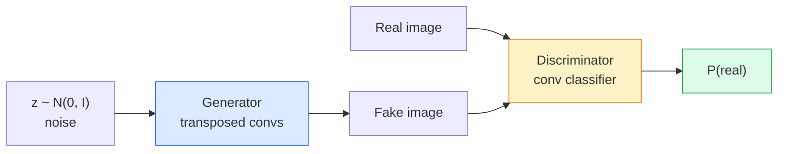
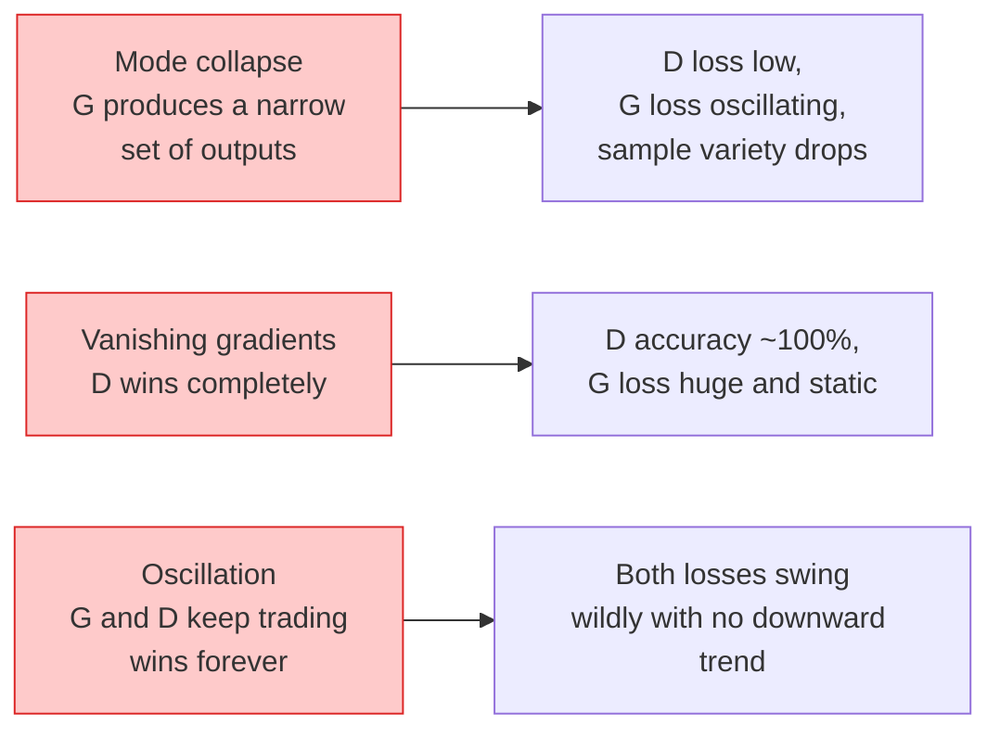

# Generación de imágenes  GANs  Generación de imágenes  生成对抗网络

> Un GAN es dos redes neuronales en un juego fijo, uno empate, otro critique, se vuelven mejores juntos hasta que los dibujos engañan al crítico.

> **【中文解读】**GAN (Generator Against Network) es una de las dos redes de la red neuronal: generador de imágenes, identificador de imágenes, identificador de imágenes, identificador de imágenes, identificador de imágenes, identificador de imágenes, identificador de imágenes, identificador de imágenes, identificador de imágenes, identificador de imágenes, identificador de imágenes, identificador de imágenes, identificador de imágenes, identificador de imágenes, identificador de imágenes, identificador de imágenes, identificador de imágenes, identificador de imágenes, identificador de imágenes, identificador de imágenes, identificador de imágenes, identificador de imágenes, identificador de imágenes, etc.

> **【拓展：GAN 的遗产】**GAN en StyleGAN ([[[[Hombre de la generación]]), CycleGAN ([[Región de la migración]]), [[Super Resolución]] de imágenes ([[Super Resolución]] de imágenes) ]] ([[Super Resolución]] de imágenes ([[Super Resolución]] de imágenes) ]] ([[Super Resolución]] de imágenes) ]] ([[Super Resolución]] de imágenes) ]] ([[Super Resolución]] de imágenes) ]] ([[Super Resolución]] de imágenes) ]] ([[Super Resolución]] de imágenes ([[Super Resolución]] de imágenes) ]] ([[Super Resolución]] de imágenes) ]] ([[Super Resolución]] de imágenes) ]] ([[Super Resolución]] de imágenes ([[Super Resolución]] de imágenes) ]] ([[Super Resolución]] de imágenes) ]] ([[Super Resolución]]) ]] ([[GAN) ]] ([[G) ]] ([[G) ]] ([[G]]) ]] ([[G]]) ]] ([[G]]) ]] ([[G]]) ]] ([[G]]) ]] ([[G]]) ]] ([[G]]) ]] ([[G]]) ([[G]]) ([[G]]) ([[G]]]]]]) ([[G]]]] ([[G]]]]]]]]]]]]]]]]]] ([[G]]]]]]]]]]]]]]]]]]]]]]]] ([[[[[[[[]]]]]]]]]]]]]]]]]]]]]]]]]]]]]]]]]]]]]]]]]]]]]]]]]]]]]]]]]]]]]]]]]]]]]]]]]]]]]]]]]]]]]]]]]]]]]]]]]]]]]]]] ([[[[[[[[[[[[[[[[[[[[[[[[[[[[[[[[[[[[[[[[[[[[]]]]]]]]]]]]]]]]]]]]]]]]]]]]]]]]]]]]]]]]]]]]]]]]]]]]]]]]]]]]]]]]]]]]]]]]]]]]]]]]]]]]]]]]]]]]]]]]]]]]]]]]]]]]]]]]]]]]]]]]]]]]]]]]]]]]]]]]]]]]]]]]]]]]]]]]]]]]]]]]]]]]]]]]]]]]]]]]]]]]]]]]]]]]]]]]]]]]]]]]

**Type:** Build | **类型:** 动手
**Languages:** Python | **语言:** Python
**Prerequisites:** Phase 4 Lesson 03 (CNNs), Phase 3 Lesson 06 (Optimizers), Phase 3 Lesson 07 (Regularization) | **前置知识:** Phase 4 Lesson 03（CNN），Phase 3 Lesson 06（优化器），Phase 3 Lesson 07（正则化）
**Time:** ~75 minutes | **时间:** ~75 分钟

## Objetivos de aprendizaje

- Explica el juego de mínimas entre generador y discriminador y por qué el equilibrio corresponde a p_modelo = p_datos
- Implemente un DCGAN en PyTorch y haga que genere imágenes sintéticas coherentes 32x32 en menos de 60 líneas
- Estabilizar el entrenamiento en GAN con los tres trucos estándar: pérdida no saturante, norma espectral, TTUR (regla de actualización en dos escalas)
- Lea curvas de entrenamiento que distinguen la convergencia saludable del colapso de modo, la oscilación y el discriminador-ganas-completamente

> **【中文解读】**El objetivo de aprendizaje enumera las capacidades centrales que debe dominarse después de completar la clase.


## El problema es la introducción del problema

La clasificación enseña a una red a mapear imágenes a etiquetas. La generación invierte el problema: muestra nuevas imágenes que parecen provenir de la misma distribución. No hay salida "correcta" que pueda diferenciar; solo hay una distribución que desea imitar.

> La red de clases distribuirá imágenes a etiquetas. Se genera un retoque en este problema: la muestra parece que proviene de una nueva imagen de la misma distribución.

Las funciones de pérdida estándar (MSE, entropía cruzada) no pueden medir "¿esta muestra proviene de la distribución real?" Minimizando el error por píxel se producen promedios borrosos, no muestras realistas.

> 标准损失函数(MSE、交叉) no puede medir "si este modelo proviene de la distribución real"― minimizar cada uno de los errores de la imagen para generar un valor medio confuso, en lugar de un modelo real―:

Los modelos de difusión han tomado el trono en cuanto a calidad y control, pero cada truco que hace que la difusión sea práctica  opciones de normalización, espacios latentes, pérdidas de características  fue entendido por primera vez en los GAN.

> GAN(Goodfellow etc.,2014) definió ese marco. Hasta 2018 StyleGAN ya podía producir 1024×1024 faces indistinguibles con la fotografía.

## El concepto central.

> **【中文解读】**Este capítulo presenta los conceptos y teorías básicos. La comprensión de estos conceptos es el prerrequisito de la realización posterior de la actividad, y también el conocimiento de los puntos de alta frecuencia de la entrevista y la práctica de la ingeniería.


### Las dos redes



El **generator**G toma un vector de ruido `z`y saca una imagen.**discriminator**D toma una imagen y saca un solo escalar: la probabilidad de que la imagen sea real.

> **生成器**G 接收噪声向量 `z`Y sacar una imagen.**判别器**D  reciben una imagen y sacan una imagen de la probabilidad de la imagen real.

### El juego

G quiere que D esté equivocado, D quiere que tenga razón.

> G espero D 判断错, D espero juzgar correctamente.

```
min_G max_D  E_x[log D(x)] + E_z[log(1 - D(G(z)))]
```

Leer de derecha a izquierda: D maximiza la precisión en real (`log D(real)`) y falsificados (`log (1 - D(fake))`G está minimizando la precisión de D en las falsificaciones  quiere `D(G(z))`para estar drogado.

> Desde la derecha hacia la izquierda:D en la maximización a la imagen real`log D(real)`) y imágenes falsas`log(1 - D(fake))`G en minimizar D a la tasa de precisión de las imágenes falsas `D(G(z))`Lo más posible.

Goodfellow demostró que este mínimo tiene un equilibrio global donde `p_G = p_data`, D produce 0.5 en todas partes, y la divergencia Jensen-Shannon entre las distribuciones generales y reales es cero.

> Buen amigo, demostró que este pequeño y grande juego existe en todo el mundo.`p_G = p_data`,D en todas las posiciones de salida 0.5, generar distribución y distribución real entre la dispersión de Jensen-Shannon es de cero. La parte difícil es cómo alcanzar ese equilibrio.

### Las pérdidas no saturantes

La forma anterior es numéricamente inestable.`D(G(z))`es casi cero para cada falso, así que `log(1 - D(G(z)))`tiene gradientes desapareciendo con respecto a G. La solución: la pérdida de G.

> La forma anterior está inestable en el valor numérico.`D(G(z))`Para cada falsa muestra se acerca a cero, por lo tanto.`log(1 - D(G(z)))`La función de pérdida de G se encuentra en la siguiente tabla:

```
L_D = -E_x[log D(x)] - E_z[log(1 - D(G(z)))]
L_G = -E_z[log D(G(z))]                          # non-saturating
```

Ahora , ¿ cuándo ?`D(G(z))`El tren GAN moderno tiene esta variante.

> Ahora, ahora.`D(G(z))`接近零时,G的损失很大,梯度信息充足――每个现代GAN都使用这个变体训练――

### Reglas de arquitectura DCGAN

Radford, Metz, Chintala (2015) destilaron años de experimentos fallidos en cinco reglas que hacen que el entrenamiento GAN sea estable:

> Radford、Metz、Chintala(2015) va a muchos años de experimentos fallidos.

1. Reemplazar la agrupación con condes de paso (ambas redes).
   La lengua china es la lengua china, la lengua china, la lengua china, la lengua china, la lengua china, la lengua china, la lengua china, la lengua china, la lengua china, la lengua china, la lengua china, la lengua china, la lengua china, la lengua china, la lengua china, la lengua china, la lengua china, la lengua china, la lengua china, la lengua china, la lengua china, la lengua china, la lengua china, la lengua china, la lengua china, la lengua china, la lengua china, la lengua china, la lengua china, la lengua china, la lengua china, la lengua china, la lengua china, la lengua china, la lengua china, la lengua china, la lengua china, la lengua china, la lengua china, la lengua china, la lengua china y la lengua china.
2. Utilice la norma de lote tanto en el generador como en el discriminador, excepto la salida de G y la entrada de D.
   Traducción:En generadores y jueces se utiliza la clasificación de lote, pero G de la salida de la capa y D de la entrada de la capa excluyen.
3. Elimine las capas completamente conectadas en arquitecturas más profundas.
   En el contexto de la estructura más profunda, el sistema de conexión se ha desviado.
4. G utiliza ReLU en todas las capas excepto en la salida (tanh para la salida en [-1, 1]).
   En el caso de los niveles de referencia, el valor de la categoría de referencia de la categoría de referencia de la categoría de referencia de la categoría de referencia de la categoría de referencia de la categoría de referencia de la categoría de referencia de la categoría de referencia de la categoría de referencia de la categoría de referencia de la categoría de referencia de la categoría de referencia de la categoría de referencia de la categoría de referencia de referencia de la categoría de referencia de referencia de la categoría de referencia de referencia de la categoría de referencia de referencia de la categoría de referencia de referencia de la categoría de referencia de referencia de referencia de la categoría de referencia de referencia de referencia de referencia de la categoría de referencia de referencia de referencia de referencia de referencia de referencia de referencia de referencia de referencia de referencia de referencia de referencia de referencia de referencia de referencia de referencia de referencia de referencia de referencia de referencia de referencia de referencia de referencia de referencia de referencia de referencia de referencia de referencia de referencia de referencia de referencia de referencia de referencia de referencia de referencia de referencia de referencia de referencia de referencia de referencia de referencia de referencia de referencia de referencia de referencia de referencia de referencia de referencia de referencia de referencia de referencia de referencia de referencia de referencia de referencia de referencia de referencia de referencia de referencia de referencia de referencia de referencia de referencia de referencia de referencia de referencia de referencia de referencia de referencia de referencia de referencia de referencia de referencia de referencia de referencia de referencia de referencia de referencia de referencia de referencia de referencia de referencia de referencia de referencia de referencia de referencia de referencia de referencia de referencia de referencia de referencia de referencia de referencia de referencia de referencia de referencia de referencia de referencia de referencia de referencia de referencia de referencia de referencia de referencia de referencia de referencia de referencia de referencia de referencia de referencia de referencia de referencia de referencia de referencia de referencia de referencia de referencia de referencia de referencia de referencia de referencia de referencia de referencia de referencia de referencia de referencia de referencia de referencia de referencia de referencia de referencia de referencia de referencia de referencia de referencia de referencia de referencia de referencia de referencia de referencia de referencia de referencia de referencia de referencia de referencia de referencia de referencia de referencia de referencia de referencia de referencia de referencia de referencia de referencia de referencia de referencia de referencia de referencia en referencia en referencia de referencia de referencia de referencia en la referencia de referencia en la referencia de referencia de referencia de referencia en la referencia de referencia de referencia de referencia en la referencia de referencia de referencia de referencia en la referencia de referencia de referencia de referencia de referencia de referencia de referencia de referencia de
5. D utiliza LeakyReLU (negativo_inclinación=0.2) en todas las capas.
   En el caso de las empresas de la industria de la información, el uso de la información en la red de datos es un factor importante.

Cada GAN moderno basado en conchas (StyleGAN, BigGAN, GigaGAN) todavía comienza con estas reglas y reemplaza las piezas una a la vez.

> Cada moderno GAN basado en volúmenes (StyleGAN, BigGAN, GigaGAN) sigue surgiendo de estas reglas, sustituyendo cada uno de los componentes.

### Modo de falla y sus firmas



- **Mode collapse**G encuentra una imagen que engaña a D y produce sólo eso.
  En la actualidad, el grupo de datos de la red de datos de la red de datos de la red de datos de la red de datos de la red de datos de la red de datos de la red de datos de la red de datos de la red de datos de la red de datos de la red de datos de la red de datos de la red de datos de la red de datos de la red de datos de la red de datos de la red de datos de la red de datos de la red de datos de la red de datos de la red de datos de la red de datos de la red de datos de la red de datos de la red de datos de la red de datos de la red de datos de la red de datos de la red de datos de la red de datos de datos de la red de datos de datos de la red de datos de datos de la red de datos de datos de la red de datos de datos de datos de la red de datos de datos de datos de la red de datos de datos de datos de la red de datos de datos de datos de datos de la red de datos de datos de datos de datos de datos de la red de datos de datos de datos de datos de datos de datos de datos de datos de datos de la red de datos de datos de datos de datos de datos de datos de datos de datos de datos de datos de datos de datos de datos de datos de datos de datos de datos de datos de datos de datos de datos de datos de la red de datos de datos de datos de datos de datos de datos de datos de datos de datos de datos de datos de datos de datos de datos de datos de datos de datos de datos de datos de datos de datos de datos de datos de datos de datos de datos de datos de datos de datos de datos de datos de datos de datos de datos de datos de datos de datos de datos de datos de datos de datos de datos de datos de datos de datos de datos de datos de datos de datos de datos de datos de datos de datos de datos de datos de datos de datos de datos de datos de datos de datos de datos de datos de datos de datos de datos de datos de datos de datos de datos de datos de datos de datos de datos de datos de datos de datos de datos de datos de datos de datos de datos de datos de datos de datos de datos de datos de datos de datos de datos de datos de datos de datos de datos de datos de datos de datos de datos de datos de datos de datos de datos de datos
- **Discriminator wins**Se puede ver que la etiqueta de la etiqueta es más pequeña, o se puede aplicar un suavización de etiqueta en las etiquetas reales.
  Traducción:Ducción de la lengua de la lengua de la lengua de la lengua de la lengua de la lengua de la lengua de la lengua de la lengua de la lengua de la lengua de la lengua de la lengua de la lengua de la lengua de la lengua de la lengua de la lengua de la lengua de la lengua de la lengua de la lengua de la lengua de la lengua de la lengua de la lengua de la lengua de la lengua de la lengua de la lengua de la lengua de la lengua de la lengua de la lengua de la lengua de la lengua de la lengua de la lengua de la lengua de la lengua de la lengua de la lengua de la lengua de la lengua de la lengua de la lengua de la lengua de la lengua de la lengua de la lengua de la lengua de la lengua de la lengua de la lengua de la lengua de la lengua de la lengua de la lengua de la lengua de la lengua de la lengua de la lengua de la lengua de la lengua de la lengua de la lengua de la lengua de la lengua de la lengua de la lengua de la lengua de la lengua de la lengua de la lengua de la lengua de la lengua de la lengua de la lengua de la lengua de la lengua de la lengua de la lengua de la lengua de la lengua de la lengua de la lengua de la lengua de la lengua de la lengua de la lengua de la lengua de la lengua de la lengua de la lengua de la lengua de la lengua de la lengua de la lengua de la lengua de la lengua de la lengua de la lengua de la lengua de la lengua de la lengua de la lengua de la lengua de la lengua de la lengua de la lengua de la lengua de la lengua de la lengua de la lengua de la lengua de la lengua de la lengua de la lengua de la lengua de la lengua de la lengua de la lengua de la lengua de la lengua de la lengua de la lengua de la lengua de la lengua de la lengua de la lengua de la lengua de la lengua de la lengua de la lengua de la lengua de la lengua de la lengua de la lengua de la lengua de la lengua de la lengua de la lengua de la lengua de la lengua de la lengua de la lengua de la lengua de la lengua de la lengua de la lengua de la lengua de la lengua de la lengua de la lengua de la lengua de la lengua de la lengua de la lengua de la lengua de la lengua de la lengua de la lengua de la lengua de la lengua de la lengua de la lengua de la lengua de la lengua
- **Oscillation**Las operaciones de las dos redes ganan sin acercarse nunca al equilibrio.
  China: 振荡两个网络交替占优,永远无法接近平衡──修复:TTUR(D 比 G 快 2-4 倍) 或切换到Wasserstein 损失──

### Evaluación

Los GAN no tienen verdad, ¿cómo sabes que funcionan?

> GAN   no hay respuesta estándar, entonces ¿cómo juzgar si están en funcionamiento normal?

- **Sample inspection** sólo miren 64 muestras al final de cada época.
  En el final de cada época, se ven 64 muestras.
- **FID (Fréchet Inception Distance)** distancia entre las distribuciones de los conjuntos reales y generados de las características de Inception-v3.
  En el caso de los grupos de grupos de grupos de grupos de grupos de grupos de grupos de grupos de grupos de grupos de grupos de grupos de grupos de grupos de grupos de grupos de grupos de grupos de grupos de grupos de grupos de grupos de grupos de grupos de grupos de grupos de grupos de grupos de grupos de grupos de grupos de grupos de grupos de grupos de grupos de grupos de grupos de grupos de grupos de grupos de grupos de grupos de grupos de grupos de grupos de grupos de grupos de grupos de grupos de grupos de grupos de grupos de grupos de grupos de grupos de grupos de grupos de grupos de grupos de grupos de grupos de grupos de grupos de grupos de grupos de grupos de grupos de grupos de grupos de grupos de grupos de grupos de grupos de grupos de grupos de grupos de grupos de grupos de grupos de grupos de grupos de grupos de grupos de grupos de grupos de grupos de grupos de grupos de grupos de grupos de grupos de grupos de grupos de grupos de grupos de grupos de grupos de grupos de grupos de grupos de grupos de grupos de grupos de grupos de grupos de grupos de grupos de grupos de grupos de grupos de grupos de grupos de grupos de grupos de grupos de grupos de grupos de grupos de grupos de grupos de grupos de grupos de grupos de grupos de grupos de grupos de grupos de grupos de grupos de grupos de grupos de grupos de grupos de grupos de grupos de grupos de grupos de grupos de grupos de grupos de grupos de grupos de grupos de grupos de grupos de grupos de grupos de grupos de grupos de grupos de grupos de grupos de grupos de grupos de grupos de grupos de grupos de grupos de grupos de grupos de grupos de grupos de grupos de grupos de grupos de grupos de grupos de grupos de grupos de grupos de grupos de grupos de grupos de grupos de grupos de grupos de grupos de grupos de grupos de grupos de grupos de grupos de grupos de grupos de grupos de grupos de grupos de grupos de grupos de grupos de grupos de grupos de grupos de grupos de grupos de grupos de grupos de grupos de grupos de grupos de grupos de grupos de grupos de grupos de grupos de grupos de grupos de grupos de grupos de grupos de grupos de grupos de grupos de grupos de grupos de grupos de grupos de grupos de grupos de grupos de grupos de grupos de grupos de grupos de grupos de grupos de grupos de grupos de grupos de grupos de grupos de grupos de grupos de grupos de grupos de grupos de grupos de grupos de grupos de grupos de grupos de grupos de grupos de grupos de grupos de grupos de grupos de grupos de grupos de grupos de grupos de grupos de grupos
- **Inception Score** mayor, más frágil; prefiere FID.
  En la actualidad, el índice de inflación es más alto que el índice de inflación.
- **Precision/Recall for generative models** mide la calidad (precisión) y la cobertura (recall) por separado.
  Traducción:Precio de precisión/recuerdos de generación de modelos 分別衡量质量 (精确率) 和覆盖度 (召回率) ∼比单独的 FID 更有信息量──

Para una pequeña prueba de datos sintéticos, basta con la inspección de muestras.

> Para experimentos de datos de síntesis a pequeña escala, el análisis de muestras es suficiente.

> **【中文解读】**Este capítulo a través del código de la implementación de algoritmos centrales de cero. Este método "desde cero" puede ayudar a entender el principio detrás del marco, no se encuentra en la caja negra cuando se encuentran problemas.

> **【拓展：工业部署中的视觉系统】**En la implementación industrial real, los modelos de visión necesitan considerar la posibilidad de retraso, el tamaño del modelo, la adaptación de los dispositivos de borde, etc. TensorRT, ONNX Runtime, OpenVINO son herramientas de aceleración de la teoría de uso habitual.

> **【拓展：数据标注与质量】**视觉任务的效果高度依赖标签数据质量──标签工作室、CVAT es la principal herramienta de marcado──在工业场景中,主动学习(Active Learning) puede reducir el costo de marcado: modelo a un requerimiento de muestras indeterminadas, marcación automática de muestras de determinación──


## Construye y realiza.
```figure
cv-gan-image
```

## Construye el mismo

### Paso 1: Generador

Un pequeño generador DCGAN que toma ruido de 64 dimensiones y produce una imagen de 32x32.

> Un pequeño generador DCGAN, que recibe 64 dimensiones de ruido y genera 32x32 imágenes.

```python
import torch
import torch.nn as nn

class Generator(nn.Module):
    def __init__(self, z_dim=64, img_channels=3, feat=64):
        super().__init__()
        self.net = nn.Sequential(
            nn.ConvTranspose2d(z_dim, feat * 4, kernel_size=4, stride=1, padding=0, bias=False),
            nn.BatchNorm2d(feat * 4),
            nn.ReLU(inplace=True),
            nn.ConvTranspose2d(feat * 4, feat * 2, kernel_size=4, stride=2, padding=1, bias=False),
            nn.BatchNorm2d(feat * 2),
            nn.ReLU(inplace=True),
            nn.ConvTranspose2d(feat * 2, feat, kernel_size=4, stride=2, padding=1, bias=False),
            nn.BatchNorm2d(feat),
            nn.ReLU(inplace=True),
            nn.ConvTranspose2d(feat, img_channels, kernel_size=4, stride=2, padding=1, bias=False),
            nn.Tanh(),
        )

    def forward(self, z):
        return self.net(z.view(z.size(0), -1, 1, 1))
```

Cuatro convoyes transpuestas, cada una con `kernel_size=4, stride=2, padding=1`Así que duplican el tamaño espacial.

> Cuatro volúmenes de cambio, cada uno de ellos.`kernel_size=4, stride=2, padding=1`Para ello, el espacio se multiplicará en tamaño.

### Paso 2: Discriminación

Espejo del generador.

> Espejo de la máquina de producción.

```python
class Discriminator(nn.Module):
    def __init__(self, img_channels=3, feat=64):
        super().__init__()
        self.net = nn.Sequential(
            nn.Conv2d(img_channels, feat, kernel_size=4, stride=2, padding=1),
            nn.LeakyReLU(0.2, inplace=True),
            nn.Conv2d(feat, feat * 2, kernel_size=4, stride=2, padding=1, bias=False),
            nn.BatchNorm2d(feat * 2),
            nn.LeakyReLU(0.2, inplace=True),
            nn.Conv2d(feat * 2, feat * 4, kernel_size=4, stride=2, padding=1, bias=False),
            nn.BatchNorm2d(feat * 4),
            nn.LeakyReLU(0.2, inplace=True),
            nn.Conv2d(feat * 4, 1, kernel_size=4, stride=1, padding=0),
        )

    def forward(self, x):
        return self.net(x).view(-1)
```

El último conv reduce un `4x4`mapa de características a `1x1`. La salida es un solo escalar por imagen; aplicar sigmoid sólo durante el cálculo de pérdidas.

> Última vez Volúgio `4x4`                                                                                                                                                                                                                                                                                                                                                                                                                                                                                                                             `1x1`◊ por cada imagen de salida de una muestra; sólo en el cálculo de pérdida aplicado sigmoid。

### Paso 3: Paso de formación

Alternativa: actualizar D una vez, luego G una vez, cada lote.

> 交替进行: cada lote 先更新 D 一次,再更新 G 一次。

```python
import torch.nn.functional as F

def train_step(G, D, real, z, opt_g, opt_d, device):
    real = real.to(device)
    bs = real.size(0)

    # D step
    opt_d.zero_grad()
    d_real = D(real)
    d_fake = D(G(z).detach())
    loss_d = (F.binary_cross_entropy_with_logits(d_real, torch.ones_like(d_real))
              + F.binary_cross_entropy_with_logits(d_fake, torch.zeros_like(d_fake)))
    loss_d.backward()
    opt_d.step()

    # G step
    opt_g.zero_grad()
    d_fake = D(G(z))
    loss_g = F.binary_cross_entropy_with_logits(d_fake, torch.ones_like(d_fake))
    loss_g.backward()
    opt_g.step()

    return loss_d.item(), loss_g.item()
```

`G(z).detach()`En el paso D es crítico: no queremos que los gradientes fluyan a G durante su actualización.

> D 步骤中的                                                                                                                                                                                                                                                                                                                                                                                                                                                                                                                         `G(z).detach()`至关重要: Nosotros no queremos que el proceso de actualización de D fluya a la escala de G.

### Paso 4: Ciclo de entrenamiento completo en formas sintéticas

```python
from torch.utils.data import DataLoader, TensorDataset
import numpy as np

def synthetic_images(num=2000, size=32, seed=0):
    rng = np.random.default_rng(seed)
    imgs = np.zeros((num, 3, size, size), dtype=np.float32) - 1.0
    for i in range(num):
        r = rng.uniform(6, 12)
        cx, cy = rng.uniform(r, size - r, size=2)
        yy, xx = np.meshgrid(np.arange(size), np.arange(size), indexing="ij")
        mask = (xx - cx) ** 2 + (yy - cy) ** 2 < r ** 2
        color = rng.uniform(-0.5, 1.0, size=3)
        for c in range(3):
            imgs[i, c][mask] = color[c]
    return torch.from_numpy(imgs)

device = "cuda" if torch.cuda.is_available() else "cpu"
data = synthetic_images()
loader = DataLoader(TensorDataset(data), batch_size=64, shuffle=True)

G = Generator(z_dim=64, img_channels=3, feat=32).to(device)
D = Discriminator(img_channels=3, feat=32).to(device)
opt_g = torch.optim.Adam(G.parameters(), lr=2e-4, betas=(0.5, 0.999))
opt_d = torch.optim.Adam(D.parameters(), lr=2e-4, betas=(0.5, 0.999))

for epoch in range(10):
    for (batch,) in loader:
        z = torch.randn(batch.size(0), 64, device=device)
        ld, lg = train_step(G, D, batch, z, opt_g, opt_d, device)
    print(f"epoch {epoch}  D {ld:.3f}  G {lg:.3f}")
```

`Adam(lr=2e-4, betas=(0.5, 0.999))`es el DCGAN por defecto  la baja beta1 mantiene el tiempo de impulso de estabilizar demasiado el juego adversario.

> `Adam(lr=2e-4, betas=(0.5, 0.999))`Es la configuración por defecto de DCGAN  beta1                                                                                                                                                                                                                                                                                                                                                                                                                                                                                                               

### Paso 5: Muestreo

```python
@torch.no_grad()
def sample(G, n=16, z_dim=64, device="cpu"):
    G.eval()
    z = torch.randn(n, z_dim, device=device)
    imgs = G(z)
    imgs = (imgs + 1) / 2
    return imgs.clamp(0, 1)
```

Siempre cambia al modo de evaluación antes de la muestreo. para DCGAN esto importa porque se utilizan estadísticas de ejecución de la norma del lote en lugar de las estadísticas del lote.

> 采样前务必切换到 eval 模式―― para DCGAN esto es importante, ya que la regeneración de la serie se utiliza en la estadística de la operación y no en la estadística del lote actual―.

### Paso 6: Normalización espectral

Un reemplazo de BN en el discriminador que garantiza la red es 1-Lipschitz.

> La regeneración de la secuencia es el proceso de regeneración de la serie en el dispositivo de determinación, garantizando que la red es de 1 Lippschitz.

```python
from torch.nn.utils import spectral_norm

def build_sn_discriminator(img_channels=3, feat=64):
    return nn.Sequential(
        spectral_norm(nn.Conv2d(img_channels, feat, 4, 2, 1)),
        nn.LeakyReLU(0.2, inplace=True),
        spectral_norm(nn.Conv2d(feat, feat * 2, 4, 2, 1)),
        nn.LeakyReLU(0.2, inplace=True),
        spectral_norm(nn.Conv2d(feat * 2, feat * 4, 4, 2, 1)),
        nn.LeakyReLU(0.2, inplace=True),
        spectral_norm(nn.Conv2d(feat * 4, 1, 4, 1, 0)),
    )
```

> **【中文解读】**Este capítulo muestra cómo utilizar un marco maduro (como PyTorch、HuggingFace, etc.) para aplicar rápidamente esta tecnología. En los proyectos reales, se realiza con prioridad el uso de un marco experimentado, se pueden reducir errores y mejorar la eficiencia de desarrollo.


Cambiar`Discriminator`por`build_sn_discriminator()`La norma espectral es la mejor actualización de robustez única que puede aplicar.

> ¿ Qué ?`Discriminator`替换为 `build_sn_discriminator()`后通常就不需要TTUR技巧了──谱归化是你能应用的最简单单单一棒性升级──


> **【拓展：视觉模型的持续学习】**En el entorno de producción, el modelo visual necesita adaptarse continuamente a nuevos datos. Esto es especialmente importante en la conducción automotriz y el control de calidad industrial.

## Usalo con el marco de ejecución

Para generación seria, utilice pesas preentrenadas o cambie a difusión.

- `torch_fidelity`computa FID / IS en su generador sin escribir código de evaluación personalizado.
- `pytorch-gan-zoo`(legado) y `StudioGAN`el buque ha probado las implementaciones de DCGAN, WGAN-GP, SN-GAN, StyleGAN y BigGAN.

En 2026, los GAN siguen siendo la mejor opción para: generación de imágenes en tiempo real (latencia <10 ms), transferencia de estilo, traducción de imagen a imagen con control preciso (Pix2Pix, CycleGAN).

> **【中文解读】**Este capítulo se centra en cómo se puede implementar el modelo como producto disponible. Desde el modelo original hasta el sistema de producción, se deben considerar múltiples dimensiones de optimización de rendimiento, tratamiento de errores, control, etc.


## Envíe el producto .

Esta lección produce:

- `outputs/prompt-gan-training-triage.md` una instrucción que lee una descripción de la curva de entrenamiento y selecciona el modo de falla (colapso de modo, D-win, oscilación) más la única solución recomendada.
- `outputs/skill-dcgan-scaffold.md` una habilidad que escribe un andamio DCGAN de `z_dim`, objetivo`image_size`, y `num_channels`, incluyendo el bucle de entrenamiento y el salvador de muestras.

> **【中文解读】**Practice los temas de fácil/medio/duro  3 difficulty to pass in  Recomenda al menos completar los temas de grado medio  Grado duro  para la preparación de la entrevista


## Los ejercicios.

1. **(Easy)**Entrenar el DCGAN anterior en el conjunto de datos del círculo sintético y guardar una cuadrícula de 16 muestras al final de cada época.
2. **(Medium)**Replace la norma de lote del discriminador con la norma espectral. Entrenar ambas versiones lado a lado. ¿Cuál converge más rápido? ¿Cuál tiene menor variación entre tres semillas?
3. **(Hard)**Implementar un DCGAN condicional: introducir la etiqueta de clase en G y D (concertar un solo calor al ruido en G, concat un canal de incorporación de clase en D). Entrenar el conjunto de datos sintético "círculos vs cuadrados" de la lección 7 y demostrar que el acondicionamiento de clase funciona mediante muestreo con etiquetas específicas.

> **【中文解读】**En el lenguaje de los términos "Lo que la gente dice" vs "Lo que realmente significa" se distingue entre el lenguaje diario y la definición técnica de significado.


## Términos clave .

| Term | What people say | What it actually means |
|------|----------------|----------------------|
| Generator (G) | "The draws-stuff net" | Maps noise to images; trained to fool the discriminator |
| Discriminator (D) | "The critic" | Binary classifier; trained to distinguish real from generated images |
| Minimax | "The game" | min over G, max over D of an adversarial loss; equilibrium is p_G = p_data |
| Non-saturating loss | "The numerically sane version" | G's loss is -log(D(G(z))) instead of log(1 - D(G(z))) to avoid vanishing gradients early in training |
| Mode collapse | "Generator makes one thing" | G produces only a small subset of the data distribution; fix with SN, minibatch discrimination, or larger batch |
| TTUR | "Two learning rates" | D learns faster than G, typically by a factor of 2-4; stabilises training |
| Spectral norm | "1-Lipschitz layer" | A weight-normalisation that bounds each layer's Lipschitz constant; stops D from becoming arbitrarily steep |
| FID | "Fréchet Inception Distance" | Distance between Inception-v3 feature distributions of real and generated sets; the standard evaluation metric |

> **【中文解读】**延伸阅读 proporciona un alto nivel de recursos para el aprendizaje profundo. Estos artículos y cursos son los referentes clásicos en el campo, adecuados para los lectores que necesitan una comprensión profunda.


## Más Leer más Leer más

- [Generative Adversarial Networks (Goodfellow et al., 2014)](https://arxiv.org/abs/1406.2661) el periódico que comenzó todo
- [DCGAN (Radford, Metz, Chintala, 2015)](https://arxiv.org/abs/1511.06434) las reglas de arquitectura que hicieron que los GAN pudieran ser entrenados
- [Spectral Normalization for GANs (Miyato et al., 2018)](https://arxiv.org/abs/1802.05957) el truco de estabilización más útil
- [StyleGAN3 (Karras et al., 2021)](https://arxiv.org/abs/2106.12423) el SOTA GAN; se lee como un álbum de los mejores éxitos de cada truco de la última década
