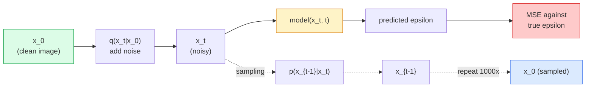

# Generación de imágenes  Modelos de difusión  Generación de imágenes  Modelo de difusión

> Un modelo de difusión aprende a denogar, entrenarlo para eliminar un pequeño ruido de una imagen ruidosa, repite eso mil veces hacia atrás, y tienes un generador de imagen.

> **【中文解读】**扩散模型学习去噪音: entrenar la red de eliminación del ruido de una imagen de un poco de ruido, reversa reversa reversa 1000 veces en la capacidad de generar imágenes de ruido puro;; el modelo de expansión es la técnica central de la Estable Diffusión、DALL-E、Midjourney etc herramienta de generación de imágenes;;

> **【拓展：扩散模型的革命】**扩散模型在 2022年后取代GAN 成为图像生成的主流──Stable Diffusion 使用潜在空间扩散──Latent Diffusion) Reducir considerablemente el costo de cálculo, DDIM 采样器将推理步数从1000步骤降至20步──扩散模型也应用于视频生成(Sora)、3D 生成、音频生成等领域──

**Type:** Build | **类型:** 动手
**Languages:** Python | **语言:** Python
**Prerequisites:** Phase 4 Lesson 07 (U-Net), Phase 1 Lesson 06 (Probability), Phase 3 Lesson 06 (Optimizers) | **前置知识:** Phase 4 Lesson 07（U-Net），Phase 1 Lesson 06（概率），Phase 3 Lesson 06（优化器）
**Time:** ~75 minutes | **时间:** ~75 分钟

## Objetivos de aprendizaje

- Derivar el proceso de ruido hacia adelante `x_0 -> x_1 -> ... -> x_T`y explicar por qué la forma cerrada `q(x_t | x_0)`se aplica a cualquier t
- Implementar un objetivo de formación al estilo DDPM que regresione el ruido añadido en cada paso, y un muestreo que vuelva del ruido puro a una imagen
- Construir una U-Net con tiempo condicionado (lo suficientemente pequeño para entrenar en la CPU) que predice el ruido para cualquier paso del tiempo
- Explicar la diferencia entre el muestreo DDPM y el muestreo DDIM, y cuando cada uno sea apropiado (la lección 23 abarca el flujo de coincidencia y el flujo rectificado en profundidad)

> **【中文解读】**El objetivo de aprendizaje enumera las capacidades centrales que debe dominarse después de completar la clase.


## El problema es la introducción del problema

Las GAN generan un solo disparo: ruido en, imagen fuera, un pase hacia adelante. Son rápidos y difíciles de entrenar. Los modelos de difusión generan iterativamente: comienzan desde ruido puro, denotan en pequeños pasos, emerge la imagen. Son lentos y fáciles de entrenar. Durante los últimos cinco años, esta última propiedad ha dominado: cualquier pequeño equipo puede entrenar un modelo de difusión y obtener muestras razonables; el entrenamiento GAN es un oficio que se aprende a través de años de carreras fallidas.

> GAN una vez generar: ruido de entrada, imagen de salida, una vez de entrada y de difusión. Son rápidos pero difíciles de entrenar. Los modelos de difusión generan: desde el ruido puro, pequeños pasos hacia el ruido, las imágenes se manifiestan gradualmente. Las velocidades son lentas pero fáciles de entrenar.

Más allá de la estabilidad de entrenamiento, la estructura iterativa de la difusión es lo que desbloquea todo lo que hace la generación moderna de imágenes: condicionamiento de texto, pintura, edición de imágenes, super-resolución, estilo controlables. Cada paso del ciclo de muestreo es un lugar para inyectar una nueva restricción. Ese gancho es por lo que la difusión estable, Imagen, DALL-E 3, Midjourney, y cada modelo de imagen controlada que usará son todos basados en la difusión.

> Además de entrenar la estabilidad, la estructura generacional de la difusión desbloquea todo lo que se hace en la generación de imágenes modernas: condicionamiento de texto, reparación de imágenes, edición de imágenes, superresolución, estilo controlable. Cada paso del ciclo de muestreo es donde se inyecta un nuevo conjunto. Esta es la razón por la que la difusión estable, imagen, DALL-E 3 y Midjourney se basan en la difusión.

Esta lección construye el DDPM mínimo: ruido hacia adelante, denocificación hacia atrás, bucle de entrenamiento.

> Este curso construye el DDPM mínimo: previo a aumentar el ruido, posterior a eliminar el ruido, ciclo de entrenamiento, y luego a la difusión estable, que se conecta con el sistema de producción, que contiene VAE, textos y codificadores de la clase de guiones.

## El concepto central.

> **【中文解读】**Este capítulo presenta los conceptos y teorías básicos. La comprensión de estos conceptos es el prerrequisito de la realización posterior de la actividad, y también el conocimiento de los puntos de alta frecuencia de la entrevista y la práctica de la ingeniería.


### El proceso de avance

Toma una imagen.`x_0`Añadir una pequeña cantidad de ruido gaussiano para obtener`x_1`Añade una pequeña cantidad más para obtener .`x_2`Sigue por los pasos T hasta que`x_T`es casi indistinguible del ruido puro de Gaussian.

> 取一张图像                                                                                                                                                                                                                                                                                                                                                                                                                                                                                                                        `x_0`, un poco más de ruido alto conseguir .`x_1`, ¡ ¡ ¡ ¡ ¡ ¡ ¡ ¡ ¡ ¡ ¡ ¡ ¡ ¡ ¡ ¡ ¡ ¡ ¡ ¡ ¡ ¡ ¡ ¡ ¡ ¡ ¡ ¡ ¡ ¡ ¡ ¡ ¡ ¡ ¡ ¡ ¡ ¡ ¡ ¡ ¡ ¡ ¡ ¡ ¡ ¡ ¡ ¡ ¡ ¡ ¡ ¡ ¡ ¡ ¡ ¡ ¡ ¡ ¡ ¡ ¡ ¡ ¡ ¡ ¡ ¡ ¡ ¡ ¡ ¡ ¡ ¡ ¡ ¡ ¡ ¡ ¡ ¡ ¡ ¡ ¡ ¡ ¡ ¡ ¡ ¡ ¡ ¡ ¡ ¡ ¡ ¡ ¡ ¡ ¡ ¡ ¡ ¡ ¡ ¡ ¡ ¡ ¡ ¡ ¡ ¡ ¡ ¡ ¡ ¡ ¡ ¡ ¡ ¡ ¡ ¡ ¡ ¡ ¡ ¡ ¡ ¡ ¡ ¡ ¡ ¡ ¡ ¡ ¡ ¡ ¡ ¡ ¡ ¡ ¡ ¡ ¡ ¡ ¡ ¡ ¡ ¡ ¡ ¡ ¡ ¡ ¡ ¡ ¡ ¡ ¡ ¡ ¡ ¡ ¡ ¡ ¡ ¡ ¡ ¡ ¡ ¡ ¡ ¡ ¡ ¡ ¡ ¡ ¡ ¡ ¡ ¡ ¡ ¡ ¡ ¡ ¡ ¡ ¡ ¡ ¡ ¡ ¡ ¡ ¡ ¡ ¡ ¡ ¡ ¡ ¡ ¡ ¡ ¡ ¡ ¡ ¡ ¡ ¡ ¡ ¡ ¡ ¡ ¡ ¡ ¡ ¡ ¡ ¡ ¡ ¡ ¡ ¡ ¡ ¡ ¡ ¡ ¡ ¡ ¡ ¡ ¡ ¡ ¡ ¡ ¡ ¡ ¡ ¡ ¡ ¡ ¡ ¡ ¡ ¡ ¡ ¡ ¡ ¡ ¡ ¡ ¡ ¡ ¡ ¡ ¡ ¡ ¡ ¡ ¡ ¡ ¡ ¡ ¡ ¡ ¡ ¡ ¡ ¡ ¡ ¡ ¡ ¡ ¡ ¡ ¡ ¡ ¡ ¡ ¡ ¡ ¡ ¡ ¡ ¡ ¡ ¡ ¡ ¡ ¡ ¡ ¡ ¡ ¡ ¡ ¡ ¡ ¡ ¡ ¡ ¡ ¡ ¡ ¡ ¡ ¡ ¡ ¡ ¡ ¡ ¡ ¡ ¡ ¡ ¡ ¡ ¡ ¡ ¡ ¡ ¡ ¡ ¡ ¡ ¡ ¡ ¡ ¡ ¡ ¡ ¡ ¡ ¡ ¡ ¡ ¡ ¡ ¡ ¡ ¡ ¡ ¡ ¡ ¡ ¡ ¡ ¡ ¡ ¡ ¡ ¡ ¡ ¡ ¡ ¡ ¡ ¡ ¡ ¡ ¡ ¡ ¡ ¡ ¡ ¡ ¡ ¡ ¡ ¡ ¡ ¡ ¡ ¡ ¡ ¡ ¡ ¡ ¡ ¡ ¡ ¡ ¡ ¡ ¡ ¡ ¡ ¡ ¡ ¡ ¡ ¡ ¡ ¡ ¡ ¡ ¡ ¡ ¡ ¡ ¡ ¡ ¡ ¡ ¡ ¡ ¡ ¡ ¡ ¡ ¡ ¡ ¡ ¡ ¡ ¡ ¡ ¡ ¡ ¡ ¡ ¡ ¡ ¡ ¡ ¡ ¡ ¡ ¡ ¡ ¡ ¡ ¡ ¡ ¡ ¡ ¡ ¡ ¡ ¡ ¡ ¡ ¡ ¡ ¡ ¡ ¡ ¡ ¡ ¡ ¡ ¡ ¡ ¡ ¡ ¡ ¡ ¡ ¡ ¡ ¡ ¡ ¡ ¡ ¡ ¡ ¡ ¡ ¡ ¡ ¡ ¡ ¡ ¡ ¡ ¡ ¡ ¡ ¡ ¡ ¡ ¡ ¡ ¡ ¡ ¡ ¡ ¡ ¡ ¡ ¡ ¡ ¡ ¡ ¡ ¡ ¡ ¡ ¡ ¡ ¡ ¡ ¡ ¡ ¡ ¡ ¡ ¡ ¡ ¡ ¡ ¡ ¡ ¡ ¡ ¡ ¡ ¡ ¡ ¡`x_2`, continúa hasta el momento .`x_T`Casi imposible distinguirlo del ruido puro y alto.

```
q(x_t | x_{t-1}) = N(x_t; sqrt(1 - beta_t) * x_{t-1},  beta_t * I)
```

`beta_t`Es un horario de varianza pequeño, típicamente lineal de 0,0001 a 0,02 sobre T=1000 pasos.

> `beta_t`Es una pequeña diferencia de la medida, generalmente en T=1000 pasos, desde 0.0001 线性增长到0.02── cada paso un pequeño recorte de la señal y inyección de nuevo ruido──

### El salto de forma cerrada

Añadir ruido un paso a la vez es una cadena de Markov, pero la matemática se pliega: se puede muestrar `x_t`directamente de `x_0`en un solo paso.

> Un paso más alto es una cadena de marcos, pero matemáticamente se puede doblar: puedes dar un paso directamente desde el`x_0`采样                                                                                                                                                                                                                                                                                                                                                                                                                                                                                                                           `x_t`¿Qué es eso?

```
Define alpha_t = 1 - beta_t
Define alpha_bar_t = prod_{s=1..t} alpha_s

Then:
  q(x_t | x_0) = N(x_t; sqrt(alpha_bar_t) * x_0,  (1 - alpha_bar_t) * I)

Equivalently:
  x_t = sqrt(alpha_bar_t) * x_0 + sqrt(1 - alpha_bar_t) * epsilon
  where epsilon ~ N(0, I)
```

Esta sola ecuación es la razón por la que la difusión es práctica.`t`, muestra `x_t`directamente de `x_0`, y tren en un solo paso  sin necesidad de simulación de la cadena completa de Markov.

> Este método es la razón de la práctica de la extensión del modelo.`t`, directamente desde`x_0`采样                                                                                                                                                                                                                                                                                                                                                                                                                                                                                                                           `x_t`, paso a paso para completar el entrenamiento sin necesidad de imitar la cadena completa de Marco.

### El proceso inverso

El proceso hacia adelante está fijo.`p(x_{t-1} | x_t)`Los modelos de difusión no predicen`x_{t-1}`directamente; ellos predicen el ruido `epsilon`se añade en el paso t, y las matemáticas se derivan `x_{t-1}`de ella.

> El proceso de hacia delante es fijo.`p(x_{t-1} | x_t)`Es la red neuronal que hay que aprender.`x_{t-1}`Ellos prevé el aumento del ruido .`epsilon`, y luego se lo consigue a través de matemáticas .`x_{t-1}`¿Qué es eso?



### La pérdida de entrenamiento

Para cada paso de entrenamiento:

> Cada paso de entrenamiento:

1. Muestre una imagen real `x_0`¿ Qué ?
   La verdadera imagen de la historia de la historia`x_0`¿Qué es eso?
2. Muestre un paso en el tiempo `t`uniformemente desde [1, T].
   中文翻译: de [1, T] 中均采样一个时间步 `t`¿Qué es eso?
3. Muestra de ruido`epsilon ~ N(0, I)`¿ Qué ?
   La voz de la voz es un ruido.`epsilon ~ N(0, I)`¿Qué es eso?
4. Computación`x_t = sqrt(alpha_bar_t) * x_0 + sqrt(1 - alpha_bar_t) * epsilon`¿ Qué ?
   Traducción:计算`x_t = sqrt(alpha_bar_t) * x_0 + sqrt(1 - alpha_bar_t) * epsilon`¿Qué es eso?
5. Prevé .`epsilon_theta(x_t, t)`con la red.
   En español: usar la red de predicción`epsilon_theta(x_t, t)`¿Qué es eso?
6. Minimizar`|| epsilon - epsilon_theta(x_t, t) ||^2`¿ Qué ?
   La palabra "minimizar" se traduce en "minimizar"`|| epsilon - epsilon_theta(x_t, t) ||^2`¿Qué es eso?

La red neuronal aprende a predecir el ruido en cualquier paso del tiempo. La pérdida es MSE. No hay juego adversario, no hay colapso, no hay oscilación.

> Así es. No hay ninguna resistencia, no hay ningún tipo de collapso, no hay vibraciones.

### El muestreo (DDPM)

Para generar: comenzar desde `x_T ~ N(0, I)`y caminar hacia atrás un paso a la vez.

```
for t = T, T-1, ..., 1:
    eps = model(x_t, t)
    x_{t-1} = (1 / sqrt(alpha_t)) * (x_t - (beta_t / sqrt(1 - alpha_bar_t)) * eps) + sqrt(beta_t) * z
    where z ~ N(0, I) if t > 1, else 0
return x_0
```

La clave es que aunque la condicional inversa no es conocida en forma cerrada en general, para este proceso Gaussian hacia adelante específico es.

> La clave es que, aunque en general la probabilidad de contrarrestación no tiene una solución cerrada, para este proceso específico de alta tendencia hay alguna.

### ¿Por qué 1000 pasos?

El horario de ruido hacia adelante se elige para que cada paso añada suficiente ruido que el paso inverso sea casi gaussiano. Demasiados pasos y el paso inverso está lejos de gaussiano, la red no puede modelarlo bien. Demasiados pasos y muestreo se vuelven caros con una ganancia decreciente. T = 1000 con un horario lineal es el estándar DDPM.

> El diseño de la regulación de ruido hacia adelante hace que cada paso sólo haga un ruido suficiente, por lo que la regulación lineal de paso hacia atrás es muy pequeña.

### DDIM: muestreo 20 veces más rápido

El ensayo es el mismo. Los cambios de muestreo. DDIM (Song et al., 2020) define un proceso determinista inverso que salta los pasos de tiempo sin volver a entrenar.

> 訓練方式不變,采样方式改变──DDIM(Song等,2020) define un proceso de reversación de la determinación, puede saltar el tiempo paso sin necesidad de volver a entrenar── con DDIM 50 pasos de la adopción puede alcanzar cerca de 1000 pasos de calidad de DDPM── cada sistema de producción utiliza DDIM o más rápidos de la variación(DPM-Solver、Euler ancestral)──

### Condicionamiento del tiempo

La red`epsilon_theta(x_t, t)`Los modelos de difusión modernos inyectan`t`a través de incrustaciones sinusoidales de tiempo (la misma idea que la codificación posicional en transformadores) que se agregan a mapas de características en todos los niveles de U-Net.

> 网络 `epsilon_theta(x_t, t)`需要知道它在去噪哪个时间步步. 现代扩散模型通过正弦时间嵌入 (incluye la misma configuración que el Transformer) 输入`t`, en cada nivel de U-Net de características de la imagen en la imagen.

```
t_embedding = sinusoidal(t)
feature_map += MLP(t_embedding)
```

Sin el tiempo de condicionamiento la red tiene que adivinar el nivel de ruido de la imagen misma, que funciona pero es mucho menos eficaz en la muestra.

>  sin tiempo condicionado, la red debe adivinar el nivel de ruido desde la imagen misma, así que aunque puede trabajar pero la eficiencia de muestreo es mucho menor.

> **【拓展：工业部署中的视觉系统】**En la implementación industrial real, los modelos de visión necesitan considerar la posibilidad de retraso, el tamaño del modelo, la adaptación de los dispositivos de borde, etc. TensorRT, ONNX Runtime, OpenVINO son herramientas de aceleración de la teoría de uso habitual.

> **【拓展：数据标注与质量】**视觉任务的效果高度依赖标签数据质量──标签工作室、CVAT es la principal herramienta de marcado──在工业场景中,主动学习(Active Learning) puede reducir el costo de marcado: modelo a un requerimiento de muestras indeterminadas, marcación automática de muestras de determinación──


## Construye y realiza.

> **【中文解读】**Este capítulo a través del código de la implementación de algoritmos centrales de cero. Este método "desde cero" puede ayudar a entender el principio detrás del marco, no se encuentra en la caja negra cuando se encuentran problemas.

```figure
cv-diffusion-image
```

## Construye el mismo

### Paso 1: Programa de ruido

```python
import torch

def linear_beta_schedule(T=1000, beta_start=1e-4, beta_end=2e-2):
    return torch.linspace(beta_start, beta_end, T)


def precompute_schedule(betas):
    alphas = 1.0 - betas
    alphas_cumprod = torch.cumprod(alphas, dim=0)
    return {
        "betas": betas,
        "alphas": alphas,
        "alphas_cumprod": alphas_cumprod,
        "sqrt_alphas_cumprod": torch.sqrt(alphas_cumprod),
        "sqrt_one_minus_alphas_cumprod": torch.sqrt(1.0 - alphas_cumprod),
        "sqrt_recip_alphas": torch.sqrt(1.0 / alphas),
    }

schedule = precompute_schedule(linear_beta_schedule(T=1000))
```

Precomputa una vez, recoge por índice durante el entrenamiento y la muestreo.

> 预计算一次,训练和采样时通过索引取用──

### Paso 2: Difusión hacia adelante (muestra q_sample)

```python
def q_sample(x0, t, noise, schedule):
    sqrt_a = schedule["sqrt_alphas_cumprod"][t].view(-1, 1, 1, 1)
    sqrt_one_minus_a = schedule["sqrt_one_minus_alphas_cumprod"][t].view(-1, 1, 1, 1)
    return sqrt_a * x0 + sqrt_one_minus_a * noise
```

Formulario cerrado de una línea. `t`es un lote de pasos temporales, uno por imagen del lote.

> Una línea cerrada en forma...`t`Es un montón de tiempo, cada uno de ellos.

### Paso 3: Una pequeña red U-Net con tiempo

```python
import torch.nn as nn
import torch.nn.functional as F
import math

def timestep_embedding(t, dim=64):
    half = dim // 2
    freqs = torch.exp(-math.log(10000) * torch.arange(half, device=t.device) / half)
    args = t[:, None].float() * freqs[None]
    emb = torch.cat([args.sin(), args.cos()], dim=-1)
    return emb


class TinyUNet(nn.Module):
    def __init__(self, img_channels=3, base=32, t_dim=64):
        super().__init__()
        self.t_mlp = nn.Sequential(
            nn.Linear(t_dim, base * 4),
            nn.SiLU(),
            nn.Linear(base * 4, base * 4),
        )
        self.t_dim = t_dim
        self.enc1 = nn.Conv2d(img_channels, base, 3, padding=1)
        self.enc2 = nn.Conv2d(base, base * 2, 4, stride=2, padding=1)
        self.mid = nn.Conv2d(base * 2, base * 2, 3, padding=1)
        self.dec1 = nn.ConvTranspose2d(base * 2, base, 4, stride=2, padding=1)
        self.dec2 = nn.Conv2d(base * 2, img_channels, 3, padding=1)
        self.time_proj = nn.Linear(base * 4, base * 2)

    def forward(self, x, t):
        t_emb = timestep_embedding(t, self.t_dim)
        t_emb = self.t_mlp(t_emb)
        t_proj = self.time_proj(t_emb)[:, :, None, None]

        h1 = F.silu(self.enc1(x))
        h2 = F.silu(self.enc2(h1)) + t_proj
        h3 = F.silu(self.mid(h2))
        d1 = F.silu(self.dec1(h3))
        d2 = torch.cat([d1, h1], dim=1)
        return self.dec2(d2)
```

U-Net de dos niveles con acondicionamiento de tiempo inyectado en el cuello de botella.

> 两层 U-Net, en botellas 层注入时间条件化── para imágenes reales, puede aumentar la profundidad y la amplitud──

### Paso 4: Ciclo de entrenamiento

```python
def train_step(model, x0, schedule, optimizer, device, T=1000):
    model.train()
    x0 = x0.to(device)
    bs = x0.size(0)
    t = torch.randint(0, T, (bs,), device=device)
    noise = torch.randn_like(x0)
    x_t = q_sample(x0, t, noise, schedule)
    pred = model(x_t, t)
    loss = F.mse_loss(pred, noise)
    optimizer.zero_grad()
    loss.backward()
    optimizer.step()
    return loss.item()
```

No hay juego de GAN, ninguna pérdida especializada, una llamada de MSE.

> No hay GAN contra el botón, no hay función de pérdida especial, sólo se necesita un MSE 调用.

### Paso 5: Muestradora (DDPM)

```python
@torch.no_grad()
def sample(model, schedule, shape, T=1000, device="cpu"):
    model.eval()
    x = torch.randn(shape, device=device)
    betas = schedule["betas"].to(device)
    sqrt_one_minus_a = schedule["sqrt_one_minus_alphas_cumprod"].to(device)
    sqrt_recip_alphas = schedule["sqrt_recip_alphas"].to(device)

    for t in reversed(range(T)):
        t_batch = torch.full((shape[0],), t, dtype=torch.long, device=device)
        eps = model(x, t_batch)
        coef = betas[t] / sqrt_one_minus_a[t]
        mean = sqrt_recip_alphas[t] * (x - coef * eps)
        if t > 0:
            x = mean + torch.sqrt(betas[t]) * torch.randn_like(x)
        else:
            x = mean
    return x
```

1000 pases hacia adelante para producir un lote de muestras. En código real se cambiaría esto por un muestreo de 50 pasos DDIM.

> 1000 veces para transmitir para generar un lote de muestras. En el código real, se cambia a un DDIM de 50 pasos.

### Paso 6: Muestra de DDIM (determinista, ~ 20 veces más rápido)

```python
@torch.no_grad()
def sample_ddim(model, schedule, shape, steps=50, T=1000, device="cpu", eta=0.0):
    model.eval()
    x = torch.randn(shape, device=device)
    alphas_cumprod = schedule["alphas_cumprod"].to(device)

    ts = torch.linspace(T - 1, 0, steps + 1).long()
    for i in range(steps):
        t = ts[i]
        t_prev = ts[i + 1]
        t_batch = torch.full((shape[0],), t, dtype=torch.long, device=device)
        eps = model(x, t_batch)
        a_t = alphas_cumprod[t]
        a_prev = alphas_cumprod[t_prev] if t_prev >= 0 else torch.tensor(1.0, device=device)
        x0_pred = (x - torch.sqrt(1 - a_t) * eps) / torch.sqrt(a_t)
        sigma = eta * torch.sqrt((1 - a_prev) / (1 - a_t) * (1 - a_t / a_prev))
        dir_xt = torch.sqrt(1 - a_prev - sigma ** 2) * eps
        noise = sigma * torch.randn_like(x) if eta > 0 else 0
        x = torch.sqrt(a_prev) * x0_pred + dir_xt + noise
    return x
```

> **【中文解读】**Este capítulo muestra cómo utilizar un marco maduro (como PyTorch、HuggingFace, etc.) para aplicar rápidamente esta tecnología. En los proyectos reales, se realiza con prioridad el uso de un marco experimentado, se pueden reducir errores y mejorar la eficiencia de desarrollo.


`eta=0`es totalmente determinista (la misma entrada de ruido produce siempre la misma salida). `eta=1`Recupera la DDPM.

> `eta=0`Es totalmente definido: el mismo ruido entra siempre produce el mismo salida.`eta=1`则退化为 DDPM。


> **【拓展：视觉模型的持续学习】**En el entorno de producción, el modelo visual necesita adaptarse continuamente a nuevos datos. Esto es especialmente importante en la conducción automotriz y el control de calidad industrial.

## Usalo con el marco de ejecución

Para los trabajos de producción, utilizar `diffusers`¿Qué es esto ?

```python
from diffusers import DDPMScheduler, UNet2DModel

unet = UNet2DModel(sample_size=32, in_channels=3, out_channels=3, layers_per_block=2)
scheduler = DDPMScheduler(num_train_timesteps=1000)
```

La biblioteca envía programadores listos (DDPM, DDIM, DPM-Solver, Euler, Heun), U-Nets configurables, tuberías para texto a imagen e imagen a imagen y ayudantes de ajuste fino de LoRA.

Para la investigación,`k-diffusion`(Katherine Crowson) tiene las implementaciones de referencia más fieles y las mejores variantes de muestreo.

> **【中文解读】**Este capítulo se centra en cómo se puede implementar el modelo como producto disponible. Desde el modelo original hasta el sistema de producción, se deben considerar múltiples dimensiones de optimización de rendimiento, tratamiento de errores, control, etc.


## Envíe el producto .

Esta lección produce:

- `outputs/prompt-diffusion-sampler-picker.md` un prompt que selecciona DDPM / DDIM / DPM-Solver / Euler en función del objetivo de calidad, presupuesto de latencia y tipo de acondicionamiento.
- `outputs/skill-noise-schedule-designer.md` una habilidad que produce un cronograma beta lineal, cosino o sigmoide dado T y nivel de corrupción objetivo, más gráficos diagnósticos de la relación señal-ruido a lo largo del tiempo.

> **【中文解读】**Practice los temas de fácil/medio/duro  3 difficulty to pass in  Recomenda al menos completar los temas de grado medio  Grado duro  para la preparación de la entrevista


## Los ejercicios.

1. **(Easy)**Visualiza el proceso hacia adelante: toma una imagen y traza `x_t`En el`t in [0, 100, 250, 500, 750, 1000]`Verifique eso .`x_1000`Parece un ruido gaussiano puro.
2. **(Medium)**Entrenar a la TinyUNet en el conjunto de datos de círculos sintéticos durante 20 épocas y muestre 16 círculos. Comparar muestreo de DDPM (1000 pasos) y DDIM (50 pasos) ¿producen imágenes similares de la misma semilla de ruido?
3. **(Hard)**Implementar un calendario de ruido cosino (Nichol & Dhariwal, 2021): `alpha_bar_t = cos^2((t/T + s) / (1 + s) * pi / 2)`. Entrenar el mismo modelo con horarios lineales y cosinos y mostrar que el cosino da mejores muestras con recuentos de pasos bajos.

> **【中文解读】**En el lenguaje de los términos "Lo que la gente dice" vs "Lo que realmente significa" se distingue entre el lenguaje diario y la definición técnica de significado.


## Términos clave .

| Term | What people say | What it actually means |
|------|----------------|----------------------|
| Forward process | "Add noise over time" | Fixed Markov chain that corrupts an image into Gaussian noise over T steps |
| Reverse process | "Denoise step by step" | Learned distribution that walks back from noise to image |
| Epsilon prediction | "Predict the noise" | The training target: `epsilon_theta(x_t, t)` predicts the noise added at step t |
| Beta schedule | "Noise amounts" | Sequence of T small variances that define how much noise enters per step |
| alpha_bar_t | "Cumulative retain factor" | Product of (1 - beta_s) up to time t; bigger t means less signal left |
| DDPM sampler | "Ancestral, stochastic" | Samples each x_{t-1} from its conditional Gaussian; 1000 steps |
| DDIM sampler | "Deterministic, fast" | Rewrites sampling as a deterministic ODE; 20-100 steps with similar quality |
| Time conditioning | "Tell the model which t" | Sinusoidal embedding of t injected into the U-Net so it knows the noise level |

> **【中文解读】**延伸阅读 proporciona un alto nivel de recursos para el aprendizaje profundo. Estos artículos y cursos son los referentes clásicos en el campo, adecuados para los lectores que necesitan una comprensión profunda.


## Más Leer más Leer más

- [Denoising Diffusion Probabilistic Models (Ho et al., 2020)](https://arxiv.org/abs/2006.11239) el papel que hizo práctica la difusión y superó a los GAN en FID
- [Improved DDPM (Nichol & Dhariwal, 2021)](https://arxiv.org/abs/2102.09672) calendario cosino y parámetrizamiento de v
- [DDIM (Song, Meng, Ermon, 2020)](https://arxiv.org/abs/2010.02502) el muestreo determinista que hizo posible la inferencia en tiempo real
- [Elucidating the Design Space of Diffusion (Karras et al., 2022)](https://arxiv.org/abs/2206.00364) una visión unificada de cada elección de diseño de difusión; mejor referencia actual
