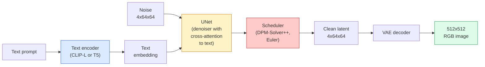

# Estabilidad de difusión  Arquitectura y ajuste fino  Estabilidad de difusión  Arquitectura y micro-调

> La difusión estable es un DDPM que se ejecuta en el espacio latente de un VAE preentrenado, condicionado en texto a través de la atención cruzada, muestrado con un solvente ODE determinista rápido y guiado por una guía libre de clasificador.

> **【中文解读】**La difusión estable es un modelo de difusión que se ejecuta en el espacio potencial de la VAE, a través de la atención de intercambio, la atención cruzada, la aceptación de las condiciones textuales, el uso de ODE de rápida determinación, la orientación sin clasificador, el control de la calidad de producción.

> **【拓展：Stable Diffusion 生态】**La difusión estable se deriva de LoRA (Lightweight Micro-Module) ControlNet (ControlNet) Control Gest态/边缘) IP-Adapter (Image Tip) 图像提示) 图像提示 (图像提示) 图像提示) 图像调 (LoRA 微调) 图像调 (图像提示) 图像调 (图像调) 图像调) 图像调 (图像调) 图像调 (图像调) 图像调 (图像调) 图像调 (图像调) 图像调) 图像调 (图像调) 图像调 (图像调) 图像调) 图像调 (图像调) 图像调 (图像调) 图像调 (图像调) 图像调度 (图像调度) 图像调度 (图像调度) 图像调度 (图像调度) 图像调度 (图像调度) 图像调度 (图像调度) 图像调度 (图像调度) 图像调度) 图像调度 (图像调度) 图像调度) 图像调度 (图像调度) 图像调度) 图像 (图像调度) 调度 (图像) 调度) 图像调度 (图像) 调度) 图像 (图像) 图像质量) 升级 (图像质量) 升级) 图像 (图像质量) 升级) 图像 (图像 图像 图像的不断升级) 图像.

**Type:** Learn + Use | **类型:** 学习 + 应用
**Languages:** Python | **语言:** Python
**Prerequisites:** Phase 4 Lesson 10 (Diffusion), Phase 7 Lesson 02 (Self-Attention) | **前置知识:** Phase 4 Lesson 10（扩散模型），Phase 7 Lesson 02（自注意力）
**Time:** ~75 minutes | **时间:** ~75 分钟

## Objetivos de aprendizaje

- Trazar las cinco piezas de un flujo de difusión estable: VAE, codificador de texto, U-Net, programador, verificador de seguridad y lo que cada uno de ellos realmente hace
- Explica la difusión latente y por qué el entrenamiento en un espacio latente 4x64x64 (en lugar de una imagen 3x512x512) reduce la computación en 48 veces sin pérdida de calidad
- Usar`diffusers`para generar imágenes, ejecutar imágenes a imágenes, pinturas y generación guiada por ControlNet
- Disfusión estable de ajuste fino con LoRA en un pequeño conjunto de datos personalizado y carga el adaptador LoRA a la inferencia

> **【中文解读】**El objetivo de aprendizaje enumera las capacidades centrales que debe dominarse después de completar la clase.


## El problema es la introducción del problema

El entrenamiento de un DDPM directamente en imágenes RGB 512x512 es caro. Cada paso de entrenamiento se retrocede a través de una red que ve 3x512x512 = 786,432 valores de entrada, y el muestreo toma 50+ pasos hacia adelante a través de esa misma red. En el nivel de calidad de la difusión estable 1.5 (lanzado en 2022), la difusión del espacio de píxeles necesitaría aproximadamente 256 meses de capacitación de GPU y 10-30 segundos por imagen en una GPU de consumo.

>  direct en 512x512 RGB  imágenes de entrenamiento DDPM  muy caro. Cada paso de entrenamiento debe pasar por una que vea 3x512x512 = 786,432                                                                                                                                                                                                                                                                                                                                                                                                                                                                                

El truco que hizo práctico el texto a imagen de peso abierto fue**latent diffusion**(Rombach et al., CVPR 2022). Entrenar un VAE que mapea una imagen 3x512x512 a un tensor latente 4x64x64 y hacia atrás, luego hacer la difusión en ese espacio latente.`(3*512*512)/(4*64*64) = 48x`La muestreo cae de decenas de segundos a menos de dos segundos en la misma GPU.

> Para que el acceso a textos y imágenes se convierta en práctica, la técnica es**潜空间扩散**(Rombach 等,CVPR 2022)  Entrenamiento de un VAE que proyecta imágenes 3x512x512                                                                                                                                                                                                                                                                                                                                                                                                                                                                                               `(3*512*512)/(4*64*64) = 48x` En la misma GPU, la muestra se reduce de unos pocos segundos a dos segundos.

Casi todos los modelos modernos de generación de imágenes  SDXL, SD3, FLUX, HunyuanDiT, Wan-Video  son modelos de difusión latente con variaciones en el autoencoder, el denoizador (U-Net o DiT) y el acondicionamiento de texto.

>  Casi todos los modelos de generación de imágenes modernas SDXL、SD3、FLUX、HunyuanDiT、Wan-Video son modelos de expansión espacial potencial, en los módulos de codificación automática Delar noido U-Net o DiT) y en la condicionalización del texto hay diferencias 

## El concepto central.

> **【中文解读】**Este capítulo presenta los conceptos y teorías básicos. La comprensión de estos conceptos es el prerrequisito de la realización posterior de la actividad, y también el conocimiento de los puntos de alta frecuencia de la entrevista y la práctica de la ingeniería.


### El oleoducto



- **VAE**El codificador convierte la imagen en latencia (utilizada para img2img y entrenamiento).
  En el caso de los modelos de imagen, el sistema de imágenes de la imagen se puede utilizar para la imagen de imagen.
- **Text encoder** Encoder de texto CLIP (SD 1.x/2.x), CLIP-L + CLIP-G (SDXL) o T5-XXL (SD3/FLUX). Produce una secuencia de embeddings de tokens.
  La versión original de la versión original de la versión original de la versión original de la versión original de la versión original de la versión original de la versión original de la versión original de la versión original de la versión original de la versión original de la versión original de la versión original de la versión original de la versión original de la versión original de la versión original de la versión original de la versión original de la versión original de la versión original de la versión original de la versión original de la versión original de la versión original de la versión original de la versión original de la versión original de la versión original de la versión original de la versión original de la versión original de la versión original de la versión original de la versión original de la versión original de la versión original de la versión original de la versión original de la versión original de la versión original de la versión original de la versión original de la versión original de la versión original de la versión original de la versión original de la versión original de la versión original de la versión original de la versión original de la versión original de la versión original de la versión original de la versión original de la versión original de la versión original de la versión original de la versión original de la versión original de la versión original de la versión original de la versión original de la versión original de la versión original de la versión original de la versión de la versión de la versión original de la versión de la versión de la versión de la versión de la versión de la versión de la versión de la versión de la versión de la versión de la versión de la versión de la versión de la versión de la versión de la versión de la versión de la versión de la versión de la versión de la versión de la versión de la versión de la versión de la versión de la versión de la versión de la versión de la versión de la versión de la versión de la versión de la versión de la versión de la versión de la versión de la versión de la versión de la versión de la versión de la versión de código de código de código de código de código de código de código de código de código de código de código.
- **U-Net** el denoizador. Tiene capas de atención cruzada que asisten desde los latences hasta el texto incrustado en todos los niveles de resolución.
  En la red de U-Net de hacer ruido, se incluye un nivel de atención de intercambio, en cada nivel de resolución, desde el nivel de potenciación de la cantidad de cambios.
- **Scheduler** el algoritmo de muestreo (DDIM, Euler, DPM-Solver++).
  La respuesta de la señal de sigma es la siguiente:
- **Safety checker** filtro opcional de contenido ilegal en la imagen de salida.
  China                                                                                                                                                                                                                                                                                                                                                                                                                                                                                                                             

### Orientación sin clasificador (CFG)

Aprende el condicionamiento del texto en blanco `epsilon_theta(x_t, t, c)`por cada pedido .`c`. CFG entrena la misma red con `c`El estudio de la investigación de la CPI ha reducido el 10% de las veces (reemplazado por una incorporación vacía), dando un modelo único que predice tanto el ruido condicional como el no.

> 纯文本条件化学习                                                                                                                                                                                                                                                                                                                                                                                                                                                                                                                       `epsilon_theta(x_t, t, c)`Para cada consejo`c` Cfg  entrenamiento con una red  10% del tiempo perdido `c`(substituido por espacio en el interior), obtiene un modelo de ruido y ruido incondicional simultáneamente:

```
eps = eps_uncond + w * (eps_cond - eps_uncond)
```

`w`es la escala de orientación. `w=0`es incondicional,`w=1`es simplemente condicional,`w>1`El sistema de distribución de datos de SD es el sistema de distribución de datos de SD.`w=7.5`¿ Qué ?

> `w`Es una medida de dirección.`w=0`Es un hecho.`w=1`Es normal que se produzcan condiciones,`w>1`En el caso de la industria de la producción, el valor de la producción es el valor de la producción.`w=7.5`¿Qué es eso?

CFG es la razón por la que el texto a la imagen funciona en la calidad de producción.

> CFG es la razón por la cual el texto a la imagen puede trabajar bajo la calidad de producción.

### Geometría del espacio latente

La latencia de 4 canales del VAE no es sólo una imagen comprimida. Es un variado donde la aritmética corresponde aproximadamente a las modificaciones semánticas (ingeniería de la rapidez + interpolación ambos viven aquí), y donde la red de difusión U-Net ha sido entrenada para gastar todo su presupuesto de modelado. La decodificación de un latente aleatorio 4x64x64 no produce una imagen de aspecto aleatorio  produce basura, porque solo un submanifold específico de latentes decodifica imágenes válidas.

> El 4通道潜量 VAE no es sólo una imagen comprimida. Es un flujo, con su cálculo de operaciones de cálculo, que se produce en este lugar, pero también se genera en el entrenamiento de la red U-Net para invertir en todo el presupuesto de construcción.

Dos consecuencias:

> 两个后果:

1. **Img2img**= codificar la imagen a latente, agregar ruido parcial, ejecutar el denoizador, decodificar. La estructura de la imagen sobrevive porque la codificación es casi invertible; el contenido cambia según el aviso.
   En inglés:**Img2img**= Codificar imágenes para variaciones inactivas, añadir parte del ruido, ejecutar un dispositivo de ruido, desodificar.
2. **Inpainting**= igual que img2img pero el denoizador solo actualiza regiones enmascaradas; las regiones sin enmascarar se mantienen en la latencia codificada.
   En inglés:**Inpainting**= Igual que la imagen, pero el dispositivo de ruido sólo actualiza la zona oculta; la zona no oculta mantiene la cantidad de cambios posibles después de la codificación.

### La arquitectura de la red U-Net

La SD U-Net es una versión grande de la TinyUNet de la Lección 10 con tres adiciones:

> SD's U-Net es la 10a versión de TinyUNet, que incluye tres componentes:

- **Transformer blocks**en cada resolución espacial, que contenga autoatención + atención cruzada al texto incorporado.
                                                                                                                                                                                                                                                                
- **Time embedding**por medio de MLP en codificación sinusoidal.
  En el tiempo de la grabación de la grabación de la grabación de la grabación de la grabación de la grabación de la grabación de la grabación de la grabación de la grabación de la grabación de la grabación de la grabación de la grabación de la grabación de la grabación de la grabación de la grabación de la grabación de la grabación de la grabación de la grabación de la grabación de la grabación de la grabación de la grabación de la grabación de la grabación de la grabación de la grabación de la grabación de la grabación de la grabación de la grabación de la grabación de la grabación de la grabación de la grabación de la grabación de la grabación de la grabación de la grabación de la grabación de la grabación de la grabación de la grabación de la grabación de la grabación de la grabación de la grabación de la grabación de la grabación de la grabación de la grabación de la grabación de la grabación de la grabación de la grabación de la grabación de la grabación de la grabación de la grabación de la grabación de la grabación de la grabación de la grabación de la grabación de la grabación de la grabación de la grabación de la gración de la gración de la gración de la gración de la gración de la gración de la gración de la gración.
- **Skip connections**entre codificador y decodificador en resoluciones coincidentes.
  En español, el código de código de código de código de código de código de código de código de código de código de código de código de código de código de código de código de código de código de código de código de código de código de código de código de código de código de código de código de código de código de código de código de código de código de código de código de código de código de código de código de código de código de código de código de código de código de código de código de código de código de código de código de código de código de código de código de código de código de código de código de código de código de código de código de código de código de código de código de código de código de código de código de código de código de código de código de código de código de código de código de código de código de código de código de código de código de código de código de código de código de código de código de código de código de código de código de código de código de código de código de código de código de código de código de código de código de código de código de código de código de código de código de código de código de código de código de código de código de código de código de código de código de código de código de código de código de código de código de código de código de código de código de código de código de código de código de código de código de código de código de código de código de código de código de código de código de código de código de código de código de código de código de código de código de código de código de código de código de código de código de código de código de código de código de código de código de código de código de entre entre entre entre entre entre entre entre

Parámetros totales en SD 1.5: ~860M. SDXL: ~2.6B. FLUX: ~12B. El salto en parámetros se realiza principalmente en capas de atención.

> SD 1.5                                                                                                                                                                                                                                                                                                                                                                                                                                                                                                                            

### Ajuste fino de la LORA

El ajuste fino completo de la difusión estable requiere 20+ GB de VRAM y actualiza 860M parámetros. LoRA (Low-Rank Adaptation) mantiene el modelo base congelado e inyecta pequeñas matrices de descomposición de rango en las capas de atención. Un adaptador LoRA para SD es típicamente de 10-50 MB, se emite en 10-60 minutos en una GPU de consumo único y se carga en el tiempo de inferencia como una modificación de entrada.

> El módulo de distribución estable de la LoRA 适配器 de SD normalmente es de 10 a 50 MB, en un solo GPU de consumo de 10 a 60 minutos, se puede usar como un módulo de carga de cambios de la CPU.

```
Original: W_q : (d_in, d_out)   frozen
LoRA:     W_q + alpha * (A @ B)   where A : (d_in, r), B : (r, d_out)

r is typically 4-32.
```

LoRA es la forma en que casi todas las comunidades de música se distribuyen.

> LoRA es el modo de distribución de casi todas las comunidades.

### Los horarios que verás

- **DDIM** determinista, ~50 pasos, simple.
  En inglés, el nombre de la persona que se encuentra en el sitio web es DIM.
- **Euler ancestral** Estocástico, 30-50 pasos, muestras ligeramente más creativas.
  El nombre de la familia de Euler se traduce en el idioma alemán.
- **DPM-Solver++ 2M Karras** Determinista, 20 a 30 pasos, por defecto de producción.
  En el contexto de la investigación, el desarrollo de la tecnología de la información en el mercado de la información se ha convertido en un proceso de desarrollo de la tecnología de la información.
- **LCM / TCD / Turbo** modelos de consistencia y variantes destiladas; 1-4 pasos a costa de cierta calidad.
  El precio de la producción de turbo es un factor de pérdida de calidad.

El cambio de calendarios es un cambio de línea en `diffusers`y a veces corrige problemas de muestra sin ninguna reeducación.

> En el`diffusers`El módulo de cambio solo necesita una línea de código, a veces no necesita reentrenamiento para poder reparar el problema de muestreo.

> **【中文解读】**Este capítulo a través del código de la implementación de algoritmos centrales de cero. Este método "desde cero" puede ayudar a entender el principio detrás del marco, no se encuentra en la caja negra cuando se encuentran problemas.

> **【拓展：工业部署中的视觉系统】**En la implementación industrial real, los modelos de visión necesitan considerar la posibilidad de retraso, el tamaño del modelo, la adaptación de los dispositivos de borde, etc. TensorRT, ONNX Runtime, OpenVINO son herramientas de aceleración de la teoría de uso habitual.

> **【拓展：数据标注与质量】**视觉任务的效果高度依赖标签数据质量──标签工作室、CVAT es la principal herramienta de marcado──在工业场景中,主动学习(Active Learning) puede reducir el costo de marcado: modelo a un requerimiento de muestras indeterminadas, marcación automática de muestras de determinación──


## Construye y realiza.
```figure
cv3-latent-compression
```

## Construye el mismo

Esta lección utiliza`diffusers`Las piezas que necesitarías para reconstruir (VAE, codificador de texto, U-Net, programador) son temas de sus propias lecciones; aquí el objetivo es fluidez con la API de producción.

> 本课端到端使用 `diffusers`En lugar de construir de nuevo desde cero, la difusión estable. Usted necesita reconstruir componentes (VAE, textbook coder, U-Net,调度器) cada uno tiene un curso especial.

### Paso 1: texto a imagen

```python
import torch
from diffusers import StableDiffusionPipeline

pipe = StableDiffusionPipeline.from_pretrained(
    "runwayml/stable-diffusion-v1-5",
    torch_dtype=torch.float16,
).to("cuda")

image = pipe(
    prompt="a dog riding a skateboard in tokyo, studio ghibli style",
    guidance_scale=7.5,
    num_inference_steps=25,
    generator=torch.Generator("cuda").manual_seed(42),
).images[0]
image.save("dog.png")
```

`float16`media la VRAM sin pérdida de calidad visible. `num_inference_steps=25`con las coincidencias de DPM-Solver++ por defecto `num_inference_steps=50`con DDIM.

> `float16` reducción de la mitad de la cantidad de almacenamiento y sin pérdida de calidad evidente                                                                                                                                                                                                                                                                                                                                                                                                                                                                                                           `num_inference_steps=25`Es muy bueno usar DDIM.`num_inference_steps=50`¿Qué es eso?

### Paso 2: Cambiar el cronograma

```python
from diffusers import DPMSolverMultistepScheduler, EulerAncestralDiscreteScheduler

pipe.scheduler = DPMSolverMultistepScheduler.from_config(pipe.scheduler.config)
pipe.scheduler = EulerAncestralDiscreteScheduler.from_config(pipe.scheduler.config)
```

El estado del programador está desconectado de los pesos de U-Net. Puedes entrenar en DDPM y probar con cualquier programador.

> 调度器状态与U-Net 权重解──可在DDPM上训练,使用任何调度器采样──

### Paso 3: Imagen a imagen

```python
from diffusers import StableDiffusionImg2ImgPipeline
from PIL import Image

img2img = StableDiffusionImg2ImgPipeline.from_pretrained(
    "runwayml/stable-diffusion-v1-5",
    torch_dtype=torch.float16,
).to("cuda")

init_image = Image.open("dog.png").convert("RGB").resize((512, 512))
out = img2img(
    prompt="a dog riding a skateboard, oil painting",
    image=init_image,
    strength=0.6,
    guidance_scale=7.5,
).images[0]
```

`strength`Es la cantidad de ruido que se debe añadir antes de denotar (0,0 = sin cambios, 1,0 = regeneración completa).

> `strength`控制去噪音前添加多少噪音(0.0 = 不变,1.0 = 完全重新生成) ⋅0.5-0.7 es el rango estándar de la migración ⋅0.0 = ≠0.0

### Paso 4: Pintura

```python
from diffusers import StableDiffusionInpaintPipeline

inpaint = StableDiffusionInpaintPipeline.from_pretrained(
    "runwayml/stable-diffusion-inpainting",
    torch_dtype=torch.float16,
).to("cuda")

image = Image.open("dog.png").convert("RGB").resize((512, 512))
mask = Image.open("dog_mask.png").convert("L").resize((512, 512))

out = inpaint(
    prompt="a cat",
    image=image,
    mask_image=mask,
    guidance_scale=7.5,
).images[0]
```

Los píxeles blancos en la máscara son el área para regenerarse.

> 掩码中白色像素是需要重生的区域,黑色像素被保留──

### Paso 5: Carga de LoRA

```python
pipe.load_lora_weights("sayakpaul/sd-lora-ghibli")
pipe.fuse_lora(lora_scale=0.8)

image = pipe(prompt="a village square in ghibli style").images[0]
```

`lora_scale`control de la fuerza; 0,0 = no efecto, 1,0 = efecto completo. `fuse_lora`El adaptador se coloca en el peso para la velocidad, pero evita el intercambio.`pipe.unfuse_lora()`antes de cargar un adaptador diferente.

> `lora_scale`Control intensidad;0.0 = 无效,1.0 = 完全效果──`fuse_lora`Se puede combinar el adaptador a la velocidad de aumento de peso, pero se puede detener el cambio.`pipe.unfuse_lora()`¿Qué es eso?

### Paso 6: Formación en el sector de la LRA (bozo)

El entrenamiento real de LoRA vive en `peft`o `diffusers.training`El esquema:

> El verdadero entrenamiento de la LORA está en`peft`O `diffusers.training`En el medio de la realización:

```python
# Pseudocode
for step, batch in enumerate(dataloader):
    images, prompts = batch
    latents = vae.encode(images).latent_dist.sample() * 0.18215

    t = torch.randint(0, num_train_timesteps, (batch_size,))
    noise = torch.randn_like(latents)
    noisy_latents = scheduler.add_noise(latents, noise, t)

    text_emb = text_encoder(tokenizer(prompts))

    pred_noise = unet(noisy_latents, t, text_emb)  # LoRA weights injected here

    loss = F.mse_loss(pred_noise, noise)
    loss.backward()
    optimizer.step()
```

> **【中文解读】**Este capítulo muestra cómo utilizar un marco maduro (como PyTorch、HuggingFace, etc.) para aplicar rápidamente esta tecnología. En los proyectos reales, se realiza con prioridad el uso de un marco experimentado, se pueden reducir errores y mejorar la eficiencia de desarrollo.


Sólo las matrices LoRA reciben gradiente; la base U-Net, VAE y el codificador de texto están congelados.

>  sólo LoRA 矩阵接收梯度;基础 U-Net、VAE 和文本编码器都是结的──批量大小为 1并启用梯度检查点时,8 GB 显存即可运行──


> **【拓展：视觉模型的持续学习】**En el entorno de producción, el modelo visual necesita adaptarse continuamente a nuevos datos. Esto es especialmente importante en la conducción automotriz y el control de calidad industrial.

## Usalo con el marco de ejecución

En la producción, las decisiones que realmente tomas:

- **Model family**: SD 1.5 para la comunidad de código abierto de las canciones finas, SDXL para mayor fidelidad, SD3 / FLUX para el estado de la técnica y estrictos requisitos de licencias.
- **Scheduler**: DPM-Solver++ 2M Karras para 20-30 pasos, LCM-LoRA cuando la latencia es inferior a 1s.
- **Precision**¿ Qué es esto ?`float16`en el 4080/4090, `bfloat16`en la A100 y más recientes, `int8`(por medio de `bitsandbytes`o `compel`) cuando el VRAM está apretado.
- **Conditioning**: trabaja en texto plano; para un control más fuerte, añadir ControlNet (canny, profundidad, pose) en la parte superior de la tubería base.

> **【中文解读】**Este capítulo se centra en cómo se puede implementar el modelo como producto disponible. Desde el modelo original hasta el sistema de producción, se deben considerar múltiples dimensiones de optimización de rendimiento, tratamiento de errores, control, etc.


Para la generación de lotes, `AUTO1111`- ¿ Qué ?`ComfyUI`son las herramientas comunitarias; para las APIs de producción, `diffusers`¿ Qué es eso ?`accelerate`o `optimum-nvidia`con la compilación TensorRT.


## Envíe el producto .

Esta lección produce:

- `outputs/prompt-sd-pipeline-planner.md` un prompt que escoge SD 1.5 / SDXL / SD3 / FLUX más programador y precisión dado un presupuesto de latencia, objetivo de fidelidad y restricción de licencias.
- `outputs/skill-lora-training-setup.md` una habilidad que escribe una configuración completa de capacitación de LoRA para un conjunto de datos personalizado que incluye títulos, rango, tamaño de lote y tasa de aprendizaje.

> **【中文解读】**Practice los temas de fácil/medio/duro  3 difficulty to pass in  Recomenda al menos completar los temas de grado medio  Grado duro  para la preparación de la entrevista


## Los ejercicios.

1. **(Easy)**Generar el mismo mensaje con `guidance_scale`En el`[1, 3, 5, 7.5, 10, 15]`¿A qué valor de orientación aparecen los artefactos?
2. **(Medium)**Toma cualquier foto real, revisala.`StableDiffusionImg2ImgPipeline`En el`strength`En el`[0.2, 0.4, 0.6, 0.8, 1.0]`¿Qué fuerza conserva la composición mientras cambia el estilo? ¿Por qué 1.0 ignora la entrada por completo?
3. **(Hard)**Entrenar un LoRA en 10-20 imágenes de un solo sujeto (una mascota, un logotipo, un personaje) y generar escenas novedosas con ese sujeto en ellas.

> **【中文解读】**En el lenguaje de los términos "Lo que la gente dice" vs "Lo que realmente significa" se distingue entre el lenguaje diario y la definición técnica de significado.


## Términos clave .

| Term | What people say | What it actually means |
|------|----------------|----------------------|
| Latent diffusion | "Diffuse in latents" | Run the entire DDPM in the VAE latent space (4x64x64) instead of pixel space (3x512x512); 48x compute saving |
| VAE scale factor | "0.18215" | Constant that rescales the VAE's raw latent to roughly unit variance; hardcoded in every SD pipeline |
| Classifier-free guidance | "CFG" | Mix conditional and unconditional noise predictions; the single most impactful inference knob |
| Scheduler | "Sampler" | The algorithm that turns noise + model predictions into a denoised latent trajectory |
| LoRA | "Low-rank adapter" | Small rank-decomposition matrices that fine-tune attention layers without touching base weights |
| Cross-attention | "Text-image attention" | Attention from latent tokens to text tokens; injects prompt information at every U-Net level |
| ControlNet | "Structure conditioning" | A separately-trained adapter that steers SD with an extra input (canny, depth, pose, segmentation) |
| DPM-Solver++ | "The default scheduler" | Second-order deterministic ODE solver; best quality at low step counts (20-30) in 2026 |

> **【中文解读】**延伸阅读 proporciona un alto nivel de recursos para el aprendizaje profundo. Estos artículos y cursos son los referentes clásicos en el campo, adecuados para los lectores que necesitan una comprensión profunda.


## Más Leer más Leer más

- [High-Resolution Image Synthesis with Latent Diffusion (Rombach et al., 2022)](https://arxiv.org/abs/2112.10752) el papel de difusión estable; incluye toda ablación que justifique el diseño
- [Classifier-Free Diffusion Guidance (Ho & Salimans, 2022)](https://arxiv.org/abs/2207.12598) el papel CFG
- [LoRA: Low-Rank Adaptation of Large Language Models (Hu et al., 2021)](https://arxiv.org/abs/2106.09685) LoRA fue la primera en la PNL; se transfirió a SD sin cambios
- [diffusers documentation](https://huggingface.co/docs/diffusers) la referencia para cada tubería SD/SDXL/SD3/FLUX
