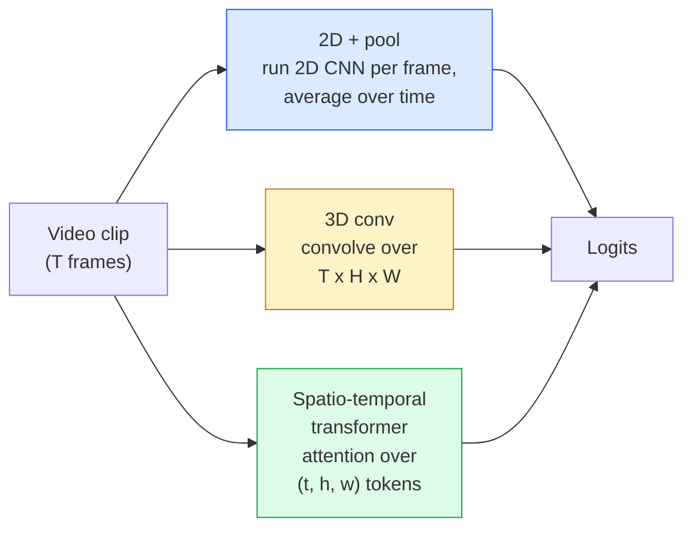

# Video Comprensión  Modelado temporal  视频理解  时序建模

> Un video es una secuencia de imágenes más la física que las conecta. Cada modelo de video trata el tiempo como un eje extra (3D conv), una secuencia para atender (transformador), o una función para extraer una vez y un grupo (2D + grupo).

> **【中文解读】**视频 es un conjunto de secuencias de imágenes que se unen a las reglas físicas de los modelos de video.

> **【拓展：视频 AI 应用】**视频理解驱动了YouTube/TikTok's content推、安防监控的异常检查、体育赛事的自动分析──Sora等视频生成模型将视频理解推向新高度理解视频才能生成视频──

**Type:** Learn + Build | **类型:** 学习 + 动手
**Languages:** Python | **语言:** Python
**Prerequisites:** Phase 4 Lesson 03 (CNNs), Phase 4 Lesson 04 (Image Classification) | **前置知识:** Phase 4 Lesson 03（CNN），Phase 4 Lesson 04（图像分类）
**Time:** ~45 minutes | **时间:** ~45 分钟

## Objetivos de aprendizaje

- Distinguir los tres enfoques principales de modelado de vídeo (2D+pool, 3D conv, transformador espacio-temporal) y predecir sus costos y correcciones de precisión
- Implementar muestreo de marco, agrupación temporal y clasificador de línea de base 2D+pool en PyTorch
- Explica por qué los núcleos 3D "inflados" de I3D transfieren bien de los pesos de ImageNet y qué hace un conv factorizado (2+1)D de manera diferente
- Lea los conjuntos de datos y métricas estándar de reconocimiento de acción: Kinetics-400/600, UCF101, Something-Something V2; precisión superior a 1 en el nivel de clip y video

> **【中文解读】**El objetivo de aprendizaje enumera las capacidades centrales que debe dominarse después de completar la clase.


## El problema es la introducción del problema

Un video de 30 segundos a 30 fps es 900 imágenes. Ingenuamente, la clasificación de video es una clasificación de imágenes ejecutada 900 veces seguido de algún tipo de agregación. Eso funciona cuando la acción es visible en casi todos los cuadros (deportes, cocina, videos de ejercicio) y falla gravemente cuando la acción se define por el movimiento en sí: "empujando algo de izquierda a derecha" se ve como dos objetos fijos en cada cuadro.

> 30 segundos 30fps de vídeo es 900 张图像―― simplemente ver, el video es separar imágenes en 900 veces y luego agruparse―― cuando el movimiento es casi todo visible en cada momento, pero cuando el movimiento es definido por el movimiento, es un gran fracaso: "Poner cosas de izquierda a derecha" en cada uno de los ojos son dos objetos parados―

La pregunta central para cada arquitectura de vídeo es: cuándo se modela la estructura temporal y cómo? La respuesta impulsa todo lo demás  costo de cálculo, estrategia de preentrenamiento, si se pueden reutilizar pesos de ImageNet, qué conjuntos de datos el modelo se entrenan.

> La cuestión central de cada video arquitectura es: ¿Cuándo se construye la estructura, y cómo se construye? Respuesta: ¿Dire todo lo demás?

Esta lección es deliberadamente más corta que las lecciones de imagen estática. La maquinaria central de la imagen ya está en su lugar, y la comprensión de vídeo se trata principalmente de la historia temporal: muestreo, modelado y agregado.

> Este curso tiene un significado más corto que el de imágenes estáticas. El mecanismo central de imágenes ya está en marcha, el video se entiende principalmente sobre el proceso de historia:

## El concepto central.

> **【中文解读】**Este capítulo presenta los conceptos y teorías básicos. La comprensión de estos conceptos es el prerrequisito de la realización posterior de la actividad, y también el conocimiento de los puntos de alta frecuencia de la entrevista y la práctica de la ingeniería.


### Las tres familias arquitectónicas



### 2D + piscina

Tomemos una CNN 2D (ResNet, EfficientNet, ViT). ejecutarla de forma independiente en cada marco muestrado. promedio (o máximo-pool, o pool de atención) las incorporaciones por marco.

> 取一个2D CNN(ResNet、EfficientNet、ViT), en cada uno de los sistemas de trabajo independientes, para cada uno de los sistemas de inserción en el sistema de mediación (or máxima acumulación ), se enviará el volumen posterior a la acumulación en los sistemas de distribución.

Los pros:
- ImageNet traslada directamente a los estudiantes.
  En inglés, "ImageNet" se utiliza para transferir datos de datos.
- Es más simple de implementar.
  En inglés, "realizar" se refiere a la forma en que se realiza.
- Baratos: T marcos * costo de inferencia de una sola imagen.
  El costo de la venta de la propiedad de la empresa es bajo.

Las ventajas:
- No puedo modelar movimiento.
  Traducción:无法建模运动──动作 = 聚合外观的──
- El agrupamiento temporal es invariable según el orden; "puerta abierta" y "puerta cerrada" se ven iguales.
  China: 时序池化是序无关的; "puerta abierta" y "puerta abierta" parecen ser las mismas.

Cuándo utilizar: tareas pesadas en apariencia, transferencia de aprendizaje en pequeños conjuntos de datos de vídeo, líneas de base iniciales.

> ¿qué horas utiliza: tareas de dominio exterior ∙ 小视频数据集上的迁移学习、初始基线──

### Convolturas en 3D

Los núcleos 2D (H, W) se sustituyen por núcleos 3D (T, H, W). La red se envuelve tanto en el espacio como en el tiempo.

> Se puede utilizar el núcleo de 2D (H, W) para reemplazarlo por el núcleo de 3D (T, H, W).

Triko I3D: toma un modelo preentrenado de 2D ImageNet, "infla" cada núcleo 2D copiándolo a lo largo de un nuevo eje de tiempo. Un conv 3x3 2D se convierte en un conv 3x3x3 3D. Esto le da al modelo 3D pesos preentrenados fuertes en lugar de entrenar desde cero.

> I3D 技巧: Tome un pre-training de 2D ImageNet 模型, "inflación" de cada 2D 核沿新时间轴复制──3x3 卷积的2D 卷积变成 3x3x3 卷积──这让3D 模型获得强预训权重,而无需从头训──

Los pros:
- Modela directamente el movimiento.
  En español: direct建模运动.
- La inflación I3D ofrece aprendizaje gratuito.
  En inglés, el idioma de la región de la región de la India es el idioma de la región de la India.

Las ventajas:
- T/8 más FLOPs que la contraparte 2D (para el núcleo temporal de 3 apilados 3 veces).
  Por ejemplo, el tiempo de la estructura de la estructura de la estructura de la estructura de la estructura de la estructura de la estructura de la estructura de la estructura de la estructura de la estructura de la estructura de la estructura de la estructura de la estructura de la estructura de la estructura de la estructura de la estructura de la estructura de la estructura de la estructura de la estructura de la estructura de la estructura de la estructura de la estructura de la estructura de la estructura de la estructura de la estructura de la estructura de la estructura de la estructura de la estructura de la estructura de la estructura de la estructura de la estructura de la estructura de la estructura de la estructura de la estructura de la estructura de la estructura de la estructura de la estructura de la estructura de la estructura de la estructura de la estructura de la estructura de la estructura de la estructura de la estructura de la estructura de la estructura de la estructura de la estructura de la estructura de la estructura de la estructura de la estructura de la estructura de la estructura de la estructura de la estructura de la estructura de la estructura de la estructura de la estructura de la estructura de la estructura de la estructura de la estructura de la estructura de la estructura de la estructura de la estructura de la estructura de la estructura de la estructura de la estructura de la estructura de la estructura de la estructura de la estructura de la estructura de la estructura de la estructura de la estructura de la estructura de la estructura de la estructura de la estructura de la estructura de la estructura de la estructura de la estructura de la estructura de la estructura de la estructura de la estructura de la estructura de la estructura de la estructura de la estructura de la estructura de la estructura de la estructura de la estructura de la estructura de la estructura de la estructura de la estructura de la estructura de la estructura de la estructura de la estructura de la estructura de la estructura de la estructura de la estructura de la estructura de la estructura de la estructura de la estructura de la estructura de la estructura de la estructura de la estructura de la estructura de la estructura de la estructura de la estructura de la estructura de la estructura de la estructura de la estructura de la estructura de la estructura de la estructura de la estructura de la estructura de la estructura de la estructura de la estructura de la estructura de la estructura de la estructura de la estructura de la estructura de la estructura de la estructura de la estructura de la estructura de la estructura de la estructura de la estructura de la estructura de la estructura de la estructura de la estructura de la estructura de la estructura de la estructura de la estructura de la estructura de
- Los núcleos temporales son pequeños; el movimiento a largo alcance requiere un enfoque de pirámide o doble corriente.
  Traducción: tiempo nuclear muy pequeño; largo distancia de movimiento necesita una torre de piedra o un método de doble corriente.

Cuando utilizar: reconocimiento de acción donde el movimiento es la señal (Algo-Algo V2, Kinética con clases de movimiento pesado).

> ¿时使用:运动是关键信号的动作识别(Algo-Algo V2、以运动为主的动力学 类别) ⋅

### Transformadores espaciotemporales

Marca el video en una cuadrícula de parches espacio-tiempo y atenta a todos ellos.

> Se puede hacer un video en el tiempo, y luego hacer un cálculo de la atención entre todos los correctos.

Los patrones de atención que importan:
- **Joint** una gran atención sobre (t, h, w). Cuadrado en `T*H*W`Es muy caro.
  En inglés:**联合**对 (t, h, w) hacer una vez grande atención―复杂度为 `T*H*W`Es un lugar muy precioso.
- **Divided** dos atenciones por bloque: una en el tiempo, otra en el espacio.
  En inglés:**分离** Cada bloque dos veces: una vez tiempo, una vez espacio, una vez espacio, una vez espacio, una vez espacio, una vez espacio, una vez espacio, una vez espacio, una vez espacio, una vez espacio, una vez espacio, una vez tiempo, una vez tiempo, una vez tiempo, una vez espacio, una vez tiempo, una vez tiempo, una vez tiempo, una vez tiempo, una vez tiempo, una vez tiempo, una vez tiempo, una vez tiempo, una vez tiempo, una vez tiempo, una vez tiempo, una vez tiempo, una vez tiempo, una vez tiempo, una vez tiempo, una vez tiempo, una vez tiempo, una vez tiempo, una vez tiempo, una vez tiempo, una vez tiempo, una vez tiempo, una vez tiempo, una vez tiempo, una vez tiempo, una vez tiempo, una vez tiempo, una vez tiempo, una vez tiempo, una vez tiempo, una vez tiempo, una vez más, una vez más, una vez más, una vez más, una vez más, una vez más, una vez más, una vez más, una vez más, una vez más, una vez más, una vez más, una vez más, una vez más, una vez más, una vez más, una vez más, una vez más, una vez más, una vez más, una vez más, una vez más, una vez más, una vez más, una vez más, una vez más, una vez más, una vez más, una vez más, una vez más, una vez más, una vez más, una vez más, una vez más, una vez más, una vez más, una vez más, una vez más, una vez más, una vez más, una vez más, una vez más, una vez más, una vez más, una vez más, una vez más, una vez más, más, una vez más, más, una vez más, una vez más, más, más, una vez más, más, más, una vez más, más, más, más, más, más, más, más, más, más, más, más, más más más, más, más, más más más más, más más, más más más más más más, más más más, más más más más, más más más, más más más más más, más más más más, más más, más más más más más, más más más más más más, más más más más más más, más, más más más más más
- **Factorised** La atención temporal se alterna con la atención espacial a través de los bloques.
  En inglés:**分解** La atención del tiempo y la atención del espacio se intercambian entre los bloques.

Los pros:
- Precisión SOTA en todos los principales indicadores de referencia.
  En todos los principales pruebas de base, se alcanza la SOTA 精度.
- Transferencias desde transformadores de imagen (ViT) a través de la inflación de parches.
  En el caso de los transformas, el cambio de imagen se produce en el transformer.
- Soporta videos de largo contexto a través de poca atención.
  Por el contrario, el gobierno de China ha puesto en marcha un nuevo sistema de control de la salud.

Las ventajas:
- - Con hambre de computación.
  En inglés, el nombre de la persona que se encuentra en el centro de la ciudad es el nombre de la persona que se encuentra en el centro de la ciudad.
- Requiere una elección cuidadosa de patrones de atención o globos de tiempo de ejecución.
  China: necesita仔细选择注意力模式, si no entonces el tiempo de ejecución se inflama.

Cuándo utilizar: grandes conjuntos de datos, comprensión de vídeo de alta fidelidad, tareas de vídeo + texto multimodales.

> ¿qué tiempo utiliza: DATABET 高保真视频理解 多模态视频+文本任务──

### Muestreo de los cuadros

Un clip de 10 segundos a 30 fps es de 300 cuadros; alimentar a todos los 300 a cualquier modelo es un desperdicio.

> Los 30 fps tienen 300 ; todos los 300  a cualquier modelo son un desperdicio.

- **Uniform sampling** Seleccione los marcos T uniformemente a través del clip.
  En inglés:**均匀采样**在片段中等间距选 T ──2D+pool 的默认方式──
- **Dense sampling** ventana de marco T contiguo aleatorio. común para convistas 3D porque el movimiento requiere de marcos vecinos.
  En inglés:**密集采样**随机连续 T 窗口──3D 卷积常用,因为运动需要相邻──
- **Multi-clip** muestra varias ventanas de marco T del mismo video, clasifica cada una, predicciones promedio en el momento de la prueba.
  En inglés:**多片段** de la misma video  de la misma serie  de diferentes tipos de pruebas 

T es generalmente 8, 16, 32 o 64. T más alto = más señal temporal en más cálculo.

> T normalmente es 8、16、32 o 64。T 越大 = 更多时序信号, pero el cálculo es mayor。

### Evaluación

Dos niveles:
- **Clip-level accuracy** modelo ve un clip de marco T, informa top-k.
  En inglés:**片段级精度**模型看一个T 片段, informe el top-k──
- **Video-level accuracy** predicciones medias de nivel de clip en múltiples clips por video; más alto y más estable.
  En inglés:**视频级精度** Prevé por media a varios fragmentos de un mismo video; más alto y más estable。

Siempre informe ambos. Un modelo que obtiene un puntaje de 78% clip / 82% de video depende en gran medida del promedio de tiempo de prueba; uno que obtiene un puntaje de 80% / 81% es más robusto por clip.

> 务必同时报告两者──78% 片段 / 82% 视频的模型严重依赖测试时平均;80% / 81% 视频的模型在单片段上更鲁棒──

### Datasets que se reunirán

- **Kinetics-400 / 600 / 700** el conjunto de datos de acción de propósito general. 400k clips; URL de YouTube (muchos ya muertos).
  China: China: China: China: China: China: China: China: China: China: China: China: China: China: China: China: China: China: China: China: China: China: China: China: China: China: China: China: China: China: China: China: China: China: China: China: China: China: China: China: China: China: China: China: China: China: China: China: China: China: China: China: China: China: China: China: China: China: China: China: China: China: China: China: China: China: China: China: China: China: China: China: China: China: China: China: China: China: China: China: China: China: China: China: China: China: China: China: China: China: China: China: China: China: China: China: China: China: China: China: China: China: China: China: China: China: China: China: China: China: China: China: China: China: China: China: China: China: China: China: China: China: China: China: China: China: China: China: China: China: China: China: China: China: China: China: China: China: China: China: China: China: China: China: China: China: China: China: China: China: China: China: China: China: China: China: China: China: China: China: China: China: China: China: China: China: China: China: China: China: China: China: China: China: China: China: China: China: China: China: China: China: China: China: China: China: China: China: China: China: China: China: China: China: China: China: China: China: China: China: China: China: China: China: China: China: China: China: China: China: China: China: China: China: China: China: China: China: China: China: China: China: China: China: China: China: China: China: China: China: China: China: China: China: China: China: China: China: China: China: China: China: China: China: China: China: China: China: China: China: China: China: China: China: China:
- **Something-Something V2** Acciones definidas por movimiento ("movimiento de X de izquierda a derecha"). No se pueden resolver por 2D + pool.
  En el texto original, el texto se traduce como "un movimiento de movimiento" (en inglés: Something-Something V2运动定义的动作") ("将 X 从左移到右") (en inglés: "X de izquierda a derecha") (en inglés: 2D+pool 无法解决").
- **UCF-101**¿ Qué ?**HMDB-51** mayor, menor, aún reportado.
  La nueva versión de la UFC-101 ∼ HMDB-51 ∼ Más vieja ∼ menor, todavía en el informe─
- **AVA** acción *localización* en el espacio y el tiempo; más difícil que la clasificación.
  En el caso de los niños, el tiempo se reduce a un nivel de 5 años.

> **【中文解读】**Este capítulo a través del código de la implementación de algoritmos centrales de cero. Este método "desde cero" puede ayudar a entender el principio detrás del marco, no se encuentra en la caja negra cuando se encuentran problemas.

> **【拓展：工业部署中的视觉系统】**En la implementación industrial real, los modelos de visión necesitan considerar la posibilidad de retraso, el tamaño del modelo, la adaptación de los dispositivos de borde, etc. TensorRT, ONNX Runtime, OpenVINO son herramientas de aceleración de la teoría de uso habitual.

> **【拓展：数据标注与质量】**视觉任务的效果高度依赖标签数据质量──标签工作室、CVAT es la principal herramienta de marcado──在工业场景中,主动学习(Active Learning) puede reducir el costo de marcado: modelo a un requerimiento de muestras indeterminadas, marcación automática de muestras de determinación──


## Construye y realiza.
```figure
v4-video-temporal
```

## Construye el mismo

### Paso 1: Muestra de marco

Muestras uniformes y densas que trabajan en una lista de marcos (o un tensor de vídeo).

> 均采样和密集采样器, para la lista de ejemplos o para la producción de ejemplos

```python
import numpy as np

def sample_uniform(num_frames_total, T):
    if num_frames_total <= T:
        return list(range(num_frames_total)) + [num_frames_total - 1] * (T - num_frames_total)
    step = num_frames_total / T
    return [int(i * step) for i in range(T)]


def sample_dense(num_frames_total, T, rng=None):
    rng = rng or np.random.default_rng()
    if num_frames_total <= T:
        return list(range(num_frames_total)) + [num_frames_total - 1] * (T - num_frames_total)
    start = int(rng.integers(0, num_frames_total - T + 1))
    return list(range(start, start + T))
```

Ambos regresan .`T`Indices que se utilizan para cortar el tensor de vídeo.

> 两者都回归 `T`个索引用于切片视频张量──

### Paso 2: Una línea de base 2D+pool

Ejecutar un ResNet-18 2D sobre cada fotograma, características de la piscina promedio, clasificar.

> En cada uno de los días de la operación 2D ResNet-18, el tamaño medio de la red, y luego la clasificación.

```python
import torch
import torch.nn as nn
from torchvision.models import resnet18, ResNet18_Weights

class FramePool(nn.Module):
    def __init__(self, num_classes=400, pretrained=True):
        super().__init__()
        weights = ResNet18_Weights.IMAGENET1K_V1 if pretrained else None
        backbone = resnet18(weights=weights)
        self.features = nn.Sequential(*(list(backbone.children())[:-1]))  # global avg pool kept
        self.head = nn.Linear(512, num_classes)

    def forward(self, x):
        # x: (N, T, 3, H, W)
        N, T = x.shape[:2]
        x = x.view(N * T, *x.shape[2:])
        feats = self.features(x).view(N, T, -1)
        pooled = feats.mean(dim=1)
        return self.head(pooled)

model = FramePool(num_classes=10)
x = torch.randn(2, 8, 3, 224, 224)
print(f"output: {model(x).shape}")
print(f"params: {sum(p.numel() for p in model.parameters()):,}")
```

Once millones de parámetros, ImageNet pre-entrenado, se ejecuta por marco, promedios, clasifica. Esta línea de base a menudo está dentro de 5-10 puntos de los modelos 3D adecuados en tareas pesadas en apariencia  a veces mejor, porque reutiliza una columna vertebral ImageNet más fuerte.

> Una mil millones de parámetros,ImageNet 预训练,逐运行、平均、分类── esta base en tareas de dominio exterior suele diferir entre 5 a 10 puntos por ciento de los modelos 3D tradicionales a veces incluso mejor, ya que utiliza redes de base de imagen de ImageNet más fuertes──

### Paso 3: Un enchufe 3D inflado de estilo I3D

Convierta una sola convalescencia 2D en una convalescencia 3D repitiendo pesos a lo largo de un nuevo eje de tiempo.

> 通过沿新时间轴重重权重,将单个2D卷积转为3D卷积──

```python
def inflate_2d_to_3d(conv2d, time_kernel=3):
    out_c, in_c, kh, kw = conv2d.weight.shape
    weight_3d = conv2d.weight.data.unsqueeze(2)  # (out, in, 1, kh, kw)
    weight_3d = weight_3d.repeat(1, 1, time_kernel, 1, 1) / time_kernel
    conv3d = nn.Conv3d(in_c, out_c, kernel_size=(time_kernel, kh, kw),
                        padding=(time_kernel // 2, conv2d.padding[0], conv2d.padding[1]),
                        stride=(1, conv2d.stride[0], conv2d.stride[1]),
                        bias=False)
    conv3d.weight.data = weight_3d
    return conv3d

conv2d = nn.Conv2d(3, 64, kernel_size=3, padding=1, bias=False)
conv3d = inflate_2d_to_3d(conv2d, time_kernel=3)
print(f"2D weight shape:  {tuple(conv2d.weight.shape)}")
print(f"3D weight shape:  {tuple(conv3d.weight.shape)}")
x = torch.randn(1, 3, 8, 56, 56)
print(f"3D output shape:  {tuple(conv3d(x).shape)}")
```

La división por `time_kernel`mantiene las magnitudes de activación aproximadamente constantes  importantes para no romper las estadísticas de la norma de lote en el primer pase.

> Además de`time_kernel` mantener la amplitud de valor activado casi invariable esto es importante para no dañar la estadística de la regeneración de la cantidad de unidades durante la primera fase de propagación.

### Paso 4: Convolución de la D (2+1)

Dividir una convección 3D en una convección 2D (espacial) y una convección 1D (temporal). El mismo campo receptivo, menos parámetros, mejor precisión en algunos puntos de referencia.

> Se dividirá en 2D (espacio) y 1D (tiempo) (volumen).

```python
class Conv2Plus1D(nn.Module):
    def __init__(self, in_c, out_c, kernel_size=3):
        super().__init__()
        mid_c = (in_c * out_c * kernel_size * kernel_size * kernel_size) \
                // (in_c * kernel_size * kernel_size + out_c * kernel_size)
        self.spatial = nn.Conv3d(in_c, mid_c, kernel_size=(1, kernel_size, kernel_size),
                                 padding=(0, kernel_size // 2, kernel_size // 2), bias=False)
        self.bn = nn.BatchNorm3d(mid_c)
        self.act = nn.ReLU(inplace=True)
        self.temporal = nn.Conv3d(mid_c, out_c, kernel_size=(kernel_size, 1, 1),
                                  padding=(kernel_size // 2, 0, 0), bias=False)

    def forward(self, x):
        return self.temporal(self.act(self.bn(self.spatial(x))))

c = Conv2Plus1D(3, 64)
x = torch.randn(1, 3, 8, 56, 56)
print(f"(2+1)D output: {tuple(c(x).shape)}")
```

> **【中文解读】**Este capítulo muestra cómo utilizar un marco maduro (como PyTorch、HuggingFace, etc.) para aplicar rápidamente esta tecnología. En los proyectos reales, se realiza con prioridad el uso de un marco experimentado, se pueden reducir errores y mejorar la eficiencia de desarrollo.


Una red completa R(2+1)D es la misma que una ResNet-18 con cada 3x3 conv sustituido por `Conv2Plus1D`¿ Qué ?

> 完整的 R(2+1) D 网络就是将ResNet-18 中的每个3x3卷积替换为 `Conv2Plus1D`¿Qué es eso?


> **【拓展：视觉模型的持续学习】**En el entorno de producción, el modelo visual necesita adaptarse continuamente a nuevos datos. Esto es especialmente importante en la conducción automotriz y el control de calidad industrial.

## Usalo con el marco de ejecución

Dos bibliotecas cubren el trabajo de vídeo de producción:

- `torchvision.models.video` R(2+1) D, MViT, Swin3D con pesos de cinética preentrenados. La misma API que los modelos de imagen.
- `pytorchvideo`(Meta)  modelo de zoológico, cargadores de datos para Kinética / SSv2 / AVA, transformaciones estándar.

> **【中文解读】**Este capítulo se centra en cómo se puede implementar el modelo como producto disponible. Desde el modelo original hasta el sistema de producción, se deben considerar múltiples dimensiones de optimización de rendimiento, tratamiento de errores, control, etc.


Para los modelos de vídeo en lenguaje de visión (capción de vídeo, evaluación de calidad de vídeo), utilice `transformers`(El artículo`VideoMAE`¿ Qué ?`VideoLLaMA`¿ Qué ?`InternVideo`¿Qué es lo que se hace?


## Envíe el producto .

Esta lección produce:

- `outputs/prompt-video-architecture-picker.md` un prompt que selecciona el transformador 2D+pool / I3D / (2+1)D / basado en la apariencia frente al movimiento, el tamaño del conjunto de datos y el presupuesto de cálculo.
- `outputs/skill-frame-sampler-auditor.md` una habilidad que inspecciona el muestreo de una tubería de vídeo y señala errores comunes: índice de un solo, muestreo desigual cuando `num_frames < T`, falta de cultivo que preserve los aspectos, etc.

> **【中文解读】**Practice los temas de fácil/medio/duro  3 difficulty to pass in  Recomenda al menos completar los temas de grado medio  Grado duro  para la preparación de la entrevista


## Los ejercicios.

1. **(Easy)**Computa FLOPs (aproximados) para FramePool con T=8 vs. un ResNet 3D de estilo I3D con T=8.
2. **(Medium)**Generar un conjunto de datos de vídeo sintético: bolas aleatorias que se mueven en direcciones aleatorias, etiquetadas por la dirección de movimiento ("izquierda a derecha", "derecha a izquierda", "diagonal hacia arriba"). Entrenar FramePool en él. Muestre que logra una precisión casi casual, demostrando que la apariencia sola es insuficiente para las tareas de movimiento.
3. **(Hard)**Construir un R(2+1) D-18 reemplazando cada Conv2d en un ResNet-18 con `Conv2Plus1D`. Infla los pesos de los primeros conjuntos de un ResNet-18 pre-entrenado por ImageNet.

> **【中文解读】**En el lenguaje de los términos "Lo que la gente dice" vs "Lo que realmente significa" se distingue entre el lenguaje diario y la definición técnica de significado.


## Términos clave .

| Term | What people say | What it actually means |
|------|----------------|----------------------|
| 2D + pool | "Per-frame classifier" | Run a 2D CNN on every sampled frame, average-pool features across time, classify |
| 3D convolution | "Spatio-temporal kernel" | Kernel that convolves over (T, H, W); can model motion natively |
| Inflation | "Lift 2D weights to 3D" | Initialise 3D conv weights by repeating a 2D conv's weights along the new time axis, then divide by kernel_T to preserve activation scale |
| (2+1)D | "Factorised conv" | Split 3D into 2D spatial + 1D temporal; fewer parameters, extra non-linearity between |
| Divided attention | "Time then space" | Transformer block with two attentions per layer: one over tokens at the same frame, one over tokens at the same position |
| Clip | "T-frame window" | A sampled subsequence of T frames; the unit a video model consumes |
| Clip vs video accuracy | "Two eval settings" | Clip = one sample per video, video = average across multiple sampled clips |
| Kinetics | "The ImageNet of video" | 400-700 action classes, 300k+ YouTube clips, the standard video pretraining corpus |

> **【中文解读】**延伸阅读 proporciona un alto nivel de recursos para el aprendizaje profundo. Estos artículos y cursos son los referentes clásicos en el campo, adecuados para los lectores que necesitan una comprensión profunda.


## Más Leer más Leer más

- [I3D: Quo Vadis, Action Recognition (Carreira & Zisserman, 2017)](https://arxiv.org/abs/1705.07750) introduce la inflación y el conjunto de datos de la cinética
- [R(2+1)D: A Closer Look at Spatiotemporal Convolutions (Tran et al., 2018)](https://arxiv.org/abs/1711.11248) con factorizado, todavía un fuerte punto de partida
- [TimeSformer: Is Space-Time Attention All You Need? (Bertasius et al., 2021)](https://arxiv.org/abs/2102.05095) el primer transformador de vídeo fuerte
- [VideoMAE (Tong et al., 2022)](https://arxiv.org/abs/2203.12602) autoencoder enmascarado pre-entrenamiento para video; receta dominante actual pre-entrenamiento
