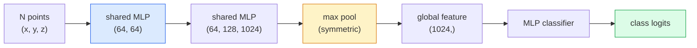

# 3D Vision  Nube de punto y NeRFs  3D Vision  点云与NeRF

> La visión 3D viene en dos sabores. las nubes de punto son la salida bruta del sensor. las NeRF son el campo volumétrico aprendido. Ambas respuestas son "lo que es dónde en el espacio".

> **【中文解读】**La visión 3D tiene dos tipos de modelos: punto de nube es el sensor (LiDAR, profundidad de la cámara); NeRF (Neural Radiation Field) es el campo de volumen de aprendizaje. Ambas respuestas son "qué hay en el espacio" (NeRF) a través de la red de aprendizaje de la escena de la neural 3D, puede ser representado desde cualquier punto de vista.

> **【拓展：3D 视觉的应用】**NeRF se utiliza en realidad virtual/ aumentando la realidad real (VR/AR)  construcción visualizada  autodrivante escenario reconstrucción  3D Gaussian Splating  Siguiente curso  es un esquema de rápida sustitución de NeRF, en realidad  calidad de la rotación  más alta  punto de procesamiento  el núcleo de la conciencia de autodrivante LiDAR 

**Type:** Learn + Build | **类型:** 学习 + 动手
**Languages:** Python | **语言:** Python
**Prerequisites:** Phase 4 Lesson 03 (CNNs), Phase 1 Lesson 12 (Tensor Operations) | **前置知识:** Phase 4 Lesson 03（CNN），Phase 1 Lesson 12（张量运算）
**Time:** ~45 minutes | **时间:** ~45 分钟

## Objetivos de aprendizaje

- Distinguir entre representaciones 3D explícitas (nube de punto, malla, voxel) e implícitas (campo de distancia firmado, NeRF) y cuándo se utilizan cada una
- Comprender el truco de la función simétrica de PointNet que hace que una red neuronal permutation-invariant sobre un conjunto desordenado de puntos
- Trazar un paso hacia adelante de NeRF: fundición de rayos, renderización volumétrica, codificación posicional, densidad de MLP+tema de color
- Usar`nerfstudio`o `instant-ngp`para la reconstrucción 3D pre-entrenada a partir de un pequeño conjunto de imágenes de puesta

> **【中文解读】**El objetivo de aprendizaje enumera las capacidades centrales que debe dominarse después de completar la clase.


## El problema es la introducción del problema

Una cámara produce una imagen en 2D. Una LIDAR produce un conjunto de puntos en 3D sin orden. Una estructura de la tubería de movimiento produce una escasa nube de puntos clave en 3D. Una NeRF reconstruye una escena en 3D completa a partir de un puñado de imágenes de poses. Todas estas son "visión" pero ninguna de ellas se parece al tensor denso que quiere una CNN.

> 相机产生 2D图像──LiDAR 产生一组无序的3D点──运动恢复结构流水线产生稀疏的3D 关键点云──NeRF de varios lugares postura imagen reconstruir toda la escena 3D── estos son "visión", pero no hay uno que parezca a CNN 想要的密集张量──

La visión 3D es importante porque casi todas las tareas de alto valor de los robots se ejecutan en 3D: captura, evitación de obstáculos, navegación, oclusión de AR, captura de contenido 3D. Un ingeniero de visión que sólo entiende imágenes 2D está excluido de la parte de campo de más rápido crecimiento (contenido AR / VR, robótica, pilas de conducción autónoma, reconstrucción 3D basada en NeRF para bienes raíces o construcción).

> La visualización 3D es importante, ya que casi todas las tareas de alta valor de los ordenadores se ejecutan en 3D: captura, evita, navegación, AR, sombra, captura de contenido en 3D. Sólo se entiende que los ingenieros de visualización de imágenes 2D están bloqueados en la parte más rápida de crecimiento de este campo.

Las dos representaciones dominan por razones diferentes. Las nubes de puntos son lo que los sensores te dan de forma gratuita. NeRF y sus sucesores (3D Gaussian splatting, neural SDF) son lo que obtienes cuando pides a una red neuronal que aprenda una escena.

> 两种表示因不同原因占据主导──点云是传感器免费给你──NeRF 及其后继者(3D 高斯、神经SDF) es cuando haces que la escena de aprendizaje de la red neuronal obtengas──

## El concepto central.

> **【中文解读】**Este capítulo presenta los conceptos y teorías básicos. La comprensión de estos conceptos es el prerrequisito de la realización posterior de la actividad, y también el conocimiento de los puntos de alta frecuencia de la entrevista y la práctica de la ingeniería.


### Nube de punto

Una nube de puntos es un conjunto desordenado de N puntos en R^3, opcionalmente cada uno con características (color, intensidad, normal).

> 点云是 R^3 en N 个点的无序集合, cada punto puede tener características (,) color, intensidad, línea de acción) ⋅

```
cloud = [
  (x1, y1, z1, r1, g1, b1),
  (x2, y2, z2, r2, g2, b2),
  ...
  (xN, yN, zN, rN, gN, bN),
]
```

No hay red, no hay conectividad. Dos propiedades hacen que esto sea difícil para las redes neuronales:

> 没有网格,没有连接关系―― dos características hacen que sea muy difícil para la red neuronal:

- **Permutation invariance** la salida no debe depender del orden de los puntos.
  En inglés:**置换不变性** La salida no puede depender del orden de los puntos.
- **Variable N** un modelo único debe manejar nubes de diferentes tamaños.
  En inglés:**可变 N**Un solo modelo debe tratar diferentes puntos de tamaño.

PointNet (Qi et al., 2017) resolvió ambos con una idea: aplicar un MLP compartido a cada punto, luego agregar con una función simétrica (pool máximo).

> PointNet ((Qi 等,2017) resolvió dos problemas con una idea: para cada aplicación compartida de MLP, luego con la función de concentración de datos. El resultado es una masa fija de un tamaño pequeño sin relación con el orden.

```
f(P) = max_{p in P} MLP(p)
```

Este es todo el núcleo de PointNet. Las variantes más profundas (PointNet++, Point Transformer) añaden muestreo jerárquico y agregación local, pero el truco de función simétrica no ha cambiado.

> Esto es todo el núcleo de PointNet. Las variaciones más profundas de PointNet (PointNet++、Point Transformer) aumentaron la captación de niveles y la agrupación local, pero las técnicas de función de referencia no cambiaron.

### La arquitectura de PointNet



"MLP compartido" significa que el mismo MLP se ejecuta en cada punto de forma independiente.

> "MLP compartido" significa que el mismo MLP se ejecuta independientemente en cada punto, para mejorar la eficiencia, y se realiza en un volumen de 1x1 en la dimensión de los puntos.

### Los campos de radiación neuronal (NeRF)

NeRFs (Mildenhall et al., 2020) tomó la pregunta "¿Podemos reconstruir una escena 3D a partir de N fotos?" y respondió con una red neuronal que es la escena.`(x, y, z, viewing_direction)`¿ Qué ?`(density, colour)`Dar una nueva vista es un circuito de radiodifusión a través de esta red.

> NeRF(Mildenhall etc,2020) respondió a la pregunta "¿¿¿Podría reconstruir la escena en 3D desde N 张照片?" con una red neuronal para expresar la escena en sí misma.`(x, y, z, 观察方向)`映射到 `(密度, 颜色)`染新视角 es hacer un ciclo de proyección de luz en esta red

```
NeRF MLP:  (x, y, z, theta, phi) -> (sigma, r, g, b)

To render a pixel (u, v) of a new view:
  1. Cast a ray from the camera through pixel (u, v)
  2. Sample points along the ray at distances t_1, t_2, ..., t_N
  3. Query the MLP at each point
  4. Composite the colours weighted by (1 - exp(-sigma * dt))
  5. The sum is the rendered pixel colour
```

Una pérdida compara el píxel renderizado con el píxel de verdad en la tierra en las fotos de entrenamiento. Backprop a través del paso de renderización actualiza el MLP. No hay verdad en el suelo 3D, no hay geometría explícita  la escena se almacena en los pesos de MLP.

> 损失函数 损失相比染像素与训练照片中的真实像素──通过染步骤的反向传播更新 MLP──没有 3D verdadero valor,没有显式几何场景存储在 MLP 权重中──

### Codificación de posición en NeRF

Una vanilla con MLP en .`(x, y, z)`No puede representar detalles de alta frecuencia porque los MLP están espectralmente sesgados hacia las frecuencias bajas. NeRF corrige esto codificando cada coordenada en un vector de características de Fourier antes del MLP:

> Normal MLP en `(x, y, z)`上不能表示高频细节,因为 MLP 频谱偏向低频. NeRF 通过在每个坐标送进 MLP 编码为里叶特征向量来修复这个问题:

```
gamma(p) = (sin(2^0 pi p), cos(2^0 pi p), sin(2^1 pi p), cos(2^1 pi p), ...)
```

Hasta niveles de frecuencia L=10. Este es el mismo truco que usan los transformadores para posiciones, y aparece de nuevo en el acondicionamiento del tiempo de difusión (lección 10).

> El máximo L=10 个频率级别── esto es el mismo que el Transformer Used on positioning techniques, también aparece de nuevo en el tiempo de conditización del modelo de expansión (第 10 课)── sin ella, NeRF parece más opaco──

### Renderamiento volumétrico

```
C(r) = sum_i T_i * (1 - exp(-sigma_i * delta_i)) * c_i

T_i  = exp(- sum_{j<i} sigma_j * delta_j)
delta_i = t_{i+1} - t_i
```

`T_i`es la transmisión  cuánto luz sobrevive al punto i. `(1 - exp(-sigma_i * delta_i))`es la opacidad en el punto i. `c_i`El píxel final es una suma ponderada a lo largo del rayo.

> `T_i`Es la tasa de transmisiones hasta el punto de 1o de tiempo de la línea de luz permanece.`(1 - exp(-sigma_i * delta_i))`Es la primera de las razones por las que se ha creído que el sistema de seguridad social es un problema.`c_i`Es el color. El final es el aumento de la luz.

### Lo que sustituyó a las NERF

Las NeRF puras son lentas en entrenamiento (hora) y lentas en renderización (segundos por imagen).

> 純 NeRF 訓練慢(小時級) 且染慢(每张图像秒级) 』后续发展:

- **Instant-NGP**(2022)  codificación de red de hash reemplaza la entrada de posición del MLP; trenes en segundos.
  En inglés:**Instant-NGP**(2022) 哈希网格编码替代 MLP 的位置输入;秒级训练──
- **Mip-NeRF 360** maneja escenas ilimitadas y antialiasing.
  En inglés:**Mip-NeRF 360** Tratar la situación y la lucha ──
- **3D Gaussian Splatting**(2023)  reemplaza el campo volumétrico con millones de Gaussians 3D; trenes en minutos, renderiza en tiempo real.
  En inglés:**3D 高斯泼溅**(2023)  con millones de 3D 高斯替代体积场;分钟级训练,实时染──当前生产默认方案──

Casi todos los productos reales de NeRF en 2026 son en realidad 3D Gaussian splatting.

> En 2026 casi todos los productos reales de NeRF son en realidad 3D, pero el modelo mental sigue siendo NeRF.

### Datos y referencias

- **ShapeNet** Clasificación y segmentación de modelos CAD 3D como nubes de puntos.
  China:ShapeNet3D CAD 模型的点云分类和分割──
- **ScanNet** escaneos interiores reales para segmentación.
  Traducción:ScanNet 真实室内扫描, para dividir.
- **KITTI** Nube de punto LIDAR para conducción autónoma.
  En inglés, el nombre de la compañía de conducción de vehículos de alta velocidad es KITTI 户外 LiDAR 点云, para conducir automáticamente.
- **NeRF Synthetic**- ¿ Qué ?**Blended MVS** conjuntos de datos de imágenes presentadas para la síntesis de visualización.
  NeRF Synthetic / Blended MVS带位姿的图像数据集,用于视角合成──
- **Mip-NeRF 360**conjunto de datos  escenas reales ilimitadas.
  Mi-NeRF 360 数据集 无界真实场景──

> **【中文解读】**Este capítulo a través del código de la implementación de algoritmos centrales de cero. Este método "desde cero" puede ayudar a entender el principio detrás del marco, no se encuentra en la caja negra cuando se encuentran problemas.

> **【拓展：工业部署中的视觉系统】**En la implementación industrial real, los modelos de visión necesitan considerar la posibilidad de retraso, el tamaño del modelo, la adaptación de los dispositivos de borde, etc. TensorRT, ONNX Runtime, OpenVINO son herramientas de aceleración de la teoría de uso habitual.

> **【拓展：数据标注与质量】**视觉任务的效果高度依赖标签数据质量──标签工作室、CVAT es la principal herramienta de marcado──在工业场景中,主动学习(Active Learning) puede reducir el costo de marcado: modelo a un requerimiento de muestras indeterminadas, marcación automática de muestras de determinación──


## Construye y realiza.
```figure
nerf-rays
```

## Construye el mismo

### Paso 1: Clasificador de PointNet

```python
import torch
import torch.nn as nn

class PointNet(nn.Module):
    def __init__(self, num_classes=10):
        super().__init__()
        self.mlp1 = nn.Sequential(
            nn.Conv1d(3, 64, 1),    nn.BatchNorm1d(64),   nn.ReLU(inplace=True),
            nn.Conv1d(64, 64, 1),   nn.BatchNorm1d(64),   nn.ReLU(inplace=True),
        )
        self.mlp2 = nn.Sequential(
            nn.Conv1d(64, 128, 1),  nn.BatchNorm1d(128),  nn.ReLU(inplace=True),
            nn.Conv1d(128, 1024, 1), nn.BatchNorm1d(1024), nn.ReLU(inplace=True),
        )
        self.head = nn.Sequential(
            nn.Linear(1024, 512),   nn.BatchNorm1d(512),  nn.ReLU(inplace=True),
            nn.Dropout(0.3),
            nn.Linear(512, 256),    nn.BatchNorm1d(256),  nn.ReLU(inplace=True),
            nn.Dropout(0.3),
            nn.Linear(256, num_classes),
        )

    def forward(self, x):
        # x: (N, 3, num_points) — transposed for Conv1d
        x = self.mlp1(x)
        x = self.mlp2(x)
        x = torch.max(x, dim=-1)[0]       # (N, 1024)
        return self.head(x)

pts = torch.randn(4, 3, 1024)
net = PointNet(num_classes=10)
print(f"output: {net(pts).shape}")
print(f"params: {sum(p.numel() for p in net.parameters()):,}")
```

Un parámetro de 1,6 millones, y se ejecuta en 1.024 puntos por nube.

> Aproximadamente 160 000 parámetros.

### Paso 2: codificación de posición

```python
def positional_encoding(x, L=10):
    """
    x: (..., D) -> (..., D * 2 * L)
    """
    freqs = 2.0 ** torch.arange(L, dtype=x.dtype, device=x.device)
    args = x.unsqueeze(-1) * freqs * 3.141592653589793
    sinc = torch.cat([args.sin(), args.cos()], dim=-1)
    return sinc.reshape(*x.shape[:-1], -1)

x = torch.randn(5, 3)
y = positional_encoding(x, L=10)
print(f"input:  {x.shape}")
print(f"encoded: {y.shape}     # (5, 60)")
```

Multiplicando por `2^l * pi`El sistema de radio de la radio de la radio de la radio de la radio de la radio de la radio de la radio de la radio de la radio de la radio de la radio de la radio de la radio de la radio de la radio de la radio de la radio de la radio de la radio de la radio de la radio de la radio de la radio de la radio de la radio de la radio de la radio de la radio de la radio de la radio de la radio de la radio de la radio de la radio de la radio de la radio de la radio de la radio de la radio de la radio de la radio de la radio de la radio de la radio de la radio de la radio de la radio de la radio de la radio de la radio de la radio de la radio de la radio de la radio de la radio de la radio de la radio de la radio de la radio de la radio de la radio de la radio de la radio de la radio de la radio de la radio de la radio de la radio de la radio de la radio de la radio de la radio de la radio de la radio de la radio de la radio de la radio de la radio de la radio de la radio de la radio de la radio de la radio de la radio de la radio de la radio de la radio de la radio de la radio de la radio de la radio de la radio de la radio de la radio de la radio de la radio de la radio de la radio de la radio de la radio de la radio de la radio de la radio de la radio de la radio de la radio de la radio de la radio de la radio de la radio de la radio de la radio de la radio de la radio de la radio de la radio de la radio de la radio de la radio de la radio de la radio de la radio de la radio de la radio de la radio de la radio de la radio de la radio de la radio de la radio de la radio de la radio de la radio de la radio de la radio de la radio de la radio de la radio de la radio de la radio de la radio de la radio de la radio de la radio de la radio de la radio de la radio de la radio de la radio de la radio de la radio de la radio de la radio de la radio de la radio de la radio de la radio de la radio de la radio de la radio de la radio de la radio de la radio de la radio de la radio de la radio de la radio de la radio de la

> 乘以                                                                                                                                                                                                                                                                                                                                                                                                                                                                                                                           `2^l * pi`产生逐步升高的频率──

### Paso 3: MLP de NeRF pequeño

```python
class TinyNeRF(nn.Module):
    def __init__(self, L_pos=10, L_dir=4, hidden=128):
        super().__init__()
        self.L_pos = L_pos
        self.L_dir = L_dir
        pos_dim = 3 * 2 * L_pos
        dir_dim = 3 * 2 * L_dir
        self.trunk = nn.Sequential(
            nn.Linear(pos_dim, hidden), nn.ReLU(inplace=True),
            nn.Linear(hidden, hidden),  nn.ReLU(inplace=True),
            nn.Linear(hidden, hidden),  nn.ReLU(inplace=True),
            nn.Linear(hidden, hidden),  nn.ReLU(inplace=True),
        )
        self.sigma = nn.Linear(hidden, 1)
        self.color = nn.Sequential(
            nn.Linear(hidden + dir_dim, hidden // 2), nn.ReLU(inplace=True),
            nn.Linear(hidden // 2, 3), nn.Sigmoid(),
        )

    def forward(self, x, d):
        x_enc = positional_encoding(x, self.L_pos)
        d_enc = positional_encoding(d, self.L_dir)
        h = self.trunk(x_enc)
        sigma = torch.relu(self.sigma(h)).squeeze(-1)
        rgb = self.color(torch.cat([h, d_enc], dim=-1))
        return sigma, rgb

nerf = TinyNeRF()
x = torch.randn(128, 3)
d = torch.randn(128, 3)
s, c = nerf(x, d)
print(f"sigma: {s.shape}   rgb: {c.shape}")
```

Pequeño en comparación con el original NeRF (que tiene 2 troncos de profundidad MLP 8).

> En comparación con el NeRF original, hay 2 个深度为 8 de MLP 主体) en comparación es muy pequeño.

### Paso 4: Renderización volumétrica a lo largo de un rayo

```python
def volumetric_render(sigma, rgb, t_vals):
    """
    sigma: (..., N_samples)
    rgb:   (..., N_samples, 3)
    t_vals: (N_samples,) distances along the ray
    """
    delta = torch.cat([t_vals[1:] - t_vals[:-1], torch.full_like(t_vals[:1], 1e10)])
    alpha = 1.0 - torch.exp(-sigma * delta)
    trans = torch.cumprod(torch.cat([torch.ones_like(alpha[..., :1]), 1.0 - alpha + 1e-10], dim=-1), dim=-1)[..., :-1]
    weights = alpha * trans
    rendered = (weights.unsqueeze(-1) * rgb).sum(dim=-2)
    depth = (weights * t_vals).sum(dim=-1)
    return rendered, depth, weights


N = 64
t_vals = torch.linspace(2.0, 6.0, N)
sigma = torch.rand(N) * 0.5
rgb = torch.rand(N, 3)
rendered, depth, weights = volumetric_render(sigma, rgb, t_vals)
print(f"rendered colour: {rendered.tolist()}")
print(f"depth:           {depth.item():.2f}")
```

> **【中文解读】**Este capítulo muestra cómo utilizar un marco maduro (como PyTorch、HuggingFace, etc.) para aplicar rápidamente esta tecnología. En los proyectos reales, se realiza con prioridad el uso de un marco experimentado, se pueden reducir errores y mejorar la eficiencia de desarrollo.


Un rayo, 64 muestras, compuestas a un solo píxel RGB y una profundidad.

> Una línea de luz, 64 puntos de muestra, juntas para convertirse en un RGB 像素和深度值.


> **【拓展：视觉模型的持续学习】**En el entorno de producción, el modelo visual necesita adaptarse continuamente a nuevos datos. Esto es especialmente importante en la conducción automotriz y el control de calidad industrial.

## Usalo con el marco de ejecución

Para el trabajo real:

- `nerfstudio`(Tancik et al.)  la biblioteca de referencia actual para NeRF / Instant-NGP / Gaussian Splatting.
- `pytorch3d`(Meta)  renderización diferenciable, utilidades de nube de punto, operaciones de malla.
- `open3d` procesamiento en la nube de puntos, registro, visualización.

> **【中文解读】**Este capítulo se centra en cómo se puede implementar el modelo como producto disponible. Desde el modelo original hasta el sistema de producción, se deben considerar múltiples dimensiones de optimización de rendimiento, tratamiento de errores, control, etc.


Para el despliegue, el 3D Gaussian splatting ha reemplazado en gran medida a los NeRF puros porque hace 100 veces más rápido.


## Envíe el producto .

Esta lección produce:

> **【中文解读】**Practice los temas de fácil/medio/duro  3 difficulty to pass in  Recomenda al menos completar los temas de grado medio  Grado duro  para la preparación de la entrevista


- `outputs/prompt-3d-task-router.md` un prompt que se dirige a la representación 3D correcta (nube de punto, malla, voxel, NeRF, espacio de Gaussian) basado en la tarea y los datos de entrada.
- `outputs/skill-point-cloud-loader.md` una habilidad que escribe un PyTorch `Dataset`para archivos .ply / .pcd / .xyz con normalización correcta, centrar y muestreo de puntos.

## Los ejercicios.

1. **(Easy)**Muestre que PointNet es invariable en permutación: ejecuta la misma nube dos veces, una vez con puntos mezclados. Verifique que las salidas son idénticas hasta el ruido de punto flotante.
2. **(Medium)**Implemente una función de generación de rayos mínima que, dada la intrínseca y la pose de la cámara, produzca los orígenes y direcciones de rayos para cada píxel de una imagen H x W.
3. **(Hard)**Entrenar un TinyNeRF en un conjunto de datos sintético de vistas renderizadas de un cubo de color (generado a través de una representación diferenciable o un simple rastreador de rayos).

> **【中文解读】**En el lenguaje de los términos "Lo que la gente dice" vs "Lo que realmente significa" se distingue entre el lenguaje diario y la definición técnica de significado.


## Términos clave .

| Term | What people say | What it actually means |
|------|----------------|----------------------|
| Point cloud | "3D points from LIDAR" | Unordered set of (x, y, z) + optional features per point |
| PointNet | "First neural net on point clouds" | Shared MLP per point + symmetric (max) pool; permutation-invariant by construction |
| NeRF | "MLP that is the scene" | Network mapping (x, y, z, dir) to (density, colour); rendered by ray casting |
| Positional encoding | "Fourier features" | Encode each coordinate into sin/cos at multiple frequencies to overcome MLP low-frequency bias |
| Volumetric rendering | "Ray integration" | Composite samples along a ray into a single pixel using transmittance and alpha |
| Instant-NGP | "Hash-grid NeRF" | Replaces NeRF's coordinate MLP with a multi-resolution hash grid; 100-1000x faster |
| 3D Gaussian splatting | "Millions of Gaussians" | Scene = collection of 3D Gaussians; renders in real time, trains in minutes |
| SDF | "Signed distance field" | Function returning signed distance to the nearest surface; another implicit representation |

> **【中文解读】**延伸阅读 proporciona un alto nivel de recursos para el aprendizaje profundo. Estos artículos y cursos son los referentes clásicos en el campo, adecuados para los lectores que necesitan una comprensión profunda.


## Más Leer más Leer más

- [PointNet (Qi et al., 2017)](https://arxiv.org/abs/1612.00593) el clasificador de permutación-invariante
- [NeRF (Mildenhall et al., 2020)](https://arxiv.org/abs/2003.08934) el papel que hizo de la reconstrucción 3D de fotos un problema de red neuronal
- [Instant-NGP (Müller et al., 2022)](https://arxiv.org/abs/2201.05989) redes de hash, 1000x de velocidad
- [3D Gaussian Splatting (Kerbl et al., 2023)](https://arxiv.org/abs/2308.04079) la arquitectura que sustituyó a los NeRF en la producción
