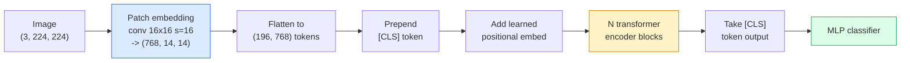

# Transformadores de visión (ViT) 视觉 Transformer

> Cortar la imagen en parches, tratar cada parche como una palabra, ejecutar un transformador estándar.

> **【中文解读】**Para hacer esto, se debe utilizar el estándar de Transformer 处理──就是如此简单──ViT demostró que la estructura de Transformer 架构 no solo es válida en la PNL, sino que también puede ser superada por CNN en el campo de la visión──

> **【拓展：ViT 与 GPT-4V】**ViT es el codificador de imágenes de GPT-4V, Claude, LLaVA, etc. Desde 2021 hasta la fecha, ViT se ha convertido en la infraestructura de la visión de computadoras, utilizada en CLIP, SAM, DINO, etc. Modelos centrales.

**Type:** Build | **类型:** 动手
**Languages:** Python | **语言:** Python
**Prerequisites:** Phase 7 Lesson 02 (Self-Attention), Phase 4 Lesson 04 (Image Classification) | **前置知识:** Phase 7 Lesson 02（自注意力），Phase 4 Lesson 04（图像分类）
**Time:** ~45 minutes | **时间:** ~45 分钟

## Objetivos de aprendizaje

- Implementar la incorporación de parches, la incorporación posicional aprendida, el token de clase y los bloques de codificación de transformadores desde cero para construir un ViT mínimo
- Explica por qué se pensó que ViT necesitaba datos masivos de preentrenamiento hasta que DeiT y MAE demostraran lo contrario.
- Comparar ViT, Swin y ConvNeXt en sus antecedentes arquitectónicos (ninguno, atención local de ventanas, columna vertebral de conventos)
- Ajustar a la perfección un ViT pre- entrenado en un conjunto de datos pequeño utilizando `timm`y la receta estándar de sondeo lineal / afinado

> **【中文解读】**El objetivo de aprendizaje enumera las capacidades centrales que debe dominarse después de completar la clase.


## El problema es la introducción del problema

Durante una década, la convolución fue sinónimo de visión por computadora. Las CNN tenían fuertes sesgos inductivos  localidad, equivalencia de traducción  que nadie pensaba que se podía reemplazar. Luego Dosovitskiy et al. (2020) mostró que un transformador simple aplicado a parches de imagen aplanadas, sin maquinaria convolucionaria en absoluto, podía igualar o vencer a las mejores CNN a escala.

> Durante una década, el volúmenes es el nombre de la visión de computadora. CNN tiene una fuerte inclusión de la localización, la distribución y la variación. Nadie cree que se puede reemplazar.

La captura fue "en escala". ViT en ImageNet-1k perdió a ResNet. ViT preentrenado en ImageNet-21k o JFT-300M luego ajustado en ImageNet-1k lo superó. La conclusión fue que los transformadores carecían de antecedentes útiles pero podían aprenderlos de suficientes datos. Los trabajos posteriores (DeiT, MAE, DINO) mostraron que con las recetas de entrenamiento adecuadas  aumento fuerte, preentrenamiento auto supervisado, destilación  ViTs entrenan bien también en pequeños datos.

>  es "en gran escala"──ViT en ImageNet-1k ha transmitido a ResNet── en ImageNet-21k o JFT-300M ha ganado el pre-entrenamiento y luego en ImageNet-1k ha subido a la ViT── concluye que el Transformer  carece de experiencia útil pero puede aprender de suficiente datos entre los siguientes trabajos──(DeiT、MAE、DINO) muestra que con un programa de entrenamiento correcto  fortalecer  autocontrol  entrenamiento  vaporViT en pequeños datos también puede entrenar muy bien─

Para 2026, las CNN puras todavía son competitivas en dispositivos de borde (ConvNeXt es el más fuerte), pero los transformadores dominan todo lo demás: segmentación (Mask2Former, SegFormer), detección (DETR, RT-DETR), multimodal (CLIP, SigLIP), video (VideoMAE, VJEPA).

> Hasta 2026 años, la pura CNN en el borde de los dispositivos todavía tiene competencia, pero Transformer domina todo lo demás: división, análisis, análisis, análisis, análisis, análisis, análisis, análisis, análisis, etc.

## El concepto central.

> **【中文解读】**Este capítulo presenta los conceptos y teorías básicos. La comprensión de estos conceptos es el prerrequisito de la realización posterior de la actividad, y también el conocimiento de los puntos de alta frecuencia de la entrevista y la práctica de la ingeniería.


### El oleoducto



Seis pasos. Parches -> tokens -> atención -> clasificador. Cada variante (DeiT, Swin, ConvNeXt, MAE pre-entrenamiento) cambia uno o dos de los siete y deja el resto en paz.

> 七步──补丁 -> token -> 注意力 -> 分类器──每个变体(DeiT、Swin、ConvNeXt、MAE 预训练) sólo cambia uno de los siete pasos, el resto se mantiene invariable──

### Embedado de parches

El primer conv es el secreto. tamaño del núcleo 16, paso 16, así que una imagen de 224x224 se convierte en una cuadrícula de 14x14 parches de 16x16, cada una proyectada a una incorporación de 768 dimensiones.

> El primer volúmenes es un secreto. El núcleo de tamaño 16, la amplitud 16, así que la imagen de 224x224 se convierte en una red de 16x16 de 14x14 , cada revólume proyecta 768 dimensiones.

```
Input:  (3, 224, 224)
Conv (3 -> 768, k=16, s=16, no padding):
Output: (768, 14, 14)
Flatten spatial: (196, 768)
```

196 parches = 196 tokens. La dimensión de cada token es 768 (ViT-B), 1024 (ViT-L) o 1280 (ViT-H).

> 196 个补丁 = 196 个代币── cada token de características dimensiones es de 768  ViT-B) 、1024  ViT-L) o 1280  ViT-H) ‖

### Token de clase

Un único vector aprendido prependió a la secuencia:

> Un vector de aprendizaje añadido a la secuencia anterior:

```
tokens = [CLS; patch_1; patch_2; ...; patch_196]   shape (197, 768)
```

Después de N bloques de transformador, el `[CLS]`La salida es la representación global de la imagen.

> Pasé por el transformer.`[CLS]`La salida es el resultado de la imagen completa.

### Emblazo posicional

Los transformadores no tienen una idea de posición espacial.

> Transformer 没有内置的空间位置概念── dar a cada token más un tamaño de aprendizaje:

```
tokens = tokens + learned_pos_embedding   (also shape (197, 768))
```

La incorporación es un parámetro del modelo; el entrenamiento basado en gradientes lo adapta a la estructura de la imagen 2D. Existen alternativas sinusoidales 2D, pero rara vez se utilizan en la práctica.

> 嵌入是模型的参数; basarse en la formación de la gradiencia hace que se adapte a la estructura de imágenes 2D. Existe un programa alternativo 2D de la cuerda, pero en realidad se utiliza muy poco.

### Bloque de codificación de transformador

Estándar, autoatención de múltiples cabezas, MLP, conexiones residuales, pre-LayerNorm.

> 标准结构──多头自注意力、MLP、残差连接、前置 LayerNorm──

```
x = x + MSA(LN(x))
x = x + MLP(LN(x))

MLP is two-layer with GELU: Linear(d -> 4d) -> GELU -> Linear(4d -> d)
```

ViT-B/16 apila 12 de estos bloques, cada uno con 12 cabezas de atención, con un total de 86M parámetros.

> ViT-B/16                                                                                                                                                                                                                                                                                                                                                                                                                                                                                                                         

### ¿Por qué antes de la LN

Los primeros transformadores utilizados después de la LN (`x = LN(x + sublayer(x))`En el período pre-LN (pre-LN) se ha desarrollado un proceso de formación de 6 a 8 capas sin calentamiento.`x = x + sublayer(LN(x))`En el caso de los programas de formación superior, el sistema de formación superior (LN) se utiliza para el desarrollo de las redes más profundas, sin calentamiento.

> 早期 Transformer 使用后置 LN(`x = LN(x + sublayer(x))`), muy difícil en caso de no pre-calor entrenar más de 6-8 niveles.`x = x + sublayer(LN(x))`) no necesita pre-calor es decir, puede entrenar más profundamente en la red.

### Compromiso de tamaño de parche

- 16x16 parches -> 196 tokens, estándar.
  En el caso de los ejemplos de la versión de la versión de la versión de la versión de la versión de la versión de la versión de la versión de la versión de la versión de la versión de la versión de la versión de la versión de la versión de la versión de la versión de la versión de la versión de la versión de la versión de la versión de la versión de la versión de la versión de la versión de la versión de la versión de la versión de la versión de la versión de la versión de la versión de la versión de la versión de la versión de la versión de la versión de la versión de la versión de la versión de la versión de la versión de la versión de la versión de la versión de la versión de la versión de la versión de la versión de la versión de la versión de la versión de la versión de la versión de la versión de la versión de la versión de la versión de la versión de la versión de la versión de la versión de la versión de la versión de la versión de la versión de la versión de la versión de la versión de la versión de la versión de la versión de la versión de la versión de la versión de la versión de la versión de la versión de la versión de la versión de la versión de la versión de la versión de la versión de la versión de la versión de la versión de la versión de la versión de la versión de la versión de la versión de la versión de la versión de la versión de la versión de la versión de la versión de la versión de la versión de la versión de la versión de la versión de la versión de la versión de la versión de la versión de la versión de la versión de la versión de la versión de la versión de la versión de la versión de la versión de la versión de la versión de la versión de la versión de la versión de la versión de la versión de la versión de la versión de la versión de la versión de la versión de la versión de la versión de la versión de la versión de la versión de la versión de la versión de la versión de la versión de la versión de la versión de la versión de la versión de la versión de la versión de la versión de la versión de la versión de la versión de la versión de la versión de la versión de la versión de la versión de la versión de la versión de la versión de la versión de la versión de la versión de la versión de la versión de la versión de la versión de la versión de la versión de la versión de la versión de la versión de
- 32x32 parches -> 49 tokens, más rápido pero con menor resolución.
  En inglés, el número de puntos de referencia es:
- 8x8 parches -> 784 tokens, más finos pero O(n^2) las escalas de costos de atención son muy malas.
  En el caso de los productos de la industria de la energía, el precio de la energía se ha incrementado considerablemente.

Los parches más grandes = menos tokens = más rápido pero menos detalles espaciales. SwinV2 utiliza parches 4x4 en ventanas jerárquicas.

> Más grande adición = menos token = más rápido pero detalles espaciales menos。SwinV2 en la ventana de la escalación utiliza 4x4 adición。

### Receta de DeiT para entrenar a ViT en ImageNet-1k

El ViT original necesitaba JFT-300M para vencer a las CNN. DeiT (Touvron et al., 2020) entrenó a ViT-B al 81,8% en el top-1 solo en ImageNet-1k con cuatro cambios:

> El primer ViT necesita JFT-300M para vencer a CNN.

1. Aumento intenso: Aumento aleatorio, mezcla, mezcla de corte, borrado aleatorio.
   En inglés, el nombre de la persona que se encuentra en el sitio web de la red social de Internet es el nombre de la persona que se encuentra en el sitio web de la red social.
2. Profundidad estocástica (tirar bloques enteros al azar durante el entrenamiento).
   Sin embargo, el tiempo de entrenamiento es muy largo.
3. Aumento repetido (muestra de la misma imagen 3 veces por lote).
   En español, el mismo tipo de imagen en cada lote.
4. Destilación de un profesor de CNN (opcional, aumenta la precisión).
   China: China: China: China: China: China: China: China: China: China: China: China: China: China: China: China: China: China: China: China: China: China: China: China: China: China: China: China: China: China: China: China: China: China: China: China: China: China: China: China: China: China: China: China: China: China: China: China: China: China: China: China: China: China: China: China: China: China: China: China: China: China: China: China: China: China: China: China: China: China: China: China: China: China: China: China: China: China: China: China: China: China: China: China: China: China: China: China: China: China: China: China: China: China: China: China: China: China: China: China: China: China: China: China: China: China: China: China: China: China: China: China: China: China: China: China: China: China: China: China: China: China: China: China: China: China: China: China: China: China: China: China: China: China: China: China: China: China: China: China: China: China: China: China: China: China: China: China: China: China: China: China: China: China: China: China: China: China: China: China: China: China: China: China: China: China: China: China: China: China: China: China: China: China: China: China: China: China: China: China: China: China: China: China: China: China: China: China: China: China: China: China: China: China: China: China: China: China: China: China: China: China: China: China: China: China: China: China: China: China: China: China: China: China: China: China: China: China: China: China: China: China: China: China: China: China: China: China: China: China: China: China: China: China: China: China: China: China: China: China: China: China: China: China: China: China: China: China: China: China: China: China: China: China: China:

Todas las recetas modernas de entrenamiento ViT descienden de DeiT.

> Cada programa de entrenamiento moderno de VT proviene de DeiT.

### Swin vs ConvNeXt

- **Swin**(Liu et al., 2021)  atención basada en ventanas. Cada bloque asiste dentro de una ventana local; bloques alternados cambian la ventana para mezclar información a través de las ventanas.
  En inglés:**Swin**(Liu 等,2021)  Atención basada en ventanas. Cada bloque hace atención dentro de la ventana local; se intercambia el bloque de la ventana móvil con información mezclada entre las ventanas.
- **ConvNeXt**(Liu et al., 2022)  rediseñó CNN que coincide con las opciones de arquitectura de Swin (conv en profundidad, LayerNorm, GELU, cuello de botella invertido). Mostró que la brecha no es "atención vs convolución" sino "recepta de entrenamiento moderno + arquitectura".
  En inglés:**ConvNeXt**(Liu 等,2022)  Rediseñado CNN, adaptado a la arquitectura de Swin                                                                                                                                                                                                                                                    

En 2026, ConvNeXt-V2 y Swin-V2 son ambos de producción; la elección correcta depende de su pila de inferencias (ConvNeXt compila mejor para el borde) y el corpus de preentrenamiento.

> 2026 años,ConvNeXt-V2 y Swin-V2 fueron un programa de producción; la verdadera elección depende de la idea.

### Preentrenamiento de la MAE

Autoencoder enmascarado (He et al., 2022): enmascarar el 75% de los parches al azar, entrenar al encoder para procesar solo el 25% visible, entrenar a un pequeño decodificador para reconstruir los parches enmascarados de la salida del encoder. Después de la pretrening, desechar el decodificador y ajustar el encoder.

> 掩码自编码器(He等,2022):随机掩盖75% de los correctos, entrenar编码器 sólo procesar 25% de lo visible, entrenar un pequeño解码器 de la codificación de la salida de reconstrucción de los correctos ocultos.

MAE hace que ViT sea entrenable solo en ImageNet-1k, golpea SOTA, y es la receta automovilzada predeterminada actual.

> MAE utiliza ViT  solamente en ImageNet-1k 上可训练, alcanzar SOTA, es el actual programa de entrenamiento de autocontrol de la forma de

> **【中文解读】**Este capítulo a través del código de la implementación de algoritmos centrales de cero. Este método "desde cero" puede ayudar a entender el principio detrás del marco, no se encuentra en la caja negra cuando se encuentran problemas.

> **【拓展：工业部署中的视觉系统】**En la implementación industrial real, los modelos de visión necesitan considerar la posibilidad de retraso, el tamaño del modelo, la adaptación de los dispositivos de borde, etc. TensorRT, ONNX Runtime, OpenVINO son herramientas de aceleración de la teoría de uso habitual.

> **【拓展：数据标注与质量】**视觉任务的效果高度依赖标签数据质量──标签工作室、CVAT es la principal herramienta de marcado──在工业场景中,主动学习(Active Learning) puede reducir el costo de marcado: modelo a un requerimiento de muestras indeterminadas, marcación automática de muestras de determinación──


## Construye y realiza.
```figure
batchnorm-inference
```

## Construye el mismo

### Paso 1: Emblazo de parche

```python
import torch
import torch.nn as nn

class PatchEmbedding(nn.Module):
    def __init__(self, in_channels=3, patch_size=16, dim=192, image_size=64):
        super().__init__()
        assert image_size % patch_size == 0
        self.proj = nn.Conv2d(in_channels, dim, kernel_size=patch_size, stride=patch_size)
        num_patches = (image_size // patch_size) ** 2
        self.num_patches = num_patches

    def forward(self, x):
        x = self.proj(x)
        return x.flatten(2).transpose(1, 2)
```

Un conv, uno aplanado, uno transpuesto. Ese es todo el paso de la imagen a los tokens.

> Un volúmenes, un plano, un cambio de posición.

### Paso 2: Bloqueo de transformador

Pre-LN, autoatención de múltiples cabezas, MLP con GELU, conexiones residuales.

> Previo puesto LN、多头自注意力、带 GELU de MLP、残差连接──

```python
class Block(nn.Module):
    def __init__(self, dim, num_heads, mlp_ratio=4, dropout=0.0):
        super().__init__()
        self.ln1 = nn.LayerNorm(dim)
        self.attn = nn.MultiheadAttention(dim, num_heads, dropout=dropout, batch_first=True)
        self.ln2 = nn.LayerNorm(dim)
        self.mlp = nn.Sequential(
            nn.Linear(dim, dim * mlp_ratio),
            nn.GELU(),
            nn.Dropout(dropout),
            nn.Linear(dim * mlp_ratio, dim),
            nn.Dropout(dropout),
        )

    def forward(self, x):
        a, _ = self.attn(self.ln1(x), self.ln1(x), self.ln1(x), need_weights=False)
        x = x + a
        x = x + self.mlp(self.ln2(x))
        return x
```

`nn.MultiheadAttention`maneja la división en cabezas, el producto de puntos escalado y la proyección de salida. `batch_first=True`Así que las formas son`(N, seq, dim)`¿ Qué ?

> `nn.MultiheadAttention`处理多头拆分、缩放点积和输出投影──`batch_first=True`¿Cómo se hace?`(N, seq, dim)`¿Qué es eso?

### Paso 3: El ViT

```python
class ViT(nn.Module):
    def __init__(self, image_size=64, patch_size=16, in_channels=3,
                 num_classes=10, dim=192, depth=6, num_heads=3, mlp_ratio=4):
        super().__init__()
        self.patch = PatchEmbedding(in_channels, patch_size, dim, image_size)
        num_patches = self.patch.num_patches
        self.cls_token = nn.Parameter(torch.zeros(1, 1, dim))
        self.pos_embed = nn.Parameter(torch.zeros(1, num_patches + 1, dim))
        self.blocks = nn.ModuleList([
            Block(dim, num_heads, mlp_ratio) for _ in range(depth)
        ])
        self.ln = nn.LayerNorm(dim)
        self.head = nn.Linear(dim, num_classes)
        nn.init.trunc_normal_(self.pos_embed, std=0.02)
        nn.init.trunc_normal_(self.cls_token, std=0.02)

    def forward(self, x):
        x = self.patch(x)
        cls = self.cls_token.expand(x.size(0), -1, -1)
        x = torch.cat([cls, x], dim=1)
        x = x + self.pos_embed
        for blk in self.blocks:
            x = blk(x)
        x = self.ln(x[:, 0])
        return self.head(x)

vit = ViT(image_size=64, patch_size=16, num_classes=10, dim=192, depth=6, num_heads=3)
x = torch.randn(2, 3, 64, 64)
print(f"output: {vit(x).shape}")
print(f"params: {sum(p.numel() for p in vit.parameters()):,}")
```

Un pequeño ViT tratable en la CPU. ViT-B real es 86M; la misma definición de clase con `dim=768, depth=12, num_heads=12`¿ Qué ?

> Un pequeño ViT que se puede entrenar en la CPU. Un verdadero ViT-B tiene 86 millones de parámetros.`dim=768, depth=12, num_heads=12`¿Qué es eso?

### Paso 4: Verificación de la cordura  inferencia de una sola imagen

```python
logits = vit(torch.randn(1, 3, 64, 64))
print(f"logits: {logits}")
print(f"probs:  {logits.softmax(-1)}")
```

> **【中文解读】**Este capítulo muestra cómo utilizar un marco maduro (como PyTorch、HuggingFace, etc.) para aplicar rápidamente esta tecnología. En los proyectos reales, se realiza con prioridad el uso de un marco experimentado, se pueden reducir errores y mejorar la eficiencia de desarrollo.


Las probabilidades suman a 1.

> 应无错运行──概率之和为 1──


> **【拓展：视觉模型的持续学习】**En el entorno de producción, el modelo visual necesita adaptarse continuamente a nuevos datos. Esto es especialmente importante en la conducción automotriz y el control de calidad industrial.

## Usalo con el marco de ejecución

`timm`En el caso de las máquinas de carga, el sistema de carga de carga de carga de carga de carga de carga de carga de carga de carga de carga de carga de carga de carga de carga de carga de carga de carga de carga de carga de carga de carga de carga de carga de carga de carga de carga de carga de carga de carga de carga de carga de carga de carga de carga de carga de carga de carga de carga de carga de carga de carga de carga de carga de carga de carga de carga de carga de carga de carga de carga de carga de carga de carga de carga de carga de carga de carga de carga de carga de carga de carga de carga de carga de carga de carga de carga de carga de carga de carga de carga de carga de carga de carga de carga de carga de carga de carga de carga de carga de carga de carga de carga de carga de carga de carga de carga de carga de carga de carga de carga de carga de carga de carga de carga de carga de carga de carga de carga de carga de carga de carga de carga de carga de carga de carga de carga de carga de carga de carga de carga de carga de carga de carga de carga de carga de carga de carga de carga de carga de carga de carga de carga de carga de carga de carga de carga de carga de carga de carga de carga de carga de carga de carga de carga de carga de carga de carga de carga de carga de carga de carga de carga de carga de carga de carga de carga de carga de carga de carga de carga de carga de carga de carga de carga de carga de carga de carga de carga de carga de carga de carga de carga de carga de carga de carga de carga de carga de carga de carga de carga de carga de carga de carga de carga de carga de carga de carga de carga de carga de carga de carga de carga de carga de carga de carga de carga de carga de carga de carga de carga de carga de carga de carga de carga de carga de carga de carga de carga de carga de carga de carga de carga de carga de carga de carga de carga de carga de carga de carga de carga de carga de carga de carga de carga de carga de carga de carga de carga de carga de carga de carga de carga de carga de carga de carga de carga de carga de carga de carga de carga de carga de carga de carga de carga de carga de carga de carga de carga de carga de carga de carga de carga de carga de carga de carga de carga de carga de carga de carga de

```python
import timm

model = timm.create_model("vit_base_patch16_224", pretrained=True, num_classes=10)
```

`timm`Es el estándar de producción para transformadores de visión en 2026.

Para trabajos multimodal (imagen + texto), `transformers`El codificador de imágenes en todos ellos es una variante ViT.

> **【中文解读】**Este capítulo se centra en cómo se puede implementar el modelo como producto disponible. Desde el modelo original hasta el sistema de producción, se deben considerar múltiples dimensiones de optimización de rendimiento, tratamiento de errores, control, etc.


## Envíe el producto .

Esta lección produce:

- `outputs/prompt-vit-vs-cnn-picker.md` un prompt que escoge entre un ViT, un ConvNeXt o un Swin basado en el tamaño del conjunto de datos, la computación y la pila de inferencias.
- `outputs/skill-vit-patch-and-pos-embed-inspector.md` una habilidad que verifica que la inserción de parches de un ViT y las formas de inserción posicionales coinciden con la longitud de secuencia esperada del modelo, capturando los errores de puesta en marcha más comunes.

> **【中文解读】**Practice los temas de fácil/medio/duro  3 difficulty to pass in  Recomenda al menos completar los temas de grado medio  Grado duro  para la preparación de la entrevista


## Los ejercicios.

1. **(Easy)**Imprima las formas de cada tensor intermedio para un paso hacia adelante a través del pequeño ViT de arriba.`(N, 3, 64, 64)`-> parches `(N, 16, 192)`-> con CLS `(N, 17, 192)`-> entrada del clasificador `(N, 192)`-> salida `(N, num_classes)`¿ Qué ?
2. **(Medium)**- Afinado para un entrenado .`timm`ViT-S/16 sobre el conjunto de datos de CIFAR sintético de la lección 4. Comparar con el ajuste fino de ResNet-18 sobre los mismos datos.
3. **(Hard)**Implementar el preentrenamiento MAE para el pequeño ViT: enmascarar el 75% de los parches, entrenar el codificador + un pequeño decodificador para reconstruir los parches enmascarados. Evaluar la precisión de la sonda lineal en los datos sintéticos antes y después del preentrenamiento.

> **【中文解读】**En el lenguaje de los términos "Lo que la gente dice" vs "Lo que realmente significa" se distingue entre el lenguaje diario y la definición técnica de significado.


## Términos clave .

| Term | What people say | What it actually means |
|------|----------------|----------------------|
| Patch embedding | "The first conv" | A conv with kernel size = stride = patch size; turns the image into a grid of token embeddings |
| Class token | "[CLS]" | A learned vector prepended to the token sequence; its final output is the global image representation |
| Positional embedding | "Learned pos" | A learned vector added to every token so the transformer knows where each patch came from |
| Pre-LN | "LayerNorm before sublayer" | The stable transformer variant: `x + sublayer(LN(x))` instead of `LN(x + sublayer(x))` |
| Multi-head attention | "Parallel attention" | Standard transformer attention split into num_heads independent subspaces, concatenated afterwards |
| ViT-B/16 | "Base, patch 16" | The canonical size: dim=768, depth=12, heads=12, patch_size=16, image=224; ~86M params |
| DeiT | "Data-efficient ViT" | ViT trained on ImageNet-1k alone with strong augmentation; proved large pretraining datasets are not strictly required |
| MAE | "Masked autoencoder" | Self-supervised pretraining: mask 75% of patches, reconstruct; the dominant ViT pretraining recipe |

> **【中文解读】**延伸阅读 proporciona un alto nivel de recursos para el aprendizaje profundo. Estos artículos y cursos son los referentes clásicos en el campo, adecuados para los lectores que necesitan una comprensión profunda.


## Más Leer más Leer más

- [An Image is Worth 16x16 Words (Dosovitskiy et al., 2020)](https://arxiv.org/abs/2010.11929) el papel de la VIT
- [DeiT: Data-efficient Image Transformers (Touvron et al., 2020)](https://arxiv.org/abs/2012.12877) cómo entrenar ViT solo en ImageNet-1k
- [Masked Autoencoders are Scalable Vision Learners (He et al., 2022)](https://arxiv.org/abs/2111.06377) Preentrenamiento de la MAE
- [timm documentation](https://huggingface.co/docs/timm) la referencia para cada transformador de visión que utilice en la producción
