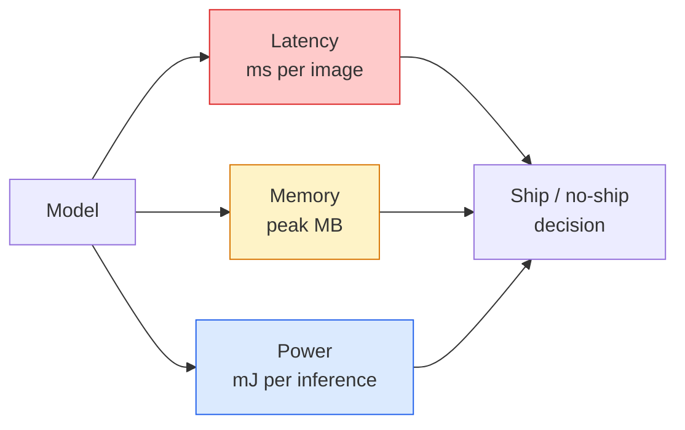

# Visión en tiempo real  Despliegue de borde  real tiempo  边缘部署

> La inferencia de borde es la disciplina de conseguir que un modelo de 90 fps ejecute a 30 fps en un dispositivo con 2 GB de RAM.

> **【中文解读】**边缘推理 es un arte de equilibrio: hacer que el 90% 准确率 de un modelo funcione a 30fps en dispositivos de solo 2GB de memoria interna.

> **【拓展：边缘 AI 的应用】**边缘部署在智能手机 (?? 人脸解锁,拍照美化) 无人机 (?? 人机) 实时目标检测) 工业物联网 (?? 缺陷检测) y autónomo驾驶 (?? 车载推理) 中至关重要──MobileNet、YOLO-nano、EfficientNet es el modelo de menor escala común──

**Type:** Learn + Build | **类型:** 学习 + 动手
**Languages:** Python | **语言:** Python
**Prerequisites:** Phase 4 Lesson 04 (Image Classification), Phase 10 Lesson 11 (Quantization) | **前置知识:** Phase 4 Lesson 04（图像分类），Phase 10 Lesson 11（量化）
**Time:** ~75 minutes | **时间:** ~75 分钟

## Objetivos de aprendizaje

- Medir la latencia de inferencia, la memoria máxima y el rendimiento para cualquier modelo PyTorch, y leer las FLOPs / params / compensación de latencia
- Cuantizar un modelo de visión a INT8 utilizando la cuantificación posterior a la formación de PyTorch y verificar la pérdida de precisión < 1%
- Exportar a ONNX y compilar con ONNX Runtime o TensorRT; nombrar las tres fallas de exportación más comunes y sus correcciones
- Explicar cuándo elegir MobileNetV3, EfficientNet-Lite, ConvNeXt-Tiny o MobileViT para una restricción de borde

> **【中文解读】**El objetivo de aprendizaje enumera las capacidades centrales que debe dominarse después de completar la clase.


## El problema es la introducción del problema

Un modelo de visión de entrenamiento es un monstruo de punto flotante. 100M parámetros, 10 GFLOPs por pase hacia adelante, 2 GB de VRAM. Ninguno de esos se ajusta a un teléfono, una unidad de infoentretenimiento de un automóvil, una cámara industrial o un dron.

> El modelo visual de entrenamiento es un flujo de monstruos.1.000 millones de parámetros. En cada caso, se transmite 10 GFLOPs.2.GB. de almacenamiento. Estos no pueden instalarse en el sistema de transporte.

Tres botones hacen la mayor parte del trabajo: la elección del modelo (una arquitectura más pequeña con la misma receta), la cuantificación (INT8 en lugar de FP32) y el tiempo de ejecución de inferencia (ONNX Runtime, TensorRT, Core ML, TFLite).

> Tres rotadores hicieron la mayor parte del trabajo: modelo seleccionar(small architecture of the same scheme) 量化(INT8 替代FP32) y推理运行时(ONNX Runtime、TensorRT、Core ML、TFLite) ⋅ correctamente utilizarlos en las demostraciones que se ejecutan en la estación de trabajo y entre los productos entregados en los módulos de cámara de 30 美元 ⋅

Esta lección establece primero la disciplina de medición (no se puede optimizar lo que no se puede medir), luego se camina los tres botones.

> Este curso primero establece la medida de la medida de lo que no puedes optimizar, luego recorre tres ciclos. El objetivo no es aprender a cada lado de la marcha, sino saber qué palancas hay y cómo verificar que cada palanca hace lo que crees que hace.

## El concepto central.

> **【中文解读】**Este capítulo presenta los conceptos y teorías básicos. La comprensión de estos conceptos es el prerrequisito de la realización posterior de la actividad, y también el conocimiento de los puntos de alta frecuencia de la entrevista y la práctica de la ingeniería.


### Los tres presupuestos



- **Latency**El promedio de sólo p50 esconde el comportamiento de cola que es importante para los sistemas en tiempo real.
  En inglés:**延迟**El valor medio se oculta en el sistema real.
- **Peak memory**El objetivo de la OOM es el máximo que el dispositivo pueda ver, no el promedio de estado estacionario.
  En inglés:**峰值内存**El valor máximo de los dispositivos se ve, no es el valor medio estable.
- **Power / energy**En el caso de los dispositivos de alta velocidad, el tiempo de utilización de la CPU/GPU es de aproximadamente un millón de juegos por inferencia en un dispositivo alimentado por batería.
  En inglés:**功耗/能量**Por ejemplo, el número de veces de la batería en el equipo de suministro de energía.

Una tabla de (modelo, latencia, memoria, precisión) es de la que se toma una decisión de borde.

> Una serie de datos (模型, 延迟, 内存, 精度) se basan en la decisión de la implementación de bordes.

### Disciplina de medición

Tres reglas que debe seguir cada perfil de borde:

> Cada análisis de rendimiento marginal debe seguir tres reglas:

1. **Warm up**El modelo con 5-10 pasos adicionales de maniobra antes de medir.
   En inglés:**预热** Pre-medida con 5-10 veces virtual pre-dirección de la difusión pre-temperatura modelo。 frío almacenamiento y JIT 编译会产生不代表性的初始数据。
2. **Synchronise**Cargas de trabajo de GPU con `torch.cuda.synchronize()`Sin esto se mide el despacho del núcleo, no la ejecución del núcleo.
   En inglés:**同步** en el cuadro de tiempo previo uso `torch.cuda.synchronize()`Simpele GPU 工作负载──否则, la medida es la regulación de núcleo, no la ejecución de núcleo.
3. **Fix input sizes**La latencia en 224x224 no es la latencia en 512x512.
   En inglés:**固定输入尺寸** uso de resolución de producción──224x224  上的延迟不等于 512x512 上的延迟──

### FLOPs como un agente

FLOPs (operaciones de puntos flotantes por inferencia) es un proxy barato, independiente del dispositivo para la latencia. Útil para la comparación de arquitectura, engañoso como un reloj de pared absoluto. Un modelo con un 10% más de FLOPs puede ser 2 veces más rápido en la práctica porque utiliza opciones amigables con hardware (convistas profundas compilar bien, grandes convistas 7x7 no).

> FLOPs (en inglés: FLOPs) es un indicador de retraso de la construcción de un sistema de cálculo de puntos de trabajo (FLOPs) muy barato, pero es un error de tiempo.

Regla: utilizar FLOPs para la búsqueda de arquitectura, utilizar latencia en el dispositivo para las decisiones de implementación.

> La aplicación de la aplicación de la aplicación de la aplicación de la aplicación de la aplicación de la aplicación de la aplicación de la aplicación de la aplicación de la aplicación de la aplicación de la aplicación de la aplicación de la aplicación de la aplicación de la aplicación de la aplicación de la aplicación de la aplicación de la aplicación de la aplicación de la aplicación de la aplicación de la aplicación de la aplicación de la aplicación de la aplicación de la aplicación de la aplicación de la aplicación de la aplicación de la aplicación de la aplicación de la aplicación de la aplicación de la aplicación de la aplicación de la aplicación de la aplicación de la aplicación de la aplicación de la aplicación de la aplicación de la aplicación de la aplicación de la aplicación de la aplicación de la aplicación de la aplicación de la aplicación de la aplicación de la aplicación de la aplicación de la aplicación de la aplicación de la aplicación de la aplicación de la aplicación de la aplicación de la aplicación de la aplicación de la aplicación de la aplicación de la aplicación de la aplicación de la aplicación de la aplicación de la aplicación de la aplicación de la aplicación de la aplicación de la aplicación de la aplicación de la aplicación de la aplicación de la aplicación de la aplicación de la aplicación de la aplicación de la aplicación de la aplicación de la aplicación de la aplicación de la aplicación de la aplicación de la aplicación de la aplicación de la aplicación de la aplicación de la aplicación de la aplicación de la aplicación de la ley de la ley de la ley de la ley de la ley de la ley de la ley de la ley de la ley de la ley de la ley de la ley de la ley de la ley de la ley de la ley de la ley de la ley de la ley de la ley de la ley de la ley de la ley de la ley de la ley de la ley de la ley de la ley de la ley de la ley de la ley de la ley de la ley de la ley de la ley de la ley de la ley de la ley de la ley de la ley de la ley de la ley de la ley de la ley de la ley de la ley de la ley de la ley de la ley de la ley de la ley de la ley de la ley de la ley de la ley de la ley de la ley de la ley de la ley de la ley de la ley de la ley de la ley de la ley de la ley de la ley de la ley de la ley de la ley de la ley de la ley de la ley de la ley de la ley de la ley de la ley de la ley de

### Cuantificación en un párrafo

Replace los pesos y las activaciones de FP32 con INT8. El tamaño del modelo disminuye 4x, el ancho de banda de memoria disminuye 4x, la computación disminuye 2-4x en el hardware que tiene núcleos INT8 (todo SoC móvil moderno, cada GPU NVIDIA con Tensor Cores).

> Para el uso de la tecnología de la memoria, el tamaño del modelo se reduce 4 veces, el tamaño del almacenamiento se reduce 4 veces, el volumen de cálculo en el hardware interno de la memoria se reduce 2-4 veces.

Tipo de las plantas:

> 类型:

- **Dynamic** Peso cuántico a INT8, activaciones calculadas en FP.
  En inglés:**动态** Peso de potencia en INT8, valor activado en FP 计算──简单,加速有限──
- **Static (post-training)** Peso cuántico + rango de activación de calibración en un conjunto de calibración pequeño.
  En inglés:**静态（训练后）**量化权重 + 在小校准集上校准激活范围──比动态快得多──
- **Quantisation-aware training (QAT)** simulación de la cuantificación durante el entrenamiento para que el modelo aprenda a su alrededor.
  En inglés:**量化感知训练（QAT）** entrenamiento en el tiempo de la simulación, hacer que el modelo se adapte.

Para la visión, la cuantificación estática post-entrenamiento proporciona el 95% de los beneficios con el 5% del esfuerzo.

>  Para las tareas visuales, el esfuerzo de la calificación de la posición post-entrenamiento con 5% obtiene un beneficio del 95% sólo cuando la pérdida de precisión del PTQ es inaceptable utiliza QAT

### Alcaza y destilación

- **Pruning** eliminar pesos no importantes (basados en magnitud) o canales (estructurados). Funciona bien en modelos sobreparametrizados; menos útil en arquitecturas ya compactas.
  En inglés:**剪枝**Deboto de peso no importante (basado en la amplitud) o en la conducción (estructurado) Efectos buenos para el modelo de overparametrizamiento; no es grande para la estructura de uso ya muy estrecha
- **Distillation** entrenar a un estudiante pequeño para imitar las logitas de un maestro grande. A menudo recupera la mayor parte de la precisión perdida mediante la reducción del modelo.
  En inglés:**蒸馏** entrenamiento小模型 (en inglés)  estudiantes) 模仿大模型 (en inglés)  docentes (en inglés)   修小模型 (en inglés)  学生) 模仿大模型 (en inglés)  师)  师的逻辑──通常能恢复缩小模型损失的大部分精度──生产级边缘模型的标准做法──

### Los tiempos de ejecución de la inferencia

- **PyTorch eager** lento, no para el despliegue.
  En inglés:**PyTorch eager**慢, no se utiliza para la implementación―solo para el desarrollo―
- **TorchScript** legado.`torch.compile`y la exportación de ONNX.
  En inglés:**TorchScript**遗留方案──已被 `torch.compile`Y ONNX 导出取代──
- **ONNX Runtime**CPU, CUDA, CoreML, TensorRT, OpenVINO todos tienen proveedores ONNX.
  En inglés:**ONNX Runtime**中性运行时──CPU、CUDA、CoreML、TensorRT、OpenVINO todos tienen ONNX 供应商──从这里开始──
- **TensorRT** Compilador de NVIDIA. Mejor latencia en las GPUs de NVIDIA (estación de trabajo y Jetson).
  En inglés:**TensorRT**NVIDIA 的编译器──在NVIDIA GPU(工作站和 Jetson) 上延迟最低──
- **Core ML** Tiempo de ejecución de Apple para iOS/macOS. Necesidades `.mlmodel`o `.mlpackage`¿ Qué ?
  En inglés:**Core ML**Apple iOS / macOS 运行时──需要 `.mlmodel`O `.mlpackage`¿Qué es eso?
- **TFLite** El tiempo de ejecución de Google para Android/ARM. Necesidades `.tflite`¿ Qué ?
  En inglés:**TFLite**Google Android/ARM 运行时──需要 `.tflite`¿Qué es eso?
- **OpenVINO** Tiempo de ejecución de Intel para CPU/VPU. Necesidades `.xml`¿ Qué es eso ?`.bin`¿ Qué ?
  En inglés:**OpenVINO**Intel 运行时――需要 `.xml`¿ Qué es eso ?`.bin`¿Qué es eso?

En la práctica: exportar PyTorch -> ONNX -> elegir el tiempo de ejecución para el objetivo.

> 实践中:导出 PyTorch -> ONNX -> 选择目标运行时。ONNX 是通用语言。

### Selector de arquitectura de borde

| Budget | Model | Why |
|--------|-------|-----|
| < 3M params | MobileNetV3-Small | Compiles everywhere, good baseline |
| 3-10M | EfficientNet-Lite-B0 | Best accuracy per param on TFLite |
| 10-20M | ConvNeXt-Tiny | Best accuracy-per-param, CPU-friendly |
| 20-30M | MobileViT-S or EfficientViT | Transformer with ImageNet accuracy |
| 30-80M | Swin-V2-Tiny | If stack supports window attention |

Cuantice todos estos a INT8 a menos que tenga una razón específica para no hacerlo.

> **【中文解读】**Este capítulo a través del código de la implementación de algoritmos centrales de cero. Este método "desde cero" puede ayudar a entender el principio detrás del marco, no se encuentra en la caja negra cuando se encuentran problemas.

> **【拓展：工业部署中的视觉系统】**En la implementación industrial real, los modelos de visión necesitan considerar la posibilidad de retraso, el tamaño del modelo, la adaptación de los dispositivos de borde, etc. TensorRT, ONNX Runtime, OpenVINO son herramientas de aceleración de la teoría de uso habitual.

> **【拓展：数据标注与质量】**视觉任务的效果高度依赖标签数据质量──标签工作室、CVAT es la principal herramienta de marcado──在工业场景中,主动学习(Active Learning) puede reducir el costo de marcado: modelo a un requerimiento de muestras indeterminadas, marcación automática de muestras de determinación──


## Construye y realiza.
```figure
cnn-param-count
```

## Construye el mismo

### Paso 1: Medir correctamente la latencia

```python
import time
import torch

def measure_latency(model, input_shape, device="cpu", warmup=10, iters=50):
    model = model.to(device).eval()
    x = torch.randn(input_shape, device=device)
    with torch.no_grad():
        for _ in range(warmup):
            model(x)
        if device == "cuda":
            torch.cuda.synchronize()
        times = []
        for _ in range(iters):
            if device == "cuda":
                torch.cuda.synchronize()
            t0 = time.perf_counter()
            model(x)
            if device == "cuda":
                torch.cuda.synchronize()
            times.append((time.perf_counter() - t0) * 1000)
    times.sort()
    return {
        "p50_ms": times[len(times) // 2],
        "p95_ms": times[int(len(times) * 0.95)],
        "p99_ms": times[int(len(times) * 0.99)],
        "mean_ms": sum(times) / len(times),
    }
```

Calentar, sincronizar, usar `time.perf_counter()`- Informar porcentiles, no sólo mediocres.

> 预热、同步、使用 `time.perf_counter()`                                                                                                                                                                                                                                                              

### Paso 2: Parámetro y recuento de FLOP

```python
def parameter_count(model):
    return sum(p.numel() for p in model.parameters())

def flops_estimate(model, input_shape):
    """
    Rough FLOP count for a conv/linear-only model. For production use `fvcore` or `ptflops`.
    """
    total = 0
    def conv_hook(m, inp, out):
        nonlocal total
        c_out, c_in, kh, kw = m.weight.shape
        h, w = out.shape[-2:]
        total += 2 * c_in * c_out * kh * kw * h * w
    def linear_hook(m, inp, out):
        nonlocal total
        total += 2 * m.in_features * m.out_features
    hooks = []
    for m in model.modules():
        if isinstance(m, torch.nn.Conv2d):
            hooks.append(m.register_forward_hook(conv_hook))
        elif isinstance(m, torch.nn.Linear):
            hooks.append(m.register_forward_hook(linear_hook))
    model.eval()
    with torch.no_grad():
        model(torch.randn(input_shape))
    for h in hooks:
        h.remove()
    return total
```

Para proyectos reales `fvcore.nn.FlopCountAnalysis`o `ptflops`; manejan cada tipo de módulo correctamente.

>                                                                                                                                                                                                                                                                                                                                                                                                                                                                                                                              `fvcore.nn.FlopCountAnalysis`O `ptflops`• pueden procesar correctamente cada tipo de módulo.

### Paso 3: Cuantificación estática después del entrenamiento

```python
def quantise_ptq(model, calibration_loader, backend="x86"):
    import torch.ao.quantization as tq
    model = model.eval().cpu()
    model.qconfig = tq.get_default_qconfig(backend)
    tq.prepare(model, inplace=True)
    with torch.no_grad():
        for x, _ in calibration_loader:
            model(x)
    tq.convert(model, inplace=True)
    return model
```

Tres pasos: configurar, preparar (insertar observadores), calibrar con datos reales, convertir (fusión + cuantización).`Conv -> BN -> ReLU`- ¿ Qué ?`ConvBnReLU`), que `torch.ao.quantization.fuse_modules`- ¿Qué?

> Tres pasos: configuración, preparación, inserción en el observador, con datos reales, conversión, conversión, conversión, conversión, conversión, conversión, conversión, conversión, conversión, conversión, conversión, conversión, conversión, conversión, conversión, conversión, conversión, conversión, conversión, conversión, conversión, conversión, conversión, conversión, conversión, conversión, conversión, conversión, conversión, conversión, conversión, conversión, conversión, conversión, conversión, conversión, conversión, conversión, conversión, conversión, conversión, conversión, conversión, conversión, conversión, conversión, conversión, conversión, conversión, conversión, conversión, conversión, conversión, conversión, conversión, conversión, conversión, conversión, conversión, conversión, conversión, conversión, conversión, conversión, conversión, conversión, conversión, conversión, conversión, conversión, conversión, conversión, conversión, conversión, conversión, conversión, conversión, conversión, conversión, conversión, conversión, conversión, conversión, conversión, conversión, conversión, conversión, conversión, conversión, conversión, conversión, conversión, conversión, conversión, conversión, conversión, conversión, conversión, conversión, conversión, conversión, conversión, conversión, conversión, conversión, conversión, conversión, conversión, conversión, conversión, conversión, conversión, conversión, conversión, conversión, conversión, conversión, conversión, y conversión.`Conv -> BN -> ReLU`- ¿ Qué ?`ConvBnReLU`),`torch.ao.quantization.fuse_modules`Tratar esto.

### Paso 4: Exportación a ONNX

```python
def export_onnx(model, sample_input, path="model.onnx"):
    model = model.eval()
    torch.onnx.export(
        model,
        sample_input,
        path,
        input_names=["input"],
        output_names=["output"],
        dynamic_axes={"input": {0: "batch"}, "output": {0: "batch"}},
        opset_version=17,
    )
    return path
```

`opset_version=17`es el default seguro en 2026. `dynamic_axes`permite ejecutar el modelo ONNX con tamaño de lote arbitrario.

> `opset_version=17`Es el valor garantizado para el año 2026.`dynamic_axes`允许 ONNX 模型以任意批量大小运行──

### Paso 5: Indicar y comparar los regímenes

```python
import torch.nn as nn
from torchvision.models import mobilenet_v3_small

def compare_regimes():
    model = mobilenet_v3_small(weights=None, num_classes=10)
    params = parameter_count(model)
    flops = flops_estimate(model, (1, 3, 224, 224))
    lat_fp32 = measure_latency(model, (1, 3, 224, 224), device="cpu")
    print(f"FP32 MobileNetV3-Small: {params:,} params  {flops/1e9:.2f} GFLOPs  "
          f"p50={lat_fp32['p50_ms']:.2f}ms  p95={lat_fp32['p95_ms']:.2f}ms")
```

Ejecutar la misma función para `resnet50`¿ Qué ?`efficientnet_v2_s`, y `convnext_tiny`y tienes la tabla de comparación que necesitas para una decisión de despliegue.

> ¿ Qué ?`resnet50`¿Qué es esto?`efficientnet_v2_s`Y `convnext_tiny`运行相同函数, tú ya obtienes el índice de comparación necesario para la decisión de implementación.

> **【中文解读】**Este capítulo muestra cómo utilizar un marco maduro (como PyTorch、HuggingFace, etc.) para aplicar rápidamente esta tecnología. En los proyectos reales, se realiza con prioridad el uso de un marco experimentado, se pueden reducir errores y mejorar la eficiencia de desarrollo.


> **【拓展：视觉模型的持续学习】**En el entorno de producción, el modelo visual necesita adaptarse continuamente a nuevos datos. Esto es especialmente importante en la conducción automotriz y el control de calidad industrial.

## Usalo con el marco de ejecución

Las pilas de producción convergen en una de las tres vías:

- **Web / serverless**PyTorch -> ONNX -> ONNX Runtime (proveedor de CPU o CUDA).
- **NVIDIA edge (Jetson, GPU server)**PiTorch -> ONNX -> TensorRT. Mejor latencia, mayor esfuerzo de ingeniería.
- **Mobile**PyTorch -> ONNX -> Core ML (iOS) o TFLite (Android). Cuantice antes de exportar.

> **【中文解读】**Este capítulo se centra en cómo se puede implementar el modelo como producto disponible. Desde el modelo original hasta el sistema de producción, se deben considerar múltiples dimensiones de optimización de rendimiento, tratamiento de errores, control, etc.


Para la medición, `torch-tb-profiler`¿ Qué ?`nvprof`- ¿ Qué ?`nsys`, y los instrumentos en macOS dan rupturas capas por capas. `benchmark_app`(OpenVINO) y `trtexec`(TensorRT) dar números independientes de CLI.


## Envíe el producto .

> **【中文解读】**Practice los temas de fácil/medio/duro  3 difficulty to pass in  Recomenda al menos completar los temas de grado medio  Grado duro  para la preparación de la entrevista


Esta lección produce:

- `outputs/prompt-edge-deployment-planner.md` un prompt que selecciona la columna vertebral, la estrategia de cuantificación y el tiempo de ejecución dado el dispositivo objetivo y la latencia SLA.
- `outputs/skill-latency-profiler.md` una habilidad que escribe un guión completo de benchmarking de latencia con calentamiento, sincronización, percentiles y seguimiento de memoria.

## Los ejercicios.

1. **(Easy)**Medir la latencia p50 para `resnet18`¿ Qué ?`mobilenet_v3_small`¿ Qué ?`efficientnet_v2_s`, y `convnext_tiny`En el punto 224x224 en la CPU, informe la tabla y identifique cuál arquitectura tiene la mejor precisión por ms.
2. **(Medium)**Aplicar la cuantificación estática después del entrenamiento a `mobilenet_v3_small`. Informar pérdida de latencia e exactitud FP32 vs INT8 en un subconjunto de CIFAR-10 o similar.
3. **(Hard)**Exportación `convnext_tiny`En ONNX, hazlo pasar.`onnxruntime`con el `CPUExecutionProvider`, y comparar la latencia con la línea de base de PyTorch ansioso. Identificar la primera capa donde ONNX Runtime es más rápido y explicar por qué.

> **【中文解读】**En el lenguaje de los términos "Lo que la gente dice" vs "Lo que realmente significa" se distingue entre el lenguaje diario y la definición técnica de significado.


## Términos clave .

| Term | What people say | What it actually means |
|------|----------------|----------------------|
| Latency | "How fast" | Time from input to output; p50/p95/p99 percentiles, not mean |
| FLOPs | "Model size" | Floating-point ops per forward pass; rough proxy for compute cost |
| INT8 quantisation | "8-bit" | Replace FP32 weights/activations with 8-bit integers; ~4x smaller, 2-4x faster |
| PTQ | "Post-training quantisation" | Quantise a trained model without retraining; easy, usually enough |
| QAT | "Quantisation-aware training" | Simulate quantisation during training; best accuracy, requires labelled data |
| ONNX | "The neutral format" | Model exchange format supported by every mainstream inference runtime |
| TensorRT | "NVIDIA compiler" | Compiles ONNX into an optimised engine for NVIDIA GPUs |
| Distillation | "Teacher -> student" | Train a small model to mimic a big model's logits; recovers most lost accuracy |

> **【中文解读】**延伸阅读 proporciona un alto nivel de recursos para el aprendizaje profundo. Estos artículos y cursos son los referentes clásicos en el campo, adecuados para los lectores que necesitan una comprensión profunda.


## Más Leer más Leer más

- [EfficientNet (Tan & Le, 2019)](https://arxiv.org/abs/1905.11946) escalación compuesta para arquitecturas eficientes
- [MobileNetV3 (Howard et al., 2019)](https://arxiv.org/abs/1905.02244) Arquitectura móvil con h-swish y squeeze-excite
- [A Practical Guide to TensorRT Optimization (NVIDIA)](https://developer.nvidia.com/blog/accelerating-model-inference-with-tensorrt-tips-and-best-practices-for-pytorch-users/) Cómo obtener los números de rendimiento en el papel
- [ONNX Runtime docs](https://onnxruntime.ai/docs/) Cuantificación, optimización de gráficos, selección de proveedores
