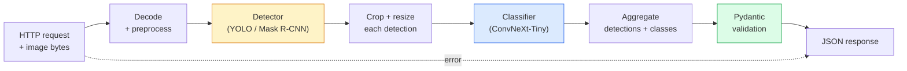

# Construir un proyecto de visión completa  Capstone  Construir un proyecto de visión completa  毕业项目

> Un sistema de visión de producción es una cadena de modelos y reglas cosidas con contratos de datos.

> **【中文解读】**El sistema de producción de nivel visual es un conjunto de modelos y reglas que se han unido a través de un acuerdo de datos. El curso anterior de esta etapa ya ha cubierto cada componente, y este proyecto de graduación los reunirá de un punto a otro, incluyendo la carga de datos, el preprocesamiento, la hipótesis de modelos, el postprocesamiento y la salida de resultados.

**Type:** Build | **类型:** 动手
**Languages:** Python | **语言:** Python
**Prerequisites:** Phase 4 Lessons 01-15 | **前置知识:** Phase 4 Lessons 01-15
**Time:** ~120 minutes | **时间:** ~120 分钟

## Objetivos de aprendizaje

- Diseñar una línea de visión de producción que detecte objetos, los clasifique y emita JSON estructurado  con cada trayecto de falla manejado
- Conectar un detector (Máscara R-CNN o YOLO), un clasificador (ConvNeXt-Tiny) y un contrato de datos (Pydantic) en un solo servicio
- Marque de referencia de la tubería de extremo a extremo e identifique el primer cuello de botella (generalmente preprocesamiento, luego el detector)
- Envía un servicio FastAPI mínimo que acepta una carga de imágenes, ejecuta la tubería y devuelve las detecciones con clasificaciones

> **【中文解读】**El objetivo de aprendizaje enumera las capacidades centrales que debe dominarse después de completar la clase.


## El problema es la introducción del problema

Los modelos de visión individuales son útiles; los productos de visión son cadenas de ellos. Una auditoría de estantería minorista es un detector más un clasificador de productos más un pipeline OCR de precios. La conducción autónoma es un detector 2D más un detector 3D más un segmentador más un rastreador más un planificador. Una pre-escreen médica es un segmentador más un clasificador de región más una interfaz de usuario clínica.

> 单个视觉模型有用; 视觉产品是它们的链条;;零售货架审计是检测器加产品分类器加价 OCR 流水线;;自动驾驶是2D检测器加3D检测器加分器加跟踪器加规划器;;医疗预测是分器加区域分类器加临床 UI;;

El cableado de esas cadenas es la parte que separa un prototipo de ML de un producto. Cada interfaz entre modelos es un nuevo lugar para los errores. Cada transformación de coordenadas, cada normalización, cada tamaño de la máscara es un candidato a fallas silenciosas. Una tubería es tan fuerte como su interfaz más débil.

> 连接这些链条是将 ML原型与产品区分的开放部分―― cada interfaz entre modelos es un nuevo lugar de error―― cada situación de cambio, cada integración, cada encubrimiento de la cubierta es un candidato silencioso y fallido―― la intensidad de la línea fluida depende de la interfaz más débil――

Esta piedra angular establece el mínimo de tubería viable: detección + clasificación + salida estructurada + una capa de servicio. Todo lo demás en las ranuras de la Fase 4 en este esqueleto: intercambiar Mask R-CNN por YOLOv8, agregar una cabeza OCR, agregar una rama de segmentación, agregar un rastreador. La arquitectura es estable; las piezas son enchufable.

> Este proyecto de formación construye la línea de agua mínima disponible: análisis + categorías + estructuración de salida +  servicio de nivel.

## El concepto central.

> **【中文解读】**Este capítulo presenta los conceptos y teorías básicos. La comprensión de estos conceptos es el prerrequisito de la realización posterior de la actividad, y también el conocimiento de los puntos de alta frecuencia de la entrevista y la práctica de la ingeniería.


### El oleoducto



Las dos etapas son caras, las otras cinco son donde viven los insectos.

> 七阶段── dos modelos son caros; los otros cinco son bug 藏身之处──

### Contratos de datos con Pydantic

Cada límite modelo se convierte en un objeto tipado, lo que convierte los fallos silenciosos en ruidosos.

> Cada modelo se convierte en un objeto clasificado. Esto convertirá el fracaso del silencio en un error evidente.

```
Detection(
    box: tuple[float, float, float, float],   # (x1, y1, x2, y2), absolute pixels
    score: float,                              # [0, 1]
    class_id: int,                             # from detector's label map
    mask: Optional[list[list[int]]],           # RLE-encoded if present
)

PipelineResult(
    image_id: str,
    detections: list[Detection],
    classifications: list[Classification],
    inference_ms: float,
)
```

Cuando un detector devuelve las cajas en `(cx, cy, w, h)`en lugar de`(x1, y1, x2, y2)`, la validación de Pydantic falla en el límite y se averigua inmediatamente en lugar de depurar un cultivo aguas abajo que en silencio devuelve regiones vacías.

> Cuando el inspector regresa`(cx, cy, w, h)`Y no`(x1, y1, x2, y2)`Cuando el marco de formato, la verificación de Pydantic en la frontera fracasó, usted inmediatamente puede encontrar el problema, en lugar de la modificación de corte y la búsqueda de que vuelve en silencio a la zona vacía.

### Donde la latencia va

Tres verdades contienen casi todas las vías:

> Casi todos los vídeos fluyen por tres hechos:

1. **Preprocessing is often the biggest single block.**Decodificar JPEGs, convertir espacios de color, redimensionar  estos son CPU-ligados y fácil de olvidar.
   En inglés:**预处理通常是最大的单一开销。**解码 JPEG 转换色空间 缩放 缩放 缩放 缩放 缩放 缩写 缩写 缩写 缩写 缩写 缩写 缩写 缩写 缩写 缩写 缩写 缩写 缩写 缩写 缩写 缩写 缩写 缩写 缩写 缩写 缩写 缩写 缩写 缩写 缩写 缩写 缩写 缩写 缩写 缩写 缩写 缩写 缩写 缩写 缩写 缩写 缩写 缩写 缩写 缩写 缩写 缩写 缩写 缩写 缩写 缩写 缩写 缩写 缩写 缩写 缩写 缩写 缩写 缩写 缩写 缩写 缩写 缩写 缩写 缩写 缩写 缩写 缩写 缩写 缩写 缩写 缩写 缩写 缩写 缩写 缩写 缩写 缩写 缩写 缩写 缩写 缩写 缩写 缩写 缩写 缩写 缩写 缩写 缩写 缩写 缩写 缩写 缩写 缩写 缩写 缩写 缩写 缩写 缩写 缩写 缩写 缩写 缩写 缩写 缩写 缩写 缩写 缩写 缩写 缩写 缩写 缩写 缩写 缩写 缩写 缩写 缩写 缩写 缩写 缩写 缩写 缩写 缩写 缩写 缩写 缩写 缩写 缩写
2. **The detector dominates GPU time.**El 70-90% del tiempo de la GPU está en el pase de detección hacia adelante.
   En inglés:**检测器占据 GPU 时间的主导。**El 70-90% del tiempo de la GPU se pasa en la detección y la difusión.
3. **Postprocessing (NMS, RLE encode/decode) is cheap on GPU, expensive on CPU.**Siempre se relaciona con el objetivo real.
   En inglés:**后处理（NMS、RLE 编解码）在 GPU 上便宜，在 CPU 上昂贵。**始终在实际目标上分析──

Conocer la distribución es lo que convierte la optimización en una lista de prioridades.

>  Conocer la distribución para que la optimización se convierta en una lista de prioridades.

### Modo de falla

- **Empty detections** devuelva la lista vacía, no se estrellará.
  En inglés:**空检测结果** Retorno a la lista, no se derrumbe.
- **Out-of-bounds boxes** Aglutinar el tamaño de la imagen antes de recortar.
  En inglés:**越界框**裁剪前限制到图像尺寸内──
- **Tiny crops** omitir la clasificación para cuadros más pequeños que la entrada mínima del clasificador.
  En inglés:**微小裁剪** Salto más pequeño que la menor entrada de los cuadrados de la clasificación.
- **Corrupt upload** 400 respuestas con un código de error específico, no 500.
  En inglés:**损坏的上传** Retorno con un error específico de 400 响应, no 500 ⋅
- **Model load failure** fallar en el inicio del servicio, no en la primera solicitud.
  En inglés:**模型加载失败** en el servicio iniciación cuando fracasa, no en la primera petición 

Una línea de producción maneja cada uno de estos sin escribir genéricos `try/except`Cada fracaso recibe un código y una respuesta.

> Clasificación de producción de flujo de agua para el tratamiento de cada situación no es necesario ocultar el fracaso de la generalidad`try/except` Cada fracaso tiene un nombre y un código de respuesta

### Los grupos

Un servicio de producción sirve a múltiples clientes. La detección de lotes y las clasificaciones de las solicitudes multiplican el rendimiento. La compensación: latencia extra de esperar a que un lote se llene. Configuración típica: recoger solicitudes hasta 20 ms, juntar lotes, procesar, distribuir respuestas. `torchserve`y `triton`Los servicios pequeños con carga predecible lanzan su propio micro-batcher.

> Producción de servicios en el mismo tiempo que el servicio de múltiples clientes.`torchserve`Y `triton`El servicio de carga predecible de un pequeño servicio puede realizarse por sí mismo en un procesador de micro-grupo.

> **【拓展：工业部署中的视觉系统】**En la implementación industrial real, los modelos de visión necesitan considerar la posibilidad de retraso, el tamaño del modelo, la adaptación de los dispositivos de borde, etc. TensorRT, ONNX Runtime, OpenVINO son herramientas de aceleración de la teoría de uso habitual.

> **【拓展：数据标注与质量】**视觉任务的效果高度依赖标签数据质量──标签工作室、CVAT es la principal herramienta de marcado──在工业场景中,主动学习(Active Learning) puede reducir el costo de marcado: modelo a un requerimiento de muestras indeterminadas, marcación automática de muestras de determinación──

> **【拓展：合成数据与数据增强】**Cuando los datos reales son insuficientes, los datos de sintesis (como Blender, Unity, 染) y el aumento de datos (como la biblioteca de documentaciones) son dos estrategias efectivas.


## Construye y realiza.

> **【中文解读】**Este capítulo a través del código de la implementación de algoritmos centrales de cero. Este método "desde cero" puede ayudar a entender el principio detrás del marco, no se encuentra en la caja negra cuando se encuentran problemas.

```figure
v4-vision-pipeline
```

## Construye el mismo

### Paso 1: Contratos de datos

```python
from pydantic import BaseModel, Field
from typing import List, Optional, Tuple

class Detection(BaseModel):
    box: Tuple[float, float, float, float]
    score: float = Field(ge=0, le=1)
    class_id: int = Field(ge=0)
    mask_rle: Optional[str] = None


class Classification(BaseModel):
    detection_index: int
    class_id: int
    class_name: str
    score: float = Field(ge=0, le=1)


class PipelineResult(BaseModel):
    image_id: str
    detections: List[Detection]
    classifications: List[Classification]
    inference_ms: float
```

Cinco segundos de código ahorran una hora de descomposición en cualquier tubería seria.

> El código de 5 segundos puede ahorrar cualquier tiempo de prueba en la línea de flujo de agua.

### Paso 2: Una clase mínima de tuberías

```python
import time
import numpy as np
import torch
from PIL import Image

class VisionPipeline:
    def __init__(self, detector, classifier, class_names,
                 device="cpu", min_crop=32):
        self.detector = detector.to(device).eval()
        self.classifier = classifier.to(device).eval()
        self.class_names = class_names
        self.device = device
        self.min_crop = min_crop

    def preprocess(self, image):
        """
        image: PIL.Image or np.ndarray (H, W, 3) uint8
        returns: CHW float tensor on device
        """
        if isinstance(image, Image.Image):
            image = np.asarray(image.convert("RGB"))
        tensor = torch.from_numpy(image).permute(2, 0, 1).float() / 255.0
        return tensor.to(self.device)

    @torch.no_grad()
    def detect(self, image_tensor):
        return self.detector([image_tensor])[0]

    @torch.no_grad()
    def classify(self, crops):
        if len(crops) == 0:
            return []
        batch = torch.stack(crops).to(self.device)
        logits = self.classifier(batch)
        probs = logits.softmax(-1)
        scores, cls = probs.max(-1)
        return list(zip(cls.tolist(), scores.tolist()))

    def run(self, image, image_id="anonymous"):
        t0 = time.perf_counter()
        tensor = self.preprocess(image)
        det = self.detect(tensor)

        crops = []
        detections = []
        valid_indices = []
        for i, (box, score, cls) in enumerate(zip(det["boxes"], det["scores"], det["labels"])):
            x1, y1, x2, y2 = [max(0, int(b)) for b in box.tolist()]
            x2 = min(x2, tensor.shape[-1])
            y2 = min(y2, tensor.shape[-2])
            detections.append(Detection(
                box=(x1, y1, x2, y2),
                score=float(score),
                class_id=int(cls),
            ))
            if (x2 - x1) < self.min_crop or (y2 - y1) < self.min_crop:
                continue
            crop = tensor[:, y1:y2, x1:x2]
            crop = torch.nn.functional.interpolate(
                crop.unsqueeze(0),
                size=(224, 224),
                mode="bilinear",
                align_corners=False,
            )[0]
            crops.append(crop)
            valid_indices.append(i)

        class_preds = self.classify(crops)

        classifications = []
        for valid_idx, (cls_id, cls_score) in zip(valid_indices, class_preds):
            classifications.append(Classification(
                detection_index=valid_idx,
                class_id=int(cls_id),
                class_name=self.class_names[cls_id],
                score=float(cls_score),
            ))

        return PipelineResult(
            image_id=image_id,
            detections=detections,
            classifications=classifications,
            inference_ms=(time.perf_counter() - t0) * 1000,
        )
```

Cada interfaz está escrita, cada ruta de falla tiene una decisión específica de manejo.

> Cada interfaz es clasificada. Cada camino de fracaso tiene una decisión de tratamiento clara.

### Paso 3: Conectar un detector y un clasificador

```python
from torchvision.models.detection import maskrcnn_resnet50_fpn_v2
from torchvision.models import convnext_tiny

# Use ImageNet-pretrained weights for a realistic pipeline without training
detector = maskrcnn_resnet50_fpn_v2(weights="DEFAULT")
classifier = convnext_tiny(weights="DEFAULT")
class_names = [f"imagenet_class_{i}" for i in range(1000)]

pipe = VisionPipeline(detector, classifier, class_names)

# Smoke test with a synthetic image
test_image = (np.random.rand(400, 600, 3) * 255).astype(np.uint8)
result = pipe.run(test_image, image_id="demo")
print(result.model_dump_json(indent=2)[:500])
```

### Paso 4: Servicio de FastAPI

```python
from fastapi import FastAPI, UploadFile, HTTPException
from io import BytesIO

app = FastAPI()
pipe = None  # initialised on startup

@app.on_event("startup")
def load():
    global pipe
    detector = maskrcnn_resnet50_fpn_v2(weights="DEFAULT").eval()
    classifier = convnext_tiny(weights="DEFAULT").eval()
    pipe = VisionPipeline(detector, classifier, class_names=[f"c{i}" for i in range(1000)])

@app.post("/detect")
async def detect_endpoint(file: UploadFile):
    if file.content_type not in {"image/jpeg", "image/png", "image/webp"}:
        raise HTTPException(status_code=400, detail="unsupported image type")
    data = await file.read()
    try:
        img = Image.open(BytesIO(data)).convert("RGB")
    except Exception:
        raise HTTPException(status_code=400, detail="cannot decode image")
    result = pipe.run(img, image_id=file.filename or "upload")
    return result.model_dump()
```

Corra con`uvicorn main:app --host 0.0.0.0 --port 8000`Prueba con`curl -F 'file=@dog.jpg' http://localhost:8000/detect`¿ Qué ?

> ¿ Qué ?`uvicorn main:app --host 0.0.0.0 --port 8000`¿Qué es eso?`curl -F 'file=@dog.jpg' http://localhost:8000/detect`¿Qué es eso?

### Paso 5: Marque de referencia el oleoducto

```python
import time

def benchmark(pipe, num_runs=20, image_size=(400, 600)):
    img = (np.random.rand(*image_size, 3) * 255).astype(np.uint8)
    pipe.run(img)  # warm up

    stages = {"preprocess": [], "detect": [], "classify": [], "total": []}
    for _ in range(num_runs):
        t0 = time.perf_counter()
        tensor = pipe.preprocess(img)
        t1 = time.perf_counter()
        det = pipe.detect(tensor)
        t2 = time.perf_counter()
        crops = []
        for box in det["boxes"]:
            x1, y1, x2, y2 = [max(0, int(b)) for b in box.tolist()]
            x2 = min(x2, tensor.shape[-1])
            y2 = min(y2, tensor.shape[-2])
            if (x2 - x1) >= pipe.min_crop and (y2 - y1) >= pipe.min_crop:
                crop = tensor[:, y1:y2, x1:x2]
                crop = torch.nn.functional.interpolate(
                    crop.unsqueeze(0), size=(224, 224), mode="bilinear", align_corners=False
                )[0]
                crops.append(crop)
        pipe.classify(crops)
        t3 = time.perf_counter()
        stages["preprocess"].append((t1 - t0) * 1000)
        stages["detect"].append((t2 - t1) * 1000)
        stages["classify"].append((t3 - t2) * 1000)
        stages["total"].append((t3 - t0) * 1000)

    for stage, times in stages.items():
        times.sort()
        print(f"{stage:12s}  p50={times[len(times)//2]:7.1f} ms  p95={times[int(len(times)*0.95)]:7.1f} ms")
```

En la CPU, la salida típica es de 20 a 40 ms y en la GPU, la detección es de 20 a 40 ms y el preproceso + clasificar comienza a importar más en términos relativos.

> En la CPU, la producción típica: preprocesamiento de aproximadamente 3 ms, análisis de 300-500 ms, análisis de 20-40 ms, análisis total de 350-550 ms, en la GPU, análisis de aproximadamente 20-40 ms, el preprocesamiento y la proporción de los tipos se vuelven más importantes.

> **【中文解读】**Este capítulo muestra cómo utilizar un marco maduro (como PyTorch、HuggingFace, etc.) para aplicar rápidamente esta tecnología. En los proyectos reales, se realiza con prioridad el uso de un marco experimentado, se pueden reducir errores y mejorar la eficiencia de desarrollo.


> **【拓展：视觉模型的持续学习】**En el entorno de producción, el modelo visual necesita adaptarse continuamente a nuevos datos. Esto es especialmente importante en la conducción automotriz y el control de calidad industrial.

## Usalo con el marco de ejecución

Las plantillas de producción convergen a la misma estructura, más:

- **Model versioning** siempre registrar el nombre del modelo y los pesos hash en la respuesta.
- **Per-request trace IDs** Registre cada momento de cada etapa para cada solicitud para que pueda correlacionar las respuestas lentas con las etapas.
- **Fallback path** si el clasificador se descompone, devuelva las detecciones sin clasificaciones en lugar de no cumplir con toda la solicitud.
- **Safety filters** Los filtros NSFW / PII se ejecutan después de la clasificación, antes de que la respuesta salga del servicio.
- **Batch endpoint** un `/detect_batch`aceptar una lista de URL de imágenes para el procesamiento masivo.

Para la producción de servicio, `torchserve`¿ Qué ?`Triton Inference Server`, y `BentoML`manejar el lote, la versión, las métricas y los controles de salud fuera de la caja.`FastAPI`En el caso de los prototipos y productos a pequeña escala, el producto es directamente compatible.

> **【中文解读】**Este capítulo se centra en cómo se puede implementar el modelo como producto disponible. Desde el modelo original hasta el sistema de producción, se deben considerar múltiples dimensiones de optimización de rendimiento, tratamiento de errores, control, etc.


## Envíe el producto .

Esta lección produce:

- `outputs/prompt-vision-service-shape-reviewer.md` una solicitud que revisa el código de un servicio de visión para violaciones de la forma de contrato/respuesta y nombra el primer error de ruptura.
- `outputs/skill-pipeline-budget-planner.md` una habilidad que, dada la latencia y el rendimiento objetivo, asigna un presupuesto temporal a cada etapa de la tubería y indica qué etapa se perderá primero su presupuesto.

> **【中文解读】**Practice los temas de fácil/medio/duro  3 difficulty to pass in  Recomenda al menos completar los temas de grado medio  Grado duro  para la preparación de la entrevista


## Los ejercicios.

1. **(Easy)**Ejecutar la línea de 10 imágenes de cualquier conjunto de datos abierto.
2. **(Medium)**Añadir un campo de salida de la máscara a `Detection`Verifique que el JSON se mantiene bajo 1 MB incluso para una imagen de 10 objetos.
3. **(Hard)**Añadir un micro-batcher delante del clasificador: recoger cultivos durante hasta 10 ms, clasificarlos todos en una llamada de GPU, devolver resultados por solicitud. Medir el aumento de rendimiento a 5 solicitudes simultáneas por segundo y la latencia agregada.

> **【中文解读】**En el lenguaje de los términos "Lo que la gente dice" vs "Lo que realmente significa" se distingue entre el lenguaje diario y la definición técnica de significado.


## Términos clave .

| Term | What people say | What it actually means |
|------|----------------|----------------------|
| Pipeline | "The system" | An ordered chain of preprocessing, inference, and postprocessing steps with a typed interface between each pair |
| Data contract | "The schema" | Pydantic / dataclass definitions that every stage input and output conforms to; catches integration bugs at the boundary |
| Preprocessing | "Before the model" | Decoding, colour conversion, resizing, normalising; usually the biggest CPU time sink |
| Postprocessing | "After the model" | NMS, mask resize, threshold, RLE encode; cheap on GPU, expensive on CPU |
| Microbatcher | "Collect then forward" | Aggregator that waits a fixed window for multiple requests, runs a single batched forward pass |
| Trace ID | "Request id" | Per-request identifier logged at every stage so slow requests can be traced end-to-end |
| Failure code | "Named error" | Specific error code per failure class instead of generic 500; enables client retry logic |
| Health check | "Readiness probe" | Cheap endpoint that reports whether the service can answer; loadbalancers rely on this |

> **【中文解读】**延伸阅读 proporciona un alto nivel de recursos para el aprendizaje profundo. Estos artículos y cursos son los referentes clásicos en el campo, adecuados para los lectores que necesitan una comprensión profunda.


## Más Leer más Leer más

- [Full Stack Deep Learning — Deploying Models](https://fullstackdeeplearning.com/course/2022/lecture-5-deployment/) la visión general canónica del despliegue de ML en la producción
- [BentoML docs](https://docs.bentoml.com) marco de servicio con lotes, versiones y métricas
- [torchserve docs](https://pytorch.org/serve/) La biblioteca oficial de servicio de PyTorch
- [NVIDIA Triton Inference Server](https://developer.nvidia.com/triton-inference-server) servicio de alto rendimiento con soporte de lotes y múltiples modelos
