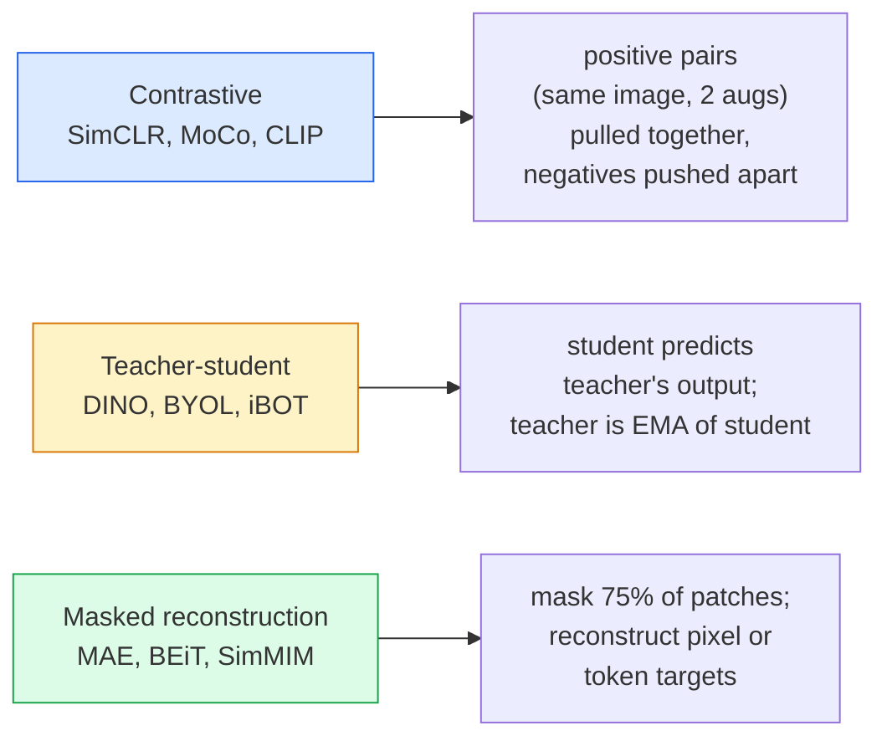

# La visión auto supervisada  SimCLR, DINO, MAE  自监督视觉  SimCLR, DINO, MAE

> Las etiquetas son el cuello de botella de la visión supervisada. El autocontrol pre-entrenamiento las elimina: aprende las características visuales de 100 millones de imágenes sin etiquetar, ajuste a las etiquetadas 10k.

> **【中文解读】**标签是监督学习的瓶──自监督预训练 eliminó esta restricción: de 1 mil millones de张无标签图像中学习视觉特征, luego en 10.000张标签图像上微调──三种主流方法:SimCLR(对比学习)、DINO(自蒸)、MAE(掩码自编码器)──

> **【拓展：自监督学习是 GPT 的秘密】**GPT 就 es un modelo de autocontrol 通过预测下一个词来学习―― en el campo de la visión, MAE 通过预测被遮盖的补丁来学习, DINO 通过自蒸学习语义特征――DINOv2 已成为许多视觉任务的基础模型――

**Type:** Learn + Build | **类型:** 学习 + 动手
**Languages:** Python | **语言:** Python
**Prerequisites:** Phase 4 Lesson 04 (Image Classification), Phase 4 Lesson 14 (ViT) | **前置知识:** Phase 4 Lesson 04（图像分类），Phase 4 Lesson 14（ViT）
**Time:** ~75 minutes | **时间:** ~75 分钟

## Objetivos de aprendizaje

- Rastrear las tres principales familias auto supervisadas  contrastivas (SimCLR), maestras-estudiantes (DINO), reconstrucción enmascarada (MAE)  y indicar lo que cada una optimiza
- Implementar una pérdida de InfoNCE desde cero y explicar por qué un lote de 512 funciona pero un lote de 32 falla
- Explicar por qué la proporción de mascaramiento del 75% de MAE no es arbitraria y cómo difiere del 15% de BERT para el texto
- Utilice los puntos de control DINOv2 o MAE ImageNet para la exploración lineal y la extracción de disparos cero

> **【中文解读】**El objetivo de aprendizaje enumera las capacidades centrales que debe dominarse después de completar la clase.


## El problema es la introducción del problema

Supervised ImageNet tiene 1.3 millones de imágenes etiquetadas, que cuestan aproximadamente 10 millones de dólares para anotear. Los conjuntos de datos médicos e industriales son más pequeños e incluso más caros de etiquetar. Cada equipo de visión pregunta: ¿podemos preentrenar con datos baratos sin etiquetar  Frames de YouTube, rastreos web, imágenes de webcam, barridos por satélite  y luego ajustar en un pequeño conjunto etiquetado?

> 监督式 ImageNet tiene 1.3 millones de imágenes de marcas, estimación de costos de marcas de 1000 millones de dólares. Los conjuntos de datos médicos e industriales son más pequeños, los conjuntos de marcas son más altos.

El aprendizaje auto supervisado es la respuesta. Un ViT moderno auto supervisado entrenado en LAION o JFT alcanza o supera la precisión de ImageNet supervisado cuando se sintoniza. También se transfiere mejor a tareas descendentes (detección, segmentación, profundidad) que el preentrenamiento supervisado. DINOv2 (Meta, 2023) y MAE (Meta, 2022) son los valores predeterminados actuales de producción para las características de visión transferibles.

> La evolución de la evolución de la evolución de la evolución de la evolución de la evolución de la evolución de la evolución de la evolución de la evolución de la evolución de la evolución de la evolución de la evolución de la evolución de la evolución de la evolución de la evolución de la evolución de la evolución de la evolución de la evolución de la evolución de la evolución de la evolución de la evolución de la evolución de la evolución de la evolución de la evolución de la evolución de la evolución de la evolución de la evolución de la evolución de la evolución de la evolución de la evolución de la evolución de la evolución de la evolución de la evolución de la evolución de la evolución de la evolución de la evolución de la evolución de la evolución de la evolución de la evolución de la evolución de la evolución de la evolución de la evolución de la evolución de la evolución de la evolución de la evolución de la evolución de la evolución de la evolución de la evolución de la evolución de la evolución de la evolución de la evolución de la evolución de la evolución de la evolución de la evolución de la evolución de la evolución de la evolución de la evolución de la evolución de la evolución de la evolución de la evolución de la evolución de la evolución de la evolución de la evolución de la evolución de la evolución de la evolución de la evolución de la evolución de la evolución de la evolución de la evolución de la evolución de la evolución de la evolución de la evolución de la evolución de la evolución de la evolución de la evolución de la evolución de la evolución de la evolución de la evolución de la evolución de la evolución de la evolución de la evolución de la evolución de la evolución de la evolución de la evolución de la evolución de la evolución de la evolución de la evolución de la evolución de la evolución de la evolución de la evolución de la evolución de la evolución de la evolución de la evolución de la evolución de la evolución de la evolución de la evolución de la evolución de la evolución de la evolución de la evolución de la evolución de la evolución de la evolución de la evolución de la evolución de la evolución de la evolución de la evolución de la evolución de la evolución de la evolución de la evolución de la evolución de la evolución de la evolución de la evolución de la evolución de la evolución de la evolución de la evolución de la evolución de la evolución de la evolución de la evolución de la evolución de la evolución de la evolución de la evolución de la evolución de la evolución de la evolución de la evolución de la evolución de la evolución de la evolución de la evolución de la evolución de la evolución de la evolución de la evolución de

El cambio conceptual es que la tarea de pretexto  la cosa que el modelo está entrenado para hacer  no tiene que ser la tarea de aguas abajo. Lo importante es que obliga al modelo a aprender características útiles. Prevé el color de las imágenes en escala de grises, gire las imágenes y pídale al modelo que clasifique la rotación, enmasque los parches y los reconstruya  todo ha funcionado. Los tres enfoques que se aplican a esa escala son el aprendizaje contrastivo, la destilación entre profesores y estudiantes y la reconstrucción enmascarada.

> El cambio conceptual es una tarea de preposición El modelo es algo que el entrenador debe hacer no es necesariamente una tarea de baja baja. Lo importante es que impide que el modelo aprenda características útiles.

## El concepto central.

> **【中文解读】**Este capítulo presenta los conceptos y teorías básicos. La comprensión de estos conceptos es el prerrequisito de la realización posterior de la actividad, y también el conocimiento de los puntos de alta frecuencia de la entrevista y la práctica de la ingeniería.


### Tres familias



### Aprendizaje contrastivo (SimCLR)

Tomar una imagen, aplicar dos aumentos aleatorios, obtener dos vistas. alimentar a ambos a través del mismo codificador más una cabeza de proyección. Minimizar una pérdida que dice "estas dos incorporaciones deben estar cerca" y "esta incorporación debe estar lejos de las incorporaciones de todas las otras imágenes en el lote".

> 取一张图像,施加两种随机增强,获得两种视图――将两者通过同一编码器加投影头――将两者通过同一编码器加投影头――将两者通过同一编码器加投影头――将两者通过同一编码器加投影头――将两者通过同一编码器加投影头――将两者通过同一编码器加投影头――将两者通过同一编码器加投影头――将两者通过同一编码器加投影头――将两者通过同一编码器加投影头――将两者通过同一编码器加投影头――将两者通过同一编码器加投影头――将两者通过同一编码器加投影头――将两者减少一个损失函数:"这些两个嵌入应该接近"和"这个嵌入应该远离批次中的所有其他图像嵌入"――

```
Loss for positive pair (z_i, z_j) among 2N views per batch:

   L_ij = -log( exp(sim(z_i, z_j) / tau) / sum_k in batch \ {i} exp(sim(z_i, z_k) / tau) )

sim = cosine similarity
tau = temperature (0.1 standard)
```

Esta es la pérdida de InfoNCE. Requiere muchos negativos por positivo, por lo que el tamaño del lote importa.

> Esto es InfoNCE 损失. Requiere que cada muestra correcta se adapte a muchas muestras negativas, por lo que el tamaño del lote es clave.

### Profesa-estudiante (DINO)

Dos redes con la misma arquitectura: estudiante y maestro. El profesor es un promedio móvil exponencial (EMA) de los pesos del estudiante. Ambos ven vistas aumentadas de la imagen. La salida del estudiante se entrena para que coincida con los  negativos explícitos del profesor.

> 两个 redes de la misma estructura: estudiantes y profesores.  índice de peso del profesor.  Movimiento medio.  EMA.  El peso del estudiante.  Los dos ven imágenes de aumento de peso.  Los resultados de los estudiantes están entrenados para adaptarse a los resultados del profesor.  No hay un patrón negativo evidente. 

```
loss = CE( student_output(view_1),  teacher_output(view_2) )
     + CE( student_output(view_2),  teacher_output(view_1) )

teacher_weights = m * teacher_weights + (1 - m) * student_weights   (m ≈ 0.996)
```

Por qué no se desmorona para "predicir una constante": la producción del profesor se centra (sustraer la media por dimensión) y se afila (dividir por una pequeña temperatura).

> Por qué no se desploma para "previsión constante": el profesor de la producción de la vida de los profesores (<<<<<<<<<<<<<<<<<<<<<<<<<<<<<<<<<<<<<<<<<<<<<<<<<<<<<<<<<<<<<<<<<<<<<<<<<<<<<<<<<<<<<<<<<<<<<<<<<<<<<<<<<<<<<<<<<<<<<<<<<<<<<<<<<<<<<<<<<<<<<<<<<<<<<<<<<<<<<<<<<<<<<<<<<<<<<<<<<<<<<<<<<<<<<<<<<<<<<<<<<<<<<<<<<<<<<<<<<<<<<<<<<<<<<<<<<<<<<<<<<<<<<<<<<<<<<<<<<<<<<<<<<<<<<<<<<<<<<<<<<<<<<<<<<<<<<<<<<<<<<<<<<<<<<<<<<<<<<<<<<<<<<<<<<<<<<<<<<<<<<<<<<<<<<<<<<<<<<<<<<<<<<<<<<<<<<<<<<<>>>>>>>>>>>>>>>>>>>>>> de los niveles> de los niveles> de los niveles> de los niveles de los niveles de los niveles de los niveles de los niveles de los niveles de los niveles de los niveles de los niveles de los niveles de los niveles de los niveles de los niveles de los niveles de los niveles de los niveles de los niveles de los niveles de los niveles de los niveles de los niveles de los niveles de los niveles de los niveles de

DINO es lo que DINOv2 escala, en 142M imágenes seleccionadas. Las características resultantes son la actual SOTA para la recuperación visual de cero disparos y predicción densa.

> DINO es la base de DINOv2, que se expande en 1.42 mil millones de imágenes seleccionadas.

### Reconstrucción enmascarada (MAE)

Enmascarar el 75% de los parches de una entrada ViT. Pasar sólo el 25% visible a través del codificador. Un pequeño decodificador recibe la salida del codificador más tokens de máscara en posiciones enmascaradas, y se entrena para reconstruir los píxeles de los parches enmascarados.

>  ocultar ViT  75%  entrada  reparación  sólo se verá el 25%  a través del codificador                                                                                                                                                                                                                                                                                                                                                                                                                                                                                                    

```
Encoder:  visible 25% of patches -> features
Decoder:  features + mask tokens at masked positions -> reconstructed pixels
Loss:     MSE between reconstructed and original pixels on masked patches only
```

Las opciones clave de diseño que hacen que MAE funcione:

> Para que MAE tenga efecto:

- **75% mask ratio** alto. Oblige al codificador a aprender características semánticas; reconstruir el 25% sería casi trivial (los píxeles vecinos están tan correlacionados que una CNN podría clavarlo).
  En inglés:**75% 掩码率**很高──迫使编码器学习语义特征; reconstruir 25% 几乎是平凡的(相邻像素高度相关, una CNN 就能做到)。
- **Asymmetric encoder/decoder** el gran codificador ViT sólo ve parches visibles; un pequeño decodificador (8 capas, 512-dim) maneja la reconstrucción. 3 veces más rápido preentrenamiento que el ingenuo BEiT.
  En inglés:**非对称编码器/解码器** grandes ViT 编码器只看可见补丁; pequeños解码器(8 层,512 维) procesar la reconstrucción。比朴素BEiT 预训练快3 倍。
- **Pixel-space reconstruction target** más simple que el objetivo tokenizado de BEiT y funciona mejor en ViT.
  En inglés:**像素空间重建目标**                                                                                                                                                                                                                                                              

Después del entrenamiento, descarte el decodificador.

> 预训后丢弃解码器──编码器就是特征提取器──

### ¿Por qué el 75% y no el 15%?

BERT enmascara el 15% de los tokens. MAE enmascara el 75%. La diferencia es la densidad de información.

> BERT oculta 15% de los tokens―MAE oculta 75%―La diferencia está en la densidad de información―

- El lenguaje natural tiene una alta entropía por token. Predicir el 15% de los tokens es todavía difícil porque cada posición enmascarada tiene muchas finalizaciones plausibles.
  China 翻译:自然语言 每个代币的很高──预测 15% 的代币 仍然困难,因为每个被掩盖的位置有很多合理补充──
- Los parches de imagen tienen baja entropía  un vecindario desmascarado a menudo determina los píxeles del parche enmascarado casi exactamente. Para hacer predicciones requieren comprensión semántica, hay que enmascarar agresivamente.
  China Translation: Los vecinos de los ajustes de imágenes 低未掩蔽的邻域通常几乎完全决定了被掩盖补丁的像素── para hacer que el pronóstico necesite un entendimiento de la lengua, debe ser activamente ocultado──

El 75% es lo suficientemente alto como para que una simple extrapolación espacial no pueda resolver la tarea; el codificador debe representar el contenido de la imagen.

> El 75% de alto a simple de espacio fuera de la aplicación no puede resolver tareas; el codificador debe mostrar el contenido de la imagen.

### Evaluación de la sonda lineal

Después de una preparación de autocontrol, la evaluación estándar es una evaluación de la calidad de la formación.**linear probe**: congelar el codificador, entrenar un único clasificador lineal en la parte superior de las etiquetas de ImageNet.

> Después de la formación, la evaluación está en el estándar.**线性探测**结编码器, 标签上训练单个线性分类器, 结编码器, 标签上训练单个线性分类器, 报告 top-1 准确率, 标签上训练单个线性分类器, 标签上训练单个线性分类器, 标签上训练单个线性分类器, 标签上训练单个线性分类器, 标签上训练单个线性分类器, 标签上训练单个线性分类器, 标签上编码器, 标签上训练单个线性分类器, 标签上分类器, 标签上编码器, 标签上编码器, 标签上编码率, 标签上准确率, 标签上准确率, 标签上 标签上 标签上 标签上 标签

- Resnet-50 de SimCLR: ~71% (2020)
- DINO ViT-S/16: ~77% (2021)
- MAE ViT-L/16: ~76% (2022)
- DINOv2 ViT-g/14: ~86% (2023)

La sonda lineal es una medida pura de la calidad de las características; el ajuste fino generalmente agrega 2-5 puntos, pero también se mezcla en el efecto de la reentrenamiento de la cabeza.

> La detección lineal es una medida pura de la calidad de las características; las pequeñas modificaciones suelen aumentar de 2 a 5 puntos porcentuales, pero también mezclan los efectos del entrenamiento de la cabeza.

> **【拓展：工业部署中的视觉系统】**En la implementación industrial real, los modelos de visión necesitan considerar la posibilidad de retraso, el tamaño del modelo, la adaptación de los dispositivos de borde, etc. TensorRT, ONNX Runtime, OpenVINO son herramientas de aceleración de la teoría de uso habitual.

> **【拓展：数据标注与质量】**视觉任务的效果高度依赖标签数据质量──标签工作室、CVAT es la principal herramienta de marcado──在工业场景中,主动学习(Active Learning) puede reducir el costo de marcado: modelo a un requerimiento de muestras indeterminadas, marcación automática de muestras de determinación──


## Construye y realiza.

> **【中文解读】**Este capítulo a través del código de la implementación de algoritmos centrales de cero. Este método "desde cero" puede ayudar a entender el principio detrás del marco, no se encuentra en la caja negra cuando se encuentran problemas.

```figure
data-augmentation
```

## Construye el mismo

### Paso 1: Pipeline de aumento de dos vistas

```python
import torch
import torchvision.transforms as T

two_view_train = lambda: T.Compose([
    T.RandomResizedCrop(96, scale=(0.2, 1.0)),
    T.RandomHorizontalFlip(),
    T.ColorJitter(0.4, 0.4, 0.4, 0.1),
    T.RandomGrayscale(p=0.2),
    T.ToTensor(),
])


class TwoViewDataset(torch.utils.data.Dataset):
    def __init__(self, base):
        self.base = base
        self.aug = two_view_train()

    def __len__(self):
        return len(self.base)

    def __getitem__(self, i):
        img, _ = self.base[i]
        v1 = self.aug(img)
        v2 = self.aug(img)
        return v1, v2
```

Cada uno .__getitem__devuelve dos vistas aumentadas de la misma imagen; no se necesitan etiquetas.

> Cada vez que`__getitem__` Retorno dos imágenes de la misma imagen; no necesita etiqueta

### Paso 2: pérdida de InfoNCE

```python
import torch.nn.functional as F

def info_nce(z1, z2, tau=0.1):
    """
    z1, z2: (N, D) L2-normalised embeddings of paired views
    """
    N, D = z1.shape
    z = torch.cat([z1, z2], dim=0)  # (2N, D)
    sim = z @ z.T / tau              # (2N, 2N)

    mask = torch.eye(2 * N, dtype=torch.bool, device=z.device)
    sim = sim.masked_fill(mask, float("-inf"))

    targets = torch.cat([torch.arange(N, 2 * N), torch.arange(0, N)]).to(z.device)
    return F.cross_entropy(sim, targets)
```

L2 normaliza las incorporaciones antes de llamar. `tau=0.1`es el valor imprevista de SimCLR; más bajo hace que la pérdida sea más nítida y requiere más negativos.

> 调用前对嵌做 L2 归一化──`tau=0.1`Es el valor de la SimCLR; cuanto menor sea la pérdida, más alto será el nivel de pérdida.

### Paso 3: Verificación de la cordura

```python
z1 = F.normalize(torch.randn(16, 32), dim=-1)
z2 = z1.clone()
loss_same = info_nce(z1, z2, tau=0.1).item()
z2_random = F.normalize(torch.randn(16, 32), dim=-1)
loss_random = info_nce(z1, z2_random, tau=0.1).item()
print(f"InfoNCE with identical pairs:  {loss_same:.3f}")
print(f"InfoNCE with random pairs:     {loss_random:.3f}")
```

Los pares idénticos deben dar una baja pérdida (cerca de 0 para un lote grande y temperatura fría). los pares aleatorios deben dar log(2N-1) = ~log(31) = ~3.4 con un lote de 16 pares.

> Para la producción de productos de la industria de la industria de la producción, el consumo de productos de la industria de la industria de la industria de la producción de productos de la industria de la industria de la producción de productos de la industria de la industria de la producción de la industria de la industria de la producción de productos de la industria de la industria de la producción de la industria de la industria de la producción de productos de la industria de la industria de la producción de la industria de la industria de la producción de productos de la industria de la industria de la industria de la producción de la industria de la industria de la industria de la industria de la producción de la industria de la industria de la industria de la industria de la industria de la industria de la industria de la industria de la industria de la industria de la industria de la industria de la industria de la industria de la industria de la industria de la industria de la industria de la industria de la industria de la industria de la industria de la industria de la industria de la industria de la industria de la industria de la industria de la industria de la industria de la industria de la industria de la industria de la industria de la industria de la industria de la industria de la industria de la industria de la industria de la industria de la industria de la industria de la industria de la industria de la industria de la industria de la industria de la industria de la industria de la industria de la industria de la industria de la industria de la industria de la industria de la industria de la industria de la industria de la industria de la industria de la industria de la industria de la industria de la industria de la industria de la industria de la del sur.

### Paso 4: Enmascaramiento al estilo MAE

```python
def random_mask_indices(num_patches, mask_ratio=0.75, seed=0):
    g = torch.Generator().manual_seed(seed)
    n_keep = int(num_patches * (1 - mask_ratio))
    perm = torch.randperm(num_patches, generator=g)
    visible = perm[:n_keep]
    masked = perm[n_keep:]
    return visible.sort().values, masked.sort().values


num_patches = 196
visible, masked = random_mask_indices(num_patches, mask_ratio=0.75)
print(f"visible: {len(visible)} / {num_patches}")
print(f"masked:  {len(masked)} / {num_patches}")
```

> **【中文解读】**Este capítulo muestra cómo utilizar un marco maduro (como PyTorch、HuggingFace, etc.) para aplicar rápidamente esta tecnología. En los proyectos reales, se realiza con prioridad el uso de un marco experimentado, se pueden reducir errores y mejorar la eficiencia de desarrollo.


Las implementaciones reales de MAE hacen esto en lote y mantienen máscaras por muestra.

> 简单、快速、对给定种子确定性―― MAE 实际实现会批量处理并保留每个样本的掩码――


> **【拓展：视觉模型的持续学习】**En el entorno de producción, el modelo visual necesita adaptarse continuamente a nuevos datos. Esto es especialmente importante en la conducción automotriz y el control de calidad industrial.

## Usalo con el marco de ejecución

DINOv2 es el estándar de producción en 2026:

```python
import torch
from transformers import AutoImageProcessor, AutoModel

processor = AutoImageProcessor.from_pretrained("facebook/dinov2-base")
model = AutoModel.from_pretrained("facebook/dinov2-base")
model.eval()

# Per-image embeddings for zero-shot retrieval
with torch.no_grad():
    inputs = processor(images=[pil_image], return_tensors="pt")
    outputs = model(**inputs)
    embedding = outputs.last_hidden_state[:, 0]  # CLS token
```

La incorporación de 768 dimensiones resultante es la columna vertebral de la recuperación de imágenes moderna, la correspondencia densa y las tuberías de transferencia de disparos cero.

Para las incorporaciones de texto en imágenes, SigLIP o OpenCLIP es el equivalente; para la ajuste fino de estilo MAE, el `timm`Repo envían a todos los puntos de control de MAE.

> **【中文解读】**Este capítulo se centra en cómo se puede implementar el modelo como producto disponible. Desde el modelo original hasta el sistema de producción, se deben considerar múltiples dimensiones de optimización de rendimiento, tratamiento de errores, control, etc.


## Envíe el producto .

> **【中文解读】**Practice los temas de fácil/medio/duro  3 difficulty to pass in  Recomenda al menos completar los temas de grado medio  Grado duro  para la preparación de la entrevista


Esta lección produce:

- `outputs/prompt-ssl-pretraining-picker.md` una solicitud que selecciona SimCLR / MAE / DINOv2 dado el tamaño del conjunto de datos, el cálculo y la tarea descendente.
- `outputs/skill-linear-probe-runner.md` una habilidad que escribe la evaluación de la sonda lineal para cualquier codificador congelado + conjunto de datos etiquetado.

## Los ejercicios.

1. **(Easy)**Verifique si la pérdida de InfoNCE disminuye cuando disminuye la temperatura para los embebidos bien alineados y aumenta cuando disminuye la temperatura para los embebidos aleatorios.`tau in [0.05, 0.1, 0.2, 0.5]`contra la pérdida.
2. **(Medium)**Implemente un amortiguador de centro al estilo DINO. Muestre que sin el centrar, el estudiante se desploma a un vector constante en unas pocas épocas.
3. **(Hard)**Entrenar a MAE en CIFAR-100 utilizando la TinyUNet de la Lección 10 como la columna vertebral. Reporte la precisión de la sonda lineal en 10, 50 y 200 épocas. Muestre que una sonda lineal entrenada por MAE supera a una sonda lineal supervisada desde cero en el mismo subconjunto de 1.000 imágenes.

> **【中文解读】**En el lenguaje de los términos "Lo que la gente dice" vs "Lo que realmente significa" se distingue entre el lenguaje diario y la definición técnica de significado.


## Términos clave .

| Term | What people say | What it actually means |
|------|----------------|----------------------|
| Self-supervised | "Label-free" | A pretext task that produces useful representations from unlabelled data |
| Pretext task | "The fake task" | The objective used during SSL (reconstruct patches, match views); discarded after pretraining |
| Linear probe | "Frozen encoder + linear head" | Standard SSL evaluation: train only a linear classifier on top of frozen features |
| InfoNCE | "Contrastive loss" | softmax over cosine similarities; positive pair is the target class, all others are negatives |
| EMA teacher | "Moving-average teacher" | Teacher whose weights are an exponential moving average of the student's; used by BYOL, MoCo, DINO |
| Mask ratio | "% of patches hidden" | Fraction of patches masked during MAE; 75% for vision, 15% for text |
| Representation collapse | "Constant output" | SSL failure where the encoder outputs a constant vector for all inputs; prevented by centring, sharpening, or negatives |
| DINOv2 | "Production SSL backbone" | Meta's 2023 self-supervised ViT; strongest general-purpose image features in 2026 |

> **【中文解读】**延伸阅读 proporciona un alto nivel de recursos para el aprendizaje profundo. Estos artículos y cursos son los referentes clásicos en el campo, adecuados para los lectores que necesitan una comprensión profunda.


## Más Leer más Leer más

- [SimCLR (Chen et al., 2020)](https://arxiv.org/abs/2002.05709) Referencia de aprendizaje contrastable
- [DINO (Caron et al., 2021)](https://arxiv.org/abs/2104.14294) docente-estudiante con impulso, centrarse, afilarse
- [MAE (He et al., 2022)](https://arxiv.org/abs/2111.06377) Autoencoder enmascarado preentrenamiento para ViT
- [DINOv2 (Oquab et al., 2023)](https://arxiv.org/abs/2304.07193) La escalación de las VIT auto supervisadas a las características de producción
