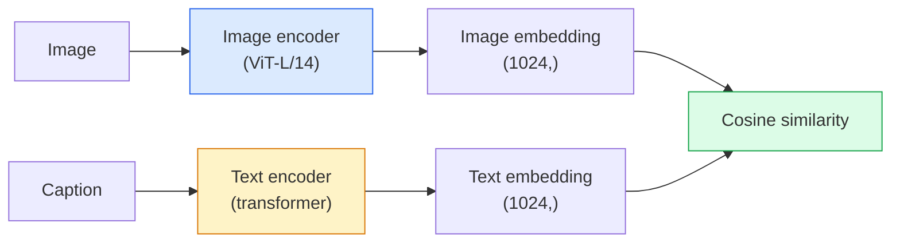

# Visión de vocabulario abierto  CLIP  开放词汇视觉  CLIP

> Entrenar un codificador de imágenes y un codificador de texto juntos para que los pares de coincidencias (imagen, leyenda) aterricen en el mismo punto en un espacio compartido. Ese es todo el truco.

> **【中文解读】**CLIP con el mismo tiempo de entrenamiento de la codificación de imágenes y el codificador de texto, que hace coincidencias de las imágenes, descripciones) a los mismos puntos de la caída en el espacio compartido.

> **【拓展：CLIP 是多模态 AI 的基石】**CLIP es el componente básico de los modelos de DALL-E, LaVA, GPT-4V, etc. Su uso es muy amplio, lo que ha dado lugar a la creación de un nuevo modelo de la visión de "Open Word" que puede comprender conceptos nunca antes vistos en el entrenamiento.

**Type:** Build + Use | **类型:** 动手 + 应用
**Languages:** Python | **语言:** Python
**Prerequisites:** Phase 4 Lesson 14 (ViT), Phase 4 Lesson 17 (Self-Supervised) | **前置知识:** Phase 4 Lesson 14（ViT），Phase 4 Lesson 17（自监督）
**Time:** ~45 minutes | **时间:** ~45 分钟

## Objetivos de aprendizaje

- Explicar la arquitectura de dos torres del CLIP y el objetivo de formación contrastada
- Utilice un CLIP (o SigLIP) pre-entrenado para la clasificación de tiro cero sin ningún entrenamiento específico de tarea
- Implementar la clasificación de tiro cero desde cero: codificar las instrucciones de clase, calcular la similitud cosina, tomar argmax
- Distinguir entre los modelos de visión CLIP, SigLIP, OpenCLIP y LLaVA/LLaMA  para qué se destina cada uno en 2026

> **【中文解读】**El objetivo de aprendizaje enumera las capacidades centrales que debe dominarse después de completar la clase.


## El problema es la introducción del problema

Los clasificadores tradicionales son un vocabulario cerrado: un modelo de 1000 clases de ImageNet solo puede predecir 1000 etiquetas.

> 传统分类器是封闭词汇的:1000 类的 ImageNet 模型只能预测1000 标签──每一个新类都需要标签数据和重新训练的头部──

CLIP (Radford et al., OpenAI 2021) mostró que el entrenamiento en 400M (imagen, leyenda) pares arrancados de la web produce un modelo que puede clasificar en cualquier conjunto de categorías a la inferencia, descrito puramente en lenguaje natural.

> CLIP(Radford etc,OpenAI 2021) indica que en 400 millones de imágenes, títulos y títulos obtenidos de la red, los modelos de los entrenamientos anteriores pueden ser divididos en cualquier tipo de colección, en lenguaje natural.

Esta capacidad  transferencia de disparos cero  es la razón por la que cada sistema de visión moderno comienza con un punto de control de la familia CLIP. La detección (Grounding DINO, OWL-ViT), la segmentación (CLIPSeg, SAM), la recuperación, la moderación de contenido, VLMs y la generación de texto a imagen se basan en embebedidos conjuntos de estilo CLIP.

> Ese es el motivo por el cual cada sistema de visión moderno se inicia desde el punto de inspección de CLIP.

## El concepto central.

> **【中文解读】**Este capítulo presenta los conceptos y teorías básicos. La comprensión de estos conceptos es el prerrequisito de la realización posterior de la actividad, y también el conocimiento de los puntos de alta frecuencia de la entrevista y la práctica de la ingeniería.


### Dos torres



Ambos codificadores terminan con una proyección lineal a la misma dimensión de incorporación (512 para CLIP-B/32, 1024 para CLIP-L/14).

>  dos codificadores están en línea proyectados hasta la misma dimensión de inserción terminando  CLIP-B/32 para 512 维, CLIP-L/14 para 1024 维)  L2 归结后计算余弦相似度

### El objetivo

Dado un lote de pares N (imagen, leyenda) construye una matriz de similitud NxN. Entrenar ambos codificadores para que la diagonal (pares coincidentes) tenga una alta similitud y los fuera de diagonales (no coincidentes) tengan una baja similitud.

> 给定一批 N 个 (图像,标题) 对,构建 NxN相似度矩阵――训练两个编码器使对角线 (编码器) 匹配对) 相似度高,非对角线 (非对角线) 匹配对) 相似度低――

```
sim_matrix = image_embeddings @ text_embeddings.T / tau

loss_i2t = cross_entropy(sim_matrix,       targets=arange(N))
loss_t2i = cross_entropy(sim_matrix.T,     targets=arange(N))
loss = (loss_i2t + loss_t2i) / 2
```

Simétrico porque tanto la extracción de imagen a texto como de texto a imagen deberían funcionar. `tau`(temperatura) se aprende típicamente como un parámetro escalar, iniciado en 0,07.

> Se dice que la búsqueda de imágenes en texto y texto en imagen debe ser válida.`tau`(temperatura) normalmente como estándar para el estudio de matemáticas, iniciación es de 0.07。

### Siglip: una mejor pérdida

SigLIP (Zhai et al., 2023) sustituyó la softmax por sigmoide por pareja:

> SigLIP ((Zhai etc,2023) se sustituye por el sigmoide por el softmax:

```
loss = mean over pairs of log(1 + exp(-y_ij * sim_ij))
y_ij = +1 if matching, -1 otherwise
```

La pérdida por pareja elimina la normalización a nivel de lote que requiere CLIP. SigLIP se entraña mejor en pequeños lotes y coincide o supera CLIP en datos iguales.

>  Perdiendo por pérdida se elimina la integración de los grupos de CLIP.  SigLIP en pequeños grupos de formación mejor, en los mismos datos de la misma o más CLIP

### Clasificación de tiro cero

Dado un CLIP capacitado:

> 给定训练好的Clip:

1. Para cada clase, compón una invitación: "una foto de una {clase}".
   Por ejemplo, el nombre de la foto de un grupo de personas que se encuentran en el centro de la ciudad de Nueva York.
2. Encienda todas las instrucciones de clase con el codificador de texto -> `T`forma (C, d).
   En inglés, el nombre de la palabra "página" se refiere a la palabra "página" en inglés.`T`形状 (C, d)
3. Encifrar la imagen de prueba -> `I`forma (1, d).
   En inglés, el nombre de la persona que se encuentra en el mapa es el nombre de la persona que aparece en el mapa.`I`形状 (1, d) ⋅
4. Similaridad = `I @ T.T`forma (1, C).
   En el idioma chino, el idioma es el idioma de la lengua china.`I @ T.T`形状 (1, C) ⋅
5. Argmax -> clase prevista.
   En el caso de los ejemplos de la lengua inglesa, el nombre de la lengua inglesa es "Argmax".

Las preguntas de ingeniería de la instantánea. OpenAI publicó 80 plantillas de la instantánea para ImageNet ("una foto de un {}", "una foto borrosa de un {}", "un boceto de un {}", ...).

> 提示词工程很重要――OpenAI 为ImageNet 发布了80 提示模板――将每类所有模板嵌入取平均可以额外提升1-3% 的 top-1 准确率――

### En el que se utilicen modelos CLIP en 2026

- **Zero-shot classification** uso directo.
  En inglés:**零样本分类** directa utilización。
- **Image retrieval** codificar todas las imágenes una vez, incrustar la consulta en la inferencia.
  En inglés:**图像检索** Una vez codificar todas las imágenes, sugerir tiempo de inserción en la consulta.
- **Text-conditioned detection** Al aterrizar DINO, OWL-ViT envuelve una torre de texto CLIP alrededor de un detector.
  En inglés:**文本条件检测**Grounding DINO、OWL-ViT 在检测器外包装 CLIP 文本塔──
- **Text-conditioned segmentation** CLIPSeg; SAM utiliza entradas de texto a través de CLIP.
  En inglés:**文本条件分割**CLIPSeg;SAM 通过 CLIP 使用文本提示输入。
- **VLMs** LLaVA, Qwen-VL, InternVL incorporan un codificador de visión de la familia CLIP en un LLM.
  En inglés:**VLM**LLaVA、Qwen-VL、InternVL se conectará a la LLM
- **Text-to-image gen** Difusión estable, condición DALL-E 3 en las incorporaciones de texto CLIP.
  En inglés:**文本到图像生成**Difusión estable、DALL-E 3  basado en CLIP 文本嵌入进行条件化──

Una vez que tienes un espacio de incorporación compartido, cada tarea de visión+idioma se convierte en un cálculo de distancia.

> Una vez que se tiene un espacio compartido, cada tarea de visión + lenguaje se convierte en un cálculo de distancia.

> **【中文解读】**Este capítulo a través del código de la implementación de algoritmos centrales de cero. Este método "desde cero" puede ayudar a entender el principio detrás del marco, no se encuentra en la caja negra cuando se encuentran problemas.

> **【拓展：工业部署中的视觉系统】**En la implementación industrial real, los modelos de visión necesitan considerar la posibilidad de retraso, el tamaño del modelo, la adaptación de los dispositivos de borde, etc. TensorRT, ONNX Runtime, OpenVINO son herramientas de aceleración de la teoría de uso habitual.

> **【拓展：数据标注与质量】**视觉任务的效果高度依赖标签数据质量──标签工作室、CVAT es la principal herramienta de marcado──在工业场景中,主动学习(Active Learning) puede reducir el costo de marcado: modelo a un requerimiento de muestras indeterminadas, marcación automática de muestras de determinación──


## Construye y realiza.
```figure
clip-contrastive
```

## Construye el mismo

### Paso 1: Un pequeño modelo de dos torres

Para esta lección las torres son pequeñas MLP sobre las características pre-extractadas para que la señal de entrenamiento sea visible en la CPU.

> El verdadero CLIP es ViT + Transformer. La torre de este curso es una pequeña MLP en el que se pre-extraen las características, para que pueda ver las señales de entrenamiento en la CPU.

```python
import torch
import torch.nn as nn
import torch.nn.functional as F


class TwoTower(nn.Module):
    def __init__(self, img_in=128, txt_in=64, emb=64):
        super().__init__()
        self.image_proj = nn.Sequential(nn.Linear(img_in, 128), nn.ReLU(), nn.Linear(128, emb))
        self.text_proj = nn.Sequential(nn.Linear(txt_in, 128), nn.ReLU(), nn.Linear(128, emb))
        self.logit_scale = nn.Parameter(torch.ones([]) * 2.6592)  # ln(1/0.07)

    def forward(self, img_feats, txt_feats):
        i = F.normalize(self.image_proj(img_feats), dim=-1)
        t = F.normalize(self.text_proj(txt_feats), dim=-1)
        return i, t, self.logit_scale.exp()
```

Dos proyecciones, salida compartida, temperatura aprendida, la misma forma que la API CLIP real.

> 两个 proyecciones 共享维度输出 可学习温度── es la misma forma que la verdadera API CLIP 

### Paso 2: pérdida de contraste

```python
def clip_loss(image_emb, text_emb, logit_scale):
    N = image_emb.size(0)
    sim = logit_scale * image_emb @ text_emb.T
    targets = torch.arange(N, device=sim.device)
    l_i = F.cross_entropy(sim, targets)
    l_t = F.cross_entropy(sim.T, targets)
    return (l_i + l_t) / 2
```

Simétrico. Escala de logit_más alta = más afilada softmax = más seguro pero riesgo de inestabilidad.

> Más alto logit_scale = más alto softmax = más confianza pero hay un riesgo poco estable.

### Paso 3: Clasificador de disparos cero

```python
@torch.no_grad()
def zero_shot_classify(model, image_feats, class_text_feats, class_names):
    """
    image_feats:      (N, img_in)
    class_text_feats: (C, txt_in)   one averaged embedding per class
    """
    i = F.normalize(model.image_proj(image_feats), dim=-1)
    t = F.normalize(model.text_proj(class_text_feats), dim=-1)
    sim = i @ t.T
    pred = sim.argmax(dim=-1)
    return [class_names[p] for p in pred.tolist()]
```

Una línea por paso. Este es el procedimiento exacto de tiro cero utilizado con un punto de control CLIP de producción.

> Cada paso de la línea. Este es el proceso de producción de la clase CLIP de control de punto de uso.

### Paso 4: Verificación de la salud mental

```python
torch.manual_seed(0)
model = TwoTower()

img = torch.randn(8, 128)
txt = torch.randn(8, 64)
i, t, scale = model(img, txt)
loss = clip_loss(i, t, scale)
print(f"batch size: {i.size(0)}   loss: {loss.item():.3f}")
```

La pérdida debe estar cerca de `log(N) = log(8) = 2.08`para un modelo iniciado al azar  el objetivo de entropía cruzada simétrica cuando aún no se aprende estructura.

>  Con el tiempo de inicio de los modelos de pérdida se debe acercar `log(N) = log(8) = 2.08` aún no se ha aprendido a la estructura                                                                                                                                                                                                                                                          

> **【中文解读】**Este capítulo muestra cómo utilizar un marco maduro (como PyTorch、HuggingFace, etc.) para aplicar rápidamente esta tecnología. En los proyectos reales, se realiza con prioridad el uso de un marco experimentado, se pueden reducir errores y mejorar la eficiencia de desarrollo.


> **【拓展：视觉模型的持续学习】**En el entorno de producción, el modelo visual necesita adaptarse continuamente a nuevos datos. Esto es especialmente importante en la conducción automotriz y el control de calidad industrial.

## Usalo con el marco de ejecución

OpenCLIP es el estándar de la comunidad en 2026:

```python
import open_clip
import torch
from PIL import Image

model, _, preprocess = open_clip.create_model_and_transforms("ViT-B-32", pretrained="laion2b_s34b_b79k")
tokenizer = open_clip.get_tokenizer("ViT-B-32")

image = preprocess(Image.open("dog.jpg")).unsqueeze(0)
text = tokenizer(["a photo of a dog", "a photo of a cat", "a photo of a car"])

with torch.no_grad():
    image_features = model.encode_image(image)
    text_features = model.encode_text(text)
    image_features = image_features / image_features.norm(dim=-1, keepdim=True)
    text_features = text_features / text_features.norm(dim=-1, keepdim=True)
    probs = (100.0 * image_features @ text_features.T).softmax(dim=-1)

> **【中文解读】** 本节关注如何将模型部署为可用的产品。从原型到生产级系统需要考虑性能优化、错误处理、监控等多个维度。


print(probs)
```

SigLIP es más nuevo, se entrena mejor a pequeñas escalas y se prefiere para nuevos trabajos: `google/siglip-base-patch16-224`Abrazando a las dos naves.


## Envíe el producto .

> **【中文解读】**Practice los temas de fácil/medio/duro  3 difficulty to pass in  Recomenda al menos completar los temas de grado medio  Grado duro  para la preparación de la entrevista


Esta lección produce:

- `outputs/prompt-zero-shot-class-picker.md` un prompt que diseña plantillas de clases para CLIP de tiro cero dado una lista de clases y un dominio.
- `outputs/skill-image-text-retriever.md` una habilidad que construye un índice de incorporación de imágenes con cualquier punto de control CLIP, soporta consulta por texto y consulta por imagen.

## Los ejercicios.

1. **(Easy)**Utilice un OpenCLIP ViT-B/32 preentrenado y haga una clasificación de tiro cero en CIFAR-10 con el conjunto de instrucciones de 80 plantillas.
2. **(Medium)**Comparar una sola plantilla ("una foto de un {}") con 80 plantillas promediadas de la misma tarea CIFAR-10. Cuantifique la brecha y explique por qué las plantillas ayudan.
3. **(Hard)**Construir un índice de recuperación de imágenes de cero disparos: embebar 1.000 imágenes con CLIP, crear un índice FAISS, consulta con una descripción de lenguaje natural.

> **【中文解读】**En el lenguaje de los términos "Lo que la gente dice" vs "Lo que realmente significa" se distingue entre el lenguaje diario y la definición técnica de significado.


## Términos clave .

| Term | What people say | What it actually means |
|------|----------------|----------------------|
| Two-tower | "Dual encoder" | Separate image and text encoders ending in a shared-dim projection head |
| Zero-shot | "No task-specific training" | Classify into classes described only by text at inference; no labels touched |
| Temperature / logit_scale | "tau" | Learned scalar that scales the similarity matrix before softmax |
| Prompt template | "A photo of a {}" | Natural-language wrapper around class names; averaging many templates boosts zero-shot accuracy |
| CLIP | "Image+text model" | The 2021 OpenAI model; vocabulary of the field in 2026 |
| SigLIP | "Sigmoid CLIP" | Swaps softmax for per-pair sigmoid; trains better at small batches |
| OpenCLIP | "Open reproduction" | Community-trained CLIP variants on LAION; production default for open-source pipelines |
| VLM | "Vision-language model" | A CLIP-family encoder plus an LLM, trained to answer questions about images |

> **【中文解读】**延伸阅读 proporciona un alto nivel de recursos para el aprendizaje profundo. Estos artículos y cursos son los referentes clásicos en el campo, adecuados para los lectores que necesitan una comprensión profunda.


## Más Leer más Leer más

- [CLIP: Learning Transferable Visual Models from Natural Language Supervision (Radford et al., 2021)](https://arxiv.org/abs/2103.00020)
- [SigLIP: Sigmoid Loss for Language-Image Pre-Training (Zhai et al., 2023)](https://arxiv.org/abs/2303.15343)
- [OpenCLIP](https://github.com/mlfoundations/open_clip) la base de código de la comunidad
- [DINOv2 vs CLIP vs MAE: a features comparison](https://huggingface.co/blog/dinov2) Guía de HF con casos de uso paralelos
