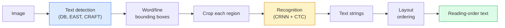

# OCR y comprensión de documentos OCR y comprensión de archivos

> OCR es un sistema de tres etapas que detecta las cajas de texto, reconoce los caracteres y luego las coloca.

> **【中文解读】**OCR(Locaridad de caracteres) es un proceso de tres fases: la detección de un texto en el cuadro → la detección de un caracteres en el cuadro → el análisis de la estructura.

> **【拓展：文档理解的金融应用】**El conocimiento de los documentos y los OCR tiene una amplia aplicación en el ámbito financiero: el conocimiento de los flujos de información y de las transacciones, el procesamiento automático de los contratos, la revisión inteligente de los informes financieros, el análisis de los modelos de diseño de los documentos y de los documentos, la integración de la información visual y del texto, y la comprensión de los documentos de extremo a extremo.

**Type:** Learn + Use | **类型:** 学习 + 应用
**Languages:** Python | **语言:** Python
**Prerequisites:** Phase 4 Lesson 06 (Detection), Phase 7 Lesson 02 (Self-Attention) | **前置知识:** Phase 4 Lesson 06（目标检测），Phase 7 Lesson 02（自注意力）
**Time:** ~45 minutes | **时间:** ~45 分钟

## Objetivos de aprendizaje

- Reconocer la línea de OCR clásica (detect -> recognize -> layout) y las alternativas modernas de extremo a extremo (Donut, Qwen-VL-OCR)
- Implementar la pérdida de CTC (Clasificación temporal de conectividad) para la formación de secuencias de secuencias en OCR
- Utilice PaddleOCR o EasyOCR para el análisis de documentos de producción sin formación
- Distinguir entre OCR, análisis de diseño y comprensión de documentos  y elegir la herramienta correcta por tarea

> **【中文解读】**El objetivo de aprendizaje enumera las capacidades centrales que debe dominarse después de completar la clase.


## El problema es la introducción del problema

Las imágenes llenas de texto están en todas partes: recibos, facturas, documentos de identificación, libros escaneados, formularios, cuadros blancos, pancartas, capturas de pantalla. Extraer datos estructurados de ellos  no sólo los caracteres, sino "esta es la cantidad total"  es uno de los problemas de visión aplicada de mayor valor.

> 充满文字的图像无处不在:收据,发票,身份证,扫描书籍,表格,白板,标志,截图. 从中提取结构化数据不仅是字符,而是"这是总金额"是应用视觉问题之一.

El campo se divide en tres capas de habilidad:

> El ámbito se divide en tres niveles de habilidades:

1. **OCR proper**: convertir los píxeles en texto.
2. **Layout parsing**: la salida de OCR de grupo en regiones (título, cuerpo, tabla, encabezado).
3. **Document understanding**: extraer campos estructurados ("factura_total = $42.50") del diseño.

Cada capa tiene enfoques clásicos y modernos, y la brecha entre "Quiero texto de una imagen" y "Necesito la cantidad total de este recibo" es mayor de lo que la mayoría de los equipos se dan cuenta.

> Cada nivel tiene métodos clásicos y modernos, la diferencia entre "Quiero obtener textos de imágenes" y "Necesito la cantidad total de esta recepción" es mayor que lo que la mayoría de los equipos se dieron cuenta.

## El concepto central.

> **【中文解读】**Este capítulo presenta los conceptos y teorías básicos. La comprensión de estos conceptos es el prerrequisito de la realización posterior de la actividad, y también el conocimiento de los puntos de alta frecuencia de la entrevista y la práctica de la ingeniería.


### El oleoducto clásico



- **Text detection**produce cuadrilateros por línea o por palabra.
  En inglés:**文本检测**Se produce en cada línea o cada palabra en un cuadro de cuatro lados.
- **Recognition**cultiva cada región a una altura fija, ejecuta una CNN + BiLSTM + CTC para producir una secuencia de caracteres.
  En inglés:**识别**Cortar cada área a una altura fija, operar CNN + BiLSTM + CTC 生成字符序列──
- **Layout**reconstruye el orden de lectura (de arriba a abajo, de izquierda a derecha para el latín; diferente para el árabe, japonés).
  En inglés:**布局**重建阅读顺序(Latin文从上到下、从左到右; Arabic文和日文不同)

### CTC en un párrafo

El reconocimiento OCR produce una secuencia de longitud variable a partir de un mapa de características de longitud fija. CTC (Graves et al., 2006) le permite entrenar esto sin alineación a nivel de caracteres. El modelo saca una distribución sobre (vocab + blanco) en cada paso de tiempo; la pérdida CTC marginaliza sobre todas las alineaciones que se reducen al texto objetivo después de fusionar repeticiones y eliminar espacios en blanco.

> OCR Identificación de la distribución de los caracteres de longitud fija de la gráfica de generación de secuencias de longitud variable. CTC(Graves etc., 2006) hacer que no se necesite un grado de caracteres en el texto de la instrucción de forma conjunta.

```
raw output: "h h h _ _ e e l l _ l l o _ _"
after merge repeats and remove blanks: "hello"
```

La CTC es la razón por la que CRNN trabajó en 2015 y todavía entrena a la mayoría de los modelos de producción OCR en 2026.

> CTC es el motivo por el que CRNN está vigente en 2015 y todavía está entrenando en 2026 la mayoría de la producción de modelos OCR.

### Modelos modernos de extremo a extremo

- **Donut**(Kim et al., 2022)  un codificador ViT + un decodificador de texto; lee una imagen y emite JSON directamente.
  En inglés:**Donut**(Kim 等,2022) ViT 编码器 + 文本解码器;读取图像直接输出 JSON──无需文本检测器或布局模块──
- **TrOCR** Decodificador de transformador ViT + para OCR de nivel de línea.
  En inglés:**TrOCR**ViT + Transformer 解码器, para uso en el OCR de la clase de ejecución
- **Qwen-VL-OCR / InternVL** modelos completos de lenguaje de visión ajustados para las tareas de OCR; mejor precisión en 2026 en documentos complejos.
  En inglés:**Qwen-VL-OCR / InternVL** Modelo de lenguaje visual completo para la tarea de OCR; 2026 años en el archivo complejo máxima precisión.
- **PaddleOCR** el oleoducto clásico DB + CRNN en un paquete de producción maduro; todavía el caballo de trabajo de código abierto.
  En inglés:**PaddleOCR**Clásico DB + CRNN 流水线; todavía es de origen abierto

Los modelos de extremo a extremo necesitan más datos y cálculo, pero no se debe acumular errores en las tuberías de múltiples etapas.

> El modelo de extremo a extremo necesita más datos y cálculos, pero se ha superado los errores acumulados de la línea de flujo de varios etapas.

### Parse de diseño

Para documentos estructurados, ejecuta un detector de diseño (LayoutLMv3, DocLayNet) que etiqueta cada región: Título, párrafo, figura, tabla, nota a pie de página.

> 对于结构化文档,运行布局检测器(LayoutLMv3、DocLayNet) marque cada región: título,段落,图,表,脚注.

Para los formularios, utilizar **Key-Value extraction**Los modelos (Donut para documentos ricos en visualización, LayoutLMv3 para escaneos simples) toman imágenes + texto detectado + posiciones y predicen pares de valores clave estructurados.

> 对于表单,使用**键值提取**模型(视觉丰富文档用唐nut,普通扫描用 LayoutLMv3)── ellas reciben imágenes + 检测到的文本 + 位置,预测 结构化的键值对──

### Metricas de evaluación

- **Character Error Rate (CER)** Distancia de referencia Levenshtein / longitud. Más bajo es mejor. Objetivo de producción: < 2% en escáneres limpios.
  En inglés:**字符错误率（CER）** 编辑距离 / 参考文本长度──越低越好──生产目标:清晰扫描上 < 2%──
- **Word Error Rate (WER)** igual en el nivel de las palabras.
  En inglés:**词错误率（WER）**词级的同样标标――
- **F1 on structured fields** para las tareas de valor clave; medidas de si `{invoice_total: 42.50}`Parece correcto.
  En inglés:**结构化字段 F1**Indicador de la tarea de valor clave; medir`{invoice_total: 42.50}`¿Es cierto que se ha producido?
- **Edit distance on JSON** para el análisis de documentos de extremo a extremo; el papel Donut introdujo una distancia de edición de árboles normalizada.
  En inglés:**JSON 编辑距离**端到端文档解析的指标;Donut 论文 introdujo en el libro el código de la información.

> **【中文解读】**Este capítulo a través del código de la implementación de algoritmos centrales de cero. Este método "desde cero" puede ayudar a entender el principio detrás del marco, no se encuentra en la caja negra cuando se encuentran problemas.

> **【拓展：工业部署中的视觉系统】**En la implementación industrial real, los modelos de visión necesitan considerar la posibilidad de retraso, el tamaño del modelo, la adaptación de los dispositivos de borde, etc. TensorRT, ONNX Runtime, OpenVINO son herramientas de aceleración de la teoría de uso habitual.

> **【拓展：数据标注与质量】**视觉任务的效果高度依赖标签数据质量──标签工作室、CVAT es la principal herramienta de marcado──在工业场景中,主动学习(Active Learning) puede reducir el costo de marcado: modelo a un requerimiento de muestras indeterminadas, marcación automática de muestras de determinación──


## Construye y realiza.
```figure
cv3-ctc-collapse
```

## Construye el mismo

### Paso 1: pérdida de CTC + codificación codiciada

```python
import torch
import torch.nn as nn
import torch.nn.functional as F


def ctc_loss(log_probs, targets, input_lengths, target_lengths, blank=0):
    """
    log_probs:      (T, N, C) log-softmax over vocab including blank at index 0
    targets:        (N, S) int targets (no blanks)
    input_lengths:  (N,) per-sample time steps used
    target_lengths: (N,) per-sample target length
    """
    return F.ctc_loss(log_probs, targets, input_lengths, target_lengths,
                      blank=blank, reduction="mean", zero_infinity=True)


def greedy_ctc_decode(log_probs, blank=0):
    """
    log_probs: (T, N, C) log-softmax
    returns: list of index sequences (blanks removed, repeats merged)
    """
    preds = log_probs.argmax(dim=-1).transpose(0, 1).cpu().tolist()
    out = []
    for seq in preds:
        decoded = []
        prev = None
        for idx in seq:
            if idx != prev and idx != blank:
                decoded.append(idx)
            prev = idx
        out.append(decoded)
    return out
```

`F.ctc_loss`El codificador codicioso es más simple que una búsqueda de haz y por lo general dentro del 1% de CER de ella.

> `F.ctc_loss`En el tiempo disponible, el uso de CuDNN                                                                                                                                                                                                                                                         

### Paso 2: Reconocedor de CRNN pequeño

CNN + BiLSTM mínimo para la OCR de línea.

> Utilizado para ejecutar el mínimo CNN + BiLSTM de OCR.

```python
class TinyCRNN(nn.Module):
    def __init__(self, vocab_size=40, hidden=128, feat=32):
        super().__init__()
        self.cnn = nn.Sequential(
            nn.Conv2d(1, feat, 3, 1, 1), nn.BatchNorm2d(feat), nn.ReLU(inplace=True),
            nn.MaxPool2d(2),
            nn.Conv2d(feat, feat * 2, 3, 1, 1), nn.BatchNorm2d(feat * 2), nn.ReLU(inplace=True),
            nn.MaxPool2d(2),
            nn.Conv2d(feat * 2, feat * 4, 3, 1, 1), nn.BatchNorm2d(feat * 4), nn.ReLU(inplace=True),
            nn.MaxPool2d((2, 1)),
            nn.Conv2d(feat * 4, feat * 4, 3, 1, 1), nn.BatchNorm2d(feat * 4), nn.ReLU(inplace=True),
            nn.MaxPool2d((2, 1)),
        )
        self.rnn = nn.LSTM(feat * 4, hidden, bidirectional=True, batch_first=True)
        self.head = nn.Linear(hidden * 2, vocab_size)

    def forward(self, x):
        # x: (N, 1, H, W)
        f = self.cnn(x)                # (N, C, H', W')
        f = f.mean(dim=2).transpose(1, 2)  # (N, W', C)
        h, _ = self.rnn(f)
        return F.log_softmax(self.head(h).transpose(0, 1), dim=-1)  # (W', N, vocab)
```

Entrada de altura fija (la CNN max-pools altura a 1).

> Fixed altitude input (CNN)                                                                                                                                                                                                                                                          

### Paso 3: OCR sintético

Generar cuerdas de dígitos blanco-negro para una prueba de humo de extremo a extremo.

> 生成白底黑字符串的数字字符串, para usar de extremo a extremo en el ensayo de humo.

```python
import numpy as np

def synthetic_line(text, height=32, char_width=16):
    W = char_width * len(text)
    img = np.ones((height, W), dtype=np.float32)
    for i, c in enumerate(text):
        x = i * char_width
        shade = 0.0 if c.isalnum() else 0.5
        img[6:height - 6, x + 2:x + char_width - 2] = shade
    return img


def build_batch(strings, vocab):
    H = 32
    W = 16 * max(len(s) for s in strings)
    imgs = np.ones((len(strings), 1, H, W), dtype=np.float32)
    target_lengths = []
    targets = []
    for i, s in enumerate(strings):
        imgs[i, 0, :, :16 * len(s)] = synthetic_line(s)
        ids = [vocab.index(c) for c in s]
        targets.extend(ids)
        target_lengths.append(len(ids))
    return torch.from_numpy(imgs), torch.tensor(targets), torch.tensor(target_lengths)


vocab = ["_"] + list("0123456789abcdefghijklmnopqrstuvwxyz")
imgs, targets, lengths = build_batch(["hello", "world"], vocab)
print(f"images: {imgs.shape}   targets: {targets.shape}   lengths: {lengths.tolist()}")
```

Un conjunto de datos OCR real añade fuentes, ruido, rotación, borrado y color.

> Verdaderos datos de OCR aumentan el tipo de letra, ruido, rotación, muestreo y color.

### Paso 4: Esbozo de formación

```python
model = TinyCRNN(vocab_size=len(vocab))
opt = torch.optim.Adam(model.parameters(), lr=1e-3)

for step in range(200):
    strings = ["abc" + str(step % 10)] * 4 + ["xyz" + str((step + 1) % 10)] * 4
    imgs, targets, target_lens = build_batch(strings, vocab)
    log_probs = model(imgs)  # (W', 8, vocab)
    input_lens = torch.full((8,), log_probs.size(0), dtype=torch.long)
    loss = ctc_loss(log_probs, targets, input_lens, target_lens, blank=0)
    opt.zero_grad(); loss.backward(); opt.step()
```

> **【中文解读】**Este capítulo muestra cómo utilizar un marco maduro (como PyTorch、HuggingFace, etc.) para aplicar rápidamente esta tecnología. En los proyectos reales, se realiza con prioridad el uso de un marco experimentado, se pueden reducir errores y mejorar la eficiencia de desarrollo.


La pérdida debería caer de ~3 a ~0.2 en 200 pasos en estos datos sintéticos triviales.

> En este simple dato de composición, los 200 pasos de pérdida deben bajar de aproximadamente 3 a aproximadamente 0,2


> **【拓展：视觉模型的持续学习】**En el entorno de producción, el modelo visual necesita adaptarse continuamente a nuevos datos. Esto es especialmente importante en la conducción automotriz y el control de calidad industrial.

## Usalo con el marco de ejecución

Tres vías de producción:

- **PaddleOCR** maduro, rápido, multilingüe. Uso en una línea: `paddleocr.PaddleOCR(lang="en").ocr(image_path)`¿ Qué ?
- **EasyOCR** Python nativo, multilingüe, espina dorsal PyTorch.
- **Tesseract** clásico; todavía útil para documentos antiguos escaneados cuando los modelos luchan.

Para el análisis de documentos de extremo a extremo, utilice Donut o un VLM:

```python
from transformers import DonutProcessor, VisionEncoderDecoderModel

processor = DonutProcessor.from_pretrained("naver-clova-ix/donut-base-finetuned-cord-v2")
model = VisionEncoderDecoderModel.from_pretrained("naver-clova-ix/donut-base-finetuned-cord-v2")
```

> **【中文解读】**Este capítulo se centra en cómo se puede implementar el modelo como producto disponible. Desde el modelo original hasta el sistema de producción, se deben considerar múltiples dimensiones de optimización de rendimiento, tratamiento de errores, control, etc.


Para recibos, facturas y formularios con estructura repetible, ajuste bien Donut. Para documentos arbitrarios o OCR con razonamiento, un VLM como Qwen-VL-OCR es el estándar actual.


## Envíe el producto .

> **【中文解读】**Practice los temas de fácil/medio/duro  3 difficulty to pass in  Recomenda al menos completar los temas de grado medio  Grado duro  para la preparación de la entrevista


Esta lección produce:

- `outputs/prompt-ocr-stack-picker.md` una solicitud que selecciona Tesseract / PaddleOCR / Donut / VLM-OCR dado tipo de documento, lenguaje y estructura.
- `outputs/skill-ctc-decoder.md` una habilidad para escribir codificadores CTC codificadores desde cero, incluida la normalización de longitud.

## Los ejercicios.

> **【中文解读】**En el lenguaje de los términos "Lo que la gente dice" vs "Lo que realmente significa" se distingue entre el lenguaje diario y la definición técnica de significado.


1. **(Easy)**Entrenar el TinyCRNN en cadenas numéricas aleatorias de 5 dígitos durante 500 pasos.
2. **(Medium)**Replace la codificación codificada con búsqueda de haces (beam_width=5).
3. **(Hard)**Utilice PaddleOCR en un conjunto de 20 recibos, extraer elementos de línea y calcular F1 contra la verdad de tierra etiquetada a mano para los pares {item_name, price}.

## Términos clave .

| Term | What people say | What it actually means |
|------|----------------|----------------------|
| OCR | "Text from pixels" | Turning image regions into character sequences |
| CTC | "Alignment-free loss" | Loss that trains a sequence model without per-timestep labels; marginalises over alignments |
| CRNN | "Classic OCR model" | Conv feature extractor + BiLSTM + CTC; the 2015 baseline still used in production |
| Donut | "End-to-end OCR" | ViT encoder + text decoder; emits JSON directly from image |
| Layout parsing | "Find regions" | Detect and label Title/Table/Figure/Paragraph regions in a document |
| Reading order | "Text sequence" | Ordering of recognised regions into a sentence; trivial for Latin, non-trivial for mixed layouts |
| CER / WER | "Error rates" | Levenshtein distance / reference length at character or word granularity |
| VLM-OCR | "LLM that reads" | A vision-language model trained or prompted for OCR tasks; current SOTA on complex documents |

> **【中文解读】**延伸阅读 proporciona un alto nivel de recursos para el aprendizaje profundo. Estos artículos y cursos son los referentes clásicos en el campo, adecuados para los lectores que necesitan una comprensión profunda.


## Más Leer más Leer más

- [CRNN (Shi et al., 2015)](https://arxiv.org/abs/1507.05717) la arquitectura original de CNN+RNN+CTC
- [CTC (Graves et al., 2006)](https://www.cs.toronto.edu/~graves/icml_2006.pdf) el papel original de CTC; lleno de ideas algorítmicas
- [Donut (Kim et al., 2022)](https://arxiv.org/abs/2111.15664) Transformador de comprensión de documentos libre de OCR
- [PaddleOCR](https://github.com/PaddlePaddle/PaddleOCR) la pila de OCR de producción de código abierto
