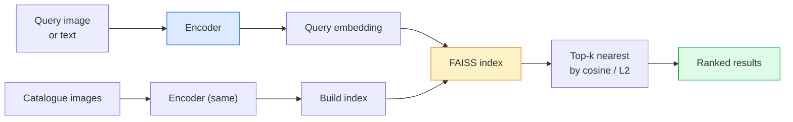

# Recuperación de imágenes y aprendizaje métrico.

> Un sistema de recuperación clasifica a los candidatos por la distancia en el espacio de incorporación.

> **【中文解读】**检索系统通过嵌入空间中的距离对候选图像排序――量学习就是塑造这个空间,使距离反映你想要的语义关系相似图像靠近,不相似图像离远――对比损失 (相对损失) 和三元组损失 (三元组损失) 是核心方法――

> **【拓展：检索系统的应用】**Es un ejemplo de la forma en que el aprendizaje de la persona se hace en el mundo de la información.

**Type:** Build | **类型:** 动手
**Languages:** Python | **语言:** Python
**Prerequisites:** Phase 4 Lesson 14 (ViT), Phase 4 Lesson 18 (CLIP) | **前置知识:** Phase 4 Lesson 14（ViT），Phase 4 Lesson 18（CLIP）
**Time:** ~45 minutes | **时间:** ~45 分钟

## Objetivos de aprendizaje

- Explica las pérdidas de aprendizaje métrico tripartito, contrastivo y basado en proxy y elige la correcta para un conjunto de datos dado
- Implementar correctamente la normalización de L2 y la similitud cosínica y auditar la diferencia entre la extracción de "el mismo artículo" y la "la misma clase"
- Construir un índice FAISS, consultarlo por texto e imagen, y reportar recall@K para un conjunto de consultas retenidas
- Utilice DINOv2, CLIP y SigLIP como columna vertebral de incorporación de venta libre y sepa cuándo gana cada uno

> **【中文解读】**El objetivo de aprendizaje enumera las capacidades centrales que debe dominarse después de completar la clase.


## El problema es la introducción del problema

La recuperación está en todas partes en la visión de producción: detección de duplicados, búsqueda de imágenes invertidas, búsqueda visual ("encontrar productos similares"), re-identificación de cara, re-ID de persona para vigilancia, coincidencia de nivel de instancia para el comercio electrónico. La pregunta del producto es siempre la misma: "dado esta imagen de consulta, clasifique mi catálogo".

> 检索在生产视觉中无处不在:重复检测、反向图像搜索、视觉搜索(" buscar productos similares") 的人脸重识别、监控人员重识别、电商实例级匹配── producto problema generalmente es el mismo:"

Dos decisiones de diseño dan forma a todo el sistema. La incorporación  qué modelo produce los vectores. El índice  cómo encontrar los vecinos más cercanos a escala. Ambos son productos básicos en 2026 (DINOv2 para la incorporación, FAISS para el índice), lo que eleva la barra: la parte difícil es definir *lo que cuenta como similar* para su aplicación, luego moldear el espacio de incorporación para que coincidan las distancias.

> Dos decisiones de diseño forman todo el sistema. Enmétese en el modelo que produce la velocidad. Enmétese en el tamaño de los modelos. Enmétese en el tamaño de los modelos. En 2026 se realizarán dos procesos de diseño.

Esa formación es el aprendizaje métrico. Es una disciplina pequeña pero de alto apalancamiento.

> La forma de formar es el aprendizaje de la medida.

## El concepto central.

> **【中文解读】**Este capítulo presenta los conceptos y teorías básicos. La comprensión de estos conceptos es el prerrequisito de la realización posterior de la actividad, y también el conocimiento de los puntos de alta frecuencia de la entrevista y la práctica de la ingeniería.


### Recuperación en un vistazo



### Las cuatro familias de pérdida

| Loss | Requires | Pros | Cons |
|------|----------|------|------|
| **Contrastive** | (anchor, positive) + negatives | Simple, works with any pair label | Slow to converge without many negatives |
| **Triplet** | (anchor, positive, negative) | Intuitive; direct margin control | Hard-triplet mining is expensive |
| **NT-Xent / InfoNCE** | Pairs + batch-mined negatives | Scales to large batches | Needs big batch or momentum queue |
| **Proxy-based (ProxyNCA)** | Class labels only | Fast, stable, no mining | Can overfit to proxies on small datasets |

Para la mayoría de los casos de uso de producción, comience con una columna vertebral preentrenada y añada una metric-apprenticio de ajuste sólo si las incorporaciones fuera de la plataforma no funcionan bien en su conjunto de pruebas.

>  Para la mayoría de las situaciones de producción, desde la red de formación preliminar, sólo cuando el contenido de la prueba se incrusta en su conjunto de pruebas no se desempeña bien se puede añadir la cantidad de aprendizaje.

### La pérdida de triplet formalmente

```
L = max(0, ||f(a) - f(p)||^2 - ||f(a) - f(n)||^2 + margin)
```

Tirar del anclaje`a`cerca de positivo `p`, empujarlo lejos de negativo `n`, con un `margin`La estructura de tres imágenes se generaliza a cualquier orden de similitud.

> ¿Qué es eso ?`a`拉近正样本                                                                                                                                                                                                                                                                                                                                                                                                                                                                                                                        `p`, , , , , , , , , , , , , , , , , , , , , , , , , , , , , , , , , , , , , , , , , , , , , , , , , , , , , , , , , , , , , , , , , , , , , , , , , , , , , , , , , , , , , , , , , , , , , , , , , , , , , , , , , , , , , , , , , , , , , , , , , , , , , , , , , , , , , , , , , , , , , , , , , , , , , , , , , , , , , , , , , , , , , , , , , , , , , , , , , , , , , , , , , , , , , , , , , , , , , , , , , , , , , , , , , , , , , , , , , , , , , , , , , , , , , , , , , , , , , , , , , , , , , , , , , , , , , , , , , , , , , , , , , , , , , , , , , , , , , , , , , , , , , , , , , , , , , , , , , , , , , , , , , , , , , , , , , , , , , , , , , , , , , , , , , , , , , , , , , , , , , , , , , , , , , , , , , , , y , , , , , ,`n`, usar `margin`确保间隔──三图像结构可推广到任何相似度排序──

En materia de minería: triple fácil (`n`Ya está lejos de`a`La industria de la minería semi-hard (`n`más allá de `p`pero dentro del margen) es la receta de 2016 de FaceNet y todavía domina.

> 挖掘很重要:简单三元组`n`Ya está lejos`a`• contribución cero pérdida; sólo dificultad`n`Más que`p`远但在边缘内) es el programa de FaceNet de 2016, que todavía ocupa el lugar dominante.

### Similaridad de cosinos vs L2

Dos métricas, dos convenciones:

> Dos tipos de medidas, dos tipos de reglas:

- **Cosine**Requiere incorporar L2 normalizados.
  En inglés:**余弦**:向量间角──需要 L2 归一化的嵌入──
- **L2**Funciona en embeddings crudos o normalizados, pero generalmente se empareja con L2 normalizado + L2 cuadrado.
  En inglés:**L2**: 欧氏距离;; se aplica a los emplazamientos originales o de regeneración, pero generalmente se usa en combinación con L2 归化 + 平方 L2 配对使用;;

Para la mayoría de las redes modernas, las dos son equivalentes: `||a - b||^2 = 2 - 2 cos(a, b)`¿ Cuándo ?`||a|| = ||b|| = 1`Elige la convención que coincida con tu entrenamiento de incorporación; mezclarlas silenciosamente cambia lo que significa "más cercano".

> 对于大多数现代网络,两者等价:当 `||a|| = ||b|| = 1`时,`||a - b||^2 = 2 - 2 cos(a, b)`                                                                                                                                                                                                                                                              

### Recall@K

La métrica de recuperación estándar:

```
recall@K = fraction of queries where at least one correct match is in the top K results
```

Reporte recall@1, @5, @10 lado a lado. Un recall@10 por encima de 0.95 con recall@1 por debajo de 0.5 significa que el espacio de incorporación tiene la estructura correcta pero el ranking es ruidoso  intente un tono fino más largo o un paso de re-ranking.

> Y排 report recall@1、@5、@10──recall@10 超过 0.95 pero recall@1 低于 0.5 significa que la estructura espacial está en el orden correcto pero el orden tiene ruido 尝试更长的微调或重排序步骤──

Para la detección duplicada, la precisión@K es más importante porque cada falso positivo es un error visible por el usuario.

> 对于重复检测,precision@K更重要,因为每假阳性都是用户可见的错误――对于视觉搜索,recall@K是产品信号――

### FAISS en un párrafo

La biblioteca de facto para la búsqueda de vecino más cercano. Tres opciones de índice:

> Facebook AI Similaridad de búsqueda.

- `IndexFlatIP`- ¿ Qué ?`IndexFlatL2` fuerza bruta, exacta, sin entrenamiento.
  En inglés:`IndexFlatIP`- ¿ Qué ?`IndexFlatL2` Buscar violento, preciso, sin necesidad de entrenamiento.
- `IndexIVFFlat` partición en células K, buscar sólo las células más cercanas. Aproximado, rápido, necesita datos de entrenamiento.
  En inglés:`IndexIVFFlat` divide en K 个单元, sólo busque las últimas unidades 近似、快速, necesita entrenamiento DATA。
- `IndexHNSW` basado en gráficos, más rápido para muchas consultas, gran tamaño de índice.
  En inglés:`IndexHNSW` Basado en gráficos, más consultas, más rápido, índice más grande.

Para 100 mil vectores que probablemente quieras`IndexFlatIP`Por 10M quieres`IndexIVFFlat`. para 100M+ combinados con la cuantificación del producto (`IndexIVFPQ`¿Qué es lo que se hace?

> 100.000 de volumen de uso .`IndexFlatIP`余弦相似度即可──10 millones de dólares `IndexIVFFlat`❖ 1 mil millones de personas más que la cantidad de`IndexIVFPQ`)。

### Recuperación a nivel de instancia frente a nivel de categoría

Dos problemas muy diferentes con el mismo nombre:

> Dos nombres idénticos pero muy diferentes problemas:

- **Category-level** "Encuentra gatos en mi catálogo". Similaridad condicional de clase; los embebidos CLIP / DINOv2 fuera de la plataforma funcionan bien.
  En inglés:**类别级**"En mi catálogo encontrar gatos"──类别条件相似度;现成的 CLIP / DINOv2 嵌入即可──
- **Instance-level** "Encuentra *este producto exacto* en mi catálogo". Necesita una discriminación de granos entre objetos visualmente similares de la misma clase; las incorporaciones fuera de la plataforma no funcionan bien; ajuste fino con las materias de aprendizaje métrico.
  En inglés:**实例级**"En mi catálogo encontrar* este producto específico*"── necesita una distinción de la gran cantidad entre los objetos similares a los mismos; el rendimiento de los emplazamientos en el presente no es bueno; la medida de aprendizaje es muy importante──

Siempre pregúntale cuál de ellas estás resolviendo antes de elegir un modelo.

> Antes de elegir el modelo, debes preguntar claramente cuál es el problema que estás resolviendo.

> **【中文解读】**Este capítulo a través del código de la implementación de algoritmos centrales de cero. Este método "desde cero" puede ayudar a entender el principio detrás del marco, no se encuentra en la caja negra cuando se encuentran problemas.

> **【拓展：工业部署中的视觉系统】**En la implementación industrial real, los modelos de visión necesitan considerar la posibilidad de retraso, el tamaño del modelo, la adaptación de los dispositivos de borde, etc. TensorRT, ONNX Runtime, OpenVINO son herramientas de aceleración de la teoría de uso habitual.

> **【拓展：数据标注与质量】**视觉任务的效果高度依赖标签数据质量──标签工作室、CVAT es la principal herramienta de marcado──在工业场景中,主动学习(Active Learning) puede reducir el costo de marcado: modelo a un requerimiento de muestras indeterminadas, marcación automática de muestras de determinación──


## Construye y realiza.
```figure
metric-embedding
```

## Construye el mismo

### Paso 1: pérdida de tripleto

```python
import torch
import torch.nn.functional as F

def triplet_loss(anchor, positive, negative, margin=0.2):
    d_ap = F.pairwise_distance(anchor, positive, p=2)
    d_an = F.pairwise_distance(anchor, negative, p=2)
    return F.relu(d_ap - d_an + margin).mean()
```

Funciona en embeddings normalizados o crudos L2.

> Una línea de código. Aplicable para L2 归一化或原始嵌入.

### Paso 2: Minería semihardida

Dado un lote de embebidos y etiquetas, encontrar el negativo semihardido más difícil para cada ancla.

> 给定一批嵌入和标签,为每个点找到最难的半困难负样本──

```python
def semi_hard_negatives(emb, labels, margin=0.2):
    dist = torch.cdist(emb, emb)
    same_class = labels[:, None] == labels[None, :]
    diff_class = ~same_class
    N = emb.size(0)

    positives = dist.clone()
    positives[~same_class] = float("-inf")
    positives.fill_diagonal_(float("-inf"))
    pos_idx = positives.argmax(dim=1)

    semi_hard = dist.clone()
    semi_hard[same_class] = float("inf")
    d_ap = dist[torch.arange(N), pos_idx].unsqueeze(1)
    semi_hard[dist <= d_ap] = float("inf")
    neg_idx = semi_hard.argmin(dim=1)

    fallback_mask = semi_hard[torch.arange(N), neg_idx] == float("inf")
    if fallback_mask.any():
        hardest = dist.clone()
        hardest[same_class] = float("inf")
        neg_idx = torch.where(fallback_mask, hardest.argmin(dim=1), neg_idx)
    return pos_idx, neg_idx
```

Cada ancla obtiene el positivo más duro en su clase y un negativo semiharde que está más lejos del positivo pero dentro del margen.

> Cada uno de los puntos obtenidos entre los más difíciles de la clase es el modelo real y uno es el más difícil de comparar con el modelo real, pero en el margen es el modelo negativo.

### Paso 3: Recuerdo@K

```python
def recall_at_k(query_emb, gallery_emb, query_labels, gallery_labels, k=1):
    sim = query_emb @ gallery_emb.T
    _, top_k = sim.topk(k, dim=-1)
    matches = (gallery_labels[top_k] == query_labels[:, None]).any(dim=-1)
    return matches.float().mean().item()
```

Top-k por producto interno en embeddings normalizados L2 es igual a top-k por cosino.

> L2 归结嵌入内积上-k等于余弦上-k―― informe al menos una proporción media de la consulta de los vecinos correcta―

### Paso 4: Reunirlo

```python
import torch
import torch.nn as nn
from torch.optim import Adam

class Encoder(nn.Module):
    def __init__(self, in_dim=128, emb_dim=64):
        super().__init__()
        self.net = nn.Sequential(
            nn.Linear(in_dim, 128), nn.ReLU(),
            nn.Linear(128, emb_dim),
        )

    def forward(self, x):
        return F.normalize(self.net(x), dim=-1)

torch.manual_seed(0)
num_classes = 6
protos = F.normalize(torch.randn(num_classes, 128), dim=-1)

def sample_batch(bs=32):
    labels = torch.randint(0, num_classes, (bs,))
    x = protos[labels] + 0.15 * torch.randn(bs, 128)
    return x, labels

enc = Encoder()
opt = Adam(enc.parameters(), lr=3e-3)

for step in range(200):
    x, y = sample_batch(32)
    emb = enc(x)
    pos_idx, neg_idx = semi_hard_negatives(emb, y)
    loss = triplet_loss(emb, emb[pos_idx], emb[neg_idx])
    opt.zero_grad(); loss.backward(); opt.step()
```

> **【中文解读】**Este capítulo muestra cómo utilizar un marco maduro (como PyTorch、HuggingFace, etc.) para aplicar rápidamente esta tecnología. En los proyectos reales, se realiza con prioridad el uso de un marco experimentado, se pueden reducir errores y mejorar la eficiencia de desarrollo.


Después de unos cientos de pasos los grupos de incorporación forman un grupo por clase.

> Después de unos cientos de pasos, se incrustó en la formación de cada clase una.


> **【拓展：视觉模型的持续学习】**En el entorno de producción, el modelo visual necesita adaptarse continuamente a nuevos datos. Esto es especialmente importante en la conducción automotriz y el control de calidad industrial.

## Usalo con el marco de ejecución

Estatuas de producción en 2026:

- **DINOv2 + FAISS** Recuperación visual de propósito general. Funciona fuera de la estantería.
- **CLIP + FAISS** cuando las consultas son mensajes de texto.
- **Fine-tuned DINOv2 + FAISS** Recuperación a nivel de instancia, re-identificación facial, moda, comercio electrónico.
- **Milvus / Weaviate / Qdrant** envases de DB de vectores gestionados alrededor de FAISS o HNSW.

> **【中文解读】**Este capítulo se centra en cómo se puede implementar el modelo como producto disponible. Desde el modelo original hasta el sistema de producción, se deben considerar múltiples dimensiones de optimización de rendimiento, tratamiento de errores, control, etc.


Para la recuperación de instancia SOTA, la receta es: DINOv2 espina dorsal, añadir una cabeza de embebimiento, ajustar a la perfección con un triplet o la pérdida InfoNCE en pares etiquetados con instancia, índice en FAISS.


## Envíe el producto .

> **【中文解读】**Practice los temas de fácil/medio/duro  3 difficulty to pass in  Recomenda al menos completar los temas de grado medio  Grado duro  para la preparación de la entrevista


Esta lección produce:

- `outputs/prompt-retrieval-loss-picker.md` una solicitud que selecciona el tripleto / InfoNCE / ProxyNCA para un problema de recuperación determinado.
- `outputs/skill-recall-at-k-runner.md` una habilidad que escribe un arnés de evaluación limpio para recall@K con tren/val/galería y contrato de datos adecuado.

## Los ejercicios.

1. **(Easy)**Ejecutar el ejemplo de juguete de arriba. trazar las incrustaciones con PCA antes y después del entrenamiento para ver los seis grupos se forman.
2. **(Medium)**Añadir una implementación de pérdida de ProxyNCA: uno aprendido "proxy" por clase, entropía cruzada estándar en la similitud cosina. Comparar la velocidad de convergencia vs pérdida de triplet en los datos de juguete.
3. **(Hard)**Tome 1.000 imágenes de validación de ImageNet, incrusta con DINOv2 a través de HuggingFace, construya un índice plano de FAISS, y informe recall@{1, 5, 10} contra las mismas imágenes que las consultas (deberían ser 1.0) y contra una división prolongada con las etiquetas de ImageNet como verdad de base.

> **【中文解读】**En el lenguaje de los términos "Lo que la gente dice" vs "Lo que realmente significa" se distingue entre el lenguaje diario y la definición técnica de significado.


## Términos clave .

| Term | What people say | What it actually means |
|------|----------------|----------------------|
| Metric learning | "Shape the space" | Training an encoder so distances in its output space reflect a target similarity |
| Triplet loss | "Pull and push" | L = max(0, d(a, p) - d(a, n) + margin); the canonical metric-learning loss |
| Semi-hard mining | "Useful negatives" | Negatives further from the anchor than the positive but within margin; empirically the most informative |
| Proxy-based loss | "Class prototypes" | One learned proxy per class; cross-entropy over similarity-to-proxies; no pair mining |
| Recall@K | "Top-K hit rate" | Fraction of queries with at least one correct result in the top K |
| Instance retrieval | "Find this exact thing" | Fine-grained matching; off-the-shelf features usually underperform |
| FAISS | "The NN library" | Facebook's nearest-neighbour library; supports exact and approximate indexes |
| HNSW | "Graph index" | Hierarchical navigable small world; fast approximate NN with small memory overhead |

> **【中文解读】**延伸阅读 proporciona un alto nivel de recursos para el aprendizaje profundo. Estos artículos y cursos son los referentes clásicos en el campo, adecuados para los lectores que necesitan una comprensión profunda.


## Más Leer más Leer más

- [FaceNet: A Unified Embedding for Face Recognition (Schroff et al., 2015)](https://arxiv.org/abs/1503.03832) la pérdida de triplet / papel minero semihardado
- [In Defense of the Triplet Loss for Person Re-Identification (Hermans et al., 2017)](https://arxiv.org/abs/1703.07737) Guía práctica para el ajuste del tripleto
- [FAISS documentation](https://github.com/facebookresearch/faiss/wiki) cada índice, cada compensación
- [SMoT: Metric Learning Taxonomy (Kim et al., 2021)](https://arxiv.org/abs/2010.06927) estudio de las pérdidas modernas y sus conexiones
