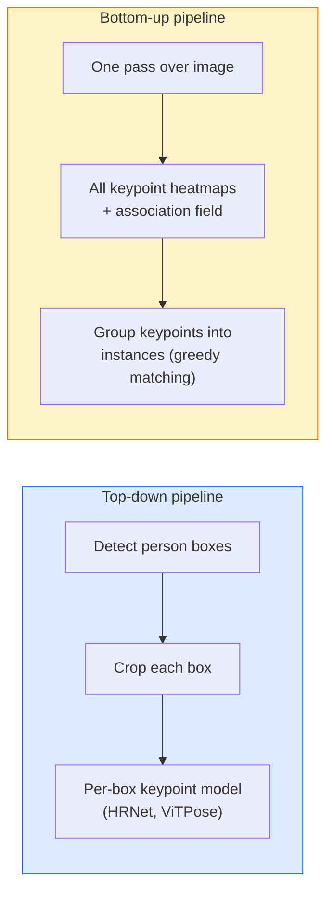

# Detección de puntos clave y estimación de posición .

> Una pose es un conjunto de puntos clave ordenados un detector de puntos clave es un regresor de mapas de calor todo lo demás es contabilidad

> **【中文解读】**姿态 es un conjunto de puntos clave ordenados (como el cuerpo humano) ∙ 关节点检测器 es un dispositivo de reflexión térmica para cada punto clave ∙ 姿态 estimation es un instrumento de reflexión térmica de cada punto clave ∙ 姿态 estimation es un instrumento de reflexión térmica de cada punto clave ∙ 姿态 estimation es un instrumento de reflexión térmica de cada punto de la mente humana.

> **【拓展：姿态估计的应用】**OpenPose、MediaPipe、YOLO-Pose es un instrumento de evaluación de posturas de uso habitual.

**Type:** Build | **类型:** 动手
**Languages:** Python | **语言:** Python
**Prerequisites:** Phase 4 Lesson 06 (Detection), Phase 4 Lesson 07 (U-Net) | **前置知识:** Phase 4 Lesson 06（目标检测），Phase 4 Lesson 07（U-Net）
**Time:** ~45 minutes | **时间:** ~45 分钟

## Objetivos de aprendizaje

- Distinguir la estimación de la posición de arriba hacia abajo y la de abajo hacia arriba y indicar cuándo se utiliza cada una
- mapas de calor de regresión para los puntos clave K con un objetivo Gaussian-per-punto clave y extraer las coordenadas de los puntos clave en la inferencia
- Explicar los campos de afinidad de la parte (PAF) y cómo las tuberías de abajo hacia arriba asocian los puntos clave en instancias
- Utilice MediaPipe Pose o MMPose para la estimación de los puntos clave de producción y comprenda su formato de salida

> **【中文解读】**El objetivo de aprendizaje enumera las capacidades centrales que debe dominarse después de completar la clase.


## El problema es la introducción del problema

Las tareas clave se ocultan bajo muchos nombres: pose humana (17 articulaciones corporales), puntos de referencia del rostro (68 o 478 puntos), mano (21 puntos), pose animal, pose de objetos robóticos, puntos de referencia de la anatomía médica.

> 关键点任务隐藏在许多名称下: 个体姿态(17 个体关节) 面部特征点(68 个点) 个部 (或 478 个点) 个手部 (或 21 个点)  动物姿态、机器人物体姿态、医学解剖标志── cada uno tiene la misma estructura:

La estimación de la posición es la base de la captura de movimiento, aplicaciones de fitness, análisis deportivo, control de gestos, animación, prueba de AR y captura robótica. El caso 2D está maduro; la posición 3D (estimar posiciones conjuntas en coordenadas mundiales desde una sola cámara) es la frontera de investigación actual.

> 姿態估算是动作捕捉,健身应用,运动分析,手势控制,动画,AR 试穿和机器人抓取的基础──2D 形态已经成熟;3D 姿态(Desde una sola fase 姿態估算世界坐标中的关节位置) es la vanguardia de la investigación actual──

La cuestión de la ingeniería es la escala. Una imagen única, una sola persona posee un problema de 20 ms.

> 工程问题是规模――单图片、单人姿态是一个20ms的问题――人群中30fps多人姿态是一个不同结构的不同问题――

## El concepto central.

> **【中文解读】**Este capítulo presenta los conceptos y teorías básicos. La comprensión de estos conceptos es el prerrequisito de la realización posterior de la actividad, y también el conocimiento de los puntos de alta frecuencia de la entrevista y la práctica de la ingeniería.


### De arriba hacia abajo vs abajo hacia arriba



- **Top-down** detectar primero a las personas, luego ejecutar un modelo de punto clave por persona en cada cultivo.
  En inglés:**自顶向下**Prime inspección del cuadro humano, luego para cada área de corte de la operación de un solo hombre.
- **Bottom-up** un pase hacia adelante predice todos los puntos clave más un campo de asociación; agruparlos. tiempo constante independientemente del tamaño de la multitud.
  En inglés:**自底向上** Una vez antes de la propagación predicción todos los puntos clave se suman a la propagación; luego se dividen en grupos.

Top-down (HRNet, ViTPose) es el líder de precisión; bottom-up (OpenPose, HigherHRNet) es el líder de rendimiento para escenas llenas de gente.

> Desde arriba hacia abajo (HRNet、ViTPose) es el líder de la precisión; desde abajo hacia arriba (OpenPose、HigherHRNet) es el líder de la capacidad de desbordamiento de la escena de abundancia.

### Regresión de la hoja de calor

En lugar de regredir `(x, y)`directamente, predicir un `H x W`mapa de calor por punto clave con una mancha gaussiana centrada en la ubicación real.

> No regreso directo`(x, y)`, sino para cada uno de los puntos clave`H x W`热力图, en el centro de la posición real colocar altos puntos.

```
target[k, y, x] = exp(-((x - cx_k)^2 + (y - cy_k)^2) / (2 sigma^2))
```

En la inferencia, el argmax de cada heatmap es la ubicación del punto clave prevista.

Por qué las mapas de calor funcionan mejor que la regresión directa: la estructura espacial de la red (mapa de características conv) se alinea naturalmente con la salida espacial.

> Por qué el calor es mejor que el regreso directo: la estructura espacial de la red (en inglés: network's spatial structure) se compara con el espacio de salida natural a la misma.

### Localización de subpixel

Argmax da coordenadas enteras. Para la precisión de sub píxeles, refina ajustando una parábola al argmax y sus vecinos, o utiliza el conocido offset `(dx, dy) = 0.25 * (heatmap[y, x+1] - heatmap[y, x-1], ...)`dirección.

> Argmax  d d d d d un conjunto de números. Para obtener la precisión de la imagen, se puede refinar la línea de polvo para el argmax y su área de proximidad.

### Los campos de afinidad de parte (PAF)

Para cada par de puntos clave conectados (por ejemplo, hombro izquierdo a codo izquierdo), predecir un campo de 2 canales que codifica el vector unitario que apunta de uno a otro. Para asociar un hombro con su codo, integra el PAF a lo largo de la línea que conecta pares candidatos; el par con la integral más alta se combina.

```
For each connection (limb):
  PAF channels: 2 (unit vector x, y)
  Line integral: sum over sample points of (PAF . line_direction)
  Higher integral = stronger match
```

Elegante y de escala a tamaños arbitrarios de multitud sin cultivos por persona.

### Puntos clave de COCO

El conjunto de datos estándar de posición corporal: 17 puntos clave por persona, PCK (Percentaje de puntos clave correctos) y OKS (Similaridad de puntos clave de objeto) como métricas. OKS es el análogo de puntos clave de IoU y es lo que COCO mAP@OKS informa.

> 标准人体姿态数据集:每人 17 个关键点,PCK(正确关键点百分比) y OKS(目标关键点相似度) como medida。OKS es el contenido del informe, es COCO mAP@OKS 报告的内容──

### 2D vs 3D

- **2D pose** Coordenadas de imagen; resueltas a la calidad de producción (MediaPipe, HRNet, ViTPose).
- **3D pose** coordenadas del mundo/camera; investigación activa todavía.
  - Eleva las predicciones 2D a 3D con un pequeño MLP (VideoPose3D).
  - Regresión 3D directa de la imagen (PyMAF, MHFormer).
  - Configuración de múltiples visualizaciones (CMU Panoptic) para la verdad de tierra.

> **【中文解读】**Este capítulo a través del código de la implementación de algoritmos centrales de cero. Este método "desde cero" puede ayudar a entender el principio detrás del marco, no se encuentra en la caja negra cuando se encuentran problemas.

> **【拓展：工业部署中的视觉系统】**En la implementación industrial real, los modelos de visión necesitan considerar la posibilidad de retraso, el tamaño del modelo, la adaptación de los dispositivos de borde, etc. TensorRT, ONNX Runtime, OpenVINO son herramientas de aceleración de la teoría de uso habitual.

> **【拓展：数据标注与质量】**视觉任务的效果高度依赖标签数据质量──标签工作室、CVAT es la principal herramienta de marcado──在工业场景中,主动学习(Active Learning) puede reducir el costo de marcado: modelo a un requerimiento de muestras indeterminadas, marcación automática de muestras de determinación──


## Construye y realiza.
```figure
cv3-pose-heatmap
```

## Construye el mismo

### Paso 1: meta de la mapa de calor de Gaussian

```python
import numpy as np
import torch

def gaussian_heatmap(size, cx, cy, sigma=2.0):
    yy, xx = np.meshgrid(np.arange(size), np.arange(size), indexing="ij")
    return np.exp(-((xx - cx) ** 2 + (yy - cy) ** 2) / (2 * sigma ** 2)).astype(np.float32)

hm = gaussian_heatmap(64, 32, 32, sigma=2.0)
print(f"peak: {hm.max():.3f} at ({hm.argmax() % 64}, {hm.argmax() // 64})")
```

Los mapas de calor por punto clave apilados a lo largo de un eje de canal dan el tensor objetivo completo.

> Cada punto clave de la energía térmica se acumula a lo largo de la vía, formando un objetivo completo.

### Paso 2: Tía de teclado pequeña

Un modelo de estilo U-Net que saca canales de mapas de calor K.

> Un modelo de U-Net, de salida K 个热力图通道.

```python
import torch.nn as nn
import torch.nn.functional as F

class TinyKeypointNet(nn.Module):
    def __init__(self, num_keypoints=4, base=16):
        super().__init__()
        self.down1 = nn.Sequential(nn.Conv2d(3, base, 3, 2, 1), nn.ReLU(inplace=True))
        self.down2 = nn.Sequential(nn.Conv2d(base, base * 2, 3, 2, 1), nn.ReLU(inplace=True))
        self.mid = nn.Sequential(nn.Conv2d(base * 2, base * 2, 3, 1, 1), nn.ReLU(inplace=True))
        self.up1 = nn.ConvTranspose2d(base * 2, base, 2, 2)
        self.up2 = nn.ConvTranspose2d(base, num_keypoints, 2, 2)

    def forward(self, x):
        h1 = self.down1(x)
        h2 = self.down2(h1)
        h3 = self.mid(h2)
        u1 = self.up1(h3)
        return self.up2(u1)
```

Ingreso `(N, 3, H, W)`, producción `(N, K, H, W)`La pérdida es MSE por píxel contra objetivos gaussianos.

### Paso 3: Inferencia  extraer las coordenadas de puntos clave

```python
def heatmap_to_coords(heatmaps):
    """
    heatmaps: (N, K, H, W)
    returns:  (N, K, 2) float coordinates in image pixels
    """
    N, K, H, W = heatmaps.shape
    hm = heatmaps.reshape(N, K, -1)
    idx = hm.argmax(dim=-1)
    ys = (idx // W).float()
    xs = (idx % W).float()
    return torch.stack([xs, ys], dim=-1)

coords = heatmap_to_coords(torch.randn(2, 4, 32, 32))
print(f"coords: {coords.shape}")  # (2, 4, 2)
```

Para refinar los subpixeles, interpolar alrededor de la argmax.

### Paso 4: conjunto de datos de puntos clave sintéticos

Es simple: dibujar cuatro puntos en un lienzo blanco y aprender a predecirlos.

```python
def make_synthetic_sample(size=64):
    img = np.ones((3, size, size), dtype=np.float32)
    rng = np.random.default_rng()
    kps = rng.integers(8, size - 8, size=(4, 2))
    for cx, cy in kps:
        img[:, cy - 2:cy + 2, cx - 2:cx + 2] = 0.0
    hms = np.stack([gaussian_heatmap(size, cx, cy) for cx, cy in kps])
    return img, hms, kps
```

Lo suficientemente fácil para que un modelo pequeño aprenda en un minuto.

### Paso 5: Formación

```python
model = TinyKeypointNet(num_keypoints=4)
opt = torch.optim.Adam(model.parameters(), lr=3e-3)

for step in range(200):
    batch = [make_synthetic_sample() for _ in range(16)]
    imgs = torch.from_numpy(np.stack([b[0] for b in batch]))
    hms = torch.from_numpy(np.stack([b[1] for b in batch]))
    pred = model(imgs)
    # Upsample pred to full resolution
    pred = F.interpolate(pred, size=hms.shape[-2:], mode="bilinear", align_corners=False)
    loss = F.mse_loss(pred, hms)
    opt.zero_grad(); loss.backward(); opt.step()
```

> **【中文解读】**Este capítulo muestra cómo utilizar un marco maduro (como PyTorch、HuggingFace, etc.) para aplicar rápidamente esta tecnología. En los proyectos reales, se realiza con prioridad el uso de un marco experimentado, se pueden reducir errores y mejorar la eficiencia de desarrollo.


> **【拓展：视觉模型的持续学习】**En el entorno de producción, el modelo visual necesita adaptarse continuamente a nuevos datos. Esto es especialmente importante en la conducción automotriz y el control de calidad industrial.

## Usalo con el marco de ejecución

- **MediaPipe Pose** Estimador de posición de producción de Google; envío de WebGL + móviles tiempos de ejecución con latencia de menos de 10ms.
- **MMPose**(OpenMMLab)  base de código de investigación integral; cada arquitectura SOTA con pesos preentrenados.
- **YOLOv8-pose** Posar en tiempo real más rápido con una sola pase hacia adelante.
- **transformers HumanDPT / PoseAnything** enfoques más nuevos del lenguaje de visión para la postura de vocabulario abierto (cualquier objeto, cualquier conjunto de puntos clave).

> **【中文解读】**Este capítulo se centra en cómo se puede implementar el modelo como producto disponible. Desde el modelo original hasta el sistema de producción, se deben considerar múltiples dimensiones de optimización de rendimiento, tratamiento de errores, control, etc.


## Envíe el producto .

> **【中文解读】**Practice los temas de fácil/medio/duro  3 difficulty to pass in  Recomenda al menos completar los temas de grado medio  Grado duro  para la preparación de la entrevista


Esta lección produce:

- `outputs/prompt-pose-stack-picker.md` un prompt que selecciona MediaPipe / YOLOv8-pose / HRNet / ViTPose dada la latencia, el tamaño de la multitud y la necesidad 2D vs 3D.
- `outputs/skill-heatmap-to-coords.md` una habilidad que escribe la rutina de sub-pixel de mapa de calor a la coordinación utilizada por cada modelo de pose de producción.

## Los ejercicios.

1. **(Easy)**Entrenar el pequeño modelo de puntos clave en el conjunto de datos sintético de 4 puntos.
2. **(Medium)**Añadir refinamiento de subpixel: dada la posición argmax, ajustar una parábola 1D a lo largo de x y y de los píxeles vecinos.
3. **(Hard)**Construir un conjunto de datos sintético de 2 personas donde cada imagen muestra dos instancias del patrón de 4 puntos clave. Ejecutar una línea de abajo hacia arriba con PAF que predica qué punto clave pertenece a qué instancia, y evaluar OKS.

> **【中文解读】**En el lenguaje de los términos "Lo que la gente dice" vs "Lo que realmente significa" se distingue entre el lenguaje diario y la definición técnica de significado.


## Términos clave .

| Term | What people say | What it actually means |
|------|----------------|----------------------|
| Keypoint | "A landmark" | A specific ordered point on an object (joint, corner, feature) |
| Pose | "The skeleton" | An ordered set of keypoints belonging to one instance |
| Top-down | "Detect then pose" | Two-stage pipeline: person detector + per-crop keypoint model; highest accuracy |
| Bottom-up | "Pose first, group later" | Single-pass all-keypoint prediction + grouping; constant time in crowd size |
| Heatmap | "Gaussian target" | H x W tensor per keypoint with peak at the true location; the preferred regression target |
| PAF | "Part Affinity Field" | 2-channel unit vector field encoding limb directions; used to group keypoints into instances |
| OKS | "Keypoint IoU" | Object Keypoint Similarity; the COCO metric for pose |
| HRNet | "High-Resolution Net" | The dominant top-down keypoint architecture; preserves high-res features throughout |

> **【中文解读】**延伸阅读 proporciona un alto nivel de recursos para el aprendizaje profundo. Estos artículos y cursos son los referentes clásicos en el campo, adecuados para los lectores que necesitan una comprensión profunda.


## Más Leer más Leer más

- [OpenPose (Cao et al., 2017)](https://arxiv.org/abs/1812.08008) de abajo hacia arriba con los PAF; todavía la mejor descripción del enfoque
- [HRNet (Sun et al., 2019)](https://arxiv.org/abs/1902.09212) la arquitectura de referencia de arriba hacia abajo
- [ViTPose (Xu et al., 2022)](https://arxiv.org/abs/2204.12484) ViT simple como columna vertebral de la postura; SOTA actual en muchos puntos de referencia
- [MediaPipe Pose](https://developers.google.com/mediapipe/solutions/vision/pose_landmarker) pose de producción en tiempo real; la pila más rápida desplegada en 2026
